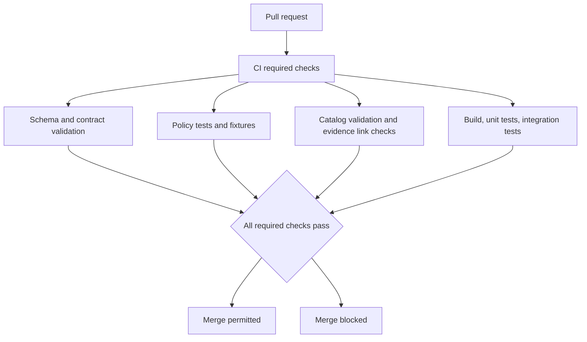
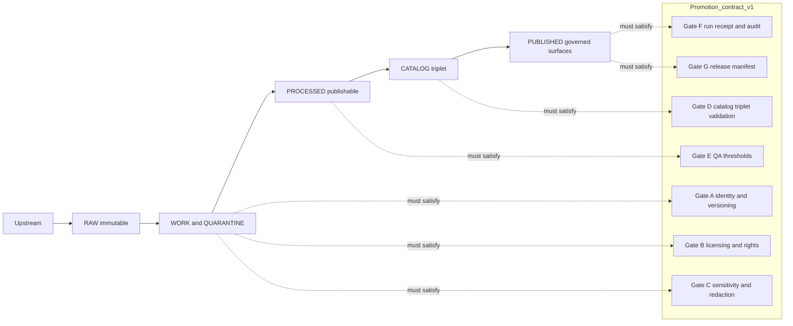
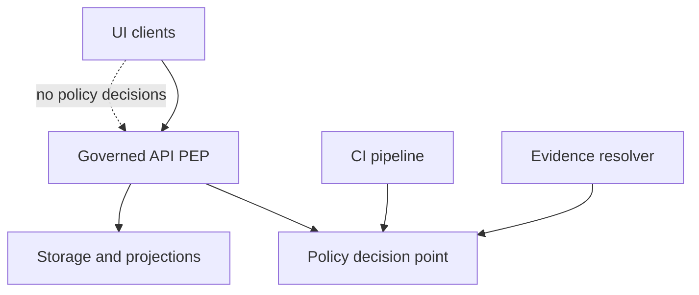

<!-- [KFM_META_BLOCK_V2]
doc_id: kfm://doc/7f3aa7c3-9d53-4c92-8f7e-89b7c26ed9d9
title: CI Diagrams
type: standard
version: v1
status: draft
owners: KFM Platform (TBD)
created: 2026-03-02
updated: 2026-03-02
policy_label: public
related:
  - docs/diagrams/tools/README.md
  - docs/diagrams/README.md
tags: [kfm, ci, diagrams, governance, policy-as-code, promotion-contract]
notes:
  - This directory is for human-readable CI diagrams that explain (and constrain) merge/publish behavior.
[/KFM_META_BLOCK_V2] -->

# CI Diagrams
Visual specifications for KFM CI gates that protect the truth path, trust membrane, and Promotion Contract.


**Directory:** `docs/diagrams/tools/ci/`

**What this is for:** diagrams that explain how CI blocks merges/promotions when governance requirements are unmet.  
**What this is NOT:** executable workflows, secrets, or runtime deployment config.

---

## Quick navigation
- [Purpose](#purpose)
- [Where this fits](#where-this-fits)
- [Diagram registry](#diagram-registry)
- [CI invariants](#ci-invariants)
- [Promotion Contract gates in CI](#promotion-contract-gates-in-ci)
- [How to update diagrams](#how-to-update-diagrams)
- [Conventions](#conventions)
- [Exclusions](#exclusions)

---

## Purpose
KFM is “evidence-first” and “policy-first,” which means CI is part of the trust membrane. These diagrams exist to:

- make **merge/publish gates auditable** (reviewers can see what *must* be true)
- keep CI semantics aligned with **runtime policy enforcement**
- provide a shared language for “what failed” when CI blocks a change

> **WARNING**
> If diagrams drift from CI implementation, the repo loses trust. Treat this folder as part of the production system.

---

## Where this fits
KFM’s architecture expects:
- a **truth path** lifecycle for data and artifacts (Upstream → RAW → WORK/QUARANTINE → PROCESSED → CATALOG → PUBLISHED)
- a **trust membrane** that ensures policy checks at every governed surface (CI, API, evidence resolver)

These diagrams are a *documentation layer* that supports those invariants by making CI behavior explicit.

---

## Diagram registry
This table is the authoritative index for this directory. Add new diagrams here when you add files.

| Diagram file | Answers | Primary audience | Status |
|---|---|---:|---|
| `ci-pr-required-checks.mmd` | “What blocks a merge?” | contributors, reviewers | TODO |
| `ci-policy-as-code-parity.mmd` | “How do CI and runtime share policy semantics?” | platform, policy | TODO |
| `ci-promotion-contract-gates.mmd` | “What gates block promotion to PUBLISHED?” | stewards, operators | TODO |
| `ci-catalog-linkcheck.mmd` | “How do we prevent broken EvidenceRefs / catalog links?” | data eng, GIS | TODO |
| `ci-receipts-and-attestations.mmd` | “What must a run receipt contain and how is it validated?” | platform, security | TODO |

> **TIP**
> If you only add one diagram first: start with `ci-pr-required-checks.mmd` and keep it small and accurate.

---

## CI invariants
These are **requirements** the CI system must preserve (and the diagrams must model):

1. **Policy parity (CI ↔ runtime)**  
   CI must use the same policy semantics as runtime (or at least the same fixtures + expected outcomes). Otherwise CI guarantees are meaningless.

2. **Trust membrane remains intact**  
   - clients must not access storage directly
   - the UI must not make policy decisions
   - governed surfaces (CI, API, evidence resolver) enforce policy

3. **Evidence and catalogs are contract surfaces**  
   CI should fail closed when catalogs do not validate or cross-links break (because evidence cannot reliably resolve).

---

## Promotion Contract gates in CI
Promotion to **PUBLISHED** must be blocked unless the **Promotion Contract** gates are satisfied. The *exact implementation* can vary, but the **gates and their intent must be visible** in diagrams and CI output.

### Gate matrix (minimum set)
| Gate | What must be present | Typical CI signal |
|---|---|---|
| **A — Identity & versioning** | stable dataset identifiers, deterministic spec hash, content digests | schema + golden tests |
| **B — Licensing & rights** | license/rights metadata + terms snapshot | fail if missing/unknown |
| **C — Sensitivity & redaction plan** | policy label + obligations when needed | policy tests; deny-by-default |
| **D — Catalog triplet validation** | DCAT/STAC/PROV validate and cross-link | validators + linkcheck |
| **E — QA & thresholds** | dataset QA reports and thresholds met | quarantine on failure |
| **F — Run receipt & audit record** | receipt captures inputs, tooling, hashes, policy decisions | receipt schema validation |
| **G — Release manifest** | promotion recorded with artifact refs + digests | manifest exists + matches |

---

## Diagrams
The README includes compact “at-a-glance” diagrams. The detailed versions should live as standalone `.mmd` files referenced in the registry.

### PR merge gate overview


### Truth path and promotion gates


### Policy-as-code parity


---

## How to update diagrams
1. **Change the minimal diagram(s)** needed to reflect the new behavior.
2. **Update the Diagram registry** row (file name, purpose, status).
3. If the change affects gate semantics:
   - add or update an ADR / governance note (outside this directory)
   - ensure CI output becomes **more explainable**, not less
4. Keep diagrams **small and testable**: each diagram should have a clear “what fails closed” story.

### Definition of Done for a diagram update
- [ ] Diagram matches current CI behavior (no “wishful gates”)
- [ ] Diagram registry updated
- [ ] Any new gate has a corresponding validator/policy test (or is explicitly marked as planned)
- [ ] No sensitive details (secrets, internal endpoints, or restricted dataset examples)

---

## Conventions
**Preferred formats**
- Mermaid (`.mmd` or `.md` with ` ```mermaid ` blocks)
- SVG exports (only when Mermaid cannot express the diagram)

**Naming**
- `ci-<topic>.mmd` (kebab-case)
- Keep file names stable; use Git history for change tracking

**Scope rules**
- Diagrams describe **invariants and gates**, not implementation trivia.
- Avoid binding to one CI vendor unless necessary.

---

## Exclusions
Do **not** put the following here:
- `.github/workflows/*` (executable workflows/config)
- secrets, tokens, kubeconfigs, or service account details
- run logs / receipts (those belong with the relevant run artifacts)
- large binary diagrams without a source format (no “mystery PNGs”)

---

## Directory tree (expected)
```text
docs/diagrams/tools/ci/
  README.md
  ci-pr-required-checks.mmd            # TODO
  ci-policy-as-code-parity.mmd         # TODO
  ci-promotion-contract-gates.mmd      # TODO
  ci-catalog-linkcheck.mmd             # TODO
  ci-receipts-and-attestations.mmd     # TODO
```
