<!-- [KFM_META_BLOCK_V2]
doc_id: kfm://doc/8a6f1b2d-6a13-4b4c-a8c8-4e7f2b9d1b7a
title: Lint Diagrams
type: standard
version: v1
status: draft
owners: kfm-platform (TODO)
created: 2026-03-02
updated: 2026-03-02
policy_label: public
related:
  - ../../../../.github/workflows/ (TODO: actual CI path)
  - ../../../../scripts/ (TODO: actual lint script path if any)
  - ../../../../tools/ (TODO: validators/linkcheck/hash tools)
tags: [kfm, diagrams, tools, lint, ci]
notes:
  - This folder documents the lint gate and its role in KFM promotion gates.
  - Keep this doc tool-agnostic; link to the actual config files elsewhere.
[/KFM_META_BLOCK_V2] -->

<a id="top"></a>

# KFM Lint Diagrams
**Purpose:** diagrams + runbook notes for the *lint* gate used in CI and local developer workflows.


---

## Quick nav
- [Purpose](#purpose)
- [Where this fits](#where-this-fits)
- [Directory contract](#directory-contract)
- [Lint in the CI gates](#lint-in-the-ci-gates)
- [Run locally](#run-locally)
- [Diagram inventory](#diagram-inventory)
- [Change checklist](#change-checklist)
- [Appendix](#appendix)

---

## Purpose
This directory exists to keep the “lint gate” **explainable, reviewable, and stable**:

- A shared picture of *where lint runs* (CI + local).
- A canonical diagram of *what lint blocks* (fail-closed posture).
- Minimal, tool-agnostic guidance for maintainers when lint rules or scope changes.

> NOTE: This folder documents the lint gate. It does **not** own the linter configuration.

---

## Where this fits
- `docs/diagrams/` is for **diffable diagrams** that explain KFM architecture and tooling.
- `docs/diagrams/tools/lint/` is specifically for the **lint + typecheck** gate in the CI “validate” job and its local equivalent.

---

## Directory contract

### Acceptable inputs
- Mermaid diagrams in Markdown (`README.md` or separate `*.mmd` / `*.md` files)
- Optional exported images (`.svg` preferred) **if** you need embedding outside Mermaid-rendering platforms
- Short notes that explain invariants and reviewer expectations

### Exclusions
Do **not** put the following here:
- Linter configs (`.eslintrc*`, `tsconfig*`, formatter configs, etc.)
- Build artifacts, coverage reports, or CI logs
- “How to fix lint errors” tutorials for specific rules (those belong near the rule/config owner)

---

## Lint in the CI gates

### High-level intent
Lint runs early to catch:
- style issues,
- unsafe patterns,
- obvious bugs,
- and “typecheck” failures (when the repo defines a typecheck script).

### Gate placement (conceptual)

```mermaid
flowchart LR
  Dev[Developer] --> PR[Pull Request]
  PR --> CI[CI validate job]
  CI --> Lint[Lint + typecheck gate]
  Lint --> Tests[Unit tests]
  Tests --> Cat[Catalog validators]
  Cat --> Links[Linkcheck citations]
  Links --> Policy[Policy tests]
  Policy --> Drift[Spec hash drift check]
  Drift --> Evidence[Evidence resolver contract tests]
  Evidence --> Focus[Optional Focus Mode eval]
  Focus --> Merge[Merge allowed]
```


### What “fail closed” means here
- If lint/typecheck fails, the validate job should stop the promotion path for that change.
- Any “ignore” or “disable” must be reviewed like a policy change: justify, scope narrowly, and keep it reversible.

> WARNING: Treat broad disables (e.g., disabling a rule repo-wide) as a governance risk. Prefer the smallest possible scope.

---

## Run locally

### Fast path
```bash
npm run lint
npm run typecheck
```

### CI-like path (recommended before opening a PR)
```bash
npm ci
npm run lint
npm run typecheck
npm test
```

> TIP: If you’re changing lint rules, run lint on both the touched package/module and at the repo root (if applicable).

---

## Diagram inventory

> NOTE: This list is intentionally small. Add more diagrams only when they prevent repeated confusion in PR reviews.

| Artifact | Status | What it explains |
|---|---:|---|
| `README.md` | ✅ | Lint gate intent, placement, invariants, and how to update diagrams |
| `lint-gate-flow.mmd` | TODO | Standalone mermaid source for CI lint placement (if we need reuse elsewhere) |
| `lint-scope-map.mmd` | TODO | Which code areas are linted (monorepo/package scoping) |
| `assets/` | TODO | Optional exported SVGs for non-Mermaid renderers |

---

## Change checklist

### When you change lint behavior, update:
- [ ] The CI workflow ordering (if lint moved or split)
- [ ] This README’s “Lint in the CI gates” diagram (if ordering changes)
- [ ] Any referenced diagram sources (`*.mmd`) and exported assets (if used)
- [ ] A short note in the PR description: *why the lint gate changed* and *how to roll it back*

### Review heuristics (what reviewers should ask)
- Does this increase or decrease the chance of unsafe bypasses?
- Is the change scoped (package, folder, rule) or global?
- Is there an explicit rationale and rollback plan?
- Does it align with KFM’s “fail closed” posture for promotion gates?

---

## Appendix

<details>
<summary>Optional: keeping Mermaid diagrams portable</summary>

If a diagram needs to render outside GitHub’s Mermaid support:
- keep Mermaid as the **source of truth**
- export to **SVG** (preferred) and store in `assets/`
- embed the SVG in Markdown with alt text

</details>

<details>
<summary>Optional: lint gate “ownership” guidance</summary>

**Owner responsibilities (proposed):**
- keep lint fast (developer feedback loop)
- keep lint deterministic (avoid environment-dependent rules)
- prefer additive changes (new rule + autofix) over broad rewrites
- treat disables as exceptions, with justification

</details>

---

<a href="#top">Back to top</a>
