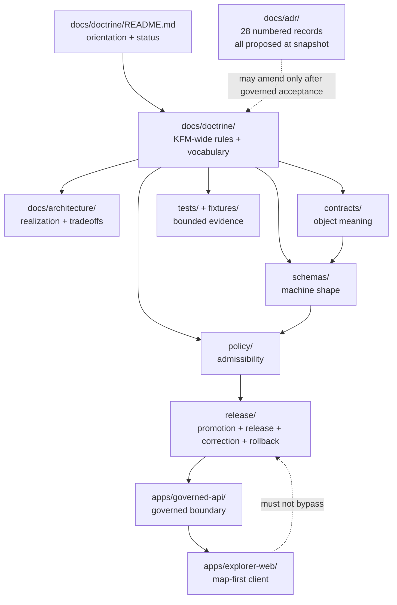

<!-- [KFM_META_BLOCK_V2]
doc_id: kfm://doc/doctrine/readme
title: docs/doctrine/ — Doctrine Landing Page
type: readme
subtype: directory-landing-page
version: v0.3
prior_version: v0.2
status: active; repository-grounded; documentation-only; non-authoritative
owner: "NEEDS VERIFICATION — CODEOWNERS routes /docs/doctrine/ to @bartytime4life; no accepted docs-steward assignment, required-review rule, or independent approval control was verified"
created: 2026-05-18
updated: 2026-07-23
policy_label: public
current_path: docs/doctrine/README.md
owning_root: docs/
responsibility: orient readers to KFM-wide doctrine, distinguish doctrine from adjacent authority surfaces, and expose current documentation conflicts without deciding them
truth_posture: cite-or-abstain
truth_labels: [CONFIRMED, PROPOSED, UNKNOWN, NEEDS VERIFICATION, CONFLICTED]
authority_class: directory landing page
authority_rank: subordinate to the doctrine documents it indexes
canonical_relationship: same-path update; no sibling authority created
evidence_snapshot:
  repository: bartytime4life/Kansas-Frontier-Matrix
  base_ref: main
  base_commit: b960e0988a0365a35ab4eb405ff8d19a56a5f196
  target_prior_blob: 4db8bac2ca2fb139bebf50affe77c68c4397b424
  directory_rules_blob: 2affb080e6f0043867c64c7f06c1ca52030fbd55
  codeowners_blob: dd2a84aa514d8ecd9208bc347f90f9a2ed37dd61
  adr_index_blob: cf08fae322ac53426f7394d97897fdb942253049
related:
  - docs/doctrine/directory-rules.md
  - docs/doctrine/authority-ladder.md
  - docs/doctrine/evidence-first.md
  - docs/doctrine/lifecycle-law.md
  - docs/doctrine/trust-membrane.md
  - docs/doctrine/truth-posture.md
  - docs/doctrine/derived-stays-derived.md
  - docs/doctrine/encyclopedia.md
  - docs/doctrine/ai-build-operating-contract.md
  - docs/adr/INDEX.md
  - docs/architecture/maplibre.md
  - docs/registers/DRIFT_REGISTER.md
  - docs/registers/VERIFICATION_BACKLOG.md
  - control_plane/document_registry.yaml
notes:
  - "v0.3 is a repository-grounded same-path modernization. It preserves the landing-page role and stable anchors while correcting stale path-presence claims, dead links, ownership language, ADR status, renderer references, and validation claims."
  - "No doctrine, contract, schema, policy, runtime, release, promotion, or publication state changes in this update."
  - "truth-posture.md and trust-membrane.md were verified at the same blob SHA; this README records the identity conflict rather than treating them as independent doctrine."
  - "The repository link-check and docs-build workflows remain explicit holds; this revision claims bounded source validation, not host-render validation."
[/KFM_META_BLOCK_V2] -->

# `docs/doctrine/`

> **The reader-facing entry point to KFM-wide invariants, vocabulary, authority boundaries, and change discipline.**

> [!IMPORTANT]
> **This README orients; it does not decide.** Doctrine states KFM-wide rules. ADRs record architecture decisions. Contracts define meaning, schemas define machine shape, policy decides admissibility, tests provide bounded evidence, and `release/` owns release decisions. A badge, diagram, commit, pull request, or polished page is not proof of implementation, approval, release, or publication.

> [!WARNING]
> **Current conflict:** [`truth-posture.md`](./truth-posture.md) and [`trust-membrane.md`](./trust-membrane.md) resolve to the same blob at the pinned snapshot, and both contain the **Trust Membrane** document. Treat `truth-posture.md` as `CONFLICTED`, not as an independent doctrine source, until that identity is corrected or governed as an intentional mirror.

**Quick navigation:** [Purpose](#purpose) · [Authority](#authority-level) · [Status](#status) · [Belongs](#what-belongs-here) · [Exclusions](#what-does-not-belong-here) · [Inputs](#inputs) · [Outputs](#outputs) · [Validation](#validation) · [Review](#review-burden) · [Related](#related-folders) · [ADRs](#adrs) · [Last reviewed](#last-reviewed) · [Documents](#documents-in-this-folder) · [Doctrine map](#doctrine-map) · [Change discipline](#change-discipline) · [Open verification](#open-questions--needs-verification)

---

## Purpose

`docs/doctrine/` is the human-facing doctrine lane inside the canonical `docs/` responsibility root. It holds a small, stable set of KFM-wide rules that constrain every domain, app, package, pipeline, public surface, and release process.

| Question | Current reader path |
|---|---|
| What ranks above what when evidence conflicts? | [`authority-ladder.md`](./authority-ladder.md) |
| What must support a consequential claim? | [`evidence-first.md`](./evidence-first.md) |
| How must material move before it can be public? | [`lifecycle-law.md`](./lifecycle-law.md) |
| What may cross the governed public boundary? | [`trust-membrane.md`](./trust-membrane.md) |
| Why do maps, tiles, indexes, summaries, and AI outputs remain derivative? | [`derived-stays-derived.md`](./derived-stays-derived.md) |
| Where do files belong? | [`directory-rules.md`](./directory-rules.md) |
| What does a KFM term mean, and which document owns it? | [`encyclopedia.md`](./encyclopedia.md) |
| What is the truth-posture file status? | [`truth-posture.md`](./truth-posture.md) — **CONFLICTED duplicate** |

This landing page is navigation and status disclosure. It does not become doctrine merely because it lives beside doctrine.

[Back to top](#top)

---

## Authority level

| Field | Current posture |
|---|---|
| **Responsibility root** | `docs/` — human-facing control plane |
| **Folder role** | KFM-wide invariants, stable vocabulary, and doctrine-level change rules |
| **This file** | Directory landing page; subordinate to the documents it indexes |
| **What may amend doctrine** | A reviewed, unsuperseded decision that explicitly identifies the doctrine changed and preserves lineage |
| **What does not amend doctrine** | This README, a proposed ADR, a domain dossier, repository convention alone, model output, badge, commit, or pull request |
| **Publication authority** | None. This folder cannot approve policy, promote lifecycle material, release artifacts, or publish claims |

The current ADR index records all 28 numbered ADRs as effective status `proposed`; this README therefore describes none as accepted.

[Back to top](#top)

---

## Status

| Surface | Finding at `main@b960e098…` | Safe conclusion |
|---|---|---|
| This README | **CONFIRMED present**, prior blob `4db8bac…` | Same-path v0.3 modernization |
| Core doctrine paths | **CONFIRMED present** for Directory Rules, Authority Ladder, Evidence First, Lifecycle Law, Trust Membrane, Derived Stays Derived, and Doctrine Encyclopedia | Presence is not adoption; each inspected file declares draft status |
| `truth-posture.md` | **CONFIRMED path; CONFLICTED identity** | Byte-identical to `trust-membrane.md` |
| `ai-build-operating-contract.md` | **CONFIRMED path; CONFLICTED role** | Current H1 is a Markdown authoring-agent prompt that names a proposed home under `docs/prompts/` |
| CODEOWNERS | **CONFIRMED** route `/docs/doctrine/ @bartytime4life` | Review routing exists; stewardship and enforced approval remain separate |
| ADR index | **CONFIRMED** 28 numbered records | Every numbered record is currently `proposed` |
| `docs-build` | **Explicit workflow hold** | No accepted generator, preview artifact, or publication handoff |
| `link-check` | **Explicit workflow hold** | No repository-native link or anchor validation currently runs |

**Overall posture:** active folder; mixed draft documents; visible unresolved conflicts; no implementation, review, release, or publication state inferred.

[Back to top](#top)

---

## What belongs here

- KFM-wide invariants that constrain every domain and public surface.
- Stable doctrine vocabulary shared across contracts, schemas, policy, tests, and releases.
- RFC 2119-style rules where normativity matters.
- Evidence, authority, public-boundary, lifecycle, correction, and rollback doctrine.
- A bounded landing page that points to doctrine without duplicating it.

A document that applies only to one app, package, domain, source, workflow, or operational procedure normally belongs in that responsibility lane.

## What does NOT belong here

| Content | Owning surface |
|---|---|
| Architecture decisions | [`docs/adr/`](../adr/) |
| System and subsystem design | [`docs/architecture/`](../architecture/) |
| Domain manuals | `docs/domains/<domain>/` |
| Focus Mode plans | `docs/focus-modes/<area>-<scope>/` |
| Runbooks, governance procedures, and registers | `docs/runbooks/`, `docs/governance/`, [`docs/registers/`](../registers/) |
| Machine authority maps | [`control_plane/`](../../control_plane/) |
| Object meaning, machine shape, admissibility, enforceability | [`contracts/`](../../contracts/), [`schemas/`](../../schemas/), [`policy/`](../../policy/), [`tests/`](../../tests/) |
| Lifecycle material, receipts, proofs, catalogs, published artifacts | `data/` |
| Promotion, release, correction, withdrawal, rollback decisions | `release/` |
| Prompt drafts whose primary role is tool instruction | `docs/prompts/` when approved |

> [!CAUTION]
> Documentation can explain a governed object or decision; it cannot substitute for the owning ADR, contract, schema, policy decision, test evidence, evidence bundle, promotion record, release manifest, correction notice, or rollback target.

[Back to top](#top)

---

## Inputs

Admissible inputs include current repository evidence, accepted decisions that amend doctrine, doctrine-ranked sources with provenance, steward-reviewed corrections, and authoritative external material whose scope, currency, rights, and role are recorded.

Generated prose, planning artifacts, issue comments, badges, and repository convention alone do not become doctrine. AI may assist interpretation and drafting; it is not truth or approval authority.

## Outputs

Doctrine emits constraints and vocabulary for architecture, contracts, schemas, policy, tests, lifecycle controls, governed APIs, public clients, and correction/rollback procedures. It emits no release artifact and cannot promote anything to `PUBLISHED`.

[Back to top](#top)

---

## Validation

| Check | Result for v0.3 |
|---|---|
| Directory Rules README contract | **PASS** — first twelve H2 sections follow Purpose → Last reviewed |
| Same-path identity | **PASS** — no rename, move, sibling README, or parallel authority |
| Heading structure | **PASS** — one H1; legacy `#scope` alias retained |
| Internal file links and badge destinations | **PASS** by bounded checks against the pinned snapshot |
| Local anchors | **PASS** by source inspection |
| Mermaid source | **PASS** as source; host rendering not run |
| Repository `link-check` | **NOT RUN / HOLD** — its workflow states that no links or anchors are checked |
| Repository `docs-build` | **NOT RUN / HOLD** — no accepted generator or preview handoff |
| Current PR checks | **PENDING** until GitHub records runs for the PR commit |

These checks do not prove doctrine adoption, implementation, policy approval, source authority, evidence closure, release, publication, or rollback readiness.

[Back to top](#top)

---

## Review burden

- `.github/CODEOWNERS` routes this path to `@bartytime4life`.
- That route is not a StewardshipAssignment, ReviewRecord, branch-protection rule, independent approval, release approval, or publication authority.
- Substantive doctrine changes require the affected doctrine owners and subsystem reviewers; this v0.3 change alters no doctrine.
- Do not self-approve, auto-merge, release, deploy, or publish from this documentation change.

[Back to top](#top)

---

## Related folders

| Path | Relationship |
|---|---|
| [`../README.md`](../README.md) | `docs/` root orientation |
| [`../adr/INDEX.md`](../adr/INDEX.md) | Numbered ADR inventory and effective-status crosswalk |
| [`../architecture/maplibre.md`](../architecture/maplibre.md) | Verified MapLibre architecture entry point |
| [`../registers/DRIFT_REGISTER.md`](../registers/DRIFT_REGISTER.md) | Human drift log |
| [`../registers/VERIFICATION_BACKLOG.md`](../registers/VERIFICATION_BACKLOG.md) | Open verification register |
| [`../../control_plane/document_registry.yaml`](../../control_plane/document_registry.yaml) | Machine document-registry scaffold; not a complete doctrine inventory |
| [`../../contracts/README.md`](../../contracts/README.md) | Semantic contract root |
| [`../../schemas/README.md`](../../schemas/README.md) | Machine-shape root |
| [`../../policy/README.md`](../../policy/README.md) | Policy root |
| [`../../tests/README.md`](../../tests/README.md) | Enforceability root |
| [`../../apps/governed-api/README.md`](../../apps/governed-api/README.md) | Governed client boundary documentation |
| [`../../apps/explorer-web/README.md`](../../apps/explorer-web/README.md) | Map-first client documentation |

[Back to top](#top)

---

## ADRs

| ADR | Subject | Effective status |
|---|---|---|
| [`ADR-0001`](../adr/ADR-0001-schema-home--schemas-contracts-v1-is-canonical.md) | `schemas/contracts/v1/` as default schema home | `proposed` |
| [`ADR-0003`](<../adr/ADR-0003-policy-singular-is-canonical-(policies-is-compatibility).md>) | `policy/` singular as canonical | `proposed` |
| [`ADR-0007`](<../adr/ADR-0007 — MapLibre GL JS Is the Sole Browser-Side Renderer.md>) | MapLibre GL JS as sole browser-side renderer | `proposed` |
| [`ADR index`](../adr/INDEX.md) | 28 numbered records plus unassigned scaffolds | all numbered records `proposed` |

A README or index cannot promote an ADR. A doctrine-changing PR must cite the exact decision, amended text, supersession path, and rollback/correction consequence.

[Back to top](#top)

---

## Last reviewed

**2026-07-23** — v0.3 repository-grounded same-path modernization.

Older than six months: flag for review under [`directory-rules.md` §15](./directory-rules.md#15-required-readme-contract).

| Edition | Date | Change |
|---|---|---|
| **v0.3** | 2026-07-23 | Reconciled path presence and status, preserved stable anchors, exposed identity conflicts, repaired links, aligned the folder-README section order, replaced placeholder claims with evidence-bearing status, and documented real workflow holds. **No doctrine changed.** |
| **v0.2** | 2026-05-25 | Added meta block, top anchor, doctrine encyclopedia row, renderer context, badges, and expanded open questions. |
| **v0.1** | Undated | Initial landing page. |

[Back to top](#top)

---

## Documents in this folder

This is a bounded reader inventory, not a complete recursive tree claim.

| File | Role | Repository-grounded status |
|---|---|---|
| [`directory-rules.md`](./directory-rules.md) | Placement and migration doctrine | **CONFIRMED**, v1.4 `draft` |
| [`authority-ladder.md`](./authority-ladder.md) | Evidence and decision tiers | **CONFIRMED**, v1.1 `draft` |
| [`evidence-first.md`](./evidence-first.md) | Cite-or-abstain and evidence closure | **CONFIRMED**, v1.1 `draft` |
| [`lifecycle-law.md`](./lifecycle-law.md) | Governed lifecycle | **CONFIRMED**, v1.1 `draft` |
| [`trust-membrane.md`](./trust-membrane.md) | Public-boundary doctrine | **CONFIRMED**, v1 `draft` |
| [`truth-posture.md`](./truth-posture.md) | Intended truth-posture document | **CONFLICTED** — duplicate Trust Membrane bytes |
| [`derived-stays-derived.md`](./derived-stays-derived.md) | Derivative-surface doctrine | **CONFIRMED**, v1.0 `draft` |
| [`encyclopedia.md`](./encyclopedia.md) | Doctrine vocabulary index | **CONFIRMED**, v0.1 `draft` |
| [`ai-build-operating-contract.md`](./ai-build-operating-contract.md) | Path implies AI operating contract | **CONFLICTED** — current content is a Markdown authoring-agent prompt |

File presence, an H1, version label, or self-declared status does not prove adoption, implementation, enforcement, CI success, release, or publication.

[Back to top](#top)

---

## Doctrine map

The diagram expresses responsibility boundaries, not runtime proof. A proposed ADR does not amend doctrine because it appears here.

[Back to top](#top)

---

## Change discipline

| Change | Required treatment |
|---|---|
| Typo, dead-link repair, stale status correction, navigation improvement | Routine scoped PR |
| Clarify existing doctrine without changing meaning | Scoped PR; preserve anchors and sources |
| Add, remove, rename, or reverse a KFM-wide invariant | ADR + explicit amendment + supersession + drift handling |
| Move or rename a doctrine file | Directory Rules preflight + inbound-link inventory + migration/rollback |
| Promote a draft or proposed record | Reviewed status change in the owning record and indexes; never inferred here |
| Retire doctrine | Supersession target, preserved lineage, correction path, rollback plan |

Prefer the smallest useful reversible delta. Presentation must project evidence, not manufacture maturity.

[Back to top](#top)

---

## Open questions / NEEDS VERIFICATION

1. **CONFLICTED — truth-posture identity.** Restore a distinct document, declare a mirror, or retire a path through reviewed migration.
2. **CONFLICTED — AI operating-contract identity.** Reconcile filename, H1, doc ID, authority class, proposed home, and inbound links.
3. **NEEDS VERIFICATION — complete inventory.** Run a recursive doctrine inventory and duplicate-content scan without promoting drafts.
4. **NEEDS VERIFICATION — ownership.** CODEOWNERS routing does not establish stewardship, branch rules, or independent approval.
5. **NEEDS VERIFICATION — link/render enforcement.** `link-check` and `docs-build` remain explicit holds.
6. **CONFLICTED — renderer docs.** `docs/architecture/maplibre.md` and proposed ADR-0007 exist; repeatedly referenced `docs/architecture/maplibre-3d.md` does not at the snapshot.
7. **NEEDS VERIFICATION — registry coverage.** `control_plane/document_registry.yaml` is a narrow scaffold, not a complete doctrine inventory.
8. **OPEN — encyclopedia relationship.** Resolve the rank and maintenance relationship between `docs/doctrine/encyclopedia.md` and `docs/encyclopedia/`.

[Back to top](#top)

---

This file is a navigation and status surface. When it conflicts with an owning doctrine document, reviewed decision, contract, schema, policy, test evidence, or release record, use the owning authority, record the conflict, and correct this README.
