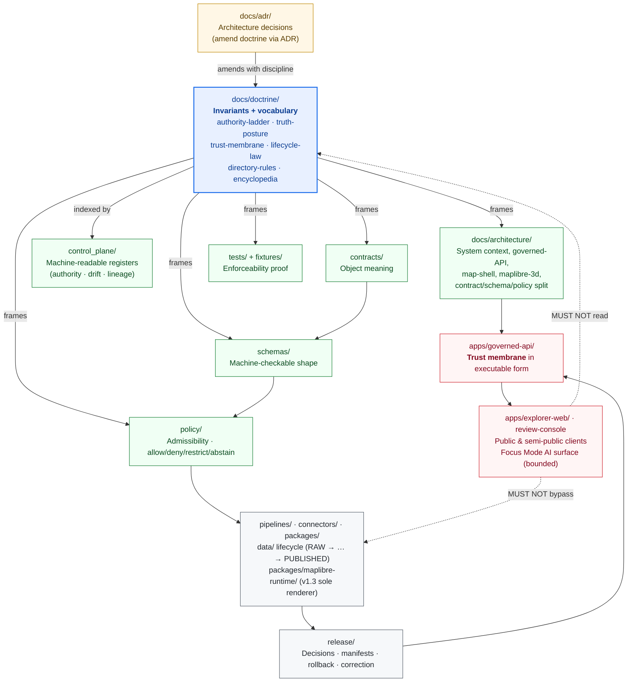

<!-- [KFM_META_BLOCK_V2]
doc_id: kfm://doc/doctrine/readme
title: docs/doctrine/ — landing page
type: readme
subtype: directory-landing-page
version: v0.2 (refresh — adds encyclopedia.md row, top anchor, v1.3/v1.4 renderer-decision context)
prior_version: v0.1 (initial, undated)
status: active
owners: <docs-steward>                                              # PLACEHOLDER — assign before review
created: 2026-05-18
updated: 2026-05-25
policy_label: public
proposed_home: docs/doctrine/README.md
related:
  - docs/doctrine/directory-rules.md                                # v1.4 — presentation refresh of v1.3 renderer-decision refresh
  - docs/doctrine/encyclopedia.md                                   # v0.1 — doctrine-rank vocabulary + concept index (PROPOSED in repo)
  - docs/doctrine/authority-ladder.md                               # PROPOSED — standalone authored file
  - docs/doctrine/truth-posture.md                                  # PROPOSED — standalone authored file
  - docs/doctrine/trust-membrane.md                                 # PROPOSED — standalone authored file
  - docs/doctrine/lifecycle-law.md                                  # PROPOSED — standalone authored file
  - docs/architecture/contract-schema-policy-split.md
  - docs/architecture/governed-api.md
  - docs/architecture/map-shell.md
  - docs/architecture/maplibre-3d.md                                # v1.3 — sole-renderer doctrine (renderer-decision ADR PROPOSED)
  - docs/registers/DRIFT_REGISTER.md
  - docs/registers/VERIFICATION_BACKLOG.md
  - docs/adr/ADR-0001-schema-home.md
  - docs/adr/ADR-NNNN-maplibre-sole-renderer-retire-cesium.md       # PROPOSED — number pending; directory-rules.md §18.e OPEN-DR-10
  - control_plane/document_registry.yaml
truth_labels: [CONFIRMED, PROPOSED, INFERRED, NEEDS VERIFICATION, UNKNOWN, EXTERNAL]
authority_class: directory landing page (not itself a doctrine source)
authority_rank: subordinate to the doctrine documents it points to
spec_hash: PROPOSED — emit via canonical JCS+SHA-256 once tooling is wired
tags: [kfm, doctrine, readme, landing-page, governance, authority-ladder, lifecycle, trust-membrane, truth-posture, directory-rules, encyclopedia]
notes:
  - "v0.2 is a refresh: adds KFM Meta Block v2, an explicit  anchor for portable back-to-top links, the new encyclopedia.md row in the Documents table, brief v1.3/v1.4 renderer-decision context in the Doctrine map, and an updated Open Questions list. No doctrine claim changes."
  - "All doctrine-document file presences are PROPOSED until verified against mounted-repo evidence. Doctrine claims themselves are CONFIRMED across the corpus per directory-rules.md, kfm_unified_doctrine_synthesis.md, and the KFM_Unified_Implementation_Architecture_Build_Manual §20.1 first-PR package."
  - "No mounted repo was inspected in this session. Implementation maturity is bounded per the AI Build Operating Contract current-session evidence limit."
[/KFM_META_BLOCK_V2] -->

# `docs/doctrine/`

> **The small, stable layer of invariants that govern every other surface in the Kansas Frontier Matrix repository.**
> Doctrine encodes *how* KFM is allowed to know, decide, publish, and correct. It is the highest layer in the
> authority ladder. Every other root operationalizes it; none of them overrules it.

<!--
Repo placement: docs/doctrine/README.md
Authority root: docs/ (Canonical) — see ../README.md and ../../README.md
Owning doctrine: directory-rules.md §6.1
This README is a directory landing page. The numbered, prose-heavy doctrine documents
are the substantive sources of truth; this file orients readers to them.
-->

[-orange)](../architecture/maplibre-3d.md)

> **Badge targets are placeholders** until the relevant docs and CI signals are live. Do not treat them as
> proof of enforcement. See [Validation](#validation) and [Open questions](#open-questions--needs-verification).

---

## Quick navigation

[Scope](#scope) ·
[Authority](#authority-level) ·
[Status](#status) ·
[Documents](#documents-in-this-folder) ·
[What belongs here](#what-belongs-here) ·
[What does NOT belong here](#what-does-not-belong-here) ·
[Doctrine map](#doctrine-map) ·
[Inputs](#inputs) ·
[Outputs](#outputs) ·
[Validation](#validation) ·
[Change discipline](#change-discipline) ·
[Review burden](#review-burden) ·
[Related folders](#related-folders) ·
[ADRs](#adrs) ·
[Open questions](#open-questions--needs-verification) ·
[Glossary](#mini-glossary) ·
[Last reviewed](#last-reviewed)

---

## Scope

This folder is the **doctrinal layer** of the human-facing control plane. It contains the
small, stable set of documents that define KFM's non-negotiable invariants — the things that
must remain true across every domain, every release, every contributor, and every iteration
of the implementation.

Doctrine answers questions like:

- *What ranks above what when sources disagree?* → [`authority-ladder.md`](./authority-ladder.md)
- *What does it mean for KFM to "know" something?* → [`truth-posture.md`](./truth-posture.md)
- *Who is allowed to publish, and how?* → [`trust-membrane.md`](./trust-membrane.md)
- *What lifecycle must data move through before it is public?* → [`lifecycle-law.md`](./lifecycle-law.md)
- *Where do new files belong?* → [`directory-rules.md`](./directory-rules.md)
- *What does this term mean, and which doctrine doc owns it?* → [`encyclopedia.md`](./encyclopedia.md)

Doctrine **does not** decide individual cases. Per-case decisions are made by `contracts/` (meaning),
`schemas/` (shape), `policy/` (admissibility), `tests/` (proof), ADRs (architecture decisions), and
`release/` (release decisions). Doctrine is the frame those layers are required to honour.

> [!IMPORTANT]
> A `docs/` page is **not** the source of a canonical decision on its own. Documentation explains;
> ADRs decide; contracts, schemas, policy, and tests enforce. Doctrine is special only in that it
> sets the frame *all* of those operate within. Changing doctrine therefore requires an ADR.
> See [`directory-rules.md` §13.5 (Documentation as truth anti-pattern)](./directory-rules.md#135-additional-anti-patterns)
> and [§17 (Document change discipline)](./directory-rules.md#17-document-change-discipline).

[↑ Back to top](#top)

---

## Authority level

| Field | Value |
|---|---|
| **Authority class** | Canonical · doctrinal |
| **Position in authority order** | Layer 1 — top of the ladder per [`directory-rules.md` §2.1](./directory-rules.md#21-authority-order) |
| **Conformance language** | RFC 2119-style: MUST / MUST NOT / SHOULD / SHOULD NOT / MAY |
| **Change governs** | ADR required for any change that bends an invariant ([`directory-rules.md` §2.4](./directory-rules.md#24-changes-that-require-an-adr)) |
| **What overrules doctrine** | Only an accepted ADR that explicitly amends doctrine, with supersession discipline |
| **What does *not* overrule doctrine** | Per-root READMEs, domain dossiers, prior architecture reports, current repo convention, generated artifacts, model output |

**CONFIRMED** — the *role* of `docs/doctrine/` and the listed authority order are doctrine, captured in
[`directory-rules.md` §2.1, §2.4, §6.1](./directory-rules.md). The first-PR doctrine package is named in
[`KFM_Unified_Implementation_Architecture_Build_Manual` §20.1](../../KFM_Unified_Implementation_Architecture_Build_Manual.md) and lists
`directory-rules.md`, `truth-posture.md`, `lifecycle-law.md`, and `trust-membrane.md`. `authority-ladder.md`
is named in [`directory-rules.md` §6.1](./directory-rules.md#61-docs--the-human-facing-control-plane); `encyclopedia.md` is the v0.2-added
doctrine-rank vocabulary file (see [Documents](#documents-in-this-folder)).

**NEEDS VERIFICATION** — whether the live repository currently contains every file enumerated below
(see [Open questions](#open-questions--needs-verification)).

[↑ Back to top](#top)

---

## Status

| Field | Value |
|---|---|
| **Folder status** | active |
| **Per-file status** | mixed — see [Documents](#documents-in-this-folder) |
| **Overall doctrine maturity** | CONFIRMED as doctrine; PROPOSED as a complete authored set in any specific repo until each file is verified present |
| **Owners** | Docs steward · KFM architecture council (placeholder until `CODEOWNERS` is verified) |
| **Edition** | **v0.2** (refresh — adds `encyclopedia.md` row, top anchor, v1.3/v1.4 renderer-decision context, KFM Meta Block v2) |
| **Last reviewed** | 2026-05-25 (v0.2 refresh; see [Last reviewed](#last-reviewed)) |

[↑ Back to top](#top)

---

## Documents in this folder

The doctrinal set is anchored in [`directory-rules.md` §6.1](./directory-rules.md#61-docs--the-human-facing-control-plane)
and in [`KFM_Unified_Implementation_Architecture_Build_Manual` §20.1](../../KFM_Unified_Implementation_Architecture_Build_Manual.md)
(first-PR package). One v0.2-added file (`encyclopedia.md`) is the doctrine-rank vocabulary / concept index.

| File | Encodes | Status (in this corpus) | Notes |
|---|---|---|---|
| [`README.md`](./README.md) | This orientation document. | CONFIRMED (this file) | Directory landing page. Not itself a source of doctrine — it points to the docs that are. **v0.2** refresh, 2026-05-25. |
| [`authority-ladder.md`](./authority-ladder.md) | The order in which sources, documents, and runtime evidence are ranked when they disagree. | PROPOSED | A standalone authored doc is listed in §6.1 but not yet verified present. The *ladder itself* is CONFIRMED doctrine and partially encoded in [`directory-rules.md` §2.1](./directory-rules.md#21-authority-order) and [`encyclopedia.md` §7](./encyclopedia.md). |
| [`truth-posture.md`](./truth-posture.md) | **Cite-or-abstain.** Every consequential claim either resolves to an `EvidenceBundle` or returns `ABSTAIN` / `DENY` / `ERROR`. Fluent text never substitutes for evidence. | PROPOSED | The posture is CONFIRMED doctrine across the corpus; the standalone file is not yet verified present. See [`encyclopedia.md` §4, §8](./encyclopedia.md) for the consolidated treatment. |
| [`trust-membrane.md`](./trust-membrane.md) | Public clients consume **governed APIs and released artifacts only**. RAW / WORK / QUARANTINE / candidate / direct-model paths are non-public. | PROPOSED | The boundary is CONFIRMED doctrine; the operational form is `apps/governed-api/`. See [`encyclopedia.md` §6](./encyclopedia.md). |
| [`lifecycle-law.md`](./lifecycle-law.md) | **RAW → WORK / QUARANTINE → PROCESSED → CATALOG / TRIPLET → PUBLISHED.** Promotion is a governed state transition, not a file move. | PROPOSED | The invariant is CONFIRMED doctrine; the standalone file is not yet verified present. See [`encyclopedia.md` §5](./encyclopedia.md) for the consolidated phase table. |
| [`directory-rules.md`](./directory-rules.md) | Where files belong. Responsibility roots, lifecycle phases, domain-as-segment, compatibility roots, anti-patterns, migration discipline, Focus Mode (v1.2) and sole-renderer (v1.3) placement. | **CONFIRMED** — present in this corpus at **v1.4** (presentation refresh of v1.3 renderer-decision refresh, 2026-05-25). | The canonical placement-rules document. v1.3 substantive doctrine (Cesium retired; MapLibre as sole browser-side renderer) remains **PROPOSED** pending the renderer-decision ADR (§18.e OPEN-DR-10). |
| [`encyclopedia.md`](./encyclopedia.md) *(v0.2 addition)* | **Canonical vocabulary and concept index.** One-line authoritative definitions for ~80 KFM terms (invariants, lifecycle phases, object families, receipt classes, finite-outcome envelope, trust membrane, authority ladder, cite-or-abstain, MapLibre 3D vocabulary, Focus Mode, compatibility taxonomy, external standards, anti-pattern categories). Each entry cross-references its owning doctrine document. | PROPOSED — authored 2026-05-25 at v0.1; mounted-repo presence NEEDS VERIFICATION. | **Distinct** from the *planning-artifact* encyclopedia at [`docs/encyclopedia/`](../encyclopedia/) (synthesis / planning rank). This file wins on vocabulary; the planning manuscript wins on narrative scope and worked examples. The two-encyclopedia rank relationship is flagged for ADR resolution — see [`encyclopedia.md` §1.2, §22 OPEN-EN-01](./encyclopedia.md). |

> [!NOTE]
> One named invariant — **watcher-as-non-publisher** ("workers emit receipts and candidate decisions only;
> they do not publish, mutate canonical records, or bypass review") is invoked in
> [`directory-rules.md` §2.1](./directory-rules.md#21-authority-order) but does not have its own listed file
> in §6.1. It is currently expressed inside `trust-membrane.md` (PROPOSED), in the consolidated
> [`encyclopedia.md` §3 (I-4)](./encyclopedia.md), and in the canonical-tree commentary. Whether to split
> it into a sixth doctrine doc is an [open question](#open-questions--needs-verification).

[↑ Back to top](#top)

---

## What belongs here

Only documents that:

1. State a KFM-wide **invariant** that constrains every domain, app, package, pipeline, and release.
2. Are written for **humans** (Markdown prose, RFC 2119-style conformance language, examples).
3. Are **stable enough to require an ADR to change** — not workshopped material.
4. Sit at the **top of the authority ladder** and define the frame for `contracts/` / `schemas/` / `policy/` / `tests/`.

The vocabulary index (`encyclopedia.md`) is permissible here because it *consolidates* doctrine vocabulary that
other doctrine docs already own — it introduces no new doctrine. New term entries follow the routine-PR band
of [`directory-rules.md` §17](./directory-rules.md#17-document-change-discipline); renames of canonical terms
are content changes per §14.3 and require ADR + schema bump + correction notices.

If a document does not satisfy criteria 1–4, it does not belong in `docs/doctrine/`.

## What does NOT belong here

| Content | Belongs in | Why not here |
|---|---|---|
| Architecture decisions (one decision, with context / consequences / alternatives) | [`docs/adr/`](../adr/) | ADRs *amend* doctrine; doctrine is the frame ADRs operate within. |
| System-context, deployment, governed-API, map-shell, MapLibre-3D, contract/schema/policy split docs | [`docs/architecture/`](../architecture/) | Architecture explains how the system *implements* doctrine. Different layer. |
| Domain-specific architecture, dossiers, source registries | [`docs/domains/<domain>/`](../domains/) | Domains are lanes inside responsibility roots — never doctrine. |
| Focus Mode build plans, county dossiers, area-bounded planning | [`docs/focus-modes/<area>-<scope>/`](../focus-modes/) | Focus Modes are cross-cutting proof slices governed by [`directory-rules.md` §6.7](./directory-rules.md#67-focus-modes--proof-slice-placement-contract-v12); they are not doctrine. |
| Operational procedures, rollback drills, validation runs | [`docs/runbooks/`](../runbooks/) | Operations apply doctrine; they don't define it. |
| Threat model, exposure posture, incident response | [`docs/security/`](../security/) | Security operationalizes the trust membrane; it's not the doctrine itself. |
| Roles, review burden, separation of duties | [`docs/governance/`](../governance/) | Governance procedures live in their own lane. |
| Authority / lineage / drift / verification *registers* (machine-readable) | [`control_plane/`](../../control_plane/) (machine) · [`docs/registers/`](../registers/) (human-readable index) | Registers index "what governs what"; doctrine *defines* what governs. Different layer. |
| External standards KFM conforms to (STAC, DCAT, PROV, JSON-LD, etc.) | [`docs/standards/`](../standards/) | External standards are referenced, not authored as doctrine. |
| Planning-artifact encyclopedia manuscript (PDF + master index) | [`docs/encyclopedia/`](../encyclopedia/) | Synthesis / planning rank. Subordinate to doctrine (per its own Appendix L). Distinct from `docs/doctrine/encyclopedia.md` (this folder's vocabulary index). |
| Versioned domain atlases / culmination dossiers | [`docs/atlases/`](../atlases/) | Reference rank; subordinate to doctrine. |
| Source-descriptor standards, source families | [`docs/sources/`](../sources/) | Source identity is its own concern. |
| Idea intake, exploratory packets, archived lineage | [`docs/intake/`](../intake/) · [`docs/archive/`](../archive/) | Exploratory by definition; not doctrine. |
| Generated review / release reports | [`docs/reports/`](../reports/) | Read-only outputs of governed runs. |
| Object-family **meaning** (what an object means) | [`contracts/`](../../contracts/) | Different layer of the same governance function. |
| Object **shape** (machine-checkable) | [`schemas/`](../../schemas/) | Default home: `schemas/contracts/v1/...` per ADR-0001. |
| **Admissibility / release** decisions (allow / deny / restrict / abstain) | [`policy/`](../../policy/) · [`release/`](../../release/) | Doctrine sets the frame; policy decides individual cases. |
| Proof that doctrine is enforceable | [`tests/`](../../tests/) · [`fixtures/`](../../fixtures/) | Tests prove the rules; doctrine states them. |

> [!CAUTION]
> **Documentation-as-truth is an anti-pattern.** A `docs/` page MUST NOT be cited as the source of a canonical
> decision. Promote canonical decisions to an ADR or to a `control_plane/` register.
> See [`directory-rules.md` §13.5](./directory-rules.md#135-additional-anti-patterns).

[↑ Back to top](#top)

---

## Doctrine map

How `docs/doctrine/` relates to the rest of the repository:

**Reading the diagram.** Doctrine sits above architecture. Architecture explains how doctrine is realized.
Contracts / schemas / policy / tests operationalize doctrine for individual object families and decisions.
The `control_plane/` indexes doctrine and its consequences in machine-readable form. ADRs are the *only*
mechanism that may amend doctrine, and they do so with supersession discipline. Public clients reach data
exclusively through the governed API — never around the lifecycle, never directly through documentation.

**v1.3 / v1.4 renderer-decision context.** At Directory Rules v1.3 (renderer-decision refresh) — preserved in
v1.4 (presentation refresh) — `packages/maplibre-runtime/` is doctrine-target as the **sole governed
browser-side renderer adapter**, with Cesium retired. The renderer-decision ADR is **PROPOSED, not yet
accepted** ([§18.e OPEN-DR-10](./directory-rules.md#18e-new-in-v13)); until acceptance, the §11 freeze rule
blocks new `cesium*` code, schemas, policies, or tests. See [`docs/architecture/maplibre-3d.md`](../architecture/maplibre-3d.md)
for the underlying architecture doctrine and [`encyclopedia.md` §13](./encyclopedia.md) for the consolidated
vocabulary entries.

[↑ Back to top](#top)

---

## Inputs

Doctrine is authored, not generated. Inputs to this folder are:

- **Lessons surfaced from prior reports and dossiers** in `docs/archive/lineage/`, `docs/archive/exploratory/`,
  the planning-artifact encyclopedia at `docs/encyclopedia/`, the consolidated atlases at `docs/atlases/`, and
  the PDF corpus underpinning the redesign — once promoted from exploratory to invariant.
- **Accepted ADRs** that explicitly amend or supersede a doctrine claim.
- **Editorial PRs** by the Docs steward with subsystem-owner sign-off.

Doctrine MUST NOT be authored from generated text, model output, or unreviewed external material.
The governed-AI rule applies: AI is interpretive, not the root truth source.

## Outputs

Doctrine emits *constraints*, not artifacts. Concretely, it constrains:

- **`docs/architecture/`** — architecture must be consistent with the trust membrane and lifecycle law.
- **`contracts/`** — object meanings must respect the authority ladder and cite-or-abstain posture.
- **`schemas/contracts/v1/...`** — machine shapes must reflect contract meaning, not invent it.
- **`policy/`** — allow / deny / restrict / abstain decisions must implement the truth posture.
- **`tests/`** and **`fixtures/`** — must prove every doctrinal invariant is enforceable.
- **`release/`** — release manifests, rollback cards, and correction notices must satisfy the publication gate.
- **`apps/governed-api/`** — the executable form of the trust membrane.
- **`apps/explorer-web/`** and **`packages/maplibre-runtime/`** *(v1.3)* — the map shell consumes
  `EvidenceBundle` and `DecisionEnvelope` like any other public client; the sole-renderer adapter enforces
  3D Admission Decision and Plugin Admission before any 3D rendering.
- **`docs/focus-modes/<area>/`** *(v1.2)* — each Focus Mode is a cross-cutting proof slice that demonstrates
  the full trust path; the doctrine in this folder is what every Focus Mode is required to honour.
- **`docs/registers/`** and **`control_plane/`** — register the authority order, drift, and lineage relative to doctrine.

[↑ Back to top](#top)

---

## Validation

Doctrine is enforced *operationally*, not by the doctrine documents themselves. The intended enforcement
surfaces (per [`directory-rules.md` §16](./directory-rules.md#16-path-validation-checklist-for-reviewers) and the
attached implementation reports) are:

| Doctrine claim | Enforcement surface |
|---|---|
| Authority ladder | Reviewer checklist; `docs/registers/AUTHORITY_LADDER.md`; PR description must cite the rule |
| Cite-or-abstain | `RuntimeResponseEnvelope` finite outcomes (ANSWER · ABSTAIN · DENY · ERROR); citation-validation tests |
| Trust membrane | `apps/governed-api/` route discipline; no-public-raw-route tests; CI workflow gate |
| Lifecycle law | Lifecycle layout validator; promotion-gate policy; `release/manifests/`; rollback cards |
| Directory rules | Path-validation checklist; per-root README contract; drift-register scan; v1.2 / v1.3 anti-pattern table |
| Watcher-as-non-publisher | Worker access controls; receipt-only emission tests |
| Sole renderer *(v1.3, PROPOSED)* | `packages/maplibre-runtime/` import-discipline lint; 3D Admission Decision evaluator; Plugin Admission gate; no-`cesium*`-segment checklist item ([`directory-rules.md` §16 v1.3](./directory-rules.md#16-path-validation-checklist-for-reviewers)) |
| Focus Mode placement *(v1.2)* | Multi-root placement contract per [`directory-rules.md` §6.7.2](./directory-rules.md#672-canonical-placement-table); area-segment validators; negative fixtures exercising DENY / ABSTAIN / ERROR paths |
| Vocabulary stability | `encyclopedia.md` §20 entries cross-referenced against owning doctrine documents; rename of a canonical term is a content change per [`directory-rules.md` §14.3](./directory-rules.md#143-for-renames-that-change-object-identity). |

**PROPOSED** — every specific tool, workflow, validator, or test name above is proposed until verified
against a mounted repository. The *enforcement model* is doctrine; the *enforcement code* is implementation.

[↑ Back to top](#top)

---

## Change discipline

Per [`directory-rules.md` §17](./directory-rules.md#17-document-change-discipline), changes to doctrine follow
the same rules they impose:

| Change | What's required |
|---|---|
| Typo, clarification, dead-link fix | Routine PR. |
| New example, anti-pattern, non-normative note, or new term entry in `encyclopedia.md` §20 | PR + reviewer sign-off. |
| **Adding, removing, or renaming an invariant** | **ADR required.** Supersession notice for any superseded text. Drift-register entry while the change is in flight. |
| **Renaming a canonical KFM term** (e.g., `EvidenceBundle`, `ReleaseManifest`, `RuntimeResponseEnvelope`) | ADR + schema version bump + compatibility map for old fixtures + old-fixture parity tests + correction notices for any released artifacts that referenced the old identity. See [`directory-rules.md` §14.3](./directory-rules.md#143-for-renames-that-change-object-identity). |
| **Reversing a previously stated rule** | ADR + supersession notice + drift-register entry. The v1.2→v1.3 Cesium retirement is the current worked example. |
| Major restructure of a doctrine document | ADR + migration plan + transition window. |

All changes MUST preserve link stability where reasonably possible: stable anchors, stable filenames,
preserved ToC ordering. When stability cannot be preserved, the PR MUST note the breakage and update
inbound links.

## Review burden

| Role | Responsibility |
|---|---|
| **Docs steward** | First reviewer for any change in this folder. Mandatory. |
| **Subsystem owner** | At least one — chosen by the doctrine claim being touched. Mandatory. |
| **Architecture council** | Required for any change touching trust-membrane, lifecycle-law, authority-ladder, or directory-rules. |
| **CODEOWNERS** | The repo's `CODEOWNERS` file (or `.github/CODEOWNERS`) MUST list this folder explicitly. **NEEDS VERIFICATION** in the live repo. |

[↑ Back to top](#top)

---

## Related folders

| Path | Relationship |
|---|---|
| [`../README.md`](../README.md) | Top-level `docs/` landing page. Names doctrine as the first-class layer of the human-facing control plane. |
| [`../adr/`](../adr/) | Architecture Decision Records — the only mechanism that may amend doctrine. |
| [`../architecture/`](../architecture/) | Explains *how* doctrine is implemented. Includes `contract-schema-policy-split.md`, `governed-api.md`, `map-shell.md`, and `maplibre-3d.md` (the v1.3 sole-renderer doctrine). |
| [`../encyclopedia/`](../encyclopedia/) | **Planning-artifact** encyclopedia (PDF manuscript + master index). Synthesis / planning rank; subordinate to doctrine. **Distinct from** `docs/doctrine/encyclopedia.md` (this folder's vocabulary index). |
| [`../atlases/`](../atlases/) | Versioned domain atlases and culmination dossiers. Reference rank. |
| [`../focus-modes/`](../focus-modes/) | County- or region-scale proof slices per [`directory-rules.md` §6.7](./directory-rules.md#67-focus-modes--proof-slice-placement-contract-v12). |
| [`../registers/`](../registers/) | Human-readable indexes (`AUTHORITY_LADDER.md`, `CANONICAL_LINEAGE_EXPLORATORY.md`, `DRIFT_REGISTER.md`, `VERIFICATION_BACKLOG.md`). Reference doctrine; do not redefine it. |
| [`../governance/`](../governance/) | Roles, review burden, separation-of-duties procedure. Operationalizes doctrine. |
| [`../../control_plane/`](../../control_plane/) | Machine-readable registers (`document_registry.yaml`, `policy_gate_register.yaml`, etc.) that index what doctrine governs. |
| [`../../contracts/`](../../contracts/) | Object meaning. Doctrine constrains the meanings; contracts state them. |
| [`../../schemas/`](../../schemas/) | Machine-checkable shape (default: `schemas/contracts/v1/...` per ADR-0001). |
| [`../../policy/`](../../policy/) | Admissibility / release. Implements truth posture and trust membrane in executable policy. |
| [`../../tests/`](../../tests/) · [`../../fixtures/`](../../fixtures/) | Proof that doctrine is enforceable. |
| [`../../release/`](../../release/) | Release decisions, manifests, rollback cards, correction notices — the operational form of the publication gate. |
| [`../../apps/governed-api/`](../../apps/governed-api/) | The trust membrane in executable form. |
| [`../../packages/maplibre-runtime/`](../../packages/maplibre-runtime/) *(v1.3, PROPOSED)* | The sole governed browser-side renderer adapter. Hosts terrain, globe, fill-extrusion, 3D Tiles, glTF, point clouds, deck.gl interleaved — all gated by 3D Admission Decision and Plugin Admission. |

[↑ Back to top](#top)

---

## ADRs

| ADR | Subject | Doctrine link |
|---|---|---|
| **ADR-0001** | Schema-home rule: `schemas/contracts/v1/...` is the canonical machine-schema home. | Cited by [`directory-rules.md` §0 and §7.4](./directory-rules.md). PROPOSED-as-present until the live repo is verified. |
| **ADR-0003** *(PROPOSED)* | `policy/` (singular) is canonical over `policies/`. | Referenced by [`directory-rules.md` §6.5, §8.1](./directory-rules.md). PROPOSED per project knowledge. |
| **ADR-NNNN** — *MapLibre as Sole Browser-Side Renderer; Retire Cesium Dependency* *(PROPOSED; number pending)* | Retires `packages/cesium/`, `policy/cesium/`, `schemas/contracts/v1/cesium/`, and Cesium-as-renderer language from doctrine. Recommended in [`docs/architecture/maplibre-3d.md`](../architecture/maplibre-3d.md) Appendix B. | Tracked at [`directory-rules.md` §18.e OPEN-DR-10](./directory-rules.md#18e-new-in-v13). v1.3 / v1.4 condition the substantive retirement on OPEN-DR-10 acceptance. |
| *(none yet specifically governing other doctrine docs)* | — | A doctrine-amending ADR template SHOULD include: `id`, `title`, `status`, `date`, `context`, `decision`, `consequences`, `alternatives`, plus *which doctrine claim is amended* and the supersession path. See [`directory-rules.md` §2.4](./directory-rules.md#24-changes-that-require-an-adr). |

[↑ Back to top](#top)

---

## Open questions / NEEDS VERIFICATION

These items are **not** resolved by this README. They should be tracked in
[`../registers/VERIFICATION_BACKLOG.md`](../registers/VERIFICATION_BACKLOG.md) and resolved via ADR or
per-root README:

- **NEEDS VERIFICATION** — whether the mounted repo currently contains
  `authority-ladder.md`, `truth-posture.md`, `trust-membrane.md`, `lifecycle-law.md`, and `encyclopedia.md` as
  standalone authored files. Until verified, all five are PROPOSED. *(`directory-rules.md` is CONFIRMED at
  v1.4 in this corpus; mounted-repo presence remains NEEDS VERIFICATION per [`directory-rules.md` §18.a](./directory-rules.md#18a-carried-forward-from-v10).)*
- **NEEDS VERIFICATION** — whether `CODEOWNERS` lists `docs/doctrine/` explicitly with the right reviewers.
- **NEEDS VERIFICATION** — whether any CI workflow currently fails a PR that violates a §16 path-validation
  checklist item, or whether the checklist is review-only at present.
- **OPEN** — whether **watcher-as-non-publisher** should be split into its own doctrine document or remain
  inside `trust-membrane.md`. (It is currently invoked in `directory-rules.md` §2.1 as a top-level invariant
  and consolidated as I-4 in [`encyclopedia.md` §3](./encyclopedia.md).)
- **OPEN** — whether `docs/doctrine/` should also host a single-page `INVARIANTS.md` that lists every
  KFM-wide MUST in one place, with backlinks to the document that authors each one. *(Note:
  [`encyclopedia.md` §3](./encyclopedia.md) already consolidates the five core invariants I-1 through I-5;
  a separate `INVARIANTS.md` would be partly redundant with that section.)*
- **OPEN** — whether the `docs/registers/AUTHORITY_LADDER.md` register and the doctrinal `authority-ladder.md`
  should be merged, kept distinct (register = machine-friendly index; doctrine doc = prose), or generated
  one from the other.
- **OPEN-EN-01** *(v0.2)* — whether `docs/doctrine/encyclopedia.md` *(this folder's vocabulary index)* and
  `docs/encyclopedia/kfm_encyclopedia.pdf` + `docs/encyclopedia/README.md` *(planning manuscript + master
  index)* should remain as two artifacts (with the §1.2 rank distinction in [`encyclopedia.md`](./encyclopedia.md))
  or be consolidated. **ADR-class** (ADR-S-15 doctrine artifact lifecycle is the natural home). Until
  resolved, the rank distinction in `encyclopedia.md` §1.2 is the operative rule.
- **OPEN-DR-10** *(carried forward from `directory-rules.md` §18.e)* — the renderer-decision ADR is
  **PROPOSED, not yet filed**. Until acceptance, the v1.3 / v1.4 retirement language is **doctrine-target /
  PROPOSED**; the §11 freeze rule (no new `cesium*` code, schemas, policies, or tests) is the bridging
  measure.
- **NEEDS VERIFICATION** — whether every `encyclopedia.md` §20 glossary entry's canonical source citation
  resolves to an actual file in the mounted repo ([`encyclopedia.md` §22 OPEN-EN-04](./encyclopedia.md)).

[↑ Back to top](#top)

---

## Mini-glossary

Short, placement-relevant definitions. **The full vocabulary index is in [`encyclopedia.md`](./encyclopedia.md)
§20 (~80 entries, one-line definition + canonical source for every term).** This mini-glossary is the
ten-term orientation set; for any term not listed here, use the full index.

<b>Expand mini-glossary</b> — invariant · authority root · compatibility root · lane · lifecycle · trust membrane · cite-or-abstain · watcher-as-non-publisher · ADR · drift

| Term | Short definition |
|---|---|
| **Invariant** | A KFM-wide MUST or MUST NOT that holds across every domain, app, and release. The five core invariants (I-1 through I-5) are consolidated in [`encyclopedia.md` §3](./encyclopedia.md). |
| **Authority root** | A repo-root folder that carries one of the §3 responsibilities (governs truth · contains deployable systems · stores lifecycle data · supports validation/runtime · genuinely cross-domain). |
| **Compatibility root** | A root that exists for legacy, mirror, deprecated, external-export, or transitional reasons. README must declare class. |
| **Lane** | A domain or topic segment *inside* a responsibility root (e.g. `data/processed/hydrology/`). Domains are lanes, never roots. |
| **Lifecycle invariant** | RAW → WORK / QUARANTINE → PROCESSED → CATALOG / TRIPLET → PUBLISHED. Promotion is a governed state transition, not a file move. |
| **Trust membrane** | The boundary that prevents raw / unreviewed / model-generated / internal state from becoming public truth. Operational form: `apps/governed-api/`. |
| **Cite-or-abstain** | Every consequential claim either resolves an `EvidenceRef` to an `EvidenceBundle` or returns ABSTAIN / DENY / ERROR. Fluent text never substitutes for evidence. |
| **Watcher-as-non-publisher** | Workers and watchers emit receipts and candidate decisions only. They do not publish, mutate canonical records, or bypass review. |
| **ADR** | Architecture Decision Record. The only mechanism that may amend doctrine. Statuses: proposed · accepted · superseded · rejected. |
| **Drift** | A divergence between doctrine, repo state, source authority, or runtime evidence. Logged in `docs/registers/DRIFT_REGISTER.md`; not promoted to authority. |

[↑ Back to top](#top)

---

## Last reviewed

**2026-05-25** — v0.2 refresh (adds KFM Meta Block v2 + top anchor + `encyclopedia.md` row + v1.3/v1.4
renderer-decision context + Focus Mode cross-references).

Older than 6 months → flag for review per [`directory-rules.md` §15](./directory-rules.md#15-required-readme-contract).

### Revision history

| Edition | Date | Change | Authority class |
|---|---|---|---|
| **v0.2** | 2026-05-25 | Refresh. Added KFM Meta Block v2; explicit `` anchor; `encyclopedia.md` row in [Documents](#documents-in-this-folder); v1.3 / v1.4 renderer-decision context in the [Doctrine map](#doctrine-map); Focus Mode cross-references in [What does NOT belong here](#what-does-not-belong-here), [Related folders](#related-folders), and [Validation](#validation); current-state badges (`edition: v0.2`, `directory-rules: v1.4`, `renderer: MapLibre sole (v1.3 PROPOSED)`); updated [Open questions](#open-questions--needs-verification) with OPEN-EN-01 and OPEN-DR-10 cross-references; updated [Change discipline](#change-discipline) row for canonical-term renames. **No doctrine changed.** | Routine PR + reviewer sign-off per [`directory-rules.md` §17](./directory-rules.md#17-document-change-discipline). |
| **v0.1** | (undated) | Initial directory landing page. | — |

---

This file is a directory landing page. It does **not** itself encode doctrine — the documents it points to do.
If this README and a doctrine document conflict, the doctrine document wins; open a PR to fix this README.

[↑ Back to top](#top)
