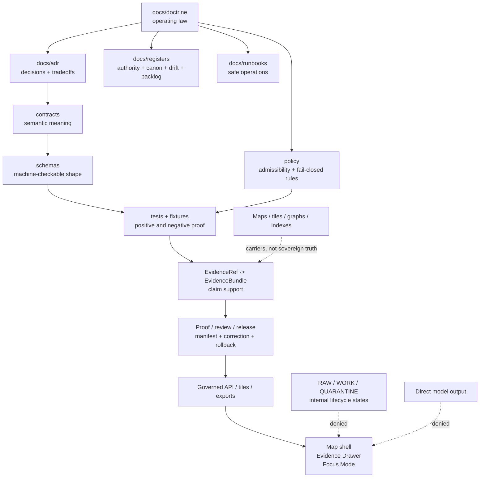

<!-- [KFM_META_BLOCK_V2]
doc_id: kfm://doc/NEEDS-UUID-docs-doctrine-readme
title: Doctrine
type: standard
version: v1
status: draft
owners: OWNER_TBD_NEEDS_VERIFICATION
created: CREATED_DATE_TBD_FROM_GIT_OR_DOC_REGISTRY
updated: 2026-05-06
policy_label: NEEDS_VERIFICATION
related: [../../README.md, ../README.md, ../adr/README.md, ../adr/ADR-0014-truth-path.md, ../registers/README.md, ../runbooks/README.md, ./authority-ladder.md, ./truth-posture.md, ./trust-membrane.md, ./lifecycle-law.md]
tags: [kfm, doctrine, evidence, governance, truth-posture, authority-ladder, trust-membrane, lifecycle, publication]
notes: [Repo-ready doctrine directory README; doc UUID owner created date and policy label remain verification placeholders; current sibling inventory is based on inspected GitHub evidence and must be rechecked on the branch where this file lands.]
[/KFM_META_BLOCK_V2] -->

<a id="top"></a>

# Doctrine

Human-facing operating law for Kansas Frontier Matrix: how evidence becomes publishable, reviewable, correctable, reversible, and safe to expose.

<div align="left">


</div>

> [!IMPORTANT]
> **Status:** `experimental` directory guidance / meta status `draft`  
> **Owners:** `OWNER_TBD_NEEDS_VERIFICATION`  
> **Path:** `docs/doctrine/README.md`  
> **Authority class:** human-facing doctrine index  
> **Trust rule:** doctrine can govern intent, language, placement, and review burden; enforcement still requires inspected contracts, schemas, policies, validators, fixtures, tests, workflows, receipts, proofs, release manifests, runtime traces, or reviewed artifacts.

## Quick jumps

| Start | Doctrine surfaces | Review gates |
|---|---|---|
| [Scope](#scope) | [Doctrine map](#doctrine-map) | [Definition of done](#definition-of-done) |
| [Repo fit](#repo-fit) | [Operating law](#operating-law) | [Open verification](#open-verification) |
| [Accepted inputs](#accepted-inputs) | [Usage](#usage) | [FAQ](#faq) |
| [Exclusions](#exclusions) | [Diagram](#diagram) | [Appendix](#appendix) |

---

## Scope

`docs/doctrine/` is the stable human-facing home for KFM’s operating law.

Use this directory to explain the rules that should remain visible across every domain lane, source intake, contract, schema, policy, validation gate, release, correction, rollback, map layer, Evidence Drawer panel, Focus Mode answer, export, story, and public API response.

Doctrine should answer questions like:

1. What evidence is strong enough for a public or semi-public claim?
2. Which source classes outrank others for a given claim type?
3. How does material move from source capture to public-safe publication?
4. Where is the public trust membrane?
5. When must KFM `ANSWER`, `ABSTAIN`, `DENY`, or `ERROR`?
6. What must be visible before publication, correction, supersession, withdrawal, or rollback?
7. How does AI remain interpretive rather than authoritative?

KFM doctrine is not decorative prose. It is the reviewable rule layer that downstream ADRs, registers, contracts, schemas, policies, validators, fixtures, governed APIs, maps, release artifacts, and AI surfaces should obey.

> [!NOTE]
> KFM’s durable public unit is the **inspectable claim**: a public or semi-public statement whose evidence, source role, spatial scope, temporal scope, policy posture, review state, release state, and correction lineage can be inspected.

[Back to top](#top)

---

## Repo fit

**Target path:** `docs/doctrine/README.md`

`docs/doctrine/` belongs under `docs/` because doctrine is a human-facing governance surface. It explains KFM rules and boundaries; it does not become a machine-schema home, policy engine, source-data store, proof archive, release directory, runtime log, or domain-specific root.

### Upstream surfaces

| Surface | Relationship | Status |
|---|---|---:|
| [`../../README.md`](../../README.md) | Repository-level orientation, KFM identity, trust law, responsibility roots, and public-client posture. | `CONFIRMED / draft` |
| [`../README.md`](../README.md) | Documentation root landing page; currently thin and should route more clearly into doctrine, ADRs, registers, runbooks, domains, and standards. | `CONFIRMED / THIN` |
| [`../adr/README.md`](../adr/README.md) | Decision ledger for architecture-significant choices that operationalize doctrine. | `CONFIRMED` |
| [`../adr/ADR-0014-truth-path.md`](../adr/ADR-0014-truth-path.md) | Truth-path and public trust membrane ADR draft. | `CONFIRMED / DRAFT` |
| [`../registers/README.md`](../registers/README.md) | Register landing page for authority, canon, drift, source ledger, and verification backlog surfaces. | `CONFIRMED / DRAFT` |
| [`../runbooks/README.md`](../runbooks/README.md) | Operational runbooks that execute doctrine without bypassing validation, release, correction, or rollback. | `CONFIRMED / ACTIVE` |

### Downstream consumers

| Consumer | How it should use doctrine | Enforcement status |
|---|---|---:|
| `docs/adr/` | Turns doctrine into reviewed architecture decisions with alternatives, validation, rollback, and supersession. | `PARTIAL / NEEDS VERIFICATION` |
| `docs/registers/` | Tracks authority, canon/lineage/exploratory status, drift, source ledger entries, and verification gaps. | `PARTIAL / NEEDS VERIFICATION` |
| `contracts/` | Defines semantic meaning for evidence, source, runtime, release, correction, rollback, and domain objects. | `NEEDS VERIFICATION` |
| `schemas/` | Defines machine-checkable shape for doctrine-backed object families. | `NEEDS VERIFICATION` |
| `policy/` | Converts doctrine into admissibility, deny, restrict, abstain, release, and obligation rules. | `NEEDS VERIFICATION` |
| `tests/` and `fixtures/` | Proves doctrine with positive and negative examples. | `NEEDS VERIFICATION` |
| `apps/`, `packages/`, `tools/` | Implements governed APIs, validators, Evidence Drawer payloads, Focus Mode envelopes, review helpers, and release tooling. | `UNKNOWN / NEEDS VERIFICATION` |
| `data/`, `release/`, `runtime/` | Stores lifecycle data, emitted receipts/proofs, release candidates, manifests, rollback cards, and runtime support. | `NEEDS VERIFICATION` |

> [!WARNING]
> Do not use doctrine placement to imply implementation maturity. A doctrine rule becomes active system behavior only when matching contracts, schemas, policy, validators, tests, workflows, runtime behavior, and release artifacts are verified.

[Back to top](#top)

---

## Accepted inputs

Use `docs/doctrine/` for stable, project-wide rules that should outlive a single domain lane, implementation sprint, source connector, UI surface, or model provider.

| Accepted input | Belongs here when... | Typical companion surface |
|---|---|---|
| Authority rules | A source, document, repo artifact, external reference, generated artifact, or AI output needs an explicit precedence rule. | `docs/registers/AUTHORITY_LADDER.md` |
| Truth posture rules | Maintainers need shared language for `CONFIRMED`, `INFERRED`, `PROPOSED`, `UNKNOWN`, `NEEDS VERIFICATION`, `CONFLICTED`, `DENY`, `ABSTAIN`, and `ERROR`. | `docs/registers/VERIFICATION_BACKLOG.md` |
| Lifecycle law | Public claims depend on how material moves from source edge to published state. | `release/`, `data/receipts/`, `data/proofs/` |
| Trust membrane rules | Public clients, APIs, map layers, exports, dashboards, or AI surfaces need a boundary from internal stores. | `docs/adr/`, `policy/`, `tests/` |
| Evidence closure rules | Claims, features, layers, runtime answers, or exports must resolve through `EvidenceRef` to `EvidenceBundle`. | `contracts/evidence/`, `schemas/contracts/v1/` |
| Publication doctrine | Promotion, release state, proof support, review state, correction path, and rollback target need durable language. | `docs/runbooks/`, `release/` |
| Correction and rollback doctrine | Withdrawal, supersession, rollback, correction notices, and public trust repair need stable rules. | `docs/runbooks/`, `release/`, `data/proofs/` |
| Governed AI doctrine | Model runtimes, Focus Mode, citations, finite envelopes, and AI receipts need bounded behavior. | `contracts/runtime/`, `apps/`, `packages/` |
| Sensitivity defaults | Rare species, archaeology, cultural sensitivity, living-person data, DNA/genomics, infrastructure, private land, exact locations, and unclear rights require fail-closed defaults. | `policy/`, `docs/domains/` |

[Back to top](#top)

---

## Exclusions

`docs/doctrine/` should stay authoritative, concise, and reviewable. It should not become a catch-all.

| Do not put here | Put it here instead | Why |
|---|---|---|
| JSON Schemas | `schemas/` | Doctrine states rules; schemas validate shape. |
| Semantic contract files | `contracts/` | Contracts define object meaning and compatibility. |
| Policy-as-code | `policy/` | Policy must remain executable or policy-owned. |
| Source descriptors and source registries | `data/registry/`, `control_plane/`, or the verified source registry home | Source authority requires structured fields, rights, cadence, caveats, and steward posture. |
| Receipts, proof packs, release manifests, rollback cards | `data/receipts/`, `data/proofs/`, `release/` | Emitted trust objects are audit artifacts, not doctrine pages. |
| Domain-specific architecture manuals | `docs/domains/<domain>/` | Domain lanes should inherit doctrine without becoming root-level authority. |
| Exploratory packets and idea inventories | `docs/intake/`, `docs/reports/`, or a verified archive home | Exploratory material must not become accidental canon. |
| Runtime logs or dashboard exports | `runtime/`, `artifacts/`, or verified observability homes | Logs are implementation evidence, not doctrine. |
| Private chain-of-thought | Do not store as KFM truth material | Generated reasoning is not a governed evidence object. |

[Back to top](#top)

---

## Directory tree

Current sibling inventory should be rechecked on the branch where this file lands. The inventory below reflects repository evidence inspected for this revision, with uninspected future surfaces clearly labeled.

```text
docs/doctrine/
├── README.md                    # CONFIRMED target path; this file
├── authority-ladder.md          # CONFIRMED sibling doctrine
├── truth-posture.md             # CONFIRMED sibling doctrine
├── trust-membrane.md            # CONFIRMED sibling doctrine path
├── lifecycle-law.md             # CONFIRMED sibling doctrine path
├── publication-law.md           # PROPOSED / NEEDS VERIFICATION
├── correction-rollback-law.md   # PROPOSED / NEEDS VERIFICATION
├── governed-ai-law.md           # PROPOSED / NEEDS VERIFICATION
└── sensitivity-defaults.md      # PROPOSED / NEEDS VERIFICATION
```

> [!TIP]
> Keep doctrine pages short. When a rule needs alternatives, consequences, and decision history, write or update an ADR. When a rule needs executable enforcement, update policy, schemas, validators, fixtures, and tests.

[Back to top](#top)

---

## Doctrine map

| Doctrine surface | Purpose | Current disposition |
|---|---|---:|
| `README.md` | Directory orientation, scope, repo fit, accepted inputs, exclusions, and review burden. | `THIS REVISION` |
| [`authority-ladder.md`](./authority-ladder.md) | Source and evidence precedence across doctrine, repo evidence, generated artifacts, external references, and AI output. | `CONFIRMED / DRAFT` |
| [`truth-posture.md`](./truth-posture.md) | Truth labels and finite outcomes. | `CONFIRMED / DRAFT` |
| [`trust-membrane.md`](./trust-membrane.md) | Boundary between internal lifecycle/canonical stores and public governed surfaces. | `CONFIRMED / DRAFT` |
| [`lifecycle-law.md`](./lifecycle-law.md) | `SOURCE EDGE -> RAW -> WORK / QUARANTINE -> PROCESSED -> CATALOG / TRIPLET -> PUBLISHED`. | `CONFIRMED / DRAFT` |
| `publication-law.md` | Promotion as governed state transition, not file movement. | `PROPOSED` |
| `correction-rollback-law.md` | Correction, withdrawal, supersession, rollback target, and public trust repair. | `PROPOSED` |
| `governed-ai-law.md` | AI as interpretive, evidence-subordinate, citation-validated runtime surface. | `PROPOSED` |
| `sensitivity-defaults.md` | Fail-closed defaults for rights uncertainty, cultural sensitivity, living-person data, DNA/genomics, rare species, archaeology, infrastructure, and precise locations. | `PROPOSED` |

[Back to top](#top)

---

## Operating law

KFM doctrine should preserve these rules unless an accepted ADR explicitly narrows or supersedes them.

| Rule | Meaning | Default failure outcome |
|---|---|---|
| Evidence first | Consequential claims resolve evidence before authority. | `ABSTAIN` when support is insufficient. |
| Map first | Place is the primary operating surface, but maps are not truth authorities. | Hide, qualify, generalize, or downgrade layers lacking release/evidence support. |
| Time aware | Valid time, observed time, source time, retrieval time, release time, and correction time stay distinct where material. | Mark stale, abstain, or block publication. |
| Cite or abstain | Unsupported factual public claims do not get polished into authority. | `ABSTAIN`. |
| Policy-aware | Rights, sensitivity, access role, source terms, review state, and release state must be readable by gates. | `DENY`, `HOLD`, or `ERROR`. |
| Public-safe by default | Public clients consume governed APIs and released artifacts only. | `DENY` direct internal-stage access. |
| Publication is governed | Promotion requires validation, evidence closure, policy, review, release, correction path, and rollback target. | Block release candidate. |
| Derived products stay derived | Tiles, maps, graphs, indexes, scenes, dashboards, summaries, reports, exports, and AI answers are carriers. | Do not treat derivative as root proof. |
| AI is subordinate | Model output may interpret released evidence; it cannot decide truth, rights, sensitivity, review, or release. | `DENY` direct model authority; `ABSTAIN` uncited output. |
| Corrections are visible | Published material keeps correction, withdrawal, supersession, and rollback lineage. | `ERROR` if correction path is missing. |

[Back to top](#top)

---

## Usage

### 1. Start from doctrine, then choose the right authority surface

Use doctrine to decide the rule. Use ADRs to record durable architecture choices. Use contracts and schemas to define and validate object shape. Use policy to enforce admissibility. Use tests and fixtures to prove negative paths. Use release artifacts to publish, correct, and roll back.

```text
Doctrine rule
  -> ADR decision when architecture-significant
  -> Contract meaning
  -> Schema shape
  -> Policy admissibility
  -> Fixture and validator proof
  -> Release / correction / rollback evidence
```

### 2. Keep doctrine and implementation evidence separate

A doctrine page may say “public clients must not read RAW.” That does not prove the app enforces it. Enforcement needs inspected routes, tests, policies, validators, workflow evidence, runtime proof, or emitted artifacts.

### 3. Use truth labels where trust changes

Prefer section-level or row-level labels when they keep the page readable. Do not mechanically label every sentence.

| Label | Best use |
|---|---|
| `CONFIRMED` | Directly inspected or source-supported fact. |
| `INFERRED` | Strongly grounded synthesis, still not direct proof. |
| `PROPOSED` | Recommended design or future path. |
| `UNKNOWN` | Not verified strongly enough. |
| `NEEDS VERIFICATION` | Checkable but not yet checked. |
| `CONFLICTED` | Evidence, path, term, or authority conflict. |
| `LINEAGE` | Historically useful source, not current proof. |

### 4. Record uncertainty where maintainers will see it

If uncertainty affects review, publication, public exposure, rights, safety, source authority, or implementation claims, keep it visible in this README, a register, an ADR, or a verification backlog entry.

[Back to top](#top)

---

## Diagram



This diagram shows responsibility boundaries, not implementation proof. Each arrow requires matching repository evidence before enforcement can be claimed.

[Back to top](#top)

---

## Quickstart

Run these from the repository root before treating this directory as complete.

```bash
# Confirm repository context.
git rev-parse --show-toplevel
git status --short
git branch --show-current

# Inspect doctrine files.
find docs/doctrine -maxdepth 1 -type f | sort

# Look for unresolved placeholders and truth labels.
rg -n 'TODO|TBD|NEEDS VERIFICATION|UNKNOWN|PROPOSED|CONFLICTED' \
  docs/doctrine docs/adr docs/registers docs/runbooks README.md policy || true

# Inspect links and nearby authority surfaces with the repo-native tool, if present.
# Replace this placeholder with the verified project command before claiming link checks passed.
```

> [!CAUTION]
> Do not report these checks as passing unless they ran on the active checkout.

[Back to top](#top)

---

## Definition of done

This README is ready to be treated as active doctrine navigation only when:

- [ ] `doc_id` is replaced with a verified document registry ID or accepted placeholder policy.
- [ ] `owners` is verified against CODEOWNERS, maintainer records, or project governance.
- [ ] `created` is filled from Git history or the document registry.
- [ ] `policy_label` is confirmed.
- [ ] Parent navigation from `docs/README.md` points here.
- [ ] Sibling doctrine links are checked on the active branch.
- [ ] Proposed doctrine pages are either created, removed from the tree, or clearly left as backlog entries.
- [ ] Links to ADRs, registers, and runbooks are checked.
- [ ] Any doctrine rule with enforcement language has corresponding backlog, policy, validator, fixture, test, or ADR linkage.
- [ ] No implementation, CI, runtime, API, dashboard, or release claim is made without current repo evidence.
- [ ] Reviewers can identify rollback impact if this directory is reorganized.

[Back to top](#top)

---

## Open verification

| Item | Status | Required evidence |
|---|---:|---|
| Document UUID / registry ID | `NEEDS VERIFICATION` | `control_plane/document_registry.yaml`, docs register, or accepted ID policy. |
| Owner / steward | `NEEDS VERIFICATION` | CODEOWNERS, maintainer assignment, governance register, or reviewed owner field. |
| Created date | `NEEDS VERIFICATION` | Git history or document registry. |
| Policy label | `NEEDS VERIFICATION` | Policy classification or docs governance register. |
| Parent docs navigation | `NEEDS VERIFICATION` | `docs/README.md` update or accepted navigation decision. |
| Link checks | `NEEDS VERIFICATION` | Repo-native Markdown validation output. |
| Doctrine sibling inventory | `NEEDS VERIFICATION` | Active checkout inventory for `docs/doctrine/*.md` at merge time. |
| Enforcement maturity | `UNKNOWN` | Verified schemas, policies, validators, tests, workflows, runtime behavior, proof objects, and release artifacts. |
| ADR alignment | `NEEDS VERIFICATION` | ADR index and successor/supersession mapping. |
| Meta block enforcement | `NEEDS VERIFICATION` | Metadata linter or promotion-gate evidence. |

[Back to top](#top)

---

## FAQ

### Is doctrine the same as an ADR?

No. Doctrine states stable operating law. ADRs record decisions, alternatives, tradeoffs, consequences, validation plans, rollback paths, and supersession.

### Is doctrine implementation proof?

No. Doctrine can be governing text, but enforcement requires current repo evidence.

### Can this directory include proposed future files?

Yes, when the status is explicit. Proposed doctrine surfaces should not be active links unless the files exist or link checking allows placeholders by policy.

### Why are public clients mentioned in a docs directory?

Because KFM treats public exposure as a trust boundary. Documentation that weakens the trust membrane can lead directly to unsafe implementation, so the boundary belongs in doctrine.

### What should happen when doctrine and implementation conflict?

Record the conflict, cite the evidence, and choose the safer behavior until an ADR, fix, or rollback resolves it. Do not hide the conflict with confident prose.

[Back to top](#top)

---

## Appendix

<details>
<summary>Truth labels used by doctrine</summary>

| Label | Meaning |
|---|---|
| `CONFIRMED` | Verified from current repository evidence, attached doctrine, current-session evidence, generated artifacts, tests, workflows, logs, manifests, or other inspected proof. |
| `INFERRED` | Strongly grounded by evidence but not directly verified as implementation. |
| `PROPOSED` | Recommended design, file, path, behavior, or rule not yet verified as implemented. |
| `UNKNOWN` | Not verified strongly enough to state as fact. |
| `NEEDS VERIFICATION` | Checkable, but not checked strongly enough to promote. |
| `CONFLICTED` | Sources, paths, authority, terms, or implementation evidence materially disagree or remain unresolved. |
| `LINEAGE` | Historically useful material that should be preserved but not treated as current implementation proof. |
| `SUPERSEDED` | Replaced by a stronger source, successor decision, or verified implementation. |
| `DENY` | Policy or trust boundary blocks the requested action. |
| `ABSTAIN` | KFM lacks enough support to answer or publish. |
| `ERROR` | A contract, validation, runtime, release, or system failure prevents safe handling. |

</details>

<details>
<summary>Doctrine entry template</summary>

```markdown
# <Doctrine title>

One-line rule statement.

> [!IMPORTANT]
> **Status:** draft | active | stable | deprecated  
> **Owners:** OWNER_TBD_NEEDS_VERIFICATION  
> **Path:** `docs/doctrine/<file>.md`  
> **Rule:** <one sentence>  
> **Implementation proof:** UNKNOWN until verified.

## Scope

## Rule

## Accepted inputs

## Exclusions

## Evidence and authority

## Downstream surfaces

## Validation / negative paths

## Rollback and supersession

## Open verification
```

</details>

<details>
<summary>Pre-publish checklist</summary>

- [ ] One H1 only.
- [ ] One-line purpose directly below the H1.
- [ ] Meta block preserved.
- [ ] Status, owners, badges, and quick jumps present.
- [ ] Repo fit includes path plus upstream and downstream surfaces.
- [ ] Accepted inputs and exclusions are explicit.
- [ ] Directory tree is truth-labeled.
- [ ] Mermaid diagram explains a real KFM responsibility boundary.
- [ ] Code fences are language-tagged.
- [ ] Long appendix content is collapsed.
- [ ] Links are verified or uncertainty is visible.
- [ ] No unsupported implementation, CI, runtime, route, release, or dashboard claims.
- [ ] Rollback and supersession implications are visible.

</details>

[Back to top](#top)
