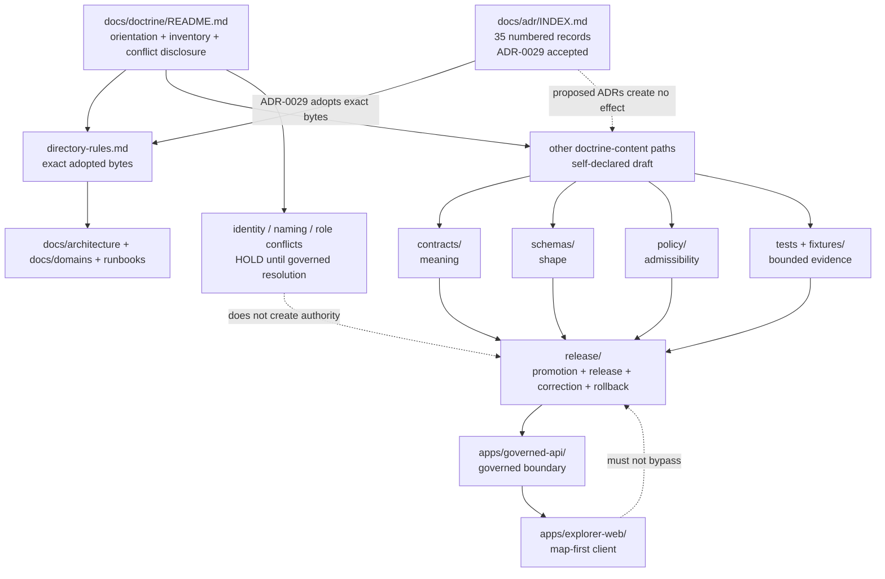

<!-- [KFM_META_BLOCK_V2]
doc_id: kfm://doc/doctrine/readme
title: docs/doctrine/ — Doctrine Landing Page
type: readme
subtype: directory-landing-page
version: v0.7
prior_version: v0.6
status: active; repository-grounded; documentation-only; non-authoritative
owner: "NEEDS VERIFICATION — CODEOWNERS routes /docs/doctrine/ to @bartytime4life; no accepted doctrine-steward assignment, required independent review rule, or release authority was verified"
created: 2026-05-18
updated: 2026-08-14
policy_label: public
current_path: docs/doctrine/README.md
owning_root: docs/
responsibility: orient readers to KFM-wide doctrine, distinguish doctrine from adjacent authority surfaces, inventory the current doctrine lane, and expose unresolved conflicts without deciding them
truth_posture: cite-or-abstain
truth_labels: [CONFIRMED, PROPOSED, UNKNOWN, NEEDS VERIFICATION, CONFLICTED, LINEAGE]
authority_class: directory landing page
authority_rank: subordinate to the doctrine documents and accepted decisions it indexes
canonical_relationship: same-path update; no sibling authority, alias, move, or generated mirror created
evidence_snapshot:
  repository: bartytime4life/Kansas-Frontier-Matrix
  base_ref: main
  base_commit: dc30e1d38f9a4ecf45fd589d388886fc872dd189
  target_prior_blob: 9481f8c5a231195a74aca7fd556a70b28dad2444
  doctrine_tree: 71eba24a7ae1c4d48b958fbaffe2670c55dfb6bb
  parent_docs_readme_blob: 1f8bac189dac1d01c1185e8b4fb8e25efd11d09f
  directory_rules_blob: fd49a0b83e55cef52c1124281f093e263526898d
  adr_index_blob: bf22ecf2ab6905f12e55520fb09defa84b5d2180
  adr_0029_blob: a4de0d7a96b78da59cfc499d1025e1508afd8dd9
  codeowners_blob: dd2a84aa514d8ecd9208bc347f90f9a2ed37dd61
  document_registry_blob: 217a13a9f7d9eeb6ee6ea0bf6eaa90a707a32f1a
  doctrine_required_registry_blob: 1215fadf99c39978bfa6a669c888396a7ef3e277
  docs_build_workflow_blob: 7816e07d66774d2e2b3b80b66d5d3349a1393861
  link_check_workflow_blob: 7b6c675d879a36d685b19b18fde401fca1bdd00e
  docs_meta_block_workflow_blob: c2054a053ba3050cf41b731d85a7a0996e9231f6
  docs_document_graph_workflow_blob: 636749f75621bf773ac558286789dadb41c47c35
  docs_stale_scan_workflow_blob: 4717668d30f98d9be2e6d2ebf57862e820cd41aa
  docs_control_plane_workflow_blob: ed0d3b50a12931b67cad005cd99433924c829fa3
related:
  - docs/README.md
  - docs/doctrine/directory-rules.md
  - docs/doctrine/authority-ladder.md
  - docs/doctrine/evidence-first.md
  - docs/doctrine/lifecycle-law.md
  - docs/doctrine/trust-membrane.md
  - docs/doctrine/truth-posture.md
  - docs/doctrine/derived-stays-derived.md
  - docs/doctrine/corrections-first-class.md
  - docs/doctrine/map-first.md
  - docs/doctrine/time-aware.md
  - docs/doctrine/policy-aware.md
  - docs/doctrine/sensitivity.md
  - docs/doctrine/retention.md
  - docs/doctrine/ai-as-assistant.md
  - docs/doctrine/encyclopedia.md
  - docs/doctrine/ai-build-operating-contract.md
  - docs/adr/INDEX.md
  - docs/adr/ADR-0029-adopt-directory-governance-standard-v2.md
  - docs/registers/DRIFT_REGISTER.md
  - docs/registers/VERIFICATION_BACKLOG.md
  - control_plane/document_registry.yaml
notes:
  - "v0.7 reconciles this landing page to current main and inventories all sixteen doctrine-content paths in the current direct-child tree."
  - "The doctrine directory contains seventeen files total: this README plus sixteen content paths; the sixteen content paths resolve to fifteen unique blobs because truth-posture.md and trust-membrane.md are byte-identical."
  - "ADR-0029 adopts the exact Directory Rules v2 bytes even though the adopted file's preserved internal document-control block still says PROPOSED_FOR_ADOPTION."
  - "The canonical ADR index contains thirty-five numbered records and twelve unassigned scaffolds; ADR-0029 is accepted and the other thirty-four numbered records remain proposed."
  - "This update records, but does not resolve, duplicate identity, filename drift, proposed-home mismatch, missing-reference targets, incomplete registry coverage, or stewardship gaps."
  - "The repository has bounded metadata, link, graph, freshness, and ADR/control-plane QA; docs-build and preview publication remain explicit holds."
  - "No doctrine meaning, ADR status, contract, schema, policy, source, lifecycle state, runtime behavior, release, deployment, or publication changes in this landing-page update."
[/KFM_META_BLOCK_V2] -->

# `docs/doctrine/`

> **The reader-facing entry point to KFM-wide invariants, vocabulary, authority boundaries, and change discipline.**

> [!IMPORTANT]
> **This README orients; it does not decide.** Doctrine states KFM-wide rules. Accepted ADRs amend decisions only within their stated scope. Contracts define meaning, schemas define machine shape, policy decides admissibility, tests and fixtures provide bounded evidence, `data/` owns lifecycle and accountability records, and `release/` owns release decisions. A badge, diagram, commit, pull request, index row, workflow result, or polished page is not proof of adoption, implementation, review, release, deployment, or publication.

> [!WARNING]
> **The doctrine lane is not conflict-free.** The current tree contains one exact duplicate-content pair, a path whose content is a different document class, a widely referenced but absent corrections filename, references to an absent `trust-posture.md`, and references to an absent `docs/architecture/maplibre-3d.md`. These are recorded below as `CONFLICTED` or `NEEDS VERIFICATION`; this one-file update does not choose migration targets or create replacement authority.

**Quick navigation:** [Purpose](#purpose) · [Authority](#authority-level) · [Status](#status) · [Belongs](#what-belongs-here) · [Exclusions](#what-does-not-belong-here) · [Inputs](#inputs) · [Outputs](#outputs) · [Validation](#validation) · [Review](#review-burden) · [Related](#related-folders) · [ADRs](#adrs) · [Last reviewed](#last-reviewed) · [Documents](#documents-in-this-folder) · [Reading order](#recommended-reading-order) · [Doctrine map](#doctrine-map) · [Conflicts](#conflict-and-hold-register) · [Change discipline](#change-discipline) · [Open verification](#open-questions--needs-verification) · [Rollback](#rollback-and-non-effects)

---

## Purpose

`docs/doctrine/` is the KFM-wide doctrine lane inside the canonical `docs/` responsibility root. Its direct-child documents explain the stable rules and vocabulary that constrain every domain, app, package, connector, pipeline, public surface, AI interaction, and release process.

This landing page serves four bounded purposes:

1. route readers to the doctrine document that owns a question;
2. distinguish current repository presence from adoption, enforcement, and publication;
3. expose conflicts, aliases, missing targets, and review debt without silently resolving them; and
4. preserve one same-path inventory and change surface for the doctrine directory.

| Reader question | Current path | Safe interpretation |
|---|---|---|
| What ranks above what when sources disagree? | [`authority-ladder.md`](./authority-ladder.md) | Draft doctrine; distinguishes decision authority from source role |
| What must support a consequential claim? | [`evidence-first.md`](./evidence-first.md) | Draft cite-or-abstain and evidence-resolution doctrine |
| How must material move before it can be public? | [`lifecycle-law.md`](./lifecycle-law.md) | Draft lifecycle doctrine |
| What may cross the governed public boundary? | [`trust-membrane.md`](./trust-membrane.md) | Draft trust-boundary doctrine |
| Why do maps, tiles, indexes, summaries, scenes, and AI outputs remain derivative? | [`derived-stays-derived.md`](./derived-stays-derived.md) | Draft carrier-versus-truth doctrine |
| How are errors, disputes, withdrawals, and rollback handled? | [`corrections-first-class.md`](./corrections-first-class.md) | Draft corrections doctrine; filename drift remains |
| Why is place the primary operating surface? | [`map-first.md`](./map-first.md) | Draft map-first doctrine |
| How are source, observed, valid, retrieval, release, correction, and transaction time kept distinct? | [`time-aware.md`](./time-aware.md) | Draft temporal doctrine |
| What gates exposure? | [`policy-aware.md`](./policy-aware.md) | Draft rights, sensitivity, source-term, review, release, and access doctrine |
| How is sensitive precision classified and transformed? | [`sensitivity.md`](./sensitivity.md) | Draft sensitivity doctrine |
| How long are records, receipts, proofs, releases, and tombstones retained? | [`retention.md`](./retention.md) | Draft retention doctrine |
| What may AI do, and what may it never decide? | [`ai-as-assistant.md`](./ai-as-assistant.md) | Draft AI-governance doctrine; proposed-home mismatch remains |
| Where do files belong? | [`directory-rules.md`](./directory-rules.md) | Exact bytes adopted by accepted ADR-0029 |
| What does a KFM doctrine term mean? | [`encyclopedia.md`](./encyclopedia.md) | Draft doctrine vocabulary index |
| Is `truth-posture.md` an independent doctrine source? | [`truth-posture.md`](./truth-posture.md) | **No current proof**; it is byte-identical to `trust-membrane.md` |
| Is `ai-build-operating-contract.md` currently the named operating contract? | [`ai-build-operating-contract.md`](./ai-build-operating-contract.md) | **CONFLICTED**; current content is a Markdown authoring-agent prompt |

This README is a navigation and status surface. It does not become doctrine merely because it lives beside doctrine.

[Back to top](#top)

---

## Authority level

| Field | Current posture |
|---|---|
| **Responsibility root** | `docs/` — human-readable governance and explanation |
| **Directory role** | KFM-wide invariants, stable vocabulary, and doctrine-level change rules |
| **This file** | Directory landing page; subordinate to the owning doctrine documents and accepted decisions it indexes |
| **Placement authority** | The exact Directory Rules v2 bytes at this path, adopted by accepted ADR-0029 |
| **What may amend doctrine** | A reviewed, unsuperseded decision that identifies the exact doctrine changed, scope, compatibility effect, correction path, and rollback consequence |
| **What does not amend doctrine** | This README, a proposed ADR, a self-declared draft status, a domain dossier, repository convention alone, model output, badge, commit, pull request, workflow result, or generated registry delta |
| **Publication authority** | None. This folder cannot approve policy, admit a source, promote lifecycle material, release artifacts, deploy software, or publish claims |

### Adopted bytes versus embedded status

`docs/doctrine/directory-rules.md` preserves an internal document-control label of `PROPOSED_FOR_ADOPTION`. Accepted [`ADR-0029`](../adr/ADR-0029-adopt-directory-governance-standard-v2.md) adopts those exact bytes and makes the doctrine path the single writable human-readable Directory Rules authority. The preserved label is part of the adopted byte set; this README must not rewrite it or treat it as evidence that adoption failed.

### Draft presence versus effective authority

The other doctrine-content paths currently self-declare `draft`. Presence, a title, a version, an RFC 2119 statement, or a claim of “Tier 1” does not independently prove adoption. Readers should preserve each document's stated scope and treat conflicts through the authority model rather than allowing cross-links or repetition to manufacture rank.

[Back to top](#top)

---

## Status

### Current repository snapshot

| Surface | Finding at `main@dc30e1d38f9a4ecf45fd589d388886fc872dd189` | Safe conclusion |
|---|---|---|
| This README | **CONFIRMED present**, prior blob `9481f8c5a231195a74aca7fd556a70b28dad2444` | Same-path v0.7 documentation update |
| Doctrine direct-child tree | **CONFIRMED 17 files total** | This README plus 16 doctrine-content paths |
| Doctrine content identity | **CONFIRMED 15 unique content blobs across 16 content paths** | One exact duplicate pair remains |
| Directory Rules | **CONFIRMED bytes** `fd49a0b…`; accepted by ADR-0029 | Adopted placement doctrine despite preserved internal proposal label |
| Other doctrine-content paths | **CONFIRMED present; self-declared draft** | Presence is not adoption or enforcement |
| `truth-posture.md` and `trust-membrane.md` | **CONFLICTED identity**, both blob `ded8c3b…` | Two paths currently carry the same Trust Membrane document |
| `ai-build-operating-contract.md` | **CONFLICTED role**, blob `54448cc…` | Filename implies operating contract; current H1 and metadata identify a Markdown authoring-agent prompt with a proposed home under `docs/prompts/` |
| Corrections filename | **CONFLICTED references** | Current file is `corrections-first-class.md`; repository code search finds 23 references to absent `corrections-are-first-class.md` |
| `trust-posture.md` | **CONFIRMED absent at the snapshot** | Existing references require correction, aliasing, or migration review |
| `docs/architecture/maplibre-3d.md` | **CONFIRMED absent at the snapshot** | Existing references are unresolved; proposed ADR-0007 does not create the file |
| CODEOWNERS | **CONFIRMED** `/docs/doctrine/ @bartytime4life` | GitHub review routing exists; stewardship, independent review, and release authority remain separate |
| ADR index | **CONFIRMED** 35 numbered records and 12 unassigned scaffolds | ADR-0029 is accepted; the other 34 numbered records remain proposed |
| ADR-0029 post-adoption notes | **STALE inventory sentence** mentions ADR-0034 as the current end | Decision remains accepted; canonical index now extends through ADR-0035 |
| Machine document registry | **CONFIRMED narrow PROPOSED scaffold** | It is not a complete doctrine inventory and creates no authority |
| Documentation QA | **CONFIRMED bounded workflows** for metadata, local links, document graph, stale scan, and ADR/control-plane coherence | Passing checks remain QA, not doctrine, review, release, or publication |
| Documentation build and preview | **Explicit HOLD** | No accepted generator, deterministic build command, preview artifact, hosting target, or publication handoff |

**Overall posture:** active doctrine directory; one adopted exact-byte placement standard; other content paths remain draft; multiple visible identity and naming conflicts; bounded documentation QA; no doctrine implementation, policy approval, source authority, release, deployment, or publication inferred.

### Truth-label rules for this page

- **CONFIRMED** means checked against the pinned repository tree, file bytes, ADR index, workflow source, or supplied governing artifact.
- **PROPOSED** means a future correction, migration, alias, decision, or classification not yet accepted.
- **CONFLICTED** means current admissible surfaces make incompatible identity, naming, placement, or role claims.
- **NEEDS VERIFICATION** means a concrete repository, review, or runtime check remains.
- **LINEAGE** means useful prior design or historical state that does not independently control the present.

[Back to top](#top)

---

## What belongs here

Content belongs in `docs/doctrine/` when its primary responsibility is to state or index a KFM-wide rule that:

- constrains every or nearly every domain and public surface;
- remains meaningful independent of one implementation framework;
- defines stable vocabulary used by contracts, schemas, policy, tests, release, and runtime surfaces;
- governs evidence, authority, lifecycle, public boundaries, derivation, correction, retention, sensitivity, time, map use, or AI limits; and
- requires explicit lineage and reviewed amendment when meaning changes.

Typical artifacts are:

- KFM-wide operating laws and invariants;
- stable, shared doctrine vocabulary;
- RFC 2119-style rules where normativity matters;
- doctrine-level correction, rollback, and retention rules;
- bounded indexes that route to doctrine without duplicating it; and
- accepted governance standards whose effective decision and exact bytes are traceable.

### Admission questions

Before adding another direct child, reviewers should be able to answer:

1. What KFM-wide invariant or vocabulary does it own?
2. Which existing doctrine does it refine without duplicating?
3. Why is this not architecture, policy, a contract, a standard profile, a runbook, or a prompt?
4. What accepted decision or existing doctrine supports its role?
5. What conflict, supersession, correction, and rollback path applies if its meaning changes?

An answer of “the topic is important” is not sufficient placement evidence.

## What does NOT belong here

| Content | Owning surface or current lane |
|---|---|
| Architecture decisions | [`docs/adr/`](../adr/) |
| System and subsystem realization, tradeoffs, and integration design | [`docs/architecture/`](../architecture/) |
| Domain-specific manuals | [`docs/domains/`](../domains/) |
| Focus Mode plans and geography-specific compositions | Current repository lane [`docs/focus-mode/`](../focus-mode/); naming and future placement remain governed |
| Operational procedures | [`docs/runbooks/`](../runbooks/) |
| Human governance procedures and registers | [`docs/governance/`](../governance/) and [`docs/registers/`](../registers/) |
| Tool instructions and agent prompts whose primary purpose is execution guidance | Current repository lane [`docs/prompts/`](../prompts/) |
| External-standard profiles | [`docs/standards/`](../standards/) |
| Machine authority maps and projections | [`control_plane/`](../../control_plane/) |
| Object meaning | [`contracts/`](../../contracts/) |
| Machine-valid shape | [`schemas/`](../../schemas/) |
| Admissibility and exposure decisions | [`policy/`](../../policy/) |
| Enforcement evidence and negative fixtures | [`tests/`](../../tests/) and [`fixtures/`](../../fixtures/) |
| Lifecycle material, registries, receipts, proofs, catalogs, and published carriers | [`data/`](../../data/) |
| Promotion, release, correction, withdrawal, and rollback decisions | [`release/`](../../release/) |
| Generated documentation builds and previews | Non-authoritative generated or compatibility lanes such as `artifacts/docs/`, only under an accepted generator contract |

> [!CAUTION]
> Documentation may explain any governed object or decision. It must not become a parallel writable copy of the owning ADR, contract, schema, policy decision, evidence bundle, test result, promotion record, release manifest, correction notice, rollback target, or generated artifact.

[Back to top](#top)

---

## Inputs

Admissible inputs include:

- current repository files and exact identities;
- accepted, unsuperseded decisions that explicitly amend doctrine;
- doctrine-ranked source artifacts with provenance and bounded scope;
- contracts, schemas, policy, tests, workflows, manifests, logs, and generated artifacts used only for the claims they can support;
- steward-reviewed corrections and supersession records; and
- authoritative external material when currentness, rights, security, or standards behavior matters.

Inputs retain their own authority class. Generated prose, planning artifacts, issue bodies, comments, badges, repository convention, test names, and repeated cross-links do not become doctrine merely because this page cites them. AI may assist retrieval, comparison, and drafting; it is not truth, policy, review, or release authority.

## Outputs

Doctrine may emit or constrain:

- KFM-wide vocabulary and invariants;
- requirements consumed by architecture and implementation;
- semantic constraints for contracts and schemas;
- policy obligations and failure postures;
- validation expectations and negative-test requirements;
- public-boundary, correction, rollback, retention, and sensitivity rules; and
- reviewed amendments, supersession relationships, and migration obligations.

Doctrine emits no source activation, lifecycle instance, evidence bundle, proof, policy decision, promotion, release artifact, deployment, or published claim. Machine projections derived from accepted doctrine belong in `control_plane/` or another owning machine authority and must preserve source identity and review status.

[Back to top](#top)

---

## Validation

### Current documentation controls

| Control | Repository-grounded posture | What a green result does not prove |
|---|---|---|
| Same-path identity | This update keeps `docs/doctrine/README.md`; no move, rename, sibling authority, or generated mirror | Doctrine adoption or implementation |
| Metadata | `docs-meta-block` performs bounded no-network metadata checks and emits a review-only document-registry delta | Registry mutation, owner assignment, or authority |
| Local links | `link-check` checks supported local Markdown targets in changed files without requesting external URLs | External availability, historical-tree completeness, or publication |
| Document graph | `docs-document-graph` builds a bounded review-only graph and checks changed graph-authoring receipts | Complete semantic agreement or doctrine rank |
| Freshness | `docs-stale-scan` runs advisory no-network review-age and placeholder checks | Human review, correctness, or release |
| ADR/control plane | `docs-control-plane` validates YAML structure, a bounded register meta contract, and ADR-index coherence | Acceptance of an ADR or semantic correctness of every register field |
| Build | `docs-build` deliberately records a generator and preview **HOLD** | Rendered site, accessibility, reproducibility, hosting, release, or publication |

### Authoring checks for v0.7

The authoring pass for this change checks the complete replacement source for:

- one H1 and preserved `top` and `scope` anchors;
- a parseable `KFM_META_BLOCK_V2`;
- balanced fenced code blocks;
- no tabs or trailing whitespace;
- unique generated heading slugs;
- resolvable local fragment links;
- current direct-child inventory and key blob identities;
- accurate ADR counts and statuses; and
- no claim that hosted checks passed before GitHub reports them.

Repository-native hosted checks remain **PENDING** until the draft pull request records them. A passing documentation workflow remains bounded QA and cannot create doctrine, policy, review, release, deployment, or publication authority.

[Back to top](#top)

---

## Review burden

- `.github/CODEOWNERS` routes `/docs/doctrine/` to `@bartytime4life`.
- CODEOWNERS routing is not a StewardshipAssignment, ReviewRecord, branch-protection rule, independent approval, policy decision, release approval, or proof that review occurred.
- This v0.7 change updates navigation, inventory, status, and conflict disclosure. It does **not** amend doctrine meaning or accept any draft doctrine document.
- A future change that alters a KFM-wide invariant, resolves a competing doctrine identity, changes the authority owner of a path, or promotes a draft requires the owning decision process, compatibility review, correction path, and rollback plan.
- Sensitive material must remain redacted or generalized even in doctrine examples; a public documentation path is an exposure boundary.
- Do not self-approve, auto-merge, release, deploy, or publish from this documentation update.

[Back to top](#top)

---

## Related folders

| Path | Relationship |
|---|---|
| [`../README.md`](../README.md) | Parent `docs/` responsibility contract |
| [`../adr/INDEX.md`](../adr/INDEX.md) | Canonical human ADR inventory and effective-status crosswalk |
| [`../architecture/`](../architecture/) | System and subsystem realization subordinate to doctrine and accepted decisions |
| [`../domains/`](../domains/) | Domain-lane human guidance |
| [`../focus-mode/`](../focus-mode/) | Current repository Focus Mode documentation lane |
| [`../governance/`](../governance/) | Human governance procedures |
| [`../prompts/`](../prompts/) | Current repository tool and agent prompt lane |
| [`../registers/DRIFT_REGISTER.md`](../registers/DRIFT_REGISTER.md) | Human drift register |
| [`../registers/VERIFICATION_BACKLOG.md`](../registers/VERIFICATION_BACKLOG.md) | Human verification backlog |
| [`../../control_plane/document_registry.yaml`](../../control_plane/document_registry.yaml) | Narrow PROPOSED machine document-registry scaffold |
| [`../../control_plane/document_registry_doctrine_required.yaml`](../../control_plane/document_registry_doctrine_required.yaml) | Narrow required-artifact projection; not a complete doctrine index |
| [`../../contracts/README.md`](../../contracts/README.md) | Semantic contract root |
| [`../../schemas/README.md`](../../schemas/README.md) | Machine-shape root |
| [`../../policy/README.md`](../../policy/README.md) | Admissibility root |
| [`../../tests/README.md`](../../tests/README.md) | Enforceability root |
| [`../../release/README.md`](../../release/README.md) | Release decision root |
| [`../../apps/governed-api/README.md`](../../apps/governed-api/README.md) | Governed public-client boundary documentation |
| [`../../apps/explorer-web/README.md`](../../apps/explorer-web/README.md) | Map-first client documentation |

[Back to top](#top)

---

## ADRs

| ADR or index | Subject | Effective status at the evidence snapshot |
|---|---|---|
| [`ADR-0001`](../adr/ADR-0001-schema-home--schemas-contracts-v1-is-canonical.md) | `schemas/contracts/v1/` as default schema home | `proposed` |
| [`ADR-0003`](<../adr/ADR-0003-policy-singular-is-canonical-(policies-is-compatibility).md>) | `policy/` singular as canonical | `proposed` |
| [`ADR-0007`](<../adr/ADR-0007 — MapLibre GL JS Is the Sole Browser-Side Renderer.md>) | MapLibre GL JS as sole browser-side renderer | `proposed` |
| [`ADR-0029`](../adr/ADR-0029-adopt-directory-governance-standard-v2.md) | Exact Directory Governance Standard v2 adoption and controlled compatibility migration | `accepted` |
| [`ADR-0035`](../adr/ADR-0035-repository-wide-adr-identity-numbering-and-domain-indexing.md) | Repository-wide ADR identity, numbering, and domain indexing | `proposed` |
| [`ADR index`](../adr/INDEX.md) | 35 numbered records and 12 unassigned scaffolds | 1 `accepted`; 34 `proposed` |

The canonical ADR index, not this README, owns the current inventory. An index row cannot accept a decision. ADR-0029's v1.3 notes contain an older sentence ending the inventory at ADR-0034; that is documentation drift inside the post-adoption record, not evidence that ADR-0035 is absent or that ADR-0029 changed status.

[Back to top](#top)

---

## Last reviewed

**2026-08-14** — v0.7 reconciled the doctrine landing page to `main@dc30e1d38f9a4ecf45fd589d388886fc872dd189`.

Re-review when an event- or risk-based trigger applies under [`directory-rules.md` §16.5](./directory-rules.md#165-review-triggers), including a direct-child addition/removal, doctrine-status transition, accepted ADR that amends doctrine, identity or duplicate-content change, path migration, material workflow change, sensitive-domain rule change, or a new public consumer.

| Edition | Date | Change |
|---|---|---|
| **v0.7** | 2026-08-14 | Replaced stale counts and snapshot claims; inventoried every current direct child; distinguished adopted Directory Rules bytes from preserved embedded status; added map, time, policy, sensitivity, retention, corrections, and AI doctrine paths; documented current duplicate, role, and filename conflicts; reconciled current documentation QA; added a reading order, conflict register, no-loss ledger, and rollback boundary. **No doctrine changed.** |
| **v0.6** | 2026-08-12 | Corrected the stale claim that `link-check` was held; preserved the separate `docs-build` hold. **No doctrine changed.** |
| **v0.5** | 2026-07-26 | Reflected accepted ADR-0029, exact v2 adoption, restored legacy compatibility, and continuing tombstone/deletion holds. **No doctrine changed.** |
| **v0.4** | 2026-07-26 | Refreshed the proposed v2 ratification packet and ADR inventory labels. **No doctrine changed.** |
| **v0.3** | 2026-07-23 | Reconciled path presence and status, preserved stable anchors, exposed identity conflicts, repaired links, and aligned the folder README section order. **No doctrine changed.** |
| **v0.2** | 2026-05-25 | Added metadata, navigation, doctrine encyclopedia context, badges, and expanded open questions. |
| **v0.1** | Undated | Initial landing page. |

[Back to top](#top)

---

## Documents in this folder

The table inventories every direct-child doctrine-content path at the pinned snapshot. It excludes this README from the content count.

| File | Blob | Reader role | Repository-grounded status |
|---|---|---|---|
| [`directory-rules.md`](./directory-rules.md) | `fd49a0b…` | Placement, root, naming, migration, README, and rollback doctrine | Exact bytes adopted by ADR-0029; embedded `PROPOSED_FOR_ADOPTION` label preserved |
| [`authority-ladder.md`](./authority-ladder.md) | `452d887…` | Documentation and decision authority tiers | v1.1 `draft` |
| [`evidence-first.md`](./evidence-first.md) | `dc71342…` | Evidence closure and cite-or-abstain | v1.1 `draft` |
| [`lifecycle-law.md`](./lifecycle-law.md) | `4eb1f0a…` | Governed lifecycle and publication transition | v1.1 `draft` |
| [`trust-membrane.md`](./trust-membrane.md) | `ded8c3b…` | Trust-warranty view of the governed boundary | v1 `draft` |
| [`truth-posture.md`](./truth-posture.md) | `ded8c3b…` | Filename implies truth posture | **CONFLICTED** — exact duplicate of `trust-membrane.md` |
| [`derived-stays-derived.md`](./derived-stays-derived.md) | `b9796b8…` | Carrier-versus-sovereign-truth rule | v1.0 `draft` |
| [`corrections-first-class.md`](./corrections-first-class.md) | `f396cd1…` | Correction, withdrawal, supersession, and rollback doctrine | v1.1 `draft`; absent-name references remain |
| [`map-first.md`](./map-first.md) | `a3fac71…` | Governed map-as-primary-operating-surface doctrine | v1.1 `draft` |
| [`time-aware.md`](./time-aware.md) | `63a7be5…` | Temporal dimensions, uncertainty, and currentness separation | v1.1 `draft` |
| [`policy-aware.md`](./policy-aware.md) | `366c094…` | Rights, sensitivity, source terms, review, release, and access gates | v1.1 `draft` |
| [`sensitivity.md`](./sensitivity.md) | `d308f01…` | Sensitivity classification and deterministic transforms | v1.0 `draft` |
| [`retention.md`](./retention.md) | `be7801e…` | Retention, tombstones, archival, and erasure limits | v1.0 `draft` |
| [`ai-as-assistant.md`](./ai-as-assistant.md) | `87f4d23…` | AI as assistant, never authority | v1.1 `draft`; metadata proposes a different filename |
| [`encyclopedia.md`](./encyclopedia.md) | `a5c8f45…` | Doctrine vocabulary and concept index | v0.1 `draft` |
| [`ai-build-operating-contract.md`](./ai-build-operating-contract.md) | `54448cc…` | Filename implies doctrine-level AI operating contract | **CONFLICTED** — current content is a Markdown authoring-agent prompt |

**Inventory totals:** 16 content paths · 15 unique content blobs · 1 exact duplicate-content pair · 1 README landing page.

File presence, an H1, version label, `draft` status, RFC 2119 wording, or an internal claim of canonicality does not prove adoption, implementation, enforcement, review, release, deployment, or publication.

[Back to top](#top)

---

## Recommended reading order

### New contributor path

1. [`directory-rules.md`](./directory-rules.md) — understand responsibility-root placement and finite placement outcomes.
2. [`authority-ladder.md`](./authority-ladder.md) — distinguish governing decisions from source roles and planning lineage.
3. [`evidence-first.md`](./evidence-first.md) — understand `EvidenceRef → EvidenceBundle` and cite-or-abstain.
4. [`lifecycle-law.md`](./lifecycle-law.md) and [`trust-membrane.md`](./trust-membrane.md) — understand how material moves and what may cross the public boundary.
5. [`derived-stays-derived.md`](./derived-stays-derived.md) and [`corrections-first-class.md`](./corrections-first-class.md) — understand carriers, correction, withdrawal, and rollback.
6. [`map-first.md`](./map-first.md), [`time-aware.md`](./time-aware.md), and [`policy-aware.md`](./policy-aware.md) — understand place, time, and exposure gates.
7. [`sensitivity.md`](./sensitivity.md), [`retention.md`](./retention.md), and [`ai-as-assistant.md`](./ai-as-assistant.md) — understand high-risk handling, memory, and AI limits.
8. [`encyclopedia.md`](./encyclopedia.md) — use as a vocabulary index after reading the owning doctrine.

### Reviewer path

A reviewer resolving a disputed statement should:

1. classify the question: existence, behavior, placement, meaning, admissibility, or release;
2. inspect current repository evidence for current-state claims;
3. inspect accepted ADRs and adopted doctrine for authority;
4. inspect the owning contract, schema, policy, test, evidence, or release object;
5. preserve unresolved contradictions as `CONFLICTED`, `UNKNOWN`, or `NEEDS VERIFICATION`; and
6. correct this landing page if its summary drifts from the owning authority.

Do not use `truth-posture.md` or `ai-build-operating-contract.md` as independent authority until their current identity conflicts are resolved.

[Back to top](#top)

---

## Doctrine map

```mermaid
flowchart TD
    README["docs/doctrine/README.md<br/>orientation + inventory + conflict disclosure"]

    ADR["docs/adr/INDEX.md<br/>35 numbered records<br/>ADR-0029 accepted"]
    DIR["directory-rules.md<br/>exact adopted bytes"]
    DRAFT["other doctrine-content paths<br/>self-declared draft"]
    HOLD["identity / naming / role conflicts<br/>HOLD until governed resolution"]

    README --> DIR
    README --> DRAFT
    README --> HOLD
    ADR -->|"ADR-0029 adopts exact bytes"| DIR
    ADR -.->|"proposed ADRs create no effect"| DRAFT

    DIR --> DOCS["docs/architecture + docs/domains + runbooks"]
    DRAFT --> CONTRACTS["contracts/<br/>meaning"]
    DRAFT --> SCHEMAS["schemas/<br/>shape"]
    DRAFT --> POLICY["policy/<br/>admissibility"]
    DRAFT --> TESTS["tests + fixtures/<br/>bounded evidence"]

    CONTRACTS --> RELEASE["release/<br/>promotion + release + correction + rollback"]
    SCHEMAS --> RELEASE
    POLICY --> RELEASE
    TESTS --> RELEASE

    RELEASE --> API["apps/governed-api/<br/>governed boundary"]
    API --> UI["apps/explorer-web/<br/>map-first client"]

    UI -. "must not bypass" .-> RELEASE
    HOLD -. "does not create authority" .-> RELEASE
```

The diagram is a responsibility map, not runtime proof. The doctrine documents constrain downstream design only to the extent supported by their effective authority, accepted decisions, and owning artifacts.

[Back to top](#top)

---

## Conflict and hold register

| ID | Surface | Current evidence | Safe disposition | Resolution class |
|---|---|---|---|---|
| `DOC-DOC-001` | `truth-posture.md` versus `trust-membrane.md` | Same blob `ded8c3b…`; both H1s say Trust Membrane | `HOLD` independent truth-posture claims; preserve both paths until identity and consumers are reviewed | Correction, mirror declaration, or migration decision |
| `DOC-DOC-002` | `ai-build-operating-contract.md` | Current H1 is “KFM Repository Markdown Authoring Agent — Full Operating Prompt”; metadata proposes `docs/prompts/ai-builder-markdown-authoring.md` | `HOLD` doctrine-level contract claims from this path | Authority/placement reconciliation and inbound-link migration |
| `DOC-DOC-003` | Corrections doctrine filename | Actual file is `corrections-first-class.md`; code search finds 23 references to absent `corrections-are-first-class.md` | Use the actual current path for new links; do not mass-rewrite without inbound-reference and identity review | Naming migration or reviewed alias |
| `DOC-DOC-004` | `trust-posture.md` references | Referenced by multiple doctrine documents but absent in the current tree | Mark references unresolved; do not infer an intended target | Verification and correction |
| `DOC-DOC-005` | `docs/architecture/maplibre-3d.md` references | Repeatedly referenced but absent at the snapshot; ADR-0007 remains proposed | Do not claim the architecture page or accepted sole-renderer decision exists | Verification, creation request, or migration decision |
| `DOC-DOC-006` | `ai-as-assistant.md` identity | Current path exists; metadata proposes `ai-as-assistant-not-authority.md` | Treat current tracked path as repository fact; proposed home creates no move | Naming/identity review |
| `DOC-DOC-007` | Doctrine encyclopedia relationship | `docs/doctrine/encyclopedia.md` and `docs/encyclopedia/` serve different declared roles, but maintenance precedence is not machine-enforced | Preserve distinction and avoid silent content copying | Authority and maintenance decision |
| `DOC-DOC-008` | Machine document registry | Registry contains one pointer and a three-item required-artifact projection | Do not treat it as exhaustive or authoritative doctrine inventory | Registry build-out with accepted source mapping |
| `DOC-DOC-009` | ADR count in ADR-0029 notes | v1.3 note ends at ADR-0034; canonical index now includes ADR-0035 | Use canonical index for inventory; decision status unchanged | Bounded documentation correction |
| `DOC-DOC-010` | Ownership and independent review | CODEOWNERS names one verified route; doctrine files contain placeholder role names | Do not represent placeholders as assigned owners or approvals | Stewardship assignment and repository-rule verification |
| `DOC-DOC-011` | Documentation generation | `docs-build` and preview jobs explicitly hold | Do not claim generated-site, preview, hosting, or publication readiness | Accepted generator and preview contract |

This register is a reader aid inside a non-authoritative landing page. It does not replace `docs/registers/DRIFT_REGISTER.md`, create a PathDecisionRecord, accept an ADR, or authorize a migration.

[Back to top](#top)

---

## Change discipline

| Change | Minimum treatment |
|---|---|
| Typo, dead-link repair, stale count correction, navigation improvement | Routine scoped PR with bounded documentation checks |
| Clarify existing doctrine without changing meaning | Scoped PR; preserve anchors, sources, terminology, and no-loss mapping |
| Add a new doctrine direct child | Responsibility and duplicate-content preflight; exact owner and scope; related-doc updates; status and review route |
| Add, remove, rename, or reverse a KFM-wide invariant | Accepted ADR or equivalent reviewed amendment, explicit supersession, compatibility analysis, correction path, and rollback |
| Move or rename a doctrine file | Directory Rules placement outcome, inbound-link inventory, identity mapping, alias/migration plan, and reversible cutover |
| Resolve an exact duplicate path | Consumer inventory, authority decision, single-write target, correction notice or migration record, and rollback |
| Promote a draft or proposed record | Matching reviewed status in the owning record and indexes; never inferred by this README |
| Retire doctrine | Supersession target, preserved lineage, correction path, reference migration, and rollback plan |
| Generate a mirror or preview | Canonical source, deterministic generator, manifest/digest, non-authoritative classification, and exit criteria |

Prefer the smallest useful, reversible delta. Presentation must project evidence, not manufacture maturity. A one-file landing-page update may report a conflict; it may not resolve an authority-changing conflict by implication.

### No-loss ledger for v0.6 → v0.7

| v0.6 concern | v0.7 treatment |
|---|---|
| Reader orientation and non-authoritative role | Retained and strengthened |
| Accepted Directory Rules boundary | Retained; adopted-byte versus embedded-status distinction made explicit |
| Truth-posture duplicate warning | Retained with current tree/blob evidence |
| AI operating-contract role conflict | Retained with current H1 and proposed-home evidence |
| Workflow status | Expanded to metadata, links, graph, stale scan, ADR/control plane, and docs-build hold |
| Required first twelve H2 sections | Preserved in order |
| Stable `top` and `scope` anchors | Preserved |
| Related roots and key ADRs | Retained and updated |
| Open questions | Preserved, deduplicated, and converted into an explicit conflict/hold register |
| Publication and non-effects boundary | Retained and expanded |
| Prior version history | Retained |

[Back to top](#top)

---

## Open questions / NEEDS VERIFICATION

1. **CONFLICTED — truth-posture identity.** Should `truth-posture.md` become a distinct cite-or-abstain doctrine, a declared one-way mirror, a compatibility alias, or a retired path?
2. **CONFLICTED — AI operating-contract identity.** Which current artifact owns the KFM AI Build Operating Contract, and should the Markdown authoring prompt move to its proposed prompt lane?
3. **CONFLICTED — corrections filename.** Should `corrections-first-class.md` remain canonical, or should a reviewed alias/migration adopt `corrections-are-first-class.md`?
4. **NEEDS VERIFICATION — missing doctrine targets.** Which references to `trust-posture.md`, `trust-labels.md`, `evidence-model.md`, `source-roles.md`, and similar absent doctrine paths are aliases, planned files, or stale links?
5. **NEEDS VERIFICATION — complete inbound graph.** Which external documents, code comments, schemas, policies, workflows, and generated artifacts depend on each doctrine path or anchor?
6. **NEEDS VERIFICATION — ownership.** Which verified people or teams hold doctrine stewardship, architecture review, policy review, sensitivity review, and independent approval duties?
7. **NEEDS VERIFICATION — enforcement.** Which doctrine statements have matching contracts, schemas, policy, negative fixtures, tests, workflows, runtime evidence, and release artifacts?
8. **OPEN — encyclopedia relationship.** What is the accepted maintenance and precedence relationship between `docs/doctrine/encyclopedia.md`, `docs/encyclopedia/`, root `docs/KFM-encyclopedia.md`, and the attached planning corpus?
9. **NEEDS VERIFICATION — renderer documentation.** Is a `maplibre-3d` architecture page still intended, superseded by another current page, or blocked on ADR-0007?
10. **NEEDS VERIFICATION — documentation registry.** What reviewed source should populate a complete machine doctrine inventory, and how will duplicate identity and supersession be represented?
11. **NEEDS VERIFICATION — required checks.** Which documentation workflows are required by repository rules, and what exact-head hosted evidence is required before a doctrine change can be marked ready for review?
12. **OPEN — draft doctrine adoption model.** Does KFM intend per-document acceptance, a bundle-level ratification, or continued doctrine-by-reference under a higher accepted contract?

[Back to top](#top)

---

## Rollback and non-effects

### Rollback

Revert the single commit that updates `docs/doctrine/README.md`. The path, document ID, stable anchors, doctrine-content files, ADR index, workflows, and machine registries remain unchanged, so rollback requires no path migration or data repair.

### Non-effects

This landing-page update does **not**:

- amend, accept, reject, supersede, or retire doctrine;
- change ADR status or reserve an ADR number;
- rewrite the exact adopted Directory Rules bytes;
- resolve duplicate identity, naming, proposed-home, or missing-target conflicts;
- assign stewards, reviewers, policy authority, or release authority;
- modify contracts, schemas, policy, fixtures, tests, workflows, machine registries, data, receipts, proofs, catalogs, releases, or runtime code;
- activate a source or connector;
- promote lifecycle material;
- release, deploy, publish, or change repository settings; or
- make a generated preview, badge, diagram, or CI result authoritative.

This file is a navigation, inventory, and status surface. When it conflicts with an owning doctrine document, accepted decision, contract, schema, policy, test evidence, source/evidence object, or release record, use the owning authority, preserve the conflict, and correct this README.
