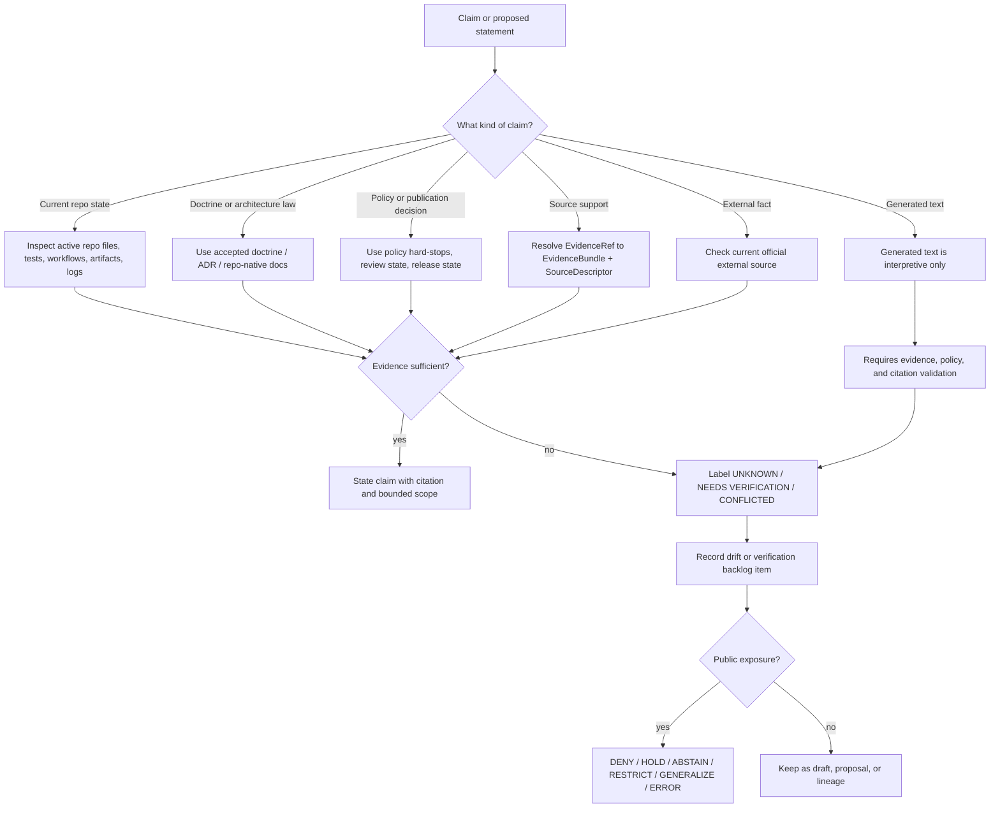

<!-- [KFM_META_BLOCK_V2]
doc_id: kfm://doc/NEEDS-VERIFICATION/authority-ladder-doctrine
title: Authority Ladder
type: standard
version: v1
status: draft
owners: NEEDS_VERIFICATION
created: NEEDS_VERIFICATION
updated: 2026-05-06
policy_label: NEEDS_VERIFICATION
related: [README.md, truth-posture.md, trust-membrane.md, lifecycle-law.md, ../registers/AUTHORITY_LADDER.md, ../registers/CANONICAL_LINEAGE_EXPLORATORY.md, ../registers/DRIFT_REGISTER.md, ../registers/VERIFICATION_BACKLOG.md, ../adr/ADR-0001-schema-home.md, ../../README.md, ../../policy/README.md]
tags: [kfm, doctrine, authority, evidence, governance]
notes: [NEEDS VERIFICATION: doc_id, owners, created date, policy label, and publication status must be confirmed against the active repository governance records before publication.]
[/KFM_META_BLOCK_V2] -->

<a id="top"></a>

# Authority Ladder

Defines what outranks what when KFM doctrine, repository evidence, source material, generated artifacts, policy gates, and external references disagree.

<p align="left">
  
  
  
  
  
</p>

> [!IMPORTANT]
> This file is doctrine. It defines KFM’s authority law for resolving claims.  
> The operational register at [`../registers/AUTHORITY_LADDER.md`](../registers/AUTHORITY_LADDER.md) records the repo-facing control-plane ladder and should stay synchronized with this doctrine.

**Quick jumps:** [Scope](#scope) · [Repo fit](#repo-fit) · [Inputs](#inputs) · [Exclusions](#exclusions) · [Core rule](#core-rule) · [Authority ladder](#authority-ladder-1) · [Claim-type matrix](#claim-type-matrix) · [Conflict protocol](#conflict-protocol) · [Citation rules](#citation-rules) · [Diagram](#diagram) · [Review gates](#review-gates) · [Appendix](#appendix)

---

## Scope

KFM’s authority ladder exists to stop persuasive material from becoming accidental truth.

It applies when maintainers need to decide:

- which source controls a doctrine claim;
- which evidence proves current repository behavior;
- which gate can block publication;
- whether a generated artifact is proof, derivative, receipt, or release material;
- whether AI output may be used in a public-facing answer;
- whether an external reference updates a technical fact without rewriting KFM doctrine.

This file expands the prior authority-ladder stub into a repo-ready doctrine page while preserving its core rule: **EvidenceBundle and policy outrank AI text.**

### Operating posture

| Term | Meaning here |
|---|---|
| **Authority** | The source class allowed to decide a claim type. |
| **Evidence** | Inspectable support such as repo files, schemas, tests, receipts, proof objects, source records, release manifests, or cited doctrine. |
| **Policy hard-stop** | A rights, safety, sensitivity, review, or release rule that can block exposure even when a claim has evidence. |
| **Implementation proof** | Current repo, test, workflow, runtime, log, receipt, release, or generated-artifact evidence inspected directly. |
| **Doctrine** | Current governing KFM law: truth posture, trust membrane, lifecycle law, source authority, publication posture, correction posture, and governed AI boundaries. |

[Back to top](#top)

---

## Repo fit

| Relationship | Path | Status | Role |
|---|---:|---|---|
| This file | `docs/doctrine/authority-ladder.md` | **draft** | Stable doctrine for source precedence and conflict resolution. |
| Local doctrine index | [`README.md`](README.md) | **CONFIRMED thin / NEEDS EXPANSION** | Directory landing for doctrine docs. |
| Truth labels | [`truth-posture.md`](truth-posture.md) | **CONFIRMED thin** | Companion truth-label doctrine. |
| Public claim boundary | [`trust-membrane.md`](trust-membrane.md) | **CONFIRMED thin** | Companion inspectable-claim and trust membrane doctrine. |
| Lifecycle law | [`lifecycle-law.md`](lifecycle-law.md) | **CONFIRMED thin** | Companion RAW-to-PUBLISHED lifecycle law. |
| Operational ladder | [`../registers/AUTHORITY_LADDER.md`](../registers/AUTHORITY_LADDER.md) | **CONFIRMED** | Register-level ladder, claim examples, and conflict protocol. |
| Source classification | [`../registers/CANONICAL_LINEAGE_EXPLORATORY.md`](../registers/CANONICAL_LINEAGE_EXPLORATORY.md) | **CONFIRMED** | Classifies canonical, lineage, exploratory, reference, and superseded material. |
| Drift control | [`../registers/DRIFT_REGISTER.md`](../registers/DRIFT_REGISTER.md) | **CONFIRMED** | Records contradictions and authority drift. |
| Verification gaps | [`../registers/VERIFICATION_BACKLOG.md`](../registers/VERIFICATION_BACKLOG.md) | **CONFIRMED** | Tracks unresolved implementation, workflow, source, and proof gaps. |
| Schema-home decision | [`../adr/ADR-0001-schema-home.md`](../adr/ADR-0001-schema-home.md) | **CONFIRMED draft** | Proposed contract/schema machine-authority decision. |
| Root orientation | [`../../README.md`](../../README.md) | **CONFIRMED** | Repository-level project posture and trust law. |
| Policy lane | [`../../policy/README.md`](../../policy/README.md) | **CONFIRMED** | Policy decision surface and deny-by-default posture. |

> [!NOTE]
> `docs/doctrine/` is the right home for this file because it states stable system law. Register entries, source inventories, ADR decisions, schemas, policy code, fixtures, generated receipts, and release artifacts belong in their own responsibility roots.

[Back to top](#top)

---

## Inputs

Use this doctrine when reviewing or citing:

| Input | Accepted when it is used to… |
|---|---|
| KFM doctrine docs | Define system law, trust posture, lifecycle law, publication boundaries, or AI constraints. |
| Accepted ADRs | Resolve specific architecture, path, schema, policy, runtime, or governance decisions. |
| Repo files and command output | Prove current repository structure, file content, package markers, workflows, tests, or implementation state. |
| Contracts and schemas | Define semantic meaning and machine-checkable object shape. |
| Policy rules and policy docs | Decide allow, deny, restrict, abstain, hold, review, release, and correction posture. |
| Fixtures, tests, receipts, proofs, catalogs, releases | Prove behavior, integrity, validation, publication state, or rollback state. |
| Source descriptors and EvidenceBundles | Support source authority, rights, provenance, claims, and citations. |
| Lineage docs | Preserve rationale and prior doctrine without becoming current canon by repetition. |
| Exploratory material | Feed intake and backlog only after status is clearly marked. |
| External official references | Verify current external facts, standards, APIs, formats, or tool behavior. |

## Exclusions

This file must not be used to:

| Exclusion | Use instead |
|---|---|
| Claim a route, workflow, package, schema, test, or release artifact exists without direct evidence. | Active repo inspection and [`../registers/VERIFICATION_BACKLOG.md`](../registers/VERIFICATION_BACKLOG.md). |
| Define executable schema shape. | `schemas/` and the active schema-home ADR. |
| Define policy-as-code. | `policy/`. |
| Store source descriptors or source instances. | `data/registry/`, `docs/sources/`, or the repo-confirmed source registry home. |
| Store receipts, proofs, catalogs, or release manifests. | `data/receipts/`, `data/proofs/`, `data/catalog/`, and `release/` after repo verification. |
| Promote New Ideas packets into current law. | `docs/intake/` and the canon/lineage/exploratory register. |
| Treat AI output as evidence. | EvidenceRef → EvidenceBundle resolution, policy checks, citation validation, and finite runtime envelopes. |

[Back to top](#top)

---

## Core rule

KFM uses a **claim-type authority ladder**, not a single flat citation list.

A source can be authoritative for one claim type and non-authoritative for another.

Examples:

| Claim | Correct authority |
|---|---|
| “KFM should cite or abstain.” | Current doctrine / accepted ADR / root doctrine. |
| “This file exists on `main`.” | Direct repository evidence. |
| “This route returns `ANSWER`.” | Runtime test, route inspection, trace, or release evidence. |
| “This source may be public.” | SourceDescriptor, rights review, policy decision, and release state. |
| “This map layer is released.” | LayerManifest / ReleaseManifest / catalog and proof closure. |
| “The model said it.” | Not sufficient. AI text is interpretive only. |

### One-line doctrine

```text
Current evidence decides current facts; doctrine decides governing law; policy can block exposure; generated language never outranks evidence.
```

[Back to top](#top)

---

## Authority ladder

Use the highest relevant rung for the claim being made.

| Rung | Authority class | Decides | Cannot decide by itself |
|---:|---|---|---|
| 0 | **Legal, safety, rights, sensitivity, sovereignty, steward, and policy hard-stops** | Whether exposure, publication, export, AI answer, exact geometry, or release must be blocked, restricted, generalized, embargoed, or reviewed. | Historical truth, source content, or implementation reality. A hard-stop blocks or constrains exposure; it does not rewrite evidence. |
| 1 | **Direct current implementation evidence** | Current repo state, path existence, file content, package markers, workflow YAML, tests, emitted artifacts, runtime traces, logs, release manifests, receipts, proofs, and dashboards when directly inspected. | KFM doctrine unless supported by accepted governance docs or ADRs. |
| 2 | **Accepted ADRs and current repo-native doctrine** | File-home decisions, architecture boundaries, system law, trust posture, lifecycle law, publication law, schema-home decisions, correction/rollback posture. | Current runtime behavior unless backed by implementation evidence. |
| 3 | **Versioned contracts, schemas, and policy surfaces** | Object meaning, machine-checkable shape, policy-readable inputs, finite outcome shape, validation targets, release-candidate structure. | Source truth, runtime behavior, or public release unless supported by fixtures, tests, policy decisions, and release evidence. |
| 4 | **Current architecture, standards, runbooks, and domain docs under `docs/`** | Intended behavior, operator procedures, review burden, domain-specific interpretation, source-role discipline, UI/API expectations. | Current implementation maturity unless directly verified. |
| 5 | **Attached KFM doctrine corpus and high-trust synthesis reports** | Governing KFM concepts, continuity, architecture intent, source-family weighting, and proposed realization pressure where not yet repo-native. | Current branch contents, active tests, workflows, runtime routes, dashboards, or deployment posture. |
| 6 | **Subsystem and domain lineage reports** | Domain-specific rationale, historical design pressure, object-family patterns, public-safety considerations, source families, and proposed file plans. | Current repo implementation unless the matching files are inspected. |
| 7 | **Lineage and superseded material** | Why a decision exists, what changed, what was preserved, and what should not be lost. | Current canon unless re-promoted through review and evidence. |
| 8 | **Exploratory packets and generated planning notes** | Intake, backlog, implementation ideas, source-refresh candidates, and future PR pressure. | Canon, implementation proof, policy permission, or publication readiness. |
| 9 | **External references** | Current external standards, APIs, source-system behavior, formats, licenses, tool versions, and factual background. | KFM doctrine, policy, release posture, or source authority unless explicitly adopted by ADR, policy, contract, or source descriptor. |

> [!CAUTION]
> External official sources are authoritative for their own current facts. They do **not** silently override KFM doctrine. If an external source reveals that KFM doctrine is wrong or stale, record a proposed correction, ADR, or verification item.

[Back to top](#top)

---

## Claim-type matrix

Use this matrix when writing docs, reviews, PR notes, release notes, or public-facing explanations.

| Claim type | Minimum evidence before saying it as fact | Default label if not proven |
|---|---|---|
| KFM doctrine says X | Current doctrine file, accepted ADR, or high-trust corpus source when no repo-native doctrine exists. | **PROPOSED** or **NEEDS VERIFICATION** |
| The repo contains X | Direct file/tree inspection in the active repo or GitHub connector evidence for the referenced branch/ref. | **UNKNOWN** |
| This path is canonical | Directory Rules + active ADR + current repo evidence + no conflicting register entry. | **PROPOSED** / **CONFLICTED** |
| The system currently does X | Source code, tests, workflow run, runtime trace, emitted artifact, dashboard, or log inspected directly. | **UNKNOWN** |
| Policy requires or forbids X | Policy doc/rule plus fixture/test evidence, or accepted doctrine clearly marked as doctrine-only. | **NEEDS VERIFICATION** |
| Schema or contract defines X | Canonical schema/contract file and version or accepted schema-home ADR. | **PROPOSED** / **CONFLICTED** |
| This claim is publishable | EvidenceBundle + SourceDescriptor + rights/sensitivity review + policy decision + review state + release state + correction/rollback path. | **DENY**, **HOLD**, or **ABSTAIN** |
| This artifact is released | ReleaseManifest / PromotionDecision / catalog closure / proof pack / rollback reference. | **NEEDS VERIFICATION** |
| This map, tile, graph, index, scene, summary, or AI answer is truth | Never. It may carry or explain evidence only. | **REJECT CLAIM** |
| This external standard/API version is current | Recent official external source check, recorded date, and downstream compatibility review. | **NEEDS VERIFICATION** |

[Back to top](#top)

---

## Conflict protocol

When two sources disagree, do not smooth over the conflict.

1. **Name the claim type.**  
   Is this about doctrine, current repo state, policy, schema shape, source authority, runtime behavior, release state, or external facts?

2. **Find the highest relevant authority.**  
   Use the ladder above, but only for the claim type at issue.

3. **Inspect direct evidence where possible.**  
   Do not infer repo state from a PDF, prior plan, or plausible path when the active repo can be inspected.

4. **Apply truth labels.**  
   Use `CONFIRMED`, `INFERRED`, `PROPOSED`, `UNKNOWN`, `NEEDS VERIFICATION`, or `CONFLICTED` as narrowly as possible.

5. **Fail closed for public exposure.**  
   If rights, sensitivity, review, policy, release, or rollback status is unclear, choose `DENY`, `HOLD`, `RESTRICTED`, `GENERALIZED`, `ABSTAIN`, or `ERROR` rather than silent publication.

6. **Record the drift.**  
   Use [`../registers/DRIFT_REGISTER.md`](../registers/DRIFT_REGISTER.md) for contradiction, naming drift, overclaim risk, or authority ambiguity.

7. **Open a verification item.**  
   Use [`../registers/VERIFICATION_BACKLOG.md`](../registers/VERIFICATION_BACKLOG.md) when a concrete proof task is needed.

8. **Use an ADR when the ladder itself is insufficient.**  
   If authority order, file home, schema home, release semantics, or source class needs a decision, route it through `docs/adr/`.

9. **Update affected docs together.**  
   Authority changes should update doctrine, registers, ADRs, object maps, policy docs, and README links as needed.

10. **Preserve rollback and correction paths.**  
    Do not delete lineage just because a stronger source now exists.

### Conflict examples

| Conflict | Resolution |
|---|---|
| A PDF proposes a path, but the repo has a different path. | Repo evidence controls current path reality; record doctrine/path drift if the repo path violates Directory Rules or an accepted ADR. |
| A README claims a workflow enforces a gate, but workflow YAML was not inspected. | Mark enforcement **NEEDS VERIFICATION** until workflow file and run evidence are checked. |
| A domain report proposes public layers, but sensitivity review is unclear. | Policy hard-stop wins; block or generalize until review and release evidence exist. |
| An AI answer cites a source but the EvidenceRef does not resolve. | `ABSTAIN`, `DENY`, or `ERROR`; generated text cannot repair missing evidence. |
| External vendor docs change an API version. | Update source descriptor or tooling docs after official verification; do not silently rewrite KFM doctrine. |

[Back to top](#top)

---

## Citation rules

KFM’s default truth posture is **cite or abstain**.

A citation or support reference should answer four questions:

| Question | Minimum answer |
|---|---|
| What source supports the claim? | SourceDescriptor, EvidenceBundle, repo file, accepted ADR, doctrine file, release object, or official external source. |
| What role does the source have? | Authoritative, current repo evidence, policy, schema, lineage, exploratory, external reference, or generated derivative. |
| What scope does it support? | Doctrine, implementation, policy, source rights, runtime behavior, release state, or external fact. |
| What remains unproven? | Explicit `UNKNOWN`, `NEEDS VERIFICATION`, or `CONFLICTED` item when applicable. |

### Minimum citation by public claim class

| Public claim class | Minimum support |
|---|---|
| Map popup claim | Released feature + EvidenceRef + EvidenceBundle + LayerManifest or release state. |
| Evidence Drawer claim | EvidenceBundle resolving to source, receipt/provenance, policy, review, and release context. |
| Focus Mode / AI answer | Released, policy-safe context + citation validation + finite runtime envelope + AIReceipt when applicable. |
| Export or story claim | Source role + evidence scope + release state + sensitivity transform reason if any + correction path. |
| Domain interpretation | Domain doc or source descriptor plus explicit uncertainty/support type. |
| Sensitive location exposure | Policy decision + steward review + redaction/generalization receipt + release state. |

> [!IMPORTANT]
> Repetition across PDFs, packets, generated reports, or AI summaries is not stronger evidence. It is continuity unless direct evidence, review, or promotion upgrades the claim.

[Back to top](#top)

---

## Diagram



[Back to top](#top)

---

## Review gates

Before changing this file or using it to upgrade another claim, check the following.

### Doctrine change gate

- [ ] The change preserves cite-or-abstain behavior.
- [ ] The change preserves the RAW → WORK/QUARANTINE → PROCESSED → CATALOG/TRIPLET → PUBLISHED lifecycle.
- [ ] The change preserves the distinction between canonical truth, derivatives, receipts, proofs, releases, and generated language.
- [ ] The change does not let public clients bypass governed APIs or release artifacts.
- [ ] The change does not make external sources silently outrank KFM doctrine.
- [ ] The change explains what happens when evidence is missing.
- [ ] The change has a rollback path: revert the doc and restore prior links/register entries.

### Repository claim gate

- [ ] The active branch/ref was identified.
- [ ] Relevant files were inspected directly.
- [ ] Tests, workflows, logs, manifests, receipts, proof packs, dashboards, or runtime traces were inspected before making behavior claims.
- [ ] Unverified implementation details remain `UNKNOWN` or `NEEDS VERIFICATION`.
- [ ] Proposed paths are clearly marked **PROPOSED** unless current repo evidence confirms them.

### Publication gate

- [ ] EvidenceRef resolves to EvidenceBundle.
- [ ] SourceDescriptor or equivalent source record is present.
- [ ] Rights and sensitivity posture are explicit.
- [ ] Policy decision is recorded or the claim is marked non-public.
- [ ] Review state and release state are explicit.
- [ ] Correction and rollback paths are available.
- [ ] Public-facing UI/API/AI output carries trust state rather than hiding it.

[Back to top](#top)

---

## Definition of done

This file is ready to move beyond `draft` only when:

- [ ] `doc_id` is assigned by the repo document registry or accepted metadata process.
- [ ] `owners` is verified from CODEOWNERS, steward records, or project governance.
- [ ] `created` date is reconciled with Git history or accepted metadata.
- [ ] `policy_label` is verified.
- [ ] Related links are checked from `docs/doctrine/authority-ladder.md`.
- [ ] The operational ladder in [`../registers/AUTHORITY_LADDER.md`](../registers/AUTHORITY_LADDER.md) is synchronized with this doctrine.
- [ ] The canon register classifies this file as current doctrine or records why it is still draft.
- [ ] Any conflicting ladder language is recorded in the drift register.
- [ ] Any unresolved implementation claim is represented in the verification backlog.
- [ ] No section claims runtime behavior, workflow enforcement, release state, dashboard existence, source rights, or implementation maturity without evidence.

[Back to top](#top)

---

## Appendix

<details>
<summary><strong>Quick source classification reference</strong></summary>

| Class | Default handling |
|---|---|
| Current repo evidence | Use for current file/path/implementation claims only after inspection. |
| Current doctrine / accepted ADR | Use for system law and design decisions. |
| Contracts and schemas | Use for object meaning and machine shape; keep semantic and executable authority separated. |
| Policy | Use for admissibility, rights, sensitivity, publication, and runtime gating. |
| Receipts | Use as process memory; not canonical truth by themselves. |
| Proof packs | Use as release-supporting evidence; not a substitute for policy or review. |
| Catalogs and triplets | Use as discoverability/projection layers; not root truth. |
| Published artifacts | Use only when release state and rollback/correction path are known. |
| Lineage docs | Preserve rationale; do not cite as current implementation proof. |
| Exploratory packets | Intake and backlog only. |
| External references | Current external fact support; not automatic KFM doctrine. |
| AI output | Interpretive; requires evidence, policy, and citation validation. |

</details>

<details>
<summary><strong>Reviewer prompt</strong></summary>

Ask these questions before accepting an authority claim:

1. What exact claim is being made?
2. What claim type is it?
3. What is the highest relevant authority class?
4. Was the relevant evidence inspected in this session or current PR?
5. Does the claim need a truth label?
6. Does public exposure require policy, review, redaction, release, or rollback evidence?
7. Would the claim still be true if a map tile, graph edge, AI summary, or generated report were deleted and rebuilt?
8. If the claim is wrong, what correction or rollback path exists?

</details>

<details>
<summary><strong>Change note template</strong></summary>

```markdown
## Authority impact

- Claim type affected:
- Highest authority consulted:
- Evidence inspected:
- Truth labels used:
- Drift register update needed:
- Verification backlog update needed:
- ADR needed:
- Public exposure impact:
- Rollback path:
```

</details>

[Back to top](#top)
