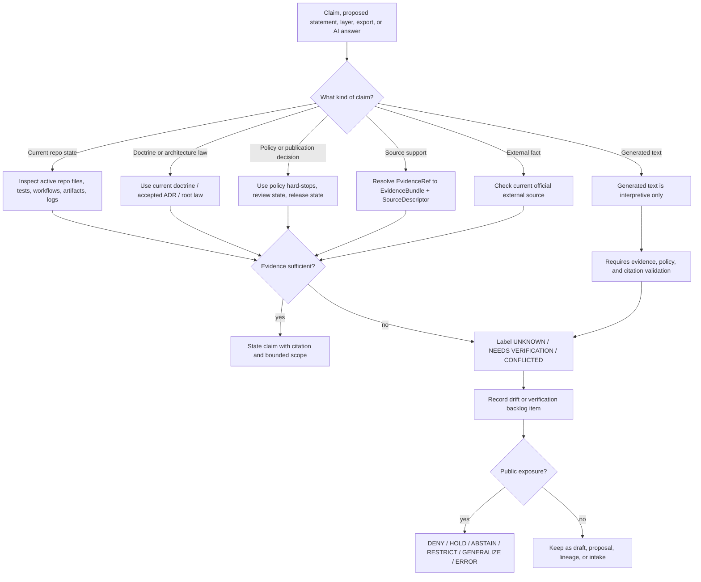

<!-- [KFM_META_BLOCK_V2]
doc_id: kfm://doc/NEEDS-VERIFICATION/authority-ladder-doctrine
title: Authority Ladder
type: standard
version: v1
status: draft
owners: OWNER_TBD_NEEDS_VERIFICATION
created: CREATED_DATE_TBD_FROM_GIT_OR_DOC_REGISTRY
updated: 2026-05-06
policy_label: NEEDS_VERIFICATION
related: [README.md, truth-posture.md, trust-membrane.md, lifecycle-law.md, ../registers/AUTHORITY_LADDER.md, ../registers/CANONICAL_LINEAGE_EXPLORATORY.md, ../registers/DRIFT_REGISTER.md, ../registers/VERIFICATION_BACKLOG.md, ../adr/ADR-0001-schema-home.md, ../adr/ADR-0014-truth-path.md, ../../README.md, ../../policy/README.md]
tags: [kfm, doctrine, authority, evidence, governance, cite-or-abstain, trust-membrane]
notes: [NEEDS VERIFICATION: doc_id, owners, created date, policy label, and publication status must be confirmed against the active repository governance records before publication. Owner remains a placeholder because CODEOWNERS coverage for this file was not confirmed as populated in the inspected ref.]
[/KFM_META_BLOCK_V2] -->

<a id="top"></a>

# Authority Ladder

Defines what outranks what when KFM doctrine, repository evidence, source material, generated artifacts, policy gates, external references, and AI output disagree.

<p align="left">
  
  
  
  
  
  
</p>

> [!IMPORTANT]
> **Status:** `draft`  
> **Owners:** `OWNER_TBD_NEEDS_VERIFICATION`  
> **Path:** `docs/doctrine/authority-ladder.md`  
> **Owning root:** `docs/` — human-facing doctrine and control-plane explanation.  
> **Doctrine role:** source-precedence law for claim review, publication review, documentation review, and governed AI review.  
> **Implementation proof:** `UNKNOWN` until active repo evidence, tests, policies, workflows, receipts, proofs, release objects, or runtime traces are inspected.

## Quick jumps

| Start here | Apply it | Review gates |
|---|---|---|
| [Scope](#scope) | [Authority ladder](#authority-ladder-1) | [Conflict protocol](#conflict-protocol) |
| [Repo fit](#repo-fit) | [Claim-type matrix](#claim-type-matrix) | [Review gates](#review-gates) |
| [Accepted inputs](#accepted-inputs) | [Citation rules](#citation-rules) | [Definition of done](#definition-of-done) |
| [Exclusions](#exclusions) | [Diagram](#diagram) | [Appendix](#appendix) |

---

## Scope

The authority ladder exists to stop persuasive material from becoming accidental truth.

Use this doctrine when deciding:

- which source class controls a doctrine claim;
- which evidence proves current repository behavior;
- which policy or safety condition can block public exposure;
- whether a generated artifact is proof, receipt, derivative, release material, or only process memory;
- whether an external reference updates a current technical fact without silently rewriting KFM doctrine;
- whether AI output may be used in an API response, map popup, Evidence Drawer panel, Focus Mode answer, story, export, or report.

This file preserves the KFM rule that **evidence, policy, review, and release state outrank fluent language**.

### Core distinction

KFM does not use one flat citation order for every situation. It uses **claim-type authority**.

A source can be authoritative for one kind of claim and non-authoritative for another.

| Claim | Correct authority class |
|---|---|
| “KFM should cite or abstain.” | Current doctrine, accepted ADR, or root project law. |
| “This file exists on `main`.” | Direct repository evidence for that ref. |
| “This route emits `ABSTAIN`.” | Runtime code, route test, workflow result, trace, or emitted response evidence. |
| “This source may be public.” | SourceDescriptor, rights review, policy decision, review state, and release state. |
| “This map layer is released.” | LayerManifest, ReleaseManifest, catalog/proof closure, and rollback/correction support. |
| “The model said it.” | Not sufficient. AI output is interpretive only. |

### One-line rule

```text
Current evidence decides current facts; doctrine decides governing law; policy can block exposure; generated language never outranks evidence.
```

[Back to top](#top)

---

## Repo fit

`docs/doctrine/authority-ladder.md` belongs under `docs/doctrine/` because it states stable, human-readable KFM operating law. It should guide ADRs, registers, contracts, schemas, policy, validators, tests, release review, and governed runtime surfaces without becoming any of those surfaces itself.

| Relationship | Path | Status | Role |
|---|---|---:|---|
| This document | `docs/doctrine/authority-ladder.md` | `CONFIRMED in inspected GitHub ref / draft` | Doctrine-level source precedence and conflict-resolution law. |
| Doctrine index | [`README.md`](README.md) | `CONFIRMED / draft` | Local doctrine landing page, accepted inputs, exclusions, and placement rules. |
| Truth posture | [`truth-posture.md`](truth-posture.md) | `CONFIRMED / draft` | Truth labels and finite outcomes. |
| Trust membrane | [`trust-membrane.md`](trust-membrane.md) | `CONFIRMED / draft` | Boundary between internal lifecycle states and public governed surfaces. |
| Lifecycle law | [`lifecycle-law.md`](lifecycle-law.md) | `CONFIRMED / draft` | Source-to-publication lifecycle law. |
| Operational authority register | [`../registers/AUTHORITY_LADDER.md`](../registers/AUTHORITY_LADDER.md) | `CONFIRMED / draft` | Register-level ladder. It should be synchronized with this doctrine before publication. |
| Canon register | [`../registers/CANONICAL_LINEAGE_EXPLORATORY.md`](../registers/CANONICAL_LINEAGE_EXPLORATORY.md) | `CONFIRMED / draft` | Classifies canonical, lineage, exploratory, reference, and superseded material. |
| Drift register | [`../registers/DRIFT_REGISTER.md`](../registers/DRIFT_REGISTER.md) | `CONFIRMED / draft` | Records contradictions, overclaims, naming drift, and authority ambiguity. |
| Verification backlog | [`../registers/VERIFICATION_BACKLOG.md`](../registers/VERIFICATION_BACKLOG.md) | `CONFIRMED / draft` | Tracks unresolved `UNKNOWN`, `NEEDS VERIFICATION`, and `CONFLICTED` claims. |
| Schema-home ADR | [`../adr/ADR-0001-schema-home.md`](../adr/ADR-0001-schema-home.md) | `CONFIRMED / proposed decision` | Separates semantic contracts, machine schemas, and policy decisions. |
| Truth-path ADR | [`../adr/ADR-0014-truth-path.md`](../adr/ADR-0014-truth-path.md) | `CONFIRMED / draft` | Truth-path and public trust membrane decision record. |
| Root README | [`../../README.md`](../../README.md) | `CONFIRMED / draft` | Repository-level KFM identity, lifecycle law, public-client posture, and object vocabulary. |
| Policy root | [`../../policy/README.md`](../../policy/README.md) | `CONFIRMED / review draft` | Deny-by-default policy surface for rights, sensitivity, review, release, correction, and runtime trust. |

> [!NOTE]
> This file defines source-precedence doctrine. The register at `docs/registers/AUTHORITY_LADDER.md` is a control-plane sibling and should either match this doctrine or record the difference in `DRIFT_REGISTER.md`.

[Back to top](#top)

---

## Accepted inputs

Use this doctrine when reviewing, citing, promoting, correcting, or publishing:

| Input | Accepted when it is used to… |
|---|---|
| Current KFM doctrine | Define system law, lifecycle law, trust membrane, truth posture, publication posture, correction posture, or governed AI boundaries. |
| Accepted ADRs | Resolve architecture-significant decisions, file homes, schema homes, policy homes, release semantics, runtime boundaries, and rollback expectations. |
| Current repository evidence | Prove active repo structure, file presence, checked-in content, package markers, workflow YAML, tests, contracts, schemas, policies, fixtures, or implementation files. |
| Runtime / operational evidence | Prove route behavior, emitted envelopes, logs, dashboards, traces, workflow runs, release artifacts, receipts, proof packs, signatures, or deployment behavior. |
| Contracts and schemas | Define semantic meaning and machine-checkable shape for trust-bearing objects. |
| Policy rules and policy docs | Decide allow, deny, restrict, hold, abstain, review-required, correction, rollback, release, and runtime admissibility. |
| Source descriptors and EvidenceBundles | Support source role, rights, provenance, evidence closure, citation support, and source limitations. |
| Receipts, proof packs, catalogs, manifests, releases | Prove process memory, integrity, validation, publication support, and rollback/correction state when they are emitted and inspectable. |
| Lineage docs | Preserve prior reasoning, historical context, object-family continuity, and known risks without making current implementation claims. |
| Exploratory material | Feed intake, backlog, source-refresh ideas, and implementation pressure only when clearly marked. |
| External official references | Verify current standards, APIs, formats, licenses, source-system behavior, package releases, or version-sensitive technical facts. |

[Back to top](#top)

---

## Exclusions

This file must not be used to:

| Exclusion | Use instead |
|---|---|
| Claim a route, workflow, package, schema, test, dashboard, or release artifact exists without direct evidence. | Active repo inspection and [`../registers/VERIFICATION_BACKLOG.md`](../registers/VERIFICATION_BACKLOG.md). |
| Define executable schema shape. | `schemas/` and the accepted schema-home ADR. |
| Define semantic object meaning. | `contracts/`. |
| Define policy-as-code. | `policy/`. |
| Store source descriptors, source instances, or source registries. | `data/registry/`, `control_plane/`, `docs/sources/`, or the repo-confirmed source registry home. |
| Store receipts, proofs, catalogs, manifests, or releases. | `data/receipts/`, `data/proofs/`, `data/catalog/`, `release/`, or the repo-confirmed emitted-object homes. |
| Promote New Ideas packets into current law by repetition. | `docs/intake/` and the canon/lineage/exploratory register. |
| Treat maps, tiles, graphs, indexes, dashboards, summaries, scenes, exports, or AI answers as root truth. | EvidenceRef → EvidenceBundle resolution, release objects, policy decisions, and public trust envelopes. |
| Store private chain-of-thought as evidence. | Do not store it as a KFM truth object. |

[Back to top](#top)

---

## Authority ladder

Use the highest relevant rung for the claim being made.

A higher rung may decide, block, or constrain a claim only within its scope. A policy hard-stop can block public exposure, but it does not rewrite historical evidence. A test can prove behavior, but it does not rewrite doctrine. A source can prove its own current API behavior, but it does not automatically become KFM policy.

| Rung | Authority class | Decides | Cannot decide by itself |
|---:|---|---|---|
| 0 | **Legal, safety, rights, sensitivity, sovereignty, steward, and policy hard-stops** | Whether exposure, publication, exact geometry, export, model use, source use, or release must be denied, restricted, generalized, embargoed, delayed, held for review, or withdrawn. | Historical truth, implementation reality, or source content. It blocks or constrains exposure. |
| 1 | **Direct current implementation evidence** | Current repo state, checked-in files, branch/ref-specific content, tests, workflow YAML, emitted artifacts, runtime traces, logs, dashboards, receipts, proof packs, release manifests, signatures, and deployment behavior when inspected. | Governing doctrine unless paired with accepted doctrine or ADRs. |
| 2 | **Accepted ADRs and current repo-native doctrine** | System law, truth posture, trust membrane, lifecycle law, file-home decisions, schema-home decisions, publication posture, correction posture, rollback posture, and architecture boundaries. | Current runtime behavior unless implementation evidence proves it. |
| 3 | **Versioned contracts, schemas, and policy surfaces** | Semantic meaning, machine-checkable shape, policy-readable inputs, finite outcome shape, validation targets, release-candidate structure, and admissibility decisions. | Source truth, runtime behavior, or publication readiness unless supported by tests, fixtures, policy decisions, review, and release evidence. |
| 4 | **Current architecture, standards, runbooks, and domain docs under `docs/`** | Intended behavior, operator procedures, review burden, domain-specific interpretation, source-role discipline, UI/API expectations, and maintainer workflow. | Current implementation maturity unless directly verified. |
| 5 | **Attached KFM doctrine corpus and high-trust synthesis reports** | Governing KFM concepts, continuity, architecture intent, recurring object families, source-family weighting, and proposed realization pressure when repo-native doctrine is absent or incomplete. | Active branch contents, active workflows, runtime route behavior, dashboards, deployments, or emitted proof objects. |
| 6 | **Subsystem and domain lineage reports** | Domain-specific rationale, historical design pressure, sensitivity concerns, source families, proposed file plans, and object-family patterns. | Current repo implementation unless matching files, tests, artifacts, or logs are inspected. |
| 7 | **Lineage and superseded material** | Why a decision exists, what changed, what was preserved, and what should not be lost. | Current canon unless re-promoted through review and evidence. |
| 8 | **Exploratory packets, generated plans, and AI-assisted drafts** | Intake, backlog, future PR pressure, implementation ideas, source-refresh candidates, and review prompts. | Canon, implementation proof, policy permission, publication readiness, or source authority. |
| 9 | **External references** | Current external standards, APIs, source-system behavior, package releases, formats, licensing pages, and factual background. | KFM doctrine, KFM policy, KFM release posture, or KFM source authority unless explicitly adopted by ADR, policy, contract, schema, source descriptor, or release decision. |
| 10 | **Uncited generated language** | Nothing authoritative. It may be a draft or interpretive aid. | Evidence, policy, review, release, source authority, implementation proof, or public truth. |

> [!CAUTION]
> External official sources are authoritative for their own current facts. They do **not** silently override KFM doctrine. If an external source shows that KFM doctrine is stale or wrong, record a proposed correction, ADR, source descriptor update, or verification item.

[Back to top](#top)

---

## Claim-type matrix

Use this matrix when writing docs, reviews, PR notes, release notes, public explanations, map popups, Evidence Drawer payloads, Focus Mode answers, or exports.

| Claim type | Minimum evidence before saying it as fact | Default label if not proven |
|---|---|---|
| KFM doctrine says X | Current doctrine file, accepted ADR, root README doctrine, or high-trust corpus source when no repo-native doctrine exists. | `PROPOSED` or `NEEDS VERIFICATION` |
| The repo contains X | Direct file/tree inspection in the active checkout or GitHub connector evidence for the referenced branch/ref. | `UNKNOWN` |
| This path is canonical | Directory Rules + accepted ADR or current doctrine + current repo evidence + no conflicting register entry. | `PROPOSED` / `CONFLICTED` |
| The system currently does X | Source code, tests, workflow run, runtime trace, emitted artifact, dashboard, log, or release evidence inspected directly. | `UNKNOWN` |
| Policy requires or forbids X | Policy doc/rule plus fixture/test evidence, or accepted doctrine clearly marked as doctrine-only. | `NEEDS VERIFICATION` |
| Schema or contract defines X | Canonical schema/contract file and version, plus schema-home decision where relevant. | `PROPOSED` / `CONFLICTED` |
| This claim is publishable | EvidenceBundle + SourceDescriptor + rights/sensitivity review + policy decision + review state + release state + correction and rollback path. | `DENY`, `HOLD`, or `ABSTAIN` |
| This artifact is released | ReleaseManifest, PromotionDecision, catalog/proof closure, rollback reference, and release evidence. | `NEEDS VERIFICATION` |
| This map, tile, graph, index, scene, summary, dashboard, export, or AI answer is truth | Never by itself. It may carry or explain evidence only. | Reject or relabel as derivative/carrier. |
| This external standard/API version is current | Recent official external source check, recorded date, and downstream compatibility review. | `NEEDS VERIFICATION` |
| This AI answer is safe to show | Released policy-safe context, evidence closure, citation validation, finite runtime envelope, and AIReceipt or audit trail when required. | `ABSTAIN`, `DENY`, or `ERROR` |

[Back to top](#top)

---

## Citation rules

KFM’s default truth posture is **cite or abstain**.

A citation or support reference should answer four questions:

| Question | Minimum answer |
|---|---|
| What source supports the claim? | SourceDescriptor, EvidenceBundle, repo file, accepted ADR, doctrine file, release object, runtime trace, test, or official external source. |
| What role does the source have? | Canonical, implementation evidence, policy, schema, lineage, exploratory, external reference, derivative, receipt, proof, or release. |
| What scope does it support? | Doctrine, implementation, policy, source rights, runtime behavior, release state, external fact, or public claim support. |
| What remains unproven? | Explicit `UNKNOWN`, `NEEDS VERIFICATION`, or `CONFLICTED` item when applicable. |

### Minimum citation by public claim class

| Public claim class | Minimum support |
|---|---|
| Map popup claim | Released feature + EvidenceRef + EvidenceBundle + LayerManifest or release state. |
| Evidence Drawer claim | EvidenceBundle resolving to source, receipt/provenance, policy, review, and release context. |
| Focus Mode / AI answer | Released, policy-safe context + citation validation + finite runtime envelope + AIReceipt when applicable. |
| Export or story claim | Source role + evidence scope + release state + sensitivity transform reason if any + correction path. |
| Domain interpretation | Domain doc or source descriptor plus explicit uncertainty/support type. |
| Sensitive location exposure | Policy decision + steward review + redaction/generalization receipt + release state. |

> [!IMPORTANT]
> Repetition across PDFs, packets, generated reports, or AI summaries is not stronger evidence. It is continuity unless direct evidence, review, or promotion upgrades the claim.

[Back to top](#top)

---

## Conflict protocol

When two sources disagree, do not smooth over the conflict.

1. **Name the claim type.**  
   Is the conflict about doctrine, current repo state, policy, schema shape, source authority, runtime behavior, release state, ownership, or external facts?

2. **Find the highest relevant authority.**  
   Use the ladder above, but only for the claim type at issue.

3. **Inspect direct evidence where possible.**  
   Do not infer repo state from a PDF, prior plan, or plausible path when the active repo can be inspected.

4. **Apply the narrowest truthful label.**  
   Use `CONFIRMED`, `INFERRED`, `PROPOSED`, `UNKNOWN`, `NEEDS VERIFICATION`, or `CONFLICTED`.

5. **Fail closed for public exposure.**  
   If rights, sensitivity, review, policy, release, or rollback status is unclear, choose `DENY`, `HOLD`, `RESTRICT`, `GENERALIZE`, `ABSTAIN`, or `ERROR` rather than silent publication.

6. **Record drift.**  
   Use [`../registers/DRIFT_REGISTER.md`](../registers/DRIFT_REGISTER.md) for contradiction, naming drift, overclaim risk, or authority ambiguity.

7. **Open a verification item.**  
   Use [`../registers/VERIFICATION_BACKLOG.md`](../registers/VERIFICATION_BACKLOG.md) when a concrete proof task is needed.

8. **Use an ADR when the ladder itself is insufficient.**  
   If authority order, file home, schema home, release semantics, source class, or public boundary needs a decision, route it through `docs/adr/`.

9. **Update affected docs together.**  
   Authority changes should update doctrine, registers, ADRs, object maps, policy docs, README links, and runbooks as needed.

10. **Preserve rollback and correction paths.**  
    Do not delete lineage just because a stronger source now exists.

### Conflict examples

| Conflict | Resolution |
|---|---|
| A PDF proposes a path, but the repo has a different path. | Repo evidence controls current path reality; record doctrine/path drift if the repo path violates Directory Rules or an accepted ADR. |
| A README claims a workflow enforces a gate, but workflow YAML and run evidence were not inspected. | Mark enforcement `NEEDS VERIFICATION`. |
| A domain report proposes public layers, but sensitivity review is unclear. | Policy hard-stop wins; block, restrict, or generalize until review and release evidence exist. |
| An AI answer cites a source but the EvidenceRef does not resolve. | `ABSTAIN`, `DENY`, or `ERROR`; generated text cannot repair missing evidence. |
| External vendor docs change an API version. | Update source descriptor, standard register, or tooling docs after official verification; do not silently rewrite KFM doctrine. |
| A schema validates but rights are unknown. | Schema validity does not imply policy permission; block public release. |

[Back to top](#top)

---

## Diagram



[Back to top](#top)

---

## Review gates

Before changing this file or using it to upgrade another claim, run the relevant gate.

### Doctrine change gate

- [ ] The change preserves cite-or-abstain behavior.
- [ ] The change preserves the RAW → WORK/QUARANTINE → PROCESSED → CATALOG/TRIPLET → PUBLISHED lifecycle.
- [ ] The change preserves the distinction between canonical truth, derivatives, receipts, proofs, releases, and generated language.
- [ ] The change does not let public clients bypass governed APIs or release artifacts.
- [ ] The change does not make external references silently outrank KFM doctrine.
- [ ] The change explains what happens when evidence is missing.
- [ ] The change has a rollback path: revert the doc and restore prior links/register entries.

### Repository claim gate

- [ ] The active branch/ref was identified.
- [ ] Relevant files were inspected directly.
- [ ] Tests, workflows, logs, manifests, receipts, proof packs, dashboards, runtime traces, or release artifacts were inspected before behavior claims were made.
- [ ] Unverified implementation details remain `UNKNOWN` or `NEEDS VERIFICATION`.
- [ ] Proposed paths are clearly marked `PROPOSED` unless current repo evidence confirms them.

### Publication gate

- [ ] EvidenceRef resolves to EvidenceBundle.
- [ ] SourceDescriptor or equivalent source record is present.
- [ ] Rights and sensitivity posture are explicit.
- [ ] Policy decision is recorded or the claim is marked non-public.
- [ ] Review state and release state are explicit.
- [ ] Correction and rollback paths are available.
- [ ] Public-facing UI/API/AI output carries trust state rather than hiding it.

[Back to top](#top)

---

## Validation targets

> [!WARNING]
> These commands are review aids. Do not report them as passing unless they ran on the active checkout.

```bash
# Confirm repository context.
git rev-parse --show-toplevel
git status --short
git branch --show-current || true

# Confirm doctrine and register neighbors.
find docs/doctrine docs/registers docs/adr -maxdepth 2 -type f | sort

# Inspect authority-related files.
sed -n '1,260p' docs/doctrine/authority-ladder.md
sed -n '1,220p' docs/registers/AUTHORITY_LADDER.md
sed -n '1,220p' docs/registers/CANONICAL_LINEAGE_EXPLORATORY.md
sed -n '1,220p' docs/registers/DRIFT_REGISTER.md
sed -n '1,220p' docs/registers/VERIFICATION_BACKLOG.md

# Find unresolved placeholders and authority-risk labels.
grep -RInE 'TODO|TBD|NEEDS VERIFICATION|UNKNOWN|CONFLICTED|PROPOSED' \
  docs/doctrine docs/registers docs/adr policy contracts schemas tests tools 2>/dev/null || true

# Look for unsupported authority shortcuts in docs.
grep -RInE 'model said|AI says|tile proves|graph proves|processed means public|workflow enforces|route exists' \
  docs contracts schemas policy apps packages tools tests 2>/dev/null || true
```

Recommended repo-native checks, if present:

```bash
# Replace with verified KFM commands before treating as enforcement proof.
python tools/docs/check-kfm-meta-blocks.py
python tools/docs/check_markdown_links.py
python tools/validators/validate_authority_ladder_sync.py
python tools/validators/check_no_public_internal_paths.py
```

[Back to top](#top)

---

## Definition of done

This file is ready to move beyond `draft` only when:

- [ ] `doc_id` is assigned by the document registry or accepted metadata process.
- [ ] `owners` is verified from CODEOWNERS, steward records, maintainer assignment, or project governance.
- [ ] `created` date is reconciled with Git history or the document registry.
- [ ] `policy_label` is verified.
- [ ] Related links are checked from `docs/doctrine/authority-ladder.md`.
- [ ] The operational ladder in [`../registers/AUTHORITY_LADDER.md`](../registers/AUTHORITY_LADDER.md) is synchronized with this doctrine or the difference is recorded in the drift register.
- [ ] The canon register classifies this file as current doctrine or records why it remains draft.
- [ ] Any conflicting ladder language is recorded in the drift register.
- [ ] Any unresolved implementation claim is represented in the verification backlog.
- [ ] No section claims runtime behavior, workflow enforcement, release state, dashboard existence, source rights, or implementation maturity without evidence.
- [ ] Reviewers can identify rollback impact if this doctrine changes.

[Back to top](#top)

---

## Open verification

| Item | Status | Required evidence |
|---|---:|---|
| Document UUID / registry ID | `NEEDS VERIFICATION` | `control_plane/document_registry.yaml`, docs register, or accepted ID policy. |
| Owner / steward | `NEEDS VERIFICATION` | CODEOWNERS, governance owner record, or maintainer assignment. |
| Created date | `NEEDS VERIFICATION` | Git history or document registry. |
| Policy label | `NEEDS VERIFICATION` | Policy classification or docs governance register. |
| Authority-register synchronization | `NEEDS VERIFICATION` | Comparison with `docs/registers/AUTHORITY_LADDER.md` and drift/backlog updates if needed. |
| Link checks | `NEEDS VERIFICATION` | Repo-native Markdown validation output. |
| Meta block enforcement | `NEEDS VERIFICATION` | Metadata linter or promotion-gate evidence. |
| Runtime enforcement | `UNKNOWN` | Verified schemas, policies, validators, tests, workflows, runtime behavior, proof objects, and release artifacts. |
| Publication gate enforcement | `UNKNOWN` | ReleaseManifest, PromotionDecision, proof pack, policy, review, correction, and rollback evidence. |
| AI citation validation | `UNKNOWN` | Runtime envelope, citation-validation report, EvidenceBundle resolver, and AIReceipt evidence. |

[Back to top](#top)

---

## Appendix

<details>
<summary><strong>Quick source classification reference</strong></summary>

| Class | Default handling |
|---|---|
| Current repo evidence | Use for current file, path, implementation, workflow, test, and checked-in artifact claims after inspection. |
| Current doctrine / accepted ADR | Use for system law and reviewed architecture decisions. |
| Contracts and schemas | Use for object meaning and machine shape; keep semantic and executable authority separated. |
| Policy | Use for admissibility, rights, sensitivity, publication, runtime, correction, and release gates. |
| Receipts | Use as process memory; not canonical truth by themselves. |
| Proof packs | Use as release-supporting evidence; not a substitute for policy, review, or source authority. |
| Catalogs and triplets | Use as discoverability/projection layers; not root truth. |
| Published artifacts | Use only when release state and rollback/correction path are known. |
| Lineage docs | Preserve rationale; do not cite as current implementation proof. |
| Exploratory packets | Intake and backlog only. |
| External references | Current external fact support; not automatic KFM doctrine. |
| AI output | Interpretive; requires evidence, policy, and citation validation. |

</details>

<details>
<summary><strong>Reviewer prompt</strong></summary>

Ask these questions before accepting an authority claim:

1. What exact claim is being made?
2. What claim type is it?
3. What is the highest relevant authority class?
4. Was the relevant evidence inspected in this session, PR, release, or active repo ref?
5. Does the claim need a truth label?
6. Does public exposure require policy, review, redaction, release, or rollback evidence?
7. Would the claim still be true if a map tile, graph edge, vector index, AI summary, dashboard, or generated report were deleted and rebuilt?
8. If the claim is wrong, what correction or rollback path exists?

</details>

<details>
<summary><strong>Change note template</strong></summary>

```markdown
## Authority impact

- Claim type affected:
- Highest authority consulted:
- Evidence inspected:
- Truth labels used:
- Drift register update needed:
- Verification backlog update needed:
- ADR needed:
- Public exposure impact:
- Rollback path:
```

</details>

[Back to top](#top)
