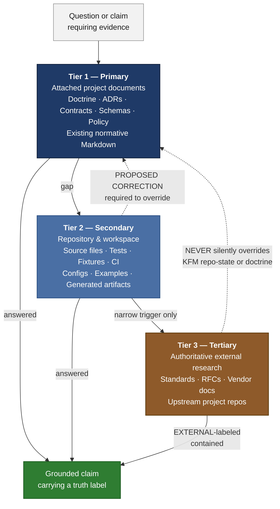

<!-- [KFM_META_BLOCK_V2]
doc_id: kfm://doc/TODO-uuid-authority-ladder
title: Authority Ladder
type: standard
version: v1
status: draft
owners: TODO Doctrine Working Group <NEEDS VERIFICATION>
created: 2026-05-12
updated: 2026-05-12
policy_label: public
related:
  - docs/doctrine/lifecycle-law.md
  - docs/doctrine/truth-labels.md
  - docs/doctrine/source-roles.md
  - docs/doctrine/evidence-model.md
  - docs/doctrine/ai-boundary.md
tags: [kfm, doctrine, governance, evidence]
notes:
  - Codifies the Primary / Secondary / Tertiary hierarchy used to govern documentation, decisions, and claims.
  - Distinct from the data source-role system (authority / observation / context / model / aggregate / admin / candidate).
  - Owner team, doc_id UUID, and sibling doc paths require verification against the repository.
[/KFM_META_BLOCK_V2] -->

# Authority Ladder

> **How KFM ranks sources of authority when writing, deciding, and claiming — so every change earns its evidence.**

<!-- Badges: placeholders until repo-level Shields endpoints are confirmed -->

**Status:** Draft · **Owners:** _TODO — Doctrine Working Group_ NEEDS VERIFICATION · **Updated:** 2026-05-12

> [!IMPORTANT]
> **Two ladders, easily confused.** This document defines the **documentation and decision authority ladder** — Primary → Secondary → Tertiary — used when writing, reviewing, and changing KFM artifacts. It is **distinct** from the **data source-role system** (`authority` / `observation` / `context` / `model` / `aggregate` / `admin` / `candidate`), which classifies external data feeding the lifecycle pipeline. See [§7](#7-authority-ladder-vs-data-source-role-system) for the side-by-side comparison.

---

## Contents

1. [Why an authority ladder](#1-why-an-authority-ladder)
2. [The three tiers at a glance](#2-the-three-tiers-at-a-glance)
3. [Tier definitions](#3-tier-definitions)
4. [Override rules](#4-override-rules)
5. [Evidence-gathering order](#5-evidence-gathering-order)
6. [Relationship to truth labels](#6-relationship-to-truth-labels)
7. [Authority ladder vs. data source-role system](#7-authority-ladder-vs-data-source-role-system)
8. [External research containment](#8-external-research-containment)
9. [Anti-patterns](#9-anti-patterns)
10. [Enforcement points](#10-enforcement-points)
11. [Worked example](#11-worked-example)
12. [FAQ](#12-faq)
13. [Related docs](#related-docs)

---

## 1. Why an authority ladder

KFM is an evidence-first system. Every public statement, schema, route, policy decision, release manifest, and AI summary either traces to a source whose authority is known, or it abstains. The lifecycle invariant — `RAW → WORK / QUARANTINE → PROCESSED → CATALOG / TRIPLET → PUBLISHED` — depends on it; the trust posture (`CONFIRMED`, `PROPOSED`, `NEEDS VERIFICATION`, `UNKNOWN`, `DENY`, `ABSTAIN`, `ERROR`, `STALE`) depends on it; the [AI boundary plan](./ai-boundary.md) PROPOSED path depends on it. Without a fixed hierarchy of sources, "we have evidence" devolves into "someone wrote it down somewhere," and the distinction between **what the project commits to** and **what an individual contributor or external article asserts** collapses.

The authority ladder answers a single question: **when two sources of information disagree, which one wins, and what label does the loser carry?** It applies to:

- Documentation authoring and revision (this is where it most visibly bites).
- Architecture Decision Records (ADRs) and design briefs.
- Code, schema, and policy changes that make repo-shaped claims.
- AI-assisted drafting of any of the above.
- Reviewer judgment in pull requests, audits, and steward review.

The ladder is **not** a ranking of how *important* a source is; a single test fixture can carry more decisive weight than a hundred pages of doctrine for a specific question. The ladder ranks **where authority resides for a given kind of claim** — and what evidence is required before a lower tier may operationalize, refine, or push back against a higher tier.

[Back to top](#authority-ladder)

---

## 2. The three tiers at a glance

The diagram shows the resolution flow for any KFM authoring task. Begin at Tier 1; descend only to fill a specific gap; never invert the order. The dashed edges encode the override rules in [§4](#4-override-rules) — they are guardrails, not flows.

[Back to top](#authority-ladder)

---

## 3. Tier definitions

| Tier | Name | What counts | Examples (paths PROPOSED) | Scope of authority |
|---|---|---|---|---|
| 1 | **Primary** | Project-curated doctrine and contracts. Attached documents intentionally placed in project knowledge or repo doctrine paths. | `docs/doctrine/*.md`, `docs/adr/ADR-*.md`, `contracts/**/*.md`, `schemas/contracts/v1/*.schema.json`, `policy/**/*.rego`, `control_plane/*.yaml`, design briefs, standards docs. | KFM doctrine, terminology, naming, architecture, governance, lifecycle invariant, truth labels, source-role definitions, policy doctrine, schema authority. |
| 2 | **Secondary** | Repository and workspace contents. Code that executes, tests that run, configs that ship, CI that gates. | `apps/`, `packages/`, `pipelines/`, `tools/`, `tests/`, `fixtures/`, `.github/workflows/`, `configs/`, generated artifacts under `artifacts/`, in-tree examples. | Current implementation state, executable behavior, schema compliance, CI enforcement, naming used in code, package layout, test coverage. |
| 3 | **Tertiary** | Authoritative external sources, used as a narrow last resort. Standards, RFCs, vendor docs, upstream project repos. | W3C / OGC / IETF specs, official MapLibre / GDAL / Mermaid / GitHub docs, upstream READMEs and changelogs. | Generic technical correctness of external standards, syntax of external tools, current behavior of third-party systems. **Never** KFM-internal meaning. |

### 3.1 Tier 1 — Primary

**Definition.** Project-curated material whose purpose is to fix what KFM means by something. This includes the doctrine docs under `docs/doctrine/`, ADRs that decide between options, contracts that pin object meaning, schemas that pin object structure, policy-as-code that pins enforcement, and the control-plane registers that index authority across the repo.

**What Primary fixes.** KFM-specific concepts and their names — `EvidenceBundle`, `EvidenceRef`, `ReleaseManifest`, `ProofPack`, `CorrectionNotice`, `RollbackPlan`, `DecisionEnvelope`, `IntakeReceipt`, `SourceDescriptor`, the lifecycle states (`RAW`, `WORK`, `QUARANTINE`, `PROCESSED`, `CATALOG`, `TRIPLET`, `PUBLISHED`), the truth labels (`CONFIRMED`, `PROPOSED`, `NEEDS VERIFICATION`, `UNKNOWN`, `DENY`, `ABSTAIN`, `ERROR`, `STALE`), and the source-role taxonomy (`authority`, `observation`, `context`, `model`, `aggregate`, `admin`, `candidate`). All of these live at Tier 1 and cannot be overridden by a code commit, a generated report, an AI summary, or an external article.

**When Primary disagrees with itself.** Surface the conflict; do not smooth it. If a newer doctrine doc materially supersedes an older one, the relationship must be stated in an ADR and reflected in `control_plane/document_registry.yaml` PROPOSED, not in tone.

### 3.2 Tier 2 — Secondary

**Definition.** What the repository actually contains. Files, modules, schemas, validators, fixtures, CI workflows, configs, tests, and generated artifacts that demonstrate the current state of implementation. The repo speaks in code; Tier 2 is how that speech is read.

**What Secondary fixes.** Implementation-state facts — what packages exist, what tests pass, which routes are wired, which validators fire, which fixtures cover which paths, which CI checks are required, which directories are real and which are stubs. Secondary is where `CONFIRMED` (for current behavior), `INFERRED` (for behavior derivable but not stated), and `NEEDS VERIFICATION` (for behavior plausible but unchecked) labels are most often earned.

**Secondary's limits.** Secondary cannot rename a KFM concept, redefine a contract, change the lifecycle invariant, or expand the truth-label vocabulary. A directory called `pipelines/normalize/` does not become "the normalization layer" in doctrine because the folder exists; it becomes that only when an ADR or doctrine doc says so. Conversely, Tier 1's claim that a path "should exist" does not, on its own, mean it does exist — that is a Tier 2 question, settled by inspecting the repo.

### 3.3 Tier 3 — Tertiary

**Definition.** Authoritative external material consulted under the narrow conditions enumerated in [§8](#8-external-research-containment). The default is **not** to consult external sources. When consulted, results are inline-cited and clearly walled off from KFM-specific claims.

**What Tertiary fixes.** Generic technical correctness — the exact syntax of a Mermaid alert block, the current shape of the STAC item schema, the meaning of W3C PROV's `Activity` class, the behavior of a `gdal_translate` flag, the wording of an OGC API conformance class, the requirement text of WCAG 2.2 AA. Tertiary is allowed to define those because no project source can.

**Tertiary's hard limits.** Tertiary **cannot** make KFM repo-state claims, redefine KFM terminology, override Primary or Secondary on KFM-specific matters, or be used to validate KFM-internal concepts as if KFM concepts were public standards. An external article describing "evidence bundles" in some other project tells us nothing about KFM's `EvidenceBundle`.

[Back to top](#authority-ladder)

---

## 4. Override rules

The ladder is asymmetric. Higher tiers govern; lower tiers operationalize, refine, or *propose corrections* — they never silently overrule.

| Direction | Allowed? | Mechanism | Failure mode if violated |
|---|---|---|---|
| Tier 1 → Tier 2 | ✅ Yes | Doctrine and contracts constrain code, schema, and policy. | Implementation drift; Secondary contradicts Primary without an ADR. |
| Tier 1 → Tier 3 | ✅ Yes | KFM terminology and architecture constrain how external standards are referenced. | KFM concepts replaced by generic industry phrasing in docs. |
| Tier 2 → Tier 1 | ⚠️ Only via **PROPOSED CORRECTION** | A code or test reveals doctrine is wrong. Author flags the conflict in the doc *and* opens an ADR to resolve. | Doctrine silently rewritten to match code; loss of intent. |
| Tier 2 → Tier 3 | ✅ Yes | Repo evidence is preferred over external generic claims when both speak to the same fact. | External boilerplate copied into the repo as if authoritative. |
| Tier 3 → Tier 1 | ❌ Never | External research cannot redefine KFM doctrine, terminology, or architecture. | Doctrine drift; KFM concepts replaced by external equivalents. |
| Tier 3 → Tier 2 | ❌ Never for KFM-specific claims | Web sources may not be used to assert what the KFM repo contains, what its paths are, what its tests cover, or what its CI enforces. | False repo-state claims; loss of repo preflight discipline. |

> [!WARNING]
> **The cardinal sin is silent override.** A lower tier may *report* a contradiction with a higher tier — and is required to — but it may not *resolve* the contradiction on its own. Resolutions live in ADRs, doctrine revisions, or contract amendments, with the override path documented.

> [!TIP]
> When a contributor finds a real conflict, the right move is `PROPOSED CORRECTION: <doc or section> appears to conflict with <repo evidence or external standard>. Recommend ADR.` Do not edit the higher-tier doc until the ADR lands.

[Back to top](#authority-ladder)

---

## 5. Evidence-gathering order

The ladder dictates a fixed evidence-gathering sequence for any authoring or revision task. Do not skip a step unless it is demonstrably unavailable in the current session.

1. **Project knowledge search.** Run targeted searches across the doc topic, target path, terminology, adjacent concepts, and governance terms. Run multiple narrow searches rather than one broad one.
2. **Repository inspection.** Inspect mounted repository evidence — relevant files, configs, schemas, tests, workflows, policies, and adjacent docs.
3. **Attached artifact inspection.** Read any documents, PDFs, code, or fixtures supplied in the current conversation.
4. **External research — only if triggered.** Consult external sources only when at least one trigger in [§8](#8-external-research-containment) applies *and* steps 1–3 have not resolved the specific gap.
5. **Draft, then audit.** Draft the artifact; audit it for fabricated paths, terminology drift, smoothed-over conflicts, and any external content that strayed into KFM-specific claims.

> [!CAUTION]
> **Repository preflight is not optional.** No statement such as *"the repo contains," "the system implements," "this path exists," "the route exists," "the tests cover," "the workflow enforces," "the policy denies," "the package uses,"* or *"this path is canonical"* may be made without checking actual repository evidence in this session. External research cannot satisfy this rule. When the repository cannot be inspected, repo-shaped claims must carry `PROPOSED`, `UNKNOWN`, or `NEEDS VERIFICATION` — never quiet certainty.

[Back to top](#authority-ladder)

---

## 6. Relationship to truth labels

The authority ladder and the truth-label vocabulary are interlocking systems. The ladder tells you *where* a claim's support comes from; the labels tell readers *how confident* they can be in the claim as a result.

| Truth label | Typical source tier | Use it when… | Failure to use it (anti-pattern) |
|---|---|---|---|
| **CONFIRMED** | Tier 1 doctrine; or Tier 2 verified this session | The claim is supported by attached doctrine, an ADR, a contract, or directly inspected repo evidence. | Confident prose with no source check. |
| **INFERRED** | Tier 1 + Tier 2 reasoning | The claim is reasonably derivable from visible evidence but not directly stated. | Promoting an inference to CONFIRMED by tone. |
| **PROPOSED** | Greenfield design from Tier 1 doctrine | The placement, schema, path, or recommendation is not yet verified in implementation. | Describing a proposed tree as the current tree. |
| **NEEDS VERIFICATION** | Tier 2 (uninspected) | The claim is checkable but has not been checked strongly enough to act as fact. | Hand-waving past freshness, ownership, version pins, license terms. |
| **UNKNOWN** | Gap that cannot be responsibly closed | No tier resolves the question with the available evidence. | Filling unknowns with plausible-sounding prose. |
| **EXTERNAL** | Tier 3 only | The claim is sourced from authoritative external research under a permitted trigger; inline-cited; listed in the doc's notes. | Using EXTERNAL on a KFM-specific concept. EXTERNAL never applies to repo state or doctrine. |
| **DENY · ABSTAIN · ERROR · STALE** | Runtime outcomes | These are *system outcomes*, not authoring confidences. They appear in `DecisionEnvelope`, audit logs, and UI states — not as a rhetorical hedge in prose. | Using ABSTAIN as a soft "I'm not sure." |

> [!NOTE]
> Memory is not evidence. Recollection, guessed paths, likely behavior, and generic best practice are not facts at any tier. A confident-sounding paragraph with no traceable source is the most common form of ladder violation.

[Back to top](#authority-ladder)

---

## 7. Authority ladder vs. data source-role system

The authority ladder governs **documentation, decisions, and claims about the project**. The data source-role system governs **how external data sources are classified as they enter the lifecycle pipeline**. The two are orthogonal: a single change might touch both (e.g., a new hydrology connector both adds data with a source role *and* adds documentation governed by the authority ladder), but they answer different questions.

| Dimension | Authority Ladder | Data Source-Role System |
|---|---|---|
| **Question answered** | When two sources of *information* disagree, which one wins for *this* claim? | What kind of weight does *this dataset* carry when consumed in the lifecycle? |
| **Lives in** | This doc; reviewer judgment; AI authoring prompts; ADR templates. | `SourceDescriptor`, `control_plane/source_authority_register.yaml` PROPOSED, per-domain source tables. |
| **Vocabulary** | `Primary`, `Secondary`, `Tertiary`. | `authority`, `observation`, `context`, `model`, `aggregate`, `admin`, `candidate`. |
| **Object governed** | Documents, ADRs, schemas as artifacts, policy text, code comments, AI outputs. | Data feeds, observation streams, regulatory layers, model outputs, aggregated statistics, admin-only inputs. |
| **Failure outcome** | Doctrine drift; uncited claims; silent overrides. | Source-role collapse; e.g., presenting a regulatory zone as an observed event, or a model output as an observation. |
| **Example violation** | Replacing `EvidenceBundle` with "evidence record" because an external article uses that phrasing. | Collapsing NFHL regulatory flood zones with observed flood events in a Flood Context layer. |
| **Where the systems interact** | Documentation about source roles is a Tier 1 (Primary) artifact. The authority ladder governs how that documentation is written; the source-role system governs what the documentation describes. |

> [!IMPORTANT]
> **Do not collapse them.** A common drift is to call a piece of documentation "authoritative" because it describes an `authority`-class data source. The authority *of the document* is set by the ladder (is it a doctrine doc? an ADR? a code comment?). The `authority` *role on a data source* is set by domain doctrine (e.g., USGS WBD for HUC boundaries). These two senses of "authority" are not interchangeable.

For full source-role doctrine, see the [Source Roles doctrine doc](./source-roles.md) PROPOSED path.

[Back to top](#authority-ladder)

---

## 8. External research containment

Tier 3 is the most error-prone rung of the ladder, because external material is abundant, well-written, and superficially plausible. The containment rules below are absolute.

### 8.1 Permitted triggers

External research may be consulted **only** when at least one of the following applies *and* steps 1–3 of [§5](#5-evidence-gathering-order) have not resolved the gap.

- **Version-sensitive external standards** — STAC, JSON Schema 2020-12, GeoJSON, OGC APIs, W3C PROV, FAIR/CARE principles, schema.org, and similar.
- **Current syntax or behavior of external tools** — GitHub Markdown alerts, Mermaid diagram syntax, Shields.io endpoints, MapLibre, GDAL/`ogr2ogr` flags.
- **Security-relevant or operationally current facts** — CVEs, deprecations, license text, current API surface.
- **A true gap unresolved by project sources** where leaving the gap would weaken the doc more than a clearly attributed external reference would.

### 8.2 Forbidden uses

> [!CAUTION]
> External research **MUST NOT** be used to:
> - Make claims about KFM's repo state, paths, packages, modules, contracts, schemas, policies, routes, APIs, tests, CI, deployment, branches, owners, or implementation maturity.
> - Validate the meaning of KFM-internal terminology. Project knowledge is authoritative for KFM concepts.
> - Override Primary or Secondary sources.
> - Replace KFM terminology, casing, or compound terms with generic industry equivalents.

### 8.3 Source quality (in order of preference)

1. Official specification sites, RFCs, standards bodies (W3C, OGC, IETF, ISO).
2. Official vendor or project documentation (MapLibre docs, GitHub Docs, Mermaid docs, GDAL docs).
3. The relevant upstream project's own repository (README, CHANGELOG, release notes, issues with maintainer responses).
4. Reputable secondary sources only when primaries are unavailable.

**Avoid:** marketing pages presented as docs, undated blog posts, Stack Overflow answers, Medium articles, and AI-generated summaries of standards. If only weak sources are available, mark the claim `NEEDS VERIFICATION` and leave it labeled rather than promoting it to fact.

### 8.4 Attribution and containment

- Every web-derived claim must be inline-cited.
- Web-derived content may inform generic technical sections (standard syntax, tool behavior, external spec definitions). It must **not** appear in KFM-specific sections (architecture, paths, governance, repo state) except as a clearly attributed external reference supporting a project-grounded claim.
- All external sources consulted are listed in the doc's "External sources consulted" notes, with the trigger that justified each search.

> [!TIP]
> **When in doubt, do not search.** A document grounded in project evidence with a labeled gap is preferable to a document padded with externally sourced generic material.

[Back to top](#authority-ladder)

---

## 9. Anti-patterns

The patterns below are the most common ladder violations observed in KFM authoring. They are listed not to shame but to be recognized and refused in review.

<b>Pattern A — Tone-laundered uncertainty</b>

A paragraph that *reads* like a CONFIRMED statement but is actually `INFERRED`, `PROPOSED`, or worse. The fix is not to soften the prose into noncommittal hedging; it is to *label* the confidence. "The repo uses Pydantic v2" vs. "The repo uses Pydantic v2 NEEDS VERIFICATION — checked schemas only" carries the same useful information but does not lie about its support.

<b>Pattern B — Borrowed authority from a sibling doc</b>

Claiming a fact is true because "the architecture overview says so," when the architecture overview itself is `PROPOSED`. Tier 1 status applies to specific doctrine docs and ADRs, not to any in-tree Markdown. A `PROPOSED` overview cannot bootstrap a `CONFIRMED` claim downstream.

<b>Pattern C — Web-sourced repo claims</b>

"According to an article on the project, the repo uses a responsibility-root monorepo." Even if the article happens to be correct, this is a Tier 3 source making a Tier 2 claim. The right move is to inspect the repo (Tier 2) or cite the doctrine doc (Tier 1) that fixes the structure.

<b>Pattern D — Terminology drift toward "industry standard"</b>

Renaming `EvidenceBundle` to "evidence record" because external documentation uses the latter. KFM compound terms are CONFIRMED at Tier 1; external standards do not get to rename them, even when the external term is more familiar to a general audience.

<b>Pattern E — Mistaking a proposed tree for the current tree</b>

Greenfield plans describe what should be built; they are not snapshots of the repo. Quoting paths from a greenfield plan as if they exist on disk is a Tier 1 → Tier 2 category error.

<b>Pattern F — Smoothing over a real conflict</b>

Two doctrine docs disagree about whether `apps/` is a package root. The author picks one and rewrites the other to match. The correct path is to flag the conflict in Section 2 of the doc-handoff notes, open an ADR, and leave both docs labeled until the ADR resolves.

<b>Pattern G — DENY/ABSTAIN as polite hedging</b>

`DENY`, `ABSTAIN`, `ERROR`, and `STALE` are *system outcomes* in `DecisionEnvelope`, audit logs, and UI states. Using them as soft authoring labels ("I'll abstain on this paragraph") erodes their operational meaning. Use `UNKNOWN` or `NEEDS VERIFICATION` for authoring uncertainty.

[Back to top](#authority-ladder)

---

## 10. Enforcement points

The ladder is most useful when it is checked at predictable points — not relied on as ambient discipline.

| Stage | Check | Owner | Mechanism PROPOSED unless noted |
|---|---|---|---|
| **Doc authoring** | Author confirms which tier each claim rests on; applies truth labels where confidence materially matters. | Author | Authoring checklist; doc template prelude. |
| **PR review** | Reviewer scans for fabricated paths, terminology drift, unsourced repo-state claims, and external content that strayed into KFM-specific sections. | Reviewer | PR template authority-ladder section. |
| **ADR review** | Any claim that overrides Primary doctrine, or that promotes a `PROPOSED` placement to `CONFIRMED`, requires an ADR. | ADR review group | `docs/adr/` review process. |
| **CI** | Linters flag missing truth labels in trust-significant sections; document registry validates `KFM_META_BLOCK_V2`; link checker resolves intra-repo references. | Platform | `.github/workflows/docs-lint.yml` PROPOSED. |
| **AI authoring** | AI assistants follow the documented evidence-gathering order; emit Section 2 handoff notes with sources tier-tagged. | AI authoring prompts | This document referenced from the authoring system prompt. |
| **Audit** | Auditor traces each public statement to its tier-1 or tier-2 source; flags `EXTERNAL` content that strayed beyond its containment. | Audit role | Source basis summary in each doc. |

> [!NOTE]
> **Enforcement is layered, not centralized.** No single gate catches every violation. Authoring, review, ADR, CI, and audit each see a different slice; the ladder works because each slice expects the others to do their part.

[Back to top](#authority-ladder)

---

## 11. Worked example

A contributor proposes adding a new public-facing description of the hydrology gauge layer in `docs/domains/hydrology/gauges.md` PROPOSED path. The draft contains four candidate statements. Here is how the ladder resolves each.

### Statement 1

> "The KFM gauge layer is built on USGS NWIS observations."

**Tier resolution.** The phrase *"USGS NWIS"* is a Tier 3 (external) fact about a federal data source — the syntax and identity of NWIS belong to USGS, not KFM. The phrase *"the KFM gauge layer"* is a Tier 1/Tier 2 claim about KFM. The split is fine: cite USGS for NWIS identity and inspect KFM doctrine + the gauge connector code for the rest.

**Label.** `CONFIRMED` if doctrine + the hydrology connector and tests are inspected this session; otherwise `INFERRED` for the doctrine-side and `NEEDS VERIFICATION` for the implementation-side.

### Statement 2

> "Discharge observations are stored as `EvidenceRef` pointers that resolve to `EvidenceBundle` objects."

**Tier resolution.** Pure Tier 1 doctrine claim. `EvidenceRef` and `EvidenceBundle` are KFM compound terms governed by the doctrine layer; external research has no authority here.

**Label.** `CONFIRMED` against KFM doctrine. Do not rephrase `EvidenceBundle` as "evidence record" even if a reviewer suggests it.

### Statement 3

> "The gauge layer abstains when the source freshness window is exceeded."

**Tier resolution.** This is a Tier 2 implementation claim (does the route actually abstain?) backed by a Tier 1 doctrine commitment (the freshness/abstain rule). Both must be checked.

**Label.** `PROPOSED` if the freshness/abstain wiring is in the greenfield plan but not yet built; `CONFIRMED` only after inspecting the relevant validator, fixture, and decision-envelope test in `tests/domains/hydrology/`.

### Statement 4

> "This implementation is FAIR-compliant."

**Tier resolution.** "FAIR-compliant" is a Tier 3 external standard claim. Compliance with FAIR is not a thing KFM can self-declare without external verification — and any self-declaration would, at most, be a `NEEDS VERIFICATION` claim awaiting an external audit.

**Label.** Refuse the statement as written. Replace with `PROPOSED — aligns with FAIR principles for findability, accessibility, interoperability, and reusability; compliance audit pending`, or remove until verified.

> [!TIP]
> **Pattern to internalize.** Every sentence in a KFM doc can be quietly asked: *Which tier supports this, and what label fits?* Sentences that cannot answer either question are sentences that should not yet be published.

[Back to top](#authority-ladder)

---

## 12. FAQ

<b>Is the system prompt for an AI assistant a Tier 1 source?</b>

A Claude project's system prompt, when authored by the KFM team, encodes Tier 1 doctrine for the purposes of AI-assisted authoring. The doctrine it carries is Tier 1; the *fact that an AI rendered a doc from it* is not, on its own, Tier 1 evidence for the resulting claims. The AI's output is still subject to the full ladder.

<b>What about generated artifacts — reports, PDFs, exports?</b>

Generated artifacts are Tier 2 (repo evidence) for what they *are* (their bytes, their existence, their hashes) and Tier 1-derivative for what they *say* only when they were produced from Tier 1 inputs under a `ReleaseManifest`. An undated PDF found in `artifacts/` does not become Tier 1 doctrine because it looks doctrine-shaped.

<b>If I find that the code contradicts the doctrine, who wins?</b>

Neither — yet. The contradiction is a finding, not a verdict. File a `PROPOSED CORRECTION` against whichever tier appears wrong, open an ADR, and label both sides until the ADR resolves. Silently aligning either side is the worst option.

<b>Does this ladder apply to AI summaries of evidence?</b>

Yes. AI summaries inherit the labels and tiers of the evidence they summarize. A summary of a `PROPOSED` doctrine claim cannot be `CONFIRMED`. A summary that introduces facts not in the source crosses the ladder and must be refused.

<b>How does this interact with the lifecycle invariant?</b>

The lifecycle invariant (`RAW → WORK / QUARANTINE → PROCESSED → CATALOG / TRIPLET → PUBLISHED`) governs *data*. The authority ladder governs *documentation, decisions, and claims*. The two systems collaborate at publication: a `ReleaseManifest` is a Tier 1 / Tier 2 artifact whose authority is grounded by both ladders simultaneously. See [`lifecycle-law.md`](./lifecycle-law.md).

<b>Why three tiers and not four or five?</b>

Three tiers map cleanly onto the three kinds of evidence available during authoring: *what the project has decided* (Primary), *what the project has actually built* (Secondary), and *what the broader world knows that the project might lean on* (Tertiary). Finer distinctions exist within tiers — an ADR is more decision-fixed than a draft doctrine doc, a passing test is more load-bearing than a fixture — but they belong inside tiers, not as separate rungs. Adding tiers tends to dilute, not sharpen, the override rules in [§4](#4-override-rules).

[Back to top](#authority-ladder)

---

## Related docs

> [!NOTE]
> The links below reflect the doctrine doc set as understood from KFM project evidence. Specific paths are `PROPOSED` until verified against the live repository.

- [`docs/doctrine/lifecycle-law.md`](./lifecycle-law.md) — The `RAW → WORK / QUARANTINE → PROCESSED → CATALOG / TRIPLET → PUBLISHED` invariant and the publication-as-state-transition rule.
- [`docs/doctrine/truth-labels.md`](./truth-labels.md) PROPOSED — Full definitions of `CONFIRMED`, `PROPOSED`, `NEEDS VERIFICATION`, `UNKNOWN`, `DENY`, `ABSTAIN`, `ERROR`, `STALE`.
- [`docs/doctrine/source-roles.md`](./source-roles.md) PROPOSED — The data source-role taxonomy (`authority`, `observation`, `context`, `model`, `aggregate`, `admin`, `candidate`) and why it is distinct from this ladder.
- [`docs/doctrine/evidence-model.md`](./evidence-model.md) PROPOSED — `EvidenceRef`, `EvidenceBundle`, and the citation closure rule.
- [`docs/doctrine/ai-boundary.md`](./ai-boundary.md) PROPOSED — Where AI assists, where AI abstains, and how this ladder constrains AI-authored content.
- [`docs/adr/`](../adr/) — Architecture Decision Records, the canonical place where Tier 2 findings escalate into Tier 1 changes.
- [`control_plane/document_registry.yaml`](../../control_plane/document_registry.yaml) PROPOSED — Machine-readable index of doctrine docs and their authority status.

---

Last updated: 2026-05-12 · Status: Draft · Owners: <em>TODO — Doctrine Working Group</em> · <a href="#authority-ladder">Back to top</a>
