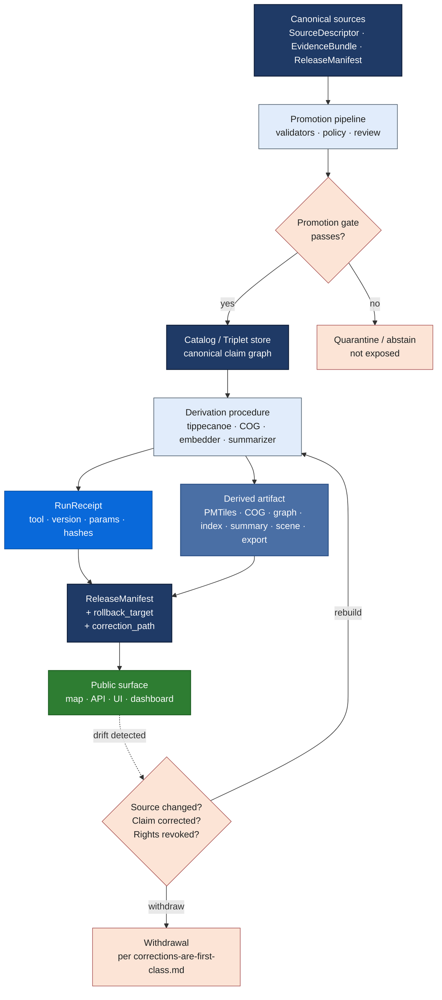

<!-- [KFM_META_BLOCK_V2]
doc_id: kfm://doc/TODO-uuid-derived-stays-derived
title: Derived Stays Derived
type: standard
version: v1.0
status: draft
owners: TODO Doctrine Working Group <NEEDS VERIFICATION>
created: 2026-05-26
updated: 2026-05-26
policy_label: public
related:
  - docs/doctrine/ai-build-operating-contract.md
  - docs/doctrine/directory-rules.md
  - docs/doctrine/lifecycle-law.md
  - docs/doctrine/authority-ladder.md
  - docs/doctrine/corrections-are-first-class.md
  - docs/doctrine/trust-posture.md
  - docs/doctrine/evidence-model.md
  - docs/doctrine/source-roles.md
tags: [kfm, doctrine, derived, projections, renderer, trust-membrane]
notes:
  - Codifies "Derived artifacts are not sovereign truth" as a normative KFM doctrine.
  - Operationalizes ai-build-operating-contract.md §10.7 and the anti-pattern in §1.15.
  - Pinned to ai-build-operating-contract.md CONTRACT_VERSION = "3.0.0".
  - Owner team and doc_id UUID require verification against the repository.
[/KFM_META_BLOCK_V2] -->

# Derived Stays Derived

> **Maps, tiles, indexes, graphs, summaries, scenes, screenshots, and AI responses are downstream carriers of governed evidence — never the truth itself. Every derived artifact stays one rebuild away from a canonical source.**

**Status:** Draft · **Edition:** v1.0 · **Owners:** _TODO — Doctrine Working Group_ NEEDS VERIFICATION · **Pins:** `CONTRACT_VERSION = "3.0.0"` · **Updated:** 2026-05-26

> [!IMPORTANT]
> **One sentence.** Derived artifacts MAY carry, project, accelerate, summarize, or visualize KFM truth — they MUST NOT become it. If a derived artifact ever becomes the only place a claim lives, the trust membrane has been breached and the artifact MUST be regenerated from a canonical source or withdrawn.

> [!NOTE]
> **Where this doc sits.** Derived Stays Derived is a Tier 1 doctrine doc subordinate to `ai-build-operating-contract.md` v3.0 (`CONTRACT_VERSION = "3.0.0"`). It elaborates the contract's §10.7 invariant *"Derived artifacts are not sovereign truth"* and operationalizes the §1.15 anti-pattern *"treats summaries, maps, tiles, graphs, vector indexes, scenes, or generated text as sovereign truth."* If a conflict arises between this doc and the contract, the contract wins and the conflict becomes a `CONFLICTED` candidate for ADR resolution.

---

## Contents

1. [Why this is doctrine](#1-why-this-is-doctrine)
2. [Scope and definitions](#2-scope-and-definitions)
3. [The four roles a derived artifact may play](#3-the-four-roles-a-derived-artifact-may-play)
4. [The five invariants](#4-the-five-invariants)
5. [The derived-artifact families](#5-the-derived-artifact-families)
6. [RFC 2119 conformance language](#6-rfc-2119-conformance-language)
7. [Canonical-source-of-truth table](#7-canonical-source-of-truth-table)
8. [Rebuild path](#8-rebuild-path)
9. [Public surface rules](#9-public-surface-rules)
10. [The renderer-is-not-truth corollary](#10-the-renderer-is-not-truth-corollary)
11. [AI responses as derived artifacts](#11-ai-responses-as-derived-artifacts)
12. [Enforcement points](#12-enforcement-points)
13. [Worked example — hydrology gauge layer](#13-worked-example--hydrology-gauge-layer)
14. [Anti-patterns](#14-anti-patterns)
15. [FAQ](#15-faq)
16. [Open questions register](#16-open-questions-register)
17. [Open verification backlog](#17-open-verification-backlog)
18. [Changelog](#18-changelog)
19. [Definition of done](#19-definition-of-done)
20. [Related docs](#related-docs)

---

## 1. Why this is doctrine

A geospatial knowledge system that draws maps will, eventually, be mistaken for the maps it draws. A graph database that indexes claims will, eventually, be cited as the claim. A vector index that retrieves passages will, eventually, be quoted in place of the source. A PMTiles archive that compresses thousands of feature properties will, eventually, be patched in place when one of those properties turns out wrong. A model summary that compresses an EvidenceBundle into three readable sentences will, eventually, be re-quoted as if those three sentences were the bundle.

Each of those eventualities is a **failure of the trust membrane**, and each is enumerated in `ai-build-operating-contract.md` §1.15 as an anti-pattern the system MUST avoid. This doctrine names the failure mode and the operational discipline that prevents it: **every derived artifact stays derived**.

Three properties of derived artifacts force this stance:

1. **Derivation is lossy.** A tile drops attributes outside its zoom budget; a summary drops nuance; a graph edge drops temporal scope; a screenshot drops the cursor that produced it. Lossy artifacts cannot be canonical without losing the part that was lost.
2. **Derivation is point-in-time.** A PMTiles archive snapshots a source at a moment; a vector index snapshots a corpus at a moment; an AI response snapshots a model state at a moment. The moment passes; the source moves on; the derivation drifts.
3. **Derivation is multiplicative.** One canonical source can produce many derived projections — different tile sets, different styles, different summaries, different indexes. If any one of those projections becomes canonical, the others become inconsistent and the system loses single-source-of-truth.

KFM's commitment is not that derived artifacts are unimportant — they are the surfaces users interact with. The commitment is that **the membrane between canonical and derived is visible, audited, and reversible**. A derived artifact is acceptable when it can be rebuilt from canonical sources on demand and withdrawn cleanly when it drifts. A derived artifact that cannot be rebuilt or withdrawn is a defect.

[⬆ Back to top](#derived-stays-derived)

---

## 2. Scope and definitions

This doctrine governs every artifact that KFM produces *from* an EvidenceBundle, a SourceDescriptor, a catalog record, a release manifest, a model inference, or another derived artifact. It does not govern the canonical sources themselves; those are governed by `lifecycle-law.md` and `evidence-model.md`.

| Term | Meaning |
|---|---|
| **Canonical source** | A primary KFM artifact whose authority is decided by source role, evidence resolution, policy, and release state: `SourceDescriptor`, `EvidenceBundle`, `EvidenceRef`, `ReleaseManifest`, `PolicyDecision`, `RuntimeResponseEnvelope`, `RunReceipt`, `AIReceipt`. |
| **Derived artifact** | Any product computed from a canonical source for delivery, performance, accessibility, or interpretation — tiles, indexes, graphs, summaries, scenes, snapshots, exports, dashboards, model outputs. |
| **Projection** | A specific kind of derivation that re-shapes canonical data for a delivery channel (e.g., GeoParquet → PMTiles for the map; EvidenceBundle → Drawer payload for the UI). |
| **Carrier** | A derived artifact whose job is to *carry* the canonical claim to a surface (tiles, exports, screenshots) rather than re-shape it. |
| **Sovereign truth** | A claim that can be inspected as authoritative without further resolution. **Only canonical sources are sovereign in KFM.** |
| **Rebuild** | The deterministic regeneration of a derived artifact from canonical sources, producing the same content hash (or a documented, intentional difference). |
| **Withdrawal** | The removal of a derived artifact from public surfaces with audit retained, governed by [`corrections-are-first-class.md`](./corrections-are-first-class.md). |

Lifecycle stage names (`RAW`, `WORK`, `QUARANTINE`, `PROCESSED`, `CATALOG`, `TRIPLET`, `PUBLISHED`) carry the meaning defined in [`lifecycle-law.md`](./lifecycle-law.md) and MUST NOT be paraphrased.

[⬆ Back to top](#derived-stays-derived)

---

## 3. The four roles a derived artifact may play

Every derived artifact in KFM SHOULD be classifiable into exactly one of the four roles below. An artifact whose role cannot be named is a candidate for redesign or removal.

| Role | What it does | What it MUST NOT do | Example |
|---|---|---|---|
| **Delivery** | Move canonical claims to a surface efficiently. | Drop fields that change the claim's meaning; mutate the claim. | PMTiles archive serving a hydrology layer. |
| **Acceleration** | Speed up retrieval over canonical sources. | Be queried for claims the canonical source has not yet released. | Vector index over `EvidenceBundle` content. |
| **Interpretation** | Render canonical claims in a form humans can read or act on. | Resolve evidence on its own; introduce facts not in the source. | Evidence Drawer payload; Focus Mode summary; chart in a dashboard. |
| **Snapshot** | Capture a moment for citation, export, or audit. | Be treated as live or as the canonical artifact it captured. | PNG export, story export, dashboard screenshot, archived report. |

> [!TIP]
> **The role test.** If an artifact starts as Delivery (carries the claim) and over time begins to be queried as if it were Acceleration (answers from itself), or starts as Interpretation (renders evidence) and over time begins to be quoted as Snapshot (without timestamp), the artifact has drifted. Surface the drift; reclassify or rebuild.

[⬆ Back to top](#derived-stays-derived)

---

## 4. The five invariants

Every derived artifact in KFM satisfies all five invariants below. An artifact that violates any one is not a derived artifact — it is a defect of governance.

| # | Invariant | What it means in practice | Failure outcome |
|---|---|---|---|
| **D-1** | **Named canonical source** | Every derived artifact declares the canonical source it derives from. There is no "derived from itself" and no "derived from another derived artifact" without the original canonical source named. | `ERROR` if a derived artifact has no resolvable canonical source. |
| **D-2** | **Rebuildable** | Every derived artifact can be regenerated from its canonical source by a documented, deterministic procedure. Rebuilds either reproduce the prior content hash or produce a documented intentional difference. | `DENY release.unrebuildable` if rebuild is not demonstrated before public release. |
| **D-3** | **Subordinate** | If the derived artifact and the canonical source disagree, the canonical source wins. The derived artifact is regenerated or withdrawn. | `ERROR` if a derived artifact is patched in place to mask drift from its canonical source. |
| **D-4** | **Withdrawable** | Every derived artifact has a `RollbackPlan` or withdrawal target. Public-facing derived artifacts can be removed from public surfaces with audit retained per [`corrections-are-first-class.md`](./corrections-are-first-class.md). | `DENY release.unreviewed` if a `ReleaseManifest` for a derived artifact lacks a rollback target. |
| **D-5** | **Auditable derivation** | The derivation procedure — tool, version, parameters, source hashes, output hashes — is captured in a `RunReceipt`. Anyone can trace any byte of the derived artifact back to canonical inputs. | `ERROR` if a derived artifact appears in public surfaces without a corresponding `RunReceipt`. |

> [!NOTE]
> Invariants **D-1** through **D-5** are CONFIRMED at the doctrine layer (grounded in `ai-build-operating-contract.md` §10.7, §10.8, §10.10). The exact route names, manifest fields, and validator paths that satisfy them are `PROPOSED` until inspected in the implementation.

[⬆ Back to top](#derived-stays-derived)

---

## 5. The derived-artifact families

The corpus enumerates a closed family of derived artifacts that this doctrine governs. Each family below is named in `ai-build-operating-contract.md` §10.7, §1.15, or §22, or in the Master MapLibre doctrine. Implementations MAY add families through an ADR; they MUST NOT remove a family by silently treating it as canonical.

| Family | What it is | Typical canonical source | Typical role |
|---|---|---|---|
| **Maps** | Rendered map views (MapLibre, Cesium). | `LayerManifest`, `StyleManifest`, `MapReleaseManifest`. | Interpretation. |
| **Tiles** (MVT) | Vector tile bundles. | GeoParquet feature collection; `LayerManifest`. | Delivery. |
| **PMTiles** | Single-file archive of vector tiles. | MVT bundle; `TileArtifactManifest`. | Delivery. |
| **COGs** | Cloud-Optimized GeoTIFFs. | Source raster; STAC item. | Delivery. |
| **GeoParquet extracts** | Columnar feature collections. | Canonical feature store; release snapshot. | Delivery / Acceleration. |
| **Vector indexes** | Embedding-based retrieval indexes over text or features. | EvidenceBundle corpus; release snapshot. | Acceleration. |
| **Search indexes** | Lexical retrieval indexes. | EvidenceBundle corpus; release snapshot. | Acceleration. |
| **Graphs / triplets** | Knowledge-graph projections (subject-predicate-object). | EvidenceBundle relationships; release snapshot. | Interpretation / Acceleration. |
| **Dashboards** | Aggregated views with charts and counts. | Catalog records; metrics streams. | Interpretation. |
| **Summaries** | AI-generated condensations of evidence. | EvidenceBundle; release snapshot. | Interpretation. |
| **Scenes** | 3D / digital-twin compositions. | Scene Manifest; underlying canonical layers. | Interpretation. |
| **Screenshots / exports** | Static captures of UI state. | The live UI at a moment in time. | Snapshot. |
| **AI responses** | `RuntimeResponseEnvelope` payloads. | `EvidenceBundle` resolved at inference time. | Interpretation. |

> [!WARNING]
> **The list is closed.** A novel artifact type that does not fit one of these families MUST be admitted through an ADR before it appears in public surfaces. "Roll-your-own canonical" is the most common way the trust membrane fails.

[⬆ Back to top](#derived-stays-derived)

---

## 6. RFC 2119 conformance language

This doctrine uses RFC 2119 / RFC 8174 conformance language (aligned with `directory-rules.md` §2.2 and `ai-build-operating-contract.md` §5.1.1):

- **MUST / MUST NOT** — non-negotiable. A change that violates a MUST is not merged absent an approved ADR.
- **SHOULD / SHOULD NOT** — strong default. Deviation requires brief justification in the PR body or per-root README.
- **MAY** — permitted; no justification required, but stay consistent within the lane.

[⬆ Back to top](#derived-stays-derived)

---

## 7. Canonical-source-of-truth table

When a contributor or AI assistant asks *"where does this fact actually live?"*, the answer MUST be a canonical source. The table below routes common KFM questions to their canonical homes. **None of the entries on the right are canonical themselves.**

| Question | Canonical source | NOT canonical (even when it seems to answer the question) |
|---|---|---|
| "What does the published claim say?" | `EvidenceBundle` resolved from `EvidenceRef`. | Map popup, AI summary, vector-index passage, screenshot. |
| "What's on the map at this location?" | `LayerManifest` + `EvidenceBundle` for clicked features. | The rendered tile, the cached PNG, the chart in a dashboard. |
| "Is this source still admissible?" | `SourceDescriptor` + `PolicyDecision`. | Dashboard freshness widget, model summary, last-seen UI badge. |
| "What was released on date X?" | `ReleaseManifest` for that release. | Catalog feed, archived export, dashboard timeline. |
| "What did the AI say about this?" | `AIReceipt` referencing the inference. | The text bubble in chat history, a screenshot of the chat. |
| "What changed between releases?" | `SupersessionRecord` + paired `ReleaseManifest` pair. | Diff prose generated by an AI, a release-notes blog post. |
| "Why was this redacted?" | `RedactionReceipt` + `PolicyDecision`. | The visible redaction itself, an explanation in the UI. |
| "Which sources support this claim?" | `EvidenceBundle.source_refs` resolving to `SourceDescriptor` entries. | A graph projection showing edges from claim to source. |
| "Is this layer current?" | `SourceDescriptor.cadence` + `LayerManifest` freshness metadata. | A `SOURCE_STALE` UI state alone; that's the carrier, not the canonical answer. |

> [!CAUTION]
> **Quoting a derived artifact as canonical is a doctrinal failure, not a stylistic one.** A reviewer who finds a doc, PR, ADR, or AI response that cites a screenshot, a map popup, a chart, a graph edge, an AI summary, or a vector-index result as if it were a canonical source MUST reject the artifact. The fix is not to find a different way to phrase the same citation; it is to resolve the canonical source.

[⬆ Back to top](#derived-stays-derived)

---

## 8. Rebuild path

Every derived artifact MUST be rebuildable. The flow below is the doctrinal shape; the canonical state machine is the release state machine in [`docs/architecture/release-and-publication.md`](../architecture/release-and-publication.md) (`NEEDS VERIFICATION` — exact path).

### 8.1 Rebuild trigger conditions

A derived artifact MUST be rebuilt (or withdrawn) when any of the following holds:

1. The canonical source has been superseded (`SupersessionRecord` emitted).
2. The canonical source has been corrected (`CorrectionNotice` emitted).
3. Rights or sensitivity on the canonical source have changed (`PolicyDecision` updated).
4. The derivation procedure itself has changed (new tippecanoe version, new embedding model, new summarizer prompt).
5. The derived artifact has failed a parity check against the canonical source.
6. A `RollbackPlan` for the parent release is executed.

### 8.2 Rebuild procedure requirements

The rebuild procedure for any derived artifact MUST be:

- **Documented** in a runbook or in the derivation tool's config.
- **Deterministic** — same canonical inputs + same tool versions + same parameters produce the same outputs (or a documented, intentional difference).
- **Hashable** — outputs carry a content hash; inputs carry content hashes.
- **Receipt-emitting** — every rebuild produces a `RunReceipt` per `ai-build-operating-contract.md` §29.
- **Replayable** — the receipt is sufficient to reproduce the build on a clean environment.

> [!IMPORTANT]
> A derivation that is not deterministic is `PROPOSED` doctrine for an ADR-level exception (e.g., AI summaries inherently vary across model versions). When determinism cannot be achieved, the artifact MUST carry a `bounded_variance` declaration in its `RunReceipt` and MUST NOT be treated as a sovereign citation. See [§11](#11-ai-responses-as-derived-artifacts).

[⬆ Back to top](#derived-stays-derived)

---

## 9. Public surface rules

Derived artifacts are the surfaces users touch. The rules below define the minimum public posture; implementations MAY add stricter rules.

| Surface | What it MUST do | What it MUST NOT do |
|---|---|---|
| **MapLibre / Cesium renderer** | Render released layer state; route click → `EvidenceBundle` resolution. | Resolve evidence on its own; serve unreleased tiles; replace popup with Drawer. |
| **Evidence Drawer (UI)** | Display resolved `EvidenceBundle` content for clicked features. | Cache stale evidence; show pre-correction state without caveat. |
| **Focus Mode (AI surface)** | Issue bounded, cited answers over `EvidenceBundle`-resolved scope. | Answer from rendered features alone; introduce facts not in evidence. |
| **Public API** (`GET /api/v1/...`) | Return `RuntimeResponseEnvelope` with `ANSWER` / `ABSTAIN` / `DENY` / `ERROR` / `NARROWED` / `BOUNDED`. | Serve direct canonical-store fetches; serve unreleased candidates. |
| **Tile services** | Serve `PUBLISHED` tile artifacts with `TileArtifactManifest` references. | Serve `WORK` / `QUARANTINE` tiles; serve tiles whose source is `SOURCE_STALE` without UI signal. |
| **Dashboards** | Display aggregates over `PUBLISHED` data with `ReleaseManifest` references. | Show counts that include `WORK` / `QUARANTINE` data; treat aggregate as canonical. |
| **Exports / screenshots** | Carry citation, release ID, and timestamp. | Be re-quoted without their carried citation; be re-cropped to remove provenance. |
| **AI responses** | Resolve through `EvidenceBundle`; emit `AIReceipt`; cite-or-abstain. | Stand in for the bundle; be archived as canonical text. |

> [!TIP]
> **The "click-to-truth" path.** Every public-facing feature click in KFM resolves: rendered candidate → governed API lookup → `EvidenceBundle` → Evidence Drawer payload → optional bounded Focus Mode response → receipt. If any step relies only on rendered feature properties, popup text, or model output, the trust membrane has been bypassed.

[⬆ Back to top](#derived-stays-derived)

---

## 10. The renderer-is-not-truth corollary

The MapLibre doctrine in `Master_MapLibre_Components-Functions-Features_v2_1_FULL.md` makes the strongest single statement of the renderer's role:

> The renderer is not truth, source registry, policy engine, citation authority, review authority, release authority, or AI authority.

This corollary applies to **every** renderer in KFM — MapLibre, Cesium, chart libraries (Plotly, D3, Recharts), 3D scene composers, dashboard frameworks, and the React UI shell itself. None of them holds authority. All of them are downstream of canonical sources.

### 10.1 Denied renderer behaviors

The following behaviors are denied at the renderer layer (mirrors MapLibre doctrine and `ai-build-operating-contract.md` §22.3):

1. No direct `RAW` / `WORK` / `QUARANTINE` / canonical-store fetch from the browser.
2. No direct model-runtime call from the browser.
3. No unreleased-tile load.
4. No style-only hiding of exact sensitive geometry — geoprivacy requires transformation, `RedactionReceipt`, and policy gate.
5. No popup as Evidence Drawer substitute — popup MAY summarize; Drawer resolves.
6. No Focus Mode answer from rendered features alone — rendered features are candidates; `EvidenceBundle` carries truth support.
7. No uncited export or screenshot — exports MUST carry citation and release context.

### 10.2 Renderer responsibilities

The renderer MAY:

- Render `PUBLISHED` layers per `LayerManifest`.
- Manage interaction state (zoom, pan, layer toggle, time slider position).
- Route clicks to governed APIs.
- Display Evidence Drawer payloads.
- Display `SOURCE_STALE` and other negative-state indicators.
- Provide export tools that preserve citation.

The renderer MUST NOT:

- Decide what is admissible.
- Decide what is public-safe.
- Cite features by their rendered properties alone.
- Cache responses that should be policy-checked per request.
- Persist client-side state as if it were canonical.

[⬆ Back to top](#derived-stays-derived)

---

## 11. AI responses as derived artifacts

AI responses are a particularly seductive class of derived artifact: they are fluent, confident, and look authoritative even when they are not. This doctrine treats AI responses as **strictly derived** under the contract's §1.8 governed-AI rule and §21 governed-AI runtime contract.

| Property | AI response posture |
|---|---|
| Sovereignty | None. AI responses are derived from `EvidenceBundle`. |
| Persistence | AI responses MAY be captured in `AIReceipt`; the receipt is canonical, the response text is not. |
| Citation | AI responses MUST resolve to `EvidenceBundle` for consequential claims; otherwise `ABSTAIN` or `DENY`. |
| Determinism | AI responses are typically non-deterministic; this is acceptable only with `bounded_variance` declaration and `AIReceipt`. |
| Re-quotability | AI responses MUST NOT be re-quoted in downstream artifacts as canonical citations. |
| Archival | AI responses MAY be archived as `LINEAGE`; they MUST NOT be re-promoted to `CONFIRMED` evidence. |

> [!CAUTION]
> **Three reject conditions for any AI response masquerading as canonical evidence.**
>
> 1. **No-citation rule.** An AI response without `source_refs` resolving to `EvidenceBundle` is not evidence; it is a candidate. The Citation validator MUST reject any downstream claim citing only an AI response.
> 2. **No-self-citation rule.** An AI response MUST NOT cite an earlier AI response as evidence. Two derived artifacts in series do not produce a canonical source.
> 3. **No-archive-as-source rule.** An archived AI response (chat history, screenshot, export) is `LINEAGE`. Re-quoting it as `CONFIRMED` evidence in a new context violates D-3 (subordinate).

See [`ai-build-operating-contract.md`](./ai-build-operating-contract.md) §§14, 15, 21, 34 for full AI-builder constraints, including `GENERATED_RECEIPT` discipline for AI-authored artifacts.

[⬆ Back to top](#derived-stays-derived)

---

## 12. Enforcement points

The doctrine is most useful when it is checked at predictable points — not relied on as ambient discipline.

| Stage | Check | Owner | Mechanism PROPOSED unless noted |
|---|---|---|---|
| **Derivation tool config** | The tool's config declares canonical source paths, version pins, and parameter set. | Tool author | Per-tool README + config schema. |
| **`RunReceipt` emission** | Every derivation emits a `RunReceipt` with input hashes, output hashes, tool version, params. | Tool | Receipt schema at `schemas/contracts/v1/receipts/run_receipt.schema.json` (`PROPOSED`). |
| **Release manifest closure** | `ReleaseManifest` references all derived artifacts and their receipts; rollback target is set. | Release authority | Publication manifest validator (`tools/release/validate_manifest.py`; `PROPOSED`). |
| **Parity check** | The derived artifact passes a parity check against its canonical source on a sample. | CI | `derived-parity` CI job (`PROPOSED`). |
| **Public-route validator** | Public routes serve only `PUBLISHED` derived artifacts; no canonical-store leakage. | CI | `no-public-raw-path` test per `ai-build-operating-contract.md` §24.1. |
| **Renderer test** | No browser-to-canonical or browser-to-model paths in the served bundle. | CI | `no-direct-model-client` test per contract §24.1; `no-direct-canonical-fetch` test (`PROPOSED`). |
| **AI surface** | `Focus Mode` answers resolve through `EvidenceBundle`; `AIReceipt` emitted; citation validated. | AI surface steward | Governed-AI slice tests per contract §21.3. |
| **PR review** | Any change to a derivation tool, manifest schema, or public route is reviewed for D-1 through D-5 preservation. | Reviewer | PR template derived-doctrine section (`PROPOSED`). |
| **ADR review** | Any new derived-artifact family requires an ADR before public surfaces accept it. | ADR review group | `docs/adr/` review process. |

> [!NOTE]
> **Enforcement is layered, not centralized.** No single gate catches every violation. Tool config, receipt emission, manifest closure, parity check, public-route validation, renderer test, AI surface gate, PR review, and ADR review each see a different slice; the doctrine works because each slice expects the others to do their part.

[⬆ Back to top](#derived-stays-derived)

---

## 13. Worked example — hydrology gauge layer

The hydrology gauge layer is a worked example used across the doctrine corpus. The flow below traces a single discharge claim from canonical source to public surface and back.

### 13.1 The chain

1. **Canonical source.** USGS NWIS observation `obs-2026-04-23T14:00Z-gauge-07142000` is ingested. A `SourceDescriptor` for USGS NWIS exists; an `EvidenceBundle` is built; an `EvidenceRef` (`ref-cl-001-001`) points to it. **Canonical.**
2. **Catalog.** The claim is admitted to `CATALOG` after validation, policy, and review pass. The catalog record links the `EvidenceBundle`. **Canonical.**
3. **Release.** A `ReleaseManifest` (`rel-hydrology-2026-04-23-001`) names the catalog snapshot, the tile-build manifest, the rollback target, and the correction path. **Canonical.**
4. **Tile derivation.** A `tippecanoe`-based pipeline reads the catalog feature collection and produces an MVT bundle. The bundle is wrapped into a PMTiles archive. A `RunReceipt` records the inputs, outputs, tool version, and parameters. The `TileArtifactManifest` references the receipt. **Derived (Delivery).**
5. **Layer manifest.** A `LayerManifest` references the PMTiles archive's `spec_hash`, the canonical source ID, and the rollback target. **Canonical (manifest); references derived artifact.**
6. **Map render.** MapLibre fetches the layer manifest, loads the PMTiles, renders the gauge as a point on the map. **Derived (Interpretation).**
7. **Click.** A user clicks the gauge. The map issues a governed API call (`GET /api/v1/claims/cl-001`) which returns a `RuntimeResponseEnvelope` referencing the `EvidenceBundle`. The Evidence Drawer renders the bundle's content. **Derived (Interpretation); canonical reference returned.**
8. **AI explanation.** The user opens Focus Mode. The AI surface resolves `EvidenceBundle`, applies policy, and returns a `BOUNDED` answer with citations. An `AIReceipt` is emitted. **Derived (Interpretation); receipt is canonical.**
9. **Export.** The user exports a PNG of the map state. The export carries the release ID, timestamp, and a citation back to the `EvidenceBundle`. **Derived (Snapshot).**

### 13.2 Where each invariant lives

| Step | Invariant satisfied | How |
|---|---|---|
| 4 | **D-1** Named canonical source | `TileArtifactManifest.source_refs` names the catalog snapshot. |
| 4 | **D-2** Rebuildable | `RunReceipt` carries tool version, params, input hashes. |
| 4, 6 | **D-3** Subordinate | If the catalog supersedes `cl-001`, the tile is rebuilt or the layer is withdrawn. |
| 5 | **D-4** Withdrawable | `LayerManifest.rollback_target` points to a prior release. |
| 4, 8 | **D-5** Auditable derivation | `RunReceipt` for the tile build; `AIReceipt` for the Focus Mode response. |

### 13.3 Failure modes the doctrine prevents

| If the chain broke at… | What would go wrong | Doctrine response |
|---|---|---|
| Step 4 (tile build with no receipt) | Nobody can reproduce the tile; drift is invisible. | `ERROR` per D-5. |
| Step 6 (renderer caches a stale popup) | Click shows pre-correction value. | `SOURCE_STALE` UI state; resolve through Evidence Drawer per §10. |
| Step 7 (popup quoted as canonical in a doc) | Doctrine drift; popup is not canonical. | Reviewer rejects per [§7](#7-canonical-source-of-truth-table). |
| Step 8 (AI summary archived and re-cited later) | Two derivations in series; canonical chain broken. | Citation validator rejects per [§11](#11-ai-responses-as-derived-artifacts) no-self-citation. |
| Step 9 (export re-cropped to remove citation) | Snapshot loses provenance. | Anti-pattern; reviewer rejects per [§14](#14-anti-patterns). |

[⬆ Back to top](#derived-stays-derived)

---

## 14. Anti-patterns

The patterns below name the failure modes this doctrine is designed to prevent. Each is a `DENY` or `ERROR` outcome, not a stylistic preference. Mirrors `ai-build-operating-contract.md` §38 with derived-artifact specifics.

<b>Pattern A — "The map shows it, so it is true"</b>

A reviewer accepts a claim because a rendered feature appears at the right location on the map. The map is a `Delivery` artifact; the canonical claim is the `EvidenceBundle`. Resolve through the Evidence Drawer or the governed API, not the tile.

<b>Pattern B — "The model said it, so it is true"</b>

An AI response is quoted as evidence. AI responses are `Interpretation` artifacts; the canonical source is the `EvidenceBundle` they resolved from, captured in `AIReceipt`. Cite the bundle, not the response.

<b>Pattern C — "The graph edge is canonical truth"</b>

A knowledge-graph projection shows an edge from claim A to source B; a downstream doc quotes the edge. The graph is `Interpretation / Acceleration`; the canonical relation lives in the `EvidenceBundle` whose `source_refs` produced the edge. Quote the bundle.

<b>Pattern D — "The vector index result is a citation"</b>

A retrieval index returns a passage near a query; the passage is quoted as if it were the source. The index is `Acceleration`; the canonical source is whatever the index pointed at. Resolve through the source, not the index hit.

<b>Pattern E — "Style filters are geoprivacy"</b>

A renderer hides exact sensitive geometry via a style filter. The geometry is still in the tile; anyone with the tile can reveal it. Geoprivacy requires transformation **before** tile generation, plus a `RedactionReceipt` per `corrections-are-first-class.md` §Triggering scenarios and `ai-build-operating-contract.md` §23.2.

<b>Pattern F — "A popup is enough evidence"</b>

A click on a map opens a popup with feature properties; the popup is quoted as evidence. The popup is a `Delivery` summary of tile-encoded properties — not a resolution through `EvidenceBundle`. Resolve through the Drawer.

<b>Pattern G — "A tile is public, so its source rights are clear"</b>

A PMTiles archive is reachable at a public URL; a downstream tool assumes the source rights are unrestricted. Public reachability is not a `PolicyDecision`. Source rights live in `SourceDescriptor` + `policy/`.

<b>Pattern H — Patching the tile in place</b>

A bad feature property is fixed by editing the PMTiles archive directly. This violates D-2 (rebuildable) and D-3 (subordinate). Fix the canonical source; rebuild the tile; release; rollback if needed.

<b>Pattern I — Re-quoting an AI summary in a new context as if it were canonical</b>

An AI summary from one chat is archived and pasted into a doc, an ADR, or another chat as if it were a `CONFIRMED` source. AI summaries are `Interpretation` artifacts and `LINEAGE` once archived. Re-quoting them as canonical violates D-3 (subordinate) and §11.3 (no-archive-as-source).

<b>Pattern J — Uncited export</b>

A user exports a PNG of the map for a presentation; the export carries no release ID, no timestamp, no citation. The export becomes orphan evidence — there is no way to know what canonical state produced it.

<b>Pattern K — "Roll-your-own canonical"</b>

A team adds a new artifact type — a precomputed metrics store, a derived event stream, a cached "single source of truth for X" — without an ADR. The new artifact begins answering questions in production. The trust membrane has been bypassed by addition. Any new derived-artifact family MUST be admitted via ADR per [§5](#5-the-derived-artifact-families).

[⬆ Back to top](#derived-stays-derived)

---

## 15. FAQ

<b>Is a release manifest a derived artifact?</b>

No. `ReleaseManifest` is **canonical** — it is the manifest that names what was released and how to identify it. It is governed by `lifecycle-law.md`. It MAY reference derived artifacts (tile manifests, layer manifests, export bundles), but it is not itself a projection of something else.

<b>Is the catalog a derived artifact?</b>

The catalog is a canonical surface at the `CATALOG / TRIPLET` lifecycle stage. It is built from `PROCESSED` data through governed promotion, not by ad-hoc projection. Catalog **views** and catalog **dashboards** are derived; the catalog records themselves are canonical.

<b>What about indexes used internally — are they derived?</b>

Yes. Any index — full-text, vector, B-tree, spatial — that accelerates retrieval over canonical sources is `Acceleration` and falls under D-1 through D-5. The fact that an index lives inside the system rather than at a public URL does not change its role.

<b>If a derived artifact and the canonical source disagree, can the canonical source be the bug?</b>

Yes, sometimes. The finding is *that they disagree*, not *which side is wrong*. File a `PROPOSED CORRECTION` against the canonical source, open an ADR or `CorrectionNotice`, and label both sides until the conflict resolves. **Do not** silently align either side — that is the failure D-3 is designed to prevent.

<b>Does this doctrine apply to test fixtures?</b>

Yes, with a carve-out. Test fixtures are derived (typically from synthetic data or anonymized canonical samples), and they MUST satisfy D-2 (rebuildable) and D-5 (auditable derivation). They do NOT need to satisfy D-4 (withdrawable from public surfaces) when they live only in CI. Production-illustrative fixtures that ship in docs are public surfaces and DO need the full set.

<b>How does this doctrine relate to <code>corrections-are-first-class.md</code>?</b>

Corrections-are-first-class governs **what to do** when canonical sources change or are wrong. Derived-stays-derived governs **how derived artifacts react** when corrections happen. Together: when a `CorrectionNotice` lands, every downstream derived artifact (tiles, indexes, graphs, summaries, scenes, exports) is checked against [§8.1 Rebuild trigger conditions](#81-rebuild-trigger-conditions) and either rebuilt or withdrawn.

<b>How does this doctrine relate to <code>authority-ladder.md</code>?</b>

The Authority Ladder governs **documentation, decisions, and claims** — the meta-layer of how the project decides what is authoritative. Derived-stays-derived governs **artifacts produced by the system** — the data-and-projection layer of what KFM actually emits. Both end up making the same kind of distinction (what is authoritative vs. what merely points at authority), but they operate in different planes.

<b>Are AI responses ever canonical?</b>

The text of an AI response is never canonical. The `AIReceipt` that records *that* a response was generated, with what inputs, under what policy, by what model, IS canonical — it is part of the audit trail. The two are different artifacts; the receipt is canonical because it is the system's record of an event, not because the response text it points at is authoritative.

[⬆ Back to top](#derived-stays-derived)

---

## 16. Open questions register

| ID | Question | Owner role | Resolution path |
|---|---|---|---|
| OQ-DD-01 | Should the §5 derived-artifact-families table be a **register** maintained elsewhere (e.g., `control_plane/derived_artifact_register.yaml`) rather than inline in this doc, parallel to the Authority Ladder OQ-AL-05 question about Tier 1 KFM concepts? | Architecture steward | ADR. |
| OQ-DD-02 | Is `derived-parity` the right name for the CI job described in §12, or is there an existing convention in `tools/`? | Architecture steward | Repo inspection. |
| OQ-DD-03 | Should D-2 (rebuildable) require **bit-for-bit reproducibility** in the default case, or only **content-equivalent reproducibility** (same logical content, possibly different bytes due to non-deterministic serialization)? The latter is more permissive but harder to validate. | Architecture steward + release authority | ADR. |
| OQ-DD-04 | The §11 carve-out for non-deterministic AI responses (`bounded_variance` declaration) is `PROPOSED` here. Does the operating contract's `AIReceipt` schema already include a variance field, or does this require an extension? | AI surface steward | Schema inspection; possible ADR. |
| OQ-DD-05 | Should AI-generated summaries be permitted in any public surface where they could be **misread as canonical** (e.g., as the body text of a Drawer payload), or only in clearly bounded surfaces (Focus Mode, dashboards with explicit AI badges)? | AI surface steward + UX | ADR. |
| OQ-DD-06 | Is `schemas/contracts/v1/receipts/run_receipt.schema.json` the canonical home for `RunReceipt`, or does it nest under a derivation-specific sub-root? | Architecture steward | Repo inspection. |
| OQ-DD-07 | The §13 worked example uses `cl-001` as a claim ID and `rel-hydrology-2026-04-23-001` as a release ID. Are these the agreed ID formats, or are they only illustrative? | Architecture steward | Repo inspection. |
| OQ-DD-08 | How does this doctrine apply to **caches** (HTTP caches, browser caches, in-process LRUs)? Are they derived artifacts subject to D-1 through D-5, or are they covered by a separate caching doctrine? | Architecture steward | Possible separate doc. |
| OQ-DD-09 | The §14 anti-pattern K ("Roll-your-own canonical") names addition-without-ADR as a failure. Should the operating contract's §28 ADR-triggers list be extended to explicitly include "introducing a new derived-artifact family"? | Architecture steward | ADR on contract §28. |
| OQ-DD-10 | Should this doc include a **Day-2 connections** table linking to runbooks that consume the doctrine (e.g., a tile-rebuild runbook), parallel to `corrections-are-first-class.md` §Day-2 connections? | Docs steward | v1.1 reconsideration. |

[⬆ Back to top](#derived-stays-derived)

---

## 17. Open verification backlog

These items remain `NEEDS VERIFICATION` before this doc is promoted from `draft` to `published`:

1. Actual mounted repo topology — whether `docs/doctrine/derived-stays-derived.md` is the agreed home.
2. ADR adoption status for `CONTRACT_VERSION = "3.0.0"`.
3. Whether the §5 derived-artifact-families list matches a canonical register elsewhere in the repo (OQ-DD-01).
4. `TileArtifactManifest`, `LayerManifest`, `StyleManifest`, `MapReleaseManifest`, `SceneManifest` schema status — all named in MapLibre doctrine; placement under `schemas/contracts/v1/` is `PROPOSED`.
5. `schemas/contracts/v1/receipts/run_receipt.schema.json` existence (OQ-DD-06).
6. `derived-parity` CI job existence (OQ-DD-02).
7. `no-direct-canonical-fetch` test existence.
8. `no-direct-model-client` test existence (named in contract §24.1).
9. `no-public-raw-path` test existence (named in contract §24.1).
10. `tools/release/validate_manifest.py` existence (also referenced from `corrections-are-first-class.md`).
11. Whether `Focus Mode` is the canonical name for the AI surface or whether implementation uses a different name.
12. `AIReceipt` schema status and whether `bounded_variance` is a current field (OQ-DD-04).
13. CODEOWNERS coverage for `docs/doctrine/*`.
14. Branch protection on doctrine-level Markdown changes.
15. Mermaid rendering support in the target docs site.
16. The actual owner team (currently `OWNER_TBD — Doctrine Working Group`).
17. The doc_id UUID (currently `kfm://doc/TODO-uuid-derived-stays-derived`).
18. Sibling doctrine doc paths under `docs/doctrine/` — all `PROPOSED` until repo inspection.
19. Whether `Master_MapLibre_Components-Functions-Features_v2_1_FULL.md` is itself a `docs/standards/` or `docs/doctrine/` resident, since §10 quotes its renderer-is-not-truth statement.
20. Whether `/api/v1/claims/<id>` is the canonical claim-resolution route used by the click-to-truth path (§9, §13).

[⬆ Back to top](#derived-stays-derived)

---

## 18. Changelog

| Change | Type (per contract §37) | Reason |
|---|---|---|
| Initial v1.0 release | new | First-pass elaboration of `ai-build-operating-contract.md` §10.7 invariant. Mirrors the doctrine-doc pattern established by `authority-ladder.md` v1.1 and `corrections-are-first-class.md` v1.1. |
| Pinned `CONTRACT_VERSION = "3.0.0"` | new | Doctrine docs under v3.0 reference the operating contract version. |
| Identified eight named anti-patterns plus three new ones (H, I, J, K) | new | Patterns A–G mirror operating contract §38 entries; H–K close gaps specific to derived artifacts. |
| Added §11 "AI responses as derived artifacts" with three explicit reject conditions | new | The most seductive failure mode the doctrine is designed to prevent; deserved its own section. |
| Added §13 worked example — hydrology gauge layer | new | Parallel to `corrections-are-first-class.md` §11 hydrology worked example; same canonical thread. |
| Added §16 Open questions register, §17 Open verification backlog, §18 Changelog, §19 Definition of done | new | Standard companion sections for KFM doctrine docs under v3.0. Mirrors Authority Ladder v1.1 and Corrections v1.1. |

> **Cross-doc consistency.** This doc's `OQ-DD-01` (whether derived-artifact families should be a register) parallels Authority Ladder's `OQ-AL-05` (whether Tier 1 KFM concepts should be a register). A single future ADR resolving the inline-list-vs-register question would close both.

[⬆ Back to top](#derived-stays-derived)

---

## 19. Definition of done

This document is done enough to enter the repository when:

- it is placed at `docs/doctrine/derived-stays-derived.md` (or as resolved by Directory Rules review);
- a docs steward, architecture steward, and AI surface steward review it;
- it is linked from a docs index or doctrine index;
- it does not conflict with accepted ADRs;
- any conflict with current repo conventions is logged in `docs/registers/DRIFT_REGISTER.md` PROPOSED;
- [OQ-DD-01](#16-open-questions-register) (inline list vs. register) is resolved by ADR or accepted as drafted;
- [OQ-DD-03](#16-open-questions-register) (D-2 reproducibility level) is resolved by ADR;
- the `derived-parity` CI job referenced in §12 is wired (or explicitly deferred);
- the §5 derived-artifact-families list is reviewed by relevant domain stewards;
- future changes to this doc follow the operating contract's §37 lifecycle (MAJOR/MINOR/PATCH triggers).

[⬆ Back to top](#derived-stays-derived)

---

## Related docs

> [!NOTE]
> The links below reflect the doctrine doc set as understood from KFM project evidence. Specific paths are `PROPOSED` until verified against the live repository.

- [`docs/doctrine/ai-build-operating-contract.md`](./ai-build-operating-contract.md) — Canonical operating contract (`CONTRACT_VERSION = "3.0.0"`); §10.7 invariant this doc elaborates; §1.15 anti-pattern; §22 Map/UI/renderer contract; §29 object families. `[CONFIRMED sibling.]`
- [`docs/doctrine/directory-rules.md`](./directory-rules.md) — Placement law. `[CONFIRMED sibling.]`
- [`docs/doctrine/lifecycle-law.md`](./lifecycle-law.md) — `RAW → WORK / QUARANTINE → PROCESSED → CATALOG / TRIPLET → PUBLISHED` and the publication state transition. `[CONFIRMED sibling.]`
- [`docs/doctrine/authority-ladder.md`](./authority-ladder.md) — Primary / Secondary / Tertiary documentation authority; parallel structure for the documentation plane. `[CONFIRMED sibling.]`
- [`docs/doctrine/corrections-are-first-class.md`](./corrections-are-first-class.md) — How canonical sources change after publication; D-3 (subordinate) and D-4 (withdrawable) connect here. `[CONFIRMED sibling.]`
- [`docs/doctrine/trust-posture.md`](./trust-posture.md) PROPOSED — Cite-or-abstain rule; the public-surface posture this doctrine implements.
- [`docs/doctrine/evidence-model.md`](./evidence-model.md) PROPOSED — `EvidenceRef`, `EvidenceBundle`, and the citation closure rule that grounds D-1 (named canonical source).
- [`docs/doctrine/source-roles.md`](./source-roles.md) PROPOSED — The data source-role taxonomy.
- [`Master_MapLibre_Components-Functions-Features_v2_1_FULL.md`](../standards/Master_MapLibre_Components-Functions-Features_v2_1_FULL.md) PROPOSED path — The renderer-is-not-truth quotation in §10 originates here.
- [`docs/architecture/release-and-publication.md`](../architecture/release-and-publication.md) PROPOSED path — The eleven-step release state machine that produces canonical sources before any derived artifact is built.
- `schemas/contracts/v1/receipts/run_receipt.schema.json` — `RunReceipt` machine schema. `[PROPOSED path.]`
- `schemas/contracts/v1/manifests/layer_manifest.schema.json` — `LayerManifest` machine schema. `[PROPOSED path.]`
- `schemas/contracts/v1/manifests/tile_artifact_manifest.schema.json` — `TileArtifactManifest` machine schema. `[PROPOSED path.]`
- ADR — *Closed list of derived-artifact families and the admission path for new ones*. `[TODO — ADR not yet authored; see OQ-DD-01, OQ-DD-09.]`

---

**Last updated:** 2026-05-26 · **Edition:** v1.0 (draft) · `CONTRACT_VERSION = "3.0.0"` · **Doctrine track:** `docs/doctrine/` · **Owners:** _TODO — Doctrine Working Group_ · <a href="#derived-stays-derived">Back to top</a>
