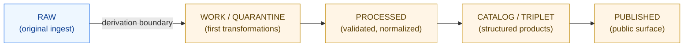

<!-- [KFM_META_BLOCK_V2]
doc_id: kfm://doc/<uuid-to-be-assigned>
title: Derived Stays Derived
type: standard
version: v1
status: draft
owners: <PROPOSED — KFM Data Governance>
created: 2026-05-12
updated: 2026-05-12
policy_label: public
related: [docs/doctrine/, docs/architecture/, docs/governance/]
tags: [kfm, doctrine, provenance, evidence, governance]
notes: [doctrine — derivation is monotonic across the KFM pipeline; once derived, always derived]
[/KFM_META_BLOCK_V2] -->

# Derived Stays Derived

> **Doctrine.** Once data is derived inside the KFM pipeline, it remains derived for the rest of its lifecycle. No stage, packaging step, or republication may relabel a derived artifact as original, and every downstream artifact must carry its derivation forward.

<!-- Badges -->

<!-- TODO — wire in CI/lint and doctrine-coverage badges once the doctrine-doc workflow is verified -->

**Status:** Draft · **Owners:** *PROPOSED — KFM Data Governance* · **Last updated:** 2026-05-12

---

## Quick jump

- [Why this doctrine exists](#why-this-doctrine-exists)
- [The rule, stated plainly](#the-rule-stated-plainly)
- [Pipeline stages and the derivation boundary](#pipeline-stages-and-the-derivation-boundary)
- [What "derived" carries forward](#what-derived-carries-forward)
- [What this doctrine forbids](#what-this-doctrine-forbids)
- [Operational requirements](#operational-requirements)
- [Examples](#examples)
- [Relationship to external standards](#relationship-to-external-standards)
- [FAQ](#faq)
- [Related doctrine and references](#related-doctrine-and-references)

---

## Why this doctrine exists

KFM integrates many heterogeneous source datasets and moves them through staged processing. Without a hard rule, derived products tend to drift back into being treated as primary sources — losing the chain of *how they came to be*. This doctrine exists to prevent that drift and to make provenance a structural property of the pipeline rather than a hopeful convention.

> [!IMPORTANT]
> "Derived stays derived" is a **one-way** property. Derivation is monotonic across the pipeline: any artifact downstream of a transformation is permanently a derived artifact, regardless of how minor the transformation was or how authoritative the result later becomes in practice.

## The rule, stated plainly

**An artifact produced by transforming, joining, filtering, enriching, reformatting, or otherwise computing over one or more inputs is a *derived artifact*. It must be labeled as derived, must record its inputs, and must not be promoted to *raw* or *original* status by any subsequent stage, packaging, publication, or republication.**

This applies regardless of:

- how minor the transformation was;
- whether the transformation is reversible;
- whether the derived artifact happens to be byte-identical to its input;
- whether the artifact is later treated as a citation target by external consumers.

## Pipeline stages and the derivation boundary

KFM uses a staged pipeline. The stage names below are preserved verbatim from project doctrine and must not be paraphrased or substituted with generic equivalents:

`RAW → WORK/QUARANTINE → PROCESSED → CATALOG/TRIPLET → PUBLISHED`

> [!NOTE]
> The **derivation boundary** sits at the first transformation after `RAW`. Anything that has crossed into `WORK/QUARANTINE` or beyond is derived for all subsequent purposes.

| Stage | Classification | Can be relabeled as RAW? |
|---|---|---|
| `RAW` | Original, ingested as-received | n/a (already RAW) |
| `WORK / QUARANTINE` | Derived | **No** |
| `PROCESSED` | Derived | **No** |
| `CATALOG / TRIPLET` | Derived | **No** |
| `PUBLISHED` | Derived | **No** |

[⬆ Back to top](#derived-stays-derived)

## What "derived" carries forward

Every derived artifact must carry:

1. **Input references.** Stable identifiers of every upstream artifact that influenced it.
2. **Transformation attestation.** Identification of the process (script, pipeline step, model, manual edit) that produced it. *PROPOSED — exact serialization may align with `prov:wasGeneratedBy` from W3C PROV-O; format requires verification against KFM schemas.*
3. **Stage labeling.** A pipeline stage indicator (`WORK`, `PROCESSED`, `CATALOG`, `PUBLISHED`) recorded in metadata.
4. **An `EvidenceRef` chain back to RAW.** Per KFM evidence doctrine, each derived artifact resolves through one or more `EvidenceRef`s into one or more `EvidenceBundle`s rooted in RAW inputs. *NEEDS VERIFICATION against the canonical `EvidenceBundle` / `EvidenceRef` definitions.*

> [!TIP]
> If you cannot construct a path from a derived artifact back to at least one RAW input, the artifact has lost its provenance and must be **reworked, not patched**.

## What this doctrine forbids

- ❌ Treating a `PROCESSED` or `PUBLISHED` artifact as the canonical source for downstream ingest *without* re-deriving from its RAW ancestors. The `EvidenceRef` chain must remain intact.
- ❌ "Re-ingesting" a derived KFM artifact back into the pipeline as if it were a new RAW external source.
- ❌ Stripping, flattening, or rewriting provenance metadata at publication time to "clean up" the output.
- ❌ Recording a hand-edited correction as RAW. Manual edits are themselves a derivation step and must be recorded as such.
- ❌ Allowing a downstream consumer of `PUBLISHED` data to round-trip it back into `RAW` inside the KFM project.

## Operational requirements

These requirements are normative for any component participating in the pipeline. **Concrete enforcement mechanisms — schema validators, CI checks, lint rules, refuse-merge policies — are PROPOSED and require verification against current repository state.**

| # | Requirement | Confidence |
|---|---|---|
| OR-1 | Every artifact past the derivation boundary carries a non-empty list of input references. | PROPOSED |
| OR-2 | Every artifact records the pipeline stage it currently occupies. | PROPOSED |
| OR-3 | Stage transitions **append** to provenance; they never overwrite or shorten it. | PROPOSED |
| OR-4 | Re-running a transformation produces a new artifact **version**; it does not mutate the prior one. | PROPOSED |
| OR-5 | Validation refuses any artifact whose `EvidenceRef` chain does not terminate in one or more RAW inputs. | PROPOSED |

> [!WARNING]
> If a tool, script, or workflow rewrites or drops upstream references during a stage transition, that tool is in violation of this doctrine and must be corrected. Doctrine takes precedence over convenience.

[⬆ Back to top](#derived-stays-derived)

## Examples

<strong>Example A</strong> — A reprojection is still a derivation

A GeoTIFF reprojected from `EPSG:4326` to `EPSG:5070` is a derived artifact even though the underlying observations are unchanged. It must:

- record the source GeoTIFF as an input;
- record the reprojection operation (tool name, parameters, version);
- be tagged with the appropriate pipeline stage;
- not be re-treated as a RAW raster by any downstream step.

*Illustrative — exact metadata fields are PROPOSED until verified against repo schemas.*

<strong>Example B</strong> — A joined table is derived even if one input is empty

A table produced by joining `historical_places.csv` with `boundaries.geojson` is derived even if the join produced zero matches. Provenance must still record both inputs and the join operation. **Emptiness is not an exemption.**

*Illustrative.*

<strong>Example C</strong> — A manually corrected record is a derivation event

If a curator hand-edits a single attribute on a `PROCESSED` feature, the resulting artifact is a *new derived version*. The original `PROCESSED` artifact is retained; the new one references it plus the edit event. The curator's edit is itself an input.

*Illustrative.*

<strong>Example D</strong> — A model-generated enrichment is derived

A model-generated geocode, classification, or text summary is a derived artifact. Its provenance must record both the input artifacts and the model identity and version. The fact that the output is probabilistic does not exempt it.

*Illustrative — see future AI-provenance doctrine for model-card requirements once published.*

## Relationship to external standards

This doctrine is consistent with, but not identical to, several external provenance and FAIR conventions. **Where they conflict with KFM-specific terminology or stage definitions, KFM doctrine governs.**

| External standard | Alignment | Notes |
|---|---|---|
| W3C PROV-O | Strong | `prov:wasDerivedFrom` corresponds to the relationship this doctrine enforces. *EXTERNAL — referenced as a general standard, not as KFM-specific implementation guidance.* |
| FAIR principles | Strong (R1.2 — provenance) | Derived-stays-derived supports the Reusability pillar's provenance requirement. *EXTERNAL.* |
| STAC | Partial | STAC items can carry `derived_from` links and may serve as a serialization layer for KFM provenance. *PROPOSED — verify against current KFM STAC usage.* |
| schema.org | Partial | `schema:isBasedOn` overlaps semantically. *EXTERNAL — relevance to KFM is PROPOSED.* |

> [!NOTE]
> External standards inform serialization choices but do not redefine KFM stages. The KFM stage names (`RAW`, `WORK/QUARANTINE`, `PROCESSED`, `CATALOG/TRIPLET`, `PUBLISHED`) and KFM evidence types (`EvidenceBundle`, `EvidenceRef`) remain authoritative within this project.

## FAQ

**Q: If I correct a typo in a derived artifact, is the corrected version still derived?**
Yes. The correction is itself a derivation step. The new version is derived from the prior derived version plus the edit. Provenance grows; it does not reset.

**Q: Can a `PUBLISHED` artifact ever be used as a RAW input for a new project?**
From within KFM, no — internally it remains derived. An external consumer treating KFM `PUBLISHED` data as their RAW source is *their* provenance decision, not KFM's, and does not retroactively change KFM's classification.

**Q: What if RAW inputs are lost?**
A derived artifact whose RAW ancestors are no longer resolvable must be flagged. Doctrine does not permit silently treating it as RAW. *PROPOSED — exact handling (quarantine, archival flag, soft-delete) requires verification against governance policy.*

**Q: Does this apply to model outputs and embeddings?**
Yes. Embeddings, model predictions, and any AI-generated enrichments are derived artifacts and must record both their input artifacts and the model/version used.

**Q: What about caches, tiles, and rendering products?**
Yes — tile pyramids, map renders, and cached aggregations are derived artifacts. They may be regenerated freely, but each generation is a derivation event with its own provenance link.

[⬆ Back to top](#derived-stays-derived)

## Related doctrine and references

- *TODO* — `docs/doctrine/evidence-bundles.md` *(governs `EvidenceBundle` / `EvidenceRef` semantics)* — **PROPOSED path; NEEDS VERIFICATION**
- *TODO* — `docs/doctrine/pipeline-stages.md` *(defines `RAW` → `PUBLISHED` in detail)* — **PROPOSED path; NEEDS VERIFICATION**
- *TODO* — `docs/architecture/` *(architecture overview placing this doctrine)* — **PROPOSED path**
- *TODO* — `docs/governance/` *(enforcement and exception policy)* — **PROPOSED path**
- *EXTERNAL* — W3C PROV-O: <https://www.w3.org/TR/prov-o/>
- *EXTERNAL* — FAIR Principles: <https://www.go-fair.org/fair-principles/>
- *EXTERNAL* — STAC specification: <https://stacspec.org/>

> [!NOTE]
> Related-doc paths above are **PROPOSED placeholders**. They reflect a likely structure based on the `docs/doctrine/` folder convention implied by this file's path, but each target must be verified against the current repository before linking.

---

**Last updated:** 2026-05-12 · **Status:** Draft · **Version:** v1 · **Type:** Doctrine

[⬆ Back to top](#derived-stays-derived)
