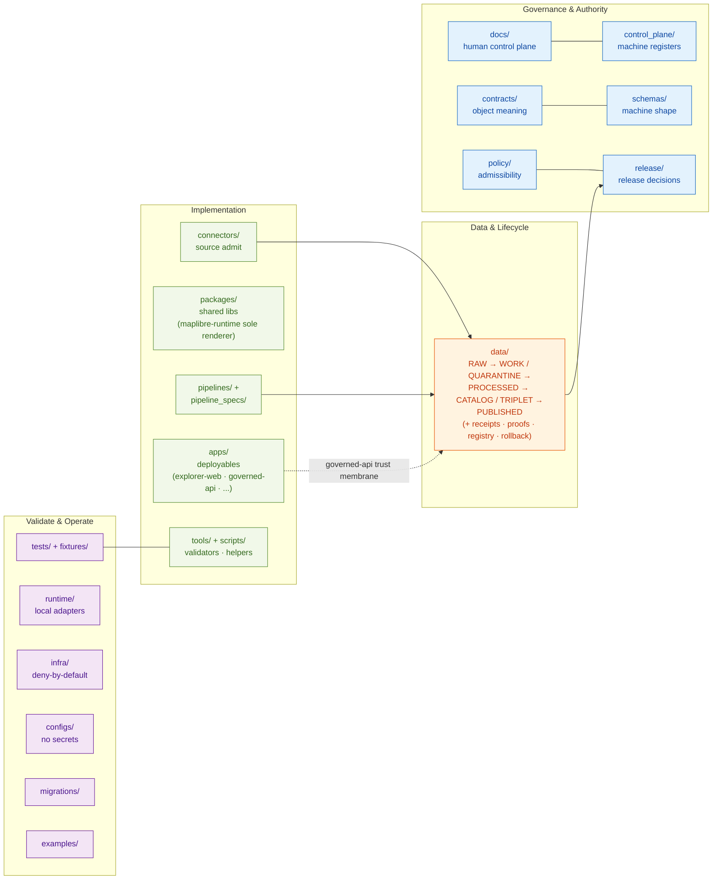

<!-- [KFM_META_BLOCK_V2]
doc_id: kfm://doc/doctrine/directory-rules
title: Directory Rules
type: doctrine
subtype: placement-doctrine
version: v1.4 (presentation refresh; doctrine unchanged from v1.3)
prior_version: v1.3 (renderer-decision refresh; 2026-05-24)
status: draft
owners: <docs-steward>                # PLACEHOLDER — assign before review
created: 2026-05-18
updated: 2026-05-25
policy_label: public
proposed_home: docs/doctrine/directory-rules.md
related:
  - docs/doctrine/authority-ladder.md
  - docs/doctrine/truth-posture.md
  - docs/doctrine/trust-membrane.md
  - docs/doctrine/lifecycle-law.md
  - docs/architecture/contract-schema-policy-split.md
  - docs/architecture/maplibre-3d.md                              # v1.3 sole-renderer doctrine (renderer-decision ADR PROPOSED)
  - docs/registers/DRIFT_REGISTER.md
  - docs/registers/VERIFICATION_BACKLOG.md
  - docs/adr/ADR-0001-schema-home.md
  - docs/adr/ADR-0003-policy-singular-is-canonical.md             # PROPOSED
  - docs/adr/ADR-NNNN-maplibre-sole-renderer-retire-cesium.md     # PROPOSED — number pending; §18.e OPEN-DR-10
  - control_plane/document_registry.yaml
truth_labels: [CONFIRMED, PROPOSED, INFERRED, NEEDS VERIFICATION, UNKNOWN, EXTERNAL]
authority_class: governance doctrine
supersedes:
  - v1.3 (presentation only; substantive doctrine carries forward unchanged)
spec_hash: PROPOSED — emit via canonical JCS+SHA-256 once tooling is wired
tags: [kfm, doctrine, directory-rules, placement, governance, lifecycle, trust-membrane, maplibre-3d, focus-mode]
notes:
  - "v1.4 is a presentation refresh: adds KFM Meta Block v2, Shields.io badge row, quick-jump mini-TOC, authority-surface Mermaid diagram, back-to-top anchors, and footer block. Doctrine carries forward from v1.3 unchanged."
  - "v1.3 substantive doctrine (Cesium retirement, MapLibre as sole browser-side renderer) remains PROPOSED pending the renderer-decision ADR (§18.e OPEN-DR-10). Until acceptance, the §11 freeze rule blocks new cesium* code, schemas, policies, or tests."
  - "All path claims remain PROPOSED until verified against mounted-repo evidence. Commit-pinned paths at b6a27916bbb9e07cbf3752870c867476e1e094e7 (v1.2 evidence) are visibly marked CONFIRMED (at commit); all other paths are PROPOSED or NEEDS VERIFICATION."
  - "No mounted repo was inspected in the v1.4 authoring session. Implementation maturity is bounded per the AI Build Operating Contract current-session evidence limit."
  - "Open ADR-class questions OPEN-DR-01 through OPEN-DR-13 are explicitly tracked in §18; v1.4 takes no unilateral position on any of them."
[/KFM_META_BLOCK_V2] -->

<a id="top"></a>

# Directory Rules

> **Where a file lives encodes who owns it, what governance it answers to, and what lifecycle it belongs to. Topic does not justify a root folder; responsibility does.**


> [!IMPORTANT]
> **v1.4 is a presentation refresh; doctrine is unchanged from v1.3.** The v1.3 Cesium retirement and MapLibre-as-sole-renderer doctrine remain **PROPOSED** pending acceptance of the renderer-decision ADR (§18.e OPEN-DR-10). Live-repo paths are CONFIRMED only for the subset recorded in the *KFM Repository Structure Guiding Document* at commit `b6a27916…`; all other paths are PROPOSED or NEEDS VERIFICATION. **This file does not decide whether artifacts should exist; it decides where they go once they do.**

## Quick jump

| Foundation | Placement | Authority roots | Drift & migration | Reference |
|---|---|---|---|---|
| [§0 Status & Authority](#0-status--authority) · [§1 Purpose](#1-purpose) · [§2 Authority](#2-authority-conformance-and-conflict-resolution) · [§3 The Deeper Rule](#3-the-deeper-rule) | [§4 Placement Protocol](#4-where-does-this-file-go--placement-protocol) | [§5 Canonical Root Tree](#5-canonical-root-tree) · [§6 Governance & Authority Roots](#6-governance-and-authority-roots) · [§7 Implementation Roots](#7-implementation-roots) · [§8 Compatibility Roots](#8-compatibility-roots) · [§9 Data & Release Roots](#9-data-and-release-roots) · [§10 Runtime / Infra / Configs](#10-runtime-infrastructure-and-configuration-roots) · [§11 UI & Map Roots](#11-ui-and-map-roots) · [§12 Domain Placement Law](#12-domain-placement-law) | [§13 Anti-Patterns & Drift Prevention](#13-anti-patterns-and-drift-prevention) · [§14 Migration Discipline](#14-migration-discipline) · [§15 Required README Contract](#15-required-readme-contract) · [§16 Path-Validation Checklist](#16-path-validation-checklist-for-reviewers) · [§17 Document Change Discipline](#17-document-change-discipline) | [§18 Open Questions](#18-open-questions-and-needs-verification) · [§19 Glossary](#19-glossary) · [§20 Final Recommendation](#20-practical-final-recommendation) · [§21 Changelog](#21-changelog) |

## Authority surface at a glance



> [!NOTE]
> The diagram is **illustrative** of authority-root groupings, not an exhaustive dependency graph. The lifecycle invariant **RAW → WORK / QUARANTINE → PROCESSED → CATALOG / TRIPLET → PUBLISHED** is the only flow promoted to invariant status; the other edges are relationship hints. Compatibility roots (`artifacts/`, `jsonschema/`, `policies/`, `ui/`, `web/`, `styles/`, `viewer_templates/`) are not shown — they exist as transitional shells per §8 until migration completes.

---

## 0. Status & Authority

| Field | Value |
|---|---|
| **Document type** | Governance doctrine |
| **Edition** | **v1.4** — presentation refresh. Adds KFM Meta Block v2, Shields.io badge row, quick-jump mini-TOC, authority-surface Mermaid diagram, back-to-top anchors, and footer block. **Doctrine is unchanged from v1.3.** No canonical root added, removed, or renamed. See §21 for the v1.3 → v1.4 changelog. |
| **Prior edition** | **v1.3** — renderer-decision refresh. Retired `packages/cesium/` as a canonical placement and aligned all 3D placement guidance with the proposed *MapLibre as Sole Browser-Side Renderer* ADR (see `docs/architecture/maplibre-3d.md`). |
| **Authority of these rules** | CONFIRMED — these are the canonical placement rules |
| **Authority of any specific path quoted here** | Mixed. Live-repo paths CONFIRMED at commit `b6a27916bbb9e07cbf3752870c867476e1e094e7` per the *KFM Repository Structure Guiding Document* (v0.1) are marked **CONFIRMED (at commit)**. 3D / MapLibre placement paths added in v1.3 are **PROPOSED** pending acceptance of the renderer-decision ADR (§18.e OPEN-DR-10). All other paths remain **PROPOSED** until verified against later mounted-repo evidence. |
| **Proposed canonical home** | `docs/doctrine/directory-rules.md` |
| **Owner** | Docs steward |
| **Reviewers required for change** | Docs steward + at least one subsystem owner; ADR required for §2.4 changes; the v1.3 renderer-decision changes are governed by the ADR cited in §18.e OPEN-DR-10. **v1.4 presentation changes are routine PR per §17.** |
| **Supersedes** | v1.3 of this document for presentation only; v1.3 substantive doctrine carries forward unchanged. v1.0 text remains preserved verbatim in §§1–20; v1.1, v1.2, v1.3, and v1.4 additions are preserved and visibly marked; v1.4 additions are listed in §21. Roll-back to v1.3 is mechanical (see §21 v1.4 reversibility note). |
| **Related doctrine** | `docs/doctrine/authority-ladder.md`, `docs/doctrine/truth-posture.md`, `docs/doctrine/trust-membrane.md`, `docs/doctrine/lifecycle-law.md`, `docs/architecture/contract-schema-policy-split.md`, **`docs/architecture/maplibre-3d.md` (v1.3 sole-renderer doctrine)** |
| **Schema-home convention** | `schemas/contracts/v1/<…>` as default per ADR-0001 (schema home). See §7.4. **Unchanged in v1.4.** v1.3 added two top-level family segments — `schemas/contracts/v1/maplibre/` and `schemas/contracts/v1/3d/` (per `maplibre-3d.md` §6.2). These join the existing families; they do not create a parallel schema home. |
| **Lifecycle invariant** | RAW → WORK / QUARANTINE → PROCESSED → CATALOG / TRIPLET → PUBLISHED. Promotion is a **governed state transition, not a file move. Unchanged in v1.4.** |
| **Last reviewed** | 2026-05-25 (v1.4 presentation refresh) |

> **v1.4 truth posture note.** v1.4 adds **no new substantive claims** beyond v1.3. All v1.0–v1.3 truth-posture statements carry forward unchanged. The v1.4 additions are pure presentation (HTML comment meta block, Shields.io badge images, anchor IDs, Mermaid diagram, mini-TOC, footer) — none of which assert any new fact about the repository, the doctrine, or the lifecycle.

> **v1.3 truth posture note (carried forward).** v1.3 substantive changes (Cesium retirement and MapLibre-as-sole-renderer doctrine) are grounded in `docs/architecture/maplibre-3d.md` (CONFIRMED authored; status `draft (recommends ADR-PROPOSED)`) and *Master MapLibre Components-Functions-Features* v2.1. All v1.3 placement claims are **PROPOSED**; mounted-repo presence of any v1.3 path is **NEEDS VERIFICATION**. No mounted-repo `cesium*` inventory was conducted; OPEN-DR-11 is the operational hook for that work.

> **v1.2 truth posture note (carried forward).** v1.2 additions are grounded in three evidence layers, in descending strength:
> 1. **Live-repo evidence at commit `b6a27916bbb9e07cbf3752870c867476e1e094e7`** (read via GitHub web view), captured in the *KFM Repository Structure Guiding Document* (v0.1). Paths marked **CONFIRMED (at commit)** in this edition trace to this evidence. The commit-pinned evidence covers root-folder presence and selected first-level subfolders; deeper inspection (every nested file, CI logs, dashboards, runtime state) was **not** performed.
> 2. **Prior-session-authored artifacts** (visible via past-chat retrieval) — same posture as v1.1.
> 3. **Attached doctrine corpus visible to the v1.2 authoring session**: eleven Kansas-county Focus Mode Build Plans (Ellsworth, Riley, Shawnee, Ford, Wyandotte, Sedgwick, Douglas, Leavenworth, Reno, Johnson, Barton), KFM Unified Doctrine Synthesis, KFM Encyclopedia, AI Build Operating Contract, Domains Atlas v1.1, Master MapLibre Components-Functions-Features, Pass-10 Idea Index, Domain-Driven Design Reference, KFM Unified Implementation Architecture Build Manual, KFM Connected Dots Architecture Brief.
>
> **What v1.4 still does not have** (carrying forward v1.2's and v1.3's limits): CI run logs, workflow execution evidence, dashboards, runtime traces, branch-protection state, full recursive file listings, test-pass evidence, mounted-repo `cesium*` inventory. Path presence below the commit-pinned first level remains **NEEDS VERIFICATION**.
>
> **v1.1 truth posture note (carried forward).** v1.1 additions were grounded in attached doctrine and prior-session authoring; no mounted repo was inspected at v1.1 authoring time. v1.2, v1.3, and v1.4 do not retroactively upgrade v1.1 claims.

[↑ Back to top](#top)

---

## 1. Purpose

Directory Rules govern **where** files belong in the Kansas Frontier Matrix (KFM) repository. They guarantee four properties:

1. **Authority is visible.** A file's location encodes its responsibility root, lifecycle phase, and governance posture.
2. **The root stays boring.** Repo-root folders are stable, governance-bearing, and few. Topic, complexity, and domain depth live inside lanes.
3. **Drift is recognizable.** The document names common drift patterns so reviewers can call them out before they harden into authority.
4. **Changes are reversible.** Moves and renames follow a migration discipline that preserves history, ADR linkage, and rollback paths.

Directory Rules **do not decide** whether a file *should* exist. Existence is decided by `contracts/`, `schemas/`, `policy/`, source descriptors, ADRs, and reviews. Directory Rules decide *where it goes* once it exists.

---

## 2. Authority, Conformance, and Conflict Resolution

### 2.1 Authority order

When sources disagree about placement, resolve in this order:

1. **KFM core invariants and doctrine.** Lifecycle law, truth posture (cite-or-abstain), trust membrane, authority ladder, watcher-as-non-publisher.
2. **Accepted ADRs that explicitly amend Directory Rules,** by ADR number. Superseded ADRs do not count.
3. **This document.**
4. **Per-root `README.md` files** in the repo. These refine but cannot contradict.
5. **Domain dossiers and prior architecture reports.** Lineage / proposed only.
6. **Convention from the current mounted repo state.** When it conflicts with the Rules, raise it as a `docs/registers/DRIFT_REGISTER.md` entry, not as new authority.

### 2.2 Conformance language (RFC 2119-style)

- **MUST / MUST NOT** — non-negotiable. PRs that violate MUST are not merged absent an approved ADR.
- **SHOULD / SHOULD NOT** — strong default. Deviation requires brief justification in the PR body or in the affected per-root README.
- **MAY** — permitted; no justification required, but stay consistent within the lane.

### 2.3 Out of scope

Directory Rules do **not** cover:

- Object-family meaning. (`contracts/`)
- Field-level shape. (`schemas/`)
- Admissibility / release decisions. (`policy/`, `release/`)
- Source identity, rights, sensitivity. (`data/registry/`, `policy/sensitivity/`)
- Code style, in-file naming, or public-facing prose.

### 2.4 Changes that require an ADR

A new ADR is **required** before:

1. Adding, removing, or renaming a **canonical root** (§5).
2. Promoting a **compatibility root** to canonical, or deprecating a canonical root.
3. Changing the **schema-home rule** (`schemas/` vs `contracts/` authority).
4. Splitting or merging a lifecycle phase (`data/raw`, `work`, `quarantine`, `processed`, `catalog`, `triplets`, `published`, `receipts`, `proofs`, `registry`).
5. Creating a parallel home for any of: schemas, contracts, policy, sources, registries, releases, proofs, receipts.
6. Bending an invariant from §3.

ADR template fields: `id`, `title`, `status` (proposed | accepted | superseded | rejected), `date`, `context`, `decision`, `consequences`, `alternatives`. Superseded ADRs MUST be retained with `status: superseded` and a forward link to the replacing ADR.

### 2.5 What to do when this file conflicts with the repo

If the mounted repo shows a structure that contradicts the Rules:

1. **Do not silently conform** to the repo and call it canon. The Rules are doctrine; the repo may have drifted.
2. **Open a drift entry** in `docs/registers/DRIFT_REGISTER.md` describing the conflict and the affected paths.
3. **Propose a resolution** — ADR amending the Rules, or migration plan bringing the repo into conformance.
4. **Until resolved,** mark affected paths `PROPOSED / CONFLICTED` and avoid creating divergent siblings.

[↑ Back to top](#top)

---

## 3. The Deeper Rule

A folder MUST appear at repo root only if it carries one or more of these repo-wide responsibilities:

1. **Governs truth, evidence, release, or policy.** → `docs/`, `control_plane/`, `contracts/`, `schemas/`, `policy/`, `release/`
2. **Contains deployable systems or shared implementation packages.** → `apps/`, `packages/`, `connectors/`, `pipelines/`, `tools/`
3. **Stores lifecycle data or emitted proof objects.** → `data/`
4. **Supports validation, tests, infrastructure, or runtime operation.** → `tests/`, `fixtures/`, `infra/`, `runtime/`, `configs/`, `migrations/`
5. **Is genuinely cross-domain**, not a topic with one or two adjacent files.

A folder MUST NOT appear at repo root if it is:

- A **domain name** — hydrology, soil, fauna, flora, archaeology, roads, hazards, settlements, atmosphere, agriculture, geology, habitat, transport, people, etc. Domains live as lanes inside responsibility roots.
- A **convenience grouping** — `misc/`, `stuff/`, `kfm/`, `core/` (scope-free), `shared/` (without `packages/`).
- A **topic with an existing home** — e.g., `models/` when `runtime/model_adapters/` exists; `validators/` when `tools/validators/` exists.
- A **renamed mirror of another root** — e.g., `policies/` mirroring `policy/`. (See §8 for compatibility handling.)
- A **single file's parent** — if exactly one file lives in it, the file probably belongs in a sibling.

When in doubt, the **responsibility root wins over the topic name**.

---

## 4. Where Does This File Go? — Placement Protocol

Use this protocol every time before proposing, creating, moving, or renaming a path. It SHOULD appear in the PR description for any path-bearing change.

### Step 1 — Identify the responsibility

Pick **exactly one** primary responsibility. If a file legitimately has more than one, split it.

| If the file's primary responsibility is… | …it belongs under |
|---|---|
| Explains something to humans | `docs/` |
| Indexes "what governs what" (machine-readable) | `control_plane/` |
| Defines an object's **meaning** | `contracts/` |
| Defines an object's **machine shape** | `schemas/` |
| Decides allow / deny / restrict / abstain | `policy/` |
| Proves a rule is enforceable | `tests/` |
| Holds golden, valid, or invalid sample data for tests | `fixtures/` |
| Repo-wide validator, generator, builder, checker | `tools/` |
| Small operational helper, one-off | `scripts/` |
| Deployable application | `apps/` |
| Shared library used by multiple deployables | `packages/` |
| Source-specific fetcher / admitter | `connectors/` |
| Executable pipeline logic | `pipelines/` |
| Declarative pipeline configuration | `pipeline_specs/` |
| Lifecycle data (raw, work, processed, etc.) | `data/` |
| Release decision, manifest, rollback, correction | `release/` |
| Local runtime adapter / harness | `runtime/` |
| Deployment, host, network, exposure posture | `infra/` |
| Non-secret config defaults / templates | `configs/` |
| Database / schema / graph migration | `migrations/` |
| Worked, runnable example | `examples/` |
| *(v1.2)* **Focus-mode proof slice** (county / region scoped composition) | **Multi-root pattern; see §6.7.** Not a single root. A focus mode spans `docs/focus-modes/<area>/`, `contracts/focus_mode/`, `schemas/contracts/v1/focus_mode/`, `fixtures/focus_modes/<area>/`, `apps/explorer-web/src/focus-modes/<area>/`, `tools/validators/`, and `data/{catalog,published,registry}/.../<area>/`. **A focus mode does NOT become a root folder.** |

### Step 2 — Identify the lifecycle phase (data only)

For files under `data/`, name the phase explicitly: **raw, work, quarantine, processed, catalog, triplets, published, receipts, proofs, registry, rollback.** Receipts, proofs, registry, and rollback are emitted *alongside* lifecycle directories; they do not replace them.

### Step 3 — Identify the domain

If the file is domain-specific, the domain appears as a **segment** inside the responsibility root, never as a **root itself**:

```text
docs/domains/<domain>/
contracts/domains/<domain>/
schemas/contracts/v1/domains/<domain>/
policy/domains/<domain>/
tests/domains/<domain>/
fixtures/domains/<domain>/
packages/domains/<domain>/
pipelines/domains/<domain>/
pipeline_specs/<domain>/
data/<phase>/<domain>/
data/catalog/domain/<domain>/
data/published/layers/<domain>/
data/registry/<domain>/  or  data/registry/sources/<domain>/
release/candidates/<domain>/
```

### Step 4 — Confirm authority

The owning root MUST already exist, or be created in the same change with a per-root README (§15). If the proposed location requires a new canonical root, a new compatibility root, or a new sibling under `data/`, an ADR (§2.4) is required.

### Step 5 — Cite the rule

In the PR description, name the Rules section that justifies the placement. If no section justifies it, mark the path **PROPOSED** or **NEEDS VERIFICATION** and open an entry in `docs/registers/DRIFT_REGISTER.md` or `docs/registers/VERIFICATION_BACKLOG.md`.

> [!TIP]
> **Reviewer's one-line check:** *"Does the path encode the right responsibility, the right lifecycle phase (if data), and the right domain segment — and does this PR cite a rule for it?"*

[↑ Back to top](#top)

---

## 5. Canonical Root Tree

Status of the **rules below**: CONFIRMED.
Status of any **specific repo's presence** of these roots: PROPOSED until verified.

```text
Kansas-Frontier-Matrix/
├── README.md
├── CHANGELOG.md
├── CONTRIBUTING.md
├── SECURITY.md
├── LICENSE
├── CODEOWNERS                # may live in .github/CODEOWNERS instead
├── .github/                  # workflows, issue/PR templates, governance hooks
├── docs/                     # human-facing control plane
├── control_plane/            # machine-readable governance maps and registers
├── contracts/                # object-family meaning
├── schemas/                  # machine-checkable shape
├── policy/                   # admissibility and release policy
├── tests/                    # enforceability proof
├── fixtures/                 # golden / valid / invalid test inputs
├── tools/                    # repo-wide validators, generators, builders
├── scripts/                  # small operational helpers
├── apps/                     # deployable applications
├── packages/                 # shared libraries
├── connectors/               # source-specific fetchers / admitters
├── pipelines/                # executable pipeline logic
├── pipeline_specs/           # declarative pipeline configuration
├── data/                     # lifecycle data and emitted proof
├── release/                  # release decisions, manifests, rollback, correction
├── runtime/                  # local runtime adapters and harnesses
├── infra/                    # deployment, host, network, exposure
├── configs/                  # non-secret config defaults / templates
├── migrations/               # database / schema / graph migrations
├── examples/                 # worked, runnable examples
└── artifacts/                # OPTIONAL / compatibility; tightly scoped
```

### Per-root authority status

| Root | Authority | Notes |
|---|---|---|
| `docs/` | **Canonical** | Human-facing control plane; the authority surface for doctrine, registers, runbooks, ADRs. |
| `control_plane/` | **Canonical** | Machine-readable governance maps. Indexes; does not store source data. |
| `contracts/` | **Canonical** | Owns object **meaning**. Pairs with `schemas/`; never the only place validation lives. |
| `schemas/` | **Canonical** | Owns machine-checkable **shape**. Default home: `schemas/contracts/v1/...` per ADR-0001. |
| `policy/` | **Canonical (singular)** | If `policies/` exists, treat it as compatibility / mirror until ADR resolves. |
| `tests/`, `fixtures/` | **Canonical** | Prove the doctrine is enforceable. Avoid two competing fixture homes. |
| `tools/`, `scripts/` | **Canonical** | Long-lived, trust-bearing logic graduates from `scripts/` to `tools/`, `pipelines/`, or `packages/`. |
| `apps/` | **Canonical** | Deployable. The public trust path is `apps/governed-api/`. |
| `packages/` | **Canonical** | Shared, reusable. One-off workflow steps belong in `tools/` or `pipelines/`. |
| `connectors/` | **Canonical** | Output goes to `data/raw/` or `data/quarantine/`. Connectors do not publish. |
| `pipelines/`, `pipeline_specs/` | **Canonical** | `_specs/` says *what* should run; `pipelines/` is *how* it runs. |
| `data/` | **Canonical** | The lifecycle invariant lives here. Most consequential structural decisions are inside. |
| `release/` | **Canonical** | Release **decisions**. Distinct from `data/published/` (released **artifacts**). |
| `runtime/` | **Canonical** | Adapters and harnesses behind the governed API. Never a public surface. |
| `infra/` | **Canonical** | Deny-by-default, least privilege, audit. |
| `configs/` | **Canonical** | No real secrets. Templates and defaults only. |
| `migrations/` | **Canonical** | Includes a `rollback/` subtree by default. |
| `examples/` | **Canonical** | Runnable, kept current. Stale examples are deletion candidates. |
| `artifacts/` | **Compatibility** | Optional; tightly scoped (build, docs, qa, temporary). Not a home for trust-bearing receipts/proofs/manifests. |
| `ui/`, `web/`, `styles/`, `viewer_templates/` | **Compatibility** | Migration targets: `apps/explorer-web/`, `packages/ui/`, **`packages/maplibre-runtime/`** *(v1.3 — was `packages/maplibre/` in v1.2; v1.2-historical name retained as transitional per §18.e OPEN-DR-12)*. See §8. |
| `jsonschema/`, `policies/` | **Compatibility** | Mirrors of canonical `schemas/`, `policy/`. README must declare class. See §8. |

[↑ Back to top](#top)

---

## 6. Governance and Authority Roots

### 6.1 `docs/` — the human-facing control plane

> [!NOTE]
> **v1.1 note (carried forward).** Sub-listings under `docs/standards/` and `docs/runbooks/` below reflect prior-session-authored artifacts (CONFIRMED authored; mounted-repo presence NEEDS VERIFICATION). The list is **illustrative, not exhaustive**, and intentionally calls out a known naming-variance question (`PROV.md` vs `PROVENANCE.md`, see §18 OPEN-DR-01) and a known subfolder-convention question (`docs/runbooks/<domain>/`, see §18 OPEN-DR-02).

```text
docs/
├── README.md
├── doctrine/
│   ├── README.md
│   ├── authority-ladder.md
│   ├── truth-posture.md
│   ├── trust-membrane.md
│   ├── lifecycle-law.md
│   └── directory-rules.md            # this file
├── architecture/
│   ├── README.md
│   ├── system-context.md
│   ├── deployment-topology.md
│   ├── governed-api.md
│   ├── map-shell.md
│   ├── maplibre-3d.md                # (v1.3) sole-renderer doctrine + 3D feature surface
│   └── contract-schema-policy-split.md
├── adr/
│   ├── README.md
│   ├── ADR-0001-schema-home.md
│   └── ADR-NNNN-maplibre-sole-renderer-retire-cesium.md  # (v1.3) PROPOSED — number pending; §18.e OPEN-DR-10
├── domains/
│   ├── README.md
│   ├── hydrology/   soil/   fauna/   flora/   habitat/
│   ├── geology/     atmosphere/   roads-rail-trade/
│   ├── settlements-infrastructure/   archaeology/
│   ├── hazards/     agriculture/    people-dna-land/
├── focus-modes/                       # (v1.2) county / region proof-slice docs
│   ├── README.md
│   └── <area>-county/  or  <area>-region/
├── sources/                           # source-descriptor standards, source families
├── standards/                         # external standards KFM conforms to (STAC, DCAT, PROV, …)
│   ├── README.md
│   ├── ISO-19115.md                  # CONFIRMED authored (prior session); NEEDS VERIFICATION in repo
│   ├── OAI-PMH.md                    # CONFIRMED authored (prior session); NEEDS VERIFICATION in repo
│   ├── OGC-API-TILES.md              # CONFIRMED authored (prior session); NEEDS VERIFICATION in repo
│   ├── PMTILES.md                    # CONFIRMED authored (prior session); NEEDS VERIFICATION in repo
│   ├── PROV.md                       # CONFIRMED authored (prior session); naming variance vs corpus PROVENANCE.md → §18 OPEN-DR-01
│   ├── SIGNING.md                    # PROPOSED in corpus (Pass-10 C1-03); not yet authored
│   ├── SENSITIVITY_RUBRIC.md         # PROPOSED in corpus (Pass-10 C6-01); not yet authored
│   ├── REDACTION_DETERMINISM.md      # PROPOSED in corpus (Pass-10 C6-03); not yet authored
│   └── SMART_SYNC.md                 # PROPOSED in corpus (Pass-10 C3-01); not yet authored
├── runbooks/                         # ops procedures, rollback drills, validation runs
│   ├── README.md
│   ├── fauna/                                  # NEEDS VERIFICATION: subfolder vs flat → §18 OPEN-DR-02
│   │   └── SOURCE_REFRESH_RUNBOOK.md           # CONFIRMED authored (prior session)
│   └── <flat or domain-segmented>              # convention pending ADR
├── security/                         # threat model, exposure posture, incident response
├── governance/                       # roles, review burden, separation of duties
├── registers/                        # AUTHORITY_LADDER, CANONICAL_LINEAGE_EXPLORATORY, DRIFT_REGISTER, VERIFICATION_BACKLOG, OBJECT_FAMILY_MAP
├── intake/                           # IDEA_INTAKE, NEW_IDEAS_INDEX
├── archive/                          # lineage/, exploratory/, deprecated/
├── reports/                          # generated review/release reports (read-only)
├── atlases/                          # versioned domain atlases / dossiers (per ADR-S-02)
└── brand/                            # styles guides, logo, voice — only if not in packages/ui/
```

`docs/` **explains**; `control_plane/` **indexes**; `contracts/` **defines meaning**; `schemas/` **defines shape**. These four are different layers of the same governance function and MUST NOT collapse into one another.

#### 6.1.a `docs/standards/` placement contract (v1.1)

**Authority:** `docs/standards/` is the canonical home for **external** standards profiles that KFM conforms to or crosswalks against — never for KFM's own object meaning (which lives in `contracts/`), shape (which lives in `schemas/`), or admissibility decisions (which live in `policy/`). External standards are conformance references and crosswalk layers; they do not replace KFM's own trust membrane, EvidenceBundle, or release manifest patterns.

**Naming convention (PROPOSED v1.1, pending ADR):** UPPERCASE-WITH-HYPHENS filename matching the standard's common short name, with `.md` extension. Examples: `ISO-19115.md`, `OAI-PMH.md`, `OGC-API-TILES.md`, `PMTILES.md`, `STAC.md`, `DCAT.md`. Multi-word topical standards documents (not external standards) MAY use UPPERCASE_WITH_UNDERSCORES, e.g., `SENSITIVITY_RUBRIC.md`, `REDACTION_DETERMINISM.md`, `SMART_SYNC.md`. The mixed convention is a known irregularity and is tracked at §18 OPEN-DR-04.

**One file per standard.** A standard's profile lives in one file; if a profile grows large enough to warrant splitting (extensions, crosswalks, version pins), prefer subsidiary files under a same-named folder, not parallel root-level siblings.

#### 6.1.b `docs/runbooks/` placement contract (v1.1, NEEDS VERIFICATION)

**Authority:** `docs/runbooks/` is the canonical home for operational procedures: source refresh, rollback drills, validation runs, incident response, evaluator workflows, steward review. Runbooks **explain how to operate**; they do not encode policy (`policy/`) or object meaning (`contracts/`).

**Subfolder convention (OPEN, see §18 OPEN-DR-02):** Two patterns are live in prior-session work:

- **Pattern A — Domain-segment subfolder:** `docs/runbooks/fauna/SOURCE_REFRESH_RUNBOOK.md`. Used in the authored fauna source-refresh runbook.
- **Pattern B — Flat with domain prefix:** `docs/runbooks/fauna_source_refresh.md` or `docs/runbooks/source_refresh_fauna.md`.

Pattern A scales better as multiple runbooks per domain accumulate; Pattern B is simpler for one-runbook-per-topic cases. **An ADR is needed to freeze the choice** before either pattern becomes entrenched as canonical. Until then, either is acceptable, but new authors SHOULD adopt Pattern A for any domain that already has a domain-segmented runbook in flight.

### 6.2 `control_plane/` — machine-readable governance maps

```text
control_plane/
├── README.md
├── document_registry.yaml
├── source_authority_register.yaml
├── object_family_register.yaml
├── domain_lane_register.yaml
├── policy_gate_register.yaml
├── release_state_register.yaml
├── verification_backlog.yaml
├── contradiction_register.yaml
└── deprecation_register.yaml
```

`control_plane/` is for the *operational* "what governs what" layer: registers and crosswalks too structured for prose, too governance-y for `data/` or `schemas/`.

### 6.3 `contracts/` — object meaning

```text
contracts/
├── README.md
├── source/                # source_descriptor, ingest_receipt
├── evidence/              # evidence_ref, evidence_bundle
├── data/                  # dataset_version, validation_report
├── runtime/               # runtime_response_envelope, decision_envelope, run_receipt, ai_receipt
├── release/               # release_manifest, promotion_decision, rollback_card
├── correction/            # correction_notice
├── governance/            # review_record
├── focus_mode/            # (v1.2) FocusModePayload, LayerRegistryEntry — Markdown only
├── maplibre/              # (v1.3) scene-manifest.md, style-manifest.md, representation-receipt.md, plugin-dependencies.md
├── 3d/                    # (v1.3) geometry-labeling.md, reality-boundary-notes.md
└── domains/
    ├── hydrology/   soil/   …
```

`contracts/` files are usually `.md` describing what an object means, what its fields intend, and what invariants it carries. Executable validation does not live here; it lives in `schemas/` (shape) and `policy/` (admissibility) and `tests/` (proof).

### 6.4 `schemas/` — machine-checkable shape

```text
schemas/
├── README.md
├── contracts/
│   └── v1/
│       ├── common/      source/      evidence/      data/
│       ├── runtime/     policy/      release/       correction/
│       ├── focus_mode/                       # (v1.2)
│       ├── maplibre/                         # (v1.3) scene_manifest, layer_manifest, style_manifest, terrain_model, synthetic_surface, view_state, representation_receipt, camera_path
│       ├── 3d/                               # (v1.3) 3d_tile_set, gltf_asset, point_cloud, digital_twin_view, reality_boundary_note
│       └── domains/
│           ├── hydrology/   soil/   fauna/   …
└── tests/
    ├── valid/
    └── invalid/
```

**Schema-home rule (ADR-0001):** the default machine-schema home is `schemas/contracts/v1/...`. If a domain blueprint shows `contracts/<domain>/<x>.schema.json`, that is **lineage / CONFLICTED** and MUST be migrated under ADR-0001 before any new schema lands. **MUST NOT** maintain divergent definitions in both `schemas/` and `contracts/`.

The clean split is:

- `contracts/` → semantic meaning (Markdown).
- `schemas/` → machine validation (JSON Schema, JSON-LD context, etc.).
- `policy/` → admissibility, allow/deny/restrict/abstain.
- `tests/fixtures/` → proof the rules are enforceable.

### 6.5 `policy/` — admissibility and release

```text
policy/
├── README.md
├── bundles/                                  # Rego/OPA bundles or equivalents
├── fixtures/                                 # policy fixtures distinct from tests/fixtures/
├── tests/                                    # policy tests
├── runtime/                                  # runtime gate policy (Focus Mode, evidence resolution, abstain)
├── promotion/                                # promotion gate policy
├── sensitivity/                              # sensitivity classes, redaction rules
├── rights/                                   # rights status, license enforcement
├── maplibre/                                 # (v1.3) 3D admission, plugin admission, sky/light defaults, globe-projection admission
├── domains/
│   ├── fauna/   archaeology/   people-dna-land/   …
└── release/                                  # release-gate policy
```

`policy/` is the **canonical** singular. If `policies/` exists, treat it as legacy / mirror / deprecated / external-export per §8.

### 6.6 `tests/` and `fixtures/`

```text
tests/
├── README.md
├── contracts/      schemas/        policy/         validators/
├── pipelines/      api/            ui/             e2e/
├── runtime_proof/                              # finite-outcome and abstain proof
├── maplibre/                                   # (v1.3) terrain, globe, fill-extrusion, 3D-Tiles-via-three, lidar EPT, deckgl-interleaved tests
└── domains/
    ├── hydrology/   …

fixtures/
├── README.md
├── valid/          invalid/        golden/         synthetic/
├── focus_modes/                                # (v1.2)
├── maplibre/                                   # (v1.3) valid + invalid scene_manifest, view_state, layer_manifest, plugin_admission fixtures
└── domains/
    ├── hydrology/   …
```

You MAY keep fixtures under `tests/fixtures/` instead of root `fixtures/`. You MUST NOT have two competing fixture homes unless the README states the difference (e.g., `tests/fixtures/` for unit-test-scoped, `fixtures/` for cross-cutting golden/synthetic data).

### 6.7 Focus Modes — proof-slice placement contract (v1.2)

> [!IMPORTANT]
> **Authority:** §3 (root-stays-boring), §12 (Domain Placement Law), and the §2.4 invariants. **A Focus Mode is NOT a domain and MUST NOT become a root folder.** It is a cross-cutting *compositional* unit (a "proof slice") that bundles a geographic + temporal + evidence + UI + release composition. Its files MUST be placed as lanes inside the appropriate responsibility roots.

#### 6.7.1 Definition

A **Focus Mode** is a governed, evidence-bounded, county- or region-scale proof slice. It demonstrates the full KFM trust path — `SourceDescriptor → SourceIntakeRecord → EvidenceRef → EvidenceBundle → Claim/AtlasCard → DecisionEnvelope → ReleaseManifest → Public UI` — for a bounded spatial frame.

A Focus Mode is **simultaneously** two things, both of which must be visible in placement:

| Sense | Owner doctrine | Placement implication |
|---|---|---|
| **AI surface** within the map shell — evidence-bounded AI returning ANSWER / ABSTAIN / DENY / ERROR | KFM Unified Doctrine §18 (MapLibre, Evidence Drawer, Focus Mode) | UI lives in `apps/explorer-web/`; receives `MapContextEnvelope`; never reads RAW/WORK/QUARANTINE |
| **Proof-slice composition** — the bundle of docs, contracts, schemas, fixtures, UI, validators, and release candidates for one county or region | County Focus Mode Build Plans (Ellsworth, Riley, Shawnee, Ford, Wyandotte, Sedgwick, Douglas, Leavenworth, Reno, Johnson, Barton) | Lanes inside docs/, contracts/, schemas/, fixtures/, apps/, tools/, data/, release/ — never a new root |

The placement rules below apply to **both** senses.

#### 6.7.2 Canonical placement table

The Focus Mode pattern uses **consistent area sub-lanes** across responsibility roots. The lane names below are the **CONFIRMED v1.2 canonical pattern**; live-repo verification is NEEDS VERIFICATION at the area-segment level.

| Root | Path pattern | Authority | Notes |
|---|---|---|---|
| `docs/` | `docs/focus-modes/<area>-<scope>/` (e.g., `docs/focus-modes/ellsworth-county/`) | Canonical | Kebab-case area name with scope suffix (`-county`, `-region`, `-corridor`). Holds `README.md`, `build-plan.md`, `layer-registry.md`, `evidence-model.md`, `acceptance-checklist.md`, `source-seed-list.md`, `public-safety-notes.md`, and area-specific framing notes. |
| `contracts/` | `contracts/focus_mode/` | Canonical (new top-level family; v1.2) | Snake_case, singular. Joins the existing `contracts/{source,evidence,data,runtime,release,correction,governance,domains}/` families. Holds the **semantic Markdown** for `FocusModePayload`, `LayerRegistryEntry`, `AtlasCard` (if not under `contracts/atlas/`), and area-bounding contracts. **MUST NOT** hold `.schema.json` files (those go under §6.4 schema home). |
| `schemas/` | `schemas/contracts/v1/focus_mode/` | Canonical | Per ADR-0001 schema home (§7.4). Holds `focus_mode_payload.schema.json`, `layer_registry_entry.schema.json`, and area-bounding schema files. |
| `fixtures/` | `fixtures/focus_modes/<area>/{valid,invalid}/` | Canonical | Note the **plural snake_case** here (`focus_modes`), in contrast to `contracts/focus_mode/` (singular). This mirrors the §6.6 `fixtures/{valid,invalid}/` substructure. Each area MUST have both `valid/` and `invalid/` populated; negative fixtures (unresolved evidence, public RAW access, missing policy label, model output as evidence, exact sensitive geometry) are required, not optional. |
| `apps/` | `apps/explorer-web/src/focus-modes/<area>/` | Canonical | **The canonical shell is `apps/explorer-web/` per §7.1, §11, and CONFIRMED at commit `b6a279…`.** Several county Focus Mode Build Plans use `apps/web/src/focus-modes/<area>/`; that path is **drift** (see §13.5 v1.2 row and §18.d OPEN-DR-06). New work MUST target `apps/explorer-web/`. |
| `tools/` | `tools/validators/validate_focus_mode_payload.py`, `tools/validators/validate_atlas_card.py`, `tools/validators/validate_evidence_bundle.py` | Canonical | Flat validator naming under `tools/validators/`. Discovered and orchestrated per §7.5.a. |
| `data/catalog/` | `data/catalog/sources/<area>/source_descriptors.yaml`, `data/catalog/stac/<area>/` | Canonical | Area appears as a sub-segment inside the catalog phase — **not** as a domain segment. An area composes across domains and therefore lives parallel to `data/catalog/domain/<domain>/`, not under it. |
| `data/published/` | `data/published/layers/<area>/`, `data/published/api_payloads/focus-modes/<area>.json` | Canonical | Released layer artifacts scoped to the focus area. |
| `data/registry/` | `data/registry/sources/<area>/` (when area-specific source registry slices exist) | Canonical | Optional; only when area-bounded source slices need their own registry view. The full source registry remains at `data/registry/sources/`. |
| `release/` | `release/candidates/<area>-focus-mode/`, `release/manifests/<area>-focus-mode-v<n>.json` | Canonical | Release candidate dossiers and manifests for focus-mode releases. |
| `pipeline_specs/` | `pipeline_specs/focus_modes/<area>/` (optional) | Canonical | Only when an area requires its own declarative pipeline composition distinct from the domain pipeline specs. |
| `examples/` | `examples/focus-modes/<area>/` (optional) | Canonical | Worked, runnable area-scoped example wiring. |

#### 6.7.3 Casing convention (v1.2 PROPOSED, pending ADR)

The Focus Mode pattern uses **two casing styles** by responsibility root, and this is intentional:

- **Kebab-case + scope suffix in `docs/`:** `docs/focus-modes/ellsworth-county/`, `docs/focus-modes/smoky-hill-corridor/`. Matches `docs/` convention (kebab-case lanes; human-readable scope).
- **Snake_case, area-only in `contracts/`, `schemas/`, `fixtures/`, `pipeline_specs/`:** `contracts/focus_mode/`, `fixtures/focus_modes/ellsworth/`. Matches Python/JSON identifier convention; scope suffix dropped because the parent already encodes scope.
- **Kebab-case, area-only in `apps/`, `data/{catalog,published,registry}/`, `release/`, `examples/`:** `apps/explorer-web/src/focus-modes/ellsworth/`, `data/published/layers/ellsworth/`, `release/candidates/ellsworth-focus-mode/`. Matches URL/filesystem convention.

**Why mixed casing is acceptable here:** the convention follows the *host root's* convention, not the focus-mode pattern's convention. This avoids forcing one casing across roots that have different established norms. The cost is that the same area appears as `ellsworth-county`, `ellsworth`, and `ellsworth-focus-mode` across roots; this is recorded as **OPEN-DR-08** (§18.d) for ADR-level resolution.

Pending ADR, the per-root casing in §6.7.2 is the v1.2 recommendation. A `docs/focus-modes/README.md` SHOULD restate the mapping so new authors do not invent siblings.

#### 6.7.4 One area = one Focus Mode

An area MUST appear as exactly one Focus Mode composition. If a Focus Mode grows beyond a county (e.g., `smoky-hill-corridor` spanning Ellsworth + Saline + Russell counties), it gets its own area name; it does NOT mirror under each member county.

#### 6.7.5 What a Focus Mode is NOT

A Focus Mode MUST NOT:

- Become a root folder (`focus_modes/` at repo root → §3 violation, §13.5 anti-pattern).
- Hold schema files inside `contracts/focus_mode/` (→ §6.4 schema-home violation, §13.1 anti-pattern).
- Use `apps/web/` (→ §7.1 canonical-shell violation; see OPEN-DR-06).
- Read directly from `data/raw/`, `data/work/`, or `data/quarantine/` from public UI (→ §7.1 trust-membrane violation).
- Publish without a `ReleaseManifest` under `release/manifests/` (→ §9.2 lifecycle invariant; §13.4 lifecycle skip).
- Treat AI output as proof (→ §6.7.1 finite-outcome rule; §13.5 model output as evidence).
- Carry a domain into a root folder via the focus-mode pattern (→ §12 Domain Placement Law).

#### 6.7.6 First-PR sequence (recommended; not normative)

A new Focus Mode typically lands in four PRs, in this order. The sequence is recommended because it preserves the cite-or-abstain posture from the very first commit:

1. **Control plane:** `docs/focus-modes/<area>/{README.md,build-plan.md,layer-registry.md,acceptance-checklist.md}` + `contracts/focus_mode/focus_mode_payload.md` + `schemas/contracts/v1/focus_mode/focus_mode_payload.schema.json` + `fixtures/focus_modes/<area>/{valid,invalid}/...`.
2. **Mock API and layer registry:** `apps/explorer-web/src/focus-modes/<area>/{mock-api.js,layers.js}` + fixture payloads.
3. **UI prototype:** `apps/explorer-web/src/focus-modes/<area>/{index.js,evidence-drawer.js,timeline.js,ai-panel.js,styles.css}`.
4. **Validators + negative fixtures:** `tools/validators/validate_focus_mode_payload.py` + invalid fixtures exercising every DENY/ABSTAIN/ERROR path.

If a county build plan shows a different sequence, the sequence is a recommendation, not authority — the placement contract above is.

[↑ Back to top](#top)

---

## 7. Implementation Roots

### 7.1 `apps/` — deployable applications

```text
apps/
├── README.md
├── governed-api/      # main trust membrane; public clients land here
├── explorer-web/      # map-first public/semi-public interface
├── review-console/    # steward review, promotion, correction, sensitivity
├── cli/               # maintainer commands, validation, release dry-runs
├── workers/           # ingestion, validation, cataloging, tiling, receipts
└── admin/             # restricted admin; not a normal public path
```

Suggested role table:

| App | Role |
|---|---|
| `apps/governed-api/` | Trust membrane in executable form. Returns `RuntimeResponseEnvelope` with finite outcomes (ANSWER, ABSTAIN, DENY, ERROR). MUST be the public trust path. |
| `apps/explorer-web/` | Map-first public UI. Reads via `governed-api/`; never directly from `data/raw\|work\|quarantine`. |
| `apps/review-console/` | Steward / reviewer surface. Role-gated and audited. |
| `apps/cli/` | Operator CLI. Validation, release dry-runs, reports. |
| `apps/workers/` | Background pipeline workers. Watcher-as-non-publisher applies: workers emit receipts and candidate decisions, **never** publish or rewrite catalog. |
| `apps/admin/` | Restricted admin. MUST NOT become the normal public path. Justified, constrained, documented, audited. |

If both `apps/api/` and `apps/governed-api/` exist, the canonical boundary MUST be explicit. `apps/governed-api/` is the public trust path; `apps/api/` is either deprecated, internal-only, or a narrowly documented service.

#### 7.1.a `apps/explorer-web/` is the canonical map-first shell (v1.2)

**Status:** CONFIRMED at commit `b6a27916bbb9e07cbf3752870c867476e1e094e7` per the *KFM Repository Structure Guiding Document*. The live repo contains `apps/explorer-web/`, `apps/governed-api/`, `apps/review-console/`, `apps/admin/`, `apps/cli/`, `apps/workers/`.

**Drift signal:** several county Focus Mode Build Plans (Ellsworth, Riley, Shawnee, Ford, Wyandotte, Sedgwick, Douglas, Leavenworth, Reno, Johnson, Barton) reference `apps/web/src/focus-modes/<area>/` instead of `apps/explorer-web/src/focus-modes/<area>/`. The build plans are **draft planning artifacts** (their own metadata says `status: draft`, `policy_label: NEEDS_VERIFICATION`); the canonical shell remains `apps/explorer-web/` per §11 and the live-repo evidence.

**Resolution:** new Focus Mode work targets `apps/explorer-web/src/focus-modes/<area>/`. Existing build-plan drafts that say `apps/web/` SHOULD be reconciled in their next revision. Tracked as **OPEN-DR-06** (§18.d).

### 7.2 `packages/` — shared libraries

```text
packages/
├── README.md
├── evidence-resolver/      policy-runtime/        schema-registry/
├── source-registry/        hashing/               geo/
├── temporal/               catalog/               release/
├── ui/                     maplibre-runtime/      # (v1.3) sole governed browser-side renderer adapter; supersedes the v1.2 cesium/ entry. See §7.2.a.
└── domains/
    ├── hydrology/   …
```

A package MUST be reusable. If it runs once as a workflow step, it belongs in `tools/` or `pipelines/`.

#### 7.2.a `packages/maplibre-runtime/` is the sole governed renderer adapter (v1.3)

**Authority:** the proposed ADR *MapLibre as Sole Browser-Side Renderer; Retire Cesium Dependency* (`docs/adr/ADR-<NNNN>-maplibre-sole-renderer-retire-cesium.md`, **PROPOSED**, file number pending — see §18.e OPEN-DR-10), recommended by `docs/architecture/maplibre-3d.md` §0.4 and Appendix B. This ADR supersedes KFM-P2-FEAT-0012's dual-renderer posture.

**Status:** doctrine **PROPOSED** (ADR not yet accepted at v1.3 authoring). Implementation **NEEDS VERIFICATION** in mounted repo.

**What lives here:**

- `packages/maplibre-runtime/src/terrain.ts`, `hillshade.ts`, `sky.ts`, `globe.ts`, `fill-extrusion.ts`, `camera-path.ts` — native MapLibre GL JS feature wrappers.
- `packages/maplibre-runtime/src/custom-layer-host.ts` — base class for plugin-hosted layers.
- `packages/maplibre-runtime/src/tiles3d-three.ts` — 3D Tiles via `three.js` + `3d-tiles-renderer`.
- `packages/maplibre-runtime/src/gltf-three.ts` — glTF via `maplibre-three-plugin`.
- `packages/maplibre-runtime/src/lidar-decklike.ts` — wraps `maplibre-gl-lidar`.
- `packages/maplibre-runtime/src/deckgl-interleaved.ts` — wraps `MapboxOverlay` interleaved=true.
- `packages/maplibre-runtime/src/admission.ts` — 3D Admission Decision evaluator.
- `packages/maplibre-runtime/src/plugin-registry.ts` — pinned plugin versions + supply-chain references.
- `packages/maplibre-runtime/src/receipts.ts` — `RenderReceipt` / `RepresentationReceipt` emission.

**What MUST NOT live here:**

- Direct application UI (lives in `apps/explorer-web/`).
- 3D admission *policy* (lives in `policy/maplibre/` — code-vs-policy split per §6.5).
- 3D *schemas* (live in `schemas/contracts/v1/maplibre/` and `schemas/contracts/v1/3d/` per §6.4).
- A second renderer adapter (`packages/cesium-runtime/`, `packages/deckgl-runtime/` as a peer, etc.) — see §13.5 (v1.3) anti-pattern *"Reintroducing a parallel browser renderer."*

> [!IMPORTANT]
> **Import discipline (mirrored from `maplibre-3d.md` §7.1):** application feature code MUST NOT import `maplibre-gl`, `three`, `3d-tiles-renderer`, `deck.gl`, or `maplibre-gl-lidar` directly. All access goes through `packages/maplibre-runtime/`, which enforces admission, attaches evidence references, emits receipts, and resolves the pinned plugin set.

**Compatibility:** any pre-v1.3 reference to `packages/maplibre/` in this document is a v1.2 historical name for the same concept; treat it as a `mirror` / `transitional` compatibility name pending physical rename. The retired name `packages/cesium/` is not a compatibility root — it is **removed doctrine** (see §13.5 anti-pattern *"Reintroducing a parallel browser renderer"*).

### 7.3 `connectors/` — source-specific fetch and admission

```text
connectors/
├── README.md
├── usgs/    fema/    noaa/    nrcs/    kansas/
├── gbif/    inaturalist/      census/   local_upload/
└── README per connector with source descriptor reference
```

Connector output MUST go to `data/raw/<domain>/<source_id>/<run_id>/` or `data/quarantine/...`, with source descriptors, checksums, and ingest receipts. Connectors MUST NOT publish, mutate canonical truth, or write under `data/processed/`, `data/catalog/`, or `data/published/`.

### 7.4 `pipelines/` and `pipeline_specs/`

```text
pipelines/
├── README.md
├── ingest/    normalize/    validate/    catalog/
├── triplets/  publish/      rollback/
└── domains/

pipeline_specs/
├── README.md
├── hydrology/   soil/   fauna/   habitat/   …
```

Split: `pipeline_specs/` says **what** should run (declarative); `pipelines/` says **how** it runs (executable).

### 7.5 `tools/` and `scripts/`

```text
tools/
├── README.md                                   # CONFIRMED authored (prior session); v1.1
├── validate_all.py                             # CONFIRMED at commit b6a279… — live-repo location is tools/ root, NOT tools/validators/. See §7.5.a (v1.2 reconciliation).
├── validators/
│   ├── README.md
│   ├── registry.yaml                           # PROPOSED validator-discovery file
│   ├── connector_gate/    promotion_gate/
│   ├── evidence_bundle/   source_descriptor/
│   └── domains/
├── generators/    catalog_builders/
├── proof_pack/    release/         qa/
├── attest/                                     # CONFIRMED at commit b6a279…
├── ci/                                         # PROPOSED per target tree
└── watchers/                                   # CONFIRMED at commit b6a279… (e.g., watchers/plants_watch/)

scripts/
├── README.md
├── dev/           maintenance/     one_off/
```

Long-lived, trust-bearing scripts MUST graduate to `tools/`, `pipelines/`, or `packages/`. `scripts/one_off/` is a holding pen, not a permanent home.

> [!WARNING]
> **v1.2 drift signal — long-lived trust-bearing scripts in `scripts/`.** The *KFM Repository Structure Guiding Document* identifies `scripts/build-maplibre-perf-proof.mjs`, `scripts/build-maplibre-perf-release.mjs`, and `scripts/build-maplibre-rollback-card.mjs` as CONFIRMED at commit `b6a279…`. These are trust-bearing (release/proof/rollback builders) and SHOULD graduate to `tools/release/`, `tools/proof_pack/`, or `pipelines/publish/` per the graduation rule above. Tracked in the drift register, not a new rule.

#### 7.5.a `tools/validators/validate_all.py` — canonical orchestrator pattern (v1.1, reconciled v1.2)

> [!NOTE]
> **v1.2 reconciliation note (read first).** v1.1 doctrine placed the orchestrator at `tools/validators/validate_all.py`. **Live-repo evidence at commit `b6a27916…` places it at `tools/validate_all.py`** (one level higher, directly under `tools/`). This is an **inversion** between doctrine and implementation. Until resolved by ADR (see **OPEN-DR-07**, §18.d), the **CONFIRMED location is `tools/validate_all.py`**; the **PROPOSED doctrine location of `tools/validators/validate_all.py`** is preserved below for context but should not be treated as authoritative path until ADR resolution.

**Doctrine status:** CONFIRMED doctrine intent (atlas card KFM-P5-PROG-0009). **Implementation status:** CONFIRMED present at `tools/validate_all.py` at commit `b6a27916…`; nested-location proposal at `tools/validators/validate_all.py` is PROPOSED.

**Pattern (location-agnostic):**

- A single entry-point script at **`tools/validate_all.py`** (live-repo location) runs every validator (schema, evidence, attestation, STAC, DCAT, PROV, proof pack, Merkle, release manifest, consent, OPA tests, replay) in deterministic order.
- Each individual validator lives under `tools/validators/<topic>/<validate_thing>.py` and registers itself via a small `tools/validators/registry.yaml` entry-points file.
- Each validator implements a `run(input_path: Path) -> ValidationResult` interface, where `ValidationResult` carries `{name, status ∈ {pass, fail, warn, skip}, details, duration_ms}`.
- The aggregator runs each validator in order, collects results, writes `validation_report.json`, and exits with a **deterministic exit-code contract**:

  | Exit code | Meaning |
  |---|---|
  | `0` | All validators pass (or warn). |
  | `1` | Any validator fails. |
  | `2` | System error (missing dependency, malformed registry, etc.). |

  > **Exit-code contract status:** PROPOSED; **ADR-class** per §2.4(5) because it standardizes a cross-tool contract. See §18.b OPEN-DR-03. The contract is currently published in `tools/README.md` (prior-session authoring) as PROPOSED.

- A `--fast` mode skips slow validators (e.g., full Merkle verification) for pre-push hooks; CI runs the full set.
- CI workflows MUST call **`python tools/validate_all.py`** (live-repo location) rather than orchestrating individual validators directly.

**Negative-state rule (from `tools/README.md`):** Validators MUST exercise DENY / ABSTAIN / ERROR paths, not only success paths. A validator that only proves the happy case is incomplete.

[↑ Back to top](#top)

---

## 8. Compatibility Roots

A **compatibility root** exists for one of these reasons: (a) entrenched repo convention, (b) generated/mirrored content, (c) external-export, (d) awaiting migration.

Each compatibility root MUST have a `README.md` that declares its class:

- `legacy` — was canonical, now superseded; new files SHOULD NOT land here.
- `mirror` — generated or copied from a canonical home; not edited directly.
- `deprecated` — slated for removal; migration plan referenced.
- `external-export` — exists for downstream consumers; canonical home is elsewhere.
- `transitional` — mid-migration; ADR or migration note pinned.

### 8.1 Common compatibility roots and their canonical homes

| Compatibility root | Canonical home | Class default | Recommended action |
|---|---|---|---|
| `policies/` | `policy/` | `mirror` or `legacy` | Pick canonical `policy/`; freeze writes to `policies/` and migrate. |
| `jsonschema/` | `schemas/contracts/v1/...` | `mirror` or `deprecated` | If only for IDE convenience, keep as `mirror`; otherwise migrate. |
| `ui/` | `apps/explorer-web/`, `packages/ui/` | `legacy` or `transitional` | Migrate shared components to `packages/ui/`; surface code to `apps/explorer-web/`. |
| `web/` | `apps/explorer-web/` | `legacy` or `transitional` | Migrate. |
| `styles/` | `packages/ui/`, `apps/explorer-web/`, or `docs/brand/` | `legacy` | Migrate by usage class. |
| `viewer_templates/` | `apps/explorer-web/`, `examples/`, or **`packages/maplibre-runtime/`** *(v1.3 — was `packages/maplibre/` in v1.2)* | `legacy` | Migrate by usage class. |
| `artifacts/` | `data/receipts/`, `data/proofs/`, `release/`, `data/published/` for trust content | `transitional` | Restrict `artifacts/` to build/docs/qa/temporary; keep trust-bearing material out. |

### 8.2 The `artifacts/` rule

`artifacts/` MAY exist, but MUST be tightly scoped. Recommended substructure:

```text
artifacts/
├── README.md       # declares class and what does NOT belong
├── build/          # compiled outputs, distributables
├── docs/           # generated documentation (mkdocs site, API ref)
├── qa/             # QA reports, lint output, test coverage
└── temporary/      # ephemeral; gitignored or pruned regularly
```

`artifacts/` MUST NOT be the canonical home for: receipts, proofs, evidence bundles, release manifests, promotion decisions, rollback cards, correction notices, catalog records, published layers. Those belong in `data/receipts/`, `data/proofs/`, `release/`, `data/catalog/`, and `data/published/`.

### 8.3 Compatibility roots are not parallel authority

Two homes for the same authority is the most common drift in KFM. If both exist, the compatibility root MUST NOT evolve independently. New rules, fields, and policy updates land in canonical first; mirrors regenerate or migrate.

---

## 9. Data and Release Roots

### 9.1 `data/` — the lifecycle invariant

```text
data/
├── README.md
├── raw/
│   └── <domain>/<source_id>/<run_id>/
├── work/
│   └── <domain>/<run_id>/
├── quarantine/
│   └── <domain>/<reason>/<run_id>/
├── processed/
│   └── <domain>/<dataset_id>/<version>/
├── catalog/
│   ├── stac/    dcat/    prov/    domain/
├── triplets/
│   ├── graph_deltas/    exports/
├── receipts/
│   ├── ingest/   validation/   pipeline/   ai/   release/
├── proofs/
│   ├── evidence_bundle/    proof_pack/    validation_report/    citation_validation/
├── published/
│   ├── api_payloads/       layers/         pmtiles/         geoparquet/
│   ├── reports/            stories/
├── rollback/
│   └── <domain>/<release_id>/
└── registry/
    ├── sources/             source_descriptors/
    ├── layers/              datasets/
    ├── domains/             rights/
    ├── sensitivity/         crosswalks/
```

The KFM lifecycle invariant is **governance, not storage organization**:

> **RAW → WORK / QUARANTINE → PROCESSED → CATALOG / TRIPLET → PUBLISHED**

Promotion is a **governed state transition**, not a file move. A path-level move that bypasses validators, policy gates, evidence-bundle creation, catalog closure, and release-decision recording is a violation of the invariant regardless of which directory the bytes ended up in.

#### Lifecycle phase rules (summary)

| Phase | Allowed | MUST NOT |
|---|---|---|
| `raw/` | Source-edge captures, immutable, with retrieval metadata and checksums | Public clients, AI context, UI layers, normalized records |
| `work/` | Normalized intermediates, candidate assertions | Public API/UI, release aliases |
| `quarantine/` | Failed validation, unresolved rights/sensitivity, schema drift, over-precise geometry | Promotion candidates without remediation |
| `processed/` | Validated canonical records | Assumption of public/release status |
| `catalog/` | STAC/DCAT/PROV records, domain catalog | Uncited claims, unclosed identifiers |
| `triplets/` | Relationship projections and graph-compatible triples | Canonical replacement semantics |
| `published/` | Released public-safe artifacts | Raw, work, quarantine, exact restricted geometry |
| `receipts/` | Process memory: run, validation, AI, ingest, release | Proof of release by themselves |
| `proofs/` | EvidenceBundle, ProofPack, integrity bundle | Process-only receipts without release context |
| `rollback/` | Rollback cards, alias revert receipts | Deleting prior meanings |
| `registry/` | Append-only source/layer/dataset/rights/sensitivity records | Canonical domain truth |

### 9.2 `release/` — release decisions

```text
release/
├── README.md
├── candidates/           # release candidate dossiers
├── manifests/            # ReleaseManifest by release_id
├── promotion_decisions/  # PromotionDecision records
├── rollback_cards/       # rollback artifacts
├── correction_notices/   # public correction notices
├── withdrawal_notices/   # withdrawal records
├── signatures/           # DSSE / Sigstore artifacts
└── changelog/            # release-level changelog
```

**Distinguish carefully:**

| Folder | Owns |
|---|---|
| `data/published/` | Released **artifacts** — public-safe outputs consumers read. |
| `release/` | Release **decisions** — the manifest, proof closure, rollback/correction path, signatures. |

Mixing these is one of the four drift patterns in §10. A release manifest does not live in `data/published/`; a published PMTiles file does not live in `release/`.

[↑ Back to top](#top)

---

## 10. Runtime, Infrastructure, and Configuration Roots

### 10.1 `runtime/`

```text
runtime/
├── README.md
├── local/             # local runtime wiring
├── model_adapters/    # adapter interfaces; provider-agnostic
├── ollama/            # local LLM runtime
├── mock/              # MockAdapter for deterministic tests
├── service_configs/   # runtime service config
└── envelopes/         # finite-outcome envelope helpers
```

Local AI runtimes (Ollama, etc.) MUST stay **behind the governed API** and MUST remain subordinate to evidence, policy, review, and release state. They MUST NOT receive direct public client traffic and MUST NOT read canonical or raw stores directly.

### 10.2 `infra/`

```text
infra/
├── README.md
├── docker/    compose/        reverse_proxy/
├── vpn/       firewall/       systemd/
├── kubernetes/   terraform/   hardening/
```

For a local system exposed through a home firewall, reverse proxy, or VPN, this folder MUST be explicit about: **deny-by-default, least privilege, no direct model endpoint exposure, no raw data exposure, audit logs.** Admin shortcuts MUST be justified, constrained, documented, and kept out of the normal public path.

### 10.3 `configs/`

```text
configs/
├── README.md
├── dev/   test/   local/
├── templates/
└── examples/
```

> [!CAUTION]
> **`configs/` MUST NOT store real secrets — ever, even for "test" or "local".** Real secrets live in environment-specific secret stores referenced by name. If a real secret lands here, treat it as a security incident: rotate, audit, and write a runbook entry in `docs/runbooks/`.

### 10.4 `migrations/`

```text
migrations/
├── README.md
├── database/    schema/   data/   graph/
└── rollback/
```

Every migration MUST have a corresponding entry under `rollback/`, even if the rollback is "not safe to roll back; forward fix only" with reason.

---

## 11. UI and Map Roots

The clean modern layout *(v1.3 — Cesium retired; sole-renderer architecture)*:

```text
apps/explorer-web/
packages/ui/
packages/maplibre-runtime/        # (v1.3) sole governed renderer adapter; see §7.2.a
schemas/contracts/v1/maplibre/    # (v1.3) renderer/scene schemas
schemas/contracts/v1/3d/          # (v1.3) 3D-asset schemas hosted via MapLibre plugins
policy/maplibre/                  # (v1.3) 3D admission + plugin admission + sky/light defaults
contracts/maplibre/               # (v1.3) renderer/scene contracts (Markdown meaning)
contracts/3d/                     # (v1.3) geometry-labeling, reality-boundary-notes
docs/architecture/map-shell.md
docs/architecture/maplibre-3d.md  # (v1.3) sole-renderer doctrine + 3D feature surface
data/registry/layers/
```

**MapLibre GL JS is KFM's sole browser-side renderer.** The `packages/maplibre-runtime/` adapter is a governed wrapper around MapLibre's native 3D feature surface (terrain via `raster-dem` + `setTerrain`, globe projection, sky layer, hillshade, 3D fill-extrusion) and an admission-gated host for plugin-rendered 3D assets (3D Tiles via `three.js` + `3d-tiles-renderer`; glTF via `maplibre-three-plugin`; LiDAR/point clouds via `maplibre-gl-lidar`; deck.gl interleaved layers via `MapboxOverlay`). It is **not** the truth store, publication authority, policy authority, citation authority, or AI authority. All 3D layers MUST consume the same `EvidenceBundle` and `DecisionEnvelope` as 2D — 3D is an alternate **rendering mode** within the single renderer, not an alternate truth path. Every 3D-enabled layer MUST pass through the **3D Admission Decision** evaluator (`PolicyDecision` subtype, schema at `schemas/contracts/v1/policy/3d_admission_decision.schema.json` — but referenced via `schemas/contracts/v1/maplibre/` and `schemas/contracts/v1/3d/`) **before** `setTerrain`, `setProjection({type:'globe'})`, or any plugin-hosted layer construction, and MUST emit a `RepresentationReceipt` (subtype of `RenderReceipt`) after each render-frame batch.

**Retired doctrine (v1.2 → v1.3):** the v1.2 entries `packages/cesium/`, "Cesium / 3D as an alternate renderer," and any path under `packages/cesium*`, `policy/cesium*`, `schemas/contracts/v1/cesium*`, or `contracts/cesium*` are **removed**. They MUST NOT be reintroduced as parallel renderer authority. Any pre-v1.3 reference is superseded; see §13.5 anti-pattern *"Reintroducing a parallel browser renderer"* and §18.e OPEN-DR-10.

Avoid making root `ui/` and `web/` long-term canonical homes. The recommendation is the migration table in §8.1.

> [!IMPORTANT]
> **(v1.3)** The sole-renderer decision is **PROPOSED** until the renderer-decision ADR is accepted (§18.e OPEN-DR-10). Until acceptance, the §11 layout above is the **doctrine target**, and the v1.2 `packages/cesium/` placement is **frozen** — no new code, schemas, policies, or tests may land under a `cesium*` segment.

[↑ Back to top](#top)

---

## 12. Domain Placement Law

A domain MUST NOT become a root folder. Hydrology should not look like:

```text
hydrology/
├── data/    schemas/   policy/   docs/
```

It MUST look like the lane pattern:

```text
docs/domains/hydrology/
contracts/domains/hydrology/
schemas/contracts/v1/domains/hydrology/
policy/domains/hydrology/
tests/domains/hydrology/
fixtures/domains/hydrology/
packages/domains/hydrology/
pipelines/domains/hydrology/
pipeline_specs/hydrology/
data/raw/hydrology/
data/work/hydrology/
data/quarantine/hydrology/
data/processed/hydrology/
data/catalog/domain/hydrology/
data/published/layers/hydrology/
data/registry/sources/hydrology/
release/candidates/hydrology/
```

This pattern applies uniformly to: hydrology, soil, fauna, flora, habitat, geology, atmosphere, roads-rail-trade, settlements-infrastructure, archaeology, hazards, agriculture, people-dna-land, and any new domain.

The pattern keeps the root **stable and boring** while letting every domain lane grow without fragmenting the lifecycle. Cross-domain files (e.g., a shared geometry validator) live in non-domain segments of the same responsibility roots.

### Multi-domain and cross-cutting files

When a file legitimately spans domains (e.g., a habitat × fauna × hydrology validator), place it under the **lowest common responsibility root** that owns the file's responsibility, *without* a domain segment. Examples:

- Shared validator → `tools/validators/<topic>/...`, not `tools/validators/domains/<picked-one>/...`
- Cross-domain schema → `schemas/contracts/v1/<topic>/...`, not under a single domain folder.
- Cross-domain doctrine → `docs/architecture/<topic>.md`, not under `docs/domains/<picked-one>/`.

### Focus Modes are not domains (v1.2)

A **Focus Mode** (county- or region-scale proof slice) is also cross-cutting, but it is geographic, not topical. It is governed by its own placement contract (§6.7), not by Domain Placement Law. The two patterns coexist:

| Pattern | Lives where | Shape |
|---|---|---|
| **Domain** (hydrology, soil, fauna, …) | Lane segments inside responsibility roots | `data/processed/<domain>/`, `contracts/domains/<domain>/`, etc. |
| **Focus Mode** (ellsworth, riley, smoky-hill-corridor, …) | Cross-root composition with per-root sub-lane | `docs/focus-modes/<area>-county/`, `contracts/focus_mode/`, `fixtures/focus_modes/<area>/`, `apps/explorer-web/src/focus-modes/<area>/`, `data/published/layers/<area>/`, `release/candidates/<area>-focus-mode/`. See §6.7. |

A Focus Mode composes multiple domains (a county slice may surface hydrology + history + infrastructure + hazards layers); the domains continue to live as lanes per §12, and the focus mode references them, never replaces them.

[↑ Back to top](#top)

---

## 13. Anti-Patterns and Drift Prevention

The original four drift patterns, retained, with concrete fixes.

### 13.1 `contracts/` and `schemas/` both claiming the same authority

**Symptom:** Both `contracts/<domain>/<x>.schema.json` and `schemas/contracts/v1/domains/<domain>/<x>.schema.json` exist and diverge.

**Fix:** Per ADR-0001, `schemas/contracts/v1/...` is canonical. Migrate, freeze old paths to mirror, and add a drift entry. `contracts/` retains semantic Markdown only.

### 13.2 `artifacts/`, `data/proofs/`, `data/receipts/`, and `release/` mixing proof, process memory, build output, and release decisions

**Symptom:** Release manifests in `artifacts/`; build outputs in `data/proofs/`; receipts in `release/`.

**Fix:** Apply the sharp split — `artifacts/` is build/docs/qa/temporary only (§8.2); proof and receipt content moves to `data/proofs/` and `data/receipts/`; release decisions move to `release/`. Run a one-pass migration with rollback cards.

### 13.3 `ui/`, `web/`, `apps/explorer-web/`, and `packages/ui/` becoming competing shell homes

**Symptom:** Three or four directories all claim to host the map shell, with overlapping components and styles.

**Fix:** Canonical is `apps/explorer-web/` (deployable shell) + `packages/ui/` (shared components) + `packages/maplibre-runtime/` (sole governed renderer adapter; see §7.2.a) *(v1.3 — was `packages/maplibre/` + `packages/cesium/` in v1.2; Cesium retired per §11 and §18.e OPEN-DR-10)*. `ui/` and `web/` become compatibility roots per §8.1 with a migration plan.

### 13.4 Domain folders becoming root folders and fragmenting the lifecycle

**Symptom:** `hydrology/` at root with its own `data/`, `schemas/`, `policy/`, `docs/` subtree.

**Fix:** Apply Domain Placement Law (§12). Migrate piece by piece into the responsibility-root lane pattern. Preserve the domain README in `docs/domains/<domain>/`.

### 13.5 Additional anti-patterns

<details>
<summary><strong>Click to expand the full anti-pattern table (27 rows: v1.0 + v1.1 + v1.2 + v1.3)</strong></summary>

| Anti-pattern | Symptom | Fix |
|---|---|---|
| **Convenience root** | `misc/`, `stuff/`, `kfm/`, `core/` at root | Each file moves to its actual responsibility root; convenience root is removed. |
| **Single-file root** | A root folder with one file inside | Move file to the proper sibling; remove empty folder. |
| **Trust content in `artifacts/`** | Release manifests, evidence bundles, signed receipts in `artifacts/` | Migrate per §8.2; add `artifacts/` README forbidding it. |
| **Public route reads canonical store** | `apps/explorer-web/` reading `data/processed/` directly | Route reads MUST go through `apps/governed-api/`. Trust membrane (§7.1). |
| **Connector publishes** | A connector writes to `data/processed/` or `data/published/` | Connectors emit to `data/raw/` or `data/quarantine/`; pipelines promote. |
| **Watcher publishes** | A worker writes to `data/catalog/` or `data/published/` | Watcher-as-non-publisher invariant: workers emit receipts and candidate decisions only. |
| **Schema mirror divergence** | `schemas/` and `contracts/` (or `policies/` and `policy/`) evolve separately | One canonical, the other is a generated mirror or frozen legacy. ADR if unclear. |
| **Lifecycle skip** | A pipeline writes directly to `data/published/` from `data/raw/` | All lifecycle phases run; promotion is a governed state transition. |
| **Documentation as truth** | A `docs/` page is cited as the source of canonical decision | Promote to ADR or `control_plane/` register. `docs/` explains; it doesn't decide alone. |
| **Test-only validator** | A validator lives only in a test file, not in `tools/validators/` | Extract validator to `tools/`; tests call into it. |
| **Fixture sprawl** | Fixtures duplicated in `tests/fixtures/`, `fixtures/`, and per-domain folders | Choose one authority (root `fixtures/` or `tests/fixtures/`); document the rule in both READMEs. |
| **Standards-file naming inconsistency** *(v1.1)* | The same external standard is referenced under two filenames in `docs/standards/` (e.g., `PROV.md` and `PROVENANCE.md`) and/or cross-references diverge | Resolve via ADR (see §18 OPEN-DR-01). One file per standard; pick a single short name; redirect or alias the other; do not allow both to evolve independently. |
| **Runbook subfolder/flat drift** *(v1.1)* | Some runbooks live at `docs/runbooks/<domain>_<topic>.md` while others live at `docs/runbooks/<domain>/<topic>.md` | Resolve via ADR (see §18 OPEN-DR-02). Until then, prefer Pattern A (subfolder) for any domain that already has a subfolder in flight. |
| **Validator orchestration drift** *(v1.1)* | CI workflows call individual validators directly instead of `tools/validators/validate_all.py`, producing inconsistent exit-code semantics across jobs | Standardize on the canonical orchestrator (§7.5.a). The exit-code contract (0/1/2) is ADR-class (§18 OPEN-DR-03). |
| **Focus-mode as root** *(v1.2)* | A `focus_modes/` or `focus-modes/` folder at repo root | Per §6.7, focus modes are cross-cutting compositions, not roots. Migrate every file to its responsibility-root lane (`docs/focus-modes/`, `contracts/focus_mode/`, `fixtures/focus_modes/`, `apps/explorer-web/src/focus-modes/`, etc.). |
| **Focus-mode app shell divergence** *(v1.2)* | `apps/web/src/focus-modes/<area>/` instead of `apps/explorer-web/src/focus-modes/<area>/` | The canonical shell is `apps/explorer-web/` (§7.1, §11; CONFIRMED at commit `b6a279…`). The build-plan drafts that say `apps/web/` are drift. New work targets `apps/explorer-web/`. See §18.d OPEN-DR-06. |
| **Focus-mode schema in `contracts/`** *(v1.2)* | `contracts/focus_mode/focus_mode_payload.schema.json` (a `.schema.json` file under `contracts/`) | Per §6.4 schema home and §13.1, machine schemas live at `schemas/contracts/v1/focus_mode/...`. The Markdown semantic contract lives at `contracts/focus_mode/focus_mode_payload.md`. |
| **Validator orchestrator location ambiguity** *(v1.2)* | `tools/validators/validate_all.py` (v1.1 doctrine) vs `tools/validate_all.py` (CONFIRMED at commit `b6a279…`) — both referenced in repo / docs without reconciliation | Until ADR, treat `tools/validate_all.py` as the CONFIRMED location. CI workflows MUST call the live-repo path. See §18.d OPEN-DR-07. |
| **Top-level `catalog/` root** *(v1.2; CONFIRMED at commit `b6a279…`)* | `catalog/` exists at repo root with `STAC/`, `domain/`, `index/`, `manifest/`, `proof/`, `publication/`, `publish/rollback/`, `release/`, `triplet/bundles/` children | Severe parallel-authority drift per §2.4(1), §5, §9.1, §9.2. Split into `data/catalog/{stac,domain,index}`, `data/proofs/`, `release/`, `data/rollback/` per object type. Retire `catalog/` after ADR + mirror window. See §18.d OPEN-DR-09. |
| **Trust content in `artifacts/release/`** *(v1.2; CONFIRMED at commit `b6a279…`)* | `artifacts/release/` exists in repo | Per §8.2, `artifacts/` MUST NOT hold release manifests, promotion decisions, rollback cards, proofs, receipts. Move trust-bearing content to `release/`; keep only non-authoritative QA reports in `artifacts/`. |
| **Root `src/`** *(v1.2; CONFIRMED at commit `b6a279…`)* | `src/kfm/` exists at repo root | `src/` is not in the canonical root list (§5). Per §3, root folders must carry repo-wide responsibility. Migrate Python package to `packages/kfm-core/` or `packages/kfm/`; if retained, require ADR. |
| **Policy code under `release/`** *(v1.2; CONFIRMED at commit `b6a279…`)* | `release/*.rego` files exist | Parallel policy authority. `policy/` owns admissibility/release policy (§6.5); `release/` owns release decisions (§9.2). Move `.rego` to `policy/release/` or `policy/domains/<domain>/`. |
| **Data lifecycle sibling ambiguity** *(v1.2; CONFIRMED at commit `b6a279…`)* | `data/manifests/`, `data/prov/`, `data/trade-routes/`, `data/triplet/` (singular), `data/triplet/habitat/` siblings to lifecycle phases | Move PROV catalog to `data/catalog/prov/`; release manifests to `release/manifests/`; layer/runtime manifests stay only inside the consuming phase with README; freeze on `data/triplets/` (plural) per §18.a; move `data/trade-routes/` content to `data/{raw,processed,catalog,published}/roads-rail-trade/`. |
| **Naming form duplication in `tests/`** *(v1.2; CONFIRMED at commit `b6a279…`)* | `tests/cross-domain/` and `tests/cross_domain/` both exist | Choose one form (Python-import-friendly underscore preferred for code-bearing paths) and migrate via compatibility map. |
| **Runtime domain folders** *(v1.2; CONFIRMED at commit `b6a279…`)* | `runtime/flora/`, `runtime/people/`, `runtime/release/` present in repo | Per §10.1, runtime substructure is `local/`, `model_adapters/`, `ollama/`, `mock/`, `service_configs/`, `envelopes/`. Domain-named runtime folders MAY be misplaced adapters or release content. NEEDS VERIFICATION; reclassify and move per content type. |
| **Docs naming duplication** *(v1.2; CONFIRMED at commit `b6a279…`)* | `docs/atlas/` and `docs/atlases/` both present | Pick `docs/atlases/` per §6.1 / Atlas v1.1 Appendix G; deprecate or mirror `docs/atlas/`. |
| **Docs registry mirrors canonical roots** *(v1.2; CONFIRMED at commit `b6a279…`)* | `docs/registry/schema/`, `docs/registry/fixture/`, `docs/registry/validator/`, `docs/registry/policy/` present | Compatibility-as-authority drift. `docs/` explains; it does not own schema/fixture/validator/policy. Convert to pointer pages; move machine registers to `control_plane/`. |
| **Reintroducing a parallel browser renderer** *(v1.3)* | Any path under `packages/cesium*`, `packages/deckgl-runtime/` as a peer, or any new "renderer adapter" alongside `packages/maplibre-runtime/` | Per §11 and §13.5 (v1.3), MapLibre is the sole browser-side renderer. A parallel renderer package is parallel authority per §2.4(5) and requires a superseding ADR before any code lands. Until then: refuse the PR; route the work into `packages/maplibre-runtime/src/<adapter>.ts`. |
| **Direct renderer-library import in app code** *(v1.3)* | `apps/explorer-web/src/...` or any feature code imports `maplibre-gl`, `three`, `3d-tiles-renderer`, `deck.gl`, `maplibre-gl-lidar`, or `maplibre-three-plugin` directly | Per §7.2.a and `maplibre-3d.md` §7.1, all renderer/plugin access goes through `packages/maplibre-runtime/`, which enforces 3D admission, attaches evidence references, emits `RepresentationReceipt`, and resolves the pinned plugin set. A direct import bypasses I-3D-1, I-3D-2, I-3D-6, and I-3D-7. **Fix:** route through the adapter; if the adapter lacks the surface, extend the adapter, not the call site. |
| **3D admission policy outside `policy/`** *(v1.3)* | `3d_admission.rego` or `plugin_admission.rego` placed under `packages/maplibre-runtime/`, `apps/explorer-web/`, or `release/` instead of `policy/maplibre/` | Per §6.5 (v1.3), governed-renderer admission policy lives at `policy/maplibre/3d-admission.rego`, `policy/maplibre/plugin-admission.rego`, `policy/maplibre/sky-and-light-defaults.rego`, `policy/maplibre/globe-projection-admission.rego`, with CARE-mask sensitivity rules under `policy/sensitivity/care-terrain-generalization.rego`. Policy-as-code MUST NOT be co-located with adapter code. |
| **3D schemas outside `schemas/`** *(v1.3)* | `scene_manifest.schema.json` or `3d_tile_set.schema.json` placed under `packages/maplibre-runtime/`, `contracts/maplibre/`, or `contracts/3d/` | Per ADR-0001 schema home and §6.4 (v1.3), 3D / renderer schemas live at `schemas/contracts/v1/maplibre/<*.schema.json>` and `schemas/contracts/v1/3d/<*.schema.json>`. The Markdown semantic contracts (`contracts/maplibre/<*>.md`, `contracts/3d/<*>.md`) describe meaning; they MUST NOT carry `.schema.json` siblings. See §13.1. |
| **Renderer-switch UI** *(v1.3)* | `apps/explorer-web/src/map/renderer-switch.tsx` (or any "MapLibre vs Cesium" toggle UI) appears in the repo | Single-renderer architecture per §11; there is no renderer to switch *to*. The mode boundary is 2D / 2.5D / globe / true-3D **within** MapLibre (per `maplibre-3d.md` §3 and §6.2), not across renderers. **Fix:** delete the switch; replace with mode toggles inside `apps/explorer-web/src/map/mode-{2d,2_5d,globe,true-3d}.tsx`. |
| **Cross-renderer integration test** *(v1.3)* | `tests/integration/cross-renderer/*.test.ts` (e.g., `camera_sync_maplibre_cesium.test.ts`) | No second renderer exists; the test category is doctrinally empty. **Fix:** remove the directory; if camera-sync logic survives, it tests `mode-true-3d` ↔ `mode-globe` transitions inside `tests/integration/maplibre/`. |
| **`packages/maplibre/` historical name persisting after rename** *(v1.3)* | `packages/maplibre/` continues to evolve alongside `packages/maplibre-runtime/` | Per §18.e OPEN-DR-12, `packages/maplibre/` is a v1.2 historical name; rename to `packages/maplibre-runtime/` as part of the renderer-decision ADR PR. Mark as `transitional` per §8 if rename is deferred. |

</details>

[↑ Back to top](#top)

---

## 14. Migration Discipline

When a path moves, renames, or is split, follow this discipline (proportional to scope).

### 14.1 For routine moves (one or a few files within a lane)

1. **Move under git** with `git mv` so history is preserved.
2. **Update references** in code, docs, schemas, fixtures, tests, workflows.
3. **Add a one-line note** in the relevant root README or `docs/registers/CANONICAL_LINEAGE_EXPLORATORY.md`.
4. **Run the validator suite** and verify no drift entries opened.

### 14.2 For structural moves (changing a root, splitting a phase, schema-home migration)

1. **Open an ADR** per §2.4 covering: context, decision, consequences, alternatives, migration plan, rollback plan.
2. **Update Directory Rules** if the move generalizes.
3. **Add a migration manifest** under `migrations/data/` or `migrations/schema/` listing every old → new mapping with `git_sha_before`, `git_sha_after`.
4. **Mirror temporarily** if downstream consumers depend on the old path. Mirrors MUST be marked `mirror` per §8.
5. **Add a deprecation entry** in `control_plane/deprecation_register.yaml` with sunset date.
6. **Verify rollback** with a dry-run rollback card.
7. **Close the migration** by removing the mirror only after verification window passes.

### 14.3 For renames that change object identity

A rename that changes what an object *means* is a content change, not a placement change. It requires:

- ADR.
- Schema version bump (per ADR-0001 conventions).
- Compatibility map for old fixtures.
- Old-fixture parity tests.
- Correction notices for any released artifacts that referenced the old identity.

---

## 15. Required README Contract

Every canonical root and every compatibility root MUST have a `README.md` with these sections, in this order:

```markdown
# <folder-name>

## Purpose
What this folder owns, in one or two sentences.

## Authority level
Canonical | implementation-bearing | generated | compatibility | archive | exploratory.
For compatibility roots: legacy | mirror | deprecated | external-export | transitional.

## Status
CONFIRMED | PROPOSED | UNKNOWN | LEGACY | DEPRECATED.

## What belongs here
Accepted file types and object families. Explicit list, not vibes.

## What does NOT belong here
Common mistakes, prohibited content. The "do not put X here" list is as important as the "do put Y here" list.

## Inputs
Where files in this folder come from (tools, pipelines, manual authoring, generation).

## Outputs
What this folder emits or supports downstream.

## Validation
How this folder is checked. Names of validators, tests, workflows.

## Review burden
Who must review changes. CODEOWNERS reference if applicable.

## Related folders
Links to contracts, schemas, policy, tests, data, release, or docs counterparts.

## ADRs
Any ADRs that govern this folder.

## Last reviewed
ISO date of last review. Older than 6 months → flag for review.
```

A folder without a README that meets this contract is a drift candidate. The drift register MAY auto-populate from a missing-README scan.

> [!NOTE]
> **v1.1 note (carried forward).** The KFM corpus also defines a *component* README order — Provenance → Promotion Contract → Citation → License → Contributing (atlas KFM-P7-PROG-0007) — that applies to **component**-level READMEs (e.g., a release artifact's accompanying README). The §15 contract above governs **folder**-level READMEs (per canonical and compatibility root). The two contracts are complementary and do not conflict. A future ADR may explicitly reconcile them.

[↑ Back to top](#top)

---

## 16. Path-Validation Checklist (for reviewers)

When reviewing a PR that adds, moves, or renames a path, work through this list.

- [ ] **Responsibility identified.** The file's primary responsibility maps to exactly one of the §4 Step 1 categories.
- [ ] **Right root.** The chosen root matches that responsibility.
- [ ] **Lifecycle phase correct** (data only). The file is in the right phase, and not skipping phases.
- [ ] **Domain segment correct.** The domain appears as a segment, not as a root or as the wrong root's domain folder.
- [ ] **No new root without ADR.** If a new canonical or compatibility root appears, an ADR is referenced and accepted.
- [ ] **No parallel authority.** No new home is created for schemas, contracts, policy, sources, registries, releases, proofs, or receipts without ADR.
- [ ] **README present.** Affected folders have READMEs that meet §15.
- [ ] **Trust content placement.** If the file is a receipt, proof, manifest, or release decision, it lives in `data/receipts/`, `data/proofs/`, or `release/` — not in `artifacts/`.
- [ ] **Public path discipline.** If the file is a route, it goes through `apps/governed-api/`, not directly to canonical stores.
- [ ] **Compatibility root not evolving independently.** If this is `policies/`, `jsonschema/`, `ui/`, `web/`, etc., changes mirror canonical; not divergent.
- [ ] **Migration discipline followed** (§14) for moves and renames.
- [ ] **Rule cited in PR description.** The PR names the Rules section that justifies the placement.
- [ ] *(v1.1)* **Standards filename matches convention.** If adding under `docs/standards/`, the filename matches §6.1.a; if there is naming variance with the corpus, flag against §18 OPEN-DR-01.
- [ ] *(v1.1)* **Runbook subfolder convention consistent.** If adding under `docs/runbooks/`, the placement matches the convention already in use for that domain; otherwise raise against §18 OPEN-DR-02.
- [ ] *(v1.2)* **Focus-mode multi-root pattern followed.** If the PR adds focus-mode content, every file lands in its responsibility-root lane per §6.7.2 — never as a new `focus_modes/` or `focus-modes/` root.
- [ ] *(v1.2)* **Focus-mode app shell is `apps/explorer-web/`.** Focus-mode UI files go under `apps/explorer-web/src/focus-modes/<area>/`, not `apps/web/...` (see §7.1.a, §13.5, §18.d OPEN-DR-06).
- [ ] *(v1.2)* **Focus-mode schemas live under `schemas/`.** `.schema.json` files for focus-mode payloads live at `schemas/contracts/v1/focus_mode/...`, not `contracts/focus_mode/...` (§6.4, §6.7.5).
- [ ] *(v1.2)* **Validator orchestrator call uses live-repo path.** CI and pre-commit invoke `python tools/validate_all.py` (CONFIRMED at commit `b6a279…`); not `tools/validators/validate_all.py` (v1.1 doctrine path) until ADR-07 resolves the location (§7.5.a, §18.d OPEN-DR-07).
- [ ] *(v1.2)* **No new top-level `catalog/`, `src/`, `focus_modes/`, or domain root.** If the PR introduces one, it is drift (§3, §13.5) — open an ADR or relocate per the v1.2 anti-pattern table.
- [ ] *(v1.3)* **No `cesium*` segment.** Per §11 (v1.3), MapLibre is the sole renderer. If the PR adds anything under `packages/cesium*`, `policy/cesium*`, `schemas/contracts/v1/cesium*`, `contracts/cesium*`, `tests/cesium*`, or `apps/*/cesium*`, it is removed doctrine — refuse the PR or require a superseding ADR (§18.e OPEN-DR-10).
- [ ] *(v1.3)* **3D code routes through `packages/maplibre-runtime/`.** If the PR touches 3D (terrain, globe, fill-extrusion, 3D Tiles, glTF, point cloud, deck.gl interleaved), the renderer/plugin calls live inside `packages/maplibre-runtime/`. Application code (`apps/explorer-web/`, focus modes) MUST NOT import `maplibre-gl`, `three`, `3d-tiles-renderer`, `deck.gl`, `maplibre-gl-lidar`, or `maplibre-three-plugin` directly (§7.2.a, §13.5 v1.3).
- [ ] *(v1.3)* **3D schemas under correct schema home.** `.schema.json` files for `scene_manifest`, `terrain_model`, `3d_tile_set`, `gltf_asset`, `point_cloud`, `representation_receipt`, `reality_boundary_note`, etc. live at `schemas/contracts/v1/maplibre/` or `schemas/contracts/v1/3d/` (§6.4, §13.5 v1.3).
- [ ] *(v1.3)* **3D policy under `policy/maplibre/`.** `3d-admission.rego`, `plugin-admission.rego`, `sky-and-light-defaults.rego`, `globe-projection-admission.rego` live at `policy/maplibre/`; CARE-mask rules at `policy/sensitivity/care-terrain-generalization.rego` (§6.5, §13.5 v1.3).
- [ ] *(v1.3)* **No renderer-switch UI.** No `renderer-switch.tsx` (or equivalent) appears in `apps/explorer-web/src/map/`. Mode boundaries are within MapLibre (`mode-2d`, `mode-2_5d`, `mode-globe`, `mode-true-3d`) (§11, §13.5 v1.3).
- [ ] *(v1.3)* **No cross-renderer integration test.** No `tests/integration/cross-renderer/*` directory. Integration tests for MapLibre live at `tests/integration/maplibre/` (§6.6, §13.5 v1.3).

A reviewer who cannot tick every applicable box SHOULD request changes or open a drift entry.

[↑ Back to top](#top)

---

## 17. Document Change Discipline

This document itself is governance. Changes follow the same discipline it imposes.

| Change type | What's required |
|---|---|
| Typo, clarification, dead-link fix | Routine PR. |
| New compatibility root, new anti-pattern, new placement example | PR + reviewer sign-off; no ADR. |
| Adding a canonical root, removing a canonical root, renaming a canonical root, changing the schema-home rule, changing the lifecycle phases | **ADR required.** Update §0 to reference the new ADR. |
| Reversing a previously canonical rule | ADR + supersession notice + drift register entry. |
| Major restructure | ADR + migration plan in `migrations/` + transition window. |

Every PR touching this file MUST update §0's "Last reviewed" / version metadata if you add one, and MUST cite the ADR if §2.4 applies.

> **v1.1 classification.** This edition's changes (visible §0 edition metadata, §6.1 sub-listings reflecting authored artifacts, §7.5.a orchestrator pattern, §13.5 three new anti-pattern rows, §16 two new checklist items, §18 four new Open Questions, new §21 Changelog) fall in the **"PR + reviewer sign-off; no ADR"** band. No canonical root was added, removed, or renamed; the schema-home rule is unchanged; lifecycle phases are unchanged; no parallel authority was created. All v1.1 additions are visibly marked.

> **v1.2 classification.** This edition's changes (§0 edition metadata + v1.2 truth-posture note, new §4 Step 1 focus-mode row, new §6.7 focus-mode placement contract, new §7.1.a `apps/explorer-web/` clarification, §7.5.a reconciliation between doctrine and CONFIRMED live-repo path for `validate_all.py`, §12 Focus-Modes-are-not-domains addition, §13.5 thirteen new anti-pattern rows (4 focus-mode-related + 9 live-repo CONFIRMED drift items), §16 six new checklist items, new §18.d Open Questions OPEN-DR-06 through OPEN-DR-09, §19 new glossary entries, §20 three additional drift categories, new §21 v1.2 changelog entry) also fall in the **"PR + reviewer sign-off; no ADR"** band. No canonical root was added, removed, or renamed; the schema-home rule is unchanged; lifecycle phases are unchanged; no parallel authority was created; no §3 invariant was bent. The four new OPEN-DR items (OPEN-DR-06 through OPEN-DR-09) are flagged for **future ADR resolution** but are not unilaterally resolved by this edition. All v1.2 additions are visibly marked.

> **v1.3 classification.** This edition's changes fall in the **"Reversing a previously canonical rule"** band of §17. The retirement of `packages/cesium/` from §5, §7.2, §11, and §13.3 reverses v1.2 canonical doctrine that explicitly named Cesium as an alternate renderer. Per §17 this requires **ADR + supersession notice + drift register entry**. The relevant ADR (the proposed *MapLibre as Sole Browser-Side Renderer; Retire Cesium Dependency* in `docs/architecture/maplibre-3d.md` Appendix B) is **PROPOSED, not yet accepted**; v1.3 therefore conditions its substantive Cesium-retirement claims on §18.e OPEN-DR-10 acceptance. The supersession notice lives in §0's *Supersedes* field; the drift register entry is required as a follow-up PR (see §21 v1.3 deferred items). All other v1.3 changes (the additive `schemas/contracts/v1/maplibre/` + `/3d/` segments, `policy/maplibre/`, `tests/maplibre/`, `fixtures/maplibre/`, the seven new §13.5 anti-pattern rows, the six new §16 checklist items, OPEN-DR-10/-11, glossary additions) are additive and fall in the **"PR + reviewer sign-off; no ADR"** band — they create no parallel authority, they add no canonical root, and they bend no §3 invariant. All v1.3 additions are visibly marked.

> **v1.4 classification.** This edition's changes (KFM Meta Block v2 at the top of file, Shields.io badge row, top anchor `<a id="top"></a>`, quick-jump mini-TOC, authority-surface Mermaid diagram, back-to-top anchors at major-section boundaries, `<details>` collapsible for the §13.5 anti-pattern table, GitHub-alert callouts on key warnings/tips, footer block, and a new §21 v1.4 changelog entry) fall in the **"Typo, clarification, dead-link fix"** / **"PR + reviewer sign-off; no ADR"** bands. No canonical root added, removed, or renamed; no doctrine changed; the schema-home rule is unchanged; lifecycle phases are unchanged; no parallel authority was created; no §3 invariant was bent; no v1.0–v1.3 substantive text was altered. All v1.4 additions are pure presentation and are visibly marked.

[↑ Back to top](#top)

---

## 18. Open Questions and NEEDS VERIFICATION

These items are explicitly **not resolved** by this document and SHOULD be tracked in `docs/registers/VERIFICATION_BACKLOG.md` and addressed via ADR or per-root README.

### 18.a Carried forward from v1.0

- **NEEDS VERIFICATION:** Whether the current mounted repo state actually matches the canonical tree in §5. Per-root presence is PROPOSED until a `git ls-tree`-equivalent inspection confirms it.
- **NEEDS VERIFICATION:** Whether `contracts/` or `schemas/contracts/v1/` is the live machine-schema authority in the current repo. Default per ADR-0001 is `schemas/contracts/v1/`; resolve by inspection.
- **NEEDS VERIFICATION:** Whether `policies/` or `policy/` is canonical. Default is `policy/`; resolve by inspection.
- **NEEDS VERIFICATION:** Whether `ui/`, `web/`, `styles/`, `viewer_templates/` exist in the repo and at what entrenchment level — affects migration scope.
- **OPEN:** Treatment of `artifacts/` — kept as compatibility, or fully retired in favor of `data/receipts/`, `data/proofs/`, `release/`, and `data/published/`?
- **OPEN:** Whether `triplets/` (plural) or `triplet/` (singular) is the chosen form in `data/`. This document uses **`triplets/`** (plural) consistently with the original Directory Rules; a one-line ADR is recommended to freeze it.
- **OPEN:** Whether `data/rollback/` belongs as a sibling to lifecycle phases or under `release/rollback_cards/`. This document keeps `data/rollback/` for alias-revert receipts (data plane) and `release/rollback_cards/` for the decision (release plane). An ADR can confirm or merge.
- **OPEN:** Whether `data/manifests/` is a real sibling of `data/proofs/` and `data/receipts/`, or whether all manifests live under `release/manifests/`. This document treats `release/manifests/` as canonical for release manifests; lane-internal manifests (e.g., layer manifests) MAY live within `data/published/` per layer.
- **OPEN:** Whether `apps/api/` and `apps/governed-api/` co-exist in the current repo and what the boundary is.

### 18.b New in v1.1

- **OPEN-DR-01 — `docs/standards/PROV.md` vs `docs/standards/PROVENANCE.md`.** Prior-session authoring used `PROV.md` (short standard name, matches `ISO-19115.md`, `OAI-PMH.md`, `OGC-API-TILES.md`, `PMTILES.md`). The KFM corpus (Pass-10 C1-04; multiple expansion directions) references `docs/standards/PROVENANCE.md`. Either is defensible; the document content is the same. **Resolution required by ADR**, then alias / redirect the other. Until resolved, treat the authored `PROV.md` as the live artifact and flag any new cross-reference to `PROVENANCE.md` as a drift candidate.

- **OPEN-DR-02 — `docs/runbooks/<domain>/` subfolder vs flat `docs/runbooks/<domain>_<topic>.md`.** The fauna source-refresh runbook was authored at `docs/runbooks/fauna/SOURCE_REFRESH_RUNBOOK.md` (Pattern A — subfolder). Some prior planning artifacts assumed Pattern B — flat with prefix. **Resolution required by ADR.** Pattern A scales better as multiple runbooks per domain accumulate; new authors SHOULD adopt the subfolder for any domain that already has one. See also §6.1.b.

- **OPEN-DR-03 — Validator exit-code contract (`tools/validators/validate_all.py`).** The proposed contract is exit `0` = pass, `1` = any fail, `2` = system error (§7.5.a). The contract is currently published in `tools/README.md` as PROPOSED. Per §2.4(5), a contract that standardizes a cross-tool behavior is **ADR-class**. **Resolution required by ADR.** Pending ADR, CI workflows that call individual validators directly MUST be migrated to call `validate_all.py` to avoid drift.

- **OPEN-DR-04 — Filename casing in `docs/standards/`.** External standards use UPPERCASE-WITH-HYPHENS (`ISO-19115.md`, `OGC-API-TILES.md`); KFM-topical multi-word standards documents proposed in the corpus use UPPERCASE_WITH_UNDERSCORES (`SENSITIVITY_RUBRIC.md`, `REDACTION_DETERMINISM.md`, `SMART_SYNC.md`). **Resolution by per-root README in `docs/standards/README.md`** (no ADR needed) is acceptable; alternatively a one-line ADR can freeze the rule.

- **OPEN-DR-05 — `docs/standards/` population backlog.** Authored: `ISO-19115.md`, `OAI-PMH.md`, `OGC-API-TILES.md`, `PMTILES.md`, `PROV.md`. **Proposed but not yet authored** (from corpus): `SIGNING.md`, `SENSITIVITY_RUBRIC.md`, `REDACTION_DETERMINISM.md`, `SMART_SYNC.md`. **Likely also relevant:** `STAC.md`, `DCAT.md`, `JSON-LD.md`, `SLSA.md`, `OPA.md`, `CIDOC-CRM.md`, `OPENLINEAGE.md`. This is not an ADR-class question; it is a verification-backlog tracking item. Each addition is a routine PR per §17.

- **NEEDS VERIFICATION (v1.1):** Whether `docs/atlases/` is in the repo. The Atlas v1.1 Appendix G proposes `docs/atlases/KFM_Domains_Culmination_Atlas_v1_1.pdf` as canonical placement; this document lists `docs/atlases/` in §6.1 but it is PROPOSED until mounted-repo inspection confirms.

### 18.c ADR backlog cross-reference

The consolidated atlas (v1.1 Ch. 24.12) maintains a broader "Master Open-ADR Backlog" (entries **ADR-S-01 … ADR-S-15**) of architecture questions that are ADR-class under Directory Rules §2.4 and the operating law. Several of these intersect with §18 items above:

| Atlas ADR-S | Topic | Directory Rules cross-reference |
|---|---|---|
| ADR-S-01 | Confirm/amend ADR-0001 (schema home) | §7.4, §18.a |
| ADR-S-02 | Doctrine artifact placement under `docs/` (`dossiers/` vs `atlases/`) | §6.1, §18.b NEEDS VERIFICATION |
| ADR-S-03 | Receipt class home (top-level vs per-domain) | §2.4(5) |
| ADR-S-04 | Source-role vocabulary v1 | adjacent (not placement) |
| ADR-S-05 | Sensitivity tier scheme T0–T4 | adjacent (not placement) |
| ADR-S-06 | AI surface boundary | adjacent (not placement) |
| ADR-S-07 | 3D admission policy | **operationalized by v1.3 §11 and §7.2.a; see §18.e OPEN-DR-10** |
| ADR-S-08 | Frontier Matrix cell semantics | adjacent (not placement) |
| ADR-S-09 | Reviewer separation-of-duties threshold | governance; not placement |
| ADR-S-10 | Stale-state propagation | adjacent (not placement) |
| ADR-S-11 | Story / export receipt policy | data/release boundary; touches §9 |
| ADR-S-12 | Connector cadence and quarantine recovery | §7.3 / §9.1 |
| ADR-S-13 | Drift register triage | §2.5 |
| ADR-S-14 | Cross-lane join policy | §12 multi-domain segment |
| ADR-S-15 | Doctrine artifact lifecycle | §0 / §17 |

These questions are healthy; they are the kinds of questions ADRs resolve. They are not blockers for everyday placement decisions — every other rule in this document continues to apply.

### 18.d New in v1.2

- **OPEN-DR-06 — `apps/web/` vs `apps/explorer-web/` for Focus Mode UI.** Eleven county Focus Mode Build Plans (Ellsworth, Riley, Shawnee, Ford, Wyandotte, Sedgwick, Douglas, Leavenworth, Reno, Johnson, Barton) reference `apps/web/src/focus-modes/<area>/`. The CONFIRMED canonical shell is `apps/explorer-web/` per §7.1, §11, and live-repo evidence at commit `b6a27916bbb9e07cbf3752870c867476e1e094e7` (per the *KFM Repository Structure Guiding Document* v0.1). Doctrine wins per §2.1. **Resolution required by ADR** or by mass revision of the eleven draft build plans (whichever is lighter-weight). Until resolved, **new Focus Mode work MUST target `apps/explorer-web/`**; build-plan drafts that say `apps/web/` are flagged as drift candidates in `docs/registers/DRIFT_REGISTER.md`.

- **OPEN-DR-07 — `tools/validate_all.py` (CONFIRMED at commit) vs `tools/validators/validate_all.py` (v1.1 doctrine).** Live-repo evidence places the orchestrator at `tools/validate_all.py` (one level higher than v1.1 doctrine assumed). The location difference is **non-trivial** because: (a) the exit-code contract is ADR-class per §2.4(5) and the contract documentation must point to one path; (b) CI workflows, pre-commit hooks, and Make targets all reference one path; (c) downstream documentation (`tools/README.md`) was authored against the v1.1 path. **Resolution required by ADR.** Two viable resolutions: **(R1) Reconcile doctrine to repo** — v1.2 doctrine and §7.5.a follow the live-repo location `tools/validate_all.py`. Lightest migration, lightest doctrine change. **(R2) Reconcile repo to doctrine** — move the live `validate_all.py` to `tools/validators/validate_all.py` and update CI / Make. Heavier migration. Recommendation pending ADR is **R1**.

- **OPEN-DR-08 — Focus-mode casing inconsistency across responsibility roots.** The §6.7.2 canonical placement uses kebab-case-with-scope-suffix in `docs/`, snake_case-area-only in `contracts/`/`schemas/`/`fixtures/`/`pipeline_specs/`, and kebab-case-area-only in `apps/`/`data/`/`release/`/`examples/`. Same area = three forms. **Resolution by per-root README in `docs/focus-modes/README.md`** (no ADR needed) is acceptable; alternatively a one-line ADR can freeze the mapping.

- **OPEN-DR-09 — Live-repo drift items requiring ADR-class resolution.** The *KFM Repository Structure Guiding Document* (v0.1, commit `b6a27916…`) CONFIRMS the following drift items in the live repo. Each is recorded as an anti-pattern in §13.5 (v1.2 rows); each requires ADR-class resolution because the fix involves root retirement, parallel-authority retirement, or lifecycle-phase reconciliation per §2.4.

  | Sub-item | Drift | §13.5 row | §2.4 trigger |
  |---|---|---|---|
  | OPEN-DR-09-a | Top-level `catalog/` root | "Top-level `catalog/` root" | §2.4(1) root removal |
  | OPEN-DR-09-b | `artifacts/release/` trust content | "Trust content in `artifacts/release/`" | §2.4(5) parallel release home |
  | OPEN-DR-09-c | Root `src/` | "Root `src/`" | §2.4(1) root removal/retention |
  | OPEN-DR-09-d | `release/*.rego` policy code | "Policy code under `release/`" | §2.4(5) parallel policy home |
  | OPEN-DR-09-e | `data/manifests/`, `data/prov/`, `data/trade-routes/`, `data/triplet/`, `data/triplets/` ambiguity | "Data lifecycle sibling ambiguity" + "Triplet naming conflict" (§18.a) | §2.4(4) lifecycle phase reconciliation |
  | OPEN-DR-09-f | `tests/cross-domain/` vs `tests/cross_domain/` | "Naming form duplication in `tests/`" | §17 routine PR after convention pick |
  | OPEN-DR-09-g | `runtime/flora/`, `runtime/people/`, `runtime/release/` | "Runtime domain folders" | §10.1 reclassification |
  | OPEN-DR-09-h | `docs/atlas/` vs `docs/atlases/` | "Docs naming duplication" | §17 routine PR after convention pick |
  | OPEN-DR-09-i | `docs/registry/{schema,fixture,validator,policy}/` mirroring canonical roots | "Docs registry mirrors canonical roots" | §2.4(5) parallel authority retirement |
  | OPEN-DR-09-j | Long-lived trust-bearing scripts in `scripts/` (`build-maplibre-perf-proof.mjs`, `build-maplibre-perf-release.mjs`, `build-maplibre-rollback-card.mjs`) | "Long-lived trust-bearing scripts" (v1.2 §7.5 sidebar) | §7.5 graduation rule; routine PR |

### 18.e New in v1.3

- **OPEN-DR-10 — Renderer-decision ADR not yet filed/accepted.** The v1.3 edition retires `packages/cesium/`, `policy/cesium/`, `schemas/contracts/v1/cesium/`, and Cesium-as-renderer language from §5, §7.2, §11, and §13.3, on the authority of the **proposed** ADR *MapLibre as Sole Browser-Side Renderer; Retire Cesium Dependency* (recommended in `docs/architecture/maplibre-3d.md` Appendix B; ADR number to be assigned, with the open ADR-0003 numbering conflict noted in `maplibre-3d.md` §6.1). **Resolution required:** file the ADR with a definitive number, mark `status: accepted`, add the supersession link to KFM-P2-FEAT-0012, and update §0's *Supersedes* field. Until acceptance, the v1.3 retirement language is **doctrine-target / PROPOSED**; the **freeze rule** in §11 (no new `cesium*` code, schemas, policies, or tests) takes effect immediately to prevent further drift while the ADR pends.

- **OPEN-DR-11 — `packages/cesium*`, `policy/cesium*`, `schemas/contracts/v1/cesium*`, `contracts/cesium*` presence in mounted repo.** v1.3 was authored **without mounted-repo inspection** for Cesium artifacts. If any of these paths exist in the live repo (whether populated, stub, or empty), they require migration or removal under the same ADR as OPEN-DR-10. **Resolution required:** (a) inspect the mounted repo for `cesium*` segments; (b) for each found, record it in `docs/registers/DRIFT_REGISTER.md` with a migration card; (c) move surviving 3D adapter logic to `packages/maplibre-runtime/src/<adapter>.ts`; (d) move surviving 3D admission policy to `policy/maplibre/`; (e) move surviving 3D schemas to `schemas/contracts/v1/maplibre/` or `schemas/contracts/v1/3d/`; (f) delete renderer-switch UI and cross-renderer tests; (g) write a one-time `migrations/code/<date>-retire-cesium.md` migration manifest.

- **OPEN-DR-12 — `packages/maplibre/` v1.2 historical name vs `packages/maplibre-runtime/` v1.3 canonical name.** v1.2 doctrine used `packages/maplibre/` as the renderer-package name; v1.3 doctrine uses `packages/maplibre-runtime/`. If the mounted repo has `packages/maplibre/`, it is a **compatibility name** for the same concept and SHOULD be renamed to `packages/maplibre-runtime/` as part of the same ADR/PR sequence as OPEN-DR-10 / OPEN-DR-11. **Resolution required by routine PR** once OPEN-DR-10 is accepted (no separate ADR; the renderer-decision ADR carries the rename). If the rename is deferred, `docs/registers/DRIFT_REGISTER.md` SHOULD record `packages/maplibre/` as `transitional` per §8.

- **OPEN-DR-13 — `schemas/contracts/v1/maplibre/` vs `schemas/contracts/v1/3d/` boundary.** v1.3 splits renderer/scene schemas (`maplibre/`) from 3D-asset schemas (`3d/`). The boundary is intentional — `maplibre/` covers what the renderer does (scene_manifest, layer_manifest, style_manifest, terrain_model, synthetic_surface, view_state, representation_receipt, camera_path); `3d/` covers what the renderer renders (3d_tile_set, gltf_asset, point_cloud, digital_twin_view, reality_boundary_note). Edge cases (e.g., LiDAR EPT layers — renderer-hosted asset family) are placed by primary responsibility. **Resolution by per-root README** in `schemas/contracts/v1/maplibre/README.md` and `schemas/contracts/v1/3d/README.md`; ADR optional if reviewers disagree on edge cases.

[↑ Back to top](#top)

---

## 19. Glossary

Terms used throughout this document, defined here for placement disambiguation. Full definitions live in `docs/doctrine/` and `contracts/`.

| Term | Short definition relevant to placement |
|---|---|
| **Authority root** | A repo-root folder that carries one of the §3 responsibilities. |
| **Compatibility root** | A root that exists for legacy, mirror, deprecated, external-export, or transitional reasons. |
| **Lane** | A domain or topic segment inside a responsibility root (e.g., `data/processed/hydrology/`). |
| **Lifecycle invariant** | RAW → WORK / QUARANTINE → PRO
