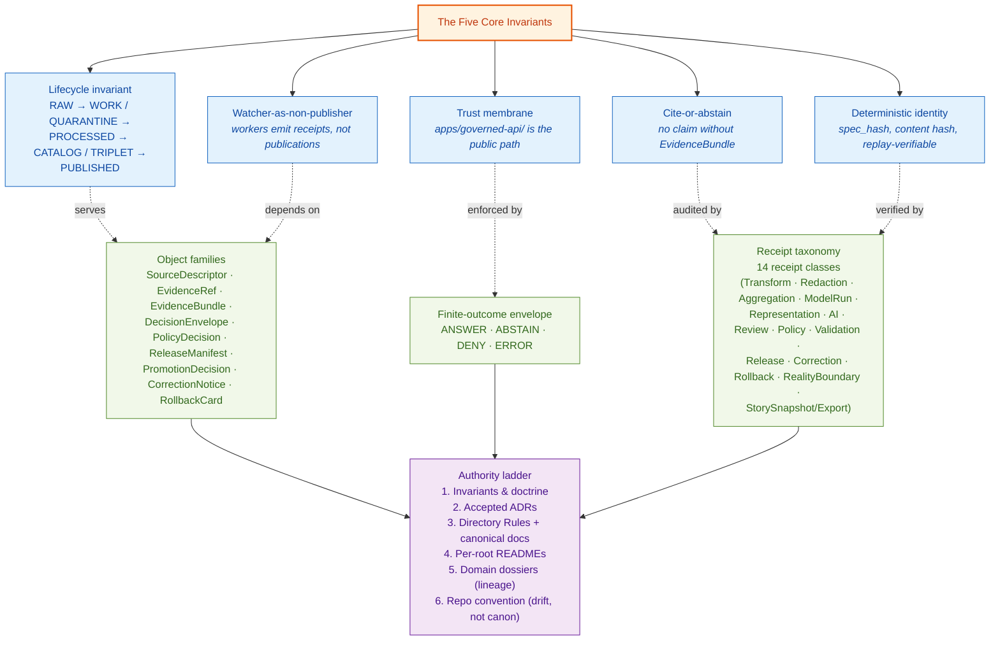

<!-- [KFM_META_BLOCK_V2]
doc_id: kfm://doc/doctrine/encyclopedia
title: KFM Doctrine Encyclopedia
type: doctrine
subtype: doctrine-vocabulary-index
version: v0.1
prior_version: <none — initial edition>
status: draft
owners: <docs-steward>                                                # PLACEHOLDER — assign before review
created: 2026-05-25
updated: 2026-05-25
policy_label: public
proposed_home: docs/doctrine/encyclopedia.md
related:
  - docs/doctrine/directory-rules.md                                  # v1.4 presentation refresh of v1.3 (renderer-decision refresh)
  - docs/doctrine/authority-ladder.md
  - docs/doctrine/truth-posture.md
  - docs/doctrine/trust-membrane.md
  - docs/doctrine/lifecycle-law.md
  - docs/architecture/contract-schema-policy-split.md
  - docs/architecture/governed-api.md
  - docs/architecture/map-shell.md
  - docs/architecture/maplibre-3d.md                                  # v1.3 sole-renderer doctrine (renderer-decision ADR PROPOSED)
  - docs/encyclopedia/                                                # PROPOSED — planning-artifact encyclopedia (manuscript + index); NOT this file
  - docs/registers/DRIFT_REGISTER.md
  - docs/registers/VERIFICATION_BACKLOG.md
  - docs/adr/ADR-0001-schema-home.md
  - docs/adr/ADR-NNNN-maplibre-sole-renderer-retire-cesium.md         # PROPOSED — number pending; directory-rules.md §18.e OPEN-DR-10
  - control_plane/document_registry.yaml
truth_labels: [CONFIRMED, PROPOSED, INFERRED, NEEDS VERIFICATION, UNKNOWN, EXTERNAL]
authority_class: governance doctrine
authority_rank: doctrine-layer (peer to directory-rules.md, authority-ladder.md, truth-posture.md, trust-membrane.md, lifecycle-law.md)
distinct_from:
  - docs/encyclopedia/kfm_encyclopedia.pdf                            # planning manuscript (synthesis / reference rank)
  - docs/encyclopedia/README.md                                       # master index for the planning manuscript
  - docs/atlases/KFM_Domains_Culmination_Atlas_v1_1.pdf               # consolidated atlas (reference / planning rank)
spec_hash: PROPOSED — emit via canonical JCS+SHA-256 once tooling is wired
tags: [kfm, doctrine, encyclopedia, vocabulary, concept-index, glossary, cross-reference, governance, truth-posture, lifecycle, trust-membrane, authority-ladder]
notes:
  - "This is the doctrine-rank encyclopedia: a canonical vocabulary and concept index for KFM. It supersedes no source doctrine and is subordinate to attached governing dossiers, ADRs, contracts, schemas, and policy. It is NOT the planning-artifact encyclopedia at docs/encyclopedia/."
  - "All path claims are PROPOSED until verified against mounted-repo evidence. v1.3 renderer-decision paths (packages/maplibre-runtime/, schemas/contracts/v1/maplibre/, etc.) remain PROPOSED pending the renderer-decision ADR (directory-rules.md §18.e OPEN-DR-10)."
  - "No mounted repo was inspected in this session. Implementation maturity is bounded per the AI Build Operating Contract current-session evidence limit."
  - "Placement of this file at docs/doctrine/encyclopedia.md is the requested path. The relationship to docs/encyclopedia/ (planning manuscript) is recorded in §1.2 and flagged as a NEEDS VERIFICATION / ADR-class question."
  - "v0.1 is the initial edition: it consolidates doctrine vocabulary already established in directory-rules.md (v1.4), kfm_unified_doctrine_synthesis.md, ai-build-operating-contract.md, and the Domains v1.1 + Pass 23/32 Consolidated Atlas. No new doctrine is introduced — every term and rule traces to a prior source."
[/KFM_META_BLOCK_V2] -->

<a id="top"></a>

# KFM Doctrine Encyclopedia

> **The canonical vocabulary, concept index, and cross-reference spine for KFM doctrine. One place to look up what a term means, which invariant it serves, and which canonical document owns it.**


> [!IMPORTANT]
> **What this file is.** A doctrine-rank vocabulary and concept index — a peer to `directory-rules.md`, `authority-ladder.md`, `truth-posture.md`, `trust-membrane.md`, and `lifecycle-law.md`. It defines KFM's canonical terms in one place and cross-references each to the doctrine document that owns it.
>
> **What this file is NOT.** Not the planning-artifact encyclopedia at `docs/encyclopedia/` (the `kfm_encyclopedia.pdf` manuscript and its `README.md` master index). That artifact is a synthesis / planning manuscript and is **subordinate** to the doctrine vocabulary defined here. If they disagree, this file wins for vocabulary; the manuscript wins for narrative scope and worked examples. See §1.2 for the relationship.

## Quick jump

| Foundation | Invariants | Vocabulary | Patterns | Reference |
|---|---|---|---|---|
| [§0 Status & Authority](#0-status--authority) · [§1 Purpose & scope](#1-purpose-and-scope) · [§2 How to use this file](#2-how-to-use-this-encyclopedia) | [§3 Five core invariants](#3-the-five-core-invariants) · [§4 Truth labels](#4-truth-labels) · [§5 Lifecycle invariant](#5-the-lifecycle-invariant) · [§6 Trust membrane](#6-the-trust-membrane) · [§7 Authority ladder](#7-the-authority-ladder) · [§8 Cite-or-abstain](#8-cite-or-abstain-posture) | [§9 Finite-outcome envelope](#9-finite-outcome-decision-envelope) · [§10 Object families](#10-object-families) · [§11 Receipt taxonomy](#11-receipt-taxonomy) · [§12 Identity, hashing, replay](#12-identity-hashing-and-replay-verification) | [§13 Renderer doctrine](#13-renderer-doctrine-maplibre-as-sole-renderer-v13) · [§14 Focus Mode pattern](#14-focus-mode-pattern-v12) · [§15 Domain Placement Law](#15-domain-placement-law-cross-reference) · [§16 Compatibility taxonomy](#16-compatibility-class-taxonomy) | [§17 External standards](#17-external-standards-kfm-conforms-to) · [§18 ADR-class question types](#18-adr-class-question-types) · [§19 Anti-pattern taxonomy](#19-anti-pattern-taxonomy) · [§20 Glossary (A–Z)](#20-glossary-az) · [§21 Cross-reference index](#21-cross-reference-index) · [§22 Open questions](#22-open-questions-and-needs-verification) · [§23 Changelog](#23-changelog) |

## Doctrine map



> [!NOTE]
> The diagram is **illustrative**, not normative. The relationships shown (`serves`, `enforced by`, `audited by`, `depends on`, `verified by`) are doctrine-stated dependencies; the rendering is for orientation. The §3 invariants are the load-bearing rules; everything else is operationalization.

---

## 0. Status & Authority

| Field | Value |
|---|---|
| **Document type** | Governance doctrine |
| **Doctrine rank** | **Doctrine-layer** — peer to `directory-rules.md`, `authority-ladder.md`, `truth-posture.md`, `trust-membrane.md`, `lifecycle-law.md`. Lives at `docs/doctrine/` per Directory Rules §6.1 / §15. |
| **Edition** | **v0.1** — initial edition. Consolidates doctrine vocabulary already established in `directory-rules.md` (v1.4), `kfm_unified_doctrine_synthesis.md`, `ai-build-operating-contract.md`, and the *Domains v1.1 + Pass 23/32 Consolidated Atlas*. **No new doctrine is introduced** — every term and rule traces to a prior source. See §23 for the v0.1 evidence basis. |
| **Authority of these definitions** | CONFIRMED at doctrine-rank — these definitions are derived verbatim or by minimal-rewording from canonical doctrine sources. Each term in §20 carries an explicit canonical source citation. |
| **Authority of any specific path quoted here** | Mixed. Doctrine documents under `docs/doctrine/` are CONFIRMED as canonical homes per Directory Rules §6.1; their **mounted-repo presence** is **PROPOSED**. Live-repo paths CONFIRMED at commit `b6a27916bbb9e07cbf3752870c867476e1e094e7` per the *KFM Repository Structure Guiding Document* (v0.1) carry forward from `directory-rules.md` §0; all other paths remain **PROPOSED** or **NEEDS VERIFICATION**. |
| **Proposed canonical home** | `docs/doctrine/encyclopedia.md` *(this file)* |
| **Owner** | Docs steward |
| **Reviewers required for change** | Docs steward + at least one doctrine subsystem owner (authority-ladder, truth-posture, trust-membrane, lifecycle-law, directory-rules). Vocabulary changes that materially alter what a term *means* require **ADR + supersession notice + drift register entry** per `directory-rules.md` §17. Additive entries (new term, new cross-reference, new external standard) fall in the "PR + reviewer sign-off; no ADR" band. |
| **Supersedes** | None. v0.1 is the initial edition. |
| **Related doctrine** | `docs/doctrine/directory-rules.md` (canonical placement doctrine; v1.4); `docs/doctrine/authority-ladder.md` (resolution order); `docs/doctrine/truth-posture.md` (cite-or-abstain operational rule); `docs/doctrine/trust-membrane.md` (governed-api boundary); `docs/doctrine/lifecycle-law.md` (RAW → … → PUBLISHED invariant); `docs/architecture/contract-schema-policy-split.md`; `docs/architecture/maplibre-3d.md` (v1.3 sole-renderer doctrine). |
| **Distinct from** | `docs/encyclopedia/kfm_encyclopedia.pdf` (planning manuscript, synthesis rank); `docs/encyclopedia/README.md` (master index for the manuscript); `docs/atlases/KFM_Domains_Culmination_Atlas_v1_1.pdf` (consolidated atlas, reference rank). The relationship is recorded in §1.2. |
| **Last reviewed** | 2026-05-25 (v0.1 initial) |

> **v0.1 truth posture note.** v0.1 makes **no new doctrine claim.** Every definition, invariant, table row, and cross-reference in this file is sourced from prior canonical doctrine. The contribution of v0.1 is **placement + index discipline**: putting the doctrinal vocabulary in one peer-of-the-other-doctrine-files location so reviewers, authors, and future Claude sessions can resolve terminology without traversing five or six documents. Where a definition could be sharpened, the sharpening is flagged as a NEEDS VERIFICATION item in §22 rather than introduced as v0.1 fact.

> **Source-hierarchy note.** This file follows the *KFM AI Build Operating Contract* §5 source order: (1) mounted-repo evidence — **not available in v0.1 authoring**; (2) accepted ADRs — see §18; (3) canonical doctrine — the primary source for v0.1; (4) per-root READMEs — referenced but not relied on; (5) subsystem docs / runbooks — referenced; (6) generated receipt / proof objects — referenced as definitional only, not as live evidence; (7) lineage docs — `LINEAGE` rank, useful for continuity, not current implementation proof.

[↑ Back to top](#top)

---

## 1. Purpose and scope

### 1.1 Purpose

This encyclopedia exists so that every author, reviewer, and tool can answer four questions in one place:

1. **What does this term mean in KFM?** (definition)
2. **Which invariant or rule does it serve?** (purpose)
3. **Which canonical doctrine document owns it?** (source / cross-reference)
4. **What does it look like when it goes wrong?** (anti-pattern, where applicable)

The encyclopedia does **not** decide doctrine. It records doctrine that other documents already decided.

### 1.2 Scope and relationship to the planning-artifact encyclopedia

KFM has two encyclopedias, and the difference matters:

| Artifact | Path | Rank | Role |
|---|---|---|---|
| **This file** — Doctrine Encyclopedia | `docs/doctrine/encyclopedia.md` | **Doctrine-layer (canonical)** | Vocabulary + concept index. One-line authoritative definitions. Cross-references each term to its owning doctrine document. **Authoritative for what KFM terms mean.** |
| Planning Encyclopedia | `docs/encyclopedia/kfm_encyclopedia.pdf` + `docs/encyclopedia/README.md` | **Synthesis / planning** (reference rank) | Long-form manuscript with worked examples, narrative scope, per-domain chapters, and capability category maps. **Subordinate to doctrine and to attached governing dossiers, ADRs, and contracts/schemas/policy** (per its own Appendix L). |

> [!IMPORTANT]
> **If the two disagree on what a term means, this file wins.** If they disagree on narrative scope or worked-example detail, the planning manuscript wins. The Planning Encyclopedia's own front matter declares it as a synthesis artifact that "supersedes no source doctrine." This file is one of the doctrine sources it must conform to.

**ADR-class question (NEEDS VERIFICATION):** whether `docs/doctrine/encyclopedia.md` and `docs/encyclopedia/` should remain as two artifacts (with this clear rank distinction) or be consolidated. Tracked in §22 as **OPEN-EN-01**.

### 1.3 What this file is not

- **Not a domain encyclopedia.** Per-domain reference content lives under `docs/domains/<domain>/` per `directory-rules.md` §6.1.
- **Not a contract or schema.** Object meaning lives in `contracts/<family>/<object>.md`; object shape lives in `schemas/contracts/v1/<family>/<object>.schema.json`. This file points to those locations; it does not duplicate them.
- **Not an ADR set.** ADRs live under `docs/adr/`. This file references ADRs by id; it does not author them.
- **Not an implementation document.** No claim is made here about live-repo state, CI run results, dashboard state, or runtime traces. Such claims belong in runbooks (`docs/runbooks/`) or registers (`docs/registers/`).

[↑ Back to top](#top)

---

## 2. How to use this encyclopedia

### 2.1 Lookup discipline

When a term appears in code, a PR, a review comment, or an architecture discussion:

1. **Find the term in §20 (Glossary, A–Z).** Each entry gives a one-line definition and a canonical doctrine citation.
2. **Follow the citation to the owning doctrine document.** For implementation specifics (paths, schema shape, policy code), continue to `contracts/`, `schemas/`, `policy/`, or the relevant ADR.
3. **If the term is missing, do not invent it.** Open a verification-backlog entry (`docs/registers/VERIFICATION_BACKLOG.md`) and propose its addition through a routine PR per `directory-rules.md` §17.

### 2.2 Authorship discipline

When proposing a new term:

1. **Confirm the term is not already covered.** Search §20 and the planning manuscript at `docs/encyclopedia/`.
2. **Cite a canonical source.** Every entry in §20 carries an explicit source citation (canonical doctrine document, ADR, atlas section). No term enters this file without one.
3. **Match the format.** Definitions are one sentence (two if the term has a finite-state semantics). Compound terms preserve KFM-specific capitalization and casing exactly (`EvidenceBundle`, not `evidence bundle`; `RAW → WORK / QUARANTINE → PROCESSED → CATALOG / TRIPLET → PUBLISHED`, not "raw to published").
4. **Cross-reference, do not duplicate.** If a term has a full treatment elsewhere (e.g., a placement contract in `directory-rules.md` §6.7), this encyclopedia gives the one-liner and the pointer, never the full contract.

### 2.3 Reviewer discipline

When reviewing a PR that touches doctrine vocabulary:

- Verify every new term in §20 carries a citation.
- Verify no term silently renames a previously canonical term. Renames are content changes per `directory-rules.md` §14.3 — they require ADR + schema bump + correction notices.
- Verify the cross-reference in §21 still resolves to the owning doctrine document.
- Verify the §22 open-questions list still reflects unresolved ADR-class items.

---

## 3. The five core invariants

These five rules are the load-bearing invariants of KFM. Every other rule in this encyclopedia operationalizes one or more of them. They MUST NOT be bent without an ADR per `directory-rules.md` §2.4 / §17.

| # | Invariant | One-line statement | Canonical source |
|---|---|---|---|
| **I-1** | **Lifecycle** | Source material becomes public knowledge only by passing **RAW → WORK / QUARANTINE → PROCESSED → CATALOG / TRIPLET → PUBLISHED**, and each transition is a **governed state transition, not a file move**. | `docs/doctrine/lifecycle-law.md`; `directory-rules.md` §9.1 |
| **I-2** | **Trust membrane** | Public clients read **only** through `apps/governed-api/`. Raw, work, quarantine, canonical, model-generated, and internal state MUST NOT be a public path. | `docs/doctrine/trust-membrane.md`; `docs/architecture/governed-api.md`; `directory-rules.md` §7.1 |
| **I-3** | **Cite-or-abstain** | No public claim is asserted without a resolvable `EvidenceRef` → `EvidenceBundle`. When evidence is missing, sensitive, denied, or stale, the system **abstains**; it does not fall through to fluent text. | `docs/doctrine/truth-posture.md`; `kfm_unified_doctrine_synthesis.md` §2 |
| **I-4** | **Watcher-as-non-publisher** | Connectors, watchers, workers, and AI runtimes emit **receipts and candidates**. They **never** publish, mutate canonical records, or bypass `PromotionDecision` review. | `directory-rules.md` §7.1 (`apps/workers/` role); §13.5 (anti-pattern *Watcher publishes*); `kfm_unified_doctrine_synthesis.md` §4 |
| **I-5** | **Deterministic identity** | Every governed object carries a content-addressable identity (`spec_hash` via canonical JCS+SHA-256, content hash for binary artifacts, or equivalent) so that replay verification, supersession lineage, and rollback targets resolve unambiguously. | `kfm_unified_doctrine_synthesis.md` §13; `directory-rules.md` §6.2 (`control_plane/document_registry.yaml`) |

> [!WARNING]
> **A proposal that bends one of these invariants is not a routine PR.** Per `directory-rules.md` §2.4(6) and §17, bending an invariant requires an ADR with `status: accepted`, a supersession notice in the affected doctrine document's §0, and a drift register entry. The ADR is the load-bearing artifact; this encyclopedia merely records that the invariant exists.

[↑ Back to top](#top)

---

## 4. Truth labels

KFM uses a fixed truth-label vocabulary. Every substantive claim in doctrine, atlas, and reviewable artifact carries one of these labels:

| Label | Meaning | When to use |
|---|---|---|
| **CONFIRMED** | Verified this session from attached docs, mounted-repo evidence, tests, logs, or emitted artifacts. | Claims about doctrine that is fully sourced and unchanged; live-repo facts at a verified commit. |
| **INFERRED** | Reasonably derivable from visible evidence but not directly stated. | Claims that follow from cited evidence by an explicit reasoning step that the reader can audit. |
| **PROPOSED** | Design, recommendation, file path, placement, or inference not yet verified in implementation. | Most placement claims when no mounted repo is available; recommendations awaiting ADR. |
| **NEEDS VERIFICATION** | Checkable, but not yet checked strongly enough to act as fact. | Pending mounted-repo inspection, CI verification, or ADR acceptance. |
| **UNKNOWN** | Not resolvable without more evidence; intentionally not asserted. | Honest gap. Preferred over speculative assertion. |
| **EXTERNAL** | Sourced from authoritative external research (standards body, vendor doc, RFC). | Generic external standards content. **Never** applies to KFM-specific repo or doctrine claims. |

> [!IMPORTANT]
> **Memory is not evidence.** Recollection, guessed paths, likely behavior, and generic best practice are not facts. If a claim cannot be cited from a higher rung of the source hierarchy (see §7), it is labeled accordingly and recorded in `docs/registers/VERIFICATION_BACKLOG.md`.

**Canonical source:** `ai-build-operating-contract.md` §0–§3 (Operating Law); `directory-rules.md` §0 truth-posture notes; this file §20 (Glossary) entries inherit these labels.

---

## 5. The lifecycle invariant

The KFM lifecycle is a **governance sequence**, not a storage preference. Moving a file is not promotion; promotion is a governed state transition that requires evidence closure, policy review, proof, release metadata, correction path, and rollback target.

```text
Pre-RAW → RAW → WORK / QUARANTINE → PROCESSED → CATALOG / TRIPLET → PUBLISHED
                                                                       ↓
                                                            ROLLBACK / CORRECTION
```

### 5.1 Phase table (with canonical proof / control objects)

| Phase | What it means | Typical proof / control object |
|---|---|---|
| **Pre-RAW** | Source event or watcher signal before admission. | `EventEnvelope`, prefilter output, `EventRunReceipt`, `SourceActivationDecision`. |
| **RAW** | Captured source material or response, not yet normalized into public truth. | `SourceDescriptor`, source head, retrieval receipt, rights/sensitivity precheck. |
| **WORK** | Candidate normalization, analysis, or interpretation under review. | `CandidateDelta`, `ValidationReport`, `TransformReceipt`, `SourceIntakeRecord`. |
| **QUARANTINE** | Held because rights, sensitivity, quality, identity, or policy is unresolved. | Quarantine reason codes, hold `PolicyDecision`, steward review note. |
| **PROCESSED** | Validated domain product ready for catalog/proof closure but not necessarily public. | Processed artifact manifest, content hash, geometry/hash reports, QA receipts. |
| **CATALOG / TRIPLET** | Indexed evidence and relations with STAC / DCAT / PROV records or graph/triplet surfaces. | Catalog item, PROV record, DCAT distribution, graph delta, catalog integrity report. |
| **PUBLISHED** | Reviewed release state with public/semi-public scope and rollback path. | `ReleaseManifest`, `PromotionReceipt`, proof pack, rollback reference, correction lineage. |
| **ROLLBACK** | Alias-revert receipts and decision records that repoint current release state without deleting prior meaning. | `RollbackCard`, alias-revert receipt, `CorrectionNotice` where applicable. |

### 5.2 What promotion is *not*

- A file move from `data/work/` to `data/published/` is not promotion.
- Re-deriving a published artifact from a refreshed source is not promotion of the new version unless `PromotionDecision`, `ReleaseManifest`, and rollback target are emitted.
- An AI summary of evidence is not promotion. AI output is `AIReceipt` material; it does not change release state.

**Canonical source:** `docs/doctrine/lifecycle-law.md`; `directory-rules.md` §9.1; `kfm_unified_doctrine_synthesis.md` §6–§7.

[↑ Back to top](#top)

---

## 6. The trust membrane

The **trust membrane** is the boundary that prevents raw, unreviewed, restricted, internal, or model-generated state from becoming public truth. Its operational form is **`apps/governed-api/`** — the executable trust path returning `RuntimeResponseEnvelope` with finite outcomes.

### 6.1 What the membrane enforces

| Inside (governed) | Outside (public) |
|---|---|
| `data/raw/`, `data/work/`, `data/quarantine/`, `data/processed/`, `data/catalog/`, `data/triplets/`, `data/registry/` (canonical stores) | `data/published/` (released artifacts), `apps/governed-api/` responses (governed envelopes) |
| Internal model adapters under `runtime/model_adapters/`, `runtime/ollama/` | Nothing model-generated reaches the public path except through `EvidenceBundle` resolution + policy gate + release record |
| Watchers and pipeline workers under `apps/workers/` | Workers emit receipts and candidates; they do not publish |
| Connectors under `connectors/` | Connectors write to `data/raw/` or `data/quarantine/`; never to `data/processed/`, `data/catalog/`, or `data/published/` |
| Steward review surface at `apps/review-console/` | Role-gated and audited; not a public path |

### 6.2 Public path discipline

A public route MUST go through `apps/governed-api/`. Direct reads from `data/raw/`, `data/work/`, `data/quarantine/`, `data/processed/`, or `data/catalog/` by `apps/explorer-web/` or any feature code are trust-membrane violations (see §19 anti-pattern *Public route reads canonical store*).

**Canonical source:** `docs/doctrine/trust-membrane.md`; `docs/architecture/governed-api.md`; `directory-rules.md` §7.1, §7.1.a, §13.5 (anti-pattern table).

---

## 7. The authority ladder

When sources disagree, KFM resolves in **six rungs**, top-down. A lower rung never overrides a higher one.

| Rung | Source | Role | Cross-reference |
|---|---|---|---|
| **1** | KFM core invariants and doctrine | The §3 invariants + lifecycle, trust membrane, cite-or-abstain, watcher-as-non-publisher, deterministic identity | This file §3; `docs/doctrine/lifecycle-law.md`; `docs/doctrine/trust-membrane.md`; `docs/doctrine/truth-posture.md` |
| **2** | Accepted ADRs that explicitly amend doctrine | Superseded ADRs do not count. ADR template per `directory-rules.md` §2.4 | `docs/adr/`; `directory-rules.md` §2.4 |
| **3** | Directory Rules + canonical doctrine docs | This file, `directory-rules.md`, the planning manuscript at `docs/encyclopedia/`, the build manual, the doctrine synthesis | `docs/doctrine/`; `docs/encyclopedia/`; this file §20–§21 |
| **4** | Per-root `README.md` files | They refine root responsibilities but MUST NOT contradict doctrine or ADRs | `directory-rules.md` §15 |
| **5** | Domain dossiers and prior architecture reports | Lineage / proposed only | `docs/domains/<domain>/`; `docs/atlases/`; `docs/encyclopedia/` |
| **6** | Convention from the current mounted-repo state | When conflicting with the Rules: **drift to record, not new authority** | `docs/registers/DRIFT_REGISTER.md`; `directory-rules.md` §2.5 |

> [!WARNING]
> **External references (DDD, Fundamentals of Data Engineering, vendor docs) sit beside Rung 5 as *language only* — they never amend doctrine.** External standards (Rung-adjacent EXTERNAL) inform vocabulary and conformance crosswalks; they do not decide what KFM does.

**Canonical source:** `docs/doctrine/authority-ladder.md`; `directory-rules.md` §2.1; `ai-build-operating-contract.md` §5; `kfm_unified_doctrine_synthesis.md` §5.

[↑ Back to top](#top)

---

## 8. Cite-or-abstain posture

The cite-or-abstain rule is the operational form of **I-3 (cite-or-abstain)**: no public claim is asserted without a resolvable `EvidenceRef` → `EvidenceBundle`.

### 8.1 What "cite" requires

A public claim MUST resolve, at minimum, to:

- A `SourceDescriptor` with verified retrieval metadata and rights/sensitivity precheck.
- An `EvidenceBundle` (resolved package containing the source material, transforms, and validation receipts).
- A `PolicyDecision` allowing the claim's release scope (public / semi-public / restricted).
- A `ReleaseManifest` recording the release state and rollback target.

When any of those is missing, sensitive, denied, or stale, the system **abstains**.

### 8.2 What "abstain" looks like

The governed surface returns a finite-outcome envelope (§9) with outcome `ABSTAIN` or `DENY` and a reason code. The UI surfaces this as a negative state (`> not enough cited evidence`, `> sensitivity policy applies`, `> source stale`), never as a generated text answer.

> [!CAUTION]
> **Fluent generation is not citation.** An AI-generated paragraph that *sounds* authoritative is not authority. The cite-or-abstain rule is the hard line between KFM-as-knowledge-system and KFM-as-text-generator. See §19 anti-pattern *AI returns uncited language*.

**Canonical source:** `docs/doctrine/truth-posture.md`; `kfm_unified_doctrine_synthesis.md` §2, §21 (Citation validation and AIReceipt discipline).

---

## 9. Finite-outcome decision envelope

Every public-facing decision returns a finite-outcome envelope: **ANSWER, ABSTAIN, DENY, or ERROR**. There is no silent fall-through to a different lane.

| Outcome | Meaning | When |
|---|---|---|
| **ANSWER** | Claim resolves with citations, policy allow, and release state. | Evidence present + policy allow + released. |
| **ABSTAIN** | KFM declines to answer because the question cannot be answered with current evidence at the requested release scope. | Evidence missing, stale, sensitive, or below confidence threshold. |
| **DENY** | KFM refuses to answer because policy denies the release scope for this claim. | Rights, sensitivity, sovereignty, consent, geoprivacy, or release-state policy denies. |
| **ERROR** | The runtime failed before reaching a decision (dependency unavailable, validator crashed, manifest unresolvable). | System-error path; surfaced as ERROR with reason code, not as ABSTAIN or ANSWER. |

The envelope schema lives at `schemas/contracts/v1/runtime/runtime_response_envelope.schema.json` (PROPOSED placement per `directory-rules.md` §6.4). Every UI surface — Evidence Drawer, Focus Mode answer, layer manifest resolver, review queue — MUST surface the outcome class and reason code; silent fall-through is doctrine violation.

**Canonical source:** `kfm_unified_doctrine_synthesis.md` §11 (Finite outcome envelope vocabulary); `directory-rules.md` §7.1 (`apps/governed-api/` returns `RuntimeResponseEnvelope`); `KFM Encyclopedia.md` §13 (Deny register).

[↑ Back to top](#top)

---

## 10. Object families

KFM's canonical object-family backbone is **invariant across domains**. Per-domain objects (e.g., `Taxon`, `Geologic Unit`, `AirObservation`) layer onto this backbone.

### 10.1 The backbone

```text
SourceDescriptor      → RAW capture
SchemaProfile         → shape contract
RightsBundle          → license / consent / sovereignty
SensitivityProfile    → tier T0..T4 + redaction rules
EvidenceRef           → resolves to EvidenceBundle
LayerManifest         → public surface (MapLibre)
                      + time slider, EvidenceDrawer, Focus Mode
ReleaseManifest       → published unit; correction + rollback target
ReviewRecord          → review state (where required)
```

### 10.2 Family table

| Family | What it is | Canonical home (PROPOSED unless noted) |
|---|---|---|
| **`SourceDescriptor`** | The admission record for a source: identity, retrieval metadata, rights, sensitivity, role, license. | `contracts/source/source-descriptor.md`; schema at `schemas/contracts/v1/source/source_descriptor.schema.json` |
| **`EvidenceRef`** | A reference that must resolve to an `EvidenceBundle` before a claim has public authority. | `contracts/evidence/evidence-ref.md`; schema at `schemas/contracts/v1/evidence/evidence_ref.schema.json` |
| **`EvidenceBundle`** | The resolved evidence package supporting a claim — source material, transforms, validation receipts. Lives in `data/proofs/`. | `contracts/evidence/evidence-bundle.md`; schema at `schemas/contracts/v1/evidence/evidence_bundle.schema.json` |
| **`DecisionEnvelope`** | Wrapper for any governed decision (policy, promotion, release, rollback, correction) carrying decision metadata. | `contracts/runtime/decision-envelope.md`; schema at `schemas/contracts/v1/runtime/decision_envelope.schema.json` |
| **`PolicyDecision`** | Allow / deny / abstain outcome from a policy evaluation. Subtypes include `3D Admission Decision` (v1.3), `Plugin Admission` (v1.3), sensitivity admit, promotion gate. | `contracts/runtime/policy-decision.md`; schemas under `schemas/contracts/v1/policy/` |
| **`PromotionDecision`** | The governed state-transition decision that moves an artifact between lifecycle phases. | `contracts/release/promotion-decision.md`; schema at `schemas/contracts/v1/release/promotion_decision.schema.json` |
| **`ReleaseManifest`** | The release-decision artifact: what is released, at what version, with what proof closure, with what rollback target. Lives in `release/manifests/`. | `contracts/release/release-manifest.md`; schema at `schemas/contracts/v1/release/release_manifest.schema.json` |
| **`CorrectionNotice`** | Public notice of a corrected claim. Lists invalidated derivatives. Lives in `release/correction_notices/`. | `contracts/correction/correction-notice.md`; schema at `schemas/contracts/v1/correction/correction_notice.schema.json` |
| **`RollbackCard`** | Rollback decision artifact preserving prior meaning while repointing current release state. Lives in `release/rollback_cards/`. | `contracts/release/rollback-card.md`; schema at `schemas/contracts/v1/release/rollback_card.schema.json` |
| **`ReviewRecord`** | The record of steward review on a release candidate or sensitive admission. | `contracts/governance/review-record.md`; schema at `schemas/contracts/v1/governance/review_record.schema.json` |
| **`RuntimeResponseEnvelope`** | Finite-outcome wrapper (ANSWER / ABSTAIN / DENY / ERROR) returned by `apps/governed-api/`. | `contracts/runtime/runtime-response-envelope.md`; schema at `schemas/contracts/v1/runtime/runtime_response_envelope.schema.json` |
| **`LayerManifest`** | The released public surface for a map layer (MapLibre): style, source binding, time slider config, evidence-drawer hooks, Focus Mode admission. | `contracts/maplibre/scene-manifest.md` (v1.3); schema at `schemas/contracts/v1/maplibre/layer_manifest.schema.json` (v1.3) |
| **`SceneManifest`** *(v1.3)* | The 3D scene composition consumed by `packages/maplibre-runtime/`. | `contracts/maplibre/scene-manifest.md`; schema at `schemas/contracts/v1/maplibre/scene_manifest.schema.json` |
| **`RightsBundle`** | License + consent + sovereignty + obligations + benefit-commitment fields (CARE-aware). | `contracts/governance/rights-bundle.md`; schema at `schemas/contracts/v1/governance/rights_bundle.schema.json` |
| **`SensitivityProfile`** | Tier T0–T4 classification + redaction rules + geoprivacy posture. | `contracts/governance/sensitivity-profile.md`; schema at `schemas/contracts/v1/governance/sensitivity_profile.schema.json` |
| **`FocusModePayload`** *(v1.2)* | The bounded-area payload consumed by a Focus Mode UI surface. | `contracts/focus_mode/focus_mode_payload.md`; schema at `schemas/contracts/v1/focus_mode/focus_mode_payload.schema.json` |
| **`RealityBoundaryNote`** *(v1.3)* | Tells the user where a 3D scene is reconstructed / interpolated / synthetic. Surfaced in the Evidence Drawer. | `contracts/3d/reality-boundary-notes.md`; schema at `schemas/contracts/v1/3d/reality_boundary_note.schema.json` |

**Canonical source:** `KFM Encyclopedia.md` §7.2 (cross-domain object-family family map); `kfm_unified_doctrine_synthesis.md` §10 (Core object families); Domains v1.1 + Pass 23/32 Consolidated Atlas Appendix C (Object family index).

---

## 11. Receipt taxonomy

KFM emits **14 receipt classes**. Each records a specific operation; together they form the system's audit memory. Receipts live in `data/receipts/<class>/`; proofs (`EvidenceBundle`, `ProofPack`) live in `data/proofs/`.

| Receipt class | Triggered by | Records |
|---|---|---|
| **`TransformReceipt`** | Pipeline normalize / process step | Input hash, transform spec, output hash, parameter set, validator results |
| **`RedactionReceipt`** | Sensitivity / rights / geoprivacy transform applied at admission or release | Original field/geometry, redaction rule applied, sensitivity tier, reviewer (if any) |
| **`AggregationReceipt`** | Aggregation step that produces a derived claim | Source rows / observations, aggregation function, output claim, source-role labels preserved |
| **`ModelRunReceipt`** | A model inference (statistical, ML, mechanistic) | Model identity, input set, output, training-data lineage, uncertainty |
| **`RepresentationReceipt`** *(v1.3)* | `packages/maplibre-runtime/` after each render-frame batch | `scene_manifest_id`, layer set, projection, `ViewState`, time slice, CARE-mask transforms, plugin versions actually used |
| **`AIReceipt`** | Any governed-AI surface (Focus Mode answer, evidence-drawer assist) | Question, retrieved `EvidenceBundle`, model identity, output text, citations, finite-outcome label |
| **`ReviewRecord`** | Steward review of a release candidate, sensitive admission, or correction | Reviewer identity, review state, comments, decision, link to `EvidenceBundle` |
| **`PolicyDecision`** | Any policy evaluation (admission, promotion, release, correction, 3D admission, plugin admission) | Policy id, inputs, outcome (allow / deny / abstain), reason code |
| **`ValidationReport`** | Validator orchestrator (`tools/validate_all.py`) or individual validator | Validator name, status (pass / fail / warn / skip), details, duration, input hash |
| **`ReleaseManifest`** | A release decision | What is released, version, proof closure references, rollback target, signatures |
| **`CorrectionNotice`** | Public correction of a prior claim | Original claim ref, corrected claim, invalidated derivatives, rollback if any |
| **`RollbackCard`** | A rollback decision | Prior release state, current release state, alias-revert receipts, reason |
| **`RealityBoundaryNote`** *(v1.3)* | Activation of a Synthetic Surface or interpretive 3D layer | Where the scene is reconstructed / interpolated / synthetic; surfaced in Evidence Drawer |
| **`StorySnapshot` / `ExportReceipt`** | Public-export of a story or dataset (post-publication carrier) | What was exported, time slice, source claims, rollback / correction link |

> [!NOTE]
> **The 14 receipt classes are a working taxonomy** consolidated from `kfm_unified_doctrine_synthesis.md` §12 (Receipt taxonomy), `KFM Encyclopedia.md` §6 (Evidence and proofs), and Domains v1.1 Atlas Appendix C. The list is **stable at the doctrine level** but new subtypes may be added under each class via ADR per `directory-rules.md` §2.4(5) ("creating a parallel home" for a new receipt sibling is ADR-class).

**Canonical source:** `kfm_unified_doctrine_synthesis.md` §12; `KFM Encyclopedia.md` §6; Domains v1.1 + Pass 23/32 Consolidated Atlas Ch. 24 (Master Receipt Catalog).

[↑ Back to top](#top)

---

## 12. Identity, hashing, and replay verification

Every governed object has a deterministic, content-addressable identity. The canonical hashing convention is **JCS (RFC 8785 canonicalization) + SHA-256** for JSON objects; **SHA-256** (or BLAKE3 where pre-agreed) for binary artifacts.

| Concept | What it is |
|---|---|
| **`spec_hash`** | The canonical JCS+SHA-256 digest of a doctrine-bearing object (idea card, atlas entry, receipt, contract). Stable across re-serializations; changes only when the object's semantic content changes. |
| **Content hash** | The SHA-256 (or BLAKE3) digest of a binary artifact (PMTile, GeoParquet, glTF, image). Records what was actually published. |
| **Supersession lineage** | When an object is replaced via ADR, the old object retains `status: superseded` and forward-links to the replacing object via its `spec_hash`. Lineage is never deleted. |
| **Replay verification** | The ability to re-derive a published artifact from its source descriptors, transforms, and policy decisions, producing the same content hash. Enabled by deterministic identity + receipt closure. |

> [!TIP]
> **The replay test is the audit test.** A KFM release that cannot be replayed is a release that cannot be audited. Replay verification is the operational form of I-5 (deterministic identity) and is the gate for any release where rights, sovereignty, or sensitivity matter.

**Canonical source:** `kfm_unified_doctrine_synthesis.md` §13 (Identity, hashing, and replay verification); `directory-rules.md` §6.2.

---

## 13. Renderer doctrine — MapLibre as sole renderer (v1.3)

**`MapLibre GL JS` is KFM's sole browser-side renderer.** All 2D, 2.5D, globe, and true-3D capabilities (terrain, globe projection, hillshade, fill-extrusion, 3D Tiles, glTF, point clouds, deck.gl interleaved) flow through the governed adapter `packages/maplibre-runtime/`. There is no second renderer.

### 13.1 The four responsibilities of `packages/maplibre-runtime/`

1. **Resolve.** Read `SceneManifest`, expand `LayerManifest` entries, fetch `EvidenceBundle`, confirm `spec_hash` integrity, confirm plugin versions match the pinned registry.
2. **Admit.** Run the **3D Admission Decision** before `setTerrain`, `setProjection({type:'globe'})`, or any plugin-hosted layer construction. DENY/ABSTAIN stops the call.
3. **Host.** For plugin-hosted layers, instantiate the plugin inside a MapLibre custom-layer wrapped with admission and receipt boundaries.
4. **Emit.** After each render-frame batch, emit a `RepresentationReceipt`.

### 13.2 What is retired (v1.2 → v1.3)

The entries `packages/cesium/`, "Cesium as alternate renderer," and any path under `packages/cesium*`, `policy/cesium*`, `schemas/contracts/v1/cesium*`, or `contracts/cesium*` are **removed doctrine**. They MUST NOT be reintroduced as parallel renderer authority. See `directory-rules.md` §13.5 anti-pattern *Reintroducing a parallel browser renderer*.

### 13.3 Status

> [!IMPORTANT]
> **The sole-renderer decision is PROPOSED** until the renderer-decision ADR is accepted (`directory-rules.md` §18.e OPEN-DR-10). Until acceptance, the layout above is the **doctrine target**, and the v1.2 `packages/cesium/` placement is **frozen** — no new code, schemas, policies, or tests may land under a `cesium*` segment.

**Canonical source:** `docs/architecture/maplibre-3d.md` (§0.4, §6.2, §7.1, §7.2); `directory-rules.md` §7.2.a, §11, §13.5 (v1.3 rows); `Master_MapLibre_Components-Functions-Features_v2.1_FULL.md` Category W (3D / Cesium / Deck.gl / Overlay Interoperability).

---

## 14. Focus Mode pattern (v1.2)

A **Focus Mode** is a county- or region-scale governed proof slice. It demonstrates the full KFM trust path — `SourceDescriptor → SourceIntakeRecord → EvidenceRef → EvidenceBundle → Claim/AtlasCard → DecisionEnvelope → ReleaseManifest → Public UI` — for a bounded spatial frame.

A Focus Mode is **simultaneously**:

- **An AI surface** within the map shell — evidence-bounded AI returning ANSWER / ABSTAIN / DENY / ERROR over `MapContextEnvelope`.
- **A proof-slice composition** — the bundle of docs, contracts, schemas, fixtures, UI, validators, and release candidates for one bounded area.

**Placement is governed by `directory-rules.md` §6.7 — NOT by §12 Domain Placement Law.** A Focus Mode is geographic, not topical. It lives as lanes inside multiple responsibility roots (`docs/focus-modes/<area>-county/`, `contracts/focus_mode/`, `schemas/contracts/v1/focus_mode/`, `fixtures/focus_modes/<area>/`, `apps/explorer-web/src/focus-modes/<area>/`, `data/published/layers/<area>/`, `release/candidates/<area>-focus-mode/`); it does **NOT** become a root folder.

**Canonical source:** `directory-rules.md` §6.7 (canonical placement contract, six subsections); `kfm_unified_doctrine_synthesis.md` §18 (MapLibre, Evidence Drawer, Focus Mode); the eleven county Focus Mode Build Plans (Ellsworth, Riley, Shawnee, Ford, Wyandotte, Sedgwick, Douglas, Leavenworth, Reno, Johnson, Barton).

[↑ Back to top](#top)

---

## 15. Domain Placement Law (cross-reference)

A domain MUST NOT become a root folder. Domains live as lanes inside responsibility roots:

```text
docs/domains/<domain>/                       contracts/domains/<domain>/
schemas/contracts/v1/domains/<domain>/       policy/domains/<domain>/
tests/domains/<domain>/                      fixtures/domains/<domain>/
packages/domains/<domain>/                   pipelines/domains/<domain>/
pipeline_specs/<domain>/                     data/<phase>/<domain>/
data/catalog/domain/<domain>/                data/published/layers/<domain>/
data/registry/sources/<domain>/              release/candidates/<domain>/
```

Domains covered: hydrology, soil, fauna, flora, habitat, geology, atmosphere, roads-rail-trade, settlements-infrastructure, archaeology, hazards, agriculture, people-dna-land, and any new domain admitted via ADR.

**Canonical source:** `directory-rules.md` §12 (Domain Placement Law); `KFM Encyclopedia.md` §7.1 (Domain × responsibility-root crosswalk).

---

## 16. Compatibility class taxonomy

Compatibility roots (`artifacts/`, `jsonschema/`, `policies/`, `ui/`, `web/`, `styles/`, `viewer_templates/`) exist for legacy, mirror, deprecated, external-export, or transitional reasons. Each MUST have a `README.md` that declares its class:

| Class | Meaning | Lifecycle expectation |
|---|---|---|
| **`legacy`** | Was canonical, now superseded. New files SHOULD NOT land here. | Frozen; migration plan in place. |
| **`mirror`** | Generated or copied from a canonical home. Not edited directly. | Tracks canonical; never evolves independently. |
| **`deprecated`** | Slated for removal. Migration plan referenced. | Sunset date in `control_plane/deprecation_register.yaml`. |
| **`external-export`** | Exists for downstream consumers. Canonical home is elsewhere. | Maintained for external compatibility; not authority. |
| **`transitional`** | Mid-migration. ADR or migration note pinned. | Closes when migration completes. |

> [!IMPORTANT]
> **Compatibility roots are not parallel authority.** Two homes for the same authority is the most common drift in KFM. If both exist, the compatibility root MUST NOT evolve independently. New rules, fields, and policy updates land in canonical first; mirrors regenerate or migrate. See `directory-rules.md` §8.3.

**Canonical source:** `directory-rules.md` §8 (Compatibility Roots), §8.1 (Common compatibility roots and their canonical homes).

---

## 17. External standards KFM conforms to

KFM crosswalks against — but is never superseded by — the following external standards. Profiles live under `docs/standards/<STANDARD>.md`.

| Standard | Owner | KFM use | Profile path (PROPOSED) |
|---|---|---|---|
| **STAC** *(SpatioTemporal Asset Catalog)* | Radiant Earth Foundation / OGC | Catalog records for spatial assets | `docs/standards/STAC.md` |
| **DCAT** *(Data Catalog Vocabulary)* | W3C | Dataset metadata and distributions | `docs/standards/DCAT.md` |
| **PROV-O** *(Provenance Ontology)* | W3C | Provenance lineage | `docs/standards/PROV.md` (see OPEN-DR-01 for naming variance) |
| **PAV** *(Provenance, Authoring, Versioning)* | W3C / vocab | Authoring + versioning provenance | `docs/standards/PROV.md` (combined profile) |
| **ISO 19115** | ISO | Geographic metadata crosswalk | `docs/standards/ISO-19115.md` |
| **OGC API Tiles** | OGC | Tile-service conformance | `docs/standards/OGC-API-TILES.md` |
| **PMTiles v3** | Protomaps | Static tile container | `docs/standards/PMTILES.md` |
| **OAI-PMH 2.0** | Open Archives Initiative | Harvest-protocol crosswalk | `docs/standards/OAI-PMH.md` |
| **JSON-LD** | W3C | Linked-data serialization for catalog records | `docs/standards/JSON-LD.md` *(PROPOSED, not yet authored)* |
| **SLSA** | OpenSSF | Supply-chain attestation levels | `docs/standards/SLSA.md` *(PROPOSED, not yet authored)* |
| **OPA / Rego** | CNCF | Policy-as-code | `docs/standards/OPA.md` *(PROPOSED, not yet authored)* |
| **CIDOC CRM** | ICOM | Cultural-heritage event ontology (archaeology lane) | `docs/standards/CIDOC-CRM.md` *(PROPOSED, not yet authored)* |
| **OpenLineage** | LF AI & Data | Lineage events for pipelines | `docs/standards/OPENLINEAGE.md` *(PROPOSED, not yet authored)* |
| **FAIR + CARE principles** | GO FAIR / GIDA-Global | Open + Indigenous-data-sovereignty data ethics | Surfaced via `docs/standards/SENSITIVITY_RUBRIC.md` *(PROPOSED)* and `policy/sensitivity/`, `policy/rights/`, `policy/consent/` |

> [!NOTE]
> **External standards inform vocabulary and conformance crosswalks; they do not decide KFM doctrine.** When an external standard conflicts with KFM doctrine (e.g., a permissive disclosure default in a metadata standard vs. KFM's deny-by-default for CARE-tagged assets), KFM doctrine wins. The crosswalk records the divergence; it does not resolve it in the external standard's favor.

**Canonical source:** `directory-rules.md` §6.1 / §6.1.a (`docs/standards/` placement contract); §18.b OPEN-DR-01, OPEN-DR-04, OPEN-DR-05.

[↑ Back to top](#top)

---

## 18. ADR-class question types

Per `directory-rules.md` §2.4, a new ADR is **required** before:

1. Adding, removing, or renaming a **canonical root**.
2. Promoting a **compatibility root** to canonical, or deprecating a canonical root.
3. Changing the **schema-home rule** (`schemas/` vs `contracts/` authority).
4. Splitting or merging a lifecycle phase.
5. Creating a **parallel home** for any of: schemas, contracts, policy, sources, registries, releases, proofs, receipts.
6. **Bending a §3 invariant.**

ADR template fields: `id`, `title`, `status` (proposed | accepted | superseded | rejected), `date`, `context`, `decision`, `consequences`, `alternatives`. Superseded ADRs MUST be retained with `status: superseded` and a forward link to the replacing ADR.

### 18.1 Canonical ADR home

`docs/adr/ADR-<NNNN>-<slug>.md`. Index at `docs/adr/README.md`.

### 18.2 Currently filed (referenced)

- `ADR-0001-schema-home.md` — schema home (`schemas/contracts/v1/`) is canonical. **Status:** referenced as accepted in `directory-rules.md`.
- `ADR-0003-policy-singular-is-canonical.md` — `policy/` (singular) is canonical over `policies/`. **Status:** PROPOSED per project knowledge.
- `ADR-NNNN-maplibre-sole-renderer-retire-cesium.md` — number pending; recommended in `docs/architecture/maplibre-3d.md` Appendix B. **Status:** PROPOSED; `directory-rules.md` §18.e OPEN-DR-10.

### 18.3 ADR backlog (cross-reference)

The Domains v1.1 + Pass 23/32 Consolidated Atlas Ch. 24.12 maintains the Master Open-ADR Backlog **ADR-S-01 … ADR-S-15**. See `directory-rules.md` §18.c for the cross-reference table. These questions are healthy; they are the kinds of questions ADRs resolve. Examples: source-role vocabulary v1, sensitivity tier scheme T0–T4, AI surface boundary, 3D admission policy (operationalized at v1.3), reviewer separation-of-duties threshold, stale-state propagation, story / export receipt policy, connector cadence and quarantine recovery, drift register triage, cross-lane join policy, doctrine artifact lifecycle.

**Canonical source:** `directory-rules.md` §2.4, §18; `kfm_unified_doctrine_synthesis.md` §28 (CI command matrix).

---

## 19. Anti-pattern taxonomy

KFM names its anti-patterns rather than hoping reviewers will recognize them. The full register lives in `directory-rules.md` §13 (33 anti-pattern rows across v1.0, v1.1, v1.2, v1.3). This encyclopedia summarizes the **categories**, not the individual rows.

| Category | What goes wrong | Canonical source |
|---|---|---|
| **Parallel authority** | Two homes for the same authority (e.g., `schemas/` and `contracts/` both holding `.schema.json`; `policy/` and `policies/`; `data/proofs/` and `artifacts/release/`). | `directory-rules.md` §13.1, §13.2 |
| **Public route reads canonical store** | `apps/explorer-web/` (or any feature code) reads `data/processed/`, `data/catalog/`, or `data/raw/` directly. Trust-membrane violation. | `directory-rules.md` §13.5; this file §6 |
| **Connector / watcher publishes** | A connector writes to `data/processed/` or `data/published/`; a worker writes to `data/catalog/` or `data/published/`. Watcher-as-non-publisher violation (I-4). | `directory-rules.md` §13.5; this file §3 |
| **Lifecycle skip** | A pipeline writes directly to `data/published/` from `data/raw/`. Lifecycle invariant (I-1) violation. | `directory-rules.md` §13.5; this file §5 |
| **AI returns uncited language** | Generated text substitutes for evidence. Cite-or-abstain (I-3) violation. | `directory-rules.md` §13.5 (KFM-corpus extension); this file §8 |
| **AI answers from RAW / WORK** | AI becomes its own truth source rather than reading `EvidenceBundle`. | `directory-rules.md` §13.5; `kfm_unified_doctrine_synthesis.md` §20 |
| **Sensitive content released without redaction** | `RedactionReceipt` missing; rights / sovereignty violation. | `directory-rules.md` §13.5; `kfm_unified_doctrine_synthesis.md` §15 |
| **Aggregate cited as per-place observation** | Source-role collapse; Frontier-Matrix cell semantics violated. | `directory-rules.md` §13.5; `kfm_unified_doctrine_synthesis.md` §17 |
| **Synthetic surface presented without Reality Boundary Note** | Reconstruction read as observation. | `directory-rules.md` §13.5; `docs/architecture/maplibre-3d.md` §4 |
| **Release without `ReleaseManifest` or rollback target** | Public surface cannot be rolled back; release not auditable. | `directory-rules.md` §13.5; this file §10 |
| **Documenting a change instead of validating it** | Docs are part of the working system but never substitute for validators, fixtures, or schema. | `directory-rules.md` §13.5; `ai-build-operating-contract.md` §15 |
| **Silent migration between homes** | Schema or policy moves without ADR; reviewers no longer know which version is authoritative. | `directory-rules.md` §13.5, §14 |
| **Reintroducing a parallel browser renderer** *(v1.3)* | Any `packages/cesium*` segment after Cesium retirement; any peer-renderer adapter. | `directory-rules.md` §13.5 (v1.3); this file §13 |
| **Renderer-switch UI** *(v1.3)* | `apps/explorer-web/src/map/renderer-switch.tsx` or similar; no second renderer exists. | `directory-rules.md` §13.5 (v1.3) |
| **Focus-mode as root** *(v1.2)* | `focus_modes/` at repo root; Focus Mode misclassified as a domain or a root. | `directory-rules.md` §13.5 (v1.2); this file §14 |

**Canonical source:** `directory-rules.md` §13 (full 33-row table, collapsible at v1.4); `kfm_unified_doctrine_synthesis.md` §29 (Anti-pattern register); Domains v1.1 + Pass 23/32 Consolidated Atlas §24.9 (Master Failure-Mode and Anti-Pattern Register).

[↑ Back to top](#top)

---

## 20. Glossary (A–Z)

<details>
<summary><strong>Click to expand the full alphabetized glossary (~80 entries; one-line definition + canonical source for every term)</strong></summary>

| Term | Definition | Canonical source |
|---|---|---|
| **3D Admission Decision** *(v1.3)* | A `PolicyDecision` subtype evaluated before `setTerrain`, `setProjection({type:'globe'})`, or any plugin-hosted 3D layer construction. Outcomes: allow / deny / abstain. | `docs/architecture/maplibre-3d.md` §4; `directory-rules.md` §19 |
| **ABSTAIN** | Finite-outcome envelope outcome: KFM declines to answer because the question cannot be answered with current evidence at the requested release scope. | This file §9; `kfm_unified_doctrine_synthesis.md` §11 |
| **`AIReceipt`** | Receipt class emitted by any governed-AI surface (Focus Mode answer, evidence-drawer assist) recording question, retrieved evidence, model identity, output, citations, and finite-outcome label. | This file §11; `kfm_unified_doctrine_synthesis.md` §12, §21 |
| **ANSWER** | Finite-outcome envelope outcome: claim resolves with citations, policy allow, and release state. | This file §9 |
| **Anti-corruption layer (ACL)** *(EXTERNAL: DDD)* | An isolating translation layer between bounded contexts. Used as language only; never amends doctrine. | DDD Reference (Evans); `ai-build-operating-contract.md` §4 |
| **Area** *(v1.2)* | The geographic identifier of a Focus Mode (`ellsworth`, `riley`, `smoky-hill-corridor`). Lives as a sub-segment inside multiple responsibility roots per Directory Rules §6.7.2; not a domain. | `directory-rules.md` §6.7, §19 |
| **Authority ladder** | The six-rung resolution order for conflicting sources. See this file §7. | `docs/doctrine/authority-ladder.md`; this file §7 |
| **Authority root** | A repo-root folder that carries one of the Directory Rules §3 responsibilities (governs truth/evidence/release/policy; or deployable system; or lifecycle data; or validation/test/infra/runtime; or genuinely cross-domain). | `directory-rules.md` §3, §5 |
| **BLAKE3** | Cryptographic hash function used (where pre-agreed) for binary-artifact content addressing. Faster than SHA-256; equivalent for KFM's purposes. | `kfm_unified_doctrine_synthesis.md` §13 |
| **`CandidateDelta`** | A WORK-phase artifact: a candidate normalization or derivation that is not yet a public claim. Subject to validator + steward review before promotion. | `kfm_unified_doctrine_synthesis.md` §10 |
| **CARE principles** | Collective benefit, Authority to control, Responsibility, Ethics. Indigenous-data-sovereignty framework. Surfaced via `kfm:care` namespace extension in DCAT/STAC; default-deny on CARE-tagged assets. | `KFM_Components_Pass_10_Idea_Index_Category_Atlas_and_Expansion_Dossier.pdf` C15-01..C15-03; this file §17 |
| **Catalog (`data/catalog/`)** | Lifecycle phase: indexed evidence and relations with STAC/DCAT/PROV records or graph/triplet surfaces. Not the same as the v1.2 drift item *Top-level `catalog/` root*. | `directory-rules.md` §9.1, §13.5 (v1.2) |
| **Cite-or-abstain** | The operational form of I-3: no public claim without a resolvable `EvidenceRef` → `EvidenceBundle`; abstain when evidence is missing, sensitive, denied, or stale. | This file §3, §8; `docs/doctrine/truth-posture.md` |
| **Commit-pinned evidence** *(v1.2)* | Live-repository evidence read at a specific commit SHA, captured in a guiding document. v1.2 uses commit `b6a27916bbb9e07cbf3752870c867476e1e094e7` per the *KFM Repository Structure Guiding Document* v0.1. | `directory-rules.md` §0 (v1.2 truth-posture note), §19 |
| **Compatibility root** | A repo-root folder that exists for legacy, mirror, deprecated, external-export, or transitional reasons. Five classes (this file §16). | `directory-rules.md` §8; this file §16 |
| **`ContentHash`** | The SHA-256 (or BLAKE3) digest of a binary artifact; records what was actually published. | This file §12 |
| **Connector** | A source-specific fetcher/admitter under `connectors/<source>/`. Writes to `data/raw/` or `data/quarantine/`; never publishes. | `directory-rules.md` §7.3 |
| **`CorrectionNotice`** | Public notice of a corrected claim. Lists invalidated derivatives. Lives in `release/correction_notices/`. | This file §10 |
| **`DecisionEnvelope`** | Wrapper for any governed decision (policy, promotion, release, rollback, correction) carrying decision metadata. | This file §10 |
| **DENY** | Finite-outcome envelope outcome: KFM refuses to answer because policy denies the release scope for this claim. | This file §9 |
| **Domain** | A topical area (hydrology, soil, fauna, …) that appears as a **segment inside responsibility roots**, never as a root itself. Per Directory Rules §12. | `directory-rules.md` §12; this file §15 |
| **Domain Placement Law** | A domain MUST NOT become a root folder. Lane pattern applies uniformly. | `directory-rules.md` §12; this file §15 |
| **Drift** | A divergence between doctrine and live-repo state. Recorded in `docs/registers/DRIFT_REGISTER.md`. Not new authority. | `directory-rules.md` §2.5, §13 |
| **ERROR** | Finite-outcome envelope outcome: the runtime failed before reaching a decision. Surfaced with reason code; not silent fall-through. | This file §9 |
| **EXTERNAL** | Truth label for content sourced from authoritative external research. Never applies to KFM-specific repo or doctrine claims. | This file §4 |
| **`EvidenceBundle`** | The resolved evidence package supporting a claim. Lives in `data/proofs/evidence_bundle/`. | This file §10 |
| **`EvidenceRef`** | A reference that must resolve to an `EvidenceBundle` before a claim has public authority. | This file §10 |
| **FAIR principles** | Findable, Accessible, Interoperable, Reusable. Open-data ethics framework; KFM combines FAIR with CARE for sensitivity-aware data. | This file §17 |
| **Finite-outcome envelope** | The four-outcome contract (ANSWER / ABSTAIN / DENY / ERROR) returned by `apps/governed-api/`. No silent fall-through. | This file §9 |
| **Focus Mode** *(v1.2)* | A county- or region-scale governed proof slice. Cross-cutting; placement governed by Directory Rules §6.7; not a domain (§14). | This file §14; `directory-rules.md` §6.7 |
| **`FocusModePayload`** *(v1.2)* | The bounded-area payload consumed by a Focus Mode UI surface. | This file §10 |
| **Frontier Matrix cell** | A matrix-cell release combining time × place × claim. Per-cell semantics governed by ADR-S-08. | Domains v1.1 + Pass 23/32 Consolidated Atlas Ch. 24; `directory-rules.md` §18.c |
| **Governed API** | `apps/governed-api/`. The executable trust path returning `RuntimeResponseEnvelope` with finite outcomes. The public path. | This file §6; `directory-rules.md` §7.1 |
| **INFERRED** | Truth label: claim reasonably derivable from visible evidence but not directly stated. | This file §4 |
| **Inspectable claim** | Per `kfm_unified_doctrine_synthesis.md` §4 / Connected-Dots §3: KFM's public output is an inspectable public claim, not a generated text or aesthetic surface. | `kfm_unified_doctrine_synthesis.md` §4; `connected-dots-architecture-brief.md` §3 |
| **JCS (RFC 8785)** | JSON Canonicalization Scheme. KFM's canonical canonicalization for `spec_hash` computation. | This file §12 |
| **Lane** | A domain or topic segment inside a responsibility root (e.g., `data/processed/hydrology/`). Not a root. | `directory-rules.md` §3, §12 |
| **`LayerManifest`** | The released public surface for a map layer (MapLibre). | This file §10 |
| **Lifecycle invariant** | RAW → WORK / QUARANTINE → PROCESSED → CATALOG / TRIPLET → PUBLISHED. Promotion is a governed state transition, not a file move. | This file §3, §5; `docs/doctrine/lifecycle-law.md` |
| **MapLibre runtime adapter** *(v1.3)* | `packages/maplibre-runtime/`; the sole governed browser-side renderer adapter. | This file §13; `directory-rules.md` §7.2.a |
| **`MapContextEnvelope`** | The context envelope a Focus Mode AI surface receives; bounds AI to the active spatial frame + evidence set. | `kfm_unified_doctrine_synthesis.md` §18 |
| **NEEDS VERIFICATION** | Truth label: checkable but not yet checked strongly enough to act as fact. | This file §4 |
| **OPA / Rego** | Open Policy Agent and its Rego policy language. KFM's policy-as-code substrate. | This file §17 |
| **PAV** | Provenance, Authoring, Versioning vocabulary (W3C). Combined with PROV-O in KFM's provenance profile. | This file §17 |
| **`PolicyDecision`** | Allow / deny / abstain outcome from a policy evaluation. Many subtypes. | This file §10 |
| **`PromotionDecision`** | The governed state-transition decision that moves an artifact between lifecycle phases. | This file §10 |
| **PROPOSED** | Truth label: design, recommendation, file path, placement, or inference not yet verified in implementation. | This file §4 |
| **Proof slice** *(v1.2)* | The minimum coherent composition that demonstrates the full KFM trust path for a bounded scope. A Focus Mode is the geographic form. | `directory-rules.md` §19; this file §14 |
| **`ProofPack`** | A bundled, signed collection of `EvidenceBundle` + `ValidationReport` + `PolicyDecision` + `ReleaseManifest` that constitutes the release closure for an artifact. | `kfm_unified_doctrine_synthesis.md` §12 |
| **PROV-O** | W3C Provenance Ontology. KFM provenance crosswalk lives at `docs/standards/PROV.md`. | This file §17 |
| **Quarantine** | Lifecycle phase: held because rights, sensitivity, quality, identity, or policy is unresolved. | This file §5; `directory-rules.md` §9.1 |
| **RAW** | Lifecycle phase: captured source material or response, not yet normalized into public truth. Immutable; never a public path. | This file §5 |
| **Reality Boundary Note** *(v1.3)* | A contract object that tells the user where a 3D scene is reconstructed / interpolated / synthetic. Surfaced in the Evidence Drawer. | This file §10; `docs/architecture/maplibre-3d.md` §4 |
| **`RedactionReceipt`** | Receipt class recording a sensitivity / rights / geoprivacy transform at admission or release. | This file §11 |
| **`ReleaseManifest`** | The release-decision artifact; lives in `release/manifests/`. | This file §10 |
| **Replay verification** | The ability to re-derive a published artifact from its source descriptors, transforms, and policy decisions, producing the same content hash. | This file §12 |
| **Representation Receipt** *(v1.3)* | Subtype of `RenderReceipt` emitted by `packages/maplibre-runtime/` after each render-frame batch. | This file §11; `directory-rules.md` §19 |
| **Responsibility root** | A repo-root folder that carries one of the Directory Rules §3 responsibilities. The choice of root is governed by responsibility, not topic. | `directory-rules.md` §3, §5 |
| **`ReviewRecord`** | The record of steward review on a release candidate or sensitive admission. | This file §10, §11 |
| **`RightsBundle`** | License + consent + sovereignty + obligations + benefit-commitment fields (CARE-aware). | This file §10 |
| **`RollbackCard`** | Rollback decision artifact preserving prior meaning while repointing current release state. | This file §10 |
| **`RuntimeResponseEnvelope`** | Finite-outcome wrapper (ANSWER / ABSTAIN / DENY / ERROR) returned by `apps/governed-api/`. | This file §9 |
| **`SceneManifest`** *(v1.3)* | The 3D scene composition consumed by `packages/maplibre-runtime/`. | This file §10 |
| **`SchemaProfile`** | Shape contract for a domain object. Lives under `schemas/contracts/v1/<family>/`. | This file §10 |
| **Sensitivity tier (T0–T4)** | The KFM sensitivity tier scheme — five tiers governing public release. ADR-S-05. | Domains v1.1 + Pass 23/32 Consolidated Atlas Ch. 24; `directory-rules.md` §18.c |
| **`SensitivityProfile`** | Tier T0–T4 classification + redaction rules + geoprivacy posture. | This file §10 |
| **Sole-renderer architecture** *(v1.3)* | The doctrine that MapLibre GL JS is KFM's only browser-side renderer. Cesium retired. | This file §13; `directory-rules.md` §11 |
| **Source role** | The vocabulary that records whether a source is observation, model output, aggregate, inference, or representation. Source role is **fixed at admission**; never upgraded by promotion. ADR-S-04. | Domains v1.1 + Pass 23/32 Consolidated Atlas Ch. 24.9; `directory-rules.md` §18.c |
| **`SourceDescriptor`** | The admission record for a source. | This file §10 |
| **`SourceIntakeRecord`** | The record of a source's admission to KFM, including retrieval metadata and policy precheck. | `kfm_unified_doctrine_synthesis.md` §10 |
| **`spec_hash`** | The canonical JCS+SHA-256 digest of a doctrine-bearing object. | This file §12 |
| **Stale state** | A claim or layer whose upstream source has changed but downstream has not been recomputed. Cross-lane staleness is ADR-S-10. | `directory-rules.md` §18.c |
| **Story / export** | A public-facing carrier built from one or more released claims. Post-publication object. Governed by `StorySnapshot` / `ExportReceipt`. ADR-S-11. | This file §11; `directory-rules.md` §18.c |
| **Supersession** | The doctrine pattern: when an object is replaced via ADR, the old object retains `status: superseded` and forward-links to the replacing object. Lineage is never deleted. | This file §12; `directory-rules.md` §0, §17 |
| **`TransformReceipt`** | Receipt class for a pipeline normalize / process step. | This file §11 |
| **Triplets** *(plural)* | The KFM-chosen form for the graph-projection lifecycle phase: `data/triplets/`, never `data/triplet/`. | `directory-rules.md` §18.a; §13.5 (v1.2) |
| **Trust membrane** | The boundary that prevents raw / unreviewed / model-generated / internal state from becoming public truth. Operational form: `apps/governed-api/`. | This file §6; `docs/doctrine/trust-membrane.md` |
| **Truth label** | One of CONFIRMED, INFERRED, PROPOSED, NEEDS VERIFICATION, UNKNOWN, EXTERNAL. Applied where confidence materially matters. | This file §4 |
| **UNKNOWN** | Truth label: not resolvable without more evidence; intentionally not asserted. | This file §4 |
| **Validator orchestrator** *(v1.1)* | `tools/validate_all.py` (CONFIRMED location at commit `b6a279…`). Canonical entry point that runs every registered validator in deterministic order and emits `validation_report.json` with exit codes 0/1/2. | `directory-rules.md` §7.5.a, §19 |
| **Watcher-as-non-publisher** | The invariant that workers, watchers, and connectors emit receipts and candidates only — they never publish, mutate canonical records, or bypass review. (I-4) | This file §3; `directory-rules.md` §13.5 (anti-pattern *Watcher publishes*) |

</details>

[↑ Back to top](#top)

---

## 21. Cross-reference index

Concept → owning canonical doctrine document. Use this index to find the **authoritative source** for a doctrine concept; for vocabulary, use §20 instead.

| Concept | Owning doctrine document |
|---|---|
| Placement (where files live) | `docs/doctrine/directory-rules.md` (v1.4) |
| Lifecycle phases and promotion | `docs/doctrine/lifecycle-law.md`; `directory-rules.md` §9 |
| Trust membrane and governed-API boundary | `docs/doctrine/trust-membrane.md`; `docs/architecture/governed-api.md` |
| Authority order for resolving conflicts | `docs/doctrine/authority-ladder.md`; this file §7 |
| Truth labels and cite-or-abstain | `docs/doctrine/truth-posture.md`; this file §4, §8 |
| Schema home (`schemas/contracts/v1/`) | `docs/adr/ADR-0001-schema-home.md`; `directory-rules.md` §7.4 |
| Contract / schema / policy split | `docs/architecture/contract-schema-policy-split.md` |
| Map shell and renderer doctrine | `docs/architecture/map-shell.md`; `docs/architecture/maplibre-3d.md` (v1.3) |
| Focus Mode placement contract | `directory-rules.md` §6.7 (six subsections) |
| Object families and receipt taxonomy | `kfm_unified_doctrine_synthesis.md` §10–§12; this file §10–§11 |
| Identity, hashing, replay verification | `kfm_unified_doctrine_synthesis.md` §13; this file §12 |
| Anti-pattern register (full 33-row table) | `directory-rules.md` §13 |
| External standards conformance (STAC, DCAT, PROV, ISO 19115, OAI-PMH, PMTiles, …) | `docs/standards/<STANDARD>.md`; this file §17 |
| Drift recording and triage | `docs/registers/DRIFT_REGISTER.md`; `directory-rules.md` §2.5 |
| Verification backlog | `docs/registers/VERIFICATION_BACKLOG.md` |
| ADR set and template | `docs/adr/README.md`; `directory-rules.md` §2.4 |
| AI builder source order (extended) | `ai-build-operating-contract.md` §5 |
| Domain × responsibility-root crosswalk | `KFM Encyclopedia.md` §7.1 |
| Capability category map (ANA, CAT, DAT, DOC, EVD, MAP, MDP, MOD, PIP, POL, REL, SEC, UIX) | `KFM Encyclopedia.md` §7.3 |

---

## 22. Open questions and NEEDS VERIFICATION

| ID | Question | Resolution path |
|---|---|---|
| **OPEN-EN-01** | Should `docs/doctrine/encyclopedia.md` *(this file)* and `docs/encyclopedia/kfm_encyclopedia.pdf` + `docs/encyclopedia/README.md` remain as two artifacts (doctrine-rank vs. planning-rank), or be consolidated? **Resolution required by ADR** (ADR-S-15 doctrine artifact lifecycle is the natural home). Until resolved, the §1.2 rank distinction is the operative rule. | ADR-S-15 |
| **OPEN-EN-02** | Should §17 (External standards KFM conforms to) carry pinned version numbers for each standard, or only floating links? Pinned versions are reviewable but require ADR per `directory-rules.md` §2.4(3) when they change. | per-root README at `docs/standards/README.md` (no ADR) OR a one-line ADR |
| **OPEN-EN-03** | Should §20 glossary entries carry `spec_hash` fields (per `KFM-P22-PROG-0002` MetaBlock-v2 release anchor) for receipt-class entries? | ADR-S-15; routine PR per `directory-rules.md` §17 |
| **OPEN-EN-04** | NEEDS VERIFICATION: whether every glossary entry's canonical source citation resolves to an actual file in the mounted repo. | mounted-repo inspection |
| **OPEN-EN-05** | NEEDS VERIFICATION: whether the v1.3 renderer-decision paths cited in §10 (object family table) and §13 are accepted by the renderer-decision ADR (`directory-rules.md` §18.e OPEN-DR-10) before any code that references them lands. | ADR-NNNN-maplibre-sole-renderer-retire-cesium |
| **OPEN-EN-06** | NEEDS VERIFICATION: whether `docs/doctrine/encyclopedia.md` *(this file)* is the right filename, or whether `docs/doctrine/glossary.md`, `docs/doctrine/concept-index.md`, or `docs/doctrine/vocabulary.md` would be clearer about scope. | per-root README at `docs/doctrine/README.md` |

**Carry-forward from `directory-rules.md`:** every OPEN-DR-01 through OPEN-DR-13 question continues to apply to placement claims made in this file. v0.1 takes no unilateral position on any of them.

[↑ Back to top](#top)

---

## 23. Changelog

### v0.1 — 2026-05-25 (initial edition)

**Authority class:** `directory-rules.md` §17 "PR + reviewer sign-off; no ADR." No canonical root added, removed, or renamed; no doctrine changed; no new term coined; no parallel authority created. This is a consolidation file: every term, invariant, and rule traces to a prior canonical source.

**Evidence basis:**

1. **Primary doctrine (CONFIRMED):**
   - `docs/doctrine/directory-rules.md` v1.4 (presentation refresh of v1.3 renderer-decision refresh) — placement doctrine, anti-patterns, open questions, glossary basis.
   - `kfm_unified_doctrine_synthesis.md` v1.0 — authority ladder, inspectable claim, lifecycle law, promotion gates A–G, receipt taxonomy, identity/hashing/replay, finite-outcome envelope, separation of duties, drift discipline.
   - `ai-build-operating-contract.md` v1.x — operating law, source hierarchy, truth labels, repository preflight.
   - `KFM Encyclopedia.md` v0.1 (planning manuscript master index) — cross-domain object-family family map, capability category map, domain × responsibility-root crosswalk.
   - `docs/architecture/maplibre-3d.md` — v1.3 sole-renderer doctrine (status: draft (recommends ADR-PROPOSED)).
   - `Master_MapLibre_Components-Functions-Features_v2.1_FULL.md` — Category W (3D / Cesium / Deck.gl / Overlay Interoperability) supporting Cesium retirement.
2. **Secondary doctrine (CONFIRMED via project knowledge):**
   - `Kansas_Frontier_Matrix_-_Domains_v1_1___Pass_23_32_Consolidated_Atlas.md` — Ch. 24 master atlases (anti-pattern register, receipt catalog, ADR backlog, sensitivity tier scheme, source-role anti-collapse).
   - `connected-dots-architecture-brief.md` v2.1 — lifecycle law table, deeper-rule framing, governed-API trust path.
3. **Lineage references (LINEAGE rank):** Pass-10 Idea Index, Pass 22 / 23 / 32 Idea Indices. Used for continuity, not current implementation proof.
4. **External references (EXTERNAL rank, language only):** DDD Reference (Evans). Used as vocabulary only; never amends KFM doctrine.

**What v0.1 establishes:**

| § | Section | Contribution | Source |
|---|---|---|---|
| Top of file | KFM Meta Block v2 + badge row + top callout + quick-jump mini-TOC + doctrine-map Mermaid diagram | Presentation per `<presentation_standard>` and `<formatting_mandate>` | This file authoring session |
| §0 | Status & Authority | doctrine-rank declaration; v0.1 truth-posture note; source-hierarchy note | `ai-build-operating-contract.md` §5; `directory-rules.md` §0 |
| §1 | Purpose & scope | distinction between doctrine encyclopedia (this file) and planning encyclopedia (`docs/encyclopedia/`) | This file's authoring inference; `KFM Encyclopedia.md` Appendix L posture |
| §2 | How to use this encyclopedia | lookup / authorship / reviewer discipline | This file authoring session |
| §3 | Five core invariants (I-1 through I-5) | one-line statement + canonical source for each | `directory-rules.md` §2.1, §3; `kfm_unified_doctrine_synthesis.md` §5–§13 |
| §4 | Truth labels | six-label vocabulary table | `ai-build-operating-contract.md` §0–§3; `directory-rules.md` §0 truth-posture notes |
| §5 | Lifecycle invariant | phase table with canonical proof / control objects; what promotion is *not* | `docs/doctrine/lifecycle-law.md`; `directory-rules.md` §9.1; `kfm_unified_doctrine_synthesis.md` §6–§7 |
| §6 | Trust membrane | inside/outside table; public path discipline | `docs/doctrine/trust-membrane.md`; `directory-rules.md` §7.1 |
| §7 | Authority ladder | six-rung table | `docs/doctrine/authority-ladder.md`; `directory-rules.md` §2.1; `ai-build-operating-contract.md` §5 |
| §8 | Cite-or-abstain | what cite requires; what abstain looks like | `docs/doctrine/truth-posture.md`; `kfm_unified_doctrine_synthesis.md` §2, §21 |
| §9 | Finite-outcome envelope | four-outcome table | `kfm_unified_doctrine_synthesis.md` §11; `directory-rules.md` §7.1 |
| §10 | Object families | backbone diagram + 17-row family table | `KFM Encyclopedia.md` §7.2; `kfm_unified_doctrine_synthesis.md` §10; Domains Atlas Appendix C |
| §11 | Receipt taxonomy | 14-class table | `kfm_unified_doctrine_synthesis.md` §12; Domains Atlas Ch. 24 |
| §12 | Identity, hashing, replay | four-concept table | `kfm_unified_doctrine_synthesis.md` §13 |
| §13 | Renderer doctrine | sole-renderer doctrine summary; v1.2 → v1.3 retirement | `docs/architecture/maplibre-3d.md`; `directory-rules.md` §7.2.a, §11 |
| §14 | Focus Mode pattern | one-paragraph summary cross-referencing Directory Rules §6.7 | `directory-rules.md` §6.7; `kfm_unified_doctrine_synthesis.md` §18 |
| §15 | Domain Placement Law | summary cross-referencing Directory Rules §12 | `directory-rules.md` §12; this file §10 |
| §16 | Compatibility class taxonomy | five-class table | `directory-rules.md` §8 |
| §17 | External standards | 14-row table (STAC, DCAT, PROV-O, PAV, ISO 19115, OGC API Tiles, PMTiles, OAI-PMH, JSON-LD, SLSA, OPA, CIDOC CRM, OpenLineage, FAIR/CARE) | `directory-rules.md` §6.1, §6.1.a; `KFM_Components_Pass_10_Idea_Index_Category_Atlas_and_Expansion_Dossier.pdf` |
| §18 | ADR-class question types | summary of `directory-rules.md` §2.4 + currently filed + backlog cross-reference | `directory-rules.md` §2.4, §18.c |
| §19 | Anti-pattern taxonomy | category-level summary (full 33-row table lives at `directory-rules.md` §13) | `directory-rules.md` §13; `kfm_unified_doctrine_synthesis.md` §29 |
| §20 | Glossary (A–Z) | ~80 entries; one-line definition + canonical source for each (in collapsible `<details>` block) | All primary doctrine sources |
| §21 | Cross-reference index | concept → owning doctrine document | All primary doctrine sources |
| §22 | Open questions | six new OPEN-EN items (placement-vs-planning relationship; version pinning; spec_hash discipline; verification; renderer ADR; filename choice) | This file authoring session |
| §23 | Changelog | this entry | Self-evident |
| End of file | Footer block | "Related docs" mini-list + "Last updated" line + "Back to top" link | Presentation per `<presentation_standard>` |

**What v0.1 explicitly does NOT do:**

- Does not introduce any new doctrine.
- Does not rename any canonical term.
- Does not change any §3 invariant.
- Does not resolve any open question (OPEN-DR-01 through OPEN-DR-13 from `directory-rules.md` §18; OPEN-EN-01 through OPEN-EN-06 from §22).
- Does not assert mounted-repo presence of any path.
- Does not duplicate the planning manuscript at `docs/encyclopedia/`; it cross-references it.
- Does not author the `docs/standards/<STANDARD>.md` profiles listed as PROPOSED in §17; each is a separate routine PR per `directory-rules.md` §17.

**Validation:**

- **Self-consistency:** every glossary entry in §20 carries a canonical source citation. Every cross-reference in §21 points to a real doctrine document (presence in mounted repo is NEEDS VERIFICATION per `directory-rules.md` §18.a).
- **No invariant bend:** §3 invariants are stated verbatim from prior canonical sources; the file does not introduce new invariants or revise existing ones.
- **No silent supersession:** the relationship between this file and `docs/encyclopedia/` is recorded in §1.2 and flagged as ADR-class in OPEN-EN-01. Until OPEN-EN-01 resolves, the rank distinction is the operative rule.
- **Reversibility:** to roll v0.1 back, delete the entire file. No other file is modified by this addition.

**Items deliberately deferred:**

- Resolution of **OPEN-EN-01** (this file vs `docs/encyclopedia/` consolidation) — ADR-S-15.
- Resolution of **OPEN-EN-02** (pinned version numbers for external standards) — per-root README at `docs/standards/README.md`.
- Resolution of **OPEN-EN-03** (`spec_hash` on glossary entries) — ADR-S-15.
- **Filling the `owners` placeholder** in the KFM Meta Block v2 — pending real assignee or CODEOWNERS entry.
- **Computing `spec_hash`** in the KFM Meta Block v2 — pending canonical JCS+SHA-256 tool wiring.
- **Authoring the `docs/standards/<STANDARD>.md` profiles** marked PROPOSED in §17 — each is a routine PR per `directory-rules.md` §17.
- **Authoring `docs/doctrine/README.md`** as the doctrine-folder landing page — proposed v0.1; restates the §1.2 rank distinction for new authors; routine PR.

[↑ Back to top](#top)

---

## Related docs

- [`docs/doctrine/directory-rules.md`](./directory-rules.md) — canonical placement doctrine (v1.4)
- [`docs/doctrine/authority-ladder.md`](./authority-ladder.md) — six-rung resolution order
- [`docs/doctrine/truth-posture.md`](./truth-posture.md) — cite-or-abstain operational rule
- [`docs/doctrine/trust-membrane.md`](./trust-membrane.md) — `apps/governed-api/` boundary
- [`docs/doctrine/lifecycle-law.md`](./lifecycle-law.md) — RAW → … → PUBLISHED invariant
- [`docs/architecture/contract-schema-policy-split.md`](../architecture/contract-schema-policy-split.md) — `contracts/` vs `schemas/` vs `policy/`
- [`docs/architecture/governed-api.md`](../architecture/governed-api.md) — trust membrane in executable form
- [`docs/architecture/map-shell.md`](../architecture/map-shell.md) — map-first shell architecture
- [`docs/architecture/maplibre-3d.md`](../architecture/maplibre-3d.md) — sole-renderer doctrine + 3D feature surface (v1.3)
- [`docs/encyclopedia/README.md`](../encyclopedia/README.md) — planning-artifact encyclopedia master index *(distinct from this file; see §1.2)*
- [`docs/encyclopedia/kfm_encyclopedia.pdf`](../encyclopedia/kfm_encyclopedia.pdf) — planning manuscript
- [`docs/atlases/KFM_Domains_Culmination_Atlas_v1_1.pdf`](../atlases/KFM_Domains_Culmination_Atlas_v1_1.pdf) — consolidated atlas
- [`docs/registers/DRIFT_REGISTER.md`](../registers/DRIFT_REGISTER.md) — operational drift tracking
- [`docs/registers/VERIFICATION_BACKLOG.md`](../registers/VERIFICATION_BACKLOG.md) — NEEDS VERIFICATION items
- [`docs/adr/ADR-0001-schema-home.md`](../adr/ADR-0001-schema-home.md) — schema-home convention
- [`docs/adr/ADR-NNNN-maplibre-sole-renderer-retire-cesium.md`](../adr/ADR-NNNN-maplibre-sole-renderer-retire-cesium.md) — *PROPOSED*; renderer-decision ADR (`directory-rules.md` §18.e OPEN-DR-10)

> _Last updated: **2026-05-25** · Edition: **v0.1** (initial) · Doctrine rank: peer to `directory-rules.md`, `authority-ladder.md`, `truth-posture.md`, `trust-membrane.md`, `lifecycle-law.md`._

[↑ Back to top](#top)
