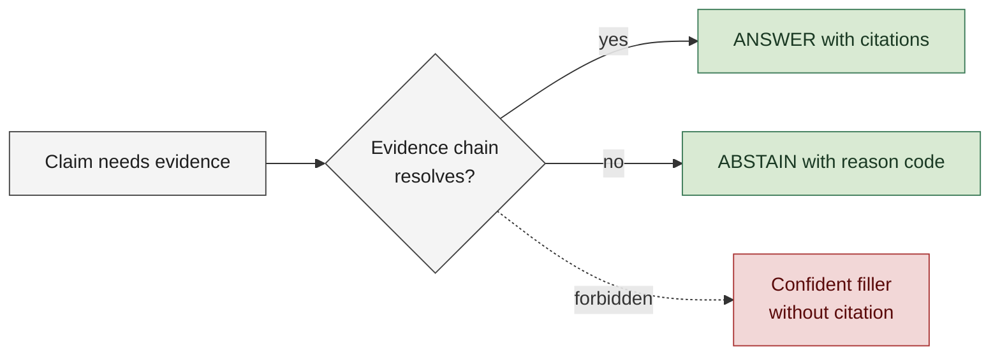
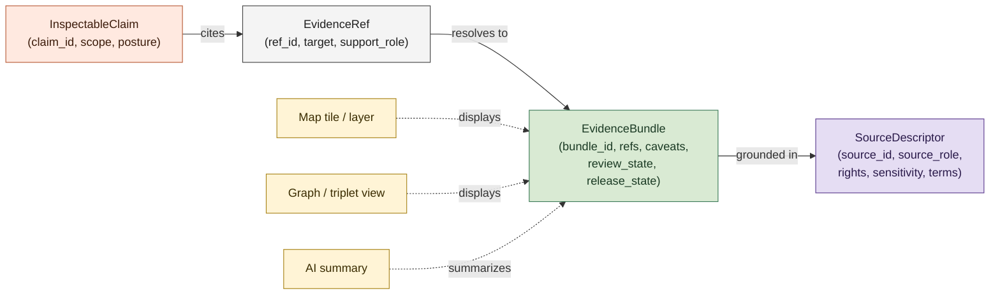
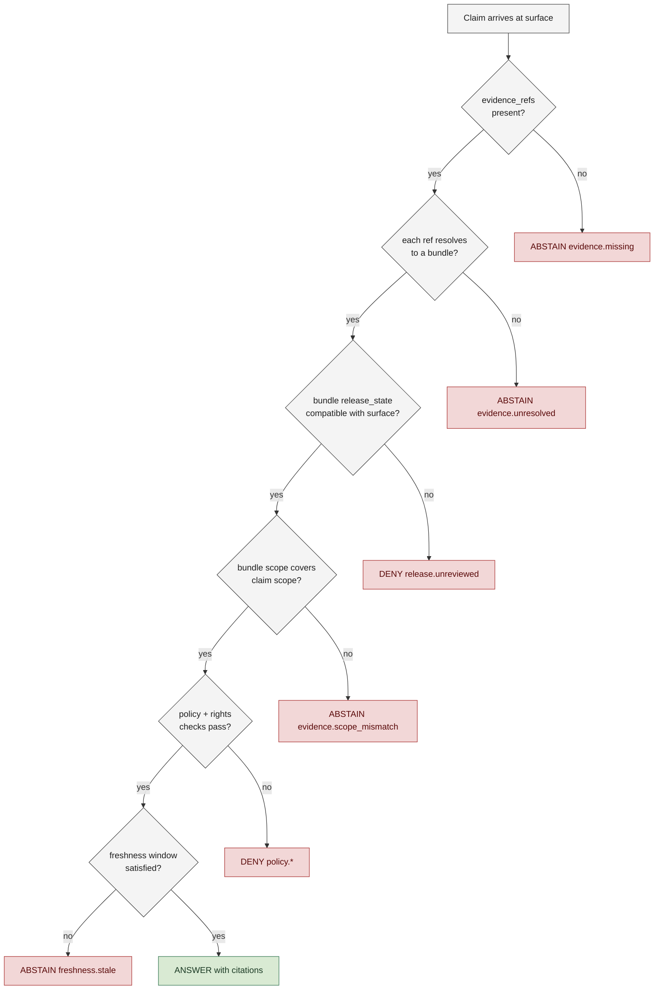

<!-- [KFM_META_BLOCK_V2]
doc_id: kfm://doc/<TODO-uuid>
title: Evidence First
type: standard
version: v1
status: draft
owners: <TODO: doctrine maintainers (e.g., Governance Steward + Engineering Lead)>
created: 2026-05-12
updated: 2026-05-12
policy_label: public
related:
  - docs/doctrine/lifecycle-law.md
  - docs/doctrine/authority-ladder.md
  - docs/doctrine/trust-posture.md
  - docs/doctrine/ai-as-assistant.md
  - docs/doctrine/corrections-first-class.md
  - docs/architecture/evidence-model.md
  - docs/architecture/release-and-publication.md
  - schemas/contracts/v1/inspectable_claim.schema.json
  - schemas/contracts/v1/evidence_ref.schema.json
  - schemas/contracts/v1/evidence_bundle.schema.json
  - schemas/contracts/v1/source_descriptor.schema.json
  - tests/evidence/
  - tests/runtime/
tags: [kfm, doctrine, evidence, citation, governance, trust]
notes:
  - Codifies "Evidence first" as the foundational KFM trust doctrine.
  - Defines what counts as evidence, what does not, and what the cite-or-abstain rule means in practice.
  - Operationalizes the InspectableClaim → EvidenceRef → EvidenceBundle → SourceDescriptor resolution chain.
[/KFM_META_BLOCK_V2] -->

# Evidence First

> **The foundational KFM doctrine: every consequential claim resolves from `EvidenceRef` to `EvidenceBundle`, or it abstains. Evidence outranks fluent prose.**


**Status:** Draft · **Owners:** _TODO doctrine maintainers_ <sub>NEEDS VERIFICATION</sub> · **Updated:** 2026-05-12

> [!IMPORTANT]
> **This is the root trust doctrine of KFM.** Every other doctrine — [`lifecycle-law`](./lifecycle-law.md), [`ai-as-assistant`](./ai-as-assistant.md), [`corrections-first-class`](./corrections-first-class.md), [`authority-ladder`](./authority-ladder.md) — operationalizes the rule defined here. If a lower-layer design appears to permit a public claim without resolvable evidence, this doctrine wins until the lower-layer design is amended through an ADR.

---

## Contents

1. [The doctrine in one sentence](#1-the-doctrine-in-one-sentence)
2. [Why evidence-first](#2-why-evidence-first)
3. [Scope and definitions](#3-scope-and-definitions)
4. [The evidence object graph](#4-the-evidence-object-graph)
5. [What counts as evidence](#5-what-counts-as-evidence)
6. [What does NOT count as evidence](#6-what-does-not-count-as-evidence)
7. [The cite-or-abstain rule](#7-the-cite-or-abstain-rule)
8. [Carriers vs. sovereign truth](#8-carriers-vs-sovereign-truth)
9. [Evidence resolution at runtime](#9-evidence-resolution-at-runtime)
10. [Failure modes and finite outcomes](#10-failure-modes-and-finite-outcomes)
11. [Worked example](#11-worked-example)
12. [Anti-patterns](#12-anti-patterns)
13. [Verification checklist](#13-verification-checklist)
14. [FAQ](#14-faq)
15. [Related docs](#related-docs)

---

## 1. The doctrine in one sentence

> [!IMPORTANT]
> **A claim that needs evidence either resolves to a published `EvidenceBundle` whose `SourceDescriptor`s, support type, time, place, rights, and review state can all be inspected — or it abstains. There is no third option.**

`[CONFIRMED doctrine.]` The KFM Core Principles register names this as **"Evidence first"** with the build rule *"Every consequential claim resolves from `EvidenceRef` to `EvidenceBundle`; evidence outranks fluent prose"* and the failure outcome *`ABSTAIN` when evidence cannot be resolved.*

---

## 2. Why evidence-first

KFM publishes claims about Kansas — its places, its time, its hazards, its water, its habitat, its agriculture, its settlements, its atmospheric observations, its archaeological context, its geology — to public, steward, and admin audiences. A claim is only useful when it is **inspectable**: a non-specialist can reach its evidence, source role, time, place, policy posture, review state, release state, and correction lineage in one or two clicks.

Three properties of modern publication surfaces make evidence-first the **only durable** posture:

1. **Fluent prose is cheap.** Models, dashboards, story maps, and AI summaries can produce confident-sounding output indefinitely. Without an evidence anchor, fluency is indistinguishable from invention.
2. **Source roles are not interchangeable.** A regulatory floodplain (NFHL) is not an observed flood event. A modeled estimate is not a measured value. An aggregator's republication is not an original observation. Collapsing roles silently destroys trust posture.
3. **Time changes the answer.** Evidence has source time, observed time, valid time, retrieval time, release time, and correction time — and the same claim can become `STALE` overnight. Without explicit evidence, staleness cannot be detected.

The doctrine answers all three by **requiring the chain to exist before the claim is allowed to surface.**



> [!CAUTION]
> A surface that produces confident text in the absence of resolvable evidence is **not "being helpful."** It is producing a defect.

[⬆ Back to top](#evidence-first)

---

## 3. Scope and definitions

This doctrine governs every **consequential claim** — that is, any claim that, if wrong, could mislead the public, a steward, an admin, a downstream consumer, or an AI runtime. It applies whether the claim appears in a map popup, an API response, a dataset card, a story map, a CSV export, a release note, an AI summary, or a printed report.

| Term | Meaning |
|---|---|
| **Consequential claim** | Any statement of fact about place, time, source, hazard, rights, sensitivity, status, or relationship that a reasonable consumer might act on. |
| **Evidence** | A `SourceDescriptor`-backed observation or record that has been ingested, validated, governed, and bundled into an `EvidenceBundle`. |
| **Citation** | A persisted `EvidenceRef` linking a claim to one or more `EvidenceBundle`s. A citation is a pointer, not a sentence. |
| **Citation closure** | The runtime property that every cited claim has an `EvidenceRef` that resolves to a real, released `EvidenceBundle` of compatible scope. |
| **Cite-or-abstain** | The runtime rule that a claim either cites resolvable evidence or returns `ABSTAIN` — never confident filler. |
| **Carrier** | A derived product (map, tile, graph, dashboard, scene, summary, export) that *displays* evidence. Carriers never replace evidence. |
| **Sovereign truth** | An (incorrect) treatment of a carrier as if it were itself the source of authority. Forbidden. |

Lifecycle stage names (`RAW`, `WORK`, `QUARANTINE`, `PROCESSED`, `CATALOG`, `TRIPLET`, `PUBLISHED`) carry the meaning defined in [`lifecycle-law.md`](./lifecycle-law.md) and MUST NOT be paraphrased.

[⬆ Back to top](#evidence-first)

---

## 4. The evidence object graph

Every public claim in KFM resolves through the same chain. The objects below are first-class — each has a schema, validator, fixture, and test directory.



| Object | Minimum fields | Rule |
|---|---|---|
| `InspectableClaim` | `claim_id`, `claim_text` / `feature_assertion`, `domain`, `spatial_scope`, `temporal_scope`, `evidence_refs`, `policy_posture`, `review_state`, `release_state`, `correction_lineage` | Cites or abstains; cannot be public-authoritative without `EvidenceBundle` closure. |
| `EvidenceRef` | `evidence_ref_id`, `source_id`, `target_type`, `target_id`, `support_role`, `claim_scope`, `version` / `hash` | MUST resolve before any public consequential claim. |
| `EvidenceBundle` | `bundle_id`, `evidence_refs`, `source_descriptors`, `support_summary`, `spatial_scope`, `temporal_scope`, `caveats`, `rights`, `sensitivity`, `review_state`, `release_state`, `correction_links` | Outranks generated language. The public claim resolves through the bundle. |
| `SourceDescriptor` | `source_id`, `source_role`, `authority_limits`, `rights_status`, `sensitivity_class`, `cadence`, `terms`, `steward`, `activation_state` | Unknown role / rights / sensitivity fails closed. |

The `SupportType` enum (the role evidence plays for a claim) is closed: `observed`, `official`, `steward`, `archival`, `modeled`, `derived`, `interpreted`, `aggregator`, `exploratory`. New values require an ADR.

> [!NOTE]
> Schema field names and paths above are `[PROPOSED]` at the schema level. The doctrinal commitment — that every claim resolves through this chain — is `[CONFIRMED]`.

[⬆ Back to top](#evidence-first)

---

## 5. What counts as evidence

Evidence in KFM is the **`EvidenceBundle`**, and *only* the `EvidenceBundle`. A bundle counts as evidence when **all** of the following hold:

| Requirement | Why |
|---|---|
| Backed by at least one `SourceDescriptor` with a known `source_role` | An unknown role cannot be made consequential — fails closed under the source-role validator. |
| Backed by at least one `SourceDescriptor` with `rights_status` resolved | Unknown rights forbid public exposure. |
| Has a `support_summary` and at least one `SupportType` | Pure existence of a record is not support; the type of support must be named. |
| Has finite `spatial_scope` and `temporal_scope` | Unbounded scope is not evidence; it is decoration. |
| Has a `review_state` recorded | Unreviewed material may still be used internally, but cannot back a public claim. |
| Has a `release_state` consistent with the surface presenting it | `RAW` / `WORK` / `QUARANTINE` content cannot ground public claims under any phrasing. |
| Has a resolvable, immutable `bundle_id` | Updates produce new bundle ids and correction lineage links — never silent rewrites. |

> [!TIP]
> Useful test: *if a non-specialist clicked the citation, would they see something inspectable within one or two clicks?* If yes — evidence. If no — not evidence yet.

[⬆ Back to top](#evidence-first)

---

## 6. What does NOT count as evidence

The list below is exhaustive in spirit and CONFIRMED doctrine. None of these may ground a public consequential claim, no matter how natural it may seem:

| Not evidence | Why |
|---|---|
| **AI output / model recall** | A model that has read a billion documents is not a citation for any of them. AI output is a *carrier* — see [`ai-as-assistant.md`](./ai-as-assistant.md). |
| **Fluent prose without citation** | Confident language is not evidence. The cite-or-abstain rule (§7) treats uncited prose as `ABSTAIN`. |
| **Carriers presented as proof** | A map tile, graph edge, dashboard, chart, summary, story map, scene, export, or printed report cannot be cited *as* evidence. They display evidence; they are not evidence. (§8) |
| **`RAW` / `WORK` / `QUARANTINE` material** | Not yet validated, governed, or released. Use forbidden for public claims regardless of how plausible the content appears. |
| **Candidate records** | `promotion_candidate` material has not cleared `ValidationReport` + `PolicyDecision`. Useful for review; not evidence for public claims. |
| **Aggregator restatements** | An aggregator that republishes a `SourceDescriptor`'s output does not become the source. The original `source_role` is preserved. |
| **Hearsay or unattributed transcription** | Without a `SourceDescriptor`, there is no role, no rights, no terms — and nothing fails closed. |
| **Author intent or institutional memory** | "We always meant this" is not a citation. If it isn't in a bundle, it isn't evidence. |
| **Validator output alone** | A passing `ValidationReport` certifies shape, not truth. It is necessary, not sufficient. |
| **Plausibility, common sense, recency bias** | Plausible is not the same as supported. |

> [!CAUTION]
> The most dangerous category in practice is **fluent prose without citation** generated by AI carriers. If a paragraph reads as if it knows things but cannot point to bundle ids, the surrounding surface is failing the doctrine, not the model.

[⬆ Back to top](#evidence-first)

---

## 7. The cite-or-abstain rule

Cite-or-abstain is how this doctrine is enforced at runtime. The rule has three parts:

1. **Every consequential claim carries one or more `EvidenceRef`s.**
2. **Every `EvidenceRef` must resolve to a released `EvidenceBundle` of compatible scope.**
3. **If (1) or (2) fails, the surface returns `ABSTAIN` with a reason code — never confident filler.**

The four runtime outcomes are finite:

| Outcome | When | Caller obligation |
|---|---|---|
| `ANSWER` | All cited claims resolve; precheck and postcheck both pass | Display with citations and caveats; honor sensitivity decisions |
| `ABSTAIN` | Citation gap, missing evidence, freshness gap, scope gap | Display the abstention reason; do not fall back to ungoverned generation |
| `DENY` | Policy, rights, sensitivity, or release rule blocks the request | Display the denial reason code; never retry under a different guise |
| `ERROR` | System-level failure (upstream unavailable, integrity check failed) | Alert on-call; do not invent a user-facing explanation |

Reason codes governing this doctrine (drawn from the shared runtime envelope vocabulary):

| Reason code | Outcome | Meaning |
|---|---|---|
| `evidence.missing` | `ABSTAIN` | The claim has no `EvidenceRef`s. |
| `evidence.unresolved` | `ABSTAIN` | The cited `EvidenceRef` did not resolve to a published `EvidenceBundle`. |
| `evidence.scope_mismatch` | `ABSTAIN` | Bundle scope does not contain the claim's spatial / temporal scope. |
| `evidence.under_review` | `ABSTAIN` | Bundle exists but `review_state` blocks public surfacing. |
| `freshness.stale` | `ABSTAIN` | Evidence is older than the claim's freshness window. |
| `policy.rights_unclear` | `DENY` | `SourceRightsAssessment` missing or insufficient. |

`[Reason-code paths PROPOSED at implementation level.]` The vocabulary is `[CONFIRMED]`.

> [!IMPORTANT]
> `ABSTAIN` is **informative**. Callers MUST NOT treat it as a soft failure to be filled in with prose elsewhere. The whole point of the envelope is that absence is itself information.

[⬆ Back to top](#evidence-first)

---

## 8. Carriers vs. sovereign truth

A persistent source of confusion is the difference between **evidence** and the **carriers** that display it. The doctrine is precise on this point:

| Surface | Role | Doctrine status |
|---|---|---|
| Map layer / tile | Displays evidence | Carrier — never sovereign truth |
| Graph edge / triplet view | Displays evidence | Carrier — never sovereign truth |
| AI summary / answer | Summarizes evidence | Carrier — never sovereign truth (see [`ai-as-assistant.md`](./ai-as-assistant.md)) |
| Dashboard / chart | Aggregates evidence | Carrier — never sovereign truth |
| Story map / scene | Narrates evidence | Carrier — never sovereign truth |
| Export / report / printed PDF | Materializes evidence | Carrier — never sovereign truth |
| `EvidenceBundle` | The thing being displayed | **Evidence — sovereign** |

The CONFIRMED doctrine line is: **"Derived products stay derived."** Failure outcome: `FAIL if a derivative becomes canonical proof.`

This is what makes reproducibility possible. Any carrier — tile, graph, summary, scene, dashboard — MUST be rebuildable byte-identically (or with a recorded reason for divergence) from its evidence. If a carrier ever becomes the only record of a claim, the doctrine has been silently violated and the carrier MUST be reverted to evidence-grounded form.

> [!WARNING]
> A common failure mode is treating a *legacy carrier* (a long-standing tile, a long-standing AI summary, a long-standing dashboard) as if it were evidence because nobody can quite remember what the underlying bundle was. **Time does not promote carriers to evidence.** If the bundle is lost, the claim is lost.

[⬆ Back to top](#evidence-first)

---

## 9. Evidence resolution at runtime

Resolution is mechanical, ordered, and finite. The `EvidenceRef` resolver runs the same path whether the caller is the public API, a steward tool, an AI runtime, a release validator, or a correction notice generator.



`[Diagram is INFERRED from the CONFIRMED reason-code vocabulary and resolver responsibilities. Validate against the EvidenceRef resolver implementation when it lands. NEEDS VERIFICATION.]`

Every step is performed by a named validator with a schema, fixtures, and a test directory:

| Step | Validator | Test home (PROPOSED) |
|---|---|---|
| Refs present, well-formed | Schema validator | `tests/contracts/` |
| Refs resolve to bundles | `EvidenceRef` resolver | `tests/evidence/` |
| Release state compatibility | Lifecycle state validator | `tests/lifecycle/` |
| Scope coverage | Geometry + Time validators | `tests/geography/`, `tests/time/` |
| Policy + rights | Rights + Sensitivity validators | `tests/policy/rights/`, `tests/policy/sensitivity/` |
| Freshness | Time validator | `tests/time/` |
| Final envelope shape | Runtime envelope validator | `tests/runtime/` |

[⬆ Back to top](#evidence-first)

---

## 10. Failure modes and finite outcomes

When the doctrine is honored, failures are *informative*. The two patterns below are the only acceptable shapes for a failed resolution:

```text
{
  "outcome": "ABSTAIN",
  "reason_code": "evidence.unresolved",
  "claim_id": "cl-001",
  "details": {
    "unresolved_refs": ["er-7a1c"],
    "operator_hint": "EvidenceRef er-7a1c points at bundle eb-???? which is not in release."
  }
}
```

```text
{
  "outcome": "DENY",
  "reason_code": "policy.rights_unclear",
  "claim_id": "cl-002",
  "details": {
    "source_id": "src-living-person-record-018",
    "operator_hint": "SourceRightsAssessment missing; public exposure forbidden."
  }
}
```

`[Examples are illustrative — exact envelope shape is PROPOSED at schema level.]`

> [!CAUTION]
> The forbidden shape is the silent one: a claim that simply does not appear on the surface, or worse, appears with confident filler in place of citations. The doctrine requires the outcome to be **named** and **inspectable**.

[⬆ Back to top](#evidence-first)

---

## 11. Worked example

<details>
<summary><b>Hydrology: a streamflow trend claim under the doctrine</b></summary>

**Claim** (`cl-streamflow-trend-001`):

> *"Mean annual streamflow at USGS gage 06892350 (Kansas River near DeSoto, KS) declined by approximately 12% between 1970–1989 and 2000–2019."*

**Doctrine path:**

1. The claim is consequential — a non-specialist could act on it (e.g., to write about Kansas hydrology). It MUST cite or abstain.
2. The claim carries two `EvidenceRef`s:
   - `er-usgs-06892350-1970-1989` → `EvidenceBundle eb-streamflow-baseline-1970-1989`
   - `er-usgs-06892350-2000-2019` → `EvidenceBundle eb-streamflow-recent-2000-2019`
3. Each `EvidenceBundle` is backed by a `SourceDescriptor` for USGS NWIS with `source_role: authority`, `rights_status: public`, `cadence: daily`, `steward: KFM-water`, `activation_state: active`.
4. `SupportType` for both bundles is `observed` (instrument-based stream gage record).
5. Both bundles' `temporal_scope` cover the periods named in the claim. The `spatial_scope` is the gage location with a stable identifier.
6. Both bundles have `release_state: PUBLISHED`, `review_state: approved`.
7. The freshness window is generous (historical baseline) — passes.
8. The `EvidenceRef` resolver passes; the envelope returns `ANSWER` with both citations and a caveat noting the percentage is computed, not directly observed (`SupportType: derived` on the *trend statistic* itself).

**Carrier produced** (allowed): an AI summary cites both bundles and surfaces the caveats verbatim. The summary is a carrier; the bundles remain sovereign.

**What goes wrong without the doctrine:**

- If `eb-streamflow-baseline-1970-1989` is missing or in `QUARANTINE`, the surface MUST return `ABSTAIN evidence.unresolved` — not a confident paragraph.
- If the trend statistic is attributed to a model run with no underlying observation, the claim is `SupportType: modeled` — and the surface MUST surface that distinction, never collapse it.
- If a long-standing dashboard repeats the trend without the bundle ids, the dashboard has become a *carrier presented as proof* and MUST be reverted to evidence-grounded form.

</details>

[⬆ Back to top](#evidence-first)

---

## 12. Anti-patterns

The anti-patterns below are CONFIRMED-rejection cases. Each represents a real failure mode encountered in evidence-first systems.

| Anti-pattern | Why rejected | Corrective doctrine line |
|---|---|---|
| "The map says it, so it's true." | Carriers are not sovereign. | Derived products stay derived. (§8) |
| "The AI summary is the source." | AI outputs are carriers, not citations. | See [`ai-as-assistant.md`](./ai-as-assistant.md). |
| "We have the dataset, that's evidence enough." | A dataset without a `SourceDescriptor` and `SupportType` has no role; unknown roles fail closed. | §5 requirements. |
| "Just paraphrase the bundle in the popup." | Paraphrase without a resolvable `EvidenceRef` removes citation closure. | Cite-or-abstain (§7). |
| "Aggregator X confirms it." | Aggregators do not replace original `source_role`. | §6, source-role validator. |
| "It was true at release; surely still true." | Without a freshness check, evidence silently becomes `STALE`. | `freshness.stale` reason code (§7). |
| Citations as decoration (footnote-style links to homepages) | A citation is a pointer to an `EvidenceBundle`, not a hyperlink to a logo. | §3 definition of citation. |
| Treating a passing `ValidationReport` as proof of truth | Shape validation ≠ semantic correctness. | §6, validator-output-alone row. |
| Carrying claims forward into a new release without re-resolving evidence | New release ≠ new resolution; bundle ids must be re-checked. | §9, `release_state` compatibility step. |
| Promoting carriers to canonical because the bundle is "lost" | Lost bundle ⇒ lost claim. Do not promote carriers. | §8 warning. |

[⬆ Back to top](#evidence-first)

---

## 13. Verification checklist

Before any surface, route, layer, summary, dashboard, or export goes to L1, the following must be verifiable. `[PROPOSED at implementation level.]`

- [ ] Every consequential claim on the surface carries at least one `EvidenceRef`.
- [ ] Every `EvidenceRef` resolves to a `PUBLISHED` `EvidenceBundle` of compatible scope.
- [ ] Citation closure is enforced by the runtime envelope validator, not by manual review.
- [ ] Citation validation failures produce `ABSTAIN evidence.*` — never silent omission or filler.
- [ ] `SourceDescriptor`s for all backing bundles have known `source_role` and resolved `rights_status`.
- [ ] No public surface presents a carrier (tile, graph, summary, dashboard, export) as evidence.
- [ ] No `RAW` / `WORK` / `QUARANTINE` / candidate material backs any public claim.
- [ ] `SupportType` is recorded for every bundle backing a public claim.
- [ ] Freshness checks run on every resolution; stale evidence yields `freshness.stale`.
- [ ] Negative-path fixtures exist for `evidence.missing`, `evidence.unresolved`, `evidence.scope_mismatch`, `evidence.under_review`, `freshness.stale`.
- [ ] Validator output alone is never cited *as* evidence.
- [ ] Carriers can be rebuilt byte-identically (or with a recorded divergence reason) from their bundles.

[⬆ Back to top](#evidence-first)

---

## 14. FAQ

<details>
<summary><b>Is every sentence on every surface a "consequential claim"?</b></summary>

No. Navigation labels, UI chrome, instructions, prompts, error messages, and explanatory text *about* the system are not consequential claims. The doctrine applies to claims of fact about places, times, sources, hazards, rights, sensitivity, status, or relationships — the kind a consumer might act on. Doubts resolve toward citation, not away from it.

</details>

<details>
<summary><b>What about claims based on multiple bundles or aggregated analysis?</b></summary>

The claim carries multiple `EvidenceRef`s. The `SupportType` for the *aggregation itself* is `derived` or `modeled`, which MUST be surfaced in the citation. The underlying observed evidence is cited separately. Do not collapse the layers.

</details>

<details>
<summary><b>Can a steward override the cite-or-abstain rule?</b></summary>

No — not at the public surface. A steward can act on `QUARANTINE` or candidate material inside the governance membrane (with their own audit trail), but they cannot publish a claim to a public surface without resolvable evidence. The doctrine is symmetric across roles for public exposure.

</details>

<details>
<summary><b>How does this interact with AI summaries?</b></summary>

AI summaries are carriers, governed by [`ai-as-assistant.md`](./ai-as-assistant.md). They must cite every consequential claim with `EvidenceRef`s that resolve to released `EvidenceBundle`s. Uncited prose from a model is treated as `ABSTAIN`, not as a softer kind of `ANSWER`.

</details>

<details>
<summary><b>What if the same fact appears in many sources — must each be cited?</b></summary>

Cite the bundle(s) that actually ground the claim's scope. If three observations independently support a claim, citing all three is preferred (it makes the evidence chain more robust). What is forbidden is citing none and relying on "everyone knows this."

</details>

<details>
<summary><b>What if evidence is sensitive (exact geometry, living person, archaeology)?</b></summary>

The evidence still exists; what changes is the *exposure*. Sensitive evidence can ground a claim while the surface presents a generalized geometry, a redacted attribute, or an aggregated view. The `EvidenceRef` still resolves; the policy gate narrows what the carrier displays. Never substitute a fabricated geometry for a sensitive real one.

</details>

<details>
<summary><b>How does this relate to the authority ladder and corrections doctrines?</b></summary>

The [`authority-ladder`](./authority-ladder.md) ranks *sources of authority* for documentation and decisions. Evidence-first defines *what counts as evidence at runtime*. They collaborate at publication: a release manifest is grounded by both — authority ladder for *what we decided*, evidence-first for *what we cited*. The [`corrections-first-class`](./corrections-first-class.md) doctrine inherits both: a `CorrectionNotice` whose `source_refs` do not resolve to real `EvidenceBundle`s is rejected by the Citation validator.

</details>

[⬆ Back to top](#evidence-first)

---

## Related docs

- [`docs/doctrine/lifecycle-law.md`](./lifecycle-law.md) — `RAW → WORK/QUARANTINE → PROCESSED → CATALOG/TRIPLET → PUBLISHED` and the publication state transition that produces released `EvidenceBundle`s. `[CONFIRMED sibling.]`
- [`docs/doctrine/authority-ladder.md`](./authority-ladder.md) — Primary / Secondary / Tertiary authority for documentation; collaborates with this doctrine at publication. `[CONFIRMED sibling.]`
- [`docs/doctrine/trust-posture.md`](./trust-posture.md) — Truth-label vocabulary (`CONFIRMED`, `PROPOSED`, `NEEDS VERIFICATION`, `UNKNOWN`, `STALE`) used alongside the runtime outcomes here. `[NEEDS VERIFICATION — confirm exact filename.]`
- [`docs/doctrine/ai-as-assistant.md`](./ai-as-assistant.md) — How AI carriers honor the cite-or-abstain rule and `EvidenceBundle` resolution. `[CONFIRMED sibling.]`
- [`docs/doctrine/corrections-first-class.md`](./corrections-first-class.md) — `CorrectionNotice` inherits the citation closure rule; uncited corrections are rejected. `[CONFIRMED sibling.]`
- [`docs/architecture/evidence-model.md`](../architecture/evidence-model.md) — Full object graph, schemas, and resolver responsibilities. `[NEEDS VERIFICATION — exact path.]`
- [`docs/architecture/release-and-publication.md`](../architecture/release-and-publication.md) — Where bundles cross into `PUBLISHED`. `[NEEDS VERIFICATION — exact path.]`
- `schemas/contracts/v1/inspectable_claim.schema.json` — `InspectableClaim` schema. `[PROPOSED path.]`
- `schemas/contracts/v1/evidence_ref.schema.json` — `EvidenceRef` schema. `[PROPOSED path.]`
- `schemas/contracts/v1/evidence_bundle.schema.json` — `EvidenceBundle` schema. `[PROPOSED path.]`
- `schemas/contracts/v1/source_descriptor.schema.json` — `SourceDescriptor` schema. `[PROPOSED path.]`
- ADR — *Citation closure as a runtime invariant, not a review-time check*. `[TODO — ADR not yet authored.]`
- ADR — *`SupportType` enum and addition policy*. `[TODO — ADR not yet authored.]`

---

<sub>**Last updated:** 2026-05-12 · **Version:** v1 (draft) · **Doctrine track:** `docs/doctrine/`</sub>

[⬆ Back to top](#evidence-first)
