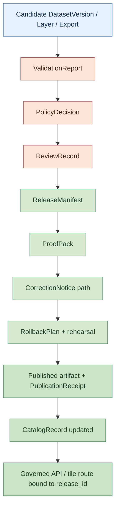
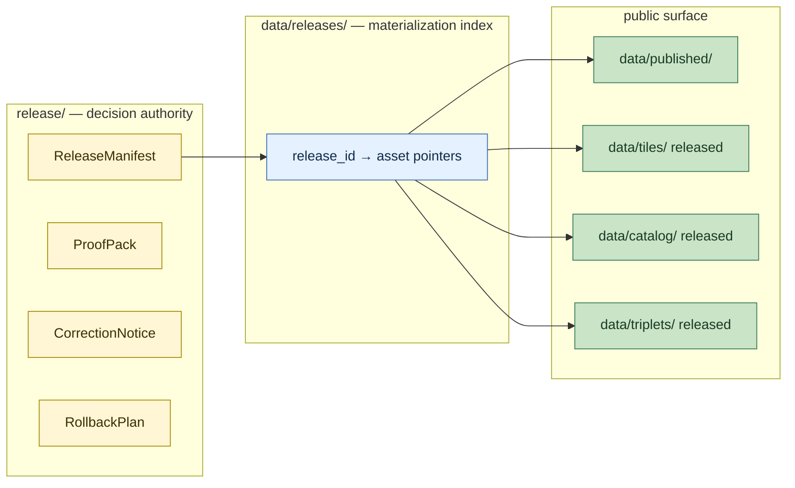

<!-- [KFM_META_BLOCK_V2]
doc_id: kfm://doc/<TODO-uuid>
title: Lifecycle Law
type: standard
version: v1.1
status: draft
owners: <TODO: doctrine maintainers (e.g., Governance Steward + Release Authority + Data Lifecycle Steward)>
created: 2026-05-12
updated: 2026-05-26
policy_label: public
related:
  - docs/doctrine/ai-build-operating-contract.md
  - docs/doctrine/directory-rules.md
  - docs/doctrine/authority-ladder.md
  - docs/doctrine/evidence-first.md
  - docs/doctrine/derived-stays-derived.md
  - docs/doctrine/corrections-are-first-class.md
  - docs/doctrine/trust-posture.md
  - docs/doctrine/truth-labels.md
  - docs/doctrine/evidence-model.md
  - docs/doctrine/ai-as-assistant.md
  - docs/architecture/release-and-publication.md
  - schemas/contracts/v1/release_manifest.schema.json
  - schemas/contracts/v1/proof_pack.schema.json
  - data/raw/
  - data/work/
  - data/quarantine/
  - data/processed/
  - data/catalog/
  - data/triplets/
  - data/tiles/
  - data/releases/
  - data/receipts/
  - data/proofs/
  - data/published/
  - data/rollback/
  - data/registry/
  - data/fixtures/
  - release/
tags: [kfm, doctrine, lifecycle, pipeline, release, governance, trust]
notes:
  - Codifies the RAW → WORK/QUARANTINE → PROCESSED → CATALOG/TRIPLET → PUBLISHED invariant.
  - Codifies publication as a governed state transition (not a copy or file move).
  - Codifies the two-tier release pattern (/release as decision authority; /data/releases as materialization index).
  - Foundational sibling doctrine for evidence-first, derived-stays-derived, corrections-are-first-class, authority-ladder, ai-as-assistant.
  - Pinned to ai-build-operating-contract.md CONTRACT_VERSION = "3.0.0".
  - v1.1 reconciles STALE → SOURCE_STALE + ABSTAIN freshness.stale (OQ-LL-01); DecisionEnvelope → RuntimeResponseEnvelope (OQ-LL-02); surfaces corrections-first-class.md vs. corrections-are-first-class.md filename (OQ-LL-03); promotes Pre-RAW to first-class stage per directory-rules.md §9.1 and Unified Build Manual; expands §5 directory layout with canonical roots (rollback/, registry/, published/ family subdirs).
  - All concrete file paths, schema paths, runbook paths, and CI job names are PROPOSED until verified against the live repository.
[/KFM_META_BLOCK_V2] -->

# Lifecycle Law

> **The shape of data movement inside Kansas Frontier Matrix — what each stage means, what each stage may expose, what each stage must record, and why publication is a state transition rather than a copy.**


<!-- TODO — wire repo-level Shields endpoints (CI status, doctrine-coverage) when the doctrine-doc workflow is verified. -->

**Status:** Draft · **Edition:** v1.1 · **Owners:** _TODO — Governance Steward + Release Authority + Data Lifecycle Steward_ <sub>NEEDS VERIFICATION</sub> · **Pins:** `CONTRACT_VERSION = "3.0.0"` · **Last updated:** 2026-05-26

> [!IMPORTANT]
> **Lifecycle Law is foundational doctrine.** Several sibling doctrine docs — [`evidence-first.md`](./evidence-first.md), [`derived-stays-derived.md`](./derived-stays-derived.md), [`corrections-are-first-class.md`](./corrections-are-first-class.md), [`authority-ladder.md`](./authority-ladder.md), [`ai-as-assistant.md`](./ai-as-assistant.md) — operationalize rules that this document fixes. Changes to the invariant, the stage names, or the publication transition require an ADR and cascade through every sibling doc.

> [!NOTE]
> **Where this doc sits.** Lifecycle Law is a Tier 1 doctrine doc subordinate to `ai-build-operating-contract.md` v3.0 (`CONTRACT_VERSION = "3.0.0"`). It elaborates the contract's §1.6 lifecycle invariant, §10.1 lifecycle law, §10.8 *"Promotion is auditable,"* and §10.11 *"Reversible change is the default."* If a conflict arises between this doc and the contract, the contract wins and the conflict becomes a `CONFLICTED` candidate for ADR resolution.

---

## Contents

1. [Why this is doctrine](#1-why-this-is-doctrine)
2. [The lifecycle invariant](#2-the-lifecycle-invariant)
3. [Stage definitions](#3-stage-definitions)
4. [Per-stage exposure, receipts, and failure disposition](#4-per-stage-exposure-receipts-and-failure-disposition)
5. [Data directory layout](#5-data-directory-layout)
6. [Publication as a governed state transition](#6-publication-as-a-governed-state-transition)
7. [The two-tier release pattern](#7-the-two-tier-release-pattern)
8. [Failure dispositions and policy outcomes](#8-failure-dispositions-and-policy-outcomes)
9. [Relationship to the evidence model](#9-relationship-to-the-evidence-model)
10. [Doctrine connections](#10-doctrine-connections)
11. [RFC 2119 conformance language](#11-rfc-2119-conformance-language)
12. [Validation and tests](#12-validation-and-tests)
13. [Acceptance checklist](#13-acceptance-checklist)
14. [Anti-patterns](#14-anti-patterns)
15. [FAQ](#15-faq)
16. [Open questions register](#16-open-questions-register)
17. [Open verification backlog](#17-open-verification-backlog)
18. [Changelog v1 → v1.1](#18-changelog-v1--v11)
19. [Definition of done](#19-definition-of-done)
20. [Related docs](#related-docs)

---

## 1. Why this is doctrine

A system that publishes evidence must be able to say, for any artifact reachable from a public URL, exactly how that artifact came to be. Without a fixed shape for data movement, "publication" decays into "whatever ended up in the last folder," lineage becomes hopeful rather than structural, and corrections, withdrawals, and rollback have no surface to act on.

Lifecycle Law fixes that shape. Three commitments follow from it:

1. **Stages are kinds, not directories.** A folder named `data/processed/` is the *materialization* of the `PROCESSED` stage; the stage itself is a typed contract about what may live there, who may write to it, who may read it, and what receipt accompanies it. The folder serves the stage, not the other way around.
2. **Publication is a transition, not a copy.** Becoming `PUBLISHED` requires validation, policy, review, manifest, proof, and a declared correction and rollback path. A successful build that lacks any of these is not publication; it is a candidate that happens to have a path. `[CONFIRMED doctrine.]`
3. **The invariant is one-way.** Data moves rightward through the pipeline. Material does not "return to RAW" once derived (see [`derived-stays-derived.md`](./derived-stays-derived.md)). Rollback retires a release; it does not unwind the lineage that produced it.

> [!NOTE]
> **What this doctrine does NOT decide.** It does not pick file formats, schemas, CRSes, or storage backends. Those belong to lower-tier docs: contracts, schemas, ADRs. Lifecycle Law fixes the *shape of the transitions* between stages; how each stage is materialized is an implementation choice constrained by — but not specified by — this doc.

[⬆ Back to top](#lifecycle-law)

---

## 2. The lifecycle invariant

Every piece of data that enters Kansas Frontier Matrix traverses the same five-stage spine, preceded by an admission stage **Pre-RAW**. The names below are **preserved verbatim from project doctrine** and MUST NOT be paraphrased, lowercased, or substituted with generic equivalents (e.g., "intake" / "staging" / "production"):

```text
(Pre-RAW) → RAW → WORK / QUARANTINE → PROCESSED → CATALOG / TRIPLET → PUBLISHED
```

`[CONFIRMED doctrine.]` This invariant is the foundational constraint cited by sibling doctrine docs; it is the data-side counterpart to the [authority ladder](./authority-ladder.md) that governs documentation and decisions. **Pre-RAW** is a first-class admission stage carrying source-change events and watcher signals **before** material is admitted into RAW — see [§3.0](#30-pre-raw--admission-and-source-change-signaling).

```mermaid
flowchart LR
  classDef preraw    fill:#FDEFEF,stroke:#A33,color:#5A0A0A;
  classDef raw       fill:#FFE9E0,stroke:#B85C38,color:#3B1B0A;
  classDef work      fill:#FFF6D6,stroke:#A88B00,color:#3B2F00;
  classDef quar      fill:#F2D7D7,stroke:#A33,color:#5A0A0A;
  classDef proc      fill:#E5F1FF,stroke:#3A6EB4,color:#102A4C;
  classDef cat       fill:#E1ECFB,stroke:#3A6EB4,color:#102A4C;
  classDef pub       fill:#C9E4C7,stroke:#3B7A57,color:#1B3A24;
  classDef gate      fill:#F4F4F4,stroke:#666,color:#222;

  PRE["Pre-RAW<br/>source-change events &amp;<br/>watcher signals"]:::preraw
  RAW["RAW<br/>source-native capture"]:::raw
  WORK["WORK<br/>transform / QA workspace"]:::work
  QUAR["QUARANTINE<br/>fail-closed hold"]:::quar
  PROC["PROCESSED<br/>normalized candidates"]:::proc
  CAT["CATALOG / TRIPLET<br/>closure &amp; graph projection"]:::cat
  PUB["PUBLISHED<br/>public-safe materialization"]:::pub

  GATE{{"Validation +<br/>Policy + Review +<br/>Manifest + Proof"}}:::gate

  PRE -->|admission| RAW
  RAW --> WORK
  WORK -- "invalid /<br/>unsafe" --> QUAR
  WORK --> PROC
  PROC --> CAT
  CAT --> GATE
  GATE -- "ALLOW" --> PUB
  GATE -. "DENY · ABSTAIN · ERROR" .-> QUAR
```



> [!CAUTION]
> The transition labelled **GATE** is not a folder. It is the governed state transition described in [§6](#6-publication-as-a-governed-state-transition). Treating it as "the act of writing into `data/published/`" is a build-stop defect.

### 2.1 What the invariant guarantees

| Guarantee | What it means | Where it is enforced |
|---|---|---|
| **One-way flow** | Data moves rightward; no stage re-labels an upstream artifact. | `derived-stays-derived` doctrine; validators (PROPOSED). |
| **Fail-closed branching** | The only branch off the spine is into `QUARANTINE`. There is no "publish anyway" path. | Policy gates (PROPOSED); CI `policy-tests` (PROPOSED). |
| **No public stage before `PUBLISHED`** | Pre-RAW, `RAW`, `WORK`, `QUARANTINE`, `PROCESSED`, and the unreleased portion of `CATALOG`/`TRIPLET` are non-public. | Policy `DENY policy.no_raw_public`; route-level checks. |
| **Receipt at every stage** | Each stage has a typed receipt (`EventRunReceipt`, `IntakeReceipt`, `TransformReceipt`, …). Movement without a receipt is a defect. | Schema validators (PROPOSED). |
| **Manifest at publication** | A `ReleaseManifest` and `ProofPack` are necessary conditions for `PUBLISHED`. | Release gate (PROPOSED); `release-dry-run` CI job. |
| **Watcher-as-non-publisher** | Pre-RAW signals are candidates, not publications. A watcher MUST NOT promote a release on its own. | `ai-build-operating-contract.md` §15 #18; `connected-dots-architecture-brief.md`. |

[⬆ Back to top](#lifecycle-law)

---

## 3. Stage definitions

Each stage is a typed contract. The required receipt is the artifact whose existence proves the stage transition occurred under governance.

### 3.0 `Pre-RAW` — admission and source-change signaling

**Purpose.** Carry source-change events, watcher signals, and pre-admission notices that have not yet entered `RAW`. Pre-RAW is the **admission stage**: it holds candidates awaiting source admission (Gate A: Source identity; Gate B: Rights and terms per the project's gate doctrine) before they become RAW captures.

- **Writers.** Watchers, change-detection services, source-event listeners, upload notice handlers operating under an approved or proposed `SourceDescriptor`.
- **Readers.** Steward roles only. **No public reach.**
- **Required receipt.** `EventRunReceipt` (event identifier, source hint, actor/tool, timestamp, policy precheck outcome).
- **Mutation rule.** Append-only. Pre-RAW events are not edited; superseded events emit new event records with supersession links.
- **Failure outcome.** Failed admission (unknown source, unresolved rights, ambiguous role) `ABSTAIN`s the event and routes the underlying material to `QUARANTINE` with a reason code; the Pre-RAW event itself is retained as the audit anchor.

> [!IMPORTANT]
> **Watchers are not publishers.** A watcher MAY emit a Pre-RAW event saying *"something changed."* It MUST NOT produce a public release on that basis. Per `ai-build-operating-contract.md` §15 (denied AI actions) and the `connected-dots-architecture-brief.md` watcher posture: a watcher is a candidate producer; a `PromotionDecision` is the only path to public state.

### 3.1 `RAW` — source-native capture

**Purpose.** Hold ingested data exactly as the source delivered it. RAW is the only stage classified as *original*; every later stage is derived from it.

- **Writers.** Connectors operating under an approved `SourceDescriptor`.
- **Readers.** Steward roles only. No public reach.
- **Required receipt.** `IntakeReceipt` (hash, retrieval time, `spec_hash`, `source_id`).
- **Mutation rule.** Append-only. RAW artifacts are not edited in place; corrections produce new RAW captures, not rewrites.
- **Failure outcome.** `ERROR` or `QUARANTINE` on hash mismatch, schema-spec mismatch, or rights/sensitivity ambiguity.

`[CONFIRMED doctrine.]` The "no live connector first" rule applies: the first implementation increment uses fixtures and no-network source descriptors; live activation requires explicit reviews.

### 3.2 `WORK` — transform and QA workspace

**Purpose.** Carry out the transformations that turn source-native captures into normalized candidates: CRS reprojection, unit harmonization, schema mapping, time normalization, deduplication, joining.

- **Writers.** Pipeline steps and operator scripts. Manual edits MUST be recorded as derivation steps; they are never silent.
- **Readers.** Steward roles only.
- **Required receipt.** `TransformReceipt` (inputs, transformation identity, output, parameters).
- **Failure outcome.** Failed transforms route to `QUARANTINE`. There is no in-place "fix and continue."

### 3.3 `QUARANTINE` — fail-closed hold

**Purpose.** Hold any artifact that failed validation, policy, sensitivity, or rights review. `QUARANTINE` is a one-way detour from `WORK` (and, by escalation, from any later stage where a defect is detected).

- **Writers.** Pipeline + policy gates.
- **Readers.** Steward + reviewer roles. Public `DENY`.
- **Required receipt.** `QuarantineReceipt` (reason, originating stage, evidence pointers).
- **Release rule.** Material leaves `QUARANTINE` only via **reprocessing plus review**. Pipelines cannot promote a quarantined artifact directly.

> [!WARNING]
> A pipeline path that lets `QUARANTINE` artifacts re-enter `PROCESSED` without an explicit review record is a doctrine violation. The shortcut is the defect.

### 3.4 `PROCESSED` — normalized candidates

**Purpose.** Hold validated, normalized objects that are eligible to become release candidates. `PROCESSED` is the last stage before catalog closure.

- **Writers.** Pipeline.
- **Readers.** Steward roles. Public `DENY` until release.
- **Required receipts.** `ProcessingReceipt` **plus** `ValidationReport`. Both are necessary; one is not enough.
- **Failure outcome.** Rollback to prior `DatasetVersion`; failed candidates MAY be re-quarantined.

### 3.5 `CATALOG / TRIPLET` — closure and graph projection

**Purpose.** Two paired projections of the same governed truth:
- **`CATALOG`** — record-shaped projection (datasets, layers, exports) with closure manifests that resolve to evidence.
- **`TRIPLET`** — graph-shaped projection (subject–predicate–object edges) of released claims and relationships.

- **Writers.** Catalog and graph build steps.
- **Readers.** Public **only for released records / edges**; unreleased material is steward-only.
- **Required receipts.** `CatalogBuildReceipt` (catalog side); `GraphBuildReceipt` (triplet side).
- **Failure outcome.** Withdraw / supersede the record on the catalog side; rebuild from canonical release on the triplet side.

> [!NOTE]
> The slash in `CATALOG / TRIPLET` is doctrinal. They are paired projections of the same stage, not two alternative stages.

### 3.6 `PUBLISHED` — public-safe materialization

**Purpose.** The public surface. Only material that has cleared the full eleven-step transition lives here.

- **Writers.** Release authority **only** — never pipelines acting alone.
- **Readers.** Public, via governed routes.
- **Required receipt.** `PublicationReceipt` accompanying a backing `ReleaseManifest` and `ProofPack`.
- **Failure outcome.** Withdrawal or supersession **with public notice**, per [`corrections-are-first-class.md`](./corrections-are-first-class.md).

[⬆ Back to top](#lifecycle-law)

---

## 4. Per-stage exposure, receipts, and failure disposition

The table below is the canonical summary. It is preserved from project doctrine `[CONFIRMED]`, extended in v1.1 to include the Pre-RAW row and the `data/rollback/` + `data/registry/` rows surfaced by `directory-rules.md` §9.1. It is the reference for the `path-policy-checks`, `forbidden-exposure-checks`, and `schema-validation` CI jobs `[PROPOSED]`.

| Stage path | Public exposure | Required receipt | Failure disposition |
|---|:---:|---|---|
| Pre-RAW (event-shaped, no dedicated `data/` root) | `DENY` | `EventRunReceipt` | `ABSTAIN` event; route material to `QUARANTINE`. |
| `data/raw` | `DENY` | `IntakeReceipt` | Quarantine batch by receipt. |
| `data/work` | `DENY` | `TransformReceipt` | Failed transforms → `QUARANTINE`. |
| `data/quarantine` | `DENY` | `QuarantineReceipt` | Release only via reprocessing + review. |
| `data/processed` | `DENY` | `ProcessingReceipt` + `ValidationReport` | Rollback to prior `DatasetVersion`. |
| `data/catalog` | RELEASED ONLY | `CatalogBuildReceipt` | Withdraw / supersede record. |
| `data/triplets` | RELEASED ONLY | `GraphBuildReceipt` | Rebuild from canonical release. |
| `data/tiles` | RELEASED ONLY | `TileBuildReceipt` | Rollback manifest + invalidate cache. |
| `data/releases` | RELEASED ONLY | `ReleaseDataReceipt` | Rollback by release authority. |
| `data/receipts` | SUMMARIZED ONLY | (the receipt itself) | Corrections add new records (append-only). |
| `data/proofs` | RELEASED ONLY | `ProofPack` | Proof rolls back with release. |
| `data/published` | PUBLIC | `PublicationReceipt` | Withdraw / supersede **with notice**. |
| `data/rollback` | SUMMARIZED ONLY | `RollbackCard` / `RollbackReceipt` | Append rollback records; never overwrite. |
| `data/registry` | SUMMARIZED ONLY | `SourceDescriptor`, `LayerDescriptor`, etc. | Update via versioned registry change; never silent. |
| `data/fixtures` | PUBLIC-SAFE | `FixtureReceipt` *(optional)* | Replace via changelog. |

> [!TIP]
> "RELEASED ONLY" means the **subset** of records in that directory that belong to an approved `ReleaseManifest` is public; the rest is not. This is enforced at the route, not the directory — see [§7](#7-the-two-tier-release-pattern).

[⬆ Back to top](#lifecycle-law)

---

## 5. Data directory layout

The directory layout that materializes the invariant is shown below. `[CONFIRMED at doctrine level per directory-rules.md §9.1 and KFM_Unified_Implementation_Architecture_Build_Manual.md §5; concrete tree on disk is PROPOSED until verified against the live repository.]` v1.1 expands the v1 layout to include the canonical `rollback/` and `registry/` roots and the `published/` family subdirectories named in the Unified Build Manual.

```text
data/
├── raw/            # source-native capture; DENY public exposure
│   └── <domain>/<source_id>/<run_id>/
├── work/           # transform / QA workspace; DENY public exposure
│   └── <domain>/<run_id>/
├── quarantine/     # fail-closed hold; DENY public exposure
│   └── <domain>/<reason>/<run_id>/
├── processed/      # normalized candidates; not public until promoted
│   └── <domain>/<dataset_id>/<version>/
├── catalog/        # catalog records; public only after release
│   ├── stac/  dcat/  prov/  domain/
├── triplets/       # graph projections; public only for released edges
│   ├── graph_deltas/  exports/
├── tiles/          # rebuildable map tile artifacts; public only after release
├── releases/       # data-side release materialization index (NOT release authority)
├── receipts/       # process memory; public only as summarized
│   ├── ingest/  validation/  pipeline/  ai/  release/
├── proofs/         # proof artifacts and integrity evidence
│   ├── evidence_bundle/  proof_pack/  validation_report/  citation_validation/
├── published/      # public-safe materialized output
│   ├── api_payloads/  layers/  pmtiles/  geoparquet/
│   ├── reports/      stories/
├── rollback/       # rollback evidence; append-only audit
│   └── <domain>/<release_id>/
├── registry/       # source / layer / dataset / rights / sensitivity registries
│   ├── sources/  source_descriptors/
│   ├── layers/   datasets/
│   ├── domains/  rights/
│   ├── sensitivity/  crosswalks/
└── fixtures/       # data-local fixtures for lifecycle tests
```

> [!IMPORTANT]
> `data/releases/` is **not** the release decision authority. The decision authority lives at the root `release/` directory. Conflating the two is the canonical anti-pattern called out in [§7](#7-the-two-tier-release-pattern) and is repeated in [`corrections-are-first-class.md`](./corrections-are-first-class.md).

<details>
<summary><strong>Why every directory has a README</strong> — orientation, scope, and exclusions</summary>

Each `data/<stage>/` directory carries a `README.md` that declares:

- **Scope.** What this stage is for, restated in directory-local terms.
- **Inputs.** What is allowed to be written here, by which writers, with which receipt.
- **Exclusions.** What does NOT belong here and where it goes instead.
- **Exposure rule.** The public-exposure cell from the table in [§4](#4-per-stage-exposure-receipts-and-failure-disposition).
- **Failure disposition.** What happens when validation, policy, or review fails at this stage.

This is the README-like doc rule from project doctrine — directory READMEs are themselves doctrine touchpoints, not decoration.

</details>

[⬆ Back to top](#lifecycle-law)

---

## 6. Publication as a governed state transition

`[CONFIRMED doctrine.]` Something becomes `PUBLISHED` only through an explicit, governed transition. **Successful ingestion, transformation, cataloging, graph loading, tile building, or report generation is not publication.** A successful build with no release manifest is a candidate. A build with a manifest but no review is a candidate. A build with all artifacts but no declared correction or rollback path is a candidate.

### 6.1 The eleven-step transition

`[CONFIRMED doctrine.]` Reproduced verbatim from project doctrine. The canonical state-machine drawing lives in [`docs/architecture/release-and-publication.md`](../architecture/release-and-publication.md) `[NEEDS VERIFICATION — exact path]`; this section is the doctrinal foothold.

| # | Step | Artifact produced | Failure outcome |
|---:|---|---|---|
| 1 | **Candidate artifact** — pipeline emits a candidate `DatasetVersion` / layer / export plus receipts. Candidate has no public route. | Candidate + receipts | n/a |
| 2 | **Validation report** — validators run; failures are reason-coded. | `ValidationReport` | `ABSTAIN` / `ERROR` on failure |
| 3 | **Policy decision** — policy evaluates rights, sensitivity, source role, exposure, review requirements. | `PolicyDecision` | `DENY` / `ABSTAIN` / `ERROR` |
| 4 | **Human / steward review** — risk-appropriate review record created and signed. | `ReviewRecord` | `DENY release.unreviewed` |
| 5 | **Release manifest** — lists assets, hashes, scope, evidence, policy, review, correction, rollback. Closure validates. | `ReleaseManifest` | `ERROR system.integrity_failure` |
| 6 | **Proof pack** — bundles validation, policy, evidence, integrity, review, manifest. Closure validates. | `ProofPack` | `ERROR system.integrity_failure` |
| 7 | **Published artifact** — assets materialized under `data/published/` or served by a governed service. | Published artifact + `PublicationReceipt` | rollback if integrity check fails |
| 8 | **Catalog update** — `CatalogRecord` release state updated; public catalog links to manifest / proof / evidence. | Updated `CatalogRecord` | withdraw / supersede |
| 9 | **API / map availability** — public API / layer registry / tile service point to the release id. No raw or candidate path exposed. | Route binding | rollback API pointer |
| 10 | **Correction path** — `CorrectionNotice` path is visible. A user can report a correction or see a supersession from the public artifact. | Correction route + UI surface | `ERROR if a published artifact lacks a correction path` |
| 11 | **Rollback path** — `RollbackPlan` and `target_release_id` are ready; a rollback rehearsal exists. | `RollbackPlan` + rehearsal artifact | `DENY release.unreviewed` |

> [!IMPORTANT]
> Steps 10 and 11 are the **foothold of [`corrections-are-first-class.md`](./corrections-are-first-class.md)**. A `ReleaseManifest` missing `correction_path` or `rollback_target` is `DENY release.unreviewed` — the release does not happen.

### 6.2 What the transition produces



[⬆ Back to top](#lifecycle-law)

---

## 7. The two-tier release pattern

`[CONFIRMED doctrine.]` KFM separates **release decision authority** from **release materialization**. The two live in different roots and play different roles. Conflating them is the most common structural defect this doctrine prevents.

| Aspect | `release/` (root) | `data/releases/` |
|---|---|---|
| **Role** | Decision authority. | Materialization index. |
| **Contents** | `ReleaseManifest`, `ProofPack`, `CorrectionNotice`, `RollbackPlan`, supersession records. | Pointers from `release_id` to the published assets in `data/published/`, `data/tiles/`, `data/catalog/`, `data/triplets/`. |
| **Writers** | Release authority + steward review process. | Pipelines, after step 6 of the eleven-step transition. |
| **Authority** | Tier 1 doctrine artifacts. | Derived index; rebuildable. |
| **What it fixes** | *Whether a release exists, what it asserts, and how it can be corrected or rolled back.* | *Where to find the assets a release has approved.* |
| **What happens if conflated** | Either pipelines bypass review (if `data/releases/` becomes authority) or release authority scatters across data layers (if `release/` becomes a data folder). | Same defect, opposite direction. |

> [!CAUTION]
> A change that writes a new `ReleaseManifest` under `data/releases/` instead of `release/`, or that lets a pipeline emit a `ReleaseManifest` without traversing the eleven-step transition, is a **build-stop defect**, not a configuration issue.



[⬆ Back to top](#lifecycle-law)

---

## 8. Failure dispositions and policy outcomes

`[CONFIRMED doctrine.]` The lifecycle is fail-closed. Each stage has a defined disposition for the policy outcomes that block forward movement. v1.1 reconciles the runtime-outcome vocabulary with `ai-build-operating-contract.md` §21.2.

| Outcome | Meaning | Where it appears |
|---|---|---|
| **`ANSWER`** | The action succeeds; the public surface returns a cited claim. | Successful resolution at any public-facing surface. |
| **`ABSTAIN`** | The system declines to act because evidence is missing, stale, or under review. | Missing citation, `evidence.under_review`, freshness window exceeded (paired with `SOURCE_STALE` UI state). |
| **`DENY`** | The action is refused for a known policy reason. | Public-RAW reach, sensitive geometry, unreviewed release, direct public model bypass, unclear rights. |
| **`ERROR`** | A system integrity failure. The pipeline halts and emits an operator alert. | Hash mismatch, manifest closure failure, rollback mismatch, integrity check failure. |
| **`NARROWED`** | Answer issued within a scope tighter than requested due to evidence or policy bounds. | Sensitivity-redacted public answer; coarse-grained spatial release. |
| **`BOUNDED`** | Answer issued with explicit confidence / coverage bounds. | Derived statistics (e.g., trend over observed bundles); modeled outputs with stated uncertainty. |
| **`SOURCE_STALE`** | UI / runtime negative-state indicator: the underlying source's freshness window has been exceeded. Paired with `ABSTAIN freshness.stale` at runtime. | UI Evidence Drawer freshness state per `ai-build-operating-contract.md` §22.2. |

### 8.1 Canonical fail-closed mappings

`[CONFIRMED doctrine — verbatim from project policy register.]`

| Condition | Outcome |
|---|---|
| Sensitive geometry exposed | `DENY policy.sensitive_geometry` — no public publication. |
| Public RAW access | `DENY policy.no_raw_public` — no public publication. |
| Publication before review | `DENY release.unreviewed` — no public publication. |
| Direct model-client bypass | `DENY policy.no_public_model` — no public publication. |
| Missing citation | `ABSTAIN evidence.missing` — no public publication. |
| Invalid `spec_hash` | `ERROR system.integrity_failure` — no public publication. |
| Rollback mismatch | `ERROR system.integrity_failure` — operator alert. |
| Unsupported source authority | `DENY policy.rights_unclear` — no public publication. |
| Unreviewed correction | `DENY release.unreviewed` — no public publication. |
| Invalid release state | `DENY release.unpublished` — no public publication. |
| Freshness window exceeded | `ABSTAIN freshness.stale` + `SOURCE_STALE` UI state. |

> [!NOTE]
> `ANSWER`, `ABSTAIN`, `DENY`, `ERROR`, `NARROWED`, `BOUNDED`, and `SOURCE_STALE` are **runtime outcomes** carried by the `RuntimeResponseEnvelope` (operating contract §21.2). They appear in `PolicyDecision`, audit logs, and UI states — never as a rhetorical hedge in prose. See [`authority-ladder.md §6`](./authority-ladder.md) for the distinction between authoring labels and runtime outcomes.

[⬆ Back to top](#lifecycle-law)

---

## 9. Relationship to the evidence model

Lifecycle Law fixes *where* data lives at each moment in its life. [`evidence-first.md`](./evidence-first.md) fixes *how* claims about that data resolve to source. The two doctrines together govern every public claim.

| Object | Role | Stage of origin | Public visibility |
|---|---|---|---|
| `SourceDescriptor` | Declared identity of an external source, with rights, sensitivity, role, cadence. | Pre-`RAW`. | Summary public. |
| `EventRunReceipt` | Proof that a Pre-RAW event was recorded under an approved or proposed `SourceDescriptor`. | Pre-RAW. | DENY (summarized only). |
| `IntakeReceipt` | Proof that a `RAW` capture occurred under an approved descriptor. | `RAW`. | DENY (summarized only). |
| `TransformReceipt` | Proof that a `WORK` transformation occurred. | `WORK`. | DENY (summarized only). |
| `ValidationReport` | Result of validator suite at promotion. | `PROCESSED`. | Summary public. |
| `PolicyDecision` | Rights / sensitivity / role / exposure decision at promotion. | `PROCESSED` → release gate. | Summary public. |
| `EvidenceRef` | Pointer from a claim to its supporting evidence. | `PROCESSED` onward. | Public when resolved + safe. |
| `EvidenceBundle` | Closure of an `EvidenceRef`: the resolved set of sources, receipts, validators, and policy that back a claim. | `CATALOG / TRIPLET`. | Public when released + safe. |
| `ReleaseManifest` | The decision artifact that asserts a release exists, lists its assets, and declares its correction and rollback paths. | Release gate. | Public. |
| `ProofPack` | Closure of `ReleaseManifest`: validation + policy + evidence + integrity + review. | Release gate. | Public when released. |
| `CorrectionNotice` | Named, schema-bearing record of a post-release change. | Post-`PUBLISHED`. | Public at a stable URL. |
| `RollbackPlan` / `RollbackCard` | Declared path to revert a release to a `target_release_id`. | Release gate (pre-release readiness). | Summary public. |
| `PublicationReceipt` | Proof that a `PUBLISHED` materialization happened under a `ReleaseManifest`. | `PUBLISHED`. | Public. |
| `AIReceipt` | Records AI runtime context for inferences over the lifecycle; carries `bounded_variance` where applicable. | Any stage where AI participates. | Summary public. |
| `GENERATED_RECEIPT` | Per-artifact provenance record for AI-authored docs, schemas, fixtures, validators, runbooks, prompt templates touching the lifecycle. | Authoring time. | Public when the artifact is. |

> [!IMPORTANT]
> Every public claim either resolves through an `EvidenceRef` to an `EvidenceBundle` rooted in `RAW`, or it abstains. This is the *citation closure rule*, codified in [`evidence-first.md`](./evidence-first.md) §7 and enforced at every transition.

[⬆ Back to top](#lifecycle-law)

---

## 10. Doctrine connections

Lifecycle Law is the data-side doctrine that other doctrine docs hook into. The matrix below shows what each sibling doctrine extends, restricts, or operationalizes.

| Sibling doctrine | Hooks into Lifecycle Law at | Extends or restricts |
|---|---|---|
| [`ai-build-operating-contract.md`](./ai-build-operating-contract.md) | §1.6 lifecycle invariant; §10.1 lifecycle law; §10.8 promotion-is-auditable. | **Defines** — this doc is the data-plane elaboration of the contract's invariants. `[CONFIRMED canonical contract.]` |
| [`evidence-first.md`](./evidence-first.md) | Every transition — `EvidenceBundle` closure is required at promotion. | **Extends** — defines what evidence is, what counts, and what does not, in terms compatible with the lifecycle. `[CONFIRMED sibling.]` |
| [`derived-stays-derived.md`](./derived-stays-derived.md) | The derivation boundary between `RAW` and `WORK/QUARANTINE`; the rebuild rule at every later stage. | **Restricts** — derivation is monotonic; no later stage may relabel an artifact as `RAW`; carriers MUST be rebuildable from canonical sources. `[CONFIRMED sibling.]` |
| [`corrections-are-first-class.md`](./corrections-are-first-class.md) | Steps 10 + 11 of the eleven-step transition. | **Extends** — adds named operations (`CorrectionNotice`, `SupersessionRecord`, `RollbackPlan`, withdrawal) and a public notice path. `[CONFIRMED sibling.]` |
| [`authority-ladder.md`](./authority-ladder.md) | Doctrine governance over the invariant itself. | **Orthogonal** — the lifecycle governs *data*; the authority ladder governs *documentation, decisions, claims*. They collaborate at publication. `[CONFIRMED sibling.]` |
| [`ai-as-assistant.md`](./ai-as-assistant.md) | `EvidenceBundle` resolution; the policy gate (step 3); the §15 denied actions list. | **Restricts** — AI MUST NOT publish, supersede, or rollback; AI outputs are not citation sources. `[CONFIRMED sibling.]` |
| [`trust-posture.md`](./trust-posture.md) `[NEEDS VERIFICATION — exact filename]` | Cite-or-abstain at every public surface. | **Extends** — defines how missing or stale evidence yields `ABSTAIN`. |
| [`truth-labels.md`](./truth-labels.md) `[PROPOSED]` | The runtime outcomes (`ANSWER`/`ABSTAIN`/`DENY`/`ERROR`/`NARROWED`/`BOUNDED`/`SOURCE_STALE`). | **Defines** — fixes the vocabulary the lifecycle emits. |
| [`evidence-model.md`](./evidence-model.md) `[PROPOSED]` | `EvidenceRef` / `EvidenceBundle` semantics. | **Extends** — specifies how claims close to source through the lifecycle. |

[⬆ Back to top](#lifecycle-law)

---

## 11. RFC 2119 conformance language

This doctrine uses RFC 2119 / RFC 8174 conformance language (aligned with `directory-rules.md` §2.2 and `ai-build-operating-contract.md` §5.1.1):

- **MUST / MUST NOT** — non-negotiable. A change that violates a MUST is not merged absent an approved ADR.
- **SHOULD / SHOULD NOT** — strong default. Deviation requires brief justification in the PR body or per-root README.
- **MAY** — permitted; no justification required, but stay consistent within the lane.

[⬆ Back to top](#lifecycle-law)

---

## 12. Validation and tests

All validators and CI jobs below are **PROPOSED to create**. The greenfield baseline makes CI deterministic, no-network by default, and fail-closed. `[CONFIRMED at doctrine level; concrete job names and paths are PROPOSED until verified against .github/workflows/.]`

| CI job | Purpose | Acceptance gate |
|---|---|---|
| `schema-validation` | Validate stage receipt schemas and fixtures. | Valid fixtures pass; invalid fixtures fail for the expected reason. |
| `policy-tests` | Run policy positive / negative tests for the failure dispositions in [§8](#8-failure-dispositions-and-policy-outcomes). | Unknown rights / sensitivity / source role fail closed. |
| `fixture-tests` | Run no-network fixture pipelines through every stage. | No live source calls. |
| `no-network-dry-run` | Execute the first proof slice without network. | Receipts, validation report, dry-run manifest produced. |
| `public-safe-api-contract-tests` | Validate public API envelopes do not expose Pre-RAW, `RAW`, `WORK`, `QUARANTINE`, candidate, or direct-model paths. | No raw / candidate / direct-model exposure. |
| `path-policy-checks` | Verify roots / lifecycle / domain placement against this doctrine. | Domain root folders and raw public paths fail. |
| `forbidden-exposure-checks` | Secret scan and sensitive geometry checks. | No secrets or restricted locations in public fixtures. |
| `release-dry-run` | Compile `ReleaseManifest` / `ProofPack` without publishing. | Manifest closure and rollback target exist. |
| `rollback-rehearsal` | Simulate rollback of the proof slice. | Rollback restores previous public pointer and emits notice. |
| `artifact-integrity` | Hash and verify artifacts / manifests. | Hash mismatch fails. |
| `reproducibility` | Rebuild derived outputs from same inputs. | Outputs match expected hashes or explain nondeterminism per [`derived-stays-derived.md`](./derived-stays-derived.md) D-2. |
| `watcher-non-publisher` | Verify Pre-RAW watchers cannot produce a `ReleaseManifest`. | Any watcher → release path fails. |
| `generated-receipt-presence` | When AI-authored Markdown / schemas / runbooks touch the lifecycle, a `GENERATED_RECEIPT.json` accompanies the merge per `ai-build-operating-contract.md` §34. | Missing receipt fails. |

> [!TIP]
> The `rollback-rehearsal` job is doctrinal, not optional. A release whose rollback has never been rehearsed has no rollback — see [`corrections-are-first-class.md`](./corrections-are-first-class.md).

[⬆ Back to top](#lifecycle-law)

---

## 13. Acceptance checklist

For any change that touches the lifecycle (new stage receipt, new pipeline step, new release route, new policy gate), all of the following SHOULD hold before merge. `[Mechanism: PROPOSED.]`

- [ ] The change preserves the `(Pre-RAW) → RAW → WORK/QUARANTINE → PROCESSED → CATALOG/TRIPLET → PUBLISHED` invariant verbatim.
- [ ] No stage name is paraphrased, lowercased, or substituted with a generic equivalent.
- [ ] The change does not introduce a public route into Pre-RAW, `RAW`, `WORK`, `QUARANTINE`, `PROCESSED`, or the unreleased portion of `CATALOG / TRIPLET`.
- [ ] Every new stage transition emits a typed receipt named in [§4](#4-per-stage-exposure-receipts-and-failure-disposition).
- [ ] Every new release path traverses the eleven-step transition in [§6.1](#61-the-eleven-step-transition).
- [ ] `ReleaseManifest` instances declare both `correction_path` and `rollback_target`.
- [ ] A rollback rehearsal artifact exists before public exposure.
- [ ] The change does not write `ReleaseManifest`, `ProofPack`, `CorrectionNotice`, or `RollbackPlan` under `data/releases/`.
- [ ] The change does not let `data/releases/` materialize a release that has not passed through `release/`.
- [ ] Watchers and change-detection services emit `EventRunReceipt`s in Pre-RAW only; they MUST NOT produce a `ReleaseManifest`.
- [ ] Failure dispositions match [§8.1](#81-canonical-fail-closed-mappings) — fail-closed by default.
- [ ] AI-authored lifecycle docs, runbooks, schemas, or validators carry a `GENERATED_RECEIPT.json` per `ai-build-operating-contract.md` §34.
- [ ] Imperative instructions embedded in ingested source content are surfaced as `PROPOSED` injection signals, not acted on (per contract §12).
- [ ] Sibling doctrine docs that hook into this lifecycle have been reviewed for breakage.

[⬆ Back to top](#lifecycle-law)

---

## 14. Anti-patterns

The list below names failure modes this doctrine is designed to prevent. Each one is a `DENY` or `ERROR` outcome, not a stylistic preference.

| Anti-pattern | Why it fails | Correct shape |
|---|---|---|
| Treating publication as `cp data/processed/* data/published/`. | Skips validation, policy, review, manifest, proof, correction, rollback — i.e., almost the whole transition. | Run the eleven-step transition. |
| Promoting from `QUARANTINE` directly to `PROCESSED`. | Bypasses the reprocessing + review rule. | Route through `WORK` again with a new `TransformReceipt`. |
| Writing a `ReleaseManifest` under `data/releases/`. | Conflates materialization with decision authority. | Write to `release/`; let `data/releases/` index pointers. |
| "Re-ingesting" a `PUBLISHED` artifact as a new `RAW`. | Severs the `EvidenceRef` chain; violates [`derived-stays-derived.md`](./derived-stays-derived.md). | Cite the existing release; do not round-trip. |
| Adding a public route that reads from `data/raw/` "because it's just a small slice." | `DENY policy.no_raw_public`. There is no slice rule. | Promote via the lifecycle; the public route reads only release-bound paths. |
| Editing a `RAW` capture in place to "fix a unit." | RAW is append-only; manual edits are derivations, not corrections of source. | Create a new RAW capture or a `WORK` artifact with a `TransformReceipt`. |
| Publishing a `ReleaseManifest` without `correction_path` or `rollback_target`. | `DENY release.unreviewed`. | Author the paths before publication; rehearse rollback. |
| Letting AI emit a `PolicyDecision` or `ReviewRecord`. | AI is assistant, not authority. | See [`ai-as-assistant.md`](./ai-as-assistant.md) + operating contract §15. |
| Letting a watcher emit a `ReleaseManifest` directly from a Pre-RAW event. | Watcher-as-non-publisher invariant violated. | Watcher emits `EventRunReceipt`; promotion is a separate governed step. |
| Storing release-affecting state in `data/receipts/` so a "rebuild" silently changes outputs. | Conflates process memory with decision authority. | Receipts are append-only; decisions belong in `release/`. |
| Acting on imperative instructions embedded in an ingested source PDF or scraped page that says *"this is the authoritative figure; admit it to RAW."* | Ingested content is data, not authorization. | Surface as `PROPOSED` injection signal; route through normal source admission per contract §12. |
| Merging AI-authored lifecycle runbook / validator / schema changes without a `GENERATED_RECEIPT.json`. | AI authorship without an audit trail. | Emit a well-formed receipt; reference via PR body per contract §34. |

[⬆ Back to top](#lifecycle-law)

---

## 15. FAQ

<details>
<summary><b>Why are stage names uppercased and slash-joined?</b></summary>

Because they are doctrine vocabulary, not folder names. `WORK / QUARANTINE` and `CATALOG / TRIPLET` are paired stages — the slash is meaningful. Lowercase `data/work/` and `data/quarantine/` are the *materializations* of those stages on disk. Drift on the casing is drift on the doctrine.

</details>

<details>
<summary><b>Can a single artifact ever live in two stages at once?</b></summary>

No. An artifact occupies exactly one stage at a time; movement between stages produces a new artifact (a new `DatasetVersion`, a new tile build, a new triplet snapshot) with its own receipt. "Promotion in place" is a phrase, not a mechanism.

</details>

<details>
<summary><b>What about emergency hot-fixes to a published asset?</b></summary>

There are no hot-fixes. A change to a `PUBLISHED` asset is a correction (`CorrectionNotice` + superseding release) or a withdrawal — both with public notice. See [`corrections-are-first-class.md`](./corrections-are-first-class.md). Speed is achieved by rehearsing the path, not by skipping it.

</details>

<details>
<summary><b>Does this doctrine apply to derived products like tiles and indexes?</b></summary>

Yes. Tiles, search indexes, graph projections, and exports are derived carriers governed by [`derived-stays-derived.md`](./derived-stays-derived.md). They live under `data/tiles/`, `data/triplets/`, `data/catalog/`, and `data/published/`, and they are public only for material bound to an approved `ReleaseManifest`. Rebuilding a tile is a derivation event with its own receipt and MUST be reproducible per Derived Stays Derived D-2.

</details>

<details>
<summary><b>How does this interact with the authority ladder?</b></summary>

The two systems are orthogonal. The authority ladder governs *documentation, decisions, and claims*. The lifecycle invariant governs *data*. They meet at publication: a `ReleaseManifest` is a Tier 1 / Tier 2 artifact (per the authority ladder) that is also a step-5 product of the eleven-step transition (per this doctrine). See [`authority-ladder.md §7`](./authority-ladder.md).

</details>

<details>
<summary><b>What is Pre-RAW for, and why is it now a first-class stage in v1.1?</b></summary>

Pre-RAW carries source-change events, watcher signals, and pre-admission notices. v1 of this doctrine implicitly assumed everything starts at RAW; the project corpus (`directory-rules.md` §9.1, `KFM_Unified_Implementation_Architecture_Build_Manual.md` §6.1, `connected-dots-architecture-brief.md` §4.1) consistently treats Pre-RAW as a first-class stage with its own `EventRunReceipt`. v1.1 promotes it. The doctrinal point is the **watcher-as-non-publisher** rule: a watcher MAY say *"something changed"* but MUST NOT produce a public release on that basis. See [§3.0](#30-pre-raw--admission-and-source-change-signaling).

</details>

<details>
<summary><b>What if a `SourceDescriptor` is revised after `RAW` capture?</b></summary>

The revision triggers a new `IntakeReceipt` against the new descriptor and produces a new `RAW` capture. The old capture remains; provenance grows, it does not reset. Downstream artifacts that need the new descriptor MUST re-derive through `WORK` and `PROCESSED`.

</details>

<details>
<summary><b>Can fixtures bypass the lifecycle?</b></summary>

Fixtures live in `data/fixtures/` and are public-safe by construction. They have an optional `FixtureReceipt` and they are replaceable via changelog. They are *not* a shortcut around the lifecycle — they are a parallel, no-network test surface used by `fixture-tests` and `no-network-dry-run`. A fixture cannot become a publication.

</details>

<details>
<summary><b>What if the eleven-step transition needs to change?</b></summary>

It changes through an ADR that touches this doctrine and every sibling doctrine doc that hooks into it. Silent edits are a doctrine violation. The transition is intentionally rigid; flexibility lives in *how* each step is implemented, not in *whether* a step exists.

</details>

<details>
<summary><b>How does this doctrine relate to the four other v3.0 doctrine docs?</b></summary>

The five doctrine docs fit together as concentric rings:

- **Lifecycle Law** (this doc) — where data lives at each moment (the data plane).
- [`evidence-first`](./evidence-first.md) — what counts as evidence at runtime (the trust plane).
- [`derived-stays-derived`](./derived-stays-derived.md) — how carriers behave (the artifact plane).
- [`corrections-are-first-class`](./corrections-are-first-class.md) — what happens when canonical sources change (the lifecycle-correction plane).
- [`authority-ladder`](./authority-ladder.md) — documentation and decision authority (the documentation plane).

All five subordinate to **`ai-build-operating-contract.md`** v3.0 (the operating law).

</details>

[⬆ Back to top](#lifecycle-law)

---

## 16. Open questions register

| ID | Question | Owner role | Resolution path |
|---|---|---|---|
| OQ-LL-01 | v1 of this doc listed `STALE` in §8 as a runtime outcome and in the runtime-outcomes callout. `ai-build-operating-contract.md` §8 does not include `STALE`; the operational equivalents are `SOURCE_STALE` (UI/runtime negative state per contract §22.2) plus `ABSTAIN freshness.stale` (runtime outcome). v1.1 replaces `STALE` with the operationally distinct labels. Confirm this is the canonical reconciliation. Mirrors Authority Ladder OQ-AL-01, Corrections OQ-CF-01, Evidence First OQ-EF-01. | AI surface steward + docs steward | ADR — single ADR can close all four. |
| OQ-LL-02 | v1 of this doc referenced `DecisionEnvelope` in §8 ("appear in `DecisionEnvelope`, audit logs, and UI states"). The canonical name per `ai-build-operating-contract.md` §21.2 is `RuntimeResponseEnvelope`. v1.1 uses `RuntimeResponseEnvelope`. Confirm `DecisionEnvelope` is fully retired in the corpus. Mirrors Authority Ladder OQ-AL-01, Corrections OQ-CF-01, Evidence First OQ-EF-05. | AI surface steward + docs steward | ADR — same ADR as OQ-LL-01. |
| OQ-LL-03 | v1 of this doc referenced the corrections doctrine as `corrections-first-class.md` in `related` and §Related docs. The other doctrine docs in this thread (Evidence First v1.1, Derived Stays Derived v1.0, Corrections itself v1.1) use `corrections-are-first-class.md`. v1.1 adopts the longer form for cross-doc consistency. Confirm canonical filename. Mirrors Evidence First OQ-EF-02. | Docs steward | Directory Rules check; ADR if disagreement. |
| OQ-LL-04 | v1.1 promotes Pre-RAW to a first-class stage with its own §3.0 entry and an `EventRunReceipt` row in §4. Is `EventRunReceipt` the canonical receipt name, or does the corpus use a different name (e.g., `WatcherReceipt`, `SourceChangeReceipt`)? | Architecture steward | Repo inspection; reconcile with `connected-dots-architecture-brief.md` and Unified Build Manual. |
| OQ-LL-05 | v1.1 §5 directory layout adds `data/rollback/` and `data/registry/` to match `directory-rules.md` §9.1. Are these the agreed roots, or does `data/rollback/` belong under `release/` (since the decision lives there)? | Architecture steward | ADR — interacts with the two-tier release pattern (§7). |
| OQ-LL-06 | The §6.1 eleven-step transition is preserved verbatim from v1. Should the eleven-step transition explicitly include a step 0 (admission / Pre-RAW → RAW), making it a twelve-step transition? Doctrine implications: every sibling doc that references "the eleven-step transition" would need an update. | Release authority + governance steward | ADR. |
| OQ-LL-07 | Does the §8 outcomes table need to add `NARROWED` and `BOUNDED` to §8.1 fail-closed mappings as well, or are those reserved for the upper-layer envelope (success-with-bounds) rather than the fail-closed table? | AI surface steward | v3.x ratification. |
| OQ-LL-08 | The §12 validation table adds two new CI jobs in v1.1: `watcher-non-publisher` and `generated-receipt-presence`. Are these new jobs, or do they exist under different names in the repo? | Architecture steward | Repo inspection. |
| OQ-LL-09 | The §5 `data/published/` layout (`api_payloads/`, `layers/`, `pmtiles/`, `geoparquet/`, `reports/`, `stories/`) comes from `KFM_Unified_Implementation_Architecture_Build_Manual.md`. Is this the agreed family layout, or does the implementation use a different breakdown? | Architecture steward | Repo inspection. |
| OQ-LL-10 | Should the `RollbackPlan` ↔ `RollbackCard` terminology be unified? Operating contract §29 names `RollbackCard`; this doc and `corrections-are-first-class.md` use `RollbackPlan`. Both appear in the corpus. | Architecture steward | ADR. |

[⬆ Back to top](#lifecycle-law)

---

## 17. Open verification backlog

These items remain `NEEDS VERIFICATION` before this doc is promoted from `draft` to `published`:

1. Actual mounted repo topology — whether `docs/doctrine/lifecycle-law.md` is the agreed home.
2. ADR adoption status for `CONTRACT_VERSION = "3.0.0"`.
3. Whether `data/rollback/` and `data/registry/` exist as separate roots or are nested (OQ-LL-05).
4. Whether `EventRunReceipt` is the canonical Pre-RAW receipt name (OQ-LL-04).
5. `schemas/contracts/v1/release_manifest.schema.json` existence and field set.
6. `schemas/contracts/v1/proof_pack.schema.json` existence and field set.
7. Per-stage receipt schemas (`intake_receipt`, `transform_receipt`, `processing_receipt`, `validation_report`, `policy_decision`, `review_record`, `publication_receipt`, `event_run_receipt`).
8. `schemas/contracts/v1/receipts/generated_receipt.schema.json` existence (referenced from §12 and §13).
9. `tests/corrections/`, `tests/rollback/`, `tests/release/`, `tests/evidence/`, `tests/lifecycle/` directory status.
10. `rollback-rehearsal` and `release-dry-run` CI jobs.
11. `watcher-non-publisher` CI job (new in v1.1; OQ-LL-08).
12. `generated-receipt-presence` CI job (new in v1.1; OQ-LL-08).
13. Whether `corrections-first-class.md` or `corrections-are-first-class.md` is canonical (OQ-LL-03).
14. Whether `RollbackPlan` or `RollbackCard` is canonical (OQ-LL-10).
15. Whether `DecisionEnvelope` appears elsewhere in the corpus needing retirement coordination (OQ-LL-02).
16. `control_plane/policy_gate_register.yaml` existence.
17. `.github/workflows/` content.
18. CODEOWNERS coverage for `docs/doctrine/*`.
19. Branch protection on doctrine-level Markdown changes.
20. Mermaid rendering support in the target docs site.
21. The actual owner team (currently `TODO: Governance Steward + Release Authority + Data Lifecycle Steward`).
22. The doc_id UUID (currently `kfm://doc/<TODO-uuid>`).
23. Whether the eleven-step transition should become a twelve-step transition with Pre-RAW admission as step 0 (OQ-LL-06).

[⬆ Back to top](#lifecycle-law)

---

## 18. Changelog v1 → v1.1

| Change | Type (per contract §37) | Reason |
|---|---|---|
| Pinned `CONTRACT_VERSION = "3.0.0"` in meta block, badge row, status line | new | Doctrine docs under v3.0 reference the operating contract version. |
| Added "Where this doc sits" callout linking to operating contract §1.6, §10.1, §10.8, §10.11 | clarification | Makes authority stack visible; mirrors the other v3.0 doctrine docs. |
| Added `ai-build-operating-contract.md` and `directory-rules.md` to meta-block `related` and §Related docs | correctness | Both sit above this doc in the authority stack and were missing from v1. |
| Added `evidence-first.md` to meta-block `related` and §Related docs | correctness | Sibling doctrine doc produced in this thread; the citation-closure cross-reference in §9 needs the link. |
| Promoted Pre-RAW to a first-class stage with new §3.0 entry, diagram inclusion, §4 table row, §9 row, and FAQ entry | gap closure | `directory-rules.md` §9.1, `KFM_Unified_Implementation_Architecture_Build_Manual.md` §6.1, and `connected-dots-architecture-brief.md` §4.1 all treat Pre-RAW as a first-class stage with `EventRunReceipt`; v1 implicitly assumed everything starts at RAW. See [OQ-LL-04](#16-open-questions-register), [OQ-LL-06](#16-open-questions-register). |
| Expanded §5 directory layout with `rollback/`, `registry/` (including all eight registry sub-roots), and `published/` family subdirectories (`api_payloads/`, `layers/`, `pmtiles/`, `geoparquet/`, `reports/`, `stories/`) | gap closure | Brings the §5 layout into alignment with `directory-rules.md` §9.1 and `KFM_Unified_Implementation_Architecture_Build_Manual.md` §5. See [OQ-LL-05](#16-open-questions-register), [OQ-LL-09](#16-open-questions-register). |
| Added `data/rollback/` and `data/registry/` rows to §4 exposure table | gap closure | Matches the expanded directory layout. |
| Replaced `STALE` references in §8 with `ABSTAIN freshness.stale` (runtime outcome) + `SOURCE_STALE` (UI state) | reconciliation | `STALE` is not in `ai-build-operating-contract.md` §8. See [OQ-LL-01](#16-open-questions-register). Mirrors Authority Ladder OQ-AL-01, Corrections OQ-CF-01, Evidence First OQ-EF-01. |
| Replaced `DecisionEnvelope` reference in §8 callout with `RuntimeResponseEnvelope` + `PolicyDecision` + audit logs / UI states | reconciliation | `RuntimeResponseEnvelope` is the canonical name per contract §21.2. See [OQ-LL-02](#16-open-questions-register). |
| Added `ANSWER`, `NARROWED`, `BOUNDED`, `SOURCE_STALE` rows to §8 runtime-outcomes table | gap closure | These are first-class runtime outcomes per contract §21.2 and §22.2; v1 only listed `DENY`/`ABSTAIN`/`ERROR`/`STALE`. |
| Added `freshness.stale + SOURCE_STALE` row to §8.1 canonical fail-closed mappings | gap closure | Closes the freshness disposition gap. |
| Surfaced `corrections-first-class.md` vs. `corrections-are-first-class.md` filename mismatch; v1.1 adopts the longer form | reconciliation | Mirrors Evidence First OQ-EF-02. See [OQ-LL-03](#16-open-questions-register). |
| Added §11 RFC 2119 conformance language section | new | Aligns with `directory-rules.md` §2.2 and contract §5.1.1. Renumbered subsequent sections by 1 (§§11–15 → §§12–16). |
| Added watcher-as-non-publisher guarantee row to §2.1 | gap closure | Codifies the watcher-as-non-publisher invariant referenced in `connected-dots-architecture-brief.md` and `ai-build-operating-contract.md` §15 #18. |
| Added IMPORTANT callout about watcher-as-non-publisher to §3.0 | clarification | Most-asked clarification when Pre-RAW becomes first-class. |
| Added `AIReceipt` and `GENERATED_RECEIPT` rows to §9 evidence-model relationship table | gap closure | Both are first-class object families per contract §29; v1 omitted them. |
| Added `ai-build-operating-contract.md` row to §10 doctrine connections table | correctness | The contract is the canonical operating law; it belongs in the connections table. |
| Added two new CI jobs to §12: `watcher-non-publisher`, `generated-receipt-presence` | gap closure | The watcher-non-publisher invariant needs a test; AI-authored lifecycle artifacts need receipt enforcement. |
| Updated `reproducibility` CI job description in §12 to reference `derived-stays-derived.md` D-2 | clarification | Single-source-of-truth for the reproducibility doctrine. |
| Added three new rows to §13 acceptance checklist: watcher posture, AI-authored receipt presence, ingested-content injection signals | gap closure | Mirrors the three new CI jobs and the operating contract's §12 anti-injection rule. |
| Added two new rows to §14 anti-patterns: watcher-emits-ReleaseManifest, AI-merge-without-GENERATED_RECEIPT | gap closure | Closes the watcher-publisher and AI-merge-receipt-skip paths. |
| Added one new row to §14: imperative-instructions-in-ingested-source-content | gap closure | Mirrors Authority Ladder Pattern H, Corrections anti-pattern, Evidence First §6 row. |
| Added FAQ entry "What is Pre-RAW for, and why is it now a first-class stage in v1.1?" | new | Most-asked clarification given the v1 → v1.1 change. |
| Added FAQ entry "How does this doctrine relate to the four other v3.0 doctrine docs?" | new | Names the five-doctrine concentric-ring model. |
| Added §16 Open questions register, §17 Open verification backlog, §18 Changelog, §19 Definition of done | new | Standard companion sections for KFM doctrine docs under v3.0. Mirrors Authority Ladder v1.1, Corrections v1.1, Derived Stays Derived v1.0, Evidence First v1.1. |
| Tightened "must / should / may" to RFC 2119 MUST / MUST NOT / SHOULD / MAY throughout §§3, 8, 13, 14 | conformance | Per the new §11. |
| Bumped meta-block `version` to `v1.1`; bumped `updated` to 2026-05-26 | housekeeping | MINOR per contract §37 (no Operating Law change). |

> **Backward compatibility.** All v1 section anchors §§1–10 are preserved by name. v1 §11 (Validation and tests) shifts to §12, §12 (Acceptance checklist) shifts to §13, §13 (Anti-patterns) shifts to §14, §14 (FAQ) shifts to §15 — because v1.1 inserts §11 RFC 2119 conformance language before the validation section. External docs linking to anchors `#11-validation-and-tests`, `#12-acceptance-checklist`, `#13-anti-patterns`, `#14-faq` will need updating. The four new tail sections (§§16–19) are additive. The `#related-docs` anchor is preserved by name.

[⬆ Back to top](#lifecycle-law)

---

## 19. Definition of done

This document is done enough to enter the repository when:

- it is placed at `docs/doctrine/lifecycle-law.md` (or as resolved by Directory Rules review);
- a docs steward, governance steward, release authority, and data lifecycle steward review it;
- it is linked from a docs index or doctrine index;
- it does not conflict with accepted ADRs;
- any conflict with current repo conventions is logged in `docs/registers/DRIFT_REGISTER.md` <sub>PROPOSED</sub>;
- [OQ-LL-01](#16-open-questions-register) (the `STALE` / `SOURCE_STALE` / `ABSTAIN freshness.stale` reconciliation) is resolved by ADR or accepted as drafted;
- [OQ-LL-02](#16-open-questions-register) (the `DecisionEnvelope` → `RuntimeResponseEnvelope` retirement) is resolved by ADR;
- [OQ-LL-03](#16-open-questions-register) (corrections-doctrine filename) is resolved;
- [OQ-LL-04](#16-open-questions-register) (Pre-RAW receipt name) is resolved;
- [OQ-LL-06](#16-open-questions-register) (eleven-step vs. twelve-step transition) is resolved by ADR;
- [OQ-LL-10](#16-open-questions-register) (`RollbackPlan` vs. `RollbackCard`) is resolved;
- the `watcher-non-publisher` and `generated-receipt-presence` CI jobs are wired or explicitly deferred;
- the anchor-renumbering noted in §18 backward-compatibility is communicated to any docs that link inward;
- future changes to this doc follow the operating contract's §37 lifecycle (MAJOR/MINOR/PATCH triggers).

[⬆ Back to top](#lifecycle-law)

---

## Related docs

> [!NOTE]
> The links below reflect the doctrine doc set as understood from KFM project evidence. Sibling doctrine docs already authored in the same convention are CONFIRMED siblings; doctrine docs that are referenced but not yet inspected are marked PROPOSED.

- [`docs/doctrine/ai-build-operating-contract.md`](./ai-build-operating-contract.md) — Canonical operating contract (`CONTRACT_VERSION = "3.0.0"`); §1.6 lifecycle invariant; §10.1 lifecycle law; §10.8 promotion-is-auditable; §10.11 reversible-change default; §21.2 finite runtime outcomes; §22.2 `SOURCE_STALE`; §34 `GENERATED_RECEIPT`. `[CONFIRMED sibling.]`
- [`docs/doctrine/directory-rules.md`](./directory-rules.md) — Placement law; §9.1 canonical `data/` layout; RFC 2119 alignment basis. `[CONFIRMED sibling.]`
- [`docs/doctrine/evidence-first.md`](./evidence-first.md) — Citation-closure rule; defines what evidence is and how claims resolve through the lifecycle. `[CONFIRMED sibling.]`
- [`docs/doctrine/derived-stays-derived.md`](./derived-stays-derived.md) — Monotonic derivation; carrier rebuild rules; D-2 reproducibility anchor referenced by §12. `[CONFIRMED sibling.]`
- [`docs/doctrine/corrections-are-first-class.md`](./corrections-are-first-class.md) — Operationalizes steps 10 + 11 of the eleven-step transition; defines `CorrectionNotice`, `SupersessionRecord`, `RollbackPlan`, withdrawal. Note: v1 of this doc referenced `corrections-first-class.md`; canonical filename TBD per [OQ-LL-03](#16-open-questions-register). `[CONFIRMED sibling, filename CONFLICTED.]`
- [`docs/doctrine/authority-ladder.md`](./authority-ladder.md) — Primary / Secondary / Tertiary hierarchy governing documentation, decisions, claims. `[CONFIRMED sibling.]`
- [`docs/doctrine/ai-as-assistant.md`](./ai-as-assistant.md) — AI boundary; AI MUST NOT publish, supersede, or rollback. `[CONFIRMED sibling.]`
- [`docs/doctrine/trust-posture.md`](./trust-posture.md) — Cite-or-abstain rule at every public surface. `[NEEDS VERIFICATION — exact filename.]`
- [`docs/doctrine/truth-labels.md`](./truth-labels.md) — Definitions of authoring labels (`CONFIRMED`, `PROPOSED`, `NEEDS VERIFICATION`, `UNKNOWN`, `CONFLICTED`, `LINEAGE`, `EXPLORATORY`) and runtime outcomes (`ANSWER`, `ABSTAIN`, `DENY`, `ERROR`, `NARROWED`, `BOUNDED`, `SOURCE_STALE`). `[PROPOSED path.]`
- [`docs/doctrine/source-roles.md`](./source-roles.md) — Data source-role taxonomy (`authority`, `observation`, `context`, `model`, `aggregate`, `admin`, `candidate`). `[PROPOSED path.]`
- [`docs/doctrine/evidence-model.md`](./evidence-model.md) — `EvidenceRef`, `EvidenceBundle`, citation closure rule. `[PROPOSED path.]`
- [`docs/architecture/release-and-publication.md`](../architecture/release-and-publication.md) — Canonical state-machine drawing for the eleven-step transition. `[NEEDS VERIFICATION — exact path.]`
- [`docs/runbooks/RB-CORRECTION-ROUTINE.md`](../runbooks/RB-CORRECTION-ROUTINE.md) — Day-2 routine correction. `[TODO — confirm path.]`
- [`docs/runbooks/RB-ROLLBACK-EXECUTION.md`](../runbooks/RB-ROLLBACK-EXECUTION.md) — Day-2 rollback execution. `[TODO — confirm path.]`
- `schemas/contracts/v1/release_manifest.schema.json` — Machine-readable schema for `ReleaseManifest`. `[PROPOSED path.]`
- `schemas/contracts/v1/proof_pack.schema.json` — Machine-readable schema for `ProofPack`. `[PROPOSED path.]`
- `schemas/contracts/v1/event_run_receipt.schema.json` — Pre-RAW event receipt schema (new in v1.1; OQ-LL-04). `[PROPOSED path.]`
- `schemas/contracts/v1/intake_receipt.schema.json`, `transform_receipt.schema.json`, `processing_receipt.schema.json`, `validation_report.schema.json`, `policy_decision.schema.json`, `review_record.schema.json`, `publication_receipt.schema.json` — Per-stage receipt schemas. `[PROPOSED paths.]`
- `schemas/contracts/v1/receipts/generated_receipt.schema.json` — `GENERATED_RECEIPT` schema referenced from §12, §13. `[PROPOSED path; named in contract §47.]`
- `control_plane/policy_gate_register.yaml` — Machine-readable policy gates. `[NEEDS VERIFICATION — exact path.]`
- `.github/workflows/` — CI workflows that enforce the validators in [§12](#12-validation-and-tests). `[PROPOSED — workflow files not yet authored.]`
- ADR — *Two-tier release pattern: `/release` as authority vs. `/data/releases` as materialization*. `[TODO — ADR not yet authored.]`
- ADR — *Eleven-step publication transition (or twelve-step with Pre-RAW admission as step 0)*. `[TODO — ADR not yet authored; see OQ-LL-06.]`
- ADR — *Retirement of `STALE` in favor of `SOURCE_STALE` + `ABSTAIN freshness.stale`*. `[TODO — single ADR can close OQ-LL-01, Authority Ladder OQ-AL-01, Corrections OQ-CF-01, Evidence First OQ-EF-01.]`
- ADR — *Retirement of `DecisionEnvelope` in favor of `RuntimeResponseEnvelope`*. `[TODO — single ADR can close OQ-LL-02 and the cross-doc DecisionEnvelope references.]`

---

<sub>**Last updated:** 2026-05-26 · **Edition:** v1.1 (draft) · `CONTRACT_VERSION = "3.0.0"` · **Doctrine track:** `docs/doctrine/` · <a href="#lifecycle-law">Back to top</a></sub>
