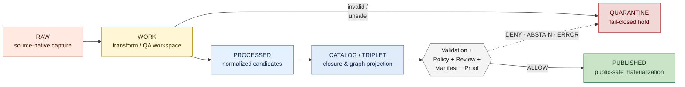
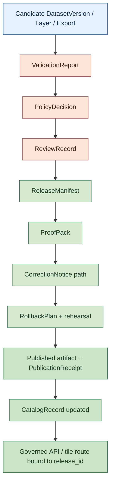
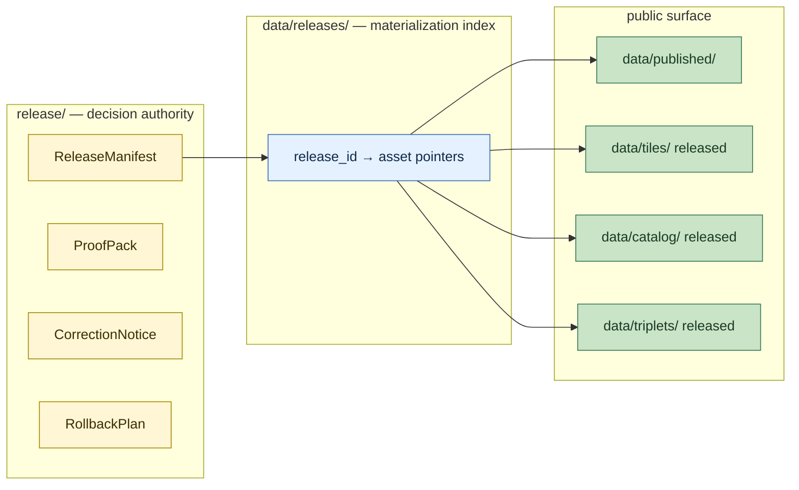

<!-- [KFM_META_BLOCK_V2]
doc_id: kfm://doc/<TODO-uuid>
title: Lifecycle Law
type: standard
version: v1
status: draft
owners: <TODO: doctrine maintainers (e.g., Governance Steward + Release Authority + Data Lifecycle Steward)>
created: 2026-05-12
updated: 2026-05-12
policy_label: public
related:
  - docs/doctrine/corrections-first-class.md
  - docs/doctrine/ai-as-assistant.md
  - docs/doctrine/authority-ladder.md
  - docs/doctrine/derived-stays-derived.md
  - docs/doctrine/trust-posture.md
  - docs/doctrine/truth-labels.md
  - docs/doctrine/evidence-model.md
  - docs/architecture/release-and-publication.md
  - schemas/contracts/v1/release_manifest.schema.json
  - schemas/contracts/v1/proof_pack.schema.json
  - data/raw/
  - data/work/
  - data/quarantine/
  - data/processed/
  - data/catalog/
  - data/triplets/
  - data/tiles/
  - data/releases/
  - data/receipts/
  - data/proofs/
  - data/published/
  - data/fixtures/
  - release/
tags: [kfm, doctrine, lifecycle, pipeline, release, governance, trust]
notes:
  - Codifies the RAW → WORK/QUARANTINE → PROCESSED → CATALOG/TRIPLET → PUBLISHED invariant.
  - Codifies publication as a governed state transition (not a copy or file move).
  - Codifies the two-tier release pattern (/release as decision authority; /data/releases as materialization index).
  - Foundational sibling doctrine for corrections-first-class, ai-as-assistant, authority-ladder, derived-stays-derived.
  - All concrete file paths, schema paths, runbook paths, and CI job names are PROPOSED until verified against the live repository.
[/KFM_META_BLOCK_V2] -->

# Lifecycle Law

> **The shape of data movement inside Kansas Frontier Matrix — what each stage means, what each stage may expose, what each stage must record, and why publication is a state transition rather than a copy.**


<!-- TODO — wire repo-level Shields endpoints (CI status, doctrine-coverage) when the doctrine-doc workflow is verified. -->

**Status:** Draft · **Owners:** _TODO — Governance Steward + Release Authority + Data Lifecycle Steward_ <sub>NEEDS VERIFICATION</sub> · **Last updated:** 2026-05-12

> [!IMPORTANT]
> **Lifecycle Law is foundational doctrine.** Several sibling doctrine docs — [`corrections-first-class.md`](./corrections-first-class.md), [`ai-as-assistant.md`](./ai-as-assistant.md), [`authority-ladder.md`](./authority-ladder.md), [`derived-stays-derived.md`](./derived-stays-derived.md) — operationalize rules that this document fixes. Changes to the invariant, the stage names, or the publication transition require an ADR and cascade through every sibling doc.

---

## Contents

1. [Why this is doctrine](#1-why-this-is-doctrine)
2. [The lifecycle invariant](#2-the-lifecycle-invariant)
3. [Stage definitions](#3-stage-definitions)
4. [Per-stage exposure, receipts, and failure disposition](#4-per-stage-exposure-receipts-and-failure-disposition)
5. [Data directory layout](#5-data-directory-layout)
6. [Publication as a governed state transition](#6-publication-as-a-governed-state-transition)
7. [The two-tier release pattern](#7-the-two-tier-release-pattern)
8. [Failure dispositions and policy outcomes](#8-failure-dispositions-and-policy-outcomes)
9. [Relationship to the evidence model](#9-relationship-to-the-evidence-model)
10. [Doctrine connections](#10-doctrine-connections)
11. [Validation and tests](#11-validation-and-tests)
12. [Acceptance checklist](#12-acceptance-checklist)
13. [Anti-patterns](#13-anti-patterns)
14. [FAQ](#14-faq)
15. [Related docs](#related-docs)

---

## 1. Why this is doctrine

A system that publishes evidence must be able to say, for any artifact reachable from a public URL, exactly how that artifact came to be. Without a fixed shape for data movement, "publication" decays into "whatever ended up in the last folder," lineage becomes hopeful rather than structural, and corrections, withdrawals, and rollback have no surface to act on.

Lifecycle Law fixes that shape. Three commitments follow from it:

1. **Stages are kinds, not directories.** A folder named `data/processed/` is the *materialization* of the `PROCESSED` stage; the stage itself is a typed contract about what may live there, who may write to it, who may read it, and what receipt accompanies it. The folder serves the stage, not the other way around.
2. **Publication is a transition, not a copy.** Becoming `PUBLISHED` requires validation, policy, review, manifest, proof, and a declared correction and rollback path. A successful build that lacks any of these is not publication; it is a candidate that happens to have a path. `[CONFIRMED doctrine.]`
3. **The invariant is one-way.** Data moves rightward through the pipeline. Material does not "return to RAW" once derived (see [`derived-stays-derived.md`](./derived-stays-derived.md)). Rollback retires a release; it does not unwind the lineage that produced it.

> [!NOTE]
> **What this doctrine does NOT decide.** It does not pick file formats, schemas, CRSes, or storage backends. Those belong to lower-tier docs: contracts, schemas, ADRs. Lifecycle Law fixes the *shape of the transitions* between stages; how each stage is materialized is an implementation choice constrained by — but not specified by — this doc.

[⬆ Back to top](#lifecycle-law)

---

## 2. The lifecycle invariant

Every piece of data that enters Kansas Frontier Matrix traverses the same five-stage spine. The names below are **preserved verbatim from project doctrine** and MUST NOT be paraphrased, lowercased, or substituted with generic equivalents (e.g., "intake" / "staging" / "production"):

```text
RAW → WORK / QUARANTINE → PROCESSED → CATALOG / TRIPLET → PUBLISHED
```

`[CONFIRMED doctrine.]` This invariant is the foundational constraint cited by sibling doctrine docs; it is the data-side counterpart to the [authority ladder](./authority-ladder.md) that governs documentation and decisions.



> [!CAUTION]
> The transition labelled **GATE** is not a folder. It is the governed state transition described in [§6](#6-publication-as-a-governed-state-transition). Treating it as "the act of writing into `data/published/`" is a build-stop defect.

### 2.1 What the invariant guarantees

| Guarantee | What it means | Where it is enforced |
|---|---|---|
| **One-way flow** | Data moves rightward; no stage re-labels an upstream artifact. | `derived-stays-derived` doctrine; validators (PROPOSED). |
| **Fail-closed branching** | The only branch off the spine is into `QUARANTINE`. There is no "publish anyway" path. | Policy gates (PROPOSED); CI `policy-tests` (PROPOSED). |
| **No public stage before `PUBLISHED`** | `RAW`, `WORK`, `QUARANTINE`, `PROCESSED`, and the unreleased portion of `CATALOG`/`TRIPLET` are non-public. | Policy `DENY policy.no_raw_public`; route-level checks. |
| **Receipt at every stage** | Each stage has a typed receipt (`IntakeReceipt`, `TransformReceipt`, …). Movement without a receipt is a defect. | Schema validators (PROPOSED). |
| **Manifest at publication** | A `ReleaseManifest` and `ProofPack` are necessary conditions for `PUBLISHED`. | Release gate (PROPOSED); `release-dry-run` CI job. |

[⬆ Back to top](#lifecycle-law)

---

## 3. Stage definitions

Each stage is a typed contract. The required receipt is the artifact whose existence proves the stage transition occurred under governance.

### 3.1 `RAW` — source-native capture

**Purpose.** Hold ingested data exactly as the source delivered it. RAW is the only stage classified as *original*; every later stage is derived from it.

- **Writers.** Connectors operating under an approved `SourceDescriptor`.
- **Readers.** Steward roles only. No public reach.
- **Required receipt.** `IntakeReceipt` (hash, retrieval time, `spec_hash`, `source_id`).
- **Mutation rule.** Append-only. RAW artifacts are not edited in place; corrections produce new RAW captures, not rewrites.
- **Failure outcome.** `ERROR` or `QUARANTINE` on hash mismatch, schema-spec mismatch, or rights/sensitivity ambiguity.

`[CONFIRMED doctrine.]` The "no live connector first" rule applies: the first implementation increment uses fixtures and no-network source descriptors; live activation requires explicit reviews.

### 3.2 `WORK` — transform and QA workspace

**Purpose.** Carry out the transformations that turn source-native captures into normalized candidates: CRS reprojection, unit harmonization, schema mapping, time normalization, deduplication, joining.

- **Writers.** Pipeline steps and operator scripts. Manual edits MUST be recorded as derivation steps; they are never silent.
- **Readers.** Steward roles only.
- **Required receipt.** `TransformReceipt` (inputs, transformation identity, output, parameters).
- **Failure outcome.** Failed transforms route to `QUARANTINE`. There is no in-place "fix and continue."

### 3.3 `QUARANTINE` — fail-closed hold

**Purpose.** Hold any artifact that failed validation, policy, sensitivity, or rights review. `QUARANTINE` is a one-way detour from `WORK` (and, by escalation, from any later stage where a defect is detected).

- **Writers.** Pipeline + policy gates.
- **Readers.** Steward + reviewer roles. Public DENY.
- **Required receipt.** `QuarantineReceipt` (reason, originating stage, evidence pointers).
- **Release rule.** Material leaves `QUARANTINE` only via **reprocessing plus review**. Pipelines cannot promote a quarantined artifact directly.

> [!WARNING]
> A pipeline path that lets `QUARANTINE` artifacts re-enter `PROCESSED` without an explicit review record is a doctrine violation. The shortcut is the defect.

### 3.4 `PROCESSED` — normalized candidates

**Purpose.** Hold validated, normalized objects that are eligible to become release candidates. `PROCESSED` is the last stage before catalog closure.

- **Writers.** Pipeline.
- **Readers.** Steward roles. Public DENY until release.
- **Required receipts.** `ProcessingReceipt` **plus** `ValidationReport`. Both are necessary; one is not enough.
- **Failure outcome.** Rollback to prior `DatasetVersion`; failed candidates may be re-quarantined.

### 3.5 `CATALOG / TRIPLET` — closure and graph projection

**Purpose.** Two paired projections of the same governed truth:
- **`CATALOG`** — record-shaped projection (datasets, layers, exports) with closure manifests that resolve to evidence.
- **`TRIPLET`** — graph-shaped projection (subject–predicate–object edges) of released claims and relationships.

- **Writers.** Catalog and graph build steps.
- **Readers.** Public **only for released records / edges**; unreleased material is steward-only.
- **Required receipts.** `CatalogBuildReceipt` (catalog side); `GraphBuildReceipt` (triplet side).
- **Failure outcome.** Withdraw / supersede the record on the catalog side; rebuild from canonical release on the triplet side.

> [!NOTE]
> The slash in `CATALOG / TRIPLET` is doctrinal. They are paired projections of the same stage, not two alternative stages.

### 3.6 `PUBLISHED` — public-safe materialization

**Purpose.** The public surface. Only material that has cleared the full eleven-step transition lives here.

- **Writers.** Release authority **only** — never pipelines acting alone.
- **Readers.** Public, via governed routes.
- **Required receipt.** `PublicationReceipt` accompanying a backing `ReleaseManifest` and `ProofPack`.
- **Failure outcome.** Withdrawal or supersession **with public notice**, per [`corrections-first-class.md`](./corrections-first-class.md).

[⬆ Back to top](#lifecycle-law)

---

## 4. Per-stage exposure, receipts, and failure disposition

The table below is the canonical summary. It is preserved verbatim from project doctrine `[CONFIRMED]`, and is the reference for the `path-policy-checks`, `forbidden-exposure-checks`, and `schema-validation` CI jobs `[PROPOSED]`.

| Stage path | Public exposure | Required receipt | Failure disposition |
|---|:---:|---|---|
| `data/raw` | DENY | `IntakeReceipt` | Quarantine batch by receipt. |
| `data/work` | DENY | `TransformReceipt` | Failed transforms → `QUARANTINE`. |
| `data/quarantine` | DENY | `QuarantineReceipt` | Release only via reprocessing + review. |
| `data/processed` | DENY | `ProcessingReceipt` + `ValidationReport` | Rollback to prior `DatasetVersion`. |
| `data/catalog` | RELEASED ONLY | `CatalogBuildReceipt` | Withdraw / supersede record. |
| `data/triplets` | RELEASED ONLY | `GraphBuildReceipt` | Rebuild from canonical release. |
| `data/tiles` | RELEASED ONLY | `TileBuildReceipt` | Rollback manifest + invalidate cache. |
| `data/releases` | RELEASED ONLY | `ReleaseDataReceipt` | Rollback by release authority. |
| `data/receipts` | SUMMARIZED ONLY | (the receipt itself) | Corrections add new records (append-only). |
| `data/proofs` | RELEASED ONLY | `ProofPack` | Proof rolls back with release. |
| `data/published` | PUBLIC | `PublicationReceipt` | Withdraw / supersede **with notice**. |
| `data/fixtures` | PUBLIC-SAFE | `FixtureReceipt` *(optional)* | Replace via changelog. |

> [!TIP]
> "RELEASED ONLY" means the **subset** of records in that directory that belong to an approved `ReleaseManifest` is public; the rest is not. This is enforced at the route, not the directory — see [§7](#7-the-two-tier-release-pattern).

[⬆ Back to top](#lifecycle-law)

---

## 5. Data directory layout

The directory layout that materializes the invariant is shown below. `[CONFIRMED at doctrine level; concrete tree on disk is PROPOSED until verified against the live repository.]`

```text
data/
├── raw/            # source-native capture; DENY public exposure
├── work/           # transform / QA workspace; DENY public exposure
├── quarantine/     # fail-closed hold; DENY public exposure
├── processed/      # normalized candidates; not public until promoted
├── catalog/        # catalog records; public only after release
├── triplets/       # graph projections; public only for released edges
├── tiles/          # rebuildable map tile artifacts; public only after release
├── releases/       # data-side release materialization index (NOT release authority)
├── receipts/       # process memory; public only as summarized
├── proofs/         # proof artifacts and integrity evidence
├── published/      # public-safe materialized output
└── fixtures/       # data-local fixtures for lifecycle tests
```

> [!IMPORTANT]
> `data/releases/` is **not** the release decision authority. The decision authority lives at the root `release/` directory. Conflating the two is the canonical anti-pattern called out in [§7](#7-the-two-tier-release-pattern) and is repeated in [`corrections-first-class.md`](./corrections-first-class.md).

<details>
<summary><strong>Why every directory has a README</strong> — orientation, scope, and exclusions</summary>

Each `data/<stage>/` directory carries a `README.md` that declares:

- **Scope.** What this stage is for, restated in directory-local terms.
- **Inputs.** What is allowed to be written here, by which writers, with which receipt.
- **Exclusions.** What does NOT belong here and where it goes instead.
- **Exposure rule.** The public-exposure cell from the table in [§4](#4-per-stage-exposure-receipts-and-failure-disposition).
- **Failure disposition.** What happens when validation, policy, or review fails at this stage.

This is the README-like doc rule from project doctrine — directory READMEs are themselves doctrine touchpoints, not decoration.

</details>

[⬆ Back to top](#lifecycle-law)

---

## 6. Publication as a governed state transition

`[CONFIRMED doctrine.]` Something becomes `PUBLISHED` only through an explicit, governed transition. **Successful ingestion, transformation, cataloging, graph loading, tile building, or report generation is not publication.** A successful build with no release manifest is a candidate. A build with a manifest but no review is a candidate. A build with all artifacts but no declared correction or rollback path is a candidate.

### 6.1 The eleven-step transition

`[CONFIRMED doctrine.]` Reproduced verbatim from project doctrine. The canonical state-machine drawing lives in [`docs/architecture/release-and-publication.md`](../architecture/release-and-publication.md) `[NEEDS VERIFICATION — exact path]`; this section is the doctrinal foothold.

| # | Step | Artifact produced | Failure outcome |
|---:|---|---|---|
| 1 | **Candidate artifact** — pipeline emits a candidate `DatasetVersion` / layer / export plus receipts. Candidate has no public route. | Candidate + receipts | n/a |
| 2 | **Validation report** — validators run; failures are reason-coded. | `ValidationReport` | `ABSTAIN` / `ERROR` on failure |
| 3 | **Policy decision** — policy evaluates rights, sensitivity, source role, exposure, review requirements. | `PolicyDecision` | `DENY` / `ABSTAIN` / `ERROR` |
| 4 | **Human / steward review** — risk-appropriate review record created and signed. | `ReviewRecord` | `DENY release.unreviewed` |
| 5 | **Release manifest** — lists assets, hashes, scope, evidence, policy, review, correction, rollback. Closure validates. | `ReleaseManifest` | `ERROR system.integrity_failure` |
| 6 | **Proof pack** — bundles validation, policy, evidence, integrity, review, manifest. Closure validates. | `ProofPack` | `ERROR system.integrity_failure` |
| 7 | **Published artifact** — assets materialized under `data/published/` or served by a governed service. | Published artifact + `PublicationReceipt` | rollback if integrity check fails |
| 8 | **Catalog update** — `CatalogRecord` release state updated; public catalog links to manifest / proof / evidence. | Updated `CatalogRecord` | withdraw / supersede |
| 9 | **API / map availability** — public API / layer registry / tile service point to the release id. No raw or candidate path exposed. | Route binding | rollback API pointer |
| 10 | **Correction path** — `CorrectionNotice` path is visible. A user can report a correction or see a supersession from the public artifact. | Correction route + UI surface | `ERROR if a published artifact lacks a correction path` |
| 11 | **Rollback path** — `RollbackPlan` and `target_release_id` are ready; a rollback rehearsal exists. | `RollbackPlan` + rehearsal artifact | `DENY release.unreviewed` |

> [!IMPORTANT]
> Steps 10 and 11 are the **foothold of [`corrections-first-class.md`](./corrections-first-class.md)**. A `ReleaseManifest` missing `correction_path` or `rollback_target` is `DENY release.unreviewed` — the release does not happen.

### 6.2 What the transition produces



[⬆ Back to top](#lifecycle-law)

---

## 7. The two-tier release pattern

`[CONFIRMED doctrine.]` KFM separates **release decision authority** from **release materialization**. The two live in different roots and play different roles. Conflating them is the most common structural defect this doctrine prevents.

| Aspect | `release/` (root) | `data/releases/` |
|---|---|---|
| **Role** | Decision authority. | Materialization index. |
| **Contents** | `ReleaseManifest`, `ProofPack`, `CorrectionNotice`, `RollbackPlan`, supersession records. | Pointers from `release_id` to the published assets in `data/published/`, `data/tiles/`, `data/catalog/`, `data/triplets/`. |
| **Writers** | Release authority + steward review process. | Pipelines, after step 6 of the eleven-step transition. |
| **Authority** | Tier 1 doctrine artifacts. | Derived index; rebuildable. |
| **What it fixes** | *Whether a release exists, what it asserts, and how it can be corrected or rolled back.* | *Where to find the assets a release has approved.* |
| **What happens if conflated** | Either pipelines bypass review (if `data/releases/` becomes authority) or release authority scatters across data layers (if `release/` becomes a data folder). | Same defect, opposite direction. |

> [!CAUTION]
> A change that writes a new `ReleaseManifest` under `data/releases/` instead of `release/`, or that lets a pipeline emit a `ReleaseManifest` without traversing the eleven-step transition, is a **build-stop defect**, not a configuration issue.



[⬆ Back to top](#lifecycle-law)

---

## 8. Failure dispositions and policy outcomes

`[CONFIRMED doctrine.]` The lifecycle is fail-closed. Each stage has a defined disposition for the policy outcomes that block forward movement.

| Outcome | Meaning | Where it appears |
|---|---|---|
| **`DENY`** | The action is refused for a known policy reason. | Public-RAW reach, sensitive geometry, unreviewed release, direct public model bypass, unclear rights. |
| **`ABSTAIN`** | The system declines to act because evidence is missing, stale, or under review. | Missing citation, `evidence.under_review`, freshness window exceeded. |
| **`ERROR`** | A system integrity failure. The pipeline halts and emits an operator alert. | Hash mismatch, manifest closure failure, rollback mismatch, integrity check failure. |
| **`STALE`** | The data is past its freshness window for the stage's purpose. | Cached tiles, search indexes, AI runtime evidence freshness. |

### 8.1 Canonical fail-closed mappings

`[CONFIRMED doctrine — verbatim from project policy register.]`

| Condition | Outcome |
|---|---|
| Sensitive geometry exposed | `DENY policy.sensitive_geometry` — no public publication. |
| Public RAW access | `DENY policy.no_raw_public` — no public publication. |
| Publication before review | `DENY release.unreviewed` — no public publication. |
| Direct model-client bypass | `DENY policy.no_public_model` — no public publication. |
| Missing citation | `ABSTAIN evidence.missing` — no public publication. |
| Invalid `spec_hash` | `ERROR system.integrity_failure` — no public publication. |
| Rollback mismatch | `ERROR system.integrity_failure` — operator alert. |
| Unsupported source authority | `DENY policy.rights_unclear` — no public publication. |
| Unreviewed correction | `DENY release.unreviewed` — no public publication. |
| Invalid release state | `DENY release.unpublished` — no public publication. |

> [!NOTE]
> `DENY`, `ABSTAIN`, `ERROR`, and `STALE` are **runtime outcomes**, not authoring confidences. They appear in `DecisionEnvelope`, audit logs, and UI states — never as a rhetorical hedge in prose. See [`authority-ladder.md §6`](./authority-ladder.md) for the distinction.

[⬆ Back to top](#lifecycle-law)

---

## 9. Relationship to the evidence model

Lifecycle Law fixes *where* data lives at each moment in its life. The evidence model fixes *how* claims about that data resolve to source.

| Object | Role | Stage of origin | Public visibility |
|---|---|---|---|
| `SourceDescriptor` | Declared identity of an external source, with rights, sensitivity, role, cadence. | Pre-`RAW`. | Summary public. |
| `IntakeReceipt` | Proof that a `RAW` capture occurred under an approved descriptor. | `RAW`. | DENY (summarized only). |
| `TransformReceipt` | Proof that a `WORK` transformation occurred. | `WORK`. | DENY (summarized only). |
| `ValidationReport` | Result of validator suite at promotion. | `PROCESSED`. | Summary public. |
| `PolicyDecision` | Rights / sensitivity / role / exposure decision at promotion. | `PROCESSED` → release gate. | Summary public. |
| `EvidenceRef` | Pointer from a claim to its supporting evidence. | `PROCESSED` onward. | Public when resolved + safe. |
| `EvidenceBundle` | Closure of an `EvidenceRef`: the resolved set of sources, receipts, validators, and policy that back a claim. | `CATALOG / TRIPLET`. | Public when released + safe. |
| `ReleaseManifest` | The decision artifact that asserts a release exists, lists its assets, and declares its correction and rollback paths. | Release gate. | Public. |
| `ProofPack` | Closure of `ReleaseManifest`: validation + policy + evidence + integrity + review. | Release gate. | Public when released. |
| `CorrectionNotice` | Named, schema-bearing record of a post-release change. | Post-`PUBLISHED`. | Public at a stable URL. |
| `RollbackPlan` | Declared path to revert a release to a `target_release_id`. | Release gate (pre-release readiness). | Summary public. |
| `PublicationReceipt` | Proof that a `PUBLISHED` materialization happened under a `ReleaseManifest`. | `PUBLISHED`. | Public. |

> [!IMPORTANT]
> Every public claim either resolves through an `EvidenceRef` to an `EvidenceBundle` rooted in `RAW`, or it abstains. This is the *citation closure rule*, codified in [`evidence-model.md`](./evidence-model.md) `[PROPOSED path]` and enforced at every transition.

[⬆ Back to top](#lifecycle-law)

---

## 10. Doctrine connections

Lifecycle Law is the data-side doctrine that other doctrine docs hook into. The matrix below shows what each sibling doctrine extends, restricts, or operationalizes.

| Sibling doctrine | Hooks into Lifecycle Law at | Extends or restricts |
|---|---|---|
| [`corrections-first-class.md`](./corrections-first-class.md) | Steps 10 + 11 of the eleven-step transition. | **Extends** — adds named operations (`CorrectionNotice`, `SupersessionRecord`, `RollbackPlan`, withdrawal) and a public notice path. `[CONFIRMED sibling.]` |
| [`ai-as-assistant.md`](./ai-as-assistant.md) | `EvidenceBundle` resolution; the policy gate (step 3). | **Restricts** — AI may not publish, supersede, or rollback; AI outputs are not citation sources. `[CONFIRMED sibling.]` |
| [`authority-ladder.md`](./authority-ladder.md) | Doctrine governance over the invariant itself. | **Orthogonal** — the lifecycle governs *data*; the authority ladder governs *documentation, decisions, claims*. They collaborate at publication (a `ReleaseManifest` is grounded by both). `[CONFIRMED sibling.]` |
| [`derived-stays-derived.md`](./derived-stays-derived.md) | The derivation boundary between `RAW` and `WORK/QUARANTINE`. | **Restricts** — derivation is monotonic; no later stage may relabel an artifact as `RAW`. `[CONFIRMED sibling.]` |
| [`trust-posture.md`](./trust-posture.md) `[NEEDS VERIFICATION — exact filename]` | Cite-or-abstain at every public surface. | **Extends** — defines how missing or stale evidence yields `ABSTAIN`. |
| [`truth-labels.md`](./truth-labels.md) `[PROPOSED]` | The runtime outcomes (`DENY`, `ABSTAIN`, `ERROR`, `STALE`). | **Defines** — fixes the vocabulary the lifecycle emits. |
| [`evidence-model.md`](./evidence-model.md) `[PROPOSED]` | `EvidenceRef` / `EvidenceBundle` semantics. | **Extends** — specifies how claims close to source through the lifecycle. |

[⬆ Back to top](#lifecycle-law)

---

## 11. Validation and tests

All validators and CI jobs below are **PROPOSED to create**. The greenfield baseline makes CI deterministic, no-network by default, and fail-closed. `[CONFIRMED at doctrine level; concrete job names and paths are PROPOSED until verified against `.github/workflows/`.]`

| CI job | Purpose | Acceptance gate |
|---|---|---|
| `schema-validation` | Validate stage receipt schemas and fixtures. | Valid fixtures pass; invalid fixtures fail for the expected reason. |
| `policy-tests` | Run policy positive / negative tests for the failure dispositions in [§8](#8-failure-dispositions-and-policy-outcomes). | Unknown rights / sensitivity / source role fail closed. |
| `fixture-tests` | Run no-network fixture pipelines through every stage. | No live source calls. |
| `no-network-dry-run` | Execute the first proof slice without network. | Receipts, validation report, dry-run manifest produced. |
| `public-safe-api-contract-tests` | Validate public API envelopes do not expose `RAW`, `WORK`, `QUARANTINE`, candidate, or direct-model paths. | No raw / candidate / direct-model exposure. |
| `path-policy-checks` | Verify roots / lifecycle / domain placement against this doctrine. | Domain root folders and raw public paths fail. |
| `forbidden-exposure-checks` | Secret scan and sensitive geometry checks. | No secrets or restricted locations in public fixtures. |
| `release-dry-run` | Compile `ReleaseManifest` / `ProofPack` without publishing. | Manifest closure and rollback target exist. |
| `rollback-rehearsal` | Simulate rollback of the proof slice. | Rollback restores previous public pointer and emits notice. |
| `artifact-integrity` | Hash and verify artifacts / manifests. | Hash mismatch fails. |
| `reproducibility` | Rebuild derived outputs from same inputs. | Outputs match expected hashes or explain nondeterminism. |

> [!TIP]
> The `rollback-rehearsal` job is doctrinal, not optional. A release whose rollback has never been rehearsed has no rollback — see [`corrections-first-class.md`](./corrections-first-class.md).

[⬆ Back to top](#lifecycle-law)

---

## 12. Acceptance checklist

For any change that touches the lifecycle (new stage receipt, new pipeline step, new release route, new policy gate), all of the following SHOULD hold before merge. `[Mechanism: PROPOSED.]`

- [ ] The change preserves the `RAW → WORK/QUARANTINE → PROCESSED → CATALOG/TRIPLET → PUBLISHED` invariant verbatim.
- [ ] No stage name is paraphrased, lowercased, or substituted with a generic equivalent.
- [ ] The change does not introduce a public route into `RAW`, `WORK`, `QUARANTINE`, `PROCESSED`, or the unreleased portion of `CATALOG / TRIPLET`.
- [ ] Every new stage transition emits a typed receipt named in [§4](#4-per-stage-exposure-receipts-and-failure-disposition).
- [ ] Every new release path traverses the eleven-step transition in [§6.1](#61-the-eleven-step-transition).
- [ ] `ReleaseManifest` instances declare both `correction_path` and `rollback_target`.
- [ ] A rollback rehearsal artifact exists before public exposure.
- [ ] The change does not write `ReleaseManifest`, `ProofPack`, `CorrectionNotice`, or `RollbackPlan` under `data/releases/`.
- [ ] The change does not let `data/releases/` materialize a release that has not passed through `release/`.
- [ ] Failure dispositions match [§8.1](#81-canonical-fail-closed-mappings) — fail-closed by default.
- [ ] Sibling doctrine docs that hook into this lifecycle have been reviewed for breakage.

[⬆ Back to top](#lifecycle-law)

---

## 13. Anti-patterns

The list below names failure modes this doctrine is designed to prevent. Each one is a `DENY` or `ERROR` outcome, not a stylistic preference.

| Anti-pattern | Why it fails | Correct shape |
|---|---|---|
| Treating publication as `cp data/processed/* data/published/`. | Skips validation, policy, review, manifest, proof, correction, rollback — i.e., almost the whole transition. | Run the eleven-step transition. |
| Promoting from `QUARANTINE` directly to `PROCESSED`. | Bypasses the reprocessing + review rule. | Route through `WORK` again with a new `TransformReceipt`. |
| Writing a `ReleaseManifest` under `data/releases/`. | Conflates materialization with decision authority. | Write to `release/`; let `data/releases/` index pointers. |
| "Re-ingesting" a `PUBLISHED` artifact as a new `RAW`. | Severs the `EvidenceRef` chain; violates [`derived-stays-derived.md`](./derived-stays-derived.md). | Cite the existing release; do not round-trip. |
| Adding a public route that reads from `data/raw/` "because it's just a small slice." | `DENY policy.no_raw_public`. There is no slice rule. | Promote via the lifecycle; the public route reads only release-bound paths. |
| Editing a `RAW` capture in place to "fix a unit." | RAW is append-only; manual edits are derivations, not corrections of source. | Create a new RAW capture or a `WORK` artifact with a `TransformReceipt`. |
| Publishing a `ReleaseManifest` without `correction_path` or `rollback_target`. | `DENY release.unreviewed`. | Author the paths before publication; rehearse rollback. |
| Letting AI emit a `PolicyDecision` or `ReviewRecord`. | AI is assistant, not authority. | See [`ai-as-assistant.md`](./ai-as-assistant.md). |
| Storing release-affecting state in `data/receipts/` so a "rebuild" silently changes outputs. | Conflates process memory with decision authority. | Receipts are append-only; decisions belong in `release/`. |

[⬆ Back to top](#lifecycle-law)

---

## 14. FAQ

<details>
<summary><b>Why are stage names uppercased and slash-joined?</b></summary>

Because they are doctrine vocabulary, not folder names. `WORK/QUARANTINE` and `CATALOG/TRIPLET` are paired stages — the slash is meaningful. Lowercase `data/work/` and `data/quarantine/` are the *materializations* of those stages on disk. Drift on the casing is drift on the doctrine.

</details>

<details>
<summary><b>Can a single artifact ever live in two stages at once?</b></summary>

No. An artifact occupies exactly one stage at a time; movement between stages produces a new artifact (a new `DatasetVersion`, a new tile build, a new triplet snapshot) with its own receipt. "Promotion in place" is a phrase, not a mechanism.

</details>

<details>
<summary><b>What about emergency hot-fixes to a published asset?</b></summary>

There are no hot-fixes. A change to a `PUBLISHED` asset is a correction (`CorrectionNotice` + superseding release) or a withdrawal — both with public notice. See [`corrections-first-class.md`](./corrections-first-class.md). Speed is achieved by rehearsing the path, not by skipping it.

</details>

<details>
<summary><b>Does this doctrine apply to derived products like tiles and indexes?</b></summary>

Yes. Tiles, search indexes, graph projections, and exports are derived carriers. They live under `data/tiles/`, `data/triplets/`, `data/catalog/`, and `data/published/`, and they are public only for material bound to an approved `ReleaseManifest`. Rebuilding a tile is a derivation event with its own receipt — see [`derived-stays-derived.md`](./derived-stays-derived.md).

</details>

<details>
<summary><b>How does this interact with the authority ladder?</b></summary>

The two systems are orthogonal. The authority ladder governs *documentation, decisions, and claims*. The lifecycle invariant governs *data*. They meet at publication: a `ReleaseManifest` is a Tier 1 / Tier 2 artifact (per the authority ladder) that is also a step-5 product of the eleven-step transition (per this doctrine). See [`authority-ladder.md §7`](./authority-ladder.md).

</details>

<details>
<summary><b>What if a `SourceDescriptor` is revised after `RAW` capture?</b></summary>

The revision triggers a new `IntakeReceipt` against the new descriptor and produces a new `RAW` capture. The old capture remains; provenance grows, it does not reset. Downstream artifacts that need the new descriptor must re-derive through `WORK` and `PROCESSED`.

</details>

<details>
<summary><b>Can fixtures bypass the lifecycle?</b></summary>

Fixtures live in `data/fixtures/` and are public-safe by construction. They have an optional `FixtureReceipt` and they are replaceable via changelog. They are *not* a shortcut around the lifecycle — they are a parallel, no-network test surface used by `fixture-tests` and `no-network-dry-run`. A fixture cannot become a publication.

</details>

<details>
<summary><b>What if the eleven-step transition needs to change?</b></summary>

It changes through an ADR that touches this doctrine and every sibling doctrine doc that hooks into it. Silent edits are a doctrine violation. The transition is intentionally rigid; flexibility lives in *how* each step is implemented, not in *whether* a step exists.

</details>

[⬆ Back to top](#lifecycle-law)

---

## Related docs

> [!NOTE]
> The links below reflect the doctrine doc set as understood from KFM project evidence. Sibling doctrine docs already authored in the same convention are CONFIRMED siblings; doctrine docs that are referenced but not yet inspected are marked PROPOSED.

- [`docs/doctrine/corrections-first-class.md`](./corrections-first-class.md) — Operationalizes steps 10 + 11 of the eleven-step transition; defines `CorrectionNotice`, `SupersessionRecord`, `RollbackPlan`, withdrawal. `[CONFIRMED sibling.]`
- [`docs/doctrine/ai-as-assistant.md`](./ai-as-assistant.md) — AI boundary; AI may not publish, supersede, or rollback. `[CONFIRMED sibling.]`
- [`docs/doctrine/authority-ladder.md`](./authority-ladder.md) — Primary / Secondary / Tertiary hierarchy governing documentation, decisions, claims. `[CONFIRMED sibling.]`
- [`docs/doctrine/derived-stays-derived.md`](./derived-stays-derived.md) — Monotonic derivation across the pipeline. `[CONFIRMED sibling.]`
- [`docs/doctrine/trust-posture.md`](./trust-posture.md) — Cite-or-abstain rule at every public surface. `[NEEDS VERIFICATION — exact filename.]`
- [`docs/doctrine/truth-labels.md`](./truth-labels.md) — Definitions of `CONFIRMED`, `PROPOSED`, `NEEDS VERIFICATION`, `UNKNOWN`, `DENY`, `ABSTAIN`, `ERROR`, `STALE`. `[PROPOSED path.]`
- [`docs/doctrine/source-roles.md`](./source-roles.md) — Data source-role taxonomy (`authority`, `observation`, `context`, `model`, `aggregate`, `admin`, `candidate`). `[PROPOSED path.]`
- [`docs/doctrine/evidence-model.md`](./evidence-model.md) — `EvidenceRef`, `EvidenceBundle`, citation closure rule. `[PROPOSED path.]`
- [`docs/architecture/release-and-publication.md`](../architecture/release-and-publication.md) — Canonical state-machine drawing for the eleven-step transition. `[NEEDS VERIFICATION — exact path.]`
- [`docs/runbooks/RB-CORRECTION-ROUTINE.md`](../runbooks/RB-CORRECTION-ROUTINE.md) — Day-2 routine correction. `[TODO — confirm path.]`
- [`docs/runbooks/RB-ROLLBACK-EXECUTION.md`](../runbooks/RB-ROLLBACK-EXECUTION.md) — Day-2 rollback execution. `[TODO — confirm path.]`
- `schemas/contracts/v1/release_manifest.schema.json` — Machine-readable schema for `ReleaseManifest`. `[PROPOSED path.]`
- `schemas/contracts/v1/proof_pack.schema.json` — Machine-readable schema for `ProofPack`. `[PROPOSED path.]`
- `schemas/contracts/v1/intake_receipt.schema.json`, `transform_receipt.schema.json`, `processing_receipt.schema.json`, `validation_report.schema.json`, `policy_decision.schema.json`, `review_record.schema.json`, `publication_receipt.schema.json` — Per-stage receipt schemas. `[PROPOSED paths.]`
- `control_plane/policy_gate_register.yaml` — Machine-readable policy gates. `[NEEDS VERIFICATION — exact path.]`
- `.github/workflows/` — CI workflows that enforce the validators in [§11](#11-validation-and-tests). `[PROPOSED — workflow files not yet authored.]`
- ADR — *Two-tier release pattern: `/release` as authority vs. `/data/releases` as materialization*. `[TODO — ADR not yet authored.]`
- ADR — *Eleven-step publication transition*. `[TODO — ADR not yet authored.]`

---

<sub>**Last updated:** 2026-05-12 · **Version:** v1 (draft) · **Doctrine track:** `docs/doctrine/`</sub>

[⬆ Back to top](#lifecycle-law)
