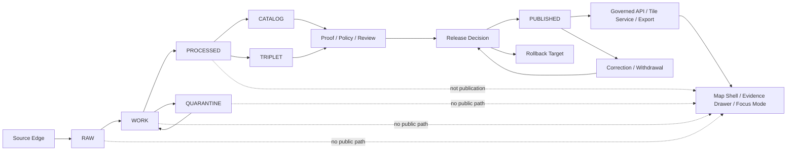

<!-- [KFM_META_BLOCK_V2]
doc_id: kfm://doc/NEEDS-VERIFICATION-docs-doctrine-lifecycle-law
title: Lifecycle Law
type: standard
version: v1
status: draft
owners: OWNER_TBD_NEEDS_VERIFICATION
created: NEEDS_VERIFICATION-YYYY-MM-DD
updated: 2026-05-06
policy_label: NEEDS_VERIFICATION
related: [../../README.md, ./README.md, ./truth-posture.md, ./trust-membrane.md, ../adr/ADR-0014-truth-path.md, ../runbooks/foundation-strategy.md, ../../pipelines/README.md]
tags: [kfm, doctrine, lifecycle, truth-path, promotion, publication, evidence, governance]
notes: [doc_id owner created date and policy label remain NEEDS VERIFICATION, revises existing lifecycle doctrine stub, enforcement maturity remains UNKNOWN until validators policies workflows releases and runtime paths are verified]
[/KFM_META_BLOCK_V2] -->

<a id="top"></a>

# Lifecycle Law

The governed path for moving KFM evidence from source capture to public-safe publication without weakening provenance, policy, review, correction, or rollback.

<div align="left">


</div>

> [!IMPORTANT]
> **Status:** `draft`  
> **Owners:** `OWNER_TBD_NEEDS_VERIFICATION`  
> **Target path:** `docs/doctrine/lifecycle-law.md`  
> **Owning root:** `docs/` — human-facing doctrine and control-plane explanation.  
> **Doctrine confidence:** `CONFIRMED` from KFM corpus and adjacent repo docs.  
> **Implementation confidence:** `UNKNOWN / NEEDS VERIFICATION` until active checkout tests, policies, schemas, workflows, release objects, and runtime behavior are inspected.

## Quick jumps

| Doctrine | Operations | Review |
|---|---|---|
| [Lifecycle law](#lifecycle-law-1) | [Allowed transitions](#allowed-transitions) | [Review checklist](#review-checklist) |
| [Repo fit](#repo-fit) | [Minimum lifecycle record](#minimum-lifecycle-record) | [Open verification](#open-verification) |
| [Lifecycle map](#lifecycle-map) | [Publication gates](#publication-gates) | [Rollback and correction](#rollback-and-correction) |
| [State rules](#state-rules) | [Validation targets](#validation-targets) | [Related doctrine](#related-doctrine) |
| [Trust membrane](#trust-membrane) | [Anti-patterns](#anti-patterns) | [Glossary](#glossary) |

---

## Lifecycle law

```text
SOURCE EDGE -> RAW -> WORK / QUARANTINE -> PROCESSED -> CATALOG / TRIPLET -> PUBLISHED
```

KFM’s lifecycle is a **governed truth path**, not a folder naming convention.

A source capture, transform, model output, tile, graph edge, map popup, dashboard value, Focus Mode answer, export, or story node does not become public truth merely because it exists. It becomes publishable only after the evidence, source role, rights, sensitivity, validation, policy, review, release state, correction path, and rollback target are strong enough for the requested exposure.

### Operating rule

> KFM may expose a consequential public or semi-public claim only when the claim is downstream of governed lifecycle state and can resolve to inspectable evidence.

When that cannot be proven, the correct outcome is one of:

| Outcome | Meaning |
|---|---|
| `ABSTAIN` | Support is incomplete, ambiguous, stale, or not strong enough. |
| `DENY` | Policy, rights, sensitivity, role, access, or public-safety rules block exposure. |
| `ERROR` | A system, schema, validation, release, or runtime failure prevents trustworthy handling. |

[Back to top](#top)

---

## Repo fit

`docs/doctrine/lifecycle-law.md` belongs under `docs/doctrine/` because lifecycle law is human-facing doctrine that governs how maintainers reason about evidence movement, promotion, publication, rollback, and public trust.

| Relationship | Path | Status | Role |
|---|---|---:|---|
| This document | `docs/doctrine/lifecycle-law.md` | `draft` | Canonical lifecycle doctrine note. |
| Doctrine index | [`./README.md`](./README.md) | `NEEDS VERIFICATION` | Local doctrine landing page. |
| Truth posture | [`./truth-posture.md`](./truth-posture.md) | `CONFIRMED file / minimal content` | Truth-label and finite-outcome companion. |
| Trust membrane | [`./trust-membrane.md`](./trust-membrane.md) | `CONFIRMED file / minimal content` | Public-claim and evidence-boundary companion. |
| Truth-path ADR | [`../adr/ADR-0014-truth-path.md`](../adr/ADR-0014-truth-path.md) | `draft / NEEDS VERIFICATION` | Architecture decision expanding public trust membrane. |
| Foundation strategy | [`../runbooks/foundation-strategy.md`](../runbooks/foundation-strategy.md) | `draft / NEEDS VERIFICATION` | Operational sequence for building the governance spine. |
| Pipeline README | [`../../pipelines/README.md`](../../pipelines/README.md) | `draft / NEEDS VERIFICATION` | Pipeline-facing lifecycle interpretation. |
| Root README | [`../../README.md`](../../README.md) | `draft / NEEDS VERIFICATION` | Repository-level identity and trust-law orientation. |

### Accepted inputs for this doctrine

This document may describe:

- lifecycle states and their public-exposure posture;
- lifecycle transition rules;
- promotion and publication gates;
- responsibilities across `docs/`, `data/`, `contracts/`, `schemas/`, `policy/`, `tests/`, `tools/`, `pipelines/`, `apps/`, and `release/`;
- required evidence, receipt, proof, catalog, release, correction, and rollback object families;
- negative states such as `ABSTAIN`, `DENY`, `ERROR`, quarantine, withdrawal, and rollback;
- review burden and implementation verification targets.

### Exclusions

This document must not become:

| Excluded item | Proper home |
|---|---|
| Machine-checkable schema authority | `schemas/` or the accepted schema home. |
| Semantic contract definitions | `contracts/`. |
| Executable policy | `policy/`. |
| Validator implementation | `tools/validators/` or repo-native equivalent. |
| Test fixtures | `fixtures/`, `tests/`, or accepted fixture roots. |
| Source records | `data/registry/`, `control_plane/`, or accepted source registry home. |
| Receipts, proofs, release manifests, rollback cards | `data/receipts/`, `data/proofs/`, `release/`, or accepted emitted-object homes. |
| Runtime API or UI implementation | `apps/`, `packages/`, `ui/`, `web/`, or accepted compatibility roots. |
| Proof of current enforcement | Tests, workflows, logs, releases, validators, or runtime traces. |

[Back to top](#top)

---

## Lifecycle map



The diagram is a trust model. It does not prove that any specific repository workflow, route, validator, schema, or release system currently enforces the model.

[Back to top](#top)

---

## State rules

| State | What belongs here | Required record | What must not happen here |
|---|---|---|---|
| `SOURCE EDGE` | Source discovery, source terms, source probes, endpoint metadata, steward constraints, source-intake notes. | `SourceDescriptor` or source-intake record. | Treating source availability as permission to publish. |
| `RAW` | Source-native captures, checksums, request parameters, source snapshots, immutable arrival evidence. | Intake receipt, source reference, checksum or digest where practical. | In-place mutation or public exposure. |
| `WORK` | Normalization, reprojection, cleaning, enrichment, joins, crosswalks, QA, temporary transform products. | Run receipt, transform parameters, tool/version capture, validation draft. | Public serving, silent overwrites, or promotion by convenience. |
| `QUARANTINE` | Failed validation, unresolved rights, unclear sensitivity, steward holds, low-confidence outputs, ambiguous joins, blocked source records. | Quarantine reason, failed gate, review need, remediation or denial path. | Deletion without disposition or use as pseudo-production. |
| `PROCESSED` | Normalized and validated candidate artifacts such as tables, GeoParquet, COGs, PMTiles, indexes, or domain objects. | Validation report, source refs, evidence refs, artifact digest. | Treating a valid transform as a published claim. |
| `CATALOG` | Metadata, dataset/layer records, STAC/DCAT/PROV-style closure, release-candidate descriptions. | Catalog record and provenance links. | Marking a version complete when catalog/provenance/evidence links are missing. |
| `TRIPLET` | Graph-ready or relationship projections for navigation, reasoning, and cross-domain discovery. | Evidence-backed relation record. | Replacing canonical evidence with graph convenience. |
| `PUBLISHED` | Public-safe released artifacts, governed API payloads, release-backed tiles, exports, and public evidence summaries. | Release manifest, proof support, policy decision, review state, correction path, rollback target. | Publication as file copy, silent replacement, or unreviewed model/map output. |

> [!NOTE]
> `CATALOG / TRIPLET` is a boundary for discoverability and linkage. It is not public authorization by itself.

[Back to top](#top)

---

## Trust membrane

Public and ordinary UI surfaces sit outside the lifecycle interior. They consume governed outputs only.

| Surface | Allowed lifecycle source | Denied shortcut |
|---|---|---|
| Public API response | Released or policy-safe governed payload. | Direct read from `RAW`, `WORK`, `QUARANTINE`, unpublished candidates, or internal canonical stores. |
| Map layer | Release-backed `LayerManifest` or equivalent public-safe artifact. | Direct source API, raw tile, raw raster, or unreviewed derivative. |
| Evidence Drawer | `EvidenceRef -> EvidenceBundle` closure with public-safe evidence summary. | Browser-side evidence assembly from internal stores. |
| Focus Mode / governed AI | Evidence-bounded context after policy and sensitivity checks. | Direct public model endpoint or uncited generated answer. |
| Export / report / story | Released content with evidence, policy, correction, and rollback linkage. | Static snapshot that hides source or release state. |
| Review console | Role-scoped governed review payloads. | Mixing steward-only material into public routes. |

### Cite-or-abstain rule

A claim that needs evidence must either resolve to support or return `ABSTAIN`, `DENY`, or `ERROR`.

```text
InspectableClaim
  -> EvidenceRef
  -> EvidenceBundle
  -> SourceDescriptor / Receipt / Catalog / Policy / Review / Release / Correction / Rollback
```

[Back to top](#top)

---

## Allowed transitions

| Transition | Allowed when | Evidence expected | Failure outcome |
|---|---|---|---|
| `SOURCE EDGE -> RAW` | Source has a declared intake basis and capture can be preserved. | Source descriptor or intake record; retrieval context; checksum where practical. | `DENY`, `ERROR`, or no capture. |
| `RAW -> WORK` | Raw capture is identifiable and transform is declared. | Intake receipt; transform plan; source ref. | `QUARANTINE` or `ERROR`. |
| `WORK -> PROCESSED` | Transform output passes shape, provenance, spatial, temporal, and domain validation. | Run receipt; validation report; artifact digest. | `QUARANTINE`. |
| `WORK -> QUARANTINE` | Rights, sensitivity, quality, source-role, schema, support, or transform checks fail or remain unresolved. | Quarantine reason; failed gate; review/remediation note. | Hold until review, remediation, or denial. |
| `QUARANTINE -> WORK` | A steward, maintainer, policy, or validator-authorized remediation path exists. | Review record; remediation receipt; updated validation result. | Stay quarantined. |
| `PROCESSED -> CATALOG` | Candidate can be described with source, time, space, provenance, and evidence links. | Catalog record; provenance links; evidence refs. | Hold in `PROCESSED` or quarantine. |
| `PROCESSED -> TRIPLET` | Relationship projection is evidence-backed and does not replace canonical truth. | Relation evidence; projection receipt; source refs. | `ABSTAIN`, `DENY`, or hold. |
| `CATALOG / TRIPLET -> PUBLISHED` | Promotion gate passes. | Policy decision; proof pack; release manifest; review state; correction path; rollback target. | Block promotion. |
| `PUBLISHED -> CORRECTED / WITHDRAWN / SUPERSEDED` | A published claim, artifact, or release must change. | Correction notice; affected release refs; successor/rollback refs. | Block silent overwrite. |

[Back to top](#top)

---

## Minimum lifecycle record

A lifecycle-bearing object should expose enough metadata to prove its state, support, and transition boundaries. Exact schema names and field names must follow the accepted schema and contract homes.

```json
{
  "id": "kfm://example/NEEDS-VERIFICATION",
  "lifecycle_state": "RAW | WORK | QUARANTINE | PROCESSED | CATALOG | TRIPLET | PUBLISHED",
  "source_refs": [],
  "evidence_refs": [],
  "artifact_digests": [],
  "spatial_scope": "NEEDS_VERIFICATION",
  "temporal_scope": "NEEDS_VERIFICATION",
  "rights_status": "unknown | restricted | public_allowed | denied",
  "sensitivity_status": "unknown | public_safe | restricted | generalized | denied",
  "validation_report_refs": [],
  "policy_decision_refs": [],
  "review_record_refs": [],
  "catalog_refs": [],
  "release_refs": [],
  "correction_refs": [],
  "rollback_refs": [],
  "status_reason": "NEEDS_VERIFICATION"
}
```

> [!CAUTION]
> A lifecycle record is not sufficient by itself. It must resolve to real evidence, receipts, policies, reviews, release records, and rollback targets before it can support public exposure.

[Back to top](#top)

---

## Publication gates

Publication is a governed state transition. It is not a folder move, tile upload, ETL success, map render, dashboard refresh, or model answer.

| Gate | Question | Required posture |
|---|---|---|
| Identity | Is the artifact or claim deterministically identifiable enough for review and rollback? | Stable ID, version, digest, or `spec_hash` where practical. |
| Source role | Is the source allowed to support this type of claim? | Source descriptor with authority limits and caveats. |
| Rights | Can KFM redistribute, expose, or summarize this material? | Rights status and attribution/terms captured. |
| Sensitivity | Could publication expose people, communities, locations, species, archaeology, infrastructure, or restricted steward data? | Public-safe transform, staged access, or denial. |
| Validation | Did schema, spatial, temporal, domain, and linkage checks pass? | Validation report and negative-path coverage. |
| Evidence closure | Can consequential claims resolve to evidence? | `EvidenceRef -> EvidenceBundle` closure. |
| Policy | Does policy allow this release and record obligations? | `PolicyDecision` with reasons and obligations. |
| Review | Has the right steward or maintainer class reviewed it? | Review record appropriate to consequence level. |
| Catalog/proof | Are catalog, provenance, proof, and release refs complete? | Catalog/proof closure and linked release candidate. |
| Correction | Can published errors be corrected visibly? | Correction path exists. |
| Rollback | Can release-facing material be withdrawn or reverted safely? | Rollback target exists. |

[Back to top](#top)

---

## Object-family obligations

| Object family | Lifecycle role |
|---|---|
| `SourceDescriptor` | Defines source identity, role, authority limits, rights, cadence, sensitivity, and activation posture. |
| `IntakeReceipt` / `IngestReceipt` | Records source-native capture and integrity at the source edge or raw boundary. |
| `RunReceipt` | Records transform or validation execution details without becoming truth by itself. |
| `ValidationReport` | Explains shape, linkage, spatial, temporal, domain, and fixture results. |
| `EvidenceRef` | Points from claim, artifact, layer, or relationship to supporting evidence. |
| `EvidenceBundle` | Packages inspectable support for visible claims. |
| `PolicyDecision` | Records allow, deny, restrict, abstain, or error decisions with reasons and obligations. |
| `ReviewRecord` | Captures steward, maintainer, source, policy, rights, or release review. |
| `CatalogRecord` | Describes discoverable dataset/layer/claim metadata and provenance. |
| `TripletProjection` | Carries graph relationships as evidence-backed derivatives. |
| `ProofPack` | Bundles validation, evidence, policy, integrity, and review support for release decisions. |
| `ReleaseManifest` | Defines the released artifact set, hashes, evidence, policy, review, correction, and rollback refs. |
| `LayerManifest` | Makes map-ready derivatives visibly downstream of evidence and release state. |
| `RuntimeResponseEnvelope` | Keeps API/UI/AI outputs finite and evidence-bound. |
| `CorrectionNotice` | Records public repair, withdrawal, supersession, or amended support. |
| `RollbackCard` / `RollbackPlan` | Defines safe reversion target and operational path. |

[Back to top](#top)

---

## Validation targets

> [!WARNING]
> Commands below are **PROPOSED validation targets**, not confirmed runnable commands. Use repo-native tooling and active ADR decisions.

| Target | Expected check |
|---|---|
| Lifecycle state enum | Only accepted lifecycle states are allowed. |
| Transition guard | Disallowed transitions fail closed. |
| Public path guard | Public/API/UI routes cannot read `RAW`, `WORK`, `QUARANTINE`, unpublished candidates, or direct model outputs. |
| Evidence closure | Public claims require `EvidenceRef -> EvidenceBundle`. |
| Source-role policy | A source cannot support a claim outside its declared role. |
| Rights and sensitivity | Unknown rights or sensitive exact exposure blocks public release. |
| Catalog/proof closure | Release candidates cannot publish with missing catalog/proof links. |
| Rollback requirement | Release candidates without rollback target fail. |
| Correction lineage | Published changes require correction or supersession records. |
| Derived-product boundary | Tiles, graph edges, indexes, summaries, and model outputs cannot declare themselves canonical proof. |

Illustrative check sequence:

```bash
# PROPOSED only; replace with repo-native commands after verification.
python tools/validators/validate_lifecycle_state.py --fixtures fixtures/
python tools/validators/validate_lifecycle_transitions.py --fixtures fixtures/
python tools/validators/validate_evidence_bundle.py --fixtures fixtures/
python tools/validators/validate_release_manifest.py --fixtures fixtures/
python tools/validators/check_no_public_internal_paths.py
python -m pytest tests/
```

[Back to top](#top)

---

## Anti-patterns

| Anti-pattern | Why it fails lifecycle law | Required correction |
|---|---|---|
| “The data is in `processed/`, so it is public.” | `PROCESSED` is not publication. | Add catalog/proof/policy/review/release gates. |
| “The map renders it, so it is true.” | Map layers are derived carriers. | Require release-backed layer manifest and evidence refs. |
| “The model explained it, so it is supported.” | AI is interpretive, not evidence. | Resolve EvidenceBundle and validate citations. |
| “The graph edge exists, so the relationship is canonical.” | Triplets are projections. | Attach evidence and source-role support. |
| “The source is public, so KFM can republish it.” | Public availability is not rights clearance. | Record rights and terms before release. |
| “Quarantine is just bad data.” | Quarantine preserves unresolved trust conditions. | Keep reason codes and remediation paths. |
| “Rollback means delete the new files.” | Rollback must preserve release and correction lineage. | Use rollback cards and correction notices. |
| “A fixture passed, so production is safe.” | Fixture proof is not source-rights or runtime proof. | Verify live source, policy, CI, and release environment. |

[Back to top](#top)

---

## Sensitive and rights-uncertain material

Lifecycle law is stricter when exposure can create harm.

| Material or risk | Default lifecycle posture |
|---|---|
| Unknown rights, terms, or attribution | Hold in `QUARANTINE` or block publication. |
| Living-person data | Deny public exposure unless explicitly reviewed and allowed. |
| DNA/genomic material | Restrict or deny by default. |
| Archaeological sites, sacred places, burials, cultural sensitivity | Deny exact public location by default. |
| Rare species, nests, dens, roosts, hibernacula, sensitive habitat | Generalize, restrict, or deny exact public location. |
| Critical infrastructure or security-sensitive facilities | Restrict, generalize, delay, or deny. |
| Emergency or life-safety requests | Direct users to official sources; KFM is not an emergency alert system. |
| Ambiguous spatial precision | Abstain, generalize, or deny precise assignment. |
| Stale operational context | Mark stale, abstain, or deny depending on consequence. |

[Back to top](#top)

---

## Rollback and correction

A release that cannot be corrected or rolled back is not lifecycle-complete.

### Correction rules

A correction must identify:

- affected claim, artifact, layer, release, or catalog record;
- original evidence support;
- changed evidence or policy condition;
- public-safe explanation;
- successor or supersession target;
- affected downstream surfaces;
- reviewer and decision date when required.

### Rollback rules

A rollback must identify:

- release manifest or artifact set being reverted;
- safe prior release or withdrawal target;
- integrity hashes or digests where practical;
- public surfaces to disable or replace;
- catalog, proof, API, tile, export, and UI impact;
- correction notice if public claims were affected.

```text
Published artifact changes
  -> CorrectionNotice
  -> affected ReleaseManifest
  -> successor or rollback target
  -> updated catalog/proof references
  -> public-safe notice when required
```

[Back to top](#top)

---

## Review checklist

<details>
<summary>Definition of done for lifecycle-sensitive changes</summary>

- [ ] Lifecycle state is explicit.
- [ ] Source role and authority limits are explicit.
- [ ] Rights posture is known or release is blocked.
- [ ] Sensitivity posture is known or release is blocked.
- [ ] Spatial and temporal scope are explicit.
- [ ] Validation report exists for promoted artifacts.
- [ ] `EvidenceRef -> EvidenceBundle` resolves for consequential public claims.
- [ ] `PolicyDecision` exists for public or semi-public exposure.
- [ ] Review state is appropriate to risk and consequence level.
- [ ] Catalog/triplet projections remain derivative and evidence-backed.
- [ ] Release manifest exists before publication.
- [ ] Correction path exists.
- [ ] Rollback target exists.
- [ ] Public clients do not bypass governed API or released artifacts.
- [ ] AI/model output remains evidence-subordinate.
- [ ] Negative outcomes are visible as `ABSTAIN`, `DENY`, `ERROR`, quarantine, withdrawal, or rollback.
- [ ] Related docs, contracts, schemas, policies, fixtures, validators, tests, and runbooks are updated or explicitly deferred.

</details>

[Back to top](#top)

---

## Open verification

| Item | Status | How to close |
|---|---:|---|
| Owner for this doctrine file | `NEEDS VERIFICATION` | Check CODEOWNERS, document registry, or maintainer assignment. |
| Created date | `NEEDS VERIFICATION` | Fill from Git history or document registry. |
| Policy label | `NEEDS VERIFICATION` | Confirm public/restricted label convention. |
| Doc registry entry | `NEEDS VERIFICATION` | Add or update `control_plane/document_registry.yaml` if active. |
| Related doctrine docs | `NEEDS VERIFICATION` | Confirm whether `authority-ladder.md` and AI/public-safety doctrine docs exist or are queued. |
| Lifecycle-state schema | `NEEDS VERIFICATION` | Confirm accepted schema home and lifecycle enum. |
| Transition validator | `UNKNOWN` | Inspect `tools/validators/` and tests for enforcement. |
| Public path guard | `UNKNOWN` | Inspect API/UI routes and CI checks. |
| Release manifest implementation | `UNKNOWN` | Inspect `release/`, `data/proofs/`, and generated artifacts. |
| Runtime behavior | `UNKNOWN` | Verify from tests, logs, dashboards, or running services only. |

[Back to top](#top)

---

## Related doctrine

| Topic | Relationship |
|---|---|
| Truth posture | Defines labels such as `CONFIRMED`, `PROPOSED`, `UNKNOWN`, `NEEDS VERIFICATION`, and finite negative outcomes. |
| Trust membrane | Defines why public value is the inspectable claim and why normal public surfaces must not bypass governed evidence. |
| ADR truth path | Records broader architecture decision context for lifecycle and public trust membrane. |
| Foundation strategy | Turns lifecycle law into an implementation sequence: control plane, source authority, core contracts, validators, policy, proof slice, release dry run. |
| Pipeline README | Applies lifecycle law to repeatable processing flows and dry-run promotion behavior. |
| Directory Rules | Places lifecycle doctrine under `docs/doctrine/` and keeps domain work beneath responsibility roots. |

[Back to top](#top)

---

## Glossary

| Term | Meaning |
|---|---|
| `SOURCE EDGE` | Boundary where KFM first encounters or evaluates a source before source-native capture. |
| `RAW` | Source-native, immutable capture with intake identity and integrity context. |
| `WORK` | Transform and QA area where data is still not public truth. |
| `QUARANTINE` | Fail-closed state for invalid, unsafe, ambiguous, restricted, or unresolved material. |
| `PROCESSED` | Normalized, validated candidate material that is still not necessarily published. |
| `CATALOG` | Metadata and provenance boundary for discoverability and release linkage. |
| `TRIPLET` | Evidence-backed graph or relationship projection. |
| `PUBLISHED` | Governed release state reachable through allowed public-safe surfaces. |
| `Promotion` | Reviewable state transition into publication eligibility. |
| `Correction` | Visible repair, amendment, withdrawal, or supersession of public truth. |
| `Rollback` | Auditable reversion or withdrawal path tied to release state. |
| `Inspectable claim` | Public or semi-public statement whose evidence, source role, spatial/temporal scope, policy posture, review/release state, and correction lineage can be inspected. |
