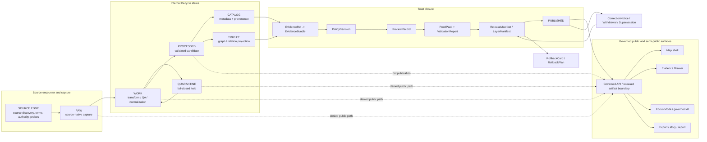

<!-- [KFM_META_BLOCK_V2]
doc_id: kfm://doc/NEEDS-VERIFICATION-docs-doctrine-lifecycle-law
title: Lifecycle Law
type: standard
version: v1
status: draft
owners: OWNER_TBD_NEEDS_VERIFICATION
created: CREATED_DATE_TBD_FROM_GIT_OR_DOC_REGISTRY
updated: 2026-05-06
policy_label: NEEDS_VERIFICATION
related: [../../README.md, ./README.md, ./authority-ladder.md, ./truth-posture.md, ./trust-membrane.md, ../adr/ADR-0014-truth-path.md, ../../policy/README.md, ../../pipelines/README.md]
tags: [kfm, doctrine, lifecycle, truth-path, promotion, publication, evidence, governance, correction, rollback]
notes: [doc_id owner created date policy label and publication status remain NEEDS VERIFICATION, revises existing lifecycle-law doctrine, enforcement maturity remains UNKNOWN until matching contracts schemas policies validators tests workflows release artifacts proof objects runtime behavior and UI states are verified]
[/KFM_META_BLOCK_V2] -->

<a id="top"></a>

# Lifecycle Law

The governed path for moving KFM material from source encounter to public-safe publication without weakening provenance, evidence, policy, review, correction, or rollback.

<p align="left">
  
  
  
  
  
  
  
</p>

> [!IMPORTANT]
> **Status:** `draft`  
> **Owners:** `OWNER_TBD_NEEDS_VERIFICATION`  
> **Path:** `docs/doctrine/lifecycle-law.md`  
> **Owning root:** `docs/` — human-facing doctrine and control-plane explanation.  
> **Doctrine confidence:** `CONFIRMED` from KFM corpus and current repo-facing doctrine.  
> **Implementation confidence:** `UNKNOWN / NEEDS VERIFICATION` until active-checkout contracts, schemas, policies, validators, fixtures, tests, workflows, release manifests, proof objects, runtime behavior, and UI states are inspected.

## Quick jumps

| Doctrine | Operations | Review |
|---|---|---|
| [Scope](#scope) | [Allowed transitions](#allowed-transitions) | [Review checklist](#review-checklist) |
| [Repo fit](#repo-fit) | [Promotion gates](#promotion-gates) | [Open verification](#open-verification) |
| [Lifecycle law](#lifecycle-law-1) | [Minimum transition evidence](#minimum-transition-evidence) | [Related doctrine](#related-doctrine) |
| [Law vs implementation](#law-vs-implementation) | [Validation targets](#validation-targets) | [Glossary](#glossary) |
| [Lifecycle map](#lifecycle-map) | [Anti-patterns](#anti-patterns) | [Back to top](#top) |

---

## Scope

Lifecycle law defines the **state path** by which KFM material becomes trustworthy enough to expose.

It applies to:

- source intake and source-native captures;
- transforms, joins, crosswalks, normalization, redaction, and derived products;
- catalogs, graph/triplet projections, tiles, search indexes, dashboards, stories, reports, exports, map layers, and Evidence Drawer payloads;
- Focus Mode and governed AI responses;
- publication, correction, withdrawal, supersession, rollback, and release review.

Lifecycle law is not a folder-naming preference. It is the KFM truth path.

> KFM may expose a consequential public or semi-public claim only when the claim is downstream of governed lifecycle state and can resolve to inspectable support.

[Back to top](#top)

---

## Repo fit

`docs/doctrine/lifecycle-law.md` belongs under `docs/doctrine/` because lifecycle law is stable, human-readable system doctrine. It explains how maintainers should reason about evidence movement, publication state, trust boundaries, correction, and rollback.

It must not become the executable schema registry, policy engine, validator implementation, source registry, proof archive, release directory, or runtime route definition.

### Upstream and adjacent surfaces

| Relationship | Path | Status | Role |
|---|---|---:|---|
| This document | `docs/doctrine/lifecycle-law.md` | `CONFIRMED path / draft doctrine` | Canonical lifecycle-law page for this doctrine slice. |
| Root orientation | [`../../README.md`](../../README.md) | `CONFIRMED path / draft authority` | Repository-level KFM identity, inspectable claim, lifecycle law, and responsibility roots. |
| Doctrine index | [`./README.md`](./README.md) | `CONFIRMED path` | Local doctrine navigation and input/exclusion rules. |
| Authority ladder | [`./authority-ladder.md`](./authority-ladder.md) | `CONFIRMED path / draft doctrine` | Defines what outranks what when doctrine, repo state, policy, or external facts disagree. |
| Truth posture | [`./truth-posture.md`](./truth-posture.md) | `CONFIRMED path / draft doctrine` | Truth labels and finite outcomes. |
| Trust membrane | [`./trust-membrane.md`](./trust-membrane.md) | `CONFIRMED path / draft doctrine` | Boundary between internal lifecycle states and public-facing surfaces. |
| Truth-path ADR | [`../adr/ADR-0014-truth-path.md`](../adr/ADR-0014-truth-path.md) | `CONFIRMED path / draft ADR` | Architecture decision expanding lifecycle and trust-membrane consequences. |
| Policy root | [`../../policy/README.md`](../../policy/README.md) | `CONFIRMED path / review doc` | Deny-by-default and policy decision surface. |
| Pipeline root | [`../../pipelines/README.md`](../../pipelines/README.md) | `NEEDS VERIFICATION` | Pipeline-facing lifecycle interpretation, if present on the active branch. |

### Accepted inputs

Use this document to describe:

| Accepted input | Belongs here when... |
|---|---|
| Lifecycle states | The rule affects movement from source encounter to publication. |
| Transition rules | A state change requires evidence, validation, policy, review, release, correction, or rollback support. |
| Public-exposure posture | A client, map, export, story, API, tile, graph, dashboard, or AI answer might expose material. |
| Negative outcomes | `ABSTAIN`, `DENY`, `ERROR`, `QUARANTINE`, restriction, generalization, withdrawal, or rollback must be visible. |
| Object-family obligations | A trust object is required to prove lifecycle state or a transition. |
| Review burden | A maintainer must know what evidence closes or blocks a lifecycle transition. |
| Anti-patterns | A common shortcut could weaken the trust membrane. |

### Exclusions

| Do not put here | Proper home | Reason |
|---|---|---|
| Machine-checkable schemas | `schemas/` or accepted schema home | Lifecycle law defines state obligations; schemas validate object shape. |
| Semantic object contracts | `contracts/` | Contracts define object meaning and compatibility. |
| Executable policy | `policy/` | Policy decides admissibility and obligations. |
| Validators | `tools/validators/`, `packages/`, or repo-native validator home | Validators prove lifecycle and transition rules. |
| Test fixtures | `fixtures/`, `tests/`, or accepted fixture home | Fixtures prove positive and negative cases. |
| Source descriptors | `data/registry/`, `control_plane/`, or accepted source registry home | Source authority and rights need structured records. |
| Receipts, proof packs, release manifests, rollback cards | `data/receipts/`, `data/proofs/`, `release/`, or accepted emitted-object homes | Emitted trust objects are audit artifacts, not doctrine pages. |
| API route handlers or UI components | `apps/`, `packages/`, `ui/`, `web/`, or accepted compatibility roots | Runtime code consumes doctrine; it does not own lifecycle law. |
| Private chain-of-thought | Do not store as KFM truth material | Generated reasoning is not a governed evidence object. |

[Back to top](#top)

---

## Lifecycle law

```text
SOURCE EDGE -> RAW -> WORK / QUARANTINE -> PROCESSED -> CATALOG / TRIPLET -> PUBLISHED
```

KFM’s lifecycle is a **governed truth path**, not a storage shuffle.

A source capture, cleaned table, graph edge, model output, tile, map popup, story node, export, dashboard, or Focus Mode answer does not become public truth merely because it exists. It becomes publishable only after the support chain is strong enough for the requested exposure.

### Operating rule

A lifecycle transition must be supported by the evidence and governance burden of the state it enters.

| If support is... | KFM should... |
|---|---|
| Sufficient and policy-safe | `ANSWER`, publish, or promote within scope. |
| Incomplete, ambiguous, stale, or weak | `ABSTAIN`, hold, or require review. |
| Blocked by rights, sensitivity, access, source role, public safety, review state, or release state | `DENY`, restrict, generalize, quarantine, or withdraw. |
| Broken by schema, resolver, validator, runtime, release, or integrity failure | `ERROR` and record repair path. |

[Back to top](#top)

---

## Law vs implementation

This doctrine can state lifecycle law confidently. It cannot, by itself, prove enforcement.

| Claim | Current posture | What would upgrade it |
|---|---:|---|
| KFM doctrine requires the lifecycle path from source encounter to publication. | `CONFIRMED` doctrine | Keep doctrine and ADRs synchronized. |
| `docs/doctrine/lifecycle-law.md` exists as a repo-facing doctrine file. | `CONFIRMED` path on inspected repo reference | Recheck on the target branch before merge. |
| Public clients must not bypass governed interfaces or released artifacts. | `CONFIRMED` doctrine / `PROPOSED` enforcement | Route guards, policy checks, tests, and runtime evidence. |
| Lifecycle transitions are enforced by validators. | `UNKNOWN` | Validator files, fixtures, test results, and CI evidence. |
| Release manifests, proof packs, receipts, correction notices, and rollback cards are emitted by current workflows. | `UNKNOWN` | Generated artifacts, workflow logs, release records, or runtime traces. |
| The active UI shows every lifecycle negative state correctly. | `UNKNOWN` | UI fixtures, component tests, screenshots, or reviewed runtime behavior. |

> [!WARNING]
> Do not use this doctrine page as proof that a route, workflow, validator, schema, release artifact, proof pack, dashboard, or runtime behavior currently exists.

[Back to top](#top)

---

## Lifecycle map



This diagram is a trust model. It does not prove that any specific route, validator, schema, workflow, release system, or UI currently enforces the model.

[Back to top](#top)

---

## State rules

| State | What belongs here | Required record | Public posture | What must not happen |
|---|---|---|---|---|
| `SOURCE EDGE` | Source discovery, terms, steward constraints, endpoint probes, access notes, source-role questions. | `SourceDescriptor`, source-intake record, or source authority note. | Not public truth. | Treating source availability as permission to publish. |
| `RAW` | Source-native captures, request parameters, checksums, source snapshots, immutable arrival evidence. | Intake or ingest receipt; source ref; checksum/digest where practical. | `DENY` public access by default. | In-place mutation or public exposure. |
| `WORK` | Normalization, reprojection, cleaning, enrichment, OCR, joins, crosswalks, redaction transforms, QA. | Run receipt, transform parameters, tool/version capture, draft validation result. | `DENY` public access by default. | Silent overwrite, unrecorded transform, or direct UI serving. |
| `QUARANTINE` | Failed validation, unresolved rights, unclear sensitivity, source-role ambiguity, steward hold, low-confidence output. | Quarantine reason, failed gate, reviewer/remediation need, denial or hold path. | `DENY`, except approved public-safe reason summaries. | Deletion without disposition or use as “almost production.” |
| `PROCESSED` | Normalized and validated candidate artifacts: tables, GeoParquet, COGs, PMTiles, indexes, domain objects. | Validation report, source refs, evidence refs, artifact digest. | Hold by default. | Treating validation as publication. |
| `CATALOG` | Metadata, dataset/layer records, STAC/DCAT/PROV-style closure, release-candidate descriptions. | Catalog record, provenance links, evidence refs. | Conditional; not release by itself. | Marking a version complete when catalog/provenance/evidence links are missing. |
| `TRIPLET` | Evidence-backed relationship projections for graph navigation, reasoning, and cross-domain discovery. | Relation record, evidence refs, projection receipt. | Conditional; not canonical truth by itself. | Replacing canonical evidence with graph convenience. |
| `PUBLISHED` | Public-safe released artifacts, governed API payloads, release-backed tiles, exports, stories, and evidence summaries. | Release manifest, proof support, policy decision, review state, correction path, rollback target. | Allowed through governed surfaces only. | Publication as file copy, tile upload, UI toggle, or unreviewed model output. |

> [!NOTE]
> `CATALOG / TRIPLET` enables discovery, linkage, and explanation. It is not public authorization by itself.

[Back to top](#top)

---

## Allowed transitions

| Transition | Allowed when | Required support | Failure outcome |
|---|---|---|---|
| `SOURCE EDGE -> RAW` | Source has an intake basis and capture can be preserved. | Source descriptor or intake record; retrieval context; integrity capture where practical. | `DENY`, `ERROR`, or no capture. |
| `RAW -> WORK` | Raw capture is identifiable and transform intent is declared. | Intake receipt; transform plan; source ref. | `QUARANTINE` or `ERROR`. |
| `WORK -> PROCESSED` | Transform output passes shape, provenance, spatial, temporal, and domain validation. | Run receipt; validation report; artifact digest; evidence refs where applicable. | `QUARANTINE`. |
| `WORK -> QUARANTINE` | Rights, sensitivity, quality, source-role, schema, support, or transform checks fail or remain unresolved. | Quarantine reason; failed gate; reviewer/remediation note. | Hold until review, remediation, denial, or withdrawal. |
| `QUARANTINE -> WORK` | A steward, maintainer, policy, or validator-authorized remediation path exists. | Review record; remediation receipt; updated validation result. | Stay quarantined. |
| `PROCESSED -> CATALOG` | Candidate can be described with source, time, space, provenance, evidence, and artifact links. | Catalog record; provenance links; evidence refs. | Hold in `PROCESSED` or quarantine. |
| `PROCESSED -> TRIPLET` | Relationship projection is evidence-backed and remains derivative. | Relation evidence; projection receipt; source refs. | `ABSTAIN`, `DENY`, hold, or quarantine. |
| `CATALOG / TRIPLET -> REVIEW / POLICY / PROOF` | Release candidate needs promotion evaluation. | Evidence closure; policy-readable candidate; validation support; catalog/proof closure. | Block promotion. |
| `REVIEW / POLICY / PROOF -> RELEASE` | Required review and policy gates pass. | Policy decision; review record; proof pack; release manifest; rollback target. | Block release. |
| `RELEASE -> PUBLISHED` | Released artifact or payload is public-safe and bound to release state. | Release manifest; catalog/layer refs; correction path; rollback card. | Block publication. |
| `PUBLISHED -> CORRECTED / WITHDRAWN / SUPERSEDED` | Published material must be repaired, withdrawn, or replaced. | Correction notice; affected release refs; successor/rollback refs. | Block silent overwrite. |
| `PUBLISHED -> ROLLBACK TARGET` | Public-safe reversion or withdrawal is required. | Rollback card/plan; integrity refs; public notice when needed. | Hold and escalate. |

### Disallowed shortcuts

| Shortcut | Required outcome |
|---|---|
| `RAW -> PUBLISHED` | `DENY` |
| `WORK -> public API` | `DENY` |
| `QUARANTINE -> map layer` | `DENY` |
| `PROCESSED -> public claim` without release | Block promotion |
| `CATALOG / TRIPLET -> truth authority` without evidence closure | `ABSTAIN` or `DENY` |
| Direct browser/model access to internal lifecycle state | `DENY` |
| Public correction by overwrite without lineage | `ERROR` / block release |

[Back to top](#top)

---

## Trust membrane

Lifecycle law and trust-membrane doctrine are inseparable.

Public and ordinary UI surfaces sit outside the lifecycle interior. They consume governed outputs only.

| Surface | Allowed lifecycle source | Denied shortcut |
|---|---|---|
| Public API response | Released or public-safe governed payload. | Direct read from `RAW`, `WORK`, `QUARANTINE`, unpublished candidates, internal canonical stores, or source-system side effects. |
| Map layer | Release-backed `LayerManifest` or equivalent public-safe artifact. | Direct source API, raw tile, raw raster, or unreviewed derivative. |
| Map popup | Feature or claim with evidence support appropriate to the displayed statement. | Tile property as proof. |
| Evidence Drawer | `EvidenceRef -> EvidenceBundle` closure with public-safe evidence summary. | Browser-side evidence assembly from internal stores. |
| Focus Mode / governed AI | Evidence-bounded context after policy and sensitivity checks. | Direct public model endpoint or uncited generated answer. |
| Export / story / report | Released content with evidence, policy, correction, and rollback linkage. | Static snapshot that hides source or release state. |
| Review console | Role-scoped governed review payloads. | Mixing steward-only material into public routes. |

### Cite-or-abstain chain

```text
InspectableClaim
  -> EvidenceRef
  -> EvidenceBundle
  -> SourceDescriptor
  -> Receipt / ValidationReport / CatalogRecord
  -> PolicyDecision
  -> ReviewRecord where required
  -> ReleaseManifest / LayerManifest
  -> CorrectionNotice / RollbackCard where applicable
```

If this chain cannot resolve strongly enough for the requested exposure, KFM should `ABSTAIN`, `DENY`, `ERROR`, hold, restrict, generalize, quarantine, withdraw, or require review.

[Back to top](#top)

---

## Promotion gates

Publication is a governed state transition. It is not a folder move, tile upload, ETL success, dashboard refresh, graph edge creation, or model response.

| Gate | Question | Required posture |
|---|---|---|
| Identity | Is the artifact or claim deterministically identifiable enough for review and rollback? | Stable ID, version, digest, `spec_hash`, or equivalent where practical. |
| Source role | Is the source allowed to support this type of claim? | Source descriptor with authority limits and caveats. |
| Rights | Can KFM redistribute, expose, export, or summarize this material? | Rights status, terms, attribution, and obligations captured. |
| Sensitivity | Could exposure harm people, communities, species, cultural resources, archaeology, infrastructure, or stewards? | Public-safe transform, staged access, review, or denial. |
| Validation | Did schema, spatial, temporal, domain, identity, linkage, and integrity checks pass? | Validation report and negative-path coverage. |
| Evidence closure | Can consequential claims resolve to evidence? | `EvidenceRef -> EvidenceBundle` closure. |
| Policy | Does policy allow this release and record obligations? | `PolicyDecision` with reasons and obligations. |
| Review | Has the right steward, domain, policy, security, or release review occurred? | Review record appropriate to consequence level. |
| Catalog/proof | Are catalog, provenance, proof, and release refs complete? | Catalog/proof closure and linked release candidate. |
| Correction | Can published errors be corrected visibly? | Correction path exists. |
| Rollback | Can release-facing material be withdrawn or reverted safely? | Rollback target exists. |

### Gate shorthand

```text
identity
+ source role
+ rights
+ sensitivity
+ validation
+ evidence closure
+ policy
+ review
+ catalog/proof
+ release manifest
+ correction path
+ rollback target
= eligible for PUBLISHED
```

[Back to top](#top)

---

## Minimum transition evidence

A lifecycle transition should leave enough evidence to reconstruct why it was allowed, blocked, corrected, or rolled back.

> [!CAUTION]
> The JSON below is illustrative doctrine guidance, not a confirmed schema. Machine shape belongs in the accepted schema home.

```json
{
  "transition_id": "kfm://transition/NEEDS-VERIFICATION",
  "from_state": "PROCESSED",
  "to_state": "CATALOG",
  "transition_outcome": "PASS | HOLD | DENY | ERROR",
  "reason_codes": [],
  "source_refs": [],
  "evidence_refs": [],
  "artifact_digests": [],
  "validation_report_refs": [],
  "policy_decision_refs": [],
  "review_record_refs": [],
  "catalog_refs": [],
  "release_refs": [],
  "correction_refs": [],
  "rollback_refs": [],
  "actor_or_role": "NEEDS_VERIFICATION",
  "occurred_at": "NEEDS_VERIFICATION",
  "notes": "Transition evidence must resolve before publication."
}
```

### Transition evidence checklist

| Evidence | Needed for |
|---|---|
| Source ref | All non-synthetic lifecycle entries. |
| Receipt | Source intake, transform, validation, model mediation, release, correction, and rollback events. |
| Validation report | Movement into `PROCESSED`, `CATALOG`, `TRIPLET`, or release-candidate state. |
| Evidence refs | Any claim-bearing object. |
| Policy decision | Public or semi-public exposure, release, sensitivity, rights, access, or AI/runtime decision. |
| Review record | Steward, domain, policy, security, release, or high-risk publication decision. |
| Release manifest | Movement into public release state. |
| Correction / rollback refs | Any change to already published material. |

[Back to top](#top)

---

## Object-family obligations

| Object family | Lifecycle role |
|---|---|
| `SourceDescriptor` | Defines source identity, role, authority limits, rights, cadence, sensitivity, and activation posture. |
| `IntakeReceipt` / `IngestReceipt` | Records source-native capture and integrity at the source edge or raw boundary. |
| `RunReceipt` | Records transform, validation, generation, or runtime process memory. |
| `ValidationReport` | Explains shape, linkage, spatial, temporal, domain, identity, and integrity results. |
| `EvidenceRef` | Points from claim, artifact, layer, relation, export, or answer to supporting evidence. |
| `EvidenceBundle` | Packages inspectable support for visible claims. |
| `PolicyDecision` | Records allow, deny, restrict, abstain, review-needed, or error decisions with reasons and obligations. |
| `ReviewRecord` | Captures steward, maintainer, source, policy, rights, sensitivity, security, or release review. |
| `CatalogRecord` | Describes discoverable dataset/layer/claim metadata and provenance. |
| `TripletProjection` | Carries graph relationships as evidence-backed derivatives. |
| `ProofPack` | Bundles validation, evidence, policy, integrity, and review support for release decisions. |
| `ReleaseManifest` | Defines the released artifact set, hashes, evidence, policy, review, correction, and rollback refs. |
| `LayerManifest` | Makes map-ready derivatives visibly downstream of evidence and release state. |
| `RuntimeResponseEnvelope` | Keeps API/UI/AI outputs finite and evidence-bound. |
| `CorrectionNotice` | Records public repair, withdrawal, supersession, or amended support. |
| `RollbackCard` / `RollbackPlan` | Defines safe reversion target and operational rollback path. |

> [!NOTE]
> Object-family names are doctrine vocabulary unless the active contracts and schemas confirm exact machine names, field names, and `$id` values.

[Back to top](#top)

---

## Sensitive and rights-uncertain material

Lifecycle law is stricter when exposure can create harm.

| Material or risk | Default lifecycle posture |
|---|---|
| Unknown rights, terms, or attribution | Hold, quarantine, or deny public release. |
| Unknown source role | Abstain or deny use as authority. |
| Living-person data | Deny public exposure unless explicitly reviewed and allowed. |
| DNA/genomic material | Restrict or deny by default. |
| Archaeological sites, sacred places, burials, cultural sensitivity | Deny exact public location by default. |
| Rare species, nests, dens, roosts, hibernacula, sensitive habitat | Generalize, restrict, or deny exact public location. |
| Critical infrastructure or security-sensitive facilities | Restrict, generalize, delay, or deny. |
| Private landowner-sensitive data | Restrict or deny unless public posture is clear. |
| Emergency or life-safety requests | KFM does not replace official emergency systems. |
| Ambiguous spatial precision | Abstain, generalize, or deny precise assignment. |
| Stale operational context | Mark stale, abstain, or deny depending on consequence. |

[Back to top](#top)

---

## Correction and rollback

A release that cannot be corrected or rolled back is not lifecycle-complete.

### Correction rules

A correction should identify:

- affected claim, artifact, layer, release, catalog record, story, export, or runtime surface;
- original support and release state;
- changed evidence, source, rights, sensitivity, policy, review, or runtime condition;
- public-safe explanation;
- successor or supersession target;
- affected downstream surfaces;
- reviewer and decision date where required;
- rollback target if public trust was affected.

### Rollback rules

A rollback should identify:

- release manifest or artifact set being reverted;
- safe prior release or withdrawal target;
- integrity hashes or digests where practical;
- public surfaces to disable, replace, or annotate;
- catalog, proof, API, tile, graph, search, export, and UI impact;
- correction notice if public claims were affected;
- verification steps to confirm the rollback took effect.

```text
Published artifact changes
  -> CorrectionNotice
  -> affected ReleaseManifest
  -> successor or rollback target
  -> updated catalog/proof references
  -> public-safe notice when required
```

[Back to top](#top)

---

## Validation targets

> [!WARNING]
> Commands below are **PROPOSED validation targets**, not confirmed runnable commands. Use repo-native tooling and active ADR decisions before claiming these checks pass.

| Target | Expected check |
|---|---|
| Lifecycle state enum | Only accepted lifecycle states are allowed. |
| Transition guard | Disallowed transitions fail closed. |
| Public path guard | Public/API/UI routes cannot read `RAW`, `WORK`, `QUARANTINE`, unpublished candidates, internal stores, source-system side effects, or direct model outputs. |
| Evidence closure | Public claims require `EvidenceRef -> EvidenceBundle`. |
| Source-role policy | A source cannot support a claim outside its declared role. |
| Rights and sensitivity | Unknown rights or sensitive exact exposure blocks public release. |
| Catalog/proof closure | Release candidates cannot publish with missing catalog/proof links. |
| Rollback requirement | Release candidates without rollback target fail. |
| Correction lineage | Published changes require correction, withdrawal, or supersession records. |
| Derived-product boundary | Tiles, graph edges, indexes, dashboards, summaries, scenes, exports, and model outputs cannot declare themselves canonical proof. |
| Negative-state visibility | `ABSTAIN`, `DENY`, `ERROR`, quarantine, stale, withdrawn, corrected, restricted, and generalized states appear in fixtures and UI/API payload tests. |

Illustrative check sequence:

```bash
# PROPOSED only; replace with repo-native commands after verification.
python tools/validators/validate_lifecycle_state.py --fixtures fixtures/
python tools/validators/validate_lifecycle_transitions.py --fixtures fixtures/
python tools/validators/validate_evidence_bundle.py --fixtures fixtures/
python tools/validators/validate_release_manifest.py --fixtures fixtures/
python tools/validators/check_no_public_internal_paths.py
python -m pytest tests/
```

[Back to top](#top)

---

## Anti-patterns

| Anti-pattern | Why it fails lifecycle law | Required correction |
|---|---|---|
| “The data is in `processed/`, so it is public.” | `PROCESSED` is candidate state, not publication. | Add catalog, proof, policy, review, release, correction, and rollback gates. |
| “The map renders it, so it is true.” | Map layers are derived carriers. | Require release-backed layer manifest and evidence refs. |
| “The model explained it, so it is supported.” | AI is interpretive, not evidence. | Resolve EvidenceBundle and validate citations. |
| “The graph edge exists, so the relationship is canonical.” | Triplets are projections. | Attach evidence and source-role support. |
| “The source is public, so KFM can republish it.” | Public availability is not rights clearance. | Record rights, terms, attribution, and policy decision. |
| “Quarantine is just bad data.” | Quarantine preserves unresolved trust conditions. | Keep reason codes and remediation or denial paths. |
| “Rollback means delete the new files.” | Rollback must preserve release and correction lineage. | Use rollback cards and correction notices. |
| “A fixture passed, so production is safe.” | Fixture proof is not source-rights or runtime proof. | Verify live source, policy, CI, release, and deployment environment. |
| “Policy lives in UI conditionals.” | UI state can drift from reviewable policy decisions. | Keep policy typed, testable, and backend/release enforceable. |
| “Receipts prove release.” | Receipts are process memory; proof and release need stronger closure. | Link receipts to validation, proof packs, release manifests, and review state. |

[Back to top](#top)

---

## Review checklist

<details>
<summary>Definition of done for lifecycle-sensitive changes</summary>

- [ ] Lifecycle state is explicit.
- [ ] Source role and authority limits are explicit.
- [ ] Rights posture is known or release is blocked.
- [ ] Sensitivity posture is known or release is blocked.
- [ ] Spatial and temporal scope are explicit.
- [ ] Validation report exists for promoted artifacts.
- [ ] `EvidenceRef -> EvidenceBundle` resolves for consequential public claims.
- [ ] `PolicyDecision` exists for public or semi-public exposure.
- [ ] Review state is appropriate to risk and consequence level.
- [ ] Catalog and triplet projections remain derivative and evidence-backed.
- [ ] Release manifest exists before publication.
- [ ] Correction path exists.
- [ ] Rollback target exists.
- [ ] Public clients do not bypass governed APIs or released artifacts.
- [ ] AI/model output remains evidence-subordinate.
- [ ] Negative outcomes are visible as `ABSTAIN`, `DENY`, `ERROR`, quarantine, withdrawal, restriction, generalization, correction, or rollback.
- [ ] Related docs, contracts, schemas, policies, fixtures, validators, tests, and runbooks are updated or explicitly deferred.
- [ ] No implementation, route, workflow, CI, release, dashboard, or runtime claim is made without current evidence.

</details>

[Back to top](#top)

---

## Open verification

| Item | Status | How to close |
|---|---:|---|
| Owner for this doctrine file | `NEEDS VERIFICATION` | Check CODEOWNERS, document registry, or maintainer assignment. |
| Created date | `NEEDS VERIFICATION` | Fill from Git history or document registry. |
| Policy label | `NEEDS VERIFICATION` | Confirm public/restricted label convention. |
| Document registry entry | `NEEDS VERIFICATION` | Add or update `control_plane/document_registry.yaml` if active. |
| ADR index status | `NEEDS VERIFICATION` | Confirm ADR-0014 status and lifecycle-law relationship in `docs/adr/README.md`. |
| Related links | `NEEDS VERIFICATION` | Run repo-native Markdown/link validation from the target branch. |
| Lifecycle-state schema | `NEEDS VERIFICATION` | Confirm accepted schema home and lifecycle enum. |
| Transition validator | `UNKNOWN` | Inspect validator files, fixtures, and tests for enforcement. |
| Public path guard | `UNKNOWN` | Inspect API/UI routes, policy checks, tests, and CI results. |
| Evidence resolver enforcement | `UNKNOWN` | Inspect contracts, schemas, resolver code, fixtures, and runtime tests. |
| Release manifest implementation | `UNKNOWN` | Inspect `release/`, `data/proofs/`, `data/receipts/`, and generated artifacts. |
| Correction and rollback implementation | `UNKNOWN` | Inspect correction notices, rollback cards, release runbooks, and rehearsal tests. |
| Runtime/API/UI behavior | `UNKNOWN` | Verify from tests, logs, dashboards, screenshots, running services, or reviewed artifacts only. |
| Policy enforcement | `UNKNOWN` | Inspect policy rules, fixtures, reason-code tests, and workflow evidence. |

[Back to top](#top)

---

## Related doctrine

| Topic | Relationship |
|---|---|
| [`authority-ladder.md`](./authority-ladder.md) | Decides which evidence class controls doctrine, current repo state, policy, release, source authority, runtime behavior, and external facts. |
| [`truth-posture.md`](./truth-posture.md) | Defines labels such as `CONFIRMED`, `PROPOSED`, `UNKNOWN`, `NEEDS VERIFICATION`, and finite outcomes. |
| [`trust-membrane.md`](./trust-membrane.md) | Defines why public value is the inspectable claim and why normal public surfaces must not bypass governed evidence. |
| [`../adr/ADR-0014-truth-path.md`](../adr/ADR-0014-truth-path.md) | Records the broader architecture decision for lifecycle and public trust membrane. |
| [`../../policy/README.md`](../../policy/README.md) | Applies deny-by-default policy posture to rights, sensitivity, runtime trust, release, correction, and rollback. |
| [`../../README.md`](../../README.md) | Repository-level KFM identity, trust law, root responsibilities, and public-client posture. |

[Back to top](#top)

---

## Glossary

<details>
<summary>Lifecycle terms</summary>

| Term | Meaning |
|---|---|
| `SOURCE EDGE` | Boundary where KFM first encounters or evaluates a source before source-native capture. |
| `RAW` | Source-native, immutable capture with intake identity and integrity context. |
| `WORK` | Transform and QA area where material is still not public truth. |
| `QUARANTINE` | Fail-closed state for invalid, unsafe, ambiguous, restricted, stale, or unresolved material. |
| `PROCESSED` | Normalized, validated candidate material that is still not necessarily published. |
| `CATALOG` | Metadata and provenance boundary for discoverability and release linkage. |
| `TRIPLET` | Evidence-backed graph or relationship projection. |
| `PUBLISHED` | Governed release state reachable through allowed public-safe surfaces. |
| `Promotion` | Reviewable state transition into publication eligibility. |
| `Correction` | Visible repair, amendment, withdrawal, or supersession of public truth. |
| `Rollback` | Auditable reversion or withdrawal path tied to release state. |
| `Inspectable claim` | Public or semi-public statement whose evidence, source role, spatial/temporal scope, policy posture, review/release state, and correction lineage can be inspected. |

</details>

<details>
<summary>Pre-publish self-check</summary>

- [ ] One H1 only.
- [ ] KFM Meta Block V2 preserved.
- [ ] Purpose line appears directly below the H1.
- [ ] Status, owners, path, and evidence boundary are visible.
- [ ] Quick jumps are present.
- [ ] Repo fit includes target path, upstream/downstream links, accepted inputs, and exclusions.
- [ ] Lifecycle diagram reflects real KFM state boundaries.
- [ ] Tables distinguish state, transition, policy, release, correction, and rollback obligations.
- [ ] Code fences are language-tagged.
- [ ] Long reference material is collapsed.
- [ ] Open verification items remain visible.
- [ ] No unsupported implementation, CI, runtime, route, release, dashboard, or enforcement claim appears.
- [ ] Rollback and correction are treated as first-class requirements.

</details>

[Back to top](#top)
