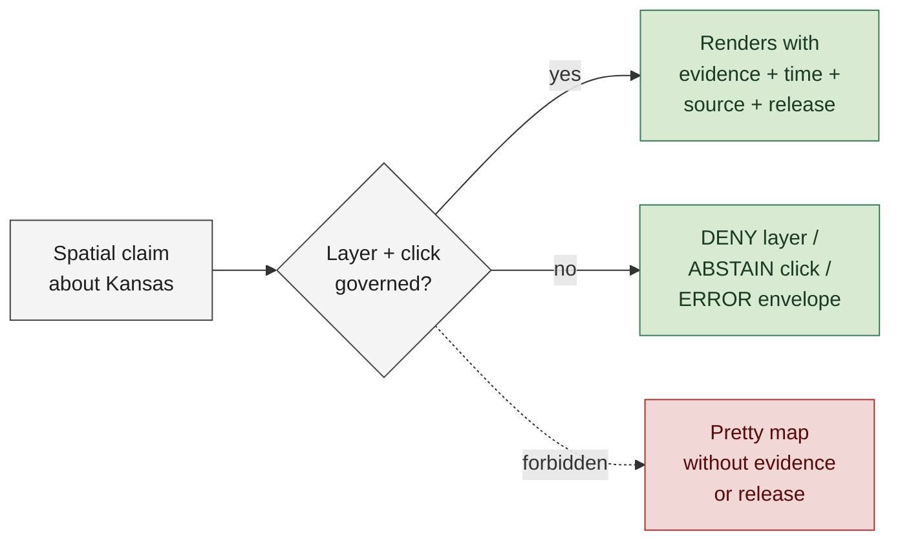
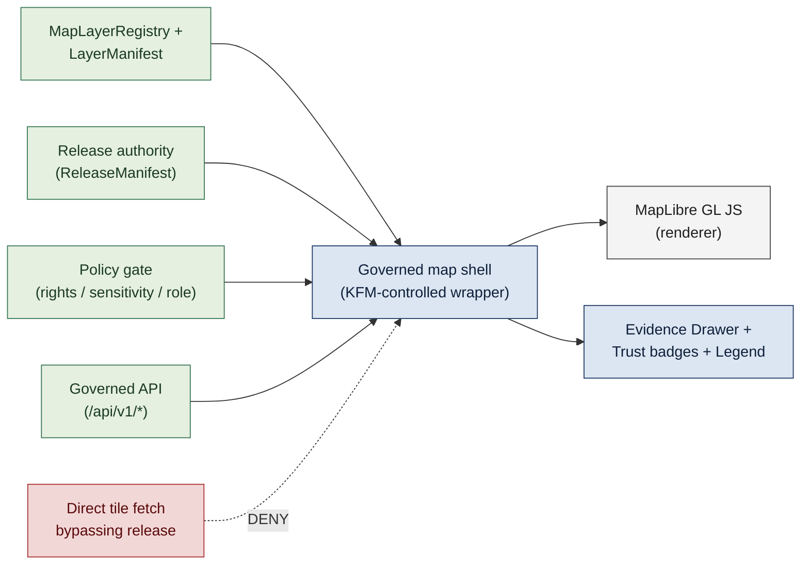
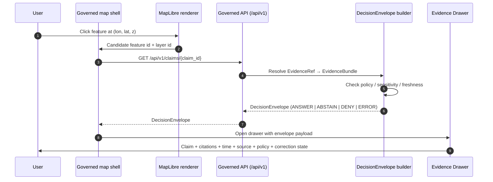
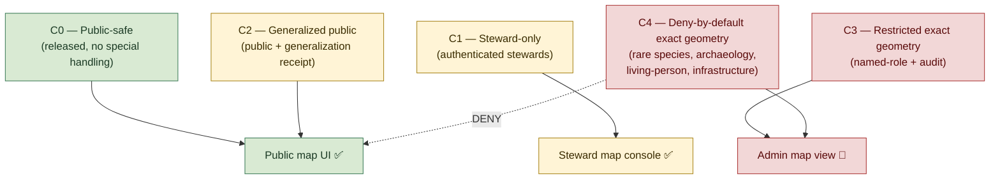

<!-- [KFM_META_BLOCK_V2]
doc_id: kfm://doc/<TODO-uuid>
title: Map First
type: standard
version: v1
status: draft
owners: <TODO: doctrine maintainers (e.g., Governance Steward + Map Architecture Lead)>
created: 2026-05-12
updated: 2026-05-12
policy_label: public
related:
  - docs/doctrine/evidence-first.md
  - docs/doctrine/time-aware.md
  - docs/doctrine/lifecycle-law.md
  - docs/doctrine/authority-ladder.md
  - docs/doctrine/trust-posture.md
  - docs/doctrine/ai-as-assistant.md
  - docs/doctrine/corrections-first-class.md
  - docs/architecture/map-architecture.md
  - docs/architecture/ui-trust-surface.md
  - docs/architecture/evidence-model.md
  - schemas/contracts/v1/layer_manifest.schema.json
  - schemas/contracts/v1/tile_manifest.schema.json
  - schemas/contracts/v1/decision_envelope.schema.json
  - schemas/contracts/v1/inspectable_claim.schema.json
  - control_plane/map_layer_registry.yaml
  - tests/map/
  - tests/ui/
tags: [kfm, doctrine, map, ui, spatial, governance, trust]
notes:
  - Codifies "Map first" as a normative KFM trust doctrine.
  - Place is the primary operating surface; the map is a governed carrier, never sovereign truth.
  - Operationalizes the click → envelope → Evidence Drawer flow defined in the Map Architecture Manual.
[/KFM_META_BLOCK_V2] -->

# Map First

> **A KFM trust doctrine: place is the primary operating surface. Every map layer, tile, click, popup, legend, time-slider tick, and export is governed — and the map renders evidence, never replaces it.**


**Status:** Draft · **Owners:** _TODO doctrine maintainers_ <sub>NEEDS VERIFICATION</sub> · **Updated:** 2026-05-12

> [!IMPORTANT]
> **The map is the primary operating surface of KFM — and it is a carrier, not the source of truth.** Every layer must be a release-bound artifact, every click must resolve through the governed API, every popup must expose evidence-bundle citations, and every sensitive geometry must fail closed. A map that renders an unreleased layer, displays a claim without evidence closure, or shows exact sensitive coordinates has violated this doctrine and MUST be reverted.

---

## Contents

1. [The doctrine in one sentence](#1-the-doctrine-in-one-sentence)
2. [Why map-first](#2-why-map-first)
3. [Scope and definitions](#3-scope-and-definitions)
4. [The map as a governed shell](#4-the-map-as-a-governed-shell)
5. [What "primary operating surface" means](#5-what-primary-operating-surface-means)
6. [The click → claim flow](#6-the-click--claim-flow)
7. [Time on the map](#7-time-on-the-map)
8. [Place, geometry, and sensitivity](#8-place-geometry-and-sensitivity)
9. [The map is a carrier, not sovereign truth](#9-the-map-is-a-carrier-not-sovereign-truth)
10. [Failure modes and finite outcomes](#10-failure-modes-and-finite-outcomes)
11. [Worked example](#11-worked-example)
12. [Anti-patterns](#12-anti-patterns)
13. [Conformance levels](#13-conformance-levels)
14. [Verification checklist](#14-verification-checklist)
15. [FAQ](#15-faq)
16. [Related docs](#related-docs)

---

## 1. The doctrine in one sentence

> [!IMPORTANT]
> **Place is the primary operating surface, and the map is a governed shell — every layer is a released artifact, every interaction passes through a `DecisionEnvelope`, every popup exposes evidence, time, source role, release state, stale state, and correction state, and every sensitive geometry fails closed.**

`[CONFIRMED doctrine.]` The KFM Core Principles register names this as **"Map first"** with the build rule *"Place is the primary operating surface; map interaction must expose evidence, policy, release, stale, and correction state"* and the failure outcome *`DENY` map layers that bypass governed release.*

[⬆ Back to top](#map-first)

---

## 2. Why map-first

KFM publishes claims about Kansas — its water, land, hazards, habitats, agriculture, settlements, atmosphere, geology, and archaeology — and the overwhelming majority of those claims are **spatial**. They happen *somewhere*. They are read, compared, and acted upon through the lens of *where*. A claim about a 1903 flood, a 1951 reservoir release, a soil-moisture trend, a habitat range, a treaty boundary, or a hazard advisory becomes legible the moment it is placed on a map next to other claims at the same place.

Three properties of spatial publication make map-first the **only durable** posture for KFM:

1. **Place compresses context.** A non-specialist can read a watershed, a county line, a floodplain edge, or a gauge location in seconds. The map turns dozens of attributes into one inspectable scene.
2. **Place exposes mismatches.** When two layers disagree about the *same place at the same time*, the disagreement is visible immediately. Hidden contradiction is the enemy of trust; the map makes contradiction findable.
3. **Place is where evidence and consequence meet.** Decisions, advisories, and public understanding land at places. A surface that abstracts place away separates evidence from the consequence it bears on.

The doctrine answers all three by **putting the map at the front, then governing every layer, tile, popup, and click so that the surface remains a faithful carrier of evidence rather than a pretty replacement for it.**



> [!CAUTION]
> A map that looks good but renders unreleased layers, hides citations, smooths over staleness, or exposes sensitive exact geometry is **not "user-friendly."** It is producing a defect.

[⬆ Back to top](#map-first)

---

## 3. Scope and definitions

This doctrine governs every **map surface** in KFM — public map UI, steward map console, admin map view, story-map scenes, exported map images, and any 3D / Cesium scene admitted under the conditional-capability rule. It applies whether the map is rendered in a browser, a generated report, a PDF export, or a printed page.

| Term | Meaning |
|---|---|
| **Map surface** | Any rendered cartographic view — 2D map, time-aware map, story-map scene, 3D scene, exported map image — that displays one or more spatial layers to a user. |
| **Governed shell** | The KFM-controlled wrapper around the renderer (e.g., MapLibre GL JS) that enforces release, policy, evidence, time, and sensitivity rules before any layer or click resolves. |
| **Released layer** | A layer whose `LayerManifest` is closed under release: hashes, source role, attribution, release id, rollback target, policy decision, sensitivity decision, and time scope are all present and valid. |
| **`LayerManifest`** | The release-bound contract for a layer (source URLs, tile manifest, attribution, release id, policy and sensitivity decisions, rollback target, time scope). `[CONFIRMED contract name.]` |
| **`TileManifest`** | Release-bound integrity record for a tileset (hashes, bbox, zoom range, projection profile, generated-at time). `[CONFIRMED contract name.]` |
| **`MapLayerRegistry`** | The control-plane register that indexes all public layers and their `LayerManifest`s. `[CONFIRMED concept; path PROPOSED at `control_plane/map_layer_registry.yaml`.]` |
| **Click-to-claim flow** | The contractually defined path: user click → candidate feature id → governed API → `DecisionEnvelope` → Evidence Drawer. |
| **Evidence Drawer** | The trust-visible panel that exposes claim, evidence, source role, time, policy, review, release, and correction state for the selected feature. |
| **Trust badge** | Compact, accessible visual signal of evidence / policy / review / release state on a layer or feature. |
| **Carrier** | A derived product (map, tile, graph, dashboard, summary, scene, export) that *displays* evidence. Carriers never replace evidence. |

Lifecycle stage names (`RAW`, `WORK`, `QUARANTINE`, `PROCESSED`, `CATALOG`, `TRIPLET`, `PUBLISHED`), finite outcomes (`ANSWER`, `ABSTAIN`, `DENY`, `ERROR`, `STALE`), and the evidence object graph carry the meanings defined in [`lifecycle-law.md`](./lifecycle-law.md), [`trust-posture.md`](./trust-posture.md), and [`evidence-first.md`](./evidence-first.md) and MUST NOT be paraphrased.

[⬆ Back to top](#map-first)

---

## 4. The map as a governed shell

The renderer is **inside** the trust system, not outside it. `[CONFIRMED doctrine from the Map Architecture Manual.]` MapLibre GL JS is the PROPOSED default 2D renderer, and Cesium / 3D is a conditional add-on — but neither is allowed to act as the truth store, publication authority, policy authority, citation authority, review authority, or AI authority. The renderer draws what the governed shell tells it to draw, and nothing else.



`[CONFIRMED architecture; rendering choices PROPOSED.]`

### 4.1 What the governed shell enforces

| Concern | Rule | Governance object |
|---|---|---|
| **Layer admission** | Only layers whose `LayerManifest` is in `MapLayerRegistry` and is release-bound may be added. | `LayerManifest`, `ReleaseManifest`, `MapLayerRegistry` |
| **Tile integrity** | Every tile request resolves to a tileset whose `TileManifest` hashes match. | `TileManifest` |
| **Source URLs** | Layer source URLs point only to released artifacts (`data/published/` or equivalent release-backed route). | `ReleaseManifest` |
| **Click resolution** | Every feature click resolves through the governed API and a `DecisionEnvelope`. | `DecisionEnvelope` |
| **Popup contents** | Popups display claim summaries only when evidence closure exists. | `InspectableClaim` + `EvidenceRef` |
| **Legend semantics** | Legends include source, support type, scale, stale state, and attribution — never a bare label. | `LayerManifest` + `SourceDescriptor` |
| **Sensitivity** | Sensitive exact geometry is denied by default; release-approved generalizations are admissible. | Sensitivity decision + Generalization Transform receipt |
| **Time scope** | Time slider, layer time range, and per-feature time labels distinguish source / observed / valid / retrieval / release / correction time. | `TemporalScope` |
| **Stale state** | Layers and features past their freshness window display the `STALE` state visibly. | Freshness window + correction lineage |
| **Correction lineage** | A `CorrectionNotice` for any layer surfaces on the layer card and on every affected feature popup. | `CorrectionNotice` |

> [!WARNING]
> A "map widget" that loads tiles directly from a non-released URL, or that calls a third-party tile provider unmediated, is **not** a KFM map surface. It is a renderer pretending to be a publication system, and MUST be wrapped in the governed shell or removed.

[⬆ Back to top](#map-first)

---

## 5. What "primary operating surface" means

"Primary operating surface" is a precise commitment, not a slogan. It means the map carries the affordances that other surfaces (lists, tables, search, AI Focus Mode, exports) operationalize.

### 5.1 The map carries the trust affordances

| Affordance | What the map must expose | Cross-link |
|---|---|---|
| **Evidence** | Every click resolves to an `EvidenceBundle` via `DecisionEnvelope`; the Evidence Drawer exposes citations, support type, time, place, and rights. | [`evidence-first.md`](./evidence-first.md) |
| **Source role** | Layer legend and feature popup indicate `authority` / `observation` / `context` / `model` / `aggregate` — never collapsed. | [`evidence-first.md`](./evidence-first.md) §6 |
| **Time** | Time slider distinguishes the six time kinds; per-feature popups label the time being shown. | [`time-aware.md`](./time-aware.md) <sub>NEEDS VERIFICATION</sub> |
| **Release state** | Layer card and popups indicate `PUBLISHED` release id and rollback target; unreleased layers cannot be added. | [`lifecycle-law.md`](./lifecycle-law.md) |
| **Stale state** | Layers / features past their freshness window display `STALE` visibly. | [`trust-posture.md`](./trust-posture.md) <sub>NEEDS VERIFICATION</sub> |
| **Correction lineage** | `CorrectionNotice`, `superseded_by`, and `withdrawn` states surface on the layer card and feature popups. | [`corrections-first-class.md`](./corrections-first-class.md) |
| **Policy posture** | Trust badge indicates rights, sensitivity, and review state; restricted exact geometry is denied at the layer level. | [`authority-ladder.md`](./authority-ladder.md) |
| **Negative states** | `ABSTAIN`, `DENY`, `ERROR` render as first-class popups with reason codes — never as silent failures or generic spinners. | [`trust-posture.md`](./trust-posture.md) <sub>NEEDS VERIFICATION</sub> |
| **Accessibility** | A non-visual evidence summary is available; trust badges have text, not color alone; keyboard reaches every trust-significant control. | WCAG 2.2 AA |

### 5.2 What "primary" does NOT mean

> [!NOTE]
> "Primary" does **not** mean "exclusive." KFM still publishes catalog records, dataset cards, story maps, exports, and AI-assisted summaries. "Primary" means: when these other surfaces refer to a place, they link **back to the map**; and when the map refers to evidence, it links **out to the Evidence Drawer, the catalog, and the source**. The map is the hub through which spatial trust flows — not the only surface, but the privileged one.

[⬆ Back to top](#map-first)

---

## 6. The click → claim flow

`[CONFIRMED contract from the Map Architecture Manual.]` Every feature click in the public map UI follows the same path. The path is finite, mechanical, and inspectable — no shortcut paths, no direct-database popups, no third-party widget that bypasses the envelope.



`[CONFIRMED click-to-claim flow.]`

### 6.1 Envelope outcomes on the map

| Envelope outcome | Map surface behavior | Drawer behavior |
|---|---|---|
| `ANSWER` | Popup shows claim summary + trust badge; feature highlighted. | Drawer opens with `EvidenceBundle` citations, time, source role, policy posture, review and release state. |
| `ABSTAIN` | Popup shows the reason code (e.g., `evidence.unresolved`, `evidence.scope_mismatch`); feature dimmed. | Drawer opens with the reason, the missing piece, and the safe next step. |
| `DENY` | Popup shows policy reason (e.g., `policy.sensitive_geometry`, `policy.rights_unclear`); feature suppressed or generalized. | Drawer opens with policy explanation and (where appropriate) a request channel. |
| `ERROR` | Popup shows a system reason (e.g., `system.upstream_unavailable`, `system.integrity_failure`); feature dimmed. | Drawer opens with the error reason and the on-call status. |
| `STALE` | Feature shown with `STALE` badge; time-slider tick is highlighted at the last fresh release. | Drawer surfaces `STALE` reason, last fresh release, and any pending correction. |

`[Reason-code paths CONFIRMED via the runtime envelope validator catalogue; per-popup wording PROPOSED at implementation level.]`

> [!IMPORTANT]
> A popup that resolves to `ABSTAIN`, `DENY`, `ERROR`, or `STALE` is **not** a bug to be hidden. It is a first-class signal that the map surface is honoring the trust contract.

[⬆ Back to top](#map-first)

---

## 7. Time on the map

`[CONFIRMED doctrine from Map Architecture Manual + Definitive Build Principles.]` The map is **time-aware**, not "dated." A time slider that shows a single ambiguous date where multiple time kinds are material has produced a defect.

### 7.1 The six time kinds on the map

| Time kind | What it answers | Where it surfaces |
|---|---|---|
| **Source time** | When the source artifact was authored or published. | Drawer (`SourceDescriptor.source_time`). |
| **Observed time** | When the underlying observation happened in the world. | Slider tick; per-feature popup. |
| **Valid time** | The time window for which the claim is intended to hold. | Slider range; per-feature popup. |
| **Retrieval time** | When KFM fetched the artifact from its source. | Drawer (`SourceDescriptor.retrieval_time`). |
| **Release time** | When the `ReleaseManifest` carrying the layer was issued. | Layer card; drawer. |
| **Correction time** | When a `CorrectionNotice` against the claim was issued. | Drawer; correction banner; per-feature popup if affected. |

> [!NOTE]
> The slider does **not** invent a single "the date." When a user sets `t = 1951-07-14`, the shell must determine, per layer, which time kind the slider is selecting against, and surface that distinction in the legend. Conflating time kinds silently is a `[CONFIRMED doctrine violation.]`

### 7.2 Stale state on the map

A layer or feature whose freshness window has expired surfaces a `STALE` badge **at the layer card, at the feature popup, and in the drawer.** `STALE` never disappears by being scrolled past — it persists until either a new release refreshes the data or a `CorrectionNotice` records the withdrawal.

[⬆ Back to top](#map-first)

---

## 8. Place, geometry, and sensitivity

`[CONFIRMED doctrine.]` Place is the privileged signal — and that is precisely why some places must not be shown at full precision. The doctrine resolves the apparent tension by separating *what evidence supports the claim* from *what the public surface displays*.

### 8.1 Public-safe geometry rules

| Concern | Rule | Failure outcome |
|---|---|---|
| Default public geometry | Release-approved, risk-scoped, generalization-receipt-bearing. | `DENY` if no decision recorded. |
| Sensitive exact locations | Rare species, archaeology, critical infrastructure, living-person addresses, DNA-linked records, and sensitive cultural sites fail closed for exact geometry. | `DENY` exact geometry unless explicit review and policy allow. |
| Generalization receipts | Public-safe generalizations carry a `Generalization Transform` receipt recording the transform parameters and the originating sensitivity decision. | `DENY` generalized geometry shown without receipt. |
| Redaction receipts | Withholding records (e.g., withheld stopover, suppressed sub-county geometry) carry a `Redaction Receipt`. | `DENY` redaction asserted without receipt. |
| CRS and projection | Every layer declares its `Coordinate Reference Profile` and `GeographyVersion`; reprojection carries a `ProjectionTransformReceipt`. | `ERROR` if reprojection drift cannot be reconstructed. |

`[Receipt object names CONFIRMED from the Spatial Foundation domain; storage paths PROPOSED.]`

### 8.2 The sensitivity ladder, mapped



`[CONFIRMED classification framework; per-domain assignments PROPOSED until each domain's sensitivity decisions are recorded.]`

> [!CAUTION]
> A common failure mode is to display a "generalized" geometry that was generated **without** a `Generalization Transform` receipt — typically by client-side simplification at render time. Client-side simplification is **not** generalization in the doctrinal sense. Real generalization is a governed transform with a receipt, applied before release.

[⬆ Back to top](#map-first)

---

## 9. The map is a carrier, not sovereign truth

`[CONFIRMED doctrine — cross-link to `evidence-first.md` §8.]` The most persistent failure mode for spatial publication systems is treating the map as the source of authority. This doctrine is precise on the point:

| Surface | Role | Doctrine status |
|---|---|---|
| Map layer / tile | Displays evidence at place | **Carrier** — never sovereign truth |
| Feature popup | Displays a claim resolved through `DecisionEnvelope` | **Carrier** — never sovereign truth |
| Time slider | Displays time kind currently in view | **Carrier** — never sovereign truth |
| Story-map scene | Narrates evidence through place | **Carrier** — never sovereign truth |
| 3D / Cesium scene | Adds vertical / temporal motion context | **Carrier** — never sovereign truth |
| Exported map image / PDF | Materializes a scene at a moment | **Carrier** — never sovereign truth |
| `EvidenceBundle` (resolved through the click flow) | The thing being displayed | **Evidence — sovereign** |

`[CONFIRMED doctrine line:]` **"Derived products stay derived."** Failure outcome: `FAIL if a derivative becomes canonical proof.`

> [!WARNING]
> A common, dangerous failure: a long-standing tile or PMTiles bundle is treated as evidence because nobody can quite remember which release built it. **Time does not promote carriers to evidence.** If the originating `LayerManifest` and its `EvidenceBundle`s are lost, the layer is lost — it must be rebuilt from evidence or withdrawn with a `CorrectionNotice`.

### 9.1 Reproducibility commitment

Every tile, layer, scene, and exported map image MUST be rebuildable byte-identically (or with a recorded reason for divergence) from its `LayerManifest`, `TileManifest`, and the `EvidenceBundle`s the layer cites. The release-dry-run CI step exercises this commitment for at least one proof-bearing layer per release. `[PROPOSED at CI level; commitment CONFIRMED.]`

[⬆ Back to top](#map-first)

---

## 10. Failure modes and finite outcomes

The map surface speaks the same finite outcomes as the rest of the trust system — `ANSWER`, `ABSTAIN`, `DENY`, `ERROR`, `STALE`. There is no map-specific outcome vocabulary.

| Surface event | Possible outcomes | Drawer / popup behavior |
|---|---|---|
| Layer add request (admin / steward) | `ANSWER` (admitted) / `DENY` (no release) / `ERROR` (manifest invalid) | Layer card shows reason. |
| Tile fetch | `ANSWER` / `ERROR` (`system.integrity_failure`) | Tile fails closed; placeholder pattern rendered. |
| Feature click | `ANSWER` / `ABSTAIN` / `DENY` / `ERROR` / `STALE` | Drawer opens with reason + safe next step. |
| Time-slider seek | `ANSWER` / `STALE` / `ABSTAIN` (`time.unsupported_window`) | Slider tick + layer state surface the reason. |
| Layer time outside range | `ABSTAIN` (`time.out_of_scope`) | Layer dimmed; legend shows the time scope. |
| Sensitive exact geometry requested | `DENY` (`policy.sensitive_geometry`) | Drawer explains the policy and (if applicable) the generalized alternative. |
| Layer past freshness window | `STALE` | Layer card + per-feature badge; drawer shows last fresh release. |
| Layer withdrawn | `DENY` (`release.withdrawn`) | Drawer surfaces `CorrectionNotice`. |
| Layer superseded | `ANSWER` (with pointer) | Drawer surfaces `superseded_by` link to the new release. |

`[Reason codes CONFIRMED from the public API + runtime envelope catalogue.]`

> [!IMPORTANT]
> `ABSTAIN` and `DENY` on the map are not "errors to be hidden." They are first-class trust signals that the surface is honoring the contract. A "generic spinner" or a silent failure to render is itself a `[CONFIRMED anti-pattern.]`

[⬆ Back to top](#map-first)

---

## 11. Worked example

> [!NOTE]
> Illustrative — synthetic identifiers; specifics are PROPOSED at implementation level. This walkthrough uses the canonical hydrology proof lane referenced in the Definitive Greenfield Building Plan.

A user opens the public map and clicks a streamgage symbol near DeSoto, KS, on 1951-07-14.

<details>
<summary><b>Step 1 — Click resolves to a candidate feature id</b></summary>

The renderer reports a click at `(lon, lat, z)`. The governed shell identifies the candidate feature: `layer_id = "hydro.streamgages.kansas.v2026-04"`, `feature_id = "06892350"`, `claim_id = "claim:hydro:gage:06892350:stage:1951-07-14"`.

</details>

<details>
<summary><b>Step 2 — Governed API resolves the claim</b></summary>

```http
GET /api/v1/claims/claim:hydro:gage:06892350:stage:1951-07-14
```

The envelope builder resolves the `EvidenceRef` to `EvidenceBundle eb:nwis:06892350:stage:1951-07-14`, which cites a `SourceDescriptor` for USGS NWIS (source role: `observation`).

</details>

<details>
<summary><b>Step 3 — Policy and sensitivity gates pass</b></summary>

- Rights: public domain (USGS data).
- Sensitivity: C0 (public-safe).
- Freshness window: not applicable to historical observation.
- Release state: `PUBLISHED` under `ReleaseManifest rm:hydro:2026-04`.

Outcome: `ANSWER`.

</details>

<details>
<summary><b>Step 4 — Evidence Drawer opens</b></summary>

The drawer displays:

- **Claim:** Stage height at gage 06892350 on 1951-07-14.
- **Citations:** 1 `EvidenceBundle`, 1 `SourceDescriptor`.
- **Time:** observed time = 1951-07-14; retrieval time = 2026-04-08; release time = 2026-04-15.
- **Source role:** `observation` (USGS NWIS).
- **Policy:** C0 public-safe; public domain rights.
- **Review:** reviewed by `steward:hydro` on 2026-04-12.
- **Release:** `PUBLISHED` under `rm:hydro:2026-04`; rollback target `rm:hydro:2026-03`.
- **Correction:** no `CorrectionNotice` against this claim.
- **Trust badge:** `released · reviewed · observation`.

</details>

<details>
<summary><b>Step 5 — Counterfactual: same click, but layer is past freshness window</b></summary>

If `eb:nwis:06892350:stage:1951-07-14` were instead a *current* gage stage reading whose freshness window had expired, the envelope would resolve to `ANSWER` with a `STALE` annotation. The popup would render a `STALE` badge; the drawer would surface the last-fresh release id and any pending correction. The claim would **not** be silently treated as current.

</details>

<details>
<summary><b>Step 6 — Counterfactual: sensitive sibling layer (archaeology) clicked</b></summary>

If the same user clicked an archaeological site symbol on a sibling layer, the envelope would resolve to `DENY` with reason `policy.sensitive_geometry`. The popup would render a denial reason; the drawer would explain the policy and (if a generalized version exists) link to the public-safe generalized layer. The exact coordinates would never enter the response payload.

</details>

[⬆ Back to top](#map-first)

---

## 12. Anti-patterns

The anti-patterns below are CONFIRMED-rejection cases. Each represents a real failure mode encountered in map-first systems.

| Anti-pattern | Why rejected | Corrective doctrine line |
|---|---|---|
| "The tile is the truth — we lost the manifest but the map still works." | Carriers are not sovereign. Lost manifest = lost layer. | §9, "Derived products stay derived." |
| Adding a third-party basemap with no `LayerManifest` because "it's just a basemap." | Every public layer is governed; "just a basemap" is still a public claim about place. | §4.1, layer admission rule. |
| Client-side geometry simplification presented as "generalized." | Real generalization is a governed transform with a receipt. | §8.1, generalization receipts. |
| Single ambiguous date on the time slider where multiple time kinds are material. | Conflating time kinds silently destroys time-aware posture. | §7.1, six time kinds. |
| Popup that renders the raw row from the source table. | Public surfaces consume only governed `DecisionEnvelope` payloads — never raw source rows. | §6, click → claim flow. |
| Silent re-render to "current" when source data refreshes mid-session. | Refresh is a release event with a `ReleaseManifest`, not a re-render. | §4.1 + `lifecycle-law.md`. |
| Trust badge as decoration (color-only, no text). | Badges must be accessible; color alone fails WCAG 2.2 AA. | §5.1, accessibility row. |
| Screenshot of the map cited as evidence in a downstream report. | Screenshots are carriers of a carrier; they are not citations. | §9, reproducibility commitment. |
| "Loading…" spinner that hides an `ERROR` outcome. | Generic spinners hide trust failures; finite outcomes must be visible. | §10, finite outcomes. |
| 3D / Cesium scene admitted without a `Reality Boundary Note`. | 3D context can introduce synthetic geometry that displaces evidence; admission requires explicit decision. | §4 + Spatial Foundation domain. |
| Map UI that calls a model adapter directly to "explain" a feature. | Direct public → model traffic violates the AI doctrine; AI is mediated through governed `Focus Mode`. | [`ai-as-assistant.md`](./ai-as-assistant.md). |
| Treating layer toggle as edit. | Toggling visibility is not a release event. Edits are governed by lifecycle; toggles are not. | `lifecycle-law.md`. |

[⬆ Back to top](#map-first)

---

## 13. Conformance levels

`[PROPOSED at implementation level; vocabulary CONFIRMED.]` Map-first conformance is phased honestly. L0 is fixture-level enforcement; L1 is the public-safe proof lane; L2 is broad-domain coverage.

| Level | What the map surface guarantees | Required objects |
|---|---|---|
| **L0** | Fixture-level: the governed shell exists; click → envelope → drawer round-trips for at least one synthetic feature; no public UI yet. | `MapLayerRegistry` stub, one `LayerManifest`, one `TileManifest`, click-flow fixture. |
| **L1** | One proof-bearing public lane (hydrology) renders only released layers; every popup resolves through `DecisionEnvelope`; `ABSTAIN` / `DENY` / `ERROR` / `STALE` all reachable; sensitive exact geometry denied at the layer level. | All L0 + `ReleaseManifest`, `CorrectionNotice` path, `Generalization Transform` receipts where applicable, accessibility checks for the drawer fixture. |
| **L2** | Multi-domain coverage; sensitivity ladder applied across all admitted domains; time-kind disambiguation enforced; reproducibility (rebuild byte-identical) CI-checked for at least one layer per release. | All L1 + cross-domain sensitivity register, full time-aware validator, release-dry-run CI step exercising tile rebuild. |

[⬆ Back to top](#map-first)

---

## 14. Verification checklist

Before any map surface, layer, tile, popup, or time-slider goes to L1, the following must be verifiable. `[PROPOSED at implementation level.]`

- [ ] Every admitted layer has a `LayerManifest` in `MapLayerRegistry` and a release-bound `TileManifest`.
- [ ] No public layer source URL points to `RAW` / `WORK` / `QUARANTINE` / candidate material.
- [ ] Every feature click resolves through the governed API and returns a `DecisionEnvelope`.
- [ ] Popups display claim summaries only when evidence closure exists.
- [ ] `ABSTAIN` / `DENY` / `ERROR` / `STALE` are visible first-class popup states with reason codes.
- [ ] Time slider distinguishes the six time kinds where material; no single ambiguous date.
- [ ] Layers past their freshness window display `STALE` at layer card, popup, and drawer.
- [ ] Sensitive exact geometry (C3 / C4) is denied at the layer level in the public surface.
- [ ] Generalizations carry a `Generalization Transform` receipt; redactions carry a `Redaction Receipt`.
- [ ] Every layer declares a `Coordinate Reference Profile` and `GeographyVersion`.
- [ ] Reprojections carry a `ProjectionTransformReceipt`.
- [ ] Trust badges have visible text or an `aria-label`; color alone never carries meaning.
- [ ] Keyboard users can reach every trust-significant control (layer toggle, drawer trigger, time-slider tick).
- [ ] A non-visual evidence summary view is available for screen-reader users.
- [ ] Exported map images carry release id, timestamp, attribution, and citation appendix.
- [ ] No third-party tile provider is admitted without a `LayerManifest` and an attribution / rights decision.
- [ ] AI explanations of features run through governed Focus Mode, never directly from a renderer.

[⬆ Back to top](#map-first)

---

## 15. FAQ

<details>
<summary><b>Why MapLibre, not Leaflet / Mapbox GL / OpenLayers / proprietary?</b></summary>

MapLibre GL JS is the **PROPOSED** default 2D renderer because it is open-source, vector-tile-native, performant, and has the cartographic flexibility KFM needs. The choice is recorded in an ADR; the doctrine itself is renderer-agnostic. Any renderer that can be wrapped in the governed shell and honor the click → envelope → drawer contract is admissible.

</details>

<details>
<summary><b>Can the map work offline / from static files?</b></summary>

Yes — that is exactly what PMTiles is for, and is the PROPOSED default for stable public-safe immutable layers. Offline / static does not exempt the map from the governance contract: PMTiles bundles still need `LayerManifest` + `TileManifest` + release id + rollback target. Static tiles are still released artifacts.

</details>

<details>
<summary><b>What about 3D — Cesium, terrain, time-dynamic globes?</b></summary>

3D is a **conditional add-on**, not the default shell. 3D is admissible only when terrain, time-dynamic motion, vertical relationships, line-of-sight, globe context, or story viewpoint carries real evidentiary value. 3D scenes are subject to the same `EvidenceBundle`, release, policy, and correction rules as 2D layers — plus a `Reality Boundary Note` declaring which geometry is synthetic vs. observed.

</details>

<details>
<summary><b>How do I show a "current" layer when the data is updated daily?</b></summary>

Each daily update is a **release event** producing a new `ReleaseManifest` and a new `LayerManifest` (or a new tile generation under the same layer). The map shell loads the latest release; the layer card shows the release time; the freshness window decides when the layer transitions to `STALE`. There is no "live, ungoverned" mode.

</details>

<details>
<summary><b>Is a feature popup a claim, or just a display?</b></summary>

A feature popup is a **carrier of one or more claims**. Each claim it displays must have resolved through `DecisionEnvelope`. If the popup shows a value that has no resolvable `EvidenceRef`, the popup has produced uncited prose — a `[CONFIRMED anti-pattern.]` See [`evidence-first.md`](./evidence-first.md).

</details>

<details>
<summary><b>How does map-first relate to the other doctrines?</b></summary>

Map-first is **not** the root trust doctrine — that is [`evidence-first.md`](./evidence-first.md). Map-first is the doctrine for *the primary spatial surface through which evidence-first manifests to a public audience.* It operationalizes evidence-first, time-aware, and policy-aware doctrines at the map surface. When map-first and any other doctrine appear to conflict, evidence-first wins on what counts as evidence, `lifecycle-law` wins on what counts as released, `authority-ladder` wins on which source of authority a documentation claim invokes, and `corrections-first-class` wins on supersession and rollback. Map-first wins on how those things *render and resolve through place.*

</details>

<details>
<summary><b>What happens to the map during an emergency shutdown?</b></summary>

An `/admin/v1/emergency/shutdown-public-surface` action removes the public map shell from the public route, replacing it with a static notice and a link to the most recent `ReleaseManifest`. The governed shell does not "degrade" silently; it either operates with the trust contract intact or it is offline with notice. `[CONFIRMED admin route name; behavior PROPOSED at implementation level.]`

</details>

[⬆ Back to top](#map-first)

---

## Related docs

- [`docs/doctrine/evidence-first.md`](./evidence-first.md) — Root trust doctrine; `EvidenceRef` → `EvidenceBundle` resolution, cite-or-abstain, carriers-vs-sovereign-truth. `[CONFIRMED sibling.]`
- [`docs/doctrine/time-aware.md`](./time-aware.md) — Six time kinds, freshness windows, `STALE` semantics. `[NEEDS VERIFICATION — confirm exact filename.]`
- [`docs/doctrine/lifecycle-law.md`](./lifecycle-law.md) — `RAW → WORK/QUARANTINE → PROCESSED → CATALOG/TRIPLET → PUBLISHED`; what "released" means. `[CONFIRMED sibling.]`
- [`docs/doctrine/authority-ladder.md`](./authority-ladder.md) — Primary / Secondary / Tertiary authority for documentation. `[CONFIRMED sibling.]`
- [`docs/doctrine/trust-posture.md`](./trust-posture.md) — Truth-label vocabulary; finite outcomes `ANSWER` / `ABSTAIN` / `DENY` / `ERROR` / `STALE`. `[NEEDS VERIFICATION — confirm exact filename.]`
- [`docs/doctrine/ai-as-assistant.md`](./ai-as-assistant.md) — Why AI explanations of map features run through governed Focus Mode, never directly from the renderer. `[CONFIRMED sibling.]`
- [`docs/doctrine/corrections-first-class.md`](./corrections-first-class.md) — How `CorrectionNotice`, `superseded_by`, and `withdrawn` surface on the map. `[CONFIRMED sibling.]`
- [`docs/architecture/map-architecture.md`](../architecture/map-architecture.md) — Renderer choice, layer registry, tile strategy, click-flow contract. `[NEEDS VERIFICATION — exact path.]`
- [`docs/architecture/ui-trust-surface.md`](../architecture/ui-trust-surface.md) — Evidence Drawer, trust badges, focus mode, negative-state UI. `[NEEDS VERIFICATION — exact path.]`
- [`docs/architecture/evidence-model.md`](../architecture/evidence-model.md) — Evidence object graph, resolver responsibilities. `[NEEDS VERIFICATION — exact path.]`
- [`control_plane/map_layer_registry.yaml`](../../control_plane/map_layer_registry.yaml) — Indexed `LayerManifest` set. `[PROPOSED path.]`
- [`schemas/contracts/v1/layer_manifest.schema.json`](../../schemas/contracts/v1/layer_manifest.schema.json) — Machine-checkable `LayerManifest` shape. `[PROPOSED path.]`
- [`schemas/contracts/v1/tile_manifest.schema.json`](../../schemas/contracts/v1/tile_manifest.schema.json) — Machine-checkable `TileManifest` shape. `[PROPOSED path.]`
- [`schemas/contracts/v1/decision_envelope.schema.json`](../../schemas/contracts/v1/decision_envelope.schema.json) — Machine-checkable envelope shape. `[PROPOSED path.]`

---

**Last updated:** 2026-05-12 · **Version:** v1 (draft) · **Status:** awaiting review

[⬆ Back to top](#map-first)
