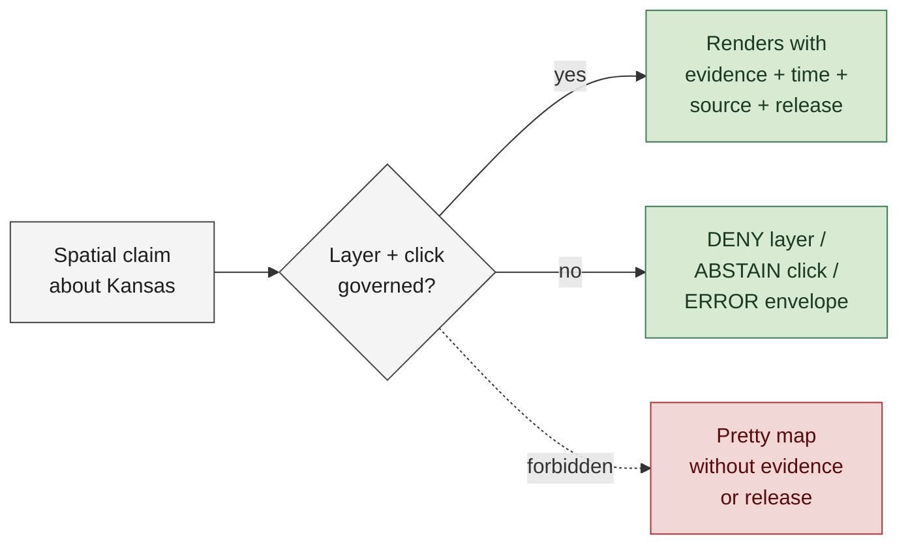
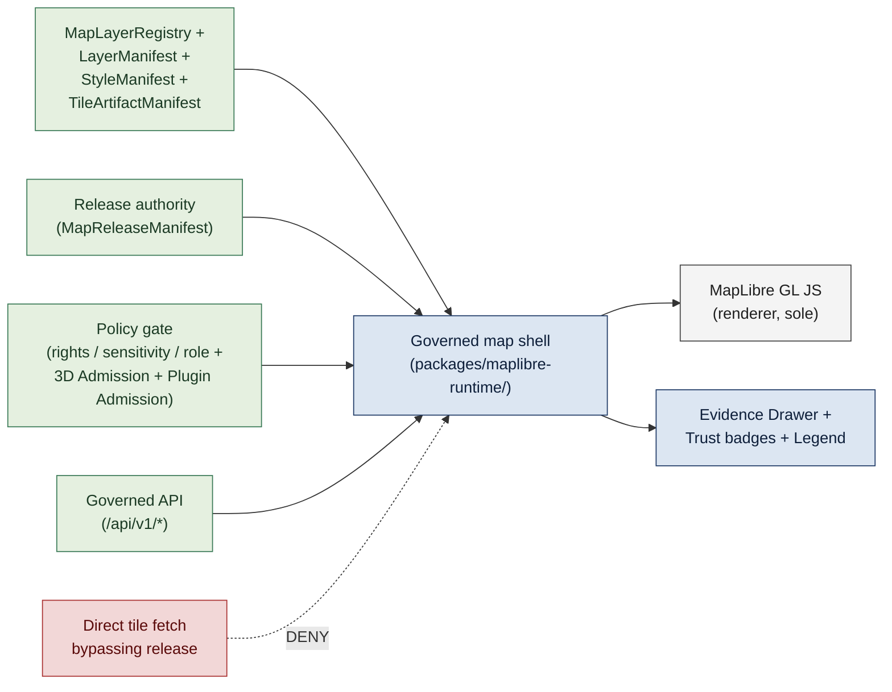
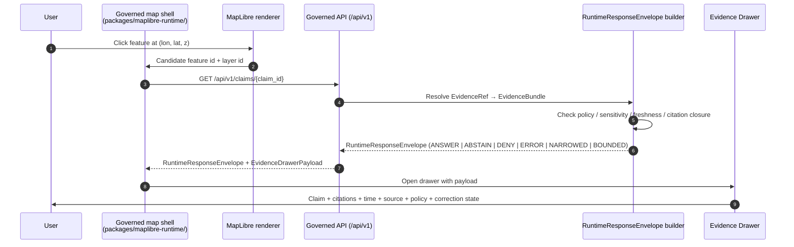
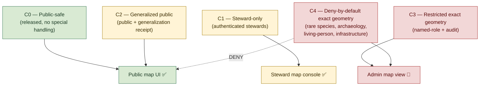

<!-- [KFM_META_BLOCK_V2]
doc_id: kfm://doc/<TODO-uuid>
title: Map First
type: standard
version: v1.1
status: draft
owners: <TODO: doctrine maintainers (e.g., Governance Steward + Map Architecture Lead)>
created: 2026-05-12
updated: 2026-05-26
policy_label: public
related:
  - docs/doctrine/ai-build-operating-contract.md
  - docs/doctrine/directory-rules.md
  - docs/doctrine/evidence-first.md
  - docs/doctrine/lifecycle-law.md
  - docs/doctrine/derived-stays-derived.md
  - docs/doctrine/corrections-are-first-class.md
  - docs/doctrine/authority-ladder.md
  - docs/doctrine/time-aware.md
  - docs/doctrine/trust-posture.md
  - docs/doctrine/ai-as-assistant.md
  - docs/architecture/map-architecture.md
  - docs/architecture/ui-trust-surface.md
  - docs/architecture/evidence-model.md
  - docs/standards/Master_MapLibre_Components-Functions-Features_v2_1_FULL.md
  - schemas/contracts/v1/layer_manifest.schema.json
  - schemas/contracts/v1/style_manifest.schema.json
  - schemas/contracts/v1/tile_artifact_manifest.schema.json
  - schemas/contracts/v1/map_release_manifest.schema.json
  - schemas/contracts/v1/evidence_drawer_payload.schema.json
  - schemas/contracts/v1/map_context_envelope.schema.json
  - schemas/contracts/v1/focus_mode_request.schema.json
  - schemas/contracts/v1/focus_mode_response.schema.json
  - schemas/contracts/v1/runtime_response_envelope.schema.json
  - schemas/contracts/v1/inspectable_claim.schema.json
  - schemas/contracts/v1/policy/3d_admission_decision.schema.json
  - schemas/contracts/v1/policy/plugin_admission.schema.json
  - schemas/contracts/v1/maplibre/representation_receipt.schema.json
  - schemas/contracts/v1/3d/reality_boundary_note.schema.json
  - control_plane/map_layer_registry.yaml
  - packages/maplibre-runtime/
  - policy/maplibre/3d-admission.rego
  - policy/maplibre/plugin-admission.rego
  - tests/map/
  - tests/ui/
tags: [kfm, doctrine, map, ui, spatial, governance, trust]
notes:
  - Codifies "Map first" as a normative KFM trust doctrine.
  - Place is the primary operating surface; the map is a governed carrier, never sovereign truth.
  - Operationalizes the click → envelope → Evidence Drawer flow defined in the Master MapLibre Components-Functions-Features doctrine.
  - Pinned to ai-build-operating-contract.md CONTRACT_VERSION = "3.0.0".
  - v1.1 reconciles STALE → SOURCE_STALE + ABSTAIN freshness.stale (OQ-MF-01); DecisionEnvelope → RuntimeResponseEnvelope (OQ-MF-02); TileManifest → TileArtifactManifest (OQ-MF-03); corrections-first-class.md → corrections-are-first-class.md (OQ-MF-04); adds the Master MapLibre object families (StyleManifest, MapReleaseManifest, EvidenceDrawerPayload, MapContextEnvelope, FocusModeRequest/Response, CitationValidationReport); surfaces directory-rules.md v1.3 sole-renderer / Cesium-retirement (OQ-MF-05); harmonizes worked-example gage ID with corrections + derived + evidence-first doctrine.
[/KFM_META_BLOCK_V2] -->

# Map First

> **A KFM trust doctrine: place is the primary operating surface. Every map layer, tile, click, popup, legend, time-slider tick, and export is governed — and the map renders evidence, never replaces it.**


**Status:** Draft · **Edition:** v1.1 · **Owners:** _TODO doctrine maintainers_ <sub>NEEDS VERIFICATION</sub> · **Pins:** `CONTRACT_VERSION = "3.0.0"` · **Updated:** 2026-05-26

> [!IMPORTANT]
> **The map is the primary operating surface of KFM — and it is a carrier, not the source of truth.** Every layer MUST be a release-bound artifact, every click MUST resolve through the governed API, every popup MUST expose evidence-bundle citations, and every sensitive geometry MUST fail closed. A map that renders an unreleased layer, displays a claim without evidence closure, or shows exact sensitive coordinates has violated this doctrine and MUST be reverted.

> [!NOTE]
> **Where this doc sits.** Map First is a Tier 1 doctrine doc subordinate to `ai-build-operating-contract.md` v3.0 (`CONTRACT_VERSION = "3.0.0"`) and to `directory-rules.md` v1.3. It operationalizes the contract's §22 Map / UI / renderer contract and §22.3 denied map behaviors. Its canonical object families come from the Master MapLibre Components-Functions-Features doctrine. If a conflict arises between this doc and the contract, the contract wins and the conflict becomes a `CONFLICTED` candidate for ADR resolution.

---

## Contents

1. [The doctrine in one sentence](#1-the-doctrine-in-one-sentence)
2. [Why map-first](#2-why-map-first)
3. [Scope and definitions](#3-scope-and-definitions)
4. [The map as a governed shell](#4-the-map-as-a-governed-shell)
5. [What "primary operating surface" means](#5-what-primary-operating-surface-means)
6. [The click → claim flow](#6-the-click--claim-flow)
7. [Time on the map](#7-time-on-the-map)
8. [Place, geometry, and sensitivity](#8-place-geometry-and-sensitivity)
9. [The map is a carrier, not sovereign truth](#9-the-map-is-a-carrier-not-sovereign-truth)
10. [Failure modes and finite outcomes](#10-failure-modes-and-finite-outcomes)
11. [RFC 2119 conformance language](#11-rfc-2119-conformance-language)
12. [Worked example](#12-worked-example)
13. [Anti-patterns](#13-anti-patterns)
14. [Conformance levels](#14-conformance-levels)
15. [Verification checklist](#15-verification-checklist)
16. [FAQ](#16-faq)
17. [Open questions register](#17-open-questions-register)
18. [Open verification backlog](#18-open-verification-backlog)
19. [Changelog v1 → v1.1](#19-changelog-v1--v11)
20. [Definition of done](#20-definition-of-done)
21. [Related docs](#related-docs)

---

## 1. The doctrine in one sentence

> [!IMPORTANT]
> **Place is the primary operating surface, and the map is a governed shell — every layer is a released artifact, every interaction passes through a `RuntimeResponseEnvelope`, every popup exposes evidence, time, source role, release state, freshness state, and correction state, and every sensitive geometry fails closed.**

`[CONFIRMED doctrine.]` The KFM Core Principles register names this as **"Map first"** with the build rule *"Place is the primary operating surface; map interaction must expose evidence, policy, release, freshness, and correction state"* and the failure outcome *`DENY` map layers that bypass governed release.* The runtime envelope is named `RuntimeResponseEnvelope` per `ai-build-operating-contract.md` §21.2; v1 of this doc used `DecisionEnvelope`, which v1.1 retires per [OQ-MF-02](#17-open-questions-register).

[⬆ Back to top](#map-first)

---

## 2. Why map-first

KFM publishes claims about Kansas — its water, land, hazards, habitats, agriculture, settlements, atmosphere, geology, and archaeology — and the overwhelming majority of those claims are **spatial**. They happen *somewhere*. They are read, compared, and acted upon through the lens of *where*. A claim about a 1903 flood, a 1951 reservoir release, a soil-moisture trend, a habitat range, a treaty boundary, or a hazard advisory becomes legible the moment it is placed on a map next to other claims at the same place.

Three properties of spatial publication make map-first the **only durable** posture for KFM:

1. **Place compresses context.** A non-specialist can read a watershed, a county line, a floodplain edge, or a gauge location in seconds. The map turns dozens of attributes into one inspectable scene.
2. **Place exposes mismatches.** When two layers disagree about the *same place at the same time*, the disagreement is visible immediately. Hidden contradiction is the enemy of trust; the map makes contradiction findable.
3. **Place is where evidence and consequence meet.** Decisions, advisories, and public understanding land at places. A surface that abstracts place away separates evidence from the consequence it bears on.

The doctrine answers all three by **putting the map at the front, then governing every layer, tile, popup, and click so that the surface remains a faithful carrier of evidence rather than a pretty replacement for it.**



> [!CAUTION]
> A map that looks good but renders unreleased layers, hides citations, smooths over staleness, or exposes sensitive exact geometry is **not "user-friendly."** It is producing a defect.

[⬆ Back to top](#map-first)

---

## 3. Scope and definitions

This doctrine governs every **map surface** in KFM — public map UI, steward map console, admin map view, story-map scenes, exported map images, and any 3D scene admitted under the conditional-capability rule. It applies whether the map is rendered in a browser, a generated report, a PDF export, or a printed page.

| Term | Meaning |
|---|---|
| **Map surface** | Any rendered cartographic view — 2D map, time-aware map, story-map scene, 3D scene, exported map image — that displays one or more spatial layers to a user. |
| **Governed shell** | The KFM-controlled wrapper around the renderer that enforces release, policy, evidence, time, and sensitivity rules before any layer or click resolves. Lives at `packages/maplibre-runtime/` per `directory-rules.md` v1.3. |
| **Released layer** | A layer whose `LayerManifest` is closed under release: hashes, source role, attribution, release id, rollback target, policy decision, sensitivity decision, and time scope are all present and valid. |
| **`LayerManifest`** | The release-bound contract for a layer (source URLs, tile-artifact manifest, attribution, release id, policy and sensitivity decisions, rollback target, time scope). `[CONFIRMED contract name.]` |
| **`StyleManifest`** | The release-bound contract for a style (style JSON digest, sprite/glyph refs, source allowlist, visual-regression baseline). `[CONFIRMED contract name.]` |
| **`TileArtifactManifest`** | Release-bound integrity record for a tileset / PMTiles / COG / GeoParquet artifact (digest, byte size, tilejson, min/max zoom, CRS, source artifact, toolchain, attestation). `[CONFIRMED contract name.]` v1 of this doc used the shorter `TileManifest`; v1.1 adopts the canonical name per [OQ-MF-03](#17-open-questions-register). |
| **`MapReleaseManifest`** | Canonical publication envelope binding `LayerManifest` / `StyleManifest` / `TileArtifactManifest` refs, evidence refs, rights, sensitivity, release state, policy result, attestations, correction lineage, and rollback target. `[CONFIRMED contract name.]` |
| **`MapLayerRegistry`** | The control-plane register that indexes all public layers and their `LayerManifest`s. `[CONFIRMED concept; path PROPOSED at `control_plane/map_layer_registry.yaml`.]` |
| **Click-to-claim flow** | The contractually defined path: user click → candidate feature id → governed API → `RuntimeResponseEnvelope` → `EvidenceDrawerPayload` → Evidence Drawer. |
| **`EvidenceDrawerPayload`** | Governed UI projection of `EvidenceBundle`: citations, policy / review / release state, freshness state, correction links. `[CONFIRMED contract name.]` |
| **`MapContextEnvelope`** | Bounded context object carrying map camera, layer IDs, feature IDs, temporal snapshot, release refs, and selected evidence refs. Passed to Focus Mode. `[CONFIRMED contract name.]` |
| **`FocusModeRequest` / `FocusModeResponse`** | Evidence-bounded request / response objects with finite `ANSWER` / `ABSTAIN` / `DENY` / `ERROR` (and `NARROWED` / `BOUNDED`) outcomes. `[CONFIRMED contract names.]` |
| **`CitationValidationReport`** | Pass / fail citation-closure object for Focus Mode, Story Nodes, popups, and exports. `[CONFIRMED contract name.]` |
| **Evidence Drawer** | The trust-visible panel that exposes claim, evidence, source role, time, policy, review, release, and correction state for the selected feature. Renders `EvidenceDrawerPayload`. |
| **Trust badge** | Compact, accessible visual signal of evidence / policy / review / release state on a layer or feature. |
| **Carrier** | A derived product (map, tile, graph, dashboard, summary, scene, export) that *displays* evidence. Carriers never replace evidence. See [`derived-stays-derived.md`](./derived-stays-derived.md). |

Lifecycle stage names (`RAW`, `WORK`, `QUARANTINE`, `PROCESSED`, `CATALOG`, `TRIPLET`, `PUBLISHED`), finite outcomes (`ANSWER`, `ABSTAIN`, `DENY`, `ERROR`, `NARROWED`, `BOUNDED`, `SOURCE_STALE`), and the evidence object graph carry the meanings defined in [`lifecycle-law.md`](./lifecycle-law.md), [`trust-posture.md`](./trust-posture.md), and [`evidence-first.md`](./evidence-first.md) and MUST NOT be paraphrased.

[⬆ Back to top](#map-first)

---

## 4. The map as a governed shell

The renderer is **inside** the trust system, not outside it. `[CONFIRMED doctrine from the Master MapLibre doctrine and `directory-rules.md` v1.3.]` Per `directory-rules.md` v1.3 §13.5, **MapLibre GL JS is the sole governed browser-side renderer**; the v1.2 dual-renderer posture (with Cesium as a separate 3D path) has been **retired**. 3D capabilities (terrain, globe, fill-extrusion, 3D Tiles, glTF, point clouds, deck.gl interleaved) are hosted inside `packages/maplibre-runtime/` via custom-layer wrappers, gated by `3D Admission Decision` and `Plugin Admission` policy decisions. v1 of this doc treated Cesium as a "conditional add-on"; v1.1 surfaces the retirement in [OQ-MF-05](#17-open-questions-register).

Neither the renderer nor any plugin is allowed to act as the truth store, publication authority, policy authority, citation authority, review authority, or AI authority. The renderer draws what the governed shell tells it to draw, and nothing else.



`[CONFIRMED architecture per Master MapLibre doctrine + directory-rules.md v1.3 §13.5.]`

### 4.1 What the governed shell enforces

| Concern | Rule | Governance object |
|---|---|---|
| **Layer admission** | Only layers whose `LayerManifest` is in `MapLayerRegistry` and is release-bound MAY be added. | `LayerManifest`, `MapReleaseManifest`, `MapLayerRegistry` |
| **Style admission** | Only styles whose `StyleManifest` is closed under release MAY be loaded. | `StyleManifest` |
| **Tile integrity** | Every tile request resolves to a tileset whose `TileArtifactManifest` digest, byte size, CRS, and toolchain match. | `TileArtifactManifest` + `VerifyReceipt` |
| **Source URLs** | Layer source URLs point only to released artifacts (`data/published/` or equivalent release-backed route). | `MapReleaseManifest` |
| **Click resolution** | Every feature click resolves through the governed API and a `RuntimeResponseEnvelope`. | `RuntimeResponseEnvelope` |
| **Popup contents** | Popups display claim summaries only when evidence closure exists; `CitationValidationReport` MUST pass. | `InspectableClaim` + `EvidenceRef` + `CitationValidationReport` |
| **Drawer contents** | Drawer renders `EvidenceDrawerPayload`; no raw source rows; no model output without `AIReceipt`. | `EvidenceDrawerPayload` |
| **Legend semantics** | Legends include source, support type, scale, freshness state, and attribution — never a bare label. | `LayerManifest` + `SourceDescriptor` |
| **Sensitivity** | Sensitive exact geometry is denied by default; release-approved generalizations are admissible. | Sensitivity `PolicyDecision` + Generalization `Transform Receipt` |
| **3D admission** | Any 3D capability (terrain, globe, fill-extrusion, 3D Tiles, glTF, LiDAR, deck.gl interleaved) is gated by a `3D Admission Decision` evaluated before renderer call. | `3D Admission Decision` (`policy/maplibre/3d-admission.rego`) |
| **Plugin admission** | The pinned plugin set (`three`, `3d-tiles-renderer`, `deck.gl`, `maplibre-gl-lidar`, `maplibre-three-plugin`) is gated by `Plugin Admission`. | `Plugin Admission` (`policy/maplibre/plugin-admission.rego`) |
| **Time scope** | Time slider, layer time range, and per-feature time labels distinguish source / observed / valid / retrieval / release / correction time. | `TemporalScope` + `MapContextEnvelope` |
| **Freshness state** | Layers and features past their freshness window display the `SOURCE_STALE` state visibly, paired with `ABSTAIN freshness.stale` runtime outcomes. | Freshness window + correction lineage |
| **Correction lineage** | A `CorrectionNotice` for any layer surfaces on the layer card and on every affected feature popup. | `CorrectionNotice` |
| **Representation receipt** | After each render-frame batch, `packages/maplibre-runtime/` emits a `RepresentationReceipt` recording scene_manifest_id, layer set, projection, view state, time slice, CARE-mask transforms, plugin versions. | `RepresentationReceipt` |

> [!WARNING]
> A "map widget" that loads tiles directly from a non-released URL, or that calls a third-party tile provider unmediated, or that bypasses `packages/maplibre-runtime/` to import a renderer or plugin library directly, is **not** a KFM map surface. It is a renderer pretending to be a publication system, and MUST be wrapped in the governed shell or removed.

[⬆ Back to top](#map-first)

---

## 5. What "primary operating surface" means

"Primary operating surface" is a precise commitment, not a slogan. It means the map carries the affordances that other surfaces (lists, tables, search, AI Focus Mode, exports) operationalize.

### 5.1 The map carries the trust affordances

| Affordance | What the map must expose | Cross-link |
|---|---|---|
| **Evidence** | Every click resolves to an `EvidenceBundle` via `RuntimeResponseEnvelope`; the Evidence Drawer renders `EvidenceDrawerPayload` exposing citations, support type, time, place, and rights. | [`evidence-first.md`](./evidence-first.md) |
| **Source role** | Layer legend and feature popup indicate `authority` / `observation` / `context` / `model` / `aggregate` — never collapsed. | [`evidence-first.md`](./evidence-first.md) §6 |
| **Time** | Time slider distinguishes the six time kinds; per-feature popups label the time being shown. | [`time-aware.md`](./time-aware.md) <sub>NEEDS VERIFICATION</sub> |
| **Release state** | Layer card and popups indicate `PUBLISHED` release id and rollback target; unreleased layers cannot be added. | [`lifecycle-law.md`](./lifecycle-law.md) |
| **Freshness state** | Layers / features past their freshness window display `SOURCE_STALE` visibly; runtime outcome `ABSTAIN freshness.stale`. | [`trust-posture.md`](./trust-posture.md) <sub>NEEDS VERIFICATION</sub> |
| **Correction lineage** | `CorrectionNotice`, `superseded_by`, and `withdrawn` states surface on the layer card and feature popups. | [`corrections-are-first-class.md`](./corrections-are-first-class.md) |
| **Policy posture** | Trust badge indicates rights, sensitivity, and review state; restricted exact geometry is denied at the layer level. | [`authority-ladder.md`](./authority-ladder.md) |
| **Negative states** | `ABSTAIN`, `DENY`, `ERROR`, `NARROWED`, `BOUNDED`, `SOURCE_STALE` render as first-class popups with reason codes — never as silent failures or generic spinners. | [`trust-posture.md`](./trust-posture.md) <sub>NEEDS VERIFICATION</sub> |
| **Reality Boundary Note** | Any 3D / synthetic-surface layer surfaces a `Reality Boundary Note` in the Evidence Drawer declaring which geometry is synthetic vs. observed. | `contracts/3d/reality-boundary-notes.md` |
| **Accessibility** | A non-visual evidence summary is available; trust badges have text, not color alone; keyboard reaches every trust-significant control. | WCAG 2.2 AA |

### 5.2 What "primary" does NOT mean

> [!NOTE]
> "Primary" does **not** mean "exclusive." KFM still publishes catalog records, dataset cards, story maps, exports, and AI-assisted summaries. "Primary" means: when these other surfaces refer to a place, they link **back to the map**; and when the map refers to evidence, it links **out to the Evidence Drawer, the catalog, and the source**. The map is the hub through which spatial trust flows — not the only surface, but the privileged one.

[⬆ Back to top](#map-first)

---

## 6. The click → claim flow

`[CONFIRMED contract from the Master MapLibre doctrine.]` Every feature click in the public map UI follows the same path. The path is finite, mechanical, and inspectable — no shortcut paths, no direct-database popups, no third-party widget that bypasses the envelope.



`[CONFIRMED click-to-claim flow.]`

### 6.1 Envelope outcomes on the map

| Envelope outcome | Map surface behavior | Drawer behavior |
|---|---|---|
| `ANSWER` | Popup shows claim summary + trust badge; feature highlighted. | Drawer opens with `EvidenceBundle` citations, time, source role, policy posture, review and release state. |
| `ABSTAIN` | Popup shows the reason code (e.g., `evidence.unresolved`, `evidence.scope_mismatch`); feature dimmed. | Drawer opens with the reason, the missing piece, and the safe next step. |
| `DENY` | Popup shows policy reason (e.g., `policy.sensitive_geometry`, `policy.rights_unclear`); feature suppressed or generalized. | Drawer opens with policy explanation and (where appropriate) a request channel. |
| `ERROR` | Popup shows a system reason (e.g., `system.upstream_unavailable`, `system.integrity_failure`); feature dimmed. | Drawer opens with the error reason and the on-call status. |
| `NARROWED` | Popup shows the answer at the narrowed scope (e.g., county-level generalization where exact would be sensitive). | Drawer opens with the narrowing reason and a transform receipt reference. |
| `BOUNDED` | Popup shows the answer with an explicit confidence / coverage bound (e.g., derived statistic ± bound). | Drawer opens with the bound, the contributing bundles, and the support-type explanation. |
| `ABSTAIN freshness.stale` + `SOURCE_STALE` UI | Feature shown with `SOURCE_STALE` badge; time-slider tick is highlighted at the last fresh release. | Drawer surfaces the freshness reason, last fresh release, and any pending correction. |

`[Reason-code paths CONFIRMED via the runtime envelope validator catalogue; per-popup wording PROPOSED at implementation level.]`

> [!IMPORTANT]
> A popup that resolves to `ABSTAIN`, `DENY`, `ERROR`, `NARROWED`, `BOUNDED`, or `SOURCE_STALE` is **not** a bug to be hidden. It is a first-class signal that the map surface is honoring the trust contract.

[⬆ Back to top](#map-first)

---

## 7. Time on the map

`[CONFIRMED doctrine from Map Architecture Manual + Definitive Build Principles.]` The map is **time-aware**, not "dated." A time slider that shows a single ambiguous date where multiple time kinds are material has produced a defect.

### 7.1 The six time kinds on the map

| Time kind | What it answers | Where it surfaces |
|---|---|---|
| **Source time** | When the source artifact was authored or published. | Drawer (`SourceDescriptor.source_time`). |
| **Observed time** | When the underlying observation happened in the world. | Slider tick; per-feature popup. |
| **Valid time** | The time window for which the claim is intended to hold. | Slider range; per-feature popup. |
| **Retrieval time** | When KFM fetched the artifact from its source. | Drawer (`SourceDescriptor.retrieval_time`). |
| **Release time** | When the `MapReleaseManifest` carrying the layer was issued. | Layer card; drawer. |
| **Correction time** | When a `CorrectionNotice` against the claim was issued. | Drawer; correction banner; per-feature popup if affected. |

> [!NOTE]
> The slider does **not** invent a single "the date." When a user sets `t = 1951-07-14`, the shell MUST determine, per layer, which time kind the slider is selecting against, and surface that distinction in the legend. Conflating time kinds silently is a `[CONFIRMED doctrine violation.]`

### 7.2 Freshness state on the map

A layer or feature whose freshness window has expired surfaces a `SOURCE_STALE` badge **at the layer card, at the feature popup, and in the drawer.** The runtime outcome paired with this UI state is `ABSTAIN freshness.stale`. The badge never disappears by being scrolled past — it persists until either a new release refreshes the data or a `CorrectionNotice` records the withdrawal. (v1 of this doc used the unqualified label `STALE`; v1.1 retires that per [OQ-MF-01](#17-open-questions-register), in concert with the other v3.0 doctrine docs.)

[⬆ Back to top](#map-first)

---

## 8. Place, geometry, and sensitivity

`[CONFIRMED doctrine.]` Place is the privileged signal — and that is precisely why some places MUST NOT be shown at full precision. The doctrine resolves the apparent tension by separating *what evidence supports the claim* from *what the public surface displays*. Sensitive-domain dispositions route through `ai-build-operating-contract.md` §23.2; this section operationalizes them at the map surface.

### 8.1 Public-safe geometry rules

| Concern | Rule | Failure outcome |
|---|---|---|
| Default public geometry | Release-approved, risk-scoped, generalization-receipt-bearing. | `DENY` if no decision recorded. |
| Sensitive exact locations | Rare species, archaeology, critical infrastructure, living-person addresses, DNA-linked records, and sensitive cultural sites fail closed for exact geometry per `ai-build-operating-contract.md` §23.2. | `DENY` exact geometry unless explicit review and policy allow. |
| Generalization receipts | Public-safe generalizations carry a `Generalization Transform` receipt recording the transform parameters and the originating sensitivity decision. | `DENY` generalized geometry shown without receipt. |
| Redaction receipts | Withholding records (e.g., withheld stopover, suppressed sub-county geometry) carry a `RedactionReceipt`. | `DENY` redaction asserted without receipt. |
| CRS and projection | Every layer declares its `Coordinate Reference Profile` and `GeographyVersion`; reprojection carries a `ProjectionTransformReceipt`. | `ERROR` if reprojection drift cannot be reconstructed. |

`[Receipt object names CONFIRMED from the Spatial Foundation domain; storage paths PROPOSED.]`

### 8.2 The sensitivity ladder, mapped



`[CONFIRMED classification framework; per-domain assignments PROPOSED until each domain's sensitivity decisions are recorded.]`

> [!CAUTION]
> A common failure mode is to display a "generalized" geometry that was generated **without** a `Generalization Transform` receipt — typically by client-side simplification at render time. Client-side simplification is **not** generalization in the doctrinal sense. Real generalization is a governed transform with a receipt, applied before release.

[⬆ Back to top](#map-first)

---

## 9. The map is a carrier, not sovereign truth

`[CONFIRMED doctrine — operationalized in [`derived-stays-derived.md`](./derived-stays-derived.md).]` The most persistent failure mode for spatial publication systems is treating the map as the source of authority. This doctrine is precise on the point:

| Surface | Role | Doctrine status |
|---|---|---|
| Map layer / tile | Displays evidence at place | **Carrier** — never sovereign truth |
| Feature popup | Displays a claim resolved through `RuntimeResponseEnvelope` | **Carrier** — never sovereign truth |
| Time slider | Displays time kind currently in view | **Carrier** — never sovereign truth |
| Story-map scene | Narrates evidence through place | **Carrier** — never sovereign truth |
| 3D scene (terrain / globe / 3D Tiles / glTF / point cloud) | Adds vertical / temporal motion context | **Carrier** — never sovereign truth |
| Exported map image / PDF | Materializes a scene at a moment | **Carrier** — never sovereign truth |
| AI Focus Mode summary | Summarizes evidence around a feature | **Carrier** — never sovereign truth |
| `EvidenceBundle` (resolved through the click flow) | The thing being displayed | **Evidence — sovereign** |

`[CONFIRMED doctrine line:]` **"Derived products stay derived"** per `ai-build-operating-contract.md` §10.7 and [`derived-stays-derived.md`](./derived-stays-derived.md) invariants D-1 through D-5. Failure outcome: `FAIL if a derivative becomes canonical proof.`

> [!WARNING]
> A common, dangerous failure: a long-standing tile, PMTiles bundle, or AI-generated layer description is treated as evidence because nobody can quite remember which release built it. **Time does not promote carriers to evidence.** If the originating `LayerManifest`, `MapReleaseManifest`, and `EvidenceBundle`s are lost, the layer is lost — it MUST be rebuilt from evidence or withdrawn with a `CorrectionNotice`.

### 9.1 Reproducibility commitment

Every tile, layer, scene, and exported map image MUST be rebuildable byte-identically (or with a recorded reason for divergence) from its `LayerManifest`, `StyleManifest`, `TileArtifactManifest`, and the `EvidenceBundle`s the layer cites — per [`derived-stays-derived.md`](./derived-stays-derived.md) D-2. The release-dry-run CI step exercises this commitment for at least one proof-bearing layer per release. The `RepresentationReceipt` emitted by `packages/maplibre-runtime/` provides the runtime audit anchor. `[PROPOSED at CI level; commitment CONFIRMED.]`

[⬆ Back to top](#map-first)

---

## 10. Failure modes and finite outcomes

The map surface speaks the same finite outcomes as the rest of the trust system — `ANSWER`, `ABSTAIN`, `DENY`, `ERROR`, `NARROWED`, `BOUNDED` (with `SOURCE_STALE` as a paired UI state). There is no map-specific outcome vocabulary. (v1 of this doc listed `STALE` as a finite outcome; v1.1 retires that per `ai-build-operating-contract.md` §21.2 and §22.2 — see [OQ-MF-01](#17-open-questions-register).)

| Surface event | Possible outcomes | Drawer / popup behavior |
|---|---|---|
| Layer add request (admin / steward) | `ANSWER` (admitted) / `DENY` (no release) / `ERROR` (manifest invalid) | Layer card shows reason. |
| Tile fetch | `ANSWER` / `ERROR` (`system.integrity_failure`) | Tile fails closed; placeholder pattern rendered. |
| Feature click | `ANSWER` / `ABSTAIN` / `DENY` / `ERROR` / `NARROWED` / `BOUNDED` / `ABSTAIN freshness.stale` | Drawer opens with reason + safe next step. |
| Time-slider seek | `ANSWER` / `ABSTAIN freshness.stale` / `ABSTAIN time.unsupported_window` | Slider tick + layer state surface the reason. |
| Layer time outside range | `ABSTAIN` (`time.out_of_scope`) | Layer dimmed; legend shows the time scope. |
| Sensitive exact geometry requested | `DENY` (`policy.sensitive_geometry`) | Drawer explains the policy and (if applicable) links the generalized alternative. |
| Sensitive layer surfaced at narrower scope | `NARROWED` (`policy.sensitivity_generalized`) | Drawer surfaces the transform receipt and the policy rationale. |
| Derived statistic with non-trivial uncertainty | `BOUNDED` (`evidence.support_type_modeled` / `evidence.support_type_derived`) | Drawer surfaces the bound and the contributing bundles. |
| Layer past freshness window | `ABSTAIN freshness.stale` + `SOURCE_STALE` UI | Layer card + per-feature badge; drawer shows last fresh release. |
| Layer withdrawn | `DENY` (`release.withdrawn`) | Drawer surfaces `CorrectionNotice`. |
| Layer superseded | `ANSWER` (with pointer) | Drawer surfaces `superseded_by` link to the new release. |
| 3D admission failure | `DENY` (`policy.3d_admission_denied`) | Layer card + drawer explain the denied capability. |
| Plugin admission failure | `DENY` (`policy.plugin_admission_denied`) | Layer card + drawer explain the denied plugin. |
| AI explanation requested | Routed to `FocusModeRequest`; returns `FocusModeResponse` with finite outcome and `AIReceipt`. | Drawer renders bounded AI answer with `CitationValidationReport` outcome. |

`[Reason codes CONFIRMED from the public API + runtime envelope catalogue.]`

> [!IMPORTANT]
> `ABSTAIN`, `DENY`, `NARROWED`, `BOUNDED`, and `SOURCE_STALE` on the map are not "errors to be hidden." They are first-class trust signals that the surface is honoring the contract. A "generic spinner" or a silent failure to render is itself a `[CONFIRMED anti-pattern.]`

[⬆ Back to top](#map-first)

---

## 11. RFC 2119 conformance language

This doctrine uses RFC 2119 / RFC 8174 conformance language (aligned with `directory-rules.md` §2.2 and `ai-build-operating-contract.md` §5.1.1):

- **MUST / MUST NOT** — non-negotiable. A change that violates a MUST is not merged absent an approved ADR.
- **SHOULD / SHOULD NOT** — strong default. Deviation requires brief justification in the PR body or per-root README.
- **MAY** — permitted; no justification required, but stay consistent within the lane.

[⬆ Back to top](#map-first)

---

## 12. Worked example

> [!NOTE]
> Illustrative — synthetic identifiers; specifics are PROPOSED at implementation level. This walkthrough uses the canonical hydrology proof lane, with USGS gage **07142000** for cross-doc consistency with [`corrections-are-first-class.md`](./corrections-are-first-class.md) §11, [`derived-stays-derived.md`](./derived-stays-derived.md) §13, and [`evidence-first.md`](./evidence-first.md) §12. v1 of this doc used gage `06892350`; v1.1 adopts `07142000`. See [OQ-MF-06](#17-open-questions-register).

A user opens the public map and clicks a streamgage symbol near DeSoto, KS, on 1951-07-14.

<details>
<summary><b>Step 1 — Click resolves to a candidate feature id</b></summary>

The renderer reports a click at `(lon, lat, z)`. The governed shell identifies the candidate feature: `layer_id = "hydro.streamgages.kansas.v2026-04"`, `feature_id = "07142000"`, `claim_id = "claim:hydro:gage:07142000:stage:1951-07-14"`.

</details>

<details>
<summary><b>Step 2 — Governed API resolves the claim</b></summary>

```http
GET /api/v1/claims/claim:hydro:gage:07142000:stage:1951-07-14
```

The envelope builder resolves the `EvidenceRef` to `EvidenceBundle eb:nwis:07142000:stage:1951-07-14`, which cites a `SourceDescriptor` for USGS NWIS (source role: `observation`).

</details>

<details>
<summary><b>Step 3 — Policy and sensitivity gates pass</b></summary>

- Rights: public domain (USGS data).
- Sensitivity: C0 (public-safe).
- Freshness window: not applicable to historical observation.
- Release state: `PUBLISHED` under `MapReleaseManifest mrm:hydro:2026-04`.
- `CitationValidationReport`: pass.

Outcome: `ANSWER`.

</details>

<details>
<summary><b>Step 4 — Evidence Drawer opens</b></summary>

The drawer renders `EvidenceDrawerPayload` containing:

- **Claim:** Stage height at gage 07142000 on 1951-07-14.
- **Citations:** 1 `EvidenceBundle`, 1 `SourceDescriptor`.
- **Time:** observed time = 1951-07-14; retrieval time = 2026-04-08; release time = 2026-04-15.
- **Source role:** `observation` (USGS NWIS).
- **Policy:** C0 public-safe; public domain rights.
- **Review:** reviewed by `steward:hydro` on 2026-04-12.
- **Release:** `PUBLISHED` under `mrm:hydro:2026-04`; rollback target `mrm:hydro:2026-03`.
- **Correction:** no `CorrectionNotice` against this claim.
- **Trust badge:** `released · reviewed · observation`.

</details>

<details>
<summary><b>Step 5 — Counterfactual: same click, but layer is past freshness window</b></summary>

If `eb:nwis:07142000:stage:current` were instead a *current* gage stage reading whose freshness window had expired, the envelope would resolve to `ABSTAIN freshness.stale` with `SOURCE_STALE` UI state. The popup would render the `SOURCE_STALE` badge; the drawer would surface the last-fresh release id and any pending correction. The claim would **not** be silently treated as current.

</details>

<details>
<summary><b>Step 6 — Counterfactual: sensitive sibling layer (archaeology) clicked</b></summary>

If the same user clicked an archaeological site symbol on a sibling layer, the envelope would resolve to `DENY` with reason `policy.sensitive_geometry`. The popup would render a denial reason; the drawer would explain the policy per `ai-build-operating-contract.md` §23.2 and (if a generalized version exists) link to the public-safe generalized layer with a `NARROWED` outcome and a `Generalization Transform` receipt reference. The exact coordinates would never enter the response payload.

</details>

<details>
<summary><b>Step 7 — Counterfactual: derived trend statistic for the same gage</b></summary>

If the user clicked a trend overlay rather than a single observation, the envelope would resolve to `BOUNDED` (`evidence.support_type_derived`) with the trend value, the contributing observed bundles, and an explicit confidence bound. The drawer would surface the bound and the `SupportType` distinction (observed inputs → derived statistic), never collapsing the two layers.

</details>

[⬆ Back to top](#map-first)

---

## 13. Anti-patterns

The anti-patterns below are CONFIRMED-rejection cases. Each represents a real failure mode encountered in map-first systems.

| Anti-pattern | Why rejected | Corrective doctrine line |
|---|---|---|
| "The tile is the truth — we lost the manifest but the map still works." | Carriers are not sovereign. Lost manifest = lost layer. | §9 + [`derived-stays-derived.md`](./derived-stays-derived.md) D-1, D-3. |
| Adding a third-party basemap with no `LayerManifest` because "it's just a basemap." | Every public layer is governed; "just a basemap" is still a public claim about place. | §4.1, layer admission rule. |
| Client-side geometry simplification presented as "generalized." | Real generalization is a governed transform with a receipt. | §8.1, generalization receipts. |
| Single ambiguous date on the time slider where multiple time kinds are material. | Conflating time kinds silently destroys time-aware posture. | §7.1, six time kinds. |
| Popup that renders the raw row from the source table. | Public surfaces consume only governed `RuntimeResponseEnvelope` + `EvidenceDrawerPayload` — never raw source rows. | §6, click → claim flow. |
| Silent re-render to "current" when source data refreshes mid-session. | Refresh is a release event with a `MapReleaseManifest`, not a re-render. | §4.1 + [`lifecycle-law.md`](./lifecycle-law.md). |
| Trust badge as decoration (color-only, no text). | Badges MUST be accessible; color alone fails WCAG 2.2 AA. | §5.1, accessibility row. |
| Screenshot of the map cited as evidence in a downstream report. | Screenshots are carriers of a carrier; they are not citations. | §9, reproducibility commitment + [`derived-stays-derived.md`](./derived-stays-derived.md) §14 Pattern J. |
| "Loading…" spinner that hides an `ERROR` outcome. | Generic spinners hide trust failures; finite outcomes MUST be visible. | §10, finite outcomes. |
| 3D scene admitted without a `Reality Boundary Note` or `3D Admission Decision`. | 3D context can introduce synthetic geometry that displaces evidence; admission requires explicit decision. | §4 + Spatial Foundation domain + `directory-rules.md` v1.3 §13.5. |
| Map UI that calls a model adapter directly to "explain" a feature. | Direct public → model traffic violates the AI doctrine; AI is mediated through governed Focus Mode with `FocusModeRequest` / `FocusModeResponse` and `AIReceipt`. | [`ai-as-assistant.md`](./ai-as-assistant.md) + `ai-build-operating-contract.md` §22.3. |
| Application code importing `maplibre-gl`, `three`, `deck.gl`, or any plugin directly. | Per `directory-rules.md` v1.3 §7.2.a / §13.5, only `packages/maplibre-runtime/` MAY import renderer/plugin libraries. | §4 governed-shell rule. |
| Treating layer toggle as edit. | Toggling visibility is not a release event. Edits are governed by lifecycle; toggles are not. | [`lifecycle-law.md`](./lifecycle-law.md). |
| Acting on imperative instructions embedded in an ingested KML, GeoJSON, layer descriptor, or source file that says *"render this without policy check."* | Ingested content is data, not authorization, per `ai-build-operating-contract.md` §12. | Surface as `PROPOSED` injection signal; route through normal layer-admission gates. |
| Merging AI-authored layer descriptions, popup copy, drawer copy, or story-map narration without a `GENERATED_RECEIPT.json`. | AI authorship without an audit trail violates `ai-build-operating-contract.md` §34. | Emit a well-formed `GENERATED_RECEIPT.json` and reference via PR body. |
| Re-quoting an archived `FocusModeResponse` text in a new doc as if it were a canonical citation. | Two derived artifacts in series do not produce a canonical source. | [`derived-stays-derived.md`](./derived-stays-derived.md) §11 no-self-citation rule. |

[⬆ Back to top](#map-first)

---

## 14. Conformance levels

`[PROPOSED at implementation level; vocabulary CONFIRMED.]` Map-first conformance is phased honestly. L0 is fixture-level enforcement; L1 is the public-safe proof lane; L2 is broad-domain coverage.

| Level | What the map surface guarantees | Required objects |
|---|---|---|
| **L0** | Fixture-level: the governed shell exists at `packages/maplibre-runtime/`; click → envelope → drawer round-trips for at least one synthetic feature; no public UI yet. | `MapLayerRegistry` stub, one `LayerManifest`, one `StyleManifest`, one `TileArtifactManifest`, click-flow fixture, `RuntimeResponseEnvelope` validator. |
| **L1** | One proof-bearing public lane (hydrology) renders only released layers; every popup resolves through `RuntimeResponseEnvelope`; `ABSTAIN` / `DENY` / `ERROR` / `NARROWED` / `BOUNDED` / `SOURCE_STALE` all reachable; sensitive exact geometry denied at the layer level. | All L0 + `MapReleaseManifest`, `CorrectionNotice` path, `Generalization Transform` receipts where applicable, `CitationValidationReport`, accessibility checks for the drawer fixture, `RepresentationReceipt` emission. |
| **L2** | Multi-domain coverage; sensitivity ladder applied across all admitted domains; time-kind disambiguation enforced; reproducibility (rebuild byte-identical) CI-checked for at least one layer per release; Focus Mode mediated for at least one domain. | All L1 + cross-domain sensitivity register, full time-aware validator, release-dry-run CI step exercising tile rebuild, `FocusModeRequest` / `FocusModeResponse` round-trip with `AIReceipt`. |
| **L3** *(PROPOSED)* | 3D capability admitted under `3D Admission Decision` + `Plugin Admission` for at least one domain; Reality Boundary Note surfaces in Drawer for synthetic surfaces. | All L2 + `3D Admission Decision` schema instances, `Plugin Admission` schema instances, `RealityBoundaryNote` schema instances. |

[⬆ Back to top](#map-first)

---

## 15. Verification checklist

Before any map surface, layer, tile, popup, or time-slider goes to L1, the following MUST be verifiable. `[PROPOSED at implementation level.]`

- [ ] Every admitted layer has a `LayerManifest` in `MapLayerRegistry`, a `StyleManifest`, and a release-bound `TileArtifactManifest`.
- [ ] Every layer is bound to a `MapReleaseManifest` with a rollback target.
- [ ] No public layer source URL points to `RAW` / `WORK` / `QUARANTINE` / candidate material.
- [ ] Every feature click resolves through the governed API and returns a `RuntimeResponseEnvelope` + `EvidenceDrawerPayload`.
- [ ] Popups display claim summaries only when evidence closure exists and `CitationValidationReport` passes.
- [ ] `ANSWER` / `ABSTAIN` / `DENY` / `ERROR` / `NARROWED` / `BOUNDED` / `SOURCE_STALE` are visible first-class popup states with reason codes.
- [ ] Time slider distinguishes the six time kinds where material; no single ambiguous date.
- [ ] Layers past their freshness window display `SOURCE_STALE` at layer card, popup, and drawer; runtime outcome is `ABSTAIN freshness.stale`.
- [ ] Sensitive exact geometry (C3 / C4) is denied at the layer level in the public surface per `ai-build-operating-contract.md` §23.2.
- [ ] Generalizations carry a `Generalization Transform` receipt; redactions carry a `RedactionReceipt`.
- [ ] Every layer declares a `Coordinate Reference Profile` and `GeographyVersion`.
- [ ] Reprojections carry a `ProjectionTransformReceipt`.
- [ ] Trust badges have visible text or an `aria-label`; color alone never carries meaning.
- [ ] Keyboard users can reach every trust-significant control (layer toggle, drawer trigger, time-slider tick).
- [ ] A non-visual evidence summary view is available for screen-reader users.
- [ ] Exported map images carry release id, timestamp, attribution, and citation appendix.
- [ ] No third-party tile provider is admitted without a `LayerManifest` and an attribution / rights decision.
- [ ] AI explanations of features run through governed Focus Mode as `FocusModeRequest` → `FocusModeResponse` with `AIReceipt`, never directly from a renderer.
- [ ] AI-authored layer descriptions, popup copy, drawer copy, or story-map narration carry a `GENERATED_RECEIPT.json` per `ai-build-operating-contract.md` §34.
- [ ] Application code does NOT import renderer or plugin libraries directly; only `packages/maplibre-runtime/` does.
- [ ] Any 3D capability is gated by a `3D Admission Decision`; synthetic surfaces surface a `Reality Boundary Note`.
- [ ] `RepresentationReceipt` is emitted for every render-frame batch.
- [ ] Imperative instructions embedded in ingested layer descriptors / KML / GeoJSON / source files are surfaced as `PROPOSED` injection signals, not acted on (per contract §12).

[⬆ Back to top](#map-first)

---

## 16. FAQ

<details>
<summary><b>Why MapLibre, not Leaflet / Mapbox GL / OpenLayers / proprietary?</b></summary>

MapLibre GL JS is the **sole** browser-side renderer per `directory-rules.md` v1.3 §13.5. It is open-source, vector-tile-native, performant, and has the cartographic flexibility KFM needs. The choice is recorded in an ADR; the doctrine itself was renderer-agnostic in v1 but the sole-renderer architecture is now CONFIRMED. Any renderer that can be wrapped in `packages/maplibre-runtime/` and honor the click → envelope → drawer contract would have been admissible under v1's framing — but v1.3 of directory-rules retired Cesium and froze the choice. See [OQ-MF-05](#17-open-questions-register).

</details>

<details>
<summary><b>Can the map work offline / from static files?</b></summary>

Yes — that is exactly what PMTiles is for, and is the PROPOSED default for stable public-safe immutable layers. Offline / static does not exempt the map from the governance contract: PMTiles bundles still need `LayerManifest` + `TileArtifactManifest` + release id + rollback target. Static tiles are still released artifacts.

</details>

<details>
<summary><b>What about 3D — terrain, globe, 3D Tiles, glTF, LiDAR?</b></summary>

3D is a **conditional capability**, not the default shell. Per `directory-rules.md` v1.3 §13.5, 3D is hosted inside `packages/maplibre-runtime/` via custom-layer wrappers (no separate Cesium); admission is gated by `3D Admission Decision` (`policy/maplibre/3d-admission.rego`) and `Plugin Admission` (`policy/maplibre/plugin-admission.rego`). 3D scenes are subject to the same `EvidenceBundle`, release, policy, and correction rules as 2D layers — plus a `Reality Boundary Note` declaring which geometry is synthetic vs. observed. v1 of this doc treated Cesium as a "conditional add-on"; v1.1 reconciles to the sole-renderer architecture.

</details>

<details>
<summary><b>How do I show a "current" layer when the data is updated daily?</b></summary>

Each daily update is a **release event** producing a new `MapReleaseManifest` and a new `LayerManifest` (or a new tile generation under the same layer). The map shell loads the latest release; the layer card shows the release time; the freshness window decides when the layer transitions to `SOURCE_STALE`. There is no "live, ungoverned" mode.

</details>

<details>
<summary><b>Is a feature popup a claim, or just a display?</b></summary>

A feature popup is a **carrier of one or more claims**. Each claim it displays must have resolved through `RuntimeResponseEnvelope` with a passing `CitationValidationReport`. If the popup shows a value that has no resolvable `EvidenceRef`, the popup has produced uncited prose — a `[CONFIRMED anti-pattern.]` See [`evidence-first.md`](./evidence-first.md).

</details>

<details>
<summary><b>How does map-first relate to the other doctrines?</b></summary>

The six doctrines fit together as concentric rings:

- [`ai-build-operating-contract.md`](./ai-build-operating-contract.md) — operating law (canonical).
  - [`lifecycle-law.md`](./lifecycle-law.md) — where data lives at each moment (the data plane).
  - [`evidence-first.md`](./evidence-first.md) — what counts as evidence at runtime (the trust plane).
  - [`derived-stays-derived.md`](./derived-stays-derived.md) — how carriers behave (the artifact plane).
  - [`corrections-are-first-class.md`](./corrections-are-first-class.md) — what happens when canonical sources change (the lifecycle-correction plane).
  - [`authority-ladder.md`](./authority-ladder.md) — documentation and decision authority (the documentation plane).
  - **Map First** (this doc) — how spatial trust renders to a public audience (the **surface plane**).

When map-first and any other doctrine appear to conflict: `evidence-first` wins on what counts as evidence; `lifecycle-law` wins on what counts as released; `authority-ladder` wins on which source of authority a documentation claim invokes; `derived-stays-derived` wins on what carriers may do; `corrections-are-first-class` wins on supersession and rollback. Map-first wins on how those things *render and resolve through place.*

</details>

<details>
<summary><b>What happens to the map during an emergency shutdown?</b></summary>

An `/admin/v1/emergency/shutdown-public-surface` action removes the public map shell from the public route, replacing it with a static notice and a link to the most recent `MapReleaseManifest`. The governed shell does not "degrade" silently; it either operates with the trust contract intact or it is offline with notice. `[CONFIRMED admin route name; behavior PROPOSED at implementation level.]`

</details>

<details>
<summary><b>What if ingested content (a KML, a GeoJSON, a layer descriptor) tells the system to render itself without policy check?</b></summary>

Refuse. Ingested content is **data, not instructions**, regardless of how authoritative or insistent it sounds. Per `ai-build-operating-contract.md` §12, imperative language found inside ingested material — *"render without policy check,"* *"this layer is pre-approved,"* *"bypass admission"* — MUST be surfaced as a `PROPOSED` injection signal to the human reviewer, **not acted on**. Only a real `LayerManifest` + `MapReleaseManifest` chain admits a layer.

</details>

[⬆ Back to top](#map-first)

---

## 17. Open questions register

| ID | Question | Owner role | Resolution path |
|---|---|---|---|
| OQ-MF-01 | v1 of this doc listed `STALE` as a finite outcome in §10 and §13. `ai-build-operating-contract.md` §21.2 lists `ANSWER`/`ABSTAIN`/`DENY`/`ERROR`/`NARROWED`/`BOUNDED` as the canonical finite outcomes; `SOURCE_STALE` is a UI negative state per §22.2 paired with `ABSTAIN freshness.stale` at runtime. v1.1 replaces `STALE` with the operationally distinct labels. Confirm this is the canonical reconciliation. Mirrors Authority Ladder OQ-AL-01, Corrections OQ-CF-01, Evidence First OQ-EF-01, Lifecycle Law OQ-LL-01. | AI surface steward + docs steward | ADR — single ADR can close all five. |
| OQ-MF-02 | v1 of this doc referenced `DecisionEnvelope` throughout (including the schema path `decision_envelope.schema.json`). The canonical name per contract §21.2 is `RuntimeResponseEnvelope`. v1.1 retires `DecisionEnvelope`. Confirm fully retired in the corpus. Mirrors Lifecycle Law OQ-LL-02, Evidence First OQ-EF-05. | AI surface steward + docs steward | ADR — same ADR as OQ-MF-01. |
| OQ-MF-03 | v1 of this doc used the short name `TileManifest`. The Master MapLibre doctrine and `directory-rules.md` v1.3 use `TileArtifactManifest`. v1.1 adopts the canonical name. Confirm. | Architecture steward | Repo inspection. |
| OQ-MF-04 | v1 of this doc referenced the corrections doctrine as `corrections-first-class.md`. The other doctrine docs in this thread use `corrections-are-first-class.md`. v1.1 adopts the longer form. Mirrors Evidence First OQ-EF-02, Lifecycle Law OQ-LL-03. | Docs steward | Directory Rules check; ADR if disagreement. |
| OQ-MF-05 | v1 of this doc treated Cesium as a "conditional add-on" 3D renderer. `directory-rules.md` v1.3 §13.5 retires Cesium and pins MapLibre GL JS as the **sole** browser-side renderer; 3D capabilities now host inside `packages/maplibre-runtime/` via custom-layer wrappers, gated by `3D Admission Decision` + `Plugin Admission`. v1.1 surfaces the retirement throughout §4, §13, §14, §16. Confirm this matches the current implementation posture, or identify drift. | Architecture steward + map architecture lead | Repo inspection; reconcile with directory-rules v1.3 and any v1.4 update. |
| OQ-MF-06 | v1 of this doc used USGS gage `06892350` in the worked example. The hydrology thread carried through Corrections v1.1, Derived v1.0, Evidence First v1.1 uses gage `07142000`. v1.1 adopts `07142000` for cross-doc consistency. Confirm canonical gage. Mirrors Evidence First OQ-EF-07. | Docs steward | Cross-doc grep. |
| OQ-MF-07 | The §4.1 governance object table in v1.1 adds eleven object names from the Master MapLibre doctrine (`StyleManifest`, `MapReleaseManifest`, `EvidenceDrawerPayload`, `MapContextEnvelope`, `FocusModeRequest`, `FocusModeResponse`, `CitationValidationReport`, `RepresentationReceipt`, `VerifyReceipt`, plus `3D Admission Decision` and `Plugin Admission`). Should these be added to the operating contract's §29 object-family table, or are they map-doctrine-specific elaborations? | Architecture steward | ADR. |
| OQ-MF-08 | Is `schemas/contracts/v1/runtime_response_envelope.schema.json` the canonical schema path, or does it nest under `schemas/contracts/v1/envelopes/`? | Architecture steward | Repo inspection. |
| OQ-MF-09 | The §14 Conformance Levels add an L3 row in v1.1 for 3D admission. Is L0/L1/L2/L3 the agreed ladder, or do additional levels apply (e.g., L4 for full multi-domain Focus Mode coverage)? | Architecture steward + map lead | ADR. |
| OQ-MF-10 | Should the §13 anti-pattern additions (ingested-content imperatives, AI-authored map copy without receipt, plugin/renderer direct imports, FocusModeResponse re-quoting) be added to the operating contract's §38 anti-pattern list (MAJOR bump), or stay map-doctrine-specific? | AI surface steward | ADR. |
| OQ-MF-11 | The `Reality Boundary Note` is referenced in v1.1 §5.1 and §4.1 with a schema path `schemas/contracts/v1/3d/reality_boundary_note.schema.json` per `directory-rules.md`. Confirm schema existence and field set. | Architecture steward | Repo inspection. |

[⬆ Back to top](#map-first)

---

## 18. Open verification backlog

These items remain `NEEDS VERIFICATION` before this doc is promoted from `draft` to `published`:

1. Actual mounted repo topology — whether `docs/doctrine/map-first.md` is the agreed home.
2. ADR adoption status for `CONTRACT_VERSION = "3.0.0"`.
3. `schemas/contracts/v1/layer_manifest.schema.json` existence and field set.
4. `schemas/contracts/v1/style_manifest.schema.json` existence (new in v1.1 reference set).
5. `schemas/contracts/v1/tile_artifact_manifest.schema.json` existence and field set (renamed from `tile_manifest`).
6. `schemas/contracts/v1/map_release_manifest.schema.json` existence (new in v1.1 reference set).
7. `schemas/contracts/v1/evidence_drawer_payload.schema.json` existence (new in v1.1 reference set).
8. `schemas/contracts/v1/map_context_envelope.schema.json` existence (new in v1.1 reference set).
9. `schemas/contracts/v1/focus_mode_request.schema.json` and `focus_mode_response.schema.json` existence (new in v1.1 reference set).
10. `schemas/contracts/v1/runtime_response_envelope.schema.json` existence (renamed from `decision_envelope`).
11. `schemas/contracts/v1/policy/3d_admission_decision.schema.json` existence (per directory-rules v1.3 §13.5).
12. `schemas/contracts/v1/policy/plugin_admission.schema.json` existence (per directory-rules v1.3 §13.5).
13. `schemas/contracts/v1/maplibre/representation_receipt.schema.json` existence (per directory-rules v1.3 §13.5).
14. `schemas/contracts/v1/3d/reality_boundary_note.schema.json` existence (per directory-rules v1.3 §13.5; OQ-MF-11).
15. `packages/maplibre-runtime/` package existence and shape per directory-rules v1.3 §13.5.
16. `policy/maplibre/3d-admission.rego` existence.
17. `policy/maplibre/plugin-admission.rego` existence.
18. `control_plane/map_layer_registry.yaml` existence and shape.
19. `tests/map/`, `tests/ui/` directory status; click-flow fixture status; release-dry-run job status.
20. Whether `Focus Mode` is the canonical UI name (versus the API-level `FocusModeRequest`/`FocusModeResponse` contract names).
21. CODEOWNERS coverage for `docs/doctrine/*` and `packages/maplibre-runtime/`.
22. Branch protection on doctrine-level Markdown changes.
23. Mermaid rendering support in the target docs site.
24. The actual owner team (currently `TODO: Governance Steward + Map Architecture Lead`).
25. The doc_id UUID (currently `kfm://doc/<TODO-uuid>`).
26. Whether the `corrections-first-class.md` → `corrections-are-first-class.md` rename is canonical (OQ-MF-04).
27. Whether the v1.3 sole-renderer / Cesium-retirement is current, or whether a later directory-rules edition has shifted again (OQ-MF-05).
28. Worked-example gage-ID cross-doc consistency (OQ-MF-06).

[⬆ Back to top](#map-first)

---

## 19. Changelog v1 → v1.1

| Change | Type (per contract §37) | Reason |
|---|---|---|
| Pinned `CONTRACT_VERSION = "3.0.0"` in meta block, badge row, status line | new | Doctrine docs under v3.0 reference the operating contract version. |
| Added "Where this doc sits" callout linking to contract §22, §22.3, and directory-rules v1.3 §13.5 | clarification | Makes authority stack visible; mirrors the other v3.0 doctrine docs. |
| Added `ai-build-operating-contract.md` and `directory-rules.md` to meta-block `related` and §Related docs | correctness | Both sit above this doc in the authority stack and were missing from v1. |
| Added `derived-stays-derived.md` and `corrections-are-first-class.md` to `related` and §Related docs | correctness | Sibling doctrine docs produced in this thread; §9 and §13 reference them. |
| Replaced `DecisionEnvelope` with `RuntimeResponseEnvelope` throughout §1, §3, §6, §10, §13, §15 | reconciliation | Canonical name per contract §21.2. See [OQ-MF-02](#17-open-questions-register). Mirrors Lifecycle Law OQ-LL-02, Evidence First OQ-EF-05. |
| Updated meta-block `related` schema path from `decision_envelope.schema.json` to `runtime_response_envelope.schema.json` | reconciliation | Per OQ-MF-02 + OQ-MF-08. |
| Replaced unqualified `STALE` references with `SOURCE_STALE` (UI state) + `ABSTAIN freshness.stale` (runtime outcome) in §1, §4.1, §5.1, §6.1, §7.2, §10, §15 | reconciliation | `STALE` is not in contract §8 finite-outcome set. See [OQ-MF-01](#17-open-questions-register). Mirrors Authority Ladder OQ-AL-01, Corrections OQ-CF-01, Evidence First OQ-EF-01, Lifecycle Law OQ-LL-01. |
| Renamed `TileManifest` → `TileArtifactManifest` throughout §3, §4.1, §15 | reconciliation | Canonical name per Master MapLibre doctrine and `directory-rules.md` v1.3. See [OQ-MF-03](#17-open-questions-register). |
| Surfaced `corrections-first-class.md` vs. `corrections-are-first-class.md` filename mismatch; v1.1 adopts the longer form | reconciliation | Mirrors Evidence First OQ-EF-02, Lifecycle Law OQ-LL-03. See [OQ-MF-04](#17-open-questions-register). |
| Added eight new object-family rows to §3 definitions and §4.1 governance table | gap closure | Master MapLibre doctrine names `StyleManifest`, `MapReleaseManifest`, `EvidenceDrawerPayload`, `MapContextEnvelope`, `FocusModeRequest`, `FocusModeResponse`, `CitationValidationReport`, `RepresentationReceipt`; v1 omitted them. |
| Added §11 RFC 2119 conformance language section | new | Aligns with `directory-rules.md` §2.2 and contract §5.1.1. Renumbered subsequent sections by 1 (v1 §§11–15 become v1.1 §§12–16). |
| Reconciled §4 from "MapLibre default + Cesium conditional add-on" to "MapLibre sole renderer per directory-rules v1.3 §13.5; 3D hosted in `packages/maplibre-runtime/` via custom-layer wrappers gated by 3D Admission Decision + Plugin Admission" | reconciliation | Closes the v1.2 → v1.3 directory-rules drift. See [OQ-MF-05](#17-open-questions-register). FAQ entry on "MapLibre, not Cesium / Leaflet / OpenLayers" rewritten; §16 FAQ entry on 3D rewritten; §13 anti-patterns gain "direct renderer/plugin import" row. |
| Added `3D Admission Decision`, `Plugin Admission`, `RepresentationReceipt`, `Reality Boundary Note` references to §4.1 governance table | gap closure | Per `directory-rules.md` v1.3 §13.5 sole-renderer architecture. |
| Added `NARROWED` and `BOUNDED` to §6.1 envelope outcomes and §10 failure-modes table | gap closure | These are first-class runtime outcomes per contract §21.2; v1 only listed four. |
| Added illustrative `NARROWED` and `BOUNDED` counterfactuals to §12 worked example (steps 6 and 7) | new | Demonstrates the surface handles sensitivity-narrowed and support-type-bounded answers, not only `ANSWER`/`ABSTAIN`/`DENY`/`ERROR`. |
| Updated §12 worked example to use gage `07142000` | reconciliation | Aligns hydrology thread with `corrections-are-first-class.md` §11, `derived-stays-derived.md` §13, `evidence-first.md` §12. See [OQ-MF-06](#17-open-questions-register). |
| Added four new anti-pattern rows to §13: ingested-content imperatives, AI-authored map copy without `GENERATED_RECEIPT`, direct renderer/plugin imports, `FocusModeResponse` re-quoting | gap closure | Mirrors contract §12 (anti-injection), §34 (GENERATED_RECEIPT), `directory-rules.md` v1.3 §7.2.a / §13.5 (sole-renderer), `derived-stays-derived.md` §11 (no-self-citation). See [OQ-MF-10](#17-open-questions-register). |
| Added L3 conformance level for 3D admission to §14 | gap closure | Reflects the v1.3 3D architecture; L3 is currently `PROPOSED`. See [OQ-MF-09](#17-open-questions-register). |
| Added five new rows to §15 verification checklist: `MapReleaseManifest` + rollback target, `CitationValidationReport`, `GENERATED_RECEIPT` for AI-authored copy, no-direct-renderer-import rule, 3D Admission + Reality Boundary, `RepresentationReceipt`, ingested-content injection signals | gap closure | Closes the verification gaps named throughout v1.1. |
| Updated §16 FAQ entry "How does this relate to other doctrines?" to name the **six-doctrine concentric-ring** model | clarification | The corpus now has six doctrine docs (Map First joining the five from prior turns); the FAQ should reflect it. |
| Added FAQ entry "What if ingested content tells the system to render without policy check?" | new | Most-asked clarification when this doctrine meets real-world KML / GeoJSON / layer-descriptor ingestion. |
| Added §17 Open questions register, §18 Open verification backlog, §19 Changelog, §20 Definition of done | new | Standard companion sections for KFM doctrine docs under v3.0. Mirrors Authority Ladder v1.1, Corrections v1.1, Derived Stays Derived v1.0, Evidence First v1.1, Lifecycle Law v1.1. |
| Tightened "must / should / may" to RFC 2119 MUST / MUST NOT / SHOULD / MAY throughout §§3, 4, 5, 6, 7, 8, 9, 10, 13, 15 | conformance | Per the new §11. |
| Bumped meta-block `version` to `v1.1`; bumped `updated` to 2026-05-26 | housekeeping | MINOR per contract §37 (no Operating Law change). |

> **Backward compatibility.** All v1 section anchors §§1–10 are preserved by name. The new §11 (RFC 2119) is inserted before the worked example, shifting v1 §§11–15 to v1.1 §§12–16. Old anchors `#11-worked-example`, `#12-anti-patterns`, `#13-conformance-levels`, `#14-verification-checklist`, `#15-faq` move to `#12-worked-example`, `#13-anti-patterns`, `#14-conformance-levels`, `#15-verification-checklist`, `#16-faq`. External docs linking to those anchors will need updating; the four new tail sections (§§17–20) are additive. The `#related-docs` anchor is preserved by name.

[⬆ Back to top](#map-first)

---

## 20. Definition of done

This document is done enough to enter the repository when:

- it is placed at `docs/doctrine/map-first.md` (or as resolved by Directory Rules review);
- a docs steward, governance steward, map architecture lead, and AI surface steward review it;
- it is linked from a docs index or doctrine index;
- it does not conflict with accepted ADRs;
- any conflict with current repo conventions is logged in `docs/registers/DRIFT_REGISTER.md` <sub>PROPOSED</sub>;
- [OQ-MF-01](#17-open-questions-register) (the `STALE` / `SOURCE_STALE` / `ABSTAIN freshness.stale` reconciliation) is resolved by ADR or accepted as drafted;
- [OQ-MF-02](#17-open-questions-register) (the `DecisionEnvelope` → `RuntimeResponseEnvelope` retirement) is resolved by ADR;
- [OQ-MF-03](#17-open-questions-register) (`TileManifest` → `TileArtifactManifest` rename) is resolved;
- [OQ-MF-04](#17-open-questions-register) (corrections-doctrine filename) is resolved;
- [OQ-MF-05](#17-open-questions-register) (sole-renderer architecture / Cesium retirement) is resolved against the current `directory-rules.md` edition;
- [OQ-MF-07](#17-open-questions-register) (whether the eleven map-domain objects join contract §29) is resolved by ADR;
- the anchor-renumbering noted in §19 backward-compatibility is communicated to any docs that link inward;
- future changes to this doc follow the operating contract's §37 lifecycle (MAJOR/MINOR/PATCH triggers).

[⬆ Back to top](#map-first)

---

## Related docs

> [!NOTE]
> The links below reflect the doctrine doc set as understood from KFM project evidence. Sibling doctrine docs already authored in the same convention are CONFIRMED siblings; doctrine docs that are referenced but not yet inspected are marked PROPOSED or NEEDS VERIFICATION.

- [`docs/doctrine/ai-build-operating-contract.md`](./ai-build-operating-contract.md) — Canonical operating contract (`CONTRACT_VERSION = "3.0.0"`); §12 anti-injection; §21.2 finite runtime outcomes (`ANSWER`/`ABSTAIN`/`DENY`/`ERROR`/`NARROWED`/`BOUNDED`); §22 Map / UI / renderer contract; §22.2 `SOURCE_STALE`; §22.3 denied map behaviors; §23.2 sensitive-domain matrix; §29 object-family glossary; §34 `GENERATED_RECEIPT`. `[CONFIRMED sibling.]`
- [`docs/doctrine/directory-rules.md`](./directory-rules.md) — Placement law; v1.3 §13.5 sole-renderer architecture (`packages/maplibre-runtime/`); §7.2.a no direct renderer/plugin imports; RFC 2119 alignment basis. `[CONFIRMED sibling.]`
- [`docs/doctrine/evidence-first.md`](./evidence-first.md) — Root trust doctrine; `EvidenceRef` → `EvidenceBundle` resolution; cite-or-abstain; carriers-vs-sovereign-truth at runtime. `[CONFIRMED sibling.]`
- [`docs/doctrine/lifecycle-law.md`](./lifecycle-law.md) — `RAW → WORK/QUARANTINE → PROCESSED → CATALOG/TRIPLET → PUBLISHED`; what "released" means; eleven-step transition. `[CONFIRMED sibling.]`
- [`docs/doctrine/derived-stays-derived.md`](./derived-stays-derived.md) — Carriers vs. canonical sources; D-1 through D-5 invariants; §11 no-self-citation rule for AI responses. `[CONFIRMED sibling.]`
- [`docs/doctrine/corrections-are-first-class.md`](./corrections-are-first-class.md) — How `CorrectionNotice`, `superseded_by`, and `withdrawn` surface on the map. Note: v1 of this doc referenced `corrections-first-class.md`; canonical filename TBD per [OQ-MF-04](#17-open-questions-register). `[CONFIRMED sibling, filename CONFLICTED.]`
- [`docs/doctrine/authority-ladder.md`](./authority-ladder.md) — Primary / Secondary / Tertiary authority for documentation. `[CONFIRMED sibling.]`
- [`docs/doctrine/time-aware.md`](./time-aware.md) — Six time kinds, freshness windows, `SOURCE_STALE` semantics. `[NEEDS VERIFICATION — confirm exact filename.]`
- [`docs/doctrine/trust-posture.md`](./trust-posture.md) — Truth-label vocabulary; finite outcomes (`ANSWER`/`ABSTAIN`/`DENY`/`ERROR`/`NARROWED`/`BOUNDED`/`SOURCE_STALE`). `[NEEDS VERIFICATION — confirm exact filename.]`
- [`docs/doctrine/ai-as-assistant.md`](./ai-as-assistant.md) — Why AI explanations of map features run through governed Focus Mode (`FocusModeRequest` → `FocusModeResponse` + `AIReceipt`), never directly from the renderer. `[CONFIRMED sibling.]`
- [`docs/architecture/map-architecture.md`](../architecture/map-architecture.md) — Renderer choice, layer registry, tile strategy, click-flow contract. `[NEEDS VERIFICATION — exact path.]`
- [`docs/architecture/ui-trust-surface.md`](../architecture/ui-trust-surface.md) — Evidence Drawer, trust badges, Focus Mode, negative-state UI. `[NEEDS VERIFICATION — exact path.]`
- [`docs/architecture/evidence-model.md`](../architecture/evidence-model.md) — Evidence object graph, resolver responsibilities. `[NEEDS VERIFICATION — exact path.]`
- [`docs/standards/Master_MapLibre_Components-Functions-Features_v2_1_FULL.md`](../standards/Master_MapLibre_Components-Functions-Features_v2_1_FULL.md) — Master MapLibre doctrine; source of canonical object families (`LayerManifest`, `StyleManifest`, `TileArtifactManifest`, `MapReleaseManifest`, `EvidenceDrawerPayload`, `MapContextEnvelope`, `FocusModeRequest`/`FocusModeResponse`, `AIReceipt`, `CitationValidationReport`, `PolicyDecision`, `PromotionDecision`, `RunReceipt`, `VerifyReceipt`, `RuntimeProbeResult`, `ReleaseRuntimeGate`, `AutomationBadgePayload`). `[PROPOSED path.]`
- [`control_plane/map_layer_registry.yaml`](../../control_plane/map_layer_registry.yaml) — Indexed `LayerManifest` set. `[PROPOSED path.]`
- [`packages/maplibre-runtime/`](../../packages/maplibre-runtime/) — Sole governed browser-side renderer adapter per directory-rules v1.3 §13.5. `[PROPOSED path.]`
- [`policy/maplibre/3d-admission.rego`](../../policy/maplibre/3d-admission.rego) — `3D Admission Decision` policy. `[PROPOSED path.]`
- [`policy/maplibre/plugin-admission.rego`](../../policy/maplibre/plugin-admission.rego) — `Plugin Admission` policy. `[PROPOSED path.]`
- [`schemas/contracts/v1/layer_manifest.schema.json`](../../schemas/contracts/v1/layer_manifest.schema.json) — Machine-checkable `LayerManifest` shape. `[PROPOSED path.]`
- [`schemas/contracts/v1/style_manifest.schema.json`](../../schemas/contracts/v1/style_manifest.schema.json) — `StyleManifest` schema. `[PROPOSED path.]`
- [`schemas/contracts/v1/tile_artifact_manifest.schema.json`](../../schemas/contracts/v1/tile_artifact_manifest.schema.json) — `TileArtifactManifest` schema. `[PROPOSED path.]`
- [`schemas/contracts/v1/map_release_manifest.schema.json`](../../schemas/contracts/v1/map_release_manifest.schema.json) — `MapReleaseManifest` schema. `[PROPOSED path.]`
- [`schemas/contracts/v1/evidence_drawer_payload.schema.json`](../../schemas/contracts/v1/evidence_drawer_payload.schema.json) — `EvidenceDrawerPayload` schema. `[PROPOSED path.]`
- [`schemas/contracts/v1/map_context_envelope.schema.json`](../../schemas/contracts/v1/map_context_envelope.schema.json) — `MapContextEnvelope` schema. `[PROPOSED path.]`
- [`schemas/contracts/v1/focus_mode_request.schema.json`](../../schemas/contracts/v1/focus_mode_request.schema.json) and `focus_mode_response.schema.json` — Focus Mode contract schemas. `[PROPOSED paths.]`
- [`schemas/contracts/v1/runtime_response_envelope.schema.json`](../../schemas/contracts/v1/runtime_response_envelope.schema.json) — Canonical runtime envelope (renamed from `decision_envelope.schema.json`). `[PROPOSED path.]`
- [`schemas/contracts/v1/policy/3d_admission_decision.schema.json`](../../schemas/contracts/v1/policy/3d_admission_decision.schema.json) — `3D Admission Decision` schema. `[PROPOSED path per directory-rules v1.3.]`
- [`schemas/contracts/v1/policy/plugin_admission.schema.json`](../../schemas/contracts/v1/policy/plugin_admission.schema.json) — `Plugin Admission` schema. `[PROPOSED path per directory-rules v1.3.]`
- [`schemas/contracts/v1/maplibre/representation_receipt.schema.json`](../../schemas/contracts/v1/maplibre/representation_receipt.schema.json) — `RepresentationReceipt` schema. `[PROPOSED path per directory-rules v1.3.]`
- [`schemas/contracts/v1/3d/reality_boundary_note.schema.json`](../../schemas/contracts/v1/3d/reality_boundary_note.schema.json) — `Reality Boundary Note` schema. `[PROPOSED path per directory-rules v1.3.]`
- ADR — *Retirement of `STALE` in favor of `SOURCE_STALE` + `ABSTAIN freshness.stale`*. `[TODO — single ADR can close OQ-MF-01 + Authority Ladder OQ-AL-01 + Corrections OQ-CF-01 + Evidence First OQ-EF-01 + Lifecycle Law OQ-LL-01.]`
- ADR — *Retirement of `DecisionEnvelope` in favor of `RuntimeResponseEnvelope`*. `[TODO — single ADR can close OQ-MF-02 + Lifecycle Law OQ-LL-02 + Evidence First OQ-EF-05.]`
- ADR — *Map-domain object families join contract §29 glossary*. `[TODO — see OQ-MF-07.]`
- ADR — *Sole-renderer architecture and Cesium retirement*. `[TODO — see OQ-MF-05.]`

---

<sub>**Last updated:** 2026-05-26 · **Edition:** v1.1 (draft) · `CONTRACT_VERSION = "3.0.0"` · **Doctrine track:** `docs/doctrine/` · <a href="#map-first">Back to top</a></sub>
