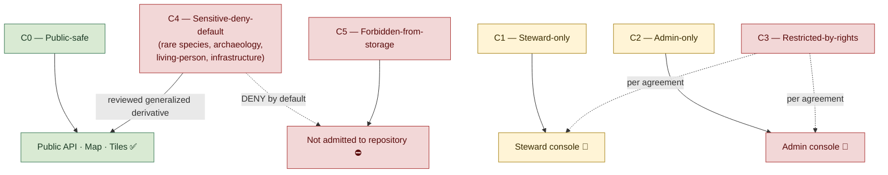

<!-- [KFM_META_BLOCK_V2]
doc_id: kfm://doc/<TODO-uuid-policy-aware>
title: Policy Aware
type: standard
version: v1
status: draft
owners: <TODO: doctrine maintainers (e.g., Governance Steward + Policy Reviewer + Security)>
created: 2026-05-12
updated: 2026-05-12
policy_label: public
related:
  - docs/doctrine/evidence-first.md
  - docs/doctrine/lifecycle-law.md
  - docs/doctrine/authority-ladder.md
  - docs/doctrine/corrections-first-class.md
  - docs/doctrine/ai-as-assistant.md
  - docs/doctrine/map-first.md
  - docs/doctrine/time-aware.md
  - docs/doctrine/trust-posture.md
  - docs/architecture/release-and-publication.md
  - docs/architecture/governed-ai/README.md
  - docs/security/threat-model.md
  - schemas/contracts/v1/source_rights_assessment.schema.json
  - schemas/contracts/v1/sensitivity_assessment.schema.json
  - schemas/contracts/v1/source_activation_decision.schema.json
  - schemas/contracts/v1/policy_decision.schema.json
  - schemas/contracts/v1/decision_envelope.schema.json
  - schemas/contracts/v1/review_record.schema.json
  - schemas/contracts/v1/release_manifest.schema.json
  - policy/public_exposure.rego
  - policy/rights.rego
  - policy/source_roles.rego
  - policy/sensitivity/living_persons.rego
  - policy/ai/no_public_model.rego
  - control_plane/policy_gate_register.yaml
  - control_plane/role_register.yaml
  - tests/policy/
tags: [kfm, doctrine, policy, rights, sensitivity, governance, trust]
notes:
  - Codifies "Policy aware" as a normative KFM doctrine.
  - Names the six policy dimensions checked before every exposure (rights, sensitivity, source terms, review state, release state, access role).
  - Codifies the canonical fail-closed mappings verbatim from the project policy register.
  - Preserves the C0–C5 sensitivity ladder verbatim from the Data Classification Framework.
  - Preserves the four API classes verbatim (Public / Steward / Admin / Internal maintenance).
  - All concrete file paths, schema paths, register paths, and CI job names are PROPOSED until verified against the live repository.
[/KFM_META_BLOCK_V2] -->

# Policy Aware

> **The doctrine that governs how Kansas Frontier Matrix decides what may be exposed, to whom, in what shape — checking rights, sensitivity, source terms, review state, release state, and access role *before* any claim, geometry, layer, evidence summary, AI answer, or correction notice reaches a user.**


**Status:** `draft` · **Owners:** *TODO — doctrine maintainers* <sub>NEEDS VERIFICATION</sub> · **Last updated:** `2026-05-12`

> [!IMPORTANT]
> **Policy Aware** is the doctrine for *what gates exposure*. It is the partner to [`evidence-first.md`](./evidence-first.md) (what counts as evidence), [`lifecycle-law.md`](./lifecycle-law.md) (where data lives at each moment in its life), and [`map-first.md`](./map-first.md) (how evidence renders through place). When evidence resolves cleanly but policy says **no**, policy wins. There is no override route, and there is no "publish anyway" path.

---

## Quick jump

1. [The doctrine in one sentence](#1-the-doctrine-in-one-sentence)
2. [Why this doctrine exists](#2-why-this-doctrine-exists)
3. [Scope and definitions](#3-scope-and-definitions)
4. [The six policy dimensions](#4-the-six-policy-dimensions)
5. [Policy objects and the intake → release flow](#5-policy-objects-and-the-intake--release-flow)
6. [The sensitivity ladder](#6-the-sensitivity-ladder)
7. [Access roles and API classes](#7-access-roles-and-api-classes)
8. [Where the policy gate lives in the lifecycle](#8-where-the-policy-gate-lives-in-the-lifecycle)
9. [Canonical fail-closed mappings](#9-canonical-fail-closed-mappings)
10. [Finite outcomes from policy](#10-finite-outcomes-from-policy)
11. [Relationship to other doctrines](#11-relationship-to-other-doctrines)
12. [Anti-patterns to reject](#12-anti-patterns-to-reject)
13. [Conformance levels](#13-conformance-levels)
14. [FAQ](#14-faq)
15. [Related docs](#related-docs)

---

## 1. The doctrine in one sentence

> [!IMPORTANT]
> **Rights, sensitivity, source terms, review state, release state, and access role are checked before exposure.**
> Failure outcome: **`DENY` when rights, terms, or sensitivity are unclear.**

`[CONFIRMED doctrine — verbatim from the project's Trust Principles register.]`

Every other rule in this document is an operationalization of that single sentence. Where this doctrine and a lower-layer design appear to conflict, this doctrine wins until the lower-layer design is amended through an ADR.

[⬆ Back to top](#policy-aware)

---

## 2. Why this doctrine exists

KFM publishes claims about Kansas — hydrology, hazards, atmosphere, habitat, agriculture, settlements, archaeology, infrastructure, genealogy — to public, steward, and admin audiences. A claim that resolves to good evidence can still be the wrong claim to expose, because:

- **Rights** may be unknown, restricted, or carry attribution obligations the carrier cannot satisfy.
- **Sensitivity** may make exact geometry, identifying attributes, or temporal precision unsafe to publish.
- **Source terms** may forbid a particular kind of redistribution even when the data is technically retrievable.
- **Review state** may be incomplete — a draft `EvidenceBundle` is not the same as a reviewed one.
- **Release state** may be `unreleased`, `superseded`, or `withdrawn`.
- **Access role** may not be entitled to see what is being requested.

`[CONFIRMED doctrine.]` These six checks together form the **policy gate**. The gate is *prior* to exposure — it runs before a tile is served, before a feature popup is rendered, before an `EvidenceBundle` summary is emitted, before an AI answer is composed, before a `CorrectionNotice` is published.

> [!CAUTION]
> A common failure mode of evidence-rich systems is to treat *"the evidence resolves"* as a license to expose. KFM does the opposite. **Resolution earns the right to be considered for exposure; the policy gate decides whether exposure is actually allowed.** Skipping the gate because the evidence is "obviously fine" is a build-stop defect.

[⬆ Back to top](#policy-aware)

---

## 3. Scope and definitions

This doctrine governs every surface that emits an artifact a user can see, save, copy, query, export, or cite: governed APIs, the map shell, the Evidence Drawer, the timeline, AI Focus Mode answers, search results, tiles, generated reports, PDF exports, and the public correction-notice index.

The terms below are preserved verbatim from project doctrine and MUST NOT be paraphrased into generic equivalents.

| Term | Meaning |
|---|---|
| **Policy gate** | The set of six checks (rights · sensitivity · source terms · review state · release state · access role) that runs before any exposure. |
| **`PolicyDecision`** | The release-time decision artifact produced at the policy gate. Records inputs (`SourceRightsAssessment`, `SensitivityAssessment`, source role, release state, access role) and outcome (`ALLOW` / `DENY` / `ABSTAIN`). `[CONFIRMED object name.]` |
| **`DecisionEnvelope`** | The runtime envelope returned by any governed API call. Carries `outcome`, `reason_code`, `claim_id`, citations, and operator hint. `[CONFIRMED object name.]` |
| **`SourceRightsAssessment`** | The per-source record of license, terms, redistribution, attribution, and obligation status. `[CONFIRMED object name.]` |
| **`SensitivityAssessment`** | The per-source-or-per-domain record of rare-species, archaeology, infrastructure, living-person, DNA, private-land, and cultural-sovereignty sensitivities. `[CONFIRMED object name.]` |
| **`SourceActivationDecision`** | The decision artifact that admits a source for fixture-only or live use, conditional on rights and sensitivity review. `[CONFIRMED object name.]` |
| **`ReviewRecord`** | The record of a steward (or other named role) review action. `[CONFIRMED object name.]` |
| **Access role** | The named role of the requester — `public`, `steward`, `admin`, `maintainer`, `ai_assistant`, `internal_job`. `[CONFIRMED vocabulary.]` |
| **Policy-as-code** | Rego (or equivalent — see [§7.3](#73-policy-as-code)) rules under `policy/` that implement the gate; each rule ships with positive and negative fixtures. `[CONFIRMED principle; engine choice PROPOSED default.]` |

Lifecycle stage names (`RAW`, `WORK`, `QUARANTINE`, `PROCESSED`, `CATALOG`, `TRIPLET`, `PUBLISHED`), finite outcomes (`ANSWER`, `ABSTAIN`, `DENY`, `ERROR`, `STALE`), evidence objects (`EvidenceRef`, `EvidenceBundle`), and release objects (`ReleaseManifest`, `ProofPack`, `CorrectionNotice`, `RollbackPlan`) carry the meanings defined in [`lifecycle-law.md`](./lifecycle-law.md), [`evidence-first.md`](./evidence-first.md), and [`corrections-first-class.md`](./corrections-first-class.md).

[⬆ Back to top](#policy-aware)

---

## 4. The six policy dimensions

`[CONFIRMED dimensions — verbatim from the doctrine line.]` The six checks are orthogonal. A request must pass all six. A failure in any one produces a labeled `DENY` or `ABSTAIN`; combining multiple failures into a generic "blocked" message is a doctrine violation.

| # | Dimension | The question it answers | Primary input object | Failure outcome |
|---|---|---|---|---|
| 1 | **Rights** | Does the source license, terms, or agreement permit *this kind* of redistribution to *this audience*, with the required attribution? | `SourceRightsAssessment` | `DENY policy.rights_unclear` |
| 2 | **Sensitivity** | Does the content involve a sensitivity class (rare species, archaeology, infrastructure, living person, DNA, sacred site, private land) that constrains exact geometry, identity, or temporal precision? | `SensitivityAssessment` | `DENY policy.sensitive_geometry` (and related codes) |
| 3 | **Source terms** | Beyond license, are there source-specific terms (rate limits, mediation requirements, no-derivative-resale clauses, embargo windows) that constrain *this* call? | `SourceDescriptor.terms` + `SourceActivationDecision` | `DENY policy.terms_violation` <sub>PROPOSED code</sub> |
| 4 | **Review state** | Has the candidate been reviewed by the appropriate steward role, and is the review still valid? | `ReviewRecord` | `DENY release.unreviewed` |
| 5 | **Release state** | Is the artifact `released` (or `superseded` / `withdrawn` in a way the surface honors)? | `ReleaseManifest` + `CorrectionNotice` | `DENY release.unpublished` |
| 6 | **Access role** | Is the requester a role authorized to see this class of artifact through this route? | Auth context + `control_plane/role_register.yaml` <sub>PROPOSED</sub> | `DENY policy.access_role` <sub>PROPOSED code</sub> |

> [!NOTE]
> The dimensions are **named separately on purpose.** A common anti-pattern is to fold "review state" into "release state," or "source terms" into "rights." Each dimension has its own object family, its own validator, and its own audit trail. Collapsing them produces silent overrides.

[⬆ Back to top](#policy-aware)

---

## 5. Policy objects and the intake → release flow

Policy is not a one-time check at publication. It begins at source admission and is re-checked at every release. The flow below is preserved verbatim from the **Source Intake Model** (CONFIRMED doctrine).

```mermaid
flowchart LR
    classDef intake fill:#FFE9E0,stroke:#B85C38,color:#3B1B0A;
    classDef review fill:#FFF6D6,stroke:#A88B00,color:#3B2F00;
    classDef active fill:#E5F1FF,stroke:#3A6EB4,color:#102A4C;
    classDef gate   fill:#E1ECFB,stroke:#3A6EB4,color:#102A4C;
    classDef pub    fill:#C9E4C7,stroke:#3B7A57,color:#1B3A24;
    classDef deny   fill:#F2D7D7,stroke:#A33,color:#5A0A0A;

    SD["source_discovery<br/>SourceDescriptor (draft)"]:::intake
    RR["rights_review<br/>SourceRightsAssessment"]:::review
    SR["sensitivity_review<br/>SensitivityAssessment"]:::review
    ACT["activation<br/>SourceActivationDecision"]:::active
    IN["intake → normalization<br/>IntakeReceipt + TransformReceipt"]:::active
    EVID["evidence_resolution<br/>EvidenceRef → EvidenceBundle"]:::active
    GATE{{"promotion_candidate<br/>ValidationReport + PolicyDecision"}}:::gate
    REL["ReleaseManifest + ProofPack<br/>+ ReviewRecord"]:::pub
    PUB["PUBLISHED<br/>governed routes only"]:::pub

    D1["DENY rights_unclear"]:::deny
    D2["QUARANTINE or<br/>generalized_only"]:::deny
    D3["DENY release.unreviewed /<br/>release.unpublished"]:::deny

    SD --> RR
    RR -- ALLOW --> SR
    RR -. unknown / restricted .-> D1
    SR -- ALLOW --> ACT
    SR -. sensitive .-> D2
    ACT --> IN --> EVID --> GATE
    GATE -- ALLOW --> REL --> PUB
    GATE -. fail .-> D3
```



`[Diagram is INFERRED from the CONFIRMED Source Intake Model and the eleven-step publication transition. The object names and gate semantics are CONFIRMED; the exact graph shape is illustrative.]`

### 5.1 Per-stage policy disposition

| Stage | Required policy object | Gate | Failure disposition |
|---|---|---|---|
| `source_discovery` | `SourceDescriptor` draft | Source role, scope, authority limits stated. | `ABSTAIN` for authority use; keep draft. |
| `rights_review` | `SourceRightsAssessment` | Terms, license, redistribution, attribution recorded. | `DENY` public release if unknown / restricted. |
| `sensitivity_review` | `SensitivityAssessment` | Rare species, archaeology, infrastructure, living persons, DNA, private land assessed. | `QUARANTINE` or `generalized_only`. |
| `activation` | `SourceActivationDecision` | Fixture-only or live activation approved by named role. | Blocked if any prior review is missing. |
| `intake` / `normalization` | `IntakeReceipt`, `TransformReceipt` | Hashes, retrieval time, `spec_hash`, `source_id`, units, CRS. | `ERROR` or `QUARANTINE` on mismatch. |
| `evidence_resolution` | `EvidenceResolutionRecord` | `EvidenceRef` resolves to `EvidenceBundle` and `SourceDescriptor`. | `ABSTAIN evidence.unresolved` for claims. |
| `promotion_candidate` | `ValidationReport` + `PolicyDecision` | All six policy dimensions checked. | `DENY` / `ABSTAIN` / `ERROR` until fixed. |
| `release` | `ReleaseManifest` + `ProofPack` + `ReviewRecord` | Validation, policy, review, proof, rollback target all present. | `DENY release.unreviewed` / `DENY release.unpublished`. |

> [!WARNING]
> **Live connectors are NOT activated until rights, sensitivity, activation, retry/failure, and monitoring are all in place.** `[CONFIRMED build-order rule.]` The greenfield first increment uses no-network source descriptors and fixtures; live activation is a later, audited transition.

[⬆ Back to top](#policy-aware)

---

## 6. The sensitivity ladder

`[CONFIRMED classification framework — verbatim from the Data Classification Framework.]` Every claim, dataset, layer, `EvidenceBundle`, fixture, and downstream artifact carries a class. The ladder resolves the ambiguity that arises when "public" is treated as a single category.

| Class | Audience | Network exposure | Default disposition |
|---|---|---|---|
| **C0 — Public-safe** | Anonymous public. | Open public route via governed API and tile service. | `ALLOW` through `/api/v1/*` once released. |
| **C1 — Steward-only** | Authenticated stewards (named role). | Steward subnet / VPN / allowlisted reverse proxy. | `ALLOW` through `/steward/v1/*` only. |
| **C2 — Admin-only** | Authenticated admins. | Admin subnet only. | `ALLOW` through `/admin/v1/*` only. |
| **C3 — Restricted-by-rights** | Determined by license / source terms / agreement. | Per agreement; never broader than the source allows. | `ALLOW` per `SourceRightsAssessment`; else `DENY policy.rights_unclear`. |
| **C4 — Sensitive-deny-default** | Stewards with explicit cultural / legal authorization. | `DENY` by default; access only via reviewed steward query. | `DENY policy.sensitive_geometry` at public surfaces; generalized derivative may be admissible per [§6.2](#62-generalization-and-redaction-receipts). |
| **C5 — Forbidden-from-storage** | None. | Not stored. | Connectors MUST drop fields matching this class even if upstream provides them. |



`[Per-domain class assignments PROPOSED until each domain's sensitivity decisions are recorded in a `SensitivityAssessment`.]`

### 6.1 Example default assignments

`[CONFIRMED defaults — selected rows from the Data Classification Framework; full table lives in the framework doc.]`

| Domain attribute | Default class | Notes |
|---|:---:|---|
| Hydrologic gauge observation (USGS NWIS) | C0 | Source is public; observation is open-licensed. |
| HUC12 watershed boundary (WBD) | C0 | Public boundary; effective date matters. |
| FEMA NFHL flood zone | C0 | Regulatory designation; not life-safety routing. |
| Census TIGER administrative boundary | C0 | Effective date and version are mandatory metadata. |
| Imagery (NAIP / Landsat / Sentinel) | C0 / C3 | Public missions are C0; commercial imagery is C3. |
| Mesonet station observation | C0 / C3 | Most open; some site-level sensors carry restrictions. |
| Rare / threatened species exact occurrence | C4 | Generalized output may be C0; exact geometry is C4 by default. |
| Archaeological site exact location | C4 | Generalized output may be C0 with cultural review; exact geometry is C4. |
| Cultural / sacred site, sovereignty-governed | C4 | Tribal sovereignty controls; see compliance chapter. |
| Living-person identity (genealogy, land records) | C4 | Historical-deceased records may be C0 with privacy review. |
| DNA-derived assertion linking living relatives | C5 | Not stored. Connectors MUST drop these fields. |
| Critical-infrastructure exact geometry | C4 | Generalized output may be C0 if no exposure risk. |

### 6.2 Generalization and redaction receipts

`[CONFIRMED — sub-doctrine from the Spatial Foundation domain and `map-first.md` §8.]` A C4 record may still ground a public claim, provided the public surface displays only a *generalized* derivative that carries a receipt.

| Receipt | What it records | Failure outcome if missing |
|---|---|---|
| **`Generalization Transform`** | The transform parameters (e.g., HUC8-level rollup, county-level aggregation, jitter radius) and the originating `SensitivityAssessment`. | `DENY` generalized geometry shown without receipt. |
| **`Redaction Receipt`** | The fact of, and reason for, withholding (e.g., suppressed sub-county geometry, withheld stopover, redacted name). | `DENY` redaction asserted without receipt. |
| **`ProjectionTransformReceipt`** | The CRS reprojection record (so drift cannot accumulate silently). | `ERROR` if reprojection drift cannot be reconstructed. |

> [!CAUTION]
> **Client-side simplification at render time is NOT generalization in the doctrinal sense.** Real generalization is a governed transform, applied before release, with a receipt. A renderer that simplifies a C4 geometry on the client to fit the zoom level has not produced a public-safe layer — it has leaked the exact geometry over the wire. `[CONFIRMED anti-pattern; see `map-first.md` §8.1.]`

[⬆ Back to top](#policy-aware)

---

## 7. Access roles and API classes

Policy is parametrized by *who is asking*. The access-role dimension answers "is this requester entitled to see this class of artifact through this route?" without folding into rights or sensitivity.

### 7.1 Access roles

`[CONFIRMED roles — verbatim from the Roles register.]`

| Role | Allowed responsibility | Denied responsibility |
|---|---|---|
| **Public user** (anonymous) | View released public-safe outputs, Evidence Drawers, correction notices, and abstain / deny / error explanations. | Access RAW / WORK / QUARANTINE / candidate data, steward queues, admin actions, direct model endpoints. |
| **Steward** | Review candidates, source activation, evidence closure, domain sensitivity, and correction notices. | Bypass validation, publish without `ReleaseManifest`, or secretly replace artifacts. |
| **Admin** | Maintenance, rollback execution, source activation plumbing, emergency shutdown, infrastructure. | Act as a public route; approve evidence by infrastructure authority alone. |
| **Maintainer** | Create code, schemas, tests, docs, policies, and releases through the PR process. | Land trust-bearing changes without validators and review gates. |
| **AI assistant** | Draft summaries, extract candidates, compare sources, classify candidates, suggest corrections. | Decide truth, rights, sensitivity, release, stewardship, or canonical records alone. |

### 7.2 API classes

`[CONFIRMED API classes — verbatim from the API Surface Plan.]` Each class has its own route family, its own envelope, and its own audit posture. **No route from a lower trust class may reach into a higher trust class.**

| API class | Conceptual route family | Allowed consumers | Required envelope |
|---|---|---|---|
| **Public** | `/api/v1/*` | Anonymous or authenticated public. | `DecisionEnvelope` or `RuntimeResponseEnvelope`. Cite-or-abstain enforced. |
| **Steward** | `/steward/v1/*` | Authenticated stewards. | `DecisionEnvelope` + `ReviewRecord` payloads. |
| **Admin** | `/admin/v1/*` | Authenticated admins. | `AdminActionEnvelope`. |
| **Internal maintenance** | `/internal/v1/*` | Trusted jobs only. | Internal envelope; never externally exposed. |

> [!WARNING]
> A public route that returns *any* of: raw paths, unresolved claims, uncited factual statements, model outputs bypassing the AI boundary, or restricted exact geometry is a **build-stop defect**. `[CONFIRMED — verbatim posture from the API Surface Plan.]`

### 7.3 Policy as code

`[CONFIRMED principle; engine choice is the PROPOSED default.]` KFM expresses the policy gate as machine-checked rules.

- **Default engine:** Open Policy Agent (OPA) with Rego. <sub>PROPOSED</sub>
- **Alternative engines** are permitted if the choice is recorded in an ADR.
- **Failure posture:** rules **fail closed** — an unknown input or evaluation error produces `DENY` or `ERROR`, never `ALLOW`.
- **Test posture:** every rule ships with positive AND negative fixtures, and at least one negative-path test in `tests/policy/`. <sub>PROPOSED path</sub>

```text
policy/
├── public_exposure.rego              # who may see what at /api/v1/*
├── rights.rego                       # SourceRightsAssessment gate
├── source_roles.rego                 # source role supports proposed claim type
├── sensitivity/
│   ├── living_persons.rego
│   ├── archaeology.rego
│   └── rare_species.rego
├── ai/
│   └── no_public_model.rego          # public → model bypass DENY
└── domains/                          # per-domain overrides
    └── archaeology.rego
```

`[Directory tree PROPOSED — pattern follows the project's established `policy/` layout; verify against the live repository.]`

[⬆ Back to top](#policy-aware)

---

## 8. Where the policy gate lives in the lifecycle

`[CONFIRMED placement — the policy gate is step 3 of the eleven-step publication transition codified in `lifecycle-law.md` §6.]`

```mermaid
flowchart LR
    classDef step fill:#F4F4F4,stroke:#444,color:#1F1F1F;
    classDef gate fill:#E1ECFB,stroke:#3A6EB4,color:#102A4C,stroke-width:2px;
    classDef pub  fill:#C9E4C7,stroke:#3B7A57,color:#1B3A24;
    classDef deny fill:#F2D7D7,stroke:#A33,color:#5A0A0A;

    S1["1 · candidate"]:::step
    S2["2 · validation<br/>ValidationReport"]:::step
    S3["3 · POLICY GATE<br/>PolicyDecision"]:::gate
    S4["4 · review<br/>ReviewRecord"]:::step
    S5["5 · manifest<br/>ReleaseManifest"]:::step
    S6["6 · proof<br/>ProofPack"]:::step
    S7["7 · published artifact"]:::pub
    S8["8 · catalog update"]:::pub
    S9["9 · API / map availability"]:::pub
    S10["10 · correction path"]:::step
    S11["11 · rollback path"]:::step

    DENY["DENY · ABSTAIN · ERROR<br/>(see §9)"]:::deny

    S1 --> S2 --> S3 --> S4 --> S5 --> S6 --> S7 --> S8 --> S9 --> S10 --> S11
    S3 -. fail .-> DENY
```



`[Diagram is INFERRED from the CONFIRMED eleven-step transition; placement of the policy gate at step 3 is CONFIRMED.]`

### 8.1 Re-evaluation triggers

The policy gate is not run only once. It re-evaluates whenever any of the following occurs:

| Trigger | Re-runs the gate because… |
|---|---|
| A `CorrectionNotice` is issued | …the post-correction record may have a different rights / sensitivity / review state. `[CONFIRMED via `corrections-first-class.md`.]` |
| A `RollbackPlan` is executed | …the previous-release record's policy decision is again the authoritative one; the rolled-forward decision is voided. |
| A `SourceRightsAssessment` is updated | …prior `PolicyDecision`s anchored on the old assessment are revisited; affected releases either re-pass or are withdrawn. |
| A `SensitivityAssessment` changes class (e.g., C0 → C4) | …all derivatives are inspected; non-conforming derivatives are withdrawn with a public `CorrectionNotice`. |
| A new access-role definition is added | …role-conditional routes are re-evaluated; routes that depended on prior role definitions DENY until re-decided. |
| Freshness window expires | …the surface marks affected claims `STALE` and re-runs the gate on next request. `[CONFIRMED via `time-aware.md`.]` |

> [!NOTE]
> Re-evaluation is **not** a rewrite of history. Prior `PolicyDecision` records remain in `data/receipts/` (append-only); the *current* decision is the most recent one bound to a `ReleaseManifest`. `[CONFIRMED via `lifecycle-law.md` and `corrections-first-class.md`.]`

[⬆ Back to top](#policy-aware)

---

## 9. Canonical fail-closed mappings

`[CONFIRMED doctrine — verbatim from `control_plane/policy_gate_register.yaml` <sub>PROPOSED path</sub>.]` These mappings are normative: a condition on the left **always** produces the outcome on the right; no surface may silently transform a `DENY` into a softer signal.

| Condition | Outcome |
|---|---|
| Sensitive geometry exposed | `DENY policy.sensitive_geometry` — no public publication. |
| Public RAW access | `DENY policy.no_raw_public` — no public publication. |
| Publication before review | `DENY release.unreviewed` — no public publication. |
| Direct model-client bypass | `DENY policy.no_public_model` — no public publication. |
| Missing citation | `ABSTAIN evidence.missing` — no public publication. |
| Invalid `spec_hash` | `ERROR system.integrity_failure` — no public publication. |
| Rollback mismatch | `ERROR system.integrity_failure` — operator alert. |
| Unsupported source authority | `DENY policy.rights_unclear` — no public publication. |
| Unreviewed correction | `DENY release.unreviewed` — no public publication. |
| Invalid release state | `DENY release.unpublished` — no public publication. |

> [!IMPORTANT]
> The reason-code vocabulary (`policy.sensitive_geometry`, `policy.no_raw_public`, `release.unreviewed`, `policy.no_public_model`, `evidence.missing`, `system.integrity_failure`, `policy.rights_unclear`, `release.unpublished`) is **finite and stable**. New conditions ADD codes; they do not paraphrase existing ones. Every code lives in `policy_gate_register.yaml` with a canonical human-readable message and an operator-hint template.

[⬆ Back to top](#policy-aware)

---

## 10. Finite outcomes from policy

The policy gate speaks the same finite outcomes as the rest of the trust system — `ANSWER`, `ABSTAIN`, `DENY`, `ERROR`, `STALE`. There is no policy-specific outcome vocabulary.

| Outcome | Meaning at the policy gate | Required envelope fields |
|---|---|---|
| **`ANSWER`** | All six dimensions passed; exposure proceeds with citations. | `claim_id`, `evidence_refs`, `release_id`, `policy_decision_id`, `outcome: ANSWER`. |
| **`ABSTAIN`** | A required input is missing (citation, evidence resolution, review record); the system declines rather than guessing. | `outcome: ABSTAIN`, `reason_code`, `operator_hint`. |
| **`DENY`** | A policy dimension said no (rights, sensitivity, source terms, release state, access role). | `outcome: DENY`, `reason_code`, `operator_hint` (without leaking sensitive content). |
| **`ERROR`** | System integrity failure encountered during policy evaluation (e.g., manifest hash mismatch, register schema invalid). | `outcome: ERROR`, `reason_code`, alert routed to on-call. |
| **`STALE`** | The supporting evidence is past its freshness window; the surface marks the claim `STALE` and the gate is re-run on next request. | `outcome: STALE`, `claim_id`, `freshness_window`, `release_id`. |

**Example `DENY` envelope** *(illustrative — exact envelope shape is PROPOSED at schema level)*:

```json
{
  "outcome": "DENY",
  "reason_code": "policy.sensitive_geometry",
  "claim_id": "cl-arch-1842-7",
  "release_id": "rel-2026-05-12-archaeology-public-v1",
  "operator_hint": "C4 site geometry requested through /api/v1/*; release exposes only the C0 generalized derivative."
}
```

> [!CAUTION]
> **Operator hints must never leak the very thing the policy denies.** The hint above says *"requested through /api/v1/*"*, not the coordinates. Hints describe the *shape* of the denial, not its contents. `[CONFIRMED posture.]`

[⬆ Back to top](#policy-aware)

---

## 11. Relationship to other doctrines

Policy Aware is one of the six **CONFIRMED Trust Principles**. The matrix below shows where it hooks into the others.

| Sibling doctrine | Where Policy Aware hooks in | Extends or restricts |
|---|---|---|
| [`evidence-first.md`](./evidence-first.md) | The policy gate consumes resolved `EvidenceBundle`s; it does **not** decide what counts as evidence. | **Composes** — evidence resolves first, policy decides whether resolved evidence may be exposed. |
| [`lifecycle-law.md`](./lifecycle-law.md) | Step 3 of the eleven-step publication transition is the policy gate. Re-evaluation triggers come from lifecycle events. | **Operationalizes** — the policy gate is a named transition in the lifecycle invariant. |
| [`authority-ladder.md`](./authority-ladder.md) | The Primary / Secondary / Tertiary ladder governs *what counts as authoritative documentation*; the policy gate governs *what may be exposed*. The two are orthogonal but collaborate at release. | **Orthogonal** — both ground a `ReleaseManifest` from different angles. |
| [`corrections-first-class.md`](./corrections-first-class.md) | A `CorrectionNotice` re-runs the policy gate on the corrected record. Unreviewed corrections fail with `DENY release.unreviewed`. | **Extends** — corrections inherit the gate. |
| [`ai-as-assistant.md`](./ai-as-assistant.md) | AI never decides rights, sensitivity, or release. `policy/ai/no_public_model.rego` enforces the no-direct-public-model rule. Public → model bypass is `DENY policy.no_public_model`. | **Restricts** — AI is bounded by the gate; it cannot vote at it. |
| [`map-first.md`](./map-first.md) | Trust badges, the Evidence Drawer, and layer admission all surface policy state. Sensitive exact geometry is denied at the layer level. | **Operationalizes** — the map surface renders the policy gate's outcomes visibly. |
| [`time-aware.md`](./time-aware.md) | The freshness window contributes to the `STALE` outcome; expired freshness re-runs the gate. | **Composes** — temporal posture feeds the gate. |
| [`trust-posture.md`](./trust-posture.md) | Truth labels (`CONFIRMED`, `PROPOSED`, `NEEDS VERIFICATION`, `UNKNOWN`) live alongside runtime outcomes (`DENY`, `ABSTAIN`, `ERROR`, `STALE`). Policy emits the runtime outcomes. | **Composes** — runtime outcomes from this doctrine populate the trust posture vocabulary. |

[⬆ Back to top](#policy-aware)

---

## 12. Anti-patterns to reject

The anti-patterns below are CONFIRMED-rejection cases. Each represents a real failure mode in policy-aware systems.

| Anti-pattern | Why rejected | Corrective doctrine line |
|---|---|---|
| "The evidence resolved, so we exposed it." | Resolution is necessary but not sufficient; policy decides exposure. | §2, "Resolution earns the right to be considered." |
| Folding "review state" into "release state" in one boolean. | The two dimensions have distinct objects (`ReviewRecord` vs `ReleaseManifest`) and distinct re-evaluation triggers. | §4, the six dimensions are orthogonal. |
| Folding "source terms" into "rights." | License is one thing; per-call terms (rate, embargo, mediation) are another. | §4, dimensions 1 and 3 are separate. |
| `DENY` rendered as a generic "not available" with no reason code. | Operators cannot debug or correct; users cannot trust the system. | §10, every outcome carries a `reason_code`. |
| Operator hint that leaks the denied content (e.g., the exact coordinate that was denied). | Hints describe the shape of the denial, not its contents. | §10, CAUTION callout. |
| Client-side simplification of C4 geometry presented as "generalized." | Real generalization is a governed transform with a receipt, applied before release. | §6.2, generalization receipts. |
| AI summary that "considers" rights / sensitivity instead of the policy gate. | AI is not a policy authority; it cannot vote at the gate. | §11, `ai-as-assistant.md` row. |
| `SourceRightsAssessment` marked "unknown" but the source activated anyway. | Activation requires a recorded decision; "unknown" is `DENY policy.rights_unclear`. | §5.1, activation row. |
| A new C4 sensitivity decision is silently applied to old releases without a `CorrectionNotice`. | Re-classification IS a public event; old derivatives must be withdrawn or superseded with notice. | §8.1, re-evaluation triggers; `corrections-first-class.md`. |
| Public route returns a raw row from the source table, "just for debugging." | Public routes consume only `DecisionEnvelope` payloads. There is no "debug-public" tier. | §7.2, API classes; `map-first.md` anti-patterns. |
| Combining "missing citation" and "denied by sensitivity" into one outcome. | Different dimensions produce different codes (`ABSTAIN evidence.missing` vs `DENY policy.sensitive_geometry`). | §9, canonical mappings. |
| Treating an old `PolicyDecision` as still valid after the underlying `SensitivityAssessment` changed. | Decisions are anchored to assessment versions; assessment change re-runs the gate. | §8.1, re-evaluation triggers. |
| "It's just metadata — we don't need a policy decision." | Metadata is a claim about a source; the policy gate applies. | §4, scope is every exposure. |

[⬆ Back to top](#policy-aware)

---

## 13. Conformance levels

`[PROPOSED at implementation level; vocabulary CONFIRMED.]` Policy-aware conformance is phased honestly. L0 is fixture-level; L1 is the public-safe proof lane; L2 is broad-domain coverage with federated attestation.

| Level | What the policy gate guarantees | Required objects |
|---|---|---|
| **L0** | Fixture-level: at least one positive AND one negative fixture per Rego rule; the gate emits `DecisionEnvelope` shapes; no live public traffic. | `policy/*.rego` with fixtures; `tests/policy/` round-trip; one synthetic `PolicyDecision`. |
| **L1** | One public-safe proof lane (e.g., hydrology) has all six dimensions enforced end-to-end; canonical mappings honored; reason codes finite; release-dry-run CI green. | All policy objects for one lane; `policy_gate_register.yaml`; release-dry-run job. |
| **L2** | Multi-lane coverage with attested separation of duties (at least two distinct human roles sign release-significant actions); cross-domain `SensitivityAssessment` changes propagate via `CorrectionNotice`. | Federated review attestations; cross-domain re-evaluation hooks; audit retention policy. |

> [!TIP]
> Public claims of "policy-aware" maturity MUST cite a specific conformance level. "We're policy-aware" with no level attached is a marketing sentence, not a doctrinal claim.

[⬆ Back to top](#policy-aware)

---

## 14. FAQ

<details>
<summary><b>Doesn't "released" already imply rights, sensitivity, and review have been checked?</b></summary>

In implementation, yes — the release gate enforces all six dimensions. But **release state alone is not the doctrine.** Treating "released" as a single boolean fold collapses the six dimensions into one, losing the audit trail and the re-evaluation triggers. Each dimension keeps its own object family and its own validator precisely so that a change in one (a `SourceRightsAssessment` update, a `SensitivityAssessment` re-class) can drive a precise correction without rebuilding everything.

</details>

<details>
<summary><b>Why is "access role" a policy dimension and not an auth concern?</b></summary>

Authentication answers *"who are you?"* — that's a security concern. **Access role** answers *"is this role authorized to see this class of artifact through this route?"* — that's a policy concern. KFM separates them on purpose: a correctly authenticated steward asking through a public route is still denied; a correctly authenticated public user asking through a steward route is still denied. The role-route pair is the policy input, not just the identity.

</details>

<details>
<summary><b>What if AI helps draft a `SensitivityAssessment`?</b></summary>

AI may **draft** a `SensitivityAssessment` (extract candidate sensitivities from source metadata, propose a class, suggest generalization parameters). A named steward role **decides** it. The `SensitivityAssessment` record carries the deciding role; the AI draft is preserved as an `AIReceipt` for audit. `[CONFIRMED via `ai-as-assistant.md`.]`

</details>

<details>
<summary><b>What if a source's rights are public but the source's terms forbid bulk redistribution?</b></summary>

That is precisely why "rights" and "source terms" are separate dimensions. A C0 dataset under a permissive license may still have per-call terms (rate limit, embargo, mediation requirement, no-derivative-resale) that constrain *how* it may be exposed. The policy gate checks both. A bulk-redistribution route that bypasses the terms is `DENY policy.terms_violation` <sub>PROPOSED code</sub>.

</details>

<details>
<summary><b>How does a public user appeal a `DENY`?</b></summary>

A public `DENY` carries a stable `reason_code` and an operator hint that does not leak the denied content. The public path forward is the [`corrections-first-class.md`](./corrections-first-class.md) intake — submit a correction request citing the public claim id. A steward reviews; if the underlying `SensitivityAssessment` or `SourceRightsAssessment` was wrong, the correction triggers a new release. There is no "ask an admin nicely" route, and no override field on the public surface.

</details>

<details>
<summary><b>What happens when an external standard (e.g., a license version) updates?</b></summary>

A license update is a change to the `SourceRightsAssessment` inputs. The steward records a new `SourceRightsAssessment` version; the policy gate re-evaluates all releases that anchored on the old assessment. Releases that re-pass continue; releases that no longer pass are withdrawn with a `CorrectionNotice`. The old `PolicyDecision` records remain in `data/receipts/` (append-only). `[CONFIRMED via `lifecycle-law.md` §9 and `corrections-first-class.md`.]`

</details>

<details>
<summary><b>Is the policy gate fast enough for a public map surface?</b></summary>

The gate runs at *release time*, not at every public request. The public route consumes already-decided `PolicyDecision`s carried with the released artifacts. Per-request work is cache lookup plus access-role check plus freshness check — not full Rego evaluation. Re-evaluation (§8.1) is what triggers a *new* policy decision, not the user's click.

</details>

<details>
<summary><b>How does policy-aware relate to map-first?</b></summary>

Map-first is the doctrine for *how evidence renders through place*; policy-aware is the doctrine for *what may be exposed in the first place*. They meet at the layer-admission rule in [`map-first.md`](./map-first.md) §4.1: a `LayerManifest` cannot be admitted unless its `PolicyDecision` says `ALLOW`, and the layer card carries trust badges that surface the policy state. Restricted exact geometry is denied at the layer level, not at the click level — the doctrine fails closed at admission, not at render time.

</details>

[⬆ Back to top](#policy-aware)

---

## Related docs

- [`docs/doctrine/evidence-first.md`](./evidence-first.md) — Root trust doctrine; cite-or-abstain; `EvidenceRef` → `EvidenceBundle` resolution. `[CONFIRMED sibling.]`
- [`docs/doctrine/lifecycle-law.md`](./lifecycle-law.md) — `RAW → WORK/QUARANTINE → PROCESSED → CATALOG/TRIPLET → PUBLISHED`; the policy gate is step 3 of the eleven-step transition. `[CONFIRMED sibling.]`
- [`docs/doctrine/authority-ladder.md`](./authority-ladder.md) — Primary / Secondary / Tertiary documentation authority; orthogonal to the policy gate. `[CONFIRMED sibling.]`
- [`docs/doctrine/corrections-first-class.md`](./corrections-first-class.md) — `CorrectionNotice` re-runs the policy gate; unreviewed corrections DENY. `[CONFIRMED sibling.]`
- [`docs/doctrine/ai-as-assistant.md`](./ai-as-assistant.md) — AI is bounded by the policy gate; it cannot vote at it. `[CONFIRMED sibling.]`
- [`docs/doctrine/map-first.md`](./map-first.md) — Trust badges, Evidence Drawer, and layer admission surface the policy state. `[CONFIRMED sibling.]`
- [`docs/doctrine/time-aware.md`](./time-aware.md) — Freshness windows feed the `STALE` outcome. `[NEEDS VERIFICATION — confirm exact filename.]`
- [`docs/doctrine/trust-posture.md`](./trust-posture.md) — Truth labels alongside runtime outcomes. `[NEEDS VERIFICATION — confirm exact filename.]`
- [`docs/architecture/release-and-publication.md`](../architecture/release-and-publication.md) — The eleven-step release state machine; canonical source for steps 1–11. `[NEEDS VERIFICATION — exact path.]`
- [`docs/security/threat-model.md`](../security/threat-model.md) — STRIDE coverage including policy-gate trust boundaries. `[TODO — confirm filename.]`
- `schemas/contracts/v1/source_rights_assessment.schema.json` — Machine-readable schema. `[PROPOSED path.]`
- `schemas/contracts/v1/sensitivity_assessment.schema.json` — Machine-readable schema. `[PROPOSED path.]`
- `schemas/contracts/v1/source_activation_decision.schema.json` — Machine-readable schema. `[PROPOSED path.]`
- `schemas/contracts/v1/policy_decision.schema.json` — Machine-readable schema. `[PROPOSED path.]`
- `schemas/contracts/v1/decision_envelope.schema.json` — Machine-readable schema. `[PROPOSED path.]`
- `control_plane/policy_gate_register.yaml` — Canonical fail-closed mappings. `[PROPOSED path.]`
- `control_plane/role_register.yaml` — Access-role definitions. `[PROPOSED path.]`
- ADR — *Policy engine selection (OPA / Rego vs. alternatives)*. `[TODO — ADR not yet authored.]`
- ADR — *Six policy dimensions are orthogonal and named separately*. `[TODO — ADR not yet authored.]`

---

<sub>**Last updated:** 2026-05-12 · **Version:** v1 (draft) · **Doctrine track:** `docs/doctrine/`</sub>

[⬆ Back to top](#policy-aware)
