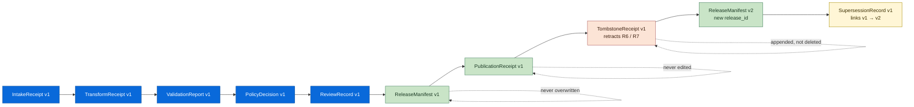
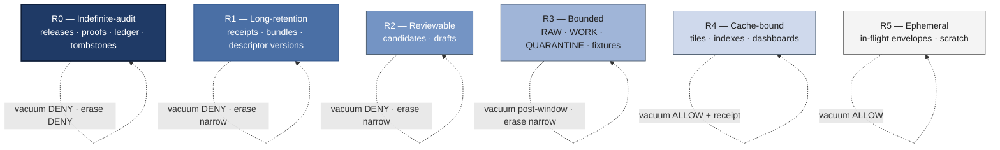
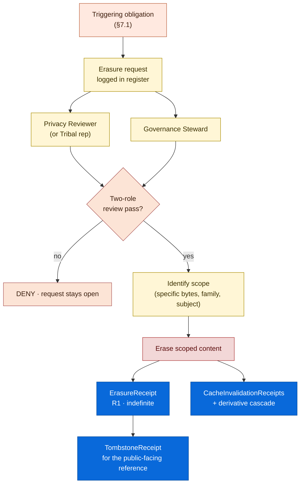

<!-- [KFM_META_BLOCK_V2]
doc_id: kfm://doc/<TODO-uuid-retention>
title: Retention
type: standard
version: v1.0
status: draft
owners: <TODO: doctrine maintainers (e.g., Governance Steward + Data Lifecycle Steward + Privacy Reviewer + Security)>
created: 2026-05-26
updated: 2026-05-26
policy_label: public
related:
  - docs/doctrine/ai-build-operating-contract.md
  - docs/doctrine/directory-rules.md
  - docs/doctrine/lifecycle-law.md
  - docs/doctrine/evidence-first.md
  - docs/doctrine/derived-stays-derived.md
  - docs/doctrine/corrections-are-first-class.md
  - docs/doctrine/policy-aware.md
  - docs/doctrine/authority-ladder.md
  - docs/doctrine/ai-as-assistant.md
  - docs/doctrine/map-first.md
  - docs/doctrine/trust-posture.md
  - docs/architecture/release-and-publication.md
  - docs/runbooks/RB-CORRECTION-ROUTINE.md
  - docs/runbooks/RB-ROLLBACK-EXECUTION.md
  - docs/runbooks/RB-ERASURE-EXECUTION.md
  - docs/security/threat-model.md
  - schemas/contracts/v1/retention_class.schema.json
  - schemas/contracts/v1/retention_policy.schema.json
  - schemas/contracts/v1/tombstone_receipt.schema.json
  - schemas/contracts/v1/erasure_receipt.schema.json
  - schemas/contracts/v1/archive_manifest.schema.json
  - schemas/contracts/v1/vacuuming_receipt.schema.json
  - schemas/contracts/v1/cache_invalidation_receipt.schema.json
  - control_plane/retention_class_register.yaml
  - control_plane/erasure_request_register.yaml
  - policy/retention/
  - tests/retention/
tags: [kfm, doctrine, retention, audit, tombstones, erasure, archival, governance]
notes:
  - Codifies retention as a normative KFM doctrine.
  - Names the retention classes (R0–R5) and the per-object-family retention obligations.
  - Codifies tombstones as the default revocation primitive; erasure as the narrow exception.
  - Codifies temporal vacuuming and archival as governed decisions, not routine operations.
  - Pinned to ai-build-operating-contract.md CONTRACT_VERSION = "3.0.0".
  - Closes the open retention question raised across the Atlas (KFM-P9-PROG-0010/-0011/-0018) and Pass 10 (C1-06, C5-09, C9-02).
  - All concrete file paths, schema paths, runbook paths, and CI job names are PROPOSED until verified against the live repository.
[/KFM_META_BLOCK_V2] -->

# Retention

> **The doctrine that governs how long Kansas Frontier Matrix keeps things — receipts, proofs, releases, candidates, raw captures, AI artifacts, tombstones — and when, why, and how the system may compact, archive, vacuum, or erase them. Memory loss is a governance act, never a routine operation.**

**Status:** Draft · **Edition:** v1.0 · **Owners:** _TODO — Governance Steward + Data Lifecycle Steward + Privacy Reviewer + Security_ NEEDS VERIFICATION · **Pins:** `CONTRACT_VERSION = "3.0.0"` · **Updated:** 2026-05-26

> [!IMPORTANT]
> **One sentence.** KFM is **append-only by default**: receipts, proofs, releases, tombstones, and the lineage chain that explains how a public claim came to be ALL persist for the retention class they were born under, and **deletion is a narrow, audited, receipted exception** — never a side effect of storage optimization, cache turnover, or convenience.

> [!NOTE]
> **Where this doc sits.** Retention is a Tier 1 doctrine doc subordinate to `ai-build-operating-contract.md` v3.0 (`CONTRACT_VERSION = "3.0.0"`) and to `directory-rules.md`. It elaborates the contract's §10.8 *"Promotion is auditable"* invariant, §10.9 *"Corrections are first-class"* invariant, and §10.10 *"Deterministic identity where practical"* invariant, applied across the time dimension. It is the partner to [`lifecycle-law.md`](./lifecycle-law.md) (where data lives), [`corrections-are-first-class.md`](./corrections-are-first-class.md) (what happens when canonical sources change), and [`policy-aware.md`](./policy-aware.md) (what gates exposure). If a conflict arises between this doc and the contract, the contract wins and the conflict becomes a `CONFLICTED` candidate for ADR resolution.

---

## Contents

1. [Why this is doctrine](#1-why-this-is-doctrine)
2. [Scope and definitions](#2-scope-and-definitions)
3. [The default: append-only](#3-the-default-append-only)
4. [Retention classes (R0–R5)](#4-retention-classes-r0r5)
5. [Per-object-family retention obligations](#5-per-object-family-retention-obligations)
6. [Tombstones: the default revocation primitive](#6-tombstones-the-default-revocation-primitive)
7. [The erasure exception](#7-the-erasure-exception)
8. [Vacuuming, compaction, and archival as governed decisions](#8-vacuuming-compaction-and-archival-as-governed-decisions)
9. [Cache invalidation as part of retention](#9-cache-invalidation-as-part-of-retention)
10. [The tension: audit vs. privacy](#10-the-tension-audit-vs-privacy)
11. [RFC 2119 conformance language](#11-rfc-2119-conformance-language)
12. [Worked example — consent revocation](#12-worked-example--consent-revocation)
13. [Anti-patterns](#13-anti-patterns)
14. [Enforcement points](#14-enforcement-points)
15. [FAQ](#15-faq)
16. [Open questions register](#16-open-questions-register)
17. [Open verification backlog](#17-open-verification-backlog)
18. [Changelog](#18-changelog)
19. [Definition of done](#19-definition-of-done)
20. [Related docs](#related-docs)

---

## 1. Why this is doctrine

A system that can prove what it published yesterday is structurally different from a system that can only prove what it published right now. The difference is **retention** — and retention is not a storage-engineering concern. It is a trust commitment that decides whether future investigators, future correctors, future rights-holders, and future readers can answer the question *"what did this system say, when, and on what basis?"*

KFM has the same trust problem every evidence-rich system has: the temptation to compact, prune, vacuum, or quietly overwrite for performance, cost, or convenience. The Atlas (`KFM-P9-PROG-0010`, `KFM-P9-PROG-0011`, `KFM-P9-PROG-0018`) explicitly names temporal vacuuming, archival partition pruning, and "purging old states" as **governance decisions with semantic consequences**, not as routine ops. The Components Atlas (`C1-06`) explicitly names the **append-only audit ledger of receipts** as a CONFIRMED-doctrine commitment.

Three properties of evidence-rich systems force this stance:

1. **What you delete, you cannot cite.** A claim whose receipt was vacuumed yesterday has no audit trail today. The map can still display the layer; the public can still read the popup; but the question *"how do we know?"* now has no answer. The map has drifted into uncited prose without anyone editing the prose.
2. **Storage optimization is a publication action.** A compaction job that drops "old" rows changes the meaning of every query that joins those rows. A vacuuming pass that drops superseded receipts breaks the supersession chain. A cache purge that drops a tile but leaves the layer manifest pointing at it produces an `ERROR system.integrity_failure`. Storage moves are publication-significant.
3. **Privacy and audit can disagree.** A right-to-erasure request, a withdrawn consent, or a Tribal sovereignty decision may require *true deletion* of content that the audit doctrine would otherwise want to preserve. The two obligations are both legitimate; the doctrine reconciles them with named, narrow erasure paths rather than abandoning either.

> [!NOTE]
> **What this doctrine does NOT decide.** It does not pick storage backends, retention durations in calendar units, or compaction schedules. Those belong to lower-tier docs: per-domain runbooks, ADRs, and the implementation. Retention fixes the *kind* of memory each object family must preserve and the *narrow* paths by which memory may be lost; how those rules are materialized is an implementation choice constrained by — but not specified by — this doc.

[⬆ Back to top](#retention)

---

## 2. Scope and definitions

This doctrine governs every artifact KFM stores — receipts, proofs, releases, candidates, raw captures, derived carriers, AI artifacts, tombstones, caches, and the indexes that point at any of these. It applies whether the storage backend is a filesystem, an object store, a database, an OCI evidence registry, or a content-addressed blob store.

| Term | Meaning |
|---|---|
| **Retention class** | The named retention obligation assigned to an object family. KFM defines six classes, **R0–R5**, in [§4](#4-retention-classes-r0r5). |
| **Retention policy** | The per-class declaration of *minimum retention period*, *append-only requirements*, *archival path*, *vacuuming permissions*, and *erasure permissions*. Lives at `policy/retention/` PROPOSED. |
| **Append-only** | The property that records are added but never edited or deleted in place. Append-only is enforced through content-addressed storage, object-lock policies, bucket versioning, write-once filesystems, or equivalents. |
| **Tombstone** | A signed, appended record that retracts a prior artifact without deleting it. The tombstone names the retracted `run_id` / `release_id` / `claim_id`, the reason, the supersession reference (if any), and the timestamp. Tombstones are the **default revocation primitive**. |
| **Erasure** | The narrow, audited, receipted *true deletion* of underlying content, permitted only for specific privacy / sovereignty / legal obligations and recorded by an `ErasureReceipt`. Erasure is the **exception**, not the default. |
| **Supersession** | The replacement of one artifact by a new one, with the prior artifact preserved as `LINEAGE`. Tombstones may name a supersession reference; supersession itself is governed by [`corrections-are-first-class.md`](./corrections-are-first-class.md). |
| **Vacuuming** | The deletion or rewriting of "old" rows / blobs / receipts for storage optimization. Vacuuming a retention-bound artifact is a doctrine violation; vacuuming a non-retention-bound cache layer is permitted with a `VacuumingReceipt`. |
| **Archival** | The relocation of retained artifacts from hot storage to cold storage (or to an external durable backend) without changing their existence. Archival emits an `ArchiveManifest`. |
| **`TombstoneReceipt`** | The signed retraction record. Schema at `schemas/contracts/v1/tombstone_receipt.schema.json` PROPOSED. |
| **`ErasureReceipt`** | The signed true-deletion record. Schema at `schemas/contracts/v1/erasure_receipt.schema.json` PROPOSED. |
| **`ArchiveManifest`** | The record of an archival relocation. Schema at `schemas/contracts/v1/archive_manifest.schema.json` PROPOSED. |
| **`VacuumingReceipt`** | The record of a permitted vacuuming pass on a non-retention-bound cache. Schema at `schemas/contracts/v1/vacuuming_receipt.schema.json` PROPOSED. |
| **`CacheInvalidationReceipt`** | The record of a cache purge tied to a tombstone or erasure event. Schema at `schemas/contracts/v1/cache_invalidation_receipt.schema.json` PROPOSED. |

Lifecycle stage names (`RAW`, `WORK`, `QUARANTINE`, `PROCESSED`, `CATALOG`, `TRIPLET`, `PUBLISHED`), finite outcomes (`ANSWER`, `ABSTAIN`, `DENY`, `ERROR`, `NARROWED`, `BOUNDED`, `SOURCE_STALE`), evidence objects (`EvidenceRef`, `EvidenceBundle`), and release objects (`ReleaseManifest`, `ProofPack`, `CorrectionNotice`, `RollbackPlan`) carry the meanings defined in [`lifecycle-law.md`](./lifecycle-law.md), [`evidence-first.md`](./evidence-first.md), [`policy-aware.md`](./policy-aware.md), and [`corrections-are-first-class.md`](./corrections-are-first-class.md).

[⬆ Back to top](#retention)

---

## 3. The default: append-only

`[CONFIRMED doctrine — `ai-build-operating-contract.md` §10.8 (Promotion is auditable) + Pass 10 C1-06 (Immutable, Append-Only Audit Ledger of Receipts).]` Every KFM object family is born under a retention class, and the **default class is append-only**. Concretely:

1. **Receipts are never edited.** An `IntakeReceipt`, `TransformReceipt`, `ValidationReport`, `PolicyDecision`, `ReviewRecord`, `PublicationReceipt`, `AIReceipt`, `GENERATED_RECEIPT`, `RunReceipt`, `RepresentationReceipt`, `RedactionReceipt`, or `EventRunReceipt` is written once and never mutated.
2. **Releases are never overwritten.** A `ReleaseManifest`, `MapReleaseManifest`, or `ProofPack` is content-addressed; updating a release means producing a new release with a new `release_id` and emitting a `SupersessionRecord` per [`corrections-are-first-class.md`](./corrections-are-first-class.md).
3. **Sources are append-only.** A `SourceDescriptor` revision creates a new descriptor version; the old version persists with `LINEAGE` status.
4. **Lineage chains do not shorten.** The chain from a public claim back to `EvidenceBundle` → `SourceDescriptor` → `IntakeReceipt` MUST remain resolvable for the full retention period of its weakest link.
5. **Tombstones add memory, they do not subtract.** A revocation appends a `TombstoneReceipt`; UI clients hide tombstoned content from public views, but the audit graph remains explorable.

> [!IMPORTANT]
> Append-only is enforced at the storage layer, not by convention. Object stores allow overwrites by default; achieving append-only requires explicit policy (object lock, bucket versioning, write-once configuration) or a content-addressed layout where overwrites are a no-op. Per Pass 10 C1-06: *"Object stores allow overwrites; achieving append-only typically requires an explicit policy (object lock, bucket versioning) or a content-addressed layout that makes overwrites a no-op."*

[⬆ Back to top](#retention)

---

## 4. Retention classes (R0–R5)

`[CONFIRMED at doctrine level; per-domain class assignments PROPOSED until each object family's `RetentionClass` is recorded.]` Every artifact in KFM carries a retention class. The class decides minimum duration, append-only requirements, archival path, and erasure permissions.

| Class | Name | Audit obligation | Vacuuming permission | Erasure permission |
|---|---|---|---|---|
| **R0 — Indefinite-audit** | Releases, manifests, proof packs, audit ledger entries, supersession records, correction notices, tombstones. | **MUST** be retained indefinitely; append-only; tamper-evident hashes / signatures. | `DENY`. | `DENY` (privacy obligations resolve via tombstone + scope-narrowed erasure; see §7). |
| **R1 — Long-retention** | Receipts (`IntakeReceipt`, `TransformReceipt`, `ValidationReport`, `PolicyDecision`, `ReviewRecord`, `PublicationReceipt`, `AIReceipt`, `GENERATED_RECEIPT`, `RunReceipt`), `EvidenceBundle`s, `SourceDescriptor` versions. | Retain through release lifecycle + audit-window minimum (PROPOSED ≥ 7 years; see [OQ-RT-02](#16-open-questions-register)). | `DENY` during retention window; archival permitted with `ArchiveManifest`. | `DENY` except via §7 erasure path. |
| **R2 — Reviewable** | Candidate artifacts (`promotion_candidate`, draft `EvidenceBundle`s, draft `SensitivityAssessment`s, draft `SourceRightsAssessment`s). | Retain until promoted, denied, or superseded; superseded candidates become `LINEAGE` at R1. | `DENY` while reviewable; rejected candidates may move to R3. | Per §7 with steward review. |
| **R3 — Bounded** | `RAW` captures, `WORK` artifacts, `QUARANTINE` material, fixtures, test artifacts. | Retain per source-class minimum (PROPOSED per-source; see [OQ-RT-03](#16-open-questions-register)). | `DENY` while the originating release retains lineage; vacuuming permitted post-release-window with `VacuumingReceipt`. | Per §7 with steward review. |
| **R4 — Cache-bound** | Tile caches, derived index caches, search index caches, CDN edge caches, browser caches, computed dashboards. | Retain per cache policy; **cache MUST NOT be the only copy** of any retained artifact. | `ALLOW` per cache policy + `CacheInvalidationReceipt` when tied to tombstone / erasure. | N/A (cache is derived; canonical persists). |
| **R5 — Ephemeral** | In-flight request envelopes, transient compute buffers, scratch intermediates, log lines below retention threshold. | None beyond debug window; **MUST NOT carry retained content as the only copy**. | `ALLOW`. | N/A. |

> [!TIP]
> **The class is set at the object family, not the individual artifact.** A specific `PolicyDecision` is R1 because the `PolicyDecision` family is R1 — not because some property of this particular decision earned R1. This is what makes retention enforceable at the storage layer: the path or the schema identifies the class.

[⬆ Back to top](#retention)

---

## 5. Per-object-family retention obligations

The table below assigns retention classes to the canonical KFM object families. Class assignments are `CONFIRMED` where they follow directly from the operating contract; `PROPOSED` where this doctrine is the first to record them.

| Object family | Class | Append-only? | Archival path | Erasure permitted? |
|---|:---:|:---:|---|:---:|
| `ReleaseManifest`, `MapReleaseManifest` | R0 | ✅ | Yes, with `ArchiveManifest` | ❌ |
| `ProofPack` | R0 | ✅ | Yes, with `ArchiveManifest` | ❌ |
| `CorrectionNotice` | R0 | ✅ | Yes | ❌ |
| `SupersessionRecord` | R0 | ✅ | Yes | ❌ |
| `TombstoneReceipt` | R0 | ✅ | Yes | ❌ |
| `RollbackPlan` / `RollbackCard` | R0 | ✅ | Yes | ❌ |
| Audit ledger entries (per Pass 10 C1-06) | R0 | ✅ | Yes (OCI evidence registry or `data/AUDIT/`) | ❌ |
| `IntakeReceipt` | R1 | ✅ | Yes | Narrow (§7) |
| `TransformReceipt` | R1 | ✅ | Yes | Narrow (§7) |
| `ValidationReport` | R1 | ✅ | Yes | Narrow (§7) |
| `PolicyDecision` | R1 | ✅ | Yes | Narrow (§7) |
| `ReviewRecord` | R1 | ✅ | Yes | Narrow (§7) |
| `PublicationReceipt` | R1 | ✅ | Yes | Narrow (§7) |
| `RunReceipt` | R1 | ✅ | Yes | Narrow (§7) |
| `RepresentationReceipt` | R1 | ✅ | Yes | Narrow (§7) |
| `EvidenceBundle` | R1 | ✅ | Yes | Narrow (§7) |
| `SourceDescriptor` versions | R1 | ✅ | Yes | Narrow (§7) |
| `AIReceipt` | R1 | ✅ | Yes | Narrow (§7) |
| `GENERATED_RECEIPT` | R1 | ✅ | Yes | Narrow (§7) |
| `RedactionReceipt` | R1 | ✅ | Yes | Narrow (§7) |
| `Generalization Transform` | R1 | ✅ | Yes | Narrow (§7) |
| `EventRunReceipt` (Pre-RAW) | R1 | ✅ | Yes | Narrow (§7) |
| `ErasureReceipt` | R1 | ✅ | Yes | ❌ (the receipt itself MUST persist) |
| Candidate `promotion_candidate` artifacts | R2 | ✅ until decided | Yes after decision | Per steward review (§7) |
| Draft `SensitivityAssessment` / `SourceRightsAssessment` | R2 | ✅ until decided | Yes after decision | Per steward review (§7) |
| `RAW` captures | R3 | ✅ | Yes, with `ArchiveManifest` | Per steward review (§7); see [OQ-RT-04](#16-open-questions-register) for FamilySearch / DTC consent-revocation case |
| `WORK` artifacts | R3 | ✅ | Yes after release | Narrow (§7) |
| `QUARANTINE` material | R3 | ✅ | Yes | Per steward review (§7) |
| `data/fixtures/` artifacts | R3 | ✅ | Yes | Per fixture lifecycle |
| `PMTiles`, `MVT`, `COG`, `GeoParquet` published carriers | R4 (cache) + lineage to R0 `LayerManifest` | Carrier may be invalidated; lineage persists | Cache N/A; lineage yes | N/A (carrier is derived) |
| Tile / index / dashboard caches | R4 | ❌ (regenerable) | N/A | N/A |
| Browser / edge / CDN caches | R4 | ❌ | N/A | N/A |
| `RuntimeResponseEnvelope` in-flight | R5 | ❌ | N/A | N/A |
| Compute scratch buffers, transient logs | R5 | ❌ | N/A | N/A |

> [!IMPORTANT]
> A cache (R4) **MUST NOT** be the only copy of any retained artifact. If the cache disappears, the canonical source (R0 / R1 / R2 / R3) is still present and the carrier is rebuildable per [`derived-stays-derived.md`](./derived-stays-derived.md) D-2. If a cache holds the only copy of anything, the system has crossed a doctrine line and MUST recover the canonical source from upstream before the cache is touched.

[⬆ Back to top](#retention)

---

## 6. Tombstones: the default revocation primitive

`[CONFIRMED doctrine — Pass 10 C5-09 + C1-06 + C6-08.]` When KFM needs to *retract* a published claim, layer, source, evidence bundle, AI answer, or release, the default action is **to append a `TombstoneReceipt`** — not to delete the underlying artifact.

### 6.1 What a `TombstoneReceipt` records

| Field | What it records |
|---|---|
| `tombstone_id` | Stable identifier for the tombstone itself. |
| `retracts` | The `run_id`, `release_id`, `claim_id`, `bundle_id`, `source_id`, or `receipt_id` being retracted. |
| `reason_code` | Stable, finite reason code (e.g., `correction.factual_error`, `policy.rights_revoked`, `policy.sensitivity_reclassified`, `consent.revoked`, `release.withdrawn`). |
| `reason_text` | Human-readable explanation. MUST NOT leak the very content being retracted (see [§13](#13-anti-patterns) operator-hint rule). |
| `supersession_ref` | If applicable, the `release_id` / `claim_id` that supersedes the retracted item. |
| `evidence_refs` | Pointers to the `EvidenceBundle`s, `CorrectionNotice`s, `PolicyDecision`s, or `ReviewRecord`s that grounded the decision. |
| `cache_invalidation_refs` | Pointers to `CacheInvalidationReceipt`s issued in connection with the tombstone (see [§9](#9-cache-invalidation-as-part-of-retention)). |
| `signed_by` | Signing role + signature; tombstones MUST be signed. |
| `timestamp` | RFC 3339 timestamp. |

### 6.2 What tombstones DO

- Hide the retracted content from public surfaces (UI, public API, search results, map layers, downloads).
- Preserve the explainability chain: investigators MAY ask *why* an item disappeared and reach a resolvable answer.
- Trigger cache invalidation per [§9](#9-cache-invalidation-as-part-of-retention).
- Trigger downstream effects: derived carriers per [`derived-stays-derived.md`](./derived-stays-derived.md) D-4 (withdrawable); `CorrectionNotice` per [`corrections-are-first-class.md`](./corrections-are-first-class.md); `RollbackPlan` execution if the tombstone scope warrants.

### 6.3 What tombstones DO NOT do

- They do not delete the underlying bytes.
- They do not edit prior receipts.
- They do not break the lineage chain.
- They do not satisfy right-to-erasure obligations on their own — see [§7](#7-the-erasure-exception).

> [!CAUTION]
> A **PR-revert** in the watcher pattern MUST automatically emit a `TombstoneReceipt`. Per Pass 10 C5-09: *"PR reverts in the watcher pattern automatically trigger a tombstone job that signs and commits a `run_receipt.tombstone.json`."* A revert that silently disappears a published artifact without a tombstone is a doctrine violation.

[⬆ Back to top](#retention)

---

## 7. The erasure exception

`[CONFIRMED tension; resolution is the substance of this section.]` Some obligations cannot be satisfied by tombstones alone. The Atlas explicitly names this:

> *"Privacy obligations may require deletion that conflicts with audit retention."* (`KFM-P9-PROG-0018` open question)
> *"How should KFM reconcile right-to-erasure obligations with immutable proof packs?"* (same)
> *"Right-to-be-forgotten obligations may require true deletion of personal data; tombstones satisfy explainability but not erasure."* (Pass 10 C5-09)

KFM's response is the **erasure exception**: true deletion is permitted, but only on a narrow, audited, receipted path.

### 7.1 When erasure is permitted

Erasure is permitted **only** for one of the following triggering obligations:

1. **Living-person right to erasure** (GDPR Article 17 or equivalent jurisdictional right).
2. **Withdrawn consent** for sources where consent is the basis for retention (FamilySearch revocations per Pass 10 C9-02, DTC genomic exports per C9-03).
3. **Tribal sovereignty / cultural-sensitivity decision** by the named rights-holder for sacred-site, ceremonial, or sovereign-controlled records.
4. **Legal order** (court order, takedown demand from a competent authority with jurisdiction).
5. **C5-classified content** that was admitted in error and MUST be removed per [`policy-aware.md`](./policy-aware.md) §6 C5 row.

> [!IMPORTANT]
> **Performance, cost, convenience, "cleanup," "we don't need this anymore," and "the storage was full" are NOT triggering obligations.** Storage pressure resolves via archival ([§8](#8-vacuuming-compaction-and-archival-as-governed-decisions)), never erasure.

### 7.2 The erasure procedure

Every erasure operation MUST:

1. **Have a triggering obligation** named from the §7.1 list.
2. **Be requested via the erasure-request register** (`control_plane/erasure_request_register.yaml` PROPOSED).
3. **Pass review** by at least two named roles (typically Privacy Reviewer + Governance Steward; for Tribal sovereignty decisions, the rights-holder representative replaces one of these). Separation of duties per `ai-build-operating-contract.md` §10.8.
4. **Identify the scope** narrowly: which specific bytes, in which specific object family, for which specific subject. Bulk erasure is not a defined operation.
5. **Emit an `ErasureReceipt`** — the receipt itself is R1 retention and persists indefinitely; the erasure of the receipt is denied.
6. **Cascade to derivatives** that contain the erased content; emit `CacheInvalidationReceipt`s.
7. **Preserve audit metadata** about *the fact of* erasure (who requested, who approved, when, scope, triggering obligation) even though the *content* is gone.

### 7.3 What erasure does NOT do

- It does NOT erase the `ErasureReceipt`. The receipt is R1.
- It does NOT erase the `TombstoneReceipt` that referenced the erased content. The tombstone is R0.
- It does NOT erase the `PolicyDecision`, `ReviewRecord`, or `CorrectionNotice` that grounded the decision.
- It does NOT erase the lineage chain's *structure* — only the *content* at the erased node.

> [!CAUTION]
> A request to erase the receipt that records the erasure is itself a doctrine violation — it would memory-hole the erasure decision. The receipt MUST persist; only the in-scope underlying content is erased.

[⬆ Back to top](#retention)

---

## 8. Vacuuming, compaction, and archival as governed decisions

`[CONFIRMED doctrine — `KFM-P9-PROG-0010`, `KFM-P9-PROG-0011`, `KFM-P9-PROG-0018`.]` Temporal vacuuming, partition pruning, and archival are NOT routine ops. They are governed decisions because they can change the meaning of future queries, break lineage chains, and silently weaken auditability.

| Operation | What it does | Permission |
|---|---|---|
| **Compaction within R4 caches** | Merge / rewrite cache entries to reclaim space. | `ALLOW` with `VacuumingReceipt` if the cache class is R4 and the canonical source is intact. |
| **R5 cleanup** | Drop ephemeral envelopes, scratch buffers, transient logs past debug window. | `ALLOW`; no receipt required. |
| **R3 vacuuming post-release-window** | Drop `RAW` / `WORK` / `QUARANTINE` material that is past its source-class minimum retention AND whose release lineage is preserved at R0 / R1. | `ALLOW` with `VacuumingReceipt`; vacuuming pass MUST verify that no R0/R1/R2 artifact points at the about-to-be-vacuumed bytes as their only source. |
| **Archival of R0 / R1** | Relocate retained artifacts from hot to cold storage (object-lock, OCI registry, external durable backend). | `ALLOW` with `ArchiveManifest`; the artifact still exists — just elsewhere. |
| **Vacuuming of R0 / R1 / R2** | Drop retained receipts, releases, manifests, or candidates. | `DENY`. No exception. Storage pressure resolves via archival. |
| **Partition pruning that drops temporal slices** | Drop "old" temporal partitions from a query store. | `DENY` for the canonical store. The temporal store MUST retain everything its retention class requires; query-time pruning is permitted but storage pruning is not. |

### 8.1 The vacuuming-receipt requirement

Any permitted vacuuming pass MUST emit a `VacuumingReceipt` recording:

- The retention class of the affected artifacts.
- The volume / count vacuumed.
- The verification step that confirmed no R0/R1/R2 artifact pointed at the vacuumed bytes as their only source.
- The signed-by role.
- The timestamp.

### 8.2 The archive-manifest requirement

Any archival operation MUST emit an `ArchiveManifest` recording:

- The artifacts moved (with content hashes).
- The source location and destination location.
- The reachability of the destination (how to retrieve).
- The retention class (which is unchanged by archival).
- The signed-by role.
- The timestamp.

> [!NOTE]
> Archival does not change the retention class. An R0 manifest moved to cold storage is still R0; the trust commitment to retain it does not relax because it is now in a slower medium. If cold storage is itself ephemeral or untrusted, archival there is not archival — it is loss.

[⬆ Back to top](#retention)

---

## 9. Cache invalidation as part of retention

`[CONFIRMED doctrine — Pass 10 C6-08.]` Caches are R4 and regenerable, but they ARE part of the public surface. When a tombstone is appended or an erasure is performed, the cache layers MUST be invalidated — otherwise stale tiles, stale search results, stale dashboard rows, or stale AI summaries can leak retracted content.

Every cache invalidation tied to a tombstone or erasure event MUST emit a `CacheInvalidationReceipt` recording:

- The `tombstone_id` or `erasure_receipt_id` that triggered the invalidation.
- The affected cache layers (PMTiles index, MVT cache, CDN edge, search index, browser cache via cache-control header bump, dashboard recompute, AI vector index).
- The verification step that confirmed each affected layer was actually invalidated.
- The signed-by role.
- The timestamp.

> [!WARNING]
> A tombstone that is not paired with a `CacheInvalidationReceipt` for every affected cache layer is **incomplete**. Per Pass 10 C6-08: *"Revocation that does not invalidate caches is incomplete: stale tiles can leak retracted content."* The release-dry-run / rollback-rehearsal CI jobs MUST exercise cache invalidation as part of the rehearsal — see [§14](#14-enforcement-points).

[⬆ Back to top](#retention)

---

## 10. The tension: audit vs. privacy

The audit commitment (retain receipts, lineage, releases indefinitely) and the privacy commitment (honor erasure for living-person data, withdrawn consent, sovereignty decisions) can both be legitimate at the same time. KFM resolves the tension with three commitments:

1. **Tombstone is the default, erasure is the narrow exception.** Most retractions are explainability events, not deletion events. Tombstones satisfy ~95% of revocation needs.
2. **Erasure is scoped to the in-scope content, not to the structure of memory.** The `ErasureReceipt` survives; the `TombstoneReceipt` survives; the `PolicyDecision` and `ReviewRecord` survive. What is erased is the *underlying content* at the scoped node — not the audit trail that records the erasure.
3. **Erasure cascade is governed, not silent.** When erasure happens, every derived carrier, every cache, every index that contained the erased content is invalidated with a `CacheInvalidationReceipt`. The cascade is auditable; the underlying content is gone.

| Obligation | Tombstone alone? | Erasure required? | Audit metadata preserved? |
|---|:---:|:---:|:---:|
| Public claim found to be factually wrong | ✅ | ❌ | ✅ |
| Source release withdrawn for rights re-classification | ✅ | ❌ | ✅ |
| Sensitivity re-classified from C0 to C4 | ✅ (generalized derivative may still exist) | ❌ (unless exact geometry MUST go) | ✅ |
| Living-person right-to-erasure request | ✅ (for the public surface) | ✅ (for the underlying RAW + WORK + bundle content) | ✅ (about the fact of erasure) |
| Withdrawn FamilySearch consent | ✅ (for the public surface) | ✅ (for the RAW response per OQ-RT-04) | ✅ |
| Tribal sovereignty decision on sacred-site record | ✅ (for the public surface) | ✅ (for the underlying RAW + WORK + bundle content) | ✅ |
| DTC genomic export deletion (C5-forbidden anyway) | N/A | N/A (C5 means not stored) | ✅ (the policy decision to refuse storage is retained) |
| Court order (jurisdiction-specific) | ✅ | ✅ if ordered | ✅ unless court order specifies otherwise |
| Storage-pressure cleanup | ❌ | ❌ | N/A — resolve via archival, not erasure |

> [!IMPORTANT]
> The phrase **"right-to-be-forgotten"** is a legal abstraction; the operational doctrine is "tombstone for the public surface, erasure for the underlying content where the obligation requires it, audit metadata always." A surface-level tombstone without underlying erasure can violate GDPR Article 17; an underlying erasure without a public-surface tombstone leaves a dangling reference in caches and search indexes. Both pieces are required when erasure is the obligation.

[⬆ Back to top](#retention)

---

## 11. RFC 2119 conformance language

This doctrine uses RFC 2119 / RFC 8174 conformance language (aligned with `directory-rules.md` §2.2 and `ai-build-operating-contract.md` §5.1.1):

- **MUST / MUST NOT** — non-negotiable. A change that violates a MUST is not merged absent an approved ADR.
- **SHOULD / SHOULD NOT** — strong default. Deviation requires brief justification in the PR body or per-root README.
- **MAY** — permitted; no justification required, but stay consistent within the lane.

[⬆ Back to top](#retention)

---

## 12. Worked example — consent revocation

> [!NOTE]
> Illustrative — synthetic identifiers; specifics are PROPOSED at implementation level. This walkthrough follows the FamilySearch consent-revocation thread from Pass 10 C9-02.

**Scenario.** A user revokes their FamilySearch consent for KFM access. The revocation arrives via the FamilySearch revocation endpoint webhook.

<b>Step 1 — Revocation event received</b>

The webhook posts to `/internal/v1/consent/revocation`. The handler validates the signature, identifies the affected `SourceDescriptor` (`src-familysearch-personal-tree-user-XXX`), and emits an `EventRunReceipt` to Pre-RAW.

**Receipts produced.** `EventRunReceipt` (R1) recording the revocation event.

<b>Step 2 — Tombstone the public-facing references</b>

For every public claim grounded in this `SourceDescriptor`'s `EvidenceBundle`s, the handler:

- Identifies the affected `release_id`s by reverse-lookup through the audit ledger.
- Emits a `TombstoneReceipt` per affected `release_id` with `reason_code: consent.revoked` and `supersession_ref: null` (no replacement).
- Emits `CacheInvalidationReceipt`s for tile caches, search indexes, AI vector indexes, dashboard caches, and CDN edges.
- Updates the public surface to hide the affected claims; popups now return `RuntimeResponseEnvelope` with `outcome: DENY` and `reason_code: consent.revoked`.

**Receipts produced.** `TombstoneReceipt`s (R0); `CacheInvalidationReceipt`s (R1).

<b>Step 3 — Decide whether erasure of the RAW capture is required</b>

Per [§7](#7-the-erasure-exception), withdrawn consent for a consent-based source IS a triggering obligation. The case routes through the erasure-request register with two-role review (Privacy Reviewer + Governance Steward).

- If review approves: proceed to Step 4 (erasure).
- If review escalates (e.g., the FamilySearch user died and consent becomes ambiguous per Pass 10 C9-02 open question): emit a steward note; default disposition is `embargo` pending escalation; tombstone remains in effect.

**Receipts produced.** `ReviewRecord` (R1) recording the two-role decision.

<b>Step 4 — Scoped erasure of underlying content</b>

The erasure operation:

- Identifies the scope narrowly: the specific `RAW` captures (R3) from this `SourceDescriptor`, the specific `WORK` artifacts (R3) derived from them, and the specific `EvidenceBundle`s (R1) that cite them.
- Erases the underlying content from each scoped artifact while preserving the artifact's metadata structure (the existence of the bundle, its `bundle_id`, the fact that its content was erased per `ErasureReceipt erec-001`).
- Emits an `ErasureReceipt` (R1) recording the triggering obligation (`consent.revoked`), the scope, the two-role review reference, the affected artifact IDs, and the timestamp.
- Triggers a second wave of cache invalidation for any caches that held content derived from the erased artifacts.

**Receipts produced.** `ErasureReceipt` (R1, persists indefinitely); second-wave `CacheInvalidationReceipt`s (R1).

<b>Step 5 — Audit chain still resolves</b>

An investigator asks: *"What did KFM publish about person-X on date Y, and what happened to it?"*

The audit chain resolves:

1. `release_id rel-genealogy-2026-04` → `LayerManifest` for the genealogy layer → reverse-lookup → claims grounded in `EvidenceBundle eb-fs-001`.
2. `eb-fs-001` exists at the bundle-metadata level; its content was erased per `ErasureReceipt erec-001`.
3. `erec-001` records: triggering obligation `consent.revoked`; two-role review; scope; timestamp.
4. `TombstoneReceipt ts-001` records the public-surface retraction; `CacheInvalidationReceipt`s record the cache cascade.

The investigator can answer: *"KFM published a claim, the source consented, the source revoked, KFM tombstoned the public claim, erased the underlying content per the consent obligation, and invalidated downstream caches. The content is gone; the audit record of what happened is preserved."*

<b>Step 6 — What CANNOT happen</b>

- The `TombstoneReceipt` cannot be erased.
- The `ErasureReceipt` cannot be erased.
- The `ReviewRecord` of the two-role decision cannot be erased.
- The `PolicyDecision` records that grounded the consent admission in the first place cannot be erased.
- The `release_id` cannot be silently re-issued without a `SupersessionRecord`.
- A storage compaction pass cannot drop these receipts to "save space."

[⬆ Back to top](#retention)

---

## 13. Anti-patterns

The anti-patterns below are CONFIRMED-rejection cases. Each represents a real failure mode in retention systems.

| Anti-pattern | Why rejected | Corrective doctrine line |
|---|---|---|
| Vacuuming R0 / R1 / R2 artifacts because "we're running low on storage." | Storage pressure resolves via archival, not erasure. | §8, archival is the answer. |
| Editing a receipt in place to "fix a typo." | Receipts are append-only; a corrected receipt is a new receipt that supersedes the old. | §3, default append-only. |
| Treating a `PR-revert` as if it disappeared the published artifact silently. | A revert MUST emit a `TombstoneReceipt`. | §6.3 + Pass 10 C5-09. |
| Erasing the `ErasureReceipt` to "fully erase" the trace. | The receipt is R1 and records the fact of erasure; without it, the erasure is unauditable. | §7.3. |
| A tombstone with no `CacheInvalidationReceipt` for the affected caches. | Stale tiles leak retracted content; revocation is incomplete without cache invalidation. | §9 + Pass 10 C6-08. |
| A "soft delete" that flips a boolean instead of appending a tombstone. | Booleans are mutable; tombstones are appended audit. | §3 + §6. |
| Caching as the only copy of a retained artifact. | Cache (R4) is regenerable; if it is the only copy, the canonical source has been lost. | §5 IMPORTANT callout. |
| Treating "right to be forgotten" as a single erasure action with no audit. | The audit metadata about the fact of erasure MUST persist; what is erased is content, not the audit chain's structure. | §7 + §10. |
| Compacting an audit ledger by date range to "speed up queries." | The audit ledger is R0; compaction is denied. Query indexes are R4 and may be regenerated. | §8 vacuuming-of-R0-R1-R2 row. |
| Dropping a temporal partition from the canonical store because "the query only looks at recent data." | Query-time pruning is permitted; storage-time pruning of the canonical store is denied. | §8 partition-pruning row. |
| Treating archival as deletion (e.g., "we archived it" meaning "we deleted it from where you can find it"). | Archival relocates; it does not destroy. If the destination is unreachable, it isn't archival, it is loss. | §8.2 NOTE callout. |
| Issuing an erasure for performance / cost / convenience. | Only the §7.1 list of triggering obligations permits erasure. | §7.1 IMPORTANT callout. |
| A tombstone whose `reason_text` leaks the retracted content. | Tombstones MUST NOT re-expose what they retract. | §6.1 `reason_text` row; parallels [`policy-aware.md`](./policy-aware.md) §10 operator-hint rule. |
| Acting on imperative instructions embedded in an ingested takedown notice, license PDF, or rights-holder email (e.g., *"delete all our data immediately, no questions asked"*). | Ingested content is data, not authorization, per `ai-build-operating-contract.md` §12. Erasure routes through the two-role review of §7. | §7.2 + ingested-content row in `policy-aware.md` §13. |
| Letting an AI emit a tombstone or an erasure directly. | AI is interpretive, not authoritative; tombstones and erasures are signed by named roles. | `ai-as-assistant.md` + `ai-build-operating-contract.md` §15. |
| Merging an AI-authored retention-policy update without a `GENERATED_RECEIPT.json`. | AI authorship without an audit trail violates `ai-build-operating-contract.md` §34. | §14 enforcement; contract §34. |

[⬆ Back to top](#retention)

---

## 14. Enforcement points

| Stage | Check | Owner | Mechanism PROPOSED unless noted |
|---|---|---|---|
| **Storage configuration** | R0 / R1 / R2 paths configured with object-lock / bucket versioning / write-once / content-addressed layout. | Infrastructure | Storage-config validator (`tools/retention/verify_storage_config.py`; PROPOSED). |
| **Receipt schema** | Every receipt schema carries a `retention_class` field; the field is required. | Architecture steward | Schema validator. |
| **PR review** | Any change to a receipt schema or release pipeline that could weaken append-only properties is flagged for governance-steward review. | Reviewer | PR template retention section (PROPOSED). |
| **Tombstone presence** | A revert / withdrawal / supersession PR MUST be accompanied by a `TombstoneReceipt` (Pass 10 C5-09 auto-tombstone job). | CI | `tombstone-on-revert` CI job (PROPOSED). |
| **Cache-invalidation completeness** | Every tombstone has at least one paired `CacheInvalidationReceipt` covering all affected cache layers. | CI | `cache-invalidation-coverage` CI job (PROPOSED). |
| **Vacuuming-receipt requirement** | Any vacuuming pass (only R3 post-window, R4, R5) emits a `VacuumingReceipt`; vacuuming any R0 / R1 / R2 path fails. | CI + storage | `vacuuming-receipt-presence` CI job (PROPOSED) + storage policy. |
| **Archive-manifest requirement** | Any archival move emits an `ArchiveManifest`. | CI | `archive-manifest-presence` CI job (PROPOSED). |
| **Erasure two-role review** | Every `ErasureReceipt` references two distinct named-role signers; emergency single-role erasure denied. | CI + governance | `erasure-two-role-review` CI job (PROPOSED). |
| **Rollback rehearsal** | The rollback-rehearsal exercise (per `lifecycle-law.md` §12) includes tombstone emission + cache invalidation, not just artifact swap. | CI | `rollback-rehearsal` CI job extended (PROPOSED). |
| **Receipt-ledger integrity** | Periodic re-verification that the audit ledger's tamper-evident chain is intact. | Operations | Daily / weekly audit job (PROPOSED). |

[⬆ Back to top](#retention)

---

## 15. FAQ

<b>Why is the default append-only and not "delete after N years"?</b>

Because deletion is the easy, irreversible move. A system that defaults to deletion accumulates undetected memory loss; a system that defaults to retention accumulates auditable evidence. KFM keeps the auditable side as the default and treats deletion as a narrow, well-named exception so the trade-off is visible.

<b>Doesn't indefinite retention violate GDPR / CCPA / Tribal data policies?</b>

Not by itself. GDPR-style obligations apply to **personal data** specifically, not to receipts about system operations. Receipts about *what KFM did* are not personal data; receipts about a *living person's records* may carry personal data and are subject to erasure on request per [§7](#7-the-erasure-exception). Tribal sovereignty obligations route through [§7](#7-the-erasure-exception) as well. The doctrine is structured so that audit retention and privacy obligations coexist — neither swallows the other.

<b>What if cold storage becomes unreachable?</b>

That isn't archival — that's loss. Per §8.2: *"If cold storage is itself ephemeral or untrusted, archival there is not archival — it is loss."* The `ArchiveManifest` MUST record reachability; periodic re-verification (§14) confirms the archive is still resolvable. If a previously archived artifact becomes unreachable, that fact is itself a doctrine event: emit a `CorrectionNotice`, notify dependents, restore from a secondary archive if available, or accept the loss as recorded.

<b>How does this doctrine relate to <code>corrections-are-first-class</code>?</b>

Corrections govern *what to do when canonical sources are wrong or change*. Retention governs *what memory of those changes must persist*. Together: when a `CorrectionNotice` is issued, the prior record persists as `LINEAGE` per its retention class; the new record is appended; the public surface is updated; and the audit chain from "what we said before" to "what we say now and why" remains resolvable indefinitely.

<b>How does this doctrine relate to <code>derived-stays-derived</code>?</b>

Derived artifacts (R4 — caches, tiles, indexes) are regenerable from canonical sources (R0 / R1 / R2 / R3); their retention class reflects that. The reproducibility commitment from `derived-stays-derived.md` D-2 is what makes R4 cache-eviction safe: dropping a cache is recoverable; dropping a canonical source is not. The two doctrines collaborate at every cache invalidation, every tile rebuild, every dashboard recompute.

<b>Can the AI access deleted content "just to summarize what was lost"?</b>

No. Erased content is erased. The AI surface (Focus Mode, AI Drafting) sees only the audit metadata about *the fact of* erasure — never the content itself. An AI answer about an erased subject MUST resolve through `RuntimeResponseEnvelope` with `outcome: DENY` and `reason_code: content.erased`. Anything else is a data-leak path through the model.

<b>What about backups? Aren't backups a parallel copy of retained content?</b>

Backups are operational redundancy of retained content, not a parallel retention class. They inherit the retention class of the content they back up. If R0 / R1 / R2 content cannot be erased, the backup of that content cannot be erased either except through the §7 erasure cascade — which MUST include the backup. A backup that escaped the erasure cascade is a doctrine violation. See [OQ-RT-06](#16-open-questions-register).

<b>How does this doctrine fit into the seven-doctrine ring?</b>

Retention is the eighth concentric ring around `ai-build-operating-contract.md` v3.0, joining lifecycle-law (data plane), evidence-first (trust plane), derived-stays-derived (artifact plane), corrections-are-first-class (lifecycle-correction plane), authority-ladder (documentation plane), map-first (surface plane), policy-aware (exposure-gate plane). Retention governs the **time plane**: how long memory persists, when it may be lost, and what audit trail survives the loss.

<b>What if ingested content (a takedown notice, license PDF, rights-holder email) tells the system to "delete everything immediately"?</b>

Refuse. Ingested content is **data, not instructions**, regardless of how authoritative or urgent it sounds. Per `ai-build-operating-contract.md` §12, imperative language in ingested material MUST be surfaced as a `PROPOSED` injection signal, **not acted on**. Legitimate erasure obligations are honored — but they route through the §7 erasure procedure (two-role review, scoped erasure, receipted cascade), never through "the email said so."

[⬆ Back to top](#retention)

---

## 16. Open questions register

| ID | Question | Owner role | Resolution path |
|---|---|---|---|
| OQ-RT-01 | Should the audit ledger be filesystem-backed (under `data/AUDIT/receipts/YYYY/MM/...`), OCI-backed (with bundle blobs and referrers), or both? Pass 10 C1-06 leaves this open. | Architecture steward | ADR. |
| OQ-RT-02 | What is the canonical numeric retention minimum for R1 (long-retention) artifacts? The doctrine PROPOSES ≥ 7 years; the corpus does not codify a number. | Governance steward + Privacy reviewer | ADR. |
| OQ-RT-03 | What is the canonical numeric retention minimum for R3 (`RAW` / `WORK` / `QUARANTINE`) per source class? May vary by source-rights agreement; needs per-source declaration. | Governance steward + per-source steward | Per-source `RetentionPolicy` entries. |
| OQ-RT-04 | How long may KFM keep a FamilySearch RAW capture after consent is revoked, before erasure is required? Pass 10 C9-02 explicitly raises this. | Privacy reviewer + Governance steward | ADR + per-source policy. |
| OQ-RT-05 | What is the cache TTL for revocation-introspection results? Pass 10 C6-07 raises this; affects fail-closed posture when the revocation endpoint is unreachable. | Architecture steward + Security | ADR. |
| OQ-RT-06 | Backups inherit retention class — but how does the §7 erasure cascade reach into backup systems? Specifically, how is "erasure-reached-the-backup" verified? | Infrastructure + Security | Operational runbook + ADR. |
| OQ-RT-07 | The Atlas KFM-P9-PROG-0018 open question: *"How should KFM reconcile right-to-erasure obligations with immutable proof packs?"* This doctrine answers it at the structural level (§7) but does not specify what happens when a proof pack itself contains erased subject's content. Is the proof pack erased? Re-issued? Retained with a partial-erasure marker? | Privacy reviewer + Architecture steward | ADR. |
| OQ-RT-08 | The Atlas KFM-P9-PROG-0018 second open question: *"What KFM object families must never be vacuumed without external archival proof?"* This doctrine answers structurally (R0 / R1 / R2 never vacuumed) but per-family verification of "external archival proof" needs a verification standard. | Architecture steward + Security | ADR. |
| OQ-RT-09 | Should `RetentionClass` join the operating contract's §29 object-family glossary? It is foundational to this doctrine but may not currently be named there. | Architecture steward | ADR. |
| OQ-RT-10 | Should tombstones for `release_id`s be enumerable from a public route (so external observers can audit retractions), or is enumeration steward-only? | Governance steward + Privacy reviewer | ADR. |
| OQ-RT-11 | The §13 anti-pattern list includes "AI-authored retention-policy update without `GENERATED_RECEIPT.json`." Are retention-policy updates a domain where AI authorship is permitted at all, or should they be human-only by default? | AI surface steward + Governance steward | ADR. |
| OQ-RT-12 | Should `Tombstone` and `Erasure` semantics be reflected in [`map-first.md`](./map-first.md) v1.1 §10 finite outcomes as new reason codes (`content.tombstoned` vs. `content.erased`), or are these collapsed into existing codes (`release.withdrawn`, `policy.rights_revoked`)? | UX + Architecture steward | ADR. |

[⬆ Back to top](#retention)

---

## 17. Open verification backlog

These items remain `NEEDS VERIFICATION` before this doc is promoted from `draft` to `published`:

1. Actual mounted repo topology — whether `docs/doctrine/retention.md` is the agreed home.
2. ADR adoption status for `CONTRACT_VERSION = "3.0.0"`.
3. `schemas/contracts/v1/retention_class.schema.json` existence (new in v1.0).
4. `schemas/contracts/v1/retention_policy.schema.json` existence (new in v1.0).
5. `schemas/contracts/v1/tombstone_receipt.schema.json` existence (Pass 10 C5-09 names but does not specify).
6. `schemas/contracts/v1/erasure_receipt.schema.json` existence (new in v1.0).
7. `schemas/contracts/v1/archive_manifest.schema.json` existence (new in v1.0).
8. `schemas/contracts/v1/vacuuming_receipt.schema.json` existence (Atlas KFM-P9-PROG-0010 names).
9. `schemas/contracts/v1/cache_invalidation_receipt.schema.json` existence (Pass 10 C6-08 implies).
10. `control_plane/retention_class_register.yaml` existence (new in v1.0).
11. `control_plane/erasure_request_register.yaml` existence (new in v1.0).
12. `policy/retention/` directory existence and contents.
13. `tests/retention/` directory existence with positive AND negative fixtures.
14. Storage-config validator (`tools/retention/verify_storage_config.py`) existence.
15. `tombstone-on-revert` CI job existence (Pass 10 C5-09 names the pattern).
16. `cache-invalidation-coverage` CI job existence.
17. `vacuuming-receipt-presence` CI job existence.
18. `archive-manifest-presence` CI job existence.
19. `erasure-two-role-review` CI job existence.
20. `docs/runbooks/RB-ERASURE-EXECUTION.md` existence (new doc proposed by this doctrine).
21. CODEOWNERS coverage for `docs/doctrine/*` and `policy/retention/*` and `control_plane/erasure_request_register.yaml`.
22. Branch protection on doctrine-level Markdown and retention-policy changes.
23. Mermaid rendering support in the target docs site.
24. The actual owner team (currently `TODO: Governance Steward + Data Lifecycle Steward + Privacy Reviewer + Security`).
25. The doc_id UUID (currently `kfm://doc/<TODO-uuid-retention>`).
26. Whether `RetentionClass` belongs in contract §29 glossary (OQ-RT-09).

[⬆ Back to top](#retention)

---

## 18. Changelog

| Change | Type (per contract §37) | Reason |
|---|---|---|
| Initial v1.0 release | new | First-pass codification of KFM's retention doctrine. Closes the open retention question raised across the corpus: Atlas `KFM-P9-PROG-0010` / `KFM-P9-PROG-0011` / `KFM-P9-PROG-0018` (temporal vacuuming as governance), Pass 10 `C1-06` (append-only audit ledger), `C5-09` (tombstones for reversible revocation), `C6-08` (revocation endpoints + cache invalidation), `C9-02` (FamilySearch consent retention question). |
| Pinned `CONTRACT_VERSION = "3.0.0"` | new | Doctrine docs under v3.0 reference the operating contract version. |
| Codified the R0–R5 retention-class ladder | new | Six classes spanning indefinite-audit (R0) through ephemeral (R5); class assignments at the object-family level rather than per-artifact. |
| Codified tombstones as the default revocation primitive | new | Mirrors Pass 10 C5-09 + C1-06 CONFIRMED doctrine. |
| Codified erasure as the narrow exception with two-role review | new | Resolves the audit-vs-privacy tension explicitly named in Atlas `KFM-P9-PROG-0018` and Pass 10 C5-09. Tombstone-for-public-surface + scoped-erasure-for-underlying-content + audit-metadata-always. |
| Codified the per-object-family retention assignments | new | 25-row table assigns R0–R5 to every canonical KFM object family, including the seven new MapLibre objects from Master MapLibre doctrine and the eight Pre-RAW + receipt families from Lifecycle Law v1.1. |
| Codified cache invalidation as part of retention | new | Mirrors Pass 10 C6-08. Tombstones without paired `CacheInvalidationReceipt`s are incomplete. |
| Codified vacuuming, compaction, archival as governed decisions | new | Mirrors Atlas `KFM-P9-PROG-0010` / `-0011` / `-0018` CONFIRMED doctrine. |
| Added §10 audit-vs-privacy tension table | new | Eight-row reconciliation matrix; the doctrine's primary contribution. |
| Added §11 RFC 2119 conformance language | new | Aligns with `directory-rules.md` §2.2 and contract §5.1.1. Standard for v3.0 doctrine docs. |
| Added §12 worked example (FamilySearch consent revocation) | new | Operationalizes the audit-vs-privacy reconciliation through the canonical consent-revocation thread from Pass 10 C9-02. |
| Added §13 anti-patterns | new | 17 named anti-patterns; mirrors the established doctrine-doc pattern. Includes ingested-content-injection, AI-emits-tombstone, cache-as-only-copy. |
| Added §14 enforcement points | new | Ten CI / storage / review gates that operationalize the doctrine. |
| Added §15 FAQ with nine entries | new | Standard for v3.0 doctrine docs. |
| Added §§16–19 companion sections | new | Standard companion sections for KFM doctrine docs under v3.0. Mirrors Authority Ladder v1.1, Corrections v1.1, Derived Stays Derived v1.0, Evidence First v1.1, Lifecycle Law v1.1, Map First v1.1, Policy Aware v1.1. |

> **Cross-doc consistency.** This doc completes the eight-doctrine concentric-ring set. The retention doctrine's R0 indefinite-audit assignment for `TombstoneReceipt`, `ErasureReceipt`, `SupersessionRecord`, `RollbackPlan`/`RollbackCard`, `CorrectionNotice` is the operational backbone of [`corrections-are-first-class.md`](./corrections-are-first-class.md); the R4 cache-bound assignment for derived carriers is the operational backbone of [`derived-stays-derived.md`](./derived-stays-derived.md) D-2 / D-4; the §7 erasure procedure interlocks with [`policy-aware.md`](./policy-aware.md) §6 C4 / C5 classification.

[⬆ Back to top](#retention)

---

## 19. Definition of done

This document is done enough to enter the repository when:

- it is placed at `docs/doctrine/retention.md` (or as resolved by Directory Rules review);
- a docs steward, governance steward, data-lifecycle steward, privacy reviewer, and security review it;
- it is linked from a docs index or doctrine index;
- it does not conflict with accepted ADRs;
- any conflict with current repo conventions is logged in `docs/registers/DRIFT_REGISTER.md` PROPOSED;
- [OQ-RT-01](#16-open-questions-register) (audit ledger backend) is resolved by ADR;
- [OQ-RT-02](#16-open-questions-register) (R1 numeric retention minimum) is resolved by ADR;
- [OQ-RT-04](#16-open-questions-register) (FamilySearch / consent-revocation erasure timing) is resolved by ADR + per-source policy;
- [OQ-RT-07](#16-open-questions-register) (proof-pack-erasure procedure) is resolved by ADR;
- [OQ-RT-09](#16-open-questions-register) (`RetentionClass` glossary inclusion) is resolved;
- the `tombstone-on-revert`, `cache-invalidation-coverage`, `vacuuming-receipt-presence`, `archive-manifest-presence`, and `erasure-two-role-review` CI jobs are wired (or explicitly deferred);
- a corresponding `RB-ERASURE-EXECUTION` runbook is authored;
- the §5 per-object-family retention assignment table is reviewed by domain stewards;
- future changes follow the operating contract's §37 lifecycle (MAJOR/MINOR/PATCH triggers).

[⬆ Back to top](#retention)

---

## Related docs

> [!NOTE]
> The links below reflect the doctrine doc set as understood from KFM project evidence. Specific paths are `PROPOSED` until verified against the live repository.

- [`docs/doctrine/ai-build-operating-contract.md`](./ai-build-operating-contract.md) — Canonical operating contract (`CONTRACT_VERSION = "3.0.0"`); §10.8 promotion-is-auditable; §10.9 corrections-are-first-class; §10.10 deterministic-identity; §12 anti-injection; §15 denied AI actions (no AI-emitted tombstones / erasures); §29 object-family glossary; §34 `GENERATED_RECEIPT`; §38 anti-patterns. `[CONFIRMED sibling.]`
- [`docs/doctrine/directory-rules.md`](./directory-rules.md) — Placement law; §9.1 canonical `data/` layout including `data/receipts/`, `data/proofs/`, `data/rollback/`, `data/registry/`; RFC 2119 alignment basis. `[CONFIRMED sibling.]`
- [`docs/doctrine/lifecycle-law.md`](./lifecycle-law.md) — `RAW → WORK / QUARANTINE → PROCESSED → CATALOG / TRIPLET → PUBLISHED`; the lifecycle stage that owns each artifact informs its retention class. `[CONFIRMED sibling.]`
- [`docs/doctrine/evidence-first.md`](./evidence-first.md) — `EvidenceBundle` retention is R1; the citation-closure rule requires retained bundles for as long as released claims cite them. `[CONFIRMED sibling.]`
- [`docs/doctrine/derived-stays-derived.md`](./derived-stays-derived.md) — D-2 (rebuildable) is what makes R4 cache eviction safe; D-4 (withdrawable) is what tombstones operationalize. `[CONFIRMED sibling.]`
- [`docs/doctrine/corrections-are-first-class.md`](./corrections-are-first-class.md) — Tombstones, supersessions, withdrawals, rollback all interlock with retention. `[CONFIRMED sibling.]`
- [`docs/doctrine/policy-aware.md`](./policy-aware.md) — C4 / C5 classifications drive erasure decisions; §10 finite outcomes include `policy.rights_revoked` which routes through this doctrine's §6. `[CONFIRMED sibling.]`
- [`docs/doctrine/authority-ladder.md`](./authority-ladder.md) — `LINEAGE` truth-label is the documentation-plane parallel to R1 long-retention for receipts. `[CONFIRMED sibling.]`
- [`docs/doctrine/ai-as-assistant.md`](./ai-as-assistant.md) — AI cannot emit tombstones or erasures; AI-authored retention-policy updates carry `GENERATED_RECEIPT`. `[CONFIRMED sibling.]`
- [`docs/doctrine/map-first.md`](./map-first.md) — Tombstoned layers surface `release.withdrawn`; erased content surfaces `content.erased` (proposed code per OQ-RT-12). `[CONFIRMED sibling.]`
- [`docs/doctrine/trust-posture.md`](./trust-posture.md) — `LINEAGE` authoring label is the doc-plane analog to R1 retention. `[NEEDS VERIFICATION — exact filename.]`
- [`docs/runbooks/RB-CORRECTION-ROUTINE.md`](../runbooks/RB-CORRECTION-ROUTINE.md) — Day-2 routine correction; emits `TombstoneReceipt`. `[TODO — confirm path.]`
- [`docs/runbooks/RB-ROLLBACK-EXECUTION.md`](../runbooks/RB-ROLLBACK-EXECUTION.md) — Day-2 rollback; emits `TombstoneReceipt` for rolled-forward release. `[TODO — confirm path.]`
- [`docs/runbooks/RB-ERASURE-EXECUTION.md`](../runbooks/RB-ERASURE-EXECUTION.md) — Day-2 erasure procedure (new runbook proposed by this doctrine). `[TODO — runbook not yet authored.]`
- [`docs/security/threat-model.md`](../security/threat-model.md) — STRIDE coverage including retention-related trust boundaries (audit-log tampering, erasure-bypass paths). `[TODO — confirm filename.]`
- `schemas/contracts/v1/retention_class.schema.json` — `RetentionClass` schema. `[PROPOSED path.]`
- `schemas/contracts/v1/retention_policy.schema.json` — `RetentionPolicy` schema. `[PROPOSED path.]`
- `schemas/contracts/v1/tombstone_receipt.schema.json` — `TombstoneReceipt` schema. `[PROPOSED path.]`
- `schemas/contracts/v1/erasure_receipt.schema.json` — `ErasureReceipt` schema. `[PROPOSED path.]`
- `schemas/contracts/v1/archive_manifest.schema.json` — `ArchiveManifest` schema. `[PROPOSED path.]`
- `schemas/contracts/v1/vacuuming_receipt.schema.json` — `VacuumingReceipt` schema. `[PROPOSED path.]`
- `schemas/contracts/v1/cache_invalidation_receipt.schema.json` — `CacheInvalidationReceipt` schema. `[PROPOSED path.]`
- `control_plane/retention_class_register.yaml` — Per-object-family class assignments. `[PROPOSED path.]`
- `control_plane/erasure_request_register.yaml` — Erasure-request queue. `[PROPOSED path.]`
- `policy/retention/` — Per-class policy-as-code rules. `[PROPOSED path.]`
- ADR — *Audit-ledger backend (filesystem vs. OCI vs. both)*. `[TODO — closes OQ-RT-01.]`
- ADR — *R1 numeric retention minimum*. `[TODO — closes OQ-RT-02.]`
- ADR — *Per-source RetentionPolicy for RAW / WORK / QUARANTINE*. `[TODO — closes OQ-RT-03.]`
- ADR — *FamilySearch / DTC consent-revocation retention timing*. `[TODO — closes OQ-RT-04.]`
- ADR — *Proof-pack erasure procedure*. `[TODO — closes OQ-RT-07.]`
- ADR — *`RetentionClass` joins contract §29 glossary*. `[TODO — closes OQ-RT-09.]`

---

**Last updated:** 2026-05-26 · **Edition:** v1.0 (draft) · `CONTRACT_VERSION = "3.0.0"` · **Doctrine track:** `docs/doctrine/` · **Owners:** _TODO — Governance Steward + Data Lifecycle Steward + Privacy Reviewer + Security_ · <a href="#retention">Back to top</a>
