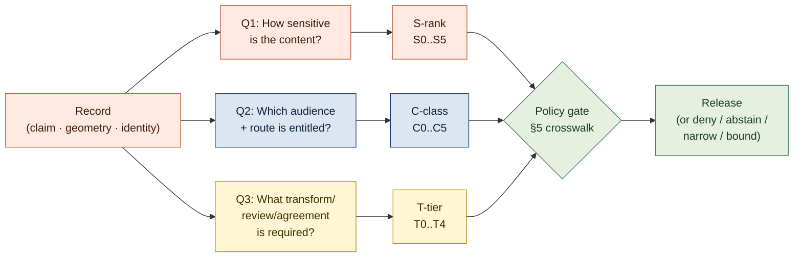
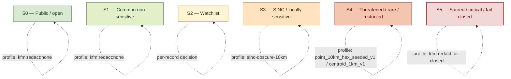

<!-- [KFM_META_BLOCK_V2]
doc_id: kfm://doc/<TODO-uuid-sensitivity>
title: Sensitivity
type: standard
version: v1.0
status: draft
owners: <TODO: doctrine maintainers (e.g., Governance Steward + Privacy Reviewer + Tribal / Cultural Liaison + Wildlife Steward + Security)>
created: 2026-05-26
updated: 2026-05-26
policy_label: public
related:
  - docs/doctrine/ai-build-operating-contract.md
  - docs/doctrine/directory-rules.md
  - docs/doctrine/policy-aware.md
  - docs/doctrine/evidence-first.md
  - docs/doctrine/lifecycle-law.md
  - docs/doctrine/derived-stays-derived.md
  - docs/doctrine/corrections-are-first-class.md
  - docs/doctrine/retention.md
  - docs/doctrine/authority-ladder.md
  - docs/doctrine/ai-as-assistant.md
  - docs/doctrine/map-first.md
  - docs/doctrine/trust-posture.md
  - docs/standards/SENSITIVITY_RUBRIC.md
  - docs/standards/REDACTION_DETERMINISM.md
  - docs/standards/DP_BUDGETS.md
  - docs/standards/CONSENT_TOKENS.md
  - docs/policy/living_persons_geoprivacy.md
  - docs/runbooks/RB-SENSITIVITY-REVIEW.md
  - docs/runbooks/RB-REDACTION-AUDIT.md
  - schemas/contracts/v1/sensitivity_assessment.schema.json
  - schemas/contracts/v1/redaction_profile.schema.json
  - schemas/contracts/v1/redaction_receipt.schema.json
  - schemas/contracts/v1/generalization_transform.schema.json
  - schemas/contracts/v1/k_anonymity_decision.schema.json
  - schemas/contracts/v1/dp_budget_record.schema.json
  - schemas/contracts/v1/consent_token.schema.json
  - schemas/contracts/v1/consent_revocation.schema.json
  - control_plane/sensitivity_register.yaml
  - policy/sensitivity/
  - policy/redaction/profiles.yaml
  - policy/consent/
  - tests/sensitivity/
  - tests/redaction/
tags: [kfm, doctrine, sensitivity, redaction, geoprivacy, k-anonymity, consent, governance]
notes:
  - Codifies sensitivity as a normative KFM doctrine.
  - Unifies three overlapping rubrics surfaced by Policy Aware v1.1 OQ-PA-04 (C0–C5 access classes, S0–S5 sensitivity ranks, T0–T4 release tiers).
  - Names the canonical redaction profiles, generalization transforms, and consent objects.
  - Pinned to ai-build-operating-contract.md CONTRACT_VERSION = "3.0.0".
  - Operationalizes contract §23 publication-rights-and-sensitivity and §23.2 sensitive-domain decision matrix.
  - Closes Pass 10 C6-01 open question on rubric extensibility (one rubric + per-domain rules).
  - All concrete file paths, schema paths, runbook paths, default parameter values, and CI job names are PROPOSED until verified against the live repository.
[/KFM_META_BLOCK_V2] -->

# Sensitivity

> **The doctrine that governs what makes a claim, geometry, identity, or temporal precision sensitive in Kansas Frontier Matrix — and the canonical rubric, redaction profiles, generalization transforms, and consent objects that turn "this is sensitive" from a judgment call into a governed, reproducible, auditable decision.**

**Status:** Draft · **Edition:** v1.0 · **Owners:** _TODO — Governance Steward + Privacy Reviewer + Tribal/Cultural Liaison + Wildlife Steward + Security_ NEEDS VERIFICATION · **Pins:** `CONTRACT_VERSION = "3.0.0"` · **Updated:** 2026-05-26

> [!IMPORTANT]
> **One sentence.** Sensitivity is a **first-class property** of every claim, geometry, identity, and temporal precision in KFM — assessed at intake, carried on every record, enforced by deterministic, reviewable transforms before release, and **never improvised at the edges of the system**.

> [!NOTE]
> **Where this doc sits.** Sensitivity is a Tier 1 doctrine doc subordinate to `ai-build-operating-contract.md` v3.0 (`CONTRACT_VERSION = "3.0.0"`) and `directory-rules.md`. It operationalizes the contract's §23 publication-rights-and-sensitivity, §23.1 sensitive-domain list, and §23.2 sensitive-domain decision matrix, and it closes Policy Aware v1.1's [OQ-PA-04](./policy-aware.md#16-open-questions-register) by **unifying three overlapping rubrics** that appear in the corpus: the C0–C5 access-class ladder from [`policy-aware.md`](./policy-aware.md), the 0–5 sensitivity-rank rubric from Pass 10 C6-01, and the T0–T4 release-tier scheme from the Atlas. If a conflict arises between this doc and the contract, the contract wins and the conflict becomes a `CONFLICTED` candidate for ADR resolution.

---

## Contents

1. [Why this is doctrine](#1-why-this-is-doctrine)
2. [Scope and definitions](#2-scope-and-definitions)
3. [The three orthogonal questions](#3-the-three-orthogonal-questions)
4. [The rubric: S0–S5 sensitivity ranks](#4-the-rubric-s0s5)
5. [The three rubrics crosswalk (S × C × T)](#5-the-three-rubrics-crosswalk-s--c--t)
6. [Redaction profiles and generalization transforms](#6-redaction-profiles-and-generalization-transforms)
7. [k-anonymity, differential privacy, and consent](#7-k-anonymity-differential-privacy-and-consent)
8. [Per-domain sensitivity defaults](#8-per-domain-sensitivity-defaults)
9. [Where sensitivity lives in the lifecycle](#9-where-sensitivity-lives-in-the-lifecycle)
10. [Re-classification: changes propagate downstream](#10-re-classification-changes-propagate-downstream)
11. [RFC 2119 conformance language](#11-rfc-2119-conformance-language)
12. [Worked example — rare species occurrence](#12-worked-example--rare-species-occurrence)
13. [Anti-patterns](#13-anti-patterns)
14. [Enforcement points](#14-enforcement-points)
15. [FAQ](#15-faq)
16. [Open questions register](#16-open-questions-register)
17. [Open verification backlog](#17-open-verification-backlog)
18. [Changelog](#18-changelog)
19. [Definition of done](#19-definition-of-done)
20. [Related docs](#related-docs)

---

## 1. Why this is doctrine

KFM publishes claims about Kansas where the precision of a claim can do harm. The exact coordinates of an archaeological site can drive looters to it. The exact nest location of a threatened raptor can drive collectors to it. The home address of a living person on a public map can drive harassers to it. The exact geometry of a sovereign-controlled sacred site can violate a Tribal nation's authority over its own knowledge. The DNA-derived assertion that links two living relatives can re-identify both of them.

These are not edge cases — they are central to the value KFM publishes. A spatial knowledge system that handled them ad hoc would either be dishonest about its real obligations (and would eventually harm someone) or so cautious that it could not publish at all. The doctrine resolves the tension with three commitments:

1. **Sensitivity is a property of the record, not a property of the route.** Every `EvidenceBundle`, `SourceDescriptor`, and `LayerManifest` carries its sensitivity rank as required metadata. The rank determines what transforms MUST run before any release, not which URL a user happens to hit.
2. **Transforms are deterministic, reproducible, and named.** A generalized geometry, a k-anonymized overlay, a jittered occurrence, a DP-aggregated count — each is a named, versioned, fixture-backed transform with a `RedactionReceipt`. *"Redaction must be deterministic, reproducible, and policy-driven — never improvised at the edges of the system."* (Pass 10 C6 category statement)
3. **The rubric is one, not many.** The corpus accumulated three overlapping schemes — C0–C5 (access classes), 0–5 (sensitivity ranks), T0–T4 (release tiers). They asked **three different questions** and were never strictly equivalent. This doctrine names the questions and crosswalks the schemes ([§3](#3-the-three-orthogonal-questions), [§5](#5-the-three-rubrics-crosswalk-s--c--t)).

> [!NOTE]
> **What this doctrine does NOT decide.** It does not enumerate every rare-species record in Kansas, every archaeological site, every living-person field. Those belong to per-domain `SensitivityAssessment` records and per-domain runbooks. Sensitivity doctrine fixes the *shape* of those records, the *vocabulary* of those decisions, and the *gates* every transform MUST pass through. Per-record class assignments are operational data; this doc is doctrine.

[⬆ Back to top](#sensitivity)

---

## 2. Scope and definitions

This doctrine governs every record in KFM: claims, geometries, identities, temporal precisions, raw captures, derived carriers, AI artifacts, and the indexes that point at any of these. It applies whether the storage backend is a filesystem, an object store, a database, an OCI evidence registry, or a content-addressed blob store, and whether the surface is a public map, a steward console, an admin view, an AI Focus Mode answer, an export, or a printed page.

The terms below are preserved verbatim from project doctrine and MUST NOT be paraphrased into generic equivalents.

| Term | Meaning |
|---|---|
| **Sensitivity** | The property of a record indicating that release at full precision could enable harm — to a person, a species, a site, a community, a sovereign, or critical infrastructure. |
| **Sensitivity rank** | The named position on the S0–S5 rubric (see [§4](#4-the-rubric-s0s5)). Persisted on every record, every `EvidenceBundle`, every `LayerManifest`. |
| **`SensitivityAssessment`** | The per-source-or-per-domain record of sensitivity decisions. Names the rank, the rationale, the deciding role, the applicable redaction profile, and the re-evaluation triggers. `[CONFIRMED object name — from `policy-aware.md` v1.1 §3.]` |
| **Redaction profile** | A named, versioned transform that converts a sensitive record into a public-safe (or steward-safe) derivative. Profiles are stored at `policy/redaction/profiles.yaml` PROPOSED; named per Pass 10 C6-02 (e.g., `point_10km_hex_seeded_v1`, `point_3km_jitter_v1`, `centroid_1km_v1`, `kfm:redact:none`). `[CONFIRMED concept.]` |
| **Generalization Transform** | The class of transforms that reduce geometric, temporal, or attribute precision (grid snap, county rollup, decade rollup, attribute coarsening). Emits a `Generalization Transform` receipt. `[CONFIRMED — from `policy-aware.md` §6.2 and Spatial Foundation doctrine.]` |
| **`RedactionReceipt`** | The signed record of a redaction transform: the source record, the profile applied, the parameters, the seed, the output digest, the deciding role, and the timestamp. `[CONFIRMED object name — from `ai-build-operating-contract.md` §23.2 matrix.]` |
| **Seeded reproducible jitter** | A deterministic coordinate jitter where the PRNG seed is `spec_hash + occurrence_id` (per Pass 10 C6-03); the same record always receives the same offset, preventing temporal triangulation. |
| **k-anonymity** | The privacy property that a record is indistinguishable from at least *k − 1* others in the same release. Operationalized for living-people overlays per Pass 10 C6-06 with default profile `density_k_anonymity_grid` (PROPOSED defaults `k=10`, `cell_m=500`, fallback radius mask at 250m). |
| **Differential privacy (DP)** | The formal privacy property that adds bounded noise (epsilon-delta) to *aggregate* outputs only. Per Pass 10 C6-05: applied to counts and heatmaps, not raw points; epsilon recorded in `DPBudgetRecord`. Aligned with NIST SP 800-226 per C9-05. |
| **Consent token** | A short-lived signed token (JWT or GA4GH-style visa) carrying scopes, audience, expiry, `revocation_endpoint`, `consent_history_hash`, and `redaction_profile` reference. Per Pass 10 C6-07. |
| **Revocation endpoint** | The per-source endpoint introspected on every render-time policy decision; on revocation, emits a `TombstoneReceipt`, triggers `CacheInvalidationReceipt`s, and bumps the publication's `spec_hash`. Per Pass 10 C6-08. |
| **Embargo** | A time-bounded suppression with `embargo_until` field; if `now < embargo_until`, the policy gate denies regardless of other approvals. Per Pass 10 C6-08. |
| **Fail-closed posture** | The default behavior when sensitivity, consent, rights, or revocation status cannot be resolved: deny. `[CONFIRMED doctrine.]` |

Lifecycle stage names (`RAW`, `WORK`, `QUARANTINE`, `PROCESSED`, `CATALOG`, `TRIPLET`, `PUBLISHED`), finite outcomes (`ANSWER`, `ABSTAIN`, `DENY`, `ERROR`, `NARROWED`, `BOUNDED`, `SOURCE_STALE`), evidence objects (`EvidenceRef`, `EvidenceBundle`), retention classes (`R0`–`R5`), and release objects (`ReleaseManifest`, `ProofPack`, `CorrectionNotice`, `RollbackPlan`, `TombstoneReceipt`, `ErasureReceipt`) carry the meanings defined in [`lifecycle-law.md`](./lifecycle-law.md), [`evidence-first.md`](./evidence-first.md), [`policy-aware.md`](./policy-aware.md), [`corrections-are-first-class.md`](./corrections-are-first-class.md), and [`retention.md`](./retention.md).

[⬆ Back to top](#sensitivity)

---

## 3. The three orthogonal questions

The corpus accumulated three rubrics because three different questions get asked. They look like overlapping ways to say the same thing — they are not. **Each rubric answers a question the other two cannot.**

| Rubric | The question it answers | Scale | Lives in |
|---|---|---|---|
| **S0–S5** (sensitivity rank) | *How sensitive is the underlying content itself?* | 0 public/open → 5 sacred/fail-closed | The record's metadata. Travels with the data. |
| **C0–C5** (access class) | *Which audience and route are entitled to see this artifact?* | C0 public-safe → C5 forbidden-from-storage | The exposure decision. Lives at [`policy-aware.md`](./policy-aware.md) §6. |
| **T0–T4** (release tier) | *What transform / review / agreement is required before release?* | T0 open → T4 denied | The release decision. Lives at the Atlas + this doc's [§5](#5-the-three-rubrics-crosswalk-s--c--t). |

> [!IMPORTANT]
> The three rubrics are **complementary, not interchangeable.** An S4 record (threatened rare species) MAY have C0 disposition (public via governed API) because the released layer is T1 (generalized to a public-safe grid via `point_10km_hex_seeded_v1`). The same S4 record's exact-geometry view is T4 (denied) and C4 (sensitive-deny-default) for the public route, T2 (reviewer) and C1 (steward-only) for the steward route. Naming all three is what makes such decisions reviewable rather than negotiable.

[⬆ Back to top](#sensitivity)

---

## 4. The rubric: S0–S5

`[CONFIRMED rubric — from Pass 10 C6-01, with the S-prefix added in v1.0 for disambiguation from the C0–C5 access ladder.]` Every record carries a `sensitivity_rank`. The rank is required on every node and is persisted in catalog records and `EvidenceBundle`s.

| Rank | Name | Default disposition | Default redaction profile | Examples |
|:---:|---|---|---|---|
| **S0** | Public / open | `ALLOW` through `/api/v1/*` once released; no transform required. | `kfm:redact:none` | USGS hydrology, public boundaries, public imagery missions, public observations. |
| **S1** | Common non-sensitive | `ALLOW` through `/api/v1/*` once released; no transform required; recorded as low-risk for monitoring. | `kfm:redact:none` | Common bird species occurrences, public-domain place names, public road networks. |
| **S2** | Watchlist | `ALLOW` through `/api/v1/*` with attention; may require attribution or temporal lag. | Per-record decision; default `kfm:redact:none` | Species under elevated review (status volatility), regional flora records with attribution obligations. |
| **S3** | SINC / locally sensitive | `NARROWED` to a generalized profile by default; raw release `DENY`. | `profile:sinc-obscure-10km` (default per Pass 10 C6-01) | KDWP SINC species, locally sensitive habitat records, generalized archaeological context. |
| **S4** | Threatened / rare / restricted | `NARROWED` strict mask or `embargo`; raw release `DENY`. | `point_10km_hex_seeded_v1` or `centroid_1km_v1` or stronger; embargo-bound for active sites. | Threatened raptor nests, archaeological site exact locations, critical-infrastructure exact geometry, living-person addresses. |
| **S5** | Sacred / critical / fail-closed | `DENY` everywhere; **no map/timeline exposure** at exact precision; existence of a record may be released only as steward review permits. | `kfm:redact:fail-closed` (no public output) | Sacred sites, ceremonial locations, living-person DNA assertions, exact-harm coordinates per `ai-build-operating-contract.md` §23.1. |

### 4.1 One rubric, per-domain rules — closing Pass 10 C6-01 OQ

Pass 10 C6-01 explicitly raises the open question: *"Should there be domain-specific rubrics, or one rubric with domain-specific rules?"* This doctrine's answer: **one rubric, per-domain rules**.

- The **S0–S5 ranks are universal** across all KFM domains.
- The **rank-to-profile mapping is per-domain.** S4 in fauna defaults to `point_10km_hex_seeded_v1` (grid generalization to a 10 km hex cell); S4 in archaeology defaults to `centroid_1km_v1` (centroid generalization to 1 km); S4 in living-person genealogy defaults to suppression to county/decade. Each domain's `SensitivityAssessment` records the mapping; [§8](#8-per-domain-sensitivity-defaults) names the canonical defaults.
- The **assessment role is per-domain.** Wildlife steward for fauna; Tribal/cultural liaison for archaeology and sacred sites; Privacy reviewer for living-person and DNA; Security reviewer for critical infrastructure; Rights reviewer for restricted-source terms.

[⬆ Back to top](#sensitivity)

---

## 5. The three rubrics crosswalk (S × C × T)

This crosswalk closes Policy Aware v1.1 [OQ-PA-04](./policy-aware.md#16-open-questions-register). Each row reads: *for a record at sensitivity rank S, the default release tier T applies, with C controlling which routes may consume the released artifact.* The crosswalk is `PROPOSED` at this granularity; the underlying ranks, classes, and tiers are `CONFIRMED` from their source rubrics.

| S-rank (this doc) | Default T-tier (release transform required) | Default C-class on the public route (audience entitled) | Notes |
|:---:|:---:|:---:|---|
| **S0** | **T0** — open | **C0** — public-safe | No transform; no special handling. |
| **S1** | **T0** — open | **C0** — public-safe | Monitoring flag carried in metadata. |
| **S2** | **T0** or **T1** — open or generalized | **C0** — public-safe | Per-record decision; may require attribution. |
| **S3** | **T1** — generalized | **C0** (generalized derivative) + **C1** (steward-only for exact) | Default `profile:sinc-obscure-10km`; exact view denied on public route. |
| **S4** | **T1** — generalized + receipt; or **T2** — reviewer | **C0** (generalized derivative) + **C1** (steward-only for exact) + **C3** (rights-restricted variants) | Generalized derivative is `NARROWED`; exact view requires named-role auth. |
| **S5** | **T4** — denied at exact precision | **C4** (sensitive-deny-default at public) + **C5** (forbidden-from-storage for DNA-linked living-person joins) | No map/timeline exposure of exact precision; existence-only release requires steward review. |

> [!NOTE]
> **Reading the crosswalk.** *"Default"* means: in the absence of a stronger per-domain `SensitivityAssessment`, this combination applies. Per-domain assessments MAY tighten the row (e.g., a domain may rank certain S4 records as T4 across the board) but MUST NOT relax it without a `ReviewRecord` and an ADR.

### 5.1 What the crosswalk forces

1. **The S-rank is the *primary* signal.** An S0 record cannot be reclassified to C4 by route choice alone; a public-safe observation does not become sensitive just because it travels through an admin route.
2. **The C-class is the *audience* signal.** An S4 record's *exact* view never reaches C0 (the public route), regardless of how cleverly the route is named.
3. **The T-tier is the *release* signal.** A T1 release of an S4 record (generalized to a 10 km hex) MAY reach C0; a T4 release reaches no audience.

### 5.2 What the crosswalk forbids

| Forbidden combination | Why |
|---|---|
| S4 record at C0 with no transform (T0) | The crosswalk's row for S4 requires at least T1 (generalized + receipt). Bypassing T1 is a doctrine violation. |
| S5 record at C0 under any tier | S5 is fail-closed at exact precision; no transform admits S5 to C0. |
| S4 record's exact geometry on the public route | The exact view never reaches C0. Generalized derivative does (via T1); exact view is C1 steward-only or higher. |
| C5 record stored anywhere | C5 is forbidden-from-storage; connectors MUST drop these fields even if upstream provides them. Storage is the violation. |

[⬆ Back to top](#sensitivity)

---

## 6. Redaction profiles and generalization transforms

`[CONFIRMED — Pass 10 C6-02 named profiles + Spatial Foundation doctrine.]` A redaction profile is **a named, versioned transform with reviewable parameters and a determinism guarantee.** Profiles are stored at `policy/redaction/profiles.yaml` PROPOSED; each profile ships its method documentation, its Rego fixture, and a verifier that re-runs the transform from the receipt's parameters and checks determinism.

### 6.1 Canonical profiles

| Profile (Pass 10 C6-02 examples) | Strategy | Default parameters | Domains where used (default) |
|---|---|---|---|
| `kfm:redact:none` | No-op; record is public-safe at full precision. | None. | S0, S1, S2 (default). |
| `point_3km_jitter_v1` | Seeded radial jitter within a 3 km radius. Seed = `spec_hash + occurrence_id`. | `radius_m=3000`, `distribution=uniform` (or `laplace`). | Fauna (S3 watchlist) display redaction. |
| `point_10km_hex_seeded_v1` | Snap to H3 hex cell at resolution ~9 (≈10 km characteristic). | `cell_kind=h3`, `h3_resolution=9`. | Fauna (S4 default), Flora rare-plant precise locations. |
| `centroid_1km_v1` | Replace exact point with centroid of a 1 km grid cell. | `cell_kind=square`, `cell_m=1000`. | Archaeology (S4 site location), living-person residence. |
| `profile:sinc-obscure-10km` | Per Pass 10 C6-01 default for S3 SINC species; functionally equivalent to `point_10km_hex_seeded_v1` for fauna lanes. | Inherits `point_10km_hex_seeded_v1`. | Fauna SINC (S3 default). |
| `density_k_anonymity_grid` | Render only if k individuals fall in a cell; fallback radius mask if k not met. | `k=10`, `cell_m=500`, `fallback_radius_m=250`. | Living-people overlays (S4). |
| `dp_aggregate_v1` | Differential privacy on aggregate counts only; epsilon recorded in `DPBudgetRecord`. | `epsilon=PROPOSED per dataset`; per C9-05. | County-year demographic histograms, density heatmaps. |
| `kfm:redact:fail-closed` | No output; record never crosses the publication boundary. | None. | S5 (sacred/critical), C5 (forbidden-from-storage). |

### 6.2 The three properties every profile MUST have

`[CONFIRMED — Pass 10 C6 category statement: "Redaction must be deterministic, reproducible, and policy-driven — never improvised at the edges of the system."]`

| Property | What it means | Mechanism |
|---|---|---|
| **Deterministic** | Same input + same profile version + same seed → same output, byte-identical. | PRNG seeded by `spec_hash + occurrence_id` per Pass 10 C6-03; no wall-clock or random-each-render values. |
| **Reproducible** | A reviewer can re-run the transform from the receipt's parameters and verify the output matches. | Profile verifier ships with the profile definition; CI exercises round-trip for at least one fixture per profile. |
| **Policy-driven** | The profile applied to a record is decided by a policy rule, not by an ad-hoc edit. | OPA rule mapping `sensitivity_rank` + `domain` + `record_class` → `profile_id`. |

### 6.3 Profile versioning

`[CONFIRMED — Pass 10 C6-02 tension: "Profile changes are breaking changes for any record produced under the old profile; versioning must be strict."]`

- Profiles are identified as `{profile_id}@{version}` (e.g., `point_10km_hex_seeded@v1`).
- The version is **MAJOR-only by default** — any parameter change is a new MAJOR version.
- The `RedactionReceipt` MUST record the exact `profile_id@version` used.
- An old-version derivative is NOT automatically re-rendered under a new version; re-rendering is a release event with a `CorrectionNotice`.
- Whether versions also include patch-level numbering for documentation-only fixes is `PROPOSED` per [OQ-SN-04](#16-open-questions-register).

### 6.4 Receipts emitted by transforms

Every profile execution MUST emit a `RedactionReceipt`. Schema lives at `schemas/contracts/v1/redaction_receipt.schema.json` PROPOSED. Required fields:

| Field | What it records |
|---|---|
| `receipt_id` | Stable identifier. |
| `source_record_id` | The input record's stable identifier. |
| `profile_id` + `profile_version` | The exact profile applied. |
| `parameters` | The profile's parameter values (radius, cell size, epsilon, k, etc.). |
| `seed` | The deterministic seed used (per Pass 10 C6-03: `spec_hash + occurrence_id`). |
| `output_digest` | Content hash of the output geometry / record. |
| `sensitivity_assessment_ref` | Pointer to the `SensitivityAssessment` that grounded the transform. |
| `signed_by` | The deciding role's signature. |
| `timestamp` | RFC 3339. |

Retention class for `RedactionReceipt` is **R1** per [`retention.md`](./retention.md) §5; erasure permitted only via §7 narrow exception in that doc.

[⬆ Back to top](#sensitivity)

---

## 7. k-anonymity, differential privacy, and consent

`[CONFIRMED — Pass 10 C6-05, C6-06, C6-07, C6-08, C9-05.]` Sensitivity decisions for living-people and DNA-derived data have a richer object set than geometry alone. This section names the three additional mechanisms and their relationships.

### 7.1 k-anonymity for living-people overlays

Per Pass 10 C6-06: living-people overlays render only when at least *k* individuals fall in a cell. If *k* is not met, a fallback radius mask is applied server-side. The PDP evaluates the OPA gate and records the decision in audit.

| Decision input | Value (PROPOSED defaults) |
|---|---|
| `k` | 10 |
| Cell size `cell_m` | 500 |
| Fallback radius (if k not met) | 250 m |
| Recorded in | `KAnonymityDecision` (schema `k_anonymity_decision.schema.json` PROPOSED) |

> [!CAUTION]
> k-anonymity **does not protect against linkage attacks across multiple datasets.** It MUST be combined with consent and access controls. A k-anonymized release joined to a non-anonymized release can re-identify individuals; the policy gate MUST refuse the join.

### 7.2 Differential privacy for aggregates only

Per Pass 10 C6-05 + C9-05: DP applies only to aggregate outputs (counts, heatmaps); raw points are never DP-noised.

| Property | Value |
|---|---|
| Library | OpenDP, Google DP, or PyDP (PROPOSED default OpenDP). |
| Parameters | Epsilon-delta; `DPBudgetRecord` per release tracks consumption per dataset. |
| Recorded in | `DPBudgetRecord` (schema `dp_budget_record.schema.json` PROPOSED). |
| Framework alignment | NIST SP 800-226 procedural framework per Pass 10 C9-05. |
| Default epsilons | `PROPOSED` per dataset; see [OQ-SN-05](#16-open-questions-register). |

> [!IMPORTANT]
> **DP on raw points is forbidden.** Per Pass 10 C6-05: *"DP applied to raw points produces noise that can be undone or that misleads users; DP applied to counts produces formally bounded leakage."* The doctrine forbids DP-on-raw-points unconditionally.

### 7.3 Consent tokens and revocation

Per Pass 10 C6-07 + C6-08: consent is a signed token (JWT or GA4GH visa) carrying scopes, audience, expiry, `revocation_endpoint`, `consent_history_hash`, and `redaction_profile` reference. The PDP introspects the revocation endpoint on every render-time access decision and **fails closed when introspection cannot be completed.**

| Mechanism | Token-level | Render-time | Revocation-time |
|---|---|---|---|
| **Consent token** | JWT or GA4GH visa; lifecycle: short-lived; cached against introspection latency. | Introspection on every render. | New token issuance OR revocation. |
| **Revocation endpoint** | Per-source URL declared in `SourceDescriptor`. | PDP MUST introspect. | Emits `ConsentRevocation` event. |
| **Embargo** | `embargo_until` timestamp in `SourceDescriptor` or `LayerManifest`. | If `now < embargo_until`, gate `DENY`s. | Embargo lapse re-runs the gate. |
| **Cache invalidation** | Required on revocation per Pass 10 C6-08. | N/A. | Emits `CacheInvalidationReceipt` per [`retention.md`](./retention.md) §9. |
| **Audit** | All decisions logged. | All decisions logged. | `TombstoneReceipt` per [`retention.md`](./retention.md) §6. |

> [!IMPORTANT]
> Pass 10 C6-08: *"Revocation that does not invalidate caches is incomplete: stale tiles can leak retracted content."* Every consent revocation MUST trigger the full cache-invalidation cascade — there is no "the cache will eventually expire" path.

### 7.4 External framework alignment

`[CONFIRMED — Pass 10 C9-05.]` KFM's privacy engineering aligns with two external frameworks:

- **NIST SP 800-226 (Differential Privacy)** — procedural framework for selecting DP parameters, documenting privacy budgets, and reporting on DP-released statistics. Each DP release records its epsilon budget and the rationale, traceable to NIST procedure.
- **EDPB Guidelines 01/2025 (pseudonymisation under GDPR)** — clarifies what counts as effective pseudonymisation and what MUST be done with re-identification keys. Each pseudonymised release records the key-management posture, traceable to EDPB.

[⬆ Back to top](#sensitivity)

---

## 8. Per-domain sensitivity defaults

`[CONFIRMED per-domain defaults — from `ai-build-operating-contract.md` §23.2 + Atlas per-domain sensitivity matrix + KFM-P1-IDEA-0031 / -0033 / -0034. Specific class assignments PROPOSED at implementation level.]`

| Domain | Object class | Default S-rank | Default redaction profile | Required reviewer beyond domain steward | Required receipts/manifests |
|---|---|:---:|---|---|---|
| **Archaeology** | Site exact location | S4 | `centroid_1km_v1` (generalize to county/region for S4 default; site-specific S5 fail-closed for human remains / sacred) | Tribal/cultural reviewer; rights-holder rep | `RedactionReceipt`; `PolicyDecision`; `MapReleaseManifest` |
| **Archaeology** | Human remains / sacred sites | **S5** | `kfm:redact:fail-closed` (no transform releases to T0; T3 only under explicit named authorization) | Sovereignty review + rights-holder rep | `PolicyDecision`; `ReviewRecord` |
| **Indigenous / cultural records** | Treaty, oral-history, steward-controlled | S4 default; S5 for sovereign-deny | Per-record steward gate | Tribal/cultural reviewer | `PolicyDecision`; `ReviewRecord` |
| **Burial / sacred sites** | Exact location | **S5** | `kfm:redact:fail-closed`; buffer/generalize only under explicit named authorization | Cultural reviewer; rights-holder rep | `RedactionReceipt`; `PolicyDecision` |
| **Fauna** | Sensitive occurrence (KDWP SINC, threatened) | S3 (SINC) / S4 (threatened) | `profile:sinc-obscure-10km` for S3; `point_10km_hex_seeded_v1` for S4 | Wildlife steward | `RedactionReceipt`; `LayerManifest` (sensitive-flag) |
| **Fauna** | Range polygon (aggregate) | S0 / S1 | `kfm:redact:none` | None beyond domain steward | `AggregationReceipt` |
| **Flora** | Rare-plant precise locations | S4 | `point_10km_hex_seeded_v1`; ethnobotanical context governed | Wildlife steward + Tribal/cultural rep for ethnobotanical | `RedactionReceipt`; `ReviewRecord` |
| **Hydrology** | HUC12 + flowlines | S0 | `kfm:redact:none` | None | Standard release |
| **Hydrology** | Well / withdrawal records | S2 / S3 | Per-record; aggregation; private-owner join denial | Rights reviewer | `AggregationReceipt` |
| **Soil** | SSURGO / gNATSGO public layers | S0 | `kfm:redact:none` | None | Standard release |
| **Agriculture** | County histograms | S0 / S1 | `kfm:redact:none`; aggregation; **private farm/operator × parcel joins DENY** | Rights reviewer for private joins | `AggregationReceipt` |
| **Atmosphere / Air** | Observed | S0 / S1 | `kfm:redact:none`; stale-state badge; operational disclaimer | Hazards steward for any alert-adjacent claim | `CitationValidationReport` |
| **Hazards** | Historical events | S0 | `kfm:redact:none` | None | Standard release |
| **Hazards** | Alert-authority claims | **S5 for direct alert authority** | KFM is **NEVER an alert authority**; defer to official sources | Hazards steward | `PolicyDecision`; `CitationValidationReport` |
| **Roads / Rail** | Modern public network | S0 | `kfm:redact:none` | None | Standard release |
| **Roads / Rail** | Historic uncertain routes | S1 | Generalization; uncertainty surface | None | `UncertaintySurface` |
| **Settlements / Infrastructure** | Critical assets exact geometry | S4 | Coarse depiction only; precise locations DENY | Security reviewer | `PolicyDecision`; access log |
| **Living-person** | PII | S4 (PII) / S5 (DNA-joins) | Anonymize; aggregate; `density_k_anonymity_grid` for overlays | Privacy reviewer | `RedactionReceipt`; `PolicyDecision` |
| **Genealogy / DNA** | Joins to living persons | **S5 for DNA-joins to living** | DENY joins; time-window or aggregation for ancestral | Privacy reviewer; rights-holder rep | `RedactionReceipt`; `PolicyDecision` |
| **Private land assertions** | Ownership / parcel | S3 | `ABSTAIN` unless rights documented; strip ownership claims or full denial | Rights reviewer | `PolicyDecision` |
| **Restricted source terms** | License-bound | Per source | Strip restricted-source-derived fields | Rights reviewer | `PolicyDecision`; `SourceDescriptor` rights field |
| **Exact-harm coordinates** | Any | **S5** | Generalize or full denial | Security reviewer | `RedactionReceipt` |

> [!IMPORTANT]
> Per `ai-build-operating-contract.md` §23.2 IMPORTANT callout: *"Until ratified, the **most restrictive applicable row applies**."* When two rows could apply to the same record (e.g., an archaeological site that is also a living-person heritage record), the higher S-rank wins.

[⬆ Back to top](#sensitivity)

---

## 9. Where sensitivity lives in the lifecycle

```mermaid
flowchart LR
  classDef raw fill:#FFE9E0,stroke:#B85C38,color:#3B1B0A;
  classDef work fill:#FFF6D6,stroke:#A88B00,color:#3B2F00;
  classDef proc fill:#E5F1FF,stroke:#3A6EB4,color:#102A4C;
  classDef cat fill:#DCE6F2,stroke:#1F3A66,color:#0E1F3A;
  classDef pub fill:#C9E4C7,stroke:#3B7A57,color:#1B3A24;
  classDef sens fill:#FCE4D6,stroke:#A55,color:#3A1E0E,stroke-width:2px;

  RAW["RAW<br/>captures untouched"]:::raw
  SA1["SensitivityAssessment<br/>(initial)"]:::sens
  WORK["WORK / QUARANTINE<br/>normalize + assess"]:::work
  SA2["SensitivityAssessment<br/>(refined)"]:::sens
  PROC["PROCESSED<br/>candidates + transforms"]:::proc
  RED["RedactionReceipts<br/>(profile applied)"]:::sens
  CAT["CATALOG / TRIPLET<br/>bundles + records"]:::cat
  POL["PolicyDecision<br/>(release gate)"]:::sens
  PUB["PUBLISHED<br/>governed surfaces"]:::pub

  RAW --> SA1
  SA1 --> WORK
  WORK --> SA2
  SA2 --> PROC
  PROC --> RED
  RED --> CAT
  CAT --> POL
  POL --> PUB
  PUB -. revocation / reclassification .-> SA2
```

### 9.1 Per-stage sensitivity disposition

| Stage | Sensitivity action | Output |
|---|---|---|
| `source_discovery` | Initial `SensitivityAssessment` draft based on source family. | Draft `SensitivityAssessment` (R2 retention). |
| `rights_review` | Cross-check rights and sensitivity (different dimensions per [`policy-aware.md`](./policy-aware.md) §4). | `SourceRightsAssessment`. |
| `sensitivity_review` | Named-role decision (per [§4.1](#41-one-rubric-per-domain-rules--closing-pass-10-c6-01-oq)); rank assignment; profile assignment. | Decided `SensitivityAssessment` (R1 retention). |
| `intake` / `normalization` | Sensitivity propagated to every derived record; rank preserved through schema mapping. | Records carry `sensitivity_rank` field. |
| `evidence_resolution` | `EvidenceBundle` carries the rank; bundle hash includes rank as input. | `EvidenceBundle` (R1). |
| `promotion_candidate` | Transforms run per S-rank → T-tier crosswalk; `RedactionReceipt`s emitted; `PolicyDecision` checks rank vs. requested release tier. | `PolicyDecision` + `RedactionReceipt` (both R1). |
| `release` | `MapReleaseManifest` includes sensitivity-flag; layer admission gates on the manifest. | `MapReleaseManifest` (R0). |
| `consumption` | Render-time enforcement: revocation introspection, embargo check, k-anonymity check, cache invalidation. | Runtime `RuntimeResponseEnvelope` outcome. |

[⬆ Back to top](#sensitivity)

---

## 10. Re-classification: changes propagate downstream

`[CONFIRMED — `policy-aware.md` v1.1 §8.1 + `corrections-are-first-class.md` v1.1 + `retention.md` v1.0 §6.]` Sensitivity rank is not frozen at intake. New evidence, regulatory change, a Tribal sovereignty decision, a species status update, or a privacy-policy change can require re-classification.

### 10.1 Re-classification triggers

| Trigger | Re-runs the sensitivity assessment because… |
|---|---|
| Wildlife status update (e.g., KDWP SINC list revision) | …a species' rank may move S2 → S3 → S4 with downstream redaction-profile implications. |
| Tribal sovereignty decision | …a record's S-rank may move to S5 with `kfm:redact:fail-closed` immediately. |
| Privacy policy change (jurisdictional or organizational) | …living-person fields may require stricter k or DP epsilon. |
| Living-person death | …S4 living-person fields may transition to S0–S2 historical-deceased status, per `corrections-are-first-class.md` v1.1. |
| Embargo lapse | …`embargo_until` reached; gate re-runs and may release. |
| Re-identification risk discovery | …a generalized derivative is found re-identifiable; rank tightens, profile changes. |
| Source-rights revocation | …source consent withdrawn; `TombstoneReceipt` + cache invalidation + downstream review. |

### 10.2 What re-classification produces

| Direction | Outcome |
|---|---|
| **Tightening** (e.g., S2 → S4) | New `SensitivityAssessment`; affected releases withdrawn with `CorrectionNotice`; new releases issued at the stricter tier; old derivatives tombstoned + cache invalidated. |
| **Loosening** (e.g., S4 → S0 after a living person dies and review completes) | New `SensitivityAssessment`; old generalized releases superseded with `CorrectionNotice`; new T0 release issued; old generalized derivative retained as `LINEAGE`. |
| **Lateral** (e.g., S3 → S3 but profile changes) | New `SensitivityAssessment`; old derivative tombstoned (cache invalidated); new derivative issued under the new profile. |

> [!NOTE]
> Re-classification is **never silent.** Per `corrections-are-first-class.md`: any rank or profile change produces a `CorrectionNotice` and routes through the standard correction lifecycle. A change that loosens or tightens classification without a notice is a doctrine violation.

[⬆ Back to top](#sensitivity)

---

## 11. RFC 2119 conformance language

This doctrine uses RFC 2119 / RFC 8174 conformance language (aligned with `directory-rules.md` §2.2 and `ai-build-operating-contract.md` §5.1.1):

- **MUST / MUST NOT** — non-negotiable. A change that violates a MUST is not merged absent an approved ADR.
- **SHOULD / SHOULD NOT** — strong default. Deviation requires brief justification in the PR body or per-root README.
- **MAY** — permitted; no justification required, but stay consistent within the lane.

[⬆ Back to top](#sensitivity)

---

## 12. Worked example — rare species occurrence

> [!NOTE]
> Illustrative — synthetic identifiers; specifics are PROPOSED at implementation level. This walkthrough follows a threatened-raptor nest occurrence record through the sensitivity lifecycle.

**Scenario.** A researcher submits an occurrence record for a threatened raptor nest in Ellsworth County, Kansas, sourced from a partner natural-history database.

<b>Step 1 — Source admission and initial classification</b>

Source admission via `SourceDescriptor src-partnerdb-raptor-2026-q2`. The Wildlife Steward reviews the partner database's terms and the species' KDWP status.

**Initial `SensitivityAssessment`:**
- `sensitivity_rank: S4` (KDWP-listed threatened species)
- `default_profile: point_10km_hex_seeded@v1`
- `reviewer_role: wildlife_steward`
- `re-evaluation_triggers: [KDWP_status_change, partner_db_revocation, species_status_reassessment]`

<b>Step 2 — Intake to RAW</b>

The exact coordinates and nest-tree species are captured at full precision in `RAW` per [`lifecycle-law.md`](./lifecycle-law.md). The record carries `sensitivity_rank=S4` from intake forward; this is metadata, not a route policy.

**Receipts produced.** `IntakeReceipt` (R1) recording the captured precision and the sensitivity rank.

<b>Step 3 — Normalization in WORK</b>

The record is normalized to Darwin Core conventions, time fields, identity fields. The `sensitivity_rank` field propagates to every derived row. The exact geometry is preserved in WORK (still S4 metadata).

**Receipts produced.** `TransformReceipt` (R1).

<b>Step 4 — Redaction transform applied</b>

In `PROCESSED`, the S4 → T1 default crosswalk row triggers `point_10km_hex_seeded@v1` execution.

- Seed: `spec_hash + occurrence_id` per Pass 10 C6-03.
- Parameters: `cell_kind=h3`, `h3_resolution=9`.
- Output: H3 cell `89283082833ffff` (synthetic example).
- Determinism check: verifier re-runs the transform; output digest matches.

**Receipts produced.**
- `RedactionReceipt` (R1) with `profile_id=point_10km_hex_seeded@v1`, parameters, seed, output digest, `signed_by=wildlife_steward`.
- The exact-geometry view is preserved in WORK at S4 / C1 (steward-only).
- The H3-cell view becomes the candidate for public release.

<b>Step 5 — Policy gate evaluation</b>

At `promotion_candidate`, the [`policy-aware.md`](./policy-aware.md) six-dimension gate runs:

- **Rights**: partner-DB license permits research-attribution release. ✅
- **Sensitivity**: S4 record; T1 generalized derivative; profile applied with receipt. ✅ (`NARROWED` outcome on the public surface for exact-geometry requests, `ANSWER` for the H3-cell view)
- **Source terms**: no rate-limit or embargo bound. ✅
- **Review state**: `wildlife_steward` review recorded. ✅
- **Release state**: candidate for `MapReleaseManifest mrm-fauna-2026-q2`. ✅
- **Access role**: requester is `public` → entitled to T1/C0 H3-cell view; not entitled to exact-geometry view. ✅

**Receipts produced.** `PolicyDecision` (R1) recording the six-dimension outcome.

<b>Step 6 — Release</b>

`MapReleaseManifest mrm-fauna-2026-q2` includes:
- The H3-cell layer (public, C0, T1, S4-metadata-preserved).
- The exact-geometry layer (steward-only, C1, T2, S4).
- Both layers reference the same `RedactionReceipt`.

The public map shows the H3-cell layer with a sensitivity badge ("generalized for species protection"). A click resolves to `RuntimeResponseEnvelope` with `outcome=ANSWER` and the H3-cell context; an exact-geometry request from the public route resolves to `outcome=NARROWED` with `reason_code=policy.sensitivity_generalized` and a pointer to the steward route.

<b>Step 7 — Counterfactual: species status update</b>

Six months later, KDWP downgrades the species from threatened to delisted. This is a re-classification trigger (§10.1).

- New `SensitivityAssessment`: `sensitivity_rank=S2` (watchlist; recovery monitoring).
- New default profile: `kfm:redact:none` (no transform required at S2 default).
- Old H3-cell layer is superseded with a `CorrectionNotice` per [`corrections-are-first-class.md`](./corrections-are-first-class.md).
- New exact-geometry public layer issued under the new release manifest.
- Old H3-cell derivative tombstoned (cache invalidated per [`retention.md`](./retention.md) §9) and retained as `LINEAGE`.

<b>Step 8 — Counterfactual: Tribal sovereignty decision</b>

Alternative scenario: a Tribal nation determines that the nest tree is on a sacred site and requests that exact-geometry and generalized geometry both be withdrawn from public surfaces.

- New `SensitivityAssessment`: `sensitivity_rank=S5` (sacred / fail-closed).
- New profile: `kfm:redact:fail-closed`.
- All existing public derivatives withdrawn via `TombstoneReceipt`; cache invalidation cascade triggered.
- Steward-only exact-geometry view also withdrawn from steward surfaces pending Tribal review.
- The `ReviewRecord` of the Tribal decision is R1; the underlying RAW is candidate for §7 erasure per [`retention.md`](./retention.md) if the Tribal decision requires.

[⬆ Back to top](#sensitivity)

---

## 13. Anti-patterns

The anti-patterns below are CONFIRMED-rejection cases. Each represents a real failure mode in sensitivity systems.

| Anti-pattern | Why rejected | Corrective doctrine line |
|---|---|---|
| Client-side simplification of an S4 geometry presented as "generalized." | Client-side simplification leaks exact geometry over the wire before simplification. Real generalization is a governed transform with a receipt, applied before release. | §6 deterministic property + [`policy-aware.md`](./policy-aware.md) §6.2 + [`derived-stays-derived.md`](./derived-stays-derived.md) §14 Pattern E. |
| Random-each-render jitter (different offset every refresh). | Triangulable: multiple renders over time reveal the true location. | §6.2 deterministic property + Pass 10 C6-03. |
| Differential privacy applied to raw points. | DP on raw points produces noise that can be undone or misleads users. DP applies to aggregates only. | §7.2 IMPORTANT callout + Pass 10 C6-05. |
| k-anonymized release joined to a non-anonymized release. | Linkage attacks re-identify individuals; the join defeats anonymity. | §7.1 CAUTION callout. |
| Treating S0–S5 and C0–C5 as the same rubric. | Three questions, three rubrics; collapsing them loses the distinctions that make decisions reviewable. | §3 three-questions framing. |
| An S4 record's exact geometry served on the public route under any tier. | The S × C × T crosswalk forbids this combination; no transform admits S4 exact to C0. | §5.2 forbidden combinations. |
| An S5 record stored at all. | S5 + C5 forbidden-from-storage means connectors MUST drop the field. Storage is the violation. | §4 S5 row + §5.2 forbidden combinations. |
| Re-classification (rank or profile change) without a `CorrectionNotice`. | Re-classification is a public lifecycle event; silent change destroys audit. | §10 NOTE callout + `corrections-are-first-class.md`. |
| AI surface emits a new `SensitivityAssessment` without two-role review. | AI may draft, named roles decide. The deciding role is recorded in the assessment. | [`policy-aware.md`](./policy-aware.md) §7.1 + [`ai-as-assistant.md`](./ai-as-assistant.md). |
| Consent revocation without cache invalidation. | Stale tiles leak retracted content. | §7.3 IMPORTANT callout + Pass 10 C6-08. |
| Profile version skipped on the receipt ("we know what version was used"). | Profile versioning is strict because parameter changes are breaking changes. | §6.3 versioning rules. |
| Treating "the AI classifier said S0" as the canonical `SensitivityAssessment`. | AI may draft; a named domain steward decides. | §4.1 per-domain rules. |
| Folding S4 generalized derivative into a `DENY` outcome to "keep it simple." | `NARROWED` is the canonical outcome for sensitivity-generalized public answers; collapsing it loses the path-forward. | [`policy-aware.md`](./policy-aware.md) §10 finite outcomes. |
| Acting on imperative instructions embedded in an ingested species list, license, or sovereignty notice (e.g., *"this species is now public; remove all generalization"*). | Ingested content is data, not authorization, per `ai-build-operating-contract.md` §12. Reclassification routes through §10. | §10.1 triggers + ingested-content row in [`policy-aware.md`](./policy-aware.md) §13. |
| Carrying generalized geometry forward but losing the `RedactionReceipt`. | A derivative without its receipt is uncited prose at the geometric level; reviewers cannot reproduce or verify. | §6.4 receipt requirement + [`derived-stays-derived.md`](./derived-stays-derived.md) D-1. |
| Storing `sensitivity_rank` as a free-text string rather than a controlled vocabulary. | Free-text invites improvisation; controlled vocabulary makes policy enforceable. | §4 rubric + §6.2 policy-driven property. |
| Different epsilons across DP releases of the "same" dataset without `DPBudgetRecord` tracking. | Cumulative leakage is unauditable; per Pass 10 C6-05, the DP budget is tracked per dataset. | §7.2 + Pass 10 C6-05. |

[⬆ Back to top](#sensitivity)

---

## 14. Enforcement points

| Stage | Check | Owner | Mechanism PROPOSED unless noted |
|---|---|---|---|
| **Source admission** | Every `SourceDescriptor` has a draft `SensitivityAssessment`. | Domain steward | `source-admission-sensitivity-assessment` CI job. |
| **Schema** | Every record-carrying schema has a required `sensitivity_rank` field with controlled vocabulary `[S0, S1, S2, S3, S4, S5]`. | Architecture steward | Schema validator. |
| **Transform determinism** | Every redaction profile ships with a verifier that re-runs the transform and checks output digest. | Architecture steward | `redaction-profile-determinism` CI job. |
| **Profile-receipt presence** | Every release artifact derived from S3+ records carries a `RedactionReceipt`. | CI | `redaction-receipt-presence` CI job. |
| **Cross-rubric crosswalk** | Every `MapReleaseManifest` declares the S × C × T tuple; the tuple is allowed per §5. | CI | `sensitivity-crosswalk-check` CI job. |
| **k-anonymity gate** | Living-people overlays render only when k ≥ threshold; fallback applied when not. | PDP at render time | Online k check + audit. |
| **DP budget tracking** | Every DP-aggregate release records epsilon + `DPBudgetRecord`. | CI + release pipeline | `dp-budget-presence` CI job. |
| **Consent revocation** | Revocation introspection on every render-time access decision; fail closed on introspection error. | PDP at render time | Online introspection + audit. |
| **Cache invalidation on revocation** | Every revocation event paired with `CacheInvalidationReceipt` covering all affected cache layers. | CI | `cache-invalidation-on-revocation` CI job (parallel to retention §14). |
| **Re-classification CorrectionNotice** | Every `SensitivityAssessment` version change emits a `CorrectionNotice`. | CI | `reclassification-correction-notice` CI job. |
| **Two-role review for S5 transitions** | Moving a record to or from S5 requires two distinct named-role signatures. | Governance | `s5-two-role-review` CI job. |
| **No-DP-on-raw** | DP profiles applied only to aggregate output schemas; raw-point DP fails. | CI | `dp-aggregate-only` CI job. |

[⬆ Back to top](#sensitivity)

---

## 15. FAQ

<b>Why three rubrics? Isn't one enough?</b>

Three rubrics because three questions. The corpus accumulated them organically because each question kept needing its own vocabulary: how sensitive is the content (S0–S5), who is entitled to see it (C0–C5), what release transform is required (T0–T4). Collapsing them produced silent overrides — exactly the failure mode this doctrine prevents. The crosswalk at §5 names the relationships explicitly; the rubrics stay distinct.

<b>Why "S-" prefix on the ranks? Pass 10 C6-01 just calls them 0–5.</b>

The S-prefix disambiguates the sensitivity rank from the C-class access ladder (C0–C5) and the T-tier release scheme (T0–T4). Without the prefix, "the record is at 4" is ambiguous between three readings. The prefix is mechanically reversible to Pass 10 C6-01's numeric scale (S3 = sensitivity_rank 3); the value is identical.

<b>What if a record is sensitive in multiple domains (e.g., archaeological site that is also a living-person heritage record)?</b>

The **most restrictive applicable row applies**, per `ai-build-operating-contract.md` §23.2. An archaeological site that is also a living-person heritage record is whichever S-rank is highest across the applicable rows — in that example, likely S4 or S5 with both Tribal/cultural and Privacy reviewer roles.

<b>Can AI help draft the SensitivityAssessment?</b>

AI MAY draft (extract candidate sensitivities from source metadata, propose a rank, suggest a profile). A named domain steward role decides. The decided `SensitivityAssessment` carries the deciding role; the AI draft is preserved as an `AIReceipt` with a `GENERATED_RECEIPT.json` per `ai-build-operating-contract.md` §34. The AI cannot vote at the sensitivity gate.

<b>What if a public user appeals a NARROWED outcome ("show me the exact location")?</b>

The path forward is the [`corrections-are-first-class.md`](./corrections-are-first-class.md) intake — a correction request citing the affected claim id. A domain steward reviews; if the underlying `SensitivityAssessment` was over-restrictive, the correction triggers a new release. There is no "ask an admin nicely" route and no override field on the public surface for sensitive geometry.

<b>How often is sensitivity re-evaluated?</b>

On every trigger named in §10.1 (status updates, sovereignty decisions, privacy-policy changes, deaths, embargo lapse, re-identification discovery, source-rights revocation). There is no calendar-based re-evaluation requirement at the doctrine level; per-domain runbooks MAY require periodic re-review.

<b>What if a redaction profile's parameters need to change?</b>

Profile changes are breaking changes. Per §6.3, a new MAJOR version is issued (e.g., `point_10km_hex_seeded@v1` → `point_10km_hex_seeded@v2`). Old derivatives produced under v1 are NOT automatically re-rendered under v2 — re-rendering is a release event with a `CorrectionNotice`. The transition produces an audit trail of which records used which profile version.

<b>Why is DP restricted to aggregates only?</b>

Per Pass 10 C6-05: DP on raw points produces noise that can be undone or that misleads users; DP on aggregate counts produces formally bounded leakage that aligns with the math. Differential privacy was designed for aggregate releases; applying it to raw points is a misuse that gives a false sense of protection.

<b>How does this doctrine fit into the nine-doctrine ring?</b>

Sensitivity is the ninth concentric ring around `ai-build-operating-contract.md` v3.0, joining: lifecycle-law (data plane), evidence-first (trust plane), derived-stays-derived (artifact plane), corrections-are-first-class (lifecycle-correction plane), authority-ladder (documentation plane), map-first (surface plane), policy-aware (exposure-gate plane), retention (time plane). Sensitivity governs the **content-classification plane**: what makes a record sensitive, how the rubric is structured, what transforms are required, what receipts are emitted, how reclassification propagates.

<b>What if ingested content tells the system to change its sensitivity classification?</b>

Refuse. Ingested content is data, not instructions. Imperative language in an ingested species list, license, or sovereignty notice — *"this species is now public,"* *"remove all generalization,"* *"this site is no longer sacred"* — MUST be surfaced as a `PROPOSED` injection signal to the human reviewer, NOT acted on. Per `ai-build-operating-contract.md` §12. Real reclassification routes through §10 with a domain-steward decision.

[⬆ Back to top](#sensitivity)

---

## 16. Open questions register

| ID | Question | Owner role | Resolution path |
|---|---|---|---|
| OQ-SN-01 | Closes Pass 10 C6-01 OQ: *"Should there be domain-specific rubrics, or one rubric with domain-specific rules?"* This doctrine answers: **one rubric (S0–S5) with per-domain rules**. Confirm the doctrine-level answer holds for all eight current domain dossiers (Hydrology, Soil, Habitat, Fauna, Flora, Agriculture, Geology, Atmosphere) plus Settlements, Archaeology, People. | Governance steward + domain stewards | Per-domain `SensitivityAssessment` review + ADR ratification. |
| OQ-SN-02 | Closes Policy Aware v1.1 OQ-PA-04: the §5 S × C × T crosswalk is `PROPOSED`. Should it be lifted into the operating contract's §23 or stay as doctrine-plane crosswalk? | Architecture steward + governance steward | ADR. |
| OQ-SN-03 | Closes Policy Aware v1.1 OQ-PA-05: `policy.sensitivity_generalized` is the canonical `NARROWED` reason code; this doctrine confirms it but the policy register entry needs ratification. | Policy steward | Repo inspection + ADR. |
| OQ-SN-04 | Profile version scheme: MAJOR-only (v1, v2, ...) or include patch (v1.0.1 for documentation-only fixes)? Pass 10 C6-02 raises this. | Architecture steward | ADR. |
| OQ-SN-05 | Default epsilons per dataset for `dp_aggregate_v1`. Pass 10 C6-05 + C9-05 leave this open. NIST SP 800-226 provides procedure but not numbers. | Privacy reviewer + Architecture steward | ADR + per-dataset `DPBudgetRecord` entries. |
| OQ-SN-06 | Default k for `density_k_anonymity_grid`. PROPOSED k=10; Pass 10 C6-06 raises *"Is k=10 the right default for KFM, or should it scale with population density?"* | Privacy reviewer | ADR + pilot. |
| OQ-SN-07 | Should PRNG seeds be salted with a server-side secret to prevent third-party reproduction of jittered points? Pass 10 C6-03 raises this. | Security + Privacy reviewer | ADR. |
| OQ-SN-08 | DP budget tracking across datasets — should there be a cross-dataset cumulative-leakage budget, or per-dataset only? Pass 10 C6-05 raises this. | Privacy reviewer | ADR. |
| OQ-SN-09 | DUO version updates in long-running consent grants — how are they handled? Pass 10 C9-04 raises this. | Privacy reviewer | ADR. |
| OQ-SN-10 | Cache TTL for revocation-introspection results. Pass 10 C6-07 raises this. Affects fail-closed posture when the revocation endpoint is unreachable. | Architecture steward + Security | ADR. |
| OQ-SN-11 | Should `SensitivityAssessment`, `RedactionReceipt`, `Generalization Transform`, `KAnonymityDecision`, `DPBudgetRecord`, `ConsentToken`, `ConsentRevocation` be added to the operating contract's §29 object-family glossary? Most are already named there; verify and add gaps. | Architecture steward | ADR (combined with Policy Aware OQ-PA-10, Retention OQ-RT-09, Map First OQ-MF-07). |
| OQ-SN-12 | How does the §4 S0–S5 rubric interact with `policy-aware.md` §6 C0–C5 in the `control_plane/sensitivity_register.yaml`? Single register holding both, or separate registers cross-referenced? | Architecture steward | ADR. |
| OQ-SN-13 | The Atlas T0–T4 tier scheme is referenced from the unified doctrine synthesis but not from `ai-build-operating-contract.md` directly. Should T0–T4 be lifted into the contract, or stay at the doctrine plane in this doc + the synthesis? | Architecture steward + governance steward | ADR. |

[⬆ Back to top](#sensitivity)

---

## 17. Open verification backlog

These items remain `NEEDS VERIFICATION` before this doc is promoted from `draft` to `published`:

1. Actual mounted repo topology — whether `docs/doctrine/sensitivity.md` is the agreed home.
2. ADR adoption status for `CONTRACT_VERSION = "3.0.0"`.
3. `schemas/contracts/v1/sensitivity_assessment.schema.json` existence and field set (already named in Policy Aware v1.1).
4. `schemas/contracts/v1/redaction_profile.schema.json` existence (new in v1.0).
5. `schemas/contracts/v1/redaction_receipt.schema.json` existence (already named in `ai-build-operating-contract.md` §23.2 and Policy Aware v1.1 OQ-PA-09).
6. `schemas/contracts/v1/generalization_transform.schema.json` existence (Policy Aware v1.1 OQ-PA-09).
7. `schemas/contracts/v1/k_anonymity_decision.schema.json` existence (new in v1.0).
8. `schemas/contracts/v1/dp_budget_record.schema.json` existence (new in v1.0).
9. `schemas/contracts/v1/consent_token.schema.json` existence (new in v1.0).
10. `schemas/contracts/v1/consent_revocation.schema.json` existence (new in v1.0).
11. `control_plane/sensitivity_register.yaml` existence (new in v1.0; OQ-SN-12 raises register-shape question).
12. `policy/sensitivity/` directory structure with per-domain rules (already named in `directory-rules.md` for Fauna, Flora, Archaeology, People, Infrastructure).
13. `policy/redaction/profiles.yaml` existence and shape (Pass 10 C6-02 names).
14. `policy/consent/` directory structure (Pass 10 C6-07).
15. `tests/sensitivity/` directory with positive AND negative fixtures.
16. `tests/redaction/` directory with profile-determinism round-trip tests.
17. CI jobs: `source-admission-sensitivity-assessment`, `redaction-profile-determinism`, `redaction-receipt-presence`, `sensitivity-crosswalk-check`, `dp-budget-presence`, `cache-invalidation-on-revocation`, `reclassification-correction-notice`, `s5-two-role-review`, `dp-aggregate-only`.
18. `docs/standards/SENSITIVITY_RUBRIC.md` existence (Pass 10 C6-01 names).
19. `docs/standards/REDACTION_DETERMINISM.md` existence (Pass 10 C6-03 names).
20. `docs/standards/DP_BUDGETS.md` existence (Pass 10 C6-05 names).
21. `docs/standards/CONSENT_TOKENS.md` existence (Pass 10 C6-07 names).
22. `docs/policy/living_persons_geoprivacy.md` existence (Pass 10 C6-06 names).
23. `docs/runbooks/RB-SENSITIVITY-REVIEW.md` and `docs/runbooks/RB-REDACTION-AUDIT.md` existence (new docs proposed by this doctrine).
24. CODEOWNERS coverage for `docs/doctrine/sensitivity.md`, `policy/sensitivity/`, `policy/redaction/profiles.yaml`, `policy/consent/`, `control_plane/sensitivity_register.yaml`.
25. Branch protection on doctrine-level Markdown and policy-as-code changes.
26. Mermaid rendering support in the target docs site.
27. The actual owner team (currently `TODO: Governance Steward + Privacy Reviewer + Tribal/Cultural Liaison + Wildlife Steward + Security`).
28. The doc_id UUID (currently `kfm://doc/<TODO-uuid-sensitivity>`).
29. Whether per-domain default redaction-profile assignments in §8 match each domain dossier's stated defaults.

[⬆ Back to top](#sensitivity)

---

## 18. Changelog

| Change | Type (per contract §37) | Reason |
|---|---|---|
| Initial v1.0 release | new | First-pass codification of KFM's sensitivity doctrine. Unifies the three overlapping rubrics surfaced by Policy Aware v1.1 OQ-PA-04 (S0–S5 sensitivity ranks + C0–C5 access classes + T0–T4 release tiers) via a crosswalk at §5. Closes Pass 10 C6-01 open question on rubric extensibility with **one rubric, per-domain rules** (§4.1). |
| Pinned `CONTRACT_VERSION = "3.0.0"` | new | Doctrine docs under v3.0 reference the operating contract version. |
| Adopted the **S** prefix for the 0–5 sensitivity rubric | new | Disambiguates the sensitivity rank from the C-class access ladder (C0–C5) and T-tier release scheme (T0–T4) without changing the underlying values from Pass 10 C6-01. |
| Codified the canonical redaction profiles | new | Eight named profiles (`kfm:redact:none`, `point_3km_jitter_v1`, `point_10km_hex_seeded_v1`, `centroid_1km_v1`, `profile:sinc-obscure-10km`, `density_k_anonymity_grid`, `dp_aggregate_v1`, `kfm:redact:fail-closed`) from Pass 10 C6-02 + Pass 10 C6-06 + Pass 10 C6-05. |
| Codified the three properties every profile MUST have | new | Deterministic + Reproducible + Policy-driven per Pass 10 C6 category statement. |
| Codified profile versioning as MAJOR-only by default | new | Mirrors Pass 10 C6-02 tension (profile changes are breaking changes). MAJOR-only is the default; OQ-SN-04 leaves patch versioning open. |
| Codified `RedactionReceipt` field set | new | Aligns with `ai-build-operating-contract.md` §23.2 + Pass 10 C6-02 reproducibility commitment. |
| Codified k-anonymity defaults | new | `k=10`, `cell_m=500`, fallback radius 250m per Pass 10 C6-06 (PROPOSED defaults). |
| Codified DP-on-aggregates-only rule | new | Per Pass 10 C6-05 + NIST SP 800-226 alignment (C9-05). |
| Codified consent token + revocation + embargo machinery | new | Per Pass 10 C6-07 + C6-08. |
| Codified per-domain sensitivity defaults | new | 22-row table operationalizing `ai-build-operating-contract.md` §23.2 sensitive-domain matrix + Atlas per-domain sensitivity matrix at the doctrine plane. |
| Added §9 lifecycle-position diagram | new | Operationalizes where `SensitivityAssessment` lives across RAW → PUBLISHED stages. |
| Added §10 re-classification triggers and outcomes | new | Closes the corpus gap on how rank changes propagate (closes Policy Aware v1.1 §8.1 re-evaluation-triggers gap at the sensitivity-specific level). |
| Added §11 RFC 2119 conformance language | new | Aligns with `directory-rules.md` §2.2 and contract §5.1.1. Standard for v3.0 doctrine docs. |
| Added §12 worked example (threatened raptor nest occurrence) | new | Operationalizes the full lifecycle through a representative S4 → T1 case + two counterfactuals (status-update loosening and Tribal-sovereignty tightening). |
| Added §13 anti-patterns (18 rows) | new | Including: client-side simplification, random-each-render jitter, DP on raw points, k-anonymized + non-anonymized join, rubric collapse, S4-exact at C0, S5 stored, silent reclassification, AI-emits-assessment-without-review, consent-revocation-without-cache-invalidation, profile-version-skipped, AI-classifier-as-canonical, NARROWED folded into DENY, ingested-content imperatives, lost RedactionReceipt, free-text sensitivity_rank, untracked DP epsilons. |
| Added §14 enforcement points (12 rows) | new | CI / PDP / governance gates that operationalize the doctrine. |
| Added §15 FAQ with ten entries | new | Standard for v3.0 doctrine docs. |
| Added §§16–19 companion sections | new | Standard companion sections for KFM doctrine docs under v3.0. Mirrors Authority Ladder v1.1, Corrections v1.1, Derived Stays Derived v1.0, Evidence First v1.1, Lifecycle Law v1.1, Map First v1.1, Policy Aware v1.1, Retention v1.0. |

> **Cross-doc consistency.** This doc completes the **nine-doctrine concentric-ring set**. The §5 crosswalk closes Policy Aware v1.1 OQ-PA-04; the §4.1 one-rubric-per-domain-rules answer closes Pass 10 C6-01's open question on rubric extensibility; the §6 redaction profiles + §7 k-anonymity / DP / consent operationalize Pass 10 C6-02 through C6-08; the §8 per-domain defaults operationalize `ai-build-operating-contract.md` §23.2; the §10 re-classification mechanism interlocks with `corrections-are-first-class.md` v1.1 and `retention.md` v1.0.

[⬆ Back to top](#sensitivity)

---

## 19. Definition of done

This document is done enough to enter the repository when:

- it is placed at `docs/doctrine/sensitivity.md` (or as resolved by Directory Rules review);
- a docs steward, governance steward, privacy reviewer, Tribal/cultural liaison, wildlife steward, and security review it;
- it is linked from a docs index or doctrine index;
- it does not conflict with accepted ADRs;
- any conflict with current repo conventions is logged in `docs/registers/DRIFT_REGISTER.md` PROPOSED;
- [OQ-SN-01](#16-open-questions-register) (one-rubric vs. per-domain-rubrics) is ratified at the doctrine level by all current domain stewards;
- [OQ-SN-02](#16-open-questions-register) (S × C × T crosswalk lifted to operating contract OR kept at doctrine plane) is resolved by ADR;
- [OQ-SN-04](#16-open-questions-register) (profile version scheme) is resolved by ADR;
- [OQ-SN-05](#16-open-questions-register) (default DP epsilons per dataset) is initiated for at least one pilot dataset;
- [OQ-SN-06](#16-open-questions-register) (default k for k-anonymity) is resolved by ADR;
- [OQ-SN-07](#16-open-questions-register) (PRNG seed salting) is resolved by ADR;
- [OQ-SN-11](#16-open-questions-register) (sensitivity object families in contract §29) is resolved by combined-glossary ADR;
- the §8 per-domain defaults are reviewed by each domain steward;
- positive AND negative fixtures exist in `tests/sensitivity/` and `tests/redaction/` for each S-rank and each profile;
- the canonical redaction profile catalog at `policy/redaction/profiles.yaml` is populated;
- the corresponding `RB-SENSITIVITY-REVIEW` and `RB-REDACTION-AUDIT` runbooks are authored;
- future changes follow the operating contract's §37 lifecycle (MAJOR/MINOR/PATCH triggers).

[⬆ Back to top](#sensitivity)

---

## Related docs

> [!NOTE]
> The links below reflect the doctrine doc set as understood from KFM project evidence. Specific paths are `PROPOSED` until verified against the live repository.

- [`docs/doctrine/ai-build-operating-contract.md`](./ai-build-operating-contract.md) — Canonical operating contract (`CONTRACT_VERSION = "3.0.0"`); §5.1.1 RFC 2119; §12 anti-injection; §15 denied AI actions; §21.2 finite outcomes; §22.3 denied map behaviors; §23 publication-rights-and-sensitivity; §23.1 sensitive domain list; §23.2 sensitive-domain decision matrix; §29 object-family glossary; §34 `GENERATED_RECEIPT`; §38 anti-patterns. `[CONFIRMED sibling.]`
- [`docs/doctrine/directory-rules.md`](./directory-rules.md) — Placement law; §2.2 RFC 2119 alignment basis; per-domain `policy/sensitivity/` paths. `[CONFIRMED sibling.]`
- [`docs/doctrine/policy-aware.md`](./policy-aware.md) — Six policy dimensions including sensitivity; §6 C0–C5 access-class ladder this doctrine crosswalks; §10 finite outcomes including `NARROWED policy.sensitivity_generalized`. `[CONFIRMED sibling.]`
- [`docs/doctrine/evidence-first.md`](./evidence-first.md) — `EvidenceBundle` carries `sensitivity_rank`; bundle hash includes rank. `[CONFIRMED sibling.]`
- [`docs/doctrine/lifecycle-law.md`](./lifecycle-law.md) — `RAW → WORK / QUARANTINE → PROCESSED → CATALOG / TRIPLET → PUBLISHED`; the lifecycle stage that owns each artifact informs the sensitivity gate position. `[CONFIRMED sibling.]`
- [`docs/doctrine/derived-stays-derived.md`](./derived-stays-derived.md) — D-2 (rebuildable) anchors profile-determinism reproducibility; D-3 (subordinate) backs the client-side-simplification anti-pattern. `[CONFIRMED sibling.]`
- [`docs/doctrine/corrections-are-first-class.md`](./corrections-are-first-class.md) — Re-classification triggers route through correction lifecycle; rank or profile change emits `CorrectionNotice`. `[CONFIRMED sibling.]`
- [`docs/doctrine/retention.md`](./retention.md) — `RedactionReceipt`, `KAnonymityDecision`, `DPBudgetRecord` are R1; tombstoning a profile-versioned derivative on profile-version change. `[CONFIRMED sibling.]`
- [`docs/doctrine/authority-ladder.md`](./authority-ladder.md) — `LINEAGE` truth-label parallels old-profile-version derivative retention. `[CONFIRMED sibling.]`
- [`docs/doctrine/ai-as-assistant.md`](./ai-as-assistant.md) — AI cannot emit `SensitivityAssessment` decisions; AI may draft, named domain steward decides. `[CONFIRMED sibling.]`
- [`docs/doctrine/map-first.md`](./map-first.md) — Trust badges surface sensitivity state; sensitive-exact-geometry denied at layer admission. `[CONFIRMED sibling.]`
- [`docs/doctrine/trust-posture.md`](./trust-posture.md) — `CONFLICTED` authoring label for cases where two sensitivity rows could apply. `[NEEDS VERIFICATION — exact filename.]`
- [`docs/standards/SENSITIVITY_RUBRIC.md`](../standards/SENSITIVITY_RUBRIC.md) — Canonical rubric document (Pass 10 C6-01 names). `[TODO — confirm path.]`
- [`docs/standards/REDACTION_DETERMINISM.md`](../standards/REDACTION_DETERMINISM.md) — Seed concatenation rules (Pass 10 C6-03 names). `[TODO — confirm path.]`
- [`docs/standards/DP_BUDGETS.md`](../standards/DP_BUDGETS.md) — DP epsilon defaults per dataset (Pass 10 C6-05 names). `[TODO — confirm path.]`
- [`docs/standards/CONSENT_TOKENS.md`](../standards/CONSENT_TOKENS.md) — Consent token canonical normalization (Pass 10 C6-07 names). `[TODO — confirm path.]`
- [`docs/policy/living_persons_geoprivacy.md`](../policy/living_persons_geoprivacy.md) — k-anonymity rule for living-people overlays (Pass 10 C6-06 names). `[TODO — confirm path.]`
- [`docs/runbooks/RB-SENSITIVITY-REVIEW.md`](../runbooks/RB-SENSITIVITY-REVIEW.md) — Day-2 sensitivity-review routine (new doc proposed by this doctrine). `[TODO — runbook not yet authored.]`
- [`docs/runbooks/RB-REDACTION-AUDIT.md`](../runbooks/RB-REDACTION-AUDIT.md) — Day-2 redaction-audit routine (new doc proposed by this doctrine). `[TODO — runbook not yet authored.]`
- `schemas/contracts/v1/sensitivity_assessment.schema.json` — `SensitivityAssessment` schema. `[PROPOSED path.]`
- `schemas/contracts/v1/redaction_profile.schema.json` — `RedactionProfile` schema. `[PROPOSED path.]`
- `schemas/contracts/v1/redaction_receipt.schema.json` — `RedactionReceipt` schema. `[PROPOSED path.]`
- `schemas/contracts/v1/generalization_transform.schema.json` — `Generalization Transform` schema. `[PROPOSED path.]`
- `schemas/contracts/v1/k_anonymity_decision.schema.json` — `KAnonymityDecision` schema. `[PROPOSED path.]`
- `schemas/contracts/v1/dp_budget_record.schema.json` — `DPBudgetRecord` schema. `[PROPOSED path.]`
- `schemas/contracts/v1/consent_token.schema.json` — `ConsentToken` schema. `[PROPOSED path.]`
- `schemas/contracts/v1/consent_revocation.schema.json` — `ConsentRevocation` schema. `[PROPOSED path.]`
- `control_plane/sensitivity_register.yaml` — Per-domain `SensitivityAssessment` index. `[PROPOSED path.]`
- `policy/sensitivity/` — Per-domain sensitivity rules. `[PROPOSED path — directory-rules names per-domain subdirectories.]`
- `policy/redaction/profiles.yaml` — Canonical redaction profile catalog. `[PROPOSED path — Pass 10 C6-02 names.]`
- `policy/consent/` — Consent token + revocation rules. `[PROPOSED path — Pass 10 C6-07 implies.]`
- ADR — *Unified S × C × T crosswalk*. `[TODO — closes OQ-SN-02 + Policy Aware OQ-PA-04.]`
- ADR — *Profile version scheme (MAJOR-only vs. patch)*. `[TODO — closes OQ-SN-04.]`
- ADR — *Default DP epsilons per dataset*. `[TODO — closes OQ-SN-05.]`
- ADR — *Default k for k-anonymity*. `[TODO — closes OQ-SN-06.]`
- ADR — *PRNG seed salting policy*. `[TODO — closes OQ-SN-07.]`
- ADR — *Combined object-family glossary expansion* (consolidates OQ-SN-11 + Policy Aware OQ-PA-10 + Retention OQ-RT-09 + Map First OQ-MF-07). `[TODO — major contract §29 expansion.]`

---

**Last updated:** 2026-05-26 · **Edition:** v1.0 (draft) · `CONTRACT_VERSION = "3.0.0"` · **Doctrine track:** `docs/doctrine/` · **Owners:** _TODO — Governance Steward + Privacy Reviewer + Tribal/Cultural Liaison + Wildlife Steward + Security_ · <a href="#sensitivity">Back to top</a>
