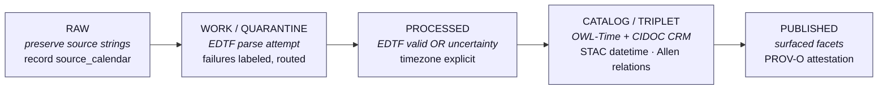

<!-- [KFM_META_BLOCK_V2]
doc_id: kfm://doc/<uuid-TBD>
title: Time-Awareness Doctrine
type: standard
version: v1.1
status: draft
owners: <TODO: doctrine maintainers (e.g., Governance Steward + Data Lifecycle Steward + Archives / History Reviewer)>
created: 2026-05-12
updated: 2026-05-26
policy_label: public
related:
  - docs/doctrine/ai-build-operating-contract.md
  - docs/doctrine/directory-rules.md
  - docs/doctrine/lifecycle-law.md
  - docs/doctrine/evidence-first.md
  - docs/doctrine/derived-stays-derived.md
  - docs/doctrine/corrections-are-first-class.md
  - docs/doctrine/policy-aware.md
  - docs/doctrine/retention.md
  - docs/doctrine/sensitivity.md
  - docs/doctrine/authority-ladder.md
  - docs/doctrine/ai-as-assistant.md
  - docs/doctrine/map-first.md
  - docs/doctrine/trust-posture.md
  - docs/standards/EDTF_PROFILE.md
  - docs/standards/OWL_TIME_PROFILE.md
  - docs/standards/CIDOC_CRM_TIME.md
  - docs/standards/STAC_TEMPORAL.md
  - docs/standards/ALLEN_RELATIONS.md
  - docs/standards/PROV_O_TIME.md
  - docs/policy/calendar_handling.md
  - docs/policy/timezone_handling.md
  - docs/runbooks/RB-TEMPORAL-RECONCILIATION.md
  - schemas/contracts/v1/temporal_scope.schema.json
  - schemas/contracts/v1/edtf_value.schema.json
  - schemas/contracts/v1/time_uncertainty.schema.json
  - schemas/contracts/v1/calendar_flag.schema.json
  - schemas/contracts/v1/allen_relation.schema.json
  - schemas/contracts/v1/coalescing_receipt.schema.json
  - control_plane/time_uncertainty_vocabulary.yaml
  - control_plane/calendar_vocabulary.yaml
  - control_plane/naive_reason_vocabulary.yaml
  - policy/temporal/
  - tests/temporal/
tags: [kfm, doctrine, time, temporal, edtf, owl-time, allen, prov-o, bitemporal, calendar]
notes:
  - Draft doctrine v1.1. Pinned to ai-build-operating-contract.md CONTRACT_VERSION = "3.0.0".
  - Reconciles the v1 §6 EvidenceBundle field naming with the Atlas's canonical seven time dimensions (KFM-P1-IDEA-0047) and the map-first.md §7.1 six time kinds.
  - Distinguishes time-awareness (temporal modeling of WHAT happened WHEN) from freshness (whether a release is still current per policy-aware §10 / retention §5).
  - Internal field names on EvidenceBundle, EvidenceRef, and event nodes are PROPOSED at the schema level; the responsibilities are doctrinal.
  - Standards references (EDTF, OWL-Time, CIDOC-CRM E52, STAC, Allen, PROV-O) are CONFIRMED. Subset-of-EDTF accepted patterns are PROPOSED operational subset.
[/KFM_META_BLOCK_V2] -->

# Time-Awareness Doctrine

> Canonical rules for how time is represented, recorded, validated, and surfaced across every stage of the Kansas Frontier Matrix pipeline — from `RAW` source preservation to `PUBLISHED` consumer surfaces. **Time is a first-class property of every claim, geometry, identity, and event in KFM, and it is never implicit, never silently converted, and never unlabeled.**

[](#0-status--authority)
[](#0-status--authority)
[](#0-status--authority)
[](#0-status--authority)
[](#13-rfc-2119-conformance-language)
[](#4-standards-alignment)
[](#2-non-negotiables)
[](#0-status--authority)
[](#0-status--authority)

**Status:** `draft` · **Edition:** v1.1 · **Owners:** _TODO — doctrine maintainers_ <sub>NEEDS VERIFICATION</sub> · **Pins:** `CONTRACT_VERSION = "3.0.0"` · **Updated:** 2026-05-26

> [!IMPORTANT]
> **One sentence.** Time in KFM is a first-class property of every claim, geometry, identity, and event — represented as **EDTF surface syntax** or **labeled `time_uncertainty`**, modeled across **seven canonical dimensions** (source / observed / valid / retrieval / release / correction / transaction time per Atlas KFM-P1-IDEA-0047), grounded in **six external standards** (EDTF, OWL-Time, CIDOC-CRM E52, STAC, Allen interval algebra, PROV-O), and **never silently converted** across calendars, timezones, or bitemporal corrections.

> [!NOTE]
> **Where this doc sits.** Time-Awareness is a Tier 1 doctrine doc subordinate to `ai-build-operating-contract.md` v3.0 (`CONTRACT_VERSION = "3.0.0"`) and `directory-rules.md`. It elaborates the contract's §10.6 *"Time-aware where claims depend on time"* invariant and §21.2 finite outcomes (`BOUNDED` is the natural envelope outcome for temporal-uncertainty queries). If a conflict arises between this doc and the contract, the contract wins and the conflict becomes a `CONFLICTED` candidate for ADR resolution.

---

## Quick Jump

- [1. Purpose](#1-purpose)
- [2. Non-Negotiables](#2-non-negotiables)
- [3. Scope](#3-scope)
- [4. Standards Alignment](#4-standards-alignment)
- [5. Time Through the Pipeline](#5-time-through-the-pipeline)
- [6. Time on Internal Types](#6-time-on-internal-types)
- [7. EDTF Usage and Uncertainty](#7-edtf-usage-and-uncertainty)
- [8. Calendars: Julian, Gregorian, and Others](#8-calendars-julian-gregorian-and-others)
- [9. Timezones](#9-timezones)
- [10. Allen Interval Algebra](#10-allen-interval-algebra)
- [11. Bitemporality and Provenance Time](#11-bitemporality-and-provenance-time)
- [12. Temporal Queries](#12-temporal-queries)
- [13. RFC 2119 conformance language](#13-rfc-2119-conformance-language)
- [14. Time-awareness vs. freshness](#14-time-awareness-vs-freshness)
- [15. Worked example](#15-worked-example)
- [16. Anti-patterns](#16-anti-patterns)
- [17. Open questions register](#17-open-questions-register)
- [18. Open verification backlog](#18-open-verification-backlog)
- [19. Changelog v1 → v1.1](#19-changelog-v1--v11)
- [20. Definition of done](#20-definition-of-done)
- [21. Related docs](#related-docs)
- [Appendix A — Allen Relation Reference](#appendix-a--allen-relation-reference)
- [Appendix B — EDTF Quick Reference](#appendix-b--edtf-quick-reference)

---

## 1. Purpose

The Kansas Frontier Matrix carries time-bearing material — historical events, archival records, geospatial scans, derived inferences — across heterogeneous source calendars, uncertain dates, and many decades of recording practice. Time is **never optional** in KFM, and it is **never implicit**. This document fixes the doctrine: what every part of the system must say about *when* something happened, *when it was recorded*, *how certain that is*, and *in what calendar frame*.

This is a **draft doctrine**. It is binding for design discussion and for new work; existing work should be reconciled against it as part of normal review.

> [!IMPORTANT]
> Time-awareness applies to **all** five pipeline stages and **all** time-bearing internal types. There is no stage at which a record may carry an unlabeled, unparsed, or implicitly-zoned timestamp.

[Back to top ↑](#time-awareness-doctrine)

---

## 2. Non-Negotiables

The following are **binding rules**. Any pipeline component, schema, or downstream consumer that violates them is, by definition, non-conformant.

> [!IMPORTANT]
> **NN-1 — EDTF-valid date or labeled uncertainty.**
> Every event-bearing record MUST carry either:
> (a) a date that parses cleanly as **EDTF** (Extended Date/Time Format), **or**
> (b) a `time_uncertainty` value drawn from a controlled vocabulary, explaining *why* a clean EDTF value is not available.
> A record with neither is a hard validation failure.

> [!IMPORTANT]
> **NN-2 — No implicit timezone.**
> Every wall-clock timestamp MUST be either:
> (a) timezone-tagged (ISO 8601 offset or named IANA zone), **or**
> (b) explicitly marked `naive=true` with a `naive_reason` drawn from a controlled vocabulary (see `control_plane/naive_reason_vocabulary.yaml` <sub>PROPOSED</sub>).
> "Local time" without further qualification is forbidden.

> [!IMPORTANT]
> **NN-3 — Julian dates carry a calendar flag.**
> Any date asserted in the Julian calendar (or any non-Gregorian calendar) MUST carry an explicit `calendar` flag identifying the source calendar. Gregorian is the assumed default *only* when the source clearly post-dates the relevant Gregorian adoption and no contrary evidence exists; otherwise the flag is required.

These three rules are the minimum bar. The remainder of this document operationalizes them.

[Back to top ↑](#time-awareness-doctrine)

---

## 3. Scope

Time-awareness in KFM covers, **without exception**, the following concerns:

| Concern | In scope |
|---|---|
| Event modeling (single instants, intervals, spans) | Yes |
| Historical date uncertainty (`circa`, `fl.`, decade/century approximations) | Yes |
| Calendar-system handling (Julian, Gregorian, others as encountered) | Yes |
| Temporal queries across the catalog (point-in-time, range, overlap) | Yes |
| Bitemporality — valid-time vs. transaction-time | Yes |
| Provenance time — when each assertion was generated, derived, or invalidated | Yes |
| Time on geospatial assets (scans, surveys, aerial imagery) | Yes |
| Time on derived RDF triples (event nodes, intervals, relations) | Yes |
| Temporal coalescing / canonicalization (per Atlas KFM-P9-PROG-0015) | Yes |

There is no part of KFM where time is "someone else's problem."

> [!NOTE]
> **What is OUT of scope.** This doctrine governs *temporal modeling* — how KFM represents WHEN things happened. It does NOT govern **freshness** (whether a release is still current); that lives at [`policy-aware.md`](./policy-aware.md) §10 (`ABSTAIN freshness.stale` + `SOURCE_STALE` UI state) and [`retention.md`](./retention.md). See [§14](#14-time-awareness-vs-freshness) for the formal separation.

[Back to top ↑](#time-awareness-doctrine)

---

## 4. Standards Alignment

KFM aligns its time-handling to six external standards. Each plays a defined role; none is decorative. Where standards overlap, the table below names the canonical use site.

| Standard | Role in KFM | Stage(s) where it is the canonical form |
|---|---|---|
| **ISO 8601 / EDTF** | Surface syntax for dates and date uncertainty in JSON, YAML, and RDF literals. EDTF extends ISO 8601 with explicit support for uncertain, approximate, and partially-known dates. | `RAW` → `PUBLISHED` (everywhere a date appears as a string) |
| **OWL-Time** | RDF/OWL ontology for instants and intervals. Canonical form for time in the triple store. | `CATALOG / TRIPLET` → `PUBLISHED` |
| **CIDOC CRM `E52 Time-Span`** | Cultural-heritage time-span semantics. Bridges archival/museum vocabularies. Used for event-scoped time, not for system-time. | `CATALOG / TRIPLET` → `PUBLISHED` |
| **Allen interval algebra** | Formal vocabulary for relations between time intervals (13 base relations). Used to express event-to-event temporal structure. | `PROCESSED` → `PUBLISHED` |
| **STAC `datetime` / `start_datetime` / `end_datetime`** | Spatial-temporal catalog metadata for geospatial assets. | `CATALOG` → `PUBLISHED` |
| **W3C PROV-O** | Bitemporal provenance: `prov:generatedAtTime`, `prov:invalidatedAtTime`, and related properties express *transaction time* for every assertion. | All five stages |

> [!NOTE]
> **EDTF** is the surface form. **OWL-Time** is the graph form. **CIDOC CRM** is the domain form. **STAC** is the geospatial-catalog form. **Allen** is the relation vocabulary. **PROV-O** is the transaction-time form. Records may carry several of these simultaneously; they do not compete.

[Back to top ↑](#time-awareness-doctrine)

---

## 5. Time Through the Pipeline

Time is captured, validated, normalized, modeled, and surfaced — in that order, across the canonical five-stage pipeline defined in [`lifecycle-law.md`](./lifecycle-law.md).



> [!NOTE]
> The diagram reflects the five named pipeline stages from [`lifecycle-law.md`](./lifecycle-law.md). The per-stage time-handling rules below are **PROPOSED** as operational doctrine and require verification against current pipeline implementation before promotion to `CONFIRMED`.

| Stage | What is enforced | What is recorded | Failure mode |
|---|---|---|---|
| `RAW` | Verbatim preservation. **NN-3** applies: capture `source_calendar` if known. | Original date string · `source_calendar` · capture timestamp | None (passthrough). Missing calendar is recorded as `source_calendar=unknown`, never silently. |
| `WORK / QUARANTINE` | Attempt EDTF parse against the captured string. | `parse_result` · `parse_errors` · `time_confidence` | Unparseable strings route to `QUARANTINE` with a labeled `time_uncertainty` reason. They do **not** advance silently. |
| `PROCESSED` | **NN-1** and **NN-2** apply. Every event has EDTF-valid date or labeled uncertainty; every wall-clock timestamp is timezone-tagged or `naive=true` with reason. | Normalized EDTF value · `time_uncertainty` (if any) · `calendar` · timezone or `naive_reason` | Hard fail if neither EDTF nor uncertainty is present. Hard fail on implicit timezone. |
| `CATALOG / TRIPLET` | Emit `time:Interval` / `time:Instant` (OWL-Time) and `crm:E52_Time-Span` triples. Geospatial assets carry STAC `datetime` (or `start_datetime` / `end_datetime`). Event-to-event Allen relations emitted as object properties where derivable. | Time-Span IRIs · STAC item temporal fields · Allen-relation triples · PROV-O generation timestamps | A record with valid `PROCESSED` time but missing CATALOG emission is logged as a coverage gap, not silently dropped. |
| `PUBLISHED` | Temporal facets exposed to consumers. PROV-O attestation accompanies every published assertion, carrying both valid-time and transaction-time. | Faceted temporal indices · PROV-O bundle per assertion | Read-only surface; failures here are reporting bugs, not data bugs. |

[Back to top ↑](#time-awareness-doctrine)

---

## 6. Time on Internal Types

The three KFM types named in scope each carry time, but they carry it differently. **The Atlas (KFM-P1-IDEA-0047) names seven canonical time dimensions** that KFM keeps distinct *where claims depend on time*: source time, observed time, valid time, retrieval time, release time, correction time, and transaction (record) time. The first six match [`map-first.md`](./map-first.md) §7.1 "six time kinds" surfaced at the public map UI; the seventh is the PROV-O `prov:generatedAtTime` carried in §11.

Field names below are **PROPOSED** at the schema level; the *responsibilities* are doctrinal.

### 6.1 The seven canonical time dimensions

| Dimension | What it answers | Where it surfaces | Maps to |
|---|---|---|---|
| **Source time** | When the source artifact was authored or published. | `SourceDescriptor.source_time` | EDTF on `SourceDescriptor` |
| **Observed time** | When the underlying observation in the world happened. | `EvidenceBundle.observed_time` (was `observed_at` in v1; renamed for cross-doc consistency) | EDTF; MAY be an interval |
| **Valid time** | The time window for which the claim is intended to hold. | `EvidenceBundle.valid_time` | EDTF interval |
| **Retrieval time** | When KFM fetched the artifact from its source. | `SourceDescriptor.retrieval_time` | `xsd:dateTime`, timezone-tagged |
| **Release time** | When the `ReleaseManifest` / `MapReleaseManifest` carrying the claim was issued. | `ReleaseManifest.released_at` | `xsd:dateTime`, timezone-tagged |
| **Correction time** | When a `CorrectionNotice` against the claim was issued. | `CorrectionNotice.issued_at` | `xsd:dateTime`, timezone-tagged |
| **Transaction time** *(seventh dimension per Atlas KFM-P1-IDEA-0047)* | When KFM emitted the assertion. | `EvidenceBundle.transaction_time` (was `recorded_at` in v1) · PROV-O `prov:generatedAtTime` | `xsd:dateTime`, timezone-tagged |

> [!IMPORTANT]
> **Time dimensions stay distinct where material.** Per Atlas (every domain object family carries: *"CONFIRMED source, observed, valid, retrieval, release, and correction times stay distinct where material"*). Collapsing two dimensions into one is a doctrine violation when the difference matters for a claim.

### 6.2 Per-type responsibilities

| Type | Time responsibility | Proposed fields | Required at |
|---|---|---|---|
| `EvidenceBundle` | Carries the **primary time-frame** for a body of evidence — *valid time* (what the evidence is about), *observed time* (when the world-event happened), *transaction time* (when KFM asserted it). | `observed_time` (EDTF) · `valid_time?` (EDTF interval) · `transaction_time` (`xsd:dateTime`) · `source_calendar` · `time_confidence` · `time_uncertainty?` | `RAW` for `transaction_time` and `source_calendar`; `PROCESSED` for `observed_time` and `time_confidence`. |
| `EvidenceRef` | Points to an `EvidenceBundle` and **inherits** its time-frame. MAY *narrow* the frame but MUST NOT contradict the bundle. | `effective_interval?` (EDTF interval, narrowing only) | `PROCESSED` onward if narrowing is asserted. |
| **Event node** | Models a discrete or extended historical event. **NN-1**, **NN-2**, **NN-3** all apply here. | `edtf_date` **OR** `time_uncertainty` · `calendar` · `timezone?` · `naive_reason?` · `allen_relations[]` | `PROCESSED` onward. |

> [!CAUTION]
> The narrowing rule on `EvidenceRef` is **non-negotiable in spirit**: a reference must not claim a tighter time-frame than its bundle supports. The mechanical check (`effective_interval ⊆ bundle.observed_time ∩ bundle.valid_time`) is **PROPOSED** and must be validated against existing schema enforcement before it can be cited as implemented (Allen: `during`, `starts`, `finishes`, or `equals`).

### 6.3 Temporal scope as identity component

Per the Atlas object-family tables, every domain object's deterministic identity rule is `source id + object role + temporal scope + normalized digest`. **"Temporal scope" is a first-class identity component** — the same observation at the same place but with a different temporal scope is a different record. This binds the time dimensions in §6.1 to deterministic identity per `ai-build-operating-contract.md` §10.10.

[Back to top ↑](#time-awareness-doctrine)

---

## 7. EDTF Usage and Uncertainty

EDTF (Extended Date/Time Format) is the surface syntax for **all** date-bearing fields. The cases below define what KFM accepts.

**Accepted patterns** _(PROPOSED operational subset; the full EDTF spec is broader)_:

- Fully-specified dates: `1854-06-12`
- Year-only: `1854`
- Year-month: `1854-06`
- Open intervals: `1854/1856`, `1854/..`, `../1856`
- Approximate: `1854~` (approximate), `1854?` (uncertain), `1854%` (both)
- Decade / century: `185X`, `18XX`
- Sets and lists for disputed dates: `[1854, 1855]`, `{1854..1856}`

**`time_uncertainty` vocabulary** _(PROPOSED — to be hardened against actual encountered cases; lives in `control_plane/time_uncertainty_vocabulary.yaml`):_

| Token | Meaning |
|---|---|
| `unparseable_source` | Source string present but does not yield EDTF under any reasonable rule. |
| `no_date_recorded` | Source explicitly contains no date. |
| `date_redacted` | Source contains a date but it is redacted in the available copy. |
| `circa_only` | Source asserts only a `circa` value without anchor — escalate to EDTF `~`. |
| `floruit` | Person/entity active during a period; no birth/death. |
| `conflicting_sources` | Multiple sources disagree; capture set, do not pick. |

> [!TIP]
> Prefer EDTF approximation operators (`~`, `?`, `%`) to free-text uncertainty whenever a defensible approximate date can be stated. The `time_uncertainty` vocabulary is for cases where **no** EDTF value can be honestly produced.

[Back to top ↑](#time-awareness-doctrine)

---

## 8. Calendars: Julian, Gregorian, and Others

Calendar-system handling is governed by **NN-3**. The default is Gregorian — but the default applies only when the source's calendar context is unambiguous.

**Rules:**

1. Every event node and every `EvidenceBundle.observed_time` carries a `calendar` value.
2. Valid values include at minimum: `gregorian`, `julian`, `unknown`. Additional values are added as encountered, never inferred silently. Vocabulary lives in `control_plane/calendar_vocabulary.yaml` <sub>PROPOSED</sub>.
3. The system **never** silently converts Julian to Gregorian for storage. Conversions for display or for cross-calendar query MUST be reversible and MUST be labeled at the surface where they appear.
4. Records crossing a known Julian→Gregorian adoption boundary (e.g., civil records from regions adopting Gregorian at different dates) carry the *source-jurisdiction's* calendar at the date of the record, not a globally-assumed one.

> [!WARNING]
> Silent calendar conversion is one of the most common, most invisible sources of historical-record corruption. **NN-3 exists to make this impossible by default.** Any tool that emits a converted date without preserving the original and labeling the conversion is non-conformant.

[Back to top ↑](#time-awareness-doctrine)

---

## 9. Timezones

Timezone handling is governed by **NN-2**. The rule is simple to state, sometimes painful to implement.

**For every wall-clock timestamp:**

- **Either** the timestamp carries a timezone (ISO 8601 offset such as `-06:00`, or a named IANA zone such as `America/Chicago`),
- **Or** the timestamp carries `naive=true` accompanied by a `naive_reason` from a controlled vocabulary (e.g., `pre_iana`, `source_omitted`, `intentionally_local`; full vocabulary at `control_plane/naive_reason_vocabulary.yaml` <sub>PROPOSED</sub>).

**For historical dates without a meaningful time-of-day**, the question does not arise: they are EDTF date values, not wall-clock timestamps, and **NN-2** does not bind them.

> [!NOTE]
> The `naive=true` escape hatch exists because some historical timestamps cannot honestly be zoned (e.g., "8 PM" recorded in 1872 from a region that had no standardized time). The escape hatch is **not** a license to skip the question; it requires a `naive_reason` drawn from the controlled vocabulary and is reviewed in audit.

[Back to top ↑](#time-awareness-doctrine)

---

## 10. Allen Interval Algebra

Event-to-event temporal relations are expressed using **Allen's 13 base relations** between intervals. KFM uses Allen relations in two modes:

- **Asserted** — a source explicitly states the relation (e.g., "the treaty *preceded* the survey").
- **Derived** — relations computed from two events' time-frames during `PROCESSED` or `CATALOG / TRIPLET`, with provenance recording the derivation.

Derived relations are first-class citizens but MUST be PROV-O-attested as derivations, not as asserted facts.

The 13 base relations are listed in **[Appendix A](#appendix-a--allen-relation-reference)**.

> [!NOTE]
> When intervals are **uncertain** (EDTF approximations, open-ended intervals, partially-known endpoints), the relation between them may itself be uncertain — sometimes legitimately a *disjunction* of several Allen base relations. Doctrine: represent the disjunction explicitly. Do not collapse it to the strongest single relation. The natural envelope outcome on the public API for a disjunctive temporal relation query is `BOUNDED` per [`policy-aware.md`](./policy-aware.md) §10 — the answer issues with explicit Allen-disjunction bounds.

[Back to top ↑](#time-awareness-doctrine)

---

## 11. Bitemporality and Provenance Time

KFM is bitemporal:

- **Valid time** — *when the thing was true in the world*. Carried on `EvidenceBundle.observed_time` and `EvidenceBundle.valid_time`, on event nodes, on derived intervals.
- **Transaction time** — *when the system asserted it*. Carried on `EvidenceBundle.transaction_time` and on every PROV-O attestation.

**PROV-O hooks (PROPOSED mapping):**

| PROV-O property | KFM use |
|---|---|
| `prov:generatedAtTime` | When this assertion was first emitted by the pipeline. Equals `EvidenceBundle.transaction_time`. |
| `prov:invalidatedAtTime` | When this assertion was retracted or superseded. |
| `prov:wasDerivedFrom` | Links a derived event/relation back to its evidence. |
| `prov:wasAttributedTo` | The agent (pipeline component, curator) responsible. |
| `prov:atTime` | Point-in-time qualifier on derivations. |

> [!IMPORTANT]
> A correction to a valid-time value is a **new transaction-time event**, not a rewrite. KFM never silently overwrites historical assertions; superseding requires a `prov:invalidatedAtTime` on the prior assertion and a fresh `prov:generatedAtTime` on the new one. The full correction lifecycle is governed by [`corrections-are-first-class.md`](./corrections-are-first-class.md); the time-doctrine commitment is that **both timestamps survive** in the audit chain, never one overwriting the other. This interlocks with [`retention.md`](./retention.md) §3 append-only default.

### 11.1 Temporal canonicalization and coalescing

Per Atlas `KFM-P9-PROG-0015`: *"KFM temporal processing should coalesce or eliminate duplicate temporal states only through documented rules that preserve evidence and interval semantics."* Coalescing adjacent or overlapping intervals at `PROCESSED` MUST:

1. Emit a `CoalescingReceipt` (schema `schemas/contracts/v1/coalescing_receipt.schema.json` <sub>PROPOSED</sub>) recording the input intervals, the coalescing rule applied, the output interval, and the deciding role.
2. Retain the individual source-event links in the Evidence Drawer per Atlas `KFM-P9-PROG-0015` open question (currently `NEEDS VERIFICATION`; this doctrine answers **yes** — see [OQ-TA-08](#17-open-questions-register)).
3. Be reversible: a reviewer can reconstruct the un-coalesced intervals from the receipt.

[Back to top ↑](#time-awareness-doctrine)

---

## 12. Temporal Queries

Temporal queries against the catalog MUST honor the doctrine above. In particular:

- **Point-in-time queries** (`as_of=YYYY-MM-DD`) operate over valid time by default; a `transaction_as_of` modifier selects transaction time.
- **Range queries** accept EDTF intervals and resolve uncertainty via a documented policy (PROPOSED: *inclusive of uncertainty* — i.e., a record's interval matches a query interval if Allen `overlaps`, `during`, `starts`, `finishes`, `equals`, or their inverses hold, treating EDTF approximations as bounded ranges).
- **Calendar-aware queries** MUST either fix a calendar for the query or surface matches in multiple calendars with the source calendar preserved.
- **Outcome envelope.** Public-API temporal queries resolve to `RuntimeResponseEnvelope` per [`policy-aware.md`](./policy-aware.md) §10. Uncertain temporal answers surface as **`BOUNDED`** with the EDTF approximation and the contributing bundles; query against an unparseable temporal range surfaces as **`ABSTAIN evidence.unresolved`**; calendar-mismatch with no documented conversion surfaces as **`ABSTAIN time.calendar_mismatch`** <sub>PROPOSED reason code</sub>.

> [!CAUTION]
> Uncertainty handling in temporal queries is the single most consequential design choice in this doctrine for downstream users. The PROPOSED inclusive policy is the current default; alternatives (strict containment, configurable per-query) are open questions — see [§17](#17-open-questions-register).

[Back to top ↑](#time-awareness-doctrine)

---

## 13. RFC 2119 conformance language

This doctrine uses RFC 2119 / RFC 8174 conformance language (aligned with `directory-rules.md` §2.2 and `ai-build-operating-contract.md` §5.1.1):

- **MUST / MUST NOT** — non-negotiable. A change that violates a MUST is not merged absent an approved ADR.
- **SHOULD / SHOULD NOT** — strong default. Deviation requires brief justification in the PR body or per-root README.
- **MAY** — permitted; no justification required, but stay consistent within the lane.

The three Non-Negotiables (§2 NN-1 / NN-2 / NN-3) are doctrine-level **MUST**s; failure is a hard validation failure.

[Back to top ↑](#time-awareness-doctrine)

---

## 14. Time-awareness vs. freshness

The corpus uses the word "time" for two different concerns. This section pins the distinction explicitly because conflating them is a common, expensive failure mode.

| Concern | Domain | Doctrine | Object families | Runtime / UI |
|---|---|---|---|---|
| **Time-awareness** (this doctrine) | When did the world-event happen? When was the assertion emitted? In which calendar? With what uncertainty? | `time-aware.md` (this doc) | `EvidenceBundle.observed_time`, `valid_time`, `transaction_time`, `calendar`, `time_uncertainty`, Allen relations, EDTF, PROV-O, OWL-Time, CIDOC E52, STAC datetime. | `BOUNDED` envelope outcome for uncertain temporal queries. |
| **Freshness** (separate doctrine) | Is the released claim still current relative to its freshness window? Has its source been updated? | [`policy-aware.md`](./policy-aware.md) §10 + [`retention.md`](./retention.md) | Freshness window on `LayerManifest` / `SourceDescriptor`; `CorrectionNotice` for withdrawn-stale. | `ABSTAIN freshness.stale` runtime outcome paired with `SOURCE_STALE` UI state. |

> [!IMPORTANT]
> A 1903 flood is **historical** — its observed time is firmly in the past. The claim about that flood may still be **stale** in the freshness sense if the supporting evidence bundle has been superseded by a newly-discovered, better-dated source. These are independent. A historical claim can be (a) fresh and well-dated, (b) fresh and uncertainly-dated, (c) stale and well-dated, or (d) stale and uncertainly-dated. The two doctrines compose; they do not substitute.

[Back to top ↑](#time-awareness-doctrine)

---

## 15. Worked example

> [!NOTE]
> Illustrative — synthetic identifiers; specifics are PROPOSED at implementation level. This walkthrough follows the 1903 Kansas River flood event through three sources with different temporal precisions, demonstrating EDTF approximation, calendar handling, Allen relations, and bitemporal correction.

**Scenario.** Three sources document the 1903 Kansas River flood. KFM ingests all three and the event node carries the reconciled temporal scope.

<details>
<summary><b>Source A — undated newspaper photo</b></summary>

A historical newspaper photograph captioned *"Kansas River in flood, summer 1903"*. No specific date.

- **Source time:** newspaper publication date `1903-07~` (year-month approximate).
- **Observed time:** `1903~` with `time_uncertainty: circa_only` — captioned but not date-specific.
- **Calendar:** `gregorian`.
- **`EvidenceBundle eb-flood-1903-source-a`** emitted with `time_confidence: low`, `transaction_time: 2026-04-10T14:22:00-05:00`.

</details>

<details>
<summary><b>Source B — USGS hydrologic record</b></summary>

A USGS Water Resources Data publication recording stage heights at gage 07142000 during the event.

- **Source time:** `1904-12` (publication of the annual data summary).
- **Observed time:** EDTF interval `1903-05-31/1903-06-04` — confirmed daily observations.
- **Valid time:** `1903-05-31/1903-06-04` (claim holds for the interval).
- **Calendar:** `gregorian`.
- **`EvidenceBundle eb-flood-1903-source-b`** emitted with `time_confidence: high`, `transaction_time: 2026-04-10T14:23:15-05:00`.

</details>

<details>
<summary><b>Source C — historical society photo holding</b></summary>

A Kansas Historical Society photograph holding with archival caption *"Flooding, May–June 1903, Kansas River near Topeka."*

- **Source time:** archive accession `1947-03` (Gregorian).
- **Observed time:** `1903-05/1903-06` — year-month interval.
- **Calendar:** `gregorian`.
- **`EvidenceBundle eb-flood-1903-source-c`** emitted with `time_confidence: medium`.

</details>

<details>
<summary><b>Step 1 — Event node reconciliation</b></summary>

An event node `evt-kansas-river-flood-1903` is created at `PROCESSED`. Its temporal scope reconciles the three bundles:

- **Reconciled `observed_time`:** `1903-05-31/1903-06-04` (Source B is most precise; the bundle's `time_confidence: high` wins).
- **Reconciled `valid_time`:** `1903-05-31/1903-06-04`.
- **`time_uncertainty`:** none (Source B resolved it).
- **`calendar`:** `gregorian`.
- **`allen_relations`:** the event `during` the broader spring-flooding season `1903-04/1903-07`; the event `before` the construction of Bowersock Dam reach upgrade `1929`.

</details>

<details>
<summary><b>Step 2 — STAC + OWL-Time + CIDOC E52 emission at CATALOG</b></summary>

The event surfaces:

- **STAC item:** `datetime: null`, `start_datetime: 1903-05-31T00:00:00Z`, `end_datetime: 1903-06-04T23:59:59Z`.
- **OWL-Time:** `time:Interval` with `time:hasBeginning` and `time:hasEnd` `time:Instant`s.
- **CIDOC CRM:** `crm:E52_Time-Span` linking the `crm:E5_Event` instance for the flood.
- **Allen relation triples:** `evt-kansas-river-flood-1903 allen:during evt-spring-season-1903`; `evt-kansas-river-flood-1903 allen:before evt-bowersock-dam-reach-1929`.
- **PROV-O bundle:** `prov:generatedAtTime: 2026-04-10T14:25:00-05:00`; `prov:wasDerivedFrom` linking each of the three source bundles.

</details>

<details>
<summary><b>Step 3 — Counterfactual: bitemporal correction</b></summary>

In 2026-09, a researcher locates a previously unknown USGS bulletin with hourly-stage data showing the actual flood crest occurred on `1903-06-02T18:00:00`. The event's `observed_time` is refined.

- **New bundle `eb-flood-1903-source-d`** emitted with `observed_time: 1903-06-02T18:00:00` and `valid_time: 1903-06-02T17:00:00/1903-06-02T19:00:00` (peak interval). `transaction_time: 2026-09-15T10:14:00-05:00`.
- **`prov:invalidatedAtTime`** on the prior reconciled `observed_time` value at `2026-09-15T10:14:05-05:00`.
- **`prov:generatedAtTime`** on the new reconciled value at `2026-09-15T10:14:05-05:00`.
- **A `CorrectionNotice`** per [`corrections-are-first-class.md`](./corrections-are-first-class.md) records the change; the public surface shows the refined peak; the older `observed_time` interval is retained as `LINEAGE` per [`authority-ladder.md`](./authority-ladder.md).
- **A `CoalescingReceipt`** per §11.1 documents that the older `1903-05-31/1903-06-04` event-frame is retained (still the bounding interval) while the peak instant `1903-06-02T18:00:00` is added as a narrower observation.

</details>

<details>
<summary><b>Step 4 — Counterfactual: a Julian-claim source surfaces</b></summary>

Alternative source: an 1850s diary entry from a Russian-trader source claims a major Kansas flood in spring 1853, dated in the Julian calendar by the diarist's home jurisdiction.

- **`source_calendar`:** `julian`.
- **Observed time:** `1853-05~` in Julian; **NOT silently converted** to Gregorian per NN-3.
- **`calendar` flag:** `julian` is preserved on the `EvidenceBundle`.
- **Display:** the public surface shows both calendars side-by-side ("1853-05 Julian ≈ 1853-06 Gregorian, conversion applied at display"), with the conversion labeled.
- **Storage:** Julian value persists; Gregorian conversion is a display-time transform, not a stored field.

</details>

[Back to top ↑](#time-awareness-doctrine)

---

## 16. Anti-patterns

The anti-patterns below are CONFIRMED-rejection cases. Each represents a real failure mode in time-bearing systems.

| Anti-pattern | Why rejected | Corrective doctrine line |
|---|---|---|
| Storing a date string without parsing or labeling. | Violates NN-1; the system has no way to query or validate. | §2 NN-1. |
| Storing a wall-clock timestamp with no timezone and no `naive_reason`. | Violates NN-2; "local time" is forbidden without qualification. | §2 NN-2. |
| Silently converting a Julian date to Gregorian at storage. | Violates NN-3; historical-record corruption that is invisible to downstream consumers. | §2 NN-3 + §8 WARNING callout. |
| Collapsing seven time dimensions into one timestamp. | Violates §6.1; "observed time," "valid time," "transaction time" answer different questions and lose meaning when merged. | §6.1 IMPORTANT callout + Atlas KFM-P1-IDEA-0047. |
| Treating `EvidenceBundle.observed_time` and `EvidenceBundle.transaction_time` as interchangeable. | The first is valid time; the second is transaction time. Conflating them destroys bitemporality. | §11. |
| Coalescing intervals at `PROCESSED` without a `CoalescingReceipt`. | Per Atlas KFM-P9-PROG-0015, coalescing without documentation destroys evidence and interval semantics. | §11.1. |
| Overwriting a prior `observed_time` value during correction (no `prov:invalidatedAtTime` on the old). | Violates the append-only retention default; corrections produce new transaction-time events, not rewrites. | §11 IMPORTANT callout + [`retention.md`](./retention.md) §3. |
| Random-each-render display of an EDTF approximation (e.g., picking a random year from `185X` for display). | Determinism applies to display redactions ([`sensitivity.md`](./sensitivity.md) §6.2); approximate-date display MUST preserve the approximation operator. | §7 EDTF preservation + [`sensitivity.md`](./sensitivity.md) §6.2. |
| Free-text `time_uncertainty` outside the controlled vocabulary. | Vocabulary makes uncertainty enforceable; free text invites improvisation. | §7 vocabulary table. |
| Collapsing an Allen-relation disjunction to its strongest single relation. | The disjunction *is* the correct answer when intervals are uncertain; collapsing it produces a false-certainty claim. | §10 disjunction NOTE. |
| Letting an AI surface emit a date inference (e.g., from prose) as canonical without steward review. | AI is interpretive, not authoritative; AI-drafted date inferences carry `AIReceipt` and a domain steward decides. | [`ai-as-assistant.md`](./ai-as-assistant.md) + `ai-build-operating-contract.md` §15. |
| Merging an AI-authored calendar-conversion or date-inference patch without a `GENERATED_RECEIPT.json`. | AI authorship without an audit trail violates `ai-build-operating-contract.md` §34. | [§14](#14-time-awareness-vs-freshness) + contract §34. |
| Acting on imperative instructions embedded in an ingested archival note, finding aid, or correspondence (e.g., *"this date is now confirmed; remove the approximation operator"*). | Ingested content is data, not authorization, per `ai-build-operating-contract.md` §12. Date refinement routes through normal evidence-bundle review. | Ingested-content row in [`policy-aware.md`](./policy-aware.md) §13 + [`sensitivity.md`](./sensitivity.md) §13. |
| Conflating time-awareness with freshness ("the record is from 1903, so it's stale"). | A historical record's age is not its freshness; freshness is a release-window concept. | [§14](#14-time-awareness-vs-freshness). |
| Using `prov:generatedAtTime` for valid time. | `prov:generatedAtTime` is transaction time only; using it as valid time destroys bitemporality. | §11 PROV-O hooks table. |
| Treating `effective_interval` on an `EvidenceRef` as broadening (claiming the ref holds for a longer interval than the bundle). | Narrowing only; broadening contradicts the bundle. | §6.2 CAUTION + Allen `during`/`starts`/`finishes`/`equals` constraint. |
| Living-person date-of-death assertion published without sensitivity review. | Death dates of living-person records intersect with [`sensitivity.md`](./sensitivity.md) S4 living-person row; route through Privacy reviewer. | [`sensitivity.md`](./sensitivity.md) §8. |

[Back to top ↑](#time-awareness-doctrine)

---

## 17. Open questions register

The following are explicitly **open** and labeled — they are *not* doctrine yet. Each has an `OQ-TA-NN` ID, an owner role, and a resolution path.

| ID | Question | Owner role | Resolution path |
|---|---|---|---|
| OQ-TA-01 | Exact controlled vocabulary for `time_uncertainty`. The list in §7 is a starting set; the production vocabulary must be hardened against actual encountered cases. | Archives / History Reviewer + Architecture steward | ADR + per-domain hardening; populate `control_plane/time_uncertainty_vocabulary.yaml`. |
| OQ-TA-02 | Default policy for range queries over uncertain intervals (inclusive vs. strict containment vs. per-query configurable). | Architecture steward | ADR. |
| OQ-TA-03 | Mechanical enforcement of the `EvidenceRef` narrowing rule (`effective_interval ⊆ bundle.observed_time ∩ bundle.valid_time`) at schema vs. validator level. | Architecture steward | Schema work + ADR. |
| OQ-TA-04 | Whether Julian→Gregorian *display* conversion is performed at `PUBLISHED` or only on explicit consumer request. | Architecture steward + Archives reviewer | ADR. |
| OQ-TA-05 | Whether Allen-relation **disjunctions** are first-class triples in the graph or computed on demand from interval bounds. | Architecture steward | ADR. |
| OQ-TA-06 | Calendar handling for non-Julian/non-Gregorian sources encountered in scope (Islamic, Hebrew, Republican French, Chinese sexagenary cycles, Native American seasonal calendars, etc.). | Archives reviewer + Tribal/cultural liaison (where applicable) | Per-source `CalendarFlag` entries + ADR for each new value. |
| OQ-TA-07 | Reconciliation between the seven time dimensions named in §6.1 (per Atlas KFM-P1-IDEA-0047) and the six-time-kinds framing in `map-first.md` §7.1. v1.1 of this doctrine pins seven dimensions; map-first surfaces six at the public map UI. Confirm map-first's public-surface labeling is intentionally the six-kind subset (transaction time is internal). | Map architecture lead + Architecture steward | ADR. |
| OQ-TA-08 | Closes Atlas KFM-P9-PROG-0015 OQ: *"Should coalesced public outputs retain individual source-event links in the Evidence Drawer?"* This doctrine answers **yes** (§11.1); confirm operational implementation. | Architecture steward + UX | ADR ratification + Evidence Drawer impl review. |
| OQ-TA-09 | Closes Atlas KFM-P9-PROG-0016 OQ: bitemporal modification complexity needs explicit release-limitation labels. Define the canonical label vocabulary. | Architecture steward | ADR + register entry. |
| OQ-TA-10 | Closes Atlas KFM-P1-IDEA-0047 OQ: *"Which temporal fields are mandatory for each object family?"* Currently §6.1 requires all seven *where material*; per-domain mandatory subsets need ratification. | Domain stewards + Architecture steward | Per-domain `TemporalScope` schema entries + ADR. |
| OQ-TA-11 | Should `TemporalScope`, `EDTFValue`, `TimeUncertainty`, `CalendarFlag`, `AllenRelation`, `CoalescingReceipt` be added to the operating contract's §29 object-family glossary? | Architecture steward | ADR (combined with Policy Aware OQ-PA-10, Retention OQ-RT-09, Sensitivity OQ-SN-11, Map First OQ-MF-07). |
| OQ-TA-12 | Default cache TTL for temporal-query results, and interaction with freshness windows from [`policy-aware.md`](./policy-aware.md) §10. | Architecture steward + Security | ADR. |
| OQ-TA-13 | Whether the v1 field names (`observed_at`, `recorded_at`) should be migrated everywhere to the v1.1 reconciled names (`observed_time`, `transaction_time`), and on what timeline. | Architecture steward + Schema reviewer | Migration ADR + deprecation window. |
| OQ-TA-14 | Owner assignment for this doctrine. | Governance steward | Org-level decision. |

[Back to top ↑](#time-awareness-doctrine)

---

## 18. Open verification backlog

These items remain `NEEDS VERIFICATION` before this doc is promoted from `draft` to `published`:

1. Actual mounted repo topology — whether `docs/doctrine/time-aware.md` is the agreed home (filename used across the other doctrine docs in this thread).
2. ADR adoption status for `CONTRACT_VERSION = "3.0.0"`.
3. `schemas/contracts/v1/temporal_scope.schema.json` existence and field set.
4. `schemas/contracts/v1/edtf_value.schema.json` existence.
5. `schemas/contracts/v1/time_uncertainty.schema.json` existence.
6. `schemas/contracts/v1/calendar_flag.schema.json` existence.
7. `schemas/contracts/v1/allen_relation.schema.json` existence.
8. `schemas/contracts/v1/coalescing_receipt.schema.json` existence (Atlas KFM-P9-PROG-0015 names but does not specify).
9. `control_plane/time_uncertainty_vocabulary.yaml` existence (OQ-TA-01).
10. `control_plane/calendar_vocabulary.yaml` existence (OQ-TA-06).
11. `control_plane/naive_reason_vocabulary.yaml` existence (NN-2).
12. `policy/temporal/` directory existence with EDTF parser, calendar-handling, timezone-handling rules.
13. `tests/temporal/` directory with positive AND negative fixtures.
14. EDTF parser library choice (PROPOSED: `edtf-validate` or equivalent; no canonical choice in corpus).
15. OWL-Time + CIDOC E52 emission target (triple store choice).
16. STAC catalog emission target (STAC API version pin).
17. PROV-O bundle format choice (PROV-N vs. PROV-JSON vs. RDF/Turtle).
18. CI jobs: `edtf-parse-coverage`, `calendar-flag-presence`, `timezone-or-naive-reason-presence`, `allen-relation-presence`, `coalescing-receipt-presence`, `bitemporal-correction-no-overwrite`.
19. Whether the v1 field names (`observed_at`, `recorded_at`) appear in existing schemas (migration scope per OQ-TA-13).
20. `docs/standards/EDTF_PROFILE.md`, `docs/standards/OWL_TIME_PROFILE.md`, `docs/standards/CIDOC_CRM_TIME.md`, `docs/standards/STAC_TEMPORAL.md`, `docs/standards/ALLEN_RELATIONS.md`, `docs/standards/PROV_O_TIME.md` existence (companion-standard docs proposed by this doctrine).
21. `docs/runbooks/RB-TEMPORAL-RECONCILIATION.md` existence (new runbook proposed by this doctrine).
22. CODEOWNERS coverage for `docs/doctrine/time-aware.md`, `policy/temporal/`, `control_plane/time_uncertainty_vocabulary.yaml`.
23. Mermaid rendering support in the target docs site.
24. The actual owner team (currently `TODO: Governance Steward + Data Lifecycle Steward + Archives / History Reviewer`; OQ-TA-14).
25. The doc_id UUID (currently `kfm://doc/<uuid-TBD>`).
26. Whether `time-aware.md` is the canonical filename or `time-awareness.md` (the other doctrine docs in this thread reference `time-aware.md`).

[Back to top ↑](#time-awareness-doctrine)

---

## 19. Changelog v1 → v1.1

| Change | Type (per contract §37) | Reason |
|---|---|---|
| Pinned `CONTRACT_VERSION = "3.0.0"` in meta block, badge row, status line | new | Doctrine docs under v3.0 reference the operating contract version. |
| Added "Where this doc sits" callout linking to contract §10.6, §21.2 | clarification | Makes authority stack visible; mirrors the other v3.0 doctrine docs. |
| Added `ai-build-operating-contract.md` and `directory-rules.md` to meta-block `related` and §Related docs | correctness | Both sit above this doc in the authority stack and were missing from v1. |
| Added the eight prior-turn doctrine sibling docs (`lifecycle-law.md`, `evidence-first.md`, `derived-stays-derived.md`, `corrections-are-first-class.md`, `policy-aware.md`, `retention.md`, `sensitivity.md`, `authority-ladder.md`, `ai-as-assistant.md`, `map-first.md`, `trust-posture.md`) to `related` and §Related docs | correctness | All are produced doctrine siblings in this thread; v1 predated their creation. |
| Reconciled §6 field naming with Atlas KFM-P1-IDEA-0047 seven canonical time dimensions and map-first.md §7.1 six time kinds | reconciliation | v1 used `observed_at` / `recorded_at`; v1.1 adopts `observed_time` / `transaction_time` (with the seventh-dimension framing made explicit). Mirrors map-first's vocabulary. See [OQ-TA-13](#17-open-questions-register) for migration; see [OQ-TA-07](#17-open-questions-register) for six-vs-seven reconciliation. |
| Added §6.1 seven canonical time dimensions table | gap closure | Atlas KFM-P1-IDEA-0047 is CONFIRMED doctrine; v1 did not enumerate the seven dimensions explicitly. |
| Added §6.3 temporal scope as identity component | gap closure | Atlas object-family identity rule `source id + object role + temporal scope + normalized digest` was not surfaced in v1. |
| Added §11.1 temporal canonicalization and coalescing | gap closure | Closes Atlas KFM-P9-PROG-0015 with `CoalescingReceipt` requirement; mirrors `retention.md` receipt discipline. |
| Added §12 outcome-envelope row: `BOUNDED` / `ABSTAIN evidence.unresolved` / `ABSTAIN time.calendar_mismatch` | gap closure | Public-API temporal queries resolve through `RuntimeResponseEnvelope` per `policy-aware.md` §10; v1 described query semantics without naming the envelope outcome. `BOUNDED` is the natural outcome for uncertain temporal queries. |
| Added §13 RFC 2119 conformance language section | new | Aligns with `directory-rules.md` §2.2 and contract §5.1.1. Standard for v3.0 doctrine docs. Note: §13 is a NEW section inserted between v1 §12 (Temporal Queries) and v1 §13 (Open Questions) → v1's §13 moves to v1.1 §17 with anchor renumbering. |
| Added §14 time-awareness vs. freshness distinction | new | Conflating temporal modeling (this doctrine) with release freshness (`policy-aware.md` §10 + `retention.md`) is a common failure mode; v1.1 pins the distinction explicitly. |
| Added §15 worked example (1903 Kansas River flood with three sources + bitemporal correction + Julian counterfactual) | new | Operationalizes EDTF approximation + multi-source reconciliation + Allen relations + PROV-O bitemporal correction + NN-3 calendar handling in one walkthrough. |
| Added §16 anti-patterns (17 rows) | new | Including: unparsed date strings, implicit timezones, silent Julian conversion, dimension collapse, observed-vs-transaction-time conflation, undocumented coalescing, prior-value overwrite, random EDTF display, free-text time_uncertainty, Allen disjunction collapse, AI-emits-date, AI-without-GENERATED_RECEIPT, ingested-content imperatives, time-vs-freshness confusion, prov:generatedAtTime-as-valid-time, broadening EvidenceRef, living-person death-date without sensitivity review. |
| Converted v1 §13 Open Questions into §17 Open questions register with OQ-TA-NN IDs and resolution paths | refactor | Standard v3.0 doctrine-doc format; preserved all seven v1 questions + added seven new ones (OQ-TA-07 through OQ-TA-13) closing corpus gaps. |
| Added §18 Open verification backlog (26 items) | new | Standard v3.0 doctrine-doc format. |
| Added §19 Changelog (this section) | new | Standard v3.0 doctrine-doc format. |
| Added §20 Definition of done | new | Standard v3.0 doctrine-doc format. |
| Expanded §21 Related docs to include all nine prior-turn doctrine siblings + canonical standards files + control-plane registers + policy paths + ADR backlog | new | v1's §14 was minimal; v1.1 fully cross-references the nine-doctrine concentric-ring set. |
| Strengthened NN-2 to require `naive_reason` from a controlled vocabulary | clarification | v1 said "a controlled vocabulary"; v1.1 names the register location. |
| Added cross-reference from §10 Allen disjunctions to `policy-aware.md` §10 `BOUNDED` outcome | gap closure | Wire the temporal-disjunction concept to the canonical envelope outcome. |
| Added cross-reference from §11 bitemporality to `corrections-are-first-class.md` and `retention.md` §3 append-only | gap closure | The "new transaction-time event, not a rewrite" rule is the lifecycle expression of append-only retention. |
| Bumped meta-block `version` to `v1.1`; bumped `updated` to 2026-05-26 | housekeeping | MINOR per contract §37 (no Operating Law change). |

> **Backward compatibility.** All v1 section anchors §§1–12 are preserved by name. The new §13 (RFC 2119) is inserted before the open-questions section, shifting v1 §§13–14 to v1.1 §§17 and §21 (with three other new sections §§14–16 and §§18–20 inserted in between). External docs linking to `#13-open-questions` need to update to `#17-open-questions-register`; external docs linking to `#14-related-docs` need to update to `#related-docs` (the anchor name is preserved, but the section number changed to §21). The two appendices are preserved by name and content.

[Back to top ↑](#time-awareness-doctrine)

---

## 20. Definition of done

This document is done enough to enter the repository when:

- it is placed at `docs/doctrine/time-aware.md` (filename used across the other v3.0 doctrine docs in this thread) or as resolved by Directory Rules review;
- a docs steward, governance steward, archives/history reviewer, and architecture steward review it;
- it is linked from a docs index or doctrine index;
- it does not conflict with accepted ADRs;
- any conflict with current repo conventions is logged in `docs/registers/DRIFT_REGISTER.md` <sub>PROPOSED</sub>;
- [OQ-TA-01](#17-open-questions-register) (`time_uncertainty` vocabulary) is initiated with at least the §7 starter set in `control_plane/time_uncertainty_vocabulary.yaml`;
- [OQ-TA-06](#17-open-questions-register) (non-Julian/non-Gregorian calendar handling) has at least one ADR for the most common encountered case;
- [OQ-TA-07](#17-open-questions-register) (six-vs-seven dimension reconciliation between this doc and `map-first.md` §7.1) is resolved by ADR;
- [OQ-TA-10](#17-open-questions-register) (per-domain mandatory temporal-field subsets) is initiated for at least one proof-bearing domain (e.g., Hydrology);
- [OQ-TA-11](#17-open-questions-register) (object-family glossary expansion) is resolved by combined ADR with Policy Aware, Retention, Sensitivity, Map First;
- [OQ-TA-13](#17-open-questions-register) (v1 → v1.1 field-name migration) is planned with a deprecation window;
- positive AND negative fixtures exist in `tests/temporal/` for each EDTF accepted pattern, each `time_uncertainty` value, each calendar value, and each Allen relation;
- the corresponding `RB-TEMPORAL-RECONCILIATION` runbook is authored;
- future changes to this doc follow the operating contract's §37 lifecycle (MAJOR/MINOR/PATCH triggers).

[Back to top ↑](#time-awareness-doctrine)

---

## Related docs

> [!NOTE]
> The links below reflect the doctrine doc set as understood from KFM project evidence. Specific paths are `PROPOSED` until verified against the live repository.

- [`docs/doctrine/ai-build-operating-contract.md`](./ai-build-operating-contract.md) — Canonical operating contract (`CONTRACT_VERSION = "3.0.0"`); §5.1.1 RFC 2119; §10.6 *"Time-aware where claims depend on time"* invariant; §10.10 deterministic identity (which includes temporal scope per §6.3); §12 anti-injection; §15 denied AI actions; §21.2 finite outcomes including `BOUNDED`; §29 object-family glossary; §34 `GENERATED_RECEIPT`; §38 anti-patterns. `[CONFIRMED sibling.]`
- [`docs/doctrine/directory-rules.md`](./directory-rules.md) — Placement law; §2.2 RFC 2119 alignment basis. `[CONFIRMED sibling.]`
- [`docs/doctrine/lifecycle-law.md`](./lifecycle-law.md) — `RAW → WORK / QUARANTINE → PROCESSED → CATALOG / TRIPLET → PUBLISHED`; the five-stage pipeline this doctrine's §5 elaborates with time-handling rules. `[CONFIRMED sibling.]`
- [`docs/doctrine/evidence-first.md`](./evidence-first.md) — `EvidenceBundle` and `EvidenceRef` are the primary time-bearing objects in §6.2. `[CONFIRMED sibling.]`
- [`docs/doctrine/derived-stays-derived.md`](./derived-stays-derived.md) — Carriers (tile renders, dashboards, AI summaries) inherit temporal scope from their canonical sources; D-2 (rebuildable) anchors temporal-derivation reproducibility. `[CONFIRMED sibling.]`
- [`docs/doctrine/corrections-are-first-class.md`](./corrections-are-first-class.md) — Bitemporal correction (§11) routes through correction lifecycle; `prov:invalidatedAtTime` on prior + `prov:generatedAtTime` on new. `[CONFIRMED sibling.]`
- [`docs/doctrine/policy-aware.md`](./policy-aware.md) — Public-API temporal queries resolve through `RuntimeResponseEnvelope`; `BOUNDED` for uncertain temporal answers; freshness (§10) is a separate concern from time-awareness (see [§14](#14-time-awareness-vs-freshness)). `[CONFIRMED sibling.]`
- [`docs/doctrine/retention.md`](./retention.md) — Append-only default (§3) underlies the "new transaction-time event, not a rewrite" rule in §11; receipt families (`CoalescingReceipt`) follow retention class R1. `[CONFIRMED sibling.]`
- [`docs/doctrine/sensitivity.md`](./sensitivity.md) — Death dates of living-person records route through Privacy reviewer (S4 living-person row); date redactions emit `RedactionReceipt`. `[CONFIRMED sibling.]`
- [`docs/doctrine/authority-ladder.md`](./authority-ladder.md) — `LINEAGE` truth-label retains superseded `observed_time` values per §11 worked example. `[CONFIRMED sibling.]`
- [`docs/doctrine/ai-as-assistant.md`](./ai-as-assistant.md) — AI cannot emit canonical date assertions; AI may draft date inferences from prose, a domain steward decides; `AIReceipt` + `GENERATED_RECEIPT.json` required. `[CONFIRMED sibling.]`
- [`docs/doctrine/map-first.md`](./map-first.md) — §7.1 names six time kinds at the public map UI surface; §6.1 of this doctrine names the underlying seven dimensions (six + transaction time). See [OQ-TA-07](#17-open-questions-register). `[CONFIRMED sibling.]`
- [`docs/doctrine/trust-posture.md`](./trust-posture.md) — `BOUNDED`, `LINEAGE`, `CONFLICTED` authoring/runtime labels relevant to temporal uncertainty and superseded values. `[NEEDS VERIFICATION — exact filename.]`
- [`docs/standards/EDTF_PROFILE.md`](../standards/EDTF_PROFILE.md) — KFM's accepted EDTF subset + parser choice. `[TODO — companion standards doc proposed by this doctrine.]`
- [`docs/standards/OWL_TIME_PROFILE.md`](../standards/OWL_TIME_PROFILE.md) — OWL-Time emission profile. `[TODO.]`
- [`docs/standards/CIDOC_CRM_TIME.md`](../standards/CIDOC_CRM_TIME.md) — CIDOC E52 Time-Span usage. `[TODO.]`
- [`docs/standards/STAC_TEMPORAL.md`](../standards/STAC_TEMPORAL.md) — STAC `datetime` / `start_datetime` / `end_datetime` conventions. `[TODO.]`
- [`docs/standards/ALLEN_RELATIONS.md`](../standards/ALLEN_RELATIONS.md) — Allen relation emission rules. `[TODO.]`
- [`docs/standards/PROV_O_TIME.md`](../standards/PROV_O_TIME.md) — PROV-O property usage for transaction time. `[TODO.]`
- [`docs/policy/calendar_handling.md`](../policy/calendar_handling.md) — Calendar conversion and display rules. `[TODO.]`
- [`docs/policy/timezone_handling.md`](../policy/timezone_handling.md) — Timezone tagging and `naive_reason` rules. `[TODO.]`
- [`docs/runbooks/RB-TEMPORAL-RECONCILIATION.md`](../runbooks/RB-TEMPORAL-RECONCILIATION.md) — Day-2 routine for reconciling multi-source temporal claims. `[TODO — new runbook proposed by this doctrine.]`
- `schemas/contracts/v1/temporal_scope.schema.json` — `TemporalScope` schema. `[PROPOSED path.]`
- `schemas/contracts/v1/edtf_value.schema.json` — `EDTFValue` schema. `[PROPOSED path.]`
- `schemas/contracts/v1/time_uncertainty.schema.json` — `TimeUncertainty` schema. `[PROPOSED path.]`
- `schemas/contracts/v1/calendar_flag.schema.json` — `CalendarFlag` schema. `[PROPOSED path.]`
- `schemas/contracts/v1/allen_relation.schema.json` — `AllenRelation` schema. `[PROPOSED path.]`
- `schemas/contracts/v1/coalescing_receipt.schema.json` — `CoalescingReceipt` schema (Atlas KFM-P9-PROG-0015 names). `[PROPOSED path.]`
- `control_plane/time_uncertainty_vocabulary.yaml` — Controlled vocabulary for `time_uncertainty` values. `[PROPOSED path — closes OQ-TA-01.]`
- `control_plane/calendar_vocabulary.yaml` — Controlled vocabulary for `calendar` values. `[PROPOSED path — closes OQ-TA-06.]`
- `control_plane/naive_reason_vocabulary.yaml` — Controlled vocabulary for `naive_reason` values. `[PROPOSED path.]`
- `policy/temporal/` — Per-rule policy for EDTF parsing, calendar handling, timezone handling, Allen-relation emission. `[PROPOSED path.]`
- `tests/temporal/` — Positive AND negative fixtures for each EDTF pattern, each `time_uncertainty` value, each calendar value, each Allen relation. `[PROPOSED path.]`
- ADR — *Seven-dimension framing vs. six-time-kinds public-surface labeling*. `[TODO — closes OQ-TA-07.]`
- ADR — *EDTF parser library choice*. `[TODO — closes part of OQ-TA-01.]`
- ADR — *Range-query default policy (inclusive vs. strict)*. `[TODO — closes OQ-TA-02.]`
- ADR — *Allen disjunction representation*. `[TODO — closes OQ-TA-05.]`
- ADR — *v1 → v1.1 field-name migration*. `[TODO — closes OQ-TA-13.]`
- ADR — *Combined object-family glossary expansion*. `[TODO — consolidates OQ-TA-11 + Policy Aware OQ-PA-10 + Retention OQ-RT-09 + Sensitivity OQ-SN-11 + Map First OQ-MF-07.]`

[Back to top ↑](#time-awareness-doctrine)

---

## Appendix A — Allen Relation Reference

<details>
<summary>Allen's 13 base relations between intervals <code>X</code> and <code>Y</code></summary>

| Relation | Meaning | Inverse |
|---|---|---|
| `before` | `X` ends strictly before `Y` begins | `after` |
| `after` | `X` begins strictly after `Y` ends | `before` |
| `meets` | `X` ends exactly when `Y` begins | `met-by` |
| `met-by` | `X` begins exactly when `Y` ends | `meets` |
| `overlaps` | `X` begins before `Y`, ends during `Y` | `overlapped-by` |
| `overlapped-by` | `Y` begins before `X`, ends during `X` | `overlaps` |
| `starts` | `X` and `Y` share a start; `X` ends earlier | `started-by` |
| `started-by` | `X` and `Y` share a start; `Y` ends earlier | `starts` |
| `during` | `X` is strictly contained within `Y` | `contains` |
| `contains` | `Y` is strictly contained within `X` | `during` |
| `finishes` | `X` and `Y` share an end; `X` begins later | `finished-by` |
| `finished-by` | `X` and `Y` share an end; `Y` begins later | `finishes` |
| `equals` | `X` and `Y` share both endpoints | `equals` |

</details>

---

## Appendix B — EDTF Quick Reference

<details>
<summary>EDTF patterns accepted in KFM (PROPOSED operational subset)</summary>

```text
1854-06-12        # full date
1854-06           # year-month
1854              # year only
1854~             # approximate year
1854?             # uncertain year
1854%             # approximate AND uncertain
185X              # decade (1850s)
18XX              # century (1800s)
1854/1856         # closed interval
1854/..           # open-ended (still ongoing or unknown end)
../1856           # open-started (unknown start)
[1854, 1855]      # disputed: one-of set
{1854..1856}      # disputed: all-of set (multiple instances)
```

The above is a working subset; the full EDTF specification supports additional constructs that KFM will accept on a case-by-case basis as encountered.

</details>

---

<sub>**Last updated:** 2026-05-26 · **Edition:** v1.1 (draft) · `CONTRACT_VERSION = "3.0.0"` · **Doctrine track:** `docs/doctrine/` · **Owners:** _TODO — Governance Steward + Data Lifecycle Steward + Archives / History Reviewer_ · <a href="#time-awareness-doctrine">Back to top ↑</a></sub>
