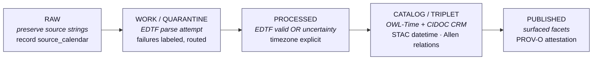

<!-- [KFM_META_BLOCK_V2]
doc_id: kfm://doc/<uuid-TBD>
title: Time-Awareness Doctrine
type: standard
version: v1
status: draft
owners: <TBD — pending assignment>
created: 2026-05-12
updated: 2026-05-12
policy_label: public
related:
  - <TODO: docs/doctrine/evidence.md (path PROPOSED)>
  - <TODO: docs/doctrine/provenance.md (path PROPOSED)>
  - <TODO: docs/doctrine/pipeline-stages.md (path PROPOSED)>
tags: [kfm, doctrine, time, temporal, edtf, provenance]
notes:
  - "Draft doctrine. Internal field names on EvidenceBundle, EvidenceRef, and event nodes are PROPOSED."
  - "Related doc paths are TODO until adjacent doctrine files are inspected."
[/KFM_META_BLOCK_V2] -->

# Time-Awareness Doctrine

> Canonical rules for how time is represented, recorded, validated, and surfaced across every stage of the Kansas Frontier Matrix pipeline — from `RAW` source preservation to `PUBLISHED` consumer surfaces.


> **Status:** `draft` · **Owners:** _TBD — pending assignment_ · **Updated:** `2026-05-12`
>
> _Badge endpoints are placeholders pending confirmation of the repository's shields.io convention._

---

## Quick Jump

- [1. Purpose](#1-purpose)
- [2. Non-Negotiables](#2-non-negotiables)
- [3. Scope](#3-scope)
- [4. Standards Alignment](#4-standards-alignment)
- [5. Time Through the Pipeline](#5-time-through-the-pipeline)
- [6. Time on Internal Types](#6-time-on-internal-types)
- [7. EDTF Usage and Uncertainty](#7-edtf-usage-and-uncertainty)
- [8. Calendars: Julian, Gregorian, and Others](#8-calendars-julian-gregorian-and-others)
- [9. Timezones](#9-timezones)
- [10. Allen Interval Algebra](#10-allen-interval-algebra)
- [11. Bitemporality and Provenance Time](#11-bitemporality-and-provenance-time)
- [12. Temporal Queries](#12-temporal-queries)
- [13. Open Questions](#13-open-questions)
- [14. Related Docs](#14-related-docs)
- [Appendix A — Allen Relation Reference](#appendix-a--allen-relation-reference)
- [Appendix B — EDTF Quick Reference](#appendix-b--edtf-quick-reference)

---

## 1. Purpose

The Kansas Frontier Matrix carries time-bearing material — historical events, archival
records, geospatial scans, derived inferences — across heterogeneous source calendars,
uncertain dates, and many decades of recording practice. Time is **never optional** in
KFM, and it is **never implicit**. This document fixes the doctrine: what every part of
the system must say about *when* something happened, *when it was recorded*, *how certain
that is*, and *in what calendar frame*.

This is a **draft doctrine**. It is binding for design discussion and for new work; existing
work should be reconciled against it as part of normal review.

> [!IMPORTANT]
> Time-awareness applies to **all** five pipeline stages and **all** time-bearing
> internal types. There is no stage at which a record may carry an unlabeled, unparsed,
> or implicitly-zoned timestamp.

[Back to top ↑](#time-awareness-doctrine)

---

## 2. Non-Negotiables

The following are **binding rules**. Any pipeline component, schema, or downstream
consumer that violates them is, by definition, non-conformant.

> [!IMPORTANT]
> **NN-1 — EDTF-valid date or labeled uncertainty.**
> Every event-bearing record MUST carry either:
> (a) a date that parses cleanly as **EDTF** (Extended Date/Time Format), **or**
> (b) a `time_uncertainty` value drawn from a controlled vocabulary, explaining *why*
> a clean EDTF value is not available.
> A record with neither is a hard validation failure.

> [!IMPORTANT]
> **NN-2 — No implicit timezone.**
> Every wall-clock timestamp MUST be either:
> (a) timezone-tagged (ISO 8601 offset or named zone), **or**
> (b) explicitly marked `naive=true` with a documented `naive_reason`.
> "Local time" without further qualification is forbidden.

> [!IMPORTANT]
> **NN-3 — Julian dates carry a calendar flag.**
> Any date asserted in the Julian calendar (or any non-Gregorian calendar) MUST
> carry an explicit `calendar` flag identifying the source calendar. Gregorian is
> the assumed default *only* when the source clearly post-dates the relevant
> Gregorian adoption and no contrary evidence exists; otherwise the flag is required.

These three rules are the minimum bar. The remainder of this document operationalizes
them.

[Back to top ↑](#time-awareness-doctrine)

---

## 3. Scope

Time-awareness in KFM covers, **without exception**, the following concerns:

| Concern | In scope |
|---|---|
| Event modeling (single instants, intervals, spans) | Yes |
| Historical date uncertainty (`circa`, `fl.`, decade/century approximations) | Yes |
| Calendar-system handling (Julian, Gregorian, others as encountered) | Yes |
| Temporal queries across the catalog (point-in-time, range, overlap) | Yes |
| Bitemporality — valid-time vs. transaction-time | Yes |
| Provenance time — when each assertion was generated, derived, or invalidated | Yes |
| Time on geospatial assets (scans, surveys, aerial imagery) | Yes |
| Time on derived RDF triples (event nodes, intervals, relations) | Yes |

There is no part of KFM where time is "someone else's problem."

[Back to top ↑](#time-awareness-doctrine)

---

## 4. Standards Alignment

KFM aligns its time-handling to six external standards. Each plays a defined role; none
is decorative. Where standards overlap, the table below names the canonical use site.

| Standard | Role in KFM | Stage(s) where it is the canonical form |
|---|---|---|
| **ISO 8601 / EDTF** | Surface syntax for dates and date uncertainty in JSON, YAML, and RDF literals. EDTF extends ISO 8601 with explicit support for uncertain, approximate, and partially-known dates. | `RAW` → `PUBLISHED` (everywhere a date appears as a string) |
| **OWL-Time** | RDF/OWL ontology for instants and intervals. Canonical form for time in the triple store. | `CATALOG / TRIPLET` → `PUBLISHED` |
| **CIDOC CRM `E52 Time-Span`** | Cultural-heritage time-span semantics. Bridges archival/museum vocabularies. Used for event-scoped time, not for system-time. | `CATALOG / TRIPLET` → `PUBLISHED` |
| **Allen interval algebra** | Formal vocabulary for relations between time intervals (13 base relations). Used to express event-to-event temporal structure. | `PROCESSED` → `PUBLISHED` |
| **STAC `datetime` / `start_datetime` / `end_datetime`** | Spatial-temporal catalog metadata for geospatial assets. | `CATALOG` → `PUBLISHED` |
| **W3C PROV-O** | Bitemporal provenance: `prov:generatedAtTime`, `prov:invalidatedAtTime`, and related properties express *transaction time* for every assertion. | All five stages |

> [!NOTE]
> **EDTF** is the surface form. **OWL-Time** is the graph form. **CIDOC CRM** is the
> domain form. **STAC** is the geospatial-catalog form. **Allen** is the relation
> vocabulary. **PROV-O** is the transaction-time form. Records may carry several of
> these simultaneously; they do not compete.

[Back to top ↑](#time-awareness-doctrine)

---

## 5. Time Through the Pipeline

Time is captured, validated, normalized, modeled, and surfaced — in that order, across
the canonical five-stage pipeline.



> [!NOTE]
> The diagram reflects the five named pipeline stages from the source brief. The
> per-stage time-handling rules below are **PROPOSED** as operational doctrine and
> require verification against current pipeline implementation before promotion to
> `CONFIRMED`.

| Stage | What is enforced | What is recorded | Failure mode |
|---|---|---|---|
| `RAW` | Verbatim preservation. **NN-3** applies: capture `source_calendar` if known. | Original date string · `source_calendar` · capture timestamp | None (passthrough). Missing calendar is recorded as `source_calendar=unknown`, never silently. |
| `WORK / QUARANTINE` | Attempt EDTF parse against the captured string. | `parse_result` · `parse_errors` · `time_confidence` | Unparseable strings route to `QUARANTINE` with a labeled `time_uncertainty` reason. They do **not** advance silently. |
| `PROCESSED` | **NN-1** and **NN-2** apply. Every event has EDTF-valid date or labeled uncertainty; every wall-clock timestamp is timezone-tagged or `naive=true` with reason. | Normalized EDTF value · `time_uncertainty` (if any) · `calendar` · timezone or `naive_reason` | Hard fail if neither EDTF nor uncertainty is present. Hard fail on implicit timezone. |
| `CATALOG / TRIPLET` | Emit `time:Interval` / `time:Instant` (OWL-Time) and `crm:E52_Time-Span` triples. Geospatial assets carry STAC `datetime` (or `start_datetime` / `end_datetime`). Event-to-event Allen relations emitted as object properties where derivable. | Time-Span IRIs · STAC item temporal fields · Allen-relation triples · PROV-O generation timestamps | A record with valid `PROCESSED` time but missing CATALOG emission is logged as a coverage gap, not silently dropped. |
| `PUBLISHED` | Temporal facets exposed to consumers. PROV-O attestation accompanies every published assertion, carrying both valid-time and transaction-time. | Faceted temporal indices · PROV-O bundle per assertion | Read-only surface; failures here are reporting bugs, not data bugs. |

[Back to top ↑](#time-awareness-doctrine)

---

## 6. Time on Internal Types

The three KFM types named in scope each carry time, but they carry it differently. Field
names below are **PROPOSED**; the *responsibilities* are doctrinal.

| Type | Time responsibility | Proposed fields | Required at | Notes |
|---|---|---|---|---|
| `EvidenceBundle` | Carries the **primary time-frame** for a body of evidence — both *valid time* (what the evidence is about) and *transaction time* (when it entered the system). | `observed_at` (EDTF) · `recorded_at` (PROV-O xsd:dateTime) · `source_calendar` · `time_confidence` · `time_uncertainty?` | `RAW` for `recorded_at` and `source_calendar`; `PROCESSED` for `observed_at` and `time_confidence`. | Bitemporal. `observed_at` MAY be an EDTF interval; `recorded_at` is a single xsd:dateTime. |
| `EvidenceRef` | Points to an `EvidenceBundle` and **inherits** its time-frame. May *narrow* the frame but MUST NOT contradict the bundle. | `effective_interval?` (EDTF interval, narrowing only) | `PROCESSED` onward if narrowing is asserted. | Narrowing must satisfy `effective_interval ⊆ bundle.observed_at` (Allen: `during`, `starts`, `finishes`, or `equals`). |
| **Event node** | Models a discrete or extended historical event. **NN-1**, **NN-2**, **NN-3** all apply here. | `edtf_date` **OR** `time_uncertainty` · `calendar` · `timezone?` · `naive_reason?` · `allen_relations[]` | `PROCESSED` onward. | `allen_relations` is a list of `{ relation, target_event_iri }` entries, derivable or asserted. |

> [!CAUTION]
> The narrowing rule on `EvidenceRef` is **non-negotiable in spirit**: a reference must
> not claim a tighter time-frame than its bundle supports. The mechanical check
> (`effective_interval ⊆ bundle.observed_at`) is **PROPOSED** and must be validated
> against existing schema enforcement before it can be cited as implemented.

[Back to top ↑](#time-awareness-doctrine)

---

## 7. EDTF Usage and Uncertainty

EDTF (Extended Date/Time Format) is the surface syntax for **all** date-bearing fields.
The cases below define what KFM accepts.

**Accepted patterns** _(PROPOSED operational subset; the full EDTF spec is broader)_:

- Fully-specified dates: `1854-06-12`
- Year-only: `1854`
- Year-month: `1854-06`
- Open intervals: `1854/1856`, `1854/..`, `../1856`
- Approximate: `1854~` (approximate), `1854?` (uncertain), `1854%` (both)
- Decade / century: `185X`, `18XX`
- Sets and lists for disputed dates: `[1854, 1855]`, `{1854..1856}`

**`time_uncertainty` vocabulary** _(PROPOSED — to be hardened against actual encountered cases):_

| Token | Meaning |
|---|---|
| `unparseable_source` | Source string present but does not yield EDTF under any reasonable rule. |
| `no_date_recorded` | Source explicitly contains no date. |
| `date_redacted` | Source contains a date but it is redacted in the available copy. |
| `circa_only` | Source asserts only a `circa` value without anchor — escalate to EDTF `~`. |
| `floruit` | Person/entity active during a period; no birth/death. |
| `conflicting_sources` | Multiple sources disagree; capture set, do not pick. |

> [!TIP]
> Prefer EDTF approximation operators (`~`, `?`, `%`) to free-text uncertainty whenever
> a defensible approximate date can be stated. The `time_uncertainty` vocabulary is for
> cases where **no** EDTF value can be honestly produced.

[Back to top ↑](#time-awareness-doctrine)

---

## 8. Calendars: Julian, Gregorian, and Others

Calendar-system handling is governed by **NN-3**. The default is Gregorian — but the
default applies only when the source's calendar context is unambiguous.

**Rules:**

1. Every event node and every `EvidenceBundle.observed_at` carries a `calendar` value.
2. Valid values include at minimum: `gregorian`, `julian`, `unknown`. Additional values
   are added as encountered, never inferred silently.
3. The system **never** silently converts Julian to Gregorian for storage. Conversions
   for display or for cross-calendar query MUST be reversible and MUST be labeled at
   the surface where they appear.
4. Records crossing a known Julian→Gregorian adoption boundary (e.g., civil records from
   regions adopting Gregorian at different dates) carry the *source-jurisdiction's*
   calendar at the date of the record, not a globally-assumed one.

> [!WARNING]
> Silent calendar conversion is one of the most common, most invisible sources of
> historical-record corruption. **NN-3 exists to make this impossible by default.**
> Any tool that emits a converted date without preserving the original and labeling
> the conversion is non-conformant.

[Back to top ↑](#time-awareness-doctrine)

---

## 9. Timezones

Timezone handling is governed by **NN-2**. The rule is simple to state, sometimes
painful to implement.

**For every wall-clock timestamp:**

- **Either** the timestamp carries a timezone (ISO 8601 offset such as `-06:00`, or a
  named IANA zone such as `America/Chicago`),
- **Or** the timestamp carries `naive=true` accompanied by a `naive_reason` from a
  controlled vocabulary (e.g., `pre_iana`, `source_omitted`, `intentionally_local`).

**For historical dates without a meaningful time-of-day**, the question does not arise:
they are EDTF date values, not wall-clock timestamps, and **NN-2** does not bind them.

> [!NOTE]
> The `naive=true` escape hatch exists because some historical timestamps cannot
> honestly be zoned (e.g., "8 PM" recorded in 1872 from a region that had no
> standardized time). The escape hatch is **not** a license to skip the question; it
> requires a `naive_reason` and is reviewed in audit.

[Back to top ↑](#time-awareness-doctrine)

---

## 10. Allen Interval Algebra

Event-to-event temporal relations are expressed using **Allen's 13 base relations**
between intervals. KFM uses Allen relations in two modes:

- **Asserted** — a source explicitly states the relation (e.g., "the treaty *preceded*
  the survey").
- **Derived** — relations computed from two events' time-frames during `PROCESSED` or
  `CATALOG / TRIPLET`, with provenance recording the derivation.

Derived relations are first-class citizens but MUST be PROV-O-attested as derivations,
not as asserted facts.

The 13 base relations are listed in **[Appendix A](#appendix-a--allen-relation-reference)**.

> [!NOTE]
> When intervals are **uncertain** (EDTF approximations, open-ended intervals,
> partially-known endpoints), the relation between them may itself be uncertain —
> sometimes legitimately a *disjunction* of several Allen base relations. Doctrine:
> represent the disjunction explicitly. Do not collapse it to the strongest single
> relation.

[Back to top ↑](#time-awareness-doctrine)

---

## 11. Bitemporality and Provenance Time

KFM is bitemporal:

- **Valid time** — *when the thing was true in the world*. Carried on
  `EvidenceBundle.observed_at`, on event nodes, on derived intervals.
- **Transaction time** — *when the system asserted it*. Carried on
  `EvidenceBundle.recorded_at` and on every PROV-O attestation.

**PROV-O hooks (PROPOSED mapping):**

| PROV-O property | KFM use |
|---|---|
| `prov:generatedAtTime` | When this assertion was first emitted by the pipeline. |
| `prov:invalidatedAtTime` | When this assertion was retracted or superseded. |
| `prov:wasDerivedFrom` | Links a derived event/relation back to its evidence. |
| `prov:wasAttributedTo` | The agent (pipeline component, curator) responsible. |
| `prov:atTime` | Point-in-time qualifier on derivations. |

> [!IMPORTANT]
> A correction to a valid-time value is a **new transaction-time event**, not a
> rewrite. KFM never silently overwrites historical assertions; superseding requires
> a `prov:invalidatedAtTime` on the prior assertion and a fresh
> `prov:generatedAtTime` on the new one.

[Back to top ↑](#time-awareness-doctrine)

---

## 12. Temporal Queries

Temporal queries against the catalog MUST honor the doctrine above. In particular:

- **Point-in-time queries** (`as_of=YYYY-MM-DD`) operate over valid time by default;
  a `transaction_as_of` modifier selects transaction time.
- **Range queries** accept EDTF intervals and resolve uncertainty via a documented
  policy (PROPOSED: *inclusive of uncertainty* — i.e., a record's interval matches a
  query interval if Allen `overlaps`, `during`, `starts`, `finishes`, `equals`, or
  their inverses hold, treating EDTF approximations as bounded ranges).
- **Calendar-aware queries** MUST either fix a calendar for the query or surface
  matches in multiple calendars with the source calendar preserved.

> [!CAUTION]
> Uncertainty handling in temporal queries is the single most consequential design
> choice in this doctrine for downstream users. The PROPOSED inclusive policy is the
> current default; alternatives (strict containment, configurable per-query) are
> open questions — see **[Section 13](#13-open-questions)**.

[Back to top ↑](#time-awareness-doctrine)

---

## 13. Open Questions

The following are explicitly **open** and labeled — they are *not* doctrine yet.

| # | Question | Status |
|---|---|---|
| Q1 | Exact controlled vocabulary for `time_uncertainty`. The list in §7 is a starting set; the production vocabulary must be hardened against actual encountered cases. | `PROPOSED` |
| Q2 | Default policy for range queries over uncertain intervals (inclusive vs. strict containment vs. per-query configurable). | `PROPOSED` |
| Q3 | Mechanical enforcement of the `EvidenceRef` narrowing rule (`effective_interval ⊆ bundle.observed_at`) at schema vs. validator level. | `PROPOSED` · `NEEDS VERIFICATION` |
| Q4 | Whether Julian→Gregorian *display* conversion is performed at `PUBLISHED` or only on explicit consumer request. | `PROPOSED` |
| Q5 | Whether Allen-relation **disjunctions** are first-class triples or computed on demand from interval bounds. | `PROPOSED` |
| Q6 | Calendar handling for non-Julian/non-Gregorian sources encountered in scope (Islamic, Hebrew, Republican French, etc.). | `UNKNOWN` |
| Q7 | Owner assignment for this doctrine. | `UNKNOWN` |

[Back to top ↑](#time-awareness-doctrine)

---

## 14. Related Docs

> The links below are **TODO** until adjacent doctrine and schema docs are confirmed
> in the repository.

- _TODO_ — `docs/doctrine/evidence.md` — `EvidenceBundle` and `EvidenceRef` doctrine _(path PROPOSED)_
- _TODO_ — `docs/doctrine/provenance.md` — PROV-O usage in KFM _(path PROPOSED)_
- _TODO_ — `docs/doctrine/pipeline-stages.md` — canonical definition of `RAW` → `PUBLISHED` _(path PROPOSED)_
- _TODO_ — `docs/schemas/event.md` — event-node schema with time fields _(path PROPOSED)_
- _TODO_ — `docs/queries/temporal.md` — temporal query surface and semantics _(path PROPOSED)_

[Back to top ↑](#time-awareness-doctrine)

---

## Appendix A — Allen Relation Reference

<details>
<summary>Allen's 13 base relations between intervals <code>X</code> and <code>Y</code></summary>

| Relation | Meaning | Inverse |
|---|---|---|
| `before` | `X` ends strictly before `Y` begins | `after` |
| `after` | `X` begins strictly after `Y` ends | `before` |
| `meets` | `X` ends exactly when `Y` begins | `met-by` |
| `met-by` | `X` begins exactly when `Y` ends | `meets` |
| `overlaps` | `X` begins before `Y`, ends during `Y` | `overlapped-by` |
| `overlapped-by` | `Y` begins before `X`, ends during `X` | `overlaps` |
| `starts` | `X` and `Y` share a start; `X` ends earlier | `started-by` |
| `started-by` | `X` and `Y` share a start; `Y` ends earlier | `starts` |
| `during` | `X` is strictly contained within `Y` | `contains` |
| `contains` | `Y` is strictly contained within `X` | `during` |
| `finishes` | `X` and `Y` share an end; `X` begins later | `finished-by` |
| `finished-by` | `X` and `Y` share an end; `Y` begins later | `finishes` |
| `equals` | `X` and `Y` share both endpoints | `equals` |

</details>

---

## Appendix B — EDTF Quick Reference

<details>
<summary>EDTF patterns accepted in KFM (PROPOSED operational subset)</summary>

```text
1854-06-12        # full date
1854-06           # year-month
1854              # year only
1854~             # approximate year
1854?             # uncertain year
1854%             # approximate AND uncertain
185X              # decade (1850s)
18XX              # century (1800s)
1854/1856         # closed interval
1854/..           # open-ended (still ongoing or unknown end)
../1856           # open-started (unknown start)
[1854, 1855]      # disputed: one-of set
{1854..1856}      # disputed: all-of set (multiple instances)
```

The above is a working subset; the full EDTF specification supports additional
constructs that KFM will accept on a case-by-case basis as encountered.

</details>

---

**Related docs:** see [§14](#14-related-docs) · **Last updated:** `2026-05-12` · [Back to top ↑](#time-awareness-doctrine)
