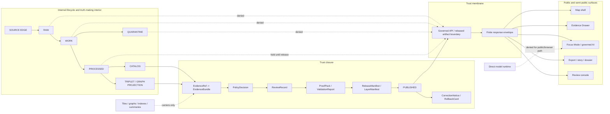

<!-- [KFM_META_BLOCK_V2]
doc_id: kfm://doc/NEEDS-VERIFICATION-docs-doctrine-trust-membrane
title: Trust Membrane
type: standard
version: v1
status: draft
owners: OWNER_TBD_NEEDS_VERIFICATION
created: CREATED_DATE_TBD_FROM_GIT_OR_DOC_REGISTRY
updated: 2026-05-06
policy_label: NEEDS_VERIFICATION
related: [../../README.md, ./README.md, ./authority-ladder.md, ./truth-posture.md, ./lifecycle-law.md, ../adr/ADR-0014-truth-path.md, ../architecture/governed-api.md, ../../policy/README.md]
tags: [kfm, doctrine, trust-membrane, inspectable-claim, evidence, governed-api, lifecycle, publication, correction, rollback, governed-ai]
notes: [Revises docs/doctrine/trust-membrane.md as doctrine, not implementation proof; doc_id owners created date and policy label remain NEEDS VERIFICATION; enforcement maturity remains UNKNOWN until matching schemas policies validators tests workflows release objects runtime traces and UI states are verified]
[/KFM_META_BLOCK_V2] -->

<a id="top"></a>

# Trust Membrane

The doctrine boundary that keeps every KFM public or semi-public output downstream of evidence, policy, review, release, correction, and rollback.

<p align="left">
  
  
  
  
  
  
</p>

> [!IMPORTANT]
> **Status:** `draft`  
> **Owners:** `OWNER_TBD_NEEDS_VERIFICATION`  
> **Path:** `docs/doctrine/trust-membrane.md`  
> **Owning root:** `docs/` — human-facing doctrine and architecture control plane.  
> **Doctrine confidence:** `CONFIRMED` from KFM doctrine and adjacent repo docs.  
> **Implementation confidence:** `UNKNOWN / NEEDS VERIFICATION` until route guards, policy gates, schemas, validators, fixtures, tests, workflows, release manifests, proof packs, runtime traces, and UI states are inspected together.

## Quick jumps

| Doctrine | Crossing rules | Review |
|---|---|---|
| [Scope](#scope) | [Allowed crossings](#allowed-crossings) | [Validation targets](#validation-targets) |
| [Repo fit](#repo-fit) | [Denied crossings](#denied-crossings) | [Definition of done](#definition-of-done) |
| [Core rule](#core-rule) | [Runtime outcomes](#runtime-outcomes) | [Open verification](#open-verification) |
| [Inspectable claim](#inspectable-claim) | [Sensitive material](#sensitive-and-rights-uncertain-material) | [Appendix](#appendix) |
| [Lifecycle relationship](#lifecycle-relationship) | [Diagram](#diagram) | [Related doctrine](#related-doctrine) |

---

## Scope

The **trust membrane** is KFM’s boundary between internal truth-making machinery and outward-facing surfaces that can persuade a person, reviewer, system, map user, or model.

It applies to:

- governed APIs;
- public and steward-facing map surfaces;
- map popups and layer manifests;
- Evidence Drawer payloads;
- Focus Mode and governed AI responses;
- review-console actions;
- exports, stories, reports, dossiers, and dashboards;
- tile services, graph projections, search indexes, vector indexes, and summaries;
- release, correction, withdrawal, supersession, and rollback workflows.

The trust membrane is not a single middleware file, UI panel, backend package, data folder, or model adapter. It is the doctrine rule that public and semi-public outputs must remain downstream of the KFM truth path.

> KFM public value is not “the map rendered” or “the model answered.” KFM public value is an inspectable claim whose support, policy posture, release state, and correction lineage can be examined.

[Back to top](#top)

---

## Repo fit

`docs/doctrine/trust-membrane.md` belongs under `docs/doctrine/` because it states durable, human-readable operating law. It should guide ADRs, contracts, schemas, policy, validators, route design, UI behavior, release review, correction practice, and rollback drills without becoming any of those surfaces itself.

| Relationship | Path | Status | Role |
|---|---|---:|---|
| This document | `docs/doctrine/trust-membrane.md` | `draft` | Doctrine for public and semi-public trust boundaries. |
| Doctrine index | [`./README.md`](./README.md) | `CONFIRMED` | Local doctrine navigation, accepted inputs, and exclusions. |
| Authority ladder | [`./authority-ladder.md`](./authority-ladder.md) | `CONFIRMED` | Decides what outranks what by claim type. |
| Truth posture | [`./truth-posture.md`](./truth-posture.md) | `CONFIRMED` | Defines truth labels and finite outcomes. |
| Lifecycle law | [`./lifecycle-law.md`](./lifecycle-law.md) | `CONFIRMED` | Defines the source-to-publication truth path. |
| Truth-path ADR | [`../adr/ADR-0014-truth-path.md`](../adr/ADR-0014-truth-path.md) | `CONFIRMED / draft` | Architecture decision for the truth path and public trust membrane. |
| Governed API architecture | [`../architecture/governed-api.md`](../architecture/governed-api.md) | `CONFIRMED` | Runtime boundary where clients should receive governed responses. |
| Policy root | [`../../policy/README.md`](../../policy/README.md) | `CONFIRMED` | Decision surface for rights, sensitivity, release, correction, and deny-by-default behavior. |
| Root orientation | [`../../README.md`](../../README.md) | `CONFIRMED` | Repository-level KFM identity, lifecycle law, and inspectable-claim posture. |

### Accepted inputs

Use this doctrine for stable, repo-wide trust-boundary rules.

| Input | Belongs here when... |
|---|---|
| Public exposure doctrine | A map, API, Focus Mode answer, export, story, or dashboard needs a public boundary rule. |
| Evidence closure rules | A public or semi-public claim must resolve `EvidenceRef -> EvidenceBundle`. |
| Internal-stage access rules | A client might reach `RAW`, `WORK`, `QUARANTINE`, unpublished candidates, internal stores, or direct model runtimes. |
| Derived-product boundaries | Tiles, graphs, indexes, summaries, dashboards, reports, scenes, or AI answers could be mistaken for proof. |
| Release posture | Promotion, publication, correction, withdrawal, supersession, or rollback needs a crossing rule. |
| Runtime outcomes | `ANSWER`, `ABSTAIN`, `DENY`, `ERROR`, stale, withdrawn, restricted, generalized, or quarantined states need shared meaning. |
| Sensitivity defaults | Rights uncertainty, living-person data, DNA/genomics, rare species, archaeology, infrastructure, cultural stewardship, or precise location exposure requires fail-closed treatment. |

### Exclusions

This doctrine file must not become a catch-all.

| Do not put here | Put it here instead | Why |
|---|---|---|
| JSON Schema definitions | `schemas/` or accepted schema home | Doctrine states law; schemas validate shape. |
| Semantic object contracts | `contracts/` | Contracts define object meaning and compatibility. |
| Policy-as-code | `policy/` | Policy decides admissibility and obligations. |
| Validator implementation | `tools/validators/` or repo-native equivalent | Validators prove shape, linkage, lifecycle, release, and evidence closure. |
| Runtime route handlers | `apps/` or accepted runtime home | Route code enforces the membrane; this file defines it. |
| Source descriptors | `data/registry/`, `control_plane/`, or accepted source registry home | Source authority needs structured records. |
| Receipts, proof packs, release manifests, rollback cards | `data/receipts/`, `data/proofs/`, `release/`, or accepted emitted-object homes | Emitted trust objects are audit artifacts. |
| UI component code | `apps/`, `packages/`, `ui/`, `web/`, or accepted compatibility roots | UI displays trust state; it does not own doctrine. |
| Private chain-of-thought | Do not store as KFM truth material | Generated reasoning is not a governed evidence object. |

[Back to top](#top)

---

## Core rule

```text
Public and semi-public surfaces cross the trust membrane only through governed evidence, policy, review, release, correction, and rollback state.
```

KFM must not let the fastest or most persuasive carrier become the truth authority.

| Carrier | Useful role | Not allowed to become |
|---|---|---|
| Map layer | Visual carrier of released, public-safe artifacts. | Canonical evidence or publication authority. |
| Tile / PMTiles / raster | Rebuildable public-safe derivative. | Proof by itself. |
| Graph / triplet | Evidence-backed relation projection. | Canonical record store. |
| Search or vector index | Retrieval acceleration. | Source authority or citation substitute. |
| Dashboard | Trust-visible summary of governed state. | Release gate. |
| Export or story | Released evidence carrier. | Silent replacement for citations and evidence. |
| Focus Mode / AI answer | Evidence-bounded explanation. | Truth, policy, rights, sensitivity, review, or release decision. |
| Review console | Steward-facing decision surface. | Unlogged admin bypass. |
| Receipt | Process memory and audit support. | Canonical truth by itself. |

### One-line failure rule

When the membrane cannot prove a safe crossing, KFM should return `ABSTAIN`, `DENY`, `ERROR`, hold, quarantine, restrict, generalize, withdraw, or require review rather than publishing a plausible answer.

[Back to top](#top)

---

## Inspectable claim

KFM’s durable public unit is the **inspectable claim**.

An inspectable claim is a public or semi-public statement whose support can be inspected across:

| Dimension | Required visibility |
|---|---|
| Evidence | `EvidenceRef -> EvidenceBundle` closure or a visible reason for `ABSTAIN`. |
| Source role | What the source is allowed to prove, and what it cannot prove. |
| Spatial scope | Geometry, scale, precision, generalization, and public-safe transform state. |
| Temporal scope | Valid time, observed time, source time, retrieval time, release time, stale state, and correction time where material. |
| Policy posture | Rights, sensitivity, access role, obligations, and decision reason. |
| Review state | Whether review is approved, pending, denied, not required, or unknown. |
| Release state | Release manifest, layer manifest, catalog/proof closure, or visible absence. |
| Correction lineage | Correction, withdrawal, supersession, rollback target, or current-state signal. |

A claim that cannot carry these dimensions may still be useful internally, but it should not cross the membrane as public truth.

### Minimum support chain

```text
InspectableClaim
  -> EvidenceRef
  -> EvidenceBundle
  -> SourceDescriptor
  -> Receipt / DatasetVersion / CatalogRecord
  -> ValidationReport
  -> PolicyDecision
  -> ReviewRecord
  -> ReleaseManifest / LayerManifest
  -> CorrectionNotice / RollbackCard
```

> [!NOTE]
> Not every UI surface needs to display every object in full. Every surface that makes or displays a consequential claim must be able to point to enough support for its consequence level.

[Back to top](#top)

---

## Lifecycle relationship

The trust membrane protects KFM’s lifecycle law:

```text
SOURCE EDGE -> RAW -> WORK / QUARANTINE -> PROCESSED -> CATALOG / TRIPLET -> PUBLISHED
```

The membrane is crossed only after public-safe release conditions are met.

| Lifecycle state | Public posture | Membrane rule |
|---|---|---|
| `SOURCE EDGE` | Not public truth. | Source discovery is not source authority or release permission. |
| `RAW` | `DENY` public access. | Preserve source-native capture; do not serve it to public clients. |
| `WORK` | `DENY` public access. | Transform and QA outputs are not public artifacts. |
| `QUARANTINE` | `DENY` public access except approved safe reason summaries. | Failed, unclear, sensitive, conflicted, or restricted material stays contained. |
| `PROCESSED` | Hold by default. | Validation is not publication. |
| `CATALOG / TRIPLET` | Conditional. | Discoverability and graph projection are not release authority. |
| `PUBLISHED` | Allowed through governed surfaces. | Public-safe exposure requires release, evidence, policy, review, correction, and rollback linkage. |

> [!IMPORTANT]
> Publication is a governed state transition. It is not a file copy, folder move, successful ETL job, tile build, dashboard refresh, graph edge creation, or model response.

[Back to top](#top)

---

## Membrane layers

A public or semi-public crossing should pass through the layers that matter to the request.

| Layer | Question it answers | Default failure outcome |
|---|---|---|
| Source layer | Is the source identified, role-bounded, rights-reviewed, and suitable for this claim type? | `DENY` or `ABSTAIN`. |
| Lifecycle layer | Is the material downstream of the correct lifecycle state? | `DENY` internal-stage access. |
| Evidence layer | Can the claim resolve `EvidenceRef -> EvidenceBundle`? | `ABSTAIN` or `ERROR`. |
| Policy layer | Do rights, sensitivity, access role, and obligations allow exposure? | `DENY`, `RESTRICT`, `GENERALIZE`, or `HOLD`. |
| Review layer | Is the required steward, domain, policy, release, or security review complete? | `HOLD` or `DENY`. |
| Release layer | Is there a release manifest, layer manifest, catalog/proof closure, and rollback target? | Block publication. |
| Runtime layer | Does the response use finite outcomes and avoid direct model/internal-store bypass? | `DENY` or `ERROR`. |
| UI trust layer | Does the user see source role, release state, stale state, uncertainty, correction, or denial where material? | Hide, downgrade, or show negative state. |
| Correction layer | Can the claim be corrected, withdrawn, superseded, and rolled back visibly? | `ERROR` for release or publication. |

[Back to top](#top)

---

## Allowed crossings

A surface may cross the trust membrane only when it uses governed interfaces and public-safe evidence.

| Crossing | Allowed when | Expected trust payload |
|---|---|---|
| Public API answer | Claim is released or public-safe, evidence resolves, policy allows, and a finite outcome is emitted. | `DecisionEnvelope` or `RuntimeResponseEnvelope` with evidence, policy, release, and correction refs. |
| Map layer render | Layer is release-backed and public-safe. | `LayerManifest`, release ref, source/evidence refs, stale/correction state. |
| Map popup | Feature or claim resolves to evidence appropriate to the displayed statement. | Claim ID, evidence ref, source role, temporal/spatial scope, policy label. |
| Evidence Drawer | Evidence is public-safe or role-authorized. | `EvidenceBundle`, source list, limitations, review/release state, correction lineage. |
| Focus Mode answer | Question is scoped to admissible released evidence and citation validation passes. | `ANSWER`, `ABSTAIN`, `DENY`, or `ERROR` envelope. |
| Export / story / dossier | Output inherits release, evidence, rights, sensitivity, and correction state. | Cited claims, release refs, public-safe caveats, rollback/correction refs. |
| Review console action | Actor is authorized and the action is auditable. | Review record, policy decision, receipt, affected release/correction refs. |
| Diagnostic status | Status is safe to expose and does not leak secrets, internal paths, restricted records, or raw data. | Bounded status envelope with no internal truth bypass. |

[Back to top](#top)

---

## Denied crossings

The following shortcuts are trust-membrane violations unless an explicit steward-only, role-scoped, audited review path permits a narrow internal operation.

| Shortcut | Why denied |
|---|---|
| Public client reads `RAW`, `WORK`, or `QUARANTINE`. | Internal lifecycle states lack public release posture. |
| Browser or public API reads canonical/internal stores directly. | Bypasses policy, evidence closure, release state, and audit controls. |
| Map layer fetches live source APIs directly as public truth. | Source availability is not KFM publication. |
| UI treats tile properties as sufficient evidence. | Tiles are derived carriers, not proof. |
| Graph projection returns relationships as canonical facts. | Graph edges require evidence and source-role support. |
| Vector search result is used as authoritative answer. | Retrieval is not evidence. |
| AI/model runtime is called directly by browser/public client. | AI must be evidence-subordinate and policy-mediated. |
| Focus Mode answers without citations. | Cite-or-abstain law is broken. |
| Unknown rights or unknown sensitivity is treated as public-safe. | KFM fails closed where public harm or rights violations are possible. |
| Release lacks correction or rollback target. | Public trust cannot be repaired or reversed. |
| Correction silently overwrites the prior public record. | Lineage and accountability disappear. |

[Back to top](#top)

---

## Runtime outcomes

KFM public and semi-public runtime surfaces should use finite outcomes rather than ambiguous success text.

| Outcome | Meaning | Membrane behavior |
|---|---|---|
| `ANSWER` | Evidence is sufficient, policy allows the response, release/review state is appropriate, and citations/support validate. | Return bounded payload and trust refs. |
| `ABSTAIN` | KFM cannot support the claim strongly enough for the requested scope. | Return no unsupported claim; explain safe reason. |
| `DENY` | Policy, rights, sensitivity, access role, release state, or public-safety rule blocks the response. | Return no restricted content; expose safe reason codes only. |
| `ERROR` | System, schema, resolver, validator, policy, release, adapter, or runtime failure prevents reliable handling. | Fail closed; do not substitute plausible prose. |

### Illustrative envelope

```json
{
  "outcome": "ABSTAIN",
  "reason_code": "EVIDENCE_BUNDLE_NOT_RESOLVED",
  "surface": "focus_mode",
  "evidence_refs": [],
  "evidence_bundle_refs": [],
  "policy_decision_ref": null,
  "release_ref": null,
  "correction_state": "unknown",
  "limitations": [
    "The requested claim cannot cross the trust membrane without resolved evidence."
  ]
}
```

> [!CAUTION]
> This JSON is illustrative doctrine guidance, not a confirmed schema. Use the accepted schema home and contract files for machine shape.

[Back to top](#top)

---

## Sensitive and rights-uncertain material

The trust membrane is stricter when exposure could create harm, violate rights, or create false authority.

| Material or risk | Default crossing rule |
|---|---|
| Unknown rights or unclear redistribution terms | `DENY` public release until rights are reviewed. |
| Unknown source role | `ABSTAIN` or `DENY` authority use. |
| Living-person data | `DENY` public exposure unless explicitly reviewed and allowed. |
| DNA/genomic material | `DENY` or restrict by default. |
| Archaeological sites, sacred places, burials, cultural stewardship concerns | `DENY` exact public location by default. |
| Rare species, nests, dens, roosts, hibernacula, sensitive habitat | `DENY`, restrict, or generalize exact public location. |
| Critical infrastructure or security-sensitive facilities | Restrict, generalize, delay, or deny. |
| Private landowner-sensitive data | Restrict or deny unless public release posture is clear. |
| Emergency or life-safety request | Do not replace official emergency systems; point to official sources where appropriate. |
| Stale operational context | Mark stale, abstain, or deny depending on consequence. |
| Ambiguous spatial precision | Generalize, abstain, or deny precise assignment. |

[Back to top](#top)

---

## Diagram



This diagram is doctrine and responsibility flow. It does not prove that any route, validator, workflow, policy engine, schema, or UI currently enforces the membrane.

[Back to top](#top)

---

## Validation targets

> [!WARNING]
> These are **validation targets**, not confirmed runnable commands. Replace examples with repo-native commands before claiming enforcement.

| Target | What it should prove |
|---|---|
| Public internal-path guard | Public routes cannot read `RAW`, `WORK`, `QUARANTINE`, unpublished candidates, or direct model runtime output. |
| Evidence closure check | Consequential `ANSWER` responses resolve `EvidenceRef -> EvidenceBundle`. |
| Citation validation | Focus Mode, Evidence Drawer, stories, exports, and popups cite support or abstain. |
| Source-role policy | Sources cannot support claims outside declared roles. |
| Rights/sensitivity policy | Unknown rights or sensitive exact exposure blocks public release. |
| Release closure | Public artifacts have release manifest, proof support, correction path, and rollback target. |
| Derived-boundary check | Tiles, graph projections, vector indexes, dashboards, summaries, and AI answers cannot mark themselves sovereign truth. |
| Negative-outcome coverage | `ABSTAIN`, `DENY`, `ERROR`, quarantine, stale, withdrawn, restricted, and generalized states appear in fixtures and UI/API payload tests. |
| No direct model client | Browser and public clients cannot call model runtime or provider adapter directly. |
| Correction/rollback drill | Published claims can be corrected, withdrawn, superseded, and rolled back with visible lineage. |

### Illustrative check sequence

```bash
# Confirm repo context.
git status --short
git branch --show-current || true
git rev-parse --show-toplevel || true

# Inspect trust-membrane-adjacent surfaces.
find docs/doctrine docs/adr docs/architecture policy contracts schemas tests fixtures tools apps packages release data \
  -maxdepth 4 -type f 2>/dev/null | sort | sed -n '1,300p'

# Review-aid search for risky public bypasses.
grep -RInE 'data/raw|data/work|data/quarantine|RAW|WORK|QUARANTINE|localhost:11434|OLLAMA_HOST|/api/generate|/api/chat' \
  apps packages tools tests docs 2>/dev/null || true

# PROPOSED only; replace with repo-native validators if they exist.
python tools/validators/check_no_public_internal_paths.py
python tools/validators/validate_evidence_closure.py --fixtures fixtures/
python tools/validators/validate_release_manifest.py --fixtures fixtures/
python -m pytest tests/
```

[Back to top](#top)

---

## Anti-patterns

| Anti-pattern | Why it weakens KFM | Safer pattern |
|---|---|---|
| “It renders, so it is true.” | Confuses presentation with evidence. | Render only release-backed carriers with evidence refs. |
| “Processed means public.” | Skips release, review, policy, correction, and rollback. | Treat `PROCESSED` as candidate state. |
| “The model can answer from context.” | Turns generated language into authority. | Resolve evidence first, then validate citations. |
| “This public source is free online, so KFM can publish it.” | Confuses access with rights and source role. | Require rights, terms, attribution, and source descriptor review. |
| “Graph says the relationship exists.” | Projection becomes canonical truth. | Require evidence-backed relation records. |
| “Tile properties are enough for the popup.” | Derived data becomes proof. | Popup requests evidence through governed API. |
| “Correction means overwrite the JSON.” | Destroys public lineage. | Use correction notice, supersession, and rollback target. |
| “Policy lives in UI conditionals.” | Hides policy outside reviewable policy lane. | Keep policy decisions typed and backend/release enforceable. |
| “Admin shortcut is fine for now.” | Normalizes bypass paths. | Keep admin operations role-scoped, audited, documented, and outside normal public flow. |

[Back to top](#top)

---

## Definition of done

This doctrine can move beyond `draft` only when:

- [ ] `doc_id` is assigned by the document registry or accepted metadata process.
- [ ] `owners` is verified from CODEOWNERS, steward records, or governance register.
- [ ] `created` date is reconciled with Git history or document registry.
- [ ] `policy_label` is verified.
- [ ] Related links are checked from `docs/doctrine/trust-membrane.md`.
- [ ] `docs/doctrine/README.md` links here.
- [ ] `docs/adr/ADR-0014-truth-path.md` and this doctrine do not contradict each other.
- [ ] `docs/architecture/governed-api.md` uses the same membrane vocabulary.
- [ ] Policy docs and tests preserve deny-by-default posture for rights, sensitivity, public exposure, and direct model/runtime access.
- [ ] Any implementation-enforcement claim is backed by inspected schemas, validators, tests, workflows, route guards, release objects, runtime traces, or generated proof artifacts.
- [ ] Negative outcomes are covered in examples, fixtures, or backlog.
- [ ] Correction and rollback are represented as first-class membrane requirements.

[Back to top](#top)

---

## Open verification

| Item | Status | How to close |
|---|---:|---|
| Stable document ID | `NEEDS VERIFICATION` | Check `control_plane/document_registry.yaml` or accepted doc registry process. |
| Owner / steward | `NEEDS VERIFICATION` | Check CODEOWNERS, governance register, or maintainer assignment. |
| Created date | `NEEDS VERIFICATION` | Fill from Git history or document registry. |
| Policy label | `NEEDS VERIFICATION` | Confirm public/restricted label convention. |
| Metadata lint | `NEEDS VERIFICATION` | Confirm whether KFM meta blocks are enforced by docs tooling or CI. |
| Link integrity | `NEEDS VERIFICATION` | Run repo-native markdown/link checks. |
| Public route guard | `UNKNOWN` | Inspect API routes, tests, static checks, and workflow logs. |
| Evidence resolver enforcement | `UNKNOWN` | Inspect contracts, schemas, resolver code, fixtures, and tests. |
| Policy gate enforcement | `UNKNOWN` | Inspect policy rules, reason-code fixtures, and CI. |
| Release manifest implementation | `UNKNOWN` | Inspect `release/`, `data/proofs/`, `data/receipts/`, and generated artifacts. |
| Focus Mode citation validation | `UNKNOWN` | Inspect Focus Mode contracts, runtime envelope tests, and model-adapter boundary. |
| UI trust states | `UNKNOWN` | Inspect MapLibre shell, Evidence Drawer, Focus Mode, export/story, and review-console tests. |
| Runtime/deployment posture | `UNKNOWN` | Inspect deployment manifests, logs, dashboards, host config, and access controls. |

[Back to top](#top)

---

## Related doctrine

| Topic | Relationship |
|---|---|
| [`authority-ladder.md`](authority-ladder.md) | Decides which evidence class controls claims about doctrine, repo state, policy, release, source authority, or runtime behavior. |
| [`truth-posture.md`](truth-posture.md) | Defines truth labels and negative system outcomes. |
| [`lifecycle-law.md`](lifecycle-law.md) | Defines the state path that the trust membrane protects. |
| [`../adr/ADR-0014-truth-path.md`](../adr/ADR-0014-truth-path.md) | Architecture decision for the truth path and public trust membrane. |
| [`../architecture/governed-api.md`](../architecture/governed-api.md) | Runtime architecture where clients should cross the trust membrane. |
| [`../../policy/README.md`](../../policy/README.md) | Policy surface for deny-by-default decisions, rights, sensitivity, review, release, correction, and runtime admissibility. |

[Back to top](#top)

---

## Appendix

<details>
<summary><strong>Reviewer prompt</strong></summary>

Before approving any membrane-sensitive change, ask:

1. What public or semi-public surface is affected?
2. What lifecycle state does the data come from?
3. Does the claim resolve `EvidenceRef -> EvidenceBundle`?
4. Is the source role allowed to support this claim type?
5. Are rights and sensitivity known and allowed?
6. Is review required, complete, or explicitly not required?
7. Is release state known?
8. Is correction and rollback available?
9. Could a tile, graph, index, summary, dashboard, scene, or AI answer be mistaken for root truth?
10. What negative outcome appears when support is insufficient?
11. What evidence proves enforcement, not just doctrine?
12. What is the rollback path for this change?

</details>

<details>
<summary><strong>Minimal membrane object vocabulary</strong></summary>

| Object | Membrane role |
|---|---|
| `InspectableClaim` | Public or semi-public statement with inspectable support and lineage. |
| `SourceDescriptor` | Source identity, role, rights, authority limits, cadence, sensitivity, and caveats. |
| `EvidenceRef` | Pointer from claim, feature, layer, answer, or relation to supporting evidence. |
| `EvidenceBundle` | Resolved public-safe or role-safe evidence package. |
| `ValidationReport` | Shape, linkage, spatial, temporal, domain, and integrity proof. |
| `PolicyDecision` | Typed allow/deny/restrict/abstain/review-needed/error decision with reasons and obligations. |
| `ReviewRecord` | Steward, domain, policy, release, sensitivity, or rights review state. |
| `ProofPack` | Release-supporting bundle of validation, evidence, policy, integrity, and review records. |
| `ReleaseManifest` | Released artifact set, hashes, refs, stale rules, correction path, and rollback target. |
| `LayerManifest` | Released map layer metadata, public-safe transform, trust refs, and stale/correction state. |
| `RuntimeResponseEnvelope` | API/UI/AI finite response wrapper with trust references. |
| `CorrectionNotice` | Public repair, withdrawal, supersession, or amended support. |
| `RollbackCard` | Safe reversion target and operational rollback path. |

</details>

<details>
<summary><strong>Change note template</strong></summary>

```markdown
## Trust membrane impact

- Surface affected:
- Lifecycle state touched:
- Public exposure possible: yes/no
- EvidenceRef/EvidenceBundle impact:
- Source role impact:
- Rights/sensitivity impact:
- Policy gate affected:
- Review/release impact:
- Correction/rollback impact:
- Derived-product risk:
- AI/model runtime risk:
- Validation commands run:
- UNKNOWN / NEEDS VERIFICATION:
- Rollback plan:
```

</details>

[Back to top](#top)
