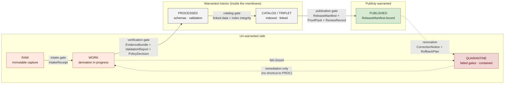

<!-- [KFM_META_BLOCK_V2]
doc_id: kfm://doc/<TODO-uuid>
title: Trust Membrane
type: standard
version: v1
status: draft
owners: <TODO: doctrine maintainers (e.g., Governance Steward + Release Authority + Data Lifecycle Steward + Trust & Posture Steward)>
created: 2026-05-12
updated: 2026-05-12
policy_label: public
related:
  - docs/doctrine/lifecycle-law.md
  - docs/doctrine/trust-posture.md
  - docs/doctrine/evidence-first.md
  - docs/doctrine/policy-aware.md
  - docs/doctrine/ai-as-assistant.md
  - docs/doctrine/authority-ladder.md
  - docs/doctrine/corrections-first-class.md
  - docs/doctrine/derived-stays-derived.md
  - docs/doctrine/truth-labels.md
  - docs/doctrine/evidence-model.md
  - docs/doctrine/map-first.md
  - docs/architecture/release-and-publication.md
  - docs/security/threat-model.md
  - schemas/contracts/v1/release_manifest.schema.json
  - schemas/contracts/v1/proof_pack.schema.json
  - schemas/contracts/v1/evidence_bundle.schema.json
  - control_plane/policy_gate_register.yaml
tags: [kfm, doctrine, trust, membrane, governance, lifecycle, evidence, policy]
notes:
  - Articulates the *trust-warranty* view of the boundary that lifecycle-law.md calls the lifecycle membrane and that ai-as-assistant.md and the build-strategy doctrine call the "governance membrane."
  - Introduces no new mechanism; it gives the existing CONFIRMED boundary its canonical trust-vocabulary articulation.
  - Foundational sibling doctrine alongside lifecycle-law.md, evidence-first.md, policy-aware.md, ai-as-assistant.md, trust-posture.md.
  - All concrete file paths, schema paths, runbook paths, CI job names, and Shields targets are PROPOSED until verified against the live repository.
[/KFM_META_BLOCK_V2] -->

# Trust Membrane

> **The boundary across which material in Kansas Frontier Matrix acquires trust the system is willing to defend — and a precise statement of what that trust does, and does not, warrant.**


<!-- TODO — wire repo-level Shields endpoints (CI status, doctrine-coverage) once the doctrine-doc workflow is verified. -->

**Status:** Draft · **Owners:** _TODO — Governance Steward + Release Authority + Data Lifecycle Steward + Trust & Posture Steward_ <sub>NEEDS VERIFICATION</sub> · **Last updated:** 2026-05-12

> [!IMPORTANT]
> **Trust Membrane is the *trust-vocabulary* articulation of an existing CONFIRMED KFM boundary.** The boundary itself is referenced across project doctrine under multiple names — most often **"governance membrane"** (the enforcement view, e.g., [`ai-as-assistant.md`](./ai-as-assistant.md) and the build-strategy doctrine) and **"lifecycle membrane"** (the data-movement view, e.g., [`lifecycle-law.md`](./lifecycle-law.md)). This document adds a third, complementary view: what crossing the membrane *warrants in trust terms* and what it does not. It introduces **no new mechanism**.
>
> `[CONFIRMED — the underlying boundary is doctrine.]`
> `[PROPOSED — the doctrine-doc name "trust-membrane.md" as a sibling of lifecycle-law.md / trust-posture.md. See §14 Appendix B for the consolidation-vs-triangulation open question.]`

---

## Contents

1. [Why this is doctrine](#1-why-this-is-doctrine)
2. [Definitions and naming](#2-definitions-and-naming)
3. [The trust contract](#3-the-trust-contract)
4. [The membrane in the KFM lifecycle](#4-the-membrane-in-the-kfm-lifecycle)
5. [The gates, from a trust angle](#5-the-gates-from-a-trust-angle)
6. [Trust outcomes the membrane emits](#6-trust-outcomes-the-membrane-emits)
7. [Failure dispositions: refusal, quarantine, revocation](#7-failure-dispositions-refusal-quarantine-revocation)
8. [Relationship to other doctrines](#8-relationship-to-other-doctrines)
9. [Validation and tests](#9-validation-and-tests)
10. [Acceptance checklist](#10-acceptance-checklist)
11. [Anti-patterns](#11-anti-patterns)
12. [FAQ](#12-faq)
13. [Related docs](#13-related-docs)
14. [Appendix](#14-appendix)

---

## 1. Why this is doctrine

KFM exists to govern how evidence becomes intelligible, inspectable, publishable, reviewable, correctable, reversible, and operationally useful. That work depends on a boundary inside the system across which:

- raw and candidate material on one side is **not warranted** for downstream use, and
- material on the other side is **warranted** by recorded evidence, recorded policy, and recorded review.

Two CONFIRMED doctrine docs already describe this boundary from useful angles:

- [`lifecycle-law.md`](./lifecycle-law.md) describes its **shape** — the `RAW → WORK/QUARANTINE → PROCESSED → CATALOG/TRIPLET → PUBLISHED` invariant and the publication-as-state-transition rule.
- The "governance membrane" framing used in [`ai-as-assistant.md`](./ai-as-assistant.md) and the build-strategy doctrine describes its **enforcement** — what runs inside it, what runs outside it, and what may never cross it directly.

What is still missing is a canonical articulation of the membrane in **trust terms**: what the system *promises* by warranting a unit of material, and — equally important — what it *refuses to promise*. Without that articulation, "trusted" decays into a hopeful adjective rather than a recorded contract. This document fixes that.

Three commitments follow from making the trust view doctrinal:

1. **Trust is a contract, not a status.** Material does not become trusted by being moved between folders. It becomes trusted by acquiring a specific set of recorded warranties at the membrane.
2. **Trust is reversible.** The membrane is a *current* warranty, not a permanent one. New evidence, a failed re-check, a withdrawn rights grant, or a `CorrectionNotice` can revoke a prior crossing — and the doctrine names that path.
3. **Trust is finite.** The membrane emits a fixed vocabulary of outcomes — `ANSWER`, `ABSTAIN`, `DENY`, `ERROR`, `STALE` — and no others. Informal trust language is forbidden in trust-significant contexts.

[⬆ Back to top](#trust-membrane)

---

## 2. Definitions and naming

### 2.1 The boundary, and its three names

The Trust Membrane, the governance membrane, and the lifecycle membrane refer to **the same boundary** in KFM, viewed from three angles.

| Name | View | Where it appears |
|---|---|---|
| **Governance membrane** | What **enforces** the boundary — validators, schemas, policy gates, release authority, runtime placement. | [`ai-as-assistant.md`](./ai-as-assistant.md); build-strategy doctrine. `[CONFIRMED]` |
| **Lifecycle membrane** | The **shape of data movement** across the boundary — the `RAW → WORK/QUARANTINE → PROCESSED → CATALOG/TRIPLET → PUBLISHED` invariant. | [`lifecycle-law.md`](./lifecycle-law.md). `[CONFIRMED]` |
| **Trust Membrane** | What **crossing warrants in trust terms** — what is promised, what is refused, how outcomes are expressed. | This document. `[CONFIRMED doctrine intent; doc name PROPOSED.]` |

> [!NOTE]
> These three names **must not drift into three different mechanisms**. If implementation begins treating them as distinct surfaces, that is a doctrine defect, not a refinement. The membrane is one boundary with three doctrinal articulations.

### 2.2 Working definitions

| Term | Meaning in this doctrine |
|---|---|
| **Membrane** | The doctrinal boundary inside KFM that separates not-yet-warranted material (`RAW`, `WORK`, `QUARANTINE`, candidates, secrets, direct-model outputs) from warranted material (released `EvidenceBundle`s, materialized `ReleaseManifest`s, indexed and tiled artifacts tied to a release). |
| **Crossing** | A recorded transition of a unit of material from the un-warranted side to the warranted side, accompanied by the receipts and decisions that justify it. |
| **Warrant** | The system's *recorded* willingness to defend a unit of material for a stated downstream use. A warrant is bounded by source role, policy label, freshness window, and (when published) `ReleaseManifest`. |
| **Revocation** | The withdrawal of a prior warrant. Produces a `CorrectionNotice`, a `RollbackPlan` (where required), and a `STALE` / `ABSTAIN` / `DENY` outcome for affected calls. |
| **Trust-significant context** | Any context whose outputs reach a public surface, an export, a release, an `AIReceipt`, an answer that cites an `AIReceipt`, a published map layer, or a `ReleaseManifest`. The doctrine's finite-outcome vocabulary is mandatory here. |
| **Trust badge** | The user-facing rendering of a warranty (e.g., on the map UI, in the Evidence Drawer). See [`map-first.md`](./map-first.md). |

The terms `RAW`, `WORK`, `QUARANTINE`, `PROCESSED`, `CATALOG`, `TRIPLET`, and `PUBLISHED` carry the lifecycle meaning defined in [`lifecycle-law.md`](./lifecycle-law.md). The terms `EvidenceBundle`, `EvidenceRef`, `SourceDescriptor`, `ReleaseManifest`, `ProofPack`, `ReviewRecord`, `CorrectionNotice`, and `RollbackPlan` carry the meanings defined in their respective contract schemas (paths PROPOSED in §13).

[⬆ Back to top](#trust-membrane)

---

## 3. The trust contract

Crossing the membrane warrants a **specific, bounded, recorded** set of claims about a unit of material. Equally important, it warrants *only* those claims — nothing else.

### 3.1 What a successful crossing warrants

`[CONFIRMED at doctrine level; field-level schema is PROPOSED.]`

| The membrane warrants… | …because the crossing recorded |
|---|---|
| **Source identity and role** | A `SourceDescriptor` resolved, with a recorded source role that supports the claim type. |
| **Provenance closure** | Every `EvidenceRef` in the unit's `EvidenceBundle` resolves at crossing time. |
| **Validation** | A passing `ValidationReport` for the relevant schemas, checks, and policies. |
| **Rights and sensitivity** | A `PolicyDecision` against rights, sensitivity, and access labels — `ALLOW`, or a labeled, bounded exception. |
| **Freshness window** | An explicit freshness range; outside that range the warranty downgrades to `STALE` rather than silently expiring. |
| **Review (where required)** | A `ReviewRecord` naming a human role for activation, release approval, escalation, correction, or rollback. |
| **Release binding (when published)** | A `ReleaseManifest` reference and a `ProofPack` reference. |

### 3.2 What a successful crossing does *not* warrant

The membrane's promises are bounded. Crossing it does **not** warrant:

- **Permanent truth.** A warranted unit may be revoked. New evidence, a withdrawn rights grant, or a failed re-check produces a revocation; the prior warrant becomes historical.
- **Universal applicability.** The policy label constrains where and to whom a unit may be exposed. A unit may be warranted for one public surface and `DENY`-ed on another.
- **Downstream AI claims.** When AI summarizes or drafts from warranted evidence, the AI output is **a new claim** that must carry its own `RuntimeResponseEnvelope` and `AIReceipt`. The membrane warrants the evidence, not the AI's prose.
- **Reality itself.** The membrane warrants that KFM's evidence pipeline was followed. It does not warrant that the underlying world is as the evidence describes. *Carrier-vs-sovereign-truth* applies — maps, tiles, graphs, dashboards, and AI answers are **carriers** of evidence, never sovereign truth.

> [!CAUTION]
> Conflating these four exclusions with the seven inclusions in §3.1 is the most common path to a quietly broken trust system. The doctrine is fail-closed: anything not in §3.1 is **not** warranted by the membrane, regardless of how it reads on a page.

[⬆ Back to top](#trust-membrane)

---

## 4. The membrane in the KFM lifecycle

The membrane lives **inside** the KFM lifecycle invariant, not at one end of it. From a trust angle, the lifecycle has an un-warranted side and a warranted interior, with the publication gate as the final crossing to public surfaces.



> [!NOTE]
> The **primary trust crossing** is the verification gate (`WORK → PROCESSED`). After that crossing, material is warranted for internal downstream use under its policy label. The **publication gate** (`CATALOG / TRIPLET → PUBLISHED`) extends that warrant to public surfaces under an explicit `ReleaseManifest`. Material in `QUARANTINE` never cuts the line; it returns to `WORK` only after remediation, and re-presents at the verification gate from scratch. `[CONFIRMED at doctrine level; gate names PROPOSED — see §14 Appendix B.]`

> [!WARNING]
> **DENY — Public internal-stage access.** Public UI, public APIs, exports, AI / Focus Mode, tile serving, and search MUST NOT read directly from `/data/raw`, `/data/work`, `/data/quarantine`, unpublished candidates, canonical internal stores, direct model runtime outputs, or source-system side effects. Any route that does so is a **build-stop defect**, not a configuration issue. `[CONFIRMED doctrine; quoted in substance from lifecycle-law.md.]`

[⬆ Back to top](#trust-membrane)

---

## 5. The gates, from a trust angle

A *gate* is the operational checkpoint at which a crossing is decided. The gates are owned by [`lifecycle-law.md`](./lifecycle-law.md); this section restates them from a trust-warranty angle.

### 5.1 Gate registry (trust view)

`[CONFIRMED at doctrine level; gate names and receipt schemas PROPOSED.]`

| Gate | Transition | Primary trust question | Recorded receipts | Refusal disposition |
|---|---|---|---|---|
| **Intake gate** | external → `RAW` | "Did we receive what we think we received, from whom, when, and under what terms?" | `IntakeReceipt` paired with a resolved `SourceDescriptor`. | `ERROR` (capture failed) or `DENY` (terms unclear). |
| **Verification gate** *(primary trust crossing)* | `WORK` → `PROCESSED` | "Does the evidence close, validate, and clear policy for the claim type?" | `EvidenceBundle` + `ValidationReport` + `PolicyDecision` + `TransformReceipt`. | `DENY` (policy), `ERROR` (validation), or move-to-`QUARANTINE` (containment). |
| **Catalog gate** | `PROCESSED` → `CATALOG / TRIPLET` | "Is this discoverable and linked-data consistent without leaking what it shouldn't?" | Catalog record + triple-form consistency report. | `DENY` (consistency) or `ERROR` (index integrity). |
| **Publication gate** | `CATALOG / TRIPLET` → `PUBLISHED` | "May this be exposed publicly under its operative policy label, with rollback in place?" | `ReleaseManifest` + `ProofPack` + `ReviewRecord` + `RollbackPlan`. | `DENY release.unreviewed` · `DENY policy.sensitivity` · `ABSTAIN release.stale`. |

> [!IMPORTANT]
> **Bundles compose forward.** A gate does not re-prove what an earlier gate already warranted; it references prior receipts via `EvidenceRef`. A gate **may**, however, revoke an earlier crossing if the evidence it referenced no longer resolves. See §7.

### 5.2 Per-call evaluation envelope

Every call into a warranted unit — public API, steward API, AI runtime, map layer admission — re-evaluates the membrane outcome **at call time**, against the current policy register and freshness window. A prior `ALLOW` at the publication gate does not bypass the call-time check; it bounds it.

```text
caller_context + warranted_unit + policy_register + freshness_clock
        │
        ▼
   DecisionEnvelope { decision ∈ {ANSWER, ABSTAIN, DENY, ERROR, STALE},
                     reason_code,
                     citations[EvidenceRef],
                     policy_refs[] }
```

`[PROPOSED envelope sketch; field names align with KFM patterns but this is not a schema.]`

[⬆ Back to top](#trust-membrane)

---

## 6. Trust outcomes the membrane emits

The membrane communicates outcomes using a **finite vocabulary**. Informal substitutes — "probably," "should be fine," "trusted-ish" — are forbidden in trust-significant contexts.

| Outcome | Meaning | Public-surface presentation |
|---|---|---|
| `ANSWER` | A current, policy-allowed warranty exists and the call may proceed. | Result rendered with trust badge + citations. |
| `ABSTAIN` | A warranty existed but does not currently support this call (e.g., freshness lapsed, source role insufficient for the claim type, unresolved `EvidenceRef`). | Result withheld with an explicit reason; no fabricated alternative. |
| `DENY` | Policy refuses this exposure of this unit to this caller. | Refusal rendered with reason **shape**, never reason **contents**. |
| `ERROR` | A receipt failed to resolve, a schema validation failed, or an audit invariant tripped. | Refusal + audit trail; never a silent fallback. |
| `STALE` | The unit's freshness window has lapsed; the prior warranty is held but downgraded. | Stale badge + last-fresh timestamp; never silent "current." |

> [!TIP]
> **`ABSTAIN` beats a confident guess.** The membrane's job is to make the system's silence legible, not to fill silence with plausible prose. This is the rule that anchors [`ai-as-assistant.md`](./ai-as-assistant.md): AI may consume warranted evidence, but where evidence does not close, AI returns `ABSTAIN`, not a fluent paragraph.

[⬆ Back to top](#trust-membrane)

---

## 7. Failure dispositions: refusal, quarantine, revocation

The membrane is defined as much by how it **refuses** as by how it admits. The three refusal modes below are doctrinally distinct.

| Mode | Trigger | What happens to the material | Audit artifact |
|---|---|---|---|
| **Refusal** | A gate's preconditions are not met at crossing time (missing receipt, unresolved `EvidenceRef`, policy `DENY`). | Material stays in its source stage. The refusal is recorded. | Refusal record citing the gate, the failed precondition, and the source stage. |
| **Quarantine** | A gate's preconditions are met *but a check failed*, or sensitivity / rights / source-role checks fail closed. | Material moves to `QUARANTINE`, isolated from public surfaces and from downstream re-derivation. | `QuarantineReceipt` citing the failed check, the containment scope, and the remediation owner. |
| **Revocation** | New evidence, a `CorrectionNotice`, a re-check, or a rights withdrawal invalidates a prior warrant. | Material is moved to `QUARANTINE`; downstream units that referenced it re-evaluate at next call. | `CorrectionNotice` + (where the warrant was published) `RollbackPlan` execution record. |

> [!CAUTION]
> **Containment is not deletion.** Quarantined and revoked material is preserved with its containment record. Doctrine forbids silent disappearance, because that would erase the audit trail the membrane depends on. Retention is governed by the retention policy doc. `[CONFIRMED posture; retention policy path PROPOSED.]`

> [!NOTE]
> **A revocation propagates.** Any warranted unit whose `EvidenceBundle` cited a now-revoked unit re-evaluates at its next call and may itself downgrade to `STALE` or `ABSTAIN`. Revocations are not local events. Implementation may be call-time, build-time, or both — `NEEDS VERIFICATION` against the release-and-publication architecture doc.

[⬆ Back to top](#trust-membrane)

---

## 8. Relationship to other doctrines

The Trust Membrane is one **view** of the boundary. Other doctrines own complementary views and must remain mutually consistent.

| Sibling doctrine | What it owns | How Trust Membrane composes with it |
|---|---|---|
| [`lifecycle-law.md`](./lifecycle-law.md) | Shape of data movement; the `RAW → WORK/QUARANTINE → PROCESSED → CATALOG/TRIPLET → PUBLISHED` invariant; publication as state transition. `[CONFIRMED sibling.]` | **Same boundary, different angle.** Lifecycle Law names the stages and transitions; Trust Membrane names what crossing warrants and what it does not. |
| [`evidence-first.md`](./evidence-first.md) | Cite-or-abstain rule; `EvidenceRef` / `EvidenceBundle` closure obligations. `[CONFIRMED sibling.]` | **Sources the warrant.** A gate cannot warrant a unit whose evidence does not close. The seven-warranty list in §3.1 is bounded by Evidence First. |
| [`policy-aware.md`](./policy-aware.md) | Policy gate at publication; rights, sensitivity, access labels; finite policy outcomes. `[CONFIRMED sibling.]` | **Decides admission.** The publication gate is a Policy Aware decision; Trust Membrane records what its outcome warrants. |
| [`ai-as-assistant.md`](./ai-as-assistant.md) | AI runtime placement inside the governance membrane; cite-or-abstain for AI; AI never decides truth, rights, sensitivity, release. `[CONFIRMED sibling.]` | **Restricts AI.** AI may *consume* warranted material; AI may not *issue* warranties. AI outputs are new claims that cite the membrane's warranties, never substitute for them. |
| [`authority-ladder.md`](./authority-ladder.md) | Primary / Secondary / Tertiary source hierarchy; documentation authority. `[CONFIRMED sibling.]` | **Orthogonal.** Authority Ladder governs *what counts as authoritative documentation*; Trust Membrane governs *what crossing the boundary warrants*. They collaborate at the publication gate, grounding a `ReleaseManifest` from different angles. |
| [`corrections-first-class.md`](./corrections-first-class.md) | `CorrectionNotice` as a first-class object; correction workflow. `[CONFIRMED sibling.]` | **Drives revocation.** A `CorrectionNotice` is the most common revocation trigger; Trust Membrane defines what revocation does to downstream warrants. |
| [`derived-stays-derived.md`](./derived-stays-derived.md) | Derivation is monotonic; no later stage relabels material as `RAW`. `[CONFIRMED sibling.]` | **Constrains the gates.** The verification and catalog gates may not reach backward and re-classify warranted material as un-warranted; they may only **revoke**. |
| [`trust-posture.md`](./trust-posture.md) | Runtime expression of trust posture; how `ABSTAIN` / `STALE` / `DENY` surface on public and steward UIs. `[CONFIRMED sibling.]` | **Renders the outcomes.** Trust Membrane emits outcomes; Trust Posture renders them. |
| [`truth-labels.md`](./truth-labels.md) | Truth label vocabulary (`CONFIRMED` / `PROPOSED` / `INFERRED` / `NEEDS VERIFICATION` / `UNKNOWN`). `[PROPOSED sibling.]` | **Documentation vocabulary, distinct from runtime.** Truth labels describe *what we know about a document or claim*; trust outcomes describe *what the runtime is willing to do*. They must not be conflated. |
| [`map-first.md`](./map-first.md) | Public map surface; trust badges; Evidence Drawer. `[CONFIRMED sibling.]` | **Surfaces the warranty.** The map UI renders trust outcomes visibly per layer and per feature. |

[⬆ Back to top](#trust-membrane)

---

## 9. Validation and tests

All validators and CI jobs below are **PROPOSED to create**. The greenfield baseline makes CI deterministic, no-network by default, and fail-closed. `[CONFIRMED at doctrine level; concrete job names and paths are PROPOSED until verified against `.github/workflows/`.]`

| CI job | Purpose | Acceptance gate |
|---|---|---|
| `trust-contract-tests` | Validate that every fixture's `EvidenceBundle` closes and the recorded crossing matches §3.1. | Missing any required receipt → failure for the expected reason. |
| `trust-outcome-vocabulary-tests` | Validate that no trust-significant fixture or doc emits an outcome outside `{ANSWER, ABSTAIN, DENY, ERROR, STALE}`. | Informal trust language fails the lint. |
| `revocation-propagation-tests` | Inject a revocation against a fixture and verify downstream citing units re-evaluate. | All citing units downgrade to `STALE` / `ABSTAIN` per §7. |
| `quarantine-isolation-tests` | Verify quarantined fixtures are unreachable from public envelopes. | Any public-facing call that resolves a quarantined `EvidenceRef` fails closed. |
| `publication-gate-receipt-tests` | Verify every "published" fixture has a `ReleaseManifest`, `ProofPack`, `ReviewRecord`, and `RollbackPlan`. | Missing any of the four → `DENY release.unreviewed`. |
| `freshness-window-tests` | Drive the clock past the freshness window and verify `STALE` emission. | Silent-current behavior fails the test. |
| `forbidden-exposure-tests` | Confirm `RAW` / `WORK` / `QUARANTINE` / candidate / direct-model paths never appear in public envelopes. | Any leak → build-stop failure. |
| `audit-immutability-tests` | Confirm trust-significant audit records are append-only. | Any in-place overwrite fails the test. |
| `reason-shape-not-contents-tests` | Confirm `DENY` reasons describe denial *shape*, never denial *contents*. | A `DENY` payload that leaks the denied value fails the test. |

> [!NOTE]
> Each CI job above must ship with both **valid** and **invalid** fixtures, and the invalid fixtures must fail *for the expected reason*. A test that fails for the wrong reason is not a passing negative test.

[⬆ Back to top](#trust-membrane)

---

## 10. Acceptance checklist

A repository implementation conforms to this doctrine when **all** of the following hold. `[PROPOSED checklist; reconcile with the doctrine-coverage CI job when that job exists.]`

- [ ] The verification, catalog, and publication gates each have a documented receipt schema.
- [ ] No public envelope references `RAW`, `WORK`, `QUARANTINE`, candidate, or direct-model paths.
- [ ] Every `EvidenceBundle` referenced by a published unit resolves at call time.
- [ ] Every published unit binds to a `ReleaseManifest` and a `ProofPack`, and has a `RollbackPlan`.
- [ ] Every trust-significant outcome uses the finite vocabulary `{ANSWER, ABSTAIN, DENY, ERROR, STALE}`.
- [ ] Quarantined material is preserved, not deleted, and is unreachable from public envelopes.
- [ ] Revocations propagate: downstream warrants re-evaluate at next call.
- [ ] Freshness lapses produce `STALE`, not silent currency.
- [ ] Audit storage is append-only for trust-significant decisions.
- [ ] `DENY` payloads describe denial *shape*, never denial *contents*.
- [ ] AI outputs cite warranted evidence via `EvidenceRef` and carry an `AIReceipt`; AI outputs never replace the membrane's warranty.

[⬆ Back to top](#trust-membrane)

---

## 11. Anti-patterns

The following are CONFIRMED-rejection patterns. Each represents a real failure mode and must fail closed.

| Anti-pattern | Why rejected | Corrective rule |
|---|---|---|
| "We moved the file to `data/processed/`, so it's trusted." | Trust is a recorded warrant, not a directory location. | A crossing requires receipts. §3.1. |
| "The evidence closed, so we exposed it." | Evidence closure is necessary but not sufficient. Policy decides exposure. | Verification ≠ publication. §5.1. |
| "We deleted the bad record." | Silent deletion erases the audit trail. | Quarantine, do not delete. §7. |
| "The AI confirmed it." | AI consumes warranted evidence; it cannot issue a warrant. | [`ai-as-assistant.md`](./ai-as-assistant.md) binds. |
| "It was true last month, so it's current." | Freshness must be evaluated at call time. | `STALE`, never silent current. §6. |
| "The hint helps the user understand the denial." | Operator hints must describe denial *shape*, not denial *contents*. | Reason shape, not reason contents. §6. |
| "We patched the warranted record in place." | Corrections produce a new bundle and a `CorrectionNotice`; in-place edits break audit. | Append-only audit. §7. |
| "The system is mostly fine." | The membrane has no "mostly fine" outcome. | Finite vocabulary or refuse. §6. |
| "We renamed the lifecycle membrane to the trust membrane in the code." | The three names describe one boundary, not three. | Same mechanism. §2.1. |

[⬆ Back to top](#trust-membrane)

---

## 12. FAQ

**Is the Trust Membrane a service?**
No. It is a doctrinal articulation. It is realized by gates and receipts that live across schemas, validators, the policy register, catalog tooling, release tooling, and the runtime. The membrane is a *property* of the system, not a *component* of it.

**Why a separate doc instead of folding this into `lifecycle-law.md`?**
Because lifecycle, governance, and trust are three useful views of the same boundary, and conflating any two of them leads to predictable failures. Lifecycle Law owns the shape; this doc owns the warranty contract; the "governance membrane" framing owns the enforcement. Keeping them as distinct doctrine docs lets each be precise. See §14 Appendix B for the consolidation-vs-triangulation open question.

**Is a "warranted" unit "true"?**
No. A warrant is a recorded promise that KFM's evidence pipeline was followed for the claim. It is not a metaphysical claim about the world. *Carrier-vs-sovereign-truth* applies.

**Can a unit be warranted for one surface and denied on another?**
Yes. Policy labels constrain exposure. The verification gate may warrant a unit for internal downstream use while the publication gate refuses it for a given public surface.

**What is the difference between `ABSTAIN` and `DENY`?**
`ABSTAIN` means *"a warranty does not currently support this call"* — typically a freshness, source-role, or claim-type mismatch, or an unresolved `EvidenceRef`. `DENY` means *"policy refuses this exposure"* — typically rights, sensitivity, or access-label denial. They are **not** interchangeable.

**Where does human judgment fit?**
In the `ReviewRecord` attached to source activations, release approvals, escalations, corrections, and rollback executions. The membrane records that a human role decided; it does not pretend human judgment is automatable.

**Can material skip a gate?**
No. Doctrinally, there is no path from an un-warranted stage into a warranted stage except through the gate that joins them. Manual placements bypass audit and are forbidden.

**What if a sibling doctrine disagrees with this one?**
Surface the conflict in an ADR and resolve it explicitly. Trust Membrane does not silently override siblings, and siblings do not silently override it. The boundary is one boundary; the doctrines must remain mutually consistent.

[⬆ Back to top](#trust-membrane)

---

## 13. Related docs

> [!NOTE]
> All paths below are PROPOSED until verified against the live repository. Items marked `[CONFIRMED sibling]` are confirmed by prior KFM doctrine to exist or to be planned as siblings of this document; items marked `[PROPOSED sibling]` are referenced as planned in other doctrine but have not been verified in the live repo this session.

- [`docs/doctrine/lifecycle-law.md`](./lifecycle-law.md) — shape of the lifecycle and publication-as-state-transition. `[CONFIRMED sibling.]`
- [`docs/doctrine/evidence-first.md`](./evidence-first.md) — cite-or-abstain rule. `[CONFIRMED sibling.]`
- [`docs/doctrine/policy-aware.md`](./policy-aware.md) — policy gate and finite policy outcomes. `[CONFIRMED sibling.]`
- [`docs/doctrine/ai-as-assistant.md`](./ai-as-assistant.md) — AI containment and the `RuntimeResponseEnvelope`. `[CONFIRMED sibling.]`
- [`docs/doctrine/authority-ladder.md`](./authority-ladder.md) — source authority hierarchy. `[CONFIRMED sibling.]`
- [`docs/doctrine/corrections-first-class.md`](./corrections-first-class.md) — `CorrectionNotice` and the correction workflow. `[CONFIRMED sibling.]`
- [`docs/doctrine/derived-stays-derived.md`](./derived-stays-derived.md) — derivation is monotonic. `[CONFIRMED sibling.]`
- [`docs/doctrine/trust-posture.md`](./trust-posture.md) — runtime expression of trust posture. `[CONFIRMED sibling.]`
- [`docs/doctrine/truth-labels.md`](./truth-labels.md) — truth label vocabulary, distinct from runtime outcomes. `[PROPOSED sibling.]`
- [`docs/doctrine/evidence-model.md`](./evidence-model.md) — `EvidenceRef` / `EvidenceBundle` semantics. `[PROPOSED sibling.]`
- [`docs/doctrine/map-first.md`](./map-first.md) — public map surface, trust badges, Evidence Drawer. `[CONFIRMED sibling.]`
- [`docs/architecture/release-and-publication.md`](../architecture/release-and-publication.md) — release / publication architecture. `[PROPOSED path.]`
- [`docs/security/threat-model.md`](../security/threat-model.md) — threat model, including direct-model bypass. `[PROPOSED path.]`
- [`schemas/contracts/v1/release_manifest.schema.json`](../../schemas/contracts/v1/release_manifest.schema.json) — `ReleaseManifest` schema. `[PROPOSED path.]`
- [`schemas/contracts/v1/proof_pack.schema.json`](../../schemas/contracts/v1/proof_pack.schema.json) — `ProofPack` schema. `[PROPOSED path.]`
- [`schemas/contracts/v1/evidence_bundle.schema.json`](../../schemas/contracts/v1/evidence_bundle.schema.json) — `EvidenceBundle` schema. `[PROPOSED path.]`
- [`control_plane/policy_gate_register.yaml`](../../control_plane/policy_gate_register.yaml) — policy gate register. `[PROPOSED path.]`

[⬆ Back to top](#trust-membrane)

---

## 14. Appendix

<details>
<summary><strong>A. Glossary used in this doctrine</strong></summary>

| Term | Meaning here |
|---|---|
| **Trust Membrane** | The trust-vocabulary articulation of the boundary `lifecycle-law.md` calls the lifecycle membrane and `ai-as-assistant.md` calls the governance membrane. Same boundary, different angle. |
| **Crossing** | A recorded transition from an un-warranted stage to a warranted stage. |
| **Warrant** | The system's recorded willingness to defend a unit for a stated downstream use. |
| **Refusal** | A gate decision to leave material in its source stage. |
| **Quarantine** | A containment state for material that tripped an active check. |
| **Revocation** | Explicit retraction of a prior warrant in light of new evidence or a `CorrectionNotice`. |
| **Trust-significant context** | A context whose outputs reach a public surface, an export, a release, an `AIReceipt`, a citing answer, a map layer, or a `ReleaseManifest`. Finite-outcome vocabulary is mandatory here. |
| **Warranted interior** | The set of stages inside the membrane (`PROCESSED`, `CATALOG / TRIPLET`) that are warranted for internal downstream use under their policy labels. |
| **Publicly warranted** | The `PUBLISHED` stage; warranted for public surfaces under an explicit `ReleaseManifest`. |
| **Reason shape (vs reason contents)** | A denial communicates *what kind* of refusal occurred (e.g., `policy.sensitivity`), never the *value* the policy was protecting. |

</details>

<details>
<summary><strong>B. Open questions for doctrine reviewers</strong></summary>

- **Naming / placement.** Should this doc live as `docs/doctrine/trust-membrane.md`, or should the trust view be folded into a unified `docs/doctrine/membrane.md` alongside lifecycle and governance views? Resolve in an ADR before publishing v1.
- **Gate names.** Are `intake`, `verification`, `catalog`, `publication` the canonical gate names, or should they be renamed to match terminology already established in `lifecycle-law.md`? `NEEDS VERIFICATION`.
- **Warranty schema reconciliation.** Does §3.1's seven-item warranty list match the field set in the planned `release_manifest.schema.json` and `proof_pack.schema.json`? `NEEDS VERIFICATION`.
- **Revocation propagation mechanism.** Is propagation implemented as call-time re-evaluation, build-time re-derivation, or both? `NEEDS VERIFICATION` against the release-and-publication architecture doc.
- **`STALE` as peer or modifier.** Should `STALE` be a fifth peer outcome (as written here) or a modifier on `ABSTAIN`? Reconcile with [`trust-posture.md`](./trust-posture.md).
- **Boundary with `truth-labels.md`.** Where does that doc end and this one begin? §8 states they are distinct (documentation vocabulary vs runtime vocabulary); confirm the split in the truth-labels doctrine when it lands.

</details>

<details>
<summary><strong>C. Illustrative trust-outcome shapes (not schemas)</strong></summary>

`ANSWER` (illustrative, public API):

```json
{
  "decision": "ANSWER",
  "reason_code": "ok.warranted",
  "citations": [
    "kfm://evidence/bundle/2026-05-12-hydrology-06892350"
  ],
  "policy_refs": ["kfm://policy/public/hydrology/v1"],
  "freshness": { "as_of": "2026-05-12T00:00:00Z", "window_hours": 24 },
  "release": "kfm://release/2026-05-W19/hydrology"
}
```

`STALE` (illustrative):

```json
{
  "decision": "STALE",
  "reason_code": "freshness.window_lapsed",
  "last_fresh_at": "2026-05-09T00:00:00Z",
  "window_hours": 24,
  "citations": [
    "kfm://evidence/bundle/2026-05-09-hydrology-06892350"
  ]
}
```

`DENY` (illustrative — reason *shape*, not contents):

```json
{
  "decision": "DENY",
  "reason_code": "policy.sensitivity",
  "exposure": "public",
  "guidance": "Requested through /steward/v1 with appropriate role."
}
```

> Illustrative only. Canonical schemas live under `schemas/contracts/v1/`. PROPOSED paths.

</details>

---

### Related docs (compact)

[`lifecycle-law.md`](./lifecycle-law.md) · [`evidence-first.md`](./evidence-first.md) · [`policy-aware.md`](./policy-aware.md) · [`ai-as-assistant.md`](./ai-as-assistant.md) · [`trust-posture.md`](./trust-posture.md) · [`corrections-first-class.md`](./corrections-first-class.md) · [`map-first.md`](./map-first.md)

**Last updated:** 2026-05-12 · **Version:** v1 (draft) · **Status:** awaiting review

[⬆ Back to top](#trust-membrane)
