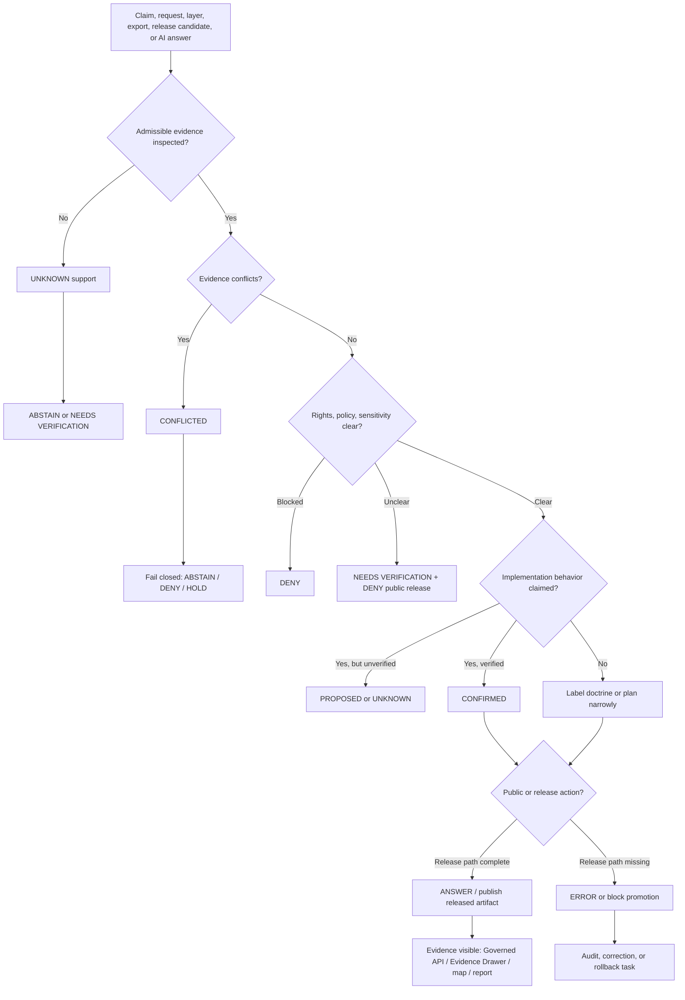

<!-- [KFM_META_BLOCK_V2]
doc_id: kfm://doc/NEEDS-UUID-docs-doctrine-truth-posture
title: Truth Posture
type: standard
version: v1
status: draft
owners: OWNER_TBD_NEEDS_VERIFICATION
created: CREATED_DATE_TBD_FROM_GIT_OR_DOC_REGISTRY
updated: 2026-05-06
policy_label: NEEDS_VERIFICATION
related: [../../README.md, ./README.md, ./authority-ladder.md, ./trust-membrane.md, ./lifecycle-law.md, ../adr/ADR-0014-truth-path.md, ../architecture/governed-api.md, ../../policy/README.md, ../../tools/validate_docs_truth_labels.py]
tags: [kfm, doctrine, truth-posture, evidence, governance, cite-or-abstain, finite-outcomes]
notes: [doc_id owner created date and policy label remain verification placeholders, this revision preserves the existing target path and strengthens truth-label doctrine, implementation enforcement remains UNKNOWN until matching contracts schemas policies validators tests workflows receipts proofs release artifacts runtime traces and UI states are verified]
[/KFM_META_BLOCK_V2] -->

<a id="top"></a>

# Truth Posture

Shared doctrine for labeling what KFM can truthfully claim, what remains uncertain, and when the system must answer, abstain, deny, or error.

<p align="left">
  
  
  
  
  
  
</p>

> [!IMPORTANT]
> **Status:** `draft`  
> **Owners:** `OWNER_TBD_NEEDS_VERIFICATION`  
> **Path:** `docs/doctrine/truth-posture.md`  
> **Owning root:** `docs/` — human-facing doctrine and control-plane explanation.  
> **Doctrine confidence:** `CONFIRMED` from KFM corpus and adjacent repo doctrine.  
> **Implementation confidence:** `UNKNOWN / NEEDS VERIFICATION` until active contracts, schemas, policies, validators, fixtures, tests, workflows, receipts, proofs, release manifests, runtime traces, and UI states are inspected.

## Quick jumps

| Doctrine | Applying it | Review |
|---|---|---|
| [Scope](#scope) | [Claim rules](#claim-rules) | [Validation targets](#validation-targets) |
| [Repo fit](#repo-fit) | [Decision matrix](#decision-matrix) | [Definition of done](#definition-of-done) |
| [Core rule](#core-rule) | [Examples](#examples) | [Open verification](#open-verification) |
| [Truth labels](#truth-labels) | [Mermaid flow](#mermaid-flow) | [Appendix](#appendix) |
| [Finite outcomes](#finite-outcomes) | [Accepted inputs](#accepted-inputs) | [Back to top](#top) |

---

## Scope

Truth posture is KFM’s discipline for **not overclaiming**.

It governs how maintainers, reviewers, documentation, API payloads, map layers, Evidence Drawer panels, Focus Mode responses, release artifacts, generated summaries, and public explanations describe confidence, evidence, uncertainty, conflict, and failure.

Use this doctrine when deciding:

1. whether a statement is grounded enough to say;
2. which truth label belongs on a claim;
3. whether a public or semi-public response may `ANSWER`;
4. whether KFM should `ABSTAIN`, `DENY`, or `ERROR`;
5. whether a repo-shaped statement is implementation evidence or only doctrine, lineage, proposal, or exploratory material;
6. whether a map, graph, tile, dashboard, export, scene, vector index, or AI answer is only a carrier of evidence rather than root truth.

Truth posture is not tone guidance. It is part of the trust membrane.

> [!NOTE]
> KFM’s durable public unit is the **inspectable claim**: a public or semi-public statement whose evidence, source role, spatial scope, temporal scope, policy posture, review state, release state, and correction lineage can be inspected.

[Back to top](#top)

---

## Repo fit

`docs/doctrine/truth-posture.md` belongs under `docs/doctrine/` because truth posture is stable, human-readable operating law. It should guide ADRs, contracts, schemas, policies, validators, fixtures, route design, UI state, release review, correction practice, and governed AI behavior without becoming any of those surfaces itself.

### Upstream and sibling surfaces

| Relationship | Path | Status | Role |
|---|---|---:|---|
| Root orientation | [`../../README.md`](../../README.md) | `CONFIRMED path / draft authority` | KFM identity, inspectable claim, lifecycle law, responsibility roots, and public-client posture. |
| Doctrine index | [`./README.md`](./README.md) | `CONFIRMED path / draft doctrine` | Local doctrine scope, accepted inputs, exclusions, and navigation. |
| Authority ladder | [`./authority-ladder.md`](./authority-ladder.md) | `CONFIRMED path / draft doctrine` | Source and evidence precedence when doctrine, repo evidence, external facts, and generated material conflict. |
| Trust membrane | [`./trust-membrane.md`](./trust-membrane.md) | `CONFIRMED path / draft doctrine` | Boundary keeping public surfaces downstream of evidence, policy, review, release, correction, and rollback. |
| Lifecycle law | [`./lifecycle-law.md`](./lifecycle-law.md) | `CONFIRMED path / draft doctrine` | Canonical lifecycle from source capture to public-safe publication. |
| Truth-path ADR | [`../adr/ADR-0014-truth-path.md`](../adr/ADR-0014-truth-path.md) | `CONFIRMED path / draft ADR` | Architecture decision for truth path and public trust membrane. |
| Governed API architecture | [`../architecture/governed-api.md`](../architecture/governed-api.md) | `NEEDS VERIFICATION` | Runtime boundary expected to carry finite outcomes and trust references. |
| Policy root | [`../../policy/README.md`](../../policy/README.md) | `NEEDS VERIFICATION` | Policy posture for deny-by-default exposure, rights, sensitivity, release, and runtime admissibility. |
| Truth-label validator | [`../../tools/validate_docs_truth_labels.py`](../../tools/validate_docs_truth_labels.py) | `CONFIRMED path / minimal check` | Lightweight token check that currently expects this file to contain the core labels and outcomes. |

### Downstream consumers

| Consumer | How it should use truth posture | Enforcement status |
|---|---|---:|
| `docs/adr/` | Record decisions without upgrading proposals into facts. | `PARTIAL / NEEDS VERIFICATION` |
| `contracts/` | Define semantic meaning for evidence, source, policy, runtime, release, correction, rollback, and domain objects. | `NEEDS VERIFICATION` |
| `schemas/` | Validate machine shape for labels, outcomes, envelopes, evidence, release, correction, and rollback objects. | `NEEDS VERIFICATION` |
| `policy/` | Enforce allow, deny, restrict, abstain, review-needed, release, and fail-closed behavior. | `NEEDS VERIFICATION` |
| `fixtures/` and `tests/` | Prove positive and negative paths, including `ABSTAIN`, `DENY`, and `ERROR`. | `NEEDS VERIFICATION` |
| `apps/`, `packages/`, `tools/` | Implement governed APIs, validators, Evidence Drawer payloads, Focus Mode envelopes, review helpers, and release tooling. | `UNKNOWN / NEEDS VERIFICATION` |
| `data/`, `release/`, `runtime/` | Store lifecycle data, emitted receipts, proofs, catalogs, release manifests, correction notices, rollback cards, and runtime support. | `NEEDS VERIFICATION` |

> [!WARNING]
> A truth label in documentation does not prove enforcement. Enforcement requires inspected implementation evidence.

[Back to top](#top)

---

## Core rule

Use the **narrowest truthful label** and the **safest finite outcome**.

```text
When evidence is strong enough: say so and cite it.
When evidence is partial: narrow the claim.
When support is missing: mark UNKNOWN or NEEDS VERIFICATION.
When support conflicts: mark CONFLICTED and fail closed.
When a public claim cannot be supported: ABSTAIN, DENY, or ERROR.
```

KFM should never turn uncertainty into confident prose just because the sentence reads well.

### Three separations

| Separation | Meaning | Failure mode prevented |
|---|---|---|
| Truth label vs system outcome | `CONFIRMED` describes evidence strength; `ANSWER`, `ABSTAIN`, `DENY`, and `ERROR` describe response behavior. | Treating `DENY` as a confidence label or treating `CONFIRMED` as release permission. |
| Doctrine vs implementation | A rule can be doctrinally true while enforcement remains `UNKNOWN`. | Claiming routes, CI, policies, validators, dashboards, or runtime behavior exist because a document says they should. |
| Evidence vs carriers | Maps, tiles, graphs, indexes, dashboards, scenes, summaries, reports, exports, and AI answers carry or explain evidence; they are not sovereign proof. | Treating derived products as canonical truth. |

[Back to top](#top)

---

## Truth labels

Use these labels on claims, sections, tables, decisions, examples, or notes when confidence materially affects review, publication, implementation, policy, security, rights, sensitivity, or public trust.

| Label | Meaning | Use when... | Do not use when... |
|---|---|---|---|
| `CONFIRMED` | Verified from admissible evidence in the active context. | A file, contract, schema, policy, fixture, test, workflow, receipt, proof, release artifact, runtime trace, attached doctrine, or inspected source supports the statement. | You are relying on memory, expected structure, stale reports, repeated proposals, or plausible convention. |
| `INFERRED` | Conservative synthesis strongly implied by multiple sources. | Evidence points in the same direction, but direct implementation proof is absent. | The claim names exact route behavior, CI enforcement, package state, branch state, runtime behavior, or release state. |
| `PROPOSED` | Recommended design, path, placement, behavior, or change not verified as current implementation. | Writing a plan, candidate path, next PR, contract wave, schema shape, policy rule, validator, fixture, or UI state. | Describing what the repo currently contains or what the system currently enforces. |
| `UNKNOWN` | Not verified strongly enough to state as fact. | The answer depends on uninspected repo files, logs, dashboards, branch protections, platform settings, source rights, workflow state, runtime behavior, or emitted artifacts. | A direct check has resolved the issue. |
| `NEEDS VERIFICATION` | Checkable, but not yet checked strongly enough to rely on. | Owners, dates, policy labels, source terms, exact paths, branch protections, CI results, route names, schema homes, release state, or link checks require direct review. | The matter cannot be checked or is already proven. |
| `CONFLICTED` | Evidence, authority, terminology, path, source role, or behavior materially disagrees or remains unresolved. | Docs and repo evidence conflict, two homes claim authority, source roles disagree, or prior reports collide. | There is only ordinary uncertainty; use `UNKNOWN` or `NEEDS VERIFICATION`. |
| `LINEAGE` | Historically useful material that explains prior work but is not current proof. | Prior PDFs, generated scaffold reports, older packets, archived decisions, or superseded plans should be preserved as context. | You need current implementation evidence. |
| `EXPLORATORY` | Idea material not yet promoted into canon, contract, policy, registry, implementation, or release. | New Ideas packets, design sketches, speculative extensions, or source-intake thoughts are being retained for future review. | A reviewed ADR, schema, contract, policy, release, or implementation has accepted the idea. |
| `SUPERSEDED` | Replaced by a stronger source, successor decision, or verified implementation. | A newer ADR, doc, schema, policy, implementation, or release explicitly replaces old material. | The old material is merely incomplete or uncertain. |

### Label discipline

- Label material claims, not every sentence.
- Prefer row-level or section-level labels when they keep the document readable.
- Do not upgrade `PROPOSED` to `CONFIRMED` because several plans repeat the same idea.
- Do not use `CONFIRMED` for implementation behavior unless implementation evidence was inspected.
- Do not hide `CONFLICTED` evidence to make a document feel cleaner.
- Do not use labels as decoration. Use them where confidence changes what a reviewer, user, steward, or release gate should do.

[Back to top](#top)

---

## Finite outcomes

Finite outcomes describe what KFM returns or does when a request, claim, layer, export, release candidate, review action, or AI response is evaluated.

| Outcome | Meaning | Typical trigger | Public posture |
|---|---|---|---|
| `ANSWER` | Evidence closure is sufficient and policy allows the response. | `EvidenceRef -> EvidenceBundle` resolves, citations are valid, policy permits, review/release state is appropriate. | Return bounded response with evidence, scope, caveats, and trust refs. |
| `ABSTAIN` | Support is insufficient for a truthful answer. | Missing evidence, weak citation, unclear temporal/spatial support, stale state, source-role mismatch, unresolved contradiction. | Explain why KFM cannot answer without inventing support. |
| `DENY` | Policy, rights, sensitivity, access, security, public-safety, or trust-membrane rules block the action. | Unknown rights, sensitive exact location, restricted source, direct model access, public request for internal lifecycle data. | Refuse without leaking restricted details. |
| `ERROR` | A system, contract, validation, runtime, release, or integrity failure prevents safe handling. | Broken schema, missing envelope field, failed resolver, unavailable policy engine, corrupt artifact, inconsistent release manifest. | Return safe error and record audit or repair path. |

> [!IMPORTANT]
> `DENY`, `ABSTAIN`, and `ERROR` are not embarrassing edge cases. They are valid KFM outcomes when the system protects trust, rights, sensitivity, or integrity.

### Related lifecycle and exposure states

Some states are not global runtime outcomes, but they often accompany truth-posture decisions.

| State | Use |
|---|---|
| `HOLD` | Pause a candidate pending review. |
| `QUARANTINE` | Fail-closed lifecycle state for invalid, unsafe, conflicted, restricted, or unclear material. |
| `RESTRICT` | Allow only role-limited, steward-reviewed, or policy-scoped access. |
| `GENERALIZE` | Replace exact geometry or detail with a public-safe derivative. |
| `STALE_VISIBLE` | Show released material with visible stale-state warning. |
| `WITHDRAWN` | Remove or hide a public claim or artifact with correction lineage. |
| `SUPERSEDED` | Preserve prior state while pointing to successor material. |

[Back to top](#top)

---

## Evidence classes

KFM claims should identify what kind of evidence supports them and what that evidence class can actually prove.

| Evidence class | Can support | Cannot support alone |
|---|---|---|
| Current repository evidence | File existence, checked-in docs, schemas, policies, fixtures, tests, workflows, package files, release artifacts, and inspected implementation files. | Running behavior, deployment state, branch protection, live source rights, or CI success unless directly inspected. |
| Runtime / operational evidence | Live route behavior, logs, dashboards, workflow runs, emitted receipts, proof packs, release manifests, signatures, deployment traces. | Source authority or rights unless linked to source descriptors and policy decisions. |
| Attached KFM doctrine | Project law, terminology, lifecycle, trust membrane, cite-or-abstain posture, map-first and evidence-first principles. | Current repo topology, exact implementation status, or enforcement maturity. |
| ADRs and reviewed docs | Accepted decisions, tradeoffs, alternatives, rollback and supersession expectations. | Implementation proof unless paired with tests, policies, schemas, or runtime evidence. |
| Lineage reports and prior scaffolds | Continuity, vocabulary, known risks, proposed file-family shapes, prior design intent. | Current implementation presence. |
| Exploratory packets | Idea intake and future backlog pressure. | Canonical doctrine, accepted decisions, or current behavior. |
| External official sources | Current standard, source-system, API, legal, security, or version-sensitive facts. | KFM-specific authority unless KFM adopts the source through intake, policy, contract, ADR, and review. |
| Generated text | Draft explanation, synthesis, triage, examples, or review assistance. | Evidence, policy, release, source authority, or truth by itself. |

[Back to top](#top)

---

## Claim rules

### 1. Repo-state claims require repo evidence

Do not write:

```text
The repo contains X.
The route exists.
The workflow enforces this.
The tests cover this.
The package uses this.
This path is canonical.
```

unless current repository evidence verifies the claim.

Use instead:

```text
PROPOSED: add X.
UNKNOWN: route behavior was not inspected.
NEEDS VERIFICATION: workflow enforcement must be checked.
CONFIRMED: file X exists in the inspected ref.
```

### 2. Implementation claims require implementation evidence

A README, ADR, or doctrine page can say what should happen. It does not prove the system does it.

Evidence that can support implementation claims includes:

- inspected code path;
- schema or policy file;
- validator implementation;
- test file and test result;
- workflow YAML and run result;
- emitted receipt, proof, release manifest, correction notice, or rollback card;
- runtime log, dashboard, or trace;
- source registry or release manifest;
- direct command output.

### 3. Public claims require evidence closure

A consequential public-facing claim should resolve enough support for its consequence level:

```text
Claim
  -> EvidenceRef
  -> EvidenceBundle
  -> SourceDescriptor
  -> Receipt / DatasetVersion / CatalogRecord
  -> ValidationReport
  -> PolicyDecision
  -> ReviewRecord where required
  -> ReleaseManifest / LayerManifest
  -> CorrectionNotice / RollbackCard where applicable
```

If the chain cannot resolve strongly enough, KFM should `ABSTAIN`, `DENY`, or `ERROR`.

### 4. Conflicts stay visible

When documents, repo files, schemas, policies, source terms, external facts, or runtime evidence disagree:

1. mark the issue `CONFLICTED`;
2. name or cite the conflicting evidence;
3. choose the safer behavior;
4. record the verification, ADR, drift-register, or correction task;
5. do not smooth the conflict into generic prose.

### 5. Sensitive and rights-uncertain material fails closed

When rights, sovereignty, cultural sensitivity, living-person data, DNA/genomic material, rare species, archaeology, infrastructure, private land, or precise location exposure is unclear, KFM should prefer:

- quarantine;
- denial;
- redaction;
- generalization;
- role-limited access;
- delayed publication;
- abstention;
- review-required state;
- correction, withdrawal, or rollback.

[Back to top](#top)

---

## Decision matrix

| Situation | Truth label | System outcome | Required next evidence |
|---|---:|---:|---|
| File inspected at the target path and content verified. | `CONFIRMED` | Usually none; use as bounded evidence. | Commit/ref or current checkout evidence. |
| File path is recommended by doctrine and Directory Rules but not inspected. | `PROPOSED` | None until implemented. | Repo inventory and ADR/placement check. |
| A doc says a policy should deny access, but no policy/test was inspected. | `CONFIRMED doctrine / UNKNOWN enforcement` | Do not claim enforcement. | Policy file, test, workflow, or runtime proof. |
| Public claim lacks `EvidenceRef`. | `UNKNOWN support` | `ABSTAIN` | EvidenceRef and EvidenceBundle. |
| EvidenceRef is present but unresolved. | `NEEDS VERIFICATION` or `ERROR` depending cause | `ABSTAIN` or `ERROR` | Evidence resolver output and bundle. |
| Source rights are unclear. | `NEEDS VERIFICATION` | `DENY` public release | SourceDescriptor, rights review, and policy decision. |
| Sensitive exact geometry is requested publicly. | `CONFIRMED risk` if source indicates sensitivity; otherwise `NEEDS VERIFICATION` | `DENY`, `RESTRICT`, or `GENERALIZE` | Policy decision and safe transform receipt. |
| Docs and implementation conflict. | `CONFLICTED` | `DENY`, `ABSTAIN`, or hold release until resolved | ADR, correction, test, or rollback decision. |
| Runtime model generates an uncited answer. | `UNKNOWN support` | `ABSTAIN` or `ERROR` | Citation validation report and EvidenceBundle. |
| ReleaseManifest lacks rollback target. | `NEEDS VERIFICATION` or `ERROR` | Block publication | RollbackCard or release correction. |
| A prior PDF says a scaffold was created, but no current file was inspected. | `LINEAGE` | None; do not claim current implementation. | Active repo or artifact inspection. |
| External source changed a standard or API. | `NEEDS VERIFICATION` until rechecked and adopted | Hold dependent update | Official source check, source descriptor, ADR, or contract update. |

[Back to top](#top)

---

## Examples

| Weak phrasing | KFM truth-posture phrasing |
|---|---|
| “The repo enforces cite-or-abstain.” | `CONFIRMED doctrine`: KFM requires cite-or-abstain. `UNKNOWN enforcement`: policy/tests/runtime behavior must be verified. |
| “This schema is canonical.” | `NEEDS VERIFICATION`: schema-home authority must be checked against ADRs and active repo files. |
| “The layer is safe to publish.” | `PROPOSED`: layer can be considered for publication after source rights, sensitivity, EvidenceBundle closure, policy decision, release manifest, correction path, and rollback target are verified. |
| “AI says the answer is X.” | `ABSTAIN` unless X is supported by resolved evidence and citation validation. |
| “The old PDF proves the scaffold exists.” | `LINEAGE`: the PDF preserves prior plan/scaffold context; current implementation requires active repo evidence. |
| “No issue found.” | `UNKNOWN` unless the specific check ran and produced evidence. |
| “A public source is online, so KFM can republish it.” | `NEEDS VERIFICATION`: public availability is not rights clearance; source terms, attribution, sensitivity, and policy posture must be checked. |
| “The map shows the boundary exactly.” | `ANSWER` only if the displayed precision is evidence-supported and policy-safe; otherwise generalize, qualify, abstain, or deny. |

[Back to top](#top)

---

## Mermaid flow



This diagram is doctrine and review flow. It does not prove that any route, validator, schema, workflow, policy engine, or UI currently enforces the model.

[Back to top](#top)

---

## Accepted inputs

This doctrine page can describe and normalize:

- truth labels;
- finite outcomes;
- evidence classes;
- claim-writing rules;
- uncertainty handling;
- conflict handling;
- fail-closed posture;
- citation and abstention rules;
- public-release review expectations;
- examples of better claim phrasing;
- validation targets for documentation, contracts, schemas, policy, fixtures, tests, runtime, and UI states.

[Back to top](#top)

---

## Exclusions

Do not place these here as primary authority:

| Excluded item | Proper home |
|---|---|
| Full source authority ladder | [`authority-ladder.md`](authority-ladder.md), `docs/registers/`, or `control_plane/` |
| Machine schemas for labels and outcomes | `schemas/` |
| Semantic contracts for envelopes and evidence objects | `contracts/` |
| Policy-as-code | `policy/` |
| Runtime envelope implementation | `apps/`, `packages/`, or verified runtime package root |
| Test fixtures | `fixtures/` or `tests/fixtures/` |
| Emitted receipts, proofs, release manifests, corrections, rollback cards | `data/receipts/`, `data/proofs/`, `release/`, or verified release/proof homes |
| Domain-specific publication burdens | `docs/domains/<domain>/`, `policy/domains/`, and domain tests |
| Source descriptors and source-rights records | `data/registry/`, `control_plane/`, `docs/sources/`, or the verified source registry home |
| Private chain-of-thought | Do not store as a KFM truth object |

[Back to top](#top)

---

## Validation targets

> [!WARNING]
> These are validation targets, not confirmed runnable commands. Replace examples with repo-native tooling before claiming enforcement.

| Target | What it should prove |
|---|---|
| Truth-label token check | Docs continue to include the labels required by the current lightweight validator. |
| Repo-state claim audit | Documentation does not claim current implementation without current evidence. |
| Runtime outcome schema | API/UI/AI envelopes use finite outcomes only. |
| Evidence closure | Public `ANSWER` responses resolve `EvidenceRef -> EvidenceBundle`. |
| Citation validation | Focus Mode, Evidence Drawer, stories, exports, and popups cite support or abstain. |
| Source-role policy | Sources cannot support claims outside declared roles. |
| Rights/sensitivity policy | Unknown rights or sensitive exact exposure blocks public release. |
| Release closure | Public artifacts have release manifest, proof support, correction path, and rollback target. |
| Negative-outcome coverage | `ABSTAIN`, `DENY`, `ERROR`, quarantine, stale, withdrawn, restricted, and generalized states appear in fixtures and UI/API payload tests. |
| No direct model client | Browser and public clients cannot call model runtime or provider adapter directly. |

### Illustrative check sequence

```bash
# Confirm repo context.
git status --short
git branch --show-current || true
git rev-parse --show-toplevel || true

# Inspect truth-posture-adjacent surfaces.
find docs/doctrine docs/adr docs/architecture policy contracts schemas tests fixtures tools apps packages release data \
  -maxdepth 4 -type f 2>/dev/null | sort | sed -n '1,300p'

# Current lightweight docs token check, if present.
python tools/validate_docs_truth_labels.py

# Review-aid search for unsupported confidence upgrades.
grep -RInE 'CONFIRMED|PROPOSED|UNKNOWN|NEEDS VERIFICATION|CONFLICTED|DENY|ABSTAIN|ERROR' \
  docs/doctrine docs/adr docs/registers docs/runbooks README.md 2>/dev/null || true
```

[Back to top](#top)

---

## Definition of done

This doctrine can move beyond `draft` only when:

- [ ] `doc_id` is assigned by the document registry or accepted metadata process.
- [ ] `owners` is verified from CODEOWNERS, steward records, or governance register.
- [ ] `created` date is reconciled with Git history or document registry.
- [ ] `policy_label` is verified.
- [ ] Related links are checked from `docs/doctrine/truth-posture.md`.
- [ ] `docs/doctrine/README.md`, `authority-ladder.md`, `trust-membrane.md`, and `lifecycle-law.md` use compatible truth-label vocabulary.
- [ ] `docs/adr/ADR-0014-truth-path.md` and this doctrine do not contradict each other.
- [ ] Any machine use of labels or outcomes is represented in accepted contracts and schemas.
- [ ] Policy docs and tests preserve deny-by-default posture for rights, sensitivity, public exposure, and direct model/runtime access.
- [ ] Any implementation-enforcement claim is backed by inspected schemas, validators, tests, workflows, route guards, release objects, or runtime evidence.
- [ ] Negative outcomes are covered in examples, fixtures, UI/API payloads, or backlog.
- [ ] Correction and rollback remain first-class requirements for publication.

[Back to top](#top)

---

## Open verification

| Item | Status | How to close |
|---|---:|---|
| Stable document ID | `NEEDS VERIFICATION` | Check `control_plane/document_registry.yaml` or accepted document registry process. |
| Owner / steward | `NEEDS VERIFICATION` | Check CODEOWNERS, governance register, or maintainer assignment. |
| Created date | `NEEDS VERIFICATION` | Fill from Git history or document registry. |
| Policy label | `NEEDS VERIFICATION` | Confirm public/restricted label convention. |
| Metadata lint | `NEEDS VERIFICATION` | Confirm whether KFM meta blocks are enforced by docs tooling or CI. |
| Link integrity | `NEEDS VERIFICATION` | Run repo-native Markdown/link checks. |
| Truth label schema | `NEEDS VERIFICATION` | Confirm accepted schema/contract representation if labels are machine-readable. |
| Runtime outcome schema | `NEEDS VERIFICATION` | Confirm `RuntimeResponseEnvelope`, `DecisionEnvelope`, or equivalent schema/contract. |
| Evidence resolver enforcement | `UNKNOWN` | Inspect contracts, schemas, resolver code, fixtures, and tests. |
| Policy gate enforcement | `UNKNOWN` | Inspect policy rules, reason-code fixtures, and CI. |
| Release manifest implementation | `UNKNOWN` | Inspect `release/`, `data/proofs/`, `data/receipts/`, and generated artifacts. |
| Focus Mode citation validation | `UNKNOWN` | Inspect Focus Mode contracts, runtime envelope tests, and model-adapter boundary. |
| UI trust states | `UNKNOWN` | Inspect MapLibre shell, Evidence Drawer, Focus Mode, export/story, and review-console tests. |
| Runtime/deployment posture | `UNKNOWN` | Inspect deployment manifests, logs, dashboards, host config, and access controls. |

[Back to top](#top)

---

## Appendix

<details>
<summary><strong>Minimal runtime response envelope example</strong></summary>

Illustrative only. Field names must be verified against active KFM contracts and schemas.

```json
{
  "outcome": "ANSWER",
  "truth_posture": "CONFIRMED",
  "payload": {
    "claim": "Example claim text"
  },
  "evidence_refs": ["kfm://evidence-ref/example"],
  "evidence_bundle_refs": ["kfm://evidence-bundle/example"],
  "policy_decision_ref": "kfm://policy-decision/example",
  "release_ref": "kfm://release/example",
  "correction_state": "current",
  "limitations": [],
  "reasons": []
}
```

</details>

<details>
<summary><strong>Truth-posture note template</strong></summary>

```markdown
> [!NOTE]
> **Truth posture:** `CONFIRMED | INFERRED | PROPOSED | UNKNOWN | NEEDS VERIFICATION | CONFLICTED | LINEAGE | EXPLORATORY | SUPERSEDED`  
> **Evidence basis:** <file, artifact, test, source, ADR, command, or doctrine>  
> **Implementation proof:** <verified evidence or UNKNOWN>  
> **Public outcome if support fails:** `ABSTAIN | DENY | ERROR`
```

</details>

<details>
<summary><strong>Reviewer prompt</strong></summary>

Ask these questions before approving a truth-posture-sensitive change:

1. What exact claim is being made?
2. What type of claim is it: doctrine, repo state, implementation behavior, policy, source role, release state, runtime behavior, or external fact?
3. What is the highest relevant authority class?
4. Was the relevant evidence inspected in this PR or active checkout?
5. Which truth label is narrowest and safest?
6. Would public exposure require policy, review, redaction, release, correction, or rollback evidence?
7. Could a map tile, graph edge, vector result, dashboard, generated report, or AI answer be mistaken for root truth?
8. What finite outcome appears when support is insufficient?
9. What remains `UNKNOWN` or `NEEDS VERIFICATION`?
10. What is the rollback or correction path if this claim is wrong?

</details>

<details>
<summary><strong>Pre-publish self-check</strong></summary>

- [ ] One H1 only.
- [ ] KFM Meta Block V2 present.
- [ ] One-line purpose directly below H1.
- [ ] Status, owners, badges, and quick jumps present.
- [ ] Repo fit includes path plus upstream and downstream surfaces.
- [ ] Accepted inputs and exclusions are explicit.
- [ ] Truth labels and finite outcomes are separate.
- [ ] `DENY`, `ABSTAIN`, and `ERROR` are system outcomes, not confidence labels.
- [ ] Doctrine claims are not presented as enforcement proof.
- [ ] Repo-state claims are backed by repo evidence.
- [ ] Implementation claims are backed by implementation evidence.
- [ ] Public and sensitive defaults fail closed.
- [ ] Mermaid diagram explains a real review boundary.
- [ ] Code fences are language-tagged.
- [ ] Long appendix content is collapsed.
- [ ] Open verification items are visible.

</details>

[Back to top](#top)
