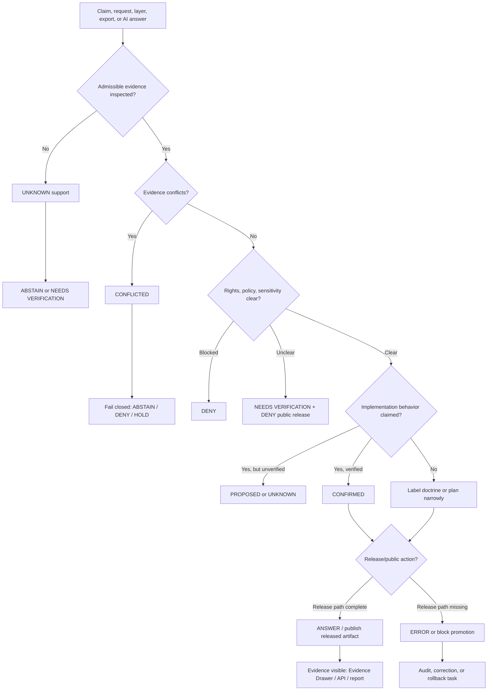

<!-- [KFM_META_BLOCK_V2]
doc_id: kfm://doc/NEEDS-UUID-docs-doctrine-truth-posture
title: Truth Posture
type: standard
version: v1
status: draft
owners: OWNER_TBD_NEEDS_VERIFICATION
created: CREATED_DATE_TBD_FROM_GIT_OR_DOC_REGISTRY
updated: 2026-05-06
policy_label: NEEDS_VERIFICATION
related: [../../README.md, ../README.md, ./README.md, ../adr/README.md, ../adr/ADR-0014-truth-path.md]
tags: [kfm, doctrine, truth-posture, evidence, governance, cite-or-abstain, finite-outcomes]
notes: [Replaces the inspected scaffold stub at docs/doctrine/truth-posture.md, doc UUID owner created date and policy label remain verification placeholders, implementation enforcement remains UNKNOWN until matching contracts schemas policies validators tests workflows receipts proofs release artifacts or runtime evidence are verified]
[/KFM_META_BLOCK_V2] -->

<a id="top"></a>

# Truth Posture

Shared doctrine for labeling what KFM can truthfully claim, what remains uncertain, and when the system must answer, abstain, deny, or error.

<div align="left">


</div>

> [!IMPORTANT]
> **Status:** `draft`  
> **Owners:** `OWNER_TBD_NEEDS_VERIFICATION`  
> **Path:** `docs/doctrine/truth-posture.md`  
> **Current role:** doctrine page for claim labels, evidence boundaries, and finite response outcomes.  
> **Implementation proof:** `UNKNOWN` until matching repository evidence is verified: contracts, schemas, policies, validators, fixtures, tests, workflows, receipts, proofs, release manifests, runtime traces, or reviewed artifacts.

## Quick jumps

| Core doctrine | Applying it | Review surfaces |
|---|---|---|
| [Scope](#scope) | [Claim rules](#claim-rules) | [Validation checklist](#validation-checklist) |
| [Repo fit](#repo-fit) | [Decision matrix](#decision-matrix) | [Open verification](#open-verification) |
| [Truth labels](#truth-labels) | [Examples](#examples) | [Appendix](#appendix) |
| [Finite outcomes](#finite-outcomes) | [Diagram](#diagram) | [Back to top](#top) |

---

## Scope

Truth posture is the KFM rule set for **not overclaiming**.

It governs how maintainers, reviewers, docs, APIs, map layers, Evidence Drawer payloads, Focus Mode responses, release artifacts, and generated summaries should describe confidence, evidence, uncertainty, conflict, and failure.

Use this page when deciding:

1. whether a statement is grounded enough to say;
2. which label should attach to a claim;
3. whether a public or semi-public response may `ANSWER`;
4. whether KFM should `ABSTAIN`, `DENY`, or `ERROR`;
5. whether a repo-shaped statement is implementation evidence or only doctrine, lineage, or proposal.

Truth posture is not cosmetic. It is part of the trust membrane.

> [!NOTE]
> KFM’s durable public unit is the **inspectable claim**: a public or semi-public statement whose evidence, source role, spatial scope, temporal scope, policy posture, review state, release state, and correction lineage can be inspected.

---

## Repo fit

**Target path:** `docs/doctrine/truth-posture.md`

This file belongs under `docs/doctrine/` because truth posture is human-facing operating law. It should define shared language and review expectations. It should not become a schema registry, policy engine, source registry, proof archive, release directory, or runtime log.

### Upstream surfaces

| Surface | Relationship | Status |
|---|---|---:|
| [`../../README.md`](../../README.md) | Root orientation for KFM identity, inspectable claims, lifecycle law, public-client posture, and core object families. | `CONFIRMED` |
| [`./README.md`](./README.md) | Doctrine directory guide and local placement rules. | `CONFIRMED` |
| [`../adr/README.md`](../adr/README.md) | ADR governance and review discipline. | `CONFIRMED` |
| [`../adr/ADR-0014-truth-path.md`](../adr/ADR-0014-truth-path.md) | Draft truth-path and public trust membrane decision. | `CONFIRMED / DRAFT` |
| Directory Rules | Responsibility-root doctrine: docs are human-facing control plane; domain and machine concerns belong under their responsibility roots. | `CONFIRMED` doctrine, path in repo `NEEDS VERIFICATION` |

### Downstream consumers

| Consumer | How it should use this doctrine | Enforcement status |
|---|---|---:|
| `docs/adr/` | Record decisions without upgrading proposals into facts. | `PARTIAL / NEEDS VERIFICATION` |
| `contracts/` | Define semantic meaning for trust-bearing objects. | `NEEDS VERIFICATION` |
| `schemas/` | Validate machine shape for labels, outcomes, envelopes, evidence, release, and correction objects. | `NEEDS VERIFICATION` |
| `policy/` | Enforce allow, deny, restrict, abstain, review-needed, and fail-closed behavior. | `NEEDS VERIFICATION` |
| `tests/` and `fixtures/` | Prove positive and negative paths. | `NEEDS VERIFICATION` |
| `apps/`, `packages/`, `tools/` | Implement governed APIs, validators, Evidence Drawer payloads, Focus Mode responses, and release helpers. | `UNKNOWN / NEEDS VERIFICATION` |
| `data/`, `release/`, `runtime/` | Store lifecycle data, receipts, proofs, release manifests, correction notices, rollback cards, and runtime envelopes. | `NEEDS VERIFICATION` |

> [!WARNING]
> A truth label in documentation does not prove enforcement. Enforcement requires inspected implementation evidence.

[Back to top](#top)

---

## Core rule

Use the **narrowest truthful label** and the **safest finite outcome**.

```text
When evidence is strong enough: say so and cite it.
When evidence is partial: narrow the claim.
When support is missing: mark UNKNOWN or NEEDS VERIFICATION.
When support conflicts: mark CONFLICTED and fail closed.
When a public claim cannot be supported: ABSTAIN, DENY, or ERROR.
```

KFM should never turn uncertainty into confident prose just because the sentence reads well.

---

## Three separations

Truth posture depends on three separations that must stay visible.

| Separation | Meaning | Failure mode prevented |
|---|---|---|
| Claim label vs system outcome | `CONFIRMED` describes evidence strength; `ANSWER`, `ABSTAIN`, `DENY`, and `ERROR` describe response behavior. | Treating `DENY` as a confidence label or treating `CONFIRMED` as publication permission. |
| Doctrine vs implementation | A rule can be doctrinally true while enforcement remains `UNKNOWN`. | Claiming CI, routes, policies, release gates, or runtime behavior exist because a doc says they should. |
| Evidence vs carriers | Maps, tiles, graphs, indexes, summaries, dashboards, scenes, exports, and AI answers carry evidence; they are not sovereign proof. | Treating derived surfaces as canonical truth. |

[Back to top](#top)

---

## Truth labels

Use these labels on claims, sections, tables, decisions, examples, or notes when confidence materially affects review, publication, implementation, policy, or public trust.

| Label | Meaning | Use when... | Do not use when... |
|---|---|---|---|
| `CONFIRMED` | Verified from admissible evidence in the active context. | A file, contract, schema, policy, fixture, test, workflow, receipt, proof, release artifact, runtime trace, attached doctrine, or inspected source supports the statement. | You are relying on memory, expected structure, a stale report, or plausible convention. |
| `INFERRED` | Conservative synthesis strongly implied by multiple sources. | Evidence points in the same direction, but direct implementation proof is absent. | The claim names exact route behavior, CI enforcement, package state, branch state, or runtime behavior. |
| `PROPOSED` | Recommended design, path, placement, behavior, or change not verified as current implementation. | Writing a plan, candidate path, next PR, contract wave, schema shape, policy, or validator. | Describing what the repo currently contains or what the system currently enforces. |
| `UNKNOWN` | Not verified strongly enough to state as fact. | The answer depends on uninspected repo files, logs, dashboards, platform settings, source rights, workflow state, or runtime behavior. | A direct check has already resolved the issue. |
| `NEEDS VERIFICATION` | Checkable, but not yet checked strongly enough to rely on. | Owners, dates, policy labels, source terms, exact paths, branch protections, CI results, route names, schema homes, or release status require direct review. | The matter cannot be checked or is already proven. |
| `CONFLICTED` | Evidence, authority, terminology, path, source role, or behavior materially disagrees or remains unresolved. | Docs and repo evidence conflict, two homes claim authority, source roles disagree, or prior reports collide. | There is only ordinary uncertainty; use `UNKNOWN` or `NEEDS VERIFICATION`. |
| `LINEAGE` | Historically useful material that explains prior work but is not current proof. | Prior PDFs, generated scaffold reports, older packets, or archived decisions should be preserved as context. | You need current implementation evidence. |
| `EXPLORATORY` | Idea material not yet promoted into canon, contract, policy, registry, or implementation. | New Ideas packets, design sketches, speculative extensions, or draft source-intake thoughts. | A reviewed ADR, schema, contract, policy, release, or implementation has accepted the idea. |
| `SUPERSEDED` | Replaced by a stronger source, successor decision, or verified implementation. | A newer ADR, doc, schema, policy, or implementation explicitly replaces old material. | The old material is merely incomplete or uncertain. |

### Labeling discipline

- Label material claims, not every sentence.
- Prefer a table label when a whole row shares the same posture.
- Do not upgrade `PROPOSED` to `CONFIRMED` because multiple plans repeat the same idea.
- Do not use `CONFIRMED` for implementation behavior unless implementation evidence was inspected.
- Do not hide `CONFLICTED` evidence to make a document feel cleaner.

[Back to top](#top)

---

## Finite outcomes

Finite outcomes describe what KFM returns or does when a request, claim, release candidate, layer, export, or AI response is evaluated.

| Outcome | Meaning | Typical trigger | Public posture |
|---|---|---|---|
| `ANSWER` | Evidence closure is sufficient and policy allows the response. | `EvidenceRef -> EvidenceBundle` resolves, citations are valid, policy permits, release state is appropriate. | Return bounded response with evidence and caveats. |
| `ABSTAIN` | Support is insufficient for a truthful answer. | Missing evidence, weak citation, unclear temporal/spatial support, source-role mismatch, unresolved contradiction. | Explain why KFM cannot answer. |
| `DENY` | Policy, rights, sensitivity, access, security, or trust membrane blocks the action. | Unknown rights, sensitive exact location, restricted source, direct model access, public request for internal lifecycle data. | Refuse without leaking restricted detail. |
| `ERROR` | A system, contract, validation, runtime, release, or integrity failure prevents safe handling. | Broken schema, missing required envelope field, unresolved evidence reference due to system failure, policy engine unavailable, corrupt artifact. | Return safe error and record audit/repair path. |

> [!IMPORTANT]
> `DENY`, `ABSTAIN`, and `ERROR` are not embarrassing edge cases. They are valid KFM outcomes when the system protects trust, rights, sensitivity, or integrity.

### Related states

Some states are domain or lifecycle states rather than global runtime outcomes.

| State | Use |
|---|---|
| `HOLD` | Pause a candidate pending review. |
| `QUARANTINE` | Fail-closed lifecycle state for invalid, unsafe, conflicted, restricted, or unclear material. |
| `RESTRICT` | Allow only role-limited or steward-reviewed access. |
| `GENERALIZE` | Replace exact geometry or detail with a public-safe derivative. |
| `STALE_VISIBLE` | Show released material with visible stale-state warning. |
| `WITHDRAWN` | Remove or hide a public claim/artifact with correction lineage. |
| `SUPERSEDED` | Preserve prior state while pointing to successor material. |

[Back to top](#top)

---

## Evidence classes

KFM claims should identify what kind of evidence supports them.

| Evidence class | Can support | Cannot support alone |
|---|---|---|
| Current repository evidence | File existence, checked-in docs, schemas, policies, fixtures, tests, workflows, package files, release artifacts, and inspected implementation files. | Running behavior, deployment state, branch protection, or CI success unless those are directly inspected. |
| Runtime / operational evidence | Live route behavior, logs, dashboards, workflow runs, emitted receipts, proof packs, release manifests, signatures, and deployment traces. | Source authority or rights unless linked to source descriptors and policy decisions. |
| Attached KFM doctrine | Project law, terminology, lifecycle, trust membrane, cite-or-abstain posture, map-first/evidence-first principles. | Current repo topology, exact implementation status, or enforcement maturity. |
| ADRs and reviewed docs | Accepted decisions, tradeoffs, alternatives, rollback and supersession expectations. | Implementation proof unless paired with tests, policies, schemas, or runtime evidence. |
| Lineage reports and prior scaffolds | Continuity, vocabulary, known risks, proposed file-family shape, prior design intent. | Current implementation presence. |
| Exploratory packets | Idea intake and future backlog pressure. | Canonical doctrine, accepted decisions, or current behavior. |
| External official sources | Current standard, source-system, API, legal, security, or version-sensitive facts. | KFM-specific authority unless KFM adopts the source through intake, policy, and review. |

[Back to top](#top)

---

## Claim rules

### 1. Repo-state claims require repo evidence

Do not write:

```text
The repo contains X.
The route exists.
The workflow enforces this.
The tests cover this.
This path is canonical.
```

unless current repository evidence verifies the claim.

Use instead:

```text
PROPOSED: add X.
UNKNOWN: route behavior was not inspected.
NEEDS VERIFICATION: workflow enforcement must be checked.
CONFIRMED: file X exists in the inspected ref.
```

### 2. Implementation claims require implementation evidence

A README, ADR, or doctrine page can say what should happen. It does not prove the system does it.

Evidence that can support implementation claims includes:

- inspected code path;
- schema or policy file;
- validator implementation;
- test file and result;
- workflow YAML and run result;
- emitted receipt, proof, or release artifact;
- runtime log or dashboard;
- source registry or release manifest;
- direct command output.

### 3. Public claims require evidence closure

A consequential public-facing claim should resolve:

```text
Claim
  -> EvidenceRef
  -> EvidenceBundle
  -> SourceDescriptor
  -> Receipt / ValidationReport
  -> PolicyDecision
  -> ReviewRecord where required
  -> ReleaseManifest
  -> CorrectionNotice / RollbackCard where applicable
```

If the chain cannot resolve strongly enough, KFM should `ABSTAIN`, `DENY`, or `ERROR`.

### 4. Conflicts stay visible

When documents, repo files, schemas, policies, source terms, or runtime evidence disagree:

1. mark the issue `CONFLICTED`;
2. cite or name the conflicting evidence;
3. choose the safer behavior;
4. record the verification or ADR task;
5. do not smooth the conflict into generic prose.

### 5. Sensitive and rights-uncertain material fails closed

When rights, sovereignty, cultural sensitivity, living-person data, DNA/genomic material, rare species, archaeology, infrastructure, or precise location exposure is unclear, KFM should prefer:

- quarantine;
- denial;
- redaction;
- generalization;
- role-limited access;
- delayed publication;
- abstention;
- review-required state;
- correction or withdrawal.

[Back to top](#top)

---

## Decision matrix

| Situation | Truth label | System outcome | Required next evidence |
|---|---:|---:|---|
| File inspected at the target path and content verified. | `CONFIRMED` | Usually none; use as evidence. | Commit/ref or current checkout evidence. |
| File path is recommended by doctrine and Directory Rules but not inspected. | `PROPOSED` | None until implemented. | Repo inventory and ADR/placement check. |
| A doc says a policy should deny access, but no policy/test was inspected. | `CONFIRMED` doctrine / `UNKNOWN` enforcement | Do not claim enforcement. | Policy file, test, workflow, or runtime proof. |
| Public claim lacks EvidenceRef. | `UNKNOWN` support | `ABSTAIN` | EvidenceRef and EvidenceBundle. |
| EvidenceRef is present but unresolved. | `NEEDS VERIFICATION` or `ERROR` depending cause | `ABSTAIN` or `ERROR` | Evidence resolver output and bundle. |
| Source rights are unclear. | `NEEDS VERIFICATION` | `DENY` public release | SourceRightsAssessment / SourceDescriptor. |
| Sensitive exact geometry is requested publicly. | `CONFIRMED` risk if source indicates sensitivity, otherwise `NEEDS VERIFICATION` | `DENY` or `RESTRICT` | Policy decision and safe transform receipt. |
| Docs and implementation conflict. | `CONFLICTED` | `DENY`, `ABSTAIN`, or hold release until resolved | ADR, correction, test, or rollback decision. |
| Runtime model generates an uncited answer. | `UNKNOWN` support | `ABSTAIN` or `ERROR` | Citation validation report and evidence bundle. |
| ReleaseManifest lacks rollback target. | `NEEDS VERIFICATION` / `ERROR` | Block publication | RollbackCard or release correction. |

[Back to top](#top)

---

## Examples

| Weak phrasing | KFM truth-posture phrasing |
|---|---|
| “The repo enforces cite-or-abstain.” | `CONFIRMED doctrine`: KFM requires cite-or-abstain. `UNKNOWN enforcement`: current policy/tests/runtime behavior must be verified. |
| “This schema is canonical.” | `NEEDS VERIFICATION`: schema-home authority must be checked against ADRs and active repo files. |
| “The layer is safe to publish.” | `PROPOSED`: layer can be considered for publication after source rights, sensitivity, EvidenceBundle closure, policy decision, release manifest, correction path, and rollback target are verified. |
| “AI says the answer is X.” | `ABSTAIN` unless X is supported by resolved evidence and citation validation. |
| “The old PDF proves the scaffold exists.” | `LINEAGE`: the PDF preserves prior plan/scaffold context; current implementation requires active repo evidence. |
| “No issue found.” | `UNKNOWN` unless the specific check ran and produced evidence. |

[Back to top](#top)

---

## Diagram



[Back to top](#top)

---

## Accepted inputs

This doctrine page can describe and normalize:

- truth labels;
- finite outcomes;
- evidence classes;
- claim-writing rules;
- uncertainty handling;
- conflict handling;
- fail-closed posture;
- citation and abstention rules;
- review checklists;
- examples of better claim phrasing.

[Back to top](#top)

---

## Exclusions

Do not place these here as primary authority:

| Excluded item | Proper home |
|---|---|
| Full source authority ladder | `docs/doctrine/authority-ladder.md` if created, `docs/registers/`, or `control_plane/` |
| Machine schemas for labels/outcomes | `schemas/` |
| Semantic contracts for envelopes and evidence objects | `contracts/` |
| Policy-as-code | `policy/` |
| Runtime envelope implementation | `apps/`, `packages/`, or verified runtime package root |
| Test fixtures | `fixtures/` or `tests/fixtures/` |
| Emitted receipts, proofs, release manifests, corrections, rollback cards | `data/receipts/`, `data/proofs/`, `release/`, or verified release/proof homes |
| Domain-specific publication burdens | `docs/domains/<domain>/`, `policy/domains/`, and domain tests |
| Private chain-of-thought | Do not store as a KFM truth object |

[Back to top](#top)

---

## Validation checklist

Before a PR treats this truth-posture doctrine as active and reviewable:

- [ ] Meta block fields are resolved or deliberately left as `NEEDS VERIFICATION`.
- [ ] `owners` is confirmed from CODEOWNERS, governance records, or maintainer assignment.
- [ ] `created` is filled from Git history or document registry.
- [ ] `policy_label` is confirmed.
- [ ] Links to root README, doctrine README, ADR README, and truth-path ADR resolve.
- [ ] If a label or outcome is represented in contracts or schemas, field names are cross-checked.
- [ ] If a label or outcome is enforced by policy, policy tests include positive and negative fixtures.
- [ ] Runtime/API/AI envelopes use finite outcomes only.
- [ ] Public UI states for `ABSTAIN`, `DENY`, `ERROR`, stale, withdrawn, and corrected states are not hidden behind generic failure messages.
- [ ] No implementation enforcement claim is made without implementation evidence.
- [ ] Conflicts with existing docs are recorded in the drift or verification backlog.

[Back to top](#top)

---

## Open verification

| Item | Status | Required evidence |
|---|---:|---|
| Document UUID / registry ID | `NEEDS VERIFICATION` | `control_plane/document_registry.yaml`, docs register, or accepted ID policy. |
| Owner | `NEEDS VERIFICATION` | CODEOWNERS, governance owner record, or maintainer assignment. |
| Created date | `NEEDS VERIFICATION` | Git history or document registry. |
| Policy label | `NEEDS VERIFICATION` | Policy classification or docs governance register. |
| Truth label schema | `NEEDS VERIFICATION` | Machine schema or contract if labels are represented structurally. |
| Runtime outcome schema | `NEEDS VERIFICATION` | `RuntimeResponseEnvelope`, `DecisionEnvelope`, or equivalent contract/schema. |
| Policy enforcement | `UNKNOWN` | Policy files and policy tests proving fail-closed behavior. |
| Citation validation | `UNKNOWN` | Evidence resolver and citation-validation tests. |
| Public UI rendering | `UNKNOWN` | Evidence Drawer / Focus Mode / map shell components or fixtures. |
| Release enforcement | `UNKNOWN` | ReleaseManifest, proof pack, promotion gate, correction, and rollback artifacts. |
| Link checks | `NEEDS VERIFICATION` | Repo-native Markdown validation output. |

[Back to top](#top)

---

## Appendix

<details>
<summary>Minimal runtime response envelope example</summary>

Illustrative only. Field names must be verified against active KFM contracts and schemas.

```json
{
  "outcome": "ANSWER",
  "truth_posture": "CONFIRMED",
  "payload": {
    "claim": "Example claim text"
  },
  "evidence_refs": ["kfm://evidence-ref/example"],
  "evidence_bundle_refs": ["kfm://evidence-bundle/example"],
  "policy_decision_ref": "kfm://policy-decision/example",
  "release_ref": "kfm://release/example",
  "correction_state": "current",
  "reasons": []
}
```

</details>

<details>
<summary>Truth-posture entry template</summary>

```markdown
> [!NOTE]
> **Truth posture:** `CONFIRMED | INFERRED | PROPOSED | UNKNOWN | NEEDS VERIFICATION | CONFLICTED | LINEAGE | EXPLORATORY | SUPERSEDED`  
> **Evidence basis:** <file, artifact, test, source, ADR, command, or doctrine>  
> **Implementation proof:** <verified evidence or UNKNOWN>  
> **Public outcome if support fails:** `ABSTAIN | DENY | ERROR`
```

</details>

<details>
<summary>Pre-publish self-check</summary>

- [ ] One H1 only.
- [ ] KFM Meta Block V2 present.
- [ ] Truth labels and finite outcomes are separate.
- [ ] `DENY`, `ABSTAIN`, and `ERROR` are treated as system outcomes, not confidence labels.
- [ ] Doctrine claims are not presented as enforcement proof.
- [ ] Repo-state claims are backed by repo evidence.
- [ ] Implementation claims are backed by implementation evidence.
- [ ] Public and sensitive defaults fail closed.
- [ ] Mermaid diagram explains a real review boundary.
- [ ] Code fences are language-tagged.
- [ ] Long appendix content is collapsed.
- [ ] Open verification items are visible.

</details>

[Back to top](#top)
