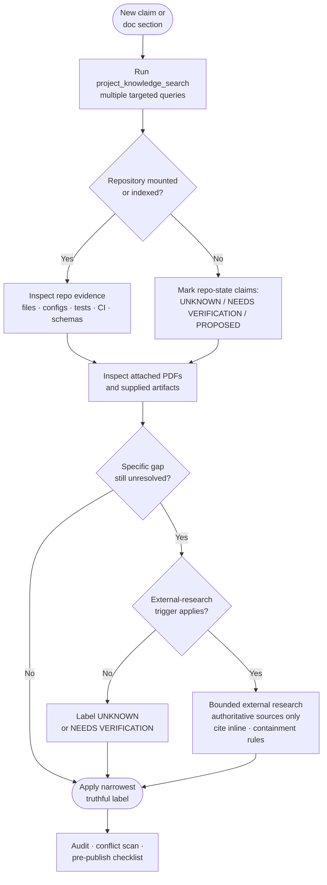

<!-- [KFM_META_BLOCK_V2]
doc_id: kfm://doc/truth-posture
title: Truth Posture
type: standard
version: v1
status: draft
owners: TODO — KFM Doctrine Stewards
created: TODO — confirm creation date
updated: TODO — confirm last review date
policy_label: public
related: [docs/doctrine/source-hierarchy.md, docs/doctrine/evidence-bundles.md, docs/doctrine/external-research.md, CONTRIBUTING.md]
tags: [kfm, doctrine, governance, evidence, claims, ai-assisted]
notes:
  - Normative doctrine for evidence-grounded claims across docs, code, and AI-assisted contributions.
  - Path and sibling doctrine doc names are PROPOSED until verified against the repository.
[/KFM_META_BLOCK_V2] -->

# 🧭 Truth Posture

> Normative doctrine for evidence, labeling, and claim discipline across Kansas Frontier Matrix documentation, code, and AI-assisted contributions.

[](#)
[](#)
[](#)
[](#)
[](#)

**Status:** Draft · **Owners:** TODO — KFM Doctrine Stewards · **Last updated:** TODO

> [!IMPORTANT]
> This document is **normative**. Contributors and AI agents working on KFM are expected to follow it. Deviation is not a stylistic choice; it requires explicit governance review and a recorded justification.

---

## Contents

1. [Purpose](#purpose)
2. [Audience & scope](#audience--scope)
3. [The truth posture in one paragraph](#the-truth-posture-in-one-paragraph)
4. [Truth labels](#truth-labels)
5. [Source hierarchy](#source-hierarchy)
6. [Evidence gathering order](#evidence-gathering-order)
7. [Repository preflight](#repository-preflight)
8. [External research containment](#external-research-containment)
9. [Terminology stability](#terminology-stability)
10. [Memory is not evidence](#memory-is-not-evidence)
11. [Conflict surfacing](#conflict-surfacing)
12. [Pre-publish truth checklist](#pre-publish-truth-checklist)
13. [Worked examples](#worked-examples)
14. [FAQ](#faq)
15. [Related docs](#related-docs)

---

## Purpose

KFM stitches together heterogeneous, often contested historical, geospatial, and archival evidence about Kansas. The integrity of every downstream artifact — datasets, catalogs, maps, narratives, models, and documentation — depends on the discipline with which **claims are tied to evidence** and on the discipline with which **uncertainty is preserved rather than smoothed away**.

The Truth Posture exists to make that discipline auditable:

- It tells contributors **what counts as evidence** for KFM claims.
- It tells contributors **how to label confidence** when evidence is partial.
- It tells AI agents **what they may not invent**, and how to fail loudly when they would otherwise hallucinate.
- It tells reviewers **what to reject**, regardless of how polished a submission looks.

> [!NOTE]
> "Truth posture" is the project's *stance* toward claim-making, not a claim of objective truth. Posture is a practice; the practice is auditable; audit is what earns trust over time.

[Back to top](#-truth-posture)

---

## Audience & scope

This doctrine applies to **all KFM contributions**, including but not limited to:

| Surface                       | Examples                                                                 |
| ----------------------------- | ------------------------------------------------------------------------ |
| Documentation                 | READMEs, ADRs, design briefs, policy docs, governance notes, this file   |
| Code & schemas                | Module-level claims, schema docstrings, contract docs, generated outputs |
| Data & catalogs               | Dataset descriptions, provenance notes, lineage records, STAC metadata   |
| Narrative & analytical output | Historical interpretation, attribution, summaries, model outputs         |
| AI-assisted contributions     | Any draft produced or shaped by an AI agent under a KFM workflow         |

It does **not** govern: external publications outside the KFM repository, third-party data shipped unmodified, or upstream specifications themselves (those are referenced, not authored).

> [!TIP]
> If you are unsure whether the Truth Posture applies to a particular artifact, default to **yes**. The cost of over-applying it is mild verbosity; the cost of under-applying it is silent error propagation downstream.

[Back to top](#-truth-posture)

---

## The truth posture in one paragraph

> KFM claims are **earned from evidence**, **labeled by confidence**, **traced to source**, and **left honestly uncertain when evidence does not yet exist.** Project knowledge and repository evidence are authoritative for KFM-specific claims. External research is a narrow last resort, walled off from KFM doctrine and repository state. Memory, plausibility, generic best practice, and "it usually looks like this" are **not evidence**. Polish never overrides truth; truth never excuses poor presentation.

[Back to top](#-truth-posture)

---

## Truth labels

Use the **narrowest truthful label**. Do not upgrade uncertainty through tone, formatting, or omission. Apply labels where confidence materially matters — do not mechanically prefix every sentence.

| Label                  | Use when…                                                                                          | Common contexts                                                          |
| ---------------------- | -------------------------------------------------------------------------------------------------- | ------------------------------------------------------------------------ |
| **CONFIRMED**          | Verified this session from attached docs, workspace evidence, tests, logs, or generated artifacts. | Direct quotes from a mounted file; a passing test asserting the claim    |
| **INFERRED**           | Reasonably derivable from visible evidence but not directly stated.                                | A pattern across multiple sibling files; a behavior implied by a schema  |
| **PROPOSED**           | A design, path, placement, or recommendation **not yet** verified in implementation.               | New directory layouts; planned routes; suggested schema fields           |
| **UNKNOWN**            | Not resolvable without more evidence than is currently available.                                  | Owner of a legacy module; precise date of a historical event             |
| **NEEDS VERIFICATION** | Checkable, but not yet checked strongly enough to act as fact.                                     | Claims plausibly correct but unconfirmed in this session                 |
| **EXTERNAL**           | Sourced from authoritative external research under the external-research policy.                   | Standard syntax (STAC, JSON Schema); current tool behavior (GDAL, MapLibre) |

> [!WARNING]
> **EXTERNAL never applies to KFM-specific repo or doctrine claims.** It is reserved for generic standards, external tool behavior, or external spec content. Using EXTERNAL to dress up an unverified KFM claim is a doctrine violation.

### Label decision flow



[Back to top](#-truth-posture)

---

## Source hierarchy

Sources are ranked. Lower layers may **clarify or operationalize** higher layers but never override them silently. If a lower layer must override a higher one, mark the change as a **PROPOSED CORRECTION** and explain why.

| Tier          | Source                                                                                                                              | Authority for                                          |
| ------------- | ----------------------------------------------------------------------------------------------------------------------------------- | ------------------------------------------------------ |
| **Primary**   | Attached project docs, canonical architecture docs, design briefs, standards, ADRs, contracts, schemas, policy docs, normative Markdown | KFM doctrine, architecture, terminology, intent        |
| **Secondary** | Repository/workspace contents — source files, READMEs, configs, CI, tests, fixtures, generated artifacts, intent-revealing comments | KFM implementation reality, repo state, naming, layout |
| **Tertiary**  | Authoritative external research (see [External research containment](#external-research-containment))                               | Generic standards, external tool behavior, external spec content |

> [!CAUTION]
> External research **never** outranks Primary or Secondary for KFM-specific claims. Citing a polished external page does not promote a guess to a fact.

[Back to top](#-truth-posture)

---

## Evidence gathering order

Before drafting any non-trivial doc, code claim, or analytical statement, gather evidence in this order. Do not skip a step unless it is demonstrably unavailable in the current session.

1. **Project knowledge search.** Run `project_knowledge_search` against the doc's topic, target path, adjacent concepts, terminology, and governance terms. Prefer **multiple targeted searches** over one broad query.
2. **Repository inspection.** Examine mounted files, configs, schemas, tests, workflows, fixtures, and adjacent docs relevant to the claim.
3. **Attached artifacts.** Inspect any PDFs, briefs, or supplied artifacts in the current session.
4. **External research — only if a permitted trigger applies and steps 1–3 leave a specific, named gap.** See [External research containment](#external-research-containment).

> [!IMPORTANT]
> Repo-shaped claims — paths, modules, routes, schemas, tests, CI, policies, deployment, branch state — **require** at least one project_knowledge search and a check of project evidence before they may be made. Web results never substitute for missing project or repo evidence on KFM-specific claims.

[Back to top](#-truth-posture)

---

## Repository preflight

Before any claim about repo state, paths, implementation, contracts, schemas, tests, CI, routes, APIs, UI, runtime, branches, deployment, or enforcement maturity:

### If the repository is mounted in this session

- Inspect it **directly** before finalizing any repo-shaped claim.
- Prefer **current repo evidence** over prior summaries, memory, generic convention, attached reports, plausible structure, or external research.
- Verify the **specific files** — directories, configs, tests, workflows, schemas, contracts, policies, fixtures, and adjacent docs — before proposing changes.
- Do **not** infer from one directory that unrelated directories, tests, routes, or policies exist.

### If the repository is not mounted

- Do not assume the repo is absent, empty, immature, greenfield, or shaped like the visible workspace.
- Run `project_knowledge_search` to locate any indexed repository evidence first.
- Distinguish carefully:
  - "workspace not mounted" ≠ "repository does not exist"
  - "not visible in this workspace" ≠ "not present in the repository"
- If the unmounted repo cannot be inspected, mark repo-specific claims **UNKNOWN** or **NEEDS VERIFICATION**.
- Treat proposed paths, package choices, route names, schema homes, test commands, and status claims as **PROPOSED** until verified.
- Do not convert attached PDFs, prior reports, generated plans, workspace-only scans, or external research into proof of current repo state.
- Do not describe a proposed tree as the current tree.

> [!WARNING]
> **Repository-state rule.** No statement such as *"the repo contains,"* *"the system implements,"* *"this path exists,"* *"the route exists,"* *"the tests cover,"* *"the workflow enforces,"* *"the policy denies,"* *"the package uses,"* or *"this path is canonical"* may be made unless checked against actual repository evidence in this session. **External research cannot satisfy this rule.**

[Back to top](#-truth-posture)

---

## External research containment

External research is a **narrow, last-resort tier**. It sits clearly below project knowledge and repository evidence and is walled off from repo-state claims. The default is **not to search the web**.

### Permitted triggers

External research is allowed only when **at least one** of the following applies, **and** project/repo evidence has already been checked:

- **Version-sensitive external standards** — e.g., STAC, JSON Schema, GeoJSON, OGC APIs, W3C PROV, FAIR/CARE principles, schema.org.
- **Current syntax or behavior of external tools** the doc must describe accurately — e.g., GitHub Markdown alerts, Mermaid, Shields.io endpoints, MapLibre, `gdal` / `ogr2ogr` flags.
- **Security-relevant or operationally current facts** — CVEs, deprecations, license text, current API surface.
- A **true gap** unresolved by project sources where leaving the gap unaddressed would weaken the doc more than a clearly attributed external reference would.

### Forbidden uses

- Do **not** search to make claims about KFM's repo state, paths, packages, modules, contracts, schemas, policies, routes, APIs, tests, CI, deployment, branches, owners, or implementation maturity.
- Do **not** search "Kansas Frontier Matrix" or KFM-internal terminology to validate project meaning. **Project knowledge is authoritative** for KFM concepts.
- Do **not** use web results to override Primary or Secondary sources.
- Do **not** let external phrasing replace KFM terminology, casing, or compound terms.

### Source quality (preferred order)

1. Official specification sites, RFCs, standards bodies (W3C, OGC, IETF, ISO).
2. Official vendor or project documentation (e.g., MapLibre docs, GitHub Docs, Mermaid docs, GDAL docs).
3. The relevant upstream project's own repository (README, CHANGELOG, release notes, maintainer-answered issues).
4. Reputable secondary sources only when primaries are unavailable.

> [!CAUTION]
> Avoid marketing pages presented as docs, undated blog posts, Stack Overflow answers, Medium articles, and AI-generated summaries of standards. If only weak sources are available, mark the claim **NEEDS VERIFICATION** and leave it labeled rather than promoting it to fact.

### Attribution and containment

- Every web-derived claim must be **cited inline** in the form required by the contribution workflow.
- Web-derived content may inform **generic technical sections** (standard syntax, tool behavior, external spec definitions). It must **not** appear in KFM-specific sections (architecture, paths, governance, repo state) except as a clearly attributed external reference supporting a project-grounded claim.
- All external sources consulted must be surfaced in the contribution's notes, with the trigger that justified each search.

> [!NOTE]
> When in doubt, **do not search**. A doc grounded in project evidence with a labeled gap is preferable to a doc padded with externally sourced generic material.

[Back to top](#-truth-posture)

---

## Terminology stability

KFM terminology is part of the project's evidence trail. Renaming a concept silently destroys auditability. Preserve KFM-specific capitalization, casing, and compound terms **exactly** as the project uses them.

| Term / pattern                                                  | Treatment                                                                   |
| --------------------------------------------------------------- | --------------------------------------------------------------------------- |
| `EvidenceBundle`                                                | Keep CamelCase; do not rewrite as "evidence bundle" in normative prose.     |
| `EvidenceRef`                                                   | Keep CamelCase; do not pluralize as a different concept.                    |
| `RAW → WORK/QUARANTINE → PROCESSED → CATALOG/TRIPLET → PUBLISHED` | Keep stage names, casing, slashes, and arrow ordering exactly.            |
| Project-coined compound terms                                   | Treat as proper nouns. Do not collapse into industry-generic equivalents.   |
| Stage / role / artifact names from ADRs and design briefs       | Use verbatim. If a name seems wrong, file a correction — do not silently fix it. |

> [!WARNING]
> External research must **not** overwrite KFM terminology with generic equivalents. If an external standard uses a different term for an analogous concept, surface the relationship explicitly (e.g., "KFM's `EvidenceBundle` corresponds in spirit to W3C PROV bundles, but the contract is project-defined") rather than substituting the external term.

[Back to top](#-truth-posture)

---

## Memory is not evidence

The following are **not evidence** and may not back any KFM claim:

- Recollection of "how the project usually does it"
- Guessed paths or "the path is probably…"
- Plausible behavior or "this kind of system normally…"
- Generic best practice from industry experience
- Prior session outputs that were not themselves grounded in evidence
- AI-generated summaries presented as sourced material

If a claim rests on any of the above, label it **UNKNOWN** or **NEEDS VERIFICATION** until evidence is produced. Reviewers should treat unsupported memory-shaped claims as defects, not stylistic choices.

[Back to top](#-truth-posture)

---

## Conflict surfacing

Conflicts between sources are **information**, not noise. Do not smooth them over.

- When project sources disagree internally, surface the disagreement and the dates of each source.
- When external standards conflict with project doctrine, **flag the conflict** and let governance decide; do not silently pick a side.
- When a lower-tier source contradicts a higher-tier one, raise it as a **PROPOSED CORRECTION** and route it through review.

> [!TIP]
> A reviewer's first question on any contested claim should be: *"Where in the source hierarchy did each side come from?"* If a doc makes that question hard to answer, the doc is failing its job.

[Back to top](#-truth-posture)

---

## Pre-publish truth checklist

These items are **absolute**. They are not stylistic preferences and cannot be traded off for polish, length, or tone.

- [ ] No fabricated paths, owners, dates, identifiers, or badge targets.
- [ ] All repo-state claims verified, or labeled **UNKNOWN** / **NEEDS VERIFICATION** / **PROPOSED**.
- [ ] Truth labels applied where confidence materially matters.
- [ ] KFM terminology preserved exactly (casing, compound terms, stage names).
- [ ] Source-grounded content separated from added content.
- [ ] External research triggered only by a permitted condition.
- [ ] External content cited inline and listed in contribution notes.
- [ ] No external content used to make KFM repo-state or doctrine claims.
- [ ] Conflicts between external standards and project doctrine surfaced, not smoothed.

> [!IMPORTANT]
> Failing any of these items is sufficient grounds to **reject** a contribution at review, regardless of how well-written, well-formatted, or visually polished it is.

[Back to top](#-truth-posture)

---

## Worked examples

These examples are **illustrative**. They show how to apply the posture in practice. Real claims should always be backed by actual evidence; the snippets below are stylized.

### Example 1 — repo-state claim without evidence

**Don't**

```text
The repo contains a STAC catalog at `data/stac/` and exposes a `/catalog`
route via the API service.
```

**Do**

```text
PROPOSED: place the STAC catalog at `data/stac/` and expose it via a
`/catalog` route. Both the path and the route are NEEDS VERIFICATION
against the repository — no current session evidence confirms either.
```

### Example 2 — compliance claim without evidence

**Don't**

```text
KFM complies with FAIR principles.
```

**Do**

```text
INFERRED: KFM's metadata model aligns with the FAIR Findable and
Accessible principles based on the use of persistent identifiers and
public catalogs. Alignment with Interoperable and Reusable is
NEEDS VERIFICATION until cross-walks are documented in an ADR.
```

### Example 3 — external standard properly contained

**Don't**

```text
STAC items must have an `id` and a `geometry` field, which is how
KFM models its evidence.
```

**Do**

```text
EXTERNAL: STAC Items require `id`, `type`, `geometry`, `bbox`,
`properties`, `links`, and `assets` fields per the STAC specification.
CONFIRMED in project doctrine: KFM's catalog stage emits STAC-shaped
records; the mapping from `EvidenceBundle` to STAC Item fields is
defined in [PROPOSED] docs/doctrine/evidence-bundles.md.
```

### Example 4 — terminology drift

**Don't**

```text
The pipeline moves raw data through working storage and into
processed and published layers.
```

**Do**

```text
The pipeline moves data through the KFM stages
RAW → WORK/QUARANTINE → PROCESSED → CATALOG/TRIPLET → PUBLISHED.
Stage names are normative and must not be paraphrased.
```

[Back to top](#-truth-posture)

---

## FAQ

<details>
<summary><strong>Do I need to label every sentence?</strong></summary>

No. Apply labels where confidence **materially matters** — for example, when a reader might otherwise mistake an inferred claim for a confirmed one, or when a repo-state claim could be acted upon. Mechanical labeling of obvious statements is noise.

</details>

<details>
<summary><strong>Can I cite a blog post if it explains a standard well?</strong></summary>

Prefer the standard itself, the standards body's documentation, or the upstream project's own docs. A blog post may be useful as background, but it should not be the **citation of record** for a normative claim if a primary source exists.

</details>

<details>
<summary><strong>What if the repo clearly does something different from doctrine?</strong></summary>

Surface the conflict. Do **not** silently rewrite doctrine to match implementation, and do not silently rewrite implementation claims to match doctrine. Mark it as a **PROPOSED CORRECTION** (in whichever direction is appropriate) and route through governance.

</details>

<details>
<summary><strong>Does the Truth Posture apply to AI-generated drafts?</strong></summary>

Yes — explicitly. AI agents working in KFM workflows are bound by this doctrine the same way human contributors are. AI output that fabricates paths, owners, dates, or repo state is a defect, not a stylistic quirk, and should be rejected at review.

</details>

<details>
<summary><strong>What about historical claims where evidence is genuinely contested?</strong></summary>

Surface the contestation. Cite the conflicting sources. Use **INFERRED** or **NEEDS VERIFICATION** as appropriate. KFM's value is partly in *preserving uncertainty* about contested history, not flattening it into a confident summary.

</details>

<details>
<summary><strong>Where do I record external sources I consulted?</strong></summary>

In the contribution's notes (e.g., PR description, Section 2 of an AI-assisted contribution, or the appropriate review record). Each external source should be listed with the **trigger** that justified consulting it and **what it informed** in the draft.

</details>

[Back to top](#-truth-posture)

---

## Related docs

> [!NOTE]
> The following sibling paths are **PROPOSED** placeholders inferred from the doctrinal structure. Verify against the repository before relying on them; replace with confirmed paths when known.

- [`docs/doctrine/source-hierarchy.md`](./source-hierarchy.md) — Detailed expansion of the Primary / Secondary / Tertiary source hierarchy. **PROPOSED**
- [`docs/doctrine/evidence-bundles.md`](./evidence-bundles.md) — `EvidenceBundle` and `EvidenceRef` contract, lineage, and lifecycle. **PROPOSED**
- [`docs/doctrine/external-research.md`](./external-research.md) — Operational rules and citation patterns for external research. **PROPOSED**
- [`docs/doctrine/terminology.md`](./terminology.md) — Canonical KFM glossary, casing, and compound-term registry. **PROPOSED**
- [`CONTRIBUTING.md`](../../CONTRIBUTING.md) — Contribution workflow, review criteria, and PR template references. **NEEDS VERIFICATION**

---

**Last updated:** TODO — confirm at next doctrine review · **Version:** v1 · [⬆ Back to top](#-truth-posture)
