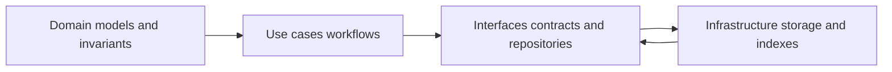
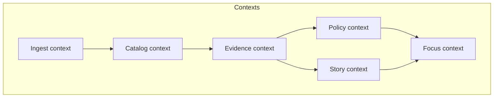

<!-- [KFM_META_BLOCK_V2]
doc_id: kfm://doc/2a5c5d7c-2d86-4b25-96c8-922b8939f2c0
title: Domains
type: standard
version: v1
status: draft
owners: KFM Maintainers (TBD)
created: 2026-03-01
updated: 2026-03-01
policy_label: public
related:
  - docs/MASTER_GUIDE_v13.md
  - docs/architecture/
  - schemas/
  - contracts/
tags: [kfm, domains, ddd, bounded-contexts]
notes:
  - This README defines how we document bounded contexts and the domain language used across KFM.
  - This is NOT the data-domain ETL runbook location (see “Data domains vs software domains”).
[/KFM_META_BLOCK_V2] -->


<!-- TODO: replace badges with repo-standard badges (CI, linkcheck, policy tests) once paths are confirmed -->

# Domains
**Purpose:** Canonical home for KFM’s *domain language*, *bounded contexts*, and *domain invariants*—so every implementation and every user-facing claim stays traceable, testable, and policy-safe.

> ⚠️ **Important distinction:** “Domains” here means **software/domain-model boundaries (bounded contexts)**.  
> “Data domains” (e.g., hydrology, air-quality) are a *data organization concern* and typically live under `data/<domain>/...` with their own runbooks (often under `docs/data/<domain>/` if present).

---

## Quick navigation
- [What lives here](#what-lives-here)
- [Data domains vs software domains](#data-domains-vs-software-domains)
- [How this fits the KFM architecture](#how-this-fits-the-kfm-architecture)
- [Domain map](#domain-map)
- [Core domain concepts](#core-domain-concepts)
- [How to add or change a domain](#how-to-add-or-change-a-domain)
- [Definition of Done](#definition-of-done)
- [Directory layout](#directory-layout)
- [Appendix: Templates](#appendix-templates)

---

## What lives here

### ✅ This folder **should** contain
- **Bounded context** documentation (what belongs together; what must stay apart).
- **Ubiquitous language**: terms, definitions, examples, and “this does *not* mean …” clarifications.
- **Core entities & invariants** (e.g., identity rules, version semantics, evidence resolution semantics).
- **Context maps**: how contexts interact via explicit interfaces/contracts.
- **Domain decisions** (small ADR-like notes) when a term, boundary, or invariant changes.

### ❌ This folder **must not** contain
- Data ingestion runbooks, ETL step-by-steps, or pipeline operator docs (put those in the data-domain doc area, e.g. `docs/data/<domain>/` if you use that pattern).
- Implementation detail that belongs in code (framework choices, deployment steps, infra specifics).
- User-facing stories / Story Nodes (those belong in the Story Node governed area, typically under `docs/reports/story_nodes/`).

[Back to top](#domains)

---

## Data domains vs software domains

### Data domains (datasets)
**Goal:** Keep raw/work/processed artifacts and their catalog outputs isolated and discoverable.  
**Typical artifacts:** dataset specs, QA rules, mapping docs, promotion receipts, STAC/DCAT/PROV links.

### Software domains (this folder)
**Goal:** Keep domain logic coherent and stable even as storage/indexing/UI changes.  
**Typical artifacts:** entity definitions, context boundaries, invariants, and interface expectations.

> TIP: A *data domain* (hydrology) often maps to multiple *software contexts* (Ingest, Catalog, Evidence, Policy) because governance and provenance cut across datasets.

[Back to top](#domains)

---

## How this fits the KFM architecture

KFM’s reference posture is a layered architecture:

- **Domain**: pure domain models and rules (no infra calls).
- **Use cases**: workflows (ingest, promote, publish story, answer focus query).
- **Interfaces**: contracts, DTOs, schema registries, policy adapters, repository interfaces.
- **Infrastructure**: PostGIS, object storage, search indexes, CI/deploy, etc.



**Invariant:** Domain logic must only talk “outward” through interfaces, never directly to infra.

[Back to top](#domains)

---

## Domain map

This is a *recommended* way to document KFM’s bounded contexts. Edit to match the repo’s actual boundaries.



**How to use this map**
- Each box should have a corresponding folder under `docs/domains/contexts/<context-name>/`.
- Each arrow implies an **explicit interface** (OpenAPI schema, DTO boundary, repository interface, or policy contract)—not an implicit “shared database table” dependency.

[Back to top](#domains)

---

## Core domain concepts

### Starting point entity set
KFM domain modeling guidance starts with a pragmatic set of entities that support both scientific observation and historical narrative without forcing everything into a single brittle ontology:

- **Place**: spatially bounded concept (county, town, river reach, boundary).
- **Event**: time-bounded occurrence (flood, treaty signing, railroad arrival).
- **Observation**: measured or recorded datapoint.
- **Artifact**: a file/object (map scan, GeoParquet, imagery tile bundle).
- **Dataset / DatasetVersion**: versioned collection of artifacts and records.
- **Agent**: person or organization responsible for actions.
- **Claim**: a narrative statement linked to evidence.
- **EvidenceBundle**: resolved evidence for a claim or feature.
- **Relationship**: typed edges between entities.

> NOTE: Treat this list as a baseline. Add entities only when you can state their invariants and evidence rules.

### Domain invariants checklist (minimum)
When documenting or changing a concept, capture:
- **Identity rules** (what makes two things “the same”?)
- **Time semantics** (event time vs valid time vs transaction time if applicable)
- **Policy label propagation** (what inherits restrictions?)
- **Evidence requirements** (what does “supported” mean for this concept?)
- **Failure mode** (default-deny / fail-closed expectations)

[Back to top](#domains)

---

## How to add or change a domain

### Add a new bounded context
1. Create `docs/domains/contexts/<context-name>/README.md`.
2. Define:
   - Responsibilities and non-responsibilities
   - Core entities owned by the context
   - Invariants
   - Inputs/outputs (interfaces)
3. Add the context to the [Domain registry](#domain-registry) table.
4. Add or update the [Domain map](#domain-map) to reflect relationships.

### Change an existing concept or boundary
1. Add a short decision note under `docs/domains/decisions/`:
   - What changed
   - Why
   - Impacted interfaces/contracts
   - Migration notes (if any)
2. Update the affected context docs and entity definitions.
3. Ensure downstream “contracts-first” artifacts remain valid (schemas, OpenAPI, policy fixtures).

[Back to top](#domains)

---

## Domain registry

> Fill this in as contexts are added. Keep it small and real—no placeholders in `published` status.

| Context | Status | Owner | Interfaces (examples) | Notes |
|---|---:|---|---|---|
| ingest | draft | TBD | dataset registry input, acquisition manifest | |
| catalog | draft | TBD | STAC/DCAT/PROV generation contract | |
| evidence | draft | TBD | EvidenceRef → EvidenceBundle resolution | |
| policy | draft | TBD | allow/deny + obligations + reason codes | |
| story | draft | TBD | Story Node v3 publish contract | |
| focus | draft | TBD | Focus ask/answer evidence binding | |

[Back to top](#domains)

---

## Definition of Done

### For a new / changed context doc
- [ ] Context responsibilities and exclusions are explicit.
- [ ] Owned entities (and which context owns them) are explicit.
- [ ] Invariants are listed in testable language (“MUST/SHOULD”).
- [ ] All dependencies are via interfaces (no hidden storage coupling).
- [ ] Evidence + policy implications are stated (default-deny on ambiguity).
- [ ] Links are present to relevant contracts/schemas (where known).
- [ ] If it changes a boundary, there is a decision note under `docs/domains/decisions/`.

[Back to top](#domains)

---

## Directory layout

> This is a *recommended* structure. Adjust to match reality, but keep the intent: “easy to find, hard to misunderstand.”

```text
docs/domains/
├── README.md
├── core/
│   ├── glossary.md                 # Ubiquitous language (canonical definitions)
│   ├── entities.md                 # Core entity definitions + invariants
│   └── identity-and-time.md        # Identity rules + time semantics
├── contexts/
│   ├── ingest/README.md
│   ├── catalog/README.md
│   ├── evidence/README.md
│   ├── policy/README.md
│   ├── story/README.md
│   └── focus/README.md
├── decisions/
│   └── YYYY-MM-DD-short-title.md   # Domain decision notes (mini-ADRs)
└── _templates/
    ├── context.README.template.md
    └── decision.template.md
```

[Back to top](#domains)

---

## Appendix: Templates

<details>
<summary><strong>Bounded context doc template</strong> (copy/paste)</summary>

```markdown
# <Context Name>

## Purpose
## Responsibilities
## Non-responsibilities

## Owned entities
- ...

## Invariants
- MUST ...
- SHOULD ...

## Interfaces
### Inputs
### Outputs

## Policy and evidence considerations
- Default-deny conditions:
- Redaction obligations:

## Testing expectations
- Contract tests:
- Golden tests:
```
</details>

<details>
<summary><strong>Decision note template</strong> (copy/paste)</summary>

```markdown
# YYYY-MM-DD — <Decision title>

## Status
draft | review | accepted | superseded

## Context
## Decision
## Consequences
## Affected interfaces/contracts
## Migration notes
```
</details>
