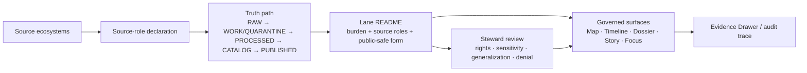

<!-- [KFM_META_BLOCK_V2]
doc_id: kfm://doc/<uuid-NEEDS-VERIFICATION>
title: Kansas Frontier Matrix — Domains
type: standard
version: v1
status: draft
owners: <NEEDS_VERIFICATION>
created: <YYYY-MM-DD NEEDS_VERIFICATION>
updated: <YYYY-MM-DD NEEDS_VERIFICATION>
policy_label: <NEEDS_VERIFICATION>
related: [../../README.md, ../reports/readme-structure-reconciliation.md, ../soil/README.md, <additional-related-paths-NEEDS_VERIFICATION>]
tags: [kfm, domains, source-atlas]
notes: [Mounted March 2026 PDF corpus verified; live repo tree, owners, dates, policy label, and adjacent path existence remain NEEDS VERIFICATION.]
[/KFM_META_BLOCK_V2] -->

# Kansas Frontier Matrix — Domains

Authoritative landing page for Kansas operating lanes, source ecosystems, and domain-specific publication burden.

> [!NOTE]
> **Status:** experimental  
> **Owners:** NEEDS VERIFICATION  
> 
> 
> 
>   
> **Quick jumps:** [Scope](#scope) · [Repo fit](#repo-fit) · [Inputs](#inputs) · [Exclusions](#exclusions) · [Directory tree](#directory-tree) · [Quickstart](#quickstart) · [Usage](#usage) · [Diagram](#diagram) · [Tables](#tables) · [Task list](#task-list) · [FAQ](#faq) · [Appendix](#appendix)

> [!IMPORTANT]
> This README is a **navigation, boundary, and burden** document for domain documentation. It should help maintainers choose the right lane, preserve source-role discipline, and keep publication obligations visible. It does **not** replace contracts, source descriptors, catalogs, evidence bundles, policy bundles, release manifests, correction records, or canonical data artifacts.

## Scope

KFM treats Kansas domains as **operating lanes**, not decorative themes. A lane changes what counts as admissible evidence, which source roles can be combined, how time and support must be stated, what rights or sensitivity burdens apply, and what can safely be published. This README exists to keep those distinctions visible at the top of the domain subtree.

In this area, the goal is not to flatten hydrology, hazards, archives, service geography, ecology, transport, or land tenure into one generic “data sources” bucket. The goal is to help contributors answer four questions quickly:

1. Which lane am I actually working in?
2. Which source roles belong in that lane?
3. What publication burden follows from that lane?
4. What belongs in a lane README versus a contract, policy artifact, or release object?

### Truth labels used in this area

| Label | Use here |
|---|---|
| **CONFIRMED** | Supported by the mounted March 2026 corpus visible in this session |
| **INFERRED** | Structurally reasonable completion that fits repeated corpus patterns, but is not directly verified as mounted repo reality |
| **PROPOSED** | Recommended doc structure, lane packaging, or normalization move |
| **UNKNOWN** | Not verified strongly enough in the current session |
| **NEEDS VERIFICATION** | A concrete detail that should be checked against the live repo or runtime before being treated as settled |

[Back to top](#kansas-frontier-matrix--domains)

## Repo fit

| Item | Value |
|---|---|
| **Target path for this file** | `docs/domains/README.md` |
| **Role** | Root index for domain lanes, source ecosystems, and lane-specific publication burden |
| **Repo-level fit** | Sits between top-level doctrine and lane-level README files |
| **Related docs** | [`../../README.md`](../../README.md) · [`../reports/readme-structure-reconciliation.md`](../reports/readme-structure-reconciliation.md) · [`../soil/README.md`](../soil/README.md) *(user-supplied references; mounted existence still NEEDS VERIFICATION)* |
| **Expected downstream docs** | `./<lane>/README.md` *(INFERRED / NEEDS VERIFICATION)* |
| **Mounted subtree reality** | **UNKNOWN** — current session verified PDF corpus, not a live repo tree |

> [!TIP]
> Treat every path in this file except the target path above as **working documentation intent**, not as mounted filesystem proof, until the live repo confirms it.

[Back to top](#kansas-frontier-matrix--domains)

## Inputs

Accepted content for this area includes:

- lane overviews and boundary notes
- source-family maps and source-role distinctions
- lane-specific rights, sensitivity, and generalization burdens
- domain-specific verification and publication notes
- cross-domain coupling guidance
- pointers to analyses, pipelines, catalogs, story surfaces, and steward review expectations
- explicit `CONFIRMED` / `INFERRED` / `PROPOSED` / `UNKNOWN` markers where uncertainty matters

## Exclusions

| This does **not** belong here | Put it here instead | Why |
|---|---|---|
| Machine-checkable contracts, schemas, and profile files | `../../contracts/` · `../../schemas/` *(NEEDS VERIFICATION)* | Lane docs should reference contracts, not become parallel contract systems |
| Policy bundles, deny rules, obligation vocabularies | `../../policy/` *(NEEDS VERIFICATION)* | Domain docs surface burden; policy artifacts enforce it |
| Canonical data artifacts, evidence bundles, release manifests, correction notices | Canonical catalog / release / proof surfaces *(exact paths NEED VERIFICATION)* | This README must not impersonate release memory |
| Tests, fixtures, validator entrypoints, CI workflow logic | `../../tests/` · `../../.github/workflows/` *(NEEDS VERIFICATION)* | Keep prose aligned to what tests and workflows actually prove |
| Unsourced narrative claims or public-story prose | Lane story/dossier surfaces *(NEEDS VERIFICATION)* | Narrative remains downstream of evidence and review |
| Unverified implementation claims | Nowhere yet | Keep them visible as `UNKNOWN` or `NEEDS VERIFICATION` |

[Back to top](#kansas-frontier-matrix--domains)

## Directory tree

### Current-session path certainty

Only the **target file role** is stable in this draft. The live repo subtree was not directly verified in this session, so the tree below is a **recommended normalized shape**, not a claim that every folder already exists.

### Recommended normalized subtree (`INFERRED / NEEDS VERIFICATION`)

```text
docs/
└── domains/
    ├── README.md
    ├── history-mobility/
    │   └── README.md
    ├── settlement-services/
    │   └── README.md
    ├── land-tenure/
    │   └── README.md
    ├── archives-heritage/
    │   └── README.md
    ├── hydrology/
    │   └── README.md
    ├── hazards/
    │   └── README.md
    ├── agriculture/
    │   └── README.md
    ├── transport/
    │   └── README.md
    ├── ecology/
    │   └── README.md
    ├── atmosphere/
    │   └── README.md
    └── dossiers/
        └── README.md
```

### Normalization note

A mounted repo may still contain lane material outside this subtree, including narrower or older directory names. Normalize gradually. Preserve working links first, then converge names and paths once the live tree is verified.

[Back to top](#kansas-frontier-matrix--domains)

## Quickstart

### Start a new or revised lane README

1. Pick the lane by **burden**, not by visual theme.
2. Declare the lane’s **source roles** before describing outputs.
3. State the lane’s **public-safe default**, **review triggers**, and **modeled-vs-observed boundaries**.
4. Link outward to canonical artifacts, catalogs, and evidence surfaces instead of duplicating them.
5. Keep unresolved repo, runtime, and implementation claims visibly marked.

### Minimal lane stub

```md
# <Lane name>

One-line purpose for this lane.

> [!NOTE]
> **Lane posture:** CONFIRMED doctrine · INFERRED packaging · UNKNOWN mounted implementation depth

## Purpose
State what the lane covers and what it explicitly does not cover.

## Source roles
- authoritative direct observation / administrative record
- operational context feed
- discovery mirror / aggregator
- modeled / assimilated / derived surface
- documentary / interpretive evidence
- authority / crosswalk infrastructure

## Representative sources
- source family:
- source family:
- source family:

## Publication posture
- default public-safe form:
- generalized / restricted / withheld cases:
- steward-review triggers:
- modeled-vs-observed disclosure rule:

## Cross-lane couplings
- likely joins:
- likely place-dossier relevance:

## Verification and release notes
- lane-specific checks:
- proof objects or release notes:
- open gaps / NEEDS VERIFICATION:
```

### Ready-before-merge check

A lane README is not ready just because it is readable. It is ready when it makes these things hard to forget:

- what kind of sources enter the lane
- which source roles must stay distinct
- what gets generalized, delayed, restricted, or withheld
- what the public surface may safely claim
- what remains unknown

[Back to top](#kansas-frontier-matrix--domains)

## Usage

### Use this README as a router, not a warehouse

This file should stay compact enough to navigate. It is the **map of the domain area**, not the place to absorb every lane’s full method.

### Use lane docs to preserve asymmetry

Not every lane is equally mature, equally public-safe, or equally verified. That asymmetry is part of KFM’s truth posture and should remain visible.

### Use domain docs to carry burden forward

A good lane README should make it difficult to forget:

- when precise locations need generalization
- when documentary evidence carries reuse or cultural-sensitivity constraints
- when observed, corrected, and modeled surfaces must remain visibly distinct
- when a lane is contextual support rather than an authoritative operational claim

### Use dossiers to show joined value

KFM becomes more distinctive when lanes are joined around places, corridors, events, and claims. Lane docs should therefore name their likely couplings early rather than behaving like isolated mini-platforms.

[Back to top](#kansas-frontier-matrix--domains)

## Diagram


```mermaid
flowchart LR
    A[Source ecosystems] --> B[Source-role declaration]
    B --> C[Truth path<br/>RAW → WORK/QUARANTINE → PROCESSED → CATALOG → PUBLISHED]
    C --> D[Lane README<br/>burden + source roles + public-safe form]
    D --> E[Governed surfaces<br/>Map · Timeline · Dossier · Story · Focus]
    D --> F[Steward review<br/>rights · sensitivity · generalization · denial]
    F --> E
    E --> G[Evidence Drawer / audit trace]
```

[Back to top](#kansas-frontier-matrix--domains)

## Tables

### Lane burden registry

| Lane family | What belongs here | Representative source families | First credible public-safe deliverable | Key caution |
|---|---|---|---|---|
| **History / mobility** | Historical boundaries, census geography, settlement scaffolding, migration and origin-destination context | Historical boundaries, Decennial Census, ACS, NHGIS, Kansas territorial/state censuses, IRS migration flows | Time-scoped contextual maps and place-history notes | Do not flatten persons, households, flows, and administrative units into one synthetic population layer |
| **Settlement / services** | Cities, place dossiers, school districts, healthcare catchments, utilities, broadband, emergency-response and service-capacity cues | DASC, Census/NHGIS, agency service-area layers, KDOT/state GIS, local plans, FCC broadband | Place/service context overlays and dossier references | Service geography, legal jurisdiction, and operational capacity are related but not identical |
| **Land tenure** | Parcels, plats, deeds, patents, PLSS, chain-of-title context | BLM GLO, PLSS, county parcel GIS, deed books, plat collections | Generalized parcel-history or legal-description indexes | Identity resolution, OCR/geoparsing, and temporal linking are review-bearing |
| **Archives / heritage** | Newspapers, oral histories, scans, transcripts, captions, archival description, heritage documentation | Kansas Historical Society, Chronicling America, local archives, oral-history programs | Evidence-linked documentary indexes and dossier excerpts | Context, rights, reuse constraints, and cultural sensitivity must stay first-class |
| **Hydrology** | Surface water, groundwater, reservoirs, flood stages, water quality, watersheds, water governance | USGS NWIS, FEMA NFHL, KDHE, reservoir and watershed programs, local water reporting | Gauge, floodplain, terrain-derivative, or water-quality thin slice | Preferred first slice because it is public-safe, place/time-rich, and operationally legible |
| **Hazards / resilience** | Flood, drought, smoke, severe weather, exposure, service continuity, resilience context | FEMA, NOAA/NWS, state emergency data, KDOT, local hazard plans | Interpretable hazard context layers with explicit support semantics | Avoid composite risk theater; preserve decomposability and exposure context |
| **Agriculture / soils** | Soils, cropping systems, erosion exposure, irrigation, land cover, rural production | USDA NRCS, NASS, Kansas soils resources, EO products | Source-role-aware soil/agriculture context layers | Groundwater, erosion, and soil-moisture gaps remain active priorities; modeled and observed layers must stay distinct |
| **Transport / logistics** | Roads, rail, bridges, freight corridors, transit, closures, schedules, work zones | KDOT, GTFS, GTFS-Realtime, WZDx, local transit feeds | Corridor / closure / continuity context | Inventory, schedule, closure, and live impact feeds require different merge logic; mirrors are not operator truth |
| **Ecology / biodiversity** | Species observations, flora, pollinators, wildlife, habitat, migration corridors, protected areas | GBIF, iNaturalist, eBird, PAD-US, KDWP, biodiversity collections | Generalized stewardship-safe habitat or protected-area context | Rare-species and culturally sensitive locations may require geoprivacy, generalization, or withholding |
| **Atmosphere / air / climate** | Air quality, smoke, drought context, EO-derived conditions, elevation, terrain, contextual scientific layers | EPA AQS, AirNow, PurpleAir where admitted, NASA/NOAA EO products, 3DEP/USGS elevation | Context layers with explicit observed / corrected / modeled labels | Air/climate context is not a broad forecasting authority; method and calibration distinctions must stay visible |
| **Dossiers** | Joined place-, corridor-, or event-centered objects spanning multiple lanes | Lane outputs + evidence bundles + release-safe story objects | Place dossier or cross-lane evidence package *(INFERRED)* | Must remain downstream of lane evidence and policy, not become a shortcut around either |

### Source-role matrix

| Source role | What it means | Typical examples | Handling rule |
|---|---|---|---|
| **Authoritative direct observation / administrative record** | Primary evidence for what was observed, measured, issued, or legally recorded | AQS rows, USGS NWIS station records, county boundaries, parcel inventories, FEMA declarations | Preserve original identifiers, timestamps, and terms; use as baseline when later layers disagree |
| **Operational context feed** | High-frequency context for current conditions or service awareness | AirNow AQI nowcasts, KanDrive conditions, WZDx feeds, reservoir operations | Useful for continuity context, but should not silently replace regulatory or archival baselines |
| **Discovery mirror / aggregator** | Search or access surface that improves breadth, not provenance sovereignty | OpenAQ, Transitland, National Transit Map, mirror STAC endpoints | Keep origin source, license, and operator metadata visible |
| **Modeled / assimilated / derived surface** | Outputs created through modeling, downscaling, fusion, terrain derivation, correction, or bias adjustment | CAMS, SMAP L4, aerosol proxies, corrected PurpleAir surfaces | Keep visibly modeled or derived; record lineage, method, QA, and calibration pedigree |
| **Documentary / interpretive evidence** | Original narrative or curated evidence objects | Kansas Memory items, newspapers, treaty texts, oral-history transcripts, deed scans | Retain originals first; downstream extraction remains review-aware |
| **Authority / crosswalk infrastructure** | Identity and linkage systems used for disambiguation | LCNAF, VIAF, SNAC, Catalogue of Life, DOI metadata | Use for graph stitching and disambiguation, not as a substitute for primary evidence |

### Cross-lane couplings worth naming early

| Coupling | Why it matters |
|---|---|
| **Water ↔ agriculture** | Irrigation, aquifer pressure, drought, soil moisture, and crop geography are structurally linked |
| **Hydrology / hazards ↔ transport continuity** | Floods, wildfire, drought, and severe weather become operationally meaningful when corridors and services are disrupted |
| **Land tenure ↔ archives / historical geography** | Patents, deeds, plats, maps, and narrative records explain who held land, how it changed, and how it was described |
| **Ecology ↔ land use ↔ infrastructure** | Habitat, migration corridors, roads, production systems, and protected areas overlap spatially and seasonally |
| **Air / smoke ↔ logistics / public health** | AQI, smoke, route disruption, and service continuity share a real operational surface |
| **Climate forcing ↔ hydrology / hazards / agriculture** | Precipitation, temperature, and anomaly products affect runoff, drought, wildfire, moisture, and yield context |

[Back to top](#kansas-frontier-matrix--domains)

## Task list

Definition of done for this area:

- [ ] This README stays a **domain index** rather than turning into a generic GIS manual
- [ ] Every lane README names its source roles before describing outputs
- [ ] Rights, sensitivity, and generalization burdens are surfaced before publication claims
- [ ] Observed, corrected, modeled, and mirrored sources are not flattened together
- [ ] Repo paths that are not directly mounted remain marked `INFERRED`, `UNKNOWN`, or `NEEDS VERIFICATION`
- [ ] Lane docs link outward to canonical artifacts instead of impersonating them
- [ ] Cross-lane couplings are named where they add real interpretive value
- [ ] Sensitive lanes keep generalized-vs-precise behavior explicit
- [ ] New lane admission is treated as a burden decision, not a folder-creation reflex

## FAQ

### Is this the source of truth for KFM domain data?

No. This is the source of truth for **domain documentation structure and navigation** in this area. Canonical truth remains in governed artifacts, catalogs, evidence bundles, release manifests, and correction objects.

### Are these lane names guaranteed to match the live repo?

No. They are the best **doctrine-aligned normalized names** available from the corpus. The mounted repo tree was not directly verified in this session.

### Why is hydrology listed as the first thin slice?

Because it is repeatedly treated as public-safe, place-rich, time-rich, and cross-layered while still being narrow enough to prove the architecture end to end.

### Why not collapse all domain docs into one cleaner taxonomy?

Because lane differences are load-bearing. Service geography is not the same as legal jurisdiction; modeled surfaces are not the same as observations; archives are not the same as statutory records.

### When should steward review be explicit in a lane README?

At minimum when the lane involves exact-location sensitivity, oral-history or heritage reuse constraints, biodiversity geoprivacy, rights ambiguity, culturally sensitive material, or modeled-vs-observed ambiguity that could mislead public users.

[Back to top](#kansas-frontier-matrix--domains)

## Appendix

<details>
<summary><strong>Open verification backlog and normalization notes</strong></summary>

### Mounted-repo verification still needed

- Confirm whether `docs/domains/README.md` already exists in the live repo
- Confirm whether `docs/domains/` is already the active subtree for lane docs
- Confirm whether adjacent user-supplied paths (`../../README.md`, `../reports/readme-structure-reconciliation.md`, `../soil/README.md`) exist exactly as written
- Confirm owners, created/updated dates, policy label, and final related-link set for the meta block
- Confirm whether any lane docs already live outside this subtree and need staged normalization notes
- Confirm whether contracts, policy bundles, tests, workflows, or runbooks already exist at the candidate paths implied by doctrine

### Naming guidance

Prefer names that preserve lane burden rather than generic topic buckets. Good examples:

- `history-mobility`
- `settlement-services`
- `land-tenure`
- `archives-heritage`
- `hydrology`
- `hazards`
- `agriculture`
- `transport`
- `ecology`
- `atmosphere`

Avoid buckets that erase burden:

- `misc`
- `general`
- `data`
- `other`

### Normalization rule

Normalize gradually. If the mounted repo shows active lane material in older or narrower locations, preserve working links first, add reconciliation notes, and only then converge toward a cleaner subtree.

### Lane admission reminder

A new lane is not admitted only because data exists. It should bring forward:

- source-role guidance
- time and support semantics
- rights and sensitivity posture
- public-safe delivery bias
- minimum verification and review obligations

</details>

[Back to top](#kansas-frontier-matrix--domains)
