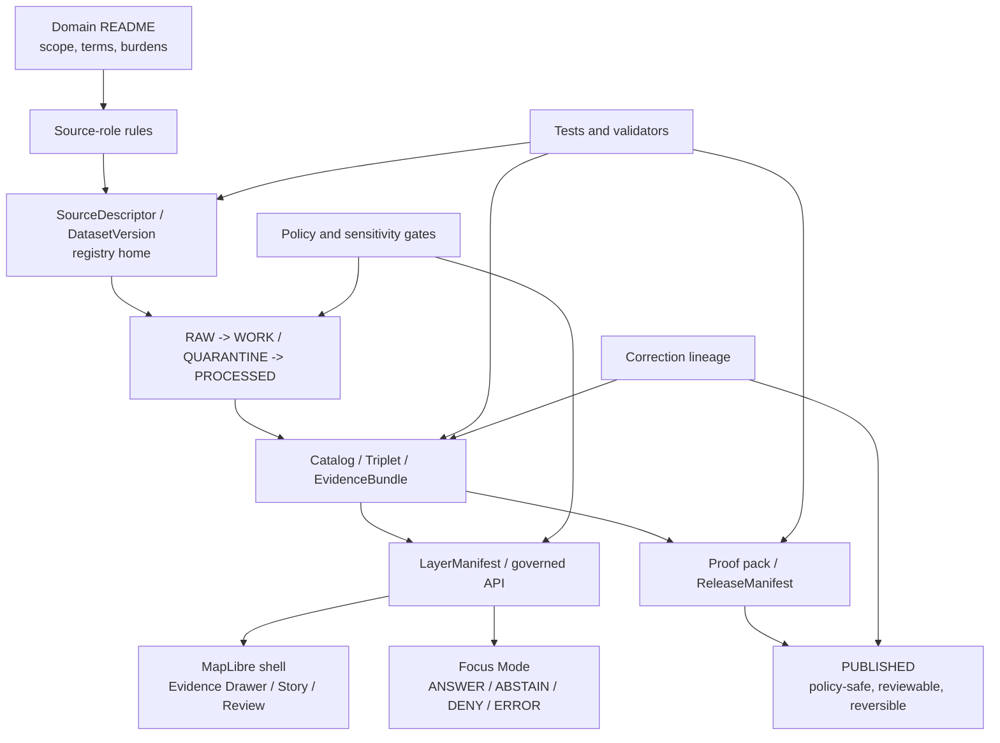

<!-- [KFM_META_BLOCK_V2]
doc_id: kfm://doc/NEEDS-VERIFICATION
title: Domain Lanes
type: standard
version: v1
status: draft
owners: NEEDS-VERIFICATION
created: NEEDS-VERIFICATION
updated: 2026-04-22
policy_label: NEEDS-VERIFICATION
related: [../README.md, ../../README.md, ../architecture/README.md, ../sources/README.md, ../../data/registry/README.md, ../../schemas/README.md, ../../contracts/README.md, ../../policy/README.md, ../../tests/README.md]
tags: [kfm, domains, domain-lanes, evidence, governance, map-first, time-aware]
notes: [doc_id, owners, created, policy_label, and related links require verification in a mounted repository before publication]
[/KFM_META_BLOCK_V2] -->

<a id="top"></a>

# Domain Lanes

Directory landing page for KFM domain documentation: what each lane may claim, what it must prove, and where domain knowledge must not bypass governance.

> [!NOTE]
> **Status:** `experimental`  
> **Owners:** `NEEDS VERIFICATION`  
> **Path:** `docs/domains/README.md`  
> **Repo fit:** domain documentation landing under [`../README.md`](../README.md) and the repository root [`../../README.md`](../../README.md). All downstream lane links are candidate homes until a mounted checkout verifies the tree.
>
> [](#scope)
> [](#scope)
> [](#domain-lifecycle)
> [](#truth-labels-used-here)
> [](#definition-of-done)
> [](#repo-fit)
>
> **Quick jumps:** [Scope](#scope) · [Truth labels](#truth-labels-used-here) · [Repo fit](#repo-fit) · [Accepted inputs](#accepted-inputs) · [Exclusions](#exclusions) · [Directory tree](#directory-tree) · [Domain registry](#domain-lane-registry) · [Lifecycle](#domain-lifecycle) · [Minimum lane README](#minimum-lane-readme-contract) · [Quickstart](#quickstart) · [Diagram](#diagram) · [Definition of done](#definition-of-done) · [FAQ](#faq) · [Appendix](#appendix)

> [!IMPORTANT]
> This README is an orientation and governance entrypoint. It does **not** prove that every listed lane directory, schema, validator, route, workflow, artifact, or runtime behavior exists. Treat implementation-specific links as `PROPOSED` or `NEEDS VERIFICATION` until current repo evidence, tests, workflows, emitted artifacts, or runtime logs verify them.

---

## Scope

`docs/domains/` is where KFM explains **domain lane meaning** before downstream systems ingest, validate, render, summarize, review, or publish that meaning.

A domain lane is a bounded knowledge area with its own vocabulary, source roles, sensitivity burden, evidence expectations, public-release posture, and correction responsibilities. Domain docs should make those constraints inspectable before they become schemas, source descriptors, API payloads, MapLibre layers, Focus answers, Story Nodes, release bundles, or proof objects.

### This README owns

- the domain documentation entrypoint;
- the lane map and lane burden summary;
- minimum expectations for each lane README;
- the boundary between domain documentation and machine/runtime surfaces;
- placeholders that must be resolved before publication.

### This README does not own

- canonical source descriptors;
- machine schemas or OpenAPI contracts;
- policy-as-code;
- raw, work, quarantine, processed, catalog, triplet, or published data;
- proof objects, receipts, release manifests, or catalog entries;
- runtime route behavior;
- UI components or MapLibre layer implementation.

Those surfaces must remain linked, testable, and governed from their appropriate homes.

[Back to top](#top)

---

<a id="truth-labels-used-here"></a>

## Truth labels used here

Use the narrowest truthful label. Do not upgrade a planning statement into implementation fact through confident tone.

| Label | Use in this README |
|---|---|
| `CONFIRMED` | Verified by the supplied draft, attached KFM doctrine, or current-session workspace inspection. |
| `INFERRED` | Strongly implied by KFM doctrine or repeated domain-lane plans, but not verified as current repo implementation. |
| `PROPOSED` | Recommended path, lane, sequence, file, check, or rule that maintainers should verify before landing. |
| `UNKNOWN` | Not verified because the mounted repository, workflows, tests, runtime, dashboards, logs, branch state, or current repo tree were not available. |
| `NEEDS VERIFICATION` | A concrete check must happen before treating the item as current repo fact. |

> [!WARNING]
> Domain docs are allowed to plan. They are not allowed to pretend. If a statement depends on actual files, route names, workflows, source descriptors, policy enforcement, or emitted proof objects, verify it first or label it.

### Evidence posture for this draft

| Evidence class | What it can support here | What it cannot support here |
|---|---|---|
| Supplied Domain Lanes draft | The intended file role, title, KFM meta block shape, section anchors, lane list, lifecycle wording, and review checklist. | Current repository existence of any linked path. |
| Attached KFM doctrine and domain reports | KFM terminology, governance posture, lane burdens, lifecycle, EvidenceBundle priority, UI/AI boundaries, and sensitivity defaults. | Exact current code, package manager, route names, schemas, policies, CI, dashboards, deployments, or branch protections. |
| Mounted repo inspection | Would verify current paths, adjacent docs, actual conventions, tests, and workflows. | `UNKNOWN` until the real checkout is mounted and inspected. |

[Back to top](#top)

---

## Repo fit

| Surface | Relationship | Current posture |
|---|---|---|
| `docs/domains/README.md` | This file. Domain-lane landing, scope router, and review checklist. | `CONFIRMED` as the target encoded by the supplied draft; repo existence still `NEEDS VERIFICATION`. |
| [`../README.md`](../README.md) | Upstream docs landing. Should explain how domain docs fit into the documentation lattice. | Link target `NEEDS VERIFICATION`. |
| [`../../README.md`](../../README.md) | Root repository orientation. Should route maintainers toward current canon, not mixed lineage. | Link target `NEEDS VERIFICATION`. |
| `../architecture/` | Architecture doctrine: truth path, trust membrane, authoritative-vs-derived boundaries, shell law. | `PROPOSED` / `NEEDS VERIFICATION`. |
| `../sources/` | Source admission, source-role discipline, and source descriptor standards. | `PROPOSED` / `NEEDS VERIFICATION`. |
| `../../data/registry/` | Candidate SourceDescriptor and DatasetVersion registry home, if adopted by the repo. | `PROPOSED` / `NEEDS VERIFICATION`. |
| `../../schemas/` and `../../contracts/` | Candidate machine-readable contract/schema homes. Schema-home authority must not drift. | `UNKNOWN` until repo convention is inspected. |
| `../../policy/` | Policy and sensitivity enforcement. | `PROPOSED` / `NEEDS VERIFICATION`. |
| `../../tests/` | Fixtures, contract tests, runtime-proof tests, and no-regression checks. | `PROPOSED` / `NEEDS VERIFICATION`. |
| `./<lane>/README.md` | Downstream lane README pattern. Replace placeholders with actual lane paths only after verification. | `PROPOSED`. |

### Candidate downstream lane homes

These links are orientation targets, not proof that directories currently exist:

[Hydrology](./hydrology/README.md) · [Hazards](./hazards/README.md) · [Soil](./soil/README.md) · [Agriculture](./agriculture/README.md) · [Atmosphere / Air](./atmosphere-air/README.md) · [Geology & Natural Resources](./geology-natural-resources/README.md) · [Flora](./flora/README.md) · [Fauna](./fauna/README.md) · [Habitat](./habitat/README.md) · [Settlements & Infrastructure](./settlements-infrastructure/README.md) · [Roads / Rail / Trade Routes](./roads-rail-trade-routes/README.md) · [Archaeology](./archaeology/README.md) · [People / Genealogy / DNA / Land Ownership](./people-genealogy-dna-land/README.md)

[Back to top](#top)

---

## Accepted inputs

Use `docs/domains/` for domain-specific documentation that answers: **what can this lane responsibly mean in KFM?**

| Input type | Belongs here when it… | Minimum expectation |
|---|---|---|
| Lane README | Orients maintainers to a domain lane. | Scope, repo fit, accepted inputs, exclusions, sensitivity posture, source-role summary, and definition of done. |
| Domain concept note | Defines a lane-specific term, relation, rule, uncertainty, or burden. | Truth labels and source-role assumptions are explicit. |
| Domain source-role guidance | Explains which source types may support which claim types. | Source convenience must not become authority. |
| Sensitivity guidance | Explains redaction, generalization, staged access, delayed release, denial, or steward review. | Fail-closed defaults where rights, sovereignty, privacy, cultural sensitivity, exact locations, or living-person data matter. |
| Domain-to-contract note | Explains meaning before a schema or DTO encodes it. | Links to schemas/contracts only when targets exist or are labeled `PROPOSED`. |
| Domain UI note | Explains Evidence Drawer, layer, Focus, Story, Compare, Review, or Export implications. | UI behavior remains downstream of governed APIs and evidence resolution. |
| Lane release note | Explains what must be validated before public or semi-public release. | Distinguishes receipts, proofs, catalog records, release manifests, and published artifacts. |

[Back to top](#top)

---

## Exclusions

| Does not belong here | Where it should go instead | Why |
|---|---|---|
| RAW, WORK, QUARANTINE, or PROCESSED data files | Data lifecycle directories under `data/`, if present. | Domain docs describe meaning; they do not store governed data. |
| SourceDescriptor records | `data/registry/` or the repo’s verified source-registry home. | Source descriptors are machine/audit objects, not prose-only docs. |
| JSON Schema, OpenAPI, DTOs, or runtime envelopes | `schemas/`, `contracts/`, or verified contract homes. | Machine contracts need validators, fixtures, and version discipline. |
| Rego/OPA policy or equivalent enforcement code | `policy/` and policy tests. | Policy must be executable or testable, not decorative prose. |
| Generated tiles, PMTiles, COGs, GeoParquet, STAC, DCAT, PROV, or release bundles | Catalog, release, or published artifact homes. | Derived artifacts must not replace canonical truth. |
| Model prompts, direct LLM outputs, or chain-of-thought artifacts | Governed AI runtime/receipt surfaces only where policy allows. | AI is interpretive; EvidenceBundle outranks generated language. |
| Live source credentials, API keys, tokens, or private steward contacts | Secrets management or restricted operational runbooks. | Public docs must not leak operational or sensitive access details. |
| Exact sensitive locations by default | Restricted review/stewardship surfaces. | Archaeology, rare species, cultural sites, critical infrastructure, living-person, and DNA contexts fail closed. |

[Back to top](#top)

---

## Directory tree

`PROPOSED` target shape until a mounted checkout confirms the actual tree:

```text
docs/domains/
├── README.md
├── hydrology/
│   └── README.md
├── hazards/
│   └── README.md
├── soil/
│   └── README.md
├── agriculture/
│   └── README.md
├── atmosphere-air/
│   └── README.md
├── geology-natural-resources/
│   └── README.md
├── flora/
│   └── README.md
├── fauna/
│   └── README.md
├── habitat/
│   └── README.md
├── settlements-infrastructure/
│   └── README.md
├── roads-rail-trade-routes/
│   └── README.md
├── archaeology/
│   └── README.md
├── people-genealogy-dna-land/
│   └── README.md
└── _slices/
    └── habitat-fauna/
        └── README.md
```

> [!NOTE]
> `_slices/` is a proposed home for cross-lane proof slices only if the mounted repository adopts that convention. Cross-lane slices must not blur lane ownership, source-role burden, policy posture, or release responsibility.

[Back to top](#top)

---

## Domain lane registry

This registry is an orientation map, not an implementation inventory.

| Lane | Candidate README | Primary burden | Public-release posture |
|---|---|---|---|
| Hydrology | `./hydrology/README.md` | Place/time-rich proof lane; source identity, HUC/crosswalk, observations vs regulatory context. | `PROPOSED` first proof lane. EvidenceRef → EvidenceBundle, source role, time basis, and no silent identity joins. |
| Hazards | `./hazards/README.md` | Hazard history, regulatory context, operational context, model/remote-sensing distinction. | `PROPOSED` second lane after hydrology. KFM is not an emergency alert system; operational feeds are contextual and not for life-safety action. |
| Soil | `./soil/README.md` | Soil units, interpretations, moisture/context watchers, source/derived separation. | `PROPOSED` near-term watcher territory. Keep SSURGO/gSSURGO/SDA-style source roles and derived boundary caveats visible. |
| Agriculture | `./agriculture/README.md` | Crops, land use, agricultural observations, modeled indicators, source rights, soil adjacency. | `PROPOSED` after core schema/source discipline. Do not equate gridded or modeled products with observed field truth. |
| Atmosphere / Air | `./atmosphere-air/README.md` | Air quality, weather, climate, smoke, EO-derived fields, model/observation separation. | `PROPOSED` carefully bounded contextual lane. Claims expose source type, freshness, and knowledge character. |
| Geology & Natural Resources | `./geology-natural-resources/README.md` | Geologic units, stratigraphy, wells/cores, resource estimates, extraction/reclamation context. | `PROPOSED` staged lane. Physical geology, interpretation, resource administration, and production records remain distinct. |
| Flora | `./flora/README.md` | Plant taxa, observations/specimens, rare-plant controls, vegetation surfaces. | `PROPOSED` staged future lane. Rare-location geoprivacy, steward review, and occurrence/model distinction required. |
| Fauna | `./fauna/README.md` | Taxa, occurrence evidence, ranges, seasonal context, disease/mortality, legal/conservation status. | `PROPOSED` staged future lane. Sensitive species protection required; aggregators are not legal-status authorities. |
| Habitat | `./habitat/README.md` | Habitat classes, models, patches, corridors, condition, land-cover context. | `PROPOSED` staged future lane. Habitat/model support is not occurrence truth; public outputs may require generalization. |
| Settlements & Infrastructure | `./settlements-infrastructure/README.md` | Settlements, cities, townsites, infrastructure networks, condition, dependencies. | `PROPOSED` with critical-infrastructure caution. Legal place, historic settlement, facility, operator, condition, and service area remain separate. |
| Roads / Rail / Trade Routes | `./roads-rail-trade-routes/README.md` | Modern and historic movement networks, roads, rail, trade/mobility corridors, restrictions. | `PROPOSED` with sensitivity and uncertainty controls. Route geometry, designation, operator, status, and historical interpretation remain distinct. |
| Archaeology | `./archaeology/README.md` | Sites, features, surveys, remote-sensing candidates, cultural/steward review. | `PROPOSED` high-sensitivity lane. Exact site locations denied by default; remote-sensing anomaly is not confirmed site truth. |
| People / Genealogy / DNA / Land Ownership | `./people-genealogy-dna-land/README.md` | Person assertions, relationships, DNA, land ownership, parcel/title/assessor distinctions. | `PROPOSED` restricted-by-default lane. Living-person and DNA outputs restricted; assessor/tax rows are not title truth. |

### Suggested sequencing posture

| Sequence | Lanes | Why |
|---|---|---|
| First proof path | Hydrology | Public-safe, place/time-rich, evidence-drill-through friendly, and consequential without the heaviest sensitivity burden. |
| Early expansion | Hazards, Soil, Agriculture | Useful after source-role, catalog, proof, and policy gates are exercised by the first lane. |
| Staged expansion | Atmosphere/Air, Geology, Habitat, Flora, Fauna, Settlements, Roads/Rail/Trade, Archaeology, People/Genealogy/DNA/Land | Valuable, but rights, sensitivity, precision, living-person, cultural, critical-infrastructure, or authority burdens are heavier. |

[Back to top](#top)

---

## Domain lifecycle

Every lane must preserve the KFM truth path:

```text
SOURCE EDGE
  -> RAW
  -> WORK / QUARANTINE
  -> PROCESSED
  -> CATALOG / TRIPLET
  -> PUBLISHED
```

Domain docs should explain the lane-specific meaning of each state:

| State | Domain README question |
|---|---|
| `SOURCE EDGE` | What source families may enter this lane, and what source roles can they support? |
| `RAW` | What must be preserved unchanged for audit, rights, reproducibility, or correction? |
| `WORK / QUARANTINE` | What blocks promotion: rights uncertainty, sensitivity, source conflict, malformed identity, stale data, steward review? |
| `PROCESSED` | What transformations are allowed, and how are transforms recorded? |
| `CATALOG / TRIPLET` | What catalog records, relation edges, EvidenceBundle links, review states, and correction references are required? |
| `PUBLISHED` | What public or semi-public artifact is safe, cited, policy-checked, reviewable, reversible, and scoped? |

### Artifact boundaries

| Object family | Domain README stance |
|---|---|
| `SourceDescriptor` | Describes source role and admission posture; lane docs should reference it, not duplicate it. |
| `DatasetVersion` | Records dataset identity/version context where adopted by the repo; lane docs should explain the lane burden, not fake a registry. |
| `EvidenceBundle` | Outranks generated language and map styling; consequential claims must resolve to evidence or abstain. |
| `DecisionEnvelope` / `RuntimeResponseEnvelope` | Captures finite outcomes such as `ANSWER`, `ABSTAIN`, `DENY`, and `ERROR` where runtime surfaces exist. |
| `LayerManifest` | Describes map delivery; it is not canonical truth. |
| `ReleaseManifest` | Records release scope and integrity; promotion is a governed state transition. |
| `run_receipt` / `ai_receipt` | Process memory and audit linkage; not a substitute for proof. |
| `CatalogMatrix` / proof pack | Closes evidence, catalog, release, and rollback paths before publication. |

[Back to top](#top)

---

## Minimum lane README contract

Every lane README should be small enough to review but explicit enough to prevent domain drift.

| Required part | Purpose | Review cue |
|---|---|---|
| Meta block + impact block | Makes ownership, status, placeholders, and repo fit visible. | Unverified owners, dates, labels, and related links remain placeholders. |
| Scope | Defines what the lane may responsibly mean. | Includes boundaries and cross-lane edges. |
| Accepted inputs | Lists what belongs in the lane docs. | Does not confuse docs with data, schema, policy, or runtime homes. |
| Exclusions | Prevents unsafe or duplicate placement. | Names where excluded material should go instead. |
| Source roles | Describes which source types may support which claim types. | Does not turn source convenience into source authority. |
| Sensitivity and release posture | States fail-closed conditions and public-safe transforms. | Covers rights, sovereignty, privacy, cultural sensitivity, precise location exposure, and review burden where relevant. |
| Evidence and proof expectations | Explains EvidenceRef → EvidenceBundle and catalog/proof/release closure. | Requires cite-or-abstain for consequential claims. |
| Validation gates | Lists schema, policy, fixture, review, and release gates. | Links only to verified targets or labels them `PROPOSED` / `NEEDS VERIFICATION`. |
| Correction and rollback | Explains how errors, withdrawals, and supersession are handled. | Keeps correction lineage visible. |

[Back to top](#top)

---

## Quickstart

Use this only after mounting the actual repository.

1. Verify checkout and branch state.
2. Inspect existing lane docs before adding a new lane.
3. Preserve strong existing material; do not replace it with generic prose.
4. Add or update lane docs with the KFM meta block and impact block.
5. Link to contracts, schemas, source descriptors, policies, tests, and artifacts only when they exist or are explicitly labeled `PROPOSED`.
6. Add fixtures, validators, or policy links in the proper homes, not inside prose docs.
7. Keep all public claims cite-or-abstain and policy-visible.

```bash
# Read-only inspection from the repository root.
git status --short
git branch --show-current
find docs/domains -maxdepth 3 -type f | sort
find schemas contracts policy data tests -maxdepth 3 -type f 2>/dev/null | sort | sed -n '1,160p'
```

```bash
# Non-destructive lane setup after verifying the lane does not already exist.
mkdir -p docs/domains/<lane>
touch docs/domains/<lane>/README.md
```

> [!CAUTION]
> Do not create parallel schema or contract homes to satisfy a lane README. If `contracts/` versus `schemas/contracts/` authority is unresolved, create or update an ADR before adding machine-readable definitions.

[Back to top](#top)

---

## Usage

### When editing this README

Edit `docs/domains/README.md` when the lane map, shared domain documentation rules, domain sequencing, or directory-wide review gates change.

### When editing a lane README

Edit `docs/domains/<lane>/README.md` when the domain’s scope, source roles, sensitivities, accepted inputs, exclusions, validation gates, correction posture, or public-release burden changes.

### When editing contracts, schemas, policy, data, or runtime code

Do not hide those changes in domain prose. Update the proper machine or runtime surface and link back here only after verification.

| Change | Update domain docs? | Update elsewhere? |
|---|---:|---|
| New source family admitted | Yes | Source registry, SourceDescriptor, tests, policy if needed. |
| New public layer | Yes | LayerManifest, catalog record, Evidence Drawer payload, UI docs. |
| New runtime answer shape | Usually | Contracts, schema, runtime tests, Focus/Evidence Drawer docs. |
| New sensitivity rule | Yes | Policy, fixtures, validator tests, release gate docs. |
| New correction or rollback path | Yes | Runbook, proof objects, ReleaseManifest, catalog/review docs. |

[Back to top](#top)

---

## Diagram


```mermaid
flowchart TD
    A[Domain README<br/>scope, terms, burdens] --> B[Source-role rules]
    B --> C[SourceDescriptor / DatasetVersion<br/>registry home]
    C --> D[RAW -> WORK / QUARANTINE -> PROCESSED]
    D --> E[Catalog / Triplet / EvidenceBundle]
    E --> F[LayerManifest / governed API]
    F --> G[MapLibre shell<br/>Evidence Drawer / Story / Review]
    F --> H[Focus Mode<br/>ANSWER / ABSTAIN / DENY / ERROR]
    E --> I[Proof pack / ReleaseManifest]
    I --> J[PUBLISHED<br/>policy-safe, reviewable, reversible]

    K[Policy and sensitivity gates] --> D
    K --> F
    L[Tests and validators] --> C
    L --> E
    L --> I
    M[Correction lineage] --> E
    M --> J
```

[Back to top](#top)

---

## Anti-collapse rules

| Do not collapse… | Because… | Safe posture |
|---|---|---|
| Map layer into truth | Styling and tiles are derived surfaces. | Link layer back to catalog, EvidenceBundle, and release state. |
| Graph edge into canonical record | Graphs are useful projections, not sovereign truth. | Preserve source record, relation evidence, uncertainty, and correction lineage. |
| AI answer into evidence | Generated text is interpretive. | Require evidence resolution, citation validation, policy checks, and finite outcomes. |
| Public layer into public right | Visibility and rights are separate. | Publish only when rights, sensitivity, review, and release state allow. |
| Assessor/tax record into title truth | Administrative records may not prove legal ownership. | Label source role and claim scope. |
| Remote-sensing candidate into confirmed site/species/event | Detection is not confirmation. | Preserve candidate status and review requirement. |
| Regulatory hazard area into observed event | Regulation, model, and observation differ. | Label knowledge character and time basis. |
| Exact sensitive location into public geometry | Exposure can create harm. | Generalize, suppress, delay, restrict, or deny. |

[Back to top](#top)

---

## Definition of done

A domain lane README is ready for review when:

- [ ] KFM meta block is present and unresolved fields are explicit.
- [ ] Status, owners, badges, and quick jumps are visible near the top.
- [ ] Scope is specific enough to prevent domain drift.
- [ ] Accepted inputs and exclusions are explicit.
- [ ] Repo fit identifies upstream and downstream surfaces.
- [ ] Source-role discipline is stated.
- [ ] Sensitivity, rights, sovereignty, privacy, cultural sensitivity, and exact-location risks are addressed where relevant.
- [ ] The lane distinguishes canonical records from derived tiles, summaries, graph edges, indexes, scenes, embeddings, and model outputs.
- [ ] The lane explains EvidenceRef → EvidenceBundle expectations.
- [ ] Public-facing claims are cite-or-abstain.
- [ ] AI and Focus Mode are downstream of governed evidence and policy.
- [ ] Review, correction, rollback, withdrawal, and supersession implications are visible.
- [ ] Links to schemas, contracts, policies, fixtures, workflows, APIs, and artifacts are either verified or labeled `PROPOSED` / `NEEDS VERIFICATION`.
- [ ] No claim says “the system does X” without current implementation evidence.

[Back to top](#top)

---

## FAQ

### Can a domain README publish a source?

No. A domain README can explain source-role expectations and link to a source descriptor, but source admission belongs in the verified source-registry process.

### Can a domain lane use AI?

Yes, but only as bounded interpretation over admissible released evidence. AI must not read RAW, WORK, QUARANTINE, unpublished candidates, or canonical/internal stores directly.

### Can a tile, graph, or summary become the lane’s canonical truth?

No. Tiles, graphs, summaries, indexes, scenes, and embeddings are rebuildable derivatives. They may help users inspect evidence; they must not silently replace it.

### What happens when source rights or sensitivity are unclear?

Default to quarantine, redaction, generalization, staged access, delayed publication, or denial. Record the transform and reason so correction and rollback remain possible.

### What should a maintainer do when the repo already has a conflicting lane path?

Preserve the existing material, add a migration note or ADR, and avoid duplicate homes. Backward compatibility is preferred, but documented and validated breaking changes are acceptable.

[Back to top](#top)

---

## Appendix

<details>
<summary>Lane README starter shape</summary>

```md
<!-- [KFM_META_BLOCK_V2]
doc_id: kfm://doc/NEEDS-VERIFICATION
title: <Lane Title>
type: standard
version: v1
status: draft
owners: NEEDS-VERIFICATION
created: NEEDS-VERIFICATION
updated: YYYY-MM-DD
policy_label: NEEDS-VERIFICATION
related: [../README.md]
tags: [kfm, domains, <lane>]
notes: [replace placeholders after repo inspection]
[/KFM_META_BLOCK_V2] -->

# <Lane Title>

One-line purpose for this lane.

> [!NOTE]
> **Status:** `experimental`  
> **Owners:** `NEEDS VERIFICATION`  
> **Path:** `docs/domains/<lane>/README.md`  
>
> [](#scope)
> [](#scope)
> **Quick jumps:** [Scope](#scope) · [Repo fit](#repo-fit) · [Inputs](#accepted-inputs) · [Exclusions](#exclusions)

## Scope

## Repo fit

## Accepted inputs

## Exclusions

## Source roles

## Sensitivity and release posture

## Evidence and proof expectations

## Validation gates

## Definition of done
```

</details>

<details>
<summary>Glossary for domain docs</summary>

| Term | Working meaning |
|---|---|
| Inspectable claim | A public-facing statement reconstructable to evidence, spatial/temporal scope, source role, policy posture, review state, release state, and correction lineage. |
| Domain lane | Bounded knowledge area with its own burden profile and evidence rules. |
| Source role | What a source is allowed to support: observation, regulatory context, model, documentary support, candidate detection, legal authority, etc. |
| Knowledge character | Whether a claim is observed, documentary, modeled, derived, generalized, source-dependent, or review-dependent. |
| Trust membrane | Governed boundary between internal/canonical stores and public or role-limited surfaces. |
| Evidence Drawer | Trust-visible UI surface that exposes support, freshness, rights/sensitivity posture, review state, and correction lineage. |
| Focus Mode | Evidence-bounded synthesis surface inside the governed shell, not a detached assistant. |
| Promotion | Governed state transition into public or semi-public release, not a file move. |
| Redaction/generalization | Policy-aware transform that reduces exposure while preserving reviewable provenance. |

</details>

<details>
<summary>Pre-publication verification notes</summary>

Before publication, verify:

- actual location of `docs/domains/README.md`;
- adjacent docs conventions and ownership markers;
- whether `docs/domains/` or another lane home already exists;
- schema authority between `schemas/`, `contracts/`, or any repo-native alternative;
- source registry home and SourceDescriptor naming;
- policy home and policy test conventions;
- EvidenceBundle, ReleaseManifest, LayerManifest, proof pack, and receipt schema homes;
- UI route/component names for Evidence Drawer, Focus Mode, Story, Review, Compare, and Export;
- CI workflows and required documentation checks.

</details>

[Back to top](#top)
