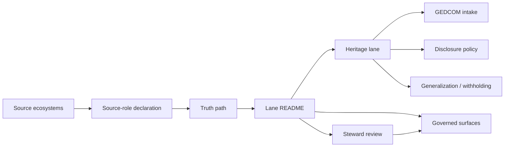

<!--
doc_id: kfm://doc/<uuid-NEEDS-VERIFICATION>
title: Kansas Frontier Matrix — Domains
type: standard
version: v1
status: draft
owners: [@bartytime4life, NEEDS VERIFICATION]
created: NEEDS VERIFICATION
updated: 2026-04-02
policy_label: public
related: [
  ../../README.md,
  ../reports/readme-structure-reconciliation.md,
  ../soil/README.md,
  docs/domains/heritage/README.md,
  docs/domains/heritage/gedcom-intake-mapping.md,
  docs/domains/heritage/fixtures/README.md,
  docs/domains/heritage/examples/README.md
]
tags: [kfm, domains, source-atlas, heritage, governance]
notes: [
  "Updated to introduce Heritage lane and align with new GEDCOM intake, fixtures, and examples standards.",
  "Original structure preserved; additions are minimally invasive.",
  "All new paths and lane placement remain NEEDS VERIFICATION."
]
-->

# Kansas Frontier Matrix — Domains

Authoritative landing page for Kansas operating lanes, source ecosystems, and domain-specific publication burden.

> [!NOTE]
> **Status:** experimental  
> **Owners:** NEEDS VERIFICATION  
> 
> 
> 
>   
> **Quick jumps:** [Scope](#scope) · [Repo fit](#repo-fit) · [Inputs](#inputs) · [Exclusions](#exclusions) · [Directory tree](#directory-tree) · [Quickstart](#quickstart) · [Usage](#usage) · [Diagram](#diagram) · [Tables](#tables) · [Task list](#task-list) · [FAQ](#faq) · [Appendix](#appendix)

> [!IMPORTANT]
> This README is a **navigation, boundary, and burden** document for domain documentation. It should help maintainers choose the right lane, preserve source-role discipline, and keep publication obligations visible.

---

## Scope (UPDATED — heritage integration)

KFM treats Kansas domains as **operating lanes**, not decorative themes.

A lane changes:

- admissible evidence,
- source-role combinations,
- time/support requirements,
- rights and sensitivity burdens,
- what can safely be published.

### New addition: Heritage lane

The **heritage lane** formalizes handling of:

- genealogy and family-history exports,
- archival and documentary materials,
- cemetery and memorial records,
- oral-history supporting datasets,
- migration and settlement traces.

This lane introduces **additional exposure risk** because:

- living and deceased records may coexist,
- place precision may reveal sensitive locations,
- identity inference risks are higher,
- consent and revocation must be respected.

Heritage therefore operates under a **stricter default posture**:

- generalized by default,
- exact detail gated or withheld,
- correction and revocation visible,
- evidence required for consequential claims.

> [!IMPORTANT]
> Heritage is not just another data domain — it is a **governed disclosure domain**.

---

## Repo fit

| Item | Value |
|---|---|
| Target path | `docs/domains/README.md` |
| Role | Root index for domain lanes |
| New lane | `docs/domains/heritage/` *(PROPOSED / NEEDS VERIFICATION)* |
| Companion docs | Heritage README, GEDCOM mapping, fixtures, examples |
| Verification state | NEEDS VERIFICATION |

---

## Inputs

*(unchanged — still valid)*

---

## Exclusions (UPDATED)

Add to exclusions:

| This does **not** belong here | Why |
|---|---|
| Raw genealogy exports without governance mapping | must go through heritage intake standard |
| Exact heritage locations in public context | geoprivacy risk |
| Living-person detail exposure | violates stewardship-first posture |

---

## Directory tree (UPDATED)

```text
docs/
└── domains/
    ├── README.md
    ├── history-mobility/
    ├── settlement-services/
    ├── land-tenure/
    ├── archives-heritage/          # legacy or alternate
    ├── heritage/                   # NEW (PROPOSED)
    │   ├── README.md
    │   ├── gedcom-intake-mapping.md
    │   ├── fixtures/
    │   │   └── README.md
    │   └── examples/
    │       └── README.md
    ├── hydrology/
    ├── hazards/
    ├── agriculture/
    ├── transport/
    ├── ecology/
    ├── atmosphere/
    └── dossiers/
```

> [!NOTE]
> `archives-heritage/` may remain during transition. Final naming **NEEDS VERIFICATION**.

---

## Quickstart (UPDATED)

Add step:

```text
6. If working with genealogy or archival identity-linked data → use Heritage lane.
```

---

## Usage (UPDATED)

### New rule — heritage routing

Use the heritage lane when:

- data contains person-linked historical records,
- place precision could expose sensitive sites,
- identity inference is possible,
- consent or revocation may apply.

Do **not** place such material in:

- generic archives,
- land tenure,
- ecology,
- or general history lanes.

---

## Diagram (UPDATED)


```mermaid
flowchart LR
    A[Source ecosystems] --> B[Source-role declaration]
    B --> C[Truth path]
    C --> D[Lane README]

    D --> H[Heritage lane]
    H --> H1[GEDCOM intake]
    H --> H2[Disclosure policy]
    H --> H3[Generalization / withholding]

    D --> E[Governed surfaces]
    D --> F[Steward review]
    F --> E
```

---

## Tables (UPDATED)

### Lane burden registry (addition)

| Lane family | What belongs here | First safe output | Key caution |
|---|---|---|---|
| **Heritage** | genealogy, archives, cemetery, oral history | generalized place/time records | identity, consent, geoprivacy |

---

### Cross-lane couplings (addition)

| Coupling | Why |
|---|---|
| **Heritage ↔ land tenure** | deeds, ownership, family linkage |
| **Heritage ↔ archives** | documentary evidence |
| **Heritage ↔ settlement** | population and migration context |
| **Heritage ↔ ecology** | sensitive cultural sites and species overlap |

---

## Task list (UPDATED)

- [ ] integrate heritage lane into domain index
- [ ] verify `archives-heritage` vs `heritage` naming decision
- [ ] link all four heritage docs
- [ ] ensure geoprivacy rules referenced consistently
- [ ] confirm CI fixtures alignment
- [ ] confirm no public surfaces bypass heritage mapping

---

## FAQ (UPDATED)

### Why is heritage separate from archives?

Archives describe **documents**.  
Heritage governs **exposure of people + place + time relationships**.

### Why is heritage stricter than other lanes?

Because it combines:

- identity,
- location,
- time,
- relationships.

That combination increases re-identification and sensitivity risk.

### Can heritage data be public?

Yes — but usually **generalized**, not raw.

---

## Appendix (UPDATED)

Add:

### Heritage integration notes

- Introduced GEDCOM intake standard
- Introduced fixture-based enforcement
- Introduced public-safe rendering examples
- Requires geoprivacy-first behavior
- Requires visible correction + revocation handling

---

[Back to top](#kansas-frontier-matrix--domains)
