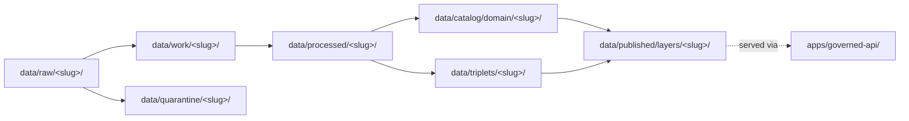

# docs/domains

> Human-facing landing for every KFM domain. Each subfolder is the **doctrine, scope, status, and verification index** for one domain — its boundary, sources, lifecycle posture, sensitivity rules, validation state, and open questions. Machine truth, schemas, code, fixtures, policy, and release decisions live elsewhere.

<p>
  
  
  
  
  
</p>

| Owners | Reviewers | Trust posture | Lifecycle target |
|---|---|---|---|
| Docs steward + each named domain steward | Docs steward + at least one domain steward; ADR for §2.4 changes | Doctrine and indexes only — never canonical truth | RAW → WORK / QUARANTINE → PROCESSED → CATALOG / TRIPLET → PUBLISHED |

**Quick jumps:**
[Purpose](#purpose) ·
[Authority level](#authority-level) ·
[Status](#status) ·
[What belongs here](#what-belongs-here) ·
[What does NOT belong here](#what-does-not-belong-here) ·
[Domain Placement Law](#domain-placement-law-recap-of-directory-rules-12) ·
[Domain inventory](#domain-inventory) ·
[Per-domain landing pattern](#per-domain-landing-pattern) ·
[Inputs](#inputs) ·
[Outputs](#outputs) ·
[Validation](#validation) ·
[Review burden](#review-burden) ·
[Related folders](#related-folders) ·
[ADRs](#adrs) ·
[Last reviewed](#last-reviewed)

> [!IMPORTANT]
> A page in `docs/domains/<slug>/` **explains** a domain. It does not **decide** for it. Object meaning lives in `contracts/`, machine shape in `schemas/`, admissibility in `policy/`, lifecycle data in `data/`, and release decisions in `release/`. If a `docs/domains/` page is being cited as the canonical source of a release, schema, or policy decision, that is the **"documentation as truth"** anti-pattern (Directory Rules §13.5) — promote the decision to an ADR or a `control_plane/` register instead.

---

## Purpose

`docs/domains/` is the human-readable lane index for KFM domains. It is the front door a reader uses to understand a domain's scope, boundary, sources, lifecycle posture, sensitivity rules, validation state, ADRs, and open verification work — and to navigate from there into the schemas, contracts, policy, tests, fixtures, code, data, and release artifacts that actually carry truth.

It exists so a domain can grow without fragmenting the lifecycle: every domain's *responsibility-bearing* files live in segments under their proper responsibility roots (`contracts/domains/<slug>/`, `schemas/contracts/v1/domains/<slug>/`, `policy/domains/<slug>/`, `data/<phase>/<slug>/`, …), while this folder remains the stable, doctrinal landing for each lane.

---

## Authority level

**Canonical** — sub-folder of the canonical `docs/` root.
The contents of each `docs/domains/<slug>/` subtree are themselves **doctrine and lineage**, not machine authority. Per Directory Rules §15, every canonical and compatibility root MUST carry a README that meets the §15 contract; this file plays that role for `docs/domains/`.

---

## Status

**PROPOSED** until verified against mounted-repo evidence.

| Aspect | Truth label | Notes |
|---|---|---|
| Domain Placement Law (Directory Rules §12) as governing pattern for this folder | **CONFIRMED** doctrine | Defined in `directory-rules.md` §12 (this session). |
| Required README contract (Directory Rules §15) | **CONFIRMED** doctrine | Defined in `directory-rules.md` §15 (this session). |
| Presence and completeness of any specific `docs/domains/<slug>/` subtree | **PROPOSED / NEEDS VERIFICATION** | Repo not mounted in this session; per-domain dossiers (atmosphere, hazards, flora, soil, hydrology, fauna, habitat, agriculture, archaeology, settlements, roads, geology, people-dna-land) describe planned landings, not verified repo state. |
| Slug spelling for multi-word domains (e.g., `roads-rail-trade` vs `transport`, `habitat_fauna` vs `habitat-fauna`) | **CONFLICTED / NEEDS VERIFICATION** | §12 of Directory Rules names hyphenated slugs; some domain dossiers use underscored or shortened variants. Resolve by ADR after repo inspection. |

---

## What belongs here

A `docs/domains/<slug>/` subfolder accepts:

- **Domain landing page** (`README.md`) — scope, boundary, sources, status, quick links into the rest of the lane.
- **Architecture documents** — end-to-end lane architecture, data flow, trust path, intake-and-promotion rules, rollback/correction rules.
- **Indexes** — source registry, schema index, validator index, fixture index, file/folder map, parameter registry (where applicable).
- **Lineage and migration documents** — preservation ledger, migration history, release lineage, compatibility matrix, supersession notes.
- **Review artifacts** — changelog, verification backlog, open questions, generated-artifact rules, change-surfaces matrix.
- **Per-domain ADRs** — ADRs whose scope is internal to one domain lane (e.g., a domain-specific schema-home, source-role split, or sensitive-location policy decision).
- **Sensitivity, rights, and publication notes** — narrative explanation of restricted content, generalization, and public-safe rules. *Decisions* still live in `policy/`; this folder explains them.
- **Roadmaps, expansion backlogs, idea intakes, glossaries** — domain-scoped planning material that has been promoted past the exploratory stage.

Slugs **MUST** match the canonical domain segment used uniformly across the responsibility roots. Per Directory Rules §12, the current canonical slugs are:

```
hydrology, soil, fauna, flora, habitat, geology, atmosphere,
roads-rail-trade, settlements-infrastructure, archaeology,
hazards, agriculture, people-dna-land
```

…and any new domain admitted by ADR.

---

## What does NOT belong here

`docs/domains/` is **not** a parallel home for canonical objects. The following must live elsewhere — even when they are clearly "about" one domain.

| You have… | It does NOT belong here. It belongs under… |
|---|---|
| Object meaning (semantic Markdown for a domain object family) | `contracts/domains/<slug>/` |
| Machine-checkable shape (JSON Schema, JSON-LD context) | `schemas/contracts/v1/domains/<slug>/` |
| Admissibility, allow/deny/restrict/abstain logic | `policy/domains/<slug>/` |
| Tests proving a rule is enforceable | `tests/domains/<slug>/` |
| Golden, valid, or invalid sample data | `fixtures/domains/<slug>/` |
| Domain library code | `packages/domains/<slug>/` |
| Executable pipeline logic | `pipelines/domains/<slug>/` |
| Declarative pipeline configuration | `pipeline_specs/<slug>/` |
| Source-specific fetcher/admitter | `connectors/...` (output → `data/raw/<slug>/` or `data/quarantine/<slug>/`) |
| Lifecycle data (raw, work, quarantine, processed, catalog, triplets, published) | `data/<phase>/<slug>/` |
| Source / dataset registries, verification backlogs (machine) | `data/registry/sources/<slug>/`, `data/registry/<slug>/` |
| Release decisions, manifests, rollback cards | `release/candidates/<slug>/`, `release/...` |
| Receipts, proof packs, evidence bundles | `data/receipts/`, `data/proofs/` |
| Cross-domain doctrine (e.g., shared geometry validation, shared time model) | `docs/architecture/<topic>.md` (Directory Rules §12, "Multi-domain and cross-cutting files") |
| Repo-wide doctrine (truth posture, trust membrane, lifecycle law, authority ladder) | `docs/doctrine/` |
| Repo-wide ADRs (those amending Directory Rules itself, schema-home authority, etc.) | `docs/adr/` |

> [!CAUTION]
> **Common drift to refuse on review:** a folder named `docs/domains/<slug>/` that contains JSON Schemas, OPA bundles, fixtures, release manifests, evidence bundles, run receipts, or pipeline code. That is Directory Rules §13.4 (domain-as-root fragmenting the lifecycle) reappearing inside `docs/`. Move the file to its proper responsibility root and leave only an *index entry* behind.

---

## Domain Placement Law (recap of Directory Rules §12)

A domain MUST NOT become a root folder. Every domain expresses itself as a **segment** inside the proper responsibility root. `docs/domains/<slug>/` is the doctrinal apex of that lane, but it is one segment among many — not the trunk.


```mermaid
flowchart LR
  subgraph LANE["Domain lane &lt;slug&gt; — segments inside responsibility roots"]
    direction TB
    DOCS["docs/domains/&lt;slug&gt;/<br/><i>this folder — doctrine + index</i>"]
    CONTRACTS["contracts/domains/&lt;slug&gt;/<br/>object meaning"]
    SCHEMAS["schemas/contracts/v1/domains/&lt;slug&gt;/<br/>machine shape"]
    POLICY["policy/domains/&lt;slug&gt;/<br/>admissibility"]
    TESTS["tests/domains/&lt;slug&gt;/<br/>enforceability"]
    FIXTURES["fixtures/domains/&lt;slug&gt;/<br/>golden inputs"]
    PACKAGES["packages/domains/&lt;slug&gt;/<br/>shared code"]
    PIPELINES["pipelines/domains/&lt;slug&gt;/<br/>execution"]
    PSPECS["pipeline_specs/&lt;slug&gt;/<br/>declarative config"]
    DATA["data/&lt;phase&gt;/&lt;slug&gt;/<br/>lifecycle data"]
    REGISTRY["data/registry/sources/&lt;slug&gt;/<br/>source registry"]
    RELEASE["release/candidates/&lt;slug&gt;/<br/>release decisions"]
  end

  DOCS -. indexes .-> CONTRACTS
  DOCS -. indexes .-> SCHEMAS
  DOCS -. indexes .-> POLICY
  DOCS -. indexes .-> TESTS
  DOCS -. indexes .-> FIXTURES
  DOCS -. indexes .-> PACKAGES
  DOCS -. indexes .-> PIPELINES
  DOCS -. indexes .-> PSPECS
  DOCS -. indexes .-> DATA
  DOCS -. indexes .-> REGISTRY
  DOCS -. indexes .-> RELEASE
```

**Lifecycle invariant** (Directory Rules §0): promotion across phases is a **governed state transition, not a file move**. `docs/domains/<slug>/` describes the trust path; it does not perform it.


```mermaid
flowchart LR
  RAW["data/raw/&lt;slug&gt;/"] --> WORK["data/work/&lt;slug&gt;/"]
  RAW --> QUAR["data/quarantine/&lt;slug&gt;/"]
  WORK --> PROC["data/processed/&lt;slug&gt;/"]
  PROC --> CAT["data/catalog/domain/&lt;slug&gt;/"]
  PROC --> TRIP["data/triplets/&lt;slug&gt;/"]
  CAT --> PUB["data/published/layers/&lt;slug&gt;/"]
  TRIP --> PUB
  PUB -. served via .-> API["apps/governed-api/"]
```

> [!NOTE]
> The `data/triplets/` segment uses the plural form per Directory Rules §18 (open question, but plural is the document's working choice). NEEDS VERIFICATION against repo state.

### Cross-domain and cross-cutting files

Files that legitimately span multiple domains belong under the lowest common responsibility root *without* a domain segment, per Directory Rules §12:

- Shared validator → `tools/validators/<topic>/...` (not `docs/domains/<picked-one>/`).
- Cross-domain schema → `schemas/contracts/v1/<topic>/...`.
- Cross-domain doctrine → `docs/architecture/<topic>.md`.

A pull request that puts a multi-domain file under one domain's segment "because it has to go somewhere" should be redirected on review.

---

## Domain inventory

The following table reflects the canonical slugs from **Directory Rules §12** and the doctrinal status that the KFM corpus assigns each domain. **Implementation maturity for every domain is PROPOSED until verified against a mounted repository.** Path columns describe where each domain *should* land per Domain Placement Law; their presence in the repo is **NEEDS VERIFICATION**.

| Slug | Domain | Doctrinal status | Lane README path | Notes |
|---|---|---|---|---|
| `hydrology` | Hydrology | CONFIRMED doctrine / PROPOSED implementation | `docs/domains/hydrology/README.md` | Watershed, HUC, gauge, flow/level, water quality, NFHL contextual overlay. Must not collapse regulatory zones, observed inundation, forecasts, and warnings. |
| `soil` | Soil | CONFIRMED doctrine / PROPOSED implementation | `docs/domains/soil/README.md` | SSURGO/gSSURGO map units, components, horizons, properties, HSG, suitability, soil moisture. |
| `fauna` | Fauna | CONFIRMED doctrine / PROPOSED implementation | `docs/domains/fauna/README.md` | Sensitive-location redaction is a hard rule; public layers must carry redaction receipts. |
| `flora` | Flora | CONFIRMED doctrine / PROPOSED implementation | `docs/domains/flora/README.md` | Rare-plant generalization required; specimen/occurrence/community/phenology objects. |
| `habitat` | Habitat | CONFIRMED doctrine / PROPOSED implementation | `docs/domains/habitat/README.md` | Patch, suitability, connectivity, corridor, model run receipts, uncertainty surfaces. |
| `geology` | Geology and Natural Resources | CONFIRMED doctrine / PROPOSED implementation | `docs/domains/geology/README.md` | KGS/USGS units, boreholes, geophysics; cross-section/3D only with representation receipts. |
| `atmosphere` | Atmosphere, Air, and Climate | CONFIRMED doctrine / PROPOSED implementation | `docs/domains/atmosphere/README.md` | Per-domain dossier proposes ~24 lane files including UNIT_CONVERSIONS.md and FOCUS_DRAWER_PAYLOADS.md. |
| `roads-rail-trade` | Roads, Rail, and Trade Routes | CONFIRMED doctrine / PROPOSED implementation | `docs/domains/roads-rail-trade/README.md` | Slug variants seen in lineage (`transport/`) — NEEDS VERIFICATION; resolve by ADR. |
| `settlements-infrastructure` | Settlements, Cities, and Infrastructure | CONFIRMED doctrine / PROPOSED implementation | `docs/domains/settlements-infrastructure/README.md` | Annexation, place identity, infrastructure operator records — sensitivity considerations apply. |
| `archaeology` | Archaeology and Cultural Heritage | CONFIRMED doctrine / PROPOSED implementation | `docs/domains/archaeology/README.md` | Steward/tribal review required; precise locations restricted; public products are generalized/suppressed. |
| `hazards` | Hazards | CONFIRMED doctrine / PROPOSED implementation | `docs/domains/hazards/README.md` | Non-emergency posture; NWS warnings are contextual-only until contextual-only enforcement is verified. |
| `agriculture` | Agriculture | CONFIRMED doctrine / PROPOSED implementation | `docs/domains/agriculture/README.md` | Field-level detail denied by default; aggregate to county/HUC unless rights permit. |
| `people-dna-land` | People, Genealogy, DNA, and Land Ownership | CONFIRMED doctrine / PROPOSED implementation | `docs/domains/people-dna-land/README.md` | DNA / living-person inference behind strict restricted policy; assessor records must not be equated with title truth. |

### Documented in the encyclopedia, **not** in §12

These appear in the KFM Domain and Capability Encyclopedia but are **not** listed as canonical domain slugs in Directory Rules §12. Their placement is **OPEN / NEEDS VERIFICATION**:

| Encyclopedia name | Likely placement | Status |
|---|---|---|
| Spatial Foundation, Cartography, Reference Systems | `docs/architecture/spatial-foundation.md` (cross-domain) — **PROPOSED** | Generally cross-domain; does not own any one domain's truth. |
| Frontier Demography, Economy, Settlement, Land, and Time Matrix | `docs/domains/frontier-matrix/` — **PROPOSED**; admit by ADR | Crosses settlements, agriculture, people-land — composition lane, not a base lane. |
| Planetary, 3D, Digital Twin, and Synthetic Spatial Systems | `docs/architecture/planetary-3d.md` or `docs/domains/planetary-3d/` — **PROPOSED**; admit by ADR | Owns representation rules, not domain truth. |

> [!NOTE]
> The doctrinal-status text in the inventory paraphrases the KFM Domain and Capability Encyclopedia v0.1 master domain atlas. It is **CONFIRMED doctrine** as recorded in that document; it is **PROPOSED implementation** because no mounted repository is available in this session.

---

## Per-domain landing pattern

Each `docs/domains/<slug>/` subtree should be the readable index for the lane. The exact filename set is **per-domain** and varies in the corpus (the atmosphere, hazards, flora, hydrology, and habitat-fauna dossiers each propose slightly different sets), but the pattern below is a **common minimum** plus widely repeated additions. **Adopt the subset that fits the lane; do not pad.**

```text
docs/domains/<slug>/
├── README.md                           # landing: scope, boundary, status, quick links
├── ARCHITECTURE.md                     # end-to-end lane architecture and trust path
├── FILE_MAP.md                         # path-by-path file/folder map (a.k.a. FILE_MANIFEST.md)
├── SOURCE_INDEX.md                     # human source registry (machine registry → data/registry/)
├── SCHEMA_INDEX.md                     # index of schemas in schemas/contracts/v1/domains/<slug>/
├── VALIDATOR_INDEX.md                  # index of validators in tools/validators/ touching this lane
├── FIXTURE_INDEX.md                    # index of fixtures in fixtures/domains/<slug>/
├── INTAKE_AND_PROMOTION_RULES.md       # source intake, promotion, abstain/deny/error
├── ROLLBACK_AND_CORRECTION.md          # rollback receipts, correction notices, supersession
├── PUBLICATION_AND_POLICY.md           # rights, sensitivity, public-safe publication rules
├── UI_AND_EVIDENCE_DRAWER.md           # MapLibre / Evidence Drawer / Focus Mode payload notes
├── CHANGELOG.md                        # human change log
├── MIGRATIONS.md                       # schema/data/document migrations (a.k.a. MIGRATION_HISTORY.md)
├── RELEASE_LINEAGE.md                  # release lineage and supersession state
├── VERIFICATION_BACKLOG.md             # open verification items with owners and closure criteria
├── OPEN_QUESTIONS.md                   # unresolved authority/scope questions
├── GLOSSARY.md                         # domain + KFM-governance vocabulary
└── ADR-XXXX-<topic>.md                 # per-domain ADRs (alternate home: docs/adr/)
```

> [!TIP]
> The names above mirror the patterns in the attached domain dossiers (`atmosphere`, `hazards`, `flora`, `hydrology`, `habitat`, `roads-rail-trade`, `agriculture`, `archaeology`, `settlements-infrastructure`, `people-dna-land`, etc.). Filenames are **PROPOSED** until each domain README confirms its chosen set; cross-domain consistency is preferred but not enforced by §15.

### Authoring rules for files in this folder

1. **One canonical home per accepted idea.** An accepted lane decision lives in exactly one document per domain and is referenced from `README.md`. Exploratory notes do not self-promote into canon (per the documentation control-plane rule cited across multiple domain dossiers).
2. **Doctrinal apex, not machine truth.** No JSON Schema, OPA bundle, fixture, manifest, receipt, or proof object lives here. Index them; do not host them.
3. **Stable anchors.** Existing internal anchors and link targets in lane docs should be preserved on revision unless a change is clearly worth the breakage; otherwise note likely anchor breakage in the same PR.
4. **Truth labels.** Lane documents use the same labels as the rest of the corpus: CONFIRMED · INFERRED · PROPOSED · UNKNOWN · NEEDS VERIFICATION · CONFLICTED.

---

## Inputs

- KFM doctrine: Directory Rules, lifecycle law, truth posture, trust membrane, authority ladder, governed-AI doctrine, publication-rights-sensitivity doctrine.
- Per-domain architecture dossiers and blueprints (atmosphere, hazards, flora, hydrology, habitat, fauna, soil, agriculture, archaeology, settlements-infrastructure, roads-rail-trade, geology, people-dna-land).
- Accepted ADRs touching domain placement, schema home, source roles, sensitivity, and release.
- Per-root READMEs for `contracts/`, `schemas/`, `policy/`, `data/`, `release/`, and `tests/` — referenced, not duplicated.
- Verification and drift registers (`docs/registers/VERIFICATION_BACKLOG.md`, `docs/registers/DRIFT_REGISTER.md`) — where lane unknowns are tracked.

## Outputs

- A readable, navigable, governance-aware landing for each KFM domain.
- Cross-links into the responsibility-root segments that carry the lane's truth (schemas, contracts, policy, fixtures, tests, code, data, release).
- Verification backlog entries per domain that drive future ADRs, schema migrations, source admissions, and release candidates.
- Per-domain ADRs proposing or accepting decisions internal to one lane.

## Validation

| Check | Status | Notes |
|---|---|---|
| Each `docs/domains/<slug>/` has a `README.md` meeting Directory Rules §15 | **PROPOSED** | Enforce via README-presence scan; auto-populate `docs/registers/DRIFT_REGISTER.md` for missing or stale READMEs (Directory Rules §15 trailing note). |
| Slugs in `docs/domains/` match slugs in other responsibility roots (`contracts/domains/`, `schemas/contracts/v1/domains/`, `policy/domains/`, `tests/domains/`, `fixtures/domains/`, `data/<phase>/`, `release/candidates/`) | **PROPOSED** | Cross-segment drift check — **NEEDS VERIFICATION** against mounted repo. |
| No JSON Schemas, OPA bundles, fixtures, manifests, receipts, or proof objects under `docs/domains/` | **PROPOSED** | Static-content check — **NEEDS VERIFICATION**. Required by Directory Rules §13 anti-patterns. |
| Each lane README links to its schema, policy, fixture, test, and data segments | **PROPOSED** | Cross-link validator — **NEEDS VERIFICATION**. |
| Cross-domain content is in `docs/architecture/`, not under one domain | **PROPOSED** | Reviewer check — Directory Rules §12. |
| Validator names, CI workflow names, and policy bundle names | **NEEDS VERIFICATION** | All concrete tool/workflow names omitted until repo is mounted. |

> [!NOTE]
> Specific validator IDs, CI workflow filenames, OPA bundle names, and exact placement of any drift-scanning script are deliberately **not** quoted here. They will be filled in after a mounted-repo inspection and reviewed by the docs steward.

## Review burden

Per Directory Rules §15 and §17:

- **Routine PRs** within an existing lane (typo, link fix, clarification): docs steward + named domain steward.
- **New file inside a lane**: docs steward + domain steward; placement must be cited per Directory Rules §4 (Step 5).
- **New domain slug** (admitting a new lane): **ADR required** per Directory Rules §2.4. Adds entries to all relevant responsibility roots; updates §12 of Directory Rules itself.
- **Renaming a slug** or moving a lane: **ADR + migration discipline** per Directory Rules §14, including `git mv`, migration manifest under `migrations/`, deprecation register entry, and rollback dry-run.
- **Bending an invariant** (lifecycle phase, schema home, trust-membrane posture): ADR + supersession notice + drift register entry per Directory Rules §17.

`CODEOWNERS` reference: **NEEDS VERIFICATION** — repository CODEOWNERS configuration not inspected this session.

## Related folders

| Folder | Relationship |
|---|---|
| `docs/architecture/` | Cross-domain doctrine — files that span multiple domains live here, not under any one `docs/domains/<slug>/`. |
| `docs/doctrine/` | Repo-wide doctrine (Directory Rules, lifecycle law, trust membrane, truth posture, authority ladder). Each domain README links into the relevant doctrine pages. |
| `docs/adr/` | Repo-wide ADRs and (alternate home) per-domain ADRs. |
| `docs/registers/` | Drift register, verification backlog, canonical-lineage-exploratory register. |
| `contracts/domains/<slug>/` | Object-family meaning for the lane (Markdown). |
| `schemas/contracts/v1/domains/<slug>/` | Machine-checkable shape (JSON Schema). |
| `policy/domains/<slug>/` | Admissibility, allow/deny/restrict/abstain. |
| `tests/domains/<slug>/`, `fixtures/domains/<slug>/` | Enforceability proof and inputs. |
| `packages/domains/<slug>/`, `pipelines/domains/<slug>/`, `pipeline_specs/<slug>/` | Lane code and execution. |
| `data/raw/<slug>/`, `data/work/<slug>/`, `data/quarantine/<slug>/`, `data/processed/<slug>/`, `data/catalog/domain/<slug>/`, `data/published/layers/<slug>/`, `data/registry/sources/<slug>/` | Lifecycle data and source registry. |
| `release/candidates/<slug>/` | Release candidates, manifests, rollback cards. |
| `control_plane/` | Machine-readable governance maps that index `docs/domains/` content (e.g., `domain_lane_register.yaml`). |

## ADRs

The following ADRs **govern** how this folder operates (presence and exact filenames are **NEEDS VERIFICATION** against repo state):

- **ADR-0001 — Schema home.** Default machine-schema home is `schemas/contracts/v1/...`. Domain READMEs must point readers there for shape, not into `contracts/`. *(Cited as accepted in Directory Rules §0.)*
- **ADR governing Domain Placement Law (§12).** Either an existing ADR encodes §12 or one is required to freeze it; **NEEDS VERIFICATION**.
- **Per-domain ADRs** — schema-home, source-role boundaries, sensitivity policy, publication boundary, etc. (See e.g. proposed atmosphere ADR-0001/0002/0003, proposed flora schema-home / source-roles / sensitive-location ADRs, proposed habitat-fauna schema-home / source-role-split / publication-boundary ADRs in the corpus.) Filenames and acceptance status: **PROPOSED / NEEDS VERIFICATION**.
- **ADR (proposed) — slug normalization** for multi-word domains (`roads-rail-trade` vs `transport/`, `habitat-fauna` vs `habitat_fauna`, `settlements-infrastructure` vs short form). *Recommended* before any new lane lands.

> [!NOTE]
> If a domain ADR lives under `docs/adr/` instead of `docs/domains/<slug>/`, the lane README MUST link to it and the ADR MUST cite the lane.

## Last reviewed

`YYYY-MM-DD` — **placeholder; first review pending.**
Per Directory Rules §15: a README older than six months from "last reviewed" is flagged for review.

---

<details>
<summary><strong>Appendix A — Open questions and verification backlog</strong></summary>

These items are **explicitly unresolved** by this README and should be tracked in `docs/registers/VERIFICATION_BACKLOG.md`:

- **NEEDS VERIFICATION:** Whether `docs/domains/` exists at the verified repo root, and which of the 13 §12 slugs already have subtrees.
- **NEEDS VERIFICATION:** Slug spelling for multi-word domains. §12 hyphenated (`roads-rail-trade`, `settlements-infrastructure`, `people-dna-land`) is canonical here; underscored or shortened variants seen in lineage (`habitat_fauna`, `transport`) require an ADR before any further use.
- **NEEDS VERIFICATION:** Where per-domain ADRs live — under each `docs/domains/<slug>/` (as proposed by atmosphere/habitat-fauna dossiers) or under a central `docs/adr/` (as proposed by the flora dossier). A normalization ADR is recommended.
- **OPEN:** Status of the three encyclopedia domains absent from §12 — Spatial Foundation (likely cross-domain `docs/architecture/`), Frontier Matrix, and Planetary/3D. Admit by ADR or place under `docs/architecture/`.
- **OPEN:** Whether `docs/domains/` should host a machine-readable lane register (e.g., `DOMAIN_LANE_REGISTER.v1.yaml`) or whether that register lives in `control_plane/domain_lane_register.yaml` only. Default per Directory Rules §6.2: `control_plane/`.
- **NEEDS VERIFICATION:** README-presence scan, drift-register auto-population, and cross-segment slug-consistency check — exact validator/workflow names not asserted.
- **NEEDS VERIFICATION:** CODEOWNERS coverage for `docs/domains/` and per-lane subtrees.

</details>

<details>
<summary><strong>Appendix B — Sources used to write this README</strong></summary>

- **`directory-rules.md`** (this session) — §0 (status & authority), §3 (the deeper rule), §4 (placement protocol), §5 (canonical root tree), §12 (Domain Placement Law), §13 (anti-patterns), §14 (migration discipline), §15 (required README contract), §17 (document change discipline), §18 (open questions).
- **`KFM_Atmosphere_Air_PDF_Only_Architecture_Report_20260421.pdf`** — per-domain landing inventory (~24 lane files) used as a high-end reference.
- **`kfm_hazards_extended_pro_pdf_only_blueprint.pdf`** — documentation control-plane file list and classifications used as a high-end reference.
- **`KFM_Flora_Architecture_PDF_Only_Implementation_Blueprint.pdf`** — per-domain ADR pattern (alternate `docs/adr/` placement).
- **`KFM_Habitat_Fauna_Thin_Slice_Extended_Pro_Blueprint.pdf`** — `docs/domains/habitat_fauna/` lane example (note slug variant) and per-lane ADR pattern.
- **`KFM_Roads_Rail_Trade_Routes_PDF_Only_Architecture_Plan_20260421.pdf`** — `docs/domains/transport/` lane example (slug variant — flagged for normalization ADR).
- **`kfm_encyclopedia.pdf`** — Domain and Capability Encyclopedia v0.1; master domain atlas (Appendix C, Appendix D, master viewing-mode atlas).

The repository was **not mounted** in this session. All claims about repo state, validator names, CI workflows, CODEOWNERS coverage, and per-domain implementation maturity are **PROPOSED / NEEDS VERIFICATION** in line with Directory Rules §0 and §18.

</details>

[Back to top](#docsdomains)
