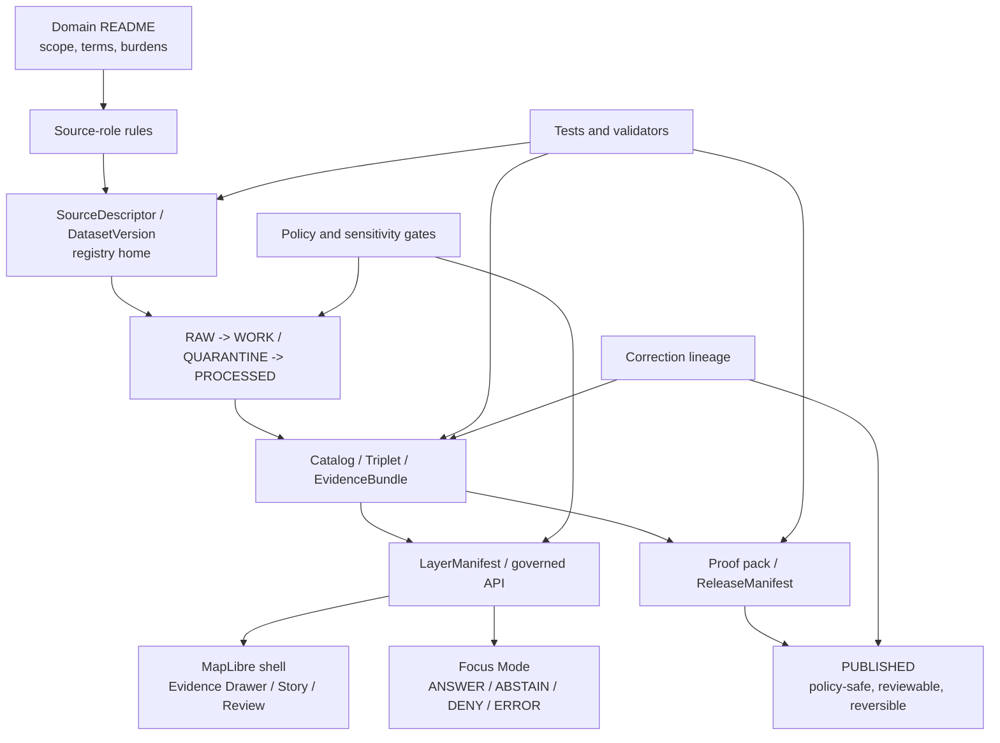

<!-- [KFM_META_BLOCK_V2]
doc_id: kfm://doc/NEEDS-VERIFICATION
title: Domain Lanes
type: standard
version: v1
status: draft
owners: NEEDS-VERIFICATION
created: NEEDS-VERIFICATION
updated: 2026-04-27
policy_label: NEEDS-VERIFICATION
related: [../README.md, ../../README.md, ../architecture/README.md, ../sources/README.md, ../../data/registry/README.md, ../../schemas/README.md, ../../contracts/README.md, ../../policy/README.md, ../../tests/README.md]
tags: [kfm, domains, domain-lanes, evidence, governance, map-first, time-aware, source-roles, publication]
notes: [doc_id, owners, created, policy_label, related links, schema-home authority, and actual repo path require verification in a mounted repository before publication]
[/KFM_META_BLOCK_V2] -->

<a id="top"></a>

# Domain Lanes

<p align="center">
  <strong>Kansas Frontier Matrix</strong><br>
  Evidence-first • map-first • time-aware • governed
</p>

<p align="center">
  
  
  
  
  
  
  
  
</p>

<p align="center">
  <a href="#scope">Scope</a> ·
  <a href="#truth-posture">Truth posture</a> ·
  <a href="#repo-fit">Repo fit</a> ·
  <a href="#accepted-inputs">Inputs</a> ·
  <a href="#exclusions">Exclusions</a> ·
  <a href="#domain-lane-registry">Lane registry</a> ·
  <a href="#source-role-discipline">Source roles</a> ·
  <a href="#domain-lifecycle">Lifecycle</a> ·
  <a href="#validation-gates">Validation</a> ·
  <a href="#definition-of-done">Definition of done</a>
</p>

Directory landing page for KFM domain documentation: what each lane may claim, what it must prove, and where domain knowledge must not bypass governance.

| Field | Value |
|---|---|
| Status | `draft` |
| Owners | `NEEDS VERIFICATION` |
| Target path | `docs/domains/README.md` — `NEEDS VERIFICATION` in the mounted repo |
| Evidence mode for this revision | `CORPUS_ONLY` / `NO_LOCAL_REPO_EVIDENCE` until a real checkout is inspected |
| Policy label | `NEEDS VERIFICATION` |
| Public posture | Cite-or-abstain; fail closed on unresolved rights, sensitivity, sovereignty, privacy, cultural, living-person, DNA, exact-location, or critical-infrastructure risk |
| Primary job | Orient maintainers to domain lanes, domain burdens, source-role discipline, release posture, and review gates |
| Immediate next check | Mount the repo, verify path conventions, resolve owners/policy label, and confirm linked homes before publication |

> [!IMPORTANT]
> This README is repo-ready guidance, not proof of current implementation. Claims about actual files, tests, workflows, schemas, routes, UI components, dashboards, emitted proof objects, or runtime behavior remain `UNKNOWN` until verified from current repository evidence.

| What this document does | What it does not do |
|---|---|
| Defines the governed role of domain-lane documentation. | Does not prove that every listed lane directory exists. |
| Explains accepted inputs, exclusions, source roles, sensitivity posture, and review gates. | Does not admit sources, authorize public release, or replace policy-as-code. |
| Gives maintainers a consistent lane README contract and review checklist. | Does not create schemas, OpenAPI contracts, validators, workflows, routes, or artifacts. |
| Protects KFM’s evidence-first, map-first, time-aware trust path. | Does not let maps, summaries, AI answers, graph edges, tiles, indexes, or scenes become canonical truth. |

---

<a id="scope"></a>

## Scope

`docs/domains/` is where KFM explains **domain lane meaning** before downstream systems ingest, validate, render, summarize, review, or publish that meaning.

A domain lane is a bounded knowledge area with its own vocabulary, source roles, sensitivity burden, evidence expectations, public-release posture, and correction responsibilities. Domain docs should make those constraints inspectable before they become schemas, source descriptors, API payloads, MapLibre layers, Focus answers, Story Nodes, release bundles, proof objects, or public claims.

### This README owns

- the domain documentation entrypoint;
- the candidate lane map and lane burden summary;
- the minimum contract for each lane README;
- the boundary between domain meaning and machine/runtime surfaces;
- directory-wide anti-collapse rules;
- publication, sensitivity, correction, and rollback expectations for lane docs;
- placeholders that must be resolved before publication.

### This README does not own

- canonical source descriptors;
- machine schemas, OpenAPI contracts, DTOs, or runtime envelopes;
- executable policy;
- RAW, WORK, QUARANTINE, PROCESSED, CATALOG, TRIPLET, or PUBLISHED data;
- proof objects, receipts, release manifests, catalog records, or generated artifacts;
- runtime route behavior;
- UI components, MapLibre style/layer implementation, Cesium scenes, or model adapters;
- source credentials, private steward contacts, or restricted operational runbooks.

Those surfaces must remain linked, testable, and governed from their appropriate homes.

[Back to top](#top)

---

<a id="truth-posture"></a>

## Truth posture

Use the narrowest truthful label. Do not upgrade a planning statement into implementation fact through confident tone.

| Label | Use in this README |
|---|---|
| `CONFIRMED` | Verified by the supplied draft, attached KFM doctrine, visible current-session files, or direct workspace inspection. |
| `PROPOSED` | Recommended path, lane, sequence, file, check, schema home, or rule that maintainers should verify before landing. |
| `UNKNOWN` | Not verified because the mounted repository, branch state, workflows, tests, runtime, dashboards, logs, source registries, or generated artifacts were not available. |
| `NEEDS VERIFICATION` | A concrete check must happen before treating the item as current repo fact or release-ready posture. |

> [!WARNING]
> Domain docs are allowed to plan. They are not allowed to pretend. If a statement depends on actual files, route names, workflows, source descriptors, policy enforcement, emitted proof objects, or runtime behavior, verify it first or label it.

### Evidence posture for this draft

| Evidence class | What it can support here | What it cannot support here |
|---|---|---|
| Supplied Domain Lanes draft | Intended file role, title, KFM meta block shape, lane list, lifecycle wording, and review checklist. | Current repository existence of any linked path. |
| Attached KFM doctrine and domain reports | KFM terminology, governance posture, lane burdens, lifecycle, EvidenceBundle priority, UI/AI boundaries, and sensitivity defaults. | Exact current code, package manager, route names, schemas, policies, CI, dashboards, deployments, branch protections, or emitted proof objects. |
| Current workspace inspection | Whether this session has a mounted repo, visible files, and generated outputs. | Production behavior or branch state when the real checkout is not mounted. |
| Mounted repo inspection | Would verify current paths, adjacent docs, actual conventions, tests, workflows, and runtime artifacts. | `UNKNOWN` until the real checkout is mounted and inspected. |

[Back to top](#top)

---

<a id="repo-fit"></a>

## Repo fit

| Surface | Relationship | Current posture |
|---|---|---|
| `docs/domains/README.md` | This file. Domain-lane landing, scope router, and review checklist. | `PROPOSED` target path until verified in the mounted repo. |
| [`../README.md`](../README.md) | Upstream docs landing. Should explain how domain docs fit into the documentation lattice. | Link target `NEEDS VERIFICATION`. |
| [`../../README.md`](../../README.md) | Root repository orientation. Should route maintainers toward current canon, not mixed lineage. | Link target `NEEDS VERIFICATION`. |
| `../architecture/` | Architecture doctrine: truth path, trust membrane, authoritative-vs-derived boundaries, shell law. | `PROPOSED` / `NEEDS VERIFICATION`. |
| `../sources/` | Source admission, source-role discipline, source descriptor standards, and rights/sensitivity notes. | `PROPOSED` / `NEEDS VERIFICATION`. |
| `../../data/registry/` | Candidate SourceDescriptor, DatasetVersion, and source activation registry home if adopted by the repo. | `PROPOSED` / `NEEDS VERIFICATION`. |
| `../../schemas/` and `../../contracts/` | Candidate machine-readable contract/schema homes. Schema-home authority must not drift. | `UNKNOWN` until repo convention is inspected. |
| `../../policy/` | Policy and sensitivity enforcement. | `PROPOSED` / `NEEDS VERIFICATION`. |
| `../../tests/` | Fixtures, contract tests, runtime-proof tests, and no-regression checks. | `PROPOSED` / `NEEDS VERIFICATION`. |
| `./<lane>/README.md` | Downstream lane README pattern. Replace placeholders with actual lane paths only after verification. | `PROPOSED`. |

### Candidate downstream lane homes

These links are orientation targets, not proof that directories currently exist:

[Hydrology](./hydrology/README.md) · [Hazards](./hazards/README.md) · [Soil](./soil/README.md) · [Agriculture](./agriculture/README.md) · [Atmosphere / Air](./atmosphere_air/README.md) · [Geology & Natural Resources](./geology-natural-resources/README.md) · [Flora](./flora/README.md) · [Fauna](./fauna/README.md) · [Habitat](./habitat/README.md) · [Settlements & Infrastructure](./settlements_infrastructure/README.md) · [Roads / Rail / Trade Routes](./roads-rail-trade-routes/README.md) · [Archaeology](./archaeology/README.md) · [People / Genealogy / DNA / Land Ownership](./people_genealogy_dna_land/README.md)

[Back to top](#top)

---

<a id="accepted-inputs"></a>

## Accepted inputs

Use `docs/domains/` for domain-specific documentation that answers: **what can this lane responsibly mean in KFM?**

| Input type | Belongs here when it… | Minimum expectation |
|---|---|---|
| Lane README | Orients maintainers to a domain lane. | Scope, repo fit, accepted inputs, exclusions, sensitivity posture, source-role summary, evidence expectations, validation gates, and definition of done. |
| Domain concept note | Defines a lane-specific term, relation, rule, uncertainty, or burden. | Truth labels and source-role assumptions are explicit. |
| Domain source-role guidance | Explains which source types may support which claim types. | Source convenience must not become source authority. |
| Sensitivity guidance | Explains redaction, generalization, staged access, delayed release, denial, or steward review. | Fail-closed defaults where rights, sovereignty, privacy, cultural sensitivity, exact locations, critical infrastructure, living-person, or DNA risk matters. |
| Domain-to-contract note | Explains meaning before a schema or DTO encodes it. | Links to schemas/contracts only when targets exist or are labeled `PROPOSED` / `NEEDS VERIFICATION`. |
| Domain UI note | Explains Evidence Drawer, layer, Focus, Story, Compare, Review, Export, or public map implications. | UI behavior remains downstream of governed APIs, release state, and evidence resolution. |
| Lane release note | Explains what must be validated before public or semi-public release. | Distinguishes receipts, proofs, catalog records, release manifests, review state, and published artifacts. |
| Correction or rollback note | Explains how lane-specific errors are corrected, withdrawn, superseded, or generalized. | Correction lineage and rollback targets are visible. |

[Back to top](#top)

---

<a id="exclusions"></a>

## Exclusions

| Does not belong here | Where it should go instead | Why |
|---|---|---|
| RAW, WORK, QUARANTINE, or PROCESSED data files | Data lifecycle directories or verified repo-native data homes. | Domain docs are not storage. |
| SourceDescriptor or DatasetVersion machine records | Source registry / data registry home. | Source admission needs validators, rights checks, and version discipline. |
| JSON Schema, OpenAPI, DTOs, or runtime envelopes | `schemas/`, `contracts/`, or verified contract homes. | Machine contracts need validators, fixtures, and version discipline. |
| Rego/OPA policy or equivalent enforcement code | `policy/` and policy tests. | Policy must be executable or testable, not decorative prose. |
| Generated tiles, PMTiles, COGs, GeoParquet, STAC, DCAT, PROV, or release bundles | Catalog, release, or published artifact homes. | Derived artifacts must not replace canonical truth. |
| Model prompts, direct LLM outputs, or chain-of-thought artifacts | Governed AI runtime/receipt surfaces only where policy allows. | AI is interpretive; EvidenceBundle outranks generated language. |
| Live source credentials, API keys, tokens, or private steward contacts | Secrets management or restricted operational runbooks. | Public docs must not leak operational or sensitive access details. |
| Exact sensitive locations by default | Restricted review/stewardship surfaces. | Archaeology, rare species, cultural sites, critical infrastructure, living-person, and DNA contexts fail closed. |
| Emergency instructions or life-safety alerting behavior | Official source guidance and emergency alert systems. | KFM may provide context; it must not become an emergency alert system. |

[Back to top](#top)

---

<a id="directory-tree"></a>

## Directory tree

`PROPOSED` target shape until a mounted checkout confirms the actual tree:

```text
docs/domains/
├── README.md
├── hydrology/
│   └── README.md
├── hazards/
│   └── README.md
├── soil/
│   └── README.md
├── agriculture/
│   └── README.md
├── atmosphere_air/
│   └── README.md
├── geology-natural-resources/
│   └── README.md
├── flora/
│   └── README.md
├── fauna/
│   └── README.md
├── habitat/
│   └── README.md
├── settlements-infrastructure/
│   └── README.md
├── roads-rail-trade-routes/
│   └── README.md
├── archaeology/
│   └── README.md
├── people-genealogy-dna-land/
│   └── README.md
└── _slices/
    └── habitat-fauna/
        └── README.md
```

> [!NOTE]
> `_slices/` is a proposed home for cross-lane proof slices only if the mounted repository adopts that convention. Cross-lane slices must not blur lane ownership, source-role burden, policy posture, review state, or release responsibility.

[Back to top](#top)

---

<a id="domain-lane-registry"></a>

## Domain lane registry

This registry is an orientation map, not an implementation inventory. Candidate paths are `PROPOSED` until the mounted repo proves them.

### Foundation and early proof lanes

| Lane | Candidate README | May claim when supported | Must not claim without stronger proof |
|---|---|---|---|
| Hydrology | `./hydrology/README.md` | Place/time-rich water observations, HUC/crosswalk identity, watershed context, regulatory flood context, source versioning. | Silent identity joins, unscoped observations, regulatory area as observed event, or model output as measured flow. |
| Hazards | `./hazards/README.md` | Hazard history, regulatory context, operational context, modeled or remote-sensing indicators, resilience review. | Life-safety alerting, emergency instructions, operational feed freshness without expiry, or regulatory area as observed event. |
| Soil | `./soil/README.md` | Soil units, interpretations, static snapshots, moisture/context watchers, source-vs-derived distinctions. | Derived interpretations as observed soil truth, gridded products as site-level certainty, or unverified SSURGO/gSSURGO/SDA equivalence. |
| Agriculture | `./agriculture/README.md` | Crops, land use, agricultural observations, modeled indicators, soil adjacency, seasonal context. | Field truth from gridded/model products alone, private farm-sensitive claims without review, or source-rights assumptions. |

### Physical, atmospheric, and ecological context lanes

| Lane | Candidate README | May claim when supported | Must not claim without stronger proof |
|---|---|---|---|
| Atmosphere / Air | `./atmosphere_air/README.md` | Air quality, weather, climate, smoke, EO-derived fields, source freshness, and knowledge character. | Observations, public AQI reports, regulatory archives, model fields, smoke masks, and anomaly surfaces as interchangeable truth. |
| Geology & Natural Resources | `./geology-natural-resources/README.md` | Geologic units, stratigraphy, wells/cores, geophysics/geochemistry references, resource estimates, extraction/reclamation context. | Physical geology, interpretation, resource administration, production records, and legal/resource status as one collapsed layer. |
| Habitat | `./habitat/README.md` | Habitat classes, models, patches, corridors, condition, land-cover context, public-safe generalized products. | Habitat/model support as occurrence truth or exact habitat-sensitive outputs without policy review. |

### Biodiversity and sensitive occurrence lanes

| Lane | Candidate README | May claim when supported | Must not claim without stronger proof |
|---|---|---|---|
| Flora | `./flora/README.md` | Plant taxa, observations, specimens, steward-reviewed records, rare-plant controls, vegetation surfaces. | Exact rare-plant locations, occurrence confirmation from models alone, or aggregator convenience as legal authority. |
| Fauna | `./fauna/README.md` | Taxa, occurrence evidence, range/seasonal context, disease/mortality, legal/conservation status when source role allows. | Exact sensitive species locations, community-science record as legal status, or range model as observed occurrence. |

### Human, built, cultural, and rights-heavy lanes

| Lane | Candidate README | May claim when supported | Must not claim without stronger proof |
|---|---|---|---|
| Settlements & Infrastructure | `./settlements_infrastructure/README.md` | Settlements, cities, historic townsites, facilities, networks, service areas, operators, condition observations, dependencies. | Critical-infrastructure precision without review, facility as operator, legal municipality as historic settlement, or condition as design capacity. |
| Roads / Rail / Trade Routes | `./roads-rail-trade-routes/README.md` | Modern/historic movement networks, roads, rail corridors, trade/mobility routes, restrictions, facilities, temporal status. | Route geometry as legal designation, operator as owner, historic interpretation as surveyed alignment, or sensitive mobility corridors as precise public geometry. |
| Archaeology | `./archaeology/README.md` | Sites, features, surveys, collections, remote-sensing candidates, cultural/steward review posture, public-safe generalized outputs. | Exact site locations by default, remote-sensing anomaly as confirmed site, or cultural/steward-sensitive material without review. |
| People / Genealogy / DNA / Land Ownership | `./people_genealogy_dna_land/README.md` | Person assertions, relationship hypotheses, documentary evidence, land ownership assertions, parcel/title/assessor distinctions. | Living-person or DNA-derived public output by default, assessor/tax rows as title truth, or relationship hypotheses as canonical fact. |

### Suggested sequencing posture

| Sequence | Lanes | Why |
|---|---|---|
| First proof path | Hydrology | Public-safe, place/time-rich, evidence-drill-through friendly, and consequential without the heaviest sensitivity burden. |
| Early expansion | Hazards, Soil, Agriculture | Useful after source-role, catalog, proof, and policy gates are exercised by the first lane. |
| Staged expansion | Atmosphere/Air, Geology, Habitat, Flora, Fauna, Settlements, Roads/Rail/Trade, Archaeology, People/Genealogy/DNA/Land | Valuable, but rights, sensitivity, precision, living-person, cultural, critical-infrastructure, or authority burdens are heavier. |

[Back to top](#top)

---

<a id="source-role-discipline"></a>

## Source-role discipline

Domain docs should make source roles visible before source records become claims. A source role answers: **what kind of claim may this source support, and what kind of claim must it not support alone?**

| Source role | Can support | Cannot support alone |
|---|---|---|
| Observation | A measured or observed condition at a stated place, time, method, and source. | Legal status, trend, causation, public release right, or broad truth outside scope. |
| Regulatory / administrative context | Jurisdictional classification, official boundary, program context, designation, declaration, or administrative record. | Observed physical event or field condition unless the source is also observational. |
| Model / derivative | Scenario, interpolation, classification, prediction, index, suitability, or derived surface. | Direct observation, legal authority, or exact site/species/event truth. |
| Documentary / archival | Historical support, narrative evidence, map reference, deed, report, photograph, or textual assertion. | Precision beyond the source, living-person release, or modern condition without corroboration. |
| Remote-sensing candidate | Candidate detection, anomaly, mask, spectral context, or image-derived indicator. | Confirmed archaeological site, confirmed species occurrence, legal boundary, or field-verified condition. |
| Legal / title authority | Claim types explicitly within the authority’s role and current legal/source terms. | Physical ground truth, geometry precision beyond the authority, or unrelated ownership/relationship claims. |
| Steward-reviewed | Controlled or reviewed record with steward conditions. | Public release without the steward-approved access posture. |
| Aggregated / community source | Discovery lead, occurrence context, or corroborating support when source terms allow. | Legal/conservation authority, exact sensitive public geometry, or release right by default. |

> [!CAUTION]
> A source can be useful and still not be authoritative for a specific claim. Domain docs must preserve that distinction because public users will often see only the map, summary, or Focus answer unless the Evidence Drawer exposes the burden.

[Back to top](#top)

---

<a id="sensitivity-and-release-posture"></a>

## Sensitivity and release posture

Sensitivity is lane-specific, but the default rule is shared: when rights, privacy, sovereignty, cultural sensitivity, exact-location exposure, source authority, or review state are unresolved, **do not publish exact or consequential claims**.

| Risk class | Common lanes | Default posture | Public-safe transform examples |
|---|---|---|---|
| Exact sensitive species location | Flora, Fauna, Habitat | Deny exact public geometry unless review explicitly allows. | Generalize, suppress, delay, aggregate, or role-limit. |
| Archaeological / cultural site exposure | Archaeology, Roads/Trade, Settlements | Deny exact public geometry by default. | Generalize, suppress, steward-review, use non-identifying context. |
| Living-person or DNA data | People / Genealogy / DNA / Land | Restrict by default; public output requires explicit policy support. | Redact, withhold, use historical-only scope, deny DNA-derived output. |
| Critical infrastructure precision | Settlements & Infrastructure, Roads/Rail, Hazards | Fail closed on precision and exploitability risk. | Generalize, remove operational details, role-limit. |
| Source-rights uncertainty | All lanes | Quarantine or block promotion. | Record rights status, use no-public-release flag, seek terms review. |
| Operational-feed freshness | Hazards, Atmosphere/Air, Hydrology | Require issue time, retrieval time, expiry/freshness, and contextual-only posture where appropriate. | Stale banner, abstention, link to official source, deny life-safety use. |

[Back to top](#top)

---

<a id="domain-lifecycle"></a>

## Domain lifecycle

Every lane must preserve the KFM truth path:

```text
SOURCE EDGE
  -> RAW
  -> WORK / QUARANTINE
  -> PROCESSED
  -> CATALOG / TRIPLET
  -> PUBLISHED
```

Domain docs should explain the lane-specific meaning of each state:

| State | Domain README question |
|---|---|
| `SOURCE EDGE` | What source families may enter this lane, and what source roles can they support? |
| `RAW` | What must be preserved unchanged for audit, rights, reproducibility, or correction? |
| `WORK / QUARANTINE` | What blocks promotion: rights uncertainty, sensitivity, source conflict, malformed identity, stale data, steward review? |
| `PROCESSED` | What transformations are allowed, and how are transforms recorded? |
| `CATALOG / TRIPLET` | What catalog records, relation edges, EvidenceBundle links, review states, and correction references are required? |
| `PUBLISHED` | What public or semi-public artifact is safe, cited, policy-checked, reviewable, reversible, and scoped? |

### Artifact boundaries

| Object family | Domain README stance |
|---|---|
| `SourceDescriptor` | Describes source role and admission posture; lane docs should reference it, not duplicate it. |
| `DatasetVersion` | Records dataset identity/version context where adopted by the repo; lane docs should explain the lane burden, not fake a registry. |
| `EvidenceBundle` | Outranks generated language and map styling; consequential claims must resolve to evidence or abstain. |
| `DecisionEnvelope` / `RuntimeResponseEnvelope` | Captures finite outcomes such as `ANSWER`, `ABSTAIN`, `DENY`, and `ERROR` where runtime surfaces exist. |
| `LayerManifest` | Describes map delivery; it is not canonical truth. |
| `ReleaseManifest` | Records release scope and integrity; promotion is a governed state transition. |
| `run_receipt` / `ai_receipt` | Process memory and audit linkage; not a substitute for proof. |
| `CatalogMatrix` / proof pack | Closes evidence, catalog, release, and rollback paths before publication. |

[Back to top](#top)

---

<a id="minimum-lane-readme-contract"></a>

## Minimum lane README contract

Every lane README should be small enough to review but explicit enough to prevent domain drift.

| Required part | Purpose | Review cue |
|---|---|---|
| Meta block + impact block | Makes ownership, status, placeholders, repo fit, and policy posture visible. | Unverified owners, dates, labels, and related links remain placeholders. |
| Scope | Defines what the lane may responsibly mean. | Includes boundaries and cross-lane edges. |
| Accepted inputs | Lists what belongs in the lane docs. | Does not confuse docs with data, schema, policy, or runtime homes. |
| Exclusions | Prevents unsafe or duplicate placement. | Names where excluded material should go instead. |
| Source roles | Describes which source types may support which claim types. | Does not turn source convenience into source authority. |
| Sensitivity and release posture | States fail-closed conditions and public-safe transforms. | Covers rights, sovereignty, privacy, cultural sensitivity, precise location exposure, and review burden where relevant. |
| Evidence and proof expectations | Explains EvidenceRef → EvidenceBundle and catalog/proof/release closure. | Requires cite-or-abstain for consequential claims. |
| Validation gates | Lists schema, policy, fixture, review, and release gates. | Links only to verified targets or labels them `PROPOSED` / `NEEDS VERIFICATION`. |
| Correction and rollback | Explains how errors, withdrawals, and supersession are handled. | Keeps correction lineage visible. |

[Back to top](#top)

---

<a id="validation-gates"></a>

## Validation gates

Domain docs do not execute gates, but they must name the gates that matter for the lane.

### Documentation review gates

- [ ] KFM meta block is present and unresolved fields are explicit.
- [ ] The impact block states status, owners, evidence mode, policy label, repo fit, accepted inputs, and exclusions.
- [ ] Scope prevents domain drift and duplicate homes.
- [ ] Accepted inputs and exclusions route content to the proper repo surfaces.
- [ ] Source roles and knowledge character are explicit.
- [ ] Sensitivity and public-release posture fail closed where risk matters.
- [ ] Links are verified or labeled `PROPOSED` / `NEEDS VERIFICATION`.

### Implementation-adjacent gates to link after verification

| Gate | Why it matters | Domain doc stance |
|---|---|---|
| SourceDescriptor validation | Prevents unknown source roles, rights, or cadence from becoming claims. | Link to verified registry entry or label as `PROPOSED`. |
| Schema / contract validation | Keeps domain meaning aligned with machine-readable surfaces. | Do not create parallel schema homes from prose. |
| Policy check | Blocks sensitive, rights-unclear, stale, or unauthorized release. | Treat policy as executable/testable, not decorative. |
| EvidenceBundle closure | Ensures public claims reconstruct to admissible evidence. | Require cite-or-abstain for consequential claims. |
| LayerManifest check | Prevents map layer from becoming sovereign truth. | Public layer must point back to catalog/evidence/release state. |
| ReleaseManifest / proof pack check | Makes promotion auditable and reversible. | Promotion is a governed state transition, not a file move. |
| No raw public path | Protects trust membrane. | Public clients use governed APIs and released artifacts only. |
| No direct model client | Keeps AI subordinate to evidence, policy, and release state. | Focus Mode uses governed envelopes only. |

[Back to top](#top)

---

<a id="quickstart"></a>

## Quickstart

Use this only after mounting the actual repository.

1. Verify checkout and branch state.
2. Inspect existing lane docs before adding a new lane.
3. Preserve strong existing material; do not replace it with generic prose.
4. Add or update lane docs with the KFM meta block and impact block.
5. Link to contracts, schemas, source descriptors, policies, tests, and artifacts only when they exist or are explicitly labeled `PROPOSED`.
6. Add fixtures, validators, or policy links in the proper homes, not inside prose docs.
7. Keep all public claims cite-or-abstain and policy-visible.

```bash
# Read-only inspection from the repository root.
git status --short
git branch --show-current
find docs/domains -maxdepth 3 -type f | sort
find schemas contracts policy data tests -maxdepth 3 -type f 2>/dev/null | sort | sed -n '1,160p'
```

```bash
# Non-destructive lane setup after verifying the lane does not already exist.
mkdir -p docs/domains/<lane>
touch docs/domains/<lane>/README.md
```

> [!CAUTION]
> Do not create parallel schema or contract homes to satisfy a lane README. If `contracts/` versus `schemas/contracts/` authority is unresolved, create or update an ADR before adding machine-readable definitions.

[Back to top](#top)

---

<a id="usage"></a>

## Usage

### When editing this README

Edit `docs/domains/README.md` when the lane map, shared domain documentation rules, domain sequencing, or directory-wide review gates change.

### When editing a lane README

Edit `docs/domains/<lane>/README.md` when the domain’s scope, source roles, sensitivities, accepted inputs, exclusions, validation gates, correction posture, or public-release burden changes.

### When editing contracts, schemas, policy, data, or runtime code

Do not hide those changes in domain prose. Update the proper machine or runtime surface and link back here only after verification.

| Change | Update domain docs? | Update elsewhere? |
|---|---:|---|
| New source family admitted | Yes | Source registry, SourceDescriptor, tests, policy if needed. |
| New public layer | Yes | LayerManifest, catalog record, Evidence Drawer payload, UI docs. |
| New runtime answer shape | Usually | Contracts, schema, runtime tests, Focus/Evidence Drawer docs. |
| New sensitivity rule | Yes | Policy, fixtures, validator tests, release gate docs. |
| New correction or rollback path | Yes | Runbook, proof objects, ReleaseManifest, catalog/review docs. |

[Back to top](#top)

---

<a id="diagram"></a>

## Diagram


```mermaid
flowchart TD
    A[Domain README<br/>scope, terms, burdens] --> B[Source-role rules]
    B --> C[SourceDescriptor / DatasetVersion<br/>registry home]
    C --> D[RAW -> WORK / QUARANTINE -> PROCESSED]
    D --> E[Catalog / Triplet / EvidenceBundle]
    E --> F[LayerManifest / governed API]
    F --> G[MapLibre shell<br/>Evidence Drawer / Story / Review]
    F --> H[Focus Mode<br/>ANSWER / ABSTAIN / DENY / ERROR]
    E --> I[Proof pack / ReleaseManifest]
    I --> J[PUBLISHED<br/>policy-safe, reviewable, reversible]

    K[Policy and sensitivity gates] --> D
    K --> F
    L[Tests and validators] --> C
    L --> E
    L --> I
    M[Correction lineage] --> E
    M --> J
```

[Back to top](#top)

---

<a id="anti-collapse-rules"></a>

## Anti-collapse rules

| Do not collapse… | Because… | Safe posture |
|---|---|---|
| Map layer into truth | Styling and tiles are derived surfaces. | Link layer back to catalog, EvidenceBundle, and release state. |
| Graph edge into canonical record | Graphs are useful projections, not sovereign truth. | Preserve source record, relation evidence, uncertainty, and correction lineage. |
| AI answer into evidence | Generated text is interpretive. | Require evidence resolution, citation validation, policy checks, and finite outcomes. |
| Public layer into public right | Visibility and rights are separate. | Publish only when rights, sensitivity, review, and release state allow. |
| Assessor/tax record into title truth | Administrative records may not prove legal ownership. | Label source role and claim scope. |
| Remote-sensing candidate into confirmed site/species/event | Detection is not confirmation. | Preserve candidate status and review requirement. |
| Regulatory hazard area into observed event | Regulation, model, and observation differ. | Label knowledge character and time basis. |
| Exact sensitive location into public geometry | Exposure can create harm. | Generalize, suppress, delay, restrict, or deny. |
| Scene or digital twin into operational truth | 3D/globe scenes are downstream carriers unless a separate evidence burden is met. | Preserve evidence, release state, and measurement caveats. |

[Back to top](#top)

---

<a id="definition-of-done"></a>

## Definition of done

A domain lane README is ready for review when:

- [ ] KFM meta block is present and unresolved fields are explicit.
- [ ] Status, owners, badges, quick links, and an impact block are visible near the top.
- [ ] Scope is specific enough to prevent domain drift.
- [ ] Accepted inputs and exclusions are explicit.
- [ ] Repo fit identifies upstream and downstream surfaces.
- [ ] Source-role discipline is stated.
- [ ] Sensitivity, rights, sovereignty, privacy, cultural sensitivity, critical infrastructure, living-person data, DNA, and exact-location risks are addressed where relevant.
- [ ] The lane distinguishes canonical records from derived tiles, summaries, graph edges, indexes, scenes, embeddings, and model outputs.
- [ ] The lane explains EvidenceRef → EvidenceBundle expectations.
- [ ] Public-facing claims are cite-or-abstain.
- [ ] AI and Focus Mode are downstream of governed evidence and policy.
- [ ] Review, correction, rollback, withdrawal, and supersession implications are visible.
- [ ] Links to schemas, contracts, policies, fixtures, workflows, APIs, and artifacts are either verified or labeled `PROPOSED` / `NEEDS VERIFICATION`.
- [ ] No claim says “the system does X” without current implementation evidence.

[Back to top](#top)

---

<a id="faq"></a>

## FAQ

### Can a domain README publish a source?

No. A domain README can explain source-role expectations and link to a source descriptor, but source admission belongs in the verified source-registry process.

### Can a domain lane use AI?

Yes, but only as bounded interpretation over admissible released evidence. AI must not read RAW, WORK, QUARANTINE, unpublished candidates, or canonical/internal stores directly.

### Can a tile, graph, summary, embedding, or scene become the lane’s canonical truth?

No. Tiles, graphs, summaries, indexes, scenes, and embeddings are rebuildable derivatives. They may help users inspect evidence; they must not silently replace it.

### What happens when source rights or sensitivity are unclear?

Default to quarantine, redaction, generalization, staged access, delayed publication, or denial. Record the transform and reason so correction and rollback remain possible.

### What should a maintainer do when the repo already has a conflicting lane path?

Preserve the existing material, add a migration note or ADR, and avoid duplicate homes. Backward compatibility is preferred, but documented and validated breaking changes are acceptable.

[Back to top](#top)

---

<a id="appendix"></a>

## Appendix

<details>
<summary>Lane README starter shape</summary>

```md
<!-- [KFM_META_BLOCK_V2]
doc_id: kfm://doc/NEEDS-VERIFICATION
title: <Lane Title>
type: standard
version: v1
status: draft
owners: NEEDS-VERIFICATION
created: NEEDS-VERIFICATION
updated: YYYY-MM-DD
policy_label: NEEDS-VERIFICATION
related: [../README.md]
tags: [kfm, domains, <lane>]
notes: [replace placeholders after repo inspection]
[/KFM_META_BLOCK_V2] -->

# <Lane Title>

<p align="center">
  <strong>Kansas Frontier Matrix</strong><br>
  Evidence-first • map-first • time-aware • governed
</p>

<p align="center">
  
  
  
  
</p>

<p align="center">
  <a href="#scope">Scope</a> ·
  <a href="#repo-fit">Repo fit</a> ·
  <a href="#accepted-inputs">Inputs</a> ·
  <a href="#exclusions">Exclusions</a> ·
  <a href="#validation-gates">Validation</a> ·
  <a href="#definition-of-done">Definition of done</a>
</p>

One-line purpose for this lane.

| Field | Value |
|---|---|
| Status | `draft` |
| Owners | `NEEDS VERIFICATION` |
| Evidence mode | `NEEDS VERIFICATION` |
| Policy label | `NEEDS VERIFICATION` |
| Repo fit | `docs/domains/<lane>/README.md` — verify in mounted repo |
| Public posture | Cite-or-abstain; fail closed on unresolved rights or sensitivity |

> [!IMPORTANT]
> This lane README is repo-ready guidance, not proof of current implementation.

## Scope

## Repo fit

## Accepted inputs

## Exclusions

## Source roles

## Sensitivity and release posture

## Evidence and proof expectations

## Validation gates

## Correction and rollback

## Definition of done
```

</details>

<details>
<summary>Glossary for domain docs</summary>

| Term | Working meaning |
|---|---|
| Inspectable claim | A public-facing statement reconstructable to evidence, spatial/temporal scope, source role, policy posture, review state, release state, and correction lineage. |
| Domain lane | Bounded knowledge area with its own burden profile and evidence rules. |
| Source role | What a source is allowed to support: observation, regulatory context, model, documentary support, candidate detection, legal authority, etc. |
| Knowledge character | Whether a claim is observed, documentary, modeled, derived, generalized, source-dependent, or review-dependent. |
| Trust membrane | Governed boundary between internal/canonical stores and public or role-limited surfaces. |
| Evidence Drawer | Trust-visible UI surface that exposes support, freshness, rights/sensitivity posture, review state, and correction lineage. |
| Focus Mode | Evidence-bounded synthesis surface inside the governed shell, not a detached assistant. |
| Promotion | Governed state transition into public or semi-public release, not a file move. |
| Redaction/generalization | Policy-aware transform that reduces exposure while preserving reviewable provenance. |

</details>

<details>
<summary>Pre-publication verification notes</summary>

Before publication, verify:

- actual location of `docs/domains/README.md`;
- adjacent docs conventions and ownership markers;
- whether `docs/domains/` or another lane home already exists;
- schema authority between `schemas/`, `contracts/`, or any repo-native alternative;
- source registry home and SourceDescriptor naming;
- policy home and policy test conventions;
- EvidenceBundle, ReleaseManifest, LayerManifest, proof pack, and receipt schema homes;
- UI route/component names for Evidence Drawer, Focus Mode, Story, Review, Compare, and Export;
- CI workflows and required documentation checks;
- CODEOWNERS, PR template, branch protection, and release-review expectations if the repo uses them.

</details>

[Back to top](#top)

## Domain documentation register linkage
See `docs/registers/domain_doc_index.md` and `docs/registers/domain_file_index.md`.

## Path normalization
- Settlements & Infrastructure path normalized to `settlements_infrastructure/`.
- People/Genealogy/DNA/Land path normalized to `people_genealogy_dna_land/`.
