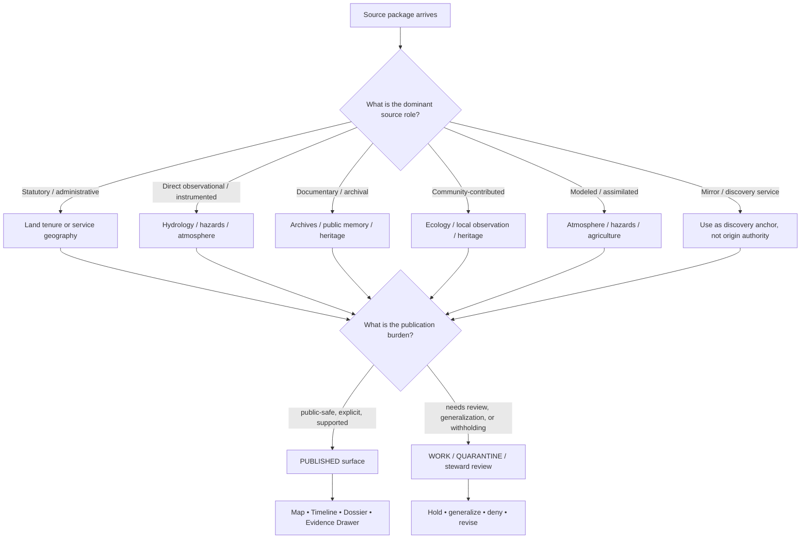

<!-- [KFM_META_BLOCK_V2]
doc_id: kfm://doc/<uuid-NEEDS-VERIFICATION>
title: Kansas Frontier Matrix — Domains
type: standard
version: v1
status: draft
owners: [@bartytime4life, NEEDS VERIFICATION]
created: NEEDS VERIFICATION
updated: 2026-04-02
policy_label: public
related: [../../README.md, ../reports/readme-structure-reconciliation.md, <downstream-domain-readmes-NEEDS-VERIFICATION>]
tags: [kfm, domains, source-atlas, governance]
notes: ["Atlas-centered rewrite; repo tree beyond target file was not directly reverified in this session.", "Standalone heritage subtree remains PROPOSED until repo placement is confirmed."]
[/KFM_META_BLOCK_V2] -->

# Kansas Frontier Matrix — Domains

Atlas-root README for Kansas operating lanes, source ecosystems, and domain-specific publication burden.

> [!NOTE]
> **Status:** experimental · **Doc state:** draft · **Owners:** @bartytime4life, NEEDS VERIFICATION  
>       
> **Quick jumps:** [Scope](#scope) · [Repo fit](#repo-fit) · [Inputs](#inputs) · [Exclusions](#exclusions) · [Directory tree](#directory-tree) · [Quickstart](#quickstart) · [Usage](#usage) · [Diagram](#diagram) · [Tables](#tables) · [Task list](#task-list) · [FAQ](#faq) · [Appendix](#appendix)

> [!IMPORTANT]
> This README is a **navigation, boundary, and burden** document. In KFM, domains are not decorative topic bins. They are operating lanes that change admissible evidence, source-role combinations, time semantics, rights posture, precision, uncertainty handling, and what can safely be published.

> [!CAUTION]
> Current-session evidence confirmed doctrine and lane logic, but did **not** directly reverify the mounted repo tree. Path-level claims beyond this file are intentionally marked `INFERRED`, `PROPOSED`, or `NEEDS VERIFICATION`.

---

## Scope

This directory exists to keep Kansas domain logic inspectable. It is where maintainers should define what belongs in a lane, which source ecosystems feed it, what must stay explicit at point of use, and which publication burdens apply before anything becomes public-safe.

KFM treats domain lanes as **structural operating burdens**, not decorative themes. A lane is allowed to change:

- admissible evidence
- source-role combinations
- time and support requirements
- rights and sensitivity posture
- precision and generalization rules
- first public-safe output

### Reading posture for this file

| Label | Meaning here |
|---|---|
| **CONFIRMED** | Supported by the attached KFM atlas and central manuals visible in this session. |
| **INFERRED** | A documentation bridge from doctrine to README structure or repo placement. |
| **PROPOSED** | A credible split or next step that the corpus supports conceptually but this session did not verify as mounted repo reality. |
| **NEEDS VERIFICATION** | A path, owner, date, or implementation claim not directly rechecked in the current session. |

---

## Repo fit

| Item | Value |
|---|---|
| Target path | `docs/domains/README.md` |
| Role | Root index for lane selection, source-role discipline, and publication-burden guidance |
| Upstream context | [`../../README.md`](../../README.md) *(NEEDS VERIFICATION)* · [`../reports/readme-structure-reconciliation.md`](../reports/readme-structure-reconciliation.md) *(NEEDS VERIFICATION)* |
| Likely downstream lane docs | [`./history-mobility/README.md`](./history-mobility/README.md), [`./settlement-services/README.md`](./settlement-services/README.md), [`./land-tenure/README.md`](./land-tenure/README.md), [`./hydrology/README.md`](./hydrology/README.md), [`./hazards/README.md`](./hazards/README.md), [`./agriculture/README.md`](./agriculture/README.md), [`./transport/README.md`](./transport/README.md), [`./ecology/README.md`](./ecology/README.md), [`./atmosphere/README.md`](./atmosphere/README.md) *(all INFERRED / NEEDS VERIFICATION in this session)* |
| Higher-burden docs under review | [`./archives-heritage/README.md`](./archives-heritage/README.md) *(INFERRED / NEEDS VERIFICATION)* · [`./heritage/README.md`](./heritage/README.md) *(PROPOSED split / NEEDS VERIFICATION)* |
| Baseline doctrine used | Atlas-centered lane logic, cross-checked against the canonical master and replacement-grade manuals |

---

## Inputs

Accepted inputs for this directory include:

- lane README files and sublane notes
- source-family and source-role matrices
- domain-specific publication-burden guidance
- first public-safe output rules
- lane sequencing notes and thin-slice priorities
- status markers that distinguish `CONFIRMED`, `INFERRED`, `PROPOSED`, and `NEEDS VERIFICATION`

---

## Exclusions

| This does **not** belong here | Why | Put it with |
|---|---|---|
| Raw source packages, snapshots, or extracted tables | They are truth-path artifacts, not domain README content | RAW / WORK / CATALOG artifacts |
| JSON Schemas, valid/invalid fixtures, policy bundles, or Rego | Those are executable contract surfaces | Contract / policy / fixture surfaces |
| Runtime route contracts, UI choreography, or shell state ownership | Those belong to other doctrinal layers | API / runtime / UI docs |
| Unverified repo-shape claims | They turn documentation into false implementation evidence | Verification backlog or explicit placeholders |
| Precise, rights-sensitive, or person-linked raw records | The root overview is not the publication surface for high-burden material | Review flow, quarantine, or generalized downstream docs |

---

## Directory tree

```text
docs/
└── domains/
    ├── README.md                         # target file
    ├── history-mobility/                 # INFERRED from current draft / NEEDS VERIFICATION
    ├── settlement-services/              # INFERRED from current draft / NEEDS VERIFICATION
    ├── land-tenure/                      # INFERRED from current draft / NEEDS VERIFICATION
    ├── archives-heritage/                # doctrine-aligned combined burden / NEEDS VERIFICATION
    ├── hydrology/                        # INFERRED from current draft / NEEDS VERIFICATION
    ├── hazards/                          # INFERRED from current draft / NEEDS VERIFICATION
    ├── agriculture/                      # INFERRED from current draft / NEEDS VERIFICATION
    ├── transport/                        # INFERRED from current draft / NEEDS VERIFICATION
    ├── ecology/                          # INFERRED from current draft / NEEDS VERIFICATION
    ├── atmosphere/                       # INFERRED from current draft / NEEDS VERIFICATION
    ├── archaeology-3d/                   # PROPOSED / NEEDS VERIFICATION
    └── dossiers/                         # INFERRED / NEEDS VERIFICATION

# Optional split under review
# └── heritage/                           # PROPOSED dedicated subtree for higher-burden identity-linked materials
```

> [!NOTE]
> The **combined** archives / public memory / heritage burden is doctrinally confirmed. The **folder split** between `archives-heritage/` and `heritage/` is not directly reverified from a mounted repo in this session.

---

## Quickstart

1. Start from the **lane**, not the tool.
2. Name the dominant **source families** before drafting or revising a lane README.
3. Declare the relevant **source roles**.
4. Write the **publication burden** in operational terms: time basis, support, rights, precision, modeled-vs-observed distinction.
5. Name the **first public-safe output** for the lane.
6. Mark every path-level claim `NEEDS VERIFICATION` unless you directly checked it.
7. If material is identity-linked, archival, oral-history, cemetery, or culturally sensitive, route it through the confirmed archives / public memory / heritage burden and only split it into a standalone heritage subtree if that repo shape is actually adopted.

Illustrative lane stub:

```yaml
lane:
  name: <lane-name>
  status: CONFIRMED|INFERRED|PROPOSED|NEEDS VERIFICATION
  source_families: [<authorities>, <mirrors>, <packages>]
  source_roles: [<statutory>, <observational>, <modeled>, <documentary>, <community>, <mirror>]
  first_public_safe_output: <deliverable>
  publication_burden: <what must remain explicit at point of use>
```

---

## Usage

### Choose one dominant lane first
Mixed material is normal, but the README should still name the dominant lane first and then declare cross-lane couplings explicitly. Do not let a single folder quietly become a generic holding area for “anything spatial.”

### Keep source roles visible
The same ingest template cannot govern every lane. Sensor feeds, statutory records, document repositories, local shapefiles, object-store packages, and discovery mirrors all behave differently. Lane docs should make those differences explicit rather than smoothing them away.

### Preserve publication burden at point of use
A lane README is not just a source list. It should answer:

- what is direct observation vs statutory record vs documentary evidence vs modeled output
- what time basis matters here
- what must stay generalized, decomposed, or caveated on public surfaces
- what would make a confident-looking output misleading

### Heritage / archives routing
`CONFIRMED`: the central manuals treat archives, newspapers, oral histories, public memory, and heritage as a real lane burden.  
`PROPOSED`: a dedicated `heritage/` subtree can be useful where identity-linked, geoprivacy-sensitive, or revocation-bearing material needs separate guidance.  
`NEEDS VERIFICATION`: the standalone subtree and its companion docs are not directly rechecked as mounted repo reality in this session.

### Do not let documentation imply code
This file should help people place and describe lanes. It must not be used to imply that connectors, tests, workflows, manifests, or enforcement already exist if they were not directly verified.

---

## Diagram


```mermaid
flowchart TD
    A[Source package arrives] --> B{What is the dominant source role?}

    B -->|Statutory / administrative| C[Land tenure or service geography]
    B -->|Direct observational / instrumented| D[Hydrology / hazards / atmosphere]
    B -->|Documentary / archival| E[Archives / public memory / heritage]
    B -->|Community-contributed| F[Ecology / local observation / heritage]
    B -->|Modeled / assimilated| G[Atmosphere / hazards / agriculture]
    B -->|Mirror / discovery service| H[Use as discovery anchor, not origin authority]

    C --> I{What is the publication burden?}
    D --> I
    E --> I
    F --> I
    G --> I
    H --> I

    I -->|public-safe, explicit, supported| J[PUBLISHED surface]
    I -->|needs review, generalization, or withholding| K[WORK / QUARANTINE / steward review]

    J --> L[Map • Timeline • Dossier • Evidence Drawer]
    K --> M[Hold • generalize • deny • revise]
```

---

## Tables

### Confirmed lane registry

| Lane | Doctrine status | What it covers | Representative source families | Publication / interpretation burden |
|---|---|---|---|---|
| Historical boundaries, census, settlement geography, and migration / mobility | **CONFIRMED** | county and territorial frames, population baselines, nativity, place-of-birth, origin–destination movement | historical boundaries, Decennial Census, ACS, NHGIS, Kansas territorial/state censuses, IRS migration flows | Do not flatten households, persons, flows, and administrative units into one synthetic population layer. Keep time and support semantics explicit. |
| Places, cities, service areas, lifeline systems, and critical systems | **CONFIRMED** | place dossiers, municipal/county context, school districts, healthcare catchments, utilities, broadband, emergency response, service-capacity cues | DASC, Census / NHGIS, agency service-area layers, KDOT / state GIS, local plans, utility reports, FCC broadband | Service geography, legal jurisdiction, and operational capacity are related but not identical. |
| Land tenure, cadastral history, parcels, plats, and deeds | **CONFIRMED** | patents, PLSS, parcels, deeds, plats, chain-of-title context, legal descriptions | BLM GLO, PLSS, ORKA / county parcel GIS, deed books, plat collections | Identity resolution, OCR / geoparsing, and temporal linking are review-bearing. |
| Archives, newspapers, oral histories, public memory, and heritage | **CONFIRMED** | narrative evidence, scans, transcripts, map sheets, captions, archival description, oral-history collections, heritage documentation | Kansas Historical Society, Chronicling America, local archives, university collections, oral-history programs | Context, rights, reuse constraints, and culturally sensitive material remain first-class. Narrative convenience must not erase provenance. |
| Hydrology, groundwater, reservoirs, water quality, and water governance | **CONFIRMED** | surface water, groundwater, stream gages, reservoirs, flood stages, water quality, watersheds, governance context | USGS NWIS, FEMA NFHL, KDHE, reservoir and watershed programs, local water reporting | Hydrology is public-safe, place/time-rich, and operationally legible, which is why it remains the preferred first thin slice. |
| Hazards, vulnerability, resilience, and public-service continuity | **CONFIRMED** | flood, drought, smoke, severe weather, infrastructure exposure, resilience indicators, service-continuity context | FEMA, NOAA / NWS, state emergency data, KDOT, local hazard plans | Avoid composite risk theater. Preserve decomposability, exposure context, and support semantics. |
| Agriculture, soils, erosion, land cover, and rural production | **CONFIRMED** | soils, cropping systems, erosion exposure, irrigation, land cover, agricultural context | USDA NRCS, NASS, Kansas soils resources, EO products | Groundwater, erosion, and soil-moisture gaps remain active priorities. Keep modeled and observed layers distinct. |
| Transportation, freight, work zones, and logistics | **CONFIRMED** | roads, rail, bridges, freight corridors, transit, closures, schedules, work zones, mobility context | KDOT, GTFS, GTFS-Realtime, WZDx, local transit feeds | Inventory, schedule, closure, and real-time impact feeds need different merge logic. Mirrors are not substitutes for operator feeds. |
| Ecology, biodiversity, flora, pollinators, wildlife, and protected areas | **CONFIRMED** | species observations, flora, pollinator and entomology sublanes, habitat, migration corridors, stewardship context | GBIF, iNaturalist, eBird, PAD-US, KDWP, Kansas Natural Heritage Inventory, biodiversity collections | Rare-species and culturally sensitive locations may require geoprivacy, generalization, or withholding. |
| Atmosphere, air quality, climate, earth observation, elevation, and scientific extension | **CONFIRMED** | air quality, smoke, drought context, satellite-derived conditions, elevation, terrain, contextual scientific layers | EPA AQS, AirNow, PurpleAir where admitted, NASA / NOAA EO products, 3DEP / USGS elevation | Satellite, model, regulatory, and community-sensor sources need visible method, time basis, and calibration distinctions. |
| Archaeology and heritage 2.5D / 3D context | **CONFIRMED** | trench, site, subsurface, stratigraphic, and heritage documentation where volumetric reasoning materially matters | archaeological 3D GIS workflows, local heritage projects, survey and site documentation | Do not conflate 2.5D and 3D. Use 3D only when it materially improves reasoning and still inherits the same evidence, policy, and correction model. |

### Lane sequencing and readiness

| Theme | Status | What this means for the repo | Review note |
|---|---|---|---|
| Hydrology-first thin slice | **CONFIRMED** | Prove one end-to-end lane here before broad expansion | Best first place to exercise descriptors, receipts, catalog closure, public-safe delivery, and correction |
| Hazards and air / climate context as follow-ons | **CONFIRMED** | Strong next lanes after hydrology | High public value, strong source availability, and clear cross-lane utility |
| Archives, land tenure, ecology, mobility, and service geography | **PROPOSED as next high-leverage expansions** | Valuable, but less operationalized | Source packs, verification burdens, and release forms need more explicit lane docs before heavy public expansion |
| Standalone `heritage/` subtree | **PROPOSED / NEEDS VERIFICATION** | Useful only if the repo intentionally splits higher-burden identity-linked material away from the broader archives / public memory / heritage lane | Current-session doctrine confirms the burden, not the final folder split |

### Doctrine lane → likely doc mapping

| Doctrine lane | Likely doc folder | Path status |
|---|---|---|
| Historical boundaries / settlement / migration-mobility | `history-mobility/` | **INFERRED / NEEDS VERIFICATION** |
| Places / services / lifelines / critical systems | `settlement-services/` | **INFERRED / NEEDS VERIFICATION** |
| Land tenure / cadastral history | `land-tenure/` | **INFERRED / NEEDS VERIFICATION** |
| Archives / public memory / heritage | `archives-heritage/` | **INFERRED / NEEDS VERIFICATION** |
| Hydrology | `hydrology/` | **INFERRED / NEEDS VERIFICATION** |
| Hazards / resilience / public-service continuity | `hazards/` | **INFERRED / NEEDS VERIFICATION** |
| Agriculture / soils / land cover | `agriculture/` | **INFERRED / NEEDS VERIFICATION** |
| Transportation / freight / logistics | `transport/` | **INFERRED / NEEDS VERIFICATION** |
| Ecology / biodiversity / protected areas | `ecology/` | **INFERRED / NEEDS VERIFICATION** |
| Atmosphere / air quality / climate / EO | `atmosphere/` | **INFERRED / NEEDS VERIFICATION** |
| Archaeology and heritage 2.5D / 3D context | `archaeology-3d/` | **PROPOSED / NEEDS VERIFICATION** |
| Dedicated heritage split | `heritage/` | **PROPOSED / NEEDS VERIFICATION** |

### Source-role quick reference

| Source role | Best use | Main caution |
|---|---|---|
| Statutory / administrative | parcels, districts, service boundaries, agency reporting | Do not treat legal class as equal to functional capacity without explicit modeling. |
| Direct observational / instrumented | sensors, field, survey, measured source families | Declare support, units, cadence, and calibration context. |
| Modeled / assimilated | forecasts, analyses, indexes, interpolations, simulations, scenarios | Keep modeled status and validation limits visible. |
| Documentary / archival | maps, newspapers, archival descriptions, reports, scans, oral histories, transcripts | Preserve context; do not flatten interpretive material into decontextualized facts. |
| Community-contributed | citizen science, civic submissions, oral-history contributions, local observations | Treat as governed input with confidence, moderation, and rights handling — not automatic truth. |
| Mirror / discovery service | discovery-friendly copies of another authority source | Useful as provenance anchors, not replacements for origin authorities. |

---

## Task list

- [ ] Keep lane names aligned to doctrine or explicitly marked `PROPOSED`
- [ ] Name representative source families for every lane README
- [ ] Declare source roles instead of listing sources as if they were interchangeable
- [ ] Make time basis, support, rights posture, and precision burden explicit
- [ ] Name the first public-safe output for the lane
- [ ] Distinguish direct observation, statutory record, documentary evidence, modeled output, and derived projection where they coexist
- [ ] Verify relative links or keep them visibly marked `NEEDS VERIFICATION`
- [ ] Keep exact-location, oral-history, biodiversity, archaeology, and identity-bearing material behind the right review burden
- [ ] Do not turn README text into proof of implementation

### Definition of done
A lane doc is ready when a reviewer can tell, without guessing, what belongs there, which source ecosystems feed it, which burden applies at publication time, and what would make its public output misleading.

---

## FAQ

### Why are lanes not just topics?
Because in KFM a lane changes what counts as admissible support, how time must be expressed, which rights questions matter, and what can be safely published.

### Why is hydrology first?
Because it is the clearest public-safe proof slice: place-rich, time-rich, operationally legible, and cross-layered without carrying the highest sensitivity burden.

### Is heritage a standalone lane?
The burden is real and confirmed. The standalone `heritage/` subtree is still a repo-shape decision and should remain `PROPOSED / NEEDS VERIFICATION` until directly verified.

### Why keep source roles in a domain README?
Because source families are not interchangeable. A statutory boundary, a sensor feed, a scanned newspaper page, and a modeled raster carry different truth and publication rules even when they speak about the same place.

### When should a lane stay generalized or withheld?
Whenever exact coordinates, person-linked records, culturally sensitive context, or weakly supported modeled claims would overstate what the evidence safely supports.

---

## Appendix

<details>
<summary><strong>Working terms and known unknowns</strong></summary>

### Working terms

**Operating lane**  
A domain burden that changes sourcing, verification, publication, and correction rules.

**Source role**  
The functional role a source plays in trust judgment: statutory, observational, modeled, documentary, community-contributed, or mirror/discovery.

**Publication burden**  
What must remain explicit or gated at point of use: time basis, support, rights posture, precision, uncertainty, and modeled-vs-observed distinctions.

### Known unknowns

- The mounted repo tree beyond this file was not directly reverified in the current session.
- The final split between `archives-heritage/` and `heritage/` remains unresolved here.
- Downstream lane README paths from the current draft remain review targets, not asserted repo fact.
- Rights/sensitivity flows for oral history, archaeology, biodiversity, and exact-location release need explicit lane-level publication classes before they should be treated as settled public surfaces.

### Preservation note

This revision preserves the strongest current-draft direction — especially the emphasis on heritage sensitivity — but reanchors it to the confirmed doctrine that already packages archives, public memory, oral history, and heritage as a higher-burden lane. It leaves a standalone heritage subtree available as a `PROPOSED` repo split rather than silently hardening it into fact.

</details>

[Back to top](#kansas-frontier-matrix--domains)
