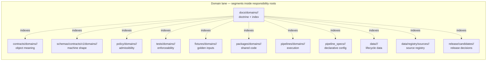
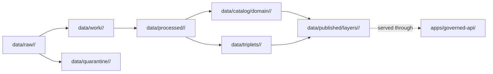

<!-- [KFM_META_BLOCK_V2]
doc_id: kfm://doc/docs-domains-readme
title: docs/domains — Domain doctrine, scope, status, and verification index
type: standard
version: v0.2
status: draft
owners:
  - <OWNER:docs-steward>
  - <OWNER:domain-stewards>
created: 2026-05-20
updated: 2026-06-11
policy_label: public
authority: human-facing domain-lane control plane; Directory Rules §12 placement doctrine; Directory Rules §15 README contract
related:
  - docs/doctrine/directory-rules.md
  - docs/registers/DOMAIN_LANE.md
  - docs/registers/DRIFT_REGISTER.md
  - docs/registers/VERIFICATION_BACKLOG.md
  - docs/architecture/domain-placement-law.md
  - docs/adr/ADR-0001-schema-home--schemas-contracts-v1-is-canonical.md
tags: [kfm, docs, domains, directory-rules, domain-placement-law, governance, lifecycle]
truth_labels: [CONFIRMED, PROPOSED, NEEDS VERIFICATION, UNKNOWN]
notes:
  - "This README is a human-facing landing and navigation surface for domain lanes."
  - "It does not create canonical truth, policy, schemas, release decisions, receipts, proofs, or lifecycle data."
  - "Accessible repo evidence confirms this README path and selected domain-lane files; complete lane inventory, validators, CODEOWNERS, CI, and runtime maturity remain NEEDS VERIFICATION."
  - "All domain lanes follow the responsibility-root pattern: docs, contracts, schemas, policy, tests, fixtures, packages, pipelines, pipeline_specs, data phases, registry, and release."
[/KFM_META_BLOCK_V2] -->

<a id="top"></a>

# `docs/domains/`

> Human-facing landing for every KFM domain. Each subfolder is the **doctrine, scope, status, and verification index** for one domain: its boundary, sources, lifecycle posture, sensitivity rules, validation state, and open questions. Machine truth, schemas, code, fixtures, policy, receipts, proofs, lifecycle data, and release decisions live elsewhere.

<p>
  
  
  
  
  
  
  
</p>

| Owners | Reviewers | Trust posture | Lifecycle target |
|---|---|---|---|
| `<OWNER:docs-steward>` + named domain stewards | Docs steward + at least one affected domain steward; ADR for domain admission, rename, removal, or invariant changes | Doctrine and indexes only — never canonical truth | `RAW → WORK / QUARANTINE → PROCESSED → CATALOG / TRIPLET → PUBLISHED` |

---

## Quick jumps

[Purpose](#1-purpose) ·
[Authority](#2-authority-and-scope) ·
[Status](#3-status-and-evidence-basis) ·
[Belongs here](#4-what-belongs-here) ·
[Does not belong here](#5-what-does-not-belong-here) ·
[Domain Placement Law](#6-domain-placement-law) ·
[Inventory](#7-domain-inventory) ·
[Landing pattern](#8-per-domain-landing-pattern) ·
[Validation](#11-validation) ·
[Review burden](#12-review-burden) ·
[Related folders](#13-related-folders) ·
[ADRs](#14-adrs) ·
[Backlog](#appendix-a--open-questions-and-verification-backlog)

---

> [!IMPORTANT]
> A page in `docs/domains/<slug>/` **explains** a domain. It does not **decide** for it. Object meaning lives in `contracts/`; machine shape lives in `schemas/`; admissibility lives in `policy/`; lifecycle data lives in `data/`; release decisions live in `release/`. If a `docs/domains/` page is treated as the canonical source of a release, schema, policy decision, or evidence claim, that is the **documentation-as-truth anti-pattern**. Move the decision to the proper responsibility root and leave only a link or index entry here.

> [!CAUTION]
> Public and semi-public clients must use governed interfaces and released/public-safe artifacts. `docs/domains/` is not an escape hatch around the trust membrane and must not point normal UI surfaces at `data/raw/`, `data/work/`, `data/quarantine/`, unpublished candidates, internal stores, or direct model output.

---

## 1. Purpose

`docs/domains/` is the human-readable control-plane lane for KFM domains. It is the front door for a reviewer, contributor, or steward to understand a domain's:

- scope and non-scope;
- source families and authority split;
- lifecycle path and promotion posture;
- sensitivity, rights, and publication constraints;
- validation and open verification work;
- links into the responsibility roots that carry enforceable truth.

It exists so a domain can grow without becoming a new root folder. A domain's responsibility-bearing files live as segments inside their owning roots: `contracts/domains/<slug>/`, `schemas/contracts/v1/domains/<slug>/`, `policy/domains/<slug>/`, `tests/domains/<slug>/`, `fixtures/domains/<slug>/`, `packages/domains/<slug>/`, `pipelines/domains/<slug>/`, `pipeline_specs/<slug>/`, `data/<phase>/<slug>/`, and `release/candidates/<slug>/`.

[↑ back to top](#top)

---

## 2. Authority and scope

| Question | Answer |
|---|---|
| What is this folder? | A human-facing documentation and navigation surface for domain lanes. |
| What authority does it have? | It explains domain scope, lineage, and placement; it does not supersede contracts, schemas, policy, data lifecycle records, release records, receipts, proofs, or ADRs. |
| What rule governs placement? | Directory Rules §12, **Domain Placement Law**. |
| What README contract applies? | Directory Rules §15, required README contract. |
| What happens when this file conflicts with Directory Rules or an accepted ADR? | Directory Rules / accepted ADR wins; this file is updated or a drift entry is opened. |
| What happens when a domain dossier conflicts with current repo evidence? | Current inspected repo evidence wins for implementation state; the dossier remains lineage/proposal evidence. |

[↑ back to top](#top)

---

## 3. Status and evidence basis

| Claim | Truth label | Basis |
|---|---|---|
| `docs/domains/README.md` exists in accessible repo evidence. | CONFIRMED | Direct repo fetch in this update session. |
| `docs/domains/` is part of the documented `docs/` domain-lane tree. | CONFIRMED doctrine | Directory Rules §6.1 and §12. |
| The 13 canonical domain slugs are the current doctrine target. | CONFIRMED doctrine | Directory Rules §12 and `docs/registers/DOMAIN_LANE.md`. |
| A domain must not become a root folder. | CONFIRMED doctrine | Directory Rules §12 / §13.4. |
| Complete per-domain subtree presence and completeness. | NEEDS VERIFICATION | Search confirmed selected per-domain files, but no mounted checkout inventory or validator run was performed. |
| Cross-root slug consistency across `contracts/`, `schemas/`, `policy/`, `tests/`, `fixtures/`, `packages/`, `pipelines/`, `pipeline_specs/`, `data/`, and `release/`. | NEEDS VERIFICATION | Requires mounted checkout scan and/or validator output. |
| CODEOWNERS, CI workflow names, and exact validator IDs for this lane. | NEEDS VERIFICATION | Not inspected enough to claim. |
| Runtime/publication maturity of any domain lane. | NEEDS VERIFICATION | This README does not inspect runtime deployments, release manifests, published artifacts, or rollback cards. |

[↑ back to top](#top)

---

## 4. What belongs here

A `docs/domains/<slug>/` subfolder may contain human-facing domain documentation such as:

- `README.md` — landing page for scope, boundary, status, and quick links.
- Architecture and trust-path documents.
- Human-readable indexes: source index, schema index, validator index, fixture index, file map, parameter registry.
- Lineage and migration documents: preservation ledger, migration history, release lineage, compatibility matrix, supersession notes.
- Review and planning artifacts: changelog, verification backlog, open questions, generated-artifact rules, change-surface matrix.
- Per-domain ADRs where the repo chooses a domain-local ADR pattern; otherwise link to `docs/adr/`.
- Sensitivity, rights, and publication notes that explain policy decisions without replacing `policy/`.
- Roadmaps, expansion backlogs, glossaries, and idea-intake summaries that have been promoted past exploratory status.

Canonical domain slugs are:

```text
hydrology
soil
fauna
flora
habitat
geology
atmosphere
roads-rail-trade
settlements-infrastructure
archaeology
hazards
agriculture
people-dna-land
```

Any new domain slug requires ADR admission and coordinated updates across this README, `docs/registers/DOMAIN_LANE.md`, the machine register if present, Directory Rules or a successor rule, and affected responsibility roots.

[↑ back to top](#top)

---

## 5. What does not belong here

`docs/domains/` is **not** a parallel home for canonical objects.

| You have… | It belongs under… |
|---|---|
| Object-family meaning | `contracts/domains/<slug>/` |
| JSON Schema, JSON-LD context, or other machine-checkable shape | `schemas/contracts/v1/domains/<slug>/` |
| Admissibility / allow / deny / restrict / abstain logic | `policy/domains/<slug>/` |
| Tests proving a rule is enforceable | `tests/domains/<slug>/` |
| Golden, valid, invalid, or regression fixtures | `fixtures/domains/<slug>/` |
| Domain shared library code | `packages/domains/<slug>/` |
| Executable pipeline logic | `pipelines/domains/<slug>/` |
| Declarative pipeline configuration | `pipeline_specs/<slug>/` |
| Source-specific fetcher/admitter | `connectors/...` with output to `data/raw/<slug>/` or `data/quarantine/<slug>/` |
| Lifecycle data | `data/raw/<slug>/`, `data/work/<slug>/`, `data/quarantine/<slug>/`, `data/processed/<slug>/`, `data/catalog/domain/<slug>/`, `data/triplets/<slug>/`, `data/published/layers/<slug>/` |
| Machine source/dataset registries | `data/registry/sources/<slug>/`, `data/registry/<slug>/`, or `control_plane/` when the register governs tools |
| Release decisions, manifests, rollback cards, correction notices | `release/...` |
| Receipts, proofs, EvidenceBundles | `data/receipts/`, `data/proofs/`, or the governed evidence-bundle home chosen by schema/contract |
| Cross-domain doctrine | `docs/architecture/<topic>.md` |
| Repo-wide doctrine | `docs/doctrine/` |
| Repo-wide ADRs | `docs/adr/` |
| Running apps, public UI, or API routes | `apps/` |
| Secrets, credentials, or private keys | Not in repo; templates only under approved config homes |

> [!WARNING]
> Common review refusal: a `docs/domains/<slug>/` folder that contains JSON Schemas, OPA bundles, fixtures, release manifests, evidence bundles, run receipts, pipeline code, or public UI code. Move those files to the correct responsibility root and leave an index entry behind.

[↑ back to top](#top)

---

## 6. Domain Placement Law

A domain MUST NOT become a root folder. The lane appears as a segment inside each responsibility root.


```mermaid
flowchart LR
  subgraph LANE["Domain lane <slug> — segments inside responsibility roots"]
    direction TB
    DOCS["docs/domains/<slug>/<br/>doctrine + index"]
    CONTRACTS["contracts/domains/<slug>/<br/>object meaning"]
    SCHEMAS["schemas/contracts/v1/domains/<slug>/<br/>machine shape"]
    POLICY["policy/domains/<slug>/<br/>admissibility"]
    TESTS["tests/domains/<slug>/<br/>enforceability"]
    FIXTURES["fixtures/domains/<slug>/<br/>golden inputs"]
    PACKAGES["packages/domains/<slug>/<br/>shared code"]
    PIPELINES["pipelines/domains/<slug>/<br/>execution"]
    PSPECS["pipeline_specs/<slug>/<br/>declarative config"]
    DATA["data/<phase>/<slug>/<br/>lifecycle data"]
    REGISTRY["data/registry/sources/<slug>/<br/>source registry"]
    RELEASE["release/candidates/<slug>/<br/>release decisions"]
  end

  DOCS -. indexes .-> CONTRACTS
  DOCS -. indexes .-> SCHEMAS
  DOCS -. indexes .-> POLICY
  DOCS -. indexes .-> TESTS
  DOCS -. indexes .-> FIXTURES
  DOCS -. indexes .-> PACKAGES
  DOCS -. indexes .-> PIPELINES
  DOCS -. indexes .-> PSPECS
  DOCS -. indexes .-> DATA
  DOCS -. indexes .-> REGISTRY
  DOCS -. indexes .-> RELEASE
```

Lifecycle remains a governed state transition, not a file move:


```mermaid
flowchart LR
  RAW["data/raw/<slug>/"] --> WORK["data/work/<slug>/"]
  RAW --> QUAR["data/quarantine/<slug>/"]
  WORK --> PROC["data/processed/<slug>/"]
  PROC --> CAT["data/catalog/domain/<slug>/"]
  PROC --> TRIP["data/triplets/<slug>/"]
  CAT --> PUB["data/published/layers/<slug>/"]
  TRIP --> PUB
  PUB -. served through .-> API["apps/governed-api/"]
```

### Cross-domain and cross-cutting files

Files that legitimately span multiple domains belong under the lowest common responsibility root **without** pretending one domain owns them.

| Cross-domain file type | Correct pattern |
|---|---|
| Shared validator | `tools/validators/<topic>/...` |
| Cross-domain schema | `schemas/contracts/v1/<topic>/...` |
| Cross-domain doctrine | `docs/architecture/<topic>.md` |
| Cross-domain policy | `policy/<topic>/...` or another policy-family home chosen by ADR |
| Cross-domain app feature | `apps/<app>/...`, usually with governed API mediation |

A pull request that puts a multi-domain file under one domain because "it has to go somewhere" should be redirected on review.

[↑ back to top](#top)

---

## 7. Domain inventory

Implementation status is bounded. A lane can be doctrine-confirmed while its current repo completeness remains `NEEDS VERIFICATION`.

| Slug | Domain | Doctrine status | Lane README path | Public/sensitivity notes |
|---|---|---|---|---|
| `hydrology` | Hydrology | CONFIRMED doctrine / NEEDS VERIFICATION implementation | `docs/domains/hydrology/README.md` | Watershed, HUC, gauge, flow/level, water quality, NFHL context. Do not collapse regulatory zones, observed inundation, forecasts, and warnings. |
| `soil` | Soil | CONFIRMED doctrine / NEEDS VERIFICATION implementation | `docs/domains/soil/README.md` | SSURGO/gSSURGO map units, components, horizons, properties, HSG, suitability, and soil moisture. |
| `fauna` | Fauna | CONFIRMED doctrine / NEEDS VERIFICATION implementation | `docs/domains/fauna/README.md` | Sensitive-location redaction is mandatory; public layers must carry redaction/generalization receipts. |
| `flora` | Flora | CONFIRMED doctrine / NEEDS VERIFICATION implementation | `docs/domains/flora/README.md` | Rare-plant and culturally sensitive plant-location generalization required. |
| `habitat` | Habitat | CONFIRMED doctrine / NEEDS VERIFICATION implementation | `docs/domains/habitat/README.md` | Patch, suitability, connectivity, corridor, model-run receipts, and uncertainty surfaces. |
| `geology` | Geology and Natural Resources | CONFIRMED doctrine / NEEDS VERIFICATION implementation | `docs/domains/geology/README.md` | Geologic units, boreholes, resource context, and representation receipts for cross-section/3D outputs. |
| `atmosphere` | Atmosphere, Air, and Climate | CONFIRMED doctrine / NEEDS VERIFICATION implementation | `docs/domains/atmosphere/README.md` | Observed, regulatory, modeled, aggregate, and forecast contexts must remain source-role separated. |
| `roads-rail-trade` | Roads, Rail, and Trade Routes | CONFIRMED doctrine / NEEDS VERIFICATION implementation | `docs/domains/roads-rail-trade/README.md` | Network identity and corridor context; infrastructure-vulnerability detail must be policy-gated. |
| `settlements-infrastructure` | Settlements, Cities, and Infrastructure | CONFIRMED doctrine / NEEDS VERIFICATION implementation | `docs/domains/settlements-infrastructure/README.md` | Settlement identity, annexation, service-area, and infrastructure context; critical-asset exactness fails closed. |
| `archaeology` | Archaeology and Cultural Heritage | CONFIRMED doctrine / NEEDS VERIFICATION implementation | `docs/domains/archaeology/README.md` | Precise sites, burials, sacred places, and sovereignty-sensitive records require restriction, review, or denial. |
| `hazards` | Hazards | CONFIRMED doctrine / NEEDS VERIFICATION implementation | `docs/domains/hazards/README.md` | Non-emergency posture; KFM is not an alert authority. Warnings and incidents must be cited/contextual. |
| `agriculture` | Agriculture | CONFIRMED doctrine / NEEDS VERIFICATION implementation | `docs/domains/agriculture/README.md` | Aggregated/public-safe crop, livestock, irrigation, and land-use context; private joins and field-level exposure are denied unless rights and policy permit. |
| `people-dna-land` | People, Genealogy, DNA, and Land Ownership | CONFIRMED doctrine / NEEDS VERIFICATION implementation | `docs/domains/people-dna-land/README.md` | Living-person, DNA/genomic, kinship, ownership, and title-like inference are restricted; assessor data is not title truth. |

### Related capability areas not admitted as §12 domain slugs

| Capability area | Default placement posture | Status |
|---|---|---|
| Spatial foundation, cartography, reference systems | Cross-domain architecture under `docs/architecture/` unless admitted by ADR. | NEEDS VERIFICATION |
| Frontier demography, economy, settlement, land, and time matrix | Composition lane crossing settlements, agriculture, people-land, time, and evidence; admit by ADR before using as domain slug. | NEEDS VERIFICATION |
| Planetary, 3D, digital twin, synthetic spatial systems | Representation / architecture lane, usually `docs/architecture/`; domain admission requires ADR. | NEEDS VERIFICATION |

[↑ back to top](#top)

---

## 8. Per-domain landing pattern

The exact filename set can vary by domain. Use the smallest set that makes the lane inspectable; do not pad a domain folder with empty boilerplate.

```text
docs/domains/<slug>/
├── README.md                         # landing: scope, boundary, status, links
├── ARCHITECTURE.md                   # lane architecture and trust path
├── FILE_MAP.md                       # path-by-path map; equivalent names need README mapping
├── SOURCE_INDEX.md                   # human source registry; machine registry lives elsewhere
├── SCHEMA_INDEX.md                   # links to schemas/contracts/v1/domains/<slug>/
├── VALIDATOR_INDEX.md                # links to validators touching this lane
├── FIXTURE_INDEX.md                  # links to fixtures/domains/<slug>/
├── INTAKE_AND_PROMOTION_RULES.md     # intake, promotion, abstain/deny/error posture
├── ROLLBACK_AND_CORRECTION.md        # rollback, correction, supersession
├── PUBLICATION_AND_POLICY.md         # rights, sensitivity, public-safe publication explanation
├── UI_AND_EVIDENCE_DRAWER.md         # map UI / Evidence Drawer / Focus Mode notes
├── CHANGELOG.md                      # human changelog
├── MIGRATIONS.md                     # schema/data/document migrations
├── RELEASE_LINEAGE.md                # release lineage and supersession state
├── VERIFICATION_BACKLOG.md           # open checks, owners, closure criteria
├── OPEN_QUESTIONS.md                 # unresolved authority/scope questions
├── GLOSSARY.md                       # domain vocabulary
└── ADR-XXXX-<topic>.md               # optional domain-local ADR; otherwise link docs/adr/
```

### Authoring rules

1. **One accepted decision, one canonical home.** Domain README pages index decisions; they do not duplicate the authoritative object.
2. **No machine truth in docs.** No JSON Schema, OPA bundle, fixture, manifest, receipt, proof, release decision, or executable pipeline belongs here.
3. **Stable anchors.** Preserve existing anchors unless the improvement is worth link breakage. Note anchor changes in the PR.
4. **Truth labels.** Use only: `CONFIRMED`, `PROPOSED`, `NEEDS VERIFICATION`, `UNKNOWN`.
5. **Evidence-first prose.** Cite the source or mark the claim as bounded. Do not let fluent summaries stand in for source authority.
6. **Sensitivity-first publishing.** Sensitive ecology, archaeology, cultural, living-person, DNA/genomic, ownership, infrastructure, or public-safety detail defaults to redaction, generalization, staged access, or denial until reviewed.

[↑ back to top](#top)

---

## 9. Inputs

- KFM doctrine: Directory Rules, lifecycle law, truth posture, trust membrane, authority ladder, governed-AI doctrine, and publication/rights/sensitivity doctrine.
- Per-domain architecture dossiers and blueprints.
- Accepted ADRs touching domain placement, schema home, source roles, sensitivity, release, or renderer/UI posture.
- Per-root READMEs for `contracts/`, `schemas/`, `policy/`, `data/`, `release/`, `tests/`, `fixtures/`, `tools/`, `apps/`, and `packages/`.
- Verification and drift registers.
- Current repo evidence from mounted checkout, connector fetches, CI, validators, and release artifacts.

## 10. Outputs

- A readable, navigable, governance-aware landing for each KFM domain.
- Cross-links into the responsibility-root segments that carry enforceable truth.
- Domain verification backlog entries that drive future ADRs, schema migrations, source admissions, and release candidates.
- Per-domain or repo-wide ADR links for accepted domain decisions.
- A clean review path for detecting and correcting drift before it becomes authority.

[↑ back to top](#top)

---

## 11. Validation

| Check | Status | Closure evidence |
|---|---|---|
| Each canonical domain slug has `docs/domains/<slug>/README.md`. | NEEDS VERIFICATION | Mounted repo scan or validator output. |
| Each domain README meets Directory Rules §15. | NEEDS VERIFICATION | README contract validator or steward review. |
| Slugs match across docs, contracts, schemas, policy, tests, fixtures, packages, pipelines, pipeline specs, data phases, registries, and release candidates. | NEEDS VERIFICATION | Cross-root slug consistency scan. |
| No schemas, OPA bundles, fixtures, manifests, receipts, proofs, pipeline code, or release decisions live under `docs/domains/`. | NEEDS VERIFICATION | Static path/type check. |
| Cross-domain content lives under the correct responsibility root without a misleading single-domain segment. | NEEDS VERIFICATION | Reviewer check and/or validator. |
| Domain README links to contract, schema, policy, fixture, test, data, release, and public-safe UI/API surfaces where applicable. | NEEDS VERIFICATION | Link check and owner review. |
| Sensitive-lane documentation has matching policy references and redaction/generalization posture. | NEEDS VERIFICATION | Sensitivity reviewer signoff and policy reference. |
| CODEOWNERS covers `docs/domains/` and affected domain subtrees. | NEEDS VERIFICATION | CODEOWNERS inspection. |
| CI enforces README, link, slug, and prohibited-file checks. | NEEDS VERIFICATION | CI workflow evidence. |

[↑ back to top](#top)

---

## 12. Review burden

| Change type | Review needed |
|---|---|
| Typo, link repair, wording clarification inside an existing lane | Docs steward; domain steward if meaning changes. |
| New documentation file inside an existing lane | Docs steward + domain steward; cite Directory Rules §12 / this README. |
| New source family, source role, or evidence rule in a domain | Domain steward + source steward + policy reviewer as needed. |
| New sensitivity or rights posture | Domain steward + sensitivity/rights reviewer; policy reference required. |
| New domain slug | ADR required; update Directory Rules / domain register / machine register if accepted. |
| Rename or merge a slug | ADR + migration plan + `git mv` discipline + deprecation/supersession note + rollback path. |
| Any lifecycle, schema-home, policy-home, trust-membrane, or release-path exception | ADR + drift-register entry + rollback plan. |

[↑ back to top](#top)

---

## 13. Related folders

| Folder | Relationship |
|---|---|
| `docs/architecture/` | Cross-domain doctrine and architecture. |
| `docs/doctrine/` | Repo-wide doctrine: Directory Rules, truth posture, trust membrane, lifecycle law, authority ladder. |
| `docs/adr/` | Repo-wide ADRs and possible home for per-domain ADRs. |
| `docs/registers/` | Drift register, verification backlog, domain-lane register, authority and lineage records. |
| `control_plane/` | Machine-readable governance maps and registers. |
| `contracts/domains/<slug>/` | Domain object meaning. |
| `schemas/contracts/v1/domains/<slug>/` | Machine-checkable shape. |
| `policy/domains/<slug>/` | Admissibility and release policy. |
| `tests/domains/<slug>/` | Enforceability proof. |
| `fixtures/domains/<slug>/` | Golden, valid, invalid, and negative-path examples. |
| `packages/domains/<slug>/` | Shared domain code. |
| `pipelines/domains/<slug>/` | Executable domain pipeline logic. |
| `pipeline_specs/<slug>/` | Declarative pipeline configuration. |
| `data/<phase>/<slug>/` | Lifecycle data from raw through published. |
| `data/registry/sources/<slug>/` | Source registry material. |
| `release/candidates/<slug>/` | Release candidates, manifests, rollback/correction material. |
| `apps/governed-api/` | Public trust membrane. |
| `apps/explorer-web/` | Map-first UI consuming governed API/public-safe artifacts. |

[↑ back to top](#top)

---

## 14. ADRs

Known ADR hooks for this README:

| ADR / decision area | Status | Notes |
|---|---|---|
| ADR-0001 — Schema home | CONFIRMED / NEEDS VERIFICATION for exact current filename | Machine-schema home is `schemas/contracts/v1/...`; domain docs point there for shape. |
| Domain Placement Law | CONFIRMED doctrine | Directory Rules §12 currently governs domain-lane placement. |
| Per-domain ADR home | NEEDS VERIFICATION | Normalize whether domain-local ADRs live under `docs/domains/<slug>/` or centrally under `docs/adr/`. |
| Slug normalization | PROPOSED | Needed for any observed lineage variants such as shortened, underscored, or legacy domain names. |
| Cross-domain capability admission | PROPOSED | Needed before capability areas become domain slugs instead of architecture/composition lanes. |

[↑ back to top](#top)

---

## Last reviewed

**2026-06-11** — v0.2 polish and governance refresh.

A README older than six months from its last reviewed date should be flagged for review. Review should verify current paths, per-domain completeness, links, CODEOWNERS, CI enforcement, drift register entries, and any ADR state that changed after this update.

---

## Appendix A — Open questions and verification backlog

Track these in `docs/registers/VERIFICATION_BACKLOG.md` or the current verification backlog home:

- **NEEDS VERIFICATION:** Which of the 13 canonical domain lanes have `README.md` files today?
- **NEEDS VERIFICATION:** Which non-README documents exist under each `docs/domains/<slug>/` subtree?
- **NEEDS VERIFICATION:** Whether any prohibited files have drifted into `docs/domains/`.
- **NEEDS VERIFICATION:** Cross-root slug consistency for every domain lane.
- **NEEDS VERIFICATION:** Exact current ADR filenames and acceptance state for schema home, domain placement, slug normalization, sensitivity, source roles, and publication boundary.
- **NEEDS VERIFICATION:** Whether `control_plane/domain_lane_register.yaml` exists and is synchronized with `docs/registers/DOMAIN_LANE.md`.
- **NEEDS VERIFICATION:** CODEOWNERS coverage for `docs/domains/`.
- **NEEDS VERIFICATION:** CI/validator names for README contract, slug consistency, prohibited-file scan, and link checking.
- **PROPOSED:** Decide whether capability areas absent from §12 remain under `docs/architecture/`, become composition lanes, or are admitted as new domains by ADR.
- **PROPOSED:** Create a documented migration pattern for any legacy slug variants discovered in repo or dossier lineage.

[↑ back to top](#top)

---

## Appendix B — Evidence basis for this README

This README was polished from the existing `docs/domains/README.md` draft and bounded by current-session evidence:

- `docs/domains/README.md` was fetched directly from the accessible repository.
- `docs/doctrine/directory-rules.md` was fetched directly and used for root authority, `docs/`, Domain Placement Law, anti-patterns, and lifecycle placement.
- `docs/registers/DOMAIN_LANE.md` was fetched directly as the human-facing domain-lane register.
- Repository search confirmed selected existing files under `docs/domains/`, but this was not a complete mounted checkout inventory.
- No validator run, CI run, CODEOWNERS check, release manifest, runtime deployment, or public UI/API behavior was verified by this README refresh.

[↑ back to top](#top)
