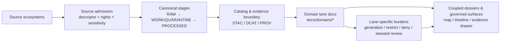

<!-- [KFM_META_BLOCK_V2]
doc_id: kfm://doc/<uuid-NEEDS-VERIFICATION>
title: Kansas Frontier Matrix — Domains
type: standard
version: v1
status: draft
owners: <NEEDS_VERIFICATION>
created: <YYYY-MM-DD NEEDS_VERIFICATION>
updated: <YYYY-MM-DD NEEDS_VERIFICATION>
policy_label: <NEEDS_VERIFICATION>
related: [../../README.md, ../reports/readme-structure-reconciliation.md, ../soil/README.md, <additional-related-paths-NEEDS_VERIFICATION>]
tags: [kfm, domains, source-atlas]
notes: [Owners, dates, policy label, and mounted subtree contents require direct repo verification.]
[/KFM_META_BLOCK_V2] -->

# Kansas Frontier Matrix — Domains

Authoritative index and governance-aware landing page for Kansas domain lanes, source ecosystems, and publication burdens.

> [!NOTE]
> **Status:** experimental  
> **Owners:** NEEDS VERIFICATION  
> 
> 
> 
>   
> **Quick jumps:** [Scope](#scope) · [Repo fit](#repo-fit) · [Inputs](#inputs) · [Exclusions](#exclusions) · [Directory tree](#directory-tree) · [Quickstart](#quickstart) · [Usage](#usage) · [Diagram](#diagram) · [Tables](#tables) · [Task list](#task-list) · [FAQ](#faq) · [Appendix](#appendix)

> [!IMPORTANT]
> This README is an **index and boundary document** for domain documentation. It should help maintainers navigate lanes, preserve source-role discipline, and keep publication burdens visible. It does **not** replace canonical data artifacts, catalog records, evidence bundles, policy gates, or release proof objects.

## Scope

This directory-level README should orient contributors and reviewers to the **Kansas-facing domain model** of KFM: the lanes the project treats as operationally meaningful, the source roles each lane depends on, and the publication burdens that must stay visible as domain docs grow.

The strongest recurring domain pressure in the attached KFM corpus centers on:

- hydrology and water systems
- hazards and resilience
- air and atmosphere
- climate context
- land, parcels, settlement, and service geography
- soils, ecology, and sensitive occurrence
- coupled place dossiers that join evidence across lanes

The broader atlas also deepens adjacent ecosystems such as agriculture, transportation and logistics, archives and oral history, heritage, migration and mobility, and lifeline service geography. This README should index those areas **without flattening them into one generic “data source” bucket**.

[Back to top](#kansas-frontier-matrix--domains)

## Repo fit

| Item | Value |
|---|---|
| **Path** | `docs/domains/README.md` |
| **Role** | Root index for domain lanes, source ecosystems, and domain-specific publication burdens |
| **Upstream** | [`../../README.md`](../../README.md) · [`../reports/readme-structure-reconciliation.md`](../reports/readme-structure-reconciliation.md) |
| **Confirmed adjacent domain surface** | [`../soil/README.md`](../soil/README.md) |
| **Expected downstream lane docs** | `./<lane>/README.md` *(INFERRED / NEEDS VERIFICATION)* |
| **Mounted subtree reality** | `NEEDS VERIFICATION` |

This file should sit between repo-level doctrine and lane-level domain notes.

It should help answer four questions quickly:

1. Which Kansas lanes does KFM treat as first-class?
2. Which source roles belong in those lanes?
3. What belongs in a lane README versus somewhere else?
4. Which burdens must be visible before a lane is treated as publishable?

> [!TIP]
> Current support inventory shows that at least one live domain README may still live **outside** this subtree (`docs/soil/README.md`). Treat this file as both a navigation surface and a **normalization anchor** until the mounted repo confirms the final layout.

[Back to top](#kansas-frontier-matrix--domains)

## Inputs

Accepted content for this area includes:

- lane overviews and boundaries
- source-family maps and source-role distinctions
- domain-specific rights, sensitivity, and generalization burdens
- cross-domain coupling notes
- pointers to analyses, pipelines, catalogs, story/dossier surfaces, and steward review expectations
- public-safe non-goals and boundary notes for lanes that are easy to overstate

Good domain docs in KFM should remain:

- evidence-first
- source-role-aware
- publication-aware
- explicit about what is **CONFIRMED**, **INFERRED**, **PROPOSED**, **UNKNOWN**, or **NEEDS VERIFICATION**

## Exclusions

| This does **not** belong here | Put it here instead | Notes |
|---|---|---|
| Machine-checkable contracts and schema definitions | [`../../contracts/README.md`](../../contracts/README.md) · [`../../schemas/README.md`](../../schemas/README.md) | This README may reference them, but should not duplicate them |
| Policy bundles, deny rules, and obligation vocabularies | [`../../policy/README.md`](../../policy/README.md) | Domain docs should surface burdens, not replace policy artifacts |
| Tests, fixtures, and validator entrypoints | [`../../tests/README.md`](../../tests/README.md) · `../../tools/README.md` *(NEEDS VERIFICATION)* | Keep README prose aligned to what tests actually prove |
| CI workflow implementation detail | [`../../.github/workflows/README.md`](../../.github/workflows/README.md) | Treat workflow claims cautiously until mounted YAML is verified |
| Canonical release artifacts, catalogs, and proof bundles | Canonical data/catalog/release surfaces *(exact mounted paths NEED VERIFICATION)* | Domain docs should link outward, not impersonate release memory |
| Unsourced narrative claims or public-facing story prose | Lane-specific story/dossier surfaces *(NEEDS VERIFICATION)* | Narrative remains subordinate to evidence and review state |
| Unverified implementation claims | Nowhere yet | Keep them visible as `UNKNOWN` or `NEEDS VERIFICATION` |

[Back to top](#kansas-frontier-matrix--domains)

## Directory tree

### Confirmed adjacent surfaces

```text
../../README.md
../../contracts/README.md
../../schemas/README.md
../../policy/README.md
../../tests/README.md
../../.github/workflows/README.md
../reports/readme-structure-reconciliation.md
../soil/README.md
```

### Recommended normalized subtree (`INFERRED / NEEDS VERIFICATION`)

```text
docs/
└── domains/
    ├── README.md
    ├── hydrology/
    │   └── README.md
    ├── hazards/
    │   └── README.md
    ├── air/
    │   └── README.md
    ├── climate/
    │   └── README.md
    ├── land/
    │   └── README.md
    ├── ecology/
    │   └── README.md
    ├── archives/
    │   └── README.md
    ├── transport/
    │   └── README.md
    └── dossiers/
        └── README.md
```

This tree is a **recommended organizing shape**, not a claim that every lane already exists at this exact path.

## Quickstart

### Start a new or revised lane doc

1. Pick the lane you are actually documenting.
2. Declare the lane’s **source roles** before describing outputs.
3. State the lane’s **public-safe default** and **review triggers**.
4. Link outward to canonical artifacts, catalogs, and evidence surfaces.
5. Keep unresolved path, runtime, and test claims visibly marked.

### Minimal starter stub

```md
## Lane summary

**Status:** CONFIRMED / INFERRED / PROPOSED / UNKNOWN

### Purpose
State what this lane explains and what it does not.

### Source roles
- authoritative service
- statutory or regulatory record
- discovery mirror / aggregator
- modeled field
- community sensor
- documentary archive / oral history

### Publication posture
- public-safe
- generalized
- steward-review required
- restricted precise view (if applicable)

### Cross-links
- analyses:
- pipelines:
- catalogs:
- evidence surface:
```

### Review habit

Before calling a lane “ready,” confirm that it answers:

- What kind of sources enter this lane?
- Which roles must stay distinct?
- What gets generalized, delayed, restricted, or denied?
- What can a public surface legitimately claim from this lane?

[Back to top](#kansas-frontier-matrix--domains)

## Usage

### Use this README to index lanes, not to absorb them

This file should stay compact enough to navigate. It is the **map of the domain area**, not the place to paste every lane’s full methodology.

### Use lane docs to preserve asymmetry

Not every lane is equally mature, equally public-safe, or equally well-proven. That asymmetry is part of the project’s truth posture and should remain visible.

### Use domain docs to carry publication burden forward

A good lane README should make it hard to forget:

- when precise locations need generalization
- when observed and modeled data must stay distinct
- when documentary or oral-history material carries reuse constraints
- when a lane is contextual support rather than a predictive or alerting surface

### Use coupled dossiers to show distinctive value

KFM’s value is strongest when lanes are joined into evidence-bearing place dossiers rather than presented as isolated layers. Domain docs should therefore name their likely couplings early.

[Back to top](#kansas-frontier-matrix--domains)

## Diagram


```mermaid
flowchart LR
    A[Source ecosystems] --> B[Source admission<br/>descriptor + rights + sensitivity]
    B --> C[Canonical stages<br/>RAW → WORK/QUARANTINE → PROCESSED]
    C --> D[Catalog & evidence boundary<br/>STAC / DCAT / PROV]
    D --> E[Domain lane docs<br/>docs/domains/*]
    E --> F[Coupled dossiers & governed surfaces<br/>map / timeline / evidence drawer]

    E --> G[Lane-specific burdens<br/>generalize / restrict / deny / steward review]
    G --> F
```

## Tables

### Core lane registry

| Lane | Evidence status | Why it belongs here | Public-facing caution |
|---|---|---|---|
| **Hydrology & water systems** | `CONFIRMED / PROPOSED` | Strongest thin-slice candidate; repeatedly treated as the best first place to prove doctrine end to end | Keep early scope near deterministic terrain and hydrology products |
| **Hazards & resilience** | `CONFIRMED` | Mature refresh lane with strong map/time value and cross-domain relevance | Do not blur analytical hazard context into live public alerting |
| **Air & atmosphere** | `CONFIRMED` | Strong test case for role separation and derivative lineage | Keep **observed**, **corrected**, and **modeled** contributions visibly distinct |
| **Climate context** | `CONFIRMED / PROPOSED` | Valuable contextual support for hydrology and hazards | Treat as contextual support, not forecasting, emergency alerting, or cultural interpretation |
| **Land / parcels / settlement / services** | `CONFIRMED` | Durable spine for place dossiers and service geography | Avoid implying uniform statewide comparability where local evidence is fragmented |
| **Soils / ecology / sensitive occurrence** | `CONFIRMED / PROPOSED` | High-value stewardship lanes with strong publication sensitivity | Prefer governed generalization and paired public/restricted artifacts over all-or-nothing release |
| **Coupled dossiers** | `CONFIRMED` | Distinctive KFM value emerges when lanes are joined around places and questions | Dossiers must keep source roles, evidence slots, and negative states visible |

### Source-role matrix

| Source role | What it means here | Do **not** flatten it into | Typical lane handling |
|---|---|---|---|
| **Authoritative service** | Operational or official source treated as a primary provenance anchor | Generic “dataset” | Preserve issuer, update expectations, and rights basis |
| **Statutory / regulatory record** | Official record with formal public or legal standing | Community or documentary material | Keep publication semantics and review consequences explicit |
| **Discovery mirror / aggregator** | Search, discovery, or convenience surface pointing to upstream material | Authoritative master source | Use as discovery aid, not provenance substitute |
| **Modeled field** | Derived environmental or analytical field | Ground observation | Keep derivative lineage and model role visible |
| **Community sensor** | Valuable but unevenly calibrated or governed observational stream | Regulatory measurement | Carry calibration, uncertainty, and public-safe communication notes |
| **Documentary archive / oral history** | Narrative, archival, or memory-bearing material | Statutory fact | Preserve reuse constraints, context, and stewardship boundaries |

### Public-safe burden checklist by lane family

| Lane family | Minimum visible burden |
|---|---|
| Hydrology | scope of artifact, provenance path, release basis, evidence surface |
| Hazards | event provenance, temporal scope, correction/supersession posture |
| Air | measured vs corrected vs modeled distinction |
| Climate context | explicit non-goals and allowed contextual use |
| Land / service geography | local comparability limits and document-first gaps |
| Soils / ecology / sensitive occurrence | generalization strategy, rights label, precise vs public-safe split |

[Back to top](#kansas-frontier-matrix--domains)

## Task list

Definition of done for this area:

- [ ] This README stays an **index** rather than turning into an undifferentiated manual
- [ ] Every listed lane keeps its source roles visible
- [ ] Rights, sensitivity, and generalization burdens are surfaced before publication claims
- [ ] Confirmed adjacent paths remain accurate
- [ ] Any unverified subtree paths stay marked `INFERRED` or `NEEDS VERIFICATION`
- [ ] Lane docs link outward to evidence/canonical surfaces instead of impersonating them
- [ ] Cross-domain couplings are named where they matter
- [ ] Negative states, boundedness, and public-safe substitutes are treated as first-class behavior

## FAQ

### Is this the source of truth for domain data?

No. This is the source of truth for **domain documentation structure and navigation** in this area. Canonical truth remains in governed artifacts, catalogs, receipts, and evidence-bearing surfaces.

### Should every domain doc live under `docs/domains/` right now?

`NEEDS VERIFICATION`. Support inventory confirms at least one adjacent domain doc at `docs/soil/README.md`. Until the mounted repo is directly verified, use this README as a reconciliation surface rather than assuming the subtree is already normalized.

### Can I merge observed and modeled sources into one cleaner lane summary?

No. KFM doctrine repeatedly treats role distinction as load-bearing. Cleaner prose is not worth losing source truth.

### When should a lane trigger steward review?

At minimum when it introduces rights ambiguity, precise sensitive locations, documentary reuse constraints, or a new public-facing claim whose burden is not already stabilized.

[Back to top](#kansas-frontier-matrix--domains)

## Appendix

<details>
<summary><strong>Open verification backlog and normalization notes</strong></summary>

### Mounted-repo verification still needed

- Confirm whether `docs/domains/` already exists in the live repo
- Confirm which lane READMEs already exist and where
- Confirm owners, created/updated dates, and policy label for this file
- Reconcile any lane docs currently living outside this subtree
- Confirm the intended downstream relationship between lane docs, analyses, pipelines, and story/dossier areas

### Naming guidance

Prefer lane names that reflect the atlas and Pass 5 synthesis:

- `hydrology`
- `hazards`
- `air`
- `climate`
- `land`
- `ecology`
- `archives`
- `transport`
- `dossiers`

Avoid generic buckets such as:

- `misc`
- `other`
- `data`
- `general`

### Normalization rule

If the mounted repo shows domain material split across multiple places, normalize **gradually**. Preserve working links, add reconciliation notes, and do not imply that a path move is complete before the repo proves it.

</details>

[Back to top](#kansas-frontier-matrix--domains)
