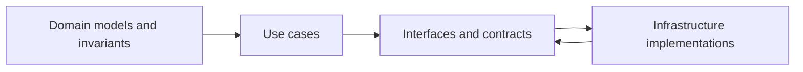
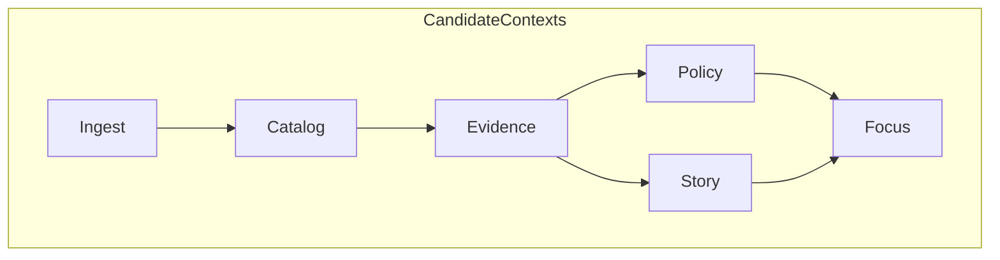

<!-- [KFM_META_BLOCK_V2]
doc_id: kfm://doc/2a5c5d7c-2d86-4b25-96c8-922b8939f2c0
title: Domains
type: standard
version: v1
status: draft
owners: KFM Maintainers (TBD)
created: 2026-03-01
updated: 2026-03-05
policy_label: public
related:
  - docs/MASTER_GUIDE_v13.md
  - docs/architecture/
  - docs/data/
  - schemas/
  - contracts/
  - src/server/
tags: [kfm, domains, ddd, bounded-contexts]
notes:
  - This README defines how we document bounded contexts and the domain language used across KFM.
  - This is NOT the data-domain ETL runbook location (see “Data domains vs software domains”).
  - Evidence discipline: repo facts vs recommendations are explicitly labeled CONFIRMED / PROPOSED / UNKNOWN.
[/KFM_META_BLOCK_V2] -->


<!-- TODO: replace/extend badges with repo-standard badges (CI, linkcheck, policy tests) once workflow names/paths are confirmed -->

# Domains
**Purpose:** Canonical home for KFM’s **bounded contexts**, **domain language**, and **domain invariants**—so implementations and user-facing outputs stay **traceable**, **testable**, and **policy-safe**.

> **Status:** draft · **Owners:** KFM Maintainers (TBD) · **Policy:** public  
> **Intended path:** `docs/domains/README.md`  
> **Jump to:** [What lives here](#what-lives-here) · [Confirmed vs proposed vs unknown](#confirmed-vs-proposed-vs-unknown) · [Domain map](#domain-map) · [Domain registry](#domain-registry) · [Templates](#appendix-templates)

---

## Quick navigation
- [What lives here](#what-lives-here)
- [Confirmed vs proposed vs unknown](#confirmed-vs-proposed-vs-unknown)
- [Data domains vs software domains](#data-domains-vs-software-domains)
- [How this fits the KFM architecture](#how-this-fits-the-kfm-architecture)
- [Domain map](#domain-map)
- [Core domain concepts](#core-domain-concepts)
- [Interfaces and contracts](#interfaces-and-contracts)
- [How to add or change a bounded context](#how-to-add-or-change-a-bounded-context)
- [Domain registry](#domain-registry)
- [Definition of Done](#definition-of-done)
- [Directory layout](#directory-layout)
- [FAQ](#faq)
- [Appendix Templates](#appendix-templates)

---

## What lives here

### ✅ This folder should contain
- Bounded-context documentation: what belongs together; what must stay apart.
- Ubiquitous language: terms, definitions, examples, and “this does *not* mean …” clarifications.
- Core entities & invariants: identity rules, time semantics, evidence requirements, policy propagation.
- Context maps: how contexts interact via explicit interfaces/contracts.
- Domain decisions (mini-ADRs) when boundaries/terms/invariants change.

### ❌ This folder must not contain
- Data ingestion runbooks, ETL step-by-steps, pipeline operator docs.  
  Put those in **data-domain** runbooks (see `docs/data/<domain>/...` if using the v13 layout).
- Implementation detail that belongs in code (framework choices, deployment steps, infra specifics).
- Story Node content (governed narrative artifacts).  
  Keep these in the governed Story Node area (commonly `docs/reports/story_nodes/`).

[Back to top](#domains)

---

## Confirmed vs proposed vs unknown

### Evidence labels used in this README
- **CONFIRMED** = supported by KFM v13 guides/blueprints included in this workspace.
- **PROPOSED** = recommended structure or naming; may change with repo decisions.
- **UNKNOWN** = requires checking the actual repo tree/CI/contracts before treating as true.

### CONFIRMED
- The canonical pipeline ordering and invariants include: **trust membrane**, **fail-closed/default-deny**, **contract-first**, and **evidence-first narrative** (Story Nodes and Focus Mode must cite or abstain).
- Data lifecycle staging uses **RAW → WORK → PROCESSED**, with catalog “boundary artifacts” in **STAC/DCAT/PROV** locations.
- UI/clients must not access storage/graph directly; access must cross the governed API boundary.

### PROPOSED
- Using `docs/domains/` as the canonical home for **software** “domains” (bounded contexts) and ubiquitous language.

### UNKNOWN
- Whether `docs/domains/contexts/` (and its exact substructure) already exists in the repo.
- The exact current list of bounded contexts and their owners in the live codebase.
- Which CI jobs are merge-blocking for domain docs and contract changes.

### Smallest verification steps to turn UNKNOWN into CONFIRMED
1. Capture repo commit + tree:
   - `git rev-parse HEAD`
   - `find docs -maxdepth 3 -type f | sort`
2. Confirm the authoritative location for bounded-context docs:
   - search repo for `bounded context`, `contexts/`, and existing “domain” directory naming
3. Confirm contract locations and names:
   - list `contracts/`, `schemas/`, and API contract folders under `src/server/` (if present)
4. Confirm CI checks that enforce doc/link/schema rules:
   - inspect `.github/workflows/` (or equivalent) for doc lint, schema validation, linkcheck, policy tests

[Back to top](#domains)

---

## Data domains vs software domains

> ⚠️ **Important distinction:** “Domains” here means **software/domain-model boundaries (bounded contexts)**.  
> “Data domains” (e.g., hydrology, air-quality, land-treaties) are a **data organization + runbook** concern.

### Data domains
**Goal (CONFIRMED):** keep raw/work/processed artifacts and their catalog outputs isolated and discoverable.

- **CONFIRMED** staging pattern:
  - `data/raw/<domain>/`
  - `data/work/<domain>/`
  - `data/processed/<domain>/`
- **CONFIRMED** catalog outputs:
  - `data/stac/collections/` and `data/stac/items/`
  - `data/catalog/dcat/`
  - `data/prov/`
- **CONFIRMED** runbook location pattern:
  - `docs/data/<domain>/README.md`

### Software domains
**Goal (CONFIRMED):** keep domain logic coherent and stable even as storage/indexing/UI changes.

Typical artifacts:
- Bounded contexts + context maps
- Entities + invariants (identity/time/policy/evidence semantics)
- Interface expectations and contract references (OpenAPI, JSON Schema, DTOs)

> TIP (PROPOSED): A data domain (hydrology) often maps to multiple software contexts (Ingest, Catalog, Evidence, Policy) because governance and provenance cut across datasets.

[Back to top](#domains)

---

## How this fits the KFM architecture

**CONFIRMED** reference posture is a clean layered architecture:

- **Domain**: pure domain models and rules (no infra calls)
- **Use cases**: workflows (ingest, promote, publish story, answer focus query)
- **Interfaces**: contracts, DTOs, schema registries, policy adapters, repository interfaces
- **Infrastructure**: storage/indexing/UI runtime dependencies


```mermaid
flowchart LR
  A[Domain models and invariants] --> B[Use cases]
  B --> C[Interfaces and contracts]
  C --> D[Infrastructure implementations]
  D --> C
```

**CONFIRMED invariant:** Domain logic must only talk outward through interfaces, never directly to infrastructure.

[Back to top](#domains)

---

## Domain map

This map is intentionally split into:
- **CONFIRMED (in design docs):** these are candidate contexts referenced in KFM blueprints
- **UNKNOWN (in repo):** whether these exist as concrete folders/modules today


```mermaid
flowchart TB
  subgraph CandidateContexts
    Ingest[Ingest]
    Catalog[Catalog]
    Evidence[Evidence]
    Policy[Policy]
    Story[Story]
    Focus[Focus]
  end

  Ingest --> Catalog
  Catalog --> Evidence
  Evidence --> Policy
  Policy --> Focus
  Evidence --> Story
  Story --> Focus
```

**How to use this map (PROPOSED)**
- Each box should have a corresponding doc under `docs/domains/contexts/<context-name>/README.md`.
- Each arrow implies an **explicit interface** (OpenAPI schema, DTO boundary, repository interface, or policy contract)—not an implicit shared-table dependency.

[Back to top](#domains)

---

## Core domain concepts

### Cross-cutting “governance” entities

These entities are **CONFIRMED** as core cross-cutting concepts in KFM design docs:

- Dataset
- DatasetVersion
- Artifact
- EvidenceRef
- EvidenceBundle
- PolicyDecision
- RunReceipt
- StoryNodeVersion
- MapState

> NOTE (PROPOSED): Treat these as “platform primitives.” They are the backbone for traceability across Map/Story/Focus, regardless of the domain topic.

### Optional narrative and science vocabulary

These are **PROPOSED** domain-language concepts that may be useful for Story Nodes and knowledge modeling,
but should not be treated as canonical until their invariants and evidence rules are specified:

- Place (spatially bounded concept)
- Event (time-bounded occurrence)
- Observation (measured or recorded datapoint)
- Agent (person or organization responsible for actions)
- Claim (narrative statement linked to evidence)
- Relationship (typed edge between entities)

### Domain invariants checklist

When documenting or changing a concept, capture:
- Identity rules: what makes two things “the same”?
- Time semantics: event time vs transaction time vs valid time (if applicable)
- Policy label propagation: what inherits restrictions?
- Evidence requirements: what does “supported” mean for this concept?
- Failure mode: default-deny / fail-closed expectations

[Back to top](#domains)

---

## Interfaces and contracts

**CONFIRMED principle:** contracts are first-class, machine-validated boundary artifacts.

**CONFIRMED boundary artifacts:**
- STAC (asset metadata)
- DCAT (dataset discovery metadata)
- PROV (lineage)

**CONFIRMED evidence flow pattern:**
- `EvidenceRef` → resolver applies policy → returns `EvidenceBundle` (with digests + audit refs)

**CONFIRMED narrative/AI posture:**
- Story Nodes publishing should require resolvable citations.
- Focus Mode must **cite or abstain**, and should be evaluated against a schema (golden queries) so regressions block merges.

[Back to top](#domains)

---

## How to add or change a bounded context

### Add a new bounded context doc
1. Create a context doc:
   - **PROPOSED path:** `docs/domains/contexts/<context-name>/README.md`
2. Define:
   - Responsibilities and non-responsibilities
   - Core entities owned by the context
   - Invariants (MUST/SHOULD language)
   - Inputs/outputs (interfaces + contracts)
   - Policy + evidence posture (default-deny triggers)
3. Add/update:
   - [Domain map](#domain-map)
   - [Domain registry](#domain-registry)

### Change an existing boundary or term
1. Add a decision note (mini-ADR):
   - **PROPOSED path:** `docs/domains/decisions/YYYY-MM-DD-short-title.md`
2. Update affected context docs and entity definitions.
3. Confirm downstream contracts remain valid:
   - schema/OpenAPI changes versioned appropriately
   - contract tests still pass
   - policy fixtures/regression tests updated (fail-closed preserved)

### Quickstart commands

```bash
# Inspect current Domains area (works even if tree isn't installed)
find docs/domains -maxdepth 3 -type f | sort

# Repo reality check (recommended)
git rev-parse HEAD
```

[Back to top](#domains)

---

## Domain registry

> Keep this table small and real. Never mark something “published” unless the referenced contracts + tests exist and pass.

| Context | Status | Owner | Primary interface examples | Notes |
|---|---|---|---|---|
| ingest | draft | TBD | acquisition manifest → dataset inputs | Candidate context from design docs |
| catalog | draft | TBD | STAC/DCAT/PROV generation contract | Candidate context from design docs |
| evidence | draft | TBD | EvidenceRef → EvidenceBundle resolver | Candidate context from design docs |
| policy | draft | TBD | allow/deny + obligations + reason codes | Candidate context from design docs |
| story | draft | TBD | Story Node v3 schema + publish gate | Candidate context from design docs |
| focus | draft | TBD | Focus ask/answer schema; cite-or-abstain | Candidate context from design docs |

[Back to top](#domains)

---

## Definition of Done

### For a new or changed context doc
- [ ] Purpose, responsibilities, and exclusions are explicit.
- [ ] Owned entities are explicit (and which context owns them).
- [ ] Invariants are listed in testable language (“MUST/SHOULD”).
- [ ] All dependencies are via interfaces (no hidden storage coupling).
- [ ] Evidence + policy implications are stated (default-deny on ambiguity).
- [ ] Links are present to relevant contracts/schemas (where known).
- [ ] If a boundary changed, there is a decision note under `docs/domains/decisions/`.

[Back to top](#domains)

---

## Directory layout

> **PROPOSED structure:** adjust to match repo reality, but keep the intent: “easy to find, hard to misunderstand.”

```text
docs/domains/
├── README.md
├── core/
│   ├── glossary.md                  # Ubiquitous language (canonical definitions)
│   ├── entities.md                  # Core entity definitions + invariants
│   └── identity-and-time.md         # Identity rules + time semantics
├── contexts/
│   ├── ingest/README.md
│   ├── catalog/README.md
│   ├── evidence/README.md
│   ├── policy/README.md
│   ├── story/README.md
│   └── focus/README.md
├── decisions/
│   └── YYYY-MM-DD-short-title.md    # Domain decision notes (mini-ADRs)
└── _templates/
    ├── context.README.template.md
    └── decision.template.md
```

> IMPORTANT (UNKNOWN): If your repo already uses `docs/domains/` for **data domains**, rename this directory to avoid collisions (e.g., `docs/bounded-contexts/` or `docs/software-domains/`). Use the verification checklist to confirm existing conventions before moving content.

[Back to top](#domains)

---

## FAQ

### Why separate software domains from data domains?
Because governance is cross-cutting: policy, provenance, and evidence resolution apply consistently across datasets, narratives, and AI answers. Keeping bounded contexts separate helps prevent accidental coupling (and makes policy bypass harder).

### What’s the “fail-closed” default in this area?
If a boundary, term, or evidence rule is ambiguous, treat it as **not safe to publish** until clarified and validated. Document the ambiguity and add the smallest verification steps to resolve it.

[Back to top](#domains)

---

## Appendix Templates

<details>
<summary><strong>Bounded context doc template</strong> (copy/paste)</summary>

```markdown
# <Context Name>

## Purpose
## Responsibilities
## Exclusions

## Owned entities
- ...

## Invariants
- MUST ...
- SHOULD ...

## Interfaces and contracts
### Inputs
### Outputs

## Policy and evidence posture
- Default-deny conditions:
- Redaction/generalization obligations:
- Citation expectations:

## Testing expectations
- Contract tests:
- Golden tests:
- Policy regression fixtures:
```
</details>

<details>
<summary><strong>Decision note template</strong> (copy/paste)</summary>

```markdown
# YYYY-MM-DD — <Decision title>

## Status
draft | review | accepted | superseded

## Context
## Decision
## Consequences
## Affected interfaces/contracts
## Migration notes
## Verification steps
```
</details>
