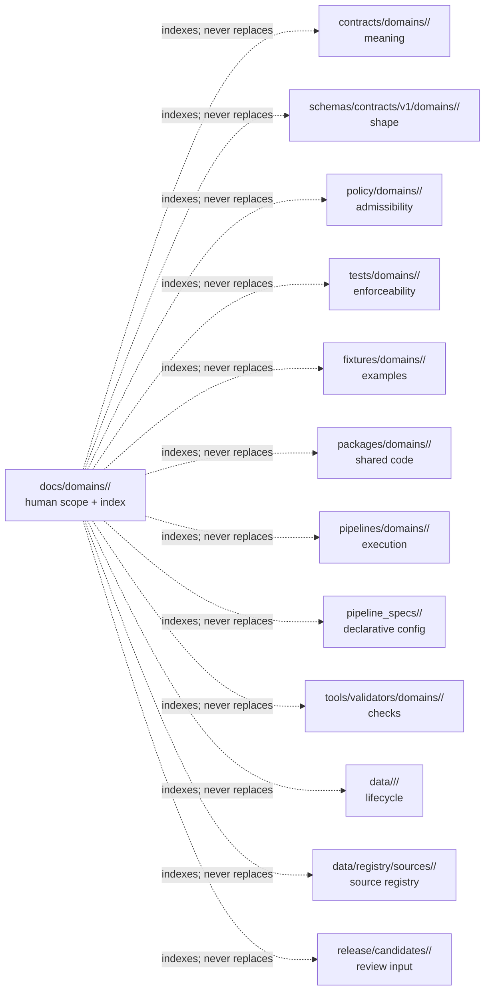

<!-- [KFM_META_BLOCK_V2]
doc_id: kfm://doc/docs-domains-readme
title: docs/domains/ — Domain Lane Documentation and Verification Index
type: readme
subtype: nested-directory-landing-page
version: v0.3
prior_version: v0.2
status: draft; repository-grounded; documentation-only; non-authoritative
owner: "NEEDS VERIFICATION — default CODEOWNERS routes this path to @bartytime4life and five sensitive-domain subtrees have explicit routes; no accepted domain-steward assignments, required-review rule, or independent approval control was verified"
created: 2026-05-20
updated: 2026-07-23
policy_label: public
current_path: docs/domains/README.md
owning_root: docs/
responsibility: orient readers to KFM domain lanes, expose current lane-document maturity and drift, and route enforceable concerns to their owning responsibility roots
truth_posture: cite-or-abstain
truth_labels: [CONFIRMED, PROPOSED, UNKNOWN, NEEDS VERIFICATION, CONFLICTED]
authority_class: directory landing page
authority_rank: subordinate to Directory Rules, reviewed decisions, contracts, schemas, policy, evidence, lifecycle records, and release records
canonical_relationship: same-path update; no sibling authority created
evidence_snapshot:
  repository: bartytime4life/Kansas-Frontier-Matrix
  base_ref: main
  base_commit: 19670ca8e2c8a709fc69cd41173851f8359c8281
  target_prior_blob: 5ee0df96f1beecc97ef385a8cadac6472597b9c4
  directory_rules_blob: 2affb080e6f0043867c64c7f06c1ca52030fbd55
  domain_lane_register_blob: 7cd641d99e1e4e3b3823f608d63679a438590c3a
  machine_domain_register_blob: 81b23beb3178b59d5c1fdb50edbc9f98f8664930
  codeowners_blob: dd2a84aa514d8ecd9208bc347f90f9a2ed37dd61
  workflows_readme_blob: afb4f79ce2c5267cb1679f48186260e6edebf8b2
  adr_index_blob: cf08fae322ac53426f7394d97897fdb942253049
  lane_readmes:
    confirmed_paths: 13
    substantive_drafts: 12
    placeholders: [soil]
    hydrology_blob: 57e5662e9481f8590238c21936b5d5e25f5176bb
    soil_blob: cf05c89d97bce097170c5266d477a3721b1ca0f5
    fauna_blob: ab08f2d63e03d37ff8cd9f308720c3503bfdb58f
    flora_blob: 43a47d828c4926e539790a055a5e1034c6ce62bc
    habitat_blob: 876d1fa41a00d94d7120c6ef065750748e6bf524
    geology_blob: 24dea0085e25e41a2cf53f2fe7904b306436b3a5
    atmosphere_blob: 005421a9a3851d8ddc64e79a6ad3653d65d57f78
    roads_rail_trade_blob: b4e2d45f183986040622882f2fe2a090ef9a118d
    settlements_infrastructure_blob: bccb04cd4f181ac5cc1c7935177bbd4977715e19
    archaeology_blob: e44040a1a2b4fd4ce027e336a9c2fe81b8f29795
    hazards_blob: 8aeff8396db3e38f71999a61c42fb94c39f2d579
    agriculture_blob: a2cac517ad26ea9105d46b5a7472de25cb35da2b
    people_dna_land_blob: 19a3ea59bab2d5e04c73f402a35048c1a55ab071
related:
  - docs/doctrine/directory-rules.md
  - docs/architecture/domain-placement-law.md
  - docs/registers/DOMAIN_LANE.md
  - control_plane/domain_lane_register.yaml
  - .github/CODEOWNERS
  - .github/workflows/README.md
  - docs/adr/INDEX.md
notes:
  - "v0.3 is a repository-grounded same-path modernization; no domain, contract, schema, policy, workflow, lifecycle, release, promotion, or publication state changes."
  - "All 13 Directory Rules §12 lane README paths were directly fetched. Twelve contain substantive draft documentation; soil/README.md remains a two-line greenfield placeholder."
  - "The human Domain Lane Register lists 13 lanes, while control_plane/domain_lane_register.yaml currently has entries: []; this README records the conflict rather than claiming synchronization."
  - "The 13 domain workflows are bounded readiness/hold surfaces. Workflow presence does not establish domain implementation, evidence closure, public safety, release, or publication."
[/KFM_META_BLOCK_V2] -->

<a id="top"></a>

# `docs/domains/`

> **Human-facing entry point for KFM’s domain lanes: scope, boundaries, sensitivity posture, documentation maturity, and routes to the responsibility roots that carry enforceable state.**

[](#status)
[](#authority-level)
[](#domain-inventory)
[](#status)
[](../../control_plane/domain_lane_register.yaml)
[](../../.github/workflows/README.md)
[](#authority-level)
[](#last-reviewed)

> [!IMPORTANT]
> **Domain documentation explains; it does not decide.** Object meaning belongs in `contracts/`, machine shape in `schemas/`, admissibility in `policy/`, enforceability evidence in `tests/` and `fixtures/`, lifecycle material in `data/`, and release/correction/rollback decisions in `release/`. A domain README, badge, diagram, workflow, or pull request is not canonical truth or publication authority.

> [!CAUTION]
> Exact rare-species, rare-plant, archaeological, sacred, living-person, DNA/genomic, land/title-like, and critical-infrastructure detail defaults to restriction, generalization, staged access, quarantine, or denial until rights, sovereignty, consent, sensitivity, policy, and review are resolved. KFM is not an emergency-alert authority.

> [!WARNING]
> The human [`DOMAIN_LANE.md`](../registers/DOMAIN_LANE.md) register describes 13 lanes, but [`control_plane/domain_lane_register.yaml`](../../control_plane/domain_lane_register.yaml) currently contains an empty `entries` array. Treat human/machine register synchronization as `CONFLICTED`, not complete.

<a id="quick-jumps"></a>

**Quick navigation:** [Purpose](#purpose) · [Authority](#authority-level) · [Status](#status) · [Belongs](#what-belongs-here) · [Exclusions](#what-does-not-belong-here) · [Inputs](#inputs) · [Outputs](#outputs) · [Validation](#validation) · [Review](#review-burden) · [Related](#related-folders) · [ADRs](#adrs) · [Last reviewed](#last-reviewed) · [Placement law](#domain-placement-law) · [Inventory](#domain-inventory) · [Landing pattern](#per-domain-landing-pattern) · [Change discipline](#change-discipline) · [Open verification](#open-questions--needs-verification) · [Evidence basis](#evidence-basis)

---

<a id="1-purpose"></a>

## Purpose

`docs/domains/` is the human-readable documentation lane for KFM’s bounded domains. It gives reviewers, contributors, and stewards one place to find each lane’s scope, non-scope, source families, lifecycle posture, sensitivity constraints, documentation state, and links to the roots that own enforceable behavior.

A domain grows as a **segment inside responsibility roots**, never as a new repository root. The landing pages here are indexes and explanations; they do not duplicate contracts, schemas, policy, fixtures, lifecycle records, evidence bundles, release decisions, or public routes.

[Back to top](#top)

---

<a id="2-authority-and-scope"></a>

## Authority level

| Concern | Owning authority | `docs/domains/` role |
|---|---|---|
| Domain placement | [`Directory Rules §12`](../doctrine/directory-rules.md#12-domain-placement-law) and reviewed decisions | Explain and index the lane pattern |
| Domain meaning | `contracts/` and reviewed domain contracts | Link and summarize without redefining |
| Machine shape | `schemas/` | Link to reviewed schemas; never host schema authority |
| Rights, sensitivity, consent, admissibility | `policy/` plus governed review | Explain outcomes and public-safe posture |
| Evidence and source authority | EvidenceBundle / SourceDescriptor authorities | Point to evidence; do not elevate prose to proof |
| Lifecycle state | governed `data/` phases | Describe movement; do not promote |
| Release, correction, withdrawal, rollback | `release/` | Link to decisions and lineage; do not approve |
| Public delivery | governed API and released/public-safe artifacts | Document the boundary; do not bypass it |
| This file | directory landing page | Navigation, status disclosure, and drift visibility only |

When this README conflicts with current Directory Rules, a reviewed decision, or current repository evidence, use the owning authority, record the drift, and correct this file.

[Back to top](#top)

---

<a id="3-status-and-evidence-basis"></a>

## Status

### Repository-grounded snapshot

| Surface | Current evidence at `main@19670ca8…` | Safe conclusion |
|---|---|---|
| `docs/domains/README.md` | **CONFIRMED** v0.2 baseline, blob `5ee0df9…` | Same-path v0.3 modernization |
| Canonical lane README paths | **CONFIRMED 13/13 present** | Path coverage is complete for the §12 lane set |
| Lane-document maturity | **12 substantive drafts; 1 placeholder (`soil`)** | Documentation maturity is mixed; no lane is promoted to implemented or released |
| Human domain register | **CONFIRMED present**, v0.1 draft | Lists 13 lanes but carries stale “unverified path” language |
| Machine domain register | **CONFIRMED present; `entries: []`** | Human/machine register synchronization is `CONFLICTED` |
| CODEOWNERS | **CONFIRMED** default route to `@bartytime4life`; explicit routes for archaeology, fauna, flora, people-DNA-land, and settlements-infrastructure | Review routing exists; stewardship and required review remain separate |
| Domain workflows | **CONFIRMED 13 definitions** | Bounded readiness/hold surfaces, not full domain validation or release proof |
| Complete recursive lane inventory | **UNKNOWN** | This update verified root README paths and selected connected files, not every descendant |
| Cross-root slug consistency | **CONFLICTED / NEEDS VERIFICATION** | Current lane docs surface `air`/`atmosphere`, `transport`/`roads-rail-trade`, and `people`/`people-dna-land` variants |
| Runtime, evidence, policy, release, publication maturity | **UNKNOWN** | Not established by documentation presence |

### Truth labels used here

| Label | Meaning |
|---|---|
| `CONFIRMED` | Verified from current repository bytes, workflow definitions, or direct comparisons in this update |
| `PROPOSED` | Design, target state, future work, or unaccepted decision |
| `UNKNOWN` | Evidence is insufficient for a stronger claim |
| `NEEDS VERIFICATION` | A concrete check exists but is not closed |
| `CONFLICTED` | Two relevant authority or implementation surfaces disagree |

[Back to top](#top)

---

<a id="4-what-belongs-here"></a>

## What belongs here

A `docs/domains/<slug>/` lane may contain human-facing material such as:

- a bounded `README.md` for scope, authority, status, exclusions, inputs, outputs, validation, review, and related roots;
- domain architecture and trust-path explanations;
- human source, schema, validator, fixture, and file indexes that link to—not replace—their owning roots;
- rights, sensitivity, sovereignty, consent, public-safety, and publication guidance;
- lineage, preservation, migration, supersession, correction, rollback, and release-history documentation;
- verification backlogs, open questions, changelogs, glossaries, and promoted planning material;
- domain-local decision records only when a reviewed repository decision establishes that pattern.

The canonical Directory Rules §12 lane slugs are:

```text
hydrology
soil
fauna
flora
habitat
geology
atmosphere
roads-rail-trade
settlements-infrastructure
archaeology
hazards
agriculture
people-dna-land
```

A new, renamed, merged, or retired lane requires reviewed decision and coordinated register, navigation, compatibility, migration, and rollback work.

[Back to top](#top)

---

<a id="5-what-does-not-belong-here"></a>

## What does NOT belong here

| Material | Owning surface |
|---|---|
| Semantic object contracts | [`contracts/`](../../contracts/README.md) |
| JSON Schema or other machine-checkable shape | [`schemas/`](../../schemas/README.md) |
| Allow / deny / restrict / hold / abstain logic | [`policy/`](../../policy/README.md) |
| Executable tests | [`tests/`](../../tests/README.md) |
| Golden, valid, invalid, negative, or runtime examples | [`fixtures/`](../../fixtures/README.md) |
| Shared domain code | [`packages/`](../../packages/README.md) |
| Executable transformations | [`pipelines/`](../../pipelines/README.md) |
| Declarative pipeline specifications | [`pipeline_specs/`](../../pipeline_specs/README.md) |
| Connectors and source admission code | [`connectors/`](../../connectors/README.md) |
| RAW, WORK, QUARANTINE, PROCESSED, CATALOG, TRIPLET, or PUBLISHED material | [`data/`](../../data/README.md) |
| Machine governance or source/dataset registers | `control_plane/` or governed `data/registry/` lanes |
| Release, correction, withdrawal, rollback, promotion, or publication decisions | [`release/`](../../release/README.md) |
| Public application or API code | `apps/` |
| Secrets, credentials, private keys, signed URLs, or restricted precise locations | Never in public documentation |

> [!WARNING]
> A domain documentation folder containing schemas, OPA bundles, fixtures, executable pipelines, release manifests, evidence bundles, run receipts, proof packs, or public UI/API code is placement drift. Move the material to the owning responsibility root and leave only a descriptive link or index entry here.

[Back to top](#top)

---

<a id="9-inputs"></a>

## Inputs

Admissible inputs include:

- current KFM doctrine and reviewed decisions;
- current repository bytes, tests, validators, workflows, manifests, logs, and generated artifacts tied to a known revision;
- per-domain source dossiers, architecture references, source-role records, rights information, and sensitivity review;
- contracts, schemas, policy, fixtures, lifecycle records, release/correction/rollback records, and public-client boundaries;
- human and machine drift, verification, lineage, and domain registers.

Generated language, planning artifacts, badges, workflow names, and repository convention alone do not become domain truth or reviewed authority.

<a id="10-outputs"></a>

## Outputs

This folder supports:

- navigable domain scope and boundary documentation;
- links to responsibility-root segments that own enforceable state;
- visible lane maturity, conflicts, unknowns, and verification backlogs;
- reviewable sensitivity, rights, sovereignty, consent, and public-safe publication guidance;
- migration, correction, supersession, and rollback context;
- cross-domain coordination without creating new root authority.

It emits no lifecycle artifact, policy approval, release object, deployment, or publication.

[Back to top](#top)

---

<a id="11-validation"></a>

## Validation

| Check | Current state | Evidence / limit |
|---|---|---|
| Root README same-path identity | **PASS** | Existing target retained; no sibling or replacement authority |
| Directory Rules README order | **PASS** | First twelve H2 sections follow Purpose → Last reviewed |
| Canonical lane README presence | **PASS: 13/13** | Direct fetch of every §12 lane path |
| Lane-document maturity classification | **PASS, bounded** | Twelve substantive drafts; soil is a two-line placeholder |
| Human/machine register parity | **CONFLICTED** | Human register lists 13; machine register has `entries: []` |
| CODEOWNERS routing | **PASS, bounded** | Default route plus five explicit sensitive-domain routes |
| Dedicated aggregate domain-index validator | **NOT ESTABLISHED in bounded search** | No complete root-lane parity command was verified |
| Domain workflow definitions | **PASS: 13 present** | Classified by workflow inventory as bounded readiness/hold surfaces |
| Per-lane §15 conformance | **NOT RUN / NEEDS VERIFICATION** | Requires complete file audits or accepted validator |
| Cross-root slug consistency | **CONFLICTED / NOT RUN** | Known variants remain unresolved; no complete scan claimed |
| Prohibited-file scan under `docs/domains/` | **NOT RUN** | Complete recursive file/type inventory was outside this one-file update |
| Internal links and local anchors changed here | **PASS by bounded source inspection** | Host rendering and external endpoint reachability not run |
| Repository `link-check` | **HOLD** | Workflow explicitly states that no documentation links or anchors are checked |
| Repository `docs-build` | **HOLD** | No accepted documentation generator or preview publication handoff |
| Current pull-request checks | **PENDING** | Must be read from the exact implementation commit |

Passing these checks does not prove source authority, evidence closure, rights clearance, policy approval, implementation completeness, release, public safety, or KFM publication.

[Back to top](#top)

---

<a id="12-review-burden"></a>

## Review burden

| Change | Required posture |
|---|---|
| Typo, stale-status correction, navigation, or dead-link repair | Scoped documentation review |
| Domain meaning or source-role change | Domain, source, evidence, and contract review as applicable |
| Rights, sensitivity, living-person, DNA, archaeology, ecology, infrastructure, or life-safety posture | Domain plus appropriate rights/sensitivity/sovereignty/public-safety review |
| Add, rename, merge, or retire a lane | Reviewed ADR-class decision, compatibility map, migration plan, register updates, and rollback |
| Change schema-home, policy-home, lifecycle, trust-membrane, or release boundaries | Owning authority and reviewed decision; this README cannot authorize it |
| Merge or publication | Outside this file and outside ordinary documentation review |

`.github/CODEOWNERS` routes all paths through its default owner and adds explicit routes for five sensitive domain subtrees. That is GitHub review routing—not proof of stewardship assignment, independent approval, release authority, or completed review.

[Back to top](#top)

---

<a id="13-related-folders"></a>

## Related folders

| Path | Relationship |
|---|---|
| [`../doctrine/directory-rules.md`](../doctrine/directory-rules.md) | Placement doctrine, Domain Placement Law, README contract, anti-patterns |
| [`../architecture/domain-placement-law.md`](../architecture/domain-placement-law.md) | Architecture-side elaboration; subordinate to Directory Rules |
| [`../registers/DOMAIN_LANE.md`](../registers/DOMAIN_LANE.md) | Human domain-lane register; current content is draft and partly stale |
| [`../../control_plane/domain_lane_register.yaml`](../../control_plane/domain_lane_register.yaml) | Machine register scaffold; currently empty |
| [`../../.github/workflows/README.md`](../../.github/workflows/README.md) | Workflow maturity and safety inventory |
| [`../../contracts/README.md`](../../contracts/README.md) | Semantic meaning |
| [`../../schemas/README.md`](../../schemas/README.md) | Machine-checkable shape |
| [`../../policy/README.md`](../../policy/README.md) | Admissibility and public-safety decisions |
| [`../../tests/README.md`](../../tests/README.md) | Enforceability evidence |
| [`../../fixtures/README.md`](../../fixtures/README.md) | Representative examples |
| [`../../packages/README.md`](../../packages/README.md) | Shared implementation packages |
| [`../../pipelines/README.md`](../../pipelines/README.md) | Executable transformations |
| [`../../pipeline_specs/README.md`](../../pipeline_specs/README.md) | Declarative pipeline specifications |
| [`../../data/README.md`](../../data/README.md) | Lifecycle material |
| [`../../release/README.md`](../../release/README.md) | Promotion, release, correction, withdrawal, rollback |
| [`../../apps/governed-api/README.md`](../../apps/governed-api/README.md) | Governed client boundary |
| [`../../apps/explorer-web/README.md`](../../apps/explorer-web/README.md) | Map-first client surface |

[Back to top](#top)

---

<a id="14-adrs"></a>

## ADRs

The current ADR index records every numbered ADR as effective status `proposed`. This README does not promote any of them.

| ADR | Domain-lane relevance | Effective status |
|---|---|---|
| [`ADR-0001`](../adr/ADR-0001-schema-home--schemas-contracts-v1-is-canonical.md) | Default schema home | `proposed` |
| [`ADR-0009`](../adr/ADR-0009-hydrology-is-the-first-proof-bearing-lane.md) | Hydrology proof-lane proposal | `proposed` |
| [`ADR-0010`](../adr/ADR-0010-deny-by-default-for-dna-rare-species-archaeology-infrastructure.md) | Sensitive-domain deny-by-default proposal | `proposed` |
| [`ADR-0025`](../adr/ADR-0025-public-client-never-reads-canonical-internal-stores.md) | Public client trust boundary | `proposed` |
| [`ADR-0027`](../adr/ADR-0027-county-focus-mode-control-plane.md) | Focus Mode is cross-domain, not a domain replacement | `proposed` |
| [`ADR-0028`](<../adr/ADR-0028 — State-scale Focus Mode scope.md>) | State-scale Focus Mode and 13-domain coverage | `proposed` |
| [`ADR index`](../adr/INDEX.md) | Numbered inventory and effective-status crosswalk | all numbered records `proposed` |

No accepted indexed ADR was verified that adds, removes, renames, merges, or retires a domain lane.

[Back to top](#top)

---

## Last reviewed

**2026-07-23** — v0.3 repository-grounded same-path modernization.

Older than six months: flag for review under [`Directory Rules §15`](../doctrine/directory-rules.md#15-required-readme-contract).

| Edition | Date | Change |
|---|---|---|
| **v0.3** | 2026-07-23 | Verified all 13 lane README paths; classified twelve substantive drafts and one placeholder; aligned the first twelve H2 sections to the folder-README contract while retaining legacy anchors; confirmed CODEOWNERS and 13 workflow definitions; surfaced the empty machine register and slug conflicts; repaired current links and validation language. **No domain or governing behavior changed.** |
| **v0.2** | 2026-06-11 | Expanded governance, placement, inventory, validation, and backlog guidance. |
| **v0.1** | 2026-05-20 | Initial domain landing page. |

[Back to top](#top)

---

<a id="6-domain-placement-law"></a>

## Domain Placement Law

A domain must remain a lane segment inside responsibility roots:


```mermaid
flowchart LR
    DOCS["docs/domains/<slug>/<br/>human scope + index"]
    CONTRACTS["contracts/domains/<slug>/<br/>meaning"]
    SCHEMAS["schemas/contracts/v1/domains/<slug>/<br/>shape"]
    POLICY["policy/domains/<slug>/<br/>admissibility"]
    TESTS["tests/domains/<slug>/<br/>enforceability"]
    FIXTURES["fixtures/domains/<slug>/<br/>examples"]
    PACKAGES["packages/domains/<slug>/<br/>shared code"]
    PIPELINES["pipelines/domains/<slug>/<br/>execution"]
    PSPECS["pipeline_specs/<slug>/<br/>declarative config"]
    TOOLS["tools/validators/domains/<slug>/<br/>checks"]
    DATA["data/<phase>/<slug>/<br/>lifecycle"]
    REGISTRY["data/registry/sources/<slug>/<br/>source registry"]
    RELEASE["release/candidates/<slug>/<br/>review input"]

    DOCS -. "indexes; never replaces" .-> CONTRACTS
    DOCS -. "indexes; never replaces" .-> SCHEMAS
    DOCS -. "indexes; never replaces" .-> POLICY
    DOCS -. "indexes; never replaces" .-> TESTS
    DOCS -. "indexes; never replaces" .-> FIXTURES
    DOCS -. "indexes; never replaces" .-> PACKAGES
    DOCS -. "indexes; never replaces" .-> PIPELINES
    DOCS -. "indexes; never replaces" .-> PSPECS
    DOCS -. "indexes; never replaces" .-> TOOLS
    DOCS -. "indexes; never replaces" .-> DATA
    DOCS -. "indexes; never replaces" .-> REGISTRY
    DOCS -. "indexes; never replaces" .-> RELEASE
```

The lifecycle remains:

```text
RAW -> WORK / QUARANTINE -> PROCESSED -> CATALOG / TRIPLET -> PUBLISHED
```

Promotion is a governed state transition, not a file move. Public clients use governed APIs and released/public-safe artifacts. Cross-domain material belongs under the lowest common responsibility root without pretending one domain owns it. Focus Modes compose domains; they do not replace them.

> [!NOTE]
> Directory Rules supplies the target pattern. Current lane documents expose unresolved path variants for some families; this README records those as conflicts rather than silently normalizing implementation.

[Back to top](#top)

---

<a id="7-domain-inventory"></a>

## Domain inventory

| Slug | README state | Current bounded finding | Public / sensitivity boundary |
|---|---|---|---|
| [`hydrology`](./hydrology/README.md) | Substantive draft, v2 | Early proof-lane language; flat-versus-`domains/` path conflict remains documented | Regulatory flood context is not observed flooding; not an alert system |
| [`soil`](./soil/README.md) | **Placeholder** | Two-line greenfield README; domain workflow expects placeholder posture | No agronomic, engineering, conservation-compliance, land-value, or regulatory determination |
| [`fauna`](./fauna/README.md) | Substantive draft, v1.1 | Sensitive occurrence and geoprivacy controls documented | Exact sensitive occurrences deny/restrict by default |
| [`flora`](./flora/README.md) | Substantive draft, v2 | Rare/protected/culturally sensitive flora controls documented | Exact rare/culturally sensitive geometry fails closed |
| [`habitat`](./habitat/README.md) | Substantive draft, v1.1 | Suitability/connectivity lane; Atlas flat-path variance documented | Stewardship zones and linked sensitive ecology require generalization/review |
| [`geology`](./geology/README.md) | Substantive draft, v1 | Geology/natural-resources lane; object-name and path drift surfaced | Sensitive subsurface/resource detail requires policy gating |
| [`atmosphere`](./atmosphere/README.md) | Substantive draft, v0.2 | `air` versus `atmosphere` schema/contract slug conflict documented | Context only; not emergency advisory or life-safety authority |
| [`roads-rail-trade`](./roads-rail-trade/README.md) | Substantive draft, v1.1 | Contract/schema docs use `transport` while lane slug is `roads-rail-trade` | Infrastructure-vulnerability detail requires restriction |
| [`settlements-infrastructure`](./settlements-infrastructure/README.md) | Substantive draft, v1 | Settlement and infrastructure scope documented | Critical-asset exactness fails closed |
| [`archaeology`](./archaeology/README.md) | Substantive draft, v2 | Cultural review, CARE, and T4 posture documented | Sites, burials, sacred places, and sovereignty-sensitive records restrict/deny |
| [`hazards`](./hazards/README.md) | Substantive draft, v2 | Historical/regulatory/observational/modeled context lane | KFM is never a life-safety alert authority |
| [`agriculture`](./agriculture/README.md) | Substantive draft, v2 proposed | Rich doctrine draft still contains stale “no mounted repo” provenance language | Aggregate/public-safe posture; private joins and field-level exposure require rights/policy |
| [`people-dna-land`](./people-dna-land/README.md) | Substantive draft, v1.1 | `people` versus `people-dna-land` segment conflict documented | Living-person, DNA/genomic, kinship, title-like, and person-parcel joins deny/restrict by default |

**Inventory limit:** this table verifies the 13 lane README paths and their bounded landing-page posture. It does not claim complete descendant-file, contract, schema, policy, source, test, lifecycle, runtime, or release coverage.

[Back to top](#top)

---

<a id="8-per-domain-landing-pattern"></a>

## Per-domain landing pattern

Use the smallest useful document set for each lane; do not create empty boilerplate merely to match a tree.

```text
docs/domains/<slug>/
├── README.md
├── ARCHITECTURE.md                 # optional, when the lane needs a trust-path model
├── SOURCE_INDEX.md                 # human index; machine registry remains elsewhere
├── SCHEMA_INDEX.md                 # links to schema authority
├── VALIDATOR_INDEX.md              # links to executable checks
├── PUBLICATION_AND_POLICY.md       # rights, sensitivity, public-safe posture
├── ROLLBACK_AND_CORRECTION.md      # correction, supersession, rollback
├── VERIFICATION_BACKLOG.md
├── OPEN_QUESTIONS.md
└── CHANGELOG.md
```

Authoring rules:

1. One reviewed decision, one owning authority.
2. No machine truth, policy bundles, fixtures, manifests, receipts, proofs, or executable code in domain docs.
3. Preserve stable paths and anchors where practical.
4. Separate path presence, document status, implementation state, review state, release state, and publication state.
5. Cite evidence or narrow the claim.
6. Sensitive and rights-unclear content fails closed.
7. Record path aliases and migrations explicitly; do not let compatibility names evolve independently.

[Back to top](#top)

---

## Change discipline

| Change | Required treatment |
|---|---|
| Editorial clarification, status reconciliation, dead-link repair | Scoped documentation PR |
| Add a human index or architecture note inside an existing lane | Domain/docs review; preserve owning-root boundaries |
| Change domain scope, source role, sensitivity posture, or public boundary | Owning contract/policy/evidence review and decision record as applicable |
| Add, rename, merge, or retire a lane | ADR-class decision, compatibility map, registry updates, migration, correction, rollback |
| Move machine or lifecycle material into or out of docs | Directory Rules preflight; no parallel authority |
| Promote a lane from draft/readiness to implemented/released/published | Evidence from the owning implementation, validation, policy, review, and release surfaces—not a README edit |

Prefer the smallest reversible change. Documentation polish must project evidence, not manufacture maturity.

[Back to top](#top)

---

<a id="appendix-a--open-questions-and-verification-backlog"></a>

## Open questions / NEEDS VERIFICATION

1. **CONFLICTED — human/machine register parity.** Populate or deliberately retire `control_plane/domain_lane_register.yaml`; do not describe empty `entries` as synchronized.
2. **NEEDS VERIFICATION — soil documentation.** Replace the greenfield placeholder only after inspecting its connected contract, schema, policy, fixture, validator, data, and release lanes.
3. **NEEDS VERIFICATION — per-lane README contract.** Audit all 13 files against Directory Rules §15 without forcing identical optional sections or deleting domain-specific safety guidance.
4. **CONFLICTED — slug identity.** Resolve `air`/`atmosphere`, `transport`/`roads-rail-trade`, and `people`/`people-dna-land` through reviewed crosswalks, compatibility rules, and migrations.
5. **NEEDS VERIFICATION — recursive inventory.** Scan `docs/domains/` for prohibited machine, policy, fixture, lifecycle, release, receipt, proof, and code files.
6. **NEEDS VERIFICATION — cross-root parity.** Compare all 13 slugs across contracts, schemas, policy, tests, fixtures, packages, pipelines, pipeline specs, data phases, registries, and release candidates.
7. **NEEDS VERIFICATION — workflow outcomes.** The 13 workflows are readiness surfaces; determine which failures are intentional holds, missing boundaries, or implementation drift at each exact revision.
8. **NEEDS VERIFICATION — stewardship and separation of duties.** CODEOWNERS routing is not an accepted domain, rights, sensitivity, cultural, release, or publication assignment.
9. **NEEDS VERIFICATION — source rights and public-safe transforms.** Close rights, attribution, freshness, sensitivity, and correction obligations per source family before release.
10. **OPEN — non-domain capability areas.** Keep cross-cutting cartography, time, 3D/digital-twin, and Focus Mode composition under their responsibility roots unless a reviewed decision admits a new domain lane.

Track closures in the owning register, ADR, domain backlog, contract, policy, validation artifact, or release record.

[Back to top](#top)

---

<a id="appendix-b--evidence-basis-for-this-readme"></a>

## Evidence basis

This update directly inspected:

- the complete v0.2 target;
- Directory Rules §12 and §15;
- all 13 canonical lane README paths;
- the human Domain Lane Register and empty machine domain register;
- current CODEOWNERS routing;
- the workflow maturity inventory and Soil readiness workflow;
- related root READMEs for contracts, schemas, policy, tests, fixtures, packages, pipelines, pipeline specs, data, release, and public clients;
- the current ADR index.

It did **not** perform a complete recursive repository tree export, execute every domain workflow, validate every lane’s links and anchors, inspect every contract/schema/policy/data/release descendant, observe runtime systems, or host-render this Markdown. Those remain bounded verification work.

---

<sub>This file is a domain documentation index. When it conflicts with Directory Rules, a reviewed decision, contract, schema, policy decision, evidence record, lifecycle record, or release record, use the owning authority, record the conflict, and correct this README.</sub>
