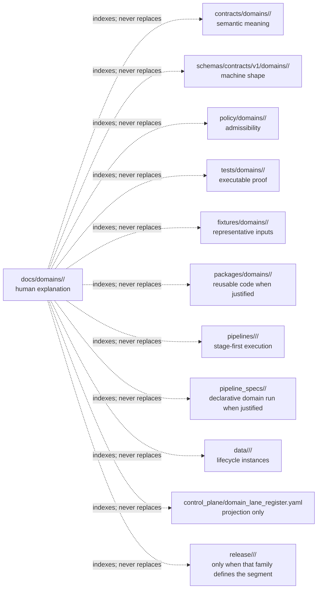

<!-- [KFM_META_BLOCK_V2]
doc_id: kfm://doc/docs-domains-readme
title: docs/domains/ — Domain Lane Documentation and Verification Index
type: readme
subtype: nested-directory-landing-page
version: v0.4
prior_version: v0.3
status: draft; repository-grounded; documentation-only; non-authoritative
owners:
  - "@bartytime4life — verified GitHub review route"
  - "NEEDS VERIFICATION — domain steward assignments and independent review"
created: 2026-05-20
updated: 2026-08-14
policy_label: public
current_path: docs/domains/README.md
owning_root: docs/
responsibility: "Orient readers to the 13 KFM domain-documentation lanes, expose current lane and register maturity, preserve sensitive-domain boundaries, and route enforceable concerns to their owning responsibility roots."
truth_posture: cite-or-abstain
truth_labels: [CONFIRMED, PROPOSED, UNKNOWN, NEEDS VERIFICATION, CONFLICTED, HOLD]
authority_class: explanatory directory landing page
authority_rank: subordinate to accepted Directory Rules, reviewed decisions, contracts, schemas, policy, evidence, lifecycle records, and release records
canonical_relationship: same-path update; no sibling authority created
evidence_snapshot:
  repository: bartytime4life/Kansas-Frontier-Matrix
  base_ref: main
  base_commit: dc30e1d38f9a4ecf45fd589d388886fc872dd189
  target_prior_blob: 0477583eb94b060e92d0aa33c085325a62422280
  target_last_prior_update_commit: 27e1f07370d09176a8882cf8edd06e44302cbf50
  directory_rules_blob: fd49a0b83e55cef52c1124281f093e263526898d
  directory_rules_adoption_adr_blob: a4de0d7a96b78da59cfc499d1025e1508afd8dd9
  adr_index_blob: bf22ecf2ab6905f12e55520fb09defa84b5d2180
  domain_lane_register_blob: 1bfc6f91cfa713a5e3d51ece011b63b46310734f
  domain_lane_schema_blob: 62776893b6589aacf8ffc5d14be3b39f68439c0b
  domain_lane_validator_blob: 0ed8fbbec788d785fbd7ae1a8ad878af567dbf2a
  domain_lane_validator_test_blob: 89f1887ceebe44c3fd0954471a5c12e53c332880
  domain_lane_workflow_blob: 318214ba62830d255429fa257c3391276f5a2bf0
  domain_lane_generated_receipt_blob: 9185c351880b5a210ab18a16468c9e312e677187
  narrative_domain_register_blob: 7cd641d99e1e4e3b3823f608d63679a438590c3a
  architecture_domain_placement_blob: 1dc0f5605d027f99d2869817e3a2956dfe489949
  control_plane_domains_readme_blob: bb69740082dbb10c6f37d5164382bd40f564c801
  codeowners_blob: dd2a84aa514d8ecd9208bc347f90f9a2ed37dd61
  workflows_readme_blob: 0b19d140a568114f4cef66cf7dac04df2d4e9585
  lane_readmes:
    direct_child_lanes: 13
    substantive_readmes: 13
    placeholders: []
    agriculture_blob: a2cac517ad26ea9105d46b5a7472de25cb35da2b
    archaeology_blob: e44040a1a2b4fd4ce027e336a9c2fe81b8f29795
    atmosphere_blob: 700004c46bcdf691e8a298550f33b667550f7d12
    fauna_blob: ab08f2d63e03d37ff8cd9f308720c3503bfdb58f
    flora_blob: 43a47d828c4926e539790a055a5e1034c6ce62bc
    geology_blob: 9f56f449a300f418f0debe2485f574744a1f0bc9
    habitat_blob: 876d1fa41a00d94d7120c6ef065750748e6bf524
    hazards_blob: 8aeff8396db3e38f71999a61c42fb94c39f2d579
    hydrology_blob: 72d7d2608dfa7b40e4515aacb213bed0b46cbfee
    people_dna_land_blob: 19a3ea59bab2d5e04c73f402a35048c1a55ab071
    roads_rail_trade_blob: b4e2d45f183986040622882f2fe2a090ef9a118d
    settlements_infrastructure_blob: bccb04cd4f181ac5cc1c7935177bbd4977715e19
    soil_blob: 06cfbebc3ce130753d4aff766645765747e1dae6
related:
  - docs/doctrine/directory-rules.md
  - docs/adr/ADR-0029-adopt-directory-governance-standard-v2.md
  - docs/adr/INDEX.md
  - docs/architecture/domain-placement-law.md
  - docs/registers/DOMAIN_LANE.md
  - control_plane/domain_lane_register.yaml
  - schemas/contracts/v1/governance/domain_lane_register.schema.json
  - tools/validators/directory_governance/validate_domain_lane_register.py
  - tests/validators/directory_governance/test_validate_domain_lane_register.py
  - .github/workflows/domain-lane-register.yml
  - .github/CODEOWNERS
notes:
  - "v0.4 reconciles the landing page to accepted ADR-0029, the populated 13-entry machine projection, its schema/validator/test/workflow stack, and the current 13 substantive lane READMEs."
  - "The v0.3 claims that Soil was a placeholder, the machine register was empty, and every numbered ADR was proposed are superseded by current repository evidence."
  - "The human Domain Lane Register and control_plane/domains/README.md still contain stale pre-population language; this file records that documentation drift without changing those paths."
  - "This one-file documentation update changes no domain identity, contract, schema, policy, source, workflow, lifecycle record, release decision, route, deployment, promotion, or publication state."
[/KFM_META_BLOCK_V2] -->

<a id="top"></a>

# `docs/domains/`

> **Human-facing entry point for KFM's domain lanes: scope, bounded-context identity, sensitivity posture, current documentation maturity, register status, and routes to the responsibility roots that carry enforceable state.**

[](#status)
[](#authority-level)
[](../adr/ADR-0029-adopt-directory-governance-standard-v2.md)
[](#domain-inventory)
[](#domain-inventory)
[](../../control_plane/domain_lane_register.yaml)
[](#cross-root-identity-and-alias-posture)
[](#authority-level)
[](#last-reviewed)

> [!IMPORTANT]
> **Domain documentation explains and indexes; it does not decide.** Object meaning belongs in `contracts/`, machine shape in `schemas/`, admissibility in `policy/`, enforceability evidence in `tests/` and `fixtures/`, lifecycle material in `data/`, and promotion, release, correction, withdrawal, and rollback decisions in `release/`. A README, badge, diagram, workflow, commit, pull request, or machine projection is not canonical domain truth or publication authority.

> [!CAUTION]
> Exact rare-species, rare-plant, archaeological, sacred, living-person, DNA/genomic, land/title-like, private-well, and critical-infrastructure detail fails closed until rights, sovereignty, consent, sensitivity, policy, review, and release posture are resolved. KFM is not an emergency-alert or life-safety authority.

> [!NOTE]
> The machine projection is no longer empty. [`control_plane/domain_lane_register.yaml`](../../control_plane/domain_lane_register.yaml) now carries 13 ordered lane entries and is supported by a schema, deterministic validator, focused tests, a read-only workflow, and a generated authoring receipt. It remains `PROPOSED` and `machine_projection_only`; it does not create domains, assign stewards, adopt sensitivity policy, activate sources, write lifecycle state, release, deploy, promote, or publish.

<a id="quick-jumps"></a>

**Quick navigation:** [Purpose](#purpose) · [Authority](#authority-level) · [Status](#status) · [Direct children](#current-direct-child-map) · [Register stack](#domain-register-stack) · [Inventory](#domain-inventory) · [Belongs](#what-belongs-here) · [Exclusions](#what-does-not-belong-here) · [Placement law](#domain-placement-law) · [Aliases](#cross-root-identity-and-alias-posture) · [Inputs](#inputs) · [Outputs](#outputs) · [Validation](#validation) · [Review](#review-burden) · [Landing pattern](#per-domain-landing-pattern) · [Change discipline](#change-discipline) · [Related](#related-folders) · [ADRs](#adrs) · [Open verification](#open-questions--needs-verification) · [Evidence](#evidence-basis) · [Last reviewed](#last-reviewed)

---

<a id="purpose"></a>
<a id="1-purpose"></a>

## Purpose

`docs/domains/` is the public human-readable documentation lane for KFM's bounded domains. It gives reviewers, contributors, and future stewards one place to find each lane's:

- bounded scope and explicit non-scope;
- source-family and source-role posture;
- spatial, temporal, evidence, and identity constraints;
- rights, sensitivity, sovereignty, consent, and public-safety boundary;
- documentation and implementation maturity;
- links to semantic contracts, machine schemas, policy, fixtures, tests, lifecycle records, and release controls in their owning roots; and
- open conflicts, aliases, verification residue, correction requirements, and rollback expectations.

A domain grows as a **segment inside responsibility roots**, never as a new repository root. The landing pages here are explanatory indexes. They do not duplicate contracts, schemas, policy, source registries, executable code, fixtures, lifecycle records, EvidenceBundles, release decisions, or public routes.

[Back to top](#top)

---

<a id="authority-level"></a>
<a id="2-authority-and-scope"></a>

## Authority level

| Concern | Owning authority | Role of `docs/domains/` |
|---|---|---|
| Placement and root responsibility | Accepted [Directory Rules v2](../doctrine/directory-rules.md) through [ADR-0029](../adr/ADR-0029-adopt-directory-governance-standard-v2.md) | Explain the lane pattern and surface drift |
| Domain-lane identity projection | [`control_plane/domain_lane_register.yaml`](../../control_plane/domain_lane_register.yaml), subordinate to its adopted doctrine and reviewed decisions | Navigate and compare; do not self-authorize |
| Human domain narrative | Per-lane README and reviewed human register | Explain vocabulary, scope, boundaries, and current evidence |
| Semantic object meaning | `contracts/` | Link and summarize without redefining |
| Machine-checkable shape | `schemas/` | Link to reviewed schemas; never host schema authority |
| Allow, deny, hold, restrict, or abstain | `policy/` plus governed review | Explain public-safe posture and outcomes |
| Source identity and role | SourceDescriptor and source-registry authorities | Cite source posture; do not promote prose to source authority |
| Evidence and proof | EvidenceRef, EvidenceBundle, proof, and receipt families | Point to support; do not claim closure by link alone |
| Lifecycle state | Governed `data/` phases | Describe movement; do not write or promote state |
| Release, correction, withdrawal, rollback | `release/` | Link to decisions and lineage; do not approve |
| Public delivery | Governed APIs and released public-safe artifacts | Document the boundary; never create a bypass |
| This file | Same-path directory landing page | Navigation, current-state disclosure, and verification backlog only |

Accepted ADR-0029 adopts the exact Directory Rules v2 bytes even though the adopted document's internal header retains its historical `PROPOSED_FOR_ADOPTION` label. The accepted ADR controls adoption state; this README does not rewrite the adopted bytes.

When this README conflicts with accepted Directory Rules, a reviewed decision, a current contract/schema/policy authority, or current repository evidence, the owning authority controls. Record the disagreement and correct this file rather than manufacturing a second authority.

[Back to top](#top)

---

<a id="status"></a>
<a id="3-status-and-evidence-basis"></a>

## Status

### Repository-grounded snapshot

The findings below are pinned to `main@dc30e1d38f9a4ecf45fd589d388886fc872dd189`. They describe tracked repository bytes, not deployed or public behavior.

| Surface | CONFIRMED current observation | Bounded conclusion |
|---|---|---|
| This README | v0.3 prior blob `0477583e...`; last changed by `27e1f073...` on 2026-07-23 | Same-path v0.4 reconciliation; no sibling authority |
| Accepted placement authority | ADR-0029 is accepted and adopts Directory Rules v2 | Domain placement is governed; adoption does not implement a domain |
| Canonical direct-child lane paths | 13 domain directories and this README are present | Direct documentation-lane coverage is complete for the registered set |
| Lane README maturity | 13/13 READMEs contain substantive content | The former Soil placeholder classification is stale; maturity is still mixed |
| Machine domain-lane projection | 13 ordered entries are present | The former `entries: []` warning is stale; projection authority remains bounded |
| Machine projection support | Draft 2020-12 schema, deterministic validator, tests, workflow, and generated receipt exist | Proves a bounded projection-validation lane, not domain truth or release readiness |
| Human Domain Lane Register | v0.1 draft from 2026-05-12 still describes many paths as proposed | Human narrative remains useful but stale against current repository state |
| `control_plane/domains/README.md` | Still describes the root domain register as empty | Documentation drift; this PR does not alter that path |
| CODEOWNERS | Default route is `@bartytime4life`; five sensitive-domain paths have explicit matching rules | Review routing exists; stewardship, independent review, and release authority remain unverified |
| ADR corpus | 35 numbered records: ADR-0029 accepted; the other 34 proposed | The former "all numbered ADRs proposed" statement is stale |
| Domain workflows | The repository contains many workflow files, including domain-lane and register workflows | Workflow presence is orchestration evidence, not domain implementation or publication proof |
| Complete recursive domain-doc inventory | Not performed in this update | Descendant-file completeness and prohibited-file absence remain `NEEDS VERIFICATION` |
| Runtime, evidence, policy, release, deployment, publication | Not established by these documents | Remains `UNKNOWN` unless proven by owning surfaces and exact-revision evidence |

### State separation

Do not collapse these axes:

| Axis | Example current state |
|---|---|
| Truth label | `CONFIRMED`, `PROPOSED`, `UNKNOWN`, `NEEDS VERIFICATION`, `CONFLICTED` |
| Directory decision | ADR-0029 `accepted` |
| Machine-register status | `PROPOSED`; `machine_projection_only` |
| Documentation maturity | 13 substantive READMEs with mixed currency and evidence depth |
| Implementation maturity | Per-lane and cross-root; not inferred from README size |
| Workflow/check state | Separate exact-commit GitHub evidence |
| Lifecycle state | Independent RAW through PUBLISHED state machine |
| Review state | Independent human/steward decision evidence |
| Release/publication state | Independent release objects and governed delivery evidence |

### Truth labels used here

| Label | Meaning |
|---|---|
| `CONFIRMED` | Verified from current repository bytes, accepted authority, or exact referenced evidence in this update |
| `PROPOSED` | Design, target state, future work, or unaccepted decision |
| `UNKNOWN` | Evidence is insufficient for a stronger claim |
| `NEEDS VERIFICATION` | A concrete check exists but has not closed |
| `CONFLICTED` | Relevant authority, identity, path, or documentation surfaces disagree |
| `HOLD` | Do not act on a migration, implementation, or release claim until named evidence or decision closes |

[Back to top](#top)

---

<a id="current-direct-child-map"></a>

## Current direct-child map

The map below is verified from the pinned repository directory response and shows this directory and direct children only.

```text
docs/domains/
├── README.md
├── agriculture/
├── archaeology/
├── atmosphere/
├── fauna/
├── flora/
├── geology/
├── habitat/
├── hazards/
├── hydrology/
├── people-dna-land/
├── roads-rail-trade/
├── settlements-infrastructure/
└── soil/
```

Directory presence does not prove complete cross-root implementation. A lane may have extensive prose while contracts, schemas, policy, source admission, tests, runtime integration, release closure, or operational evidence remain partial, proposed, stale, or absent.

[Back to top](#top)

---

<a id="domain-register-stack"></a>

## Domain register stack

KFM currently has three related but non-equivalent domain surfaces.

| Surface | Current role | Current posture |
|---|---|---|
| [Accepted Directory Rules v2](../doctrine/directory-rules.md) + [ADR-0029](../adr/ADR-0029-adopt-directory-governance-standard-v2.md) | Normative placement law and its adoption decision | **ACCEPTED placement authority** |
| [`docs/registers/DOMAIN_LANE.md`](../registers/DOMAIN_LANE.md) | Human-facing domain narrative, scope, source-dossier crosswalk, and sensitivity overview | **DRAFT / STALE IN PART**; useful lineage, not current repository inventory authority |
| [`control_plane/domain_lane_register.yaml`](../../control_plane/domain_lane_register.yaml) | Machine-readable projection of adopted governance and current lane identities | **PROPOSED / machine_projection_only**; 13 entries; validator-backed; cannot create authority |

### Machine projection support

| Responsibility | Repository surface | Bounded proof |
|---|---|---|
| Machine shape | [`domain_lane_register.schema.json`](../../schemas/contracts/v1/governance/domain_lane_register.schema.json) | Draft 2020-12 structure for the projection |
| Validation | [`validate_domain_lane_register.py`](../../tools/validators/directory_governance/validate_domain_lane_register.py) | Strict YAML, schema, semantic, byte-binding, path-presence, alias, and no-domain-root checks |
| Negative and regression evidence | [`test_validate_domain_lane_register.py`](../../tests/validators/directory_governance/test_validate_domain_lane_register.py) | Focused deterministic cases for drift and malformed inputs |
| Hosted orchestration | [`domain-lane-register.yml`](../../.github/workflows/domain-lane-register.yml) | Read-only, no-network test/validation/receipt verification workflow |
| Authorship record | [`genrec-domain-lane-register-20260807.json`](../../data/receipts/generated/genrec-domain-lane-register-20260807.json) | Generated-receipt record; human review remains a separate state |

The validator requires the exact 13-lane set, canonical ordering, expected documentation paths, code aliases, three registered aliases, three cross-cutting exclusions, and absence of top-level domain roots. It also checks bindings to adopted Directory Rules, the narrative register, and the root registry. A pass proves those bounded properties only.

> [!WARNING]
> The current human register and [`control_plane/domains/README.md`](../../control_plane/domains/README.md) predate the populated machine projection and still describe it as empty or broadly unverified. Treat this as documentation drift. Do not empty or weaken the machine register merely to make stale prose agree.

[Back to top](#top)

---

<a id="domain-inventory"></a>
<a id="7-domain-inventory"></a>

## Domain inventory

| Lane | Current README posture | Current bounded finding | Public and sensitivity boundary |
|---|---|---|---|
| [`agriculture`](./agriculture/README.md) | Substantive v2 draft | Doctrine-rich page retains docs-only and unverified-repository language; current cross-root maturity must be re-audited | Aggregate/public-safe products; private field, operator, and producer joins require rights and policy |
| [`archaeology`](./archaeology/README.md) | Substantive v2 draft | Cultural-review and exact-location controls are documented; executable route/policy/release proof is not inferred | Exact sites, burials, human remains, sacred places, sovereignty-sensitive and looting-risk material fail closed |
| [`atmosphere`](./atmosphere/README.md) | Substantive v0.3 draft | Records three bounded synthetic fixture profiles; broader live-source, evidence, policy, proof, and release maturity remain unverified | Context only; not emergency advisory or life-safety authority; model/observation/AQI/AOD anti-collapse required |
| [`fauna`](./fauna/README.md) | Substantive v1.1 draft | Geoprivacy and T4-sensitive-occurrence doctrine are documented; current implementation depth remains unverified | Exact sensitive occurrences deny or restrict by default |
| [`flora`](./flora/README.md) | Substantive v2 draft | Rare/protected/culturally sensitive plant controls are documented; page retains no-mounted-repo caveats | Exact rare or culturally sensitive geometry fails closed |
| [`geology`](./geology/README.md) | Substantive v1 draft | Geology/resource anti-collapse and path/object-name conflicts are surfaced | Sensitive subsurface, private-well, resource, and extraction detail requires policy gating and public-safe geometry |
| [`habitat`](./habitat/README.md) | Substantive v1.1 draft | Landscape/model scope is explicit; page retains proposed-implementation and older path-conflict language | Habitat suitability is not occurrence truth or regulatory critical-habitat designation; sensitive joins require review |
| [`hazards`](./hazards/README.md) | Substantive v2 draft | Strong not-for-life-safety boundary; implementation details remain proposal-shaped | KFM is never an alert authority; official warnings control actionable decisions |
| [`hydrology`](./hydrology/README.md) | Substantive v2.1 draft | Early proof-lane framing; common feature-identity decision remains `REMAIN_PROPOSED`; implementation is mixed and bounded | NFHL is regulatory context, not observed inundation; no emergency-warning role |
| [`people-dna-land`](./people-dna-land/README.md) | Substantive v1.1 draft | T4 posture and `people` versus `people-dna-land` segment conflict are documented | Living-person, DNA/genomic, kinship, title-like, and person-parcel joins deny or restrict by default |
| [`roads-rail-trade`](./roads-rail-trade/README.md) | Substantive v1.1-draft | `transport` versus `roads-rail-trade` identity split remains visible | Infrastructure-vulnerability, operational, and sensitive route detail requires restriction |
| [`settlements-infrastructure`](./settlements-infrastructure/README.md) | Substantive v1 draft | Page retains pre-repository verification language and proposal-shaped sibling-path claims | Critical-asset locations, dependencies, condition, and operator-sensitive detail fail closed |
| [`soil`](./soil/README.md) | Substantive v1.2 repository-grounded draft | Former two-line placeholder has been replaced; three deterministic no-network fixture suites are documented; most end-to-end surfaces remain partial | No agronomic, engineering, conservation-compliance, land-value, or regulatory determination; no live/released product inferred |

**Inventory limit:** the table verifies the 13 lane README paths and summarizes directly inspected landing-page evidence. It does not claim complete descendant-file, source, contract, schema, policy, fixture, test, lifecycle, runtime, deployment, release, or publication coverage.

[Back to top](#top)

---

<a id="what-belongs-here"></a>
<a id="4-what-belongs-here"></a>

## What belongs here

A `docs/domains/<lane-id>/` directory may contain human-facing material such as:

- a bounded README for purpose, authority, status, scope, exclusions, inputs, outputs, exposure, validation, review, and related roots;
- domain architecture and trust-path explanations;
- ubiquitous-language and source-role guidance;
- human source, contract, schema, policy, validator, fixture, and file indexes that link to—not replace—their owning roots;
- rights, sensitivity, sovereignty, consent, geoprivacy, public-safety, and publication guidance;
- lineage, preservation, migration, supersession, correction, withdrawal, rollback, and release-history documentation;
- verification backlogs, open questions, changelogs, glossaries, and reviewed planning material; and
- domain-local decisions only when an accepted repository decision establishes their identity and placement pattern.

The registered lane identifiers are:

```text
agriculture
archaeology
atmosphere
fauna
flora
geology
habitat
hazards
hydrology
people-dna-land
roads-rail-trade
settlements-infrastructure
soil
```

A new, renamed, merged, split, or retired lane requires a reviewed governance decision and coordinated register, documentation, compatibility, migration, validation, correction, and rollback work. Editing this README cannot perform that transition.

[Back to top](#top)

---

<a id="what-does-not-belong-here"></a>
<a id="5-what-does-not-belong-here"></a>

## What does NOT belong here

| Material | Owning surface |
|---|---|
| Semantic object contracts | [`contracts/`](../../contracts/README.md), normally its reviewed domain family |
| JSON Schema or other machine-checkable shape | [`schemas/`](../../schemas/README.md) |
| Allow, deny, restrict, hold, or abstain rule source | [`policy/`](../../policy/README.md) |
| Executable tests | [`tests/`](../../tests/README.md) |
| Golden, valid, invalid, negative, or runtime examples | [`fixtures/`](../../fixtures/README.md) |
| Reusable implementation | [`packages/`](../../packages/README.md) |
| Source-specific acquisition | [`connectors/`](../../connectors/README.md) |
| Executable lifecycle transformations | [`pipelines/`](../../pipelines/README.md) |
| Declarative run definitions | [`pipeline_specs/`](../../pipeline_specs/README.md) |
| Repository-wide validators and generators | [`tools/`](../../tools/README.md) |
| RAW, WORK, QUARANTINE, PROCESSED, CATALOG, TRIPLET, or PUBLISHED material | [`data/`](../../data/README.md) |
| Machine governance projections | [`control_plane/`](../../control_plane/README.md) |
| Source, dataset, evidence, receipt, proof, or catalog instances | Their governed object-family lanes under `data/` |
| Promotion, release, correction, withdrawal, rollback, or publication decisions | [`release/`](../../release/README.md) |
| Public application, governed API, renderer, or runtime code | `apps/`, `packages/`, or `runtime/` as applicable |
| Secrets, credentials, private keys, signed URLs, raw private data, or restricted precise locations | Never in public documentation |

> [!WARNING]
> A domain documentation directory containing schemas, Rego bundles, fixtures, executable pipelines, lifecycle payloads, release manifests, EvidenceBundles, run receipts, proof packs, or public UI/API implementation is placement drift. Move the artifact only through an evidence-backed, compatibility-aware, reversible change. Leave a bounded descriptive link where navigation is useful.

[Back to top](#top)

---

<a id="domain-placement-law"></a>
<a id="6-domain-placement-law"></a>

## Domain Placement Law

Accepted Directory Rules v2 treats a domain as a scope segment inside responsibility roots. It does not create domain roots.


```mermaid
flowchart LR
    DOCS["docs/domains/<lane>/\nhuman explanation"]
    CONTRACTS["contracts/domains/<lane>/\nsemantic meaning"]
    SCHEMAS["schemas/contracts/v1/domains/<lane>/\nmachine shape"]
    POLICY["policy/domains/<lane>/\nadmissibility"]
    TESTS["tests/domains/<lane>/\nexecutable proof"]
    FIXTURES["fixtures/domains/<lane>/\nrepresentative inputs"]
    PACKAGES["packages/domains/<lane>/\nreusable code when justified"]
    PIPELINES["pipelines/<stage>/<lane>/\nstage-first execution"]
    PSPECS["pipeline_specs/<lane>/\ndeclarative domain run when justified"]
    DATA["data/<phase>/<lane>/\nlifecycle instances"]
    CONTROL["control_plane/domain_lane_register.yaml\nprojection only"]
    RELEASE["release/<decision-family>/<lane>/\nonly when that family defines the segment"]

    DOCS -. "indexes; never replaces" .-> CONTRACTS
    DOCS -. "indexes; never replaces" .-> SCHEMAS
    DOCS -. "indexes; never replaces" .-> POLICY
    DOCS -. "indexes; never replaces" .-> TESTS
    DOCS -. "indexes; never replaces" .-> FIXTURES
    DOCS -. "indexes; never replaces" .-> PACKAGES
    DOCS -. "indexes; never replaces" .-> PIPELINES
    DOCS -. "indexes; never replaces" .-> PSPECS
    DOCS -. "indexes; never replaces" .-> DATA
    DOCS -. "indexes; never replaces" .-> CONTROL
    DOCS -. "indexes; never replaces" .-> RELEASE
```

### Current v2 placement clarifications

- Pipeline implementation is **stage-first**: `pipelines/<stage>/<lane>/`. Older domain pages that show `pipelines/domains/<lane>/` retain proposal or drift language and require correction before new implementation relies on them.
- Connectors are **source-first**, because one source may feed multiple domains. Do not create a connector merely because a domain exists.
- Configuration follows its consumer unless genuinely shared.
- Release paths are selected by release-decision family and current repository authority. Do not assume `release/candidates/<lane>/` is canonical merely because an older domain README uses it.
- Cross-domain seams belong under the lowest common responsibility root and cite the owning domains; they do not become a new domain.
- Focus Modes, matrices, scenes, and the spatial foundation compose or support domains. They are not domain lanes merely because they reference many domains.

The lifecycle remains:

```text
RAW -> WORK / QUARANTINE -> PROCESSED -> CATALOG / TRIPLET -> PUBLISHED
```

Promotion is a governed state transition, not a move, README edit, workflow pass, commit, pull request, or merge. Public clients use governed APIs or separately reviewed released public-safe artifacts.

[Back to top](#top)

---

<a id="cross-root-identity-and-alias-posture"></a>

## Cross-root identity and alias posture

The machine projection currently records three unresolved aliases:

| Alias | Registered lane | Current treatment |
|---|---|---|
| `air` | `atmosphere` | Compatibility or legacy identity only until a reviewed migration resolves every writer and consumer |
| `settlement` | `settlements-infrastructure` | Singular alias; does not create another lane |
| `transport` | `roads-rail-trade` | Cross-root identity conflict remains; no second semantic authority is implied |

Additional current documentation surfaces still expose `people` versus `people-dna-land`. That pair is **not** currently listed in the machine register's alias map, so its disposition remains `NEEDS VERIFICATION`; do not infer that omission resolves the conflict.

The machine projection also excludes `matrix`, `scene`, and `spatial` from the domain set. They are cross-cutting or compositional scopes, not domain roots or additional domain lanes.

### Alias discipline

A compatibility name:

- cannot be more permissive, public, mutable, or authoritative than its target;
- cannot receive independent writes;
- must identify verified producers and consumers before migration;
- requires one canonical target, parity validation, expiry or exit criteria, and rollback behavior; and
- must not silently change object identity, evidence lineage, policy posture, or release references.

[Back to top](#top)

---

<a id="inputs"></a>
<a id="9-inputs"></a>

## Inputs

Admissible inputs to domain documentation include:

- accepted KFM doctrine and reviewed decisions;
- current repository bytes, schemas, contracts, tests, validators, workflows, manifests, logs, and generated artifacts tied to a known revision;
- reviewed per-domain source dossiers, source-role records, rights information, and sensitivity decisions;
- EvidenceRefs, EvidenceBundles, policy decisions, lifecycle records, release/correction/rollback records, and public-client boundaries;
- human and machine drift, verification, alias, lineage, and domain registers; and
- authoritative external source material when a current source, standard, law, term, or version must be verified.

Generated language, old planning paths, badges, diagrams, workflow names, mergeability, and repository convention alone do not become domain truth, human review, source admission, or release authority.

[Back to top](#top)

---

<a id="outputs"></a>
<a id="10-outputs"></a>

## Outputs

This directory may produce only human-readable documentation and navigation, including:

- bounded domain scope and non-scope;
- ubiquitous-language and source-role explanations;
- responsibility-root crosswalks;
- visible documentation and implementation maturity;
- sensitivity, public-safety, rights, review, and exposure guidance;
- correction, supersession, migration, and rollback documentation;
- links to current authority and evidence; and
- explicit verification backlogs and conflict records.

It does not emit a SourceDescriptor, EvidenceBundle, PolicyDecision, ReviewRecord, receipt, proof, catalog item, ReleaseManifest, RollbackCard, runtime response, deployment, promotion, or published artifact.

[Back to top](#top)

---

<a id="validation"></a>
<a id="11-validation"></a>

## Validation

### Current bounded findings

| Check | Current state | Evidence or limit |
|---|---|---|
| Same-path target identity | **PASS** | Existing `docs/domains/README.md` retained; no sibling authority created |
| Direct-child lane set | **PASS: 13** | Current directory response matches the machine projection's lane IDs |
| Lane README presence | **PASS: 13/13** | Every direct lane contains a substantive README |
| Former Soil placeholder classification | **STALE / CORRECTED HERE** | Soil v1.2 is repository-grounded and implementation-partial |
| Machine register population | **PASS: 13 entries** | Current projection is no longer empty |
| Machine schema/validator/test/workflow support | **PRESENT** | Bounded projection-validation stack exists |
| Register byte and path bindings | **IMPLEMENTED IN VALIDATOR** | Exact current execution must be tied to the checked revision |
| Human/machine narrative parity | **CONFLICTED** | Human register and control-plane domains README retain stale text |
| ADR status summary | **CORRECTED HERE** | ADR-0029 accepted; 34 other numbered ADRs proposed |
| CODEOWNERS routing | **PASS, bounded** | Default owner plus five explicit sensitive-domain routes; not stewardship proof |
| Recursive prohibited-file scan | **NOT RUN** | Complete descendant inventory is outside this one-file update |
| Per-lane current-state audit | **PARTIAL** | All README heads inspected; full connected closure per lane not audited |
| Cross-root lane/alias parity | **NOT CLOSED** | Three registered aliases plus unregistered `people` conflict remain |
| Documentation host rendering and all links | **PENDING** | Applicable hosted checks must run against the exact implementation commit |

### Repository-native focused commands

Run from repository root:

```bash
python -m unittest discover \
  --start-directory tests/validators/directory_governance \
  --pattern 'test_validate_domain_lane_register.py' \
  --verbose

python tools/validators/directory_governance/validate_domain_lane_register.py

make repository-topology
```

The dedicated `domain-lane-register` workflow does not currently include `docs/domains/README.md` in its pull-request path filter. That is not proof that this file is wrong; it means this documentation index is not itself part of the focused machine-register trigger. Applicable documentation metadata, graph, staleness, link, and changed-area checks remain separate hosted evidence.

A green check proves only the behavior executed at that revision. It does not prove source authority, evidence closure, rights clearance, policy approval, domain completeness, deployment, release, public safety, or KFM publication.

[Back to top](#top)

---

<a id="review-burden"></a>
<a id="12-review-burden"></a>

## Review burden

| Change | Required posture |
|---|---|
| Typo, stale-status correction, navigation, or dead-link repair | Scoped documentation review |
| Domain meaning, object ownership, or source-role change | Domain, source, evidence, and contract review as applicable |
| Rights, sovereignty, living-person, DNA, archaeology, ecology, infrastructure, private-well, or life-safety posture | Domain plus appropriate rights, consent, sovereignty, sensitivity, security, and public-safety review |
| Add, rename, split, merge, or retire a domain lane | Governance decision, compatibility map, register and documentation updates, migration, validation, correction, and rollback |
| Change schema home, policy home, lifecycle, trust membrane, source admission, or release boundary | Owning authority and accepted decision where required; this README cannot authorize it |
| Promote a lane from draft/readiness to implemented, released, or published | Evidence from code, tests, policy, evidence, review, release, and runtime surfaces—not a README edit |
| Merge, release, deploy, promote, or publish | Separate governed transition outside this document |

`.github/CODEOWNERS` routes all repository paths through `@bartytime4life` and repeats explicit rules for five sensitive-domain documentation subtrees. CODEOWNERS is review routing only. It is not a StewardshipAssignment, ReviewRecord, PolicyDecision, independent approval, release authority, or proof that review occurred.

[Back to top](#top)

---

<a id="per-domain-landing-pattern"></a>
<a id="8-per-domain-landing-pattern"></a>

## Per-domain landing pattern

Use the smallest useful document set. Do not create empty files merely to imitate a tree.

```text
docs/domains/<lane-id>/
├── README.md                         # required when the lane changes authority, exposure, or lifecycle behavior
├── ARCHITECTURE.md                   # optional trust-path explanation
├── SOURCE_INDEX.md                   # optional human index; machine source registry remains elsewhere
├── CONTRACT_INDEX.md                 # optional links to semantic authority
├── SCHEMA_INDEX.md                   # optional links to machine-shape authority
├── VALIDATOR_INDEX.md                # optional links to executable checks
├── PUBLICATION_AND_POLICY.md         # optional rights, sensitivity, public-safe posture
├── ROLLBACK_AND_CORRECTION.md        # optional correction and rollback explanation
├── VERIFICATION_BACKLOG.md           # optional open verification register
├── OPEN_QUESTIONS.md                 # optional unresolved decisions
└── CHANGELOG.md                      # optional material document history
```

Authoring rules:

1. Preserve one primary responsibility per file.
2. Link to machine truth and enforcement; do not copy them into `docs/` as a second writable authority.
3. Preserve stable document identity, anchors, and reviewed terminology where practical.
4. Separate path presence, document status, implementation maturity, review state, lifecycle state, release state, and publication state.
5. Cite evidence or narrow the claim.
6. Treat rights-unclear and sensitive content as fail-closed.
7. Record aliases, compatibility, supersession, and migrations explicitly.
8. Describe current repository state only from current-session evidence tied to a known revision.

[Back to top](#top)

---

<a id="change-discipline"></a>

## Change discipline

| Change | Required treatment |
|---|---|
| Editorial clarification, status reconciliation, or dead-link repair | Scoped documentation pull request |
| Add a human index or architecture note inside an existing lane | Domain/docs review; preserve owning-root boundaries |
| Change domain scope, source role, sensitivity posture, or public boundary | Owning contract, policy, evidence, and review decision as applicable |
| Add, rename, split, merge, or retire a lane | Governance decision, machine/human register changes, compatibility and identity map, migration, correction, and rollback |
| Move machine, policy, source, lifecycle, evidence, receipt, proof, or release material into or out of docs | Directory Rules preflight; no parallel authority; consumer and writer inventory required |
| Correct an old path example | Update direct dependents or record why a broader migration is intentionally deferred |
| Change a pipeline location | Preserve the accepted stage-first pipeline model or obtain a reviewed exception |
| Change a public or sensitive outcome | Require negative fixtures and appropriate steward/policy review before implementation or release |

Prefer the smallest coherent and reversible change. Documentation polish must project evidence, not manufacture maturity.

[Back to top](#top)

---

<a id="related-folders"></a>
<a id="13-related-folders"></a>

## Related folders

| Path | Relationship |
|---|---|
| [`../doctrine/directory-rules.md`](../doctrine/directory-rules.md) | Adopted placement law, root responsibilities, domain/source/geography scope, README profiles, compatibility, migration |
| [`../adr/ADR-0029-adopt-directory-governance-standard-v2.md`](../adr/ADR-0029-adopt-directory-governance-standard-v2.md) | Accepted adoption decision for exact Directory Rules v2 bytes |
| [`../architecture/domain-placement-law.md`](../architecture/domain-placement-law.md) | Older architecture-side elaboration; subordinate and partly stale against accepted v2/current repo |
| [`../registers/DOMAIN_LANE.md`](../registers/DOMAIN_LANE.md) | Human domain-lane narrative register; currently stale in part |
| [`../../control_plane/domain_lane_register.yaml`](../../control_plane/domain_lane_register.yaml) | Current 13-entry machine projection; projection only |
| [`../../control_plane/domains/README.md`](../../control_plane/domains/README.md) | Nested control-plane domain-index guidance; currently stale about register population |
| [`../../contracts/domains/README.md`](../../contracts/domains/README.md) | Domain semantic-contract boundary and known identity conflicts |
| [`../../schemas/contracts/v1/domains/README.md`](../../schemas/contracts/v1/domains/README.md) | Domain machine-shape lane |
| [`../../policy/domains/README.md`](../../policy/domains/README.md) | Domain admissibility and sensitivity lane |
| [`../../tests/README.md`](../../tests/README.md) | Executable conformance evidence |
| [`../../fixtures/README.md`](../../fixtures/README.md) | Representative valid, invalid, negative, and golden inputs |
| [`../../packages/README.md`](../../packages/README.md) | Reusable implementation boundary |
| [`../../connectors/README.md`](../../connectors/README.md) | Source-first acquisition and admission implementation |
| [`../../pipelines/README.md`](../../pipelines/README.md) | Stage-first lifecycle transformation implementation |
| [`../../pipeline_specs/README.md`](../../pipeline_specs/README.md) | Declarative run definitions |
| [`../../data/README.md`](../../data/README.md) | Lifecycle, accountability, evidence, receipt, proof, catalog, and published instances |
| [`../../release/README.md`](../../release/README.md) | Promotion, release, correction, withdrawal, rollback decisions |
| [`../../apps/governed-api/README.md`](../../apps/governed-api/README.md) | Intended governed client boundary; current maturity is independently bounded |
| [`../../apps/explorer-web/README.md`](../../apps/explorer-web/README.md) | Map-first client surface; not domain truth authority |

[Back to top](#top)

---

<a id="adrs"></a>
<a id="14-adrs"></a>

## ADRs

The current [ADR index](../adr/INDEX.md) records 35 numbered ADRs. ADR-0029 is accepted; the other 34 remain effectively proposed. This README cannot promote any record.

| ADR | Domain-lane relevance | Effective status |
|---|---|---|
| [`ADR-0001`](../adr/ADR-0001-schema-home--schemas-contracts-v1-is-canonical.md) | Default schema-home proposal | `proposed` |
| [`ADR-0009`](../adr/ADR-0009-hydrology-is-the-first-proof-bearing-lane.md) | Hydrology first-proof-lane proposal | `proposed` |
| [`ADR-0010`](../adr/ADR-0010-deny-by-default-for-dna-rare-species-archaeology-infrastructure.md) | Sensitive-domain deny-by-default proposal | `proposed` |
| [`ADR-0025`](../adr/ADR-0025-public-client-never-reads-canonical-internal-stores.md) | Public-client trust-boundary proposal | `proposed` |
| [`ADR-0027`](../adr/ADR-0027-county-focus-mode-control-plane.md) | Focus Mode composition, not domain replacement | `proposed` |
| [`ADR-0028`](<../adr/ADR-0028 — State-scale Focus Mode scope.md>) | State-scale composition and 13-domain profile | `proposed` |
| [`ADR-0029`](../adr/ADR-0029-adopt-directory-governance-standard-v2.md) | Adopts Directory Rules v2 | `accepted` |
| [`ADR-0035`](../adr/ADR-0035-repository-wide-adr-identity-numbering-and-domain-indexing.md) | Repository-wide ADR identity/domain-indexing proposal | `proposed` |

No accepted ADR was verified that adds, removes, renames, splits, merges, or retires one of the 13 registered domain lanes.

[Back to top](#top)

---

<a id="open-questions--needs-verification"></a>
<a id="appendix-a--open-questions-and-verification-backlog"></a>

## Open questions / NEEDS VERIFICATION

### P0 — authority, identity, and public safety

1. **CONFLICTED — human/machine documentation parity.** Reconcile `docs/registers/DOMAIN_LANE.md` and `control_plane/domains/README.md` to the populated machine projection without turning the projection into independent authority.
2. **NEEDS VERIFICATION — sensitivity authority.** The machine projection records T0/T4 baselines but labels sensitivity authority `PROPOSED_PENDING_ADR_S_05`. Do not treat a baseline as an accepted policy decision.
3. **CONFLICTED — alias and lane identity.** Resolve `air`/`atmosphere`, `settlement`/`settlements-infrastructure`, `transport`/`roads-rail-trade`, and the unregistered `people`/`people-dna-land` conflict through reviewed identity mappings, consumer/writer inventories, compatibility, and rollback.
4. **NEEDS VERIFICATION — accountable stewardship.** Replace role placeholders only after real identities, scope, permissions, and review responsibilities are verified.
5. **NEEDS VERIFICATION — sensitive-domain closure.** Verify policy, negative fixtures, review authority, release transforms, correction propagation, and rollback before any sensitive public product.

### P1 — documentation and cross-root conformance

6. **NEEDS VERIFICATION — per-lane current-state audit.** Recheck all 13 README claims against their connected contracts, schemas, policy, fixtures, validators, source registries, lifecycle records, release objects, apps, and current workflows.
7. **NEEDS VERIFICATION — stale authoring-session language.** Several lane READMEs still say no repository was mounted even though current repository evidence is now available. Correct only with lane-specific inspection; do not globally replace uncertainty with confidence.
8. **NEEDS VERIFICATION — v2 path examples.** Correct old `pipelines/domains/<lane>/`, flat contract/schema, fixed `release/candidates/<lane>/`, and other pre-v2 examples through scoped dependency-aware changes.
9. **NEEDS VERIFICATION — recursive docs inventory.** Scan `docs/domains/` for schemas, policy, executable code, fixtures, lifecycle payloads, receipts, proofs, and release objects that do not belong under `docs/`.
10. **NEEDS VERIFICATION — cross-root parity.** Compare registered lane identities across contracts, schemas, policy, tests, fixtures, packages, pipeline stages, pipeline specs, data phases, source registries, and release families without requiring empty placeholder lanes.
11. **PROPOSED — documentation-index validation.** Decide whether a dedicated validator should compare this README's direct-child inventory and status table to the machine projection. The current domain-lane-register workflow does not parse or trigger on this file.

### P2 — implementation and operational evidence

12. **UNKNOWN — end-to-end domain maturity.** Determine which lanes have substantive deterministic implementations, not only scaffolds or readiness workflows.
13. **UNKNOWN — released domain products.** Inventory current ReleaseManifests, correction/withdrawal records, rollback targets, and public-safe carriers by lane.
14. **UNKNOWN — public-client integration.** Verify which domain payloads are actually served through governed interfaces and which client components consume them.
15. **NEEDS VERIFICATION — hosted required-check coupling.** Confirm which domain and governance checks are required by current repository rulesets and whether their names and triggers cover the intended changes.

[Back to top](#top)

---

<a id="evidence-basis"></a>
<a id="appendix-b--evidence-basis"></a>

## Evidence basis

| Evidence | Use in this edition | Limitation |
|---|---|---|
| `main@dc30e1d38f9a4ecf45fd589d388886fc872dd189` | Pins the target, direct children, lane README heads, registers, validators, workflows, and ADR status | Commit bytes do not prove deployment, safety, release, or publication |
| Accepted ADR-0029 + exact Directory Rules v2 bytes | Placement authority, root boundaries, README profiles, domain/source/geography scope, migration law | Does not implement any lane or accept unrelated ADRs |
| Current `control_plane/domain_lane_register.yaml` | Current 13-entry machine identity/path projection and alias set | Projection-only; owner, sensitivity, implementation, and release authority remain bounded |
| Current schema, validator, tests, workflow, generated receipt | Proves a repository-owned validation packet exists | Exact current result requires execution tied to the checked revision; receipt is not human approval |
| Current 13 lane README heads | Supports the bounded inventory and documentation-maturity summary | Landing pages are not full connected-closure audits |
| CODEOWNERS | Verifies GitHub review routing | Does not establish stewardship, independent approval, policy, or release authority |
| Attached KFM Repository Build-Out v6 packet | Governs same-path, smallest-coherent-change, draft-PR delivery posture for this task | Implementation prompt is not repository or publication authority |

### Assumptions deliberately not made

This edition does not assume:

- a long README means a mature domain;
- a schema or validator means evidence resolves;
- a workflow name means the workflow is complete or required;
- a machine-register entry assigns a steward or accepts sensitivity policy;
- a merged pull request promotes data;
- a released-looking path contains an approved release;
- a map layer, tile, graph, summary, or AI answer is sovereign truth; or
- current repository state implies a deployed public system.

[Back to top](#top)

---

<a id="last-reviewed"></a>

## Last reviewed

**2026-08-14** — v0.4 same-path current-state reconciliation against `main@dc30e1d38f9a4ecf45fd589d388886fc872dd189`.

Re-review when:

- a domain is added, renamed, split, merged, deprecated, or retired;
- the machine or human register changes;
- accepted placement, schema, policy, source, or release authority changes;
- cross-root aliases or paths migrate;
- a lane's exposure, sensitivity, owner, writer, consumer, or lifecycle behavior changes;
- a lane graduates to a substantive implementation or public release;
- validation or CODEOWNERS coverage changes; or
- a drift, security incident, correction, withdrawal, or rollback affects domain surfaces.

| Edition | Date | Change | Effect |
|---|---|---|---|
| **v0.4** | 2026-08-14 | Reconciled accepted Directory Rules v2, current ADR status, 13 substantive lane READMEs, the populated machine register and validation packet, current aliases, stage-first pipeline placement, stale companion docs, and exact rollback. | Documentation only; no domain, source, policy, lifecycle, release, deployment, or publication change |
| **v0.3** | 2026-07-23 | Verified 13 README paths, classified twelve substantive drafts plus one Soil placeholder, surfaced the then-empty machine register, and modernized the folder contract. | Superseded current-state snapshot; retained in Git history |
| **v0.2** | 2026-06-11 | Expanded governance, placement, inventory, validation, and backlog guidance. | Historical documentation state |
| **v0.1** | 2026-05-20 | Initial domain landing page. | Historical documentation state |

### Documentation rollback

Restore the prior file blob:

```text
path: docs/domains/README.md
prior_blob: 0477583eb94b060e92d0aa33c085325a62422280
```

or revert the content commit created by this change. That rollback restores the v0.3 documentation snapshot. It does not empty the machine register, recreate the Soil placeholder, alter accepted ADR-0029, change domain identity, modify schemas or policy, write lifecycle state, release, deploy, promote, or publish.

[Back to top](#top)
