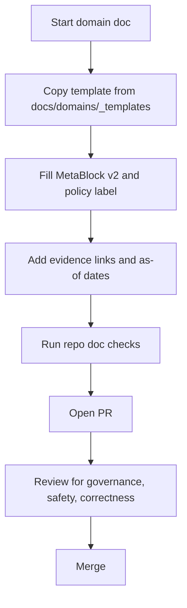

<!-- [KFM_META_BLOCK_V2]
doc_id: kfm://doc/9c7a0d08-9c5b-4d08-9c45-bd4c371e83c2
title: Domain Documentation Templates
type: standard
version: v1
status: draft
owners: TBD
created: 2026-03-01
updated: 2026-03-01
policy_label: public
related:
  - docs/domains/README.md
  - docs/README.md
tags: [kfm, docs, templates, domains]
notes:
  - This directory provides copy-forward templates for docs/domains/*.
  - Owners intentionally left TBD until CODEOWNERS is confirmed for docs/.
[/KFM_META_BLOCK_V2] -->

# docs/domains/_templates
Domain documentation templates for consistent, governed, evidence-first docs.


> **NOTE**
> These are **templates** meant to be copied into `docs/domains/<domain>/...` and then tailored.
> Prefer small, reversible edits and keep changes traceable to evidence and policy decisions.

---

## Quick navigation
- [Purpose](#purpose)
- [Where this fits](#where-this-fits)
- [What belongs here](#what-belongs-here)
- [Template index](#template-index)
- [How to use](#how-to-use)
- [Conventions](#conventions)
- [Definition of done](#definition-of-done)
- [How to add a new template](#how-to-add-a-new-template)
- [Appendix: MetaBlock v2](#appendix-metablock-v2)

---

## Purpose
This directory standardizes how **domain documentation** is written so it stays:

- **Evidence-first** (claims trace back to sources)
- **Governed** (policy labels + redaction obligations are explicit)
- **Buildable** (docs describe procedures that can be tested/automated where possible)
- **Reversible** (templates evolve without forcing sweeping rewrites)

In practice: templates reduce drift across domains and make reviews faster.

---

## Where this fits
- `docs/domains/` contains domain-specific documentation.
- `docs/domains/_templates/` contains **copy-forward starting points** to create/refresh domain docs.

**Hard rule:** templates are guidance; they must not override policy, contracts, or code.

---

## What belongs here

### Acceptable inputs
- Markdown templates for common domain-doc artifacts (READMEs, glossaries, registries, runbooks).
- Reusable diagrams (Mermaid) and checklists.
- Placeholder scaffolds that call out required fields (e.g., policy label, provenance, evidence links).

### Exclusions
- **No real dataset content** (that belongs in the domain directory and must follow promotion rules).
- **No secrets**, tokens, keys, credentials, private endpoints, internal-only instructions.
- **No location-sensitive details** for vulnerable or restricted sites (templates should *teach* redaction).

---

## Template index

> **IMPORTANT**
> Only `README.md` (this file) is guaranteed to exist by virtue of this commit request.
> Add rows as templates are introduced.

| Template file | Use | When to use | Status |
|---|---|---:|---|
| `README.md` | Explains how templates are organized and used | Always | **Confirmed** |
| `domain.README.template.md` | Domain-level README scaffold | New domain docs | Planned |
| `domain.REGISTRY.template.md` | Domain “what datasets live here” registry scaffold | When domain has multiple datasets | Planned |
| `domain.GLOSSARY.template.md` | Domain vocabulary + definitions | When terms are overloaded/ambiguous | Planned |
| `domain.RUNBOOK.template.md` | Operational runbook scaffold | When domain has pipelines/services | Planned |
| `domain.STORY.template.md` | Story Node scaffold (evidence-first narrative) | When publishing story narratives | Planned |
| `domain.ADR.template.md` | ADR scaffold (decision record) | When making design decisions | Planned |

---

## How to use

### Copy-forward workflow
1. Pick the right template from this folder.
2. Copy it into the target domain folder: `docs/domains/<domain>/...`
3. Replace every `TBD` / `TODO` / placeholder value.
4. Ensure the new doc has:
   - A **policy label**
   - Evidence references for factual claims
   - Clear “what’s in / what’s out”
   - A defined owner or escalation path

Example (adjust for your OS/tools):

```sh
# Example: bootstrap a new domain README (template name is illustrative)
cp docs/domains/_templates/domain.README.template.md docs/domains/water/README.md
```

### Updating templates vs updating domain docs
- If you’re fixing **structure**, **checklists**, or **reusable wording** → update templates first.
- If you’re fixing **domain facts** (sources, cadences, owners, risks) → update the domain docs.

Prefer the smallest change that preserves continuity and keeps diffs reviewable.

---

## Conventions

### Normative language
Templates should use:
- **MUST** for requirements (gates, invariants, policy constraints)
- **SHOULD** for strong defaults
- **MAY** for optional extensions

### Evidence discipline
- Any claim that could be contested later should be paired with:
  - a source link (internal path or external URL)
  - an “as-of” date if it’s time-sensitive
  - a policy label if access/visibility is restricted

### Sensitive locations and targeting risk
If a domain deals with vulnerable/private/culturally restricted locations:
- **Do not** include exact coordinates in docs meant for broad visibility.
- Use coarse geography and explicitly mark the redaction rule.
- Add a “needs governance review” note if sensitivity is unclear.

---

## Definition of done
Use this checklist when creating a new domain doc from templates:

- [ ] Includes **KFM MetaBlock v2** header with `doc_id`, `status`, `owners`, and `policy_label`
- [ ] States **purpose** and **scope** in the first screen
- [ ] Lists **acceptable inputs** and **exclusions**
- [ ] Includes at least one diagram (Mermaid preferred)
- [ ] Includes an evidence section (or inline citations) for key claims
- [ ] Identifies **what is confirmed vs proposed vs unknown**
- [ ] Calls out any **redaction/sensitivity obligations**
- [ ] Links to relevant contracts/schemas/policies (where applicable)
- [ ] Avoids repo-invented paths/commands unless confirmed in the repo

---

## How to add a new template
1. Add the new template file to this directory.
2. Ensure the template:
   - Includes the **MetaBlock v2** header (as a commented block).
   - Uses placeholders (`TBD`, `TODO`) rather than guesswork.
   - Contains “what belongs here / exclusions” sections.
3. Add the template to the [Template index](#template-index).
4. If the template introduces a new doc “type”, also add:
   - a short description of when to use it
   - a minimal DoD checklist for that type

---

## Process diagram


---

## Appendix: MetaBlock v2

<details>
<summary>Click to expand MetaBlock v2 template</summary>

```md
<!-- [KFM_META_BLOCK_V2]
doc_id: kfm://doc/<uuid>
title: <Title>
type: standard
version: v1
status: draft|review|published
owners: <team or names>
created: YYYY-MM-DD
updated: YYYY-MM-DD
policy_label: public|restricted|...
related:
  - <paths or kfm:// ids>
tags: [kfm]
notes:
  - <short notes>
[/KFM_META_BLOCK_V2] -->
```

</details>

---

<a id="back-to-top"></a>
**Back to top:** [Quick navigation](#quick-navigation)
