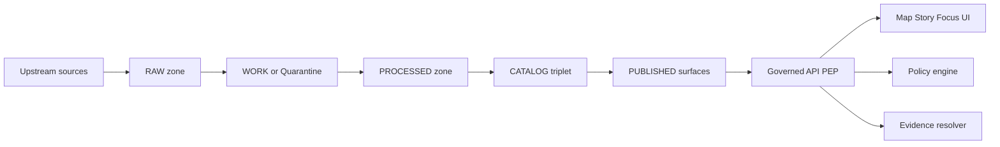

<!-- [KFM_META_BLOCK_V2]
doc_id: kfm://doc/{{DOC_UUID}}
title: "Context — {{DOMAIN_NAME}}"
type: standard
version: v1
status: draft
owners: {{OWNERS}}
created: {{CREATED_YYYY_MM_DD}}
updated: {{UPDATED_YYYY_MM_DD}}
policy_label: {{POLICY_LABEL}}
related:
  - kfm://domain/{{DOMAIN_SLUG}}
  - kfm://dataset/{{PRIMARY_DATASET_SLUG}}@{{PRIMARY_DATASET_VERSION}}
tags:
  - kfm
  - domain
  - context
notes:
  - "Template: copy into a domain folder and replace all {{PLACEHOLDERS}}."
[/KFM_META_BLOCK_V2] -->

# Context — {{DOMAIN_NAME}}

> **Purpose:** one place to explain the domain’s boundaries, vocabulary, governance constraints, evidence expectations, and integration points.


**Status:** {{STATUS}}  \
**Owners:** {{OWNERS}}  \
**Last updated:** {{UPDATED_YYYY_MM_DD}}  \

**Jump to:** [Purpose](#purpose) · [Where this fits](#where-this-fits) · [Scope](#scope) · [Key terms](#key-terms) · [Use cases](#use-cases) · [Data and signals](#data-and-signals) · [Governance](#governance) · [Interfaces](#interfaces) · [Promotion readiness](#promotion-readiness) · [Verification](#verification) · [Change log](#change-log)

---

## Purpose

This document exists to:

- Provide **domain context** for contributors (data, policy, UI, API, ML, ops).
- Make **domain boundaries explicit** (what is in/out).
- Define **domain vocabulary and ontologies** (so schemas and UI language stay consistent).
- Capture **governance constraints** (policy labels, obligations, redaction rules).
- Link to the domain’s **evidence and provenance** (what must be citeable).

**Non-goals** (adjust as needed):

- Not a full onboarding guide for every dataset.
- Not a replacement for API contracts, schemas, or runbooks.

---

## Where this fits

KFM domains are documented as part of an evidence-first, governed pipeline. The domain must map cleanly onto the truth path and the trust membrane (clients never bypass governed APIs). 



### Folder intent

**This domain folder is for:**

- **Context docs** (this file) describing domain meaning, constraints, and integration.
- **Domain-specific standards** that refine global standards (only if needed).
- **Links** to dataset specs, schemas, policies, and Story Nodes.

**This domain folder is NOT for:**

- Raw data, processed artifacts, or large binaries.
- Unreviewed “analysis notebooks” that produce publishable claims.
- Secrets or credentials.

> NOTE
> If your repo uses a different layout, keep this section but update it to match the actual paths.

---

## Scope

### In scope

- {{IN_SCOPE_BULLETS}}

### Out of scope

- {{OUT_OF_SCOPE_BULLETS}}

### Domain boundaries and interfaces

| Boundary | In | Out | Notes |
|---|---|---|---|
| Geography | {{IN_GEOGRAPHY}} | {{OUT_GEOGRAPHY}} | {{GEO_NOTES}} |
| Time | {{IN_TIME_RANGE}} | {{OUT_TIME_RANGE}} | {{TIME_NOTES}} |
| Entities | {{IN_ENTITIES}} | {{OUT_ENTITIES}} | {{ENTITY_NOTES}} |
| Sensitivity | {{IN_SENSITIVITY}} | {{OUT_SENSITIVITY}} | {{SENS_NOTES}} |

---

## Key terms

Define the shared vocabulary for schemas, UI copy, and narrative claims.

| Term | Definition | Canonical field or concept | Notes |
|---|---|---|---|
| {{TERM_1}} | {{DEF_1}} | {{CANON_1}} | {{NOTES_1}} |
| {{TERM_2}} | {{DEF_2}} | {{CANON_2}} | {{NOTES_2}} |

### Ontology hooks

- **Preferred identifiers:** {{PREFERRED_IDENTIFIERS}}
- **Cross-domain joins:** {{CROSS_DOMAIN_JOINS}}
- **Controlled vocabularies:** {{VOCAB_LINKS}}

---

## Use cases

List the primary user stories this domain must serve.

### Map and story UI

- {{MAP_UI_USE_CASE_1}}
- {{MAP_UI_USE_CASE_2}}

### Focus Mode

- {{FOCUS_USE_CASE_1}}
- {{FOCUS_USE_CASE_2}}

### Non-functional needs

- Latency targets: {{LATENCY_TARGETS}}
- Availability / SLOs: {{SLOS}}
- Audit expectations: {{AUDIT_EXPECTATIONS}}

---

## Data and signals

### Primary datasets

| Dataset | Upstream authority | Cadence | License | Intended policy label | Notes |
|---|---|---:|---|---|---|
| `{{PRIMARY_DATASET_SLUG}}` | {{UPSTREAM_AUTHORITY}} | {{CADENCE}} | {{LICENSE}} | {{POLICY_LABEL}} | {{NOTES}} |

### Derived artifacts

| Artifact type | Zone | Canonical path pattern | Produced by | Required checks |
|---|---|---|---|---|
| {{ARTIFACT_TYPE_1}} | {{ZONE_1}} | `{{PATH_PATTERN_1}}` | {{PIPELINE_1}} | {{CHECKS_1}} |
| {{ARTIFACT_TYPE_2}} | {{ZONE_2}} | `{{PATH_PATTERN_2}}` | {{PIPELINE_2}} | {{CHECKS_2}} |

### Evidence expectations

Every user-facing claim should be traceable to **versioned evidence**.

- **Minimum evidence bundle fields:** dataset version, license/rights, policy label, provenance chain, checksums, artifact links.
- **Cite-or-abstain rule:** if a claim cannot be backed by resolvable evidence, it must not be presented as fact.

> TIP
> Add links to the domain’s dataset specs and STAC/DCAT/PROV artifacts here once they exist.

---

## Governance

### Policy label

- **Default policy label for this domain:** `{{POLICY_LABEL}}`
- **Rationale:** {{POLICY_RATIONALE}}

### Redaction and sensitive locations

- If this domain includes **vulnerable or sensitive locations**, do **not** publish precise coordinates; publish a coarse geography or generalized geometry instead.
- If sensitivity is unclear, **default-deny** until governance review is complete.

### Obligations

List obligations that must be enforced at the API boundary (and ideally validated in CI):

- [ ] `{{OBLIGATION_1}}`
- [ ] `{{OBLIGATION_2}}`

### Review gates

- [ ] Policy review complete
- [ ] License/terms snapshot captured
- [ ] Redaction/generalization validated
- [ ] Audit logging enabled for access paths

---

## Interfaces

### Governed APIs

| Surface | Contract | Endpoints | Notes |
|---|---|---|---|
| Dataset discovery | {{OPENAPI_OR_GRAPHQL_REF}} | {{DISCOVERY_ENDPOINTS}} | {{DISCOVERY_NOTES}} |
| STAC | {{STAC_REF}} | {{STAC_ENDPOINTS}} | {{STAC_NOTES}} |
| Evidence | {{EVIDENCE_REF}} | {{EVIDENCE_ENDPOINTS}} | {{EVIDENCE_NOTES}} |

### Events and schemas

- Schemas: {{SCHEMA_PATHS}}
- Domain events: {{EVENTS}}

### UI components

- Map layers: {{MAP_LAYER_REGISTRY_LINKS}}
- Story Node templates: {{STORY_NODE_LINKS}}

---

## Promotion readiness

Promotion Contract gates apply at each transition across the truth path.

### Checklist

- [ ] **Identity:** stable dataset slug + deterministic versioning strategy
- [ ] **Metadata:** DCAT + STAC + PROV cross-linked (catalog triplet)
- [ ] **Validation:** schema validation + QA thresholds met
- [ ] **Rights:** license captured + obligations declared
- [ ] **Provenance:** inputs, transforms, tool versions, and run receipts captured
- [ ] **Integrity:** checksums/hashes recorded
- [ ] **Policy:** policy label + redaction obligations enforced by the PEP

### Promotion notes

- Blocking issues: {{BLOCKING_ISSUES}}
- Required approvals: {{REQUIRED_APPROVALS}}

---

## Verification

Minimum checks to convert domain claims from “assumed” to **confirmed**:

1. Verify dataset specs exist and are referenced from catalog outputs.
2. Verify DCAT/STAC/PROV artifacts cross-link identifiers correctly.
3. Verify the governed API enforces policy label + obligations for domain endpoints.
4. Verify evidence bundles resolve from UI/Focus Mode entry points.

---

## Change log

| Date | Change | Author | PR/Issue |
|---|---|---|---|
| {{YYYY_MM_DD}} | Initial domain context | {{AUTHOR}} | {{PR_OR_ISSUE}} |

---

## Appendix

<details>
<summary>Suggested domain folder layout (adjust to match repo)</summary>

```text
docs/domains/{{DOMAIN_SLUG}}/
  context.README.md
  datasets/
  policies/
  interfaces/
  runbooks/
  assets/
```

</details>

<details>
<summary>Placeholder registry tables</summary>

### Domain registry

| Field | Value |
|---|---|
| Domain slug | `{{DOMAIN_SLUG}}` |
| Steward | {{DOMAIN_STEWARD}} |
| Default policy label | `{{POLICY_LABEL}}` |
| Primary geography | {{IN_GEOGRAPHY}} |
| Primary time coverage | {{IN_TIME_RANGE}} |

</details>

---

**Template maintenance:** if you change this template, add a short rationale and link the PR in the change log.
