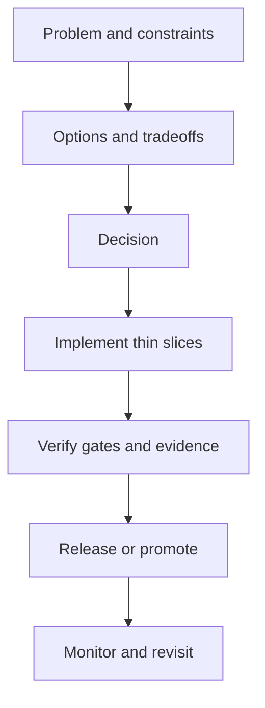

<!-- [KFM_META_BLOCK_V2]
doc_id: kfm://doc/<uuid>
title: <Decision title>
type: adr
version: v1
status: draft
owners: <team or names>
created: YYYY-MM-DD
updated: YYYY-MM-DD
policy_label: public
related:
  - kfm://dataset/<slug>@<dataset_version_id>
  - kfm://doc/<related_doc_uuid>
tags:
  - kfm
  - decision
  - adr
notes:
  - <Short note on why this decision exists>
[/KFM_META_BLOCK_V2] -->

# <Decision title>

> **One-line decision summary:** <What we decided, in one sentence.>

## Quick links

- [Context](#context)
- [Decision](#decision)
- [Options considered](#options-considered)
- [Rationale](#rationale)
- [Consequences](#consequences)
- [Evidence](#evidence)
- [Policy and sensitivity](#policy-and-sensitivity)
- [Implementation plan](#implementation-plan)
- [Verification](#verification)
- [Rollback plan](#rollback-plan)
- [Status and review history](#status-and-review-history)

---

## Context

### Problem statement

<What problem are we solving? What is the decision boundary?>

### Drivers

- **Trust membrane / governance:** <Which invariant(s) are implicated?>
- **User value:** <What user experience or capability improves?>
- **Operational constraints:** <Cost, latency, scale, on-call impact>
- **Legal/licensing constraints:** <Rights and reuse constraints>
- **Security constraints:** <Threat model and data sensitivity>

### Constraints and non-goals

- **Must:** <Hard constraints>
- **Must not:** <Prohibited approaches>
- **Non-goals:** <Explicitly out of scope>

### Scope

- **In scope:** <Sub-systems, datasets, endpoints, UI surfaces>
- **Out of scope:** <Adjacent concerns>

---

## Decision

### Decision statement

We will **<do X>** to achieve **<goal Y>**, under the following constraints:

- <Constraint 1>
- <Constraint 2>

### Decision type

- [ ] Architecture / subsystem boundary
- [ ] Data model / schema / contract
- [ ] Pipeline / promotion gate
- [ ] Policy / authorization / redaction
- [ ] UI/UX / information architecture
- [ ] Operations / deployment / observability

### Affected areas

- **Domain:** <Domain modules impacted>
- **Use cases:** <Use cases impacted>
- **Interfaces/contracts:** <OpenAPI/GraphQL/Schema paths>
- **Infrastructure:** <Storage/indexing/compute>
- **Docs & templates:** <Other docs that must be updated>

---

## Options considered

### Option A — <name>

**Summary:** <one sentence>

**Pros**
- <pro>

**Cons**
- <con>

**Risks**
- <risk>

### Option B — <name>

**Summary:** <one sentence>

**Pros**
- <pro>

**Cons**
- <con>

**Risks**
- <risk>

### Decision matrix

| Option | Trust membrane compliance | Evidence traceability | Complexity | Ops burden | UX impact | Notes |
|---|---|---|---|---|---|---|
| A | <pass/fail> | <high/med/low> | <high/med/low> | <high/med/low> | <high/med/low> | <…> |
| B | <pass/fail> | <high/med/low> | <high/med/low> | <high/med/low> | <high/med/low> | <…> |

---

## Rationale

### Why this option

<Explain why the chosen option is best, explicitly calling out tradeoffs.>

### Assumptions

List assumptions **explicitly**. Mark each as one of:

- **CONFIRMED:** backed by an evidence reference in this doc.
- **PROPOSED:** an implementation choice you are advocating.
- **UNKNOWN:** needs verification before finalizing or shipping.

| Assumption | Status | EvidenceRef or verification step |
|---|---|---|
| <assumption> | CONFIRMED/PROPOSED/UNKNOWN | <dcat://… or “run X benchmark”> |

### Open questions

- [ ] <Question 1>
- [ ] <Question 2>

---

## Consequences

### Positive

- <benefit>

### Negative

- <cost>

### Follow-on work created by this decision

- [ ] <Task that must be done>
- [ ] <Task that must be done>

---

## Evidence

> KFM posture: **cite-or-abstain**. If a claim cannot be traced to evidence, mark it **UNKNOWN**.

### EvidenceRefs (preferred)

Use structured references wherever possible:

- `dcat://<dataset_slug>@<dataset_version_id>`
- `stac://<collection_or_item_id>@<dataset_version_id>`
- `prov://run/<run_id>`
- `doc://kfm://doc/<uuid>`
- `graph://<graph_entity_id>`

### Evidence bundle links

- [ ] Evidence bundle for primary claim: <EvidenceRef>
- [ ] Evidence bundle for key risks/constraints: <EvidenceRef>

### Key claims (with inline citations)

1. <Claim text.> [CITATION: dcat://…]
2. <Claim text.> [CITATION: prov://…]

---

## Policy and sensitivity

### Policy label intent

- **Target policy_label:** <public|public_generalized|restricted|…>
- **Who should be able to see this decision record?** <roles>

### Redaction / generalization obligations

If this decision impacts disclosure, geometry precision, or attribute visibility, describe obligations.

```json
{
  "decision_id": "kfm://policy_decision/<id>",
  "policy_label": "<policy_label>",
  "decision": "allow|deny",
  "reason_codes": ["<REASON>"] ,
  "obligations": [
    {"type": "generalize_geometry", "min_cell_size_m": 5000},
    {"type": "remove_attributes", "fields": ["field_a", "field_b"]}
  ],
  "evaluated_at": "YYYY-MM-DDThh:mm:ssZ",
  "rule_id": "<policy_rule_id>"
}
```

### Safety notes

- **Sensitive locations:** If there is any risk of targeting or harm, default to **coarse geography** and require governance review.
- **Non-sensationalization:** For hazard/incident narratives, prefer aggregated views and avoid framing outputs as definitive verdicts.

---

## Implementation plan

### Thin-slice plan

Deliver as small, reversible increments. Each slice must produce a verifiable artifact.

- **Slice 0 (scaffold):** <schemas/templates/tests only>
- **Slice 1 (policy gates):** <OPA/Rego + CI integration>
- **Slice 2 (golden path):** <one end-to-end dataset or route>
- **Slice 3 (UI trust surfacing):** <badges, evidence drawer, provenance viewer>

### Contracts and schemas

- [ ] OpenAPI/GraphQL updated (path: `<contracts/...>`)
- [ ] JSON Schema updated (path: `<contracts/schemas/...>`)
- [ ] Validation fixtures added (valid + invalid)

### CI gates

- [ ] Schema validation blocks merges
- [ ] Policy tests block merges
- [ ] Catalog validators (STAC/DCAT/PROV) block merges

<details>
<summary>Optional diagram: decision-to-release flow</summary>



</details>

---

## Verification

### Minimum verification steps

Provide the **smallest checks** needed to convert UNKNOWN → CONFIRMED.

- [ ] <Benchmark / test>
- [ ] <Policy review>
- [ ] <Data QA validation>

### Acceptance criteria

- **Functional:** <What must work?>
- **Governance:** <What must be provably enforced?>
- **Observability:** <What metrics/logs/traces must exist?>

### Evidence of verification

- Run receipt: `prov://run/<run_id>`
- CI run URL / artifact digest: <link or digest>

---

## Rollback plan

- **Kill switch:** <How to disable quickly>
- **Rollback steps:** <Revert commit / toggle config>
- **Data rollback:** <How to unpublish or quarantine a dataset version>

---

## Status and review history

### Current status

- **Status:** draft | review | published
- **Target decision date:** YYYY-MM-DD

### Review checklist

- [ ] Owners listed
- [ ] Assumptions labeled (CONFIRMED/PROPOSED/UNKNOWN)
- [ ] EvidenceRefs included and resolvable
- [ ] Policy label chosen and justified
- [ ] Rollback plan present
- [ ] Verification steps listed

### Changelog

| Date | Change | Author |
|---|---|---|
| YYYY-MM-DD | Created | <name> |
