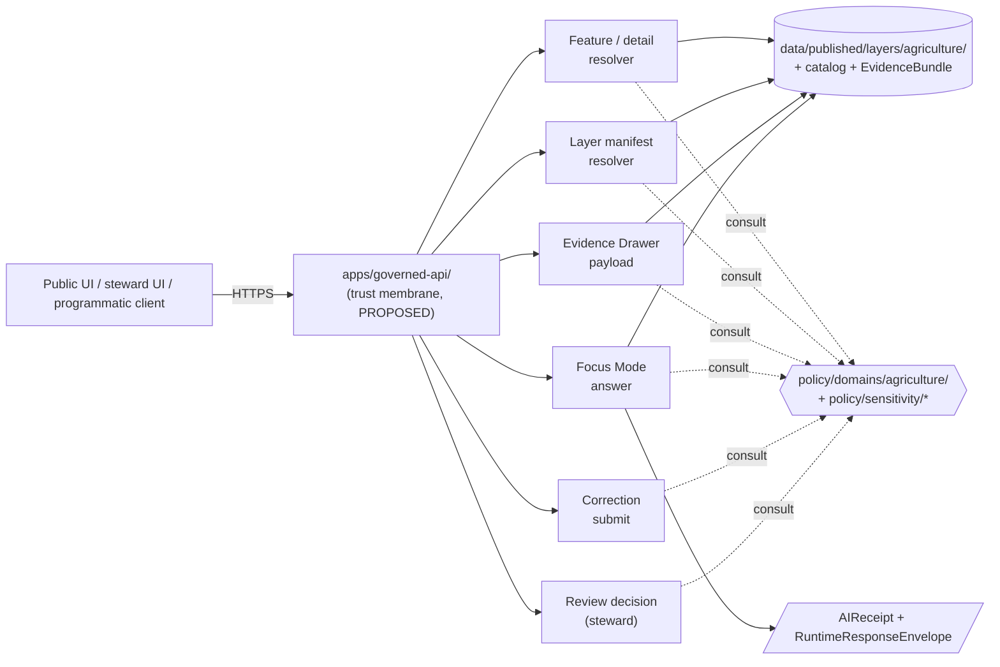
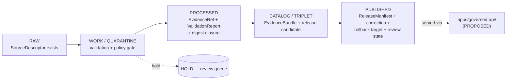
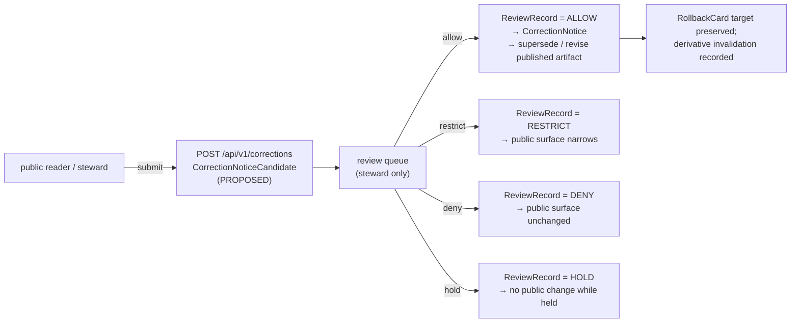

<!-- [KFM_META_BLOCK_V2]
doc_id: kfm://doc/docs.domains.agriculture.api-contracts
title: Agriculture — API Contracts
type: standard
version: v1
status: draft
owners: TBD (Agriculture steward + API owner + Contract/schema steward)
created: 2026-05-15
updated: 2026-05-15
policy_label: public
related:
  - docs/domains/agriculture/README.md
  - docs/architecture/governed-ai/
  - docs/standards/PROV.md
  - schemas/contracts/v1/domains/agriculture/
  - contracts/domains/agriculture/
  - policy/domains/agriculture/
  - apps/governed-api/
tags: [kfm, domain, agriculture, api, contracts, decision-envelope]
notes:
  - All repo paths, route names, and DTO names are PROPOSED until mounted-repo verification.
  - Schema home defaults to schemas/contracts/v1/ per Directory Rules §7.4 / ADR-0001.
[/KFM_META_BLOCK_V2] -->

<a id="top"></a>

# Agriculture — API Contracts

> Governed API surfaces, finite outcomes, and DTO/schema homes for the Agriculture domain — aggregate-only, public-safe by default, field-level deny by default.


-purple)


| Status | Owners | Last reviewed |
|---|---|---|
| `draft` · PROPOSED routes / NEEDS VERIFICATION paths | Agriculture steward · API owner · Contract/schema steward (placeholder) | 2026-05-15 |

---

## Quick jump

- [1. Purpose & scope](#1-purpose--scope)
- [2. Authority & placement](#2-authority--placement)
- [3. Surface inventory](#3-surface-inventory)
- [4. Outcome grammar](#4-outcome-grammar)
- [5. DTOs & envelopes](#5-dtos--envelopes)
- [6. Object families resolved by these contracts](#6-object-families-resolved-by-these-contracts)
- [7. Sensitivity & deny-by-default lanes](#7-sensitivity--deny-by-default-lanes)
- [8. Pipeline state and admission gates](#8-pipeline-state-and-admission-gates)
- [9. Cross-lane relations](#9-cross-lane-relations)
- [10. Validators & contract tests](#10-validators--contract-tests)
- [11. Governed AI behavior on this surface](#11-governed-ai-behavior-on-this-surface)
- [12. Correction & rollback contract](#12-correction--rollback-contract)
- [13. Open questions & NEEDS VERIFICATION](#13-open-questions--needs-verification)
- [14. Related docs](#14-related-docs)

---

## 1. Purpose & scope

This document defines the **governed API contract surface** for the Kansas Frontier Matrix (KFM) Agriculture domain. It enumerates the surfaces that may be exposed to clients, the finite outcome grammar each surface returns, the DTO and schema families each surface depends on, and the sensitivity and review constraints that bound what may be answered.

The Agriculture domain mission, from the project source of truth: *represent crops, fields, soils, irrigation, yields, conservation practices and agricultural economy in **public-safe aggregate or permissioned form**; never publish private farm operations, field-level sensitive details, or source-rights-limited data without review.* `[ENCY §7.7.A]` `[DOM-AG]`

| In scope | Out of scope |
|---|---|
| Agriculture feature / detail resolution through the trust membrane | Direct access to `data/raw`, `data/work`, or `data/quarantine` (forbidden by trust membrane) |
| Agriculture layer manifest resolution for map clients | Field-level operator truth from aggregate satellite products |
| Evidence Drawer payload assembly for Agriculture claims | Title / ownership / parcel privacy (owned by People/Land) |
| Focus Mode answers grounded in released Agriculture `EvidenceBundle`s | Water observations and flood context (owned by Hydrology) |
| Correction submission and read-only review surface for Agriculture | Canonical soil map-unit and horizon semantics (owned by Soil) |

> [!IMPORTANT]
> Agriculture is one of the domains where **aggregate cited as per-place truth** is an explicit anti-pattern: joining an aggregate cell to a single record is DENY at the route boundary and ABSTAIN at AI. `[ATLAS §24.x]` `[DOM-AG]`

[Back to top](#top)

---

## 2. Authority & placement

### 2.1 Authority order for the contracts in this doc

1. **KFM core invariants** — lifecycle law, trust membrane, cite-or-abstain, watcher-as-non-publisher.
2. **Accepted ADRs** explicitly amending Directory Rules or schema home.
3. **Directory Rules** — `docs/doctrine/directory-rules.md`.
4. **Per-root READMEs** under affected canonical roots.
5. **Domain dossier** — `[DOM-AG]`, `[ENCY §7.7]`, `[ATLAS §9]` — lineage / proposed.
6. **Convention from mounted repo** — drift, not authority.

`[CONFIRMED doctrine, DIRRULES §2.1]`

### 2.2 PROPOSED responsibility-root homes

Per Directory Rules §4 Step 3, the agriculture domain appears as a **segment inside each responsibility root**, never as a root itself. The Agriculture-owned homes below are PROPOSED until the mounted repo is inspected.

```text
docs/domains/agriculture/                      # this document and siblings
contracts/domains/agriculture/                 # semantic object meaning (PROPOSED)
schemas/contracts/v1/domains/agriculture/      # executable JSON Schema (PROPOSED, ADR-0001 default)
policy/domains/agriculture/                    # admissibility, release, sensitivity gates (PROPOSED)
tests/domains/agriculture/                     # contract, policy, fixture, e2e tests (PROPOSED)
fixtures/domains/agriculture/                  # no-network golden / invalid fixtures (PROPOSED)
data/raw/agriculture/         data/work/agriculture/        data/quarantine/agriculture/
data/processed/agriculture/   data/catalog/domain/agriculture/
data/published/layers/agriculture/             # public-safe release surface only (PROPOSED)
release/candidates/agriculture/                # release decisions (PROPOSED)
```

`[PROPOSED — Directory Rules §4 Step 3; ENCY §7.7.J file-home note; ATLAS §24.13]`

> [!NOTE]
> Every path above is **PROPOSED** until inspected against a mounted repo. Per Directory Rules §0, *the authority of any specific path quoted here is PROPOSED until verified against mounted-repo evidence.* Treat this section as a placement plan, not a repo claim. `[CONFIRMED — DIRRULES §0]`

### 2.3 Trust-membrane placement

Public and normal-UI clients **MUST** reach Agriculture data through `apps/governed-api/` and **MUST NOT** read from canonical or internal stores directly. The Explorer Web app (`apps/explorer-web/` PROPOSED) reads via `apps/governed-api/`; never directly from `data/raw|work|quarantine`. `[CONFIRMED doctrine — DIRRULES §7.1; UIAI]`

[Back to top](#top)

---

## 3. Surface inventory

Five surface families are PROPOSED for the Agriculture domain. Each one returns a finite outcome from the [outcome grammar](#4-outcome-grammar). Routes are illustrative URL shapes; **exact route names are UNKNOWN** until the backend framework, route convention, and OpenAPI/GraphQL surface are verified against a mounted repo.

| # | Surface | Illustrative shape | DTO / schema | Outcomes | Status |
|---|---|---|---|---|---|
| 1 | Agriculture feature / detail resolver | `GET /api/v1/domains/agriculture/features/{id}` | `AgricultureFeatureDTO` + `EvidenceRef[]`, wrapped in `AgricultureDecisionEnvelope` | `ANSWER` · `ABSTAIN` · `DENY` · `ERROR` | PROPOSED |
| 2 | Agriculture layer manifest resolver | `GET /api/v1/layers/agriculture/{layer_id}/manifest` | `LayerManifest` (agriculture profile) | `ANSWER` · `DENY` · `ERROR` | PROPOSED |
| 3 | Agriculture Evidence Drawer payload | `GET /api/v1/evidence-drawer/agriculture/{claim_id}` | `EvidenceDrawerPayload` + `EvidenceBundle` projection | `ANSWER` · `ABSTAIN` · `DENY` · `ERROR` | PROPOSED |
| 4 | Agriculture Focus Mode answer | `POST /api/v1/focus/agriculture` | `RuntimeResponseEnvelope` + `AIReceipt` | `ANSWER` · `ABSTAIN` · `DENY` · `ERROR` | PROPOSED |
| 5 | Correction submit (shared) | `POST /api/v1/corrections` (domain-tagged) | `CorrectionNoticeCandidate` | `ACCEPTED` · `DENY` · `ERROR` | PROPOSED |
| 6 | Review decision (shared, steward only) | `POST /api/v1/review/{queue}/{id}/decision` | `ReviewRecord` | `ALLOW` · `RESTRICT` · `DENY` · `ERROR` | PROPOSED |

`[ENCY §7.7.J — domain dossier J. table]` `[ATLAS §9.J]` `[ATLAS §20.3 Master API Surface]`



> [!CAUTION]
> The diagram is **PROPOSED structural model**. The actual app boundary may be `apps/governed-api/`, `apps/governed_api/`, `packages/api/`, or another adapter — and route naming may differ. Resolve before implementation; record an ADR if the boundary deviates. `[NEEDS VERIFICATION — UIAI §15 open file-home conflicts]`

[Back to top](#top)

---

## 4. Outcome grammar

Every Agriculture surface returns a finite outcome from KFM's consolidated decision-outcome envelope (`[ATLAS §24.3]`). The outcome is the contract — clients **MUST** treat any non-finite or unrecognized outcome as `ERROR`.

| Outcome | When | Required artifacts | Public-surface effect |
|---|---|---|---|
| `ANSWER` | Evidence is sufficient; policy permits; release state allows; review state (if required) is recorded. | `EvidenceBundle` resolved; `PolicyDecision = allow`; `ReleaseManifest` applies. | Substantive answer with Evidence Drawer and citation. |
| `ABSTAIN` | Evidence insufficient/incomplete; citations cannot be validated; source roles conflict; temporal scope insufficient; AI cannot cite. | `AIReceipt` with reason; no claim emitted. | Non-substantive note with reason; never invents. |
| `DENY` | Policy, rights, sensitivity, or release state forbids the answer. Sensitive lanes default here. | `PolicyDecision = deny` + `reason_code`; `AIReceipt` records denial. | Denial reason; offer alternative non-restricted surface where possible. |
| `ERROR` | Governed API cannot evaluate — missing schema, malformed query, contract violation, infrastructure failure. | Error envelope with diagnostic code; no claim leakage. | Finite, actionable error; never silently falls through to a different lane. |
| `HOLD` (release/correction lanes only) | Promotion/release/correction paused pending steward, rights-holder, or policy review. | `ReviewRecord` pending; `PolicyDecision = hold`. | Surface remains in prior state; no silent rollback or replacement. |

`[CONFIRMED doctrine — ATLAS §24.3.1; ENCY §7.7.I; GAI]`

### 4.1 Forbidden outcomes per surface

| Surface | Outcomes returned | Forbidden behaviors |
|---|---|---|
| Feature / detail resolver | `ANSWER` · `ABSTAIN` · `DENY` · `ERROR` | Returning an unreleased candidate as `ANSWER`; exposing internal-store identifiers; joining aggregate-cell value to a single record. |
| Layer manifest resolver | `ANSWER` · `DENY` · `ERROR` | Returning a layer that lacks a `ReleaseManifest`; serving `WORK` or `CATALOG` layers to public clients. |
| Evidence Drawer payload | `ANSWER` · `ABSTAIN` · `DENY` · `ERROR` | Returning raw source bytes; returning quarantined source as `ANSWER`. |
| Focus Mode answer | `ANSWER` · `ABSTAIN` · `DENY` · `ERROR` | Emitting AI text as evidence; answering without an `AIReceipt`; bypassing citation validation. |
| Correction submit | `ACCEPTED` · `DENY` · `ERROR` | Treating an acceptance as a publication decision; auto-promoting without review. |
| Review decision | `ALLOW` · `RESTRICT` · `DENY` · `ERROR` | Allowing a non-steward role; emitting public artifacts before promotion. |

`[CONFIRMED doctrine — ATLAS §24.3.2; ENCY §7.7.I; GAI]`

[Back to top](#top)

---

## 5. DTOs & envelopes

PROPOSED schema homes (defaults per ADR-0001 / Directory Rules §7.4 — *schema-home authority is `schemas/contracts/v1/<…>`*). Each schema below is **PROPOSED to create**; none is asserted to exist in the current repo.

| DTO / envelope | Purpose | PROPOSED schema home |
|---|---|---|
| `AgricultureDecisionEnvelope` | Domain-tagged finite-outcome wrapper used by the feature/detail resolver. | `schemas/contracts/v1/domains/agriculture/agriculture_decision_envelope.schema.json` |
| `AgricultureFeatureDTO` | Public-safe projection of an Agriculture feature (county/HUC/grid aggregate). | `schemas/contracts/v1/domains/agriculture/agriculture_feature_dto.schema.json` |
| `LayerManifest` (agriculture profile) | Layer descriptor with trust badge inputs, source-role tags, freshness, sensitivity transforms, release reference. | `schemas/contracts/v1/layers/layer_manifest.schema.json` (shared) |
| `EvidenceDrawerPayload` | Drawer payload with claim, `EvidenceRef`s, bundle refs, source roles, valid time, review state, rights, sensitivity, correction, transforms. | `schemas/contracts/v1/ui/evidence_drawer_payload.schema.json` (shared) |
| `EvidenceBundle` projection | Public-safe projection of the released Agriculture `EvidenceBundle` referenced by the drawer or focus answer. | `schemas/contracts/v1/evidence/evidence_bundle.schema.json` (shared) |
| `RuntimeResponseEnvelope` + `AIReceipt` | Common governed response wrapper for Focus / story / review. `AIReceipt` records outcome, `evidence_refs`, `policy_decision`, `citation_validation`. | `schemas/contracts/v1/runtime/runtime_response_envelope.schema.json` + `schemas/contracts/v1/runtime/ai_receipt.schema.json` (shared) |
| `CorrectionNoticeCandidate` | Public correction intake form; non-public until reviewed. | `schemas/contracts/v1/corrections/correction_notice_candidate.schema.json` (shared) |
| `ReviewRecord` | Steward decision artifact (allow/restrict/deny/hold). | `schemas/contracts/v1/review/review_record.schema.json` (shared) |

`[PROPOSED schema homes — DIRRULES §7.4 + ADR-0001; UIAI §15]`

<details>
<summary><b>Illustrative DecisionEnvelope shape (not authoritative)</b></summary>

The shape below is **illustrative**, drawn from the consolidated DecisionEnvelope pattern in the project sources. It is **not** an authoritative agriculture schema. The authoritative schema must be authored in `schemas/contracts/v1/domains/agriculture/`, validated by fixtures, and gated by `policy/domains/agriculture/`.

```json
{
  "$schema": "https://json-schema.org/draft/2020-12/schema",
  "$id": "kfm://schema/AgricultureDecisionEnvelope.schema.json",
  "title": "AgricultureDecisionEnvelope (PROPOSED, illustrative)",
  "type": "object",
  "required": [
    "object_type",
    "schema_version",
    "envelope_id",
    "created",
    "spec_hash",
    "outcome",
    "evidence_refs"
  ],
  "properties": {
    "object_type":     { "const": "AgricultureDecisionEnvelope" },
    "schema_version":  { "const": "v1" },
    "envelope_id":     { "type": "string", "minLength": 8 },
    "created":         { "type": "string", "format": "date-time" },
    "spec_hash":       { "type": "string", "pattern": "^[A-Fa-f0-9]{32,128}$" },
    "outcome":         { "enum": ["ANSWER", "ABSTAIN", "DENY", "ERROR"] },
    "reason_code":     { "type": "string" },
    "policy_decision": { "type": "string", "enum": ["allow", "deny", "hold"] },
    "freshness":       { "type": "string", "format": "date-time" },
    "evidence_refs": {
      "type": "array",
      "minItems": 1,
      "items": {
        "type": "object",
        "required": ["uri", "digest"],
        "properties": {
          "role":      { "enum": ["primary", "secondary", "derived", "aggregate"] },
          "uri":       { "type": "string", "format": "uri" },
          "digest":    {
            "type": "object",
            "required": ["alg", "value"],
            "properties": {
              "alg":   { "enum": ["sha256", "blake3"] },
              "value": { "type": "string" }
            }
          }
        }
      }
    },
    "obligations": {
      "type": "object",
      "properties": {
        "redactions":      { "type": "array", "items": { "type": "object" } },
        "generalizations": { "type": "array", "items": { "type": "object" } }
      }
    }
  }
}
```

**Illustrative only** — sourced from the cross-cutting `DecisionEnvelope`, `EvidenceBundle`, and runtime-envelope patterns in the project knowledge base. Field set, required-ness, and naming for the agriculture-tagged envelope must be settled in an ADR and validated by fixtures.

`[INFERRED structure — composite of [New Ideas 5-8-26.pdf] DecisionEnvelope + EvidenceBundle + UIAI runtime envelope]`
</details>

[Back to top](#top)

---

## 6. Object families resolved by these contracts

The Agriculture domain owns the following object families. Each may surface through one or more of the routes above, and each is identity-bounded by the rule *source id + object role + temporal scope + normalized digest* (PROPOSED). `[ATLAS §9.E]`

| Object family | Public surfacing posture | Aggregate-only required? |
|---|---|---|
| `CropObservation` | Aggregate (county/HUC/grid) public; field-level deny by default. | Yes for public release. |
| `FieldCandidate` | Restricted by default; review-gated. | n/a — private boundary not public. |
| `CropRotation` | Aggregate public; field-level restricted. | Yes. |
| `YieldObservation` | Aggregate public; proprietary yield denied. | Yes. |
| `IrrigationLink` | Aggregate / context public; operator-specific restricted. | Yes. |
| `ConservationPractice` | Public only where source terms permit. | Conditional on rights. |
| `SoilCropSuitability` | Public model output (with model receipt). | Aggregate threshold per release manifest. |
| `AgriculturalEconomyObservation` | Aggregate public where rights permit. | Yes. |
| `SupplyChainNode` | Public only after rights/sensitivity review. | Conditional. |
| `DroughtStressIndicator` | Public-safe indicator; not field truth. | Yes. |
| `PestStressIndicator` | Public-safe indicator; not field truth. | Yes. |
| `AggregationReceipt` | Process memory; not directly public — referenced via `EvidenceBundle`. | n/a (receipt). |

`[CONFIRMED — ENCY §7.7.C; ATLAS §9.B–E]`

[Back to top](#top)

---

## 7. Sensitivity & deny-by-default lanes

The trust posture for Agriculture is **aggregate-only by default**. Field-level operator truth is denied; satellite or model derivatives must not become field/operator truth; private joins fail closed.

| Lane | Default outcome | Required controls |
|---|---|---|
| Private landowner-sensitive data (field boundaries, owner identity, operations) | `DENY` exact/public if private or rights unclear | aggregation; permissions; policy review `[ENCY §13]` |
| Aggregate cited as per-place truth (join aggregate cell → single record) | `DENY` at route boundary; `ABSTAIN` at AI | aggregation receipt; geometry-scope guard; matrix-cell semantics `[ATLAS §24.x]` |
| Field-level NASS-derived claims | `DENY` by policy | policy denial test in `policy/domains/agriculture/` `[ENCY §7.7.K]` |
| Source-rights-limited records (licensed, no-redistribution, uncertain terms) | `DENY` public release until terms resolved | rights register; attribution; no public derivative if barred `[ENCY §13]` |
| Farm/operator joins to People/Land | `DENY` until review | restricted view; policy gate `[ATLAS §9.F]` |

> [!WARNING]
> *Unclear rights, unresolved source role, missing evidence, unresolved sensitivity, or absent release state blocks public promotion.* This is non-negotiable. `[CONFIRMED — ENCY §7.7.I; DIRRULES]`

### 7.1 Required obligations on Agriculture envelopes

When the envelope carries any aggregate or generalized product, the `obligations` block **SHOULD** record the applied transforms so downstream consumers can verify provenance of the sensitivity posture. Methods drawn from the cross-cutting evidence-bundle obligation vocabulary: `bin`, `blur`, `truncate`, `tile_precision`, `mask`, `k-anon`. `[CONFIRMED method enum — EvidenceBundle structural schema]`

[Back to top](#top)

---

## 8. Pipeline state and admission gates

Agriculture follows the canonical lifecycle: **RAW → WORK / QUARANTINE → PROCESSED → CATALOG / TRIPLET → PUBLISHED**. Promotion is a **governed state transition, not a file move.** `[CONFIRMED — DIRRULES; ATLAS §9.H]`



Each governed Agriculture surface only resolves to artifacts admitted at or beyond **PROCESSED** for AI / drawer reads and **PUBLISHED** for public client reads. The route **MUST** return `DENY` on any attempt to surface `RAW`, `WORK`, or `QUARANTINE` content. `[CONFIRMED — DIRRULES; ATLAS §24.3.2]`

### 8.1 Gate order at admission (PROPOSED)

| # | Gate | Default failure |
|---|---|---|
| 1 | Shape (schema validation) | `ERROR` / quarantine |
| 2 | Meaning (contract / vocabulary) | `ERROR` / review |
| 3 | Source (role, rights, cadence, sensitivity) | `DENY` / quarantine |
| 4 | Evidence (`EvidenceRef` → `EvidenceBundle` resolves) | `ABSTAIN` |
| 5 | Policy (rights, sensitivity, purpose, release class) | `DENY` |
| 6 | Lifecycle state (`RAW … PUBLISHED`) | `DENY` |
| 7 | Receipt (`RunReceipt` / `PromotionReceipt` present) | `ERROR` |
| 8 | Release (`ReleaseManifest` + proof + correction + rollback) | `ERROR` |
| 9 | Public-surface validation (aggregate threshold, redaction receipt) | `DENY` |

`[CONFIRMED gate order — UNIFIED §24 Validators and policy gates; PROPOSED for Agriculture-specific routing]`

[Back to top](#top)

---

## 9. Cross-lane relations

The Agriculture surface is allowed to join to adjacent domains **only when the relation preserves ownership, source role, sensitivity, and `EvidenceBundle` support.** `[CONFIRMED constraint — ATLAS §9.F]`

| This domain | Related lane | Relation type | Constraint |
|---|---|---|---|
| Agriculture | Soil | MUKEY joins and suitability support. | Preserve ownership, source role, sensitivity, and `EvidenceBundle` support. |
| Agriculture | Hydrology | Irrigation, drought, water-use context. | Same. |
| Agriculture | Atmosphere / Air | Weather, heat, smoke, vegetation stress. | Same. |
| Agriculture | People / Land | Farm/operator and parcel-sensitive contexts. | **Restricted by default.** |

The route layer **MUST** carry `source_role` through joins. Aggregate, modeled, regulatory, observed, and administrative source roles MUST NOT be collapsed into each other. `[CONFIRMED anti-pattern — ATLAS §24.1.x source-role anti-collapse]`

[Back to top](#top)

---

## 10. Validators & contract tests

PROPOSED test families for Agriculture surfaces. All are **to be created**; none is asserted to exist.

- [ ] **Schema validation** — valid / invalid fixtures over every PROPOSED Agriculture schema. `[ENCY §7.7.K]`
- [ ] **SourceDescriptor validation** — required source-role and role-authority fields. `[ATLAS §24.1.3]`
- [ ] **Rights validation** — source-terms registered before any public surfacing. `[ENCY §7.7.M]`
- [ ] **Sensitivity validation** — aggregate-threshold receipt present on every public artifact. `[ENCY §7.7.I]`
- [ ] **SSURGO / SDA lineage tests** — joins preserve source role and version. `[ENCY §7.7.K]`
- [ ] **Soil-moisture unit / depth / QC tests** — unit conversion receipts attached. `[ENCY §7.7.K]`
- [ ] **Crop progress aggregate-only tests** — assert no field-level leakage. `[ENCY §7.7.K]`
- [ ] **Vegetation index mask / time tests** — temporal alignment and mask integrity. `[ENCY §7.7.K]`
- [ ] **Policy denial for field-level NASS claims** — negative-fixture must fail closed. `[ENCY §7.7.K]`
- [ ] **Evidence closure tests** — `EvidenceRef` → `EvidenceBundle` resolution. `[ENCY §7.7.K]`
- [ ] **Citation validation tests** — Focus answer cites resolvable evidence. `[GAI]`
- [ ] **ReleaseManifest validation tests** — public layer carries manifest, correction path, rollback target. `[ENCY §7.7.K]`
- [ ] **Rollback drill** — promotion can be reversed without orphaning published artifacts. `[ENCY §7.7.M]`
- [ ] **No-network fixtures** — full route resolution offline with synthetic Agriculture fixture. `[ENCY §7.7.L feature backlog]`
- [ ] **Non-regression for prior lineage** — stale-state handling preserved across releases. `[ENCY §7.7.K]`

`[All PROPOSED — none asserted to exist in repo]`

[Back to top](#top)

---

## 11. Governed AI behavior on this surface

| AI behavior | Rule on the Agriculture surface |
|---|---|
| **Allowed** | Evidence-bounded summarization over released Agriculture `EvidenceBundle`s; citation-backed explanation; evidence comparison; steward drafting; anomaly explanation; schema/validator suggestions. |
| **Required `ABSTAIN`** | `EvidenceBundle` missing; citations cannot be validated; source roles conflict; temporal scope insufficient; user asks for unsupported inference (e.g., field-level claim from aggregate). |
| **Required `DENY`** | Direct `RAW` / `WORK` / `QUARANTINE` access; field-level operator exposure from aggregate; restricted personal/farm-operator inference; uncited authoritative claims. |
| **Required receipt** | Every Focus answer emits `AIReceipt` + `RuntimeResponseEnvelope` with `outcome`, `evidence_refs`, `policy_decision`, `citation_validation`. |

`[CONFIRMED doctrine — ENCY §7.7.I; ATLAS §9.L; GAI]`

> [!IMPORTANT]
> *AI text treated as evidence* is the highest-severity anti-pattern at any Focus Mode surface: `DENY` at publication, `ABSTAIN` at Focus, and `AIReceipt` is mandatory. The Focus answer is interpretation, never root truth. `[CONFIRMED — ATLAS §24.x AI anti-patterns; GAI]`

[Back to top](#top)

---

## 12. Correction & rollback contract

Agriculture publication requires: `ReleaseManifest`, `EvidenceBundle`, validation/policy support, review state where required, correction path, stale-state rule, and rollback target. `[CONFIRMED doctrine — ENCY Appendix E; ATLAS §9.M]`



| Lane | Outcomes | Required artifacts |
|---|---|---|
| Correction submit | `ACCEPTED` · `DENY` · `ERROR` | `CorrectionNoticeCandidate` written; no public claim until review allows. |
| Review decision | `ALLOW` · `RESTRICT` · `DENY` · `HOLD` · `ERROR` | `ReviewRecord` + `PolicyDecision`. |
| Rollback | (operational; not a public route) | `RollbackCard`, derivative invalidation, correction lineage. |

`[CONFIRMED outcomes — ATLAS §20.2 Capability Matrix]`

[Back to top](#top)

---

## 13. Open questions & NEEDS VERIFICATION

| Item | Evidence that would settle it | Status |
|---|---|---|
| Exact backend framework, route convention, and API stem for `apps/governed-api/` | Inspect package manifest, route registry, OpenAPI/GraphQL surface in mounted repo. | UNKNOWN |
| Whether the canonical schema home is `schemas/contracts/v1/` or `contracts/` for executable JSON Schema | Inspect existing schema registry; resolve via ADR-0001 status. | NEEDS VERIFICATION |
| Whether `policy/` or `policies/` is the canonical policy home | Inspect mounted repo; default is `policy/`. | NEEDS VERIFICATION |
| Final names for `AgricultureDecisionEnvelope`, `AgricultureFeatureDTO`, and the agriculture layer manifest profile | ADR + schema authoring + fixture validation. | PROPOSED |
| NASS / QuickStats / Crop Progress activation status | Mounted repo source registry; release manifests. | NEEDS VERIFICATION `[ENCY §7.7.N]` |
| Kansas Mesonet and HLS / SMAP product terms (rights, redistribution) | Source-terms records in `data/registry/sources/agriculture/`. | NEEDS VERIFICATION `[ENCY §7.7.N]` |
| Public release sensitivity rules for farm/operator joins | `policy/sensitivity/agriculture/` decisions + steward review records. | NEEDS VERIFICATION `[ENCY §7.7.N]` |
| Agriculture API and layer registry presence | `data/registry/` + `release/candidates/agriculture/` evidence. | NEEDS VERIFICATION `[ENCY §7.7.N]` |
| Exact aggregate-threshold values for county / HUC / grid public release | ADR + `policy/domains/agriculture/` release rules. | OPEN |
| Whether Agriculture corrections share the global queue or have a domain-tagged queue | Inspect `apps/governed-api/` route map + `policy/review/`. | OPEN |
| Final form of `obligations` block (redactions / generalizations vocabulary) for Agriculture envelopes | ADR + `EvidenceBundle` schema confirmation. | NEEDS VERIFICATION |

Open verification items beyond this surface (recorded in `docs/registers/VERIFICATION_BACKLOG.md` PROPOSED): mounted repo presence; package manager; OPA / Conftest / Cosign pins; CODEOWNERS for `docs/domains/agriculture/`; existing Agriculture files (if any). `[UIAI §27]`

[Back to top](#top)

---

## 14. Related docs

> Links use repo-relative paths. Targets marked `(PROPOSED)` are not yet asserted to exist; `TODO` entries are placeholders for sibling docs to be authored.

- `docs/domains/agriculture/README.md` — Agriculture domain landing page (PROPOSED).
- `docs/domains/agriculture/SOURCES.md` — Agriculture source registry summary (TODO).
- `docs/domains/agriculture/SENSITIVITY.md` — Agriculture sensitivity / deny-by-default lanes detail (TODO).
- `docs/architecture/governed-ai/FOCUS_FLOW.md` — Cross-cutting Focus Mode flow (PROPOSED).
- `docs/architecture/ui/EVIDENCE_DRAWER.md` — Evidence Drawer payload contract (PROPOSED).
- `docs/standards/PROV.md` — W3C PROV-O / PAV provenance crosswalk.
- `docs/doctrine/directory-rules.md` — Canonical placement rules (`CONFIRMED` authority; specific paths `PROPOSED`).
- `docs/doctrine/trust-membrane.md` — Trust-membrane invariants (TODO).
- `docs/adr/ADR-0001-schema-home.md` — Schema-home authority (`schemas/contracts/v1/`) (NEEDS VERIFICATION).
- `contracts/OBJECT_MAP.md` — Cross-cutting object-family crosswalk (PROPOSED).

---

<sub>**Last reviewed:** 2026-05-15 · **Owners:** TBD · **Status:** `draft` · `PROPOSED` routes / `NEEDS VERIFICATION` paths · [Back to top](#top)</sub>
