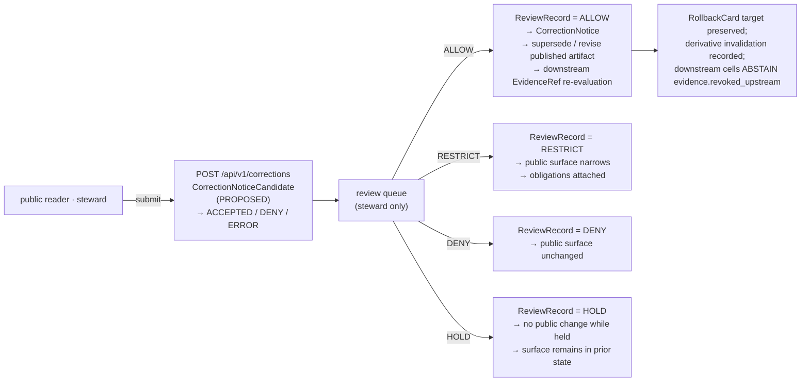

| **AI-authored merges** | Every AI-authored merge touching this surface emits a `GENERATED_RECEIPT.json` per [`ai-build-operating-contract.md`](../../doctrine/ai-build-operating-contract.md) §34, with `contract_version = "3.0.0"`, `artifact_paths[]` including the merged file, `truth_labels[]`, `validation_gates[]`, and `human_review.state`. |

`[CONFIRMED doctrine — ENCY §7.7.I; Atlas §9.L; GAI; ai-build-operating-contract.md §31–§34.]`

> [!IMPORTANT]
> *AI text treated as evidence* is the highest-severity anti-pattern at any Focus Mode surface: `DENY` at publication, `ABSTAIN` at Focus, and `AIReceipt` is mandatory. The Focus answer is interpretation, never root truth. `[CONFIRMED — Atlas §24.9.2 AI anti-patterns; GAI; ai-as-assistant.md.]`

[Back to top](#top)

---

## 12. Correction & rollback contract

Agriculture publication requires: `ReleaseManifest`, `EvidenceBundle`, validation / policy support, review state where required, correction path, stale-state rule, and rollback target. `[CONFIRMED doctrine — ENCY Appendix E; Atlas §9.M; corrections-are-first-class.md.]`

The correction lane uses **workflow outcomes** (§4.3) at intake and **policy-gate outcomes** (§4.2) at review. No public publication is emitted by `ACCEPTED` alone; publication requires `ALLOW` from review and emission of a `CorrectionNotice`.

| Lane | Outcomes | Required artifacts |
|---|---|---|
| Correction submit (workflow) | `ACCEPTED` · `DENY` · `ERROR` | `CorrectionNoticeCandidate` written; no public claim until review allows. `[See §4.3.]` |
| Review decision (policy gate) | `ALLOW` · `RESTRICT` · `DENY` · `HOLD` · `ERROR` | `ReviewRecord` + `PolicyDecision`. `[See §4.2.]` |
| Rollback (operational; not a public route) | — | `RollbackCard` execution record, derivative invalidation, correction lineage. Indexed in [`runbooks/README.md`](./runbooks/README.md); canonical procedure at `docs/runbooks/agriculture/ROLLBACK_RUNBOOK.md` (PROPOSED). |

`[CONFIRMED — Atlas §20.2 Capability Matrix; corrections-are-first-class.md; trust-membrane.md §8.]`

> [!NOTE]
> **Correction propagation is non-trivial for agriculture** because ag aggregates often feed Frontier Matrix cells. When a published cropland claim is corrected, every matrix cell that consumed it MAY downgrade to `ABSTAIN evidence.revoked_upstream` at its next call per [`trust-membrane.md`](../../doctrine/trust-membrane.md) §8. The `CORRECTION_RUNBOOK.md` (PROPOSED) includes a derivative-identification step. `[CONFIRMED — Atlas §24.4.7; runbooks/README.md §9.5.]`

[Back to top](#top)

---

## 13. Open questions register

| ID | Question | Owner role | Resolution path |
|---|---|---|---|
| **OQ-AG-API-01** | Exact backend framework, route convention, and API stem for `apps/governed-api/`. Whether the boundary is `apps/governed-api/`, `apps/governed_api/`, `packages/api/`, or another adapter. | API owner + Architecture steward | Inspect package manifest, route registry, OpenAPI / GraphQL surface in mounted repo; ADR if boundary deviates from PROPOSED. |
| **OQ-AG-API-02** | Whether the canonical schema home for executable JSON Schema is `schemas/contracts/v1/` or `contracts/` (CONFLICTED in older corpus); ADR-0001 status. | Contract / schema steward | ADR-0001 ratification; schema-registry inspection. |
| **OQ-AG-API-03** | Whether `policy/` (singular) or `policies/` (plural) is the canonical policy home. ADR-0003 proposes `policy/` singular. | Policy steward | Inspect mounted repo; ADR-0003 status. |
| **OQ-AG-API-04** | Is `ui_negative_state` on the runtime envelope **normative** (validated by schema, enforced by CI) or **advisory** (UI hint only)? | Architecture steward + UI steward | ADR; reconcile with operating contract §22.2 wording. |
| **OQ-AG-API-05** | Final names for `AgricultureDecisionEnvelope`, `AgricultureFeatureDTO`, and the agriculture layer manifest profile. | Contract / schema steward | ADR + schema authoring + fixture validation. |
| **OQ-AG-API-06** | When is `NARROWED` / `BOUNDED` allowed on Agriculture surfaces? Should the envelope schema admit them at v1, v1.1, or only after explicit ADR? | Architecture steward | ADR; consistent with operating contract §21.2 optional-extension posture. |
| **OQ-AG-API-07** | Should `aggregation_receipt` be a required (vs optional) field on `AgricultureDecisionEnvelope` for any envelope whose `evidence_refs[]` includes `role = aggregate`? | Contract / schema steward + Policy steward | ADR — touches Atlas §24.13 centrality claim. |
| **OQ-AG-API-08** | Are the **release-tier audience classes** (`public` / `partner` / `steward` / `internal` / `denied`) the same concept as the API audience class in atlas card KFM-P9-PROG-0069, or distinct concepts sharing a value space? Parallels OQ-AG-SUB-06. | Architecture steward | Card reconciliation; ADR if distinct. |
| **OQ-AG-API-09** | NASS / QuickStats / Crop Progress source-activation status under KFM. | Source steward | Mounted-repo source registry; `SourceActivationDecision`. |
| **OQ-AG-API-10** | Kansas Mesonet and HLS / SMAP product terms (rights, redistribution, attribution). | Source steward + Rights-holder representative | Source-terms records in `data/registry/sources/agriculture/`. |
| **OQ-AG-API-11** | Public release sensitivity rules for farm / operator joins (exact thresholds, generalization steps). | Sensitivity reviewer + Policy steward | `policy/sensitivity/agriculture/` decisions + steward review records. |
| **OQ-AG-API-12** | Exact aggregate-threshold values for county / HUC / grid public release (when does a county-level aggregate become small enough to fail `k-anon`?). | Policy steward + Agriculture domain steward | ADR + `policy/domains/agriculture/` release rules. |
| **OQ-AG-API-13** | Whether Agriculture corrections share the global queue or have a domain-tagged queue. | API owner + Policy steward | Inspect `apps/governed-api/` route map + `policy/review/`. |
| **OQ-AG-API-14** | Final form of `obligations` block (redactions / generalizations vocabulary) for Agriculture envelopes. | Contract / schema steward | ADR + `EvidenceBundle` schema confirmation. |
| **OQ-AG-API-15** | Should the `RuntimeResponseEnvelope` `contract_version` field be a **`const`** ("3.0.0" only) or a **`pattern`** (allows v3.x minor evolution without schema break)? | Architecture steward | ADR — touches operating contract §37.1 lifecycle. |
| **OQ-AG-API-16** | Are revocation events propagated push-style (proactive cell re-evaluation) or pull-style (cells re-evaluate on next call)? Affects the `revocation propagation tests` validator. | Architecture steward | Reconcile with `trust-membrane.md` §8. |

[Back to top](#top)

---

## 14. Open verification backlog

Items below are verification work that this document cannot complete in a session without a mounted repo. Each MUST be tracked in `docs/registers/VERIFICATION_BACKLOG.md` (PROPOSED) until closed.

| Item | What to check | Owner | Settles which OQ / claim |
|---|---|---|---|
| **Mounted-repo presence of `apps/governed-api/`** | Confirm the directory exists; inspect package manifest, route registry, OpenAPI / GraphQL surface. | API owner | OQ-AG-API-01. |
| **Mounted-repo presence of `schemas/contracts/v1/`** | Confirm the schema-home convention; resolve CONFLICTED references. | Contract / schema steward | OQ-AG-API-02. |
| **Mounted-repo presence of `policy/`** | Confirm singular `policy/` vs plural `policies/`. | Policy steward | OQ-AG-API-03. |
| **Mounted-repo presence of `docs/domains/agriculture/`** | Confirm placement; confirm sibling `policy/`, `runbooks/`, `sublanes/` aspect READMEs. | Docs steward | Sibling integration. |
| **`SourceDescriptor` instances for ag sources** | Confirm `data/registry/sources/agriculture/` directory and admitted-source coverage (CDL, NASS, SSURGO, NLCD, LANDFIRE, GAP, PLANTS, vegetation index, FSA CLU). | Source steward | OQ-AG-API-09; OQ-AG-API-10. |
| **`AggregationReceipt` schema home** | Confirm whether the schema lives at `schemas/contracts/v1/receipts/aggregation_receipt.schema.json` or elsewhere; depends on ADR-S-03 (Atlas §24.12). | Contract / schema steward | §5 schema home; OQ-AG-API-07. |
| **`GENERATED_RECEIPT` schema home** | Confirm `schemas/contracts/v1/receipts/generated_receipt.schema.json` exists per operating contract §47. | Contract / schema steward | §5; §10 validator. |
| **`apps/explorer-web/` reader path** | Confirm Explorer Web reads via `apps/governed-api/`, not directly from canonical stores. | API owner + UI owner | §2.4 trust-membrane placement. |
| **`policy/sensitivity/agriculture/` artifacts** | Confirm per-sublane sensitivity rule presence (`public_safe_aggregate/`, `private_operator/`, `field_level_aggregate_derived/`, `person_parcel_join/`). | Policy steward + Sensitivity reviewer | §7 sensitivity lanes. |
| **`policy/release/agriculture/` artifacts** | Confirm per-tier release rules (`public/`, `partner/`, `steward/`, `internal/`, `denied/`). | Policy steward | §3 audience class column. |
| **OPA / Conftest / Cosign pins** | Confirm tooling versions are pinned. | Policy steward + Build owner | Validator infrastructure. |
| **CODEOWNERS for `docs/domains/agriculture/`** | Confirm reviewer coverage. | Docs steward | Owner roster. |
| **CI workflow names** | Confirm or assign the validator job names listed in §10. | Build owner | §10 validators. |
| **ADR backlog rows** | Confirm ADR-0001 (schema home), ADR-0003 (`policy/` singular), ADR-S-03 (`AggregationReceipt` home), ADR-S-04 (source-role enum), ADR-S-05 (sensitivity tier) status. | Architecture steward | Doctrine ratification across OQs. |

`[All open; resolution path varies per row. See ai-build-operating-contract.md §28 ADR template; UIAI §27.]`

[Back to top](#top)

---

## 15. Changelog v1 → v2

| § | Change | Rationale |
|---|---|---|
| Meta block | Added `subtype: domain-api-contracts`; added `contract_version: "3.0.0"`; refreshed `owners` to operating-contract reviewer pattern; refreshed `updated: 2026-05-26`; expanded `related[]` to include sibling agriculture domain-aspect READMEs (`policy/`, `runbooks/`, `sublanes/`, `sublanes/cropland.md`), receipt schemas, sensitivity / release policy paths; expanded `tags[]`; added v2 reconciliation note. | v3.0 operating contract requires `contract_version` pin; sibling READMEs created this session need cross-reference. |
| Title / badge row | Added Version, Contract, Conformance, Posture, Aggregation, Sensitivity badges; updated last-reviewed badge. | Reflects contract pinning, fail-closed posture, aggregation centrality. |
| IMPORTANT callout | Added top-of-doc IMPORTANT callout explaining outcome-grammar reconciliation across layers. | v1 ran together AI-runtime / policy-gate / workflow outcomes; v2 separates them per operating contract §21.2 + Atlas §24.3.1. |
| NOTE callout | Added top-of-doc NOTE callout linking sibling docs (`policy/`, `runbooks/`, `sublanes/`, `sublanes/cropland.md`). | Sibling docs created this session; this doc is the interface contract that the others orbit. |
| §1 Purpose & scope | Added audience-class row to in-scope/out-of-scope table; replaced generic `[ATLAS §24.x]` with specific `[Atlas §24.9.2]`. | Audience-class is CONFIRMED per atlas card KFM-P9-PROG-0069 and was absent from v1. |
| §2 Authority & placement | Expanded authority order from 6 to 9 entries (operating contract v3.0, trust-vocabulary doctrine, sibling agriculture READMEs); added §2.2 RFC 2119 conformance; renumbered §2.3 (paths) and §2.4 (trust-membrane placement); expanded path tree to include `policy/sensitivity/agriculture/`, `policy/release/agriculture/`, `schemas/contracts/v1/runtime/`, `schemas/contracts/v1/receipts/`, `data/registry/sources/agriculture/`, `docs/domains/agriculture/sublanes/`, `docs/runbooks/agriculture/`. | v3.0 operating contract requires explicit authority stack; sibling READMEs added; RFC 2119 conformance is a corpus-wide expectation. |
| §3 Surface inventory | Added **audience-class column** to surface table; updated Mermaid diagram to show audience-class enforcement, `AggregationReceipt` in Released store, `GENERATED_RECEIPT` carried off Focus path. | Audience-class is a first-class concept; aggregate receipt centrality per Atlas §24.13. |
| §4 Outcome grammar | **Major restructure.** Split into §4.1 runtime outcomes (canonical four + optional `NARROWED` / `BOUNDED`), §4.2 policy-gate outcomes (`ALLOW` / `RESTRICT` / `DENY` / `HOLD` / `ERROR` — with explicit "HOLD is gate-level, not runtime" note), §4.3 workflow outcomes (correction `ACCEPTED` / `DENY` / `ERROR`), §4.4 UI negative states paired with §22.2 vocabulary, §4.5 forbidden outcomes per surface (expanded). | v1 conflated all three vocabularies. Operating contract §21.2 + Atlas §24.3.1 keep them distinct; this is the most important v1→v2 reconciliation. |
| §5 DTOs & envelopes | Added `AggregationReceipt` and `GENERATED_RECEIPT.json` rows; updated illustrative schema to include `contract_version` const (`"3.0.0"`), `audience_class` enum, `ui_negative_state` enum, `aggregation_receipt` block, expanded `role` enum to include `modeled` / `observed` / `regulatory` / `admin` per source-role anti-collapse. | `AggregationReceipt` is load-bearing per Atlas §24.13; contract-version pin per operating contract §37.1; source-role enum complete per Atlas §24.9.3. |
| §6 Object families | Added **Topical-sublane home** column pointing to `sublanes/cropland.md` and planned profiles; added IMPORTANT callout elevating `AggregationReceipt` centrality per Atlas §24.13. | Cropland sublane profile created this session; aggregation-receipt centrality is CONFIRMED. |
| §7 Sensitivity lanes | Expanded from 5 to 9 rows: added CDL-as-observed deny, NASS-aggregate-as-field deny, drought/pest-as-alert deny, conservation-as-instruction deny rows; §7.1 expanded with explicit `aggregation_receipt` requirement on any envelope with `role = aggregate`. | Source-role anti-collapse rows are CONFIRMED rejections per Atlas §24.9.3; alert / instruction rows are CONFIRMED rejections per Atlas §24.4.4 / §24.9.2. |
| §8 Pipeline | Updated Mermaid diagram to include classmap-version note on RAW, `AggregationReceipt` at PROCESSED, audience-class enforcement at API, revocation arrow PUB→WQ; §8.1 gate table gained Cropland-specific-notes column. | Cropland is the worked topical sublane; classmap-version preservation is CONFIRMED per atlas KFM-P25-PROG-0005. |
| §9 Cross-lane | Expanded from 4 to 10 rows: added Habitat / Fauna / Flora / Geology / Frontier-Matrix / Hazards with default disposition column per Atlas §24.4. | v1 covered only the four most obvious cross-lane edges; Atlas §24.4.7 enumerates the full set. |
| §10 Validators | **Major reorganization** into 6 categories (schema/admission, outcome/envelope, sensitivity/aggregation, audience-class/trust-membrane, evidence/release/correction/rollback, no-network/drift/AI authoring); expanded from ~15 to ~27 validators; added classmap-version, `NARROWED`/`BOUNDED` schema-gate, `contract_version` pin, reason-shape-not-contents, revocation-propagation, freshness-window, `GENERATED_RECEIPT` presence validators. | v1 was a flat checklist that obscured groupings; new validators reflect material added in §4 / §5 / §7 / §11. |
| §11 Governed AI behavior | Added `AI-authored merges` row requiring `GENERATED_RECEIPT.json` per `ai-build-operating-contract.md` §34; expanded `ABSTAIN` triggers to include freshness-window-lapsed; expanded `DENY` triggers to include cross-lane join to identifiable operator / parcel; added `contract_version = "3.0.0"` to required receipt fields. | Operating contract §34 makes `GENERATED_RECEIPT` mandatory for AI-authored merges; freshness-window-lapsed is a CONFIRMED `ABSTAIN` reason per trust-membrane.md §10. |
| §12 Correction & rollback | Diagram updated with downstream `EvidenceRef` re-evaluation arrow; NOTE callout added explaining correction propagation to Frontier Matrix cells; runbook cross-reference added. | Correction-propagation cascade is CONFIRMED per trust-membrane.md §8 and indexed in runbooks/README.md §9.5. |
| §13 → §17 | Renumbered v1 §13 → v2 §13 (renamed "Open questions register" with OQ-AG-API-XX IDs); added v2 §14 Open verification backlog, v2 §15 Changelog v1→v2, v2 §16 Definition of done; renumbered v1 §14 Related docs → v2 §17 Related docs with expanded entries. | Doctrine-adjacent docs include all four companion sections per the AI-builder Markdown-authoring contract; OQ IDs make individual questions citable across the corpus. |
| Footer | Updated version to v2, last updated to 2026-05-26, added contract pin. | Routine v1→v2 hygiene. |

[Back to top](#top)

---

## 16. Definition of done

A repository implementation of this document conforms when **all** of the following hold:

- [ ] `docs/domains/agriculture/api-contracts.md` exists with KFM Meta Block v2 and `contract_version: "3.0.0"`.
- [ ] All sibling agriculture aspect READMEs ([`policy/`](./policy/README.md), [`runbooks/`](./runbooks/README.md), [`sublanes/`](./sublanes/README.md)) exist and cross-reference this document.
- [ ] [`sublanes/cropland.md`](./sublanes/cropland.md) exists as the worked topical-sublane profile.
- [ ] `apps/governed-api/` (or its accepted-ADR equivalent) exists and enforces audience-class boundaries.
- [ ] `AgricultureDecisionEnvelope`, `AgricultureFeatureDTO`, and the agriculture `LayerManifest` profile are authored under `schemas/contracts/v1/domains/agriculture/`.
- [ ] Each schema includes `contract_version: { "const": "3.0.0" }`.
- [ ] Each schema admits the canonical four runtime outcomes (`ANSWER` / `ABSTAIN` / `DENY` / `ERROR`) and, where applicable, the optional `NARROWED` / `BOUNDED` extensions.
- [ ] `AggregationReceipt` schema is present at its agreed home (pending ADR-S-03 resolution) and is referenced by every aggregate-bearing envelope.
- [ ] `GENERATED_RECEIPT` schema is present at `schemas/contracts/v1/receipts/generated_receipt.schema.json`.
- [ ] Audience-class enforcement is wired (`internal` / `denied` never appears in `public` / `partner` envelopes).
- [ ] Source-role anti-collapse is enforced (CDL = `modeled`, NASS = `aggregate`, etc.).
- [ ] Person-parcel-join `DENY` default is enforced.
- [ ] Field-level NASS `DENY` is enforced.
- [ ] Public-facing aggregate envelopes carry `aggregation_receipt`.
- [ ] `RAW` / `WORK` / `QUARANTINE` / candidate / direct-model paths never appear in public envelopes.
- [ ] Correction-propagation cascade emits `CorrectionNotice` and triggers downstream `EvidenceRef` re-evaluation.
- [ ] Every AI-authored merge touching this surface emits a `GENERATED_RECEIPT.json` with `contract_version = "3.0.0"`.
- [ ] Every validator in §10 ships with both valid and invalid fixtures; invalid fixtures fail for the expected reason.
- [ ] Drift between this document and live state is logged in `docs/registers/DRIFT_REGISTER.md`.
- [ ] All open questions in §13 are either resolved or assigned to ADRs with active owners.
- [ ] All verification items in §14 are tracked in `docs/registers/VERIFICATION_BACKLOG.md`.

[Back to top](#top)

---

## 17. Related docs

> Links use repo-relative paths. Targets marked `(PROPOSED)` are not yet asserted to exist; `TODO` entries are placeholders for sibling docs to be authored.

**Operating doctrine**

- [`docs/doctrine/ai-build-operating-contract.md`](../../doctrine/ai-build-operating-contract.md) — canonical operating contract (`CONTRACT_VERSION = "3.0.0"`). `[CONFIRMED sibling.]`
- [`docs/doctrine/directory-rules.md`](../../doctrine/directory-rules.md) — placement protocol. `[CONFIRMED sibling.]`

**Trust-boundary doctrine**

- [`docs/doctrine/trust-membrane.md`](../../doctrine/trust-membrane.md) — the trust contract every envelope warrants. `[CONFIRMED sibling.]`
- [`docs/doctrine/policy-aware.md`](../../doctrine/policy-aware.md) — finite policy outcomes. `[CONFIRMED sibling.]`
- [`docs/doctrine/lifecycle-law.md`](../../doctrine/lifecycle-law.md) — `RAW → … → PUBLISHED`. `[CONFIRMED sibling.]`
- [`docs/doctrine/evidence-first.md`](../../doctrine/evidence-first.md) — cite-or-abstain. `[CONFIRMED sibling.]`
- [`docs/doctrine/ai-as-assistant.md`](../../doctrine/ai-as-assistant.md) — AI behavior at the runtime surface. `[CONFIRMED sibling.]`
- [`docs/doctrine/corrections-are-first-class.md`](../../doctrine/corrections-are-first-class.md) — `CorrectionNotice` workflow. `[CONFIRMED sibling.]`

**Agriculture domain orientation (created this session)**

- [`docs/domains/agriculture/README.md`](./README.md) — agriculture domain landing page. `[PROPOSED.]`
- [`docs/domains/agriculture/policy/README.md`](./policy/README.md) — agriculture policy aspect index. `[PROPOSED sibling.]`
- [`docs/domains/agriculture/runbooks/README.md`](./runbooks/README.md) — agriculture runbooks aspect index. `[PROPOSED sibling.]`
- [`docs/domains/agriculture/sublanes/README.md`](./sublanes/README.md) — agriculture sublane decomposition (5 axes). `[PROPOSED sibling.]`
- [`docs/domains/agriculture/sublanes/cropland.md`](./sublanes/cropland.md) — worked topical-sublane profile. `[PROPOSED sibling.]`
- `docs/domains/agriculture/SOURCES.md` — Agriculture source registry summary (TODO).
- `docs/domains/agriculture/SENSITIVITY.md` — Agriculture sensitivity / deny-by-default lanes detail (TODO).

**Architecture and runtime**

- `docs/architecture/governed-ai/FOCUS_FLOW.md` — Cross-cutting Focus Mode flow (PROPOSED).
- `docs/architecture/ui/EVIDENCE_DRAWER.md` — Evidence Drawer payload contract (PROPOSED).
- `docs/standards/PROV.md` — W3C PROV-O / PAV provenance crosswalk.

**ADR backlog (relevant to this doc)**

- `docs/adr/ADR-0001-schema-home.md` — Schema-home authority (`schemas/contracts/v1/`) (NEEDS VERIFICATION).
- `docs/adr/ADR-0003-policy-singular.md` — `policy/` singular as canonical (PROPOSED — see OQ-AG-API-03).
- `docs/adr/ADR-S-03-aggregation-receipt-home.md` — `AggregationReceipt` schema home (PROPOSED per Atlas §24.12).
- `docs/adr/ADR-S-04-source-role-enum.md` — source-role enum evolution (PROPOSED per Atlas §24.12).
- `docs/adr/ADR-S-05-sensitivity-tier.md` — sensitivity tier scheme (PROPOSED per Atlas §24.12).

**Cross-cutting**

- `contracts/OBJECT_MAP.md` — Cross-cutting object-family crosswalk (PROPOSED).

---

**Last reviewed:** 2026-05-26 · **Owners:** *TODO — Docs steward + Agriculture domain steward + API owner + Contract/schema steward + Policy steward* · **Version:** v2 (draft) · **Status:** `draft` · `PROPOSED` routes / `NEEDS VERIFICATION` paths · **Pinned to:** `CONTRACT_VERSION = "3.0.0"` · [Back to top](#top)
