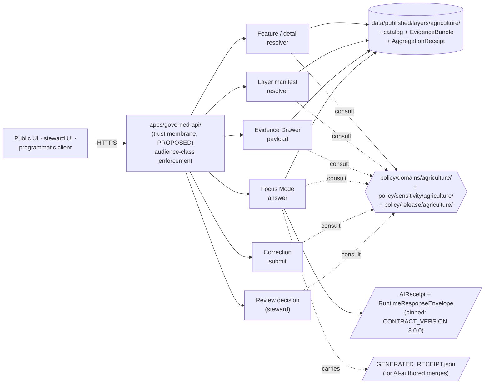
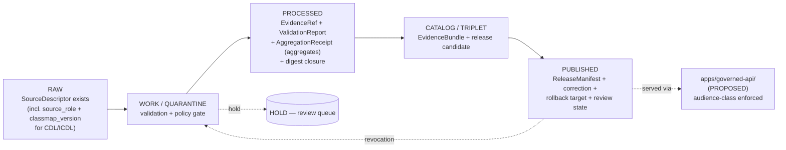
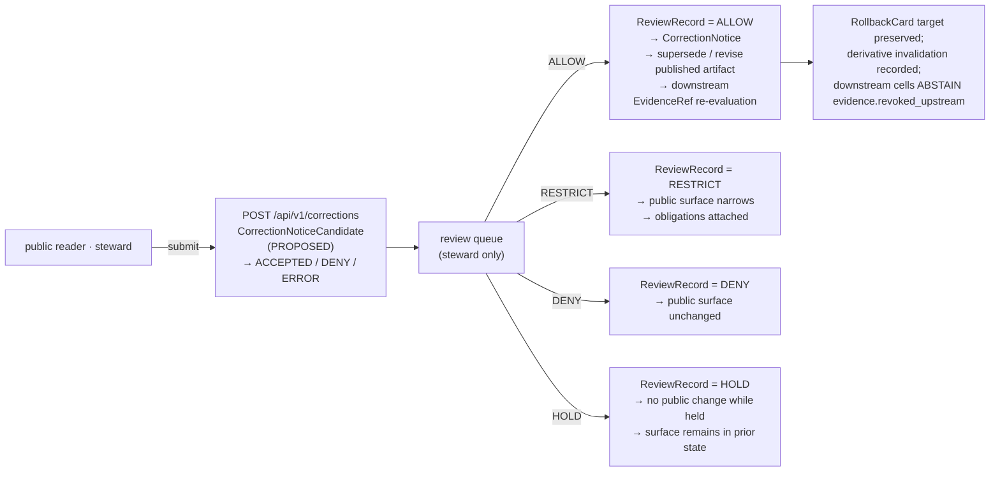

<!-- [KFM_META_BLOCK_V2]
doc_id: kfm://doc/docs.domains.agriculture.api-contracts
title: Agriculture — API Contracts
type: standard
subtype: domain-api-contracts
version: v2 (draft)
status: draft
contract_version: "3.0.0"
owners: <TODO: Docs steward + Agriculture domain steward + API owner + Contract/schema steward + Policy steward (per ai-build-operating-contract.md §0 reviewer pattern)>
created: 2026-05-15
updated: 2026-05-26
policy_label: public
related:
  - docs/doctrine/ai-build-operating-contract.md
  - docs/doctrine/directory-rules.md
  - docs/doctrine/trust-membrane.md
  - docs/doctrine/policy-aware.md
  - docs/doctrine/lifecycle-law.md
  - docs/doctrine/evidence-first.md
  - docs/doctrine/ai-as-assistant.md
  - docs/doctrine/corrections-are-first-class.md
  - docs/domains/agriculture/README.md
  - docs/domains/agriculture/policy/README.md
  - docs/domains/agriculture/runbooks/README.md
  - docs/domains/agriculture/sublanes/README.md
  - docs/domains/agriculture/sublanes/cropland.md
  - docs/architecture/governed-ai/
  - docs/standards/PROV.md
  - schemas/contracts/v1/domains/agriculture/
  - schemas/contracts/v1/runtime/
  - schemas/contracts/v1/receipts/generated_receipt.schema.json
  - contracts/domains/agriculture/
  - policy/domains/agriculture/
  - policy/sensitivity/agriculture/
  - policy/release/agriculture/
  - apps/governed-api/
tags: [kfm, domain, agriculture, api, contracts, decision-envelope, aggregation-receipt, audience-class, fail-closed, contract-v3]
notes:
  - v2 reconciles outcome grammar with `ai-build-operating-contract.md` §21.2 (canonical four: ANSWER / ABSTAIN / DENY / ERROR; optional NARROWED / BOUNDED) and Atlas §24.3.1 (HOLD at gate / workflow layers, not runtime). See §15 Changelog.
  - v2 pins `CONTRACT_VERSION = "3.0.0"` per `ai-build-operating-contract.md` §0 / §37.
  - v2 integrates with the agriculture domain-aspect README family: `policy/README.md`, `runbooks/README.md`, `sublanes/README.md`, `sublanes/cropland.md`.
  - All repo paths, route names, and DTO names are PROPOSED until mounted-repo verification.
  - Schema home defaults to `schemas/contracts/v1/` per Directory Rules §7.4 / ADR-0001.
[/KFM_META_BLOCK_V2] -->

<a id="top"></a>

# Agriculture — API Contracts

> **Governed API surfaces, finite outcome grammar, and DTO / schema homes for the Agriculture domain — aggregate-only and public-safe by default; field-level, operator-private, and person-parcel-join material fail closed; source-role and aggregation-receipt discipline are non-negotiable.**


-4A6FA5?style=flat-square)


-purple?style=flat-square)


| Status | Owners | Last reviewed | Pinned to |
|---|---|---|---|
| `draft` (v2) · PROPOSED routes / NEEDS VERIFICATION paths | *TODO — Docs steward + Agriculture domain steward + API owner + Contract/schema steward + Policy steward* `[NEEDS VERIFICATION]` | 2026-05-26 | `CONTRACT_VERSION = "3.0.0"` |

> [!IMPORTANT]
> **v2 reconciles outcome grammar with v3.0 operating contract.** The canonical four runtime outcomes (`ANSWER` / `ABSTAIN` / `DENY` / `ERROR`) live in §4.1, with `NARROWED` / `BOUNDED` as schema-gated optional extensions per [`ai-build-operating-contract.md`](../../doctrine/ai-build-operating-contract.md) §21.2. Policy-gate outcomes (`ALLOW` / `RESTRICT` / `DENY` / `HOLD` / `ERROR`) live in §4.2 per Atlas §24.3.1. Workflow outcomes (e.g., correction `ACCEPTED`) live in §4.3. UI negative-state vocabulary (`SOURCE_STALE`, `DENIED_BY_POLICY`, etc.) lives in §4.4 per operating contract §22.2.

> [!NOTE]
> **Sibling docs reconcile here.** This document is the **interface contract** for the agriculture domain. The **policy posture** that those interfaces enforce is in [`policy/README.md`](./policy/README.md); the **operational procedures** that maintain them are in [`runbooks/README.md`](./runbooks/README.md); the **internal decomposition** (5 sublane axes) is in [`sublanes/README.md`](./sublanes/README.md); a worked topical-sublane profile is in [`sublanes/cropland.md`](./sublanes/cropland.md). Each surface returns material classified along the five sublane axes.

---

## Quick jump

- [1. Purpose & scope](#1-purpose--scope)
- [2. Authority & placement](#2-authority--placement)
- [3. Surface inventory](#3-surface-inventory)
- [4. Outcome grammar](#4-outcome-grammar)
- [5. DTOs & envelopes](#5-dtos--envelopes)
- [6. Object families resolved by these contracts](#6-object-families-resolved-by-these-contracts)
- [7. Sensitivity & deny-by-default lanes](#7-sensitivity--deny-by-default-lanes)
- [8. Pipeline state and admission gates](#8-pipeline-state-and-admission-gates)
- [9. Cross-lane relations](#9-cross-lane-relations)
- [10. Validators & contract tests](#10-validators--contract-tests)
- [11. Governed AI behavior on this surface](#11-governed-ai-behavior-on-this-surface)
- [12. Correction & rollback contract](#12-correction--rollback-contract)
- [13. Open questions register](#13-open-questions-register)
- [14. Open verification backlog](#14-open-verification-backlog)
- [15. Changelog v1 → v2](#15-changelog-v1--v2)
- [16. Definition of done](#16-definition-of-done)
- [17. Related docs](#17-related-docs)

---

## 1. Purpose & scope

This document defines the **governed API contract surface** for the Kansas Frontier Matrix (KFM) Agriculture domain. It enumerates the surfaces that may be exposed to clients, the finite outcome grammar each surface returns, the DTO and schema families each surface depends on, the audience-class boundaries, and the sensitivity and review constraints that bound what may be answered.

The Agriculture domain mission, from the project source of truth: *represent crops, fields, soils, irrigation, yields, conservation practices and agricultural economy in **public-safe aggregate or permissioned form**; never publish private farm operations, field-level sensitive details, or source-rights-limited data without review.* `[CONFIRMED — ENCY §7.7.A; DOM-AG; Atlas §9.A.]`

| In scope | Out of scope |
|---|---|
| Agriculture feature / detail resolution through the trust membrane | Direct access to `data/raw`, `data/work`, or `data/quarantine` (forbidden by trust membrane) |
| Agriculture layer manifest resolution for map clients | Field-level operator truth from aggregate satellite products |
| Evidence Drawer payload assembly for Agriculture claims | Title / ownership / parcel privacy (owned by People/Land) |
| Focus Mode answers grounded in released Agriculture `EvidenceBundle`s | Water observations and flood context (owned by Hydrology) |
| Correction submission and read-only review surface for Agriculture | Canonical soil map-unit and horizon semantics (owned by Soil) |
| Surface-level audience-class enforcement (`public` / `partner` / `steward` / `internal` / `denied`) per Atlas card KFM-P9-PROG-0069 | Cross-domain governed-API patterns (covered in `docs/architecture/governed-ai/`) |

> [!IMPORTANT]
> Agriculture is one of the domains where **aggregate cited as per-place truth** is an explicit anti-pattern: joining an aggregate cell to a single record is `DENY` at the route boundary and `ABSTAIN` at AI. `[CONFIRMED — Atlas §24.9.2; ENCY §7.7.K policy-denial-for-field-level-NASS-claims test.]`

[Back to top](#top)

---

## 2. Authority & placement

### 2.1 Authority order for the contracts in this doc

1. **KFM operating contract** — [`ai-build-operating-contract.md`](../../doctrine/ai-build-operating-contract.md) v3.0 (`CONTRACT_VERSION = "3.0.0"`); §1 Operating Law is canonical. `[CONFIRMED.]`
2. **KFM core invariants** — lifecycle law, trust membrane, cite-or-abstain, watcher-as-non-publisher, evidence outranks generated language.
3. **Accepted ADRs** explicitly amending Directory Rules, schema home, source-role enum, or sensitivity-tier scheme.
4. **Directory Rules** — [`docs/doctrine/directory-rules.md`](../../doctrine/directory-rules.md).
5. **Trust-vocabulary doctrine** — [`docs/doctrine/trust-membrane.md`](../../doctrine/trust-membrane.md), [`docs/doctrine/policy-aware.md`](../../doctrine/policy-aware.md), [`docs/doctrine/evidence-first.md`](../../doctrine/evidence-first.md).
6. **Per-root READMEs** under affected canonical roots.
7. **Agriculture domain-aspect READMEs** — [`policy/README.md`](./policy/README.md), [`runbooks/README.md`](./runbooks/README.md), [`sublanes/README.md`](./sublanes/README.md).
8. **Domain dossier and atlas** — `[DOM-AG]`, `[ENCY §7.7]`, `[Atlas §9]` — lineage / proposed.
9. **Convention from mounted repo** — drift, not authority.

`[CONFIRMED doctrine — DIRRULES §2.1; ai-build-operating-contract.md §1.17 authority stack.]`

### 2.2 RFC 2119 conformance

This document uses RFC 2119 / RFC 8174 conformance keywords (**MUST** / **MUST NOT** / **SHOULD** / **SHOULD NOT** / **MAY**) per [`directory-rules.md`](../../doctrine/directory-rules.md) §2.2 and [`ai-build-operating-contract.md`](../../doctrine/ai-build-operating-contract.md) §5.1.1. Output that violates a **MUST** does not conform absent an accepted ADR.

### 2.3 PROPOSED responsibility-root homes

Per Directory Rules §4 Step 3, the agriculture domain appears as a **segment inside each responsibility root**, never as a root itself. The Agriculture-owned homes below are PROPOSED until the mounted repo is inspected.

```text
docs/domains/agriculture/                      # this document and siblings
docs/domains/agriculture/policy/               # policy aspect index (PROPOSED — sibling)
docs/domains/agriculture/runbooks/             # runbooks aspect index (PROPOSED — sibling)
docs/domains/agriculture/sublanes/             # sublane decomposition index + per-topical profiles
docs/runbooks/agriculture/                     # canonical runbook home (Pattern A per OPEN-DR-02)
contracts/domains/agriculture/                 # semantic object meaning (PROPOSED)
schemas/contracts/v1/domains/agriculture/      # executable JSON Schema (PROPOSED, ADR-0001 default)
schemas/contracts/v1/runtime/                  # shared RuntimeResponseEnvelope, AIReceipt
schemas/contracts/v1/receipts/                 # shared GENERATED_RECEIPT + AggregationReceipt + RedactionReceipt
policy/domains/agriculture/                    # admissibility gates (PROPOSED)
policy/sensitivity/agriculture/                # sensitivity sublane artifacts (PROPOSED)
policy/release/agriculture/                    # release-tier (audience class) artifacts (PROPOSED)
tests/domains/agriculture/                     # contract, policy, fixture, e2e tests (PROPOSED)
fixtures/domains/agriculture/                  # no-network golden / invalid fixtures (PROPOSED)
data/raw/agriculture/         data/work/agriculture/        data/quarantine/agriculture/
data/processed/agriculture/   data/catalog/domain/agriculture/
data/published/layers/agriculture/             # public-safe release surface only (PROPOSED)
data/registry/sources/agriculture/             # SourceDescriptor instances (PROPOSED)
release/candidates/agriculture/                # release decisions (PROPOSED)
```

`[PROPOSED — Directory Rules §4 Step 3; ENCY §7.7.J file-home note; Atlas §24.13 responsibility-root crosswalk.]`

> [!NOTE]
> Every path above is **PROPOSED** until inspected against a mounted repo. Per Directory Rules §0, *the authority of any specific path quoted here is PROPOSED until verified against mounted-repo evidence.* Treat this section as a placement plan, not a repo claim. `[CONFIRMED — DIRRULES §0.]`

### 2.4 Trust-membrane placement

Public and normal-UI clients **MUST** reach Agriculture data through `apps/governed-api/` (PROPOSED) and **MUST NOT** read from canonical or internal stores directly. The Explorer Web app (`apps/explorer-web/` PROPOSED) reads via `apps/governed-api/`; **never** directly from `data/raw|work|quarantine` or candidate stores. `[CONFIRMED doctrine — DIRRULES §7.1; UIAI; trust-membrane.md §5.]`

[Back to top](#top)

---

## 3. Surface inventory

Six surface families are PROPOSED for the Agriculture domain. Each returns a finite outcome from the [outcome grammar](#4-outcome-grammar) and operates under a recorded **audience class** per Atlas card KFM-P9-PROG-0069 (`public` / `partner` / `steward` / `internal` / `denied`). Routes are illustrative URL shapes; **exact route names are UNKNOWN** until the backend framework, route convention, and OpenAPI / GraphQL surface are verified against a mounted repo.

| # | Surface | Illustrative shape | DTO / schema | Audience class | Outcomes | Status |
|---|---|---|---|---|---|---|
| 1 | Agriculture feature / detail resolver | `GET /api/v1/domains/agriculture/features/{id}` | `AgricultureFeatureDTO` + `EvidenceRef[]`, wrapped in `AgricultureDecisionEnvelope` | `public` (aggregate) · `partner` · `steward` · `internal` | `ANSWER` · `ABSTAIN` · `DENY` · `ERROR` (+ optional `NARROWED` / `BOUNDED`) | PROPOSED |
| 2 | Agriculture layer manifest resolver | `GET /api/v1/layers/agriculture/{layer_id}/manifest` | `LayerManifest` (agriculture profile) | `public` · `partner` · `steward` · `internal` | `ANSWER` · `DENY` · `ERROR` | PROPOSED |
| 3 | Agriculture Evidence Drawer payload | `GET /api/v1/evidence-drawer/agriculture/{claim_id}` | `EvidenceDrawerPayload` + `EvidenceBundle` projection | `public` (filtered) · `partner` · `steward` | `ANSWER` · `ABSTAIN` · `DENY` · `ERROR` | PROPOSED |
| 4 | Agriculture Focus Mode answer | `POST /api/v1/focus/agriculture` | `RuntimeResponseEnvelope` + `AIReceipt` | `public` (filtered) · `partner` · `steward` | `ANSWER` · `ABSTAIN` · `DENY` · `ERROR` (+ optional `NARROWED` / `BOUNDED`) | PROPOSED |
| 5 | Correction submit (shared) | `POST /api/v1/corrections` (domain-tagged) | `CorrectionNoticeCandidate` | `public` · `partner` · `steward` | `ACCEPTED` · `DENY` · `ERROR` (workflow; see §4.3) | PROPOSED |
| 6 | Review decision (shared, steward only) | `POST /api/v1/review/{queue}/{id}/decision` | `ReviewRecord` | `steward` only | `ALLOW` · `RESTRICT` · `DENY` · `HOLD` · `ERROR` (policy gate; see §4.2) | PROPOSED |

`[CONFIRMED scope — ENCY §7.7.J domain dossier J. table; Atlas §9.J; Atlas §20.3 Master API Surface; audience-class column from atlas card KFM-P9-PROG-0069.]`



> [!CAUTION]
> The diagram is a **PROPOSED structural model**. The actual app boundary may be `apps/governed-api/`, `apps/governed_api/`, `packages/api/`, or another adapter — and route naming may differ. Resolve before implementation; record an ADR if the boundary deviates. `[NEEDS VERIFICATION — UIAI §15 open file-home conflicts; OQ-AG-API-01.]`

[Back to top](#top)

---

## 4. Outcome grammar

KFM separates **three distinct outcome vocabularies** that this document keeps explicit per [`ai-build-operating-contract.md`](../../doctrine/ai-build-operating-contract.md) §21.2 and Atlas §24.3.1: **runtime outcomes** (what an AI / API surface returns), **policy-gate outcomes** (what the policy engine returns), and **workflow outcomes** (what a multi-step process returns at intermediate stages). UI negative states (§4.4) are the rendering vocabulary that pairs with runtime outcomes per operating contract §22.2.

### 4.1 Runtime outcomes (canonical four + optional extensions)

Per [`ai-build-operating-contract.md`](../../doctrine/ai-build-operating-contract.md) §21.2, every Agriculture runtime surface (feature/detail, layer manifest, Evidence Drawer, Focus Mode) **MUST** return one of:

| Outcome | When | Required artifacts | Public-surface effect |
|---|---|---|---|
| **`ANSWER`** | Evidence sufficient; policy permits; release state allows; review state (if required) recorded. | `EvidenceBundle` resolved; `PolicyDecision = ALLOW`; `ReleaseManifest` applies; `AggregationReceipt` resolves if aggregate. | Substantive answer with Evidence Drawer + citations. |
| **`ABSTAIN`** | Evidence insufficient or incomplete; citations cannot be validated; source roles conflict; temporal scope insufficient; AI cannot cite; **freshness window lapsed**. | `AIReceipt` with `reason_code`; no claim emitted. | Non-substantive note with reason; never invents. Pairs with UI `SOURCE_STALE` / `MISSING_EVIDENCE` / `CITATION_FAILED`. |
| **`DENY`** | Policy, rights, sensitivity, or release state forbids the answer. Sensitive lanes default here. | `PolicyDecision = DENY` + `reason_code`; `AIReceipt` records denial. | Denial reason **shape**, never reason **contents**. Pairs with UI `DENIED_BY_POLICY` / `RESTRICTED_ACCESS` / `GENERALIZED_GEOMETRY`. |
| **`ERROR`** | Governed API cannot evaluate — missing schema, malformed query, contract violation, infrastructure failure. | Error envelope with diagnostic code; no claim leakage. | Finite, actionable error; never silently falls through. Pairs with UI `RUNTIME_ERROR`. |

**Optional extensions** (per `ai-build-operating-contract.md` §21.2, **only when contract schemas define them**):

| Outcome | When | Notes |
|---|---|---|
| **`NARROWED`** | Answer issued within a scope tighter than requested due to evidence or policy bounds. | A request for "field-level corn yield" may be narrowed to "county-level corn yield" when the source authority is aggregate. |
| **`BOUNDED`** | Answer issued with explicit confidence / coverage bounds. | A vegetation-index summary returned with an explicit mask-coverage percentage. |

Agriculture surfaces **MAY** emit `NARROWED` / `BOUNDED` **only when** the `AgricultureDecisionEnvelope` schema admits them. Until that schema is ratified, surfaces **MUST** stick to the canonical four.

> [!IMPORTANT]
> The runtime outcome is the contract. Clients **MUST** treat any non-finite or unrecognized outcome as `ERROR`. Informal substitutes ("probably," "should be fine," "trusted-ish") are **forbidden** in trust-significant contexts. `[CONFIRMED — trust-membrane.md §7.]`

### 4.2 Policy-gate outcomes (Atlas §24.3.1)

The policy engine consulted by every Agriculture surface returns one of:

| Outcome | When | Required artifacts |
|---|---|---|
| `ALLOW` | Policy permits the exposure for this caller / surface. | `PolicyDecision` with `decision = allow` + `reason_code`. |
| `RESTRICT` | Policy permits exposure under stated obligations (redaction, generalization, audience narrowing). | `PolicyDecision` with `obligations[]` + applicable `RedactionReceipt` / `AggregationReceipt`. |
| `DENY` | Policy forbids the exposure. | `PolicyDecision` with `decision = deny` + `reason_code`. |
| `HOLD` | Promotion / release / correction paused pending steward, rights-holder, or policy review. | `ReviewRecord` pending; `PolicyDecision = HOLD`. **No public claim emitted while held.** Surface remains in prior state — no silent rollback or replacement. `[CONFIRMED — Atlas §24.3.1.]` |
| `ERROR` | Policy engine cannot evaluate (missing schema, contract violation, infrastructure failure). | Error record; fail-closed. |

`HOLD` is a **gate-level outcome**, not a runtime outcome. A runtime surface whose policy gate returns `HOLD` returns `ABSTAIN release.pending_review` to the client.

### 4.3 Workflow outcomes (correction lane)

The correction-submit surface returns workflow outcomes that **do not** publish a claim until reviewed:

| Outcome | When | Required artifacts |
|---|---|---|
| `ACCEPTED` | The `CorrectionNoticeCandidate` is well-formed and queued for review. `ACCEPTED` is **not** a publication decision. | `CorrectionNoticeCandidate` written; queue entry; `RunReceipt`. |
| `DENY` | The candidate is malformed, unsupported, or duplicates a closed correction. | Refusal record. |
| `ERROR` | The submission infrastructure cannot evaluate (schema validation failure, queue unavailable). | Error envelope. |

A correction that reaches publication produces a `CorrectionNotice` (per [`corrections-are-first-class.md`](../../doctrine/corrections-are-first-class.md)) and, where required, a `RollbackCard` execution record.

### 4.4 UI negative states (rendering vocabulary)

Per [`ai-build-operating-contract.md`](../../doctrine/ai-build-operating-contract.md) §22.2, the UI renders runtime outcomes through a **finite negative-state vocabulary**:

`MISSING_EVIDENCE` · `SOURCE_STALE` · `DENIED_BY_POLICY` · `GENERALIZED_GEOMETRY` · `RESTRICTED_ACCESS` · `CONFLICTED_SUPPORT` · `CITATION_FAILED` · `RELEASE_WITHDRAWN` · `RUNTIME_ERROR`

The runtime envelope **MAY** include a `ui_negative_state` hint matching the underlying reason code (e.g., `ABSTAIN freshness.window_lapsed` → `SOURCE_STALE`; `DENY policy.sensitivity` → `DENIED_BY_POLICY`). Whether `ui_negative_state` is normative on the envelope or advisory is `[NEEDS VERIFICATION]` — see OQ-AG-API-04.

### 4.5 Forbidden outcomes per surface

| Surface | Outcomes returned | Forbidden behaviors |
|---|---|---|
| Feature / detail resolver | `ANSWER` · `ABSTAIN` · `DENY` · `ERROR` (+ optional extensions) | Returning an unreleased candidate as `ANSWER`; exposing internal-store identifiers; joining aggregate-cell value to a single record; serving field-level NASS as `ANSWER`. |
| Layer manifest resolver | `ANSWER` · `DENY` · `ERROR` | Returning a layer that lacks a `ReleaseManifest`; serving `WORK` or `CATALOG` layers to public clients; missing source-role badge on aggregate / modeled layers. |
| Evidence Drawer payload | `ANSWER` · `ABSTAIN` · `DENY` · `ERROR` | Returning raw source bytes; returning quarantined source as `ANSWER`; omitting `AggregationReceipt` reference for aggregate claims. |
| Focus Mode answer | `ANSWER` · `ABSTAIN` · `DENY` · `ERROR` | Emitting AI text as evidence; answering without an `AIReceipt`; bypassing citation validation; emitting an answer that source-role-collapses (e.g., calling a CDL `modeled` classification "observed"). |
| Correction submit | `ACCEPTED` · `DENY` · `ERROR` | Treating an acceptance as a publication decision; auto-promoting without review. |
| Review decision | `ALLOW` · `RESTRICT` · `DENY` · `HOLD` · `ERROR` | Allowing a non-steward role; emitting public artifacts before promotion; missing `ReviewRecord`. |

`[CONFIRMED — Atlas §24.3.2; ENCY §7.7.I; GAI; cropland.md §10 anti-patterns.]`

[Back to top](#top)

---

## 5. DTOs & envelopes

PROPOSED schema homes (defaults per ADR-0001 / Directory Rules §7.4 — *schema-home authority is `schemas/contracts/v1/<…>`*). Each schema below is **PROPOSED to create**; none is asserted to exist in the current repo.

| DTO / envelope | Purpose | PROPOSED schema home |
|---|---|---|
| `AgricultureDecisionEnvelope` | Domain-tagged finite-outcome wrapper used by the feature / detail resolver. **MUST** carry `contract_version`, `outcome`, `reason_code`, `evidence_refs[]`, `policy_refs[]`, and (where applicable) `aggregation_receipt`. | `schemas/contracts/v1/domains/agriculture/agriculture_decision_envelope.schema.json` |
| `AgricultureFeatureDTO` | Public-safe projection of an Agriculture feature (county / HUC / grid aggregate). | `schemas/contracts/v1/domains/agriculture/agriculture_feature_dto.schema.json` |
| `LayerManifest` (agriculture profile) | Layer descriptor with trust badge inputs, source-role tags (`modeled` / `aggregate` / `observed` / `regulatory` / `admin`), freshness, classmap version (for CDL/ICDL layers), sensitivity transforms, release reference. | `schemas/contracts/v1/layers/layer_manifest.schema.json` (shared) |
| `EvidenceDrawerPayload` | Drawer payload with claim, `EvidenceRef`s, bundle refs, source roles, valid time, review state, rights, sensitivity, correction, transforms, **and (for aggregates) the `AggregationReceipt` reference**. | `schemas/contracts/v1/ui/evidence_drawer_payload.schema.json` (shared) |
| `EvidenceBundle` projection | Public-safe projection of the released Agriculture `EvidenceBundle` referenced by the drawer or Focus answer. | `schemas/contracts/v1/evidence/evidence_bundle.schema.json` (shared) |
| `RuntimeResponseEnvelope` + `AIReceipt` | Common governed response wrapper for Focus / story / review. `AIReceipt` records outcome, `evidence_refs`, `policy_decision`, `citation_validation`, **and `contract_version`**. | `schemas/contracts/v1/runtime/runtime_response_envelope.schema.json` + `schemas/contracts/v1/runtime/ai_receipt.schema.json` (shared) |
| `CorrectionNoticeCandidate` | Public correction intake form; non-public until reviewed. | `schemas/contracts/v1/corrections/correction_notice_candidate.schema.json` (shared) |
| `ReviewRecord` | Steward decision artifact (`ALLOW` / `RESTRICT` / `DENY` / `HOLD`). | `schemas/contracts/v1/review/review_record.schema.json` (shared) |
| `AggregationReceipt` | Records bin / cell aggregation applied to protect underlying records. **Load-bearing for agriculture** per Atlas §24.13. | `schemas/contracts/v1/receipts/aggregation_receipt.schema.json` (shared; home pending ADR-S-03 per Atlas §24.12) |
| `GENERATED_RECEIPT.json` | Per-artifact receipt for AI-authored patches, schemas, tests, docs, or connectors touching the agriculture API surface. | `schemas/contracts/v1/receipts/generated_receipt.schema.json` (per `ai-build-operating-contract.md` §47) |

`[PROPOSED schema homes — DIRRULES §7.4 + ADR-0001; UIAI §15.]`

<details>
<summary><b>Illustrative DecisionEnvelope shape (not authoritative)</b></summary>

The shape below is **illustrative**, drawn from the consolidated DecisionEnvelope pattern in the project sources. It is **not** an authoritative agriculture schema. The authoritative schema must be authored in `schemas/contracts/v1/domains/agriculture/`, validated by fixtures, and gated by `policy/domains/agriculture/`.

```json
{
  "$schema": "https://json-schema.org/draft/2020-12/schema",
  "$id": "kfm://schema/AgricultureDecisionEnvelope.schema.json",
  "title": "AgricultureDecisionEnvelope (PROPOSED, illustrative)",
  "type": "object",
  "required": [
    "object_type",
    "schema_version",
    "contract_version",
    "envelope_id",
    "created",
    "spec_hash",
    "outcome",
    "evidence_refs"
  ],
  "properties": {
    "object_type":       { "const": "AgricultureDecisionEnvelope" },
    "schema_version":    { "const": "v1" },
    "contract_version":  { "const": "3.0.0" },
    "envelope_id":       { "type": "string", "minLength": 8 },
    "created":           { "type": "string", "format": "date-time" },
    "spec_hash":         { "type": "string", "pattern": "^[A-Fa-f0-9]{32,128}$" },
    "outcome":           { "enum": ["ANSWER", "ABSTAIN", "DENY", "ERROR", "NARROWED", "BOUNDED"] },
    "reason_code":       { "type": "string" },
    "policy_decision":   { "type": "string", "enum": ["allow", "restrict", "deny", "hold"] },
    "audience_class":    { "enum": ["public", "partner", "steward", "internal", "denied"] },
    "freshness":         { "type": "string", "format": "date-time" },
    "ui_negative_state": {
      "enum": [
        "MISSING_EVIDENCE", "SOURCE_STALE", "DENIED_BY_POLICY",
        "GENERALIZED_GEOMETRY", "RESTRICTED_ACCESS", "CONFLICTED_SUPPORT",
        "CITATION_FAILED", "RELEASE_WITHDRAWN", "RUNTIME_ERROR"
      ]
    },
    "evidence_refs": {
      "type": "array",
      "minItems": 1,
      "items": {
        "type": "object",
        "required": ["uri", "digest"],
        "properties": {
          "role":   { "enum": ["primary", "secondary", "derived", "aggregate", "modeled", "observed", "regulatory", "admin"] },
          "uri":    { "type": "string", "format": "uri" },
          "digest": {
            "type": "object",
            "required": ["alg", "value"],
            "properties": {
              "alg":   { "enum": ["sha256", "blake3"] },
              "value": { "type": "string" }
            }
          }
        }
      }
    },
    "aggregation_receipt": {
      "type": "object",
      "description": "Required when any evidence_refs entry has role=aggregate.",
      "properties": {
        "bin":          { "type": "string", "examples": ["county-year", "county-week", "huc12-month"] },
        "receipt_uri":  { "type": "string", "format": "uri" }
      }
    },
    "obligations": {
      "type": "object",
      "properties": {
        "redactions":      { "type": "array", "items": { "type": "object" } },
        "generalizations": { "type": "array", "items": { "type": "object" } }
      }
    }
  }
}
```

**Illustrative only** — sourced from the cross-cutting `DecisionEnvelope`, `EvidenceBundle`, and runtime-envelope patterns in the project knowledge base. Field set, required-ness, and naming for the agriculture-tagged envelope must be settled in an ADR and validated by fixtures. The `contract_version: "3.0.0"` constant **MUST** be present per [`ai-build-operating-contract.md`](../../doctrine/ai-build-operating-contract.md) §37.1.

`[INFERRED structure — composite of `DecisionEnvelope` + `EvidenceBundle` + UIAI runtime envelope; contract-version field per ai-build-operating-contract.md §37.1.]`
</details>

[Back to top](#top)

---

## 6. Object families resolved by these contracts

The Agriculture domain owns the following object families per Atlas §9.B. Each may surface through one or more of the routes above, and each is identity-bounded by the rule *source id + object role + temporal scope + normalized digest* (PROPOSED). `[CONFIRMED — Atlas §9.E.]`

| Object family | Public surfacing posture | Aggregate-only required? | Topical-sublane home (see [`sublanes/`](./sublanes/)) |
|---|---|---|---|
| `CropObservation` | Aggregate (county / HUC / grid) public; field-level deny by default. | Yes for public release. | [`cropland.md`](./sublanes/cropland.md) |
| `FieldCandidate` | **Restricted by default** (`internal` audience class); never `public`. | n/a — private boundary not public. | `cropland.md` (internal-only) |
| `CropRotation` | Aggregate public; field-level restricted. | Yes. | `cropland.md` |
| `YieldObservation` | Aggregate (county-year) public; proprietary yield denied. | Yes. | (planned `yield.md` profile — PROPOSED) |
| `IrrigationLink` | Aggregate / context public; operator-specific restricted. | Yes. | (planned `irrigation.md` profile — PROPOSED) |
| `ConservationPractice` | Public only where source terms permit; **never instructional**. | Conditional on rights. | (planned `conservation-practice.md` profile — PROPOSED) |
| `SoilCropSuitability` | Public model output (with model receipt); cross-lane to Soil. | Aggregate threshold per release manifest. | (planned `soil-crop-suitability.md` profile — PROPOSED) |
| `AgriculturalEconomyObservation` | Aggregate public where rights permit. | Yes. | (planned `agricultural-economy.md` profile — PROPOSED) |
| `SupplyChainNode` | Public only after rights / sensitivity review. | Conditional. | (planned `supply-chain.md` profile — PROPOSED) |
| `DroughtStressIndicator` | Public-safe indicator; not field truth; **never an alert**. | Yes. | (planned `drought-stress.md` profile — PROPOSED) |
| `PestStressIndicator` | Public-safe indicator; not field truth; **never an alert**. | Yes. | (planned `pest-stress.md` profile — PROPOSED) |
| `AggregationReceipt` | **Load-bearing for agriculture.** Process memory; not directly public — referenced via `EvidenceBundle`. | n/a (receipt). | All aggregate-bearing topical sublanes. |

> [!IMPORTANT]
> **`AggregationReceipt` is central to the agriculture lane.** Per Atlas §24.13, the agriculture row reads: *"Aggregation receipts central; private-join denial defaults."* Every aggregate-bearing object MUST resolve an `AggregationReceipt` recording bin / cell semantics. Missing receipt → verification-gate `DENY`. `[CONFIRMED — Atlas §24.13; cropland.md §6.1.]`

`[CONFIRMED — ENCY §7.7.C; Atlas §9.B–E.]`

[Back to top](#top)

---

## 7. Sensitivity & deny-by-default lanes

The trust posture for Agriculture is **aggregate-only by default**. Field-level operator truth is denied; satellite or model derivatives must not become field / operator truth; private joins fail closed. The canonical decomposition of sensitivity into sublanes is documented in [`policy/README.md`](./policy/README.md) §6 and [`sublanes/README.md`](./sublanes/README.md) §9.1.

| Lane | Default outcome | Required controls |
|---|---|---|
| **Private landowner-sensitive data** (field boundaries, owner identity, operations) | `DENY` exact / public if private or rights unclear | Aggregation; permissions; policy review. `[CONFIRMED — ENCY §13; Atlas §9.I.]` |
| **Aggregate cited as per-place truth** (join aggregate cell → single record) | `DENY` at route boundary; `ABSTAIN` at AI | `AggregationReceipt`; geometry-scope guard; matrix-cell semantics. `[CONFIRMED — Atlas §24.9.2.]` |
| **Field-level NASS-derived claims** | `DENY` by policy | `policy/domains/agriculture/` deny rule. `[CONFIRMED — Atlas §9.K policy-denial-for-field-level-NASS-claims test.]` |
| **Source-rights-limited records** (licensed, no-redistribution, uncertain terms) | `DENY` public release until terms resolved | Rights register; attribution; no public derivative if barred. `[CONFIRMED — ENCY §13; Atlas §24.7 source steward.]` |
| **Farm / operator joins to People/Land** | `DENY` by default | Cross-lane policy gate; restricted view. `[CONFIRMED — Atlas §24.4.7.]` |
| **CDL pixel served as "observed"** (source-role collapse) | `DENY` (verification gate) | Source-role anti-collapse check; CDL is **`modeled`**, never `observed`. `[CONFIRMED — Atlas §24.9.3; cropland.md §10.]` |
| **NASS aggregate served at field resolution** (source-role collapse) | `DENY` (verification gate) | `AggregationReceipt` required; NASS is **`aggregate`**, never field-level. `[CONFIRMED — Atlas §24.9.3.]` |
| **Drought / pest stress as alert** | `DENY` (publication gate) | KFM is **not** an alert authority. `[CONFIRMED — Atlas §24.9.2.]` |
| **Conservation practice as instruction** | `DENY` (publication gate) | Context only; never instructional. `[CONFIRMED — Atlas §24.4.4.]` |

> [!WARNING]
> *Unclear rights, unresolved source role, missing evidence, unresolved sensitivity, or absent release state blocks public promotion.* This is non-negotiable. `[CONFIRMED — ENCY §7.7.I; DIRRULES.]`

### 7.1 Required obligations on Agriculture envelopes

When the envelope carries any aggregate or generalized product, the `obligations` block **SHOULD** record the applied transforms so downstream consumers can verify provenance of the sensitivity posture. Methods drawn from the cross-cutting evidence-bundle obligation vocabulary: `bin`, `blur`, `truncate`, `tile_precision`, `mask`, `k-anon`. `[CONFIRMED method enum — EvidenceBundle structural schema.]`

When the envelope carries any **aggregate** evidence ref (`role = aggregate`), it **MUST** include `aggregation_receipt` pointing to the resolvable `AggregationReceipt` with bin / cell semantics. `[CONFIRMED — Atlas §24.13; cropland.md §11 validators.]`

[Back to top](#top)

---

## 8. Pipeline state and admission gates

Agriculture follows the canonical lifecycle: **RAW → WORK / QUARANTINE → PROCESSED → CATALOG / TRIPLET → PUBLISHED**. Promotion is a **governed state transition, not a file move.** `[CONFIRMED — DIRRULES; Atlas §9.H; trust-membrane.md §5.]`



Each governed Agriculture surface only resolves to artifacts admitted at or beyond **PROCESSED** for AI / drawer reads (steward / partner audience classes) and **PUBLISHED** for `public` audience class reads. The route **MUST** return `DENY` on any attempt to surface `RAW`, `WORK`, or `QUARANTINE` content. `[CONFIRMED — DIRRULES; Atlas §24.3.2; trust-membrane.md §5.]`

### 8.1 Gate order at admission (PROPOSED)

| # | Gate | Default failure | Cropland-specific notes (see [`sublanes/cropland.md`](./sublanes/cropland.md) §6.1) |
|---|---|---|---|
| 1 | Shape (schema validation) | `ERROR` / quarantine | Classmap version preserved for CDL/ICDL. |
| 2 | Meaning (contract / vocabulary) | `ERROR` / review | |
| 3 | Source (role, rights, cadence, sensitivity) | `DENY` / quarantine | **Source-role anti-collapse acute**: `modeled` (CDL) ≠ `observed`; `aggregate` (NASS) ≠ field-level. |
| 4 | Evidence (`EvidenceRef` → `EvidenceBundle` resolves) | `ABSTAIN` | |
| 5 | Policy (rights, sensitivity, purpose, release class) | `DENY` | Sensitivity-sublane fail-closed defaults. |
| 6 | Lifecycle state (`RAW … PUBLISHED`) | `DENY` | |
| 7 | Receipt (`RunReceipt` / `PromotionDecision` / `AggregationReceipt` present) | `ERROR` | **`AggregationReceipt` required** for any aggregate. |
| 8 | Release (`ReleaseManifest` + proof + correction + rollback) | `ERROR` | |
| 9 | Public-surface validation (aggregate threshold, redaction receipt, audience class) | `DENY` | Audience class checked against caller. |

`[CONFIRMED gate order — UNIFIED §24 Validators and policy gates; PROPOSED for Agriculture-specific routing.]`

[Back to top](#top)

---

## 9. Cross-lane relations

The Agriculture surface is allowed to join to adjacent domains **only when the relation preserves ownership, source role, sensitivity, and `EvidenceBundle` support.** `[CONFIRMED constraint — Atlas §24.4.7.]`

| This domain | Related lane | Relation type | Constraint | Default disposition |
|---|---|---|---|---|
| Agriculture | Soil | MUKEY joins; suitability support. | Preserve ownership, source role, sensitivity, `EvidenceBundle` support. | `ALLOW` |
| Agriculture | Hydrology | Irrigation, drought, water-use context. | Same; facility-specific `DENY`. | `ALLOW` for context |
| Agriculture | Atmosphere / Air | Weather, heat, smoke, vegetation stress. | Same. | `ALLOW` |
| Agriculture | People / Land | Farm / operator and parcel-sensitive contexts. | **Person-parcel fail closed.** | `DENY` |
| Agriculture | Habitat | Conservation-practice context. | Context only; never instructional. `[CONFIRMED — Atlas §24.4.4.]` | `ALLOW` as context |
| Agriculture | Fauna | Pest stress indicators (Agriculture owns); taxonomic identity (Fauna provides). | Strict role boundary. `[CONFIRMED — Atlas §24.4.5.]` | `ALLOW` with role boundary |
| Agriculture | Flora | Invasive-plant context. | Context only; never instructional. `[CONFIRMED — Atlas §24.4.6.]` | `ALLOW` as context |
| Agriculture | Geology | Resource and soil-parent material context. | Advisory; not regulatory or aggregate-substitutable. `[CONFIRMED — Atlas §24.4.8.]` | `ALLOW` as advisory |
| Agriculture | Frontier Matrix | County-year crop / yield aggregates feed matrix cells. | **`AggregationReceipt` required.** `[CONFIRMED — Atlas §24.4.7.]` | `ALLOW` with receipt |
| Agriculture | Hazards | Drought / pest stress as context. | Never regulatory, never alert. `[CONFIRMED — Atlas §24.4.7.]` | `ALLOW` as context |

The route layer **MUST** carry `source_role` through joins. `regulatory` / `observed` / `modeled` / `aggregate` / `admin` source roles **MUST NOT** be collapsed into each other. `[CONFIRMED anti-pattern — Atlas §24.9.3 source-role anti-collapse.]`

[Back to top](#top)

---

## 10. Validators & contract tests

PROPOSED test families for Agriculture surfaces. All are **to be created**; none is asserted to exist. The list expands the original v1 set with validators from the sibling [`policy/README.md`](./policy/README.md), [`runbooks/README.md`](./runbooks/README.md), [`sublanes/README.md`](./sublanes/README.md), and [`sublanes/cropland.md`](./sublanes/cropland.md).

**Schema and source admission**

- [ ] **Schema validation** — valid / invalid fixtures over every PROPOSED Agriculture schema. `[ENCY §7.7.K.]`
- [ ] **`SourceDescriptor` validation** — required `source_role` and role-authority fields. `[Atlas §24.1.3.]`
- [ ] **CDL/ICDL classmap version preservation tests** — watcher preserves classmap version across reprocessing. `[CONFIRMED — atlas KFM-P25-PROG-0005.]`
- [ ] **CDL source-role `modeled` tests** — CDL/ICDL never admitted as `observed`. `[CONFIRMED — atlas KFM-P2-IDEA-0028.]`
- [ ] **NASS source-role `aggregate` tests** — NASS sources never admitted at field-level. `[CONFIRMED — Atlas §9.K.]`
- [ ] **Rights validation** — source terms registered before any public surfacing. `[ENCY §7.7.M.]`
- [ ] **SSURGO / SDA lineage tests** — joins preserve source role and version. `[ENCY §7.7.K.]`
- [ ] **Crosswalk-advisory-only tests** — NLCD / LANDFIRE / GAP not cited as authoritative for cropland. `[CONFIRMED — atlas KFM-P2-IDEA-0028.]`

**Outcome and envelope**

- [ ] **Runtime outcome vocabulary tests** — every surface returns only `{ANSWER, ABSTAIN, DENY, ERROR}` (+ optional `NARROWED` / `BOUNDED` when schema admits). `[CONFIRMED — ai-build-operating-contract.md §21.2.]`
- [ ] **Policy-gate outcome vocabulary tests** — every `PolicyDecision` returns only `{ALLOW, RESTRICT, DENY, HOLD, ERROR}`. `[CONFIRMED — Atlas §24.3.1.]`
- [ ] **`contract_version` pin tests** — every `AgricultureDecisionEnvelope`, `AIReceipt`, and `GENERATED_RECEIPT` carries `contract_version = "3.0.0"`. `[CONFIRMED requirement — ai-build-operating-contract.md §37.1.]`
- [ ] **Reason-shape-not-contents tests** — `DENY` payloads describe denial **shape**, never denial **contents**. `[CONFIRMED — ai-build-operating-contract.md §22; trust-membrane.md §7.]`

**Sensitivity and aggregation**

- [ ] **Sensitivity validation** — aggregate-threshold receipt present on every public artifact. `[ENCY §7.7.I.]`
- [ ] **`AggregationReceipt` presence tests** — every aggregate object carries a resolvable `AggregationReceipt` with bin / cell semantics. `[CONFIRMED — Atlas §24.13; cropland.md §11.]`
- [ ] **Aggregate-as-place-observation deny tests** — joining aggregate cell to single record returns `DENY`. `[CONFIRMED — Atlas §24.9.2.]`
- [ ] **Crop progress aggregate-only tests** — no field-level leakage. `[ENCY §7.7.K.]`
- [ ] **Vegetation index mask / time tests** — temporal alignment and mask integrity. `[ENCY §7.7.K; Atlas §9.K.]`
- [ ] **Policy denial for field-level NASS claims** — negative-fixture must fail closed. `[ENCY §7.7.K; Atlas §9.K.]`
- [ ] **Person-parcel join deny tests** — public-facing cropland material never joins to identifiable operators / owners. `[CONFIRMED — Atlas §24.4.7.]`

**Audience class and trust membrane**

- [ ] **Audience-class containment tests** — `internal` / `denied` material never appears in `public` / `partner` envelopes. `[CONFIRMED — atlas KFM-P9-PROG-0069.]`
- [ ] **Forbidden-exposure tests** — `RAW` / `WORK` / `QUARANTINE` / candidate / direct-model paths never appear in public envelopes. `[CONFIRMED — trust-membrane.md §10.]`
- [ ] **Field Candidate `internal`-only tests** — `FieldCandidate` objects never appear in `public` / `partner` envelopes.

**Evidence, release, correction, rollback**

- [ ] **Evidence closure tests** — `EvidenceRef` → `EvidenceBundle` resolution. `[ENCY §7.7.K.]`
- [ ] **Citation validation tests** — Focus answer cites resolvable evidence. `[GAI.]`
- [ ] **`ReleaseManifest` validation tests** — public layer carries manifest, correction path, rollback target. `[ENCY §7.7.K.]`
- [ ] **Rollback drill** — promotion can be reversed without orphaning published artifacts. `[ENCY §7.7.M.]`
- [ ] **Revocation propagation tests** — downstream `EvidenceRef`s re-evaluate when an upstream unit is revoked. `[CONFIRMED — trust-membrane.md §8.]`
- [ ] **Freshness-window tests** — drive the clock past freshness; verify `ABSTAIN freshness.window_lapsed` + UI `SOURCE_STALE`. `[CONFIRMED — trust-membrane.md §10.]`

**No-network, drift, and AI authoring**

- [ ] **No-network fixtures** — full route resolution offline with synthetic Agriculture fixture. `[ENCY §7.7.L feature backlog.]`
- [ ] **Non-regression for prior lineage** — stale-state handling preserved across releases. `[ENCY §7.7.K.]`
- [ ] **`GENERATED_RECEIPT.json` presence tests** — every AI-authored merge touching this surface emits a `GENERATED_RECEIPT.json` with `contract_version = "3.0.0"`. `[CONFIRMED — ai-build-operating-contract.md §34.]`

`[All PROPOSED — none asserted to exist in repo. Each validator MUST ship with both valid and invalid fixtures; invalid fixtures MUST fail for the expected reason per ai-build-operating-contract.md §6.]`

[Back to top](#top)

---

## 11. Governed AI behavior on this surface

| AI behavior | Rule on the Agriculture surface |
|---|---|
| **Allowed** | Evidence-bounded summarization over released Agriculture `EvidenceBundle`s; citation-backed explanation; evidence comparison; steward drafting; anomaly explanation; schema / validator suggestions. AI **MAY** emit `NARROWED` / `BOUNDED` only when the envelope schema admits them. |
| **Required `ABSTAIN`** | `EvidenceBundle` missing; citations cannot be validated; source roles conflict; temporal scope insufficient; freshness window lapsed; user asks for unsupported inference (e.g., field-level claim from aggregate). |
| **Required `DENY`** | Direct `RAW` / `WORK` / `QUARANTINE` access; field-level operator exposure from aggregate; restricted personal / farm-operator inference; uncited authoritative claims; cross-lane join to identifiable operator / parcel. |
| **Required receipt** | Every Focus answer emits `AIReceipt` + `RuntimeResponseEnvelope` with `outcome`, `evidence_refs`, `policy_decision`, `citation_validation`, and `contract_version = "3.0.0"`. |
| **AI-authored merges** | Every AI-authored merge touching this surface emits a `GENERATED_RECEIPT.json` per `ai-build-operating-contract
| **AI-authored merges** | Every AI-authored merge touching this surface emits a `GENERATED_RECEIPT.json` per [`ai-build-operating-contract.md`](../../doctrine/ai-build-operating-contract.md) §34, with `contract_version = "3.0.0"`, `artifact_paths[]` including the merged file, `truth_labels[]`, `validation_gates[]`, and `human_review.state`. |

`[CONFIRMED doctrine — ENCY §7.7.I; Atlas §9.L; GAI; ai-build-operating-contract.md §31–§34.]`

> [!IMPORTANT]
> *AI text treated as evidence* is the highest-severity anti-pattern at any Focus Mode surface: `DENY` at publication, `ABSTAIN` at Focus, and `AIReceipt` is mandatory. The Focus answer is interpretation, never root truth. `[CONFIRMED — Atlas §24.9.2 AI anti-patterns; GAI; ai-as-assistant.md.]`

[Back to top](#top)

---

## 12. Correction & rollback contract

Agriculture publication requires: `ReleaseManifest`, `EvidenceBundle`, validation / policy support, review state where required, correction path, stale-state rule, and rollback target. `[CONFIRMED doctrine — ENCY Appendix E; Atlas §9.M; corrections-are-first-class.md.]`

The correction lane uses **workflow outcomes** (§4.3) at intake and **policy-gate outcomes** (§4.2) at review. No public publication is emitted by `ACCEPTED` alone; publication requires `ALLOW` from review and emission of a `CorrectionNotice`.



| Lane | Outcomes | Required artifacts |
|---|---|---|
| Correction submit (workflow) | `ACCEPTED` · `DENY` · `ERROR` | `CorrectionNoticeCandidate` written; no public claim until review allows. `[See §4.3.]` |
| Review decision (policy gate) | `ALLOW` · `RESTRICT` · `DENY` · `HOLD` · `ERROR` | `ReviewRecord` + `PolicyDecision`. `[See §4.2.]` |
| Rollback (operational; not a public route) | — | `RollbackCard` execution record, derivative invalidation, correction lineage. Indexed in [`runbooks/README.md`](./runbooks/README.md); canonical procedure at `docs/runbooks/agriculture/ROLLBACK_RUNBOOK.md` (PROPOSED). |

`[CONFIRMED — Atlas §20.2 Capability Matrix; corrections-are-first-class.md; trust-membrane.md §8.]`

> [!NOTE]
> **Correction propagation is non-trivial for agriculture** because ag aggregates often feed Frontier Matrix cells. When a published cropland claim is corrected, every matrix cell that consumed it MAY downgrade to `ABSTAIN evidence.revoked_upstream` at its next call per [`trust-membrane.md`](../../doctrine/trust-membrane.md) §8. The `CORRECTION_RUNBOOK.md` (PROPOSED) includes a derivative-identification step. `[CONFIRMED — Atlas §24.4.7; runbooks/README.md §9.5.]`

[Back to top](#top)

---

## 13. Open questions register

| ID | Question | Owner role | Resolution path |
|---|---|---|---|
| **OQ-AG-API-01** | Exact backend framework, route convention, and API stem for `apps/governed-api/`. Whether the boundary is `apps/governed-api/`, `apps/governed_api/`, `packages/api/`, or another adapter. | API owner + Architecture steward | Inspect package manifest, route registry, OpenAPI / GraphQL surface in mounted repo; ADR if boundary deviates from PROPOSED. |
| **OQ-AG-API-02** | Whether the canonical schema home for executable JSON Schema is `schemas/contracts/v1/` or `contracts/` (CONFLICTED in older corpus); ADR-0001 status. | Contract / schema steward | ADR-0001 ratification; schema-registry inspection. |
| **OQ-AG-API-03** | Whether `policy/` (singular) or `policies/` (plural) is the canonical policy home. ADR-0003 proposes `policy/` singular. | Policy steward | Inspect mounted repo; ADR-0003 status. |
| **OQ-AG-API-04** | Is `ui_negative_state` on the runtime envelope **normative** (validated by schema, enforced by CI) or **advisory** (UI hint only)? | Architecture steward + UI steward | ADR; reconcile with operating contract §22.2 wording. |
| **OQ-AG-API-05** | Final names for `AgricultureDecisionEnvelope`, `AgricultureFeatureDTO`, and the agriculture layer manifest profile. | Contract / schema steward | ADR + schema authoring + fixture validation. |
| **OQ-AG-API-06** | When is `NARROWED` / `BOUNDED` allowed on Agriculture surfaces? Should the envelope schema admit them at v1, v1.1, or only after explicit ADR? | Architecture steward | ADR; consistent with operating contract §21.2 optional-extension posture. |
| **OQ-AG-API-07** | Should `aggregation_receipt` be a required (vs optional) field on `AgricultureDecisionEnvelope` for any envelope whose `evidence_refs[]` includes `role = aggregate`? | Contract / schema steward + Policy steward | ADR — touches Atlas §24.13 centrality claim. |
| **OQ-AG-API-08** | Are the **release-tier audience classes** (`public` / `partner` / `steward` / `internal` / `denied`) the same concept as the API audience class in atlas card KFM-P9-PROG-0069, or distinct concepts sharing a value space? Parallels OQ-AG-SUB-06. | Architecture steward | Card reconciliation; ADR if distinct. |
| **OQ-AG-API-09** | NASS / QuickStats / Crop Progress source-activation status under KFM. | Source steward | Mounted-repo source registry; `SourceActivationDecision`. |
| **OQ-AG-API-10** | Kansas Mesonet and HLS / SMAP product terms (rights, redistribution, attribution). | Source steward + Rights-holder representative | Source-terms records in `data/registry/sources/agriculture/`. |
| **OQ-AG-API-11** | Public release sensitivity rules for farm / operator joins (exact thresholds, generalization steps). | Sensitivity reviewer + Policy steward | `policy/sensitivity/agriculture/` decisions + steward review records. |
| **OQ-AG-API-12** | Exact aggregate-threshold values for county / HUC / grid public release (when does a county-level aggregate become small enough to fail `k-anon`?). | Policy steward + Agriculture domain steward | ADR + `policy/domains/agriculture/` release rules. |
| **OQ-AG-API-13** | Whether Agriculture corrections share the global queue or have a domain-tagged queue. | API owner + Policy steward | Inspect `apps/governed-api/` route map + `policy/review/`. |
| **OQ-AG-API-14** | Final form of `obligations` block (redactions / generalizations vocabulary) for Agriculture envelopes. | Contract / schema steward | ADR + `EvidenceBundle` schema confirmation. |
| **OQ-AG-API-15** | Should the `RuntimeResponseEnvelope` `contract_version` field be a **`const`** ("3.0.0" only) or a **`pattern`** (allows v3.x minor evolution without schema break)? | Architecture steward | ADR — touches operating contract §37.1 lifecycle. |
| **OQ-AG-API-16** | Are revocation events propagated push-style (proactive cell re-evaluation) or pull-style (cells re-evaluate on next call)? Affects the `revocation propagation tests` validator. | Architecture steward | Reconcile with `trust-membrane.md` §8. |

[Back to top](#top)

---

## 14. Open verification backlog

Items below are verification work that this document cannot complete in a session without a mounted repo. Each MUST be tracked in `docs/registers/VERIFICATION_BACKLOG.md` (PROPOSED) until closed.

| Item | What to check | Owner | Settles which OQ / claim |
|---|---|---|---|
| **Mounted-repo presence of `apps/governed-api/`** | Confirm the directory exists; inspect package manifest, route registry, OpenAPI / GraphQL surface. | API owner | OQ-AG-API-01. |
| **Mounted-repo presence of `schemas/contracts/v1/`** | Confirm the schema-home convention; resolve CONFLICTED references. | Contract / schema steward | OQ-AG-API-02. |
| **Mounted-repo presence of `policy/`** | Confirm singular `policy/` vs plural `policies/`. | Policy steward | OQ-AG-API-03. |
| **Mounted-repo presence of `docs/domains/agriculture/`** | Confirm placement; confirm sibling `policy/`, `runbooks/`, `sublanes/` aspect READMEs. | Docs steward | Sibling integration. |
| **`SourceDescriptor` instances for ag sources** | Confirm `data/registry/sources/agriculture/` directory and admitted-source coverage (CDL, NASS, SSURGO, NLCD, LANDFIRE, GAP, PLANTS, vegetation index, FSA CLU). | Source steward | OQ-AG-API-09; OQ-AG-API-10. |
| **`AggregationReceipt` schema home** | Confirm whether the schema lives at `schemas/contracts/v1/receipts/aggregation_receipt.schema.json` or elsewhere; depends on ADR-S-03 (Atlas §24.12). | Contract / schema steward | §5 schema home; OQ-AG-API-07. |
| **`GENERATED_RECEIPT` schema home** | Confirm `schemas/contracts/v1/receipts/generated_receipt.schema.json` exists per operating contract §47. | Contract / schema steward | §5; §10 validator. |
| **`apps/explorer-web/` reader path** | Confirm Explorer Web reads via `apps/governed-api/`, not directly from canonical stores. | API owner + UI owner | §2.4 trust-membrane placement. |
| **`policy/sensitivity/agriculture/` artifacts** | Confirm per-sublane sensitivity rule presence (`public_safe_aggregate/`, `private_operator/`, `field_level_aggregate_derived/`, `person_parcel_join/`). | Policy steward + Sensitivity reviewer | §7 sensitivity lanes. |
| **`policy/release/agriculture/` artifacts** | Confirm per-tier release rules (`public/`, `partner/`, `steward/`, `internal/`, `denied/`). | Policy steward | §3 audience class column. |
| **OPA / Conftest / Cosign pins** | Confirm tooling versions are pinned. | Policy steward + Build owner | Validator infrastructure. |
| **CODEOWNERS for `docs/domains/agriculture/`** | Confirm reviewer coverage. | Docs steward | Owner roster. |
| **CI workflow names** | Confirm or assign the validator job names listed in §10. | Build owner | §10 validators. |
| **ADR backlog rows** | Confirm ADR-0001 (schema home), ADR-0003 (`policy/` singular), ADR-S-03 (`AggregationReceipt` home), ADR-S-04 (source-role enum), ADR-S-05 (sensitivity tier) status. | Architecture steward | Doctrine ratification across OQs. |

`[All open; resolution path varies per row. See ai-build-operating-contract.md §28 ADR template; UIAI §27.]`

[Back to top](#top)

---

## 15. Changelog v1 → v2

| § | Change | Rationale |
|---|---|---|
| Meta block | Added `subtype: domain-api-contracts`; added `contract_version: "3.0.0"`; refreshed `owners` to operating-contract reviewer pattern; refreshed `updated: 2026-05-26`; expanded `related[]` to include sibling agriculture domain-aspect READMEs (`policy/`, `runbooks/`, `sublanes/`, `sublanes/cropland.md`), receipt schemas, sensitivity / release policy paths; expanded `tags[]`; added v2 reconciliation note. | v3.0 operating contract requires `contract_version` pin; sibling READMEs created this session need cross-reference. |
| Title / badge row | Added Version, Contract, Conformance, Posture, Aggregation, Sensitivity badges; updated last-reviewed badge. | Reflects contract pinning, fail-closed posture, aggregation centrality. |
| IMPORTANT callout | Added top-of-doc IMPORTANT callout explaining outcome-grammar reconciliation across layers. | v1 ran together AI-runtime / policy-gate / workflow outcomes; v2 separates them per operating contract §21.2 + Atlas §24.3.1. |
| NOTE callout | Added top-of-doc NOTE callout linking sibling docs (`policy/`, `runbooks/`, `sublanes/`, `sublanes/cropland.md`). | Sibling docs created this session; this doc is the interface contract that the others orbit. |
| §1 Purpose & scope | Added audience-class row to in-scope/out-of-scope table; replaced generic `[ATLAS §24.x]` with specific `[Atlas §24.9.2]`. | Audience-class is CONFIRMED per atlas card KFM-P9-PROG-0069 and was absent from v1. |
| §2 Authority & placement | Expanded authority order from 6 to 9 entries (operating contract v3.0, trust-vocabulary doctrine, sibling agriculture READMEs); added §2.2 RFC 2119 conformance; renumbered §2.3 (paths) and §2.4 (trust-membrane placement); expanded path tree to include `policy/sensitivity/agriculture/`, `policy/release/agriculture/`, `schemas/contracts/v1/runtime/`, `schemas/contracts/v1/receipts/`, `data/registry/sources/agriculture/`, `docs/domains/agriculture/sublanes/`, `docs/runbooks/agriculture/`. | v3.0 operating contract requires explicit authority stack; sibling READMEs added; RFC 2119 conformance is a corpus-wide expectation. |
| §3 Surface inventory | Added **audience-class column** to surface table; updated Mermaid diagram to show audience-class enforcement, `AggregationReceipt` in Released store, `GENERATED_RECEIPT` carried off Focus path. | Audience-class is a first-class concept; aggregate receipt centrality per Atlas §24.13. |
| §4 Outcome grammar | **Major restructure.** Split into §4.1 runtime outcomes (canonical four + optional `NARROWED` / `BOUNDED`), §4.2 policy-gate outcomes (`ALLOW` / `RESTRICT` / `DENY` / `HOLD` / `ERROR` — with explicit "HOLD is gate-level, not runtime" note), §4.3 workflow outcomes (correction `ACCEPTED` / `DENY` / `ERROR`), §4.4 UI negative states paired with §22.2 vocabulary, §4.5 forbidden outcomes per surface (expanded). | v1 conflated all three vocabularies. Operating contract §21.2 + Atlas §24.3.1 keep them distinct; this is the most important v1→v2 reconciliation. |
| §5 DTOs & envelopes | Added `AggregationReceipt` and `GENERATED_RECEIPT.json` rows; updated illustrative schema to include `contract_version` const (`"3.0.0"`), `audience_class` enum, `ui_negative_state` enum, `aggregation_receipt` block, expanded `role` enum to include `modeled` / `observed` / `regulatory` / `admin` per source-role anti-collapse. | `AggregationReceipt` is load-bearing per Atlas §24.13; contract-version pin per operating contract §37.1; source-role enum complete per Atlas §24.9.3. |
| §6 Object families | Added **Topical-sublane home** column pointing to `sublanes/cropland.md` and planned profiles; added IMPORTANT callout elevating `AggregationReceipt` centrality per Atlas §24.13. | Cropland sublane profile created this session; aggregation-receipt centrality is CONFIRMED. |
| §7 Sensitivity lanes | Expanded from 5 to 9 rows: added CDL-as-observed deny, NASS-aggregate-as-field deny, drought/pest-as-alert deny, conservation-as-instruction deny rows; §7.1 expanded with explicit `aggregation_receipt` requirement on any envelope with `role = aggregate`. | Source-role anti-collapse rows are CONFIRMED rejections per Atlas §24.9.3; alert / instruction rows are CONFIRMED rejections per Atlas §24.4.4 / §24.9.2. |
| §8 Pipeline | Updated Mermaid diagram to include classmap-version note on RAW, `AggregationReceipt` at PROCESSED, audience-class enforcement at API, revocation arrow PUB→WQ; §8.1 gate table gained Cropland-specific-notes column. | Cropland is the worked topical sublane; classmap-version preservation is CONFIRMED per atlas KFM-P25-PROG-0005. |
| §9 Cross-lane | Expanded from 4 to 10 rows: added Habitat / Fauna / Flora / Geology / Frontier-Matrix / Hazards with default disposition column per Atlas §24.4. | v1 covered only the four most obvious cross-lane edges; Atlas §24.4.7 enumerates the full set. |
| §10 Validators | **Major reorganization** into 6 categories (schema/admission, outcome/envelope, sensitivity/aggregation, audience-class/trust-membrane, evidence/release/correction/rollback, no-network/drift/AI authoring); expanded from ~15 to ~27 validators; added classmap-version, `NARROWED`/`BOUNDED` schema-gate, `contract_version` pin, reason-shape-not-contents, revocation-propagation, freshness-window, `GENERATED_RECEIPT` presence validators. | v1 was a flat checklist that obscured groupings; new validators reflect material added in §4 / §5 / §7 / §11. |
| §11 Governed AI behavior | Added `AI-authored merges` row requiring `GENERATED_RECEIPT.json` per `ai-build-operating-contract.md` §34; expanded `ABSTAIN` triggers to include freshness-window-lapsed; expanded `DENY` triggers to include cross-lane join to identifiable operator / parcel; added `contract_version = "3.0.0"` to required receipt fields. | Operating contract §34 makes `GENERATED_RECEIPT` mandatory for AI-authored merges; freshness-window-lapsed is a CONFIRMED `ABSTAIN` reason per trust-membrane.md §10. |
| §12 Correction & rollback | Diagram updated with downstream `EvidenceRef` re-evaluation arrow; NOTE callout added explaining correction propagation to Frontier Matrix cells; runbook cross-reference added. | Correction-propagation cascade is CONFIRMED per trust-membrane.md §8 and indexed in runbooks/README.md §9.5. |
| §13 → §17 | Renumbered v1 §13 → v2 §13 (renamed "Open questions register" with OQ-AG-API-XX IDs); added v2 §14 Open verification backlog, v2 §15 Changelog v1→v2, v2 §16 Definition of done; renumbered v1 §14 Related docs → v2 §17 Related docs with expanded entries. | Doctrine-adjacent docs include all four companion sections per the AI-builder Markdown-authoring contract; OQ IDs make individual questions citable across the corpus. |
| Footer | Updated version to v2, last updated to 2026-05-26, added contract pin. | Routine v1→v2 hygiene. |

[Back to top](#top)

---

## 16. Definition of done

A repository implementation of this document conforms when **all** of the following hold:

- [ ] `docs/domains/agriculture/api-contracts.md` exists with KFM Meta Block v2 and `contract_version: "3.0.0"`.
- [ ] All sibling agriculture aspect READMEs ([`policy/`](./policy/README.md), [`runbooks/`](./runbooks/README.md), [`sublanes/`](./sublanes/README.md)) exist and cross-reference this document.
- [ ] [`sublanes/cropland.md`](./sublanes/cropland.md) exists as the worked topical-sublane profile.
- [ ] `apps/governed-api/` (or its accepted-ADR equivalent) exists and enforces audience-class boundaries.
- [ ] `AgricultureDecisionEnvelope`, `AgricultureFeatureDTO`, and the agriculture `LayerManifest` profile are authored under `schemas/contracts/v1/domains/agriculture/`.
- [ ] Each schema includes `contract_version: { "const": "3.0.0" }`.
- [ ] Each schema admits the canonical four runtime outcomes (`ANSWER` / `ABSTAIN` / `DENY` / `ERROR`) and, where applicable, the optional `NARROWED` / `BOUNDED` extensions.
- [ ] `AggregationReceipt` schema is present at its agreed home (pending ADR-S-03 resolution) and is referenced by every aggregate-bearing envelope.
- [ ] `GENERATED_RECEIPT` schema is present at `schemas/contracts/v1/receipts/generated_receipt.schema.json`.
- [ ] Audience-class enforcement is wired (`internal` / `denied` never appears in `public` / `partner` envelopes).
- [ ] Source-role anti-collapse is enforced (CDL = `modeled`, NASS = `aggregate`, etc.).
- [ ] Person-parcel-join `DENY` default is enforced.
- [ ] Field-level NASS `DENY` is enforced.
- [ ] Public-facing aggregate envelopes carry `aggregation_receipt`.
- [ ] `RAW` / `WORK` / `QUARANTINE` / candidate / direct-model paths never appear in public envelopes.
- [ ] Correction-propagation cascade emits `CorrectionNotice` and triggers downstream `EvidenceRef` re-evaluation.
- [ ] Every AI-authored merge touching this surface emits a `GENERATED_RECEIPT.json` with `contract_version = "3.0.0"`.
- [ ] Every validator in §10 ships with both valid and invalid fixtures; invalid fixtures fail for the expected reason.
- [ ] Drift between this document and live state is logged in `docs/registers/DRIFT_REGISTER.md`.
- [ ] All open questions in §13 are either resolved or assigned to ADRs with active owners.
- [ ] All verification items in §14 are tracked in `docs/registers/VERIFICATION_BACKLOG.md`.

[Back to top](#top)

---

## 17. Related docs

> Links use repo-relative paths. Targets marked `(PROPOSED)` are not yet asserted to exist; `TODO` entries are placeholders for sibling docs to be authored.

**Operating doctrine**

- [`docs/doctrine/ai-build-operating-contract.md`](../../doctrine/ai-build-operating-contract.md) — canonical operating contract (`CONTRACT_VERSION = "3.0.0"`). `[CONFIRMED sibling.]`
- [`docs/doctrine/directory-rules.md`](../../doctrine/directory-rules.md) — placement protocol. `[CONFIRMED sibling.]`

**Trust-boundary doctrine**

- [`docs/doctrine/trust-membrane.md`](../../doctrine/trust-membrane.md) — the trust contract every envelope warrants. `[CONFIRMED sibling.]`
- [`docs/doctrine/policy-aware.md`](../../doctrine/policy-aware.md) — finite policy outcomes. `[CONFIRMED sibling.]`
- [`docs/doctrine/lifecycle-law.md`](../../doctrine/lifecycle-law.md) — `RAW → … → PUBLISHED`. `[CONFIRMED sibling.]`
- [`docs/doctrine/evidence-first.md`](../../doctrine/evidence-first.md) — cite-or-abstain. `[CONFIRMED sibling.]`
- [`docs/doctrine/ai-as-assistant.md`](../../doctrine/ai-as-assistant.md) — AI behavior at the runtime surface. `[CONFIRMED sibling.]`
- [`docs/doctrine/corrections-are-first-class.md`](../../doctrine/corrections-are-first-class.md) — `CorrectionNotice` workflow. `[CONFIRMED sibling.]`

**Agriculture domain orientation (created this session)**

- [`docs/domains/agriculture/README.md`](./README.md) — agriculture domain landing page. `[PROPOSED.]`
- [`docs/domains/agriculture/policy/README.md`](./policy/README.md) — agriculture policy aspect index. `[PROPOSED sibling.]`
- [`docs/domains/agriculture/runbooks/README.md`](./runbooks/README.md) — agriculture runbooks aspect index. `[PROPOSED sibling.]`
- [`docs/domains/agriculture/sublanes/README.md`](./sublanes/README.md) — agriculture sublane decomposition (5 axes). `[PROPOSED sibling.]`
- [`docs/domains/agriculture/sublanes/cropland.md`](./sublanes/cropland.md) — worked topical-sublane profile. `[PROPOSED sibling.]`
- `docs/domains/agriculture/SOURCES.md` — Agriculture source registry summary (TODO).
- `docs/domains/agriculture/SENSITIVITY.md` — Agriculture sensitivity / deny-by-default lanes detail (TODO).

**Architecture and runtime**

- `docs/architecture/governed-ai/FOCUS_FLOW.md` — Cross-cutting Focus Mode flow (PROPOSED).
- `docs/architecture/ui/EVIDENCE_DRAWER.md` — Evidence Drawer payload contract (PROPOSED).
- `docs/standards/PROV.md` — W3C PROV-O / PAV provenance crosswalk.

**ADR backlog (relevant to this doc)**

- `docs/adr/ADR-0001-schema-home.md` — Schema-home authority (`schemas/contracts/v1/`) (NEEDS VERIFICATION).
- `docs/adr/ADR-0003-policy-singular.md` — `policy/` singular as canonical (PROPOSED — see OQ-AG-API-03).
- `docs/adr/ADR-S-03-aggregation-receipt-home.md` — `AggregationReceipt` schema home (PROPOSED per Atlas §24.12).
- `docs/adr/ADR-S-04-source-role-enum.md` — source-role enum evolution (PROPOSED per Atlas §24.12).
- `docs/adr/ADR-S-05-sensitivity-tier.md` — sensitivity tier scheme (PROPOSED per Atlas §24.12).

**Cross-cutting**

- `contracts/OBJECT_MAP.md` — Cross-cutting object-family crosswalk (PROPOSED).

---

<sub>**Last reviewed:** 2026-05-26 · **Owners:** *TODO — Docs steward + Agriculture domain steward + API owner + Contract/schema steward + Policy steward* · **Version:** v2 (draft) · **Status:** `draft` · `PROPOSED` routes / `NEEDS VERIFICATION` paths · **Pinned to:** `CONTRACT_VERSION = "3.0.0"` · [Back to top](#top)</sub>
