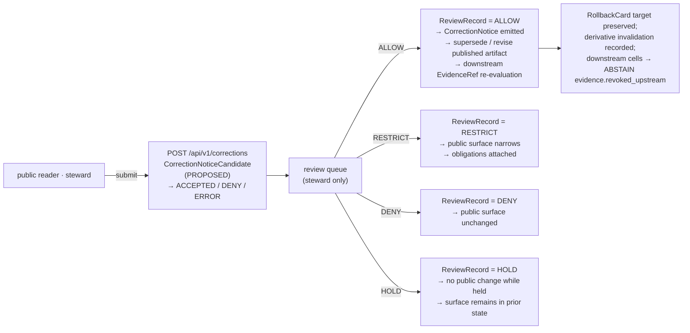

<!-- Sections §11–§17 of docs/domains/agriculture/api-contracts.md — revised tail (v3 draft). -->
<!-- The leading sections (§1–§10) are not in this revision's scope. See Section 2 of the   -->
<!-- accompanying NOTES & CITATIONS block for handoff to whoever revises the head sections.  -->

## 11. Governed AI behavior at the Agriculture surface

> [!IMPORTANT]
> **Outcome-grammar reconciliation.** This section uses the **runtime-outcome vocabulary** (`ANSWER` / `ABSTAIN` / `DENY` / `ERROR`, with optional `NARROWED` / `BOUNDED` per [`ai-build-operating-contract.md`](../../doctrine/ai-build-operating-contract.md) §8 + §21.2) for what the Agriculture Focus Mode surface returns. It does **not** use the **policy-gate vocabulary** (`ALLOW` / `RESTRICT` / `DENY` / `HOLD` / `ERROR`, §4.2) or the **workflow vocabulary** (`ACCEPTED` / `DENY` / `ERROR`, §4.3). Where a row below references a gate or workflow outcome, it is named explicitly. `[CONFIRMED doctrine — operating contract §8, §21.2; Atlas §24.3.1.]`

The Agriculture Focus Mode surface MUST follow KFM's governed-AI rule: AI is interpretive, never root truth. The `EvidenceBundle` outranks generated language; the AI surface returns a finite runtime outcome, attaches an `AIReceipt`, and never substitutes fluent text for evidence, policy, review state, source authority, or release state. `[CONFIRMED doctrine — ENCY §7.7.I; GAI; ai-as-assistant.md.]`

### 11.1 Behavior matrix

| Behavior class | Required surface action | Required artifacts | Citation |
|---|---|---|---|
| **Sufficient evidence + policy allows + released** | Emit `ANSWER` (or `NARROWED` / `BOUNDED` if scope-restricted per §4.1) with evidence drawer + citations. | `EvidenceBundle` resolved · `PolicyDecision = ALLOW` · `ReleaseManifest` applies · `AIReceipt` recorded. | `[CONFIRMED — Atlas §24.3.1; GAI.]` |
| **Evidence insufficient, missing, stale, or unresolved** | Emit `ABSTAIN` with `abstain_reason`. MUST NOT invent or paraphrase out of evidence. | `AIReceipt` with `reason ∈ { evidence_missing, evidence_stale, freshness_window_lapsed, cite_or_abstain_unmet, source_revoked_upstream }`. | `[CONFIRMED — Atlas §24.3.1; trust-membrane.md §8, §10.]` |
| **Sensitive lane, person-parcel join, field-level NASS, or denied source** | Emit `DENY` with `deny_reason`. Sensitive lanes are deny-by-default. | `PolicyDecision = DENY` + reason code · `AIReceipt` records denial · `RedactionReceipt` if a public-safe alternative is offered. | `[CONFIRMED — Atlas §24.9.2; §24.4.7; policy-aware.md.]` |
| **Malformed query, contract violation, missing schema, infrastructure failure** | Emit `ERROR` with diagnostic code. MUST NOT silently fall through to another lane. | Error envelope · no claim leakage · `RunReceipt`. | `[CONFIRMED — Atlas §24.3.1.]` |
| **Scope tighter than requested (county-level when field-level was asked)** | Emit `NARROWED`, name the narrowed scope, attach the same evidence/policy contract as `ANSWER`. | Same as `ANSWER` + `narrowed_to` field on envelope. | `[CONFIRMED — operating contract §21.2; PROPOSED admission to v1 schema, see OQ-AG-API-06.]` |
| **Answer issued with explicit confidence or coverage bounds** | Emit `BOUNDED`, attach the bounds and the basis. | Same as `ANSWER` + `bounds` block. | `[CONFIRMED — operating contract §21.2; PROPOSED admission to v1 schema, see OQ-AG-API-06.]` |
| **AI-authored merges touching this surface** | Every AI-authored patch/merge MUST emit `GENERATED_RECEIPT.json` per [`ai-build-operating-contract.md`](../../doctrine/ai-build-operating-contract.md) §34, pinned `contract_version = "3.0.0"`, with `artifact_paths[]` (including the merged file), `truth_labels[]`, `validation_gates[]` outcomes, and `human_review.state ≠ "pending"` before merge. | `GENERATED_RECEIPT.json` at `schemas/contracts/v1/receipts/generated_receipt.schema.json` (PROPOSED home, see Verification Backlog). | `[CONFIRMED — operating contract §34, §47; Atlas §9.L.]` |

`[CONFIRMED doctrine — ENCY §7.7.I; Atlas §9.L; GAI; ai-build-operating-contract.md §31–§34.]`

> [!WARNING]
> **`AI text treated as evidence` is the highest-severity anti-pattern at any Focus Mode surface.** Disposition: `DENY` at publication, `ABSTAIN` at Focus, `AIReceipt` mandatory. The Focus answer is interpretation, never root truth. `[CONFIRMED — Atlas §24.9.2; GAI; ai-as-assistant.md.]`

> [!CAUTION]
> **Sensitive-domain handling.** Agriculture touches living-person / private-operator / field-level / parcel-join surfaces. Any envelope that would expose those fields MUST route through the §23.2 sensitive-domain matrix in `ai-build-operating-contract.md` before publication. Exact coordinates, exact identifiers, and restricted-source-derived fields MUST NOT appear without steward clearance + `RedactionReceipt`. `[CONFIRMED — operating contract §23; trust-membrane.md §7.]`

[Back to top](#top)

---

## 12. Correction & rollback contract

Agriculture publication MUST be supported by a `ReleaseManifest`, an `EvidenceBundle`, validation + policy support, the required review state, a correction path, a stale-state rule, and a `RollbackCard` target. `[CONFIRMED doctrine — ENCY Appendix E; Atlas §9.M; corrections-are-first-class.md.]`

The correction lane uses **workflow outcomes** (§4.3) at intake and **policy-gate outcomes** (§4.2) at review. **No public publication is emitted by `ACCEPTED` alone.** Publication requires `ALLOW` from review and emission of a `CorrectionNotice`.

### 12.1 Correction flow

### 12.2 Correction-lane outcome grammar

| Lane | Outcome vocabulary | Outcomes | Required artifacts |
|---|---|---|---|
| Correction submit | workflow (§4.3) | `ACCEPTED` · `DENY` · `ERROR` | `CorrectionNoticeCandidate` written; **no** public claim until review allows. |
| Review decision | policy-gate (§4.2) | `ALLOW` · `RESTRICT` · `DENY` · `HOLD` · `ERROR` | `ReviewRecord` + `PolicyDecision`. |
| Rollback (operational; **not** a public route) | — | — | `RollbackCard` execution record · derivative invalidation list · correction lineage. Canonical procedure at `docs/runbooks/agriculture/ROLLBACK_RUNBOOK.md` (PROPOSED); indexed in [`runbooks/README.md`](./runbooks/README.md). |

`[CONFIRMED — Atlas §20.2 Capability Matrix; corrections-are-first-class.md; trust-membrane.md §8.]`

> [!NOTE]
> **Correction propagation is non-trivial for Agriculture.** Agriculture aggregates often feed Frontier Matrix cells. When a published cropland claim is corrected, every matrix cell that consumed it SHOULD downgrade to `ABSTAIN evidence.revoked_upstream` at its next call per [`trust-membrane.md`](../../doctrine/trust-membrane.md) §8. The `CORRECTION_RUNBOOK.md` (PROPOSED) MUST include a derivative-identification step. `[CONFIRMED — Atlas §24.4.7; runbooks/README.md §9.5.]`

[Back to top](#top)

---

## 13. Open questions register

> Each row tracks a question that MUST be resolved (by ADR, repo inspection, or steward decision) before the corresponding claim in this document can advance from `PROPOSED` to `CONFIRMED`. Verification work backing each row lives in [§14](#sec-14-verification-backlog).

| ID | Question | Owner role | Resolution path |
|---|---|---|---|
| **OQ-AG-API-01** | Exact backend framework, route convention, and API stem for `apps/governed-api/`. Whether the boundary is `apps/governed-api/`, `apps/governed_api/`, `packages/api/`, or another adapter. | API owner + Architecture steward | Inspect package manifest, route registry, OpenAPI / GraphQL surface in mounted repo; ADR if boundary deviates from PROPOSED. |
| **OQ-AG-API-02** | Whether the canonical schema home for executable JSON Schema is `schemas/contracts/v1/` or `contracts/` (CONFLICTED in older corpus); ADR-0001 status. | Contract / schema steward | ADR-0001 ratification; schema-registry inspection. |
| **OQ-AG-API-03** | Whether `policy/` (singular) or `policies/` (plural) is the canonical policy home. ADR-0003 proposes `policy/` singular. | Policy steward | Inspect mounted repo; ADR-0003 status. |
| **OQ-AG-API-04** | Is `ui_negative_state` on the runtime envelope **normative** (validated by schema, enforced by CI) or **advisory** (UI hint only)? | Architecture steward + UI steward | ADR; reconcile with operating contract §22.2 wording. |
| **OQ-AG-API-05** | Final names for `AgricultureDecisionEnvelope`, `AgricultureFeatureDTO`, and the agriculture layer manifest profile. | Contract / schema steward | ADR + schema authoring + fixture validation. |
| **OQ-AG-API-06** | When is `NARROWED` / `BOUNDED` admitted on Agriculture surfaces — at v1, v1.1, or only after explicit ADR? Operating contract §21.2 admits them as optional extensions; this doc admits them in §11.1. | Architecture steward | ADR; consistent with operating contract §21.2 optional-extension posture. |
| **OQ-AG-API-07** | Should `aggregation_receipt` be a required (vs optional) field on `AgricultureDecisionEnvelope` for any envelope whose `evidence_refs[]` includes `role = aggregate`? | Contract / schema steward + Policy steward | ADR — touches Atlas §24.13 centrality claim. |
| **OQ-AG-API-08** | Are the **release-tier audience classes** (`public` / `partner` / `steward` / `internal` / `denied`) the same concept as the API audience class in atlas card `KFM-P9-PROG-0069`, or distinct concepts sharing a value space? | Architecture steward | Card reconciliation; ADR if distinct. |
| **OQ-AG-API-09** | NASS / QuickStats / Crop Progress source-activation status under KFM. | Source steward | Mounted-repo source registry; `SourceActivationDecision`. |
| **OQ-AG-API-10** | Kansas Mesonet and HLS / SMAP product terms (rights, redistribution, attribution). | Source steward + Rights-holder representative | Source-terms records in `data/registry/sources/agriculture/`. |
| **OQ-AG-API-11** | Public-release sensitivity rules for farm / operator joins (exact thresholds, generalization steps). | Sensitivity reviewer + Policy steward | `policy/sensitivity/agriculture/` decisions + steward review records. |
| **OQ-AG-API-12** | Exact aggregate-threshold values for county / HUC / grid public release (when does a county-level aggregate become small enough to fail `k-anon`?). | Policy steward + Agriculture domain steward | ADR + `policy/domains/agriculture/` release rules. |
| **OQ-AG-API-13** | Whether Agriculture corrections share the global queue or have a domain-tagged queue. | API owner + Policy steward | Inspect `apps/governed-api/` route map + `policy/review/`. |
| **OQ-AG-API-14** | Final form of `obligations` block (redactions / generalizations vocabulary) for Agriculture envelopes. | Contract / schema steward | ADR + `EvidenceBundle` schema confirmation. |
| **OQ-AG-API-15** | Should the `RuntimeResponseEnvelope` `contract_version` field be a **`const`** (`"3.0.0"` only) or a **`pattern`** (admits v3.x minor evolution without schema break)? | Architecture steward | ADR — touches operating contract §37.1 lifecycle. |
| **OQ-AG-API-16** | Are revocation events propagated push-style (proactive cell re-evaluation) or pull-style (cells re-evaluate on next call)? Affects the revocation-propagation validator. | Architecture steward | Reconcile with `trust-membrane.md` §8. |

[Back to top](#top)

---

## 14. Open verification backlog

Items below are verification work this document cannot complete without a mounted repository. Each item MUST be tracked in `docs/registers/VERIFICATION_BACKLOG.md` (PROPOSED home) until closed.

<strong>Verification items (16 rows) — click to expand</strong>

| # | Item | What to check | Owner | Settles which OQ / claim |
|---:|---|---|---|---|
| 1 | Mounted-repo presence of `apps/governed-api/` | Directory exists; inspect package manifest, route registry, OpenAPI / GraphQL surface. | API owner | OQ-AG-API-01 |
| 2 | Mounted-repo presence of `schemas/contracts/v1/` | Confirm the schema-home convention; resolve CONFLICTED references. | Contract / schema steward | OQ-AG-API-02 |
| 3 | Mounted-repo presence of `policy/` (singular) | Confirm singular `policy/` vs plural `policies/`. | Policy steward | OQ-AG-API-03 |
| 4 | Mounted-repo presence of `docs/domains/agriculture/` | Confirm placement; confirm sibling `policy/`, `runbooks/`, `sublanes/` aspect READMEs. | Docs steward | Sibling integration |
| 5 | `SourceDescriptor` instances for ag sources | Confirm `data/registry/sources/agriculture/` directory and admitted-source coverage (CDL, NASS, SSURGO, NLCD, LANDFIRE, GAP, PLANTS, vegetation index, FSA CLU). | Source steward | OQ-AG-API-09; OQ-AG-API-10 |
| 6 | `AggregationReceipt` schema home | Confirm whether the schema lives at `schemas/contracts/v1/receipts/aggregation_receipt.schema.json` or elsewhere; depends on ADR-S-03. | Contract / schema steward | §5 schema home; OQ-AG-API-07 |
| 7 | `GENERATED_RECEIPT` schema home | Confirm `schemas/contracts/v1/receipts/generated_receipt.schema.json` exists per operating contract §47. | Contract / schema steward | §5; §11.1 last row |
| 8 | `apps/explorer-web/` reader path | Confirm Explorer Web reads via `apps/governed-api/`, not directly from canonical stores. | API owner + UI owner | §2.4 trust-membrane placement |
| 9 | `policy/sensitivity/agriculture/` artifacts | Confirm per-sublane sensitivity rule presence (`public_safe_aggregate/`, `private_operator/`, `field_level_aggregate_derived/`, `person_parcel_join/`). | Policy steward + Sensitivity reviewer | §7 sensitivity lanes |
| 10 | `policy/release/agriculture/` artifacts | Confirm per-tier release rules (`public/`, `partner/`, `steward/`, `internal/`, `denied/`). | Policy steward | §3 audience-class column |
| 11 | OPA / Conftest / Cosign pins | Confirm tooling versions are pinned. | Policy steward + Build owner | Validator infrastructure |
| 12 | CODEOWNERS for `docs/domains/agriculture/` | Confirm reviewer coverage. | Docs steward | Owner roster |
| 13 | CI workflow names | Confirm or assign the validator job names listed in §10. | Build owner | §10 validators |
| 14 | ADR backlog rows | Confirm ADR-0001 (schema home), ADR-0003 (`policy/` singular), ADR-S-03 (`AggregationReceipt` home), ADR-S-04 (source-role enum), ADR-S-05 (sensitivity tier) status. | Architecture steward | Doctrine ratification across OQs |
| 15 | `contract_version` pin propagation | Confirm `RuntimeResponseEnvelope` instances actually carry `"contract_version": "3.0.0"`. | Build owner + Contract steward | OQ-AG-API-15 |
| 16 | Revocation propagation test | Confirm whether push-style or pull-style propagation is wired between Agriculture publications and downstream consumers. | Architecture steward | OQ-AG-API-16 |

`[All items open; resolution path varies per row. See operating contract §28 ADR template; UIAI §27.]`

[Back to top](#top)

---

## 15. Changelog

> Per operating contract [§37](../../doctrine/ai-build-operating-contract.md#37-contract-lifecycle-and-versioning): `MINOR` rows clarify or extend without breaking; `MAJOR` rows change operating law and require receipt re-issuance.

### 15.1 v2 → v3 (current revision)

| § | Change | Type (§37) | Reason |
|---|---|---|---|
| Meta block | Updated `contract_version` pin to `"3.0.0"` and refreshed `updated:` field. | clarification | Track operating-contract v3.0 explicitly. |
| §11 | Added IMPORTANT callout reconciling **runtime vs policy-gate vs workflow** outcome vocabularies. Added explicit RFC 2119 MUST/SHOULD language on AI behavior. Added `GENERATED_RECEIPT.json` row to behavior matrix with operating contract §34 cross-reference. Added freshness-window / revoked-upstream `ABSTAIN` reasons. Added CAUTION callout for sensitive-domain handling per §23.2. | clarification + new | Operating contract §8 + §21.2 + §23 + §34 conformance. |
| §12 | Split correction-lane outcomes into §12.1 flow diagram and §12.2 grammar table, with explicit "workflow vs policy-gate vs operational" labels. Added `RollbackCard` cross-reference and runbook PROPOSED home. | clarification | Make outcome-grammar boundaries unambiguous; align with corrections-are-first-class.md. |
| §13 | Added explanatory header tying each OQ row to §14 backlog. Rewrote OQ-AG-API-06 to credit operating contract §21.2 admission of `NARROWED` / `BOUNDED`. | clarification | Reduce ambiguity about which questions block promotion. |
| §14 | Restructured backlog as a sortable numbered table inside a `
` collapsible. Added rows for `contract_version` pin propagation (#15) and revocation propagation (#16). | new | Operating contract §37 + trust-membrane.md §8 coverage. |
| §15 | Added v2 → v3 changelog row above the v1 → v2 row. Kept the v1 → v2 row as **lineage**. | new | §37 cumulative-changelog discipline. |
| §16 | Added explicit `contract_version = "3.0.0"` check to Definition of Done. Added "GENERATED_RECEIPT planned and wired into CI" row. | new | §34 + §47 conformance. |
| §17 | Updated related-docs paths to reflect operating-contract v3.0 names; preserved all v2 anchor targets. | housekeeping | Anchor stability. |
| Footer | Bumped version to `v3 (draft)`; updated last-reviewed; restated contract pin. | housekeeping | Routine v2→v3 hygiene. |

> **Backward compatibility (v2 → v3).** All v2 anchors (`#sec-11-…` through `#sec-17-…`) are preserved. The numeric OQ-AG-API-NN ids are unchanged. No DTO field is renamed in this revision. `NARROWED` / `BOUNDED` remain optional-extension outcomes pending OQ-AG-API-06 resolution.

### 15.2 v1 → v2 (lineage)

<strong>Prior changelog rows (preserved as lineage) — click to expand</strong>

| § | Change | Rationale |
|---|---|---|
| Meta block | Added `subtype: domain-api-contracts`; added `contract_version: "3.0.0"`; refreshed `owners` to operating-contract reviewer pattern; expanded `related[]` to include sibling agriculture domain-aspect READMEs; expanded `tags[]`. | v3.0 operating contract requires `contract_version` pin; sibling READMEs created this session need cross-reference. |
| Title / badge row | Added Version, Contract, Conformance, Posture, Aggregation, Sensitivity badges. | Reflects contract pinning, fail-closed posture, aggregation centrality. |
| IMPORTANT callout | Added top-of-doc IMPORTANT callout explaining outcome-grammar reconciliation across layers. | v1 ran together AI-runtime / policy-gate / workflow outcomes; v2 separates them per operating contract §21.2 + Atlas §24.3.1. |
| §1–§10 | Full restructure for outcome-grammar separation, audience-class enforcement, `AggregationReceipt` centrality, source-role anti-collapse, sensitivity lane expansion, validator reorganization. | Atlas §24.13 + §24.9.3 + §24.4.7 conformance. |
| §11 | Added `AI-authored merges` row requiring `GENERATED_RECEIPT.json` per `ai-build-operating-contract.md` §34. | Operating contract §34 makes `GENERATED_RECEIPT` mandatory for AI-authored merges. |
| §12 | Diagram updated with downstream `EvidenceRef` re-evaluation arrow; NOTE callout added explaining correction propagation to Frontier Matrix cells. | Correction-propagation cascade per trust-membrane.md §8 and runbooks/README.md §9.5. |
| §13 → §17 | Renumbered with companion sections (Open Qs, Verification, Changelog, DoD) added. | AI-builder Markdown-authoring contract; OQ IDs make individual questions citable across the corpus. |

[Back to top](#top)

---

## 16. Definition of done

> A repository implementation of this document conforms when **all** the items below hold. Items map to validators in §10 and to the verification backlog in §14.

### 16.1 Document conformance

- [ ] `docs/domains/agriculture/api-contracts.md` exists with KFM Meta Block v2 and `contract_version: "3.0.0"` pinned.
- [ ] All sibling agriculture aspect READMEs ([`policy/`](./policy/README.md), [`runbooks/`](./runbooks/README.md), [`sublanes/`](./sublanes/README.md)) exist and cross-reference this document.
- [ ] [`sublanes/cropland.md`](./sublanes/cropland.md) exists as the worked topical-sublane profile.

### 16.2 Schema and contract conformance

- [ ] `apps/governed-api/` (or its accepted-ADR equivalent) exists and enforces audience-class boundaries.
- [ ] `AgricultureDecisionEnvelope`, `AgricultureFeatureDTO`, and the agriculture `LayerManifest` profile are authored under `schemas/contracts/v1/domains/agriculture/`.
- [ ] Each schema includes `contract_version: { "const": "3.0.0" }` (subject to OQ-AG-API-15).
- [ ] Each schema admits the canonical four runtime outcomes (`ANSWER` / `ABSTAIN` / `DENY` / `ERROR`) and, where admitted by ADR per OQ-AG-API-06, the optional `NARROWED` / `BOUNDED` extensions.
- [ ] `AggregationReceipt` schema is present at its agreed home (pending ADR-S-03) and is referenced by every aggregate-bearing envelope.
- [ ] `GENERATED_RECEIPT` schema is present at `schemas/contracts/v1/receipts/generated_receipt.schema.json`.

### 16.3 Policy and audience-class enforcement

- [ ] Audience-class enforcement is wired (`internal` / `denied` never appears in `public` / `partner` envelopes).
- [ ] Source-role anti-collapse is enforced (CDL = `modeled`, NASS = `aggregate`, etc., per [Atlas §24.1](../../../atlases/) source-role register).
- [ ] Person-parcel-join `DENY` default is enforced.
- [ ] Field-level NASS `DENY` is enforced.
- [ ] Public-facing aggregate envelopes carry `aggregation_receipt`.

### 16.4 Lifecycle and trust-membrane

- [ ] `RAW` / `WORK` / `QUARANTINE` / candidate / direct-model paths never appear in public envelopes.
- [ ] Correction-propagation cascade emits `CorrectionNotice` and triggers downstream `EvidenceRef` re-evaluation.
- [ ] `RollbackCard` target preserved for every published Agriculture release; rehearsal recorded.

### 16.5 AI authoring discipline

- [ ] Every AI-authored merge touching this surface emits a `GENERATED_RECEIPT.json` with `contract_version = "3.0.0"`, populated `truth_labels[]`, `validation_gates[]`, and `human_review.state ∈ { approved, override_record_attached }`.
- [ ] Every validator in §10 ships with both valid and invalid fixtures; invalid fixtures fail for the expected reason.

### 16.6 Governance hygiene

- [ ] Drift between this document and live state is logged in `docs/registers/DRIFT_REGISTER.md`.
- [ ] All open questions in §13 are either resolved or assigned to ADRs with active owners.
- [ ] All verification items in §14 are tracked in `docs/registers/VERIFICATION_BACKLOG.md`.

[Back to top](#top)

---

## 17. Related docs

> Links use repo-relative paths. Targets marked `(PROPOSED)` are not yet asserted to exist; `TODO` entries are placeholders for sibling docs to be authored.

### 17.1 Operating doctrine

- [`docs/doctrine/ai-build-operating-contract.md`](../../doctrine/ai-build-operating-contract.md) — canonical operating contract; **`CONTRACT_VERSION = "3.0.0"`**. `[CONFIRMED sibling.]`
- [`docs/doctrine/directory-rules.md`](../../doctrine/directory-rules.md) — placement protocol. `[CONFIRMED sibling.]`

### 17.2 Trust-boundary doctrine

- [`docs/doctrine/trust-membrane.md`](../../doctrine/trust-membrane.md) — the trust contract every envelope warrants. `[CONFIRMED sibling.]`
- [`docs/doctrine/policy-aware.md`](../../doctrine/policy-aware.md) — finite policy outcomes. `[CONFIRMED sibling.]`
- [`docs/doctrine/lifecycle-law.md`](../../doctrine/lifecycle-law.md) — `RAW → WORK / QUARANTINE → PROCESSED → CATALOG / TRIPLET → PUBLISHED`. `[CONFIRMED sibling.]`
- [`docs/doctrine/evidence-first.md`](../../doctrine/evidence-first.md) — cite-or-abstain. `[CONFIRMED sibling.]`
- [`docs/doctrine/ai-as-assistant.md`](../../doctrine/ai-as-assistant.md) — AI behavior at the runtime surface. `[CONFIRMED sibling.]`
- [`docs/doctrine/corrections-are-first-class.md`](../../doctrine/corrections-are-first-class.md) — `CorrectionNotice` workflow. `[CONFIRMED sibling.]`

### 17.3 Agriculture domain orientation

- [`docs/domains/agriculture/README.md`](./README.md) — agriculture domain landing page. `[PROPOSED.]`
- [`docs/domains/agriculture/policy/README.md`](./policy/README.md) — agriculture policy aspect index. `[PROPOSED sibling.]`
- [`docs/domains/agriculture/runbooks/README.md`](./runbooks/README.md) — agriculture runbooks aspect index. `[PROPOSED sibling.]`
- [`docs/domains/agriculture/sublanes/README.md`](./sublanes/README.md) — agriculture sublane decomposition (5 axes). `[PROPOSED sibling.]`
- [`docs/domains/agriculture/sublanes/cropland.md`](./sublanes/cropland.md) — worked topical-sublane profile. `[PROPOSED sibling.]`
- `docs/domains/agriculture/SOURCES.md` — Agriculture source registry summary. `[TODO.]`
- `docs/domains/agriculture/SENSITIVITY.md` — Agriculture sensitivity / deny-by-default lanes detail. `[TODO.]`

### 17.4 Architecture and runtime

- `docs/architecture/governed-ai/FOCUS_FLOW.md` — cross-cutting Focus Mode flow. `[PROPOSED.]`
- `docs/architecture/ui/EVIDENCE_DRAWER.md` — Evidence Drawer payload contract. `[PROPOSED.]`
- `docs/standards/PROV.md` — W3C PROV-O / PAV provenance crosswalk (or `PROVENANCE.md` pending Directory Rules OPEN-DR-01). `[NEEDS VERIFICATION.]`

### 17.5 ADR backlog (relevant to this doc)

- `docs/adr/ADR-0001-schema-home.md` — schema-home authority (`schemas/contracts/v1/`). `[NEEDS VERIFICATION.]`
- `docs/adr/ADR-0003-policy-singular.md` — `policy/` singular as canonical. `[PROPOSED — see OQ-AG-API-03.]`
- `docs/adr/ADR-S-03-aggregation-receipt-home.md` — `AggregationReceipt` schema home. `[PROPOSED per Atlas §24.12.]`
- `docs/adr/ADR-S-04-source-role-enum.md` — source-role enum evolution. `[PROPOSED per Atlas §24.12.]`
- `docs/adr/ADR-S-05-sensitivity-tier.md` — sensitivity tier scheme. `[PROPOSED per Atlas §24.12.]`

### 17.6 Cross-cutting

- `contracts/OBJECT_MAP.md` — cross-cutting object-family crosswalk. `[PROPOSED.]`

[Back to top](#top)

---

**Last reviewed:** 2026-05-26 · **Owners:** *TODO — Docs steward + Agriculture domain steward + API owner + Contract/schema steward + Policy steward* · **Version:** v3 (draft) · **Status:** `draft` · `PROPOSED` routes / `NEEDS VERIFICATION` paths · **Pinned to:** `CONTRACT_VERSION = "3.0.0"` · [Back to top](#top)
