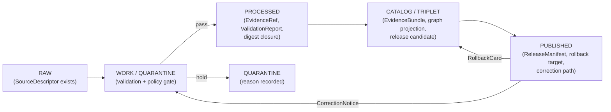
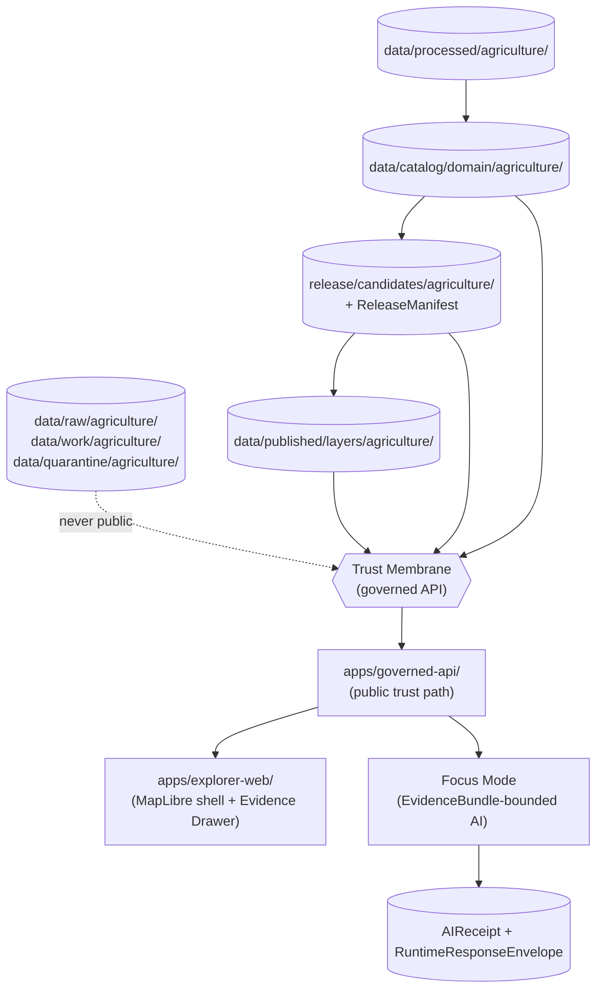
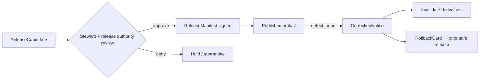

<!-- [KFM_META_BLOCK_V2]
doc_id: kfm://doc/docs-domains-agriculture-architecture
title: Agriculture Domain — Architecture
type: standard
version: v0.1
status: draft
owners: <TODO: agriculture-domain stewards>
created: 2026-05-15
updated: 2026-05-15
policy_label: public
related: [docs/domains/agriculture/README.md, docs/domains/soil/ARCHITECTURE.md, docs/domains/hydrology/ARCHITECTURE.md, docs/doctrine/directory-rules.md, docs/architecture/governed-api.md]
tags: [kfm, domain, agriculture, architecture]
notes: [Implementation-layer paths are PROPOSED; no mounted repository inspected in this session.]
[/KFM_META_BLOCK_V2] -->

# 🌾 Agriculture Domain — Architecture

> Governed, evidence-first lane for Kansas agriculture: crops, fields, soils, irrigation, yields, conservation practices, stress indicators, and agricultural economy — delivered as **public-safe aggregates** through the trust membrane.


**Status:** draft · **Owners:** `<TODO: agriculture-domain stewards>` · **Last reviewed:** 2026-05-15

---

## 🧭 Quick jump

- [1 · Scope, boundary, and non-ownership](#1--scope-boundary-and-non-ownership)
- [2 · Lane layout in the repository](#2--lane-layout-in-the-repository)
- [3 · Ubiquitous language](#3--ubiquitous-language)
- [4 · Source families and roles](#4--source-families-and-roles)
- [5 · Object families](#5--object-families)
- [6 · Pipeline shape — RAW → PUBLISHED](#6--pipeline-shape--raw--published)
- [7 · Trust membrane and governed surfaces](#7--trust-membrane-and-governed-surfaces)
- [8 · Cross-lane relations](#8--cross-lane-relations)
- [9 · Sensitivity, rights, and publication posture](#9--sensitivity-rights-and-publication-posture)
- [10 · Validators, policy gates, tests, fixtures](#10--validators-policy-gates-tests-fixtures)
- [11 · Governed AI behavior](#11--governed-ai-behavior)
- [12 · Publication, correction, and rollback](#12--publication-correction-and-rollback)
- [13 · Open ADRs and verification backlog](#13--open-adrs-and-verification-backlog)
- [Related docs · Footer](#related-docs)

> [!IMPORTANT]
> **Implementation maturity.** All repository-shaped statements in this document — paths, schema files, validators, routes, tests, CI workflows, fixtures — are **PROPOSED** unless explicitly labeled otherwise. No mounted repository was inspected in this session. Architectural doctrine (lifecycle, trust membrane, source-role anti-collapse) is CONFIRMED; lane application of that doctrine to Agriculture is CONFIRMED-as-design / PROPOSED-as-implementation.

---

## 1 · Scope, boundary, and non-ownership

**CONFIRMED dossier / PROPOSED implementation.** The Agriculture lane governs agricultural aggregate observations, soil/moisture/vegetation context, crop progress, suitability, stress indicators, irrigation links, conservation practice context, agricultural economy observations, and public-safe products derived from them.

### 1.1 What this lane owns

The Agriculture lane owns the object families enumerated in §5: `CropObservation`, `FieldCandidate`, `CropRotation`, `YieldObservation`, `IrrigationLink`, `ConservationPractice`, `SoilCropSuitability`, `AgriculturalEconomyObservation`, `SupplyChainNode`, `DroughtStressIndicator`, `PestStressIndicator`, and `AggregationReceipt`.

### 1.2 What this lane does **not** own

| Concern | Owning lane | Reason |
|---|---|---|
| Canonical soil map-unit and horizon semantics | **Soil** | SSURGO/gSSURGO map-unit truth lives in Soil; Agriculture *references* it. |
| Water observations, flow, flood context, NHDPlus reach identity | **Hydrology** | Irrigation context and drought references resolve **into** Hydrology evidence, not within Agriculture. |
| Ownership, title, parcels, living-person privacy | **People / DNA / Land** | Farm-operator and parcel-sensitive joins remain restricted; Agriculture must not become a back-door to private land records. |
| Air quality, smoke, weather-station observations | **Atmosphere / Air** | Weather and heat context are referenced via Atmosphere. |

> [!NOTE]
> **Source-role anti-collapse (CONFIRMED, cross-domain).** Aggregate statistics (e.g., NASS county yields) are not field/operator truth. Satellite vegetation-index anomalies are *candidates* until reviewed. Remote-sensing grids are not private ground truth. These are domain-cutting invariants enforced by validators and policy gates, not stylistic preferences.

[⬆ Back to top](#-quick-jump)

---

## 2 · Lane layout in the repository

**PROPOSED layout.** Agriculture follows the Directory Rules §12 Domain Placement Law: a domain MUST NOT become a root folder. The lane appears as a **segment** inside each owning responsibility root.

> [!CAUTION]
> The tree below is the **lane pattern** prescribed by Directory Rules §12, applied to `agriculture` by substitution. It is **not** a claim that these paths currently exist in a mounted repository. Treat every path as **PROPOSED / NEEDS VERIFICATION**.

```text
docs/domains/agriculture/                       # this doc lives here
contracts/domains/agriculture/                  # object meaning (Markdown)
schemas/contracts/v1/domains/agriculture/       # machine shape (JSON Schema) — canonical per ADR-0001
policy/domains/agriculture/                     # allow/deny/restrict/abstain rules (Rego)
tests/domains/agriculture/                      # enforcement proofs
fixtures/domains/agriculture/                   # golden / valid / invalid / synthetic samples
packages/domains/agriculture/                   # shared lane libraries (if any)
pipelines/domains/agriculture/                  # executable pipeline logic
pipeline_specs/agriculture/                     # declarative pipeline configuration
data/raw/agriculture/                           # admitted source material
data/work/agriculture/                          # transformation / candidate space
data/quarantine/agriculture/                    # holding state on rights/sensitivity/validation defects
data/processed/agriculture/                     # normalized outputs
data/catalog/domain/agriculture/                # catalog/triplet records
data/published/layers/agriculture/              # released public-safe artifacts
data/registry/sources/agriculture/              # source descriptors for this lane
release/candidates/agriculture/                 # release decisions / manifests / rollback
```

**Placement basis (Directory Rules):**

- **§3 — Deeper rule.** Agriculture is a domain name; it cannot be a root folder. It appears as a segment under responsibility roots.
- **§4 — Placement protocol.** Each file picks exactly one primary responsibility, then the domain segment.
- **§12 — Domain Placement Law.** This pattern applies uniformly to all named KFM domains, including agriculture.
- **§13.1 — Schema-home rule (ADR-0001).** `schemas/contracts/v1/...` is canonical for machine shape. `contracts/` retains semantic Markdown only.

**Cross-domain files** (e.g., a soil × agriculture × hydrology validator) live at the **lowest common responsibility root** without an Agriculture segment — for example, `tools/validators/soil-suitability/...`, not `tools/validators/domains/agriculture/...`.

[⬆ Back to top](#-quick-jump)

---

## 3 · Ubiquitous language

**CONFIRMED terms / PROPOSED field realization.** Each term is used inside this lane with meaning constrained by source role, evidence, time, and release state. KFM terminology is preserved exactly as supplied; do not paraphrase into generic industry language.

| Term | Concise meaning in the Agriculture lane | Citation |
|---|---|---|
| **Crop Observation** | An observed or aggregated crop signal, scoped by source role, evidence, time, and release state. | DOM-AG; ENCY |
| **Field Candidate** | A candidate field representation (not a sovereign parcel) pending steward review or aggregation. | DOM-AG; ENCY |
| **Crop Rotation** | A multi-period rotation pattern inferred from observation evidence, not from operator records. | DOM-AG; ENCY |
| **Yield Observation** | An aggregate yield observation; never a per-farm/per-operator yield without rights review. | DOM-AG; ENCY |
| **Irrigation Link** | A typed relation between Agriculture and Hydrology, source-role-preserving. | DOM-AG; ENCY |
| **Conservation Practice** | NRCS-derived practice context; rights/sensitivity scoped. | DOM-AG; ENCY |
| **Soil Crop Suitability** | A derived suitability rating; downstream of Soil's canonical map-unit truth. | DOM-AG; ENCY |
| **Agricultural Economy Observation** | Economy/market context where source rights permit; aggregate by default. | DOM-AG; ENCY |
| **SupplyChainNode** | A node in an agricultural supply context; public-safe scoping only. | DOM-AG; ENCY |
| **Drought Stress Indicator** | A derived indicator; never equated to private ground truth. | DOM-AG; ENCY |
| **Pest Stress Indicator** | A derived indicator; same constraints as Drought Stress. | DOM-AG; ENCY |
| **Aggregation Receipt** | Auditable record of geometry-scope and aggregation method used to produce a public-safe product. | DOM-AG; ENCY |
| **VWC** | Volumetric water content (soil-moisture context); unit and depth must be carried. | DOM-AG; ENCY |
| **Spec hash** | Canonical, key-sorted SHA-256 of a record's normalized form; supports deterministic identity and reproducible aggregation. | DOM-AG; ENCY |

[⬆ Back to top](#-quick-jump)

---

## 4 · Source families and roles

**PROPOSED activation status / NEEDS VERIFICATION for rights and current terms.** No source is *activated* in KFM until a `SourceDescriptor` exists, rights and source role are reviewed, and a `SourceActivationDecision` is issued. Connectors and watchers remain inactive until that decision plus fixtures, validators, and policy gates exist.

| Source family | Default source role | Rights / sensitivity | Freshness signal | Status |
|---|---|---|---|---|
| **USDA NASS CDL** (Cropland Data Layer) | observation / aggregate | Rights NEEDS VERIFICATION; sensitive joins fail closed | Annual raster | PROPOSED |
| **USDA NASS QuickStats / Crop Progress** | aggregate / authority for published statistics | Rights NEEDS VERIFICATION; aggregate scope must not be cited per-place | Weekly / annual cadence | PROPOSED |
| **NRCS SSURGO / Soil Data Access (SDA)** | authority (via Soil lane) / context | Rights NEEDS VERIFICATION | Survey-vintage specific | PROPOSED |
| **gSSURGO** | observation / context (gridded SSURGO) | Rights NEEDS VERIFICATION | Survey-vintage specific | PROPOSED |
| **NRCS SCAN** | observation (soil-moisture / met) | Rights NEEDS VERIFICATION | Hourly | PROPOSED |
| **NOAA USCRN** | observation (climate reference) | Rights NEEDS VERIFICATION | Hourly | PROPOSED |
| **Kansas Mesonet** | observation (soil moisture, weather) | Some networks require written consent / specific attribution; NEEDS VERIFICATION | Sub-hourly | PROPOSED |
| **NASA SMAP** | model / observation (soil moisture, grid) | Rights NEEDS VERIFICATION | Daily / periodic | PROPOSED |
| **NASA HLS / HLS-VI** | observation (harmonized Landsat/Sentinel; vegetation indices) | Rights NEEDS VERIFICATION | Per-scene | PROPOSED |
| **NRCS conservation practice data** | context (with rights review) | Rights NEEDS VERIFICATION; operator-sensitive joins fail closed | Program-specific | PROPOSED |

> [!WARNING]
> **A community-science source is not a legal-status authority. A regulatory layer is not an observed event. A remote-sensing anomaly is a candidate, not a finding.** Source role is set at admission and never edited in place; corrections produce a new descriptor and a `CorrectionNotice`. Promotion never "upgrades" a source role.

[⬆ Back to top](#-quick-jump)

---

## 5 · Object families

**CONFIRMED object-family spine / PROPOSED implementation.** Each object carries the standard temporal envelope (source / observed / valid / retrieval / release / correction times stay distinct where material) and a PROPOSED deterministic identity rule: `source_id + object_role + temporal_scope + normalized_digest`.

| Object family | Purpose (lane-scoped) | Identity rule | Temporal handling |
|---|---|---|---|
| `CropObservation` | Observed/aggregated crop signal within Agriculture. | PROPOSED: deterministic basis above. | CONFIRMED: distinct time fields. |
| `FieldCandidate` | Candidate field representation; never equated with a private parcel without rights review. | PROPOSED: deterministic basis above. | CONFIRMED: distinct time fields. |
| `CropRotation` | Multi-period rotation pattern. | PROPOSED: deterministic basis above. | CONFIRMED: distinct time fields. |
| `YieldObservation` | Aggregate yield observation. | PROPOSED: deterministic basis above. | CONFIRMED: distinct time fields. |
| `IrrigationLink` | Typed relation Agriculture ↔ Hydrology. | PROPOSED: deterministic basis above. | CONFIRMED: distinct time fields. |
| `ConservationPractice` | Context for NRCS-derived practice records. | PROPOSED: deterministic basis above. | CONFIRMED: distinct time fields. |
| `SoilCropSuitability` | Derived suitability; downstream of Soil. | PROPOSED: deterministic basis above. | CONFIRMED: distinct time fields. |
| `AgriculturalEconomyObservation` | Economy/market observation in public-safe form. | PROPOSED: deterministic basis above. | CONFIRMED: distinct time fields. |
| `SupplyChainNode` | Supply-chain node in public-safe scope. | PROPOSED: deterministic basis above. | CONFIRMED: distinct time fields. |
| `DroughtStressIndicator` | Derived indicator. | PROPOSED: deterministic basis above. | CONFIRMED: distinct time fields. |
| `PestStressIndicator` | Derived indicator. | PROPOSED: deterministic basis above. | CONFIRMED: distinct time fields. |
| `AggregationReceipt` | Auditable record of aggregation method, geometry scope, and weights used to produce a public-safe product. | PROPOSED: deterministic basis above. | CONFIRMED: distinct time fields. |

<details>
<summary><strong>Aggregate cell semantics (why this matters)</strong></summary>

A core cross-domain anti-pattern is "aggregate cited as a per-place truth." When a county-level NASS yield is rendered, the rendered cell represents *the county for the period*, not any single field within it. The `AggregationReceipt` records:

- the geometry-scope token (`county`, `HUC`, `grid_cell`, `tract`, …)
- the aggregation method (sum, mean, area-weighted, deterministic seeded jitter, …)
- the contributing source set
- a `weights_checksum` for reproducibility (CONFIRMED pattern from ML-061-046)
- the `spec_hash` of the canonical normalized form

Policy and validators MUST prevent a join from an aggregate cell to a single record and MUST ABSTAIN at the AI layer when asked for a per-place answer that only an aggregate supports.

</details>

[⬆ Back to top](#-quick-jump)

---

## 6 · Pipeline shape — RAW → PUBLISHED

**CONFIRMED doctrine / PROPOSED lane application.** Agriculture follows the canonical KFM lifecycle: `RAW → WORK / QUARANTINE → PROCESSED → CATALOG / TRIPLET → PUBLISHED`. Promotion is a **governed state transition**, never a file move.



### 6.1 Stage gates

| Stage | Handling | Gate | Status |
|---|---|---|---|
| **RAW** | Capture immutable source payload or reference with source role, rights, sensitivity, citation, time, and hash. | `SourceDescriptor` exists. | PROPOSED |
| **WORK / QUARANTINE** | Normalize schema, geometry, time, identity, evidence, rights, policy. Hold failures. | Validation + policy gate pass, **or** quarantine reason recorded. | PROPOSED |
| **PROCESSED** | Emit validated normalized objects, receipts, public-safe candidates. | `EvidenceRef`, `ValidationReport`, digest closure exist. | PROPOSED |
| **CATALOG / TRIPLET** | Emit catalog records, `EvidenceBundle`s, graph/triplet projections, release candidates. | Catalog/proof closure passes. | PROPOSED |
| **PUBLISHED** | Serve released public-safe artifacts through governed APIs and manifests. | `ReleaseManifest`, correction path, rollback target, review/policy state exist. | PROPOSED |

> [!TIP]
> **First credible thin slice (PROPOSED).** A county-level crop-year panel using CDL + QuickStats plus SSURGO suitability and a Kansas Mesonet weather fixture — with field-level detail denied by default. This is the recommended initial proof slice for the Agriculture lane.

[⬆ Back to top](#-quick-jump)

---

## 7 · Trust membrane and governed surfaces

**CONFIRMED doctrine.** Public clients and the map shell never read RAW, WORK, QUARANTINE, unpublished candidates, or canonical/internal stores. They consume **released artifacts** and **governed APIs**, which return `RuntimeResponseEnvelope` with finite outcomes: `ANSWER`, `ABSTAIN`, `DENY`, `ERROR`.



### 7.1 Proposed surfaces

| Surface | DTO / schema | Finite outcomes | Status |
|---|---|---|---|
| Agriculture feature/detail resolver (route TBD) | `AgricultureDecisionEnvelope` | `ANSWER` / `ABSTAIN` / `DENY` / `ERROR` | PROPOSED — route UNKNOWN |
| Agriculture layer manifest resolver | `LayerManifest` / domain layer descriptor | `ANSWER` / `DENY` / `ERROR` | PROPOSED — public-safe release only |
| Agriculture Evidence Drawer payload | `EvidenceDrawerPayload` + `EvidenceBundle` projection | `ANSWER` / `ABSTAIN` / `DENY` / `ERROR` | PROPOSED — evidence and policy filtered |
| Agriculture Focus Mode answer | `RuntimeResponseEnvelope` + `AIReceipt` | `ANSWER` / `ABSTAIN` / `DENY` / `ERROR` | PROPOSED — AI never root truth |
| Schema responsibility root | `schemas/contracts/v1/...` | finite validator outcomes | PROPOSED — per Directory Rules + ADR-0001 |

### 7.2 Map and viewing products (PROPOSED)

- Public-safe crop progress maps; aggregate crop-condition view
- Soil-crop suitability map (resolves to Soil canonical truth)
- Station soil-moisture series; satellite/grid moisture context
- Vegetation-index context; drought/pest stress indicators
- Cross-cutting CONFIRMED-doctrine surfaces: Evidence Drawer, time-aware state, trust badges, sensitivity-redacted view, correction/stale-state view, governed Focus Mode

> [!WARNING]
> **No sensitive geometry hidden only by style.** If a layer carries operator- or parcel-sensitive geometry, it must be **generalized, redacted, restricted-tier, or denied** before public tile generation. Style-only hiding is geoprivacy theater and is forbidden by the trust membrane.

[⬆ Back to top](#-quick-jump)

---

## 8 · Cross-lane relations

**CONFIRMED / PROPOSED.** Every cross-lane relation must preserve ownership, source role, sensitivity, and `EvidenceBundle` support.

| Agriculture relates to | Relation type | Constraint |
|---|---|---|
| **Soil** | MUKEY joins and suitability support | Soil owns canonical map-unit truth; Agriculture references it. |
| **Hydrology** | Irrigation, drought, water-use context | Water observations belong to Hydrology; Agriculture references via `IrrigationLink`. |
| **Atmosphere / Air** | Weather, heat, smoke, vegetation stress | Atmosphere owns station observations; Agriculture references for stress context. |
| **People / Land** | Farm/operator and parcel-sensitive contexts | Remain **restricted**; aggregate-only public exposure; deny by default. |

[⬆ Back to top](#-quick-jump)

---

## 9 · Sensitivity, rights, and publication posture

**CONFIRMED / PROPOSED.** Aggregate statistics and satellite products **must not** become field/operator truth. Farm/operator private data, proprietary yield, pesticide records, and private-sensitive joins **fail closed**.

**CONFIRMED doctrine.** Unclear rights, unresolved source role, missing evidence, unresolved sensitivity, or absent release state **blocks public promotion**.

### 9.1 Default tier posture for Agriculture (PROPOSED, illustrative)

| Class | Default tier | Allowed transforms (PROPOSED) | Required gates |
|---|---|---|---|
| Public crop progress aggregate (county / HUC) | T1 / public-safe | County / HUC / grid aggregation; `AggregationReceipt` carried. | Aggregation gate; geometry-scope guard. |
| Field-level NASS or operator claim | T4 (fail closed) | No transform releases this as a public per-field claim. | Policy DENY; route to QUARANTINE. |
| Proprietary yield, pesticide records | T4 (fail closed) | No public transform without explicit rights + steward review. | Rights + policy + review. |
| Vegetation-index anomaly raster (grid) | T1 candidate / T2 review | Public-safe gridded product; never equated to per-field truth. | Source-role gate; aggregation receipt. |
| Farm-operator × parcel joins | T4 (fail closed) | Aggregate-only public expression; identity preserved internally. | Policy DENY for public surface; review for restricted use. |

> [!CAUTION]
> **DENY by default.** Unreviewed exact sensitive Agriculture locations or private data, when requested by a public visitor, fail closed at the trust membrane. Policy deny tests are the enforcement mechanism — not a stylistic hint.

[⬆ Back to top](#-quick-jump)

---

## 10 · Validators, policy gates, tests, fixtures

**CONFIRMED layered-gate doctrine / PROPOSED lane application.** Cheap deterministic checks run before evidence, policy, catalog, signing, or UI checks.

### 10.1 Gate order (CONFIRMED doctrine)

1. Shape (schema + version)
2. Meaning (contract + vocabulary)
3. Source role / rights / cadence / sensitivity
4. `EvidenceRef` → `EvidenceBundle` resolution
5. Policy & sensitivity decision
6. Lifecycle-state validation
7. Receipt / proof validation (`RunReceipt`, `PromotionReceipt`)
8. Catalog-closure validation
9. Release-manifest validation
10. Public-surface validation

### 10.2 Agriculture-specific validators (PROPOSED)

| Validator | What it proves |
|---|---|
| SSURGO/SDA lineage tests | Suitability rests on Soil's canonical map-unit truth, with vintage preserved. |
| Soil-moisture unit/depth/QC tests | `VWC` carries unit and depth; QC flags propagate; no silent unit collapse. |
| Crop-progress aggregate-only tests | NASS aggregates cannot be cited as per-field claims; geometry-scope guard fires. |
| Vegetation-index mask/time tests | HLS / HLS-VI products carry cloud/AOD masking and time alignment. |
| Policy denial for field-level NASS claims | Public DENY enforced when an answer requires private resolution. |
| Catalog-closure tests | Released layers resolve to `EvidenceBundle`s with full citation, policy, review, release lineage. |

### 10.3 Cross-cutting tests required for every lane

Schema validation; source-descriptor validation; rights validation; sensitivity validation; evidence closure; temporal logic; geometry validity; policy DENY tests; citation validation; release-manifest validation; rollback drill; no-network fixtures; non-regression tests; public-safe redaction/generalization; source-role mismatch denial; stale-state handling.

[⬆ Back to top](#-quick-jump)

---

## 11 · Governed AI behavior

**CONFIRMED doctrine / PROPOSED implementation.** AI is **interpretive, not root truth**. `EvidenceBundle` outranks generated language.

| AI behavior | Rule |
|---|---|
| Allowed | Summarize released Agriculture `EvidenceBundle`s; compare evidence; explain limitations; draft steward-review notes. |
| ABSTAIN | When evidence is insufficient, conflicting, stale, or geometry-scope mismatched. |
| DENY | When policy, rights, sensitivity, or release state blocks the request — including any attempt to produce a per-field claim from aggregate evidence. |
| Receipt | Every Focus Mode response emits `AIReceipt` + `RuntimeResponseEnvelope` with `evidence_refs`, `policy_decision`, and `citation_validation`. |

> [!IMPORTANT]
> **Cite-or-abstain is the default truth posture.** Fluent generation does not stand in for evidence, policy, review state, source authority, or release state. AI generation routed through an admin shortcut is itself an anti-pattern.

[⬆ Back to top](#-quick-jump)

---

## 12 · Publication, correction, and rollback

**CONFIRMED doctrine / PROPOSED implementation.** Agriculture publication requires:

- A `ReleaseManifest` listing artifacts, checksums, validation, policy, review, and rollback target.
- A bound `EvidenceBundle` for every consequential claim.
- Validation and policy support, including geometry-scope verification.
- Review state where required (sensitive or operator-adjacent products).
- A correction path and a stale-state rule.
- A rollback target (e.g., `RollbackCard` referencing prior safe release).



### 12.1 Separation of duties

When maturity justifies it, the release authority is **distinct from the author** for sensitive Agriculture products (e.g., anything joining to operator or parcel signals). Approving one's own release on a sensitive lane is an anti-pattern.

[⬆ Back to top](#-quick-jump)

---

## 13 · Open ADRs and verification backlog

### 13.1 Open ADR-class questions touching Agriculture (PROPOSED)

| # | Question | ADR class |
|---|---|---|
| ADR-S-01 | Confirm `schemas/contracts/v1/...` as canonical schema home (per ADR-0001) or amend. | Directory Rules §2.4(3) |
| ADR-S-03 | Receipt schema layout — `schemas/contracts/v1/receipts/` vs `schemas/contracts/v1/<domain>/receipts/`. | Directory Rules §2.4(5) |
| ADR-S-04 | Source-role enum: canonical vocabulary and evolution rule. | Source-role anti-collapse |
| ADR-S-05 | Sensitivity tier scheme (T0–T4 or 0–5 rubric) — adopt as canonical or revise. | Sensitivity doctrine |
| **ADR-AG-01 (PROPOSED)** | `AggregationReceipt` geometry-scope vocabulary (county / HUC-8 / HUC-12 / tract / grid_cell / H3 / …). | Geometry-scope guard |
| **ADR-AG-02 (PROPOSED)** | NASS QuickStats / CDL rights, cadence, and attribution profile for KFM. | Source activation |
| **ADR-AG-03 (PROPOSED)** | H3 / area-intersection vs centroid aggregation policy for Agriculture grid products (canonical vs preview, per ML-061-044). | Aggregation method |

### 13.2 Verification backlog

| Item to verify | Evidence that would settle it | Status |
|---|---|---|
| Actual source terms and rights for each source family in §4 | Mounted source-registry entries, license files, current vendor docs | NEEDS VERIFICATION |
| Schema-home conformance for Agriculture object families | Mounted `schemas/contracts/v1/domains/agriculture/` files + tests | NEEDS VERIFICATION |
| Policy gate coverage for field-level DENY | Mounted `policy/domains/agriculture/` + Rego unit tests | NEEDS VERIFICATION |
| Public-safe aggregation thresholds (geometry scope, minimum sample) | Mounted aggregation-policy doc + `AggregationReceipt` fixtures | NEEDS VERIFICATION |
| Evidence Drawer payload shape for Agriculture features | Mounted `apps/governed-api/` route + fixture | NEEDS VERIFICATION |
| Focus Mode behavior on aggregate-vs-per-place asks | Mounted Focus Mode evaluator + AIReceipt fixtures | NEEDS VERIFICATION |
| First credible thin slice (county crop-year panel) realized | Mounted fixture + pipeline + release manifest | UNKNOWN |
| CODEOWNERS / steward assignment for Agriculture | Mounted `CODEOWNERS` + `docs/governance/` entry | UNKNOWN |

[⬆ Back to top](#-quick-jump)

---

<a id="related-docs"></a>

## Related docs

- `docs/domains/agriculture/README.md` — lane index *(PROPOSED — TODO)*
- `docs/domains/soil/ARCHITECTURE.md` — adjacent lane that owns canonical soil truth *(PROPOSED — TODO)*
- `docs/domains/hydrology/ARCHITECTURE.md` — adjacent lane that owns water observations *(PROPOSED — TODO)*
- `docs/doctrine/directory-rules.md` — Domain Placement Law (§12), placement protocol (§4), drift register
- `docs/architecture/governed-api.md` — trust membrane and finite-outcome envelopes *(PROPOSED — TODO)*
- `docs/standards/PROV.md` — provenance crosswalk
- `docs/standards/STAC.md` — STAC profile for released artifacts *(PROPOSED — TODO)*
- `docs/standards/SENSITIVITY_RUBRIC.md` — sensitivity rubric 0–5 *(PROPOSED — TODO)*
- `docs/registers/VERIFICATION_BACKLOG.md` — repo-wide backlog
- `docs/registers/DRIFT_REGISTER.md` — drift entries (anti-pattern §13.1, naming, etc.)

---

<sub>**Last reviewed:** 2026-05-15 · **Version:** v0.1 (draft) · **Status:** PROPOSED implementation / CONFIRMED doctrine</sub>

[⬆ Back to top](#-quick-jump)
